# Roadmap: Cronduit

## Milestones

- ✅ **v1.0 — Docker-Native Cron Scheduler** — Phases 1–9 (shipped 2026-04-14, tags `v1.0.0` + `v1.0.1`) — see [`milestones/v1.0-ROADMAP.md`](milestones/v1.0-ROADMAP.md) and [`MILESTONES.md`](MILESTONES.md)
- 🚧 **v1.1 — Operator Quality of Life** — Phases 10–14 (in progress; kicked off 2026-04-14) — bug-fix + observability polish + bulk ergonomics, iterative `v1.1.0-rc.N` cadence

## v1.1 Overview

v1.1 is a polish-and-fix milestone on top of the fully-shipped v1.0.1 codebase. The research pass (`.planning/research/SUMMARY.md`) confirmed every target feature has a home in the existing file tree, no scheduler loop refactor is required, and no net-new runtime dependencies are needed beyond a `rand 0.8 → 0.9` hygiene bump. The milestone ships iteratively across **three release candidates** mapped to **five phases (10–14)**.

**Shape:** A — "polish then expand" (locked at milestone kickoff)
**Granularity:** standard
**Release strategy:** iterative `v1.1.0-rc.N` cuts at chunky checkpoints; final tag `v1.1.0`. `:latest` GHCR tag stays at `v1.0.1` until the final v1.1.0 ship.

### Release-candidate mapping

```mermaid
flowchart LR
    P10["Phase 10<br/>Stop-a-Job<br/>+ hygiene preamble"] --> P11["Phase 11<br/>Run Numbers<br/>+ Log UX Fixes"]
    P11 --> P12["Phase 12<br/>Docker Healthcheck"]
    P12 --> RC1(["v1.1.0-rc.1<br/>Bug-Fix Block"])
    RC1 --> P13["Phase 13<br/>Observability Polish"]
    P13 --> RC2(["v1.1.0-rc.2<br/>Observability"])
    RC2 --> P14["Phase 14<br/>Bulk Enable/Disable"]
    P14 --> RC3(["v1.1.0-rc.3"])
    RC3 --> SHIP(["v1.1.0<br/>FINAL SHIP"])

    classDef phase fill:#0a3d0a,stroke:#00ff7f,stroke-width:2px,color:#e0ffe0
    classDef rc fill:#1a1a3d,stroke:#7fbfff,stroke-width:2px,color:#e0e0ff
    classDef ship fill:#00ff7f,stroke:#00ff7f,stroke-width:3px,color:#0a1a0a
    class P10,P11,P12,P13,P14 phase
    class RC1,RC2,RC3 rc
    class SHIP ship
```

**rc cut points:**

| Release candidate  | Cut after phase | Contents                                                                                   |
| ------------------ | --------------- | ------------------------------------------------------------------------------------------ |
| `v1.1.0-rc.1`      | Phase 12        | Stop a running job, per-job run numbers, log UX fixes, Docker healthcheck, hygiene bumps   |
| `v1.1.0-rc.2`      | Phase 13        | Everything in rc.1 + timeline view + sparkline/success-rate + duration p50/p95             |
| `v1.1.0-rc.3`      | Phase 14        | Everything in rc.2 + bulk enable/disable (last polish before final tag)                    |
| `v1.1.0` (final)   | Phase 14        | Same bits as rc.3; tag promoted, release notes finalized, `:latest` GHCR tag advanced      |

### Strict Dependency Order

Derived from `research/SUMMARY.md` § Architecture Integration Map. These are load-bearing and cannot be reordered without template rewrites or regressions:

1. **Stop (SCHED-09..14) must land before observability features** — the `stopped` status needs a status-color token before sparkline/timeline can render it correctly.
2. **Per-job run numbers (DB-09..13) must land before observability features** — timeline tooltips and sparkline labels display the per-job run number. Landing this first means templates get written only once.
3. **Log UX fix (UI-17..20) depends on a design decision** — Option A (insert-then-broadcast with `RETURNING id`) vs Option B (monotonic `seq` field). Phase 11's PLAN.md must pick before implementation.
4. **Bulk toggle (ERG-01..04, DB-14) lands last** — it touches `sync_config_to_db`, the highest-regression-risk path in the scheduler, and the most visible dashboard surface.
5. **Docker healthcheck (OPS-06..08) is independent** — slots into rc.1 wherever convenient. Here it gets its own small phase (Phase 12) so the rc.1 cut is a clean checkpoint.
6. **Hygiene (FOUND-12, FOUND-13) is independent** — rides along as a preamble in Phase 10 so `cronduit --version` reports `1.1.0` from the very first v1.1 commit.

## Phases

✅ v1.0 Docker-Native Cron Scheduler (Phases 1–9) — SHIPPED 2026-04-14

- [x] Phase 1: Foundation, Security Posture & Persistence Base (9/9 plans) — 2026-04-10
- [x] Phase 2: Scheduler Core & Command/Script Executor (4/4 plans) — 2026-04-10
- [x] Phase 3: Read-Only Web UI & Health Endpoint (6/6 plans) — 2026-04-11
- [x] Phase 4: Docker Executor & `container:<name>` Differentiator (4/4 plans) — 2026-04-11
- [x] Phase 5: Config Reload & `@random` Resolver (5/5 plans) — 2026-04-12
- [x] Phase 6: Live Events, Metrics, Retention & Release Engineering (7/7 plans) — 2026-04-13
- [x] Phase 7: v1.0 Cleanup & Bookkeeping (5/5 plans) — 2026-04-13
- [x] Phase 8: v1.0 Final Human UAT Validation (5/5 plans) — 2026-04-14
- [x] Phase 9: CI/CD Improvements (4/4 plans) — 2026-04-14

**Total:** 49 plans across 9 phases · 86/86 v1 requirements Complete · audit verdict `passed`

### 🚧 v1.1 Operator Quality of Life (Phases 10–14)

- [x] **Phase 10: Stop-a-Running-Job + Hygiene Preamble** — SCHED-09..14 + FOUND-12..13. Highest-risk spike; new `stopped` status wired through all three executors. Ships as part of rc.1. (completed 2026-04-15)
- [ ] **Phase 11: Per-Job Run Numbers + Log UX Fixes** — DB-09..13 + UI-16..20. Three-step migration + log pipeline inversion. Ships as part of rc.1.
- [ ] **Phase 12: Docker Healthcheck + rc.1 Cut** — OPS-06..08. New `cronduit health` CLI + Dockerfile HEALTHCHECK. Ships AS `v1.1.0-rc.1`.
- [ ] **Phase 13: Observability Polish (rc.2)** — OBS-01..05. Timeline page + sparkline/success-rate + duration p50/p95. Ships AS `v1.1.0-rc.2`.
- [ ] **Phase 14: Bulk Enable/Disable + rc.3 + Final v1.1.0 Ship** — ERG-01..04 + DB-14. `enabled_override` tri-state, CSRF-gated bulk API, final milestone ship. Ships AS `v1.1.0-rc.3` then promoted to `v1.1.0`.

## Phase Details

### Phase 10: Stop-a-Running-Job + Hygiene Preamble
**Goal**: An operator can kill any running job from the UI and see a new `stopped` status everywhere status is shown. `cronduit --version` reports `1.1.0` from the very first v1.1 commit.
**Depends on**: Nothing (first v1.1 phase; continues numbering from v1.0 Phase 9)
**Requirements**: SCHED-09, SCHED-10, SCHED-11, SCHED-12, SCHED-13, SCHED-14, FOUND-12, FOUND-13
**rc target**: Ships as part of `v1.1.0-rc.1` (cut after Phase 12)

**Key design decisions locked** (from research; do not relitigate):
- `RunControl` abstraction lives in new `src/scheduler/control.rs` (~60 LOC) carrying `CancellationToken` + `stop_reason: Arc<AtomicU8>`.
- Do **NOT** adopt `kill_on_drop(true)` — the shipped `.process_group(0)` + `libc::kill(-pid, SIGKILL)` pattern is correct and must be preserved (Research Correction #1).
- `mark_run_orphaned` already has the `WHERE status = 'running'` guard — lock it in with a test (Research Correction #4); no design work.
- Single hard kill (no SIGTERM grace-period escalation in v1.1). `stop_grace_period` is deferred to v1.2 additively.
- Phase plan should decide whether to merge `running_handles` into `active_runs` as a single `RunEntry { broadcast_tx, control }` map (open question #2 from SUMMARY.md § Open Questions).
- `rand 0.9.x` bump (not 0.10, to avoid `gen → random` trait rename churn). `Cargo.toml` version bumped from `1.0.1` to `1.1.0` as the very first commit of v1.1.

**Success Criteria** (what must be TRUE):
  1. Operator clicks a "Stop" button on a running job's detail page; the run finalizes with `status=stopped` in the DB within 2 seconds, the container (for docker jobs) is force-removed, and the dashboard badge shows the new `stopped` status color.
  2. A Stop request racing a naturally-completing run NEVER overwrites a `success`/`failed`/`timeout` row with `stopped` — verified by a deterministic test using `tokio::time::pause` (T-V11-STOP-04).
  3. Stop works identically for command, script, and docker executors — all three covered by integration tests (T-V11-STOP-09..11).
  4. `cronduit --version` reports `1.1.0` immediately after the Cargo.toml bump lands; no drift between the in-flight milestone version and what the binary reports.
  5. Orphan reconciliation at restart does NOT overwrite rows already finalized to `stopped` — test lock in place (T-V11-STOP-12..14).

**Risk notes**: Highest-risk phase in v1.1. Start with a short **Stop spike**: validate `RunControl` + `StopReason::Operator` round-trip on all three executors before committing the full implementation. Race T-V11-STOP-04 must be covered by a 1000-iteration `tokio::time::pause` test before the feature ships.
**Plans**: 10 plans
- [ ] `10-01-PLAN.md` — Cargo.toml version bump 1.0.1 → 1.1.0 (FOUND-13)
- [ ] `10-02-PLAN.md` — rand 0.8 → 0.9 migration across 4 source files (FOUND-12)
- [ ] `10-03-PLAN.md` — Stop spike: `src/scheduler/control.rs` + `RunStatus::Stopped` + executor cancel-branch wiring on command/script/docker (SCHED-10, SCHED-12)
- [ ] `10-04-PLAN.md` — `active_runs` → `HashMap<i64, RunEntry>` merge across 5 files (SCHED-10)
- [ ] `10-05-PLAN.md` — `SchedulerCmd::Stop` variant + scheduler loop arm + 1000-iteration race test T-V11-STOP-04 (SCHED-10, SCHED-11)
- [ ] `10-06-PLAN.md` — `docker_orphan.rs` regression lock tests T-V11-STOP-12..14 (SCHED-13)
- [ ] `10-07-PLAN.md` — `stop_run` web handler + route + CSRF/503/race tests (SCHED-14)
- [ ] `10-08-PLAN.md` — `--cd-status-stopped` design tokens + `.cd-badge--stopped` + `.cd-btn-stop` CSS (SCHED-09, SCHED-14)
- [ ] `10-09-PLAN.md` — Templates: `run_detail.html` header Stop button + `run_history.html` per-row Stop column (SCHED-09, SCHED-14) — includes human-verify checkpoint
- [ ] `10-10-PLAN.md` — Three-executor integration tests + process-group regression lock + metrics stopped label + THREAT_MODEL.md note + full phase verification (SCHED-09, SCHED-12, SCHED-13)
**UI hint**: yes

---

### Phase 11: Per-Job Run Numbers + Log UX Fixes
**Goal**: Run history shows per-job numbering (`#1`, `#2`, ..., per job) instead of global IDs; existing rows are backfilled on upgrade; the run-detail page shows accumulated log lines on load, then attaches live SSE with no gap, no duplicates, and no transient "error getting logs" flash.
**Depends on**: Phase 10 (both features template-touch the run-detail / run-history views that Phase 10 also modifies for the Stop button; landing Phase 10 first means templates are rewritten only once, and the `stopped` status exists when Phase 11's backfill touches run-history rendering)
**Requirements**: DB-09, DB-10, DB-11, DB-12, DB-13, UI-16, UI-17, UI-18, UI-19, UI-20
**rc target**: Ships as part of `v1.1.0-rc.1` (cut after Phase 12)

**Decision gate** (must close BEFORE writing this phase's implementation plan):
- **Log dedupe mechanism** — Option A (insert-then-broadcast with `RETURNING id`) vs Option B (monotonic `seq: u64` column). Recommendation from SUMMARY.md § Open Questions: Option A, with a T-V11-LOG-02 latency benchmark (p95 insert latency < 50ms for 64-line batches on SQLite). Phase 11's PLAN.md must record the chosen option before implementation begins.

**Key design decisions locked**:
- Per-job run number uses a **dedicated counter column** `jobs.next_run_number` incremented in a two-statement transaction (`UPDATE jobs SET next_run_number = next_run_number + 1 RETURNING`, then INSERT). Works identically on SQLite and Postgres. NOT a `MAX + 1` subquery (T-V11-RUNNUM-10..11).
- Migration is **three separate files per backend** (add nullable → backfill → add NOT NULL). Never combined — partial-failure recovery requires the split (T-V11-RUNNUM-01..06).
- SQLite NOT-NULL step uses the 12-step table-rewrite pattern with verbatim index recreation.
- Backfill chunks in 10k-row batches with INFO-level progress logging. `--start-period=60s` on the Dockerfile HEALTHCHECK (added in Phase 12) accommodates a reasonable upper bound for large `job_runs` tables (T-V11-RUNNUM-07..09).
- URLs stay keyed on the global `job_runs.id`. `job_run_number` is display-only; `/jobs/{job_id}/runs/{run_id}` continues to accept the global id (T-V11-RUNNUM-12..13).
- Log dedupe is id-based, client-side: `data-max-id` on the static partial, SSE listener drops events with `id <= max_backfill_id`.
- The transient "error getting logs" race is fixed by inserting the `job_runs` row on the API handler thread **before** returning the response, not asynchronously in the scheduler loop (T-V11-LOG-08, -09).

**Success Criteria** (what must be TRUE):
  1. Operator navigates to the run-history partial for an existing job and sees runs numbered `#1, #2, #3, ...` per job (not the global `job_runs.id`); the global id remains visible as a secondary troubleshooting hint.
  2. An existing cronduit deployment (SQLite, populated `job_runs` table) is upgraded in place; `cronduit` starts cleanly, the three-step migration backfills every row, and no row is left with `job_run_number IS NULL`. Idempotent on re-run. INFO-level progress logs visible during the backfill.
  3. Navigating back to a running job's detail page renders all log lines already persisted in the DB, then attaches the live SSE stream with zero gaps and zero duplicates across the live-to-static transition (T-V11-BACK-01/02, T-V11-LOG-03/04).
  4. Clicking "Run Now" and immediately clicking through to the run-detail page NEVER shows the transient "error getting logs" message (T-V11-LOG-08, -09).
  5. Existing permalinks of the form `/jobs/{job_id}/runs/{run_id}` continue to resolve — URL compatibility is preserved for operators with bookmarks or Prometheus alert annotations.

**Plans**: 14 plans
- [ ] `11-01-PLAN.md` — T-V11-LOG-02 benchmark spike (Option A gate) (UI-20)
- [ ] `11-02-PLAN.md` — Migration file 1 (add nullable job_run_number + next_run_number counter) (DB-09, DB-10)
- [ ] `11-03-PLAN.md` — Rust migrate_backfill orchestrator + marker file 2 (DB-09, DB-10, DB-11, DB-12)
- [ ] `11-04-PLAN.md` — Migration file 3 (NOT NULL + unique index) + DbPool::migrate two-pass (DB-10)
- [ ] `11-05-PLAN.md` — insert_running_run counter tx refactor + DbRun/DbRunDetail extensions (DB-11)
- [ ] `11-06-PLAN.md` — Run Now race fix: sync insert + SchedulerCmd::RunNowWithRunId (UI-19) [human-verify]
- [ ] `11-07-PLAN.md` — LogLine.id plumbing + insert_log_batch RETURNING id + log_writer_task broadcast zip (UI-20)
- [ ] `11-08-PLAN.md` — SSE handler emits id: line per log_line event (UI-18, UI-20)
- [ ] `11-09-PLAN.md` — run_detail handler page-load backfill + last_log_id plumbing (UI-17, DB-13)
- [ ] `11-10-PLAN.md` — Terminal run_finished SSE event from finalize_run (UI-17, UI-18)
- [ ] `11-11-PLAN.md` — Client-side dedupe script + run_finished listener inline in run_detail.html (UI-17, UI-18, UI-20) [human-verify]
- [ ] `11-12-PLAN.md` — Template diffs for Run #N + (id X) + data-max-id across run_detail/run_history/static_log_viewer (UI-16) [human-verify]
- [ ] `11-13-PLAN.md` — main.rs startup assertion NULL-count = 0 + listener-after-backfill (DB-09, DB-10)
- [ ] `11-14-PLAN.md` — Phase close-out: schema_parity + full suite + 11-PHASE-SUMMARY.md (all reqs) [human-verify]
**UI hint**: yes

---

### Phase 12: Docker Healthcheck + rc.1 Cut
**Goal**: `docker compose up` with the shipped quickstart compose file reports the cronduit container as `healthy` out of the box, with no operator-authored healthcheck stanza required. Phase closes with the `v1.1.0-rc.1` tag cut and published to GHCR.
**Depends on**: Phase 11 (so rc.1 includes the run-number HEALTHCHECK `--start-period` tuning from DB-12; also so all rc.1 bug-fix bits are in the tagged image together)
**Requirements**: OPS-06, OPS-07, OPS-08
**rc target**: Ships AS `v1.1.0-rc.1`

**Key design decisions locked**:
- New `cronduit health` CLI subcommand performs a local HTTP GET against `/health`, parses the JSON, exits 0 only if `status == "ok"`. No retries (the Docker healthcheck has its own retry policy). Reads the bind from `--bind` or defaults to `http://127.0.0.1:8080`.
- Dockerfile `HEALTHCHECK CMD ["/cronduit", "health"]` uses `--interval=30s --timeout=5s --start-period=60s --retries=3`. Operator compose stanzas still override (compose wins over Dockerfile — backward compatible).
- Root cause (busybox `wget --spider` + chunked axum responses) must be reproduced in a test environment before the fix is declared complete (OPS-08). If reproduction shows a different root cause, the `cronduit health` fix path is correct regardless — it removes the entire busybox wget dependency.

**Success Criteria** (what must be TRUE):
  1. `docker compose -f examples/docker-compose.yml up -d` followed by `docker ps` shows the cronduit container as `Up N seconds (healthy)` within 90 seconds of startup (not `(unhealthy)`), on both amd64 and arm64. (T-V11-HEALTH-01, T-V11-HEALTH-02.)
  2. `cronduit health` returns exit code 0 on a healthy server and exit code 1 (fast, no retry, no hang) on connection-refused.
  3. Operators with custom `healthcheck:` stanzas in their own compose files continue to work unchanged (compose override semantics preserved; verified by a compose-smoke CI test).
  4. The reported `(unhealthy)` root cause is reproduced in a test environment before the fix is declared complete.
  5. `v1.1.0-rc.1` tag exists on GHCR, the multi-arch (amd64+arm64) image is pushed, release notes are published, and `:latest` remains pinned to `v1.0.1`.

**Plans**: TBD
**UI hint**: no

---

### Phase 13: Observability Polish (rc.2)
**Goal**: Operators can see at a glance how often each job is succeeding, how long each job is taking, and when jobs across the whole fleet ran in the last 24 hours. Phase closes with the `v1.1.0-rc.2` tag cut.
**Depends on**: Phase 12 (rc.1 must be shipped and stable; Phase 13 builds on Phase 10's `stopped` status for color mapping and Phase 11's `job_run_number` for tooltips and sparkline labels)
**Requirements**: OBS-01, OBS-02, OBS-03, OBS-04, OBS-05
**rc target**: Ships AS `v1.1.0-rc.2`

**Key design decisions locked**:
- Timeline is a **separate `/timeline` page**, NOT embedded in the dashboard. Keeps the dashboard query tight.
- Inline server-rendered HTML + CSS grid only. No JS framework, no canvas, no WASM.
- Timeline handler uses a **single SQL query** bounded by `LIMIT 10000` (NOT N+1 per job) — verified via `EXPLAIN QUERY PLAN` on both SQLite and Postgres (T-V11-TIME-01, -02).
- Sparkline: 20-run column chart on every dashboard card. Minimum sample threshold `N=5` (below which the rate renders as `—`, never a fake number). `stopped` runs excluded from the success-rate denominator so operator stops don't skew the metric (T-V11-SPARK-01..04).
- p50/p95: Rust-side computation via `src/web/stats.rs::percentile(samples, q)` (~40 LOC with tests). Minimum sample threshold `N=20` (below which renders as `—`). Computed over the last 100 successful runs (T-V11-DUR-01..04).
- **SQL-native percentile functions are NOT used**, even on Postgres. Structural-parity constraint requires the same code path on both backends (OBS-05; Do-Not-Change item #8 in SUMMARY.md).
- All timestamps render in the operator's configured server timezone from `[server].timezone` (T-V11-TIME-04).

**Success Criteria** (what must be TRUE):
  1. Dashboard shows every job card with a 20-cell sparkline (colored by status, using the existing `--cd-status-*` CSS variables) and a success-rate badge; jobs with fewer than 5 terminal runs render the badge as `—`, and zero-run jobs never crash the view.
  2. Job detail page shows `p50: Xs` and `p95: Ys` computed from the last 100 successful runs; jobs with fewer than 20 samples render as `—` instead of a meaningless number.
  3. Operator opens `/timeline`, sees a gantt-style cross-job timeline for the last 24h (default); clicking the "7d" toggle re-renders the page with the wider window; disabled/hidden jobs do NOT appear; each bar is color-coded by status (success/failed/timeout/cancelled/stopped/running) using the v1.0 design-system tokens.
  4. Timeline handler executes a single SQL query (verified via SQL logs) and `EXPLAIN QUERY PLAN` shows `idx_job_runs_start_time` in use on both SQLite and Postgres.
  5. `v1.1.0-rc.2` tag exists on GHCR, multi-arch image is pushed, release notes are published, and `:latest` remains pinned to `v1.0.1`.

**Plans**: TBD
**UI hint**: yes

---

### Phase 14: Bulk Enable/Disable + rc.3 + Final v1.1.0 Ship
**Goal**: Operators can multi-select jobs on the dashboard and bulk-disable them; disabled state persists in the DB across config reloads (Airflow-style override model); the final `v1.1.0` tag ships and `:latest` is advanced from v1.0.1.
**Depends on**: Phase 13 (and transitively all earlier phases). Lands last because it touches `sync_config_to_db` — the highest-regression-risk path in the scheduler — and adds the most visible dashboard UI change.
**Requirements**: ERG-01, ERG-02, ERG-03, ERG-04, DB-14
**rc target**: Ships AS `v1.1.0-rc.3`, then tag is promoted to the final `v1.1.0` once UAT passes.

**Key design decisions locked** (from ARCHITECTURE.md §3.7 — Option (b)):
- New column `jobs.enabled_override` (INTEGER on SQLite, BIGINT on Postgres), **nullable**, tri-state: `NULL` = follow config, `0` = force disabled, `1` = force enabled.
- `get_enabled_jobs` filter becomes `WHERE enabled = 1 AND (enabled_override IS NULL OR enabled_override = 1)`.
- **`upsert_job` does NOT touch `enabled_override`** in its `ON CONFLICT DO UPDATE` SET clause. This is the single most important invariant in Phase 14 — locked by test T-V11-BULK-01.
- `disable_missing_jobs` clears the override when removing a job that has left the config file (so re-adding later produces the expected fresh behavior).
- CSRF-gated `POST /api/jobs/bulk-toggle` handler; after the DB update, fires `SchedulerCmd::Reload` so the scheduler heap rebuilds without the newly-disabled jobs. No scheduler-core change required.
- **Running jobs are NOT terminated** by bulk disable. They complete naturally. Toast communicates this explicitly (e.g. `"3 jobs disabled; 2 currently-running jobs will complete"`). Operators who want to kill a running job use the Stop button from Phase 10.
- **No confirmation dialog** for bulk disable — consistent with Run Now and Stop, which also have none. Toast only.
- Settings page shows a "Currently overridden" section so operators never forget about manually-disabled jobs months later (ERG-03).
- `THREAT_MODEL.md` gets a one-line note that the Stop button widens the blast radius for anyone with UI access (no design work; explicit enumeration only).

**Success Criteria** (what must be TRUE):
  1. Operator checks 3 jobs on the dashboard, clicks "Disable selected"; all 3 jobs immediately appear disabled on the dashboard, the scheduler stops firing them (verified by watching `/metrics` scheduled-fire counters stop advancing), and the toast confirms the action — while any currently-running instances of those jobs complete naturally (ERG-02).
  2. Operator reloads config (SIGHUP, API, or file-watch); a job that was bulk-disabled AND remains in the config file STAYS disabled across the reload (ERG-04, T-V11-BULK-01). Without this invariant, the entire override mechanism is broken.
  3. Operator removes a bulk-disabled job from `cronduit.toml` and reloads; `enabled_override` is cleared at the same time as `enabled` is set to 0. Re-adding the job to the config later produces a fresh job with no stale override.
  4. Settings page shows a "Currently overridden" list enumerating every job whose `enabled_override` is non-null, so an operator can audit manually-disabled jobs at a glance (ERG-03).
  5. `v1.1.0-rc.3` tag exists on GHCR, multi-arch image is pushed, release notes published, operator validates the bulk-toggle UX end-to-end, then `v1.1.0` is tagged, `:latest` is advanced from `v1.0.1` to `v1.1.0`, and `MILESTONES.md` is updated with the v1.1 archive entry.

**Plans**: TBD
**UI hint**: yes

---

## Coverage

All 31 v1.1 requirements are mapped to exactly one phase. No orphans. No duplicates.

| Category | Count | Phases                                                |
| -------- | ----- | ----------------------------------------------------- |
| SCHED    | 6     | Phase 10                                              |
| DB       | 6     | Phase 11 (DB-09..13), Phase 14 (DB-14)                |
| UI       | 5     | Phase 11                                              |
| OBS      | 5     | Phase 13                                              |
| ERG      | 4     | Phase 14                                              |
| OPS      | 3     | Phase 12                                              |
| FOUND    | 2     | Phase 10                                              |
| **Total**| **31**| **5 phases (10–14)**                                  |

Full REQ-ID → phase traceability lives in [`REQUIREMENTS.md`](REQUIREMENTS.md#traceability).

## Progress

| Milestone | Phases | Plans | Status         | Shipped    |
| --------- | ------ | ----- | -------------- | ---------- |
| v1.0      | 1–9    | 49/49 | ✅ Complete    | 2026-04-14 |
| v1.1      | 10–14  | 0/?   | 🚧 In progress | —          |

### v1.1 phase progress

| Phase                                                      | Plans Complete | Status      | rc target        | Completed |
| ---------------------------------------------------------- | -------------- | ----------- | ---------------- | --------- |
| 10. Stop-a-Running-Job + Hygiene Preamble                  | 0/10           | 10/10 | Complete   | 2026-04-15 |
| 11. Per-Job Run Numbers + Log UX Fixes                     | 0/?            | 11/15 | In Progress|  |
| 12. Docker Healthcheck + rc.1 Cut                          | 0/?            | Not started | `v1.1.0-rc.1` ◀  | —         |
| 13. Observability Polish (rc.2)                            | 0/?            | Not started | `v1.1.0-rc.2` ◀  | —         |
| 14. Bulk Enable/Disable + rc.3 + Final v1.1.0 Ship         | 0/?            | Not started | `v1.1.0-rc.3` ◀ / `v1.1.0` | — |

Plan counts (`?`) are intentionally unspecified here; they get filled in by `/gsd-plan-phase` when each phase is decomposed. The `◀` marker indicates the phase at which the rc tag is actually cut.

---

*v1.0 archived 2026-04-14 via `/gsd-complete-milestone`. Full historical roadmap, requirements, audit, and execution history are preserved under `.planning/milestones/v1.0-*`.*

*v1.1 roadmap created 2026-04-14 — continues numbering from v1.0 (which ended at Phase 9). Shape A "polish then expand" locked. Five phases mapped to three release candidates. No additional research phases needed; research confidence HIGH across stack, features, architecture integration map, and pitfalls (see `research/SUMMARY.md`).*
