# Roadmap: Cronduit

## Milestones

- ✅ **v1.0 — Docker-Native Cron Scheduler** — Phases 1–9 (shipped 2026-04-14, tags `v1.0.0` + `v1.0.1`) — see [`milestones/v1.0-ROADMAP.md`](milestones/v1.0-ROADMAP.md) and [`MILESTONES.md`](MILESTONES.md)
- ✅ **v1.1 — Operator Quality of Life** — Phases 10–14 + 12.1 inserted (shipped 2026-04-23, tags `v1.1.0-rc.1`…`v1.1.0-rc.6`, final `v1.1.0`) — see [`milestones/v1.1-ROADMAP.md`](milestones/v1.1-ROADMAP.md) and [`MILESTONES.md`](MILESTONES.md)
- 🚧 **v1.2 — Operator Integration & Insight** — Phases 15–24 (in progress; kicked off 2026-04-25). Five features: webhooks, custom Docker labels (SEED-001), failure context on run detail, per-job exit-code histogram, job tagging. 41 v1.2 requirements across 6 categories (FOUND/WH/LBL/FCTX/EXIT/TAG). Three rc cuts planned (rc.1 → rc.2 → rc.3 → final v1.2.0).

## Phases

✅ v1.0 Docker-Native Cron Scheduler (Phases 1–9) — SHIPPED 2026-04-14

- [x] Phase 1: Foundation, Security Posture & Persistence Base (9/9 plans) — 2026-04-10
- [x] Phase 2: Scheduler Core & Command/Script Executor (4/4 plans) — 2026-04-10
- [x] Phase 3: Read-Only Web UI & Health Endpoint (6/6 plans) — 2026-04-11
- [x] Phase 4: Docker Executor & `container:<name>` Differentiator (4/4 plans) — 2026-04-11
- [x] Phase 5: Config Reload & `@random` Resolver (5/5 plans) — 2026-04-12
- [x] Phase 6: Live Events, Metrics, Retention & Release Engineering (7/7 plans) — 2026-04-13
- [x] Phase 7: v1.0 Cleanup & Bookkeeping (5/5 plans) — 2026-04-13
- [x] Phase 8: v1.0 Final Human UAT Validation (5/5 plans) — 2026-04-14
- [x] Phase 9: CI/CD Improvements (4/4 plans) — 2026-04-14

**Total:** 49 plans across 9 phases · 86/86 v1.0 requirements Complete · audit verdict `passed`

✅ v1.1 Operator Quality of Life (Phases 10–14 + 12.1) — SHIPPED 2026-04-23

- [x] Phase 10: Stop-a-Running-Job + Hygiene Preamble (10/10 plans) — 2026-04-15
- [x] Phase 11: Per-Job Run Numbers + Log UX Fixes (15/15 plans + 1 pre-wave spike) — 2026-04-17
- [x] Phase 12: Docker Healthcheck + rc.1 Cut (7/7 plans) — 2026-04-18; `v1.1.0-rc.1` cut 2026-04-19
- [x] Phase 12.1: GHCR Tag Hygiene _(INSERTED)_ (4/4 plans) — 2026-04-20
- [x] Phase 13: Observability Polish — rc.2 (6/6 plans) — 2026-04-21; `v1.1.0-rc.2` cut 2026-04-21
- [x] Phase 14: Bulk Enable/Disable + rc.3..rc.6 + v1.1.0 final ship (9/9 plans) — 2026-04-23

**Total:** 52 plans across 6 phases · 33/33 v1.1 requirements Complete · six rc tags (`rc.1`…`rc.6`) + final `v1.1.0` · `:latest` promoted from `:1.0.1` to `:1.1.0` on both archs

### 🚧 v1.2 Operator Integration & Insight (Phases 15–24) — IN PROGRESS

- [x] **Phase 15: Foundation Preamble** — `Cargo.toml` 1.1.0→1.2.0 bump, `cargo-deny` CI preamble (non-blocking), webhook delivery worker foundation (bounded `mpsc(1024)` + dedicated worker task + drop counter) (completed 2026-04-26)
- [x] **Phase 16: Failure-Context Schema + run.rs:277 Bug Fix** — `DockerExecResult.container_id` field added and assignment corrected, `job_runs.config_hash` per-run column added (Option A), `get_failure_context(job_id)` single-query helper landed (completed 2026-04-28)
- [x] **Phase 17: Custom Docker Labels (SEED-001)** — operator-defined `labels` plumbed through to `bollard::Config::labels`, merge semantics, `cronduit.*` reserved-namespace validator, type-gated validator, `${ENV_VAR}` interpolation in values, size limits (completed 2026-04-29)
- [x] **Phase 18: Webhook Payload + State-Filter + Coalescing** — Standard Webhooks v1 payload schema (`payload_version: "v1"`), per-job + `[defaults]` config with `use_defaults = false` disable, edge-triggered streak coalescing (default fires on `streak_position == 1`, `fire_every` per-job override) (completed 2026-04-29)
- [x] **Phase 19: Webhook HMAC Signing + Receiver Examples** — HMAC-SHA256 only, Standard Webhooks signing-string `webhook-id.webhook-timestamp.payload`, signature header `v1,<base64>`, Python/Go/Node receiver examples with constant-time compare (completed 2026-04-30)
- [x] **Phase 20: Webhook SSRF/HTTPS Posture + Retry/Drain + Metrics — rc.1** — HTTPS required for non-loopback/non-RFC1918, 3-attempt full-jitter exponential backoff (t=0/30s/300s × 0.8-1.2× rand), `webhook_deliveries` dead-letter table, 30s drain on shutdown, `cronduit_webhook_*` metric family; **cuts `v1.2.0-rc.1`** (completed 2026-05-01)
- [ ] **Phase 21: Failure-Context UI Panel + Exit-Code Histogram Card — rc.2** — Inline collapsed-by-default panel on run-detail with 5 P1 signals (time deltas, image-digest delta, config-hash delta, duration-vs-p50, scheduler-fire-skew), 10-bucket exit-code histogram on job-detail with `stopped` as distinct bucket and exit `0` as separate stat; **cuts `v1.2.0-rc.2`**
- [ ] **Phase 22: Job Tagging Schema + Validators** — `jobs.tags` JSON column, single-file additive migration, lowercase+trim normalization, charset regex `^[a-z0-9][a-z0-9_-]{0,30}$`, reserved-tag rejection, substring-collision check at config-load
- [ ] **Phase 23: Job Tagging Dashboard Filter Chips — rc.3** — CSS-only chip components on dashboard, AND filter semantics, untagged-hidden when filter active, URL state via repeated `?tag=`, HTMX dashboard partial swap on chip toggle; **cuts `v1.2.0-rc.3`**
- [ ] **Phase 24: Milestone Close-Out — final `v1.2.0` ship** — UAT-driven rc loop completion, `THREAT_MODEL.md` Threat Model 5 (Webhook Outbound) + Threat Model 6 (Operator-supplied labels), REQUIREMENTS.md flips to Validated, `MILESTONES.md` v1.2 entry, README updates, `:latest` promoted to `:1.2.0` on both archs

## Phase Details

### Phase 15: Foundation Preamble

**Goal**: Establish the v1.2 hygiene baseline and lock the webhook delivery worker isolation pattern before any payload/signing/posture work depends on it.

**Depends on**: v1.1.0 (Phase 14) shipped

**Requirements**: FOUND-15, FOUND-16, WH-02

**Success Criteria** (what must be TRUE):
  1. An operator running `cronduit --version` on the first v1.2 commit sees `1.2.0` (not `1.1.0`).
  2. An operator viewing the GitHub Actions PR check list sees a new `cargo-deny` job that runs advisories + licenses + duplicate-versions checks (failures non-blocking on first rc; status visible).
  3. An operator can fire a job whose webhook receiver is stalled for 60 seconds and the next scheduled jobs across the fleet still fire on time (no scheduler drift > 1 s) — the `try_send` non-blocking path holds.
  4. An operator can fill the bounded webhook queue past 1024 entries and observe `cronduit_webhook_delivery_dropped_total` increment with a `warn`-level log line per dropped event; the scheduler loop remains unaffected.

**Plans:** 5/5 plans complete

Plans:
- [x] 15-01-PLAN.md — Cargo.toml version bump 1.1.0 -> 1.2.0 (FOUND-15; the very first v1.2 commit per D-12)
- [x] 15-02-PLAN.md — cargo-deny CI preamble: deny.toml + just deny + ci.yml lint-job step with continue-on-error: true (FOUND-16)
- [x] 15-03-PLAN.md — Webhook module skeleton: src/webhooks/{mod,event,dispatcher,worker}.rs + async-trait promotion + cronduit_webhook_delivery_dropped_total telemetry registration (WH-02)
- [x] 15-04-PLAN.md — Scheduler integration: SchedulerLoop.webhook_tx field + run_job signature/call-site updates + finalize_run step 7d try_send emit + step 7d->7e renumber + bin-layer worker spawn with NoopDispatcher (WH-02)
- [x] 15-05-PLAN.md — Wave-0 integration tests: tests/v12_webhook_queue_drop.rs (T-V12-WH-04) + tests/v12_webhook_scheduler_unblocked.rs (T-V12-WH-03) + extend tests/metrics_endpoint.rs::metrics_families_described_from_boot with HELP/TYPE asserts for the drop counter (WH-02)

### Phase 16: Failure-Context Schema + run.rs:277 Bug Fix

**Goal**: Fix the silent v1.1 `job_runs.container_id` regression and land the per-run schema columns + streak query helper that the webhook payload (Phase 18) and failure-context UI (Phase 21) both consume.

**Depends on**: Phase 15

**Requirements**: FOUND-14, FCTX-04, FCTX-07

**Success Criteria** (what must be TRUE):
  1. An operator inspecting a v1.2 docker job run via the database sees `job_runs.container_id` populated with the real Docker container ID (not a `sha256:...` image digest); historical v1.1 rows age out via the Phase 6 retention pruner.
  2. An operator viewing two consecutive runs of the same job after a hot reload sees distinct `job_runs.config_hash` values when the underlying TOML actually changed (per-RUN column, not the per-JOB proxy).
  3. An operator inspecting the `EXPLAIN QUERY PLAN` for `get_failure_context(job_id)` on both SQLite and Postgres sees indexed access on `job_runs.job_id + start_time`; the function returns `streak_position`, `consecutive_failures`, `last_success_run_id`, `last_success_image_digest`, and `last_success_config_hash` from a single SQL query (not five separate round-trips).

**Plans:** 7/7 plans complete

Plans:
- [x] 16-01-PLAN.md — Migrations: image_digest add + config_hash add + config_hash backfill (6 files: 3 per backend) + tests/v12_fctx_config_hash_backfill.rs
- [x] 16-02-PLAN.md — DockerExecResult.container_id field + 7 literal sites populated (struct widening)
- [x] 16-03-PLAN.md — run.rs:301 bug fix + parallel image_digest_for_finalize local + tests/v12_run_rs_277_bug_fix.rs
- [x] 16-04a-PLAN.md — DB layer (queries.rs only): finalize_run + insert_running_run signature changes; DbRun/DbRunDetail field add; SELECT-site updates (5 tasks)
- [x] 16-04b-PLAN.md — Callers + recipe + wave-end gate: 4 production callers + 5 test-mod callers + just uat-fctx-bugfix-spot-check + full CI gate (5 tasks)
- [x] 16-05-PLAN.md — get_failure_context query helper + FailureContext struct + tests/v12_fctx_streak.rs (5 streak scenarios + FCTX-04 write-site)
- [x] 16-06-PLAN.md — tests/v12_fctx_explain.rs (EXPLAIN QUERY PLAN on SQLite + Postgres asserting idx_job_runs_job_id_start)

### Phase 17: Custom Docker Labels (SEED-001)

**Goal**: Operators can attach arbitrary Docker labels to cronduit-spawned containers (Traefik, Watchtower, backup tooling interop) with locked merge semantics, a reserved cronduit.* namespace, and type-gated validation.

**Depends on**: Phase 15 (independent of FCTX work — slots in here for the foundation block rc.1)

**Requirements**: LBL-01, LBL-02, LBL-03, LBL-04, LBL-05, LBL-06

**Success Criteria** (what must be TRUE):
  1. An operator who adds `labels = { "com.centurylinklabs.watchtower.enable" = "false" }` to a `[[jobs]]` block sees that label on the spawned container via `docker inspect` (the cronduit-internal `cronduit.run_id` and `cronduit.job_name` labels remain intact).
  2. An operator who sets `use_defaults = false` on a per-job labels map gets ONLY the per-job labels (defaults replaced); without `use_defaults = false` the defaults map is merged and per-job keys win on collision.
  3. An operator who tries to set `cronduit.foo = "bar"` (or any `cronduit.*` key) gets a config-load error pointing at the offending key — the validator runs at LOAD time, not runtime.
  4. An operator who tries to set `labels = ...` on a `type = "command"` or `type = "script"` job gets a clear config-load error explaining that labels apply only to `type = "docker"`.
  5. An operator who writes `labels = { "deployment.id" = "${DEPLOYMENT_ID}" }` sees the env var interpolated in the value at config-load (keys are never interpolated); a value > 4 KB or a label set summing > 32 KB is rejected at load.

**Plans:** 9 plans (6 core + 3 gap closure)

Plans:
- [x] 17-01-PLAN.md — schema + 5-layer parity + apply_defaults merge (LBL-01 + LBL-02)
- [x] 17-02-PLAN.md — four LOAD-time validators (LBL-03, LBL-04, LBL-06, D-02 key chars)
- [x] 17-03-PLAN.md — bollard plumb-through + 3 testcontainers integration tests (LBL-01, LBL-02, LBL-05)
- [x] 17-04-PLAN.md — examples/cronduit.toml: 3 integration patterns
- [x] 17-05-PLAN.md — README § Configuration > Labels subsection (mermaid + table + 6 rules)
- [x] 17-06-PLAN.md — SEED-001 close-out + 17-HUMAN-UAT.md
- [x] 17-07-PLAN.md — CR-01 gap closure: README env-var interpolation prose + validator/interpolate docstrings + two key-position regression tests (LBL-05)
- [x] 17-08-PLAN.md — CR-02 gap closure: set-diff in `check_labels_only_on_docker_jobs` + 3 unit tests + 1 integration test (LBL-04)
- [x] 17-09-PLAN.md — REQUIREMENTS.md bookkeeping: flip LBL-01..LBL-06 from Pending to Complete

**UI hint**: yes

### Phase 18: Webhook Payload + State-Filter + Coalescing

**Goal**: Operators can configure per-job webhook URLs that fire on a state-filter list with edge-triggered streak coalescing; payloads adhere to the Standard Webhooks v1 spec.

**Depends on**: Phase 15 (worker), Phase 16 (streak query helper)

**Requirements**: WH-01, WH-03, WH-06, WH-09

**Success Criteria** (what must be TRUE):
  1. An operator who configures `webhook = { url = "https://hook.example.com", states = ["failed", "timeout", "stopped"] }` per job (and/or in `[defaults]` with the `use_defaults = false` disable pattern) sees deliveries fire only on the listed terminal statuses — `success` runs do NOT fire.
  2. An operator running a `* * * * *` failing job sees ONE webhook delivery on the first failure of a new streak by default (not 30 deliveries over 30 minutes); setting `webhook.fire_every = 0` restores the legacy per-failure firing.
  3. An operator inspecting a delivered webhook payload sees the locked v1.2.0 schema fields: `payload_version: "v1"`, `event_type: "run_finalized"`, `run_id`, `job_id`, `job_name`, `status`, `exit_code`, `started_at`, `finished_at`, `duration_ms`, `streak_position`, `consecutive_failures`, `image_digest` (docker only), `config_hash`, `tags`, `cronduit_version`.
  4. An operator inspecting delivered headers sees `webhook-id`, `webhook-timestamp`, and `webhook-signature` (Standard Webhooks v1 spec) on every delivery.

**Plans:** 6/6 plans complete

Plans:
- [x] 18-01-PLAN.md — Foundation: Cargo deps (reqwest 0.13 rustls / hmac / base64 / ulid + wiremock dev) + just test-unit recipe + 2 new webhook counters described+zero-baselined
- [x] 18-02-PLAN.md — WH-01: WebhookConfig struct + apply_defaults webhook merge + check_webhook_url + check_webhook_block_completeness validators (incl. Pitfall H empty-secret)
- [x] 18-03-PLAN.md — WH-06+WH-09: WebhookPayload encoder (15-field v1 schema) + coalesce::filter_position SQL helper + EXPLAIN PLAN regression test
- [x] 18-04-PLAN.md — WH-03: HttpDispatcher impl (Standard Webhooks v1 headers + HMAC-SHA256 sign_v1 + reqwest 0.13 rustls Client + should_fire D-16 matrix)
- [x] 18-05-PLAN.md — Bin-layer wire-up (HttpDispatcher swap in src/cli/run.rs) + 6 wiremock integration tests (e2e signed, unsigned, state-filter, 3x metric counter)
- [x] 18-06-PLAN.md — Maintainer UAT: 3 new just recipes + examples/webhook_mock_server.rs + examples/cronduit.toml extension + 18-HUMAN-UAT.md (autonomous=false; maintainer-validated)

### Phase 19: Webhook HMAC Signing + Receiver Examples

**Goal**: Operators can verify webhook authenticity using HMAC-SHA256 and the Standard Webhooks signing-string convention; ship reference receiver examples that demonstrate constant-time HMAC compare.

**Depends on**: Phase 18

**Requirements**: WH-04

**Success Criteria** (what must be TRUE):
  1. An operator who configures `webhook.secret = "..."` on a job sees the `webhook-signature` header value formatted as `v1,<base64-of-hmac>` where the HMAC is computed over `webhook-id.webhook-timestamp.payload` raw bytes using SHA-256.
  2. An operator running the shipped Python, Go, and Node receiver examples successfully verifies signatures from a real cronduit delivery; each example uses a constant-time compare primitive (Python `hmac.compare_digest`, Go `hmac.Equal`, Node `crypto.timingSafeEqual`) — NOT `==` on hex bytes.
  3. An operator reviewing the receiver-example docs sees an explicit note that v1.2 ships SHA-256 only (no algorithm-agility / multi-secret rotation cronduit-side; rotation is a receiver concern).

**Plans:** 6/6 plans complete

Plans:
- [x] 19-01-PLAN.md — Wave 1: tests/fixtures/webhook-v1/* fixture + in-module sign_v1_locks_interop_fixture Rust test (Pitfall 1: pub(crate))
- [x] 19-02-PLAN.md — Wave 2: examples/webhook-receivers/python/ stdlib receiver + 2 just recipes (port 9991, hmac.compare_digest)
- [x] 19-03-PLAN.md — Wave 2: examples/webhook-receivers/go/ stdlib receiver + 2 just recipes (port 9992, hmac.Equal)
- [x] 19-04-PLAN.md — Wave 2: examples/webhook-receivers/node/ stdlib receiver + 2 just recipes (port 9993, crypto.timingSafeEqual + Pitfall 2 length guard)
- [x] 19-05-PLAN.md — Wave 3: docs/WEBHOOKS.md operator hub + CONFIG.md back-link + README pointer + 3 wh-example-receiver-* jobs
- [x] 19-06-PLAN.md — Wave 3: ci.yml webhook-interop matrix (Python/Go/Node) + 19-HUMAN-UAT.md (autonomous=false; 11 maintainer-validated scenarios)

### Phase 20: Webhook SSRF/HTTPS Posture + Retry/Drain + Metrics — rc.1

**Goal**: Lock the webhook security posture (HTTPS for non-local destinations, SSRF accepted-risk documented), the retry/dead-letter behavior, the graceful-shutdown drain, and the Prometheus metric family — then cut `v1.2.0-rc.1` covering the foundation block.

**Depends on**: Phase 19

**Requirements**: WH-05, WH-07, WH-08, WH-10, WH-11

**Success Criteria** (what must be TRUE):
  1. An operator who configures a webhook URL like `http://example.com` (non-loopback, non-RFC1918) sees a config-load error; `http://` is permitted only for `127.0.0.0/8`, `::1`, `10.0.0.0/8`, `172.16.0.0/12`, `192.168.0.0/16`, and `fd00::/8`.
  2. An operator whose receiver returns 500 sees three delivery attempts at approximately t=0, t=30 s, t=300 s (each multiplied by `rand()*0.4 + 0.8` full-jitter); after the third attempt, the delivery is recorded in the `webhook_deliveries` dead-letter table and `cronduit_webhook_deliveries_total{status="failed"}` increments.
  3. An operator sending SIGTERM with deliveries in-flight sees the worker drain the queue for up to `webhook_drain_grace = "30s"` (configurable), then drop remaining queued deliveries with a counter increment; in-flight HTTP requests are NOT cancelled mid-flight.
  4. An operator scraping `/metrics` sees the new `cronduit_webhook_*` family eagerly described at boot: `cronduit_webhook_deliveries_total{job, status}` (closed enum: success/failed/dropped), `cronduit_webhook_delivery_duration_seconds{job}` histogram, `cronduit_webhook_queue_depth` gauge.
  5. An operator pushing the `v1.2.0-rc.1` tag sees the GHCR image published at `ghcr.io/SimplicityGuy/cronduit:v1.2.0-rc.1` on both amd64 and arm64; the `:latest` tag still points at `v1.1.0` (rc tag gating from v1.1's D-10 holds).

**Plans:** 9/9 plans complete

Plans:
**Wave 1**
- [x] 20-01-PLAN.md — DLQ migration (sqlite + postgres) + WebhookDlqRow/insert/delete helpers + retention Phase 4 + 7 Wave 0 test stubs

**Wave 2** *(blocked on Wave 1 completion)*
- [x] 20-02-PLAN.md — RetryingDispatcher<D> in src/webhooks/retry.rs + classification + jitter + Retry-After + DLQ writes + 4 integration tests
- [x] 20-03-PLAN.md — HTTPS-required validator extension in src/config/validate.rs + INFO log + integration tests

**Wave 3** *(blocked on Wave 2 completion)*
- [x] 20-05-PLAN.md — labeled metric family migration (deliveries_total{job,status} + delivery_duration_seconds + queue_depth); P15 dropped counter preserved

**Wave 4** *(blocked on Wave 3 completion)*
- [x] 20-04-PLAN.md — worker_loop drain budget (3rd select! arm) + queue_depth gauge + drain integration tests

**Wave 5** *(blocked on Wave 4 completion)*
- [x] 20-06-PLAN.md — webhook_drain_grace config field + RetryingDispatcher wiring + per-job metric pre-seed in src/cli/run.rs
- [x] 20-07-PLAN.md — docs/WEBHOOKS.md 6-section extension + 2 mermaid diagrams + TM5 forward-pointer stub

**Wave 6** *(blocked on Wave 5 completion)*
- [x] 20-08-PLAN.md — UAT recipes (uat-webhook-retry/drain/dlq-query/https-required) + 20-HUMAN-UAT.md (autonomous=false)

**Wave 7** *(blocked on Wave 6 completion)*
- [x] 20-09-PLAN.md — rc.1 pre-flight checklist (autonomous=false; maintainer cuts v1.2.0-rc.1 tag locally; no release.yml/cliff.toml/release-rc.md edits per D-30)

**Cross-cutting constraints:**
- Per D-38: Cargo.toml unchanged; `cargo tree -i openssl-sys` empty.

### Phase 21: Failure-Context UI Panel + Exit-Code Histogram Card — rc.2

**Goal**: Operators get a rich failure-context panel on the run-detail page (5 P1 signals) and a per-job exit-code histogram card on the job-detail page (10-bucket strategy with stopped distinct from signal-killed).

**Depends on**: Phase 16 (FCTX schema + bug fix + streak helper)

**Requirements**: FCTX-01, FCTX-02, FCTX-03, FCTX-05, FCTX-06, EXIT-01, EXIT-02, EXIT-03, EXIT-04, EXIT-05, EXIT-06

**Success Criteria** (what must be TRUE):
  1. An operator viewing a `failed` or `timeout` run-detail page sees a collapsed-by-default failure-context panel that expands to show 5 labeled rows: time-based deltas (first-failure timestamp, consecutive-failure streak, link to last successful run), image-digest delta (docker jobs only — non-docker hides the row), config-hash delta ("config changed since last success: Yes/No"), duration-vs-p50 deviation (suppressed below 5 sample threshold), and scheduler-fire-time vs run-start-time skew.
  2. An operator viewing a `success`, `cancelled`, `running`, or `stopped` run-detail page does NOT see the failure-context panel (gated to failed/timeout only).
  3. An operator viewing a job-detail page sees a new exit-code-distribution card (sibling to the v1.1 p50/p95 duration card) showing the last 100 ALL runs bucketed into 10 fixed buckets (0 / 1 / 2 / 3-9 / 10-126 / 127 / 128-143 / 144-254 / 255 / null); below `N=5` sample threshold the card renders "—".
  4. An operator viewing the histogram sees `stopped` runs (which exit 137 from cronduit's SIGKILL) rendered as a DISTINCT visual bucket separate from `128-143` (signal-killed), using the `--cd-status-stopped` color from v1.1; success (`0`) is rendered as a separate stat badge, NOT a bar in the histogram.
  5. An operator pushing the `v1.2.0-rc.2` tag sees the GHCR image published at `ghcr.io/SimplicityGuy/cronduit:v1.2.0-rc.2` on both architectures; the `:latest` tag still points at `v1.1.0`.

**Plans**: TBD
**UI hint**: yes

### Phase 22: Job Tagging Schema + Validators

**Goal**: Operators can attach normalized tags to jobs in TOML config; tags persist to a JSON column, validate against a strict charset, and reject substring-collisions at config-load.

**Depends on**: Phase 15 (independent of webhook/FCTX work)

**Requirements**: TAG-01, TAG-02, TAG-03, TAG-04, TAG-05

**Success Criteria** (what must be TRUE):
  1. An operator who writes `tags = ["backup", "weekly"]` on a `[[jobs]]` block sees those tags persisted to the new `jobs.tags` JSON column; the field is per-job only (NOT supported in `[defaults]`).
  2. An operator who writes `tags = ["Backup", "backup ", "BACKUP"]` sees a config-load WARN that the entries collapse to `["backup"]` after lowercase + trim normalization (the WARN flags the deduplication so operators notice).
  3. An operator who writes a tag like `MyTag!` or `cronduit` (reserved) gets a config-load ERROR pointing at the offending tag — the validator never silently mutates; the charset regex `^[a-z0-9][a-z0-9_-]{0,30}$` is enforced.
  4. An operator who configures one job with `tags = ["back"]` and another with `tags = ["backup"]` gets a config-load ERROR (substring-collision check) — the SQL filter `tags LIKE '%"' || ?tag || '"%'` would otherwise produce false positives.

**Plans**: TBD

### Phase 23: Job Tagging Dashboard Filter Chips — rc.3

**Goal**: Operators get CSS-only filter chips on the dashboard with AND semantics across selected tags, untagged-hidden when filter active, shareable URL state — then cut `v1.2.0-rc.3`.

**Depends on**: Phase 22

**Requirements**: TAG-06, TAG-07, TAG-08

**Success Criteria** (what must be TRUE):
  1. An operator viewing the dashboard sees filter chips for every distinct tag in the current fleet; clicking a chip toggles its filter state (active = teal-bordered + bold; inactive = grey).
  2. An operator with multiple active chips sees only jobs that have ALL active tags (AND semantics); the active filter composes with the existing v1.0 name-filter via AND (job must match BOTH).
  3. An operator with any active tag filter sees untagged jobs HIDDEN from the dashboard (least-surprise behavior).
  4. An operator can share a filtered dashboard URL like `/?tag=backup&tag=weekly` (repeated `?tag=` params); the chips render in the active state on page load — bookmarkable.
  5. An operator pushing the `v1.2.0-rc.3` tag sees the GHCR image published at `ghcr.io/SimplicityGuy/cronduit:v1.2.0-rc.3` on both architectures.

**Plans**: TBD
**UI hint**: yes

### Phase 24: Milestone Close-Out — final `v1.2.0` ship

**Goal**: Run the UAT-driven rc loop to closure (rc.3 → final v1.2.0), update threat model + documentation, flip REQUIREMENTS.md to Validated, write the v1.2 MILESTONES entry, and promote `:latest` to `1.2.0`.

**Depends on**: Phase 23

**Requirements**: n/a — operational close-out (no v1.2 REQ-IDs; mirrors v1.0 Phase 9 pattern). All 41 v1.2 requirements covered by Phases 15–23.

**Success Criteria** (what must be TRUE):
  1. An operator reading `THREAT_MODEL.md` sees Threat Model 5 (Webhook Outbound — operator-with-UI-access can configure outbound HTTP at any URL; SSRF accepted risk; HTTPS posture; loopback-bound default mitigation) and Threat Model 6 (Operator-supplied Docker labels — reserved-namespace clobber, type-gated validator, size-limit DoS surface).
  2. An operator reviewing `.planning/REQUIREMENTS.md` (the v1.2 file) sees every requirement (FOUND-14..16, WH-01..11, LBL-01..06, FCTX-01..07, EXIT-01..06, TAG-01..08) flipped to Validated with a Phase reference.
  3. An operator reading `MILESTONES.md` sees a new v1.2 entry with shipped tags, phase count, plan count, and key accomplishments — formatted consistently with v1.0 and v1.1 entries.
  4. An operator inspecting `ghcr.io/SimplicityGuy/cronduit:latest` after final ship sees the digest match `:1.2.0` on both amd64 and arm64; `:1.2.0` == `:1.2` == `:1` == `:latest` (D-18 four-tag equality verified). The `cargo-deny` CI job is promoted from non-blocking (warn) to blocking (error) before the final tag is pushed.
  5. An operator running `docker compose up` against the shipped quickstart with the new `v1.2.0` image observes the cronduit container reporting `healthy` (v1.1 healthcheck still works), the dashboard renders with new tag filter chips (no regressions on v1.0/v1.1 surfaces), and a webhook configured against a local mock receiver delivers a Standard-Webhooks-spec payload on the first failure.

**Plans**: TBD

## Progress

| Milestone | Phases | Plans | Status | Shipped |
| --------- | ------ | ----- | ------ | ------- |
| v1.0 | 1–9 | 49/49 | ✅ Complete | 2026-04-14 |
| v1.1 | 10–14 (+ 12.1) | 52/52 | ✅ Complete | 2026-04-23 |
| v1.2 | 15–24 | 0/— | 🚧 In progress | — |

### v1.2 Phase Tracker

| Phase | Plans Complete | Status | Completed |
|-------|----------------|--------|-----------|
| 15. Foundation Preamble | 5/5 | Complete    | 2026-04-26 |
| 16. Failure-Context Schema + run.rs Bug Fix | 7/7 | Complete    | 2026-04-28 |
| 17. Custom Docker Labels (SEED-001) | 6/6 + 3 gap closure | Gap-closure pending | 2026-04-29 (core) |
| 18. Webhook Payload + State-Filter + Coalescing | 6/6 | Complete   | 2026-04-29 |
| 19. Webhook HMAC Signing + Receiver Examples | 6/6 | Complete   | 2026-04-30 |
| 20. Webhook SSRF/HTTPS + Retry/Drain + Metrics — rc.1 | 9/9 | Complete   | 2026-05-01 |
| 21. Failure-Context UI + Exit-Code Histogram — rc.2 | 1/11 | In Progress|  |
| 22. Job Tagging Schema + Validators | 0/— | Not started | — |
| 23. Job Tagging Dashboard Filter Chips — rc.3 | 0/— | Not started | — |
| 24. Milestone Close-Out — final v1.2.0 | 0/— | Not started | — |

## v1.2 Build Order

```mermaid
flowchart LR
    P15["Phase 15<br/>Foundation Preamble<br/>(Cargo bump + cargo-deny<br/>+ webhook worker)"]
    P16["Phase 16<br/>FCTX Schema<br/>+ run.rs:277 fix<br/>+ streak helper"]
    P17["Phase 17<br/>Docker Labels<br/>(SEED-001)"]
    P18["Phase 18<br/>Webhook Payload<br/>+ state filter<br/>+ coalescing"]
    P19["Phase 19<br/>Webhook HMAC<br/>+ receiver examples"]
    P20["Phase 20<br/>Webhook SSRF/HTTPS<br/>+ retry/drain<br/>+ metrics"]
    RC1(["v1.2.0-rc.1"])
    P21["Phase 21<br/>FCTX UI panel<br/>+ Exit-code histogram"]
    RC2(["v1.2.0-rc.2"])
    P22["Phase 22<br/>Tagging schema<br/>+ validators"]
    P23["Phase 23<br/>Tagging filter chips"]
    RC3(["v1.2.0-rc.3"])
    P24["Phase 24<br/>Close-out<br/>+ TM5/TM6"]
    SHIP(["v1.2.0<br/>SHIPPED"])

    P15 --> P16
    P15 --> P17
    P15 --> P22
    P16 --> P18
    P17 --> P20
    P18 --> P19
    P19 --> P20
    P20 --> RC1
    RC1 --> P21
    P16 --> P21
    P21 --> RC2
    RC2 --> P22
    P22 --> P23
    P23 --> RC3
    RC3 --> P24
    P24 --> SHIP

    classDef foundation fill:#0a3d0a,stroke:#00ff7f,stroke-width:2px,color:#e0ffe0
    classDef webhooks fill:#1a1a3d,stroke:#7fbfff,stroke-width:2px,color:#e0e0ff
    classDef insight fill:#3d2a1a,stroke:#ffbf7f,stroke-width:2px,color:#ffe0c0
    classDef organize fill:#2a1a3d,stroke:#bf7fff,stroke-width:2px,color:#f0e0ff
    classDef rc fill:#2a1a3d,stroke:#bf7fff,stroke-width:2px,color:#f0e0ff
    classDef ship fill:#00ff7f,stroke:#00ff7f,stroke-width:3px,color:#0a1a0a
    class P15,P16 foundation
    class P18,P19,P20 webhooks
    class P21 insight
    class P17,P22,P23 organize
    class P24 close
    class RC1,RC2,RC3 rc
    class SHIP ship
```

---

*v1.0 archived 2026-04-14 via `/gsd-complete-milestone`. Full historical roadmap, requirements, audit, and execution history preserved under `.planning/milestones/v1.0-*`.*

*v1.1 archived 2026-04-24 via `/gsd-complete-milestone`. Full roadmap and requirements preserved under `.planning/milestones/v1.1-*`. Phase execution history archived to `.planning/milestones/v1.1-phases/`.*

*v1.2 roadmap created 2026-04-25 via `/gsd-roadmapper`. 10 phases (15–24), 41 requirements across 6 categories, three rc cuts planned (rc.1 after Phase 20 / rc.2 after Phase 21 / rc.3 after Phase 23 → final v1.2.0 in Phase 24). Strict dependency ordering: P15 (webhook worker foundation) before P18/P19/P20; P16 (FCTX schema + bug fix) before P18 + P21; P22 (tagging schema) before P23. Granularity=standard.*
