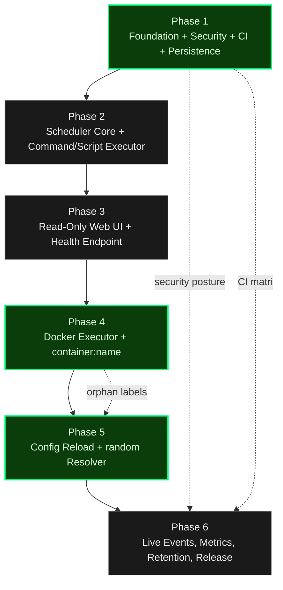

# Roadmap: Cronduit

**Created:** 2026-04-09
**Granularity:** standard (6 phases)
**Core Value:** One tool that both runs recurrent jobs reliably AND makes their state observable through a web UI.

> Source documents: `docs/SPEC.md`, `.planning/PROJECT.md`, `.planning/REQUIREMENTS.md` (86 v1 requirements), `.planning/research/SUMMARY.md`, `.planning/research/ARCHITECTURE.md`, `.planning/research/PITFALLS.md`.

## Overview

Cronduit is built in six sequential phases that move from a secure, CI-gated, persistence-ready skeleton through the scheduler core, a read-only observability UI, the Docker executor (the marquee differentiator), the `@random` resolver and config reload safety layer, and finally the live-events / release-engineering layer that makes it shippable as public OSS. Security posture and CI matrix are established in Phase 1 and carried through every subsequent phase — they are not a "Phase 6 polish" item. Tests accompany each phase; no phase is "testing only."

Phases 1-3 deliver a usable-but-incomplete homelab binary (command/script jobs with a real UI). Phase 4 unlocks the marquee Docker-native story including `network = "container:<name>"`. Phase 5 unlocks the second differentiator (`@random`) and the production-grade config reload loop. Phase 6 turns it into something an outside adopter can clone, trust, and deploy.

## Phase Dependency Diagram

## Phases

**Phase Numbering:**
- Integer phases (1-6): Planned v1 milestone work
- Decimal phases (e.g., 2.1): Reserved for urgent insertions via `/gsd-insert-phase`

- [ ] **Phase 1: Foundation, Security Posture & Persistence Base** - Secure-by-default Rust skeleton, CI matrix, TOML config parser, dual-backend migrations, dual-pool SQLite, threat model document
- [ ] **Phase 2: Scheduler Core & Command/Script Executor** - Hand-rolled tokio scheduler loop with DST-correct croner, command/script backends, bounded log pipeline, graceful shutdown
- [ ] **Phase 3: Read-Only Web UI & Health Endpoint** - Terminal-green askama_web + HTMX dashboard, job/run detail pages, Run Now, `/health`, log XSS hardening
- [ ] **Phase 4: Docker Executor & container-network Differentiator** - bollard-based ephemeral containers, all network modes, `container:<name>` pre-flight, startup orphan reconciliation, testcontainers integration tests
- [ ] **Phase 5: Config Reload & `@random` Resolver** - SIGHUP / API / file-watch reload, slot-based `@random` algorithm, feasibility checking, UI surfacing of resolutions
- [ ] **Phase 6: Live Events, Metrics, Retention & Release Engineering** - SSE log tail, Prometheus metrics, retention pruner, multi-arch Docker image, complete `THREAT_MODEL.md`, README quickstart

## Phase Details

### Phase 1: Foundation, Security Posture & Persistence Base

**Goal**: A secure-by-default Rust binary that parses a TOML config, creates and migrates the database on both SQLite and PostgreSQL, validates configs with `cronduit check`, and runs under a green CI matrix on both architectures — establishing every foundational decision that later phases will depend on.

**Depends on**: Nothing (first phase)

**Requirements**: FOUND-01, FOUND-02, FOUND-03, FOUND-04, FOUND-05, FOUND-06, FOUND-07, FOUND-08, FOUND-09, FOUND-10, FOUND-11, CONF-01, CONF-02, CONF-03, CONF-04, CONF-05, CONF-06, CONF-07, CONF-08, CONF-09, CONF-10, DB-01, DB-02, DB-03, DB-04, DB-05, DB-06, DB-07, OPS-03

**Success Criteria** (what must be TRUE):
  1. An operator can run `cronduit --config test.toml` against a fresh SQLite or Postgres URL and the process loads the config, runs migrations, upserts jobs, emits a structured JSON startup summary, and exits cleanly (FOUND-01..04, DB-01..04, CONF-01..10).
  2. `cronduit check config.toml` validates parse + cron expressions + network-mode syntax + env-var expansion and exits non-zero with line-numbered errors on any failure, without touching the database (FOUND-03, CONF-05, CONF-10).
  3. On startup, a non-loopback `[server].bind` produces a loud WARN log explaining the no-auth-in-v1 stance; the default bind is `127.0.0.1:8080`; `SecretString` fields render `[redacted]` in any Debug output (OPS-03, FOUND-05).
  4. Every PR runs the CI matrix (`linux/amd64` + `linux/arm64` × SQLite + Postgres) with `cargo fmt --check`, `cargo clippy -D warnings`, `cargo test`, `cargo tree -i openssl-sys` (must return empty), and a multi-arch Docker image built via `cargo-zigbuild`; every check is green before merge (FOUND-06, FOUND-07, FOUND-08, FOUND-09).
  5. `README.md` leads with a SECURITY section and `THREAT_MODEL.md` exists as at least a skeleton document; every diagram in repository docs is authored as a mermaid code block (FOUND-10, FOUND-11).

**Pitfalls addressed** (from `.planning/research/PITFALLS.md`):
- Pitfall 1 (Docker socket is root-equivalent): default loopback bind, loud warning, `THREAT_MODEL.md` skeleton.
- Pitfall 7 (SQLite write contention): separate read/write pools + WAL + `busy_timeout=5000` established from day one (DB-05).
- Pitfall 8 (SQLite/Postgres schema parity): dual migration directories + CI matrix covers both backends (DB-02, FOUND-08).
- Pitfall 14 (cross-compile breaks on OpenSSL): rustls-only dependency tree enforced by `cargo tree -i openssl-sys` CI check (FOUND-06).
- Pitfall 15 (zero-config surprises): startup summary log enumerates bind, db, timezone, config path, job count.
- Pitfall 18 (secrets leak into errors): `SecretString` newtype from day one (FOUND-05).
- Pitfall 20 (config format creep): TOML is locked, no YAML/JSON/INI code paths exist.

**Plans**: 9 plans (5 waves + 1 gap closure)

Plans:
- [x] 01-01-PLAN.md — Workspace scaffold: Cargo.toml, rust-toolchain.toml, src/ module skeleton, clap CLI stubs, tracing init, graceful shutdown, axum placeholder (Wave 1)
- [x] 01-02-PLAN.md — TOML config parsing: SecretString wiring, ${VAR} interpolation, GCC-style errors, IANA timezone + network mode validators, SHA-256 config_hash, 9 fixtures + integration tests (Wave 2)
- [x] 01-03-PLAN.md — `cronduit check` subcommand: wire parse_and_validate, GCC-style error printer, collect-all exit codes, black-box tests (no DB, no secret leak) (Wave 3)
- [x] 01-04-PLAN.md — DbPool enum: split SQLite read/write pools (WAL + busy_timeout), Postgres pool, initial migrations for both backends, full boot flow + cronduit.startup event + bind warning, pragma/idempotency/startup-event/graceful-shutdown tests (Wave 3)
- [x] 01-05-PLAN.md — Schema parity test: testcontainers Postgres + introspection + normalization whitelist + structured diff; DbPool Postgres smoke test (Wave 4)
- [x] 01-06-PLAN.md — justfile with all D-11 recipes + `just openssl-check` Pitfall 14 guard (Wave 2)
- [x] 01-07-PLAN.md — `.github/workflows/ci.yml` (lint + 4-cell test matrix + image jobs, all steps call `just`) + multi-stage Dockerfile with cargo-zigbuild → distroless/static nonroot (Wave 5)
- [x] 01-08-PLAN.md — README.md with SECURITY as first H2, THREAT_MODEL.md STRIDE skeleton, examples/cronduit.toml canonical config (Wave 2)
- [x] 01-09-PLAN.md — Gap closure: croner dependency + cron schedule validation in validate.rs + invalid-schedule fixture + tests (Wave 1, gap closure)

---

### Phase 2: Scheduler Core & Command/Script Executor

**Goal**: A hand-rolled tokio scheduler loop that fires jobs on their cron schedule in the configured timezone, executes local command and script backends, captures stdout/stderr through a bounded log pipeline into the DB, and drains cleanly on SIGINT/SIGTERM — all without Docker or a UI.

**Depends on**: Phase 1

**Requirements**: SCHED-01, SCHED-02, SCHED-03, SCHED-04, SCHED-05, SCHED-06, SCHED-07, EXEC-01, EXEC-02, EXEC-03, EXEC-04, EXEC-05, EXEC-06

**Success Criteria** (what must be TRUE):
  1. A `command`-type job scheduled at `*/1 * * * *` fires every minute in the configured timezone, executes via `tokio::process::Command`, and its stdout/stderr lines land in `job_logs` with correct `stream` tags and preserved ordering (SCHED-01, SCHED-02, EXEC-01, EXEC-03).
  2. A `script`-type job declared via `script = """..."""` writes its body to a tempfile with the configured shebang, executes, and its exit code + logs are recorded; a successful run is `status='success' exit_code=0`, a non-zero exit is `status='failed' exit_code=<n>`, and a per-job timeout produces `status='timeout'` with the partial logs preserved (EXEC-02, EXEC-06, SCHED-05).
  3. DST regression tests (spring-forward and fall-back on frozen clocks) pass for at least one representative timezone; wall-clock jumps larger than 2 minutes emit WARN-level log lines and do not silently drop missed fires (SCHED-02, SCHED-03).
  4. Pressing Ctrl+C (SIGINT) stops accepting new fires, waits up to `[server].shutdown_grace = "30s"` for in-flight runs, then closes pools and exits with code 0; a second SIGTERM kills immediately (SCHED-07).
  5. The log pipeline uses a bounded channel (256 lines) with tail-sampling drop policy and inserts a `[truncated N lines]` marker in `job_logs` on overflow; lines longer than 16 KB are truncated with a marker (EXEC-04, EXEC-05).
  6. Concurrent runs of the same job are allowed and each writes a separate `job_runs` row; `trigger` is set to `scheduled` for cron fires (SCHED-04, SCHED-06).

**Pitfalls addressed** (from PITFALLS.md):
- Pitfall 4 (log back-pressure): bounded channel + tail-sampling + DB-writer decoupled from any future broadcast bus (EXEC-04, EXEC-05).
- Pitfall 5 (DST handling): croner 3.0 + explicit `[server].timezone` + UTC storage + regression tests (SCHED-02, SCHED-03, CONF-08).
- Pitfall 19 (graceful shutdown timeout): configurable `shutdown_grace`, progress logging, second-SIGTERM immediate kill (SCHED-07).
- Pitfall 22 (scheduler clock drift): wall-clock scheduling (not monotonic sleep), >2min clock-jump detection (SCHED-03).

**Plans**: TBD

---

### Phase 3: Read-Only Web UI & Health Endpoint

**Goal**: A terminal-green, server-rendered, HTMX-polled web UI that displays the job list, job detail, run detail, and settings/status pages; a working "Run Now" button that goes through the scheduler; and a `GET /health` endpoint — all with log content rendered safely and the design system applied.

**Depends on**: Phase 2 (scheduler must produce runs and logs before a UI can render them)

**Requirements**: UI-01, UI-02, UI-03, UI-04, UI-05, UI-06, UI-07, UI-08, UI-09, UI-10, UI-11, UI-12, UI-13, UI-15, OPS-01

**Success Criteria** (what must be TRUE):
  1. An operator opens `http://127.0.0.1:8080` and sees a Dashboard listing every enabled job with name, raw schedule, resolved schedule, next fire time, last-run status badge, and last-run timestamp; the table auto-refreshes every 3 seconds via an HTMX partial swap (UI-01, UI-06, UI-07).
  2. Clicking a job opens the Job Detail page showing the full resolved config, the human-readable cron description from croner, and a paginated run history; clicking a run opens the Run Detail page showing metadata and the full captured logs with stdout/stderr distinction and ANSI color codes parsed into sanitized HTML spans (UI-08, UI-09).
  3. A Run Now button on each job triggers `POST /api/jobs/:id/run`, the manual run is recorded with `trigger='manual'` by going through the scheduler (not bypassing it), and the run appears on the next dashboard poll (UI-12).
  4. An XSS test in CI asserts that log content containing `` and SGR escape sequences renders as escaped text with only the ANSI transformation applied; no log content path uses `| safe` / `PreEscaped` (UI-10).
  5. A Settings/Status page shows scheduler uptime, DB connection status, config file path, last successful reload time, and Cronduit version; `GET /health` returns `{"status":"ok","db":"ok","scheduler":"running"}` (UI-11, OPS-01).
  6. Every page matches the `design/DESIGN_SYSTEM.md` terminal-green palette, monospace typography, and dark/light token set; Tailwind is built at compile time via the standalone binary (no Node); HTMX is vendored locally (no CDN); all assets are embedded via `rust-embed`; state-changing endpoints require a CSRF token (UI-02, UI-03, UI-04, UI-05, UI-13, UI-15).

**Pitfalls addressed** (from PITFALLS.md):
- Pitfall 13 (log XSS / ANSI / binary rendering): always HTML-escape, ANSI server-side only, XSS test in CI (UI-10).
- Pitfall 16 (Run Now bypasses scheduler semantics): manual runs go through the scheduler's `SchedulerCmd::RunNow` path and are recorded with `trigger='manual'` (UI-12).
- Pitfall 23 (rust-embed hot reload / binary size): debug-mode disk read, compile-time Tailwind build, binary size check in CI.

**UI hint**: yes

**Plans**: 6 plans (4 waves)

Plans:
- [x] 03-01-PLAN.md — Asset pipeline + Cargo deps + design system CSS + base template + rust-embed (Wave 1)
- [x] 03-02-PLAN.md — DB read queries (dashboard, run history, log pagination) + SchedulerCmd channel + health endpoint + AppState extension (Wave 1)
- [x] 03-03-PLAN.md — Dashboard page handler + HTMX polling table partial + filter/sort + empty state (Wave 2)
- [x] 03-04-PLAN.md — Job Detail + Run Detail + Settings pages + ANSI log rendering + pagination partials (Wave 3)
- [x] 03-05-PLAN.md — CSRF double-submit cookie + Run Now POST endpoint + toast notification (Wave 3)
- [x] 03-06-PLAN.md — XSS log safety CI test + health endpoint integration test (Wave 4)

---

### Phase 4: Docker Executor & container-network Differentiator

**Goal**: The headline feature: ephemeral Docker container jobs via `bollard` with full support for every network mode including `container:<name>`, structured pre-flight failures, correct `wait_container` + explicit-remove sequencing, image auto-pull with retry, per-container labeling, and startup orphan reconciliation — validated by a testcontainers integration test of the `container:<name>` path.

**Depends on**: Phase 3 (existing UI validates that run status, logs, and metadata render correctly before Docker complexity is added)

**Requirements**: DOCKER-01, DOCKER-02, DOCKER-03, DOCKER-04, DOCKER-05, DOCKER-06, DOCKER-07, DOCKER-08, DOCKER-09, DOCKER-10, SCHED-08

**Success Criteria** (what must be TRUE):
  1. A `docker`-type job declared via `image = "..."` spawns an ephemeral container through bollard with `auto_remove=false`, streams logs concurrently with `wait_container`, persists the exit code BEFORE calling `remove_container`, and records the image digest on the run row — a container that exits in under 50 ms has its exit code reliably captured across 100 repeated runs (DOCKER-01, DOCKER-06, DOCKER-08, DOCKER-09).
  2. All five network modes (`bridge`, `host`, `none`, named network, `container:<name>`) are exercised by the parser, executor, and an integration test; the `container:<name>` test uses `testcontainers` to bring up a target container and schedule a dependent Cronduit job against it (DOCKER-02, DOCKER-10).
  3. Starting a `network = "container:<name>"` job when the target container is not `running` records a run with `error_message='network_target_unavailable: <name>'` (not Docker's raw error) and does not bubble a raw bollard error to the UI (DOCKER-03).
  4. Image auto-pull retries failures with exponential backoff (3 attempts), distinguishes retryable network/timeout failures from terminal `manifest unknown` / `unauthorized` failures, and records the failure reason as a structured error on the run row (DOCKER-05).
  5. Every spawned container is labeled `cronduit.run_id=<id>` and `cronduit.job_name=<name>`; volume mounts, env vars, custom `container_name`, and per-job `timeout` are all honored (DOCKER-04, DOCKER-07).
  6. On startup, any container matching `cronduit.run_id=*` whose `run_id` corresponds to a `job_runs` row still in `status='running'` is reconciled (marked `status='error'` with `error_message='orphaned at restart'`); no orphan containers leak across restarts (SCHED-08).

**Pitfalls addressed** (from PITFALLS.md):
- Pitfall 2 (`container:<name>` silent break): pre-flight inspect + structured failure + distinct metric reason (DOCKER-03).
- Pitfall 3 (`wait_container` vs `auto_remove` race): explicit `auto_remove=false`, state machine `Creating->Starting->Running->Exited->LogsDrained->Removed`, exit-code persisted before remove (DOCKER-06).
- Pitfall 10 (orphan containers after restart): every container labeled with `run_id`, reconciliation at boot, DB rows resolved (DOCKER-07, SCHED-08).
- Pitfall 12 (image pull failure handling): exponential backoff + classification + distinct metric reason (DOCKER-05).
- Pitfall 21 (`type = "command"` means inside-the-container): documented in README + surfaced in `cronduit check` hints.

**Plans**: TBD

---

### Phase 5: Config Reload & `@random` Resolver

**Goal**: Production-grade config reload via SIGHUP / `POST /api/reload` / debounced file-watch, the slot-based `@random` algorithm with feasibility checks and daily re-roll cadence, and the UI surfaces that make resolved schedules visible — addressing the two highest-risk / highest-novelty features together because they share the same reload lifecycle.

**Depends on**: Phase 4 (the Docker executor must be solid before layering the reload safety net and the random resolver on top, because reload must not cancel in-flight container runs)

**Requirements**: RELOAD-01, RELOAD-02, RELOAD-03, RELOAD-04, RELOAD-05, RELOAD-06, RELOAD-07, RAND-01, RAND-02, RAND-03, RAND-04, RAND-05, RAND-06

**Success Criteria** (what must be TRUE):
  1. Editing the config file triggers a debounced (500 ms) reload that parses to a staging structure, diffs against the DB by `config_hash`, creates new jobs, updates changed jobs, disables removed jobs (history preserved), and leaves in-flight runs untouched; SIGHUP and `POST /api/reload` share the same `do_reload()` code path; a reload that fails to parse leaves the running config untouched and surfaces the error via API, log, and UI (RELOAD-01..07).
  2. A job with `schedule = "@random 14 * * *"` is resolved once at sync time, the concrete value persisted to `jobs.resolved_schedule`, and remains stable across process restarts and config reloads as long as the raw `schedule` field is unchanged; a schedule-field edit triggers re-randomization (RAND-01, RAND-02, RAND-03).
  3. `[server].random_min_gap = "90m"` guarantees a minimum spacing between randomized jobs' fire times on the same day via a slot-based algorithm; a mathematically infeasible gap (e.g., 20 jobs x 90 min > 24 h) logs a WARN at startup, relaxes the gap for overflow jobs, and continues booting — Cronduit never fails to start because of an infeasible random config (RAND-04, RAND-05).
  4. The Job Detail page shows both the raw `schedule` and the `resolved_schedule`, clearly labeled (e.g., "Schedule: `@random` (today resolved to `14 17 * * *`)"); dashboard badges distinguish `@random` jobs from fixed-schedule jobs (RAND-06).
  5. An integration test exercises: (a) edit config -> SIGHUP -> new jobs appear, removed jobs go `enabled=false`, (b) reload during an in-flight run does not cancel the run, (c) `resolved_schedule` is retained for unchanged random jobs across a reload.

**Pitfalls addressed** (from PITFALLS.md):
- Pitfall 6 (`@random` invisible state and infeasible gap): persisted `resolved_schedule`, daily-cadence re-roll, slot algorithm, feasibility check, UI surfacing, structured log events.
- Pitfall 9 (non-atomic config reload): 500 ms debounce, staging parse, atomic apply under lock, in-flight runs not cancelled.
- Pitfall 16 (Run Now idempotency under reload): manual runs go through scheduler; idempotency token scoped correctly.

**Plans**: 5 plans (3 waves)

Plans:
- [x] 05-01-PLAN.md — @random resolver module with TDD + SchedulerCmd extension + sync engine wiring (Wave 1)
- [x] 05-02-PLAN.md — Reload infrastructure: do_reload(), SIGHUP handler, file watcher, watch_config (Wave 1)
- [x] 05-03-PLAN.md — Scheduler loop Reload/Reroll branches + reload/reroll API handlers + routes (Wave 2)
- [x] 05-04-PLAN.md — UI surfaces: toast JS update, settings page enhancement, @random badge, job detail resolved schedule + re-roll (Wave 2)
- [x] 05-05-PLAN.md — Integration tests (reload diff, in-flight survival, @random stability) + visual checkpoint (Wave 3)

---

### Phase 6: Live Events, Metrics, Retention & Release Engineering

**Goal**: Turn the feature-complete binary into a shippable public OSS release: SSE log tail for in-progress runs, Prometheus `/metrics` with a bounded-cardinality label set, daily retention pruner, multi-arch Docker image, complete `THREAT_MODEL.md`, and a README quickstart that takes a stranger from `git clone` to a working scheduled job in under 5 minutes.

**Depends on**: Phase 5 (the product is functionally complete after Phase 5; this phase layers observability + release engineering without changing correctness-critical code paths)

**Requirements**: UI-14, OPS-02, OPS-04, OPS-05, DB-08

**Success Criteria** (what must be TRUE):
  1. Opening the Run Detail page of an in-progress run shows log lines streaming in real time via SSE (`GET /events/runs/:id/logs`); completed runs render statically from `job_logs`; slow SSE subscribers drop lines without affecting the DB writer (UI-14).
  2. `GET /metrics` exposes Prometheus text format including `cronduit_jobs_total`, `cronduit_runs_total{status}`, `cronduit_run_duration_seconds` (histogram), and `cronduit_run_failures_total{reason}` where `reason` is the closed enum `image_pull_failed | network_target_unavailable | timeout | exit_nonzero | abandoned | unknown` (no per-`run_id` or unbounded labels) (OPS-02).
  3. A daily retention pruner deletes `job_runs` and `job_logs` older than `[server].log_retention` (default 90 days) in batched transactions with `PRAGMA wal_checkpoint(TRUNCATE)` after large SQLite prunes; no write-contention spikes are observed in logs during pruning (DB-08).
  4. A stranger can clone the repo, run `docker compose up`, and schedule a working job by editing the example config in under 5 minutes; the example `docker-compose.yml` mounts the Docker socket, mounts the config file read-only, uses a named volume for SQLite, and uses `expose:` (not `ports:`) for the web UI (OPS-04, OPS-05).
  5. `THREAT_MODEL.md` is complete (Docker socket model, untrusted-client model, config-tamper model, malicious-image model); the README security section is above the fold; the multi-arch Docker image (amd64 + arm64) builds via `cargo-zigbuild` and publishes on every push to `main`.

**Pitfalls addressed** (from PITFALLS.md):
- Pitfall 1 (Docker socket / security posture): complete `THREAT_MODEL.md`, README security section, `expose:` in compose example.
- Pitfall 4 (log back-pressure, SSE side): SSE subscribers disposable, DB writer authoritative, slow-consumer drop policy.
- Pitfall 11 (retention pruning under load): batched deletes, WAL checkpoint after prune, separate log vs run retention.
- Pitfall 17 (metrics cardinality explosion): closed-enum `reason` label, no `run_id` label, documented scrape guidance.

**Plans**: 5 plans (2 waves)

Plans:
- [x] 06-01-PLAN.md -- SSE log streaming: broadcast channel fan-out + SSE handler + Run Detail template (Wave 1)
- [x] 06-02-PLAN.md -- Prometheus metrics: metrics facade + /metrics endpoint + scheduler instrumentation (Wave 1)
- [x] 06-03-PLAN.md -- Retention pruner: daily batched deletes + WAL checkpoint (Wave 1)
- [x] 06-04-PLAN.md -- Release docs: README quickstart + docker-compose + THREAT_MODEL.md (Wave 2)
- [x] 06-05-PLAN.md -- Release CI: release.yml workflow + git-cliff + OCI labels (Wave 2)

---

## Progress

**Execution Order:** Phases execute in numeric order: 1 -> 2 -> 3 -> 4 -> 5 -> 6

| Phase | Plans Complete | Status | Completed |
|-------|----------------|--------|-----------|
| 1. Foundation, Security Posture & Persistence Base | 0/8 | Planned | - |
| 2. Scheduler Core & Command/Script Executor | 0/TBD | Not started | - |
| 3. Read-Only Web UI & Health Endpoint | 0/6 | Planned | - |
| 4. Docker Executor & container-network Differentiator | 0/TBD | Not started | - |
| 5. Config Reload & `@random` Resolver | 0/5 | Planned | - |
| 6. Live Events, Metrics, Retention & Release Engineering | 0/TBD | Not started | - |

## Coverage Validation

All 86 v1 requirements mapped to exactly one phase. Breakdown:

| Phase | Requirement Count | Categories Touched |
|-------|-------------------|--------------------|
| 1 | 29 | FOUND (11), CONF (10), DB (7 of 8), OPS (1 of 5) |
| 2 | 13 | SCHED (7 of 8), EXEC (6) |
| 3 | 15 | UI (14 of 15), OPS (1 of 5) |
| 4 | 11 | DOCKER (10), SCHED (1 of 8) |
| 5 | 13 | RELOAD (7), RAND (6) |
| 6 | 5 | UI (1 of 15), OPS (3 of 5), DB (1 of 8) |
| **Total** | **86** | **100% coverage** |

---

*Roadmap created: 2026-04-09 — derived from requirements, reconciled against ARCHITECTURE.md Phase A-F and FEATURES.md build order. No requirements orphaned.*
