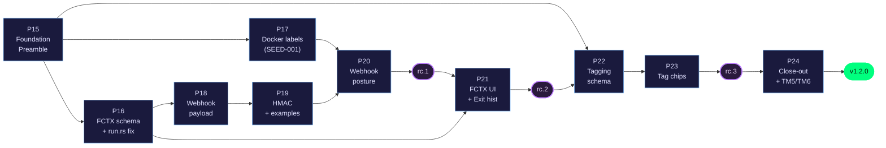

# Project State

## Project Reference

See: `.planning/PROJECT.md` (updated 2026-04-25 — v1.2 milestone kicked off)

**Core value:** One tool that both runs recurrent jobs reliably AND makes their state observable through a web UI.
**Current focus:** Phase 20 — webhook-ssrf-https-posture-retry-drain-metrics-rc-1

## Current Position

Milestone: v1.2 — Operator Integration & Insight (in progress; roadmap created 2026-04-25)
Previous milestone: v1.1 (SHIPPED 2026-04-23, tags `v1.1.0-rc.1` … `v1.1.0-rc.6`, final `v1.1.0`)
Phase: 20 (webhook-ssrf-https-posture-retry-drain-metrics-rc-1) — EXECUTING
Plan: 1 of 9
Status: Executing Phase 20
Last activity: 2026-05-01 -- Phase 20 execution started

Progress: [█████░░░░░] 50% (v1.2: 5/10 phases complete; 33/— plans complete)

## v1.2 Roadmap Summary

10 phases · 41 requirements · 3 rc cuts planned · strict dependency ordering: P15 before P18/P19/P20; P16 before P18+P21; P22 before P23.

## v1.1 Recap (archived)

All 6 phases complete, 6 rc cuts (`rc.1` → `rc.6`), final `v1.1.0` shipped 2026-04-23. Full v1.1 archive: `.planning/milestones/v1.1-ROADMAP.md`, `.planning/milestones/v1.1-REQUIREMENTS.md`.

## v1.0 Recap (archived)

Full v1.0 archive: `.planning/milestones/v1.0-ROADMAP.md`, `.planning/milestones/v1.0-REQUIREMENTS.md`, `.planning/milestones/v1.0-MILESTONE-AUDIT.md`.

## Accumulated Context

### Decisions

All v1.0 and v1.1 decisions live in `.planning/PROJECT.md` § Key Decisions.

**v1.2 decisions inherited from research/requirements (LOCKED):**

- Webhook delivery worker shape: NEW module `src/webhooks/mod.rs` with bounded `tokio::sync::mpsc::channel(1024)` + dedicated worker task. Scheduler emits via `try_send` (NEVER await tx.send).
- HMAC algorithm: SHA-256 ONLY (Standard Webhooks v1 spec). No algorithm-agility.
- Webhook retry: 3 attempts at t=0, t=30s, t=300s with full-jitter (rand 0.8-1.2× multiplier).
- Webhook coalescing: edge-triggered, default fires only on `streak_position == 1`; configurable per-job via `fire_every`.
- Webhook URL validation: HTTPS required for non-loopback/non-RFC1918; HTTP only for local destinations (with WARN).
- Webhook payload: Standard Webhooks v1 spec headers; `payload_version: "v1"` field.
- Webhook reload survival + 30s drain on shutdown.
- Docker labels merge: `use_defaults=false` → replace; otherwise merge with per-job-wins on collision.
- Reserved namespace: `cronduit.*` (validator at config-load).
- Type-gated: labels only on `type="docker"` jobs.
- run.rs:277 bug fix: add `container_id` field to `DockerExecResult`; fix the assignment.
- Failure-context: 5 P1 signals (time + image + config + duration-vs-p50 + scheduler-fire-skew).
- `job_runs.config_hash`: per-run column added (Option A; not `jobs.updated_at` proxy).
- Exit-code: 10-bucket strategy; success as separate stat; stopped distinct from 128-143; last-100-ALL window; NOT exposed as Prometheus label.
- Tagging: `jobs.tags` TEXT JSON column; per-job only (not in `[defaults]`); lowercase+trim normalization; charset regex; substring-collision check; AND filter semantics; untagged-hidden when filter active; URL state via repeated `?tag=`.
- cargo-deny: v1.2 preamble (non-blocking initially; promoted to blocking before final v1.2.0).

### Open questions

None at roadmap level. Phase-plan-level open questions surface during `/gsd-discuss-phase`.

### Pending Todos

- Run `/gsd-discuss-phase 15` to start the first v1.2 phase (Foundation Preamble: Cargo bump + cargo-deny + webhook worker scaffolding).

### Blockers/Concerns

None.

Three Phase 9 UAT items from v1.0 are accepted as deferred to natural post-merge validation per the v1.0 audit verdict — see `.planning/milestones/v1.0-MILESTONE-AUDIT.md` § `deferred_post_merge_observation`. They are NOT blockers for v1.2.

## Deferred Items

Items acknowledged and deferred at v1.1 milestone close on 2026-04-24. All six surfaced by the pre-close open-artifact audit are **false positives** — the underlying work shipped and was validated, but the audit tool's heuristics do not recognize the completion markers in these file shapes. Recorded here for traceability.

| Category | Item | Reason flagged | Actual status |
|----------|------|----------------|---------------|
| uat | 13/HUMAN-UAT.md | audit tool read "0 pending scenarios" as incomplete | Complete — maintainer runbook for rc.2 tag cut; rc.2 cut + verified 2026-04-21 (commits `7e43c1c`, `344263c`) |
| uat | 14/14-08-UAT-RESULTS.md | audit tool read "0 pending scenarios" as incomplete | Complete — documents rc.3 UAT FAIL; rc.4/5/6/final resolved all findings (commits `c4b8267`, `7c5f6dd`, `a49898e`, final `v1.1.0` at `a49898e`) |
| uat | 14/14-HUMAN-UAT.md | audit tool read "0 pending scenarios" as incomplete | Complete — all validation boxes ticked by maintainer at v1.1.0 sign-off (per `14-09-SUMMARY.md` Prerequisites table) |
| verification | 12/12-VERIFICATION.md | front-matter `status: human_needed` | Complete — all three human-needed items (rc.1 tag cut, GHCR post-push verification, compose-smoke green on PR) closed 2026-04-19 |
| quick_task | 260414-gbf-fix-defaults-merge-bug-issue-20-defaults | state file missing under `.planning/quick/` | Complete — archived with v1.0 milestone; recorded in `.planning/milestones/v1.0-MILESTONE-AUDIT.md` |
| quick_task | 260421-nn3-fix-get-dashboard-jobs-postgres-j-enable | state file missing under `.planning/quick/` | Complete — landed in commits `07d81bb`, `7cb1a10`, `7917502`, `3b92a45` (PR #37); logged in Quick Tasks Completed table above |

### Quick Tasks Completed

| ID | Date | Description | Commits | Reference |
|----|------|-------------|---------|-----------|
| 260421-nn3 | 2026-04-22 | Fix `get_dashboard_jobs` Postgres `j.enabled = true` BIGINT bug (queries.rs lines 615 + 628) + add Postgres regression test `tests/dashboard_jobs_pg.rs` mirroring v13_timeline_explain harness. Closes the deferred item logged in Phase 13 plan 06. | `07d81bb`, `7cb1a10`, `7917502` | `.planning/quick/260421-nn3-fix-get-dashboard-jobs-postgres-j-enable/` |

v1.0 quick task `260414-gbf` is archived in `.planning/milestones/v1.0-MILESTONE-AUDIT.md`.

## Session Continuity

Last session: 2026-05-01T17:26:16.264Z
Stopped at: Phase 20 context gathered
Resume command: `/gsd-discuss-phase 20` for Webhook SSRF/HTTPS posture + Retry/Drain + Metrics — rc.1

**Planned Phase:** 20 — Webhook SSRF/HTTPS Posture + Retry/Drain + Metrics — rc.1 (HTTPS-required for non-loopback/non-RFC1918, SSRF guards, retry schedule t=0/30s/300s with full-jitter, 30s drain on shutdown, Prometheus metrics)
