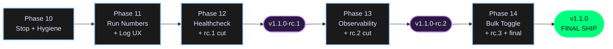

# Project State

## Project Reference

See: `.planning/PROJECT.md` (updated 2026-04-14 — v1.1 milestone kicked off)

**Core value:** One tool that both runs recurrent jobs reliably AND makes their state observable through a web UI.
**Current focus:** Phase 10 — stop-a-running-job-hygiene-preamble

## Current Position

Milestone: v1.1 — Operator Quality of Life
Previous milestone: v1.0 (SHIPPED 2026-04-14, tags `v1.0.0` + `v1.0.1`)
Phase: 10 (stop-a-running-job-hygiene-preamble) — EXECUTING
Plan: 1 of 10
Status: Executing Phase 10
Last activity: 2026-04-15

Progress: [░░░░░░░░░░] 0% (0 of 5 v1.1 phases complete)

## v1.1 Phase Shape

Phase 10 is the first active phase. No phase is currently in-flight.

## v1.0 Recap (archived)

```mermaid
flowchart LR
    P1[Phase 1<br/>Foundation] --> P2[Phase 2<br/>Scheduler]
    P2 --> P3[Phase 3<br/>Web UI]
    P3 --> P4[Phase 4<br/>Docker Executor]
    P4 --> P5[Phase 5<br/>Reload + random]
    P5 --> P6[Phase 6<br/>Release Engineering]
    P6 --> P7[Phase 7<br/>Cleanup]
    P7 --> P8[Phase 8<br/>Human UAT]
    P8 --> P9[Phase 9<br/>CI/CD]
    P9 --> SHIP([v1.0.1 SHIPPED])

    classDef done fill:#0a3d0a,stroke:#00ff7f,stroke-width:2px,color:#e0ffe0
    classDef ship fill:#00ff7f,stroke:#00ff7f,stroke-width:3px,color:#0a1a0a
    class P1,P2,P3,P4,P5,P6,P7,P8,P9 done
    class SHIP ship
```

Full v1.0 archive: `.planning/milestones/v1.0-ROADMAP.md`, `.planning/milestones/v1.0-REQUIREMENTS.md`, `.planning/milestones/v1.0-MILESTONE-AUDIT.md`.

## Accumulated Context

### Decisions

All v1.0 decisions remain in `.planning/PROJECT.md` § Key Decisions. v1.1 scoping decisions (recorded 2026-04-14):

- **Shape A: "Polish then expand"** — v1.1 is operator quality-of-life only. Net-new feature surface (webhooks, concurrency/queuing) deferred to v1.2.
- **Iterative rc releases** — `v1.1.0-rc.N` cut at chunky checkpoints (after each functional block: bug fixes → observability → ergonomics). `:latest` GHCR tag stays at `v1.0.1` until final `v1.1.0`. Tag format uses semver pre-release notation (`v1.1.0-rc.1`, not `v1.1.0-rc1`).
- **Phase numbering continues** — v1.1 starts at Phase 10 (v1.0 ended at Phase 9). No reset.
- **Five phases, three rcs** — Phases 10–12 ship as rc.1, Phase 13 ships as rc.2, Phase 14 ships as rc.3 then is promoted to final v1.1.0. The rc tag is cut at the end of Phase 12, Phase 13, and Phase 14 respectively.
- **Out of Scope reshuffled** — webhook notifications and job queuing/concurrency moved from "Out of Scope" to "Future Requirements (v1.2)" because Shape A's premise is that those capabilities *are* coming, just not this milestone. Email notifications remain fully out of scope.
- **Bulk-disable design resolved** — `jobs.enabled_override` nullable tri-state column (NULL/0/1); `upsert_job` does NOT touch it; `disable_missing_jobs` clears it. Locked in Phase 14 details; no re-discussion needed at phase-plan time.
- **Log dedupe design deferred** — Option A (insert-then-broadcast with `RETURNING id`) vs Option B (monotonic `seq: u64`) must be picked in Phase 11's PLAN.md before implementation. Recommendation: Option A with latency benchmark.

### Open questions for phase plans

1. **Phase 10:** Merge `running_handles` into `active_runs` as a single `RunEntry { broadcast_tx, control }` map, or keep separate? (SUMMARY.md § Open Questions #2)
2. **Phase 11:** Option A vs Option B for log-line id propagation. (SUMMARY.md § Open Questions #1)
3. **Phase 12:** Reproduce the `(unhealthy)` root cause before declaring the fix complete. (SUMMARY.md § Open Questions #3)

### Pending Todos

- `/gsd-plan-phase 10` — next step; decomposes Phase 10 (Stop-a-Job + hygiene preamble) into plans.
- Create feature branch `gsd/phase-10-stop-a-job` (or similar) before landing any Phase 10 commits. All v1.1 work lands via PR on feature branches — no direct commits to `main`.

### Blockers/Concerns

None.

Three Phase 9 UAT items from v1.0 are accepted as deferred to natural post-merge validation per the v1.0 audit verdict — see `.planning/milestones/v1.0-MILESTONE-AUDIT.md` § `deferred_post_merge_observation`. They are NOT blockers for v1.1.

### Quick Tasks Completed

_(None during v1.1 so far. v1.0 quick task `260414-gbf` is archived in `.planning/milestones/v1.0-MILESTONE-AUDIT.md`.)_

## Session Continuity

Last session: 2026-04-16T21:01:58.506Z
Stopped at: Phase 11 context gathered
Resume command: `/gsd-plan-phase 10` — decomposes Stop-a-Running-Job + hygiene preamble into executable plans. Recommended to do the Stop spike (validate `RunControl` + `StopReason::Operator` round-trip on all three executors) as the first plan in Phase 10.

Last activity: 2026-04-14 — v1.1 roadmap created (5 phases, 3 rcs)
