# Project State

## Project Reference

See: `.planning/PROJECT.md` (updated 2026-04-25 — v1.2 milestone kicked off)

**Core value:** One tool that both runs recurrent jobs reliably AND makes their state observable through a web UI.
**Current focus:** v1.2 — Operator Integration & Insight. Defining requirements; phase numbering continues from v1.1 (last phase 14) → v1.2 starts at Phase 15.

## Current Position

Milestone: v1.2 — Operator Integration & Insight (in progress; kicked off 2026-04-25)
Previous milestone: v1.1 (SHIPPED 2026-04-23, tags `v1.1.0-rc.1` … `v1.1.0-rc.6`, final `v1.1.0`)
Phase: Not started — defining requirements
Plan: —
Status: Defining requirements (post-questioning, pre-research-decision)
Last activity: 2026-04-25 -- v1.2 scope confirmed: 5 features in scope (webhooks, failure context, exit-code histogram, tagging, docker labels); log search + concurrency moved to v1.3 candidate list

Progress: [░░░░░░░░░░] 0% (v1.2: requirements definition not yet started)

## v1.1 Recap (archived)

```mermaid
flowchart LR
    P10["Phase 10<br/>Stop + Hygiene"] --> P11["Phase 11<br/>Run Numbers<br/>+ Log UX"]
    P11 --> P12["Phase 12<br/>Healthcheck<br/>+ rc.1 cut"]
    P12 --> RC1(["v1.1.0-rc.1"])
    RC1 --> P121["Phase 12.1<br/>GHCR tag hygiene<br/>(INSERTED)"]
    P121 --> P13["Phase 13<br/>Observability<br/>+ rc.2 cut"]
    P13 --> RC2(["v1.1.0-rc.2"])
    RC2 --> P14["Phase 14<br/>Bulk Toggle<br/>+ rc.3..rc.6"]
    P14 --> SHIP(["v1.1.0<br/>SHIPPED"])

    classDef done fill:#0a3d0a,stroke:#00ff7f,stroke-width:2px,color:#e0ffe0
    classDef inserted fill:#3d2a1a,stroke:#ffbf7f,stroke-width:2px,color:#ffe0c0
    classDef rc fill:#2a1a3d,stroke:#bf7fff,stroke-width:2px,color:#f0e0ff
    classDef ship fill:#00ff7f,stroke:#00ff7f,stroke-width:3px,color:#0a1a0a
    class P10,P11,P12,P13,P14,P121 done
    class RC1,RC2 rc
    class SHIP ship
```

All 6 phases complete, 6 rc cuts (`rc.1` → `rc.6`), final `v1.1.0` shipped 2026-04-23. Full v1.1 archive: `.planning/milestones/v1.1-ROADMAP.md`, `.planning/milestones/v1.1-REQUIREMENTS.md`.

## v1.0 Recap (archived)

Full v1.0 archive: `.planning/milestones/v1.0-ROADMAP.md`, `.planning/milestones/v1.0-REQUIREMENTS.md`, `.planning/milestones/v1.0-MILESTONE-AUDIT.md`.

## Accumulated Context

### Decisions

All v1.0 and v1.1 decisions live in `.planning/PROJECT.md` § Key Decisions. The v1.1-era decisions (RunControl abstraction vs `kill_on_drop`, dedicated `jobs.next_run_number` counter, three-file tightening migration shape, Option A log dedupe, `/timeline` single-SQL query, Rust-side percentile, `jobs.enabled_override` tri-state, `cronduit health` CLI + Dockerfile HEALTHCHECK, release.yml D-10 rc-tag gating, D-13 maintainer-action tag cuts, six-tag GHCR contract, `:main` floating tag, retroactive `:latest` retag, UAT-driven rc loop, Tailwind v3 → v4 migration) are all captured there.

### Open questions

None. All phase-plan open questions (Phase 10 `active_runs` merge, Phase 11 log-id Option A vs B, Phase 12 `(unhealthy)` root-cause reproduction) were resolved during their respective phase plans.

### Pending Todos

- Continue `/gsd-new-milestone` workflow: research decision (Step 8) → requirements definition (Step 9) → roadmap creation (Step 10).
- After roadmap is approved, run `/gsd-discuss-phase 15` to start the first v1.2 phase.

### Blockers/Concerns

None.

Three Phase 9 UAT items from v1.0 are accepted as deferred to natural post-merge validation per the v1.0 audit verdict — see `.planning/milestones/v1.0-MILESTONE-AUDIT.md` § `deferred_post_merge_observation`. They are NOT blockers for v1.1.

## Deferred Items

Items acknowledged and deferred at v1.1 milestone close on 2026-04-24. All six surfaced by the pre-close open-artifact audit are **false positives** — the underlying work shipped and was validated, but the audit tool's heuristics do not recognize the completion markers in these file shapes. Recorded here for traceability.

| Category | Item | Reason flagged | Actual status |
|----------|------|----------------|---------------|
| uat | 13/HUMAN-UAT.md | audit tool read "0 pending scenarios" as incomplete | Complete — maintainer runbook for rc.2 tag cut; rc.2 cut + verified 2026-04-21 (commits `7e43c1c`, `344263c`) |
| uat | 14/14-08-UAT-RESULTS.md | audit tool read "0 pending scenarios" as incomplete | Complete — documents rc.3 UAT FAIL; rc.4/5/6/final resolved all findings (commits `c4b8267`, `7c5f6dd`, `a49898e`, final `v1.1.0` at `a49898e`) |
| uat | 14/14-HUMAN-UAT.md | audit tool read "0 pending scenarios" as incomplete | Complete — all validation boxes ticked by maintainer at v1.1.0 sign-off (per `14-09-SUMMARY.md` Prerequisites table) |
| verification | 12/12-VERIFICATION.md | front-matter `status: human_needed` | Complete — all three human-needed items (rc.1 tag cut, GHCR post-push verification, compose-smoke green on PR) closed 2026-04-19 |
| quick_task | 260414-gbf-fix-defaults-merge-bug-issue-20-defaults | state file missing under `.planning/quick/` | Complete — archived with v1.0 milestone; recorded in `.planning/milestones/v1.0-MILESTONE-AUDIT.md` |
| quick_task | 260421-nn3-fix-get-dashboard-jobs-postgres-j-enable | state file missing under `.planning/quick/` | Complete — landed in commits `07d81bb`, `7cb1a10`, `7917502`, `3b92a45` (PR #37); logged in Quick Tasks Completed table above |

### Quick Tasks Completed

| ID | Date | Description | Commits | Reference |
|----|------|-------------|---------|-----------|
| 260421-nn3 | 2026-04-22 | Fix `get_dashboard_jobs` Postgres `j.enabled = true` BIGINT bug (queries.rs lines 615 + 628) + add Postgres regression test `tests/dashboard_jobs_pg.rs` mirroring v13_timeline_explain harness. Closes the deferred item logged in Phase 13 plan 06. | `07d81bb`, `7cb1a10`, `7917502` | `.planning/quick/260421-nn3-fix-get-dashboard-jobs-postgres-j-enable/` |

v1.0 quick task `260414-gbf` is archived in `.planning/milestones/v1.0-MILESTONE-AUDIT.md`.

## Session Continuity

Last session: 2026-04-25 — `/gsd-new-milestone` v1.2 kickoff in progress
Stopped at: v1.2 scope confirmed and PROJECT.md updated; STATE.md reset to defining; v1.1 phase directories archived to `.planning/milestones/v1.1-phases/`. Next gates: research decision, then requirements definition, then roadmap creation.
Resume command: continue `/gsd-new-milestone` (research decision is the next user gate).

**Planned Phase:** 15 (first v1.2 phase) — TBD by roadmapper

Last activity: 2026-04-24 — milestone-close archives written (`.planning/milestones/v1.1-ROADMAP.md`, `.planning/milestones/v1.1-REQUIREMENTS.md`), `.planning/MILESTONES.md` v1.1 entry inserted, PROJECT.md current-state advanced to post-v1.1, ROADMAP.md collapsed into milestone groupings, RETROSPECTIVE.md v1.1 section appended with cross-milestone trends.

**Planned Phase:** none — milestone boundary.
