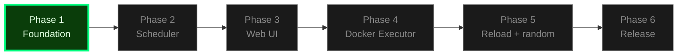

# Project State

## Project Reference

See: `.planning/PROJECT.md` (updated 2026-04-09 after research synthesis)

**Core value:** One tool that both runs recurrent jobs reliably AND makes their state observable through a web UI.
**Current focus:** Phase 06 — live-events-metrics-retention-release-engineering

## Current Position

Phase: 06 (live-events-metrics-retention-release-engineering) — EXECUTING
Plan: 5 of 5
Status: Phase complete — ready for verification
Last activity: 2026-04-12

Progress: [░░░░░░░░░░] 0%

## Performance Metrics

**Velocity:**

- Total plans completed: 28
- Average duration: —
- Total execution time: —

**By Phase:**

| Phase | Plans | Total | Avg/Plan |
|-------|-------|-------|----------|
| — | — | — | — |
| 01 | 9 | - | - |
| 02 | 4 | - | - |
| 03 | 6 | - | - |
| 04 | 4 | - | - |
| 05 | 5 | - | - |

**Recent Trend:**

- No plans executed yet.

*Updated after each plan completion.*
| Phase 06 P01 | 21min | 4 tasks | 15 files |
| Phase 06 P02 | 11min | 3 tasks | 11 files |
| Phase 06 P03 | 3min | 2 tasks | 5 files |
| Phase 06 P05 | 2min | 1 tasks | 4 files |
| Phase 06 P04 | 5min | 2 tasks | 4 files |

## Accumulated Context

### Decisions

Decisions are logged in `.planning/PROJECT.md` Key Decisions table. Recent settled decisions affecting Phase 1:

- **Phase 1:** TOML locked as config format (`serde-yaml` archived; YAML hostile for cron `*`/`@random` quoting).
- **Phase 1:** `croner` 3.0 locked for cron parsing (DST-aware, `L`/`#`/`W` modifiers, human-readable descriptions).
- **Phase 1:** `askama_web` 0.15 with `axum-0.8` feature (NOT the deprecated `askama_axum`).
- **Phase 1:** Rustls everywhere; `cargo tree -i openssl-sys` must return empty; CI enforces.
- **Phase 1:** Default bind `127.0.0.1:8080`; loud startup warning on non-loopback; web UI auth deferred to v2.
- **Phase 1:** Separate read/write SQLite pools (WAL + `busy_timeout=5000`); dual migration directories for SQLite + Postgres.
- **Phase 1:** CI matrix (`linux/amd64 + linux/arm64 × SQLite + Postgres`) required from day one via `cargo-zigbuild`.
- **Phase 1:** All diagrams authored as mermaid code blocks; no ASCII art anywhere in project artifacts.
- **Phase 1:** All changes land via PR on a feature branch; no direct commits to `main`.
- [Phase 06]: Broadcast channel capacity 256 per active run, publish in log_writer_task alongside DB inserts
- [Phase 06]: HTMX SSE extension vendored at v2.2.2 for offline homelab compatibility
- [Phase 06]: Metrics facade with PrometheusBuilder, closed-enum FailureReason for cardinality control
- [Phase 06]: Retention pruner uses pool.writer() accessor, fires 24h from startup, tracing target cronduit.retention
- [Phase 06]: Release workflow uses docker/build-push-action@v6 directly for GHA cache integration, not justfile
- [Phase 06]: README SECURITY-first structure with 3-step quickstart, THREAT_MODEL with four models

### Pending Todos

None yet. Capture ideas via `/gsd-add-todo`.

### Blockers/Concerns

None yet. Known gaps from research synthesis (`.planning/research/SUMMARY.md` § Gaps to Address) to resolve during phase planning:

- `@random` mixed-field edge cases (Phase 5 planning).
- Renamed-job semantics (Phase 1 planning — decide at sync-engine design).
- Log viewer pagination UX (Phase 3 planning).
- "Running" state recovery label (Phase 3 planning — affects run history rendering).

## Session Continuity

Last session: 2026-04-12T22:19:01.528Z
Stopped at: Completed 06-04-PLAN.md
Resume file: None
