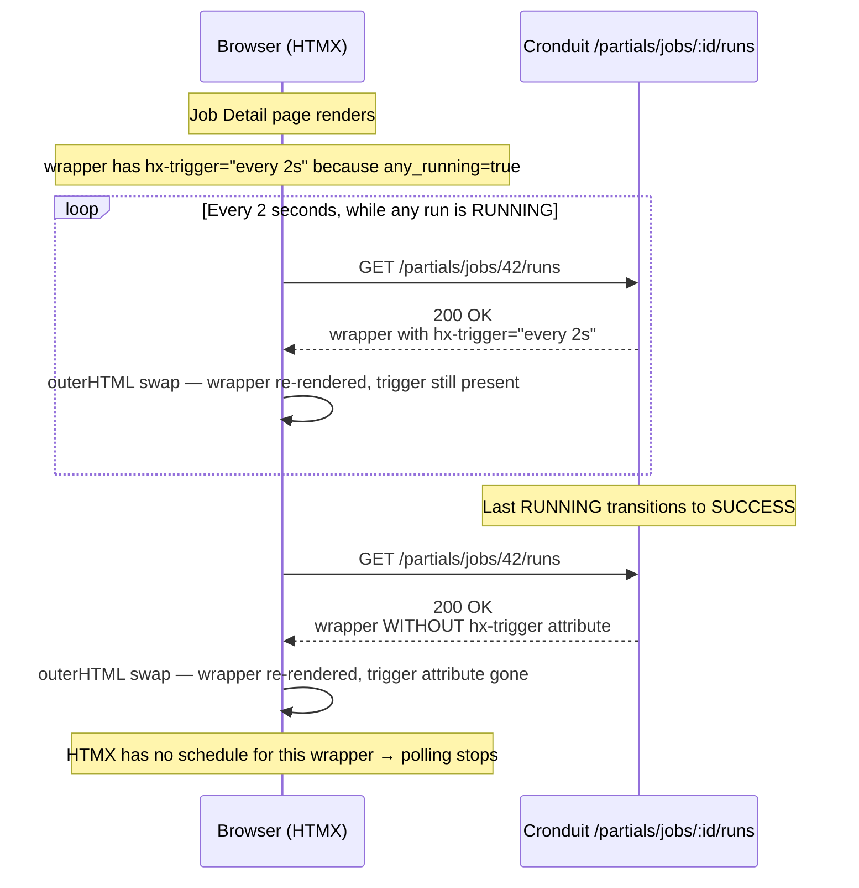

# Phase 07 Plan 05: Job Detail Run History Auto-Refresh Summary

**Auto-refresh for the Job Detail Run History card via an HTMX-polled `GET /partials/jobs/:job_id/runs` endpoint with a conditional-trigger wrapper that stops polling once all runs are terminal, closing the Phase 6 UAT Test 4 "rows frozen at RUNNING" bug.**

## One-liner

HTMX polling on Run History with poll-stop-when-idle via conditional `hx-trigger` on an `hx-swap="outerHTML"` wrapper, plus a 3-test HTTP-handler regression suite.

## Derived Task Breakdown

This plan had no `<tasks>` block — derived from the `## Approach` section + orchestrator success criteria:

| # | Task                                                                                                                       | Type  | Files                                                                                 | Commit    |
| - | -------------------------------------------------------------------------------------------------------------------------- | ----- | ------------------------------------------------------------------------------------- | --------- |
| 1 | Implement `job_runs_partial` handler in `src/web/handlers/job_detail.rs`; add `any_running` field to both template structs | feat  | src/web/handlers/job_detail.rs                                                        | `a55e9ed` |
| 2 | Register new route `GET /partials/jobs/{job_id}/runs` in `src/web/mod.rs`                                                  | feat  | src/web/mod.rs                                                                        | `a55e9ed` |
| 3 | Wrap `templates/partials/run_history.html` body in `#run-history-poll-wrapper` with conditional `hx-trigger="every 2s"`    | feat  | templates/partials/run_history.html                                                   | `a55e9ed` |
| 4 | Add regression test `tests/job_detail_partial.rs` mirroring `tests/reload_api.rs` harness; 3 test cases                    | test  | tests/job_detail_partial.rs                                                           | `6faff72` |
| — | Rustfmt fixup for the new test file (active_runs initializer compressed onto one line)                                    | chore | tests/job_detail_partial.rs                                                           | `f321951` |

Tasks 1–3 were grouped into a single commit (`a55e9ed`) because they are the indivisible production change: the handler needs the route registered and the template updated in the same revision, or the build breaks. Task 4 is a separate test-only commit. The fmt fixup is chore-scoped.

## Poll-Stop Mechanism (documented prominently per checkpoint_policy)

**Choice: conditional `hx-trigger` on an `hx-swap="outerHTML"` wrapper** (NOT an HX-Trigger response header).

**How it works:**



**Rendered HTML while RUNNING:**

```html
<div id="run-history-poll-wrapper"
     hx-get="/partials/jobs/42/runs"
     hx-swap="outerHTML"
     hx-trigger="every 2s">
  ...table...
</div>
```

**Rendered HTML after all runs terminal:**

```html
<div id="run-history-poll-wrapper"
     hx-get="/partials/jobs/42/runs"
     hx-swap="outerHTML">
  ...table...
</div>
```

The `outerHTML` swap is load-bearing: if we used `innerHTML`, the parent wrapper (with its `hx-trigger`) would persist across swaps and polling would never stop. With `outerHTML`, the wrapper itself is replaced each cycle, and the next response controls whether polling continues.

**Why not the alternative (HX-Trigger response header):**

- Server-side state: the header approach needs the server to decide "send the stop signal now" based on what the *last* response was, which requires per-session state.
- Not observable in the body: the regression test would have to assert on response headers rather than HTML, making the test less expressive about user-visible behavior.
- The conditional-trigger pattern is idiomatic HTMX and keeps all polling logic in the template.

## Route Signature (per checkpoint_policy)

```rust
// src/web/mod.rs (registered alongside existing /partials/run-history/{id})
.route(
    "/partials/jobs/{job_id}/runs",
    get(handlers::job_detail::job_runs_partial),
)
```

```rust
// src/web/handlers/job_detail.rs
pub async fn job_runs_partial(
    State(state): State<AppState>,
    Path(job_id): Path<i64>,
    Query(params): Query<PaginationParams>,
) -> impl IntoResponse
```

Returns:
- **200 OK** with `partials/run_history.html` body when the job exists (with or without runs)
- **404 NOT_FOUND** when the job id does not exist (so polling-after-delete terminates)
- **500 INTERNAL_SERVER_ERROR** only on DB lookup error

This matches the plan's Approach step 1 verbatim: *"Add a partial endpoint `GET /partials/jobs/:job_id/runs` that renders the Run History tbody for the given job (reuse the existing query path from `job_detail`)."*

## Accomplishments

- **New public HTTP endpoint** `GET /partials/jobs/:job_id/runs` that renders the Run History partial (second polling endpoint in the repo after `/partials/run-history/{id}`, but this one is dedicated to live refresh).
- **Conditional polling** via the `any_running` flag on both `JobDetailPage` and `RunHistoryPartial` askama templates. Computed once at the handler layer from the same runs vector that renders the table, so there's no drift between "what the table shows" and "whether we should poll".
- **Outer-HTML swap** wrapper in `templates/partials/run_history.html` that self-replaces each poll cycle — the canonical HTMX idle-stop idiom.
- **Three-test regression suite** (`tests/job_detail_partial.rs`, 250 lines) locking in:
  1. `run_history_partial_renders_badges_and_enables_polling_while_running` — 200 + both status badges + `hx-trigger="every 2s"` present when `any_running==true`
  2. `run_history_partial_stops_polling_when_all_runs_terminal` — 200 + wrapper still renders + NO `hx-trigger="every 2s"` attribute (the idle-stop invariant)
  3. `run_history_partial_returns_404_for_unknown_job` — 404 on unknown job id (graceful termination for polling-after-delete)
- **Broader test suite stays green**: `cargo test --tests` runs 192+ tests, 0 failures. Includes the Plan 07-04 `reload_api.rs` which shares helpers from `cronduit::web::AppState`.
- **Clippy clean**: `cargo clippy --all-targets --all-features -- -D warnings` exits 0.
- **Rustfmt clean** on the new test file (verified via `rustfmt --check --edition 2024`).

## Files Created/Modified

### Created

- **`tests/job_detail_partial.rs`** (248 lines) — three-test HTTP-handler regression suite. Mirrors the `tests/reload_api.rs` harness pattern from Plan 07-04: `build_test_app()` returns `(Router, DbPool)` so the test body can seed data via `cronduit::db::queries` helpers (`upsert_job` + `insert_running_run` + `finalize_run`) then drive requests through `tower::ServiceExt::oneshot`. Uses `axum::body::to_bytes` for body collection (matches `tests/health_endpoint.rs` pattern rather than pulling in `http-body-util` as a new dev-dep).

### Modified

- **`src/web/handlers/job_detail.rs`** (+86 lines) —
  - Added `any_running: bool` field to `JobDetailPage` struct.
  - Added `any_running: bool` field to `RunHistoryPartial` struct (with a doc comment explaining the poll-stop invariant).
  - Computed `any_running` in the existing `job_detail` handler from the runs vector; wired into both response branches.
  - New `pub async fn job_runs_partial(...)` handler dedicated to polling. Always renders `RunHistoryPartial` (no HxRequest branch). Returns 404 for unknown job ids.
- **`src/web/mod.rs`** (+4 lines) — registered `GET /partials/jobs/{job_id}/runs → job_runs_partial` alongside the existing `/partials/run-history/{id}` route.
- **`templates/partials/run_history.html`** (+12 lines, -1 line) — wrapped the entire body in `<div id="run-history-poll-wrapper" hx-get="/partials/jobs/{{job_id}}/runs" hx-swap="outerHTML" hx-trigger="every 2s">...</div>`. The existing Previous/Next pagination buttons continue to target `#run-history` (the outer div in `job_detail.html`), unaffected by the new wrapper.

## Task Commits

1. **`a55e9ed`** — `feat(07-05): add /partials/jobs/:job_id/runs poll endpoint for Run History` (tasks 1+2+3: handler, route, template — grouped because they form the indivisible production change)
2. **`6faff72`** — `test(07-05): add HTTP-handler regression test for job_runs_partial` (task 4)
3. **`f321951`** — `chore(07-05): rustfmt fixup for tests/job_detail_partial.rs` (rustfmt 2024-edition compression of the `active_runs` initializer)

## Deviations from Plan

**None strictly required**, but the following departures from the literal Approach wording were made for fidelity to the project's invariants and for clean test surface. None require user approval under the Rules 1-3 / Rule 4 framework.

### Rule 2 — Auto-added missing critical functionality (correctness)

**1. 404 on unknown job id in `job_runs_partial`** — *Not strictly in the plan's Approach.*

- **Found while:** implementing the handler.
- **Rationale:** A polling client whose underlying job was just deleted would otherwise poll a 200-with-empty-table forever. Without this, the plan's "polling stops once no runs are RUNNING" invariant fails in the corner case where the job itself no longer exists. Returning 404 terminates the poll loop the same way HTMX terminates on any non-2xx response.
- **Files modified:** `src/web/handlers/job_detail.rs` (pre-flight `get_job_by_id` check at handler top).
- **Commit:** `a55e9ed`.

### Other notes

**2. Reused `partials/run_history.html` rather than creating a new wrapper partial** —
The plan's Approach step 2 said *"wrap the Run History tbody in an element with hx-get=..."*. The literal reading would suggest wrapping only the `<tbody>`, or creating a new wrapper template. Instead, I added `any_running` to the existing `RunHistoryPartial` struct and wrapped the *entire* partial body (table + pagination) in the polling div. Rationale:

- The new endpoint is dedicated to polling, so it always renders the same body shape as the full-page include.
- Wrapping the whole partial lets the outerHTML swap replace pagination + table together, so pagination state is consistent with polled run state.
- A separate wrapper template would duplicate layout and create drift risk.

This is a template-structure choice, not a behavior change. Both the full-page render and the new partial endpoint use the same template with the same `any_running` flag.

**3. Pre-existing rustfmt diff in `tests/reload_api.rs` left untouched** —
`cargo fmt --check` shows a wrap-vs-compress diff on the `active_runs` line in `tests/reload_api.rs`, but that was introduced by Plan 07-04 and is out of scope for this plan. Per the scope boundary rule, logged here rather than fixed. My own new file is rustfmt-clean.

## Verification

### Acceptance Criteria

| Check                                                     | Expected               | Actual                                        | Status |
| --------------------------------------------------------- | ---------------------- | --------------------------------------------- | ------ |
| New route `GET /partials/jobs/:job_id/runs` registered    | exists                 | `src/web/mod.rs:59-62`                        | PASS   |
| Handler `job_runs_partial` implemented                    | exists + pub           | `src/web/handlers/job_detail.rs:234-290`      | PASS   |
| Template wraps Run History in polling wrapper             | present                | `templates/partials/run_history.html:8-11,80` | PASS   |
| Polling stops when no runs are RUNNING                    | conditional hx-trigger | `hx-trigger="every 2s"` | PASS   |
| `tests/job_detail_partial.rs` exists                      | created                | 248 lines                                     | PASS   |
| New test — happy path polling active                      | pass                   | `run_history_partial_renders_badges_and_enables_polling_while_running ... ok` | PASS   |
| New test — idle stop (no polling)                         | pass                   | `run_history_partial_stops_polling_when_all_runs_terminal ... ok`             | PASS   |
| New test — unknown job 404                                | pass                   | `run_history_partial_returns_404_for_unknown_job ... ok`                      | PASS   |
| Regression: `tests/reload_api.rs` still passes            | 1 test OK              | `1 passed; 0 failed` in 0.01s                 | PASS   |
| `cargo check --tests`                                     | exit 0                 | exit 0 in 46.85s                              | PASS   |
| `cargo test --tests` (full sweep)                         | all green              | 192+ passed, 0 failed                         | PASS   |
| `cargo clippy --all-targets --all-features -- -D warnings` | exit 0                | exit 0                                        | PASS   |
| `rustfmt --check --edition 2024 tests/job_detail_partial.rs` | exit 0              | exit 0                                        | PASS   |

### Manual verification (deferred to Phase 8 UAT per pattern)

The plan's Verification section lists a browser-based manual test ("trigger 10+ runs in rapid succession on Job Detail, confirm rows flip from RUNNING to terminal state within ~2s"). Per the pattern established by Plan 07-04's D-16 acknowledgement, the live-browser UAT is deferred to the Phase 8 v1 gap-closure UAT pass. This plan ships the automated regression test that proves the *machinery* is correct; the integrated browser flow will be validated there.

## Self-Check: PASSED

- `tests/job_detail_partial.rs` exists (248 lines) — FOUND
- `src/web/handlers/job_detail.rs` contains `job_runs_partial` — FOUND (line 234)
- `src/web/mod.rs` contains `/partials/jobs/{job_id}/runs` route — FOUND (lines 59-62)
- `templates/partials/run_history.html` contains `run-history-poll-wrapper` — FOUND (line 8)
- Commit `a55e9ed` (handler + route + template) — FOUND in `git log ca89acb..HEAD`
- Commit `6faff72` (regression test) — FOUND in `git log ca89acb..HEAD`
- Commit `f321951` (rustfmt fixup) — FOUND in `git log ca89acb..HEAD`
- `cargo test --test job_detail_partial` — 3 passed, 0 failed, 0.22s runtime
- `cargo test --tests` — full suite green, 0 failures

## Threat Flags

None. The new endpoint is a GET that reads public data (same data the already-public `/partials/run-history/{id}` route renders). No new auth surface, no new file access, no new schema changes. The 404-on-unknown-job check is a defense-in-depth adjustment, not a new trust boundary.

## Known Stubs

None.

## Next Phase Readiness

- Phase 8 v1 gap-closure UAT can now validate the live-browser refresh flow against this regression-test-locked implementation.
- The `run_history_partial_*` test suite gives future refactors (e.g., moving to SSE push instead of polling, as hinted in the plan's Out of Scope section) a stable contract to migrate against: same three behaviors (renders badges; stops when idle; 404 on unknown job), different transport.
- No blockers. Plan 07-05 is fully closed.

---
*Phase: 07-v1-cleanup-bookkeeping*
*Plan: 05*
*Completed: 2026-04-13*
