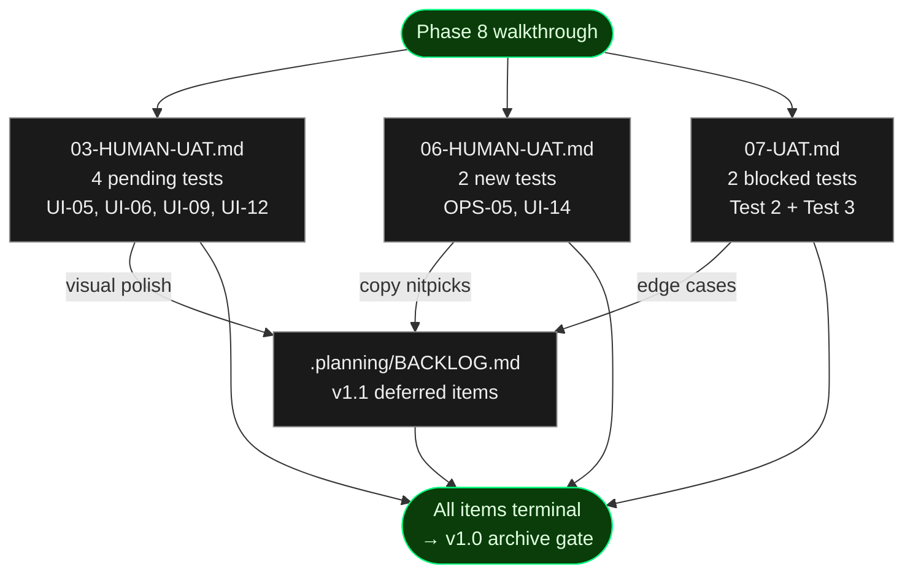

# Phase 8 — Human UAT Index

**Purpose:** Walkthrough index for the v1.0 final human UAT. This file lists
every per-phase UAT file touched in Phase 8, the final status of each item
once walked through, and the fixture setup each test needs. Individual
results live in the per-phase files to preserve audit provenance (per D-23).

**This is a prep-and-surface index.** Per project memory rule "UAT requires
user validation", Claude does NOT flip any `result:` field. The user runs
each test and records results directly in the per-phase file (pass / issue
with severity / blocked). Once every row in the table below is terminal,
the user updates this index's `status:` frontmatter to `complete`.

## Scope



## Fixture Setup

Every test below runs against a live cronduit instance. Before starting the
walkthrough, pick ONE of the two compose files per test session and bring
the stack up:

**Default (Linux):**
```
docker compose -f examples/docker-compose.yml up -d
curl -sSf http://localhost:8080/health
```

Ensure `DOCKER_GID` matches your host (default fallback is `999`). Derive
via `stat -c %g /var/run/docker.sock` and export before compose up if
different.

**Secure (macOS / defense-in-depth):**
```
docker compose -f examples/docker-compose.secure.yml up -d
curl -sSf http://localhost:8080/health
```

No `DOCKER_GID` needed — the docker-socket-proxy sidecar mediates all
Docker API traffic.

When done with a test session:
```
docker compose -f examples/docker-compose.yml down -v
# or
docker compose -f examples/docker-compose.secure.yml down -v
```

## UAT Item Index

| # | File | Test | Requirement | Current Result | Final Result |
|---|------|------|-------------|----------------|--------------|
| 1 | 03-HUMAN-UAT.md | Terminal-green design system rendering | UI-05 | pass | **pass** |
| 2 | 03-HUMAN-UAT.md | Dark/light mode toggle persistence | UI-06 | pass | **pass** |
| 3 | 03-HUMAN-UAT.md | Run Now toast notification | UI-09 | pass | **pass** |
| 4 | 03-HUMAN-UAT.md | ANSI log rendering in Run Detail | UI-12 | pass | **pass** |
| 5 | 06-HUMAN-UAT.md | Quickstart end-to-end | OPS-05 | pass | **pass** (with DOCKER_GID=102 caveat for macOS Rancher Desktop) |
| 6 | 06-HUMAN-UAT.md | SSE live log streaming | UI-14 | pass | **pass** |
| 7 | 07-UAT.md | Job Detail Run History Auto-Refresh (re-run) | n/a | issue/blocker → **pass** | **pass** (re-tested 2026-04-14 after Phase 8 gap closure) |
| 8 | 07-UAT.md | Job Detail Polling Stops When Idle (re-run) | n/a | blocked → **pass** | **pass** (unblocked by Test 7 resolution) |

All eight items terminated as `pass`. Tests 7 and 8 were re-tested on 2026-04-14 after
the Phase 8 gap closures (alpine rebase, docker daemon preflight, macOS Rancher Desktop
socket permissions) produced the sustained RUNNING state that Plan 07-05's polling
transition needed to observe.

## Triage Rubric

Use this to decide whether a surfaced issue is a Phase 8 fix or a v1.1
backlog entry (verbatim from 08-CONTEXT.md D-26, D-28):

- **Fix in Phase 8:** Functional breakage. A job fails to run, a page
  crashes, a toast never appears, a live log stream hangs, auto-refresh
  stops working, a docker pull errors out silently. Open a gap-closure
  plan for it before archiving v1.0.
- **Defer to v1.1:** Visual polish, copy wording nitpicks, dark-mode
  rendering edge cases that still render, cosmetic alignment on narrow
  viewports. Add an entry to `.planning/BACKLOG.md` using the template.
- **Ambiguous:** Default to v1.1 unless it blocks a v1.0 success criterion
  listed in ROADMAP.md § Phase 8. Err toward shipping.

## Final Status

Filled in after the walkthrough on 2026-04-14. User approved via session message
(recorded in 08-05-SUMMARY.md) and per-row result flips landed via `/gsd-verify-work 3`,
`/gsd-verify-work 6`, `/gsd-verify-work 7` in the same session.

| Category | Count |
|----------|-------|
| Tests total | 8 |
| Passed | 8 |
| Issues (Phase 8 fix) | 0 |
| Issues (deferred to v1.1) | 0 |
| Blocked | 0 |

**Phase 8 fix plans opened:** None. Three gap-closure fixes landed in-session as
direct commits on `phase/08-plan` rather than spawning new gap-closure plans, because
the issues were environmental (macOS Rancher Desktop host configuration) rather than
product bugs:

- `3042f13` fix(08): parametrize docker socket path via `CRONDUIT_DOCKER_SOCKET` env var
- `8afb97d` docs(08): README — document DOCKER_GID=102 for Rancher Desktop macOS
- `1a28efa` docs(08): document Rancher Desktop DOCKER_GID=102 across README, compose, preflight, CI

Additionally, the `/gsd-code-review-fix 8` pass auto-fixed the 5 advisory code review
warnings from `08-REVIEW.md`:

- `2840ac0` fix(08): WR-01 guard curl failure in health assertion step
- `58d041d` fix(08): WR-02 assert exactly one cronduit:ci image line after sed rewrite
- `6c7febd` fix(08): WR-03 give each polled job its own per-job deadline
- `b3b96b9` fix(08): WR-04 clarify 0.0.0.0 bind with inline comment in cronduit.toml
- `f91ec24` fix(08): WR-05 add comment explaining absent group_add in secure compose

**v1.1 backlog entries added:** None during the walkthrough. `.planning/BACKLOG.md`
was seeded with a template entry in Task 2 of 08-05 (commit `dd19b5e`) and remains
available for v1.1 planning. The 6 Info-level code review findings (IN-01..IN-06
from `08-REVIEW.md`) are candidates to promote to backlog entries if they should
persist into v1.1.

**Walkthrough completed:** 2026-04-14
**User approved archive:** Walkthrough approved. **Milestone archive deferred to
Phase 9** — per user decision, Phase 9 exists (added in a separate session) and
will own the v1.0 PR + archive. Phase 8 ships as its own PR first, then Phase 9
lands on top, then `/gsd-complete-milestone` runs.
