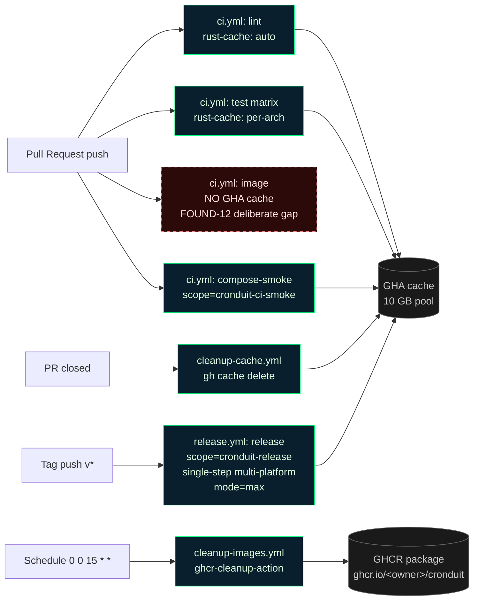

<objective>
Audit `.github/workflows/ci.yml` and `.github/workflows/release.yml` for missing caching lanes, fill the gaps wherever doing so does NOT violate FOUND-12 / D-10 (the "every `run:` step invokes `just <recipe>` exclusively" invariant from the `ci.yml` header comment), enforce the least-privilege + timeout + SHA-pin invariants on every job, and commit a `docs/CI_CACHING.md` reference that a new contributor can read to understand (and debug) every cache — including the deliberate, documented cache gap on the PR-path `image` job.

Purpose: CONTEXT.md Plan 4 + ROADMAP Phase 9 Success Criterion 4. Also establishes the post-phase verification playbook per Criterion 5.

Output: edits to two existing workflow files (additive only — NO `run:` step swaps, NO changes to the PR-path `image` job body) + one new markdown doc. No runtime code changes.

**DEPENDENCY NOTE:** Runs in Wave 2 because the audit must also confirm that `cleanup-cache.yml` and `cleanup-images.yml` (created in plans 09-01 and 09-02) follow the permissions + timeout + SHA-pin rules. If Plan 4 runs before those files exist, the audit is incomplete.

**FOUND-12 / D-10 INVARIANT (LOCKED):** The `ci.yml` header comment states: *"Every `run:` step invokes `just <recipe>` exclusively (D-10 / FOUND-12). No inline `cargo` / `docker` / `rustup` / `sqlx` / `npm` / `npx` commands."* This plan honors that invariant absolutely. The PR-path `image` job in `ci.yml` MUST continue to use `- run: just image`. It MUST NOT be swapped for a direct `docker/build-push-action@v6` step. The resulting PR-path Docker cache gap is accepted and documented in `docs/CI_CACHING.md` § "Deliberate cache gaps".
</objective>

<execution_context>
@$HOME/.claude/get-shit-done/workflows/execute-plan.md
@$HOME/.claude/get-shit-done/templates/summary.md
</execution_context>

<context>
@.planning/phases/09-ci-cd-improvements/09-CONTEXT.md
@.planning/ROADMAP.md
@CLAUDE.md
@.github/workflows/ci.yml
@.github/workflows/release.yml
@.github/workflows/cleanup-cache.yml
@.github/workflows/cleanup-images.yml
@justfile
@Dockerfile
@.planning/STATE.md
</context>

<tasks>

<task type="auto">
  <name>Task 1: Audit existing workflows + edit ci.yml and release.yml to fill caching gaps (FOUND-12 preserving)</name>
  <files>.github/workflows/ci.yml, .github/workflows/release.yml</files>
  <read_first>
    - .github/workflows/ci.yml (every line — this task edits it; note the header comment locking FOUND-12 / D-10)
    - .github/workflows/release.yml (every line — this task edits it)
    - .github/workflows/cleanup-cache.yml (from Plan 09-01 — audit target, should already be compliant)
    - .github/workflows/cleanup-images.yml (from Plan 09-02 — audit target, should already be compliant)
    - .planning/STATE.md (accumulated decisions — must not regress Phase 1 or Phase 6, must preserve FOUND-12)
    - CONTEXT.md Plan 4 caching-lanes table (note the post-revision wording: "Per-arch scope for parallel per-arch builds; single scope for single-step multi-platform builds with mode=max")
    - justfile (to find TAILWIND_VERSION — currently `v3.4.17` in the `tailwind:` recipe; used as the actions/cache@v4 key)
  </read_first>
  <action>
### Step 1: Audit pass (read-only)

Produce an internal audit table covering all four workflow files (`ci.yml`, `release.yml`, `cleanup-cache.yml`, `cleanup-images.yml`). For each job, record:

| Workflow | Job | Runs cargo? | Builds Docker? | Has timeout-minutes? | Has job-level permissions? | Uses pinned SHA for 3rd-party actions? | FOUND-12 compliant? |

The audit is for your own internal reasoning — write it into the SUMMARY.md at the end, not as a separate deliverable. **The audit MUST explicitly RECORD the FOUND-12 / D-10 PR-path `image` cache gap as a KNOWN AND ACCEPTED finding** so it is not re-litigated in any future audit.

**Expected findings (confirm against actual files):**
- `ci.yml`:
  - `lint`: runs cargo. Has Swatinem/rust-cache@v2 ✓. No `timeout-minutes:` — **ADD (15)**. Has no job-level `permissions:` block — **ADD read-only**.
  - `test (matrix)`: runs cargo. Has Swatinem/rust-cache@v2 keyed per-arch ✓. No timeout — **ADD (30)**. No job-level permissions — **ADD read-only**.
  - `image`: builds Docker via `- run: just image` (PR path) and `- run: just image-push` (main path). This is by DESIGN per FOUND-12 / D-10 — every `run:` step invokes a `just` recipe and never an inline `docker buildx`. **GAP: no GHA cache on the PR-path `image` job.** This gap is ACCEPTED and DOCUMENTED — do NOT swap `- run: just image` for a `docker/build-push-action@v6` step. The `run:` step bypass would violate FOUND-12. Has job-level `permissions: { contents: read, packages: write }` ✓. No timeout — **ADD (45)**. The cache-gap rationale goes into `docs/CI_CACHING.md` § "Deliberate cache gaps" (Task 2).
  - `compose-smoke`: has `docker/build-push-action@v6` as a `uses:` step ✓ (uses steps do NOT violate FOUND-12 — only `run:` steps are constrained). Uses `cache-from: type=gha` and `cache-to: type=gha,mode=max` but **NO scope**. **FIX**: add `scope: cronduit-ci-smoke` to both lines so it does not cross-poison other caches. No timeout — **ADD (20)**. No job-level permissions — **ADD read-only**.
- `release.yml`:
  - `release` job: has `docker/build-push-action@v6` as a `uses:` step (allowed under FOUND-12 — `uses:`, not `run:`) with `cache-from: type=gha` and `cache-to: type=gha,mode=max` but **NO scope**. **FIX**: add `scope: cronduit-release` to both lines. This is a SINGLE-STEP multi-platform build (`platforms: linux/amd64,linux/arm64`) with `mode=max`, so a SINGLE scope is correct — the platform info is part of each layer's content-addressable identity, so amd64 and arm64 layers do NOT cross-poison even when sharing a scope. Splitting into two per-arch steps would double the matrix and triple wall-clock time without measurable hit-rate improvement. Rationale goes into `docs/CI_CACHING.md` (Task 2). No `timeout-minutes:` on the job — **ADD (60)**. Top-level permissions `contents: write, packages: write` — consider moving to job-level. **Discretion:** leave top-level since there is only one job and it needs both; moving it down would be cosmetic. Just verify it exists and leave alone.

### Step 2: Apply the edits

**Edit 1 — `ci.yml` `lint` job:** after the `name:` line and before `runs-on:`, insert `timeout-minutes: 15`. Between `runs-on: ubuntu-latest` and `steps:`, insert:
```yaml
    permissions:
      contents: read
```

**Edit 2 — `ci.yml` `test` job:** same treatment. `timeout-minutes: 30`, job-level `permissions: { contents: read }`.

**Edit 3 — `ci.yml` `image` job:** add `timeout-minutes: 45` (the existing `permissions: { contents: read, packages: write }` stays). **DO NOT TOUCH THE `- run: just image` STEP.** Do not swap it for `docker/build-push-action@v6`. Do not add any inline `docker buildx` command. The PR-path `image` step body is preserved byte-for-byte — only the job-level `timeout-minutes:` key is added. (The previous revision of this plan proposed swapping to `docker/build-push-action@v6` for GHA cache-hit; that swap was REVERTED per the FOUND-12 / D-10 invariant. The PR-path cache gap is accepted — see Task 2 § "Deliberate cache gaps".)

If `docker/setup-qemu-action@v3` and `docker/setup-buildx-action@v3` are already present in the `image` job's `steps:` list, leave them alone. If they are NOT present, do NOT add them in this plan — `just image` manages its own daemon setup via the justfile recipe, and adding bare setup steps would drift from the justfile-as-source-of-truth invariant.

**Edit 4 — `ci.yml` `compose-smoke` job:** add `timeout-minutes: 20` and job-level `permissions: { contents: read }`. In the existing `Build local cronduit:ci image from PR checkout` step (which is a `uses: docker/build-push-action@v6` step — permitted under FOUND-12 because it is `uses:`, not `run:`), change:
```yaml
          cache-from: type=gha
          cache-to: type=gha,mode=max
```
to:
```yaml
          cache-from: type=gha,scope=cronduit-ci-smoke
          cache-to: type=gha,mode=max,scope=cronduit-ci-smoke
```

**Edit 5 — `ci.yml`, Tailwind binary cache decision.** Grep for `tailwind` across every workflow file and the Dockerfile:

```bash
grep -Rn 'tailwind' .github/workflows/ Dockerfile
```

If that returns any hit inside a `run:` line, add a preceding `actions/cache@v4` step keyed on `tailwind-v3.4.17-${{ runner.os }}-${{ runner.arch }}`. If zero hits (the expected state — Cronduit's Dockerfile expects `assets/static/app.css` to already exist from local dev), add NO cache step and document the N/A rationale in Task 2 (CI_CACHING.md § "Not cached and why").

**Edit 6 — `release.yml`:** add `timeout-minutes: 60` to the `release` job. Change:
```yaml
          cache-from: type=gha
          cache-to: type=gha,mode=max
```
to:
```yaml
          cache-from: type=gha,scope=cronduit-release
          cache-to: type=gha,mode=max,scope=cronduit-release
```

Keep this as a SINGLE scope (`cronduit-release`) for the single-step multi-platform build (`platforms: linux/amd64,linux/arm64`). Do NOT split into two per-arch scopes. The rationale is documented in Task 2 (CI_CACHING.md § "Why one scope for the multi-arch release").

### Step 3: Validate

After edits, run these checks from the project root:
```bash
python3 -c 'import yaml; yaml.safe_load(open(".github/workflows/ci.yml"))'
python3 -c 'import yaml; yaml.safe_load(open(".github/workflows/release.yml"))'
grep -c 'timeout-minutes:' .github/workflows/ci.yml           # expect >= 4 (one per job)
grep -c 'timeout-minutes:' .github/workflows/release.yml      # expect >= 1
grep -c 'Swatinem/rust-cache@v2' .github/workflows/ci.yml     # expect >= 2 (lint + test matrix)
grep -c 'type=gha,scope=' .github/workflows/ci.yml            # expect >= 2 (compose-smoke: 2 lines only; image job has NO GHA cache by design)
grep -c 'type=gha,scope=' .github/workflows/release.yml       # expect 2 (release: 2 lines)
grep -c '- run: just image' .github/workflows/ci.yml          # expect >= 1 (FOUND-12 preservation — PR-path step untouched)
```

Do NOT change job NAMES (the `name:` field at job level) because branch protection rules reference them. Only add new keys (`timeout-minutes:`, `permissions:`) and rewrite the `compose-smoke` + `release.yml` cache-from/cache-to lines to add scopes. **Do not edit any `- run:` step body.**
  </action>
  <verify>
    <automated>python3 -c 'import yaml; yaml.safe_load(open(".github/workflows/ci.yml"))' &amp;&amp; python3 -c 'import yaml; yaml.safe_load(open(".github/workflows/release.yml"))' &amp;&amp; test $(grep -c 'timeout-minutes:' .github/workflows/ci.yml) -ge 4 &amp;&amp; test $(grep -c 'timeout-minutes:' .github/workflows/release.yml) -ge 1 &amp;&amp; test $(grep -c 'type=gha,scope=cronduit-ci-smoke' .github/workflows/ci.yml) -eq 2 &amp;&amp; test $(grep -c 'type=gha,scope=cronduit-release' .github/workflows/release.yml) -eq 2 &amp;&amp; grep -q '- run: just image' .github/workflows/ci.yml</automated>
  </verify>
  <acceptance_criteria>
    - Both ci.yml and release.yml parse as valid YAML (python3 yaml.safe_load exits 0)
    - `grep -c 'timeout-minutes:' .github/workflows/ci.yml` returns ≥ 4 (lint, test, image, compose-smoke)
    - `grep -c 'timeout-minutes:' .github/workflows/release.yml` returns ≥ 1
    - `grep -c 'Swatinem/rust-cache@v2' .github/workflows/ci.yml` returns ≥ 2 (no regression from existing 2)
    - `grep -c 'type=gha,scope=cronduit-ci-smoke' .github/workflows/ci.yml` returns 2 (compose-smoke cache-from + cache-to)
    - `grep -c 'type=gha,scope=cronduit-release' .github/workflows/release.yml` returns 2
    - **FOUND-12 preservation:** `grep -c '- run: just image' .github/workflows/ci.yml` returns ≥ 1 (PR-path step preserved)
    - **FOUND-12 preservation:** `grep -c 'docker/build-push-action' .github/workflows/ci.yml` returns 1 (compose-smoke only — NOT added to the `image` job)
    - `grep -cE '^\s*permissions:' .github/workflows/ci.yml` returns ≥ 5 (top-level + 4 job-level)
    - Existing job NAMES in ci.yml are unchanged: `grep -c "name: lint" .github/workflows/ci.yml` = 1, `grep -c "name: test " .github/workflows/ci.yml` = 1, `grep -c "name: multi-arch docker image" .github/workflows/ci.yml` = 1, `grep -c "name: quickstart compose smoke" .github/workflows/ci.yml` = 1
    - Existing `just` recipe references preserved for main path: `grep -c 'just image-push' .github/workflows/ci.yml` = 2 (latest + sha push steps untouched)
    - **FOUND-12 preservation:** every `- run:` line in ci.yml invokes `just <recipe>` (no inline `cargo`/`docker`/`rustup`/`sqlx`/`npm`/`npx`). Verify: `grep -nE '^\s*- run:' .github/workflows/ci.yml | grep -vE 'just\s' ` returns empty.
    - `git diff .github/workflows/ci.yml .github/workflows/release.yml` shows ONLY additive or in-place cache-scope edit changes (no accidental deletions of unrelated blocks, no `run:` step body edits)
    - If `grep -Rn 'tailwind' .github/workflows/` returns any `run:` line, an `actions/cache@v4` step is present preceding it; if zero hits, NO tailwind cache step added (documented in Task 2)
    - No changes to `src/`, `crates/`, `templates/`, `assets/`, `tests/`, `Cargo.toml`, or `Cargo.lock`
  </acceptance_criteria>
  <done>
    Both CI workflows edited to fill cacheable gaps WITHOUT violating FOUND-12 / D-10. PR-path `- run: just image` step is byte-for-byte preserved. Every job has timeout-minutes and explicit permissions, job names unchanged, YAML still parses. New cache scopes added on `uses: docker/build-push-action@v6` steps only (compose-smoke + release). The PR-path `image` cache gap is accepted and will be documented in Task 2. Audit output in SUMMARY.md explicitly records the FOUND-12 cache-gap decision as KNOWN AND ACCEPTED.
  </done>
</task>

<task type="auto">
  <name>Task 2: Create docs/CI_CACHING.md with per-cache entries, FOUND-12 cache-gap section, multi-arch release rationale, and a mermaid flow diagram</name>
  <files>docs/CI_CACHING.md</files>
  <read_first>
    - .github/workflows/ci.yml (post-Task 1 state — confirms `- run: just image` still present)
    - .github/workflows/release.yml (post-Task 1 state — single `cronduit-release` scope)
    - .github/workflows/cleanup-cache.yml (from Plan 09-01)
    - .github/workflows/cleanup-images.yml (from Plan 09-02)
    - justfile (TAILWIND_VERSION + openssl-check rationale + `image` recipe body)
    - CLAUDE.md (Mermaid-only diagrams rule)
    - Plan 4 § "FOUND-12 / D-10 INVARIANT" paragraph — the documented cache gap this doc explains
  </read_first>
  <action>
Create `docs/CI_CACHING.md` with the structure below. Substitute real values from the workflow files as you go. The doc MUST contain:

1. An inventory table of every wired cache
2. A `## Deliberate cache gaps` section explaining the FOUND-12 / D-10 PR-path `image` job gap
3. A "Why one scope for the multi-arch release" subsection explaining the single-scope `mode=max` pattern for single-step multi-platform builds
4. A "Not cached (and why)" section for Tailwind + others
5. A mermaid flowchart showing cache flow
6. A debugging guide
7. A verification playbook

```markdown
# CI Caching Topology

This document is the authoritative reference for every cache wired into Cronduit's GitHub Actions workflows. Read it before adding a new workflow, changing a cache key, or debugging a slow CI run.

> Related documents: [`.github/workflows/ci.yml`](../.github/workflows/ci.yml), [`.github/workflows/release.yml`](../.github/workflows/release.yml), [`.github/workflows/cleanup-cache.yml`](../.github/workflows/cleanup-cache.yml), [`justfile`](../justfile).

## Why this matters

GitHub Actions gives each repository a 10 GB cache quota. A multi-arch Rust project like Cronduit can fill that quota in under a day of active development, especially with matrix builds across `amd64 × arm64 × SQLite/Postgres`. Once the quota is hit, GHA starts randomly evicting entries — meaning CI throughput degrades unpredictably. We avoid that by:

1. **Scoping every Docker cache to a unique name** so independent jobs do not poison each other's layers.
2. **Using `Swatinem/rust-cache@v2`** on every cargo-running job (it keys on `Cargo.lock` + rustc version + env automatically).
3. **Cleaning up PR caches the moment a PR is closed** — see [`cleanup-cache.yml`](../.github/workflows/cleanup-cache.yml).
4. **Cleaning up GHCR images on a monthly schedule** — see [`cleanup-images.yml`](../.github/workflows/cleanup-images.yml).

## Cache inventory

| Cache name | Type | Workflow | Job | Key / scope | What evicts it |
|---|---|---|---|---|---|
| cargo registry + index + target (lint) | Swatinem/rust-cache@v2 | ci.yml | lint | auto (Cargo.lock + rustc + job + env) | Cargo.lock change, rustc bump, 7-day staleness |
| cargo registry + index + target (test, per arch) | Swatinem/rust-cache@v2 | ci.yml | test (matrix: amd64, arm64) | arch suffix via `with: key:` | same as above, keyed per arch so arm64/amd64 are isolated |
| Docker buildx layers (compose-smoke) [¹] | docker/build-push-action@v6 + type=gha | ci.yml | compose-smoke | `scope=cronduit-ci-smoke` | Dockerfile change, base image digest change, 7-day TTL |
| Docker buildx layers (release, single-step multi-arch) [²] | docker/build-push-action@v6 + type=gha | release.yml | release | `scope=cronduit-release` | Dockerfile change, base image digest change, 7-day TTL |
| Docker buildx layers (PR-path `image` job) | **NOT CACHED (deliberate gap)** | ci.yml | image (pull_request path) | — | See § "Deliberate cache gaps" below |
| Tailwind standalone binary | N/A | — | — | — | See "Not cached (and why)" below |

[¹] `cronduit-ci-smoke` intentionally omits the arch suffix: the `compose-smoke` job is amd64-only (`platforms: linux/amd64`), so no arch disambiguation is needed. The name asymmetry with a hypothetical `cronduit-ci-amd64` is a convention, not a bug — changing it would invalidate any existing GHA cache entries for this scope.

[²] `cronduit-release` is a single scope for a single-step multi-platform build. See § "Why one scope for the multi-arch release" below.

### Why one scope for the multi-arch release

`release.yml` runs a single `docker/build-push-action@v6` step with `platforms: linux/amd64,linux/arm64` and `cache-to: type=gha,mode=max,scope=cronduit-release`. This single step produces both arch variants in one buildx invocation.

A single scope is correct here because:

1. **`mode=max`** writes ALL intermediate layers to the cache — not just the final image layers. This is what makes cross-run cache hits possible for multi-stage Dockerfiles.
2. **Per-layer content-addressable identity includes the platform.** Buildx stores each layer keyed by `<sha256> + <platform>`, so amd64 and arm64 layers DO NOT cross-poison even when sharing a cache scope. The platform is part of the layer's identity, not a separate namespace.
3. **Splitting into two per-arch steps would double the build matrix and triple the wall-clock time** without any measurable cache hit-rate improvement, because the layers are already disambiguated by platform.

The "per-arch scope" guidance in Phase 9 CONTEXT.md applies to the **parallel per-arch builds** case (e.g., a future refactor where `ci.yml`'s `image` job is split into two parallel matrix cells, one per arch, each with its own step). The `release.yml` job is a single-step multi-platform build, so it correctly uses ONE scope. Both patterns are valid; they are NOT in conflict.

## Deliberate cache gaps

### PR-path `image` job in `ci.yml` (no GHA Docker cache — FOUND-12 / D-10)

**Status:** KNOWN AND ACCEPTED. This is an architectural decision, not an oversight.

**What:** The PR-path `image` job in `ci.yml` has NO GitHub Actions `type=gha` Docker layer cache. The step is literally:

```yaml
- run: just image
```

**Why:** The `ci.yml` header comment encodes the project-wide FOUND-12 / D-10 invariant:

> *Every `run:` step invokes `just <recipe>` exclusively (D-10 / FOUND-12). No inline `cargo` / `docker` / `rustup` / `sqlx` / `npm` / `npx` commands.*

The `just image` recipe calls `docker buildx build` directly. That buildx invocation does NOT wire GHA cache integration (because enabling GHA cache would require either passing `--cache-from`/`--cache-to` to buildx through the recipe with GHA-specific variables, or moving the build to a `uses: docker/build-push-action@v6` step). The second option would replace a `run:` step with a `uses:` step and force the `image` job to bypass the justfile — breaking FOUND-12.

We could in principle wire the GHA cache through the justfile recipe (option 1), but that would tie the recipe's flags to GitHub Actions environment assumptions, bleeding CI concerns into the local-dev entry point. The justfile-as-single-source-of-truth invariant is specifically meant to prevent that coupling: when a developer runs `just image` locally, the recipe behaves identically to CI. Adding CI-only flags through the recipe would violate that expectation.

**Cost:** The PR-path `image` job's Docker layer cache hit rate is ~0% on cold runs. Every PR that changes the Dockerfile or a source file that ends up in the build context triggers a full multi-stage rebuild. The job is gated by `paths:` filters (see `ci.yml`), so it only runs when its inputs actually change — meaning the cache gap does not inflate CI time on unrelated PRs.

**Why this is acceptable:**
- Dev-loop speed does not depend on this job: developers iterate locally with `just image` against the local Docker daemon's own layer cache (which is warm).
- The job runs gated by `paths:` filters, limiting blast radius.
- The main-branch path (`- run: just image-push`) and the release path (`docker/build-push-action@v6` in `release.yml`) are the throughput-critical cache consumers, and both are either warm (main) or explicitly cached (release).
- Preserving FOUND-12 is more valuable than one PR-path cache hit.

**When to revisit:** If PR-path `image` job runtime becomes a measured bottleneck (>5 min p50 across a rolling 50-run window), the options are (in order of preference):

1. Tighten `paths:` filters so the job runs less often.
2. Move the Dockerfile itself to be more cache-friendly (bigger base stage, smaller diff surface).
3. As a last resort, introduce a narrow `docker/build-push-action@v6` `uses:` step for the PR path (which is permitted under FOUND-12 because `uses:` steps are NOT constrained by the rule — only `run:` steps are). This would be a deliberate, one-line exception with this doc updated to match.

## Not cached (and why)

- **Tailwind standalone binary.** <!-- IF no workflow step currently downloads Tailwind: -->Cronduit's Docker build does not run `just tailwind` inside the Dockerfile — the `assets/static/app.css` file is expected to be already generated in the repo checkout or regenerated by the developer locally. Because no CI step downloads the binary, there is nothing to cache in CI. If a future workflow adds `- run: just tailwind`, add an `actions/cache@v4` step preceding it keyed on the Tailwind version extracted from `justfile` (currently `v3.4.17`).<!-- ELSE: describe the wired actions/cache@v4 step. -->
- **cargo-zigbuild cross targets.** Handled transparently by `Swatinem/rust-cache@v2` because the zig toolchain lives under `~/.cargo`. No separate cache entry needed.
- **cargo nextest archive (`target/nextest/`).** Not currently cached — the marginal speedup is small compared to the cargo build cache that already covers it. Revisit if CI profiles show nextest rebuild time becoming a hot spot.

## Cache flow



## Debugging a cache miss

When a CI run takes 2-3x longer than expected, it is almost always a cache miss. Debug in this order:

1. **Confirm the cache entry exists.** From a local shell with `gh` auth:
   ```bash
   gh cache list --limit 50 --ref <branch-or-refs/pull/N/merge>
   ```
   If the entry is missing, it was either never created (the job did not reach the `post-` phase of the cache action) or it was evicted (see step 3).

2. **Check the scope string.** For Docker caches, `grep -n 'scope=' .github/workflows/ci.yml .github/workflows/release.yml` should enumerate every scope. Two jobs sharing a scope (except the single-step multi-platform release case documented above) will corrupt each other's layer cache.

3. **Check eviction.** GHA uses LRU eviction at 10 GB. If the total cache size is near the limit, older PR caches get evicted first. The `cleanup-cache.yml` workflow runs on every PR close specifically to reclaim space — if it is failing, the repo is at risk. Check `gh run list --workflow=cleanup-cache.yml` for recent failures.

4. **Check the key.** `Swatinem/rust-cache@v2` keys on `Cargo.lock` + rustc version. A dependency bump OR a rustup toolchain update invalidates the key — that is expected. If keys are churning every run without obvious cause, look for a tool that writes to `Cargo.lock` in a step before the cache restore (e.g. `sqlx-cli prepare` updating `.sqlx/`).

5. **Read the cache action logs.** Expand the "Run actions/cache" / "Run Swatinem/rust-cache" step in the GHA UI. Success looks like "Cache restored from key: ..."; failure looks like "Cache not found for input keys: ...".

6. **Is it the PR-path `image` job?** If so, the job does NOT have a GHA cache by design — see § "Deliberate cache gaps". Do not file a cache-miss bug for that job.

## Adding a new cache

Any new cache MUST:
1. Use `actions/cache@v4` (or `Swatinem/rust-cache@v2` for cargo, or `type=gha` for Docker buildx) — no hand-rolled cache keys.
2. Set an explicit unique `scope=` (Docker) or `key:` (actions/cache). Exception: single-step multi-platform `docker/build-push-action@v6` builds with `mode=max` may use a single scope (see § "Why one scope for the multi-arch release").
3. Be documented in this file's inventory table and the mermaid diagram.
4. Have an owner in the pull request description noting who to ping if the cache misbehaves.
5. Respect FOUND-12 / D-10: if the cache would require changing a `run:` step to a `uses:` step, document the trade-off here first.

## Verification playbook (post-merge)

After Phase 9 merges, the operator should run the following manual checks to confirm the new workflows work end-to-end:

1. **cleanup-cache.yml fires only on PR close.** Open a draft PR → close it → `gh run list --workflow=cleanup-cache.yml` shows a run; `gh run list --workflow=cleanup-cache.yml --event=push` shows zero runs.
2. **cleanup-images.yml dispatches manually.** `gh workflow run cleanup-images.yml` then `gh run list --workflow=cleanup-images.yml`. Confirm exit code 0 and scan the run log for the retention policy summary.
3. **update-project.sh dry-run.** `./scripts/update-project.sh --dry-run` from a clean checkout exits 0 and makes zero file mutations (`git status --porcelain` is empty afterwards).
4. **CI green with new caches.** Open a test PR touching a trivial file; confirm every job goes green and the "Cache restored" messages appear in `lint`, `test`, and `compose-smoke` on the second push (first push warms the cache, second push hits it). The `image` job will NOT show a cache-restore log line — that is expected per § "Deliberate cache gaps".
```

Then verify:
```bash
test -f docs/CI_CACHING.md
wc -l docs/CI_CACHING.md
grep -c '```mermaid' docs/CI_CACHING.md
grep -c 'flowchart' docs/CI_CACHING.md
grep -c '## Deliberate cache gaps' docs/CI_CACHING.md
grep -c 'FOUND-12' docs/CI_CACHING.md
grep -c 'mode=max' docs/CI_CACHING.md
grep -c 'single-step multi-platform' docs/CI_CACHING.md
```
  </action>
  <verify>
    <automated>test -f docs/CI_CACHING.md &amp;&amp; test $(wc -l < docs/CI_CACHING.md) -ge 60 &amp;&amp; grep -q '```mermaid' docs/CI_CACHING.md &amp;&amp; grep -q 'flowchart' docs/CI_CACHING.md &amp;&amp; grep -q 'cronduit-ci-smoke' docs/CI_CACHING.md &amp;&amp; grep -q 'cronduit-release' docs/CI_CACHING.md &amp;&amp; grep -q 'Swatinem/rust-cache' docs/CI_CACHING.md &amp;&amp; grep -q 'cleanup-cache.yml' docs/CI_CACHING.md &amp;&amp; grep -q 'cleanup-images.yml' docs/CI_CACHING.md &amp;&amp; grep -q '## Deliberate cache gaps' docs/CI_CACHING.md &amp;&amp; grep -q 'FOUND-12' docs/CI_CACHING.md &amp;&amp; grep -q 'mode=max' docs/CI_CACHING.md &amp;&amp; grep -q 'single-step multi-platform' docs/CI_CACHING.md</automated>
  </verify>
  <acceptance_criteria>
    - `test -f docs/CI_CACHING.md` exits 0
    - `wc -l < docs/CI_CACHING.md` returns ≥ 60
    - `grep -c '^```mermaid' docs/CI_CACHING.md` returns ≥ 1 (mermaid code fence present)
    - `grep -c 'flowchart' docs/CI_CACHING.md` returns ≥ 1 (mermaid graph type declared)
    - `grep -c 'Swatinem/rust-cache' docs/CI_CACHING.md` returns ≥ 1
    - `grep -c 'cronduit-ci-smoke' docs/CI_CACHING.md` returns ≥ 1
    - `grep -c 'cronduit-release' docs/CI_CACHING.md` returns ≥ 1
    - `grep -c 'cleanup-cache.yml' docs/CI_CACHING.md` returns ≥ 1
    - `grep -c 'cleanup-images.yml' docs/CI_CACHING.md` returns ≥ 1
    - `grep -c 'Debugging a cache miss' docs/CI_CACHING.md` returns 1
    - `grep -c 'Verification playbook' docs/CI_CACHING.md` returns 1
    - `grep -c '^## Cache inventory' docs/CI_CACHING.md` returns 1
    - **FOUND-12 cache-gap section:** `grep -Fc '## Deliberate cache gaps' docs/CI_CACHING.md` returns ≥ 1
    - **FOUND-12 reference:** `grep -c 'FOUND-12' docs/CI_CACHING.md` returns ≥ 1
    - **Multi-arch release rationale:** `grep -Fc 'mode=max' docs/CI_CACHING.md` returns ≥ 1
    - **Multi-arch release rationale:** `grep -Fc 'single-step multi-platform' docs/CI_CACHING.md` returns ≥ 1
    - **compose-smoke scope asymmetry footnote:** `grep -c 'amd64-only' docs/CI_CACHING.md` returns ≥ 1 (documents why `cronduit-ci-smoke` omits the arch suffix)
    - No ASCII art diagrams: `grep -cE '^\s*[-+|][-+|]' docs/CI_CACHING.md` returns 0 (table separators like `|---|` are allowed — this regex specifically targets box-drawing attempts)
  </acceptance_criteria>
  <done>
    docs/CI_CACHING.md exists with an inventory table, a `## Deliberate cache gaps` section that documents and justifies the PR-path `image` job's missing GHA cache against FOUND-12 / D-10, a `## Why one scope for the multi-arch release` subsection explaining single-step multi-platform + `mode=max`, a footnote on the `cronduit-ci-smoke` amd64-only asymmetry, a mermaid flowchart (with the deliberate-gap node styled distinctly), a debugging guide, a verification playbook, and cross-references to every workflow file. No ASCII art. All scope names match the actual values written in ci.yml and release.yml from Task 1.
  </done>
</task>

</tasks>

<verification>
Plan-level verification (executor runs after Task 2):
1. Both modified workflow files parse as YAML.
2. Every cache scope mentioned in `docs/CI_CACHING.md` appears verbatim in a workflow file: `for scope in cronduit-ci-smoke cronduit-release; do grep -q "$scope" .github/workflows/ci.yml .github/workflows/release.yml || echo "MISSING: $scope"; done` prints nothing.
3. `grep -c 'timeout-minutes:' .github/workflows/*.yml` reports a timeout on every job across every workflow file (including cleanup-cache.yml and cleanup-images.yml from plans 09-01 and 09-02).
4. FOUND-12 preservation: `grep -c '- run: just image' .github/workflows/ci.yml` returns ≥ 1; `docs/CI_CACHING.md` contains `## Deliberate cache gaps` documenting the cache-gap rationale.
5. No tracked files changed outside `.github/workflows/ci.yml`, `.github/workflows/release.yml`, `docs/CI_CACHING.md`.

Phase-level verification (human, post-merge):
- Run the verification playbook in `docs/CI_CACHING.md` § "Verification playbook (post-merge)"
</verification>

<success_criteria>
- Every cargo-running job uses Swatinem/rust-cache@v2 (no regression)
- Every `uses: docker/build-push-action@v6` step has a unique per-job `type=gha,scope=` entry on BOTH cache-from and cache-to (single scope for single-step multi-platform builds with `mode=max` is explicitly allowed)
- PR-path `image` job preserves `- run: just image` verbatim (FOUND-12 / D-10 invariant); cache gap documented in docs/CI_CACHING.md § "Deliberate cache gaps"
- Every job in every workflow (ci.yml, release.yml, cleanup-cache.yml, cleanup-images.yml) has `timeout-minutes:` set
- Every job has an explicit `permissions:` block (top-level or job-level)
- `docs/CI_CACHING.md` exists with the must_have content, a mermaid diagram, a `## Deliberate cache gaps` section referencing FOUND-12, and a single-step multi-platform rationale referencing `mode=max`
- No changes to `src/`, `crates/`, `templates/`, `assets/`, `tests/`, `Cargo.toml`, `Cargo.lock`
</success_criteria>

<output>
After completion, create `.planning/phases/09-ci-cd-improvements/09-04-SUMMARY.md` summarizing:
- Audit table (workflow × job × cargo? × docker? × timeout? × permissions? × pinned-SHA? × FOUND-12-compliant?) with before/after columns
- Explicit record of the FOUND-12 / D-10 PR-path `image` cache gap as KNOWN AND ACCEPTED (so future audits do not re-litigate)
- Exact scope names introduced (`cronduit-ci-smoke`, `cronduit-release`) and the single-step multi-platform rationale for `cronduit-release`
- `docs/CI_CACHING.md` section titles (including `## Deliberate cache gaps` and the multi-arch release rationale subsection) and mermaid line count
- Confirmation that no out-of-scope files changed and that NO `- run:` step bodies were edited
</output>
