# Milestone v1.1 — Operator Quality of Life

**Status:** ✅ SHIPPED 2026-04-23 (tags `v1.1.0-rc.1`…`v1.1.0-rc.6`, final `v1.1.0`)
**Phases:** 10, 11, 12, 12.1 _(inserted)_, 13, 14
**Total Plans:** 52

## Overview

v1.1 is a polish-and-fix milestone layered on the fully-shipped v1.0.1 codebase. Six phases (five planned + one inserted mid-milestone) deliver the "stop a running job" capability, per-job run numbers with fixed log UX, a Docker healthcheck that works out of the box, GHCR tag-family hygiene, observability polish (cross-job timeline + per-job sparklines + p50/p95 duration trends), and bulk enable/disable ergonomics with a settings-page override audit. No new external dependencies; one new nullable DB column (`jobs.enabled_override`); the scheduler core was not refactored. Released iteratively as `v1.1.0-rc.1` through `v1.1.0-rc.6`, then promoted to `v1.1.0` once Phase 14 human UAT passed on rc.6.

## Release-candidate mapping

```mermaid
flowchart LR
    P10["Phase 10<br/>Stop-a-Job<br/>+ hygiene preamble"] --> P11["Phase 11<br/>Run Numbers<br/>+ Log UX Fixes"]
    P11 --> P12["Phase 12<br/>Docker Healthcheck"]
    P12 --> RC1(["v1.1.0-rc.1"])
    RC1 --> P121["Phase 12.1<br/>GHCR tag hygiene<br/>(INSERTED)"]
    P121 --> P13["Phase 13<br/>Observability Polish"]
    P13 --> RC2(["v1.1.0-rc.2"])
    RC2 --> P14["Phase 14<br/>Bulk Enable/Disable"]
    P14 --> RC3(["v1.1.0-rc.3"])
    RC3 --> RC456(["rc.4 → rc.5 → rc.6<br/>UAT-driven fix loop"])
    RC456 --> SHIP(["v1.1.0<br/>FINAL SHIP"])

    classDef phase fill:#0a3d0a,stroke:#00ff7f,stroke-width:2px,color:#e0ffe0
    classDef inserted fill:#3d2a1a,stroke:#ffbf7f,stroke-width:2px,color:#ffe0c0
    classDef rc fill:#1a1a3d,stroke:#7fbfff,stroke-width:2px,color:#e0e0ff
    classDef ship fill:#00ff7f,stroke:#00ff7f,stroke-width:3px,color:#0a1a0a
    class P10,P11,P12,P13,P14 phase
    class P121 inserted
    class RC1,RC2,RC3,RC456 rc
    class SHIP ship
```

## Phases

- [x] **Phase 10: Stop-a-Running-Job + Hygiene Preamble** (10/10 plans) — completed 2026-04-15
- [x] **Phase 11: Per-Job Run Numbers + Log UX Fixes** (15/15 plans + 1 pre-wave spike) — completed 2026-04-17
- [x] **Phase 12: Docker Healthcheck + rc.1 Cut** (7/7 plans) — completed 2026-04-18; rc.1 cut + verified 2026-04-19
- [x] **Phase 12.1: GHCR Tag Hygiene** _(INSERTED)_ (4/4 plans) — completed 2026-04-20
- [x] **Phase 13: Observability Polish (rc.2)** (6/6 plans) — completed 2026-04-21
- [x] **Phase 14: Bulk Enable/Disable + rc.3..rc.6 + v1.1.0 final ship** (9/9 plans) — completed 2026-04-23

**Total:** 52 plans across 6 phases · 33/33 v1.1 requirements Complete · `v1.1.0` shipped to GHCR with `:latest` promoted from v1.0.1.

## Strict dependency order

Derived from `research/SUMMARY.md` § Architecture Integration Map. Load-bearing:

1. **Stop (SCHED-09..14) must land before observability features** — the `stopped` status needs a status-color token before sparkline/timeline can render it correctly.
2. **Per-job run numbers (DB-09..13) must land before observability features** — timeline tooltips and sparkline labels display the per-job run number.
3. **Log UX fix (UI-17..20) depends on a design decision** — Option A (insert-then-broadcast with `RETURNING id`) vs Option B (monotonic `seq`). Phase 11's PLAN.md picked Option A after the T-V11-LOG-02 latency benchmark.
4. **Bulk toggle (ERG-01..04, DB-14) lands last** — touches `sync_config_to_db`, the highest-regression-risk path in the scheduler.
5. **Docker healthcheck (OPS-06..08) is independent** — slotted into rc.1 after Phase 11.
6. **Hygiene (FOUND-12, FOUND-13) is independent** — rode along as a preamble in Phase 10.

## Phase Details

### Phase 10: Stop-a-Running-Job + Hygiene Preamble

**Goal**: An operator can kill any running job from the UI and see a new `stopped` status everywhere status is shown. `cronduit --version` reports `1.1.0` from the very first v1.1 commit.
**Depends on**: Nothing (first v1.1 phase; continues numbering from v1.0 Phase 9)
**Requirements**: SCHED-09, SCHED-10, SCHED-11, SCHED-12, SCHED-13, SCHED-14, FOUND-12, FOUND-13
**rc target**: Part of `v1.1.0-rc.1`

**Key design decisions locked**:
- `RunControl` abstraction in new `src/scheduler/control.rs` (~60 LOC) carrying `CancellationToken` + `stop_reason: Arc<AtomicU8>`.
- Do **NOT** adopt `kill_on_drop(true)` — preserved `.process_group(0)` + `libc::kill(-pid, SIGKILL)` pattern (Research Correction #1).
- `mark_run_orphaned` `WHERE status = 'running'` guard locked in by test (Research Correction #4).
- Single hard kill (no SIGTERM grace escalation in v1.1). `stop_grace_period` deferred to v1.2 additively.
- `active_runs` merged to `HashMap<i64, RunEntry { broadcast_tx, control }>` — resolves SUMMARY.md § Open Questions #2.
- `rand 0.9.x` bump (not 0.10, to avoid `gen → random` trait rename churn). `Cargo.toml` version bumped `1.0.1 → 1.1.0` on the very first v1.1 commit.

**Plans**:
- [x] 10-01: Cargo.toml version bump 1.0.1 → 1.1.0 (FOUND-13)
- [x] 10-02: rand 0.8 → 0.9 migration across 4 source files (FOUND-12)
- [x] 10-03: Stop spike — `src/scheduler/control.rs` + `RunStatus::Stopped` + executor cancel-branch wiring on command/script/docker (SCHED-10, SCHED-12)
- [x] 10-04: `active_runs` → `HashMap<i64, RunEntry>` merge across 5 files (SCHED-10)
- [x] 10-05: `SchedulerCmd::Stop` variant + scheduler loop arm + 1000-iteration race test T-V11-STOP-04 (SCHED-10, SCHED-11)
- [x] 10-06: `docker_orphan.rs` regression lock tests T-V11-STOP-12..14 (SCHED-13)
- [x] 10-07: `stop_run` web handler + route + CSRF/503/race tests (SCHED-14)
- [x] 10-08: `--cd-status-stopped` design tokens + `.cd-badge--stopped` + `.cd-btn-stop` CSS (SCHED-09, SCHED-14)
- [x] 10-09: Templates — `run_detail.html` header Stop button + `run_history.html` per-row Stop column (SCHED-09, SCHED-14)
- [x] 10-10: Three-executor integration tests + process-group regression lock + metrics stopped label + THREAT_MODEL.md note + full phase verification (SCHED-09, SCHED-12, SCHED-13)

---

### Phase 11: Per-Job Run Numbers + Log UX Fixes

**Goal**: Run history shows per-job numbering (`#1`, `#2`, ..., per job) instead of global IDs; existing rows backfilled on upgrade; run-detail page shows accumulated log lines on load, then attaches live SSE with no gap, no duplicates, and no transient "error getting logs" flash.
**Depends on**: Phase 10 (templates template-touch the run-detail / run-history views Phase 10 also modifies)
**Requirements**: DB-09, DB-10, DB-11, DB-12, DB-13, UI-16, UI-17, UI-18, UI-19, UI-20
**rc target**: Part of `v1.1.0-rc.1`

**Decision gate (closed)**: Option A (insert-then-broadcast with `RETURNING id`) adopted after T-V11-LOG-02 latency benchmark confirmed p95 insert latency < 50ms for 64-line batches on SQLite.

**Key design decisions locked**:
- Per-job run number uses dedicated counter column `jobs.next_run_number` incremented in a two-statement transaction (NOT `MAX + 1` subquery).
- Migration is **three separate files per backend** (add nullable → backfill → add NOT NULL). SQLite NOT-NULL step uses the 12-step table-rewrite pattern.
- Backfill chunks in 10k-row batches with INFO-level progress logging.
- URLs stay keyed on global `job_runs.id`. `job_run_number` is display-only.
- Log dedupe is id-based client-side: `data-max-id` on the static partial, SSE listener drops events with `id <= max_backfill_id`.
- Transient "error getting logs" race fixed by inserting `job_runs` row on the API handler thread (before returning response), not asynchronously in the scheduler loop.

**Plans**:
- [x] 11-00: pre-wave log-id spike (Option A gate)
- [x] 11-01: T-V11-LOG-02 benchmark (UI-20)
- [x] 11-02: Migration file 1 — add nullable `job_run_number` + `next_run_number` counter (DB-09, DB-10)
- [x] 11-03: Rust `migrate_backfill` orchestrator + marker file 2 (DB-09..12)
- [x] 11-04: Migration file 3 (NOT NULL + unique index) + DbPool::migrate two-pass (DB-10)
- [x] 11-05: `insert_running_run` counter tx refactor + `DbRun`/`DbRunDetail` extensions (DB-11)
- [x] 11-06: Run Now race fix — sync insert + `SchedulerCmd::RunNowWithRunId` (UI-19)
- [x] 11-07: `LogLine.id` plumbing + `insert_log_batch` RETURNING id + log-writer broadcast zip (UI-20)
- [x] 11-08: SSE handler emits `id: line` per `log_line` event (UI-18, UI-20)
- [x] 11-09: `run_detail` handler page-load backfill + `last_log_id` plumbing (UI-17, DB-13)
- [x] 11-10: Terminal `run_finished` SSE event from `finalize_run` (UI-17, UI-18)
- [x] 11-11: Client-side dedupe script + `run_finished` listener inline in `run_detail.html` (UI-17, UI-18, UI-20)
- [x] 11-12: Template diffs for Run #N + (id X) + `data-max-id` across `run_detail`/`run_history`/`static_log_viewer` (UI-16)
- [x] 11-13: `main.rs` startup assertion NULL-count = 0 + listener-after-backfill (DB-09, DB-10)
- [x] 11-14: Phase close-out — schema_parity + full suite + `11-PHASE-SUMMARY.md` (all reqs)

---

### Phase 12: Docker Healthcheck + rc.1 Cut

**Goal**: `docker compose up` with the shipped quickstart compose file reports the cronduit container as `healthy` out of the box, with no operator-authored healthcheck stanza required. Phase closes with the `v1.1.0-rc.1` tag cut and published to GHCR.
**Depends on**: Phase 11 (so rc.1 includes the run-number HEALTHCHECK `--start-period` tuning from DB-12)
**Requirements**: OPS-06, OPS-07, OPS-08
**rc target**: Ships AS `v1.1.0-rc.1`

**Key design decisions locked**:
- New `cronduit health` CLI subcommand — local HTTP GET against `/health`, parses JSON, exits 0 only if `status == "ok"`. No retries (Docker healthcheck has its own retry policy).
- Dockerfile `HEALTHCHECK CMD ["/cronduit", "health"]` with `--interval=30s --timeout=5s --start-period=60s --retries=3`. Compose stanzas still override (compose wins over Dockerfile — backward compatible).
- D-10 release.yml rc-tag gating: rc tag pushes do NOT move `:latest`.
- D-13: rc tag cut is a maintainer-action (signing key on maintainer workstation, not in GHA runner identity).
- Root cause of `(unhealthy)` symptom reproduced (busybox `wget --spider` misparsing chunked responses) before fix declared complete — but `cronduit health` removes the busybox dep entirely regardless.

**Plans**:
- [x] 12-01: `cronduit health` skeleton — clap wiring + Cargo.toml deps + `src/cli/health.rs` placeholder (OPS-06)
- [x] 12-02: Health probe implementation — hyper-util client + body parse + 9 unit tests covering D-14 (OPS-06)
- [x] 12-03: Dockerfile HEALTHCHECK directive between USER and ENTRYPOINT (OPS-07)
- [x] 12-04: compose-smoke CI workflow + `ops08-old` fixture + compose-override fixture (OPS-07, OPS-08)
- [x] 12-05: `release.yml` metadata-action D-10 patch (5 line edits in `tags:` block) (OPS-07)
- [x] 12-06: `docs/release-rc.md` maintainer runbook (mermaid diagram, GPG branching, post-push verification table)
- [x] 12-07: Close-out — REQUIREMENTS.md OPS-06/07/08 checkbox flips + maintainer-action checkpoint to cut v1.1.0-rc.1

---

### Phase 12.1: GHCR Tag Hygiene _(INSERTED)_

**Goal**: `:latest` tracks the latest released stable version (never rc tags, never main builds); a new `:main` floating tag tracks HEAD of `main` for bleeding-edge builds; the pre-existing `:latest` divergence from the v1.0.1 retag is corrected.
**Depends on**: Phase 12 (rc.1 `release.yml` D-10 gating; `:main` workflow reuses release.yml's multi-arch build plumbing)
**Requirements**: OPS-09, OPS-10
**rc target**: Prerequisite for Phase 13 rc.2 cut (rc.2 ships into a healthy tag ecosystem)

**Key design decisions locked**:
- **`:latest` semantics** — ONLY moves on non-rc stable tag pushes (`vX.Y.Z` with no `-rc.N` suffix). release.yml's D-10 gating enforces this forward; one-shot maintainer-run `docker buildx imagetools create -t :latest :1.0.1` corrects the pre-existing divergence (manifest-list re-pointing, zero rebuild).
- **`:main` floating tag (new)** — multi-arch (amd64+arm64) build + push on every push to `main`. Same cargo-zigbuild plumbing as release.yml for parity.
- **Not in scope for v1.1** — no `:edge`, `:nightly`, `:dev`, or per-branch tags. Six-tag contract: `:X.Y.Z`, `:X.Y`, `:X`, `:latest`, `:rc`, `:main`.

**Plans**:
- [x] 12.1-01: `ci.yml` cleanup — delete the three GHCR-push steps that overwrote `:latest` and published `:sha-*` on every main-push + replacement comment pointing at `main-build.yml` (OPS-09)
- [x] 12.1-02: new `.github/workflows/main-build.yml` — multi-arch `:main` build + push on every push to main; hard-coded `type=raw,value=main` tag contract; post-push multi-arch assertion; `cancel-in-progress` concurrency (OPS-10)
- [x] 12.1-03: README.md `## Docker image tags` section — six-row tag contract table + mermaid workflow-ownership diagram + "Picking a tag" guidance + "What's NOT published" negative-space list (OPS-09, OPS-10)
- [x] 12.1-04: `scripts/verify-latest-retag.sh` per-platform digest-diff script + maintainer-action checkpoint for the one-shot `:latest` retag against live GHCR (OPS-09)

---

### Phase 13: Observability Polish (rc.2)

**Goal**: Operators can see at a glance how often each job is succeeding, how long each job is taking, and when jobs across the whole fleet ran in the last 24 hours. Phase closes with the `v1.1.0-rc.2` tag cut.
**Depends on**: Phase 12 (rc.1 stable), Phase 10 (`stopped` status color), Phase 11 (`job_run_number` for tooltips/sparkline labels)
**Requirements**: OBS-01, OBS-02, OBS-03, OBS-04, OBS-05
**rc target**: Ships AS `v1.1.0-rc.2`

**Key design decisions locked**:
- Timeline is a **separate `/timeline` page**, NOT embedded in the dashboard.
- Inline server-rendered HTML + CSS grid only. No JS framework, no canvas, no WASM.
- Timeline handler uses a **single SQL query** bounded by `LIMIT 10000` (NOT N+1 per job) — verified via `EXPLAIN QUERY PLAN` on both SQLite and Postgres.
- Sparkline: 20-run column chart on every dashboard card. Minimum sample threshold `N=5`. `stopped` runs excluded from denominator.
- p50/p95: Rust-side computation via `src/web/stats.rs::percentile(samples, q)` (~40 LOC with tests). Minimum sample threshold `N=20`. Last 100 successful runs.
- **SQL-native percentile functions are NOT used**, even on Postgres (structural-parity constraint; OBS-05).
- OBS-05 CI grep guard locks no-`percentile_cont` structurally going forward.
- All timestamps render in the operator's configured server timezone from `[server].timezone`.

**Plans**:
- [x] 13-01: Foundation — `percentile()` + `format_duration_ms_floor_seconds` + Phase 13 CSS tokens/selectors (OBS-04, OBS-05)
- [x] 13-02: Three new read-only SQL queries — `get_dashboard_job_sparks`, `get_recent_successful_durations`, `get_timeline_runs` (OBS-02, OBS-03, OBS-04, OBS-05)
- [x] 13-03: Duration card on job detail page (OBS-04, OBS-05)
- [x] 13-04: Dashboard Recent column — 20-cell sparkline + success-rate badge (OBS-03)
- [x] 13-05: `/timeline` page — new handler + two templates + base.html nav + render tests (OBS-01)
- [x] 13-06: EXPLAIN QUERY PLAN (SQLite+Postgres) + timezone test + OBS-05 CI grep guard + REQUIREMENTS.md checkbox flips + maintainer-action tag cut for v1.1.0-rc.2 (OBS-02, OBS-05)

---

### Phase 14: Bulk Enable/Disable + rc.3..rc.6 + Final v1.1.0 Ship

**Goal**: Operators can multi-select jobs on the dashboard and bulk-disable them; disabled state persists in the DB across config reloads (Airflow-style override model); the final `v1.1.0` tag ships and `:latest` is advanced from v1.0.1.
**Depends on**: Phase 13 (and transitively all earlier phases). Lands last because it touches `sync_config_to_db`.
**Requirements**: ERG-01, ERG-02, ERG-03, ERG-04, DB-14
**rc target**: Shipped AS `v1.1.0-rc.3` through `v1.1.0-rc.6` (UAT-driven fix loop), then promoted to `v1.1.0`.

**Key design decisions locked** (from ARCHITECTURE.md §3.7 — Option (b)):
- New column `jobs.enabled_override` (INTEGER on SQLite, BIGINT on Postgres), **nullable**, tri-state: `NULL` = follow config, `0` = force disabled, `1` = force enabled.
- `get_enabled_jobs` filter becomes `WHERE enabled = 1 AND (enabled_override IS NULL OR enabled_override = 1)`.
- **`upsert_job` does NOT touch `enabled_override`** in its `ON CONFLICT DO UPDATE` SET clause — the single most important invariant in Phase 14, locked by test T-V11-BULK-01.
- `disable_missing_jobs` clears the override when removing a job that has left the config file.
- CSRF-gated `POST /api/jobs/bulk-toggle` handler; after DB update, fires `SchedulerCmd::Reload` so scheduler heap rebuilds without newly-disabled jobs. No scheduler-core change required.
- **Running jobs are NOT terminated** by bulk disable. They complete naturally. Toast communicates this explicitly. Operators use the Stop button (Phase 10) to kill running jobs.
- **No confirmation dialog** for bulk disable — consistent with Run Now and Stop. Toast only.
- Settings page shows "Currently overridden" section so operators never forget about manually-disabled jobs.
- `THREAT_MODEL.md` gets a one-line note that Stop widens the blast radius for anyone with UI access.

**UAT-driven rc loop (rc.3 → rc.6):**
- `rc.3`: initial ship. UAT failed at Step 2 (bulk-toggle interaction bugs).
- `rc.4`: `fix(phase-14): rc.3 UAT blockers — bulk-toggle, timeline self-polling, Select row` (commit `c4b8267`, PR #39). UAT surfaced a follow-up dashboard-reflection gap.
- `rc.5`: `fix(web): dashboard reflects enabled_override=0 (Phase 14 UAT rc.4 gap)` (commit `7c5f6dd`, PR #40).
- `rc.6`: `fix(phase-14): just-reload recipe + timeline bar CSS (rc.6)` (commit `a49898e`, PR #41). UAT passed on rc.6; `v1.1.0` tagged from rc.6 merge commit.

**Plans**:
- [x] 14-01: Wave 0 test harness — `tests/v11_bulk_toggle.rs` + `_pg.rs`, 19 red-bar cases (T-V11-BULK-01, DB-14, ERG-01..04)
- [x] 14-02: Migrations + DbJob/row extensions; freeze `upsert_job` L57-125 (DB-14)
- [x] 14-03: DB queries — filter mod + `bulk_set_override` + `get_overridden_jobs` (DB-14, ERG-03, ERG-04)
- [x] 14-04: `bulk_toggle` handler + route (axum_extra::Form correction) (ERG-01, ERG-02)
- [x] 14-05: Dashboard UI — checkbox column + sticky bulk bar + inline JS + CSS (ERG-01, ERG-02)
- [x] 14-06: Settings "Currently Overridden" audit section (ERG-03)
- [x] 14-07: THREAT_MODEL.md D-21 bullet + justfile `compose-up-rc3` + reload recipes + compose env-var
- [x] 14-08: HUMAN-UAT.md (8 steps, all `just`-recipe-anchored)
- [x] 14-09: REQUIREMENTS flips + MILESTONES.md v1.1 entry + README `:latest` bump

---

## Milestone Summary

**Decimal phases:**

- Phase 12.1: GHCR Tag Hygiene — inserted after Phase 12 when post-push verification of rc.1 surfaced the `:latest` divergence from the pre-existing v1.0.1 retag and the need for a `:main` floating tag. Must-land-before-rc.2 blocker.

**Key decisions:**

- Shape A: "Polish then expand" — v1.1 is operator quality-of-life only; net-new capability surface (webhooks, concurrency/queuing) deferred to v1.2.
- Iterative rc releases — `v1.1.0-rc.N` cut at chunky checkpoints. Tag format uses semver pre-release notation (`v1.1.0-rc.1`, not `v1.1.0-rc1`).
- Phase numbering continues from v1.0 (Phase 10, not restart).
- Five planned phases mapped to three rc cuts (rc.1 after Phase 12; rc.2 after Phase 13; rc.3 after Phase 14, promoted to v1.1.0 after UAT).
- `jobs.enabled_override` nullable tri-state column (NULL/0/1); `upsert_job` does NOT touch it; `disable_missing_jobs` clears it.
- Log dedupe: Option A (insert-then-broadcast with `RETURNING id`) after T-V11-LOG-02 latency benchmark.
- Preserve `.process_group(0)` + `libc::kill(-pid, SIGKILL)` — do NOT adopt `kill_on_drop(true)` (Research Correction #1).
- `mark_run_orphaned` `WHERE status = 'running'` guard locked in by test (Research Correction #4).
- D-13: rc tag cut is a maintainer-action (signing-key trust anchor), NOT `workflow_dispatch`.
- D-10: `release.yml` rc-tag gating prevents rc tags from moving `:latest`.
- Six-tag contract for GHCR: `:X.Y.Z`, `:X.Y`, `:X`, `:latest`, `:rc`, `:main`. No `:edge`, `:nightly`, `:dev`.
- Rust-side percentile (no `percentile_cont`) — structural-parity constraint locked in OBS-05 + CI grep guard.
- Bulk disable does NOT terminate running jobs; toast communicates explicitly.
- No confirmation dialog for Stop or Bulk Disable (consistent with Run Now).
- HTMX 4.x upgrade deferred — 4.x removes `sse-swap`, a breaking change for v1.0 SSE log pattern.

**Issues resolved:**

- Fixed the long-standing "error getting logs" transient flash on Run Now (UI-19 — Phase 11).
- Fixed log ordering glitches across the live-to-static SSE-to-static-partial transition (UI-18 — Phase 11).
- Fixed `docker compose up` reporting `(unhealthy)` out of the box on the shipped quickstart (OPS-07/OPS-08 — Phase 12).
- Fixed `:latest` GHCR divergence from the v1.0.1 retag (OPS-09 — Phase 12.1, retroactive).
- Fixed `get_dashboard_jobs` Postgres `j.enabled = true` BIGINT bug (quick task `260421-nn3`; PR #37 during Phase 13 window).
- Fixed `fix(release)`: preserve `Phase N:` squash-merge titles in git-cliff output (PR #30 mid-Phase 12).
- Fixed dashboard not reflecting `enabled_override=0` at rc.5 (PR #40).
- Fixed `just reload` recipe + timeline bar CSS at rc.6 (PR #41).

**Issues deferred:**

- None. All 33 v1.1 requirements shipped. Deferred items (Stop grace-period escalation, HTMX 4.x upgrade, SPA/React frontend, web UI auth) all explicitly scoped out of v1.1 per PROJECT.md § Out of Scope.

**Technical debt incurred:**

- None material. The bulk-toggle UAT loop (rc.3 → rc.6) surfaced bugs in-cycle and closed them before the stable tag cut rather than shipping them to main. No known-bad behavior was accepted into `v1.1.0`.

---

*For current project status, see `.planning/ROADMAP.md` and `.planning/PROJECT.md`.*
