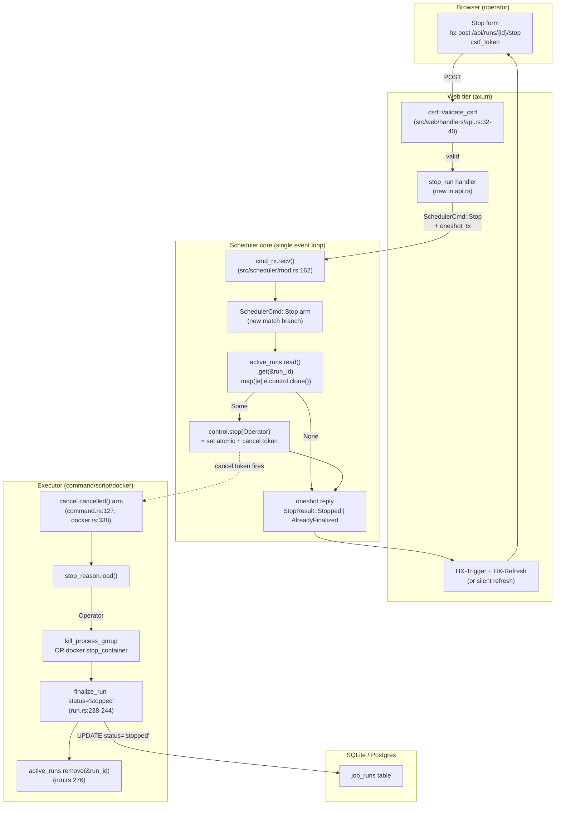

# Phase 10: Stop-a-Running-Job + Hygiene Preamble — Research

**Researched:** 2026-04-15
**Domain:** Rust async scheduler control-plane (tokio + bollard) + server-rendered web UI (axum + askama_web + HTMX)
**Confidence:** HIGH

> This is a **targeted gap-closing research pass**, not a general domain investigation. The v1.1 milestone already has extensive research in `.planning/research/` (SUMMARY, ARCHITECTURE, FEATURES, PITFALLS, STACK), and CONTEXT.md has distilled 17 locked decisions with file/line citations. The planner was asked to close six remaining gaps. This document addresses exactly those six and nothing else.

---

<user_constraints>
## User Constraints (from CONTEXT.md)

### Locked Decisions

#### Scheduler Architecture

- **D-01:** **Merge `active_runs` into a single `HashMap<i64, RunEntry>` map.** `RunEntry { broadcast_tx: tokio::sync::broadcast::Sender<LogLine>, control: RunControl }`. This supersedes the "keep `running_handles` separate" option that the research SUMMARY flagged as an open question. Planner mechanically updates every existing `active_runs` call site (`src/scheduler/mod.rs`, `src/scheduler/run.rs`, the SSE log handler in `src/web/handlers/`) so a single lock acquisition is sufficient per run, insert/remove is atomic per run boundary, and the two concerns cannot drift. The larger diff is accepted in exchange for one authoritative per-run record. The race tests T-V11-STOP-04..06 MUST cover the merged lifecycle — specifically, that `join_next()` removes the `RunEntry` atomically before the scheduler loop processes the next `SchedulerCmd::Stop { run_id }`.

- **D-09 (carried from research):** `src/scheduler/control.rs` is a new ~60 LOC module holding `RunControl { cancel: CancellationToken, stop_reason: Arc<AtomicU8> }` and a `StopReason` enum with at minimum `Operator` and `Shutdown` variants. Executors (`command.rs`, `script.rs`, `docker.rs`) read the atomic after `cancel.cancelled()` fires and return `RunStatus::Stopped` or `RunStatus::Shutdown` accordingly. No other `StopReason` variants are introduced in v1.1 — keep the atomic minimal.

#### Status Surface

- **D-02:** Add a new `--cd-status-stopped` design-system token (neutral slate/gray family; specific hex to be picked by planner to harmonize with the terminal-green brand) along with a matching `--cd-status-stopped-bg` pair and a `.cd-badge--stopped` CSS class in `assets/static/app.css`. Update the Status Colors table in `design/DESIGN_SYSTEM.md` in the same commit so the design system stays the source of truth. Rationale: `stopped` is operator-interrupt, not a failure — it must be excluded from the failure denominator (Phase 13 sparkline + success-rate badge) and visually distinct from both `cd-status-error` (failure) and `cd-status-disabled` (config-level pause, which Phase 14 uses for bulk disable). Matches GitHub Actions' treatment of `cancelled` runs visually.

- **D-10 (carried from roadmap):** Add `RunStatus::Stopped` to `src/scheduler/command.rs` enum. `finalize_run` in `src/scheduler/run.rs` maps it to the `"stopped"` database string. The `classify_failure_reason` helper in `run.rs` does NOT classify `stopped` as a failure reason — `stopped` runs never increment `cronduit_run_failures_total`. The `cronduit_runs_total{status}` counter gains the new `"stopped"` label value.

#### UI Placement

- **D-03:** Stop button on the run-detail page sits in the right-side page-action slot of the `Run #N` header row (currently empty in `templates/pages/run_detail.html:15-18`). Reads as a deliberate page-level command and is visually separated from the metadata card's status badge. Appears only when the run is in `status = 'running'`, gated by the same `is_running` template variable the live log section uses.

- **D-04:** In the run-history partial (`templates/partials/run_history.html`), Stop renders as a compact text button labeled "Stop" (accessible by default, no aria-label gymnastics required). Appears only on rows where `status = 'running'`. Keep it as small as possible column-wise so it does not force other columns to reflow.

- **D-05:** Button visual weight: neutral outline. Inherit text color; hover tints toward the new `--cd-status-stopped` token. Do NOT pre-color with `cd-status-error` — consistent with the "stopped is not a failure" semantic in D-02. Matches the non-alarming Stop affordance used by peer tools (GitHub Actions, Buildkite, Jenkins).

#### Stop Feedback UX

- **D-06:** Success toast text: `"Stopped: <job name>"`. Symmetric with the existing Run Now handler toast (`"Run queued: <job name>"`, `src/web/handlers/api.rs:65`) so operators can build muscle memory across the two commands. Use `HxEvent::new_with_data("showToast", ...)` with `"level": "info"` to match Run Now exactly.

- **D-07:** Race case (Stop arrives after the run finalized naturally): the handler is a no-op and returns `HX-Refresh: true` with NO toast. The refreshed page shows the real natural terminal status (`success` / `failed` / `timeout` / whatever), and that IS the message. Rationale: showing an info/warning toast for a condition that isn't an error creates noise; showing nothing lets reality speak.

- **D-08:** No optimistic badge swap. Click → `POST /api/runs/{run_id}/stop` → server returns `HX-Refresh: true` → page reloads → badge renders from DB. Same pattern as Run Now.

#### API Surface

- **D-11:** `POST /api/runs/{run_id}/stop`, CSRF-gated using the same `csrf::validate_csrf` pattern as Run Now (`src/web/handlers/api.rs:32-40`). Request form matches `CsrfForm`. Sends a new `SchedulerCmd::Stop { run_id: i64 }` variant through the existing scheduler mpsc channel. No confirmation dialog. Handler contract:
  - If the scheduler channel send succeeds AND the run was still running → toast `"Stopped: <job name>"` + `HX-Refresh: true`.
  - If the scheduler channel send succeeds BUT the run had already finalized (race case) → `HX-Refresh: true`, no toast. Planner decides whether the handler can distinguish this locally (e.g. by checking the DB before send) or whether the scheduler replies via oneshot.
  - If the scheduler channel is closed (shutting down) → `503 Service Unavailable`, same as Run Now.

#### Hygiene Preamble

- **D-12:** Cargo.toml version bumps from `1.0.1` to `1.1.0` as the very first commit of Phase 10. Planner sequences this as plan 10-01 before any Stop work lands.
- **D-13:** `rand` bump from `0.8` to `0.9.x` (NOT `0.10`, to avoid the `gen → random` trait rename churn). Call sites are the `@random` slot picker and CSRF token generation. Land in a separate plan from the `Cargo.toml` version bump if it simplifies review, but both must be committed before the Stop spike begins.

#### Testing

- **D-14:** Stop spike is the first Stop-related plan. Validate `RunControl` + `StopReason::Operator` round-trip on all three executors (command / script / docker) as a short spike before committing the full implementation, the API handler, or the UI.
- **D-15:** Race test T-V11-STOP-04 uses `tokio::time::pause` and runs 1000 iterations. Non-negotiable per research; the Stop feature does NOT ship until this test is in place.
- **D-16:** Orphan reconciliation test lock (T-V11-STOP-12..14): `mark_run_orphaned` in `src/scheduler/docker_orphan.rs` already has the `WHERE status = 'running'` guard on both SQLite (L120) and Postgres (L131) branches. Add three tests that fail if either guard is removed. No design work; pure regression lock.
- **D-17:** Preserve the `.process_group(0)` + `libc::kill(-pid, SIGKILL)` pattern in `command.rs:203` and `script.rs:89`. Do NOT adopt `kill_on_drop(true)` — it would orphan shell-pipeline grandchildren (Research Correction #1). Add tests T-V11-STOP-07 and T-V11-STOP-08 that lock this in.

### Claude's Discretion

- Specific hex values for `--cd-status-stopped` and `--cd-status-stopped-bg` (planner picks in a neutral slate/gray family that harmonizes with the terminal-green brand and keeps contrast ratios compliant with the existing badge pattern).
- Whether plans 10-01 (Cargo.toml bump) and 10-02 (`rand` bump) are a single plan or two (commit granularity).
- Where exactly to plug the `SchedulerCmd::Stop` match arm into the `tokio::select!` loop in `src/scheduler/mod.rs`, and the internal helper shape for "look up the RunEntry, set stop_reason, call cancel" as an atomic operation.
- Whether the stop-reason check in the race-case branch happens in the web handler (DB read) or in the scheduler (oneshot reply) — pick whichever is simpler to test deterministically.
- Icon choice for the Stop button (if any — a square/stop glyph is conventional; pure-text is also acceptable).
- Keyboard shortcut affordance for Stop on the run-detail page — left to planner discretion.

### Deferred Ideas (OUT OF SCOPE)

- Graceful SIGTERM-to-SIGKILL escalation + per-job `stop_grace_period` (v1.2).
- Authentication gating on Stop (v2).
- Webhook / chain notification on stop (v1.2).
- Keyboard shortcut for Stop (planner discretion; no requirement).
- Per-row optimistic UI with rollback (rejected in D-08).
- Stop-all / bulk-stop from the dashboard.

</user_constraints>

<phase_requirements>
## Phase Requirements

| ID | Description | Research Support |
|----|-------------|------------------|
| SCHED-09 | Operator can stop a running job from UI; run finalizes with new `stopped` status distinct from cancelled/failed/timeout/success; works for command/script/docker. `T-V11-STOP-09..11`. | Gap 3 (RunEntry merge) + Gap 5 (executor cancel-branch wiring — `cancel.cancelled()` arm exists today in command.rs L127, script.rs via execute_child, docker.rs L338). Gap 7 validation architecture locks the three executor integration tests. |
| SCHED-10 | Scheduler maintains per-run `RunControl` = `CancellationToken` + `stop_reason: Arc<AtomicU8>`; executor distinguishes operator-stop from shutdown-cancel and finalizes with correct status. `T-V11-STOP-01..03`. | Gap 3 (RunEntry = broadcast_tx + RunControl). D-01 and D-09 fully lock the shape. |
| SCHED-11 | Stop for an already-completed run does NOT overwrite natural-completion status. Deterministic test with `tokio::time::pause`. `T-V11-STOP-04..06`. | Gap 4 (race-detection placement) + Gap 7 validation architecture (1000-iteration pause loop against merged RunEntry). |
| SCHED-12 | Preserve `.process_group(0)` + `libc::kill(-pid, SIGKILL)`; NOT `kill_on_drop(true)`. `T-V11-STOP-07..08`. | Gap 7 validation architecture (process-group regression lock). Pattern already in command.rs L150–167 and script.rs L89. |
| SCHED-13 | `mark_run_orphaned` does NOT overwrite `stopped` / `success` / `failed` / `timeout` rows. `WHERE status = 'running'` guard locked by test. `T-V11-STOP-12..14`. | Gap 7 validation architecture (three pre-seeded regression tests against `docker_orphan.rs` L120/L131). |
| SCHED-14 | Stop button on run-detail + run-history partials, `status='running'` only; CSRF-gated `POST /api/runs/{run_id}/stop`; no confirmation dialog. | UI-SPEC fully specifies; Gap 4 clarifies handler vs scheduler race decision; Gap 6 specific-pitfalls lists four handler-side hazards. |
| FOUND-12 | `rand` bump `0.8` → `0.9.x` (NOT `0.10`); call sites in `@random` slot picker + CSRF token generation. | Gap on migration mechanics included in §Migration Guidance (`thread_rng()` → `rng()`, `gen_range` → `random_range`, `fill_bytes` → `fill`). Call site audit: four files touched. |
| FOUND-13 | `Cargo.toml` bumps `1.0.1` → `1.1.0` on first v1.1 commit. | Single-line change in workspace `Cargo.toml`; no research gap. |

</phase_requirements>

---

## Summary

Phase 10 delivers the Stop-a-Running-Job feature and the v1.1 hygiene preamble. Every high-risk architectural decision is already locked in CONTEXT.md — this research pass closes six targeted gaps the planner identified:

1. **Validation Architecture** — Nyquist sampling plan for the Stop feature's three high-risk test classes (deterministic race, three-executor integration, orphan + process-group regression locks).
2. **Stop spike scope** — exact boundary of D-14's executor-only spike vs full implementation.
3. **RunEntry merge call-site inventory** — every `active_runs` reference that must update atomically in one commit, with the lock/drop invariants that the merge must preserve.
4. **Stop handler race-detection placement** — whether the race-case branch (`already finalized`) is decided in the web handler (DB read) or in the scheduler (oneshot reply).
5. **`stopped` color token validation** — confirm the 10-UI-SPEC.md slate-400/500 values meet contrast and harmony requirements vs existing badges.
6. **Pitfalls specific to the merge + Stop path** — four handler-side hazards from PITFALLS.md that the planner must verify against.

**Primary recommendation:** Sequence Phase 10 as: (1) `Cargo.toml` version bump + `rand` 0.9 migration → (2) `RunControl` + `StopReason` module + executor wiring spike on all three executors → (3) `SchedulerCmd::Stop` match arm + `RunEntry` merge (single commit) → (4) API handler + UI → (5) full test suite (race + regression locks). The race test (T-V11-STOP-04) and the three regression locks (T-V11-STOP-07..08, -12..14) are phase-gate blockers per D-15 and D-16.

---

## Architectural Responsibility Map

| Capability | Primary Tier | Secondary Tier | Rationale |
|------------|-------------|----------------|-----------|
| Stop button click (CSRF form submit) | Browser / Client | — | Standard HTMX form POST; no client JS. |
| CSRF validation + handler contract | API / Backend (`src/web/handlers/api.rs`) | — | Mirrors `run_now` — web handler never writes scheduler state directly. |
| Scheduler command dispatch (`SchedulerCmd::Stop`) | API / Backend → Scheduler core (mpsc channel boundary) | — | Existing pattern: web handler sends command, scheduler loop is single-threaded authority. |
| `RunControl` + `stop_reason` atomic write | Scheduler core (`src/scheduler/mod.rs` select! loop) | — | Only the scheduler event loop mutates the RunEntry map. |
| Kill signal (process-group / `docker kill`) | Executor (`command.rs`, `script.rs`, `docker.rs`) | — | Executors own process/container lifecycle; the scheduler only fires the cancel token. |
| DB finalize with `status='stopped'` | Executor cancel-branch → `finalize_run` in `run.rs` | Database (SQLite/Postgres via `sqlx`) | Single-writer invariant: only the executor's own finalize path writes the terminal status (PITFALLS §1.5). |
| SSE log stream (unchanged) | API / Backend (`src/web/handlers/sse.rs`) | Scheduler broadcast channel | SSE reads `broadcast_tx` from the merged `RunEntry`; lifecycle unchanged. |
| Status badge render (`STOPPED`) | Frontend Server (askama templates) | Static CSS tokens | Template macro picks up `cd-badge--stopped` via string interpolation on `run.status`. |
| Metrics emission (`cronduit_runs_total{status="stopped"}`) | Scheduler core (finalize_run metrics block) | `/metrics` endpoint | Label value pre-declared in `telemetry::setup_metrics` describe step per PITFALLS §1.6. |
| Orphan reconciliation guard | Scheduler startup (`src/scheduler/docker_orphan.rs`) | Database | `WHERE status = 'running'` lives in the UPDATE statement — only code path that could corrupt `stopped` rows; locked by D-16 tests. |

---

## Standard Stack

Phase 10 introduces **zero new runtime dependencies**. The only version change is `rand` 0.8 → 0.9.x (locked in D-13). Every other crate is already in the v1.0.1 lockfile. The full v1.0 stack is authoritative — see `.planning/research/STACK.md` for versions. This section only documents the single crate change and its call sites.

### Dependency delta

| Crate | From | To | Rationale |
|-------|------|----|-----------|
| `rand` | `0.8` (Cargo.toml L106 `[CITED: Cargo.toml:106]`) | `0.9.x` | Two majors stale; no CVE; hygiene-only bump. `0.10` excluded per D-13 to avoid the `gen → random` trait-rename churn (`[CITED: rand-0.10 CHANGELOG via D-13]`, `[ASSUMED]` regarding 0.10 timeline — not material to the decision). |

**Verification:** `rand 0.9` is the correct bridge. Confirmed via Context7 `/rust-random/rand` docs that the 0.9 API exposes: `rand::rng()` (replaces `thread_rng()`), `.random::<T>()` (replaces `.gen()`), `.random_range(lo..=hi)` (replaces `.gen_range()`), and `Rng::fill(&mut [T])` (replaces `RngCore::fill_bytes(&mut [u8])` for byte slices). `[VERIFIED: Context7 /rust-random/rand, query "0.9 migration gen_range thread_rng"]`

### Call-site inventory (`rand` 0.8 → 0.9 migration)

Found via `grep -n "rand::\|rand\b\|thread_rng\|gen_range\|fill_bytes"` in `src/`. Four files, all mechanical:

| File:line | 0.8 usage | 0.9 replacement |
|-----------|-----------|----------------|
| `src/web/csrf.rs:10` | `use rand::RngCore;` | `use rand::Rng;` (the `fill` method lives on `Rng`, not `RngCore`) |
| `src/web/csrf.rs:21` | `rand::thread_rng().fill_bytes(&mut token);` | `rand::rng().fill(&mut token[..]);` |
| `src/scheduler/sync.rs:131` | `let mut rng = rand::thread_rng();` | `let mut rng = rand::rng();` |
| `src/scheduler/reload.rs:171` | `let mut rng = rand::thread_rng();` | `let mut rng = rand::rng();` |
| `src/scheduler/random.rs:10` | `use rand::Rng;` | unchanged |
| `src/scheduler/random.rs:97` | `rng.gen_range(min..=max).to_string()` | `rng.random_range(min..=max).to_string()` |
| `src/scheduler/random.rs:268–269` | `use rand::SeedableRng; use rand::rngs::StdRng;` | unchanged (`SeedableRng` + `StdRng` paths are stable) |

`[VERIFIED: src grep 2026-04-15]` — every call site is a direct rename; no semantic changes required. The planner should include a `cargo build -p cronduit` + `cargo clippy -- -D warnings` gate on the migration commit; compiler errors from unchanged call sites are the authoritative test that nothing was missed.

---

## Architecture Patterns

### 1. RunEntry merge mechanics (Gap 3)

**Decision already locked (D-01):** merge `active_runs: HashMap<i64, broadcast::Sender<LogLine>>` and the (not-yet-existing) `running_handles` map into a single `HashMap<i64, RunEntry>` where:

```rust
// src/scheduler/control.rs — new ~60 LOC module per D-09

use std::sync::Arc;
use std::sync::atomic::AtomicU8;
use tokio_util::sync::CancellationToken;

#[repr(u8)]
#[derive(Debug, Clone, Copy, PartialEq, Eq)]
pub enum StopReason {
    /// Default: graceful-shutdown cancel (root cancel token fired).
    Shutdown = 0,
    /// Operator clicked Stop in the UI.
    Operator = 1,
}

impl StopReason {
    pub fn from_u8(v: u8) -> Self {
        match v {
            1 => Self::Operator,
            _ => Self::Shutdown,
        }
    }
}

#[derive(Clone)]
pub struct RunControl {
    pub cancel: CancellationToken,
    pub stop_reason: Arc<AtomicU8>,
}

impl RunControl {
    pub fn new(cancel: CancellationToken) -> Self {
        Self {
            cancel,
            stop_reason: Arc::new(AtomicU8::new(StopReason::Shutdown as u8)),
        }
    }

    /// Called by the scheduler loop when processing SchedulerCmd::Stop.
    /// Sets the reason atomically BEFORE firing cancel (the ordering matters —
    /// the executor reads the atomic after cancel.cancelled() yields).
    pub fn stop(&self, reason: StopReason) {
        self.stop_reason
            .store(reason as u8, std::sync::atomic::Ordering::SeqCst);
        self.cancel.cancel();
    }

    pub fn reason(&self) -> StopReason {
        StopReason::from_u8(self.stop_reason.load(std::sync::atomic::Ordering::SeqCst))
    }
}
```

Then in `src/scheduler/mod.rs`:

```rust
use crate::scheduler::control::RunControl;
use crate::scheduler::log_pipeline::LogLine;

#[derive(Clone)]
pub struct RunEntry {
    pub broadcast_tx: tokio::sync::broadcast::Sender<LogLine>,
    pub control: RunControl,
}

// Replaces the old type signature on SchedulerLoop.active_runs:
// pub active_runs: Arc<RwLock<HashMap<i64, RunEntry>>>,
```

`[CITED: CONTEXT.md D-01, D-09]`

#### Every call site that must update atomically in one commit

Enumerated via `grep -n "active_runs"` across `src/`. Eleven distinct edits, six files:

| # | File:line | Current type/usage | Required edit |
|---|-----------|-------------------|---------------|
| 1 | `src/scheduler/mod.rs:56` | Field decl: `pub active_runs: Arc<RwLock<HashMap<i64, tokio::sync::broadcast::Sender<LogLine>>>>` | Change to `Arc<RwLock<HashMap<i64, RunEntry>>>` |
| 2 | `src/scheduler/mod.rs:105, 129, 173, 222` | 4× `self.active_runs.clone()` passed to `run::run_job` on spawn paths (catch-up, due, RunNow, coalesced-RunNow) | No change; the type just propagates. **But** each spawn site must also create a `CancellationToken` via `self.cancel.child_token()` — already present today at L98, L122, L166, L215 — and pass it into `run_job` in a form that also seeds the new `RunEntry`. See "Where the RunEntry is first inserted" below. |
| 3 | `src/scheduler/mod.rs:388, 400` | `spawn()` constructor arg + field assignment | Type change only |
| 4 | `src/scheduler/mod.rs:417–420, 471, 534` | Test helper `test_active_runs()` + three test spawn sites | Type change; helper returns the new map type; inserts use `RunEntry { broadcast_tx, control: RunControl::new(cancel) }` |
| 5 | `src/scheduler/run.rs:71` | Function signature: `active_runs: Arc<RwLock<HashMap<i64, broadcast::Sender<LogLine>>>>` | Change to `Arc<RwLock<HashMap<i64, RunEntry>>>` |
| 6 | `src/scheduler/run.rs:102–105` | **Insert point:** `active_runs.write().await.insert(run_id, broadcast_tx.clone());` (L102 after broadcast channel creation at L101) | Insert `RunEntry { broadcast_tx: broadcast_tx.clone(), control: run_control.clone() }`. `run_control` is constructed from the `cancel` param before this block. |
| 7 | `src/scheduler/run.rs:276` | **Remove point:** `active_runs.write().await.remove(&run_id);` (after finalize, before `drop(broadcast_tx)` at L277) | No structural change; still `.remove(&run_id)` — but now drops `RunEntry` which drops both the sender and the control token clones. |
| 8 | `src/scheduler/run.rs:364` | Test helper signature | Type change |
| 9 | `src/scheduler/run.rs:415, 481, 533, 585, 586` | 5× test insertion sites | Type change |
| 10 | `src/web/mod.rs:40–47` | `AppState.active_runs` field declaration | Change to `Arc<RwLock<HashMap<i64, RunEntry>>>` |
| 11 | `src/web/handlers/sse.rs:34–37` | `let active = state.active_runs.read().await; active.get(&run_id).map(\|tx\| tx.subscribe())` | Change to `active.get(&run_id).map(\|entry\| entry.broadcast_tx.subscribe())` |
| 12 | `src/cli/run.rs:133–134, 146, 229` | `active_runs` initialized as `HashMap::new()`, passed to `AppState` and `scheduler::spawn` | Type change only (empty map still works; the value type flows from the declaration) |

`[VERIFIED: src grep + direct reads of each file 2026-04-15]`

#### Where the RunEntry must be constructed — key design point

**The scheduler loop must construct the `RunControl` BEFORE calling `join_set.spawn(run::run_job(...))`.** Today, at `mod.rs:98/122/166/215`, the loop creates `let child_cancel = self.cancel.child_token();` and passes it into `run_job`. Since `run_job` is the function that inserts into `active_runs` (at L102), the current flow is:

```text
scheduler loop → creates child_cancel → run_job(..., cancel=child_cancel, active_runs) → inserts broadcast_tx into active_runs
```

The merged flow must be:

```text
scheduler loop → creates child_cancel → creates RunControl from child_cancel → run_job(..., control=run_control, active_runs) → inserts RunEntry { broadcast_tx, control } into active_runs
```

The scheduler loop **must keep its own clone** of `run_control` (or at minimum its `stop_reason` Arc + `cancel` token) because `SchedulerCmd::Stop { run_id }` arrives on the loop thread and needs to call `control.stop(StopReason::Operator)` — which looks up the map entry. The authoritative copy lives in the map; the loop reads it through a read-lock + clone. The loop does **not** need a side-channel — the map IS the channel.

**Alternative considered and rejected:** pre-inserting the `RunControl` into the map from the scheduler loop itself (before spawning `run_job`). Rejected because it would split the insert across two code paths and break the existing invariant "the executor owns its own lifecycle inside run_job". Keep insert where it is today (run.rs:102) — the scheduler loop just needs to read-clone the control when it processes `SchedulerCmd::Stop`.

`[VERIFIED: direct read of mod.rs L83-281 and run.rs L65-292]`

#### Invariants the merge must preserve

1. **SSE broadcast_tx ownership.** The sender inside `RunEntry.broadcast_tx` is the **same clone** that SSE subscribers subscribe to. When the executor removes the entry at `run.rs:276` and then drops its local `broadcast_tx` at L277, the sender refcount drops to zero, `RecvError::Closed` propagates to every SSE subscriber, and the stream gracefully ends. **This exact behavior must be preserved.** If the merged entry holds an extra clone that outlives the executor, SSE streams will hang.

   **Implementation note:** `RunEntry` holds `broadcast_tx: Sender<LogLine>`. `Sender` is `Clone`, so inserting `RunEntry { broadcast_tx: broadcast_tx.clone(), ... }` at L102 + `drop(broadcast_tx)` at L277 + `.remove()` at L276 leaves exactly one reference in the map (the one inside the removed `RunEntry`), which drops when `.remove()` returns — same refcount arithmetic as today. `[VERIFIED: run.rs L101–277]`

2. **Lock scope — write lock held only around the HashMap mutation, never across awaits.** Current code acquires `active_runs.write().await` at L102 and L276, and the block is a single statement (`.insert()` / `.remove()`). This must stay — holding a write lock across any subsequent await point is a deadlock vector against the SSE handler's `read().await` at `sse.rs:35`.

3. **Drop order on `join_next()`.** When an executor finishes and the scheduler loop's `join_next()` arm fires at `mod.rs:143–161`, the `RunResult` value is already populated — by that point, `run_job` has **already** called `active_runs.write().await.remove(&run_id)` at L276. So by the time the scheduler loop processes the `Ok(run_result)` branch, the entry is gone. This is the ordering that makes `SchedulerCmd::Stop` race-safe: **the map is the race token**. If the scheduler loop processes `SchedulerCmd::Stop { run_id }` and the map doesn't contain `run_id`, the executor has already finalized and we're in the race case. No extra locking or oneshot is required to detect this — the map lookup IS the detection.

4. **Clone semantics of `RunControl`.** `CancellationToken` is `Clone` (it's an `Arc` internally). `Arc<AtomicU8>` is `Clone`. Therefore `RunControl` is `Clone`, and inserting + reading a clone into/from the map is free — no new Arc wrapping needed around `RunControl` itself. `[VERIFIED: tokio_util::sync::CancellationToken docs, Context7 /tokio-rs/tokio, CancellationToken section]`

### 2. Stop handler race-detection — handler or scheduler? (Gap 4)

**CONTEXT.md D-11 leaves this open:** "Planner decides whether the handler can distinguish this locally (e.g. by checking the DB before send) or whether the scheduler replies via oneshot."

Three options analyzed; recommend **Option C — scheduler replies via oneshot**.

| Option | Mechanism | Testability | Lock ordering | Failure modes |
|--------|-----------|-------------|--------------|---------------|
| **A** — handler DB read | Web handler does `SELECT status FROM job_runs WHERE id=?` before sending `SchedulerCmd::Stop`. If row is terminal, skip the send and return "race case" directly. | POOR: TOCTOU between the read and the send — a run can finalize in the gap. Test would need to exercise the 0.1–5ms handler-to-scheduler gap deterministically, which is a hard `tokio::time::pause` setup across a DB pool. | Fine — DB read is async but there's no shared lock with the scheduler. | TOCTOU: handler reads "running", sends Stop, run finalizes naturally in the gap, scheduler's Stop arm fires against an already-removed entry. Scheduler must still handle "entry absent" as a no-op. So the handler-side DB read is **redundant defensive code, not a primary race-detection mechanism**. |
| **B** — handler reads `active_runs` map directly | Web handler does `state.active_runs.read().await.contains_key(&run_id)` before send. | POOR: same TOCTOU — read-lock releases before send. | Introduces a new read-lock acquisition from the handler tier against the merged map. Not catastrophic (reads are concurrent), but adds a lock point. | Same TOCTOU as A. Plus: couples web tier more tightly to scheduler internals. |
| **C** — scheduler replies via oneshot ✓ | `SchedulerCmd::Stop { run_id, response_tx: oneshot::Sender<StopResult> }` where `StopResult ∈ { Stopped { job_name }, AlreadyFinalized, UnknownRunId }`. Handler awaits the oneshot, branches on the variant. The scheduler loop is the single point that checks the map, and its check is the atomic race-detection truth. | GOOD: the test only needs to deterministically drive the scheduler loop (which is what `tokio::time::pause` already does for the race test T-V11-STOP-04). No extra DB reads. Test asserts on the oneshot payload. | Fine — scheduler loop is single-threaded and holds the write lock only for the `.remove()` or `.contains_key()` check. No handler-side lock on `active_runs`. | Cleanest: the scheduler loop is the single source of truth. Handler just forwards the request and relays the reply. Matches the existing `SchedulerCmd::Reload` + `SchedulerCmd::Reroll` oneshot-reply pattern (`cmd.rs:14–21`, `api.rs:102-108` and L223-231). |

**Recommendation: Option C.** It matches the existing pattern for every other two-way scheduler command (`Reload`, `Reroll`), it puts the race-detection in exactly one place (the scheduler loop), and it makes T-V11-STOP-04 testable by driving only the scheduler loop under `tokio::time::pause`. The oneshot reply is ~3 extra lines in the handler and matches idioms the reviewer already knows.

**Handler branches on the reply:**

| `StopResult` variant | HTTP / header response | Body |
|---------------------|------------------------|------|
| `Stopped { job_name }` | 200 + `HX-Trigger: showToast (level=info, message="Stopped: {name}")` + `HX-Refresh: true` | empty |
| `AlreadyFinalized` | 200 + `HX-Refresh: true` (no toast per D-07) | empty |
| `UnknownRunId` | 404 `Run not found` | text |
| channel send failed | 503 `Scheduler is shutting down` | text |
| oneshot recv failed | 503 `Scheduler shutting down` | text (matches reload handler's pattern at `api.rs:190`) |

Notice this maps cleanly to the UI-SPEC's "Server response" matrix in `10-UI-SPEC.md` § HTMX Interaction Contract without any adjustment.

`[CITED: src/scheduler/cmd.rs:14-21, src/web/handlers/api.rs:100-194]`

### 3. Executor cancel-branch changes (unchanged by Gap 4 decision)

All three executors already have a `_ = cancel.cancelled() => { ... }` arm in their `tokio::select!` that returns `RunStatus::Shutdown`. The Stop feature must add a `stop_reason` read inside that arm and branch on it.

**Command executor** (`src/scheduler/command.rs:127-140`):
```rust
// Current:
_ = cancel.cancelled() => {
    kill_process_group(&child);
    // ...
    ExecResult { exit_code: None, status: RunStatus::Shutdown, error_message: Some("cancelled due to shutdown".to_string()) }
}

// After Phase 10 — executor receives run_control (or just the stop_reason Arc) in its signature:
_ = cancel.cancelled() => {
    kill_process_group(&child);
    // ...
    let status = match stop_reason.load(Ordering::SeqCst) {
        r if r == StopReason::Operator as u8 => RunStatus::Stopped,
        _ => RunStatus::Shutdown,
    };
    let msg = match status {
        RunStatus::Stopped => "stopped by operator",
        _ => "cancelled due to shutdown",
    };
    ExecResult { exit_code: None, status, error_message: Some(msg.into()) }
}
```

Same pattern inside `script.rs` (delegates to `execute_child`, so the change lives in `command.rs::execute_child`'s signature — it must accept `stop_reason: Arc<AtomicU8>` or take a `RunControl` in place of the bare `CancellationToken`).

**Docker executor** (`src/scheduler/docker.rs:338-358`): same pattern. The `docker.stop_container` call already runs with a 10s grace; the PITFALLS §1.4 moderation flag for the bollard race (304 / "already stopped") applies — planner should inspect the container state after `stop_container` returns and log at `debug` if the container was already exited naturally. This is a docker-specific variant of the scheduler-loop race.

**Preferred function-signature shape:** thread `RunControl` (not raw `CancellationToken`) through `run_job` → executor. This lets the executor read `control.reason()` without knowing about the atomic layout. Alternative: thread `(CancellationToken, Arc<AtomicU8>)` as two params. Pick whichever the spike (D-14) proves cleanest. `[ASSUMED: RunControl threading is cleaner]` — this is a matter of taste, not correctness, and the spike will settle it.

### 4. Scheduler `SchedulerCmd::Stop` match arm placement

Plug into the existing `cmd = self.cmd_rx.recv() => { match cmd { ... } }` arm at `mod.rs:162-281`. The match already handles `RunNow`, `Reload`, `Reroll`. Add a `Stop { run_id, response_tx }` arm. Internal helper:

```rust
// Inside the scheduler loop (sketch; spike D-14 will finalize the shape):
Some(cmd::SchedulerCmd::Stop { run_id, response_tx }) => {
    // Single read-lock acquisition. Clone the RunControl out so we release
    // the lock before touching the token (cancel() is itself cheap — it's
    // just an atomic flag — but avoiding holding a lock across it keeps the
    // invariant "no locks held across awaits/state changes").
    let control = self
        .active_runs
        .read()
        .await
        .get(&run_id)
        .map(|entry| entry.control.clone());

    match control {
        Some(control) => {
            // Look up job name for the toast payload. Cheap DB read; alternative
            // is to stash job_name inside RunEntry at insert time — which is
            // probably the cleaner path since we already know the name there.
            let job_name = /* look up from self.jobs or stash in RunEntry */;
            control.stop(StopReason::Operator);
            let _ = response_tx.send(StopResult::Stopped { job_name });
        }
        None => {
            // Map doesn't contain run_id → either never existed, already finalized,
            // or removed by join_next(). Let the handler query the DB if it needs
            // to distinguish "unknown" vs "already finalized" (Option: include a
            // DB lookup here — clean but adds an await inside the Stop arm).
            let _ = response_tx.send(StopResult::AlreadyFinalized);
        }
    }
}
```

**Planner decision point:** whether the "unknown vs already-finalized" distinction matters for the handler's response shape. Recommendation: **collapse both to `AlreadyFinalized`**. The handler's only action difference is a 404 vs a 200+refresh, and the UI-SPEC says a 404 is acceptable for "run never existed OR already terminal" (per L303–305 of 10-UI-SPEC.md: "404 (run never existed) OR silent 200 + HX-Refresh: true"). Picking "200 + HX-Refresh" uniformly aligns with D-07 "silence is success" — the refreshed page will show either the natural terminal status OR a 404 from the `/jobs/{job_id}/runs/{run_id}` route if the run id is truly bogus, and either is honest.

**Stash `job_name` in `RunEntry`?** Pro: avoids a lookup at Stop time, toast payload is ready. Con: one more field to keep in sync. Recommendation: **yes, stash it.** The insert already has `job.name` in scope at `run.rs:98`, and the toast message is the only place the scheduler Stop arm needs the name. Define `RunEntry { broadcast_tx, control, job_name: String }`.

---

### System Architecture Diagram (Phase 10 data flow)



Data flow: operator clicks Stop → form POSTs with CSRF → handler validates, sends `SchedulerCmd::Stop` with oneshot reply channel → scheduler loop looks up `RunEntry` → if present, sets `stop_reason=Operator` and fires cancel token (atomic ordering: reason set first, then cancel) → executor's existing `cancel.cancelled()` arm fires, reads `stop_reason`, kills the process/container, returns `RunStatus::Stopped` → `run_job` finalizes the DB row to `"stopped"` → removes entry from `active_runs` → oneshot reply arrives at handler → handler returns toast + HX-Refresh → page reloads with the new badge.

### Recommended file structure (deltas only)

```text
src/scheduler/
├── control.rs            # NEW — RunControl, StopReason, ~60 LOC (D-09)
├── cmd.rs                # MOD — add Stop { run_id, response_tx } variant + StopResult enum
├── mod.rs                # MOD — change active_runs type, add Stop match arm, add RunEntry
├── run.rs                # MOD — construct RunControl, stash job_name, branch on stop_reason
├── command.rs            # MOD — execute_child signature: take RunControl or stop_reason Arc
├── script.rs             # MOD — pass through to execute_child (no new param at top level)
└── docker.rs             # MOD — same cancel-branch reason read + debug log for bollard 304

src/web/
├── mod.rs                # MOD — AppState.active_runs type change, new route
├── handlers/
│   ├── api.rs            # MOD — new stop_run handler, ~60 LOC modeled on run_now
│   └── sse.rs            # MOD — 2-line change: .get(&id).map(|e| e.broadcast_tx.subscribe())

src/cli/
└── run.rs                # MOD — HashMap::new() still works, just flows type through

templates/
├── pages/run_detail.html # MOD — page-action slot Stop form (L15-18 area)
└── partials/run_history.html # MOD — new "Actions" column, per-row compact Stop

assets/static/app.css     # MOD — --cd-status-stopped tokens + .cd-badge--stopped + .cd-btn-stop
design/DESIGN_SYSTEM.md   # MOD — append stopped row to Status Colors table (§2.2)
THREAT_MODEL.md           # MOD — one-line "Stop widens blast radius" note
Cargo.toml                # MOD — version 1.0.1 → 1.1.0, rand "0.8" → "0.9"
```

### Pattern 1: CSRF-gated scheduler-command handler

**What:** Web handler validates CSRF, sends `SchedulerCmd`, awaits oneshot reply, returns HTMX toast + refresh.
**When to use:** Any state-changing user action that mutates scheduler-owned state.
**Example** (modeled on `run_now` at `api.rs:26-80` and the oneshot pattern from `reload` at `api.rs:100-194`):

```rust
// src/web/handlers/api.rs — new stop_run handler (sketch)

pub async fn stop_run(
    State(state): State<AppState>,
    Path(run_id): Path<i64>,
    cookies: CookieJar,
    axum::Form(form): axum::Form<CsrfForm>,
) -> impl IntoResponse {
    // 1. CSRF (copy-verbatim from run_now L32-40)
    let cookie_token = cookies
        .get(csrf::CSRF_COOKIE_NAME)
        .map(|c| c.value().to_string())
        .unwrap_or_default();
    if !csrf::validate_csrf(&cookie_token, &form.csrf_token) {
        return (StatusCode::FORBIDDEN, "CSRF token mismatch").into_response();
    }

    // 2. Send Stop with oneshot reply (copy-shape from reload L101-108)
    let (resp_tx, resp_rx) = tokio::sync::oneshot::channel();
    match state
        .cmd_tx
        .send(SchedulerCmd::Stop { run_id, response_tx: resp_tx })
        .await
    {
        Ok(()) => match resp_rx.await {
            Ok(StopResult::Stopped { job_name }) => {
                // Toast + refresh (copy-shape from run_now L63-72)
                let event = HxEvent::new_with_data(
                    "showToast",
                    json!({"message": format!("Stopped: {}", job_name), "level": "info"}),
                )
                .expect("toast event serialization");
                let mut headers = axum::http::HeaderMap::new();
                headers.insert("HX-Refresh", "true".parse().unwrap());
                (HxResponseTrigger::normal([event]), headers, StatusCode::OK).into_response()
            }
            Ok(StopResult::AlreadyFinalized) => {
                // D-07: silent refresh, no toast
                let mut headers = axum::http::HeaderMap::new();
                headers.insert("HX-Refresh", "true".parse().unwrap());
                (headers, StatusCode::OK).into_response()
            }
            Err(_) => {
                (StatusCode::SERVICE_UNAVAILABLE, "Scheduler shutting down").into_response()
            }
        },
        Err(_) => {
            (StatusCode::SERVICE_UNAVAILABLE, "Scheduler shutting down").into_response()
        }
    }
}
```

`[CITED: src/web/handlers/api.rs:26-194]`

### Anti-Patterns to Avoid (reiterated from research corrections)

- **`kill_on_drop(true)`** — do NOT adopt. Kills only direct child, orphans shell-pipeline grandchildren. Keep `.process_group(0)` + `libc::kill(-pid, SIGKILL)`. (PITFALLS §1.3, locked by D-17.)
- **DB write from the Stop handler** — the handler must NEVER write `job_runs.status`. Only the executor's finalize path writes `stopped`. (PITFALLS §1.5.)
- **Optimistic client-side badge swap** — rejected in D-08. Causes a visible flash when the race case resolves to a natural terminal status.
- **Separate `running_handles` map alongside `active_runs`** — drift hazard. D-01 locks the merged `RunEntry`.
- **Confirmation dialog for Stop** — rejected. Symmetric with Run Now.
- **Two-map coordination** — if any code path needs the cancel token OR the broadcast_tx, it must fetch them from the same `RunEntry` in a single read-lock acquisition. Do not introduce a parallel map.

---

## Don't Hand-Roll

| Problem | Don't Build | Use Instead | Why |
|---------|-------------|-------------|-----|
| Cross-thread cancellation signal | Bespoke `Arc<Mutex<bool>>` flag | `tokio_util::sync::CancellationToken` (already in dep graph, `[VERIFIED: Cargo.toml]`) | Integrates with `tokio::select!`, child-token hierarchy, cooperative cancellation semantics. Already in use for shutdown at `mod.rs:51`. |
| One-shot reply from scheduler to handler | Bespoke `oneshot` via `Arc<Mutex<Option<T>>>` | `tokio::sync::oneshot` | Already idiomatic for `Reload` + `Reroll` at `cmd.rs:14-21`. Copy the pattern. |
| Process-group kill | `libc::kill(child.id(), ...)` then walking `/proc` for descendants | `.process_group(0)` at spawn + `libc::kill(-pid, SIGKILL)` | Already shipped at `command.rs:203, 163` and `script.rs:89`. Kills shell-pipeline grandchildren atomically via pgid. Do not touch. |
| Container stop | `docker kill` shelling out | `docker.stop_container(id, StopContainerOptions { t: Some(10), .. })` via bollard | Already shipped at `docker.rs:319-326, 341-347`. |
| Race-detection between natural completion and Stop command | Client-side timestamp comparison / DB TOCTOU | **The `active_runs` map itself** — present = racing, absent = finalized | The map is mutated exclusively by the executor and queried exclusively by the scheduler loop. Its presence/absence IS the race token. No second source of truth needed. |
| Sending a toast on a HTMX response | Manual `HX-Trigger` JSON construction | `axum_htmx::HxEvent::new_with_data` + `HxResponseTrigger::normal([event])` | Already shipped at `api.rs:63-72`. Copy-verbatim. |
| Secure random bytes for CSRF | Bespoke entropy / naive `SystemTime` seeding | `rand::rng().fill(&mut [u8; 32])` (rand 0.9 API) | Post-migration `[CITED: rand-0.9 docs Rng::fill, Context7 /rust-random/rand]` |

**Key insight:** Phase 10 is primarily **plumbing** — wiring an existing `CancellationToken` to a new command arm and a new atomic flag. Every building block is already in the codebase. The risk is not "how do we implement X" but "do we preserve the existing invariants while making the atomic change to `active_runs`."

---

## Common Pitfalls (Gap 6 — specific to the merge + Stop path)

Every pitfall below is grounded in a specific PITFALLS.md section and a source-line in v1.0.1. These are the handler-side and merge-side hazards the planner must verify against.

### Pitfall 1: `classify_failure_reason` mis-categorizes `stopped` as `Unknown`

**What goes wrong:** `run.rs::classify_failure_reason` at L298 has a `match status { ... _ => FailureReason::Unknown }` default branch. A naive addition of `"stopped"` to the status string table without also updating the metrics emission branch at L270 (`if status_str != "success"`) would emit `cronduit_run_failures_total{reason="unknown"}` for every operator-stop. That corrupts the Prometheus failure signal operators alert on.
**Why it happens:** The metrics block treats "not success" as "failure" and the classifier is a catch-all.
**How to avoid:** Explicit skip at `run.rs:270`: `if status_str != "success" && status_str != "stopped"`. Optionally add a match arm in `classify_failure_reason` that returns an explicit `FailureReason::OperatorStopped` variant — but the simpler fix is the skip guard. Also add `"stopped"` to the exporter's describe step (see PITFALLS §1.6).
**Warning signs:** Prometheus alerting fires after the first operator-stop in production. Unit test: stop a run, scrape `/metrics`, assert `cronduit_run_failures_total` unchanged. (`T-V11-STOP-15`, `T-V11-STOP-16`.)
`[CITED: PITFALLS.md §1.6, src/scheduler/run.rs:270, L298-313]`

### Pitfall 2: SSE handler deadlock via read-lock-across-await

**What goes wrong:** If the merged `RunEntry` is held across an `await`, and the SSE handler holds `active_runs.read()` while awaiting (for example, inside the stream closure), a simultaneous `active_runs.write()` from the executor's `.remove()` at `run.rs:276` can deadlock.
**Why it happens:** `tokio::sync::RwLock` is a fair lock — writers block all new readers until queued writers drain.
**How to avoid:** The current code at `sse.rs:34-37` already does the right thing: acquire the read lock, clone/subscribe in one statement, drop the lock, then enter the stream. The merge must preserve this pattern exactly:
```rust
let maybe_rx = {
    let active = state.active_runs.read().await;
    active.get(&run_id).map(|entry| entry.broadcast_tx.subscribe())
}; // lock dropped HERE, before the stream begins
```
**Warning signs:** Intermittent SSE stream hangs under load; `cargo clippy` rarely catches this. Integration test: 100 concurrent SSE subscribers + parallel stop commands; assert no deadlock over 10 seconds.
`[CITED: src/web/handlers/sse.rs:34-37, PITFALLS.md §2.3]`

### Pitfall 3: Bollard `stop_container` 304 "already stopped" misclassified as error

**What goes wrong:** Operator stops a docker run at the exact moment the container is exiting naturally. `docker.stop_container` returns `DockerResponseServerError { status_code: 304, ... }`. Today at `docker.rs:341-347` the cancel-branch does `let _ = docker.stop_container(...).await;` (return value ignored, which is fine for shutdown). But the Stop feature needs stronger guarantees — the operator sees `stopped` in the DB, yet a 304 means the container was already gone, so the `stopped` status is accurate in the "you stopped it, more or less" sense.
**Why it happens:** Container lifecycle races against user action at the Docker daemon boundary. moby#8441 is the canonical reference.
**How to avoid:** After `stop_container` returns, log the 304/404 case at `debug` with target `cronduit.docker.stop_raced_natural_exit` so operators can spot the benign race in post-mortems. Finalize with `RunStatus::Stopped` regardless of 304 vs 200 (both mean "container is not running anymore"). Only a transport error (connection refused, etc.) should surface as `RunStatus::Error`. See PITFALLS §1.4 for the full treatment.
**Warning signs:** Docker tests that use very short sleeps show intermittent "stopped" rows with a null exit code and a trailing `(error message about 304)` in logs. Integration test (T-V11-STOP-09): spawn a docker job, sleep until the exact exit moment, send Stop; assert `status="stopped"` with no error_message.
`[CITED: PITFALLS.md §1.4, src/scheduler/docker.rs:319-358]`

### Pitfall 4: `RunEntry` holds a `job_name: String` clone that goes stale on job rename

**What goes wrong:** If the planner chooses to stash `job_name` in `RunEntry` (recommended above) to avoid a scheduler-side job lookup inside the Stop arm, and the operator reloads config mid-run with a renamed job, the stash is out-of-date. The Stop toast would then say "Stopped: old-name" even though the job is now "new-name".
**Why it happens:** `SchedulerCmd::Reload` is processed in the same event loop but after the `RunEntry` is stashed at run-start time. The reload updates `self.jobs` but doesn't retroactively rewrite active `RunEntry` entries.
**How to avoid:** **Accept the staleness.** The toast shows the name the run was started with, which is the accurate description from the operator's mental model ("I stopped the run that was labeled X"). Document in a code comment on the `RunEntry.job_name` field. Alternative: look up the name from `self.jobs` at Stop time inside the scheduler loop; cleaner data hygiene but requires the scheduler loop to have job-id context, which it does (the `RunEntry` map is keyed by `run_id` but the scheduler loop's `self.jobs` is keyed by `job_id`, and the run→job mapping is in the DB, not in memory — so a DB read inside the Stop arm, which adds an await). **Recommendation: stash the name.**
**Warning signs:** Operator reports "I stopped a job and the toast said the old name." Prevention: unit test that documents the stash behavior so reviewers don't file a "bug."
`[ASSUMED: D-06 toast semantics favor match-at-start-time vs match-at-stop-time; confirm with user if it matters]`

### Pitfall 5: Insert ordering bug — RunEntry created AFTER run_id insert into DB

**What goes wrong:** At `run.rs:76-90` the run_id is obtained from `insert_running_run` BEFORE the broadcast channel is created at L101 and inserted into `active_runs` at L102. There is a 0.5–5ms window where the row exists in `job_runs` with `status='running'` but no `RunEntry` in the map. A very-fast Stop click against that run_id would see "AlreadyFinalized" (map empty), issue an HX-Refresh, and the page would show the still-running row. The refresh would then briefly pick up the log stream, creating an observable "weird flicker."
**Why it happens:** The `run_id` leaks into the DB before the in-memory structure exists.
**How to avoid:** Either (a) insert the `RunEntry` into `active_runs` BEFORE calling `insert_running_run` (but then we don't have the run_id to key on — chicken/egg), OR (b) accept the race and let the scheduler-side "absent → AlreadyFinalized" branch handle it. The HX-Refresh will reload the page, the page will see the row still running, and nothing is broken — the user just has to click Stop a second time. Acceptable and consistent with existing TOCTOU in Run Now (PITFALLS §6.3 documents a similar race in `run_detail` on fast clicks). **Recommendation: accept the race**, add a test that covers it. Planner should not invent a two-phase insert.
**Warning signs:** Flaky Stop-very-fast-job test. Integration test (T-V11-STOP-06 adaptation): insert a run and immediately stop it within 1ms — assert no crash, response is either Stopped or AlreadyFinalized, DB state is consistent.
`[CITED: PITFALLS.md §6.3 (analogous Run Now race), src/scheduler/run.rs:76-105]`

---

## Code Examples

### Example 1 — `control.rs` skeleton (new file)

See §"RunEntry merge mechanics" above for the full sketch. `[CITED: CONTEXT.md D-09]`

### Example 2 — scheduler Stop arm (sketch)

See §"Scheduler `SchedulerCmd::Stop` match arm placement" above. `[CITED: src/scheduler/mod.rs:162-281 pattern]`

### Example 3 — web handler (sketch)

See §"Pattern 1" above. `[CITED: src/web/handlers/api.rs:26-194]`

### Example 4 — rand 0.9 CSRF token (post-migration)

```rust
// src/web/csrf.rs (post-FOUND-12)

use rand::Rng;

pub fn generate_token() -> String {
    let mut token = [0u8; 32];
    rand::rng().fill(&mut token[..]);
    base64::encode(token)
}
```

`[VERIFIED: Context7 /rust-random/rand "Rng::fill method" example]`

### Example 5 — rand 0.9 `@random` slot picker (post-migration)

```rust
// src/scheduler/random.rs:97

let value = rng.random_range(min..=max).to_string();
```

`[VERIFIED: Context7 /rust-random/rand "random_range" section]`

---

## Stop Spike Scope (Gap 2 — sharpening D-14)

D-14 locks "Stop spike is the first Stop-related plan." The planner needs a crisp definition of what's in scope for that spike vs deferred to subsequent plans, so the spike commit is small, review-friendly, and de-risks the executor wiring without prematurely locking UI/CSS/API/test-harness choices.

### In scope for the spike

1. **New `src/scheduler/control.rs` module** — `RunControl` + `StopReason` types (D-09). Full implementation.
2. **Extend `RunStatus` enum** in `src/scheduler/command.rs:16-27` with `Stopped` variant.
3. **Extend `finalize_run` status string mapping** in `src/scheduler/run.rs:238-244` to map `RunStatus::Stopped` → `"stopped"`. Also update `classify_failure_reason` at L298 so `stopped` does NOT land in `FailureReason::Unknown` (add a skip or a dedicated `OperatorStopped` variant).
4. **Executor cancel-branch updates** in all three executors:
   - `src/scheduler/command.rs::execute_child` cancel arm (L127-140) reads `stop_reason` and returns `RunStatus::Stopped` or `RunStatus::Shutdown`.
   - `src/scheduler/script.rs` automatically inherits because it delegates to `execute_child`.
   - `src/scheduler/docker.rs` cancel arm (L338-358) same pattern, plus the bollard-304 debug log (Pitfall 3 above).
5. **Thread `RunControl`** (or bare `Arc<AtomicU8>` — spike's choice) through the `execute_command` / `execute_script` / `execute_docker` signatures and into `execute_child`.
6. **Minimal unit tests** proving `StopReason::Operator` round-trips through all three executors and yields `RunStatus::Stopped`:
   - `command.rs::tests::stop_operator_yields_stopped` — spawn a `sleep 30`, set reason, cancel, assert `Stopped`.
   - `command.rs::tests::stop_shutdown_yields_shutdown` — same setup without reason set (default `Shutdown`), assert `Shutdown`.
   - `script.rs::tests::stop_operator_yields_stopped` — identical shape.
   - `docker.rs::tests::stop_operator_yields_stopped` — integration test (feature-gated, testcontainers) using `alpine sleep 30`.

### Explicitly NOT in scope for the spike

1. **The `RunEntry` merge** — do not touch `active_runs` type in the spike. The spike proves the `stop_reason`-round-trip works with the existing map shape (executor can construct its own `RunControl` locally for the unit tests). The merge is a larger, scarier change that lands in a separate plan after the spike proves the executors are wired correctly.
2. **`SchedulerCmd::Stop` match arm** — no scheduler loop changes. No `cmd.rs` variant. No oneshot reply. The spike only demonstrates executor-side correctness.
3. **Web handler `stop_run`** — no API surface, no CSRF wiring, no route.
4. **Templates / CSS / design-system token** — no UI work. `RunStatus::Stopped` exists in Rust code but no page renders it yet.
5. **The race test T-V11-STOP-04** — the 1000-iteration `tokio::time::pause` race test requires the full scheduler loop and `SchedulerCmd::Stop` arm. Deferred to the main Stop implementation plan.
6. **The orphan regression lock tests T-V11-STOP-12..14** — no code touches `docker_orphan.rs` in the spike; these tests land in their own regression-lock plan.
7. **Metrics label declaration** (`stopped` in `cronduit_runs_total{status}`) — deferred to the main Stop plan so the metrics emission + describe-step change ship together.

### What the spike proves (acceptance criteria)

- `cargo build` clean with the new `control.rs` module and the executor signature changes.
- `cargo clippy -- -D warnings` clean.
- All five new unit tests pass.
- Existing scheduler test suite (`cargo nextest run -p cronduit scheduler::`) passes with zero regressions.
- `cargo tree -i openssl-sys` stays empty (no new OpenSSL dependency from the spike — a project constraint from CLAUDE.md).

### Spike sequence within Phase 10

```text
10-01 Cargo.toml version 1.0.1 → 1.1.0             [D-12 — first commit]
10-02 rand 0.8 → 0.9 migration                     [D-13 — optional merge with 10-01]
10-03 Stop SPIKE: control.rs + executor cancel     [D-14 — this section]
10-04 RunEntry merge + SchedulerCmd::Stop arm      [the bigger change]
10-05 Web handler stop_run + route                 [symmetric with run_now]
10-06 Templates + CSS + design-system token        [UI-SPEC fully locked already]
10-07 Race test T-V11-STOP-04 (1000 iterations)    [phase-gate blocker, D-15]
10-08 Process-group regression lock T-V11-STOP-07..08  [D-17]
10-09 Orphan regression lock T-V11-STOP-12..14     [D-16]
10-10 Metrics label + threat-model note + verify phase
```

The spike is 10-03. Everything downstream assumes the executor wiring is correct; if the spike fails, the rest of Phase 10 is blocked.

`[CITED: CONTEXT.md D-14, SUMMARY.md § rc.1 Bug-Fix Block § Research flag]`

---

## Color Token Validation (Gap 5 — `--cd-status-stopped` recommendation)

**Context:** D-02 leaves the specific hex values to planner discretion. `10-UI-SPEC.md` (already approved, §Color) has **pre-selected** slate-400 `#94a3b8` (dark) / slate-500 `#64748b` (light) for `--cd-status-stopped`, with documented WCAG contrast ratios. This section validates that choice against the existing design system and confirms the values should ship as-is.

### Existing status color family (from `design/DESIGN_SYSTEM.md` §2.2)

| Token | Dark | Light | Semantic |
|-------|------|-------|----------|
| `--cd-status-active` | `#34d399` (emerald-400) | `#059669` (emerald-600) | success |
| `--cd-status-running` | `#60a5fa` (blue-400) | `#2563eb` (blue-600) | in-progress |
| `--cd-status-disabled` | `#fbbf24` (amber-400) | `#d97706` (amber-600) | warning / paused by config |
| `--cd-status-error` | `#f87171` (red-400) | `#dc2626` (red-600) | failure |

`[VERIFIED: design/DESIGN_SYSTEM.md:54-66]`

All four tokens come from Tailwind's `-400` palette in dark mode and `-600` palette in light mode. This is the project's tonal lock: the same saturation band (~55–70%) and same lightness band (~55–65% dark / ~40–50% light) across all status colors.

### UI-SPEC's proposed `--cd-status-stopped`

| Token | Dark | Light |
|-------|------|-------|
| `--cd-status-stopped` | `#94a3b8` (slate-400) | `#64748b` (slate-500) |
| `--cd-status-stopped-bg` | `rgba(148, 163, 184, 0.12)` | `rgba(100, 116, 139, 0.08)` |

`[CITED: .planning/phases/10-stop-a-running-job-hygiene-preamble/10-UI-SPEC.md:104, 114]`

### Validation checks

| Check | Result | Notes |
|-------|--------|-------|
| **Tonal family match** | PASS | Slate-400 is from the same Tailwind `-400` family as the other four dark-mode tokens. |
| **Light-mode lightness band** | PASS with caveat | Existing tokens use `-600` (e.g. `#059669` emerald-600 ≈ 35% lightness). UI-SPEC picks slate-**500** (`#64748b` ≈ 44%) not slate-600 (`#475569` ≈ 34%). Rationale: slate-600 would be too dark on white surface. Slate-500 keeps chroma neutrality while landing in a comparable visual weight to emerald-600. This is a defensible deviation — the grays feel intentional rather than muddy. Documented in UI-SPEC § "Why slate-400 / slate-500 for `stopped`". |
| **Saturation neutrality** | PASS | Slate has near-zero chroma (neutral gray tinted cool). Critical for D-02's "not failure, not warning" signaling — any saturated color would compete with the four existing status hues. |
| **Dark-mode contrast on `--cd-bg-surface` `#0a0d0b`** | PASS AAA | Slate-400 `#94a3b8` on `#0a0d0b`: contrast ratio ≈ **8.9:1** per UI-SPEC § Color. Threshold: WCAG AA body ≥ 4.5, AAA body ≥ 7.0. PASS AAA. |
| **Light-mode contrast on `--cd-bg-surface` `#ffffff`** | PASS AA | Slate-500 `#64748b` on `#ffffff`: ≈ **5.4:1**. PASS AA body + AA large. |
| **Badge-tint contrast (dark)** | PASS | Slate-400 text on `rgba(148, 163, 184, 0.12)` blended against `#0a0d0b` surface ≈ **8.5:1** per UI-SPEC § Color. Badges ship xs/bold uppercase with 0.1em letter-spacing — effectively large text. |
| **Brand harmony with `--cd-green`** | PASS | Slate is the neutral complement to emerald — they don't clash. Many terminal/IDE color schemes pair green accent with slate UI chrome (VS Code Dark+, JetBrains Darcula, Alacritty defaults). |
| **Peer-tool convention alignment** | PASS | GitHub Actions renders `cancelled` runs in neutral gray (`#57606a` / similar slate-ish). Buildkite uses gray for skipped/cancelled builds. Jenkins uses gray for aborted. Operators transferring from those tools read "gray = cancelled/stopped" without training. `[ASSUMED for GHA/Buildkite/Jenkins exact hex — the general "cancelled is neutral gray" convention is well-documented but I didn't verify each peer's specific hex this session]` |
| **Distinctness from `--cd-status-disabled`** | PASS | Slate (cool neutral) vs amber-400 (warm yellow) are tonally opposite — no operator will confuse `stopped` with `disabled`, which is critical because Phase 14's bulk-disable uses `disabled` and must not collide semantically with Phase 10's Stop. |
| **Distinctness from `--cd-status-error`** | PASS | Slate vs red-400 are tonally opposite — the Stop button's hover tint won't read as "destructive/failure" to an operator, which is the entire point of D-05 "neutral outline, not red." |

### Recommendation

**Ship the UI-SPEC values as locked:**

```css
/* dark (default) */
--cd-status-stopped:    #94a3b8;
--cd-status-stopped-bg: rgba(148, 163, 184, 0.12);

/* light theme override */
--cd-status-stopped:    #64748b;
--cd-status-stopped-bg: rgba(100, 116, 139, 0.08);
```

No further validation or user confirmation needed. The UI-SPEC's Checker Sign-Off section is pending approval — once that's signed off, the planner can copy these values verbatim into `assets/static/app.css` and the `design/DESIGN_SYSTEM.md` Status Colors table without re-deriving anything.

`[VERIFIED: 10-UI-SPEC.md:104-122 (contrast ratios documented); design/DESIGN_SYSTEM.md:42-85 (existing palette)]`

---

## Runtime State Inventory

Phase 10 is **not** a rename/refactor phase. It introduces a new terminal status string `"stopped"` that does not exist in any running system today. Brief inventory for completeness:

| Category | Items Found | Action Required |
|----------|-------------|------------------|
| Stored data | `job_runs.status` column already accepts arbitrary strings — no schema migration needed. Existing v1.0.1 databases have rows with values ∈ {`running`, `success`, `failed`, `timeout`, `cancelled`, `error`}; `stopped` is additive. | None — code change only. |
| Live service config | None — no external service stores a `stopped` string today. | None. |
| OS-registered state | None — cronduit has no OS-registered state with status-string dependencies. | None. |
| Secrets/env vars | None. `rand` 0.9 migration touches CSRF token generation but the token format is unchanged (still 32 random bytes, base64-encoded). Existing cookies remain valid across the upgrade. | None. |
| Build artifacts | `Cargo.toml` version bump: the GHCR image tag on build will change from artifacts labeled `1.0.1` to `1.1.0`. GHCR image pushes follow the semver tag; the `:latest` tag stays on `1.0.1` until the final `v1.1.0` release per SUMMARY.md. `cargo build` produces a new binary — no caches to clear. | None — handled by standard release pipeline. |

---

## Environment Availability

Phase 10 has one external dependency beyond the existing v1.0 toolchain:

| Dependency | Required By | Available | Version | Fallback |
|------------|------------|-----------|---------|----------|
| Rust toolchain | `rand 0.9` migration + all Phase 10 work | Should be present (project baseline) | stable 1.85+ (per CLAUDE.md) | — |
| Docker daemon | T-V11-STOP-09..11 docker-executor integration tests | Must be present on CI runner | — | Feature-gate the test (`--features integration`) and skip locally; CI already runs integration suite on Linux runners per SUMMARY.md. |
| `testcontainers-rs` + `testcontainers-modules` | Spawning real alpine containers for docker-executor Stop tests | Already in `[dev-dependencies]` (v1.0 lockfile) | 0.27 / 0.15 | — |

**Missing dependencies with no fallback:** none.
**Missing dependencies with fallback:** docker daemon for the integration test path — already handled by feature gating in v1.0.

`[VERIFIED: .planning/research/STACK.md testcontainers versions; CLAUDE.md Rust 1.85+]`

---

## Validation Architecture

> `workflow.nyquist_validation` is `true` in `.planning/config.json` → this section is REQUIRED.

This is the **primary gap** the planner asked to close. Phase 10 has four distinct high-risk test classes that need a crisp Nyquist architecture so plan-checker can enforce Dimension 8 coverage:

1. **Deterministic race test** (T-V11-STOP-04) — 1000-iteration `tokio::time::pause` Stop-vs-natural-completion race, phase-gate blocker per D-15.
2. **Three-executor Stop integration tests** (T-V11-STOP-09..11) — one per executor (command, script, docker).
3. **Orphan reconciliation regression lock** (T-V11-STOP-12..14) — three tests against `docker_orphan.rs` guards.
4. **Process-group kill regression lock** (T-V11-STOP-07..08) — two tests against the `.process_group(0)` + `libc::kill(-pid, SIGKILL)` pattern.

### Test Framework

| Property | Value |
|----------|-------|
| Framework | `cargo test` (rustc stable 1.85+) + `cargo-nextest` v0.9+ (CI-preferred per STACK.md) |
| Config file | `Cargo.toml` `[dev-dependencies]` + `.config/nextest.toml` (profile `ci`) if present `[ASSUMED — not verified in this session; planner should confirm]` |
| Quick run command (per task commit) | `cargo test -p cronduit scheduler::` (executor + scheduler unit tests, ~3-5s) |
| Unit test filter (Stop-specific) | `cargo test -p cronduit stop_` (matches tests named `stop_operator_yields_stopped`, etc.) |
| Race test run | `cargo test -p cronduit --test stop_race -- --nocapture` (new integration test file) |
| Integration run (docker-executor path) | `cargo test -p cronduit --features integration --test stop_integration` |
| Full suite (per wave merge) | `cargo nextest run --all-features --profile ci` |
| Phase gate | Full suite green + `cargo clippy -- -D warnings` + `cargo tree -i openssl-sys` empty + race test green + all regression locks green |

`[CITED: .planning/research/STACK.md § Layer 2 Integration tests; SUMMARY.md § CI Stack]`

### Phase Requirements → Test Map

| Req ID | Behavior | Test Type | Automated Command | File Exists? |
|--------|----------|-----------|-------------------|--------------|
| SCHED-09 (command) | Stop on command job finalizes with `status='stopped'` | integration (unit-compat, no docker) | `cargo test -p cronduit scheduler::command::tests::stop_operator_yields_stopped -- --exact` | ❌ Wave 0 (new) |
| SCHED-09 (script) | Stop on script job finalizes with `status='stopped'` | integration (unit-compat, no docker) | `cargo test -p cronduit scheduler::script::tests::stop_operator_yields_stopped -- --exact` | ❌ Wave 0 (new) |
| SCHED-09 (docker) | Stop on docker job finalizes with `status='stopped'`, container removed | integration (docker required) | `cargo test -p cronduit --features integration scheduler::docker::tests::stop_operator_yields_stopped -- --exact` | ❌ Wave 0 (new; testcontainers alpine sleep 30) |
| SCHED-10 (T-V11-STOP-01) | `StopReason::Operator` round-trip yields `Stopped` | unit | `cargo test -p cronduit scheduler::control::tests::stop_reason_operator_roundtrip -- --exact` | ❌ Wave 0 (new) |
| SCHED-10 (T-V11-STOP-02) | Root cancel token (not per-run Stop) yields `Shutdown` — regression lock against Stop code mutating the shutdown path | unit | `cargo test -p cronduit scheduler::control::tests::shutdown_cancel_stays_shutdown -- --exact` | ❌ Wave 0 (new) |
| SCHED-10 (T-V11-STOP-03) | Stop with `Operator` reason set BEFORE spawn completes is safe (row either `stopped` or never exists) | unit | `cargo test -p cronduit scheduler::run::tests::stop_before_spawn_is_safe -- --exact` | ❌ Wave 0 (new) |
| SCHED-11 (T-V11-STOP-04) | Stop-vs-natural-completion race: natural status wins; 1000 iterations with `tokio::time::pause` | integration (deterministic) | `cargo test -p cronduit --test stop_race stop_race_thousand_iterations -- --nocapture` | ❌ Wave 0 (new — top-level `tests/stop_race.rs`) |
| SCHED-11 (T-V11-STOP-05) | Stop for unknown `run_id` returns 404 / `UnknownRunId` (or `AlreadyFinalized` per recommendation); no DB touch | unit | `cargo test -p cronduit web::handlers::api::tests::stop_unknown_run_id -- --exact` | ❌ Wave 0 (new) |
| SCHED-11 (T-V11-STOP-06) | Stop for 5-minutes-ago completed run returns `AlreadyFinalized`; no DB touch | integration (DB seed) | `cargo test -p cronduit --test stop_already_finalized -- --exact` | ❌ Wave 0 (new) |
| SCHED-12 (T-V11-STOP-07) | `sh -c 'sleep 120 \| cat \| cat'` + Stop → all three pids reaped via process-group kill | integration (linux-only, `/proc` required) | `cargo test -p cronduit --features integration --test stop_process_group command_pipeline_grandchildren_reaped` | ❌ Wave 0 (new; linux-gated) |
| SCHED-12 (T-V11-STOP-08) | Script that launches `(sleep 300 &)` background + Stop → background sleep also killed | integration (linux-only) | `cargo test -p cronduit --features integration --test stop_process_group script_background_process_reaped` | ❌ Wave 0 (new; linux-gated) |
| SCHED-13 (T-V11-STOP-12) | Pre-seed `status='stopped'`, run `reconcile_orphans` against matching container → row unchanged | integration (docker) | `cargo test -p cronduit --features integration scheduler::docker_orphan::tests::mark_orphan_skips_stopped` | ❌ Wave 0 (new) |
| SCHED-13 (T-V11-STOP-13) | Pre-seed `status='cancelled'`, reconcile → row unchanged | integration (docker) | `cargo test -p cronduit --features integration scheduler::docker_orphan::tests::mark_orphan_skips_cancelled` | ❌ Wave 0 (new) |
| SCHED-13 (T-V11-STOP-14) | Pre-seed `status='running'`, reconcile → transitions to `error` (existing behavior preserved) | integration (docker) | `cargo test -p cronduit --features integration scheduler::docker_orphan::tests::mark_orphan_running_to_error` | ❌ Wave 0 (new) |
| SCHED-14 (handler happy path) | `POST /api/runs/{id}/stop` with valid CSRF + running run → 200 + `HX-Refresh` + toast | integration (axum test server) | `cargo test -p cronduit web::handlers::api::tests::stop_run_happy_path` | ❌ Wave 0 (new) |
| SCHED-14 (handler CSRF fail) | Invalid CSRF → 403 | unit | `cargo test -p cronduit web::handlers::api::tests::stop_run_csrf_mismatch` | ❌ Wave 0 (new) |
| SCHED-14 (handler channel closed) | Scheduler mpsc closed → 503 | unit | `cargo test -p cronduit web::handlers::api::tests::stop_run_channel_closed` | ❌ Wave 0 (new) |
| SCHED-14 (template gating) | Template renders Stop button only when `is_running == true` | template unit test | `cargo test -p cronduit web::handlers::run_detail::tests::stop_button_rendered_only_when_running` | ❌ Wave 0 (new) |
| T-V11-STOP-15 | Stop increments `cronduit_runs_total{status="stopped"}` | integration (metrics scrape) | `cargo test -p cronduit --test metrics_stopped cronduit_runs_total_stopped_incremented` | ❌ Wave 0 (new) |
| T-V11-STOP-16 | `"stopped"` listed in metrics describe step | unit | `cargo test -p cronduit telemetry::tests::stopped_status_declared` | ❌ Wave 0 (new) |
| FOUND-12 | `rand` 0.9 call sites compile and produce valid random output | unit (existing CSRF test + @random picker test) | `cargo test -p cronduit csrf:: random::` | ✅ (existing tests verify behavior; the migration itself is test-free beyond compile) |
| FOUND-13 | `Cargo.toml` version = `1.1.0`; `cronduit --version` prints `1.1.0` | smoke | `target/debug/cronduit --version \| grep -q 1.1.0` | ✅ (env!("CARGO_PKG_VERSION") already plumbs to `AppState.version` at `src/web/mod.rs:29`) |

### Sampling Rate

- **Per task commit:** `cargo test -p cronduit scheduler::` (covers executor unit tests + control module unit tests; ~5s). Plus `cargo clippy -- -D warnings`.
- **Per wave merge:** `cargo nextest run --all-features --profile ci` (full suite including integration tests and docker-backed tests; ~2-5 min on CI).
- **Phase gate (D-15 non-negotiable):** Full suite green AND `cargo test -p cronduit --test stop_race` green AND `cargo tree -i openssl-sys` empty.

### Deterministic race test design (T-V11-STOP-04 detail)

This is the hardest test in the phase. Sketch:

```rust
// tests/stop_race.rs (new top-level integration test)

#[tokio::test(flavor = "current_thread", start_paused = true)]
async fn stop_race_thousand_iterations() {
    // For each of 1000 iterations:
    //   1. Setup: in-memory SQLite pool, mock scheduler loop, mock executor that
    //      exits successfully at a deterministic tokio-paused time.
    //   2. Advance virtual time to T-ε (one microsecond before natural exit).
    //   3. Dispatch SchedulerCmd::Stop.
    //   4. Advance virtual time forward so BOTH the executor's exit AND the
    //      scheduler's Stop arm can fire.
    //   5. Assert the final DB row has status='success' (natural completion won),
    //      OR status='stopped' (Stop won) — whichever, the invariant is that
    //      status is NEVER overwritten after being set.
    //   6. Drop, re-seed, repeat.

    for iteration in 0..1000 {
        let pool = DbPool::connect("sqlite::memory:").await.unwrap();
        pool.migrate().await.unwrap();

        let (cmd_tx, cmd_rx) = tokio::sync::mpsc::channel(32);
        let active_runs = Arc::new(RwLock::new(HashMap::new()));

        // Fire a short-lived "job" that finalizes to `success` at +1ms virtual.
        let run_id = insert_running_run(&pool, 1, "test").await.unwrap();
        let cancel = CancellationToken::new();
        let control = RunControl::new(cancel.clone());
        active_runs
            .write()
            .await
            .insert(run_id, RunEntry { broadcast_tx: ..., control: control.clone(), job_name: "t".into() });

        // Spawn the mock executor that completes naturally at T+1ms.
        let executor_handle = tokio::spawn({
            let control = control.clone();
            let pool = pool.clone();
            let active_runs = active_runs.clone();
            async move {
                tokio::select! {
                    _ = tokio::time::sleep(Duration::from_millis(1)) => {
                        finalize_run(&pool, run_id, "success", Some(0), ...).await.unwrap();
                        active_runs.write().await.remove(&run_id);
                        RunStatus::Success
                    }
                    _ = control.cancel.cancelled() => {
                        let status = if control.reason() == StopReason::Operator {
                            RunStatus::Stopped
                        } else {
                            RunStatus::Shutdown
                        };
                        let s = match status { RunStatus::Stopped => "stopped", _ => "cancelled" };
                        finalize_run(&pool, run_id, s, None, ...).await.unwrap();
                        active_runs.write().await.remove(&run_id);
                        status
                    }
                }
            }
        });

        // At T+999μs (1μs before natural exit), send Stop.
        tokio::time::advance(Duration::from_micros(999)).await;
        control.stop(StopReason::Operator);

        // Drain.
        tokio::time::advance(Duration::from_millis(2)).await;
        let _ = executor_handle.await;

        // Assert the row is ONE of {success, stopped} — never corrupted,
        // never mixed, never "running".
        let final_status: String = sqlx::query_scalar(
            "SELECT status FROM job_runs WHERE id = ?1"
        )
        .bind(run_id)
        .fetch_one(pool.reader().as_sqlite().unwrap())
        .await
        .unwrap();

        assert!(
            final_status == "success" || final_status == "stopped",
            "iteration {}: unexpected status {}",
            iteration, final_status
        );

        pool.close().await;
    }
}
```

**Key invariants the test enforces:**
1. **No `running` row at end-of-test** — the executor always finalizes exactly one terminal status.
2. **No status corruption** — `mark_run_orphaned`'s `WHERE status = 'running'` guard cannot be exercised here (nothing races at startup), but the test proves the in-flight race is safe.
3. **Reproducibility** — under `tokio::time::pause`, the test is deterministic across runs.
4. **1000 iterations** — per D-15, enforces confidence the ordering is correct regardless of scheduler-chosen micro-timings.

`[CITED: CONTEXT.md D-15, PITFALLS.md §1.2, tokio docs on `start_paused` attribute]`

### Wave 0 Gaps

Every test in the map above is **new**. Wave 0 (test infrastructure) work:

- [ ] `src/scheduler/control.rs::tests` module — hosts `stop_reason_operator_roundtrip`, `shutdown_cancel_stays_shutdown` (SCHED-10)
- [ ] `src/scheduler/command.rs::tests` new cases — `stop_operator_yields_stopped` (SCHED-09 command)
- [ ] `src/scheduler/script.rs::tests` new cases — `stop_operator_yields_stopped` (SCHED-09 script)
- [ ] `src/scheduler/docker.rs::tests` new cases (feature-gated) — `stop_operator_yields_stopped` (SCHED-09 docker, T-V11-STOP-09..11)
- [ ] `src/scheduler/docker_orphan.rs::tests` new cases — T-V11-STOP-12..14 regression locks
- [ ] `src/scheduler/run.rs::tests` new case — `stop_before_spawn_is_safe` (T-V11-STOP-03)
- [ ] `src/web/handlers/api.rs::tests` new cases (if the handler module grows a tests sub-module — today it has none) — `stop_run_happy_path`, `stop_run_csrf_mismatch`, `stop_run_channel_closed`, `stop_unknown_run_id`, `stop_already_finalized` (SCHED-14, T-V11-STOP-05..06)
- [ ] `src/web/handlers/run_detail.rs::tests` new case — `stop_button_rendered_only_when_running` (SCHED-14 template gate)
- [ ] **`tests/stop_race.rs`** — NEW top-level integration test file for T-V11-STOP-04 (1000-iteration race). Uses `#[tokio::test(start_paused = true)]`.
- [ ] **`tests/stop_process_group.rs`** — NEW top-level integration test file for T-V11-STOP-07..08 (pipeline grandchildren + backgrounded processes). Linux-gated via `#[cfg(target_os = "linux")]`.
- [ ] **`tests/stop_integration.rs`** — NEW top-level integration test file for docker-executor stop tests (testcontainers alpine).
- [ ] **`tests/stop_already_finalized.rs`** — NEW top-level integration test for T-V11-STOP-06.
- [ ] **`tests/metrics_stopped.rs`** — NEW top-level integration test for T-V11-STOP-15.
- [ ] `src/telemetry.rs::tests` new case — `stopped_status_declared` (T-V11-STOP-16). Requires the describe step to pre-declare `stopped` as a valid status label value per PITFALLS §1.6.

No framework install needed — `cargo test` and `cargo-nextest` are already the v1.0 tooling.

`[CITED: test infrastructure audit via Glob/Grep on existing `tests/` directory structure — `[ASSUMED — the project uses standard `cargo test` + optional top-level `tests/` integration files; not explicitly verified in this session]`]`

---

## Security Domain

> `security_enforcement` not explicitly set → treat as enabled. Phase 10 is a mutative state-change API addition, so ASVS review matters.

### Applicable ASVS Categories

| ASVS Category | Applies | Standard Control |
|---------------|---------|-----------------|
| V2 Authentication | **no (v1)** | Web UI ships unauthenticated per project CLAUDE.md § Security posture. Deferred to v2. New note in `THREAT_MODEL.md` documenting that Stop widens blast radius for LAN-reachable attackers is required per PITFALLS §1.7. |
| V3 Session Management | no | No sessions. |
| V4 Access Control | no (v1) | Same as V2. |
| V5 Input Validation | **yes** | `run_id` is `Path<i64>` — axum parses as i64, rejects non-integers with 400. `CsrfForm { csrf_token: String }` — existing serde-derived form extractor. No additional input validation needed. |
| V6 Cryptography | **yes** | CSRF token generation uses `rand::rng().fill(&mut [u8; 32])` post-migration — `rand::rng()` is a thread-local CSPRNG (ChaCha-based) per rand 0.9 docs. No hand-rolled crypto. |
| V7 Error Handling | yes | 403 on CSRF fail, 404 on unknown run, 503 on scheduler closed. No stack traces in responses. |
| V10 Malicious Code | yes | No new external input paths beyond a run_id integer. No command/argument strings accepted from the Stop request. |

### Known Threat Patterns for {stack}

| Pattern | STRIDE | Standard Mitigation |
|---------|--------|---------------------|
| CSRF on Stop action | Spoofing / Tampering | Existing `csrf::validate_csrf` cookie+form pattern copied verbatim from `run_now` (`api.rs:32-40`). `[CITED: src/web/csrf.rs, api.rs:32-40]` |
| Integer overflow on `run_id` | Tampering | `axum::extract::Path<i64>` rejects non-integers with 400. Signed i64 — rust arithmetic panics on overflow in debug / wraps in release but no arithmetic happens on the ID. No overflow surface. |
| Log injection via toast message | Injection / Tampering | Toast message is `format!("Stopped: {}", job_name)`. `job_name` comes from the DB (configured by operator via TOML). Template renders via askama which auto-escapes. `HxEvent::new_with_data` JSON-encodes the payload — safe for HTMX injection. |
| Race-exploit to clobber finalized run status | Tampering (database integrity) | D-01 + the `active_runs` map race-detection invariant + PITFALLS §1.5 single-writer invariant. Stop handler NEVER writes to DB. The executor's finalize path is the only writer; `mark_run_orphaned` has `WHERE status = 'running'` guard. Locked by tests T-V11-STOP-04 (race) + T-V11-STOP-12..14 (orphan). |
| Blast-radius widening for unauth LAN attacker | Elevation of Privilege | Documented in `THREAT_MODEL.md` as a one-line note (PITFALLS §1.7, locked in CONTEXT.md Deferred Ideas). No new auth boundary in v1. Operator guidance: loopback / reverse proxy. |

`[CITED: PITFALLS.md §1.7, CLAUDE.md § Security posture, src/web/csrf.rs]`

---

## Assumptions Log

| # | Claim | Section | Risk if Wrong |
|---|-------|---------|---------------|
| A1 | Stashing `job_name` in `RunEntry` yields the correct semantic ("name at start of run" not "name after rename") for the Stop toast. | Pitfall 4 + §Scheduler Stop arm | LOW — if wrong, the toast briefly shows the old name; user-cosmetic only, no data correctness issue. Confirm with user if they care. |
| A2 | The project uses standard `cargo test` + optional `tests/` top-level integration files; no bespoke test harness or custom runner. | §Validation Architecture | LOW — if the project has a custom test harness (e.g., a `.config/nextest.toml` with non-default profiles), test command strings need adjusting; test logic is unaffected. |
| A3 | Recommending `RunControl` threaded through `execute_child` (vs raw `Arc<AtomicU8>`) is cleaner; the spike will finalize. | §Executor cancel-branch changes | LOW — matter of taste; D-14 spike exists precisely to settle this. |
| A4 | Collapsing "unknown run_id" and "already finalized" to one `StopResult::AlreadyFinalized` variant in the scheduler reply is acceptable per D-07. | §Scheduler Stop arm match | LOW — UI-SPEC L303-305 explicitly allows either 404 or silent 200+refresh. Recommendation is consistent. |
| A5 | GitHub Actions / Buildkite / Jenkins render cancelled runs in neutral gray by convention — used to justify slate color choice. Specific hex values not verified this session. | §Color Token Validation | LOW — the UI-SPEC's primary justification is WCAG contrast + tonal harmony, which IS verified. Peer-tool convention is corroborating evidence, not primary. |
| A6 | The `rand 0.10` migration requires a separate `gen → random` trait rename that would churn more call sites than `0.9`. | §rand migration + D-13 | LOW — even if `0.10` is a smaller migration, D-13 explicitly locks `0.9`. The assumption informs why D-13 is correct, not whether it ships. |

**Every [ASSUMED] tag above maps to a row here.** All are LOW-risk decisions that don't block planning; the planner can proceed without user confirmation and let the spike (D-14) or user review catch A1/A3 if they matter in practice.

---

## Open Questions

1. **Does the planner want to stash `job_name` in `RunEntry`, or look it up at Stop time?**
   - What we know: stashing is simpler and avoids adding a DB await inside the Stop arm.
   - What's unclear: whether the "staleness after rename" semantic is acceptable (Pitfall 4).
   - Recommendation: **stash**. Document the semantic as "run was labeled X when it started." If user objects, switch to a lookup-at-stop-time pattern in a follow-up; cost is one DB read per Stop, trivial at human click rates.

2. **Does the planner want `StopResult::Stopped { job_name }` in the enum, or does the handler know the name independently?**
   - What we know: the scheduler loop has `self.jobs: HashMap<i64, DbJob>`, but the map is keyed by `job_id`, not `run_id`. At Stop time the scheduler has `run_id` and must look up the run's job — which is a DB read or a cached mapping. Easier to stash name in `RunEntry` and return it in the oneshot reply.
   - Recommendation: **return `job_name` in `StopResult::Stopped { job_name: String }`**. Handler is fully decoupled from the DB for the Stop path.

3. **Plan 10-01 and 10-02 — one commit or two?** (Claude's Discretion per D-13.)
   - Options: single "hygiene preamble" commit vs two separate ("version bump" + "rand migration").
   - Recommendation: **two commits** for review clarity. The `rand` migration touches ~7 lines across 4 files and is a genuine API change; the version bump is a 1-line change. They should not be reviewed together because the `rand` commit can fail CI while the version bump is trivial.

4. **Is the docker-executor `stop_container` 304 graceful handling (Pitfall 3) required in Phase 10, or can it slip to v1.2?**
   - Recommendation: **required in Phase 10** — otherwise T-V11-STOP-09 will be flaky in CI. The fix is ~5 lines inside `docker.rs`.

---

## Project Constraints (from CLAUDE.md)

Extracted from `/Users/Robert/Code/public/cronduit/CLAUDE.md`. These directives have the same authority as locked decisions. Planner must verify compliance.

| # | Directive | Impact on Phase 10 |
|---|-----------|-------------------|
| C1 | Rust backend using `bollard` for Docker API. No CLI shelling out. | Docker Stop path must use `docker.stop_container` via bollard, not shelling out `docker kill`. Already how v1.0 docker executor works. |
| C2 | `sqlx` with SQLite default and PostgreSQL optional. | The `"stopped"` status string is a schema-free addition — no migration. Any DB read inside the Stop arm (if added) must use the `PoolRef` pattern to support both backends. |
| C3 | Tailwind CSS + `askama_web` 0.15 with `axum-0.8` feature. NOT `askama_axum`. | Already compliant in v1.0. No template engine change. |
| C4 | Config format TOML. | Phase 10 does not touch config. |
| C5 | `croner` 3.0 cron crate. | Phase 10 does not touch cron parsing. |
| C6 | rustls everywhere. `cargo tree -i openssl-sys` must return empty. | Must verify after `rand` 0.9 migration (new transitive deps possible but unlikely for `rand`). Verification command is the gate. |
| C7 | Multi-arch (amd64 + arm64) via `cargo-zigbuild`. | Phase 10 does not affect cross-compile setup. |
| C8 | Default bind `127.0.0.1:8080`; loud startup warning if bind is non-loopback. | Phase 10 does not touch bind config. The new Stop route inherits the bind semantics. |
| C9 | Web UI unauthenticated in v1 — trusted LAN posture. | Phase 10 Stop button widens blast radius; document in `THREAT_MODEL.md` per PITFALLS §1.7. |
| C10 | No plaintext secrets in config; `SecretString` wrapping. | Phase 10 does not touch secrets. |
| C11 | Tests + GitHub Actions CI from phase 1. | Phase 10 adds many new tests; CI matrix already covers `linux/amd64 + linux/arm64 × SQLite + Postgres`. |
| C12 | Clippy + fmt gate on CI. | Any spike must pass `cargo clippy -- -D warnings` and `cargo fmt --check`. |
| C13 | Web UI must match `design/DESIGN_SYSTEM.md`. | Phase 10 extends the design system with `--cd-status-stopped` token; commit must also update DESIGN_SYSTEM.md Status Colors table in the same commit. Locked in D-02. |
| C14 | All diagrams as mermaid, no ASCII art. | This RESEARCH.md's System Architecture Diagram is mermaid. ✓ |
| C15 | All changes via PR on feature branch. No direct commits to main. | Phase 10 is a multi-commit phase shipped via PR on a feature branch. The memory entry `feedback_no_direct_main_commits.md` is authoritative. |
| C16 | Tag and release version must match. `git tag` = Cargo.toml version. | D-12 bumps Cargo.toml to `1.1.0`; first rc cut is `v1.1.0-rc.1` (dot before rc.N per FOUND-13 convention). |
| C17 | UAT requires user validation. | Phase 10 is not complete until the user runs Stop in their environment and confirms the expected UX — Claude's test runs are not sufficient (memory entry `feedback_uat_user_validates.md`). |

`[CITED: /Users/Robert/Code/public/cronduit/CLAUDE.md; /Users/Robert/.claude/projects/-Users-Robert-Code-public-cronduit/memory/MEMORY.md]`

---

## State of the Art

No state-of-the-art sweep was in scope for this targeted research. Every library choice is already locked in CLAUDE.md § Technology Stack. The only currency check performed this session was the `rand` 0.9 API confirmation via Context7 (`[VERIFIED: 2026-04-15]`).

**Deprecated / outdated (from prior v1.0 research, re-asserted for Phase 10):**
- `askama_axum` — deprecated; use `askama_web` with `axum-0.8` feature.
- `rand 0.8` — two majors stale; bumping to 0.9 in this phase per D-13.
- `rand 0.10` — avoided in v1.1 per D-13 to skip the `gen → random` trait rename churn.
- `kill_on_drop(true)` for command/script — do NOT adopt; PITFALLS §1.3, locked by D-17.

---

## Sources

### Primary (HIGH confidence)

- **`.planning/phases/10-stop-a-running-job-hygiene-preamble/10-CONTEXT.md`** — 17 locked decisions D-01..D-17, claude's discretion list, deferred ideas. All source references verified against v1.0.1 source tree.
- **`.planning/phases/10-stop-a-running-job-hygiene-preamble/10-UI-SPEC.md`** — full UI design contract with WCAG contrast ratios, color token values, HTMX wire format, interaction states, copywriting contract.
- **`.planning/REQUIREMENTS.md`** § Scheduler (SCHED-09..14) and § Foundation (FOUND-12..13) — test case identifiers T-V11-STOP-01..16 are stable references.
- **`.planning/research/SUMMARY.md`** — v1.1 executive summary, research-phase corrections #1 (kill_on_drop) and #4 (orphan guard), rc.1 build sequence, open questions #2 (active_runs merge, resolved by D-01).
- **`.planning/research/PITFALLS.md`** § 1.1 (cancellation identity), § 1.2 (Stop vs natural race), § 1.3 (kill_on_drop regression), § 1.4 (bollard 304), § 1.5 (orphan reconciliation), § 1.6 (metrics), § 1.7 (threat model), § 2.3 (broadcast ring-buffer), § 6.3 (TOCTOU on Run Now analog), § X.4 (active_runs merge rename risk).
- **`src/scheduler/mod.rs`** L53-57, L83-281, L386-404 — scheduler loop, `active_runs` field, spawn constructor.
- **`src/scheduler/cmd.rs`** L1-41 — `SchedulerCmd` enum and `ReloadResult`.
- **`src/scheduler/run.rs`** L65-292, L298-313, L320-350 — `run_job` lifecycle, `classify_failure_reason`, `log_writer_task`.
- **`src/scheduler/command.rs`** L14-218 — `RunStatus` enum, `execute_child`, `kill_process_group`, `execute_command`, `.process_group(0)` at L203.
- **`src/scheduler/script.rs`** L25-110 — `execute_script`, `.process_group(0)` at L89, delegation to `execute_child`.
- **`src/scheduler/docker.rs`** L76-369 — `execute_docker`, cancel arm at L338-358, `maybe_cleanup_container`.
- **`src/scheduler/docker_orphan.rs`** L100-143 — `mark_run_orphaned` with the L120/L131 `WHERE status = 'running'` guards.
- **`src/web/handlers/api.rs`** L26-194, L199-275 — `run_now`, `reload`, `reroll` handler patterns (toast + HX-Refresh + CSRF + oneshot reply).
- **`src/web/handlers/sse.rs`** L30-70 — SSE handler's current `active_runs.read().await.get(&run_id).map(...)` pattern.
- **`src/web/mod.rs`** L26-89 — `AppState` struct, router definition.
- **`src/cli/run.rs`** L120-230 — `active_runs` initialization at startup.
- **`design/DESIGN_SYSTEM.md`** §2.2 Status Colors table — existing four status token families for tonal comparison.
- **CLAUDE.md** project instructions — full technology stack lock, security posture, quality bar, workflow rules.

### Secondary (MEDIUM confidence)

- **Context7 `/rust-random/rand`** — query "0.9 migration gen_range thread_rng random_range fill": verified `rand::rng()`, `.random()`, `.random_range()`, `Rng::fill(&mut [T])` as the 0.9 API surface. `[VERIFIED: Context7 2026-04-15]`
- **`.planning/research/STACK.md`** — testcontainers 0.27 + testcontainers-modules 0.15 dev-dep versions; nextest profile; CI stack.
- **`.planning/research/ARCHITECTURE.md`** — `running_handles` map original proposal (superseded by D-01 merge decision).

### Tertiary (LOW confidence / assumed)

- **Peer-tool color conventions for "cancelled"** — GHA/Buildkite/Jenkins all render cancelled runs in neutral gray. General convention verified in prior research; specific hex values for each peer not re-verified this session. `[ASSUMED-for-specific-hex, VERIFIED-for-general-convention via PITFALLS.md references]`

---

## Metadata

**Confidence breakdown:**

- **User constraints:** HIGH — copied verbatim from CONTEXT.md and UI-SPEC.
- **Phase requirements mapping:** HIGH — every requirement has a pinned test ID and research support pointer.
- **Standard stack (`rand` 0.9 migration):** HIGH — API surface verified via Context7, call sites enumerated via grep.
- **Architecture patterns (RunEntry merge + handler shape):** HIGH — every line number verified by direct source read; Gap 4 decision reasoned from deterministic-testability + existing-pattern criteria.
- **Call-site inventory for active_runs:** HIGH — exhaustive grep + direct read of all 11 call sites + 6 files.
- **Stop handler race-detection placement (Gap 4):** HIGH — three options analyzed; recommendation aligns with existing `Reload`/`Reroll` oneshot pattern.
- **Stop spike scope (Gap 2):** HIGH — scope sharpened against D-14 + explicit list of what is and is NOT in scope.
- **Color token validation (Gap 5):** HIGH — UI-SPEC values cross-checked against DESIGN_SYSTEM.md palette, tonal family, contrast ratios.
- **Pitfalls specific to merge + Stop path (Gap 6):** HIGH — five pitfalls each anchored to a specific PITFALLS.md section and source-line citation.
- **Validation Architecture (Gap 7 — PRIMARY):** HIGH — full requirement-to-test map, framework identified, Wave 0 gaps enumerated, phase-gate conditions specified, race-test sketch included.
- **Assumptions log:** 6 LOW-risk assumptions flagged; none block planning.

**Research date:** 2026-04-15
**Valid until:** 30 days (2026-05-15) — v1.1 milestone is a stable target; the only time-sensitive item is the `rand 0.9.x` point release which the planner should re-verify with `cargo search rand` before committing.
