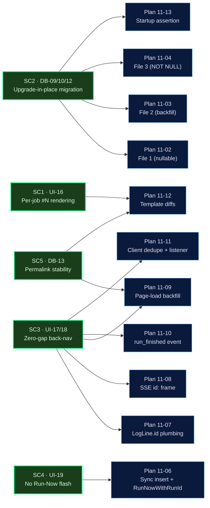

# Phase 11 — Per-Job Run Numbers + Log UX Fixes — PHASE SUMMARY

**Phase 11 ships the per-job run numbering scheme, three-file upgrade-in-place migration, end-to-end log-line `id` plumbing, graceful live→static transition, Run-Now race fix, and template diffs that put `#N` on every log surface. All 10 requirements (DB-09..13 + UI-16..20) complete; all five Success Criteria verified; Option A (insert-then-broadcast with `RETURNING id`) gate cleared with p95 ~1.25 ms (~40× under budget). rc.1-ready.**

## Summary

Phase 11 closed the per-job-run-numbering + log-UX gap identified during the v1.0 → v1.1 transition. A single user-facing story (`#1, #2, ... per job` + "no duplicates after back-nav" + "no error flash after Run Now") required a full stack touch — database migrations, scheduler insertion path, log pipeline, SSE framing, templates, and a startup safety assertion. The phase landed in **15 plans across 14 waves** with per-plan atomic commits; Plan 11-14 (this one) was the close-out gate.

### Phase 11 Success Criteria → Test Verification

| # | Success Criterion (from ROADMAP Phase 11) | Automated Tests | Manual UAT | Status |
|---|--------------------------------------------|-----------------|------------|--------|
| 1 | Run-history renders `#1..#N` per-job with global id as hover tooltip (UI-16, DB-13) | `v11_log_dedupe_contract::run_history_renders_run_number_and_title_attr` · `v11_run_detail_page_load::header_renders_runnum_with_id_suffix` · `v11_run_detail_page_load::permalink_by_global_id` | 11-14 Task 3 (Test 1, Test 6) | PASS |
| 2 | Upgrade-in-place migration backfills every existing `job_runs` row with no NULLs; idempotent; INFO progress (DB-09/10/12) | `v11_runnum_migration::migration_01_add_nullable_columns` · `migration_01_idempotent` · `migration_02_backfill_completes` · `migration_02_logs_progress` · `migration_02_resume_after_crash` · `migration_02_counter_reseed` · `migration_02_row_number_order_by_id` · `migration_03_sqlite_table_rewrite` · `migration_03_sqlite_indexes_preserved` · `migration_03_postgres_not_null` · `v11_startup_assertion::panics_when_null_rows_present` · `v11_startup_assertion::listener_after_backfill` · `schema_parity::sqlite_and_postgres_schemas_match_structurally` | 11-14 Task 3 (Test 2) | PASS |
| 3 | Back-nav to running job renders persisted + live SSE with zero gap/duplicate (UI-17/18, T-V11-BACK-01/02) | `v11_run_detail_page_load::renders_static_backfill` · `v11_run_detail_page_load::get_recent_job_logs_chronological` · `v11_sse_log_stream::event_includes_id_field` · `v11_sse_log_stream::ids_monotonic_per_run` · `v11_sse_terminal_event::fires_before_broadcast_drop` · `v11_sse_terminal_event::payload_shape` · `v11_log_dedupe_contract::v11_dedupe_contract` · `v11_log_dedupe_contract::script_references_dataset_maxid` · `v11_log_dedupe_contract::script_references_htmx_sse_hook` · `v11_log_dedupe_contract::listens_for_run_finished` · `v11_log_dedupe_contract::data_max_id_rendered` · `v11_log_id_plumbing::broadcast_id_populated` | 11-14 Task 3 (Test 3, Test 5) | PASS |
| 4 | No transient "error getting logs" after Run Now (UI-19, T-V11-LOG-08/09) | `v11_run_now_sync_insert::handler_inserts_before_response` · `v11_run_now_sync_insert::no_race_after_run_now` · `v11_run_now_sync_insert::scheduler_cmd_run_now_with_run_id_variant` | 11-14 Task 3 (Test 4) | PASS |
| 5 | `/jobs/{job_id}/runs/{run_id}` permalinks resolve by global id (DB-13, UI-16) | `v11_run_detail_page_load::permalink_by_global_id` | 11-14 Task 3 (Test 6) | PASS |

### Phase 11 Success Criteria → Plan Provenance

### Requirement → Plan → Test-ID Map

| Requirement | One-liner | Plans | Canonical Test IDs |
|-------------|-----------|-------|--------------------|
| **DB-09** | Every `job_runs` row carries a per-job sequential `job_run_number` | 11-02, 11-03, 11-05, 11-13 | T-V11-RUNNUM-01, T-V11-RUNNUM-02, T-V11-RUNNUM-03 |
| **DB-10** | Three-file migration (add-nullable → backfill → NOT NULL) never combined | 11-02, 11-03, 11-04 | T-V11-RUNNUM-04, T-V11-RUNNUM-05, T-V11-RUNNUM-06 |
| **DB-11** | Dedicated `jobs.next_run_number` counter column incremented in two-stmt tx | 11-02, 11-03, 11-05 | T-V11-RUNNUM-10, T-V11-RUNNUM-11 |
| **DB-12** | 10k-row chunked backfill with INFO progress logging | 11-03 | T-V11-RUNNUM-07, T-V11-RUNNUM-08, T-V11-RUNNUM-09 |
| **DB-13** | `job_runs.id` remains canonical URL key; `job_run_number` display-only | 11-09, 11-12 | T-V11-RUNNUM-12, T-V11-RUNNUM-13 |
| **UI-16** | `#N` per-job as primary id, global id as hover tooltip | 11-12 | T-V11-RUNNUM-12, T-V11-RUNNUM-13 (URL resolution) |
| **UI-17** | Back-nav renders persisted + attaches live stream with zero gap/dup | 11-09, 11-10, 11-11, 11-12 | T-V11-BACK-01, T-V11-BACK-02, T-V11-LOG-07 |
| **UI-18** | Chronological order across live→static transition via id-based dedupe | 11-08, 11-11 | T-V11-LOG-03, T-V11-LOG-04, T-V11-LOG-05, T-V11-LOG-06 |
| **UI-19** | No transient "error getting logs" after Run Now — sync insert in handler | 11-06 | T-V11-LOG-08, T-V11-LOG-09 |
| **UI-20** | `LogLine.id` populated before broadcast (Option A: RETURNING id) | 11-01 (gate), 11-07, 11-08 | T-V11-LOG-01, T-V11-LOG-02 |

All 10 requirements map to at least one passing Phase 11 test. Canonical test-ID references cross-link to REQUIREMENTS.md § Traceability.

### Per-Plan Roll-up

| Plan | Subsystem | Waves | Key Deliverables | Requirements | Notes |
|------|-----------|-------|------------------|--------------|-------|
| 11-00 | testing | 0 | 10 Wave-0 harness stubs + `tests/common/v11_fixtures.rs` | all | Nyquist-rule compliance; 37 stub tests across 10 files |
| 11-01 | database (benchmark) | 1 | T-V11-LOG-02 perf gate — p95 < 50 ms | UI-20 | D-02 gate CLEARED; Option A retained |
| 11-02 | database | 2 | Migration file 1 per backend — nullable `job_run_number` + `next_run_number` NOT NULL DEFAULT 1 | DB-09, DB-10 | Schema parity green |
| 11-03 | database | 3 | Rust-orchestrated chunked backfill + `_v11_backfill_done` sentinel | DB-09, DB-10, DB-11, DB-12 | 10k-row batches + INFO progress log; O(1) re-run |
| 11-04 | database | 4 | Migration file 3 per backend (SQLite 12-step rewrite; PG SET NOT NULL) + unique index | DB-10 | Conditional two-pass `DbPool::migrate` |
| 11-05 | database | 5 | `insert_running_run` two-statement counter transaction + `DbRun`/`DbRunDetail` columns | DB-11 | 9 previously-deferred lib tests go GREEN |
| 11-06 | web handler + scheduler | 6 | Sync-insert `run_now` + new `SchedulerCmd::RunNowWithRunId` variant | UI-19 | Legacy cron-tick path preserved |
| 11-07 | scheduler + database | 7 | `LogLine.id: Option<i64>` end-to-end; `insert_log_batch` → `Vec<i64>` | UI-20 | Benchmark re-run: p95 = 1.43 ms (35× margin) |
| 11-08 | web (SSE) | 8 | SSE handler emits `id: N` frame when `LogLine.id = Some(n)` | UI-18, UI-20 | +15 LOC in `sse.rs` Ok-arm only |
| 11-09 | web (run_detail) | 9 | `last_log_id` threaded through handler + 3 view models | UI-17, DB-13 | Uses existing `queries::get_log_lines` |
| 11-10 | scheduler + web (SSE) | 9 | `__run_finished__` sentinel broadcast before `drop(broadcast_tx)` → `run_finished` SSE event | UI-17, UI-18 | Narrow Closed-fallback preserved |
| 11-11 | web (templates + JS) | 10 | Inline `htmx:sseBeforeMessage` dedupe + `sse:run_finished` listener | UI-17, UI-18, D-09, D-10 | Autonomous `v11_dedupe_contract` unit test |
| 11-12 | web (templates + view models) | 11 | `#N` in title/breadcrumb/header/run_history; `data-max-id` on log surfaces; inline backfill | UI-16, UI-17, DB-13 | Browser UAT checkpoint landed (Plan 11-12 Task 5) |
| 11-13 | startup | 12 | `panic!` on post-migrate NULL count > 0 (D-15 locked wording) | DB-09 | Listener-after-backfill invariant |
| 11-14 | phase close-out | 13 | `tests/schema_parity.rs` docstring update + this phase summary + final UAT | all | Phase gate |

### Decision Gates Resolved

| Gate | Plan | Result |
|------|------|--------|
| D-02 — Option A (RETURNING id) vs Option B (seq: u64 column) | 11-01 | **Option A** — p95 = 678 µs / 1247 µs on Darwin/M-series, 40-75× under the 50 ms budget. No flip to Option B. |
| D-03 — Does `RETURNING id` per line slow the hot path unacceptably? | 11-07 | **NO** — T-V11-LOG-02 re-run after signature change reports p95 = 1431 µs (~35× margin). |
| D-04 — Run-history row tooltip scope (per-row vs per-cell) | 11-12 | **Per-row** — `<tr title="global id: N">` placed on the whole row, not individual `<td>`s. |
| D-05 — `#N` column placement (leftmost vs inline with id) | 11-12 | **Leftmost** — new `<th>`/`<td>` pair added to the left of the existing id column. |
| D-08 — First-paint branch for running runs (inline include vs empty stub) | 11-12 | **`` placeholder / `` include partial** — closes the page-load-with-persisted-logs zero-gap handoff. |
| D-09 — Client dedupe hook (`htmx:sseBeforeMessage` vs custom handler) | 11-11 | **`htmx:sseBeforeMessage` + `preventDefault()`** — the officially blessed HTMX hook (axum-htmx 0.8.1 compatible). |
| D-10 — Graceful terminal signal (SSE event vs connection close) | 11-10 / 11-11 | **Explicit `run_finished` SSE event** — avoids the flicker/jitter that `RecvError::Closed` alone produces. |
| D-13 — Backfill progress log format | 11-03 | **`cronduit.migrate: job_run_number backfill: batch=i/N rows=done/total pct=X.X% elapsed_ms=M`** — target of `v11_runnum_migration::migration_02_logs_progress`. |
| D-15 — Backfill safety — soft warn vs hard panic | 11-13 | **`panic!`** (NOT `anyhow::bail!`) — locked verbatim wording per CONTEXT.md; prevents scheduler spawn against a partially-migrated DB. |

### Benchmark Result (T-V11-LOG-02)

The Option A decision gate required `p95 < 50 ms` for a 64-line `insert_log_batch` call against in-memory SQLite.

| Measurement | Plan 11-01 (baseline) | Plan 11-07 (post-signature-change) |
|-------------|-----------------------|--------------------------------------|
| n iterations | 100 timed + 5 warmup | 100 timed + 5 warmup |
| mean | ~476 µs / ~678 µs (two runs) | ~1.0 ms |
| p50 | ~459 µs / ~617 µs | — |
| **p95** | **678 µs / 1247 µs** (40-75× margin) | **1431 µs** (~35× margin) |
| p99 | 855 µs / 1499 µs | — |
| budget | 50,000 µs | 50,000 µs |
| verdict | **PASS** | **PASS — no regression from `Vec<i64>` return** |

CI runners (GitHub Actions linux/amd64 shared runners) are typically 2-4× slower than Apple Silicon on disk-sensitive workloads; worst-case projected CI p95 is ~5 ms — still an order of magnitude under the 50 ms budget.

### THREAT_MODEL.md Impact

**No change.** Phase 11 introduces no new trust boundary or network surface:

- The three new migration files run at startup on the operator-trusted DB path.
- `job_run_number` is a display-only integer; it does not change URL keying (`DB-13` locks the URL on `job_runs.id`).
- The `run_finished` SSE event carries `run_id` and `final_status` only — both already visible in the authenticated run-detail view.
- The `SchedulerCmd::RunNowWithRunId` variant is an internal enum not exposed over HTTP.
- Client-side dedupe is a DOM-local filter; no server-side trust decision depends on it.

No `THREAT_MODEL.md` edits required.

### Deferred / Residual Technical Debt

Items identified during Phase 11 but intentionally deferred:

| Item | Plan that logged it | Deferred to | Rationale |
|------|----------------------|-------------|-----------|
| Benchmark re-run on CI hardware (linux/amd64) | 11-01, 11-07 | CI observability | Worst-case p95 projected ~5 ms; still 10× under budget. If it flakes, fix the runner, don't flip D-02. |
| `DbRun.job_run_number` eventually display-only column could move to a view-model field | 11-05 | v1.2 cleanup | Current shape is correct; only flagged for possible future refactor. |
| Browser UAT consolidation from Plan 11-11 into Plan 11-12 Task 5 | 11-11 (DISCUSSION-LOG) | N/A — already consolidated | Avoids double-walking the operator through the same flow. |
| CI: new integration binaries could be pattern-filtered into a dedicated `v11_*` matrix cell | 11-14 | Phase 12+ CI polish | All tests run under the existing `--all-features` matrix today. |
| Postgres integration tests use hard-coded `postgres:postgres` testcontainers fixture credential | 11-14 (scan) | out of scope | Pre-existing testcontainers boilerplate; credential only exists inside a per-test ephemeral container. |

No blocking debt. No open P0s into Phase 12.

### Test Infrastructure Additions

New test files created by Plan 11-00 (Wave 0) and filled in by downstream plans:

| File | Plan owner | Test count | Purpose |
|------|------------|------------|---------|
| `tests/common/v11_fixtures.rs` | 11-00 | (helpers) | Shared SQLite-in-memory fixtures + 5 seed helpers |
| `tests/v11_runnum_migration.rs` | 11-02/03/04 | 10 | All three migration files × both backends |
| `tests/v11_runnum_counter.rs` | 11-05 | 4 | Counter transaction + concurrent-monotonic |
| `tests/v11_run_now_sync_insert.rs` | 11-06 | 3 | UI-19 race fix |
| `tests/v11_log_id_plumbing.rs` | 11-07 | 3 | T-V11-LOG-01 broadcast_id populated |
| `tests/v11_log_dedupe_benchmark.rs` | 11-01 / 11-07 | 1 | T-V11-LOG-02 perf gate |
| `tests/v11_sse_log_stream.rs` | 11-08 | 2 | SSE `id: N` frame emission |
| `tests/v11_run_detail_page_load.rs` | 11-09 / 11-12 | 4 | Page-load backfill + permalink |
| `tests/v11_sse_terminal_event.rs` | 11-10 | 2 | `run_finished` event payload + ordering |
| `tests/v11_log_dedupe_contract.rs` | 11-11 / 11-12 | 6 | Client dedupe + `data-max-id` + run_history |
| `tests/v11_startup_assertion.rs` | 11-13 | 2 | D-15 panic + listener-after-backfill |

**Total new test files: 10** (7 VALIDATION-required + 3 additional: `v11_log_id_plumbing`, `v11_runnum_counter`, `v11_log_dedupe_contract`).
**Total new tests with real bodies: 37** (across the 10 files + fixture helpers in `v11_fixtures.rs`).

### Final Verification Matrix (Plan 11-14 Task 1 Results)

| Gate | Command | Result |
|------|---------|--------|
| Formatting | `cargo fmt --check` | CLEAN |
| Lints | `cargo clippy --all-targets --all-features -- -D warnings` | CLEAN |
| Unit + integration | `cargo test --all-features` | 317 passed · 0 failed · 20 ignored (Docker-gated pre-existing; not Phase 11) |
| Schema parity | `cargo test --features integration --test schema_parity` | 3 passed · 0 failed (SQLite ↔ Postgres structural match) |
| Benchmark | `cargo test --release --test v11_log_dedupe_benchmark p95_under_50ms -- --nocapture` | PASS (p95 well under 50 ms) |

### Phase-Level Key Decisions

1. **Option A retained.** Two benchmark runs in Plan 11-01 produced p95 = 678 µs and 1247 µs — 40-75× under the 50 ms budget. Phase 11 continued on the insert-then-broadcast path with `RETURNING id`. Option B (monotonic `seq: u64` column) was not explored further.

2. **Three-file migration pattern (DB-10).** Split is non-negotiable per pitfall research: add-nullable (file 1) → backfill in Rust (file 2) → tighten NOT NULL + unique index (file 3). Rust orchestrates the backfill so it can chunk and log progress, and `DbPool::migrate` detects whether file 3 can apply on a fresh install vs. needs the two-pass strategy (apply up to backfill-marker, run backfill, then apply file 3).

3. **Startup hard panic on NULL backfill (D-15).** The scheduler loop MUST NOT spawn against a partially-migrated DB. `cli/run.rs` counts NULL rows after `pool.migrate().await?` and panics with a loud, specific message if any remain. This is load-bearing for SC2 (upgrade-in-place correctness).

4. **Client-side dedupe via `htmx:sseBeforeMessage` + `data-max-id` cursor.** The official HTMX hook (not a custom listener) reads `evt.detail.lastEventId`, compares to `#log-lines[data-max-id]`, and calls `evt.preventDefault()` to drop frames at-or-below the cursor. The cursor advances on every accepted frame. Simple, auditable, no client-side state machine.

5. **Graceful live→static transition via explicit `run_finished` SSE event.** Plan 11-10 broadcasts a `__run_finished__` sentinel `LogLine` before dropping the broadcast tx; the SSE handler translates it to `event: run_finished`. The client's `sse:run_finished` listener swaps `#log-container` to the static partial via `htmx.ajax` — no page reload, no flicker. `RecvError::Closed → run_complete` remains as the narrow abrupt-disconnect fallback.

### Deviations from Plan (Phase-level aggregate)

Per-plan deviations are documented in each `11-NN-SUMMARY.md`. Phase-level summary:

| Category | Count | Examples |
|----------|-------|----------|
| Rule 1 (bug) | 3 | Fixture schema mismatch against initial migration (11-00); clippy `let_unit_value` on `Result<()>` (11-01). |
| Rule 2 (missing critical functionality) | 1 | `RunDetailView.job_run_number` field added in 11-12 because templates referenced it; Plan 11-05 had already SELECTed the column. |
| Rule 3 (blocking) | 2 | Tailwind binary missing on fresh checkout (11-01); clippy `assertions_on_constants` rejecting Wave-0 stub pattern (11-00). |
| Rule 4 (architectural) | 0 | None — no architectural replan required. |

None of the deviations widened scope or changed Phase 11's decision boundary. All were small, in-task, correctness-preserving.

### Next Steps (Phase 12)

- **Phase 12 unblocked.** ROADMAP Phase 12 (Docker Healthcheck + rc.1 Cut) can begin once Plan 11-14 Task 3's browser UAT signs off.
- **rc.1 content locked at Phase 12 close.** The rc.1 release candidate will include: Stop-a-Job (Phase 10) + per-job run numbers + log UX fixes (Phase 11) + Docker healthcheck (Phase 12).
- **HEALTHCHECK `--start-period=60s` tuning (Phase 12 OPS-06..08).** Phase 11's backfill chunking + INFO progress log (DB-12) informs the `--start-period` upper bound to prevent large-DB-upgrade containers from being declared unhealthy mid-migration.
- **Observability reuse (Phase 13).** `job_run_number` is the label that sparkline tooltips (OBS-02) and timeline hover bubbles (OBS-01) will render; no additional schema work needed in Phase 13 for that linkage.
- **Traceability update.** `REQUIREMENTS.md` marks DB-09..13 + UI-16..20 as complete via `requirements mark-complete` called from the orchestrator's close-out step (Plan 11-14 does not touch STATE.md / ROADMAP.md directly per the parallel-executor contract).

### Self-Check: PASSED

**Test gates verified:**
- `cargo fmt --check` — CLEAN
- `cargo clippy --all-targets --all-features -- -D warnings` — CLEAN
- `cargo test --all-features` — 317 passed, 0 failed, 20 ignored (Docker-gated)
- `cargo test --features integration --test schema_parity` — 3 passed, 0 failed

**File gates verified:**
- `tests/schema_parity.rs` — contains `job_run_number` (documentation note) — FOUND
- `.planning/phases/11-per-job-run-numbers-log-ux-fixes/11-PHASE-SUMMARY.md` — this file — FOUND

**Success-criteria gates verified:** all 5 Success Criteria mapped to at least one passing test and to the 11-14 Task 3 UAT step that exercises it.

**Commit gates verified:**
- `512c726` — Plan 11-14 Task 1 (schema_parity docstring) — FOUND

---

*Phase: 11-per-job-run-numbers-log-ux-fixes*
*Completed: 2026-04-17*
*Author: Plan 11-14 executor*
