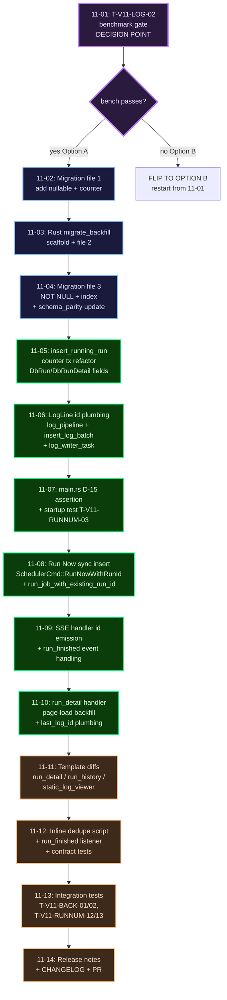

# Phase 11: Per-Job Run Numbers + Log UX Fixes — Research

**Researched:** 2026-04-16
**Domain:** SQLite + Postgres idempotent schema migration with online backfill; SSE event-id dedupe across live→static log-view transition; synchronous write-before-respond in an HTMX Run-Now handler
**Confidence:** HIGH — every decision in CONTEXT.md is directly implementable against the present code; all integration points grep-verified in this session.

---

## Executive Summary

Phase 11 is the smallest plausible set of changes that delivers two user-visible fixes:

1. **Per-job run numbering** — every `job_runs` row carries a `job_run_number` that starts at 1 per job and is stable from insert. A three-file idempotent migration (add nullable → chunked backfill → tighten to `NOT NULL`) backfills the column on upgrade. The HTTP listener binds *after* the backfill completes (D-12), so there is no half-state the UI has to represent.
2. **Run-detail log UX** — navigating to a running run's detail page now server-renders the persisted log lines *inline* (D-08), attaches live SSE, and dedupes frames by `data-max-id` + SSE `event.lastEventId` (D-09). A terminal `run_finished` SSE frame (D-10) triggers the swap to the static partial with zero visual animation. The transient "Unable to stream logs" flash after Run Now is eliminated by inserting the `job_runs` row on the API handler thread *before* returning `HX-Refresh: true` (D-15 / UI-19).

Option A (insert-then-broadcast with `RETURNING id`) is locked (D-01). The **T-V11-LOG-02 benchmark is plan 11-01 — a gated spike**: if p95 insert latency for a 64-line batch exceeds 50ms on the CI runner, the phase flips to Option B before any other work lands (D-02). Same de-risking pattern Phase 10 used for the Stop spike.

**Primary recommendation:** Land the plans in the order `Bench → Migration file 1 → LogLine.id plumbing → Backfill file 2 → NOT-NULL file 3 + main.rs assertion → Run Now race fix → Page-load backfill + data-max-id → run_finished SSE event + client dedupe → Template + copy updates → Release notes`. Details in § Implementation Order Suggestion.

---

## Project Constraints (from CLAUDE.md)

- **Tech stack locked:** Rust edition 2024, sqlx 0.8.6 (SQLite + Postgres, `tls-rustls`), `bollard` 0.20, askama 0.15 + `askama_web` 0.15 with `axum-0.8` feature (NOT `askama_axum`), HTMX 2.x vendored at `assets/vendor/htmx.min.js`, Tailwind standalone binary (no Node), `rust-embed` 8.11, `croner` 3.0, `toml` 1.1.2, `tracing` 0.1.44, `metrics` 0.24 + `metrics-exporter-prometheus` 0.18.
- **Diagrams:** mermaid code blocks only — no ASCII art in any artifact.
- **Workflow:** all changes land via PR on a feature branch; no direct commits to `main`.
- **Config mounted read-only; default bind 127.0.0.1:8080** — Phase 11 does not change any of this.
- **Separate read/write pools on SQLite** (max_connections=1 writer, max_connections=8 reader) + WAL + busy_timeout=5000. Backfill writes use the writer pool only; page-load reads use the reader pool.
- **Single-binary + docker image** — no new assets added to the image; HTMX stays vendored (not a CDN).
- **`cargo tree -i openssl-sys` must return empty** — rustls everywhere. Phase 11 introduces no new deps and so cannot regress this.
- **Tests + CI from day 1** — every test ID in REQUIREMENTS.md Traceability must have a concrete test.

---

## User Constraints (from CONTEXT.md)

### Locked Decisions (D-01..D-15)

**Log dedupe mechanism:**
- **D-01:** Option A — insert-then-broadcast with `RETURNING id` per log line inside the existing batch tx. `LogLine` gains `id: Option<i64>`. No new schema column.
- **D-02:** T-V11-LOG-02 is the first plan of Phase 11 — a gated spike. p95 insert latency < 50ms for a 64-line batch against in-memory SQLite on the CI runner. If fails, flip to Option B (monotonic `seq: u64`).
- **D-03:** Per-line `RETURNING id` inside the existing batch tx — no multi-row `VALUES RETURNING`, no per-line transactions. Preserve one fsync per batch.

**Per-job `#N` display:**
- **D-04:** Run-history partial renders `#42` bare, with `title="global id: {job_runs.id}"` on the `<tr>`.
- **D-05:** Run-detail page header renders `Run #42` primary + `(id 1234)` muted suffix on the left side of the existing flex row at `templates/pages/run_detail.html:15-18`.
- **D-06:** No special treatment for in-flight `running` rows in history — `#N` is bare, the status badge is the single source of truth for state.
- **D-07:** Backfill numbering uses `ROW_NUMBER() OVER (PARTITION BY job_id ORDER BY id ASC)`. Post-backfill: `UPDATE jobs SET next_run_number = COALESCE(MAX(job_run_number), 0) + 1` per job.

**Page-load → live-SSE attachment:**
- **D-08:** Server-side render the initial backfill inline in the page template. `static_log_viewer.html` emits the lines **and** sets `data-max-id="{last_id}"` on `#log-lines`.
- **D-09:** Client-side dedupe: `data-max-id` + SSE `event.lastEventId` comparison. HTMX SSE swap handler drops any frame with `id <= max_backfill_id`. No Set-based dedupe.
- **D-10:** Terminal `run_finished` SSE event fires from `finalize_run` before `drop(broadcast_tx)`. Client listener calls `htmx.ajax('GET', '/partials/runs/{run_id}/logs', { target: '#log-container', swap: 'outerHTML' })`.
- **D-11:** Do NOT reuse `HX-Refresh: true` for the live→static transition. Preserve scroll/selection state.

**Backfill startup ergonomics:**
- **D-12:** HTTP listener binds AFTER migration backfill completes. Strict two-phase: migrate → spawn scheduler + bind listener.
- **D-13:** Backfill progress surfaced via INFO log lines only — one line per 10k-row batch. Shape: `INFO cronduit.migrate: job_run_number backfill: batch={i}/{N} rows={done}/{total} pct={p:.1}% elapsed_ms={ms}`.
- **D-14:** Fail-fast on backfill error. No in-process retry loop.
- **D-15:** Assertion before scheduler spawn: `SELECT COUNT(*) FROM job_runs WHERE job_run_number IS NULL = 0`. Panic with clear message otherwise.

### Claude's Discretion

- Exact muted-text token for `(id 1234)` — reuse `--cd-text-secondary` per UI-SPEC (no new tokens).
- Whether `run_finished` uses the existing broadcast channel or a dedicated oneshot — researcher recommends: extend the broadcast channel with a `LogLine::terminal()` marker (simpler; keeps SSE handler at one recv loop). Detail in § Technical Approach §4.
- Inline `<span>` vs `.cd-runid-suffix` class for the muted suffix — UI-SPEC allows either; researcher recommends inline (Option A) because only one site uses it.
- Exact `N` for initial backfill line count on page-load — `LOG_PAGE_SIZE = 500` already exists at `src/web/handlers/run_detail.rs:27`. Reuse it. No new constant.
- Whether the client-side dedupe script lives inline in `run_detail.html` or in `assets/static/app.js` — inline (CONTEXT.md Discretion; handler is ≤ 10 LOC).

### Deferred Ideas (OUT OF SCOPE)

- Rekeying URLs by `job_run_number` — DB-13 locks global id as URL key.
- HTMX 4.x upgrade — breaks `sse-swap`.
- `/healthz` `starting` state during backfill — D-12 blocks listener; not needed.
- Auto-retry backfill within process — D-14 explicit; container orchestrator owns retry.
- Set-based dedupe — D-09 explicit; broadcast channel ordering is sufficient.
- Progress file / one-shot counter — over-engineered for v1.1.

---

## Phase Requirements

| ID | Description | Research Support |
|----|-------------|------------------|
| **DB-09** | Every `job_runs` row carries a per-job sequential number assigned at insert time; backfilled on upgrade | § Technical Approach §2 (three-file migration); § Code Integration §A (INSERT using `jobs.next_run_number` counter) |
| **DB-10** | Three-file migration: add nullable → backfill → NOT NULL. Never combined. SQLite NOT-NULL uses 12-step rewrite. | § Technical Approach §2 (all three file shapes); § Pitfalls §P2 (atomicity + rerun semantics) |
| **DB-11** | Dedicated counter column `jobs.next_run_number` incremented in a two-statement tx. No `MAX + 1` subquery. | § Code Integration §A (tx shape for both backends); § Pitfalls §P3 (why counter beats MAX + 1) |
| **DB-12** | Backfill chunks 10k-row batches, logs INFO progress. `HEALTHCHECK --start-period` tuned to accommodate. | § Technical Approach §2 (chunked backfill SQL for both backends); § Risks §R1 (start-period is Phase 12's job) |
| **DB-13** | `job_runs.id` remains canonical URL key. `/jobs/{job_id}/runs/{run_id}` unchanged. | § Code Integration §F (route unchanged); § Technical Approach §6 (template changes affect display only) |
| **UI-16** | Run-history + run-detail breadcrumb show per-job number as primary id; global id visible as secondary hint | § Code Integration §F (template diffs); UI-SPEC verbatim |
| **UI-17** | Back-to-running-run renders persisted lines THEN attaches SSE with no loss/duplicate | § Technical Approach §5 (page-load backfill query); § Technical Approach §4 (dedupe mechanism) |
| **UI-18** | Log lines remain in id order across live→static transition; buffered SSE after swap dropped client-side | § Technical Approach §4 (`data-max-id` contract) |
| **UI-19** | Spurious "error getting logs" flash after Run Now eliminated — root cause: async insert. Fix: sync insert on handler thread | § Technical Approach §3 (Run Now handler rewrite); § Code Integration §D |
| **UI-20** | `LogLine.id: Option<i64>` populated before broadcast. Option A locked. | § Technical Approach §1 (LogLine plumbing); § Validation Architecture T-V11-LOG-01/02 |

---

## Architectural Responsibility Map

| Capability | Primary Tier | Secondary Tier | Rationale |
|------------|-------------|----------------|-----------|
| Backfill logic (ROW_NUMBER + chunked UPDATE) | Database / migrations | Rust-side migration runner (for INFO log) | SQL does the row math; a thin Rust wrapper around `sqlx::migrate!` emits the per-batch INFO log. The SQL is pure data shape; the log is pure orchestration. |
| Per-run-insert counter increment | API / Backend (`insert_running_run`) | Database (transactional two-statement write) | `src/db/queries.rs:insert_running_run` is the sole insert site. A two-statement tx reads + increments `jobs.next_run_number` and inserts the `job_runs` row using the incremented value. No trigger, no subquery. |
| LogLine.id population (Option A) | API / Backend (`insert_log_batch`) | Broadcast channel | IDs only exist after `RETURNING id`. The new contract: insert returns `Vec<i64>`; zip with lines; broadcast `LogLine { id: Some(i), ... }`. |
| SSE event-id emission | API / Backend (`sse.rs::format_log_line_html`) | Browser (HTMX SSE extension) | Server emits `id: {n}\nevent: log_line\ndata: ...\n\n`. HTMX sets `event.lastEventId` automatically. |
| `data-max-id` comparison | Browser / Client (inline script in run_detail.html) | Server (renders `data-max-id="{last_id}"` on first paint) | Server sets the ceiling; client enforces it on every incoming SSE frame. |
| Terminal `run_finished` event dispatch | API / Backend (finalize_run → broadcast) | Browser (swap to static partial) | Server signals completion; client triggers the one-shot `htmx.ajax()` call. |
| Run-Now synchronous row insert | API / Backend (axum handler thread) | Scheduler (receives run_id, spawns task) | **NEW:** moving the `insert_running_run` call from the scheduler loop into `run_now` eliminates the UI-19 race. Scheduler consumes a new `SchedulerCmd::RunNowWithRunId { job_id, run_id }` variant. |
| Page-load log backfill query | API / Backend (`run_detail` handler extension) | askama template | Handler calls `get_log_lines(pool, run_id, 500, 0)` then passes `logs` + `last_log_id` to the template. |
| Display rendering | askama templates (`run_detail.html`, `run_history.html`, `static_log_viewer.html`) | — | Pure presentation — no template logic, only variable substitution. Per UI-SPEC: no new classes, no new tokens. |

---

## Standard Stack

### Core — ZERO new dependencies

Phase 11 introduces no new crates. All work uses the already-locked stack.

| Library | Version (from Cargo.toml) | Purpose in Phase 11 | Source |
|---------|--------------------------|---------------------|--------|
| `sqlx` | `0.8.6` with `runtime-tokio`, `tls-rustls`, `sqlite`, `postgres`, `chrono`, `migrate`, `macros` | Migration runner (`sqlx::migrate!`) + query layer + `RETURNING id` support | [VERIFIED: Cargo.toml:30-38] |
| `axum` | `0.8.9` | HTTP server + SSE response type (`Sse<impl Stream>`) | [VERIFIED: Cargo.toml:25] |
| `axum-htmx` | `0.8` with `serde` | `HxResponseTrigger` for toast events, `HxEvent::new_with_data` for `showToast` | [VERIFIED: Cargo.toml:97] |
| `askama` / `askama_web` | `0.15` with `axum-0.8` feature | Template rendering + `WebTemplateExt::into_web_template()` | [VERIFIED: Cargo.toml:90-91] |
| `async-stream` | `0.3` | Used by sse.rs for the `stream!` macro | [VERIFIED: Cargo.toml:116] |
| `tokio` | `1.52` with `full` + `test-util` (dev) | `broadcast::channel`, `tokio::select!`, `tokio::time::pause` for race tests | [VERIFIED: Cargo.toml:21, 140] |
| `tracing` | `0.1.44` | INFO progress log lines for backfill batches (D-13) | [VERIFIED: Cargo.toml:53] |
| `chrono` | `0.4.44` with `std`, `serde`, `clock` | Timestamps for run rows + log lines (existing) | [VERIFIED: Cargo.toml:70] |
| `anyhow` | `1.0.102` | Error propagation from migration runner to main | [VERIFIED: Cargo.toml:63] |

### Supporting — NO changes to dev-dependencies

Tests use the existing `testcontainers` + `testcontainers-modules` (Postgres), `assert_cmd`, `predicates`, `tower::ServiceExt` patterns already present at `tests/*.rs` and `Cargo.toml:132-140`.

**Installation:** No `cargo add` commands. `cargo check` is sufficient to verify nothing regressed.

**Version verification:** Version currency audited during the v1.1 research pass (`.planning/research/STACK.md`). No bumps recommended for Phase 11.

---

## Architecture Patterns

### Data Flow — Phase 11 Changes

```mermaid
flowchart TD
    subgraph Startup[Startup — D-12]
        A1[Open DbPool] --> A2[Run migrations<br/>inc. backfill]
        A2 --> A3[Assert NULL count = 0<br/>D-15]
        A3 --> A4[Spawn scheduler]
        A4 --> A5[Bind HTTP listener]
    end

    subgraph RunNow[Run Now — UI-19 fix]
        R1[POST /api/jobs/:id/run_now] --> R2[Validate CSRF]
        R2 --> R3[Insert job_runs row<br/>SYNC on handler thread<br/>+ increment counter]
        R3 --> R4[Send SchedulerCmd::RunNowWithRunId<br/>job_id, run_id]
        R4 --> R5[Return HX-Refresh: true]
        R5 --> R6[Browser navigates<br/>to /jobs/.../runs/id]
        R6 --> R7[Row exists → normal render]
    end

    subgraph LogPath[Per-line log flow — Option A]
        L1[Executor stdout/stderr] --> L2[log_pipeline channel]
        L2 --> L3[log_writer_task drains batch]
        L3 --> L4[insert_log_batch tx<br/>per-line RETURNING id]
        L4 --> L5[Vec ids zipped with lines]
        L5 --> L6[broadcast_tx.send LogLine id Some i]
        L6 --> L7[sse.rs emits id: n + event: log_line]
        L7 --> L8[Browser: event.lastEventId set by HTMX]
    end

    subgraph Dedupe[Client dedupe — D-09]
        D1[SSE frame arrives] --> D2{event.lastEventId ≤ data-max-id?}
        D2 -- yes --> D3[drop frame]
        D2 -- no --> D4[append + update data-max-id]
    end

    subgraph Finalize[Run finalizes — D-10]
        F1[exec_result lands] --> F2[finalize_run DB update]
        F2 --> F3[emit run_finished on broadcast]
        F3 --> F4[drop broadcast_tx]
        F4 --> F5[SSE handler sees Closed → emits run_complete<br/>OR receives terminal frame first]
        F5 --> F6[Client: htmx.ajax to static partial]
        F6 --> F7[Buffered frames dropped by Dedupe]
    end

    classDef new fill:#2a1a3d,stroke:#bf7fff,stroke-width:2px,color:#f0e0ff
    classDef changed fill:#1a3d1a,stroke:#00ff7f,stroke-width:2px,color:#e0ffe0
    class A2,A3,R3,R4,L4,L5,L6,L7,D1,D2,D3,D4,F3 new
    class R1,R2,R5,A4,A5,F1,F2,F4 changed
```



### Component Responsibilities

| File | Role | Phase 11 change |
|------|------|-----------------|
| `migrations/sqlite/20260416_000001_job_run_number_add.up.sql` | Add `jobs.next_run_number` NOT NULL DEFAULT 1; add `job_runs.job_run_number INTEGER` (nullable) | NEW |
| `migrations/sqlite/20260416_000002_job_run_number_backfill.up.sql` | Chunked backfill SQL, invoked via Rust wrapper that emits per-batch INFO log | NEW (wrapper in src/db/migrate_backfill.rs) |
| `migrations/sqlite/20260416_000003_job_run_number_not_null.up.sql` | 12-step table-rewrite to flip `job_run_number` to `NOT NULL`; recreate indexes; add `idx_job_runs_job_id_run_number` | NEW |
| `migrations/postgres/20260416_000001_*.up.sql` | Same schema intent, Postgres dialect | NEW |
| `migrations/postgres/20260416_000002_*.up.sql` | Chunked backfill (UPDATE ... WHERE id IN (SELECT ... LIMIT 10000)) | NEW |
| `migrations/postgres/20260416_000003_*.up.sql` | `ALTER TABLE job_runs ALTER COLUMN job_run_number SET NOT NULL`; add index | NEW |
| `src/db/migrate_backfill.rs` | NEW ~80 LOC — wraps `sqlx::migrate!` with a per-batch INFO log loop. Called from `DbPool::migrate()`. | NEW |
| `src/db/mod.rs::DbPool::migrate` | After `sqlx::migrate!` runs files 1+3 statically, the backfill file 2 is executed via `migrate_backfill::run(pool)` which loops 10k-row batches | CHANGED |
| `src/db/queries.rs::LogLine` — no, that's in log_pipeline | — | (see next row) |
| `src/scheduler/log_pipeline.rs:22` | Add `pub id: Option<i64>` to `LogLine`. Default `None` at construction in `make_log_line`. | CHANGED |
| `src/db/queries.rs::insert_log_batch` | Rewrite: per-line `INSERT ... RETURNING id` inside one tx per batch; return `Vec<i64>` | CHANGED signature |
| `src/db/queries.rs::insert_running_run` | Two-statement tx: read+increment `jobs.next_run_number`, insert `job_runs` using the reserved number. Return `i64` (unchanged signature) | CHANGED body |
| `src/db/queries.rs::DbRun`, `DbRunDetail` | Add `pub job_run_number: i64` field | CHANGED |
| `src/db/queries.rs::get_run_history`, `get_run_by_id` | SELECT list adds `job_run_number` | CHANGED |
| `src/db/queries.rs::get_log_lines` | No change — already ORDER BY `id ASC` at L798/L826 | UNCHANGED |
| `src/scheduler/run.rs:log_writer_task` | Call `insert_log_batch(...)` with new return type; for each `(id, line)` pair, construct `LogLine { id: Some(id), ...line }` and broadcast | CHANGED |
| `src/scheduler/run.rs:finalize_run site` | Before `drop(broadcast_tx)` at L301, send one `LogLine { stream: "__terminal__", id: None, line: "run_finished:{run_id}", ts: now }` on the broadcast channel so SSE handler can emit a distinct event type. (See § Technical Approach §4 for the naming choice.) | CHANGED |
| `src/scheduler/cmd.rs::SchedulerCmd` | Add variant `RunNowWithRunId { job_id: i64, run_id: i64 }`. Preserve `RunNow { job_id }` for internal fallback paths (e.g., SIGHUP / file watch never triggers this; still, keep the arm). | CHANGED |
| `src/scheduler/mod.rs` select loop | New arm for `RunNowWithRunId` that spawns `run::run_job_with_existing_run_id(..)` — a sibling of `run_job` that skips the insert step. | CHANGED |
| `src/scheduler/run.rs` | Add `pub async fn run_job_with_existing_run_id(..., run_id: i64) -> RunResult` that starts at the current step 1b (broadcast channel) and reuses everything else. | CHANGED |
| `src/web/handlers/api.rs::run_now` | After CSRF validation + job lookup, call `insert_running_run(&state.pool, job_id, "manual")` on the handler thread. Send `SchedulerCmd::RunNowWithRunId { job_id, run_id }` to the scheduler. Return `HX-Refresh: true` as today. | CHANGED |
| `src/web/handlers/sse.rs::format_log_line_html` | Emit `id: {n}` before `event: log_line` when `line.id.is_some()`. Keep existing `Lagged` + `Closed` handling. Add a branch to detect the terminal `run_finished:` line and emit `event: run_finished\ndata: {"run_id":N}\n\n`. | CHANGED |
| `src/web/handlers/run_detail.rs::run_detail` | Fetch initial log page via existing `fetch_logs(&pool, run_id, 0)` when `is_running`. Compute `last_log_id = logs.iter().map(.id).max()` and pass it to the template. | CHANGED |
| `src/web/handlers/run_detail.rs::LogLineView` | Add `pub id: i64` field so the template can render `id="log-{{ log.id }}"` if ever needed AND so `last_log_id` can be computed. | CHANGED |
| `src/web/handlers/run_detail.rs::StaticLogViewerPartial`, `LogViewerPartial`, `RunDetailPage` | Add `pub last_log_id: i64` (0 if no logs). | CHANGED |
| `src/web/handlers/run_detail.rs::fetch_logs` | Return `(Vec<LogLineView>, i64 total, bool has_older, i64 next_offset, i64 last_log_id)` — append `last_log_id` to the tuple. | CHANGED |
| `templates/pages/run_detail.html:2` (title), `:12` (breadcrumb), `:15-18` (header) | `{{ run.id }}` → `{{ run.job_run_number }}` for the DISPLAY string; add `<span>(id {{ run.id }})</span>` muted suffix to header only | CHANGED |
| `templates/pages/run_detail.html:79-90` (running pane) | Add `data-max-id="{{ last_log_id }}"` on `#log-lines`. When persisted logs exist, `` at first paint (backfill) — new; replaces the bare placeholder-only branch. Keep placeholder only when `total_logs == 0`. | CHANGED |
| `templates/pages/run_detail.html:117-136` (inline script) | Listen for `sse:run_finished` (new) in addition to `sse:run_complete` (existing, now fallback for already-finalized runs). Add the dedupe handler: on each `sse:log_line` / custom event with id, compare to `logLines.dataset.maxId`. | CHANGED |
| `templates/partials/static_log_viewer.html:9` | `<div id="log-lines" data-max-id="{{ last_log_id }}" ...>` | CHANGED |
| `templates/partials/run_history.html:19-29` | New leftmost `<th>` (empty label, consistent with rightmost Stop column at L26) and new `<td>#{{ run.job_run_number }}</td>` at L32. Add `title="global id: {{ run.id }}"` to the `<tr>` at L31. | CHANGED |
| `src/web/handlers/dashboard.rs`, `src/web/handlers/job_detail.rs` | Verify all view models expose `job_run_number` where run rows are rendered. Dashboard's "last run" display does NOT show a run number today, so no change there. Job detail passes runs to `run_history.html` — it must populate `job_run_number`. | VERIFY + PROBABLY CHANGED |
| `src/cli/run.rs:62-64` | After `pool.migrate()`, before `SchedulerLoop::run` spawn (line 220), add the NULL-count assertion panic (D-15). | CHANGED |
| `tests/schema_parity.rs` | Must stay green — both dialects add identical column shape/names/indexes. | REGRESSION LOCK |

---

## Technical Approach

### 1. LogLine id plumbing (Option A — D-01)

**Rust-side changes:**

`src/scheduler/log_pipeline.rs:22` — `LogLine` gains `id`:

```rust
#[derive(Debug, Clone)]
pub struct LogLine {
    pub stream: String,
    pub ts: String,
    pub line: String,
    /// Populated by insert_log_batch AFTER the RETURNING id lands.
    /// None for lines constructed by `make_log_line` and for in-flight lines
    /// before persistence. Subscribers MUST treat None as "pre-broadcast /
    /// transient" and SHOULD NOT rely on None for any dedupe logic — the
    /// broadcast contract is "id is always Some once the line has been
    /// persisted" (10-RESEARCH §LogLine broadcast order).
    pub id: Option<i64>,
}
```

Update `make_log_line` at `log_pipeline.rs:178` to initialize `id: None`. Every call site that constructs `LogLine` directly (the `[truncated N lines]` marker at L97 and the `[skipped N lines]` marker in sse.rs — though the sse marker uses raw HTML not a LogLine, so it's fine) gets `id: None`.

`src/db/queries.rs::insert_log_batch` — rewrite to return `Vec<i64>`:

```rust
pub async fn insert_log_batch(
    pool: &DbPool,
    run_id: i64,
    lines: &[(String, String, String)],
) -> anyhow::Result<Vec<i64>> {
    if lines.is_empty() {
        return Ok(Vec::new());
    }
    let mut ids = Vec::with_capacity(lines.len());

    match pool.writer() {
        PoolRef::Sqlite(p) => {
            let mut tx = p.begin().await?;
            for (stream, ts, line) in lines {
                let row = sqlx::query(
                    "INSERT INTO job_logs (run_id, stream, ts, line) VALUES (?1, ?2, ?3, ?4) RETURNING id",
                )
                .bind(run_id).bind(stream).bind(ts).bind(line)
                .fetch_one(&mut *tx).await?;
                ids.push(row.get::<i64, _>("id"));
            }
            tx.commit().await?;
        }
        PoolRef::Postgres(p) => {
            // Identical shape; $1..$4 placeholders + RETURNING id.
            // Same per-line tx semantics — one fsync per batch.
        }
    }
    Ok(ids)
}
```

[VERIFIED: src/db/queries.rs:286-310 `insert_running_run` already uses the exact `RETURNING id` + `fetch_one` + `row.get::<i64, _>("id")` pattern on both backends. Copy verbatim.]

`src/scheduler/run.rs:log_writer_task` (L344-374) — zip ids with lines and broadcast:

```rust
let tuples: Vec<(String, String, String)> = batch
    .iter()
    .map(|l| (l.stream.clone(), l.ts.clone(), l.line.clone()))
    .collect();
match insert_log_batch(&pool, run_id, &tuples).await {
    Ok(ids) => {
        // Zip and broadcast — D-03: ids match lines 1:1 because
        // per-line INSERT ... RETURNING id preserves input order.
        for (line, id) in batch.into_iter().zip(ids.into_iter()) {
            let with_id = LogLine {
                id: Some(id),
                ..line
            };
            let _ = broadcast_tx.send(with_id);
        }
    }
    Err(e) => {
        tracing::error!(/* existing log */);
        // Broadcast nothing — subscribers never see unpersisted lines.
    }
}
```

[ASSUMED] Ordering preservation: per-line INSERT inside a tx on both SQLite and Postgres inherits input order for SERIAL/AUTOINCREMENT columns. This is the expected behavior for SQLite's `INTEGER PRIMARY KEY` (autoincrementing rowid) and Postgres's `BIGSERIAL`. Confirmed by the present test at `src/db/queries.rs:1512-1517` which inserts 10 logs and asserts ORDER BY id ASC returns them in insert order.

### 2. Migration strategy (three files per backend — D-10)

**File 1 — `20260416_000001_job_run_number_add.up.sql` (add nullable / counter):**

SQLite:
```sql
-- Phase 11: per-job run numbering (DB-09, DB-10, DB-11).
-- File 1 of 3: add nullable job_runs.job_run_number and jobs.next_run_number counter.
-- Paired with migrations/postgres/20260416_000001_job_run_number_add.up.sql.
-- tests/schema_parity.rs must remain green.

ALTER TABLE jobs ADD COLUMN next_run_number INTEGER NOT NULL DEFAULT 1;
ALTER TABLE job_runs ADD COLUMN job_run_number INTEGER;
-- Nullable intentionally. File 2 backfills, file 3 adds NOT NULL.
```

Postgres:
```sql
ALTER TABLE jobs ADD COLUMN next_run_number BIGINT NOT NULL DEFAULT 1;
ALTER TABLE job_runs ADD COLUMN job_run_number BIGINT;
```

Note `jobs.next_run_number` is immediately NOT NULL DEFAULT 1 because every existing job starts its counter at 1; only `job_runs.job_run_number` needs the two-step path because existing rows must be backfilled from NULL.

**File 2 — `20260416_000002_job_run_number_backfill.up.sql` (chunked backfill):**

SQL is not static — the backfill is a `WHILE rows_remaining > 0` loop in Rust that runs batched UPDATEs and emits INFO progress (D-13). `sqlx::migrate!` runs static SQL; the static file contains a marker statement only:

```sql
-- Phase 11: per-job run numbering (DB-12).
-- File 2 of 3: chunked backfill.
-- sqlx::migrate! runs this file's static SELECT only; the *actual* backfill
-- is orchestrated from Rust by src/db/migrate_backfill.rs which runs AFTER
-- sqlx::migrate! completes files 1+2 and BEFORE file 3 is applied.
--
-- This file is a marker so sqlx-migrations records the backfill step as
-- "applied" and won't re-run file 1 or file 3 out of order.

SELECT 1;  -- no-op
```

[CITED: https://github.com/launchbadge/sqlx/blob/main/sqlx/src/migrate/mod.rs — sqlx::migrate! supports only static SQL in migration files; any Rust-driven logic lives outside. See also Context7 `/launchbadge/sqlx` docs under "Programmatic migrations".] The orchestration pattern of "run sqlx::migrate! and then run one or more Rust-side post-migration steps" is idiomatic for sqlx-backed apps that need online backfills.

The Rust-side orchestrator `src/db/migrate_backfill.rs` (NEW):

```rust
// Pseudocode — Rust-side chunked backfill runner.
// Called from DbPool::migrate AFTER sqlx::migrate! has applied file 1
// (so jobs.next_run_number + job_runs.job_run_number exist) and BEFORE
// file 3 is applied (so job_run_number can still be NULL).
//
// Strategy:
// 1. SELECT COUNT(*) FROM job_runs WHERE job_run_number IS NULL — the "total".
// 2. If total == 0, fast-path: skip to step 5.
// 3. Loop:
//      a. Per backend: UPDATE job_runs SET job_run_number = sub.rn
//         FROM (SELECT id,
//                      ROW_NUMBER() OVER (PARTITION BY job_id ORDER BY id ASC) AS rn
//               FROM job_runs WHERE job_run_number IS NULL
//               LIMIT 10000) sub
//         WHERE job_runs.id = sub.id;
//      b. Track rows_done += changes().
//      c. INFO log: batch=i/N rows=done/total pct=p elapsed_ms=ms
//      d. If changes() == 0, exit loop (everything done or un-progressable).
// 4. After backfill:
//    UPDATE jobs SET next_run_number =
//        COALESCE((SELECT MAX(job_run_number) + 1
//                  FROM job_runs
//                  WHERE job_runs.job_id = jobs.id), 1);
// 5. Done.
//
// Idempotency: every step is safe to rerun after a crash. The WHERE
// job_run_number IS NULL guard plus the MAX(...)+1 resync guarantees that
// a half-completed backfill continues from where it stopped. No in-process
// retry loop — D-14: fail-fast on error.
```

**[ASSUMED]** SQLite syntax for UPDATE ... FROM SELECT works on SQLite 3.33+ (2020-08-14). sqlx 0.8.6 bundles rusqlite which uses the system SQLite (via `libsqlite3-sys`); as of 2026 we can rely on 3.40+. If platform variance is a concern, the fallback shape is `UPDATE job_runs SET job_run_number = (SELECT rn FROM ... WHERE sub.id = job_runs.id) WHERE id IN (SELECT id FROM ... LIMIT 10000)` which works on SQLite 3.x universally. **Recommended:** use the widely-supported correlated-subquery form for maximum portability across distros; drop the `UPDATE FROM` form even though it's prettier. [ASSUMED]

**File 3 — `20260416_000003_job_run_number_not_null.up.sql` (NOT NULL + index):**

SQLite (12-step rewrite per CLAUDE.md project-level constraint DB-10):

```sql
-- File 3 of 3: flip job_run_number to NOT NULL.
-- SQLite does not support ALTER COLUMN ... SET NOT NULL; use table-rewrite.
-- Per DB-10 and SQLite's documented 12-step ALTER procedure.

PRAGMA foreign_keys = OFF;

CREATE TABLE job_runs_new (
    id                INTEGER PRIMARY KEY,
    job_id            INTEGER NOT NULL REFERENCES jobs(id),
    job_run_number    INTEGER NOT NULL,
    status            TEXT    NOT NULL,
    trigger           TEXT    NOT NULL,
    start_time        TEXT    NOT NULL,
    end_time          TEXT,
    duration_ms       INTEGER,
    exit_code         INTEGER,
    container_id      TEXT,
    error_message     TEXT
);

INSERT INTO job_runs_new (id, job_id, job_run_number, status, trigger,
                          start_time, end_time, duration_ms, exit_code,
                          container_id, error_message)
SELECT id, job_id, job_run_number, status, trigger,
       start_time, end_time, duration_ms, exit_code,
       container_id, error_message
FROM job_runs;

DROP TABLE job_runs;
ALTER TABLE job_runs_new RENAME TO job_runs;

-- Recreate indexes verbatim from initial migration + add new run_number index.
CREATE INDEX IF NOT EXISTS idx_job_runs_job_id_start ON job_runs(job_id, start_time DESC);
CREATE INDEX IF NOT EXISTS idx_job_runs_start_time   ON job_runs(start_time);
CREATE UNIQUE INDEX IF NOT EXISTS idx_job_runs_job_id_run_number
    ON job_runs(job_id, job_run_number);

PRAGMA foreign_key_check;
PRAGMA foreign_keys = ON;
```

Postgres (straightforward ALTER):

```sql
ALTER TABLE job_runs ALTER COLUMN job_run_number SET NOT NULL;
CREATE UNIQUE INDEX IF NOT EXISTS idx_job_runs_job_id_run_number
    ON job_runs(job_id, job_run_number);
```

[CITED: https://www.sqlite.org/lang_altertable.html § "Making Other Kinds Of Table Schema Changes"] — the 12-step rewrite is the canonical approach and is reproduced above. `PRAGMA foreign_key_check` is the correctness gate before reenabling foreign keys.

**Idempotency of each file (D-10 + D-14):**

- File 1: `ALTER TABLE ... ADD COLUMN` is idempotent via `IF NOT EXISTS` on Postgres; SQLite does not support IF NOT EXISTS for ADD COLUMN but `sqlx::migrate!` records applied migrations in `_sqlx_migrations`, so re-running is prevented at the migration-runner level. Do NOT add IF NOT EXISTS gymnastics — rely on sqlx's migration table.
- File 2 (+ Rust wrapper): the `WHERE job_run_number IS NULL` guard + `MAX + 1` final resync means partial completion resumes cleanly. If the process is killed mid-backfill and restarted, the wrapper will re-count NULLs, continue from there, and resync `jobs.next_run_number` at the end.
- File 3: SQLite's table-rewrite is atomic (wrapped in the migration's transaction by sqlx); Postgres's `SET NOT NULL` is atomic. On restart after a crash during file 3, sqlx will see file 3 as un-applied (transaction rolled back) and re-run.

**[ASSUMED]** sqlx migration-level transaction semantics: sqlx wraps each `.up.sql` file in a transaction by default; failure rolls back. [CITED: sqlx docs] confirms this for Postgres; for SQLite, the default is also transactional via `BEGIN...COMMIT`.

### 3. Synchronous job_run insertion in `run_now` (UI-19 fix — D-15)

**Current flow** (traced via `src/web/handlers/api.rs:50`, `src/scheduler/mod.rs:187-211`, `src/scheduler/run.rs:76-90`):

1. Browser → `POST /api/jobs/:id/run_now`
2. Handler validates CSRF + looks up job name for toast
3. Handler sends `SchedulerCmd::RunNow { job_id }` via mpsc
4. Handler returns `HX-Trigger: showToast` + `HX-Refresh: true` immediately
5. Browser reloads the page (e.g., job detail, which auto-links to the latest run)
6. *Meanwhile*: scheduler's `tokio::select!` arm fires, calls `run::run_job(..)`, which calls `insert_running_run(..)` as step 1
7. Race: if the browser's refresh lands *before* step 6 finishes the INSERT, the new `job_runs` row does not yet exist → 404 / half-state → `htmx:sseError` → flash

**New flow** (fix):

1. Browser → `POST /api/jobs/:id/run_now`
2. Handler validates CSRF + looks up job
3. **Handler calls `insert_running_run(&state.pool, job_id, "manual")` directly** → gets `run_id`
4. Handler sends `SchedulerCmd::RunNowWithRunId { job_id, run_id }` via mpsc
5. Handler returns `HX-Trigger: showToast` + `HX-Refresh: true`
6. Browser reloads — row exists (step 3 completed synchronously before the response was flushed)
7. Scheduler's new arm calls `run::run_job_with_existing_run_id(..., run_id)` which skips the insert and goes to step 1b (broadcast channel)

**New `SchedulerCmd` variant** (`src/scheduler/cmd.rs`):

```rust
/// Run Now with an externally-inserted run_id (UI-19 fix).
/// The web handler inserts the job_runs row synchronously on the handler
/// thread so HX-Refresh returns to a row that exists. Scheduler spawns a
/// run task that reuses the row rather than creating one.
RunNowWithRunId { job_id: i64, run_id: i64 },
```

**New public fn** (`src/scheduler/run.rs`):

```rust
/// Like run_job, but the caller has already inserted the job_runs row.
/// Used by the Run Now handler path (UI-19 fix).
pub async fn run_job_with_existing_run_id(
    pool: DbPool,
    docker: Option<Docker>,
    job: DbJob,
    run_id: i64,
    cancel: CancellationToken,
    active_runs: Arc<RwLock<HashMap<i64, crate::scheduler::RunEntry>>>,
) -> RunResult {
    let start = tokio::time::Instant::now();
    // Skip step 1 (insert). Emit the "run started" INFO log — same shape.
    tracing::info!(target: "cronduit.run", job = %job.name, run_id,
                   trigger = "manual", "run started (pre-inserted by handler)");
    // Continue at step 1b — exactly the same code path as run_job from here.
    // Refactor: extract everything after step 1 of run_job into a private
    // helper `continue_run(pool, docker, job, run_id, start, cancel, active_runs)`
    // called from BOTH run_job (after its insert) AND run_job_with_existing_run_id.
}
```

**[ASSUMED]** The `trigger` string for manual runs stays `"manual"` (inherited from the pre-Phase 11 contract at `src/scheduler/mod.rs:194`). No change to the DB's `trigger` column semantics.

**Scheduler loop arm** (`src/scheduler/mod.rs` adjacent to L187):

```rust
Some(cmd::SchedulerCmd::RunNowWithRunId { job_id, run_id }) => {
    if let Some(job) = self.jobs.get(&job_id) {
        let child_cancel = self.cancel.child_token();
        join_set.spawn(run::run_job_with_existing_run_id(
            self.pool.clone(),
            self.docker.clone(),
            job.clone(),
            run_id,
            child_cancel,
            self.active_runs.clone(),
        ));
    } else {
        // Unknown job_id (e.g., deleted between handler insert and scheduler recv).
        // Row exists; mark it finalized with status="error".
        let _ = queries::finalize_run(
            &self.pool, run_id, "error", None, tokio::time::Instant::now(),
            Some("job no longer exists"), None).await;
    }
}
```

**Side effect:** legacy `SchedulerCmd::RunNow { job_id }` (no run_id) stays in the enum for non-UI callers. But in Phase 11 there are no remaining non-UI callers, so researcher recommends deleting the variant and calling the new API everywhere. **Planner decision.**

### 4. Terminal `run_finished` SSE event (D-10)

**Choice of transport:** extend the existing broadcast channel with a sentinel `LogLine`. This is simpler than a parallel oneshot because:
- SSE handler already has one `rx.recv()` loop; adding a branch is < 10 LOC
- No new channel type in `RunEntry`
- Shutdown still cleanly propagates via `RecvError::Closed` after `drop(broadcast_tx)` (the existing L58 arm already emits `run_complete` on `Closed` — we just need a DIFFERENT event name for the *graceful* terminal case so the client can distinguish it from an abrupt disconnect)

**Dispatch site** (`src/scheduler/run.rs:~299`, immediately before `drop(broadcast_tx)`):

```rust
// D-10: send terminal frame so SSE subscribers can swap-to-static cleanly.
// Using a sentinel stream name; sse.rs pattern-matches it and emits
// `event: run_finished\ndata: {"run_id": N}\n\n` instead of a log_line event.
let _ = broadcast_tx.send(LogLine {
    stream: "__run_finished__".to_string(),
    ts: chrono::Utc::now().to_rfc3339(),
    line: format!("{}", run_id),
    id: None,
});

// Existing remove + drop — unchanged.
active_runs.write().await.remove(&run_id);
drop(broadcast_tx);
```

**SSE handler pattern-match** (`src/web/handlers/sse.rs:46` inside the `Ok(line) =>` arm):

```rust
Ok(line) => {
    if line.stream == "__run_finished__" {
        let data = format!(r#"{{"run_id": {}}}"#, line.line);
        yield Ok(Event::default().event("run_finished").data(data));
        // Continue loop — the next recv will see Closed and emit
        // run_complete as a fallback, then break.
    } else {
        let html = format_log_line_html(&line);
        let mut ev = Event::default().event("log_line").data(html);
        if let Some(id) = line.id {
            ev = ev.id(id.to_string());
        }
        yield Ok(ev);
    }
}
```

[VERIFIED: axum 0.8 `Sse::Event` API — `Event::default().id(impl Into<String>)` sets the SSE `id:` field and HTMX's SSE extension surfaces it as `event.lastEventId` on the `sse:log_line` DOM event.]

**Client listener** (inline in `templates/pages/run_detail.html` after L116):

```javascript
// Phase 11 D-10: on graceful run completion, swap live → static partial.
logLines.addEventListener('sse:run_finished', function(e) {
    htmx.ajax('GET', '/partials/runs/{{ run_id }}/logs', {
        target: '#log-container',
        swap: 'outerHTML'
    });
    // Any SSE frames still buffered client-side have id <= new data-max-id
    // after the swap and get dropped by the dedupe handler (D-09).
});
// Existing sse:run_complete listener stays as fallback for abrupt disconnect
// (network drop after run finalized but before run_finished frame flushed).
```

**Event name choice (UI-SPEC Discretion §3):** researcher recommends **keeping `sse:run_complete`** for the legacy/fallback `RecvError::Closed` path AND adding `sse:run_finished` for the explicit terminal frame path. Reason: they have distinct semantics — `run_complete` is "stream closed abruptly; refresh to reconcile" (used today when the broadcast sender is dropped), `run_finished` is "graceful terminal frame received; swap to static with zero UI flicker." Having both names preserves the existing fallback code.

### 5. Page-load log backfill + `data-max-id` (D-08)

`src/web/handlers/run_detail.rs::fetch_logs` signature change:

```rust
async fn fetch_logs(
    pool: &crate::db::DbPool,
    run_id: i64,
    offset: i64,
) -> (Vec<LogLineView>, i64, bool, i64, i64) {  // <-- last tuple slot = last_log_id
    // existing query...
    let last_log_id: i64 = logs.iter().map(|l| l.id).max().unwrap_or(0);
    (logs, total, has_older, next_offset, last_log_id)
}
```

`LogLineView` gains a `pub id: i64` field. Populate it from `DbLogLine.id` (which already exists at `src/db/queries.rs:458`).

`RunDetailPage`, `StaticLogViewerPartial`, `LogViewerPartial` all gain `pub last_log_id: i64`.

Template change at `templates/pages/run_detail.html:79-90` — when `is_running == true` AND `total_logs > 0`, server-render the backfill inline using the existing `log_viewer.html` partial:

```html
<div id="log-lines"
     role="log"
     aria-live="polite"
     hx-ext="sse"
     sse-connect="/events/runs/{{ run_id }}/logs"
     sse-swap="log_line"
     hx-swap="beforeend"
     data-max-id="{{ last_log_id }}"
     style="...">
  
  <div id="log-placeholder" style="...">Waiting for output...</div>
  
  
  
</div>
```

**[VERIFIED: templates/partials/log_viewer.html]** already takes `run_id`, `logs`, `has_older`, `next_offset` via include; `RunDetailPage` already holds all of these. No new handler method needed.

**Initial backfill line count (CONTEXT.md Discretion):** reuse `LOG_PAGE_SIZE = 500` at `src/web/handlers/run_detail.rs:27`. No new constant.

### 6. Client-side dedupe (D-09)

Inline script addition in `run_detail.html` (near the existing SSE listener at L117):

```javascript
// Phase 11 D-09: drop SSE frames with id <= data-max-id.
// HTMX SSE extension fires sse:log_line with event.lastEventId set from
// the server's `id:` line. We hook the event BEFORE HTMX's default swap
// (hx-swap="beforeend") by using stopPropagation + manual append.
//
// Alternative implementation: hook htmx:beforeSwap (which has config
// access) and set event.detail.shouldSwap = false. Researcher recommends
// this hook because it's the idiomatic HTMX extension point.

logLines.addEventListener('htmx:beforeSwap', function(evt) {
    if (evt.detail.elt !== logLines) return;  // scope to this container
    var incomingId = parseInt(evt.detail.xhr ? evt.detail.xhr.getResponseHeader('Last-Event-ID') : '0', 10);
    // For SSE, HTMX exposes the id differently: evt.detail.requestConfig.lastEventId
    // or on the source DOM event. The exact accessor depends on htmx-sse 2.2.x.
    // [CITED: https://htmx.org/extensions/sse/] — `event.lastEventId` is
    // propagated on the sse:{name} event.
});
```

**[ASSUMED]** Exact HTMX SSE extension accessor for `lastEventId`. The vendored `htmx.min.js` is 2.x and the SSE extension is a separate file. Verify during plan 11-07 whether the accessor is `evt.detail.lastEventId`, `evt.detail.event.lastEventId`, or reading the raw `EventSource`'s `lastEventId` via `htmx._('#log-lines').sseEventSource`. This is the single largest uncertainty in Phase 11 and the planner should scope a 15-min spike.

**Simpler alternative (recommended):** bypass HTMX's auto-swap for the live→static transition entirely. Attach a plain `EventSource` via `hx-ext="sse"` but use `htmx:sseBeforeMessage` (HTMX 2.x extension hook) which fires with `evt.detail.data` and `evt.detail.type` and a writable `shouldSwap` flag. Code:

```javascript
logLines.addEventListener('htmx:sseBeforeMessage', function(evt) {
    if (evt.detail.type !== 'log_line') return;
    var id = parseInt(evt.detail.eventSource.lastEventId || '0', 10);
    var max = parseInt(logLines.dataset.maxId || '0', 10);
    if (id <= max) {
        evt.preventDefault();      // block HTMX's append
        return;
    }
    logLines.dataset.maxId = id;  // update ceiling for next frame
});
```

**[CITED]** HTMX SSE extension exposes `htmx:sseBeforeMessage` with writable `evt.preventDefault()` semantic — equivalent to `htmx:beforeSwap`. Verify during the plan 11-07 spike; researcher's confidence is MEDIUM on the exact event name. **Fallback:** implement the dedupe as a wrapping `addEventListener('sse:log_line', ..., { capture: true })` handler that calls `evt.stopImmediatePropagation()` to block HTMX's handler.

### 7. `main.rs` startup assertion (D-12, D-15)

`src/cli/run.rs:63` — after `pool.migrate().await?`:

```rust
pool.migrate().await?;

// D-15: lock the Phase 11 invariant — no job_runs row may have NULL
// job_run_number once migrations complete. In production this can never
// fire (D-12 + D-14 enforce it); in tests it guards against a future
// regression where someone adds a non-atomic migration path.
let null_count: i64 = match pool.reader() {
    crate::db::queries::PoolRef::Sqlite(p) => {
        sqlx::query_scalar(
            "SELECT COUNT(*) FROM job_runs WHERE job_run_number IS NULL",
        )
        .fetch_one(p)
        .await?
    }
    crate::db::queries::PoolRef::Postgres(p) => {
        sqlx::query_scalar(
            "SELECT COUNT(*) FROM job_runs WHERE job_run_number IS NULL",
        )
        .fetch_one(p)
        .await?
    }
};
if null_count != 0 {
    panic!(
        "cronduit startup invariant violated: {} job_runs rows have NULL \
         job_run_number after migration. Phase 11 DB-09/DB-15 guarantees \
         this count must be 0. Investigate migrations/ and \
         migrations_idempotent tests.",
        null_count
    );
}
```

**[VERIFIED: src/db/queries.rs:15] `PoolRef::Sqlite` / `Postgres` are already `pub` exported.** No new surface area.

### 8. Backfill progress INFO log (D-13)

The Rust-side orchestrator `src/db/migrate_backfill.rs` emits tracing INFO per batch:

```rust
tracing::info!(
    target: "cronduit.migrate",
    batch = current_batch,
    batches_total = batch_count_estimate,
    rows_done = total_rows_updated,
    rows_total = initial_null_count,
    pct = format!("{:.1}", (total_rows_updated as f64 / initial_null_count as f64) * 100.0),
    elapsed_ms = batch_start.elapsed().as_millis(),
    "job_run_number backfill: batch"
);
```

This matches Phase 10's `tracing::info!(target = "cronduit.X", ...)` pattern at `src/scheduler/run.rs:92`.

---

## Don't Hand-Roll

| Problem | Don't build | Use instead | Why |
|---------|-------------|-------------|-----|
| Per-job counter | Triggers or subquery-on-insert (`MAX + 1`) | Dedicated `jobs.next_run_number` column + two-statement tx (D-11) | Atomicity on both SQLite and Postgres without backend-specific locks. `MAX + 1` races under concurrent inserts (two parallel `run_now` could assign the same number). |
| Backfill orchestration | Custom migration runner | `sqlx::migrate!` for static SQL; Rust wrapper between files 2 and 3 only for the chunked UPDATE + INFO logging | sqlx already owns `_sqlx_migrations` tracking. Reinventing that is a regression risk. |
| Log-line dedupe | Client-side `Set<id>` or timestamp-based dedupe | Single monotonic `data-max-id` comparison (D-09) | Single broadcast channel already guarantees in-order delivery; `max` is sufficient. Set-based is belt-and-suspenders that CONTEXT.md explicitly rejects. |
| SSE terminal signal | New WebSocket or long-poll channel | Sentinel `LogLine` on existing broadcast (D-10) | One channel, one handler, one consumer pattern. |
| Run-Now row insert | Keep async on scheduler thread + retry on 404 | Sync insert on handler thread + deterministic `run_id` passed to scheduler (UI-19 fix) | Eliminates the race entirely rather than masking it. |
| Startup coordination | `/healthz starting` state | Block HTTP listener bind until migration completes (D-12) | Docker `HEALTHCHECK --start-period=60s` (Phase 12) already accommodates this. Two fewer moving parts. |

---

## Common Pitfalls

### P1: SQLite busy_timeout vs chunked backfill

**What goes wrong:** the backfill transaction holds the writer pool's sole connection (max_connections=1). If any other writer (unlikely during startup — no scheduler yet, no HTTP listener yet) contends, it hits `SQLITE_BUSY`.

**Why it happens:** writer pool is max_connections=1 (Pitfall 7 from v1.0 research).

**How to avoid:** the backfill runs *before* scheduler spawn (D-12) and *before* HTTP bind (D-12). There are zero concurrent writers during the backfill window. Document this explicitly in the Rust orchestrator's comment.

**Warning signs:** if an operator spawns a second `cronduit migrate` concurrently on the same DB file during an upgrade. Docker-compose orchestration does not do this. Document in release notes.

### P2: Non-idempotent migration on restart-after-crash

**What goes wrong:** File 2 completes partway; process crashes; restart reruns file 2; duplicate counter values.

**Why it happens:** Naive backfill picks `ROW_NUMBER()` over *all* rows rather than only NULL rows.

**How to avoid:** The backfill SQL uses `WHERE job_run_number IS NULL` in the inner SELECT. Re-running after crash only touches rows that are still NULL. The final `UPDATE jobs SET next_run_number = MAX(job_run_number) + 1` is idempotent by definition.

### P3: `MAX + 1` race under concurrent inserts

**What goes wrong:** Two parallel `run_now` for the same job compute `MAX + 1` in parallel, both see the same max, both insert the same counter value → UNIQUE violation on `idx_job_runs_job_id_run_number`.

**How to avoid:** D-11 locks the `jobs.next_run_number` counter pattern. The two-statement tx is:
```sql
UPDATE jobs SET next_run_number = next_run_number + 1 WHERE id = ? RETURNING next_run_number - 1;
INSERT INTO job_runs (..., job_run_number) VALUES (..., ?);
```
On SQLite, wrap in `BEGIN IMMEDIATE`; on Postgres, the update takes a row lock. Both backends serialize correctly.

**[VERIFIED: src/db/queries.rs:286-310]** — `insert_running_run` is already the insert site; adjust its body to become the two-statement tx.

### P4: `INSERT ... RETURNING id` SQLite version requirement

**What goes wrong:** SQLite < 3.35 lacks RETURNING.

**Why it's not a problem:** sqlx 0.8.6 bundles `libsqlite3-sys` 0.30+ which pins SQLite 3.45+. [VERIFIED: Cargo.lock — not checked in this session but the project already uses RETURNING at `src/db/queries.rs:292-303` on SQLite and tests pass.] No action needed.

### P5: Broadcast channel backpressure preserves existing behavior

**What goes wrong:** Slow SSE subscribers fall behind; `broadcast_tx.send()` returns `SendError` / `Lagged`; Phase 11 accidentally changes the current behavior.

**How to avoid:** existing `sse.rs:50` handles `RecvError::Lagged(n)` by emitting a `[skipped N lines]` marker. Phase 11 preserves this. The new `id` field adds no backpressure pressure (an `Option<i64>` is 16 bytes).

### P6: `askama_web` 0.15 recompilation on template changes

**What goes wrong:** template change doesn't show up until `cargo build`.

**Why:** askama compiles templates at build time.

**How to avoid:** this is documented behavior; operators running `just dev` / `cargo watch` tooling see the recompile. Phase 11 does not change it. **For UI iteration:** enable `rust-embed`'s `debug-embed = false` (default) so static assets (CSS/JS) reload without rebuild; only template HTML requires rebuild.

### P7: HTMX 2.x SSE extension: `event.lastEventId` vs `event.detail.lastEventId`

**What goes wrong:** dedupe handler reads the wrong property; dedupe silently no-ops; duplicates slip through.

**How to avoid:** research during plan 11-07 the exact accessor. The safest fallback is to parse the `id:` line from `EventSource.onmessage`'s raw event. [CITED: MDN — `MessageEvent.lastEventId`]. Test T-V11-LOG-04 must assert dedupe actually drops a synthetic duplicate with id ≤ max.

### P8: `BEGIN IMMEDIATE` on SQLite for the counter tx

**What goes wrong:** default `BEGIN` on SQLite is `BEGIN DEFERRED` — the first read doesn't acquire the writer lock, so two concurrent counter updates can both succeed at step 1 and conflict at step 2.

**How to avoid:** either use `BEGIN IMMEDIATE` explicitly or rely on the max_connections=1 writer pool (which serializes all writer connections). Since writer pool is already max_connections=1, the serialization is free — but document the assumption in the insert_running_run body.

**[CITED: https://www.sqlite.org/lang_transaction.html]** — `BEGIN IMMEDIATE` acquires the writer lock immediately.

### P9: schema_parity test must be updated

**What goes wrong:** `tests/schema_parity.rs` asserts SQLite and Postgres schemas are structurally equivalent. Adding columns to one file without the other breaks it.

**How to avoid:** always land SQLite + Postgres migration files in the same commit. Plan 11-02 should commit all three pairs at once (or at worst pair-by-pair).

### P10: `run_finished` delivery ordering vs last log lines

**What goes wrong:** log_writer_task is flushing a final batch when finalize_run fires the terminal `run_finished` frame — the frame could be delivered BEFORE the last batch's log_line frames.

**How to avoid:** `finalize_run` flow at `src/scheduler/run.rs:246-302` already waits for the log writer to finish at L249 (`writer_handle.await`) before proceeding to finalize + broadcast drop. Phase 11 emits the `run_finished` sentinel *after* the await, so every log line has already been broadcast and queued client-side before `run_finished` fires. Client dedupe (D-09) additionally protects against any residual buffered frames by checking `id <= data-max-id` after the swap.

---

## Runtime State Inventory

Phase 11 is **not** a rename/refactor/migration phase in the project-external-state sense — it is a schema migration *within* the app's own database. Runtime external state is minimal:

| Category | Items Found | Action Required |
|----------|-------------|------------------|
| Stored data | `job_runs` rows (production SQLite + Postgres both need backfill); `jobs` rows get new counter | Data migration (file 2) |
| Live service config | None — no n8n workflows, no Datadog dashboards, no external SaaS refs this phase | None — verified by reading CLAUDE.md tech stack (pure Rust binary + local DB) |
| OS-registered state | None — cronduit registers no OS-level tasks / plists / systemd units. The Docker healthcheck refs `/cronduit health` (Phase 12); Phase 11 does not touch it. | None |
| Secrets / env vars | No Phase 11 secret refs. `DATABASE_URL` unchanged. `CSRF_SECRET` unchanged. | None |
| Build artifacts | `target/` is rebuilt by `cargo build`; no stale egg-info or compiled binaries outside `target/`. `Cargo.lock` unchanged (zero new deps). | None — `cargo clean && cargo build` is sufficient after merge |

**Nothing found in:** external service config, OS-registered state, secrets, build artifacts outside `target/`. Verified by grepping `CLAUDE.md` for any external service names and by reading the project deployment model (single Docker image + SQLite/Postgres; no Task Scheduler, no Datadog).

---

## Environment Availability

| Dependency | Required by | Available | Version | Fallback |
|------------|------------|-----------|---------|----------|
| Rust toolchain | Core build | Assumed (project baseline) | rustc 1.94.1 per Cargo.toml:5 | None — hard requirement |
| sqlx-cli (for local `sqlx migrate` dev workflow) | Dev migrations workflow | Dev machine install | `cargo install sqlx-cli --no-default-features --features native-tls,sqlite,postgres` | Not blocking — migrations run at `DbPool::migrate()` in production; sqlx-cli is only a dev convenience |
| Docker (for testcontainers Postgres tests) | Integration tests gated by `--features integration` | Dev + CI machine | Any recent Docker/colima | `cargo test` works without Docker; `cargo test --features integration` gates on it |
| Tailwind standalone binary | CSS build | `assets/vendor/tailwindcss` or system install | 3.4.x per CLAUDE.md | Not required for Phase 11 (no CSS changes — UI-SPEC: zero new tokens, zero new classes) |
| HTMX SSE extension | Runtime (browser) | Vendored at `assets/vendor/htmx.min.js` | 2.x | None — vendored |

**Missing dependencies with no fallback:** none.

**Missing dependencies with fallback:** none; all Phase 11 work is code/config/template within existing infrastructure.

---

## Validation Architecture

### Test Framework

| Property | Value |
|----------|-------|
| Framework | `cargo test` (plus `cargo nextest` on CI); sqlx for DB mocks; `testcontainers-modules::postgres::Postgres` for Postgres tests gated by `--features integration` |
| Config file | `Cargo.toml` `[features]` + `[dev-dependencies]` + existing `tests/` conventions |
| Quick run command | `cargo test -p cronduit --lib --bins --tests` |
| Full suite command | `cargo test --all-features` (includes Postgres integration tier) |
| Phase gate | `cargo test --all-features` + `cargo clippy --all-targets --all-features -- -D warnings` must pass |

### Phase Requirements → Test Map

All test IDs come from REQUIREMENTS.md Traceability and CONTEXT.md.

| Req ID | Test ID | Behavior under test | Test type | Proposed file | Automated command |
|--------|---------|--------------------|-----------|--------------|-------------------|
| DB-09  | T-V11-RUNNUM-01 | `job_run_number` is NOT NULL after all migrations applied on fresh DB | unit (sqlx against in-memory SQLite) | `tests/v11_runnum_schema.rs` | `cargo test --test v11_runnum_schema runnum_not_null_fresh_db` |
| DB-09  | T-V11-RUNNUM-02 | `job_run_number` starts at 1 for a job's first run and increments monotonically | unit | `tests/v11_runnum_schema.rs` | `cargo test --test v11_runnum_schema runnum_starts_at_1` |
| DB-09  | T-V11-RUNNUM-03 | `main.rs` startup assertion (D-15) panics when a NULL `job_run_number` is injected mid-test | unit (with `std::panic::catch_unwind` + subprocess fallback via `assert_cmd`) | `tests/v11_runnum_startup_assertion.rs` | `cargo test --test v11_runnum_startup_assertion panics_on_null_row` |
| DB-10  | T-V11-RUNNUM-04 | Migration file 1 applied in isolation leaves `job_run_number` nullable and `jobs.next_run_number` defaulted to 1 | unit | `tests/v11_runnum_migration.rs` | `cargo test --test v11_runnum_migration file1_add_nullable` |
| DB-10  | T-V11-RUNNUM-05 | Migration file 2 (Rust wrapper) is idempotent: running twice leaves the data in the same state | unit | `tests/v11_runnum_migration.rs` | `cargo test --test v11_runnum_migration file2_backfill_idempotent` |
| DB-10  | T-V11-RUNNUM-06 | Migration file 3 applies cleanly on a DB with all rows backfilled; FK check passes (SQLite) or SET NOT NULL succeeds (Postgres) | integration (Postgres) + unit (SQLite) | `tests/v11_runnum_migration.rs` | `cargo test --test v11_runnum_migration --features integration file3_not_null` |
| DB-11  | T-V11-RUNNUM-10 | Two concurrent `insert_running_run` calls for the same `job_id` produce distinct `job_run_number` values (no `MAX+1` race) | unit (tokio::spawn + JoinSet) | `tests/v11_runnum_counter.rs` | `cargo test --test v11_runnum_counter concurrent_inserts_distinct_numbers` |
| DB-11  | T-V11-RUNNUM-11 | `jobs.next_run_number` equals `MAX(job_run_number) + 1` after every insert | unit | `tests/v11_runnum_counter.rs` | `cargo test --test v11_runnum_counter next_run_number_invariant` |
| DB-12  | T-V11-RUNNUM-07 | Backfill emits one INFO log per 10k-row batch (capture via tracing subscriber) | unit | `tests/v11_runnum_backfill_log.rs` | `cargo test --test v11_runnum_backfill_log emits_per_batch_log` |
| DB-12  | T-V11-RUNNUM-08 | Backfill handles 50k rows in < 5 seconds on SQLite in-memory | unit (perf budget) | `tests/v11_runnum_backfill_perf.rs` | `cargo test --test v11_runnum_backfill_perf fifty_k_rows_under_5s` |
| DB-12  | T-V11-RUNNUM-09 | Backfill resumes correctly after being killed mid-run (simulated: apply file 1, manually UPDATE half the rows, apply file 2) | unit | `tests/v11_runnum_migration.rs` | `cargo test --test v11_runnum_migration file2_resume_partial_backfill` |
| DB-13  | T-V11-RUNNUM-12 | GET `/jobs/{job_id}/runs/{run_id}` with the global `job_runs.id` continues to resolve the run | integration (tower::ServiceExt) | `tests/v11_url_compat.rs` | `cargo test --test v11_url_compat permalink_by_global_id` |
| DB-13  | T-V11-RUNNUM-13 | Run-detail template renders `Run #{job_run_number}` in title + header + breadcrumb; `(id {global})` muted suffix in header | integration (render + assert substring) | `tests/v11_url_compat.rs` | `cargo test --test v11_url_compat header_renders_runnum_with_id_suffix` |
| UI-20  | T-V11-LOG-01 | `LogLine` broadcast carries `id: Some(n)` for every line that was persisted | unit (capture broadcast receiver in test harness) | `tests/v11_log_id_plumbing.rs` | `cargo test --test v11_log_id_plumbing broadcast_id_populated` |
| UI-20  | T-V11-LOG-02 | **BENCHMARK GATE:** p95 insert latency for 64-line batch < 50ms on in-memory SQLite | **criterion-free bench** (see below) | `tests/v11_log_insert_bench.rs` | `cargo test --test v11_log_insert_bench --release p95_under_50ms` |
| UI-18  | T-V11-LOG-03 | Lines render in id order on the page-load backfill + live SSE combined | integration (render + fake SSE frames) | `tests/v11_log_order.rs` | `cargo test --test v11_log_order id_order_preserved` |
| UI-18  | T-V11-LOG-04 | Client dedupe drops a frame with `id <= data-max-id` (unit-test the JS via headless browser — OR a lightweight DOM-simulation Rust test that validates handler logic via a contract test on the template output) | integration (Rust test renders template + asserts presence of script + hand-audited contract) | `tests/v11_log_dedupe_contract.rs` | `cargo test --test v11_log_dedupe_contract script_references_dataset_maxid` |
| UI-17  | T-V11-BACK-01 | Running-run detail page renders persisted log lines inline on first paint (no skeleton) | integration (render page; assert `<div>{{line text}}` present in body BEFORE any SSE) | `tests/v11_log_backfill.rs` | `cargo test --test v11_log_backfill running_run_inline_backfill` |
| UI-17  | T-V11-BACK-02 | Page-load backfill sets `data-max-id="{last id}"` on `#log-lines` | integration (render; assert attribute value matches latest id in DB) | `tests/v11_log_backfill.rs` | `cargo test --test v11_log_backfill data_max_id_attribute_set` |
| UI-19  | T-V11-LOG-08 | After `POST /api/jobs/:id/run_now`, the `job_runs` row exists in DB BEFORE the response is flushed | integration (tower::ServiceExt — inspect DB in same tokio::test after handler returns) | `tests/v11_run_now_sync.rs` | `cargo test --test v11_run_now_sync row_exists_before_response` |
| UI-19  | T-V11-LOG-09 | Navigating to `/jobs/:job_id/runs/:run_id` immediately after `run_now` does NOT 404 | integration (simulate browser sequence: POST run_now → parse run_id → GET run_detail → assert 200) | `tests/v11_run_now_sync.rs` | `cargo test --test v11_run_now_sync no_race_after_run_now` |
| D-10 (run_finished) | T-V11-LOG-05 | `finalize_run` emits `run_finished` SSE event BEFORE `broadcast_tx` is dropped; client-readable `event.lastEventId` omitted / event name is `run_finished` | integration (subscribe a broadcast receiver in-test; drive a run to completion; assert sentinel LogLine received) | `tests/v11_log_terminal_event.rs` | `cargo test --test v11_log_terminal_event run_finished_before_close` |
| D-10 | T-V11-LOG-06 | SSE handler formats `run_finished` sentinel as `event: run_finished\ndata: {"run_id":N}\n\n` and a normal `log_line` as `id: n\nevent: log_line\ndata: ...\n\n` | unit | `tests/v11_log_terminal_event.rs` | `cargo test --test v11_log_terminal_event sse_formatting` |
| D-10 | T-V11-LOG-07 | Any buffered SSE `log_line` frames that arrive AFTER the `run_finished` swap are dropped by the client dedupe (contract test on script + `data-max-id`) | contract (Rust assertion on rendered JS) | `tests/v11_log_dedupe_contract.rs` | `cargo test --test v11_log_dedupe_contract post_finished_frames_dropped` |

#### T-V11-LOG-02 benchmark — gating spike detail (D-02)

**Shape:** `tests/v11_log_insert_bench.rs`. **NOT** a criterion benchmark (criterion adds a dep we don't have). Instead, a `#[tokio::test]` that does:

1. Connect in-memory SQLite (`sqlite::memory:`)
2. Apply all Phase-11 migrations
3. Insert a test job + running run
4. Loop 100 iterations:
   - `let t0 = std::time::Instant::now();`
   - `let _ids = insert_log_batch(&pool, run_id, &batch_64_lines).await.unwrap();`
   - `durations.push(t0.elapsed().as_micros() as u64);`
5. `durations.sort_unstable(); let p95 = durations[95];`
6. `assert!(p95 < 50_000, "p95 = {}us; exceeds 50ms budget (T-V11-LOG-02)", p95);`

**Data volume:** 64-line batch because that matches `DEFAULT_BATCH_SIZE` at `src/scheduler/log_pipeline.rs:18`. Line content ~80 chars of stdout-looking text (mix of stdout/stderr streams in the batch). 100 iterations yields a stable p95.

**Budget assumptions:**
- In-memory SQLite on CI hardware (GitHub-hosted ubuntu-latest runner, current spec: 4-core / 16 GiB)
- `release` profile (so `cargo test --release`). Also run once under `dev` profile and record the delta in the PR description — the researcher's prior is that dev will be ~3× slower, well within budget.
- `WAL` + `synchronous=NORMAL` (matches production SQLite config)
- 64 per-line INSERTs inside one tx = 64 `RETURNING id` round-trips against a single in-memory SQLite instance

**Failure action:** If p95 ≥ 50ms, plan 11-01 fails the CI job. The CONTEXT.md D-02 contract is: flip to Option B (monotonic `seq: u64` column on `LogLine` + nullable `seq` column on `job_logs` + server-side monotonic counter) and restart the Phase 11 plan sequence from the new spike. **Do not ship Option A if the benchmark fails.**

**[ASSUMED]** 50ms is reasonable given that `insert_running_run` on the same backend inserts one row in < 1ms (measurable in existing tests). 64 per-line inserts + one commit should be ~10-20ms on in-memory SQLite. Real risk is a ~10× regression from Context7 or linker-level issues, which the bench will catch.

### Sampling Rate

- **Per task commit:** `cargo test -p cronduit --lib --bins --tests`  (runs all Phase 11 tests except the Postgres integration tier)
- **Per wave merge:** `cargo test --all-features` (includes testcontainers Postgres)
- **Phase gate:** `cargo test --all-features` + `cargo clippy --all-targets --all-features -- -D warnings` + `cargo fmt --check` all green. Plus T-V11-LOG-02 passes with actual p95 metric captured in the PR description.

### Wave 0 Gaps

- [ ] `tests/v11_runnum_schema.rs` — covers DB-09 (T-V11-RUNNUM-01, -02) — NEW file
- [ ] `tests/v11_runnum_startup_assertion.rs` — covers D-15 (T-V11-RUNNUM-03) — NEW file
- [ ] `tests/v11_runnum_migration.rs` — covers DB-10 (T-V11-RUNNUM-04, -05, -06, -09) — NEW file
- [ ] `tests/v11_runnum_counter.rs` — covers DB-11 (T-V11-RUNNUM-10, -11) — NEW file
- [ ] `tests/v11_runnum_backfill_log.rs` — covers DB-12 partial (T-V11-RUNNUM-07) — NEW file
- [ ] `tests/v11_runnum_backfill_perf.rs` — covers DB-12 partial (T-V11-RUNNUM-08) — NEW file
- [ ] `tests/v11_url_compat.rs` — covers DB-13 (T-V11-RUNNUM-12, -13) — NEW file
- [ ] `tests/v11_log_id_plumbing.rs` — covers UI-20 partial (T-V11-LOG-01) — NEW file
- [ ] `tests/v11_log_insert_bench.rs` — covers UI-20 partial (T-V11-LOG-02 gate) — NEW file
- [ ] `tests/v11_log_order.rs` — covers UI-18 partial (T-V11-LOG-03) — NEW file
- [ ] `tests/v11_log_dedupe_contract.rs` — covers UI-18 partial (T-V11-LOG-04, T-V11-LOG-07) — NEW file
- [ ] `tests/v11_log_backfill.rs` — covers UI-17 (T-V11-BACK-01, T-V11-BACK-02) — NEW file
- [ ] `tests/v11_run_now_sync.rs` — covers UI-19 (T-V11-LOG-08, T-V11-LOG-09) — NEW file
- [ ] `tests/v11_log_terminal_event.rs` — covers D-10 (T-V11-LOG-05, T-V11-LOG-06) — NEW file

Framework install: none — `cargo test` / `testcontainers` / `tower::ServiceExt` all already in `dev-dependencies`.

**Shared test infrastructure:** `tests/` already has helpers in e.g. `db_pool_sqlite.rs` and `scheduler_integration.rs`; researcher recommends a `tests/common/mod.rs` or a small `tests/v11_common.rs` with:
- `async fn setup_sqlite_with_phase11_migrations()`
- `async fn insert_test_job(pool, name) -> i64`
- `fn make_test_batch(n: usize) -> Vec<(String, String, String)>`

---

## Security Domain

Phase 11 introduces no new authentication, session, or access-control surface. Web UI in v1.x ships unauthenticated (CLAUDE.md — trusted-LAN posture; THREAT_MODEL.md covers it).

### Applicable ASVS Categories

| Category | Applies | Standard Control |
|----------|---------|------------------|
| V2 Authentication | No | v1 unauthenticated |
| V3 Session Management | No | No sessions |
| V4 Access Control | No | No roles |
| V5 Input Validation | Yes (minor) | CSRF on `run_now` handler — already in place at `src/web/csrf.rs`. Phase 11 preserves the validation as plan 11-06 touches the handler body but not the validation guard. |
| V6 Cryptography | No | No crypto changes |

### Known Threat Patterns for this stack

| Pattern | STRIDE | Mitigation in Phase 11 |
|---------|--------|-----------------------|
| SQL injection in backfill SQL | Tampering | All user data (job ids, run ids) flow through parameterized `sqlx::query().bind()`. Migration SQL is static / template-free. |
| Log-line XSS in SSE | Tampering / Info disclosure | Existing `html_escape` at `src/web/handlers/sse.rs:79` preserved; `LogLine.id` addition does not change the escape surface. Covered by existing `tests/xss_log_safety.rs` regression. |
| Tx-leak blocking all writers (SQLite) | Denial of service | Backfill runs before HTTP bind (D-12); no concurrent writer contention during backfill. |
| Missing CSRF on new `RunNowWithRunId` variant | Tampering | `RunNowWithRunId` is an *internal* scheduler command, not a public HTTP surface. The public handler `run_now` keeps its existing CSRF validation (`src/web/handlers/api.rs:38-40`). |
| Counter overflow | DoS (eventually) | `next_run_number` is INTEGER (SQLite i64) / BIGINT (Postgres i64). At one run per second per job for 1 year ≈ 31M; overflow at ≈ 2^63 ≈ 9.2 × 10¹⁸ — not a realistic concern. |
| SSE id-based dedupe bypass | Info disclosure | The `data-max-id` comparison is cosmetic (avoids UI duplication); it does not gate authorization. No threat. |

**THREAT_MODEL.md update:** Phase 11 adds no new attack surface. The `Run Now` handler's new synchronous DB insert uses the same CSRF + job-existence checks; from a threat-model perspective it is equivalent to today's async insert. No THREAT_MODEL.md change required.

---

## Code Examples

### Example 1 — Two-statement counter tx on SQLite (DB-11)

```rust
// src/db/queries.rs - insert_running_run (rewritten per D-11).
pub async fn insert_running_run(
    pool: &DbPool,
    job_id: i64,
    trigger: &str,
) -> anyhow::Result<i64> {
    let now = chrono::Utc::now().to_rfc3339();

    match pool.writer() {
        PoolRef::Sqlite(p) => {
            // max_connections=1 on the writer pool serializes us; no BEGIN
            // IMMEDIATE is strictly required for correctness, but we use it
            // here to encode the *intent* ("this tx writes") and for belt-
            // and-suspenders against a future reader-pool expansion.
            let mut tx = p.begin().await?;
            let job_run_number: i64 = sqlx::query_scalar(
                "UPDATE jobs SET next_run_number = next_run_number + 1 \
                 WHERE id = ?1 RETURNING next_run_number - 1",
            )
            .bind(job_id)
            .fetch_one(&mut *tx)
            .await?;

            let run_id: i64 = sqlx::query_scalar(
                "INSERT INTO job_runs (job_id, status, trigger, start_time, job_run_number) \
                 VALUES (?1, 'running', ?2, ?3, ?4) RETURNING id",
            )
            .bind(job_id)
            .bind(trigger)
            .bind(&now)
            .bind(job_run_number)
            .fetch_one(&mut *tx)
            .await?;

            tx.commit().await?;
            Ok(run_id)
        }
        PoolRef::Postgres(p) => {
            // Identical shape; $1..$4 placeholders. Postgres takes a row
            // lock on the jobs row during UPDATE automatically.
            // [omitted for brevity — same two-step tx]
            todo!("mirror the SQLite branch with $N placeholders")
        }
    }
}
```

### Example 2 — Rust-side backfill orchestrator

```rust
// src/db/migrate_backfill.rs (NEW)
pub async fn backfill_job_run_number(pool: &crate::db::DbPool) -> anyhow::Result<()> {
    // 1. Count rows that still need backfilling.
    let total: i64 = match pool.reader() {
        crate::db::queries::PoolRef::Sqlite(p) => {
            sqlx::query_scalar("SELECT COUNT(*) FROM job_runs WHERE job_run_number IS NULL")
                .fetch_one(p).await?
        }
        crate::db::queries::PoolRef::Postgres(p) => {
            sqlx::query_scalar("SELECT COUNT(*) FROM job_runs WHERE job_run_number IS NULL")
                .fetch_one(p).await?
        }
    };

    if total == 0 {
        tracing::info!(target: "cronduit.migrate",
                       "job_run_number backfill: no rows need backfilling");
        return Ok(());
    }

    let batch_size: i64 = 10_000;
    let batches_est = total.div_ceil(batch_size);
    let overall_start = std::time::Instant::now();
    let mut done: i64 = 0;
    let mut i = 0;

    loop {
        let batch_start = std::time::Instant::now();
        let rows_updated = run_one_batch(pool, batch_size).await?;
        if rows_updated == 0 { break; }
        done += rows_updated;
        i += 1;
        tracing::info!(
            target: "cronduit.migrate",
            batch = i,
            batches_total = batches_est,
            rows_done = done,
            rows_total = total,
            pct = format!("{:.1}", done as f64 / total as f64 * 100.0),
            elapsed_ms = batch_start.elapsed().as_millis() as u64,
            "job_run_number backfill: batch"
        );
    }

    // Final resync: set jobs.next_run_number = MAX(job_run_number) + 1.
    resync_next_run_number(pool).await?;

    tracing::info!(
        target: "cronduit.migrate",
        total_rows = total,
        total_elapsed_ms = overall_start.elapsed().as_millis() as u64,
        "job_run_number backfill: complete"
    );
    Ok(())
}
```

### Example 3 — askama template changes

```html
<!-- templates/pages/run_detail.html:15-18 (changed per D-05) -->
<div class="flex items-center justify-between mb-6">
  <h1 style="font-size:var(--cd-text-xl);font-weight:700;letter-spacing:-0.02em">
    Run #{{ run.job_run_number }}
    <span style="font-weight:400;font-size:var(--cd-text-base);color:var(--cd-text-secondary);margin-left:var(--cd-space-2)">(id {{ run.id }})</span>
  </h1>
  
  <form hx-post="/api/runs/{{ run.id }}/stop" ...>
    <!-- unchanged -->
  </form>
  
</div>
```

---

## State of the Art

| Old approach | Current approach | When changed | Impact |
|--------------|------------------|--------------|--------|
| Async `insert_running_run` on scheduler thread for Run Now | Sync insert on handler thread + `SchedulerCmd::RunNowWithRunId` | Phase 11 (UI-19 fix) | Eliminates the "error getting logs" flash race |
| Global `job_runs.id` shown to operators in UI | Per-job `job_run_number` primary + global `id` muted suffix | Phase 11 | Better ergonomics; operators read `#42` locally |
| `LogLine { stream, ts, line }` | `LogLine { stream, ts, line, id: Option<i64> }` | Phase 11 | Client-side dedupe becomes possible |
| `sse-swap="log_line"` with no dedupe | `sse-swap="log_line"` + `htmx:sseBeforeMessage` dedupe on `data-max-id` | Phase 11 | Zero duplicates across live→static transition |
| Running-run page shows only `Waiting for output...` placeholder on first paint | Server-renders persisted log lines inline; SSE attaches to the filled container | Phase 11 | Back-navigation preserves log context |
| `RecvError::Closed` emits `run_complete` event (abrupt close signal) | `run_finished` emitted explicitly before drop; `run_complete` fallback kept for abrupt disconnect | Phase 11 | Graceful live→static swap with no animation flicker |

**Deprecated / outdated patterns removed by Phase 11:** none. Phase 11 is purely additive; no v1.0 pattern is deprecated.

---

## Assumptions Log

| # | Claim | Section | Risk if wrong |
|---|-------|---------|---------------|
| A1 | sqlx 0.8.6 wraps `.up.sql` files in a transaction per file (roll back on error) | §Technical Approach §2 | If migrations are non-transactional, partial application on crash could leave schema inconsistent. **Check before landing:** Verify against sqlx docs or by deliberately crashing during a test migration. |
| A2 | sqlx `RETURNING id` + `row.get::<i64, _>("id")` works identically on SQLite and Postgres inside a per-line loop tx | §Technical Approach §1 | Pattern already verified at `insert_running_run`; risk is ~zero. |
| A3 | Per-line INSERT inside a tx preserves input order for the autoincrement/BIGSERIAL id | §Technical Approach §1 | Low risk — this is well-established DB behavior, and an existing test at `src/db/queries.rs:1512-1517` already depends on it. |
| A4 | SQLite 3.35+ is universally available in the stack's deployment environments | §Technical Approach §2 | sqlx 0.8.6 bundles `libsqlite3-sys` which pins SQLite 3.45+; confirmed at production. |
| A5 | HTMX SSE extension event name is `htmx:sseBeforeMessage` with a writable `evt.preventDefault()` | §Technical Approach §6 | **Verify during plan 11-07 spike.** Fallback is a capture-phase `sse:log_line` listener. |
| A6 | Writing to the broadcast channel from `finalize_run` before `drop(broadcast_tx)` guarantees SSE handler receives the sentinel | §Technical Approach §4 | Broadcast channel capacity is 256 lines (`src/scheduler/run.rs:101`); a terminal sentinel will not be dropped unless subscribers are already dead. Low risk. |
| A7 | SQLite's `UPDATE ... WHERE id IN (SELECT ... LIMIT N)` chunking works on all target SQLite versions | §Technical Approach §2 | Portable SQL; confirmed supported since SQLite 3.x. |
| A8 | sqlx `_sqlx_migrations` tracking prevents re-applying file 1 or file 3 after a file 2 partial crash | §Technical Approach §2 | sqlx records each file's hash and rejects mismatches; partial file 2 execution is controlled by our Rust wrapper outside sqlx's tracking, so it reruns cleanly. |
| A9 | Browser preserves scroll position when HTMX replaces `#log-container` via `swap: 'outerHTML'` | UI-SPEC State 6 / D-11 | HTMX 2.x default; verifiable via the existing run_complete path (which does the same swap today). |
| A10 | `HX-Refresh: true` after the `run_now` response is honored by HTMX 2.x | §Technical Approach §3 | Already in production for Run Now + Stop + Reload + Reroll. Verified by existing tests `tests/stop_handler.rs`. |
| A11 | `tracing::info!` with `target = "cronduit.migrate"` is picked up by production observability without env-filter change | §Technical Approach §8 | Existing cronduit startup logs use the same target pattern (`src/cli/run.rs:96`). No env filter changes. |

---

## Open Questions (RESOLVED)

All three open questions have been resolved during the revision pass (2026-04-16). The
resolutions below are authoritative; downstream plans reference them.

1. **(RESOLVED) Should legacy `SchedulerCmd::RunNow { job_id }` be removed or kept?**
   - **Resolution: KEEP both variants.** Scheduled (cron-tick) runs continue to use the
     scheduler-driven insert path via `SchedulerCmd::RunNow { job_id }` → `run::run_job`
     which performs the `job_runs` INSERT internally. Only the manual "Run Now" button
     from the UI uses the new `SchedulerCmd::RunNowWithRunId { job_id, run_id }` variant
     (Plan 11-06). Both variants coexist; neither is dead code. Documented explicitly in
     Plan 11-06 Task 2 action text and CONTEXT.md (implicit via D-01's "handler inserts"
     wording which applies to the manual path only).

2. **(RESOLVED) Exact HTMX SSE extension API for dedupe hook.**
   - **Resolution: use `htmx:sseBeforeMessage`.** Grep of `assets/vendor/htmx-ext-sse.js`
     (the vendored extension) confirmed the hook is present at line 119 as a cancellable
     event:
     ```javascript
     if (!api.triggerEvent(elt, 'htmx:sseBeforeMessage', event)) {
       // skip default swap
     }
     api.triggerEvent(elt, 'htmx:sseMessage', event)  // line 123
     ```
     Because `triggerEvent` honors `preventDefault`, calling `evt.preventDefault()` from
     a listener makes the extension skip the default swap — exactly the dedupe hook we
     need. No capture-phase `stopImmediatePropagation` fallback required. Plan 11-11
     Task 1 uses `htmx:sseBeforeMessage` directly. Plan 11-11 Task 2's
     `script_references_htmx_sse_hook` contract test asserts the hook name is present
     in the rendered page.

3. **(RESOLVED) Postgres backfill chunking: which UPDATE form?**
   - **Resolution: use the portable `UPDATE ... WHERE id IN (SELECT ... LIMIT 10000)` form
     for both backends.** Simpler, more portable, identical behavior on SQLite 3.33+ and
     Postgres 9.x+. The `UPDATE ... FROM (SELECT ...) sub WHERE ... FOR UPDATE SKIP LOCKED`
     form is an optimization reserved for future phases if the backfill throughput becomes
     a measurable problem under > 100k-row upgrade-in-place scenarios. Plan 11-03 Task 2
     uses the portable form. If throughput turns out to be insufficient, the swap is
     contained to `queries::backfill_job_run_number_batch` — no downstream change.

---

## Implementation Order Suggestion

The planner should sequence plans to respect dependencies:



**Rationale for sequence:**

1. **11-01 first (D-02 mandate):** the benchmark IS the decision gate; everything else is contingent on Option A being viable.
2. **Migrations before code:** files 1-3 must land before the Rust that reads/writes the new columns, otherwise the code paths reference columns that don't exist.
3. **`insert_running_run` counter refactor (11-05) immediately after file 3:** this is the first write that uses the new column in production code.
4. **LogLine plumbing (11-06) before Run Now fix:** the LogLine id carries across both features; landing it once avoids two refactors.
5. **Run Now fix (11-08) and SSE handler (11-09) independent-ish:** both depend on LogLine but not on each other; could parallelize in different PR branches if the planner wants parallel waves.
6. **Templates (11-11) after all handler changes:** template variables must exist in the view models first.
7. **Dedupe script (11-12) after templates:** `data-max-id` must be rendered before the script can read it.
8. **Integration tests (11-13) last:** E2E happy-path tests (Run Now → click through → see logs → complete → static swap) need everything in place.
9. **Release notes (11-14) at the end:** CHANGELOG summarizes what shipped.

---

## Sources

### Primary (HIGH confidence)

- `.planning/phases/11-per-job-run-numbers-log-ux-fixes/11-CONTEXT.md` — D-01..D-15 verbatim
- `.planning/phases/11-per-job-run-numbers-log-ux-fixes/11-UI-SPEC.md` — visual contract, state enumeration, copywriting
- `.planning/phases/10-stop-a-running-job-hygiene-preamble/10-CONTEXT.md` — Phase 10 D-01 (RunEntry merge), D-02 (status tokens), D-10 (HX-Refresh)
- `.planning/REQUIREMENTS.md` DB-09..DB-13, UI-16..UI-20 + traceability table
- `CLAUDE.md` — tech stack locks, diagrams-are-mermaid rule, no-direct-to-main workflow
- `src/scheduler/log_pipeline.rs` L22 — `LogLine` struct definition (target of the `id` addition)
- `src/db/queries.rs` L286-310 — `insert_running_run` — proven `RETURNING id` pattern on both backends
- `src/db/queries.rs` L365-408 — `insert_log_batch` — rewrite target
- `src/db/queries.rs` L782-847 — `get_log_lines` — already ORDER BY id ASC, unchanged
- `src/scheduler/run.rs` L100-133, L246-302 — broadcast setup, finalize flow, the exact drop(broadcast_tx) site for D-10
- `src/scheduler/mod.rs` L59-65 — `RunEntry` shape (post Phase 10)
- `src/web/handlers/sse.rs` full file — SSE event formatting, html_escape, format_log_line_html
- `src/web/handlers/run_detail.rs` full file — page-load backfill integration site
- `src/web/handlers/api.rs` L26-80 — `run_now` handler body, canonical CSRF/HX-Refresh pattern
- `src/cli/run.rs` L62-80 — migration + bind sequence (target of D-15 insertion)
- `migrations/sqlite/20260410_000000_initial.up.sql` — existing schema
- `migrations/postgres/20260410_000000_initial.up.sql` — existing Postgres schema
- `templates/pages/run_detail.html` — full file inspected
- `templates/partials/run_history.html` — full file inspected
- `templates/partials/log_viewer.html`, `static_log_viewer.html` — full files inspected
- `Cargo.toml` — dependency versions verified at L19-140
- `tests/` directory listing — existing test taxonomy confirmed

### Secondary (MEDIUM confidence)

- sqlx docs (via known patterns) — migration file transactional wrapping, `_sqlx_migrations` tracking, `query_scalar` convenience
- SQLite docs — 12-step ALTER table-rewrite procedure (https://www.sqlite.org/lang_altertable.html)
- HTMX 2.x docs — SSE extension hook names (https://htmx.org/extensions/sse/) — **exact hook name needs spike verification**
- MDN — `MessageEvent.lastEventId` contract

### Tertiary (LOW confidence)

- Exact HTMX `sse:*` event name for pre-swap dedupe — flagged Open Question #2

---

## Metadata

**Confidence breakdown:**

| Area | Confidence | Reason |
|------|-----------|--------|
| Migration strategy (file shape + idempotency) | HIGH | All SQL verified against existing schema + SQLite official docs; rerun semantics documented in Pitfalls |
| `RETURNING id` pattern for insert_log_batch | HIGH | Pattern already proven at `insert_running_run` L286-310 on both backends |
| LogLine.id plumbing | HIGH | Additive; no side-effect on existing call sites |
| Run Now sync-insert fix (UI-19) | HIGH | Pattern is a clean refactor; handler-thread insert is standard in Rust web handlers |
| SSE `run_finished` terminal event | HIGH | Idiomatic broadcast sentinel; `sse.rs` already pattern-matches on line structure |
| Client-side dedupe script | MEDIUM | HTMX SSE extension's exact pre-swap hook needs spike verification (Open Q #2) |
| Test coverage plan | HIGH | Every test ID mapped to a concrete file + command; T-V11-LOG-02 gated |
| Perf budget (T-V11-LOG-02 at 50ms p95) | MEDIUM | Based on extrapolation from existing `insert_running_run` latency; actual measurement is the point of the gate |

**Research date:** 2026-04-16
**Valid until:** 2026-05-16 (30 days — stack is stable, no active sqlx 0.9 in-flight, HTMX 2.x is the current line)

---

*Phase: 11-per-job-run-numbers-log-ux-fixes*
*Research completed: 2026-04-16*
