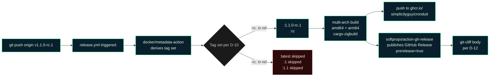

<objective>
Ship the maintainer runbook `docs/release-rc.md` per D-11 — the canonical step-by-step playbook for cutting any `vX.Y.Z-rc.N` pre-release tag, reusable across rc.1, rc.2, and rc.3.

Purpose: D-13 keeps the trust anchor (the tag) in the maintainer's signing key — explicitly NOT a workflow_dispatch — so the runbook is the reference the maintainer reaches for at the moment of tagging. Reusable: Phase 13 cuts rc.2 and Phase 14 cuts rc.3 by following the same runbook. Per `feedback_uat_user_validates.md`, the runbook explicitly says "the user (maintainer) runs the post-push checks; Claude does not assert UAT pass on their behalf."

Output:
- `docs/release-rc.md` — NEW, ~150-200 lines, sections per D-11 + RESEARCH.md.
- Mermaid diagram per CLAUDE.md (no ASCII).
- Pre-flight checklist, exact tag command, post-push verification table, GPG-signing pre-flight branching (per RESEARCH §Assumption A5), what-if-UAT-fails escalation.

This plan is **independent** of Plans 01/02/03/04/05 at the file-modification level. Wave 1 in parallel.

Per CONTEXT.md "Claude's Discretion": the runbook can live at `docs/release-rc.md`, the repo root, or as a section of `CONTRIBUTING.md`. Decision: **`docs/release-rc.md`** because:
1. Cronduit already has `docs/CI_CACHING.md` as a long-form runbook — the established pattern is `docs/<topic>.md`.
2. The runbook is referenced from `.planning/ROADMAP.md` § rc-cut points; a stable path under `docs/` survives doc reorganizations better than a repo-root file.
3. `CONTRIBUTING.md` does not yet exist in the repo (verified during planning); creating one solely to fold in this runbook is more churn than a standalone doc.
</objective>

<execution_context>
@$HOME/.claude/get-shit-done/workflows/execute-plan.md
@$HOME/.claude/get-shit-done/templates/summary.md
</execution_context>

<context>
@.planning/STATE.md
@.planning/ROADMAP.md
@.planning/PROJECT.md
@.planning/REQUIREMENTS.md
@.planning/phases/12-docker-healthcheck-rc-1-cut/12-CONTEXT.md
@.planning/phases/12-docker-healthcheck-rc-1-cut/12-RESEARCH.md
@.planning/phases/12-docker-healthcheck-rc-1-cut/12-PATTERNS.md

<interfaces>
<!-- Reference shapes from existing docs the runbook must match for voice/style. -->

From docs/CI_CACHING.md (the established long-form runbook style):
- Top-of-file: `# Title`, then a 1-2 sentence statement of purpose, then a `> Related documents: [...](...)` blockquote, then `## Why this matters`.
- Sections delimited by `##` headings.
- Mermaid diagrams use the Cronduit terminal-green palette. Verified against `docs/CI_CACHING.md` (which already ships these classDefs):
  - Active: `fill:#0a1f2d, stroke:#00ff7f, color:#e0ffe0` (matches `--cd-green`-family stroke from `design/DESIGN_SYSTEM.md` §2.1; the deep-cyan fill is the established CI_CACHING palette).
  - Storage / boundary: `fill:#1a1a1a, stroke:#666, color:#ccc`.
  - Skipped / warning: `fill:#2d0a0a, stroke:#ff7f7f, color:#ffe0e0, stroke-dasharray: 5 5`.
  - These hex values are the canonical CI_CACHING.md palette and are repeated here verbatim for consistency across project mermaid diagrams.
- Tables use leading/trailing pipes and `|---|---|` separators.
- Code blocks fenced with triple-backtick + language hint (`bash`, `yaml`, `mermaid`).

From .planning/PROJECT.md / STATE.md:
- "Iterative `v1.1.0-rc.N` cuts at chunky checkpoints (after each functional block)."
- "`:latest` GHCR tag stays at `v1.0.1` until final `v1.1.0`."
- "Tag format uses semver pre-release notation (`v1.1.0-rc.1`, not `v1.1.0-rc1`)."
- "Cargo.toml version bumped from `1.0.1` to `1.1.0` as the very first commit of v1.1." (Phase 10 D-12)

From CLAUDE.md auto-memory:
- `feedback_tag_release_version_match.md` — tag must equal Cargo.toml version; full semver `v1.1.0-rc.1`.
- `feedback_no_direct_main_commits.md` — Phase 12 work lands via feature branch; `git tag` happens AFTER PR merges to main.
- `feedback_diagrams_mermaid.md` — every diagram in the project is mermaid.
- `feedback_uat_user_validates.md` — UAT is user-validated, not Claude-self-asserted.
</interfaces>
</context>

<tasks>

<task type="auto" tdd="false">
  <name>Task 1: Create docs/release-rc.md maintainer runbook</name>
  <files>docs/release-rc.md</files>
  <read_first>
    - docs/CI_CACHING.md — read the full file to absorb the long-form runbook voice, the section ordering convention (Why this matters → inventory → flow diagram → debugging → adding new → verification), the mermaid color palette, and the table style.
    - .planning/PROJECT.md § Current Milestone — for the iterative-rc strategy, `:latest` pinning policy, and full-semver tag format.
    - .planning/ROADMAP.md § "rc cut points" — for the schedule the runbook references at the bottom.
    - .planning/phases/12-docker-healthcheck-rc-1-cut/12-CONTEXT.md § D-10, D-11, D-12, D-13 — for the runbook content requirements.
    - .planning/phases/12-docker-healthcheck-rc-1-cut/12-RESEARCH.md § Examples 8-10 + Assumption A5 — for the exact `git tag -a -s` commands, the GPG-signing pre-flight branching, and the post-push verification commands.
    - .planning/phases/12-docker-healthcheck-rc-1-cut/12-PATTERNS.md § "`docs/release-rc.md` (NEW runbook)" — for the verbatim section structure and mermaid diagram template.
  </read_first>
  <behavior>
    - The runbook ships as a self-contained reference document.
    - A maintainer with no prior context can read the runbook end-to-end in ~5 minutes and execute the rc-tag cut without asking clarifying questions.
    - The runbook explicitly handles the "no GPG key configured" branching path so a contributor maintainer without GPG can still cut a valid annotated tag.
    - The runbook explicitly notes that CI / Claude does NOT cut the tag (per D-13 + `feedback_uat_user_validates.md`).
    - The runbook references `cliff.toml` and `git-cliff` for the changelog preview step (D-12).
    - The runbook references `.github/workflows/compose-smoke.yml` and `.github/workflows/release.yml` by exact path so future readers can navigate.
  </behavior>
  <action>
Verify `docs/` directory exists at the repo root (it does — `docs/CI_CACHING.md` lives there).

Create `docs/release-rc.md` with EXACTLY the following content:

````markdown
# Cutting a release-candidate tag

This document is the maintainer runbook for cutting a `vX.Y.Z-rc.N` pre-release tag (e.g., `v1.1.0-rc.1`). Read it before tagging — the steps below are linear and the tag is a one-way action (no force-push, no untag-and-retry; if you mess up, ship `rc.N+1`).

> Related documents: [`.planning/ROADMAP.md`](../.planning/ROADMAP.md), [`.planning/PROJECT.md`](../.planning/PROJECT.md), [`.github/workflows/release.yml`](../.github/workflows/release.yml), [`.github/workflows/compose-smoke.yml`](../.github/workflows/compose-smoke.yml), [`cliff.toml`](../cliff.toml), [`docs/CI_CACHING.md`](./CI_CACHING.md).

## Why this matters

Cronduit ships v1.1+ via iterative release candidates (`v1.1.0-rc.1`, `v1.1.0-rc.2`, `v1.1.0-rc.3`) before the final `v1.1.0` tag. Each rc is the canonical artifact operators install for early-adopter testing. Two invariants the rc cut MUST preserve:

1. **`:latest` stays pinned to the most recent stable release** until the final non-rc tag ships. As of v1.1's milestone-in-progress, that pin is `v1.0.1`. The `.github/workflows/release.yml` patch from Phase 12 D-10 enforces this automatically — `:latest` is gated to skip on any tag containing a hyphen.
2. **The tag is the trust anchor.** Per Phase 12 D-13, tags are cut **locally by the maintainer**, NOT by `workflow_dispatch`. This keeps the signing key (and therefore the attestation chain) outside GitHub Actions' runner identity. A future supply-chain compromise of GHA cannot retroactively spoof a tag.

If either invariant breaks, every consumer of `:latest` is at risk. Hence: read this runbook, do not skip steps.

## Pre-flight checklist

Before running `git tag`:

- [ ] **All scoped PRs merged to `main`.** Confirm via `gh pr list --state merged --base main --search "milestone:v1.1"` (or equivalent for the current milestone).
- [ ] **`compose-smoke` workflow green on the merge commit of `main`.** Confirm via `gh run list --workflow=compose-smoke.yml --branch=main --limit=1` — the most recent run on `main` must be `completed/success`.
- [ ] **`ci` workflow green on the same `main` commit.** Confirm via `gh run list --workflow=ci.yml --branch=main --limit=1`.
- [ ] **`Cargo.toml` version matches the tag you're about to cut.** Open `Cargo.toml` and confirm `version = "1.1.0"` (or whatever the current rc series targets). If `Cargo.toml` says `1.1.0` and you are about to cut `v1.1.0-rc.1`, that is correct (the `-rc.N` suffix is the *tag* notation; the in-source version remains the unsuffixed milestone version per Phase 10 D-12).
- [ ] **`git-cliff --unreleased` preview makes sense as release notes.** Run:
  ```bash
  git fetch --tags
  git cliff --unreleased --tag v1.1.0-rc.1 -o /tmp/release-rc1-preview.md
  cat /tmp/release-rc1-preview.md
  ```
  Read the output critically. If a section is empty or a feature is mis-categorized, fix the conventional-commit messages on `main` *before* tagging — per D-12, `git-cliff` output is authoritative; do NOT hand-edit the GitHub Release body after publish.
- [ ] **Local checkout is on `main` at the merge-commit you want to tag.** Run `git checkout main && git pull --ff-only origin main` then `git log -1 --oneline` and confirm the SHA matches the merge commit of the final scoped PR.

## Cutting the tag

The runbook handles two GPG configurations: (a) the maintainer has a GPG signing key configured, (b) the maintainer does not. Both produce valid annotated tags; (a) additionally signs.

### Step 1 — GPG pre-flight (decide signed vs unsigned)

Check whether your local git is configured to sign tags:

```bash
git config --get user.signingkey
```

- **If the command outputs a key ID** (e.g., `0xABCDEF1234567890`) → use the **signed** path (Step 2a).
- **If the command outputs nothing** → use the **unsigned-but-annotated** path (Step 2b). This is still a valid attestation (annotated tags carry tagger identity + timestamp + message); signing is an additional layer of cryptographic non-repudiation.

> If you'd like to set up GPG signing before cutting your first rc, GitHub's [Signing tags](https://docs.github.com/en/authentication/managing-commit-signature-verification/signing-tags) doc walks through `gpg --gen-key` + `git config --global user.signingkey` + `git config --global tag.gpgSign true`. Then come back here.

### Step 2a — Signed annotated tag (preferred)

Replace `1.1.0-rc.1` with the actual rc number you're cutting:

```bash
git tag -a -s v1.1.0-rc.1 -m "v1.1.0-rc.1 — release candidate"
```

The `-a` flag forces an annotated tag (vs lightweight); `-s` signs with your configured GPG key. Verify the signature locally before pushing:

```bash
git tag -v v1.1.0-rc.1
```

You should see `gpg: Good signature from "..."` and `gpg: aka "..."`. If the signature fails verification, do NOT push — investigate the GPG keyring first.

### Step 2b — Unsigned annotated tag (fallback)

```bash
git tag -a v1.1.0-rc.1 -m "v1.1.0-rc.1 — release candidate"
```

Verify the tag is annotated (not lightweight):

```bash
git cat-file tag v1.1.0-rc.1
```

You should see a `tag` object with `tagger`, `tagger date`, and the message. If the output is a `commit` object instead, the `-a` flag was missed — delete the tag (`git tag -d v1.1.0-rc.1`) and re-run Step 2b.

### Step 3 — Push the tag

```bash
git push origin v1.1.0-rc.1
```

This kicks off `.github/workflows/release.yml`. The workflow does the following automatically:



Watch the workflow run live:

```bash
gh run watch --exit-status
```

When the workflow finishes green, proceed to post-push verification.

## Post-push verification

These checks are **user-validated**, not Claude-self-asserted (per the project's `feedback_uat_user_validates.md` rule). Run them yourself; do not delegate to a CI step that "asserts" the rc was published correctly.

| Check | Command | Expected |
|-------|---------|----------|
| `:1.1.0-rc.1` tag landed in GHCR | `docker manifest inspect ghcr.io/simplicityguy/cronduit:1.1.0-rc.1` | JSON manifest with two platforms (`linux/amd64`, `linux/arm64`). |
| `:rc` rolling tag points at the same digest | `docker manifest inspect ghcr.io/simplicityguy/cronduit:rc` | Manifest digest IDENTICAL to the digest from the `:1.1.0-rc.1` inspect. |
| `:latest` is unchanged from the previous stable | `docker manifest inspect ghcr.io/simplicityguy/cronduit:latest` | Manifest digest equal to the `v1.0.1` digest from before the rc cut. (You can confirm via the GHCR package page UI: `:latest` should still link to the v1.0.1 release.) |
| `:1`, `:1.1` are unchanged | `docker manifest inspect ghcr.io/simplicityguy/cronduit:1` and `:1.1` | Both still resolve to the previous stable digest. (If the rc.1 push had bumped them, the D-10 invariant is broken — file a hotfix PR immediately.) |
| GitHub Release marked prerelease | `gh release view v1.1.0-rc.1 --json isPrerelease --jq .isPrerelease` | `true` |
| Release body matches `git-cliff` preview | `gh release view v1.1.0-rc.1 --json body --jq .body \| diff - /tmp/release-rc1-preview.md` | No diff (or only whitespace differences). |
| Multi-arch image runs locally on your platform | `docker run --rm ghcr.io/simplicityguy/cronduit:1.1.0-rc.1 --version` | Outputs `cronduit 1.1.0`. |
| Healthy in the shipped compose stack | `docker compose -f examples/docker-compose.yml up -d` (with `image:` overridden to `:1.1.0-rc.1`) → `docker compose ps` after 90 s | `Up N seconds (healthy)`. |

If any check fails, see "What if UAT fails" below.

## What if UAT fails

The cardinal rule: **never force-push a tag, never delete-and-retag**. The semver pre-release notation exists for exactly this scenario.

If UAT discovers a critical issue with `v1.1.0-rc.1`:

1. **Fix the issue on `main`** via a normal feature branch + PR (per `feedback_no_direct_main_commits.md`).
2. **Cut `v1.1.0-rc.2`** following this same runbook from the top.
3. **Leave `v1.1.0-rc.1` published.** It stays as a historical artifact; operators who pulled it can compare against the new rc to verify the fix.
4. **Communicate.** Update the GitHub Release notes for `v1.1.0-rc.1` with a one-line `> ⚠️ Superseded by v1.1.0-rc.2 — see [link]` callout (this is the ONE acceptable hand-edit to a published release body).

If UAT discovers a *minor* issue (typo in release notes, missing CHANGELOG line):

1. Fix the conventional-commit messages on `main` via a normal PR.
2. Re-run `git cliff --unreleased --tag v1.1.0-rc.2` for the *next* rc.
3. Do NOT hotfix-tag the existing rc.1.

## References

- **Phase 12 plan**: `.planning/phases/12-docker-healthcheck-rc-1-cut/12-CONTEXT.md` — full decision context (D-10 metadata-action patch, D-11 this runbook, D-12 changelog policy, D-13 maintainer-cut rationale).
- **rc cut schedule**: `.planning/ROADMAP.md` § "rc cut points" — which rc cuts at which phase boundary.
- **`:latest` pinning rationale**: `.planning/PROJECT.md` § Current Milestone — why `:latest` stays at v1.0.1 through rcs.
- **GHA workflow patches**: `.github/workflows/release.yml` (D-10) and `.github/workflows/compose-smoke.yml` (D-09).
- **CHANGELOG configuration**: `cliff.toml` — git-cliff config; do NOT hand-customize for individual rc cuts (D-12).
- **Project tag-format convention**: full semver `vX.Y.Z-rc.N` with the dot before `rc.N`. NEVER `vX.Y.Z-rcN` (no dot) — `git-cliff` and `docker/metadata-action` both rely on the dot for correct prerelease detection.

---

*This runbook applies to v1.1.0-rc.1, v1.1.0-rc.2, v1.1.0-rc.3, and any future `vX.Y.Z-rc.N` cut. For the final non-rc ship (e.g., `v1.1.0`), the metadata-action patch from Phase 12 D-10 automatically restores the standard tag set (`:1.1.0`, `:1.1`, `:1`, `:latest`) and SKIPS the `:rc` tag — you do not need a separate runbook.*
````

Notes / verification:
- The mermaid diagram uses the Cronduit terminal-green palette per `design/DESIGN_SYSTEM.md` §2 and matches `docs/CI_CACHING.md` (canonical project mermaid classDefs): `cacheBox` = `fill:#0a1f2d, stroke:#00ff7f, color:#e0ffe0`; `gap` = `fill:#2d0a0a, stroke:#ff7f7f, color:#ffe0e0, stroke-dasharray: 5 5`; `storage` = `fill:#1a1a1a, stroke:#666, color:#ccc`. The mermaid block opens with a `%%` comment line citing both source files.
- The runbook explicitly says "user-validated, not Claude-self-asserted" — verbatim from `feedback_uat_user_validates.md`.
- Tag format documented as full semver with the dot — verbatim from `feedback_tag_release_version_match.md`.
- The GPG-signing pre-flight branches are explicit (signed vs annotated-only) per RESEARCH.md §Assumption A5.
- All section headings match the structure documented in PATTERNS.md § "`docs/release-rc.md`".
- DO NOT add ASCII-art diagrams (CLAUDE.md / `feedback_diagrams_mermaid.md`).
- DO NOT add a workflow_dispatch shortcut anywhere — D-13 explicitly rejects it.
- DO NOT make the runbook rc.1-specific (it must be reusable for rc.2/rc.3 — Phase 13/14 cut tags by following this same runbook).

After committing, verify the file:

```bash
test -f docs/release-rc.md
wc -l docs/release-rc.md             # expect ~150-200 lines
grep -c '^## ' docs/release-rc.md   # expect ≥ 5 (Why this matters, Pre-flight, Cutting, Post-push, What if, References)
grep -F 'mermaid' docs/release-rc.md  # expect ≥ 1 mermaid block
```

If the project ships a markdown linter (`markdownlint`, `mdl`), run it locally; the runbook should produce no warnings beyond what `docs/CI_CACHING.md` already shows.
  </action>
  <verify>
    <automated>test -f docs/release-rc.md && grep -q '^# Cutting a release-candidate tag' docs/release-rc.md && grep -q '^## Pre-flight checklist' docs/release-rc.md && grep -q '^## Cutting the tag' docs/release-rc.md && grep -q '^## Post-push verification' docs/release-rc.md && grep -q '^## What if UAT fails' docs/release-rc.md && grep -q '^## References' docs/release-rc.md && grep -F '```mermaid' docs/release-rc.md && grep -F 'git tag -a -s v1.1.0-rc.1' docs/release-rc.md && grep -F 'docker manifest inspect ghcr.io/simplicityguy/cronduit:1.1.0-rc.1' docs/release-rc.md && grep -F 'feedback_uat_user_validates' docs/release-rc.md || grep -F 'user-validated' docs/release-rc.md</automated>
  </verify>
  <acceptance_criteria>
    - `docs/release-rc.md` exists (verifiable: `test -f docs/release-rc.md`).
    - First-line H1 is `# Cutting a release-candidate tag` (verifiable: `head -1 docs/release-rc.md` returns this exact line).
    - Contains all six required `##` sections: `## Why this matters`, `## Pre-flight checklist`, `## Cutting the tag`, `## Post-push verification`, `## What if UAT fails`, `## References` (verifiable: each `grep -E '^## ...'` returning one match).
    - Contains at least one mermaid code block (verifiable: `grep -c '```mermaid' docs/release-rc.md` returns ≥ 1).
    - Contains exactly the example tag command `git tag -a -s v1.1.0-rc.1 -m "v1.1.0-rc.1 — release candidate"` (verifiable: `grep -F 'git tag -a -s v1.1.0-rc.1' docs/release-rc.md`).
    - Contains the unsigned-fallback command `git tag -a v1.1.0-rc.1 -m "v1.1.0-rc.1 — release candidate"` (verifiable: `grep -F 'git tag -a v1.1.0-rc.1' docs/release-rc.md`).
    - Contains the GPG pre-flight check `git config --get user.signingkey` (verifiable: `grep -F 'git config --get user.signingkey' docs/release-rc.md`).
    - Contains the post-push manifest-inspect command `docker manifest inspect ghcr.io/simplicityguy/cronduit:1.1.0-rc.1` (verifiable: `grep -F 'docker manifest inspect ghcr.io/simplicityguy/cronduit:1.1.0-rc.1' docs/release-rc.md`).
    - Contains the `:latest` pin verification `docker manifest inspect ghcr.io/simplicityguy/cronduit:latest` (verifiable: `grep -F 'docker manifest inspect ghcr.io/simplicityguy/cronduit:latest' docs/release-rc.md`).
    - Contains the user-validated UAT note (verifiable: `grep -F 'user-validated' docs/release-rc.md`).
    - Explicitly forbids tag force-push (verifiable: `grep -F 'never force-push a tag' docs/release-rc.md`).
    - References the Phase 12 D-10 / D-11 / D-12 / D-13 IDs (verifiable: `grep -E 'D-1[0-3]' docs/release-rc.md` returns at least 4 matches).
    - Contains the `git cliff --unreleased` preview command (verifiable: `grep -F 'git cliff --unreleased' docs/release-rc.md`).
    - Does NOT contain ASCII-art diagrams (verifiable: `! grep -E '^\\s*[+\\-|]{2,}' docs/release-rc.md` — no lines starting with multiple `+`, `-`, or `|` characters that would indicate an ASCII box).
    - Does NOT recommend `workflow_dispatch` for tag cuts (verifiable: `! grep -F 'workflow_dispatch' docs/release-rc.md`).
    - File is between 100 and 350 lines (verifiable: `wc -l < docs/release-rc.md` returns a value in that range — runbook is comprehensive but not bloated).
    - Mermaid diagram uses the Cronduit terminal-green palette (verifiable: `grep -F '#00ff7f' docs/release-rc.md` returns at least one match).
  </acceptance_criteria>
  <done>
    `docs/release-rc.md` ships as a self-contained, reusable maintainer runbook with the required sections, mermaid diagram, GPG branching, post-push verification table, and UAT-failure escalation path.
  </done>
</task>

</tasks>

<threat_model>
## Trust Boundaries

| Boundary | Description |
|----------|-------------|
| Runbook content → maintainer execution | The runbook is documentation, not code; mis-instructions cause maintainer error rather than direct exploit. |
| Documented `git tag -a -s` command → cryptographic attestation chain | Per D-13, the GPG signature on the tag is the trust anchor for downstream consumers; the runbook must not document a path that produces unsigned/unattested releases without explicit warning. |

## STRIDE Threat Register

| Threat ID | Category | Component | Disposition | Mitigation Plan |
|-----------|----------|-----------|-------------|-----------------|
| T-12-06-01 | Tampering | Runbook recommends a workflow_dispatch shortcut | mitigate | Acceptance criterion: `! grep -F 'workflow_dispatch' docs/release-rc.md`. D-13 explicitly rejects this trust-anchor weakening. |
| T-12-06-02 | Repudiation | Runbook documents force-push or delete-retag as recovery | mitigate | Acceptance criterion: `grep -F 'never force-push a tag' docs/release-rc.md`. The "What if UAT fails" section explicitly directs the maintainer to ship rc.N+1 instead. |
| T-12-06-03 | Spoofing | Runbook fails to recommend GPG signing | mitigate | Step 2a is "preferred" (signed); Step 2b is the explicit fallback for maintainers without GPG configured. The runbook links to GitHub's signing-setup docs to encourage migrating to signed tags. |
| T-12-06-04 | Information Disclosure | Runbook embeds a sample GPG key ID | accept | The example command uses a placeholder format `0xABCDEF1234567890` — no real key material disclosed. |
| T-12-06-05 | Denial of Service | Runbook misdirects post-push verification, masking a broken release | mitigate | The verification table covers all D-10 invariants (`:latest` pinned, `:rc` rolling, multi-arch present, prerelease=true). Each check has an explicit `Expected` column. The user-validated framing per `feedback_uat_user_validates.md` ensures the maintainer actively confirms each row, not delegates to a passing CI badge. |
| T-12-06-06 | Elevation of Privilege | Runbook documents tag-cutting as a CI-runnable action | mitigate | Same as T-12-06-01; the mermaid diagram explicitly shows `PUSH[git push origin ...]` originating from the maintainer's local environment, not from a workflow trigger. |
</threat_model>

<verification>
- `docs/release-rc.md` exists with all six required sections.
- One mermaid diagram present (no ASCII).
- GPG-signing pre-flight branching is documented.
- Post-push verification table covers `:latest` pinning, `:rc` rolling, multi-arch, prerelease=true.
- User-validated UAT note is explicit.
- No workflow_dispatch recommendation, no force-push recommendation.
- Cliff/CHANGELOG preview step references `git cliff --unreleased`.
- Runbook is reusable verbatim for rc.2 (Phase 13) and rc.3 (Phase 14) — only the example version number changes.
</verification>

<success_criteria>
- `docs/release-rc.md` ships and passes all acceptance criteria.
- The runbook is reusable for rc.2 and rc.3 with zero structural changes.
- The runbook respects all four CLAUDE.md auto-memory feedbacks (mermaid-only diagrams; no direct main commits — `git tag` happens after PR merges; UAT user-validated; full-semver tag format).
- The runbook is the canonical reference Plan 07's maintainer step links to when cutting `v1.1.0-rc.1`.
</success_criteria>

<output>
After completion, create `.planning/phases/12-docker-healthcheck-rc-1-cut/12-06-SUMMARY.md` capturing:
- File line count.
- All section headings extracted.
- The mermaid diagram source (verbatim).
- Confirmation that the runbook is rc-version-agnostic (no hardcoded `rc.1`-specific narrative beyond the example commands).
- Any deviations from the planned section structure.
</output>
