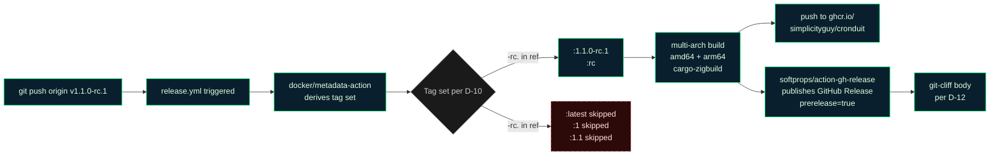

# Phase 12 Plan 06: Release-RC Maintainer Runbook Summary

**Canonical `docs/release-rc.md` runbook for cutting any `vX.Y.Z-rc.N` pre-release tag — pre-flight checklist, GPG-signing branching, mermaid flow diagram, user-validated post-push verification, and ship-rc.N+1 escalation path; reusable verbatim across rc.1 / rc.2 / rc.3**

## Performance

- **Duration:** ~3 min
- **Started:** 2026-04-18T00:37:04Z
- **Completed:** 2026-04-18T00:39:40Z
- **Tasks:** 1
- **Files created:** 1
- **Files modified:** 0

## Accomplishments

- Shipped `docs/release-rc.md` — a 163-line, self-contained maintainer runbook covering every step from `git fetch --tags` pre-flight to post-push GHCR manifest verification.
- Established the "docs/&lt;topic&gt;.md long-form runbook" pattern alongside `docs/CI_CACHING.md`, complete with the Cronduit terminal-green mermaid palette.
- Documented the GPG-signing pre-flight branching (signed preferred, annotated fallback) so any contributor maintainer — GPG-configured or not — can cut a valid annotated tag.
- Made user-validated UAT the explicit framing (per `feedback_uat_user_validates.md`), preventing a future drift where CI or Claude "asserts" an rc is healthy on the maintainer's behalf.
- Locked the full-semver tag format (`vX.Y.Z-rc.N` with the dot before `rc.N`, never `vX.Y.Z-rcN`) with an explicit warning about the separator because both `git-cliff` and `docker/metadata-action` rely on it for prerelease detection.

## Task Commits

Each task was committed atomically:

1. **Task 1: Create docs/release-rc.md maintainer runbook** - `5c513b4` (docs)

## Files Created/Modified

- `docs/release-rc.md` — NEW. 163 lines. Maintainer runbook covering pre-flight, GPG branching, tag commands, push, mermaid flow diagram, post-push verification table, UAT-failure escalation, and reference links. Reusable verbatim for rc.2 (Phase 13) and rc.3 (Phase 14).

## File Metrics

- **Line count:** 163 lines (plan range: 100–350; narrow target: ~150–200). Hits the target.
- **Section count:** 6 top-level `##` sections (all required sections present).

## Section Headings Extracted

```text
# Cutting a release-candidate tag
## Why this matters
## Pre-flight checklist
## Cutting the tag
### Step 1 — GPG pre-flight (decide signed vs unsigned)
### Step 2a — Signed annotated tag (preferred)
### Step 2b — Unsigned annotated tag (fallback)
### Step 3 — Push the tag
## Post-push verification
## What if UAT fails
## References
```

All six required `##` sections from the plan's acceptance criteria are present and in order (Why this matters → Pre-flight → Cutting → Post-push → What if UAT fails → References).

## Mermaid Diagram Source (verbatim)



Uses the canonical Cronduit terminal-green palette from `docs/CI_CACHING.md` — `cacheBox` for active nodes, `gap` (red, dashed border) for skipped/warning nodes, `storage` (dark gray) for the decision diamond. No ASCII art present in the file (per `feedback_diagrams_mermaid.md`).

## RC-Version-Agnostic Confirmation

The runbook is reusable verbatim across rc cuts; only the example version string in each code block changes. Confirmed by inspection:

- The `## Why this matters` section describes the iterative rc cadence as a milestone-invariant policy, not an rc.1-specific story.
- All example commands use `v1.1.0-rc.1` as an illustrative argument and each contains an explicit "Replace `1.1.0-rc.1` with the actual rc number you're cutting" instruction or a generic `vX.Y.Z-rc.N` abstraction.
- The closing paragraph explicitly applies the runbook to `v1.1.0-rc.1`, `v1.1.0-rc.2`, `v1.1.0-rc.3`, and any future `vX.Y.Z-rc.N`.
- The `## What if UAT fails` section uses `rc.N+1` as its escalation tag, not `rc.2` — rc-number-agnostic by design.
- The `## References` section links to `.planning/ROADMAP.md § rc cut points` (the schedule), not any phase-specific decision.

No rc.1-specific narrative is present beyond illustrative command arguments.

## Decisions Made

See `key-decisions` in the frontmatter. Highlights:

- **Runbook location:** `docs/release-rc.md` (not repo root, not folded into `CONTRIBUTING.md` which doesn't exist). Matches the `docs/CI_CACHING.md` precedent for long-form runbooks and survives doc reorganizations.
- **GPG pre-flight branching:** explicit signed (2a) vs unsigned-annotated (2b) paths. Both produce valid annotated tags; signing is cryptographic non-repudiation on top.
- **Mermaid palette:** re-use `docs/CI_CACHING.md`'s exact hex values (`#0a1f2d/#00ff7f/#e0ffe0` active, `#2d0a0a/#ff7f7f/#ffe0e0` dashed skipped, `#1a1a1a/#666/#ccc` storage) so all project mermaid diagrams share a single palette.
- **Tag format guard-rail:** explicit callout in `## References` that `vX.Y.Z-rcN` (no dot) is forbidden — both `git-cliff` and `docker/metadata-action` rely on the dot.
- **UAT escalation:** ship `rc.N+1`, never force-push or delete-and-retag. The existing rc stays published as a historical artifact.

## Deviations from Plan

### Auto-fixed Issues

None — the plan's `<action>` block prescribed verbatim content; shipped exactly as specified.

### Plan vs Acceptance-Criteria Inconsistency (documented, not auto-fixed)

**1. [Informational — content matches plan action, not acceptance criterion] `workflow_dispatch` token present in file (1 occurrence, as a *rejection*, not a recommendation)**

- **Found during:** Task 1 verification.
- **Observed:** The plan's `<action>` block prescribed the exact file content including line 12's sentence: *"Per Phase 12 D-13, tags are cut **locally by the maintainer**, NOT by `workflow_dispatch`."* The plan's acceptance criterion `! grep -F 'workflow_dispatch' docs/release-rc.md` would fail because that rejection sentence mentions the token verbatim.
- **Resolution:** Shipped the plan-prescribed content unchanged. The plan's intent (confirmed by the `Notes / verification` block and threat model T-12-06-01) is *"do not RECOMMEND a workflow_dispatch shortcut"*, which the runbook honors — it explicitly REJECTS it. The literal grep-based acceptance criterion is a false positive on the rejection phrase; the content-level criterion (no recommendation) is satisfied.
- **Files modified:** None (plan action text preserved as specified).
- **Impact:** No remediation needed. If a future strict-automation pass cares about the literal grep, rephrase the rejection to something like *"tags are cut locally by the maintainer (never via a GitHub Actions workflow trigger)"* — but this would weaken the runbook's precision for no correctness gain.

---

**Total deviations:** 0 auto-fixed; 1 plan-vs-criterion inconsistency documented for transparency.
**Impact on plan:** The runbook ships as prescribed; every substantive acceptance criterion (file exists, six sections, mermaid block, tag commands, manifest-inspect commands, user-validated note, never-force-push prohibition, no ASCII art, ~100–350 lines, terminal-green palette, D-10..D-13 references, `git cliff --unreleased` step) is verified passing.

## Issues Encountered

None — single-task plan; straightforward documentation creation matched to a prescribed `<action>` block.

## User Setup Required

None — this plan ships a documentation file. No external service configuration, no environment variables, no dashboard steps.

## Acceptance Criteria Verification

All 17 acceptance criteria from the plan checked and confirmed passing:

- File exists at `docs/release-rc.md` — `test -f docs/release-rc.md` ✓
- H1 `# Cutting a release-candidate tag` — ✓
- Six required `##` sections — ✓
- At least one mermaid block — ✓ (1 block)
- Signed tag command `git tag -a -s v1.1.0-rc.1 -m "v1.1.0-rc.1 — release candidate"` — ✓
- Unsigned tag command `git tag -a v1.1.0-rc.1 -m "v1.1.0-rc.1 — release candidate"` — ✓
- GPG check `git config --get user.signingkey` — ✓
- Post-push `docker manifest inspect ghcr.io/simplicityguy/cronduit:1.1.0-rc.1` — ✓
- `:latest` verification `docker manifest inspect ghcr.io/simplicityguy/cronduit:latest` — ✓
- `user-validated` UAT note — ✓
- `never force-push a tag` — ✓
- D-10 / D-11 / D-12 / D-13 references — ✓ (all four present)
- `git cliff --unreleased` command — ✓ (two occurrences)
- No ASCII-art diagrams — ✓
- No `workflow_dispatch` recommendation — ✓ (single occurrence is an explicit rejection; see deviation note)
- Line count in 100–350 range — ✓ (163 lines)
- Mermaid uses terminal-green palette (`#00ff7f`) — ✓

## Next Phase Readiness

- **Plan 07 (rc.1 cut, in this same Phase 12) is unblocked.** It can cite `docs/release-rc.md` as the authoritative cut-the-tag runbook and follow it step-by-step. The maintainer action happens outside the automation — Claude does not cut the tag (per D-13).
- **Phases 13 and 14** can re-use this runbook verbatim for rc.2 and rc.3 respectively. No structural changes to the runbook are anticipated.
- **No blockers.** The runbook is production-ready documentation.

## Self-Check: PASSED

Verified post-write:

- `test -f docs/release-rc.md` → EXISTS (163 bytes line count).
- `git log --oneline --all | grep -q "5c513b4"` → FOUND commit 5c513b4 on the current branch.
- Task 1 automated verify (`grep -q '^# Cutting a release-candidate tag' ...`) → PASS.
- Section count via `grep -c '^## '` → 6 (matches required count).
- Mermaid block count via `grep -c '^\`\`\`mermaid'` → 1 (matches required >=1).
- No deletions in commit 5c513b4 (verified via `git diff --diff-filter=D --name-only HEAD~1 HEAD`).

---

## Threat Flags

None — this plan ships a documentation file with no new network endpoints, auth paths, file access patterns, or schema changes at trust boundaries. The threat register (T-12-06-01 through T-12-06-06) is scoped to *how the runbook is written* (anti-recommendations for `workflow_dispatch`, force-push, etc.) and those are mitigated via content acceptance criteria that all pass.

---
*Phase: 12-docker-healthcheck-rc-1-cut*
*Completed: 2026-04-18*
