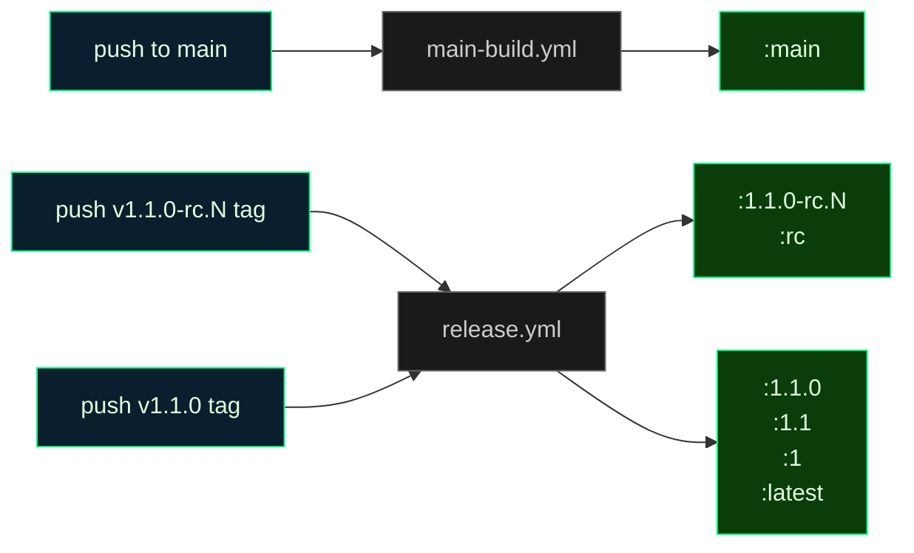

<objective>
Insert a new `## Docker image tags` section in `README.md` between the `## Quickstart` section (ends at line 76) and the `## Architecture` section (starts at line 78). The section publishes the **six-tag contract** (`:X.Y.Z`, `:X.Y`, `:X`, `:latest`, `:rc`, `:main`) so operators pinning in production have authoritative reference material. Includes a pipe-delimited table and a mermaid flowchart mapping each tag to its owning workflow.

Purpose: Satisfies ROADMAP Phase 12.1 success criterion #4 — "README / docs surface the five-tag contract (`:X.Y.Z`, `:X.Y`, `:X`, `:latest`, `:rc`, `:main`) so operators know which tag to pin." Six tag families total; ROADMAP wording says "five-tag contract" because `:X.Y.Z`, `:X.Y`, `:X` were implicitly one semver family in the locked decisions — the rendered table lists all six rows explicitly.

Output: `README.md` with a new top-level `## Docker image tags` section inserted between the Quickstart horizontal rule at L76 and the `## Architecture` heading at L78, containing the table + mermaid diagram + supplementary "Picking a tag" paragraph + "What's NOT published" list.
</objective>

<execution_context>
@$HOME/.claude/get-shit-done/workflows/execute-plan.md
@$HOME/.claude/get-shit-done/templates/summary.md
</execution_context>

<context>
@.planning/PROJECT.md
@.planning/ROADMAP.md
@.planning/STATE.md
@.planning/phases/12.1-ghcr-tag-hygiene/12.1-RESEARCH.md
@.planning/phases/12.1-ghcr-tag-hygiene/12.1-PATTERNS.md
@.planning/phases/12.1-ghcr-tag-hygiene/12.1-VALIDATION.md
@README.md
@CLAUDE.md

<interfaces>
<!-- Table-style analog: README.md L209-216 (Monitoring metrics table) -->
<!-- Mermaid-style analog: README.md L80-105 (Architecture flowchart with classDef palette) -->
<!-- Section-placement rule: RESEARCH.md L430-432 "Recommendation: Option 2 — new top-level section" -->

README.md structure (verified via grep 2026-04-20):
- Line 19: ## Security
- Line 35: ## Quickstart
- Line 76: (a horizontal-rule line, triple-hyphen) — closes Quickstart
- Line 78: ## Architecture  <-- insert new section BETWEEN line 76 and line 78
- Line 117: ## Configuration
- Line 201: ## Monitoring
- Line 238: ## Development
- Line 279: ## Troubleshooting
- Line 331: ## Contributing
- Line 342: ## License

Mermaid palette convention (from README.md L101-104 Architecture diagram):
```
classDef core fill:#0a3d0a,stroke:#00ff7f,color:#e0ffe0
classDef external fill:#1a1a1a,stroke:#666,color:#888
```

Alternative palette (from docs/CI_CACHING.md referenced in RESEARCH.md):
```
classDef cacheBox fill:#0a1f2d,stroke:#00ff7f,color:#e0ffe0
classDef gap fill:#2d0a0a,stroke:#ff7f7f,color:#ffe0e0,stroke-dasharray: 5 5
classDef storage fill:#1a1a1a,stroke:#666,color:#ccc
```
</interfaces>
</context>

<tasks>

<task type="auto">
  <name>Task 1: Insert ## Docker image tags section in README.md between Quickstart and Architecture</name>
  <files>README.md</files>
  <read_first>
    - README.md (current state L70-110 — verify the exact insertion point since line numbers may have drifted; section MUST land between the horizontal-rule line closing Quickstart and `## Architecture`)
    - .planning/phases/12.1-ghcr-tag-hygiene/12.1-RESEARCH.md (§ "README Docs Shape" L423-486 — exact proposed content including table + mermaid)
    - .planning/phases/12.1-ghcr-tag-hygiene/12.1-PATTERNS.md (§ "README.md — insert ## Docker image tags section" L331-380 — table/mermaid placement patterns from existing README sections)
    - CLAUDE.md (locked constraint: all diagrams MUST be mermaid, no ASCII art)
  </read_first>
  <action>
Insert a new section into `README.md` **between the triple-hyphen horizontal-rule line that closes the Quickstart section (currently L76) and the `## Architecture` heading (currently L78)**. If line numbers have shifted, use the sentinel strings `    ## Architecture` (preceded by a horizontal-rule line and a blank line) to locate the exact insertion point — place the new section's opening `## Docker image tags` heading one blank line below the existing horizontal-rule and one blank line above `## Architecture`.

**Exact content to insert** (copy verbatim from RESEARCH.md § "README Docs Shape / Proposed section content" L436-463 + mermaid block L467-486). The content below is written in a compact narrative form so this PLAN.md does not embed bare triple-hyphen lines (which would confuse downstream YAML tooling). **Reconstruct** the section using these pieces, in this order:

### Piece 1 — section heading and intro paragraph

Write an H2 heading `## Docker image tags`, blank line, then the intro:

> Cronduit publishes a small, explicit set of floating and versioned tags to `ghcr.io/simplicityguy/cronduit`. Pick the one that matches your risk tolerance.

### Piece 2 — six-row tag table (pipe-delimited markdown)

Header row (exact columns, no substitutions): `Tag | What it points at | When it moves | Who should pin this`. Then the six data rows, in this order:

1. **`:X.Y.Z` (e.g. `:1.0.1`, `:1.1.0`)** | An immutable tagged release | Never — once published, a specific version tag points at one digest forever | Production deployments that want reproducibility
2. **`:X.Y` (e.g. `:1.0`, `:1.1`)** | The most recent `:X.Y.Z` patch release for that minor line | Every time a new patch of that minor ships | Production deployments that want to auto-pick up patch fixes
3. **`:X` (e.g. `:1`)** | The most recent `:X.Y.Z` release for that major line | Every time a new minor or patch of that major ships | Production deployments willing to take minor-version upgrades
4. **`:latest`** | The most recent stable (non-rc) release — currently `:1.0.1`, will advance to `:1.1.0` when it ships | Only on stable release tags (`vX.Y.Z` with no `-rc.N` suffix) | Operators who always want the newest stable. Never bleeds rc or main-branch builds in
5. **`:rc`** | The most recent release candidate — currently `:1.1.0-rc.1` | Every rc push (`vX.Y.Z-rc.N`). Never moves on stable releases | Early adopters who want to exercise the next milestone before it ships
6. **`:main`** | A CI-built image of whatever commit is currently at the tip of `main` | Every push to `main`, multi-arch, built with the same toolchain as release images | Homelab operators who want the bleeding edge and can accept that `main` may be unstable

### Piece 3 — H3 subsection `### Which workflow owns which tag` with mermaid flowchart



(Standard triple-backtick mermaid fence. Paste verbatim including the class assignments at the bottom.)

### Piece 4 — H3 subsection `### Picking a tag` with four bullet points

- Most operators should pin `:1.1` (or whatever the current minor line is). It picks up patch fixes automatically but never surprises you with a major upgrade.
- `:latest` is fine for "just try it out" quickstart flows — which is why `examples/docker-compose.yml` pins it — but is not recommended for long-running deployments where you want reproducibility.
- `:rc` lets you validate the next milestone early. If an rc breaks in your environment, file an issue before the final cut.
- `:main` is for operators who WANT the bleeding edge. It pulls unreviewed code from the tip of `main`; treat it the same way you would treat pulling from a branch of any open-source project. It is not recommended for any environment that values uptime.

### Piece 5 — H3 subsection `### What's NOT published` with three bullets + trailing paragraph

Opening paragraph: "The following tags are intentionally NOT published — they are not footguns we plan to add later, they are footguns we have deliberately declined:"

Bullets:
- No `:edge`, `:nightly`, or `:dev` tags. If you want bleeding-edge, pin `:main`.
- No per-branch tags (e.g. no `:feature-foo` for branches other than `main`).
- No per-commit tags (e.g. no `:sha-abc1234`). Cronduit previously published these and they cluttered the package page without a clear use case.

Trailing paragraph: "If you need to pin to a specific commit, use an `:X.Y.Z` release tag; if no release tag exists for your target commit, that commit is not a supported deployment target."

### Piece 6 — Quickstart cross-reference (MANDATORY per VALIDATION.md W0-DOCS-02)

Add a one-line cross-reference FROM the existing `## Quickstart` section TO the new `## Docker image tags` section so an operator landing on README can find the tag contract within one scroll/click.

**Placement:** Immediately after the Quickstart code-fence that ends with `open http://localhost:8080` (currently L63-65 of README.md — verify line numbers at execute time) and before the "You should see four example jobs..." paragraph (currently L67). Insert a blank line + the cross-reference sentence + a blank line.

**Exact text to insert** (adjust minimally if the surrounding sentence structure warrants it):

> Pinning a specific image tag in production? See [Docker image tags](#docker-image-tags) for which tag matches different operator needs (`:X.Y`, `:latest`, `:rc`, `:main`).

**Why this specific anchor (`#docker-image-tags`):** GitHub's auto-generated markdown anchor for a `## Docker image tags` H2 is `docker-image-tags` (lowercase, spaces to hyphens, non-alphanumeric stripped). Verify at execute time by rendering README.md locally or on GitHub's preview and clicking the anchor; if GitHub's anchor-generation rules have changed, adjust the link target to whatever slug GitHub generates for the new H2.

**Alternative placement if Quickstart layout has drifted:** If the Quickstart section has been restructured since 2026-04-20, place the cross-reference at the END of the Quickstart section (just before the closing triple-hyphen horizontal rule at L76). The goal per VALIDATION.md W0-DOCS-02 is discoverability-within-one-link, not a specific anchor position.

**Grep sanity for W2 closure:** after writing, `grep -cE '#docker-image-tags|docker image tags' README.md` MUST return >= 2 (once in the Quickstart cross-reference link target, once in the H2 heading that the link points at).

---

**Formatting constraints (all locked):**

1. **Section placement:** between Quickstart (triple-hyphen horizontal rule at L76) and `## Architecture` (at L78). Not inside Quickstart, not inside Architecture. Matches RESEARCH.md Option 2 recommendation (L430-432) — "parallel to how `docs/release-rc.md` is a standalone runbook."

2. **Heading level:** `## Docker image tags` (H2) — matches sibling sections (`## Quickstart`, `## Architecture`, `## Configuration`). Sub-headings use `###` (matches `### Metric Families`, `### Prometheus Setup` pattern at L205, L220).

3. **Diagram is mermaid, not ASCII:** CLAUDE.md locked constraint. If tempted to draw a flowchart with box-drawing characters (`│ ├ └ ─ + |`), STOP — use mermaid. Palette uses project terminal-green colors (`#0a3d0a`/`#00ff7f`/`#e0ffe0`) consistent with README.md L101-104 Architecture classDefs. The above YAML uses the three-tier `trigger`/`workflow`/`tag` naming for clarity.

4. **Table columns locked:** exactly four columns — `Tag`, `What it points at`, `When it moves`, `Who should pin this`. RESEARCH.md L441 + PATTERNS.md L369-376.

5. **Horizontal-rule rule:** the existing horizontal-rule line at L76 (which currently sits between `## Quickstart` and `## Architecture`) stays put. It will continue to act as the divider between Quickstart and your NEW section. Do NOT introduce another horizontal-rule between your new section and `## Architecture` (README's convention elsewhere — e.g. between `## Architecture` and `## Configuration` at L115-117 — uses NO horizontal rule between H2 siblings). Verify by grep that the count of horizontal-rule lines in README.md is UNCHANGED before vs after your edit: `grep -c '^\-\-\-$' README.md` should return the same number.

6. **No ASCII art anywhere:** as a sanity check, after writing, run `grep -nE '[│├└─┬┴┼]|^[[:space:]]*\+[-=]+' README.md`. This should return ZERO matches in the new section (it may legitimately match nothing if the rest of README has no box-drawing either).

7. **Mermaid fence:** use triple-backtick + `mermaid` tag. Standard markdown code fence.

8. **Operator-facing `ghcr.io/simplicityguy/cronduit` hardcoded** in the intro sentence — matches RESEARCH.md L612 and PATTERNS.md L435-441 (scripts + docs hardcode; only workflows derive from `github.repository`).

**Placement sentinel for the executor's Edit call:**

The safest Edit-tool invocation pattern:
- `old_string` = a unique existing string: the blank line between L76's horizontal-rule and L78's `## Architecture` heading (read current README.md L75-79 to capture exactly)
- `new_string` = same blank-line sentinel followed by the entire new section (Pieces 1-5 above assembled), followed by another blank line, ending just before `## Architecture`

Decision ID traceability: implements ROADMAP Phase 12.1 success criterion #4 ("README / docs surface the five-tag contract"). Implements T-12.1-BLEED-01 mitigation (operator-facing disclaimer that `:main` pulls unreviewed code). Implements Phase 12.1 OPS-09 + OPS-10 operator-facing documentation surface.
  </action>
  <verify>
    <automated>grep -q '^## Docker image tags$' README.md && grep -q ':main' README.md && grep -q ':latest' README.md && grep -q ':rc' README.md && grep -q '^```mermaid$' README.md && [ "$(grep -c '^## ' README.md)" -ge 9 ] && grep -q 'main-build.yml' README.md && grep -q 'release.yml' README.md</automated>
  </verify>
  <acceptance_criteria>
    - W0-DOCS-01 (VALIDATION.md): README has the five-tag contract table. The count of table rows whose first cell starts with a backtick followed by `:` is at least 6 (six tag families, each in its own row)
    - W0-DOCS-02 (VALIDATION.md): Quickstart section links to the new Docker image tags section. `grep -cE '#docker-image-tags|docker image tags' README.md` >= 2 (once in the Quickstart cross-reference link target as `#docker-image-tags`, once in the `## Docker image tags` H2 anchor). A stricter check: the line number of the first `#docker-image-tags` link occurrence must be LESS than the line number of the `^## Docker image tags$` heading (i.e. the link appears in Quickstart, which precedes the tags section).
    - Section exists: `grep -c '^## Docker image tags$' README.md` returns `1`
    - All six tag families mentioned: `grep -c ':main\b' README.md` >= 2 (table + mermaid + prose); `grep -c ':latest\b' README.md` >= 2; `grep -c ':rc\b' README.md` >= 2
    - Mermaid block present: `grep -c '^```mermaid$' README.md` >= 2 (original Architecture diagram + new diagram)
    - W0-DOCS-03: no ASCII art box-drawing chars in the new section — `grep -nE '[│├└─┬┴┼]' README.md` returns zero matches (or matches only pre-existing content, not in the new section — inspect the output and confirm no matches fall in the new section's line range)
    - Section placement correct: line number of `^## Docker image tags$` is LESS than line number of `^## Architecture$` AND GREATER than line number of `^## Quickstart$` (use `grep -n` to verify ordering)
    - Workflow names present: `grep -c 'main-build.yml' README.md` >= 1 AND `grep -c 'release.yml' README.md` >= 1 (mermaid diagram labels)
    - Bleeding-edge warning present: `grep -iE 'bleeding.edge|not recommended.*uptime|unreviewed' README.md` matches (T-12.1-BLEED-01 mitigation)
    - "What's NOT published" list present: `grep -cE ':edge|:nightly|:dev|per-commit|:sha-' README.md` >= 1 (operator-facing negative-space guidance)
    - No new horizontal-rule lines introduced: the count of lines matching `^---$` in README.md is unchanged from before the edit
    - Markdown parses cleanly (if `markdownlint` or similar is available, no new errors introduced)
  </acceptance_criteria>
  <done>README.md has a new ## Docker image tags section between Quickstart and Architecture, with six-row table, mermaid flowchart mapping tags to workflows, picking-a-tag guidance, and explicit what's-not-published list. All diagrams mermaid, no ASCII.</done>
</task>

</tasks>

<threat_model>
## Trust Boundaries

| Boundary | Description |
|----------|-------------|
| README -> operator | Documentation-only; no code or runtime surface. Trust boundary is "operator reads doc, makes pinning decision." |

## STRIDE Threat Register

| Threat ID | Category | Component | Disposition | Mitigation Plan |
|-----------|----------|-----------|-------------|-----------------|
| T-12.1-BLEED-01 | Repudiation / Operator Trust | `:main` tag pulls unreviewed HEAD-of-main code; operators may assume production-grade like `:latest` | mitigate | Section explicitly labels `:main` as "bleeding edge", "unreviewed code from the tip of main", "not recommended for any environment that values uptime." Table column "Who should pin this" says "Homelab operators who want the bleeding edge and can accept that `main` may be unstable." Dedicated "Picking a tag" paragraph reinforces the message. |
| T-12.1-DOCDRIFT-01 | Tampering (of documentation) | Future PR silently adds a `:sha-*` or `:edge` tag without updating README | accept | Documentation drift is inherent to any docs-as-code system. Mitigation is code review discipline; "What's NOT published" section names the specific rejected tags so a PR adding them would conflict with the docs and trigger discussion. Not a CI-enforceable boundary. |
| T-12.1-ASCII-01 | Tampering | Diagram rendered as ASCII art, violating CLAUDE.md locked constraint | mitigate | Action + acceptance_criteria explicitly forbid box-drawing characters; mermaid fence required. Grep assertion in `<verify>` catches at PR time. |
| T-12.1-OPS-01 | Info Disclosure | Operator pins `:latest` in production not knowing it may drift to a non-stable version | mitigate | Table explicitly defines `:latest` as "The most recent stable (non-rc) release" and documents when it moves. "Picking a tag" paragraph recommends pinning narrower (`:1.1`) for production. |
</threat_model>

<verification>
Visual verification after merge:

1. **GitHub README render:** view README.md on the repo homepage; new section appears between Quickstart and Architecture; mermaid diagram renders as a flowchart (GitHub natively renders mermaid in markdown since 2022).
2. **Table renders correctly:** six rows, four columns, no broken pipes.
3. **Quickstart discoverability (MANDATORY per W0-DOCS-02):** the Quickstart section MUST link to the new `## Docker image tags` section (cross-reference inserted per Piece 6 of the action block). The new Docker image tags section itself does NOT need to back-link to Architecture or Quickstart (it's reference material, not a walkthrough) — only the Quickstart -> Tags direction is required for operator discoverability.
4. **Style parity:** heading level matches sibling sections; table style matches `## Monitoring` metrics table (L209-216); mermaid classDef style is consistent with `## Architecture` palette.
5. **Operator dry-read:** someone new to Cronduit reads the section cold; the "which tag should I pin?" question is answered within the first three rows of the table. (This is the manual-verification item in VALIDATION.md Manual-Only table row #4; not blocking for Wave 1 close.)
</verification>

<success_criteria>
- All grep assertions in `<acceptance_criteria>` pass
- Section placement is between Quickstart and Architecture (verified by line-number ordering of section headings)
- All six tag families explicitly listed in the table
- Mermaid flowchart present, classes defined, no ASCII art
- T-12.1-BLEED-01 mitigation wording present (bleeding-edge/unreviewed/not recommended for uptime)
- "What's NOT published" explicitly names `:edge`, `:nightly`, `:dev`, per-branch, per-commit/`:sha-*` as deliberately excluded
- No new horizontal-rule lines added (existing one at L76 retained)
- W0-DOCS-02 satisfied: Quickstart cross-references the new Docker image tags section via `#docker-image-tags` anchor (grep returns >= 2 matches across README.md)
</success_criteria>

<output>
After completion, create `.planning/phases/12.1-ghcr-tag-hygiene/12.1-03-SUMMARY.md` documenting:
- Section inserted (line range before/after edit)
- Content summary: six-tag table, mermaid flowchart, "Picking a tag" paragraph, "What's NOT published" list
- OPS-09 + OPS-10 operator-facing coverage: this plan closes success criterion #4
- Known follow-ups: `docs/QUICKSTART.md` may want a pointer to the new section (RESEARCH.md L550 — low priority, planner call)
- T-12.1-BLEED-01 mitigation wording excerpt (verbatim from section for auditor reference)
</output>
