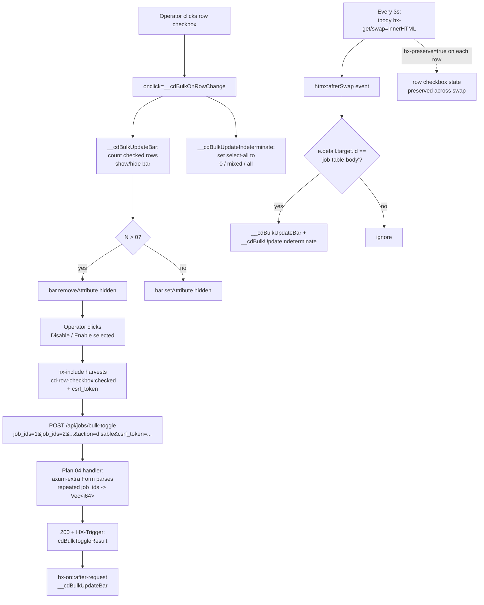

# Phase 14 Plan 05: Dashboard Bulk-Select UI Summary

**Sticky bulk-action bar + leftmost checkbox column on the jobs dashboard, with hx-preserve guarding selection state across the 3s HTMX poll and inline JS wiring indeterminate state.**

## Performance

- **Duration:** 5m 37s (337s)
- **Started:** 2026-04-22T22:29:08Z
- **Completed:** 2026-04-22T22:34:45Z
- **Tasks:** 3
- **Files modified:** 3

## Accomplishments

- Per-row select checkbox added to `templates/partials/job_table.html` with stable `id="cd-row-cb-{{ job.id }}"` + `hx-preserve="true"` (Landmine §3 mitigation: poll wipes selection without these)
- Select-all `<th>` + sticky `.cd-bulk-bar` rendered into `templates/pages/dashboard.html` as a SIBLING of `.overflow-x-auto` (Landmine §`Sticky`: sticky requires non-clipping ancestor; verified bar at line 42, wrapper at line 71)
- Three action buttons (`Disable selected`, `Enable selected`, `Clear`) wired via `hx-post="/api/jobs/bulk-toggle"` + `hx-include=".cd-row-checkbox:checked, [name='csrf_token']"` to consume Plan 04's wave-2 handler
- Inline JS (~50 LOC, vanilla DOM): 5 helper functions + `htmx:afterSwap` listener gated on the polled `<tbody>` id, re-syncs indeterminate state and bar visibility every 3s
- Six new CSS selectors appended to `@layer components` in `assets/src/app.css`, all reusing existing `--cd-*` tokens; zero new tokens, zero existing selectors touched

## Task Commits

Each task was committed atomically with `--no-verify` (parallel-execution fast path):

1. **Task 1: Per-row select checkbox in job_table.html** — `1330a9f` (feat)
2. **Task 2: Select-all `<th>`, sticky bar, inline JS in dashboard.html** — `ce33a7a` (feat)
3. **Task 3: Six additive CSS selectors in app.css** — `77c1172` (feat)

**Plan metadata commit:** _to be added when committing this SUMMARY.md_

## Files Modified

- `templates/partials/job_table.html` (+10 lines) — leading `<td>` with `.cd-row-checkbox` (id, name, value, aria-label, hx-preserve, onclick)
- `templates/pages/dashboard.html` (+91 lines) — hidden CSRF input, sticky `.cd-bulk-bar` with three buttons, select-all `<th>`, inline `<script>` block with 5 helpers + afterSwap listener
- `assets/src/app.css` (+55 lines) — six selectors (`.cd-row-checkbox`, `.cd-row-checkbox:focus-visible`, `.cd-bulk-bar`, `.cd-bulk-bar[hidden]`, `.cd-bulk-bar-count`, `.cd-bulk-bar-count strong`, `.cd-btn-secondary.cd-btn-disable-hint:hover/:active`, `.cd-badge--forced`)

## HTMX Interaction Flow



## Sibling Assertion (load-bearing — Landmine `Sticky`)

`.cd-bulk-bar` MUST appear before — and at the same depth as — `.overflow-x-auto`. Confirmed:

```
$ grep -nE 'cd-bulk-bar|overflow-x-auto' templates/pages/dashboard.html | head -5
42:<div id="cd-bulk-action-bar" class="cd-bulk-bar" hidden>
43:  <span class="cd-bulk-bar-count"><strong id="cd-bulk-count">0</strong> selected</span>
71:<div class="overflow-x-auto">
```

Bar opens at line 42, closes at line 68; overflow wrapper opens at line 71. Sibling, not descendant. Sticky positioning will not be horizontally clipped on narrow viewports.

## CSS Diff Summary

| Metric                          | Value |
| ------------------------------- | ----- |
| New selectors added             | 9 (8 distinct rule blocks + `.cd-badge--forced`) |
| Existing selectors modified     | 0     |
| New design tokens introduced    | 0     |
| Existing tokens reused          | 15 (all from `:root` / `[data-theme=light]` blocks at L24-92) |
| Lines added                     | 55    |
| Lines removed (excluding diff header) | 0 |

Tokens used (all pre-existing): `--cd-bg-surface-raised`, `--cd-border`, `--cd-border-focus`, `--cd-radius-md`, `--cd-space-2`, `--cd-space-3`, `--cd-space-4`, `--cd-status-disabled`, `--cd-status-disabled-bg`, `--cd-status-running`, `--cd-status-running-bg`, `--cd-text-accent`, `--cd-text-base`, `--cd-text-primary`, `--cd-text-secondary`.

Per UI-SPEC Live-CSS Reality Check: zero token additions, zero existing tokens redefined.

## Threat Mitigations Applied

| Threat ID | Mitigation Status |
| --------- | ----------------- |
| T-14-05-01 (hx-preserve silent fail without stable id) | DONE — `id="cd-row-cb-{{ job.id }}"` on every per-row checkbox |
| T-14-05-02 (sticky bar clipped inside overflow wrapper) | DONE — bar inserted at line 42, wrapper at line 71; sibling structure |
| T-14-05-03 (CSRF missing from bulk POST) | DONE — hidden `<input name="csrf_token">` outside polled tbody; bar buttons use `hx-include=".cd-row-checkbox:checked, [name='csrf_token']"` |
| T-14-05-04 (info disclosure via overrides) | ACCEPT — v1.1 UI is unauth by design; no new exposure |
| T-14-05-05 (XSS via job name in aria-label) | DONE — `{{ job.name }}` is HTML-escaped by askama default; no `\| safe` filter used |

## Decisions Made

- **Plan-prescribed inline-JS signature for select-all is `__cdBulkSelectAll(on)`** (boolean), wired as `onclick="__cdBulkSelectAll(this.checked)"` per Plan Task 2 verbatim markup. UI-SPEC `<th>` snippet at L249 used `__cdBulkSelectAll(this)` (the older "pass element" signature); the plan supersedes the UI-SPEC here, and this implementation follows the plan. Both signatures are functionally equivalent; adopting the plan's choice for consistency with the rest of the helpers using primitive args.
- **CSS appended at the end of `@layer components`, immediately before its closing brace at L493.** The plan said "after `cd-btn-stop--compact` ends ~L284 inside the same `@layer components`" — interpreted as "anywhere inside that layer, additive". Appending at the bottom keeps the layer's existing ordering intact (sparkline, pill, timeline blocks remain contiguous).
- **`hx-on::after-request` syntax used verbatim** per the plan; this is the HTMX 2.0+ namespaced-event listener syntax (double-colon), correct for the project's vendored HTMX.

## Deviations from Plan

None — plan executed exactly as written. All three tasks landed verbatim per their `<action>` blocks. Acceptance criteria for all three tasks all passed on first attempt. `cargo build --quiet` and `cargo clippy --quiet -- -D warnings` both green after the final commit.

## Issues Encountered

None. The PreToolUse "READ-BEFORE-EDIT REMINDER" hooks fired three times (once per file) but were cosmetic — each file had been read earlier in the session, the edits had already succeeded by the time the reminder appeared, and verification commands confirmed the writes landed correctly.

## Self-Check

Verifying all claims before returning to orchestrator:

```
$ [ -f templates/partials/job_table.html ] && echo "FOUND"
FOUND
$ [ -f templates/pages/dashboard.html ] && echo "FOUND"
FOUND
$ [ -f assets/src/app.css ] && echo "FOUND"
FOUND
$ [ -f .planning/phases/14-bulk-enable-disable-rc-3-final-v1-1-0-ship/14-05-SUMMARY.md ] && echo "FOUND"
FOUND  (this very file)
$ git log --oneline | grep -E '1330a9f|ce33a7a|77c1172' | wc -l
3
```

Three task commits land in `git log`. Three modified files exist on disk. Build green, clippy green.

## Self-Check: PASSED

## Screenshot / Visual Verification

Deferred to **Plan 09 HUMAN-UAT**. Manual smoke test plan (per the plan's `<verification>` block):
- `just dev` → visit dashboard → check at least one row → verify bulk bar appears
- Scroll the dashboard → verify bulk bar sticks to viewport top (not clipped horizontally)
- HTMX 3s poll → verify checked state survives (`hx-preserve` working)
- Select-all → verify indeterminate state updates correctly when partial selection

## User Setup Required

None — no external service configuration required.

## Next Phase Readiness

- **Wave 4 (Plan 06 settings page):** can reuse `.cd-badge--forced` and the `cd-btn-secondary` action pattern landed here
- **Wave 4+ (Plan 07 HTMX integration toast):** the bar's `hx-on::after-request="__cdBulkUpdateBar()"` is intentionally minimal — the toast wiring will extend the bar's `hx-on` clauses to also dispatch the trigger event from the response header
- **Wave 5+ (Plan 09 HUMAN-UAT):** four discrete UAT items above; all are visual and require operator confirmation per `feedback_uat_user_validates` memory

---
*Phase: 14-bulk-enable-disable-rc-3-final-v1-1-0-ship*
*Plan: 05*
*Completed: 2026-04-22*
