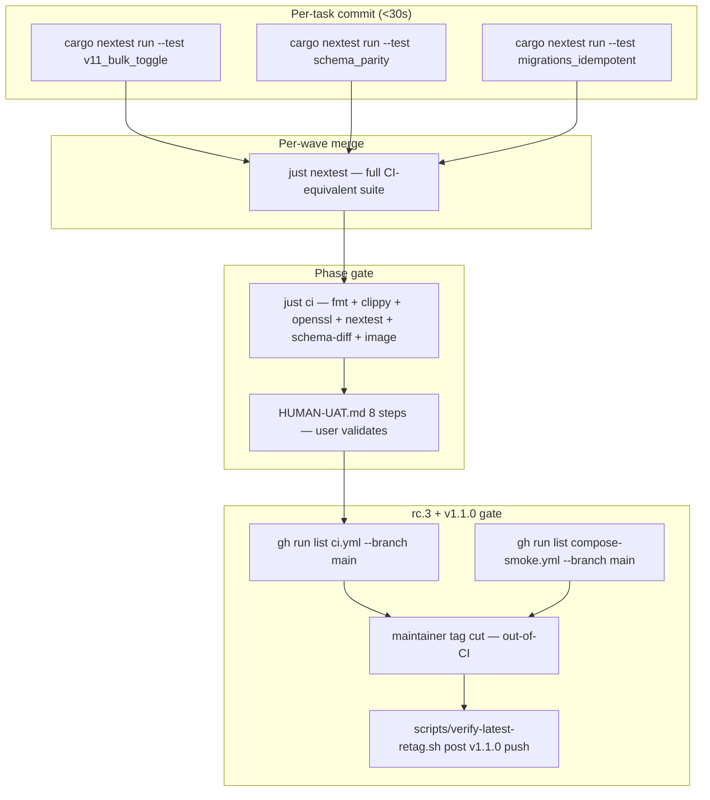

# Phase 14: Bulk Enable/Disable + rc.3 + Final v1.1.0 Ship — Research

**Researched:** 2026-04-22
**Domain:** Rust/axum 0.8 + askama_web 0.15 + HTMX 2 + sqlx (SQLite/Postgres) + release engineering (GHCR + git-cliff)
**Confidence:** HIGH

---

## Summary

CONTEXT.md (21 locked D-decisions) and UI-SPEC.md (6-dimension approved) already answer nearly every design question. This research surfaces the remaining planner-facing gaps: framework behaviors that must be verified against HEAD, code skeletons for the `bulk_toggle` handler + SQL backend split, sticky-CSS caveats, release-engineering command shapes, and a **critical correction** to CONTEXT D-11's claim about `axum::Form` + `Vec<T>` deserialization.

**Primary recommendation:** Build on CONTEXT.md + UI-SPEC.md verbatim, but plan the bulk handler around `axum_extra::extract::Form` (NOT `axum::Form`) — this is the single research-surfaced correction that changes a line of code. Everything else is verification of what CONTEXT.md already asserts, plus the Validation Architecture / Nyquist test-map that CONTEXT.md does not cover.

**TOP FINDING (action required):** `axum::Form` uses `serde_urlencoded`, which does NOT support deserializing repeated keys into `Vec<T>`. `job_ids=1&job_ids=2&job_ids=3` will fail to deserialize `Vec<i64>` with stock `axum::Form`. Use `axum_extra::extract::Form` (already a transitive dep via `axum-extra 0.12.5` + `axum-htmx 0.8.1`; `serde_html_form` feature is the default) which supports multi-value items. See §axum 0.8 Form Handler Pattern below. [VERIFIED: WebFetch docs.rs/axum-extra/latest/axum_extra/extract/struct.Form.html + docs.rs/axum/0.8.8 + Rust forum issue tokio-rs/axum#1105]

---

## Architectural Responsibility Map

| Capability | Primary Tier | Secondary Tier | Rationale |
|------------|-------------|----------------|-----------|
| Schema: `enabled_override` column | Database / Storage | — | DB-14 — tri-state column owned by `jobs` table |
| Override write path | API / Backend (`bulk_toggle` handler) | Scheduler (`Reload` to rebuild heap) | CSRF gate + `UPDATE` + `Reload` firing are all server-side |
| Override read path | API / Backend (`get_enabled_jobs`, `get_overridden_jobs`) | Template (SSR render) | Reader-pool queries, hydrate view models |
| Dashboard bulk-select UI | Browser / Client (inline JS + HTMX) | Frontend SSR (initial render) | Checkbox state is ephemeral client-side; `hx-preserve` keeps it across poll swaps |
| Settings "Currently Overridden" audit | Frontend SSR (askama) | API / Backend (per-row Clear reuses `bulk_toggle`) | SSR list rendered from DB query; per-row Clear POSTs via HTMX |
| Release tag cut (rc.3 + v1.1.0) | Maintainer local (`git tag`) | CI / GHCR (`release.yml` auto-publishes) | Phase 12 D-13 trust-anchor policy — tag cut is out-of-CI |
| `:latest` advancement | CI / GHCR (`metadata-action` D-10 gating) | Verification script (`verify-latest-retag.sh`) | Automatic on non-rc push; verified post-hoc |

---

## User Constraints (from CONTEXT.md)

### Locked Decisions

21 decisions D-01 through D-21 locked in CONTEXT.md. Researcher MUST NOT re-open:

- **D-01..D-04:** Bulk-Select UX — leftmost checkbox column, sticky inline action bar, header select-all of visible-filtered rows, verbose two-sentence toast.
- **D-05..D-08:** Override Semantics — Enable clears to NULL, bulk-enable on config-disabled is silent no-op, operations idempotent, both buttons always shown.
- **D-09..D-10b:** Settings Audit — full-width section below 6-card grid, three columns Name/Override State/Clear, empty-state hides section, alphabetical order.
- **D-11..D-12b:** Bulk-Toggle API — `POST /api/jobs/bulk-toggle` form-urlencoded with `csrf_token` + `action` + repeated `job_ids`, best-effort on invalid IDs, dedupe before UPDATE, empty 200 + `HX-Trigger` toast.
- **D-13..D-13a:** Migration — single file per backend, nullable column, no backfill, no index.
- **D-14..D-21:** Release — reuse Phase 12 runbook verbatim for rc.3, retag rc.3 SHA as v1.1.0, HUMAN-UAT.md with `just` recipes, implicit `:latest` advancement via D-10 gating, cumulative `git-cliff` notes for v1.1.0, MILESTONES.md v1.1 entry, THREAT_MODEL.md one-line bullet.

### Claude's Discretion (carried forward from CONTEXT + resolved by UI-SPEC)

Already resolved in 14-UI-SPEC.md:
- `hx-preserve="true"` on every row checkbox (selection preservation across 3s poll)
- Sticky action-bar CSS tokens explicit (`position: sticky; top: var(--cd-space-2); z-index: 10; ...`)
- Per-button `hx-post` + `hx-vals` + `hx-include` (NOT single wrapping `<form>`)
- Inline JS (~30 LOC) in `dashboard.html` for `indeterminate` state + bar show/hide
- FORCED ON badge reuses `--cd-status-running` tokens (new `.cd-badge--forced` selector)
- Button order `[Disable selected] [Enable selected] [Clear]`
- Empty `job_ids` → 400 + error toast
- No new Prometheus counter
- Default `git-cliff` grouping

Remaining discretion (for the planner): exact `cliff.toml` touch-ups if cumulative output looks awkward (recommend: don't touch, same stance as Phase 13 D-23), and whether to surface override state on the dashboard sparkline row (not required; recommend no for minimal blast radius).

### Deferred Ideas (OUT OF SCOPE)

Force-enable via UI (override=1); shift-click range selection; per-row override timestamp; terminating running jobs on bulk disable; bulk toast with per-job name list; email/webhook notifications; soak period before v1.1.0; new commit between rc.3 and v1.1.0; hand-edited release notes; `workflow_dispatch` tag cut; separate `/settings/overrides` sub-page; conditional button visibility; 207 Multi-Status response; transition-diff reporting.

---

## Phase Requirements

| ID | Description | Research Support |
|----|-------------|------------------|
| **ERG-01** | Multi-select of jobs via checkboxes; `Disable selected` / `Enable selected` action bar; CSRF-gated `POST /api/jobs/bulk-toggle` | §axum 0.8 Form Handler Pattern, §HTMX Idioms (hx-include `.cd-row-checkbox:checked`), §Integration Points (dashboard.html + job_table.html insertion sites), §sqlx ANY($1) vs IN(?1..?N) (DB update path) |
| **ERG-02** | Bulk disable does NOT terminate running jobs; success toast explicitly communicates this ("N jobs disabled. M currently-running jobs will complete naturally.") | §HTMX Idioms (HX-Trigger JSON envelope mirrors `stop_run`), §Landmines (scheduler heap rebuild AFTER DB commit) |
| **ERG-03** | Settings page shows "Currently overridden" section listing every job whose `enabled_override` is non-null | §Integration Points (settings.html + settings.rs view model extension), §sqlx patterns (`get_overridden_jobs` reader-pool query) |
| **ERG-04** | Reload (SIGHUP / API / file-watch) preserves `enabled_override` for jobs still in config; clears it alongside `enabled = 0` for jobs removed from config | §Validation Architecture (T-V11-BULK-01 locks the invariant), §sqlx patterns (modified `disable_missing_jobs` sets both columns in one UPDATE) |
| **DB-14** | `jobs.enabled_override` tri-state column, `upsert_job` NEVER touches it, `disable_missing_jobs` clears it | §Integration Points (queries.rs line numbers verified against HEAD), §Landmines (ALTER TABLE semantics), §Validation Architecture (schema_parity.rs INT64-normalization test must remain green) |
| **T-V11-BULK-01** | Test lock: `upsert_job` does not touch `enabled_override`; reload preserves override | §Validation Architecture (explicit test file: `tests/v11_bulk_toggle.rs` with 6 test cases including the upsert-invariant assertion) |

---

## Project Constraints (from CLAUDE.md)

- **Tech stack locked:** Rust + `bollard` for Docker; `sqlx` for DB (SQLite default, Postgres optional); `askama_web 0.15` with **`axum-0.8` feature** (NOT deprecated `askama_axum`); Tailwind CSS v4; HTMX 2.0.x vendored at `/vendor/htmx.min.js`. [VERIFIED: CLAUDE.md Constraints]
- **Persistence:** Same logical schema; per-backend migration files for dialect differences. SQLite uses `?N` placeholders; Postgres uses `$N`. Separate read/write SQLite pools (WAL + busy_timeout).
- **Config format:** TOML (NOT YAML; `serde-yaml` archived).
- **Cron crate:** `croner` 3.0 locked (Phase 14 does NOT touch cron paths).
- **TLS:** rustls everywhere; `cargo tree -i openssl-sys` must remain empty. Enforced by `just openssl-check`.
- **Multi-arch:** amd64 + arm64 via `cargo-zigbuild`; Phase 14 inherits this from Phase 12 without change.
- **Security:** No plaintext secrets; default bind `127.0.0.1:8080`; v1.1 web UI unauthenticated; THREAT_MODEL.md documents posture. Phase 14 D-21 adds a one-line bulk-toggle blast-radius bullet.
- **Quality gate:** `just ci` = `fmt-check + clippy + openssl-check + nextest + schema-diff + image`. Phase 14 additions must keep this green.
- **Design fidelity:** Cronduit terminal-green tokens — reuse only, no new color tokens.
- **Diagrams:** ALL diagrams in any artifact are mermaid (NOT ASCII art). [VERIFIED: auto-memory `feedback_diagrams_mermaid.md`]
- **Workflow:** No direct commits to `main`. PR-only. [VERIFIED: auto-memory `feedback_no_direct_main_commits.md`]
- **Full-semver tags:** `v1.1.0-rc.3` (with dot), `v1.1.0`. NOT `v1.1.0-rc3`. [VERIFIED: auto-memory `feedback_tag_release_version_match.md`]
- **UAT:** User validates; Claude does NOT mark UAT passed. Every HUMAN-UAT.md step references an existing `just` recipe. [VERIFIED: auto-memory `feedback_uat_user_validates.md` + `feedback_uat_use_just_commands.md`]

---

## Validation Architecture

> MANDATORY per GSD config `workflow.nyquist_validation = true`. Seeds VALIDATION.md.

### Test Framework

| Property | Value |
|----------|-------|
| Framework | `cargo-nextest` 0.9.x (CI gate) + `cargo test` (local dev) |
| Config file | `.config/nextest.toml` (implicit CI profile via `just nextest`); `Cargo.toml` `[dev-dependencies]` holds `testcontainers 0.27.2` + `testcontainers-modules 0.15.0` |
| Quick run command | `cargo nextest run --test v11_bulk_toggle` (scoped to Phase 14 file once it exists) |
| Full suite command | `just nextest` (= `cargo nextest run --all-features --profile ci`) |

### Phase Requirements → Test Map

| Req ID | Behavior | Test Type | Automated Command | File Exists? |
|--------|----------|-----------|-------------------|-------------|
| **DB-14** | Migration adds `enabled_override` nullable column on SQLite (INTEGER NULL) + Postgres (BIGINT NULL) | migration | `cargo nextest run --test migrations_idempotent` | Exists — **new assertions needed** in the idempotency test for `enabled_override` column presence |
| **DB-14** | Schema parity: SQLite INTEGER + Postgres BIGINT both normalize to INT64 for the new column | schema-parity | `cargo nextest run --test schema_parity` (aliased as `just schema-diff`) | Exists — MUST remain green; the INT64 normalization rule handles this |
| **T-V11-BULK-01** | `upsert_job` does NOT touch `enabled_override` in INSERT columns or ON CONFLICT SET clause | unit (in-memory SQLite + testcontainers-postgres) | `cargo nextest run --test v11_bulk_toggle::upsert_invariant` | ❌ Wave 0 — create `tests/v11_bulk_toggle.rs` |
| **T-V11-BULK-01** | Reload preserves `enabled_override` for every job still in config | integration | `cargo nextest run --test v11_bulk_toggle::reload_invariant` | ❌ Wave 0 |
| **ERG-04** | `disable_missing_jobs` sets `enabled = 0` AND `enabled_override = NULL` together for jobs removed from config | integration | `cargo nextest run --test v11_bulk_toggle::disable_missing_clears_override` | ❌ Wave 0 |
| **DB-14** | `get_enabled_jobs` filter becomes `enabled = 1 AND (enabled_override IS NULL OR enabled_override = 1)`; override=0 excludes | unit (in-memory SQLite + pg container) | `cargo nextest run --test v11_bulk_toggle::dashboard_filter` | ❌ Wave 0 |
| **ERG-01** | `bulk_toggle` handler: CSRF pass → 200 + HX-Trigger; CSRF fail → 403 | integration (axum test server) | `cargo nextest run --test v11_bulk_toggle::handler_csrf` | ❌ Wave 0 |
| **ERG-01** | `bulk_toggle` handler: `action=disable` sets override=0 for all `job_ids` | integration | `cargo nextest run --test v11_bulk_toggle::handler_disable` | ❌ Wave 0 |
| **ERG-01** | `bulk_toggle` handler: `action=enable` sets override=NULL for all `job_ids` | integration | `cargo nextest run --test v11_bulk_toggle::handler_enable` | ❌ Wave 0 |
| **D-12** | Partial-invalid IDs: handler applies to valid, returns 200, toast carries `(K not found)` suffix | integration | `cargo nextest run --test v11_bulk_toggle::handler_partial_invalid` | ❌ Wave 0 |
| **D-12a** | Dedupe `job_ids` before UPDATE (duplicate IDs do NOT cause duplicate UPDATEs) | unit | `cargo nextest run --test v11_bulk_toggle::handler_dedupes_ids` | ❌ Wave 0 |
| **Claude's Discretion** | Empty `job_ids` → 400 + error toast | integration | `cargo nextest run --test v11_bulk_toggle::handler_rejects_empty` | ❌ Wave 0 |
| **ERG-01** | `bulk_toggle` dispatches `SchedulerCmd::Reload` AFTER DB commit (heap-rebuild order) | integration (asserts mpsc message + DB state) | `cargo nextest run --test v11_bulk_toggle::handler_fires_reload_after_update` | ❌ Wave 0 |
| **ERG-03** | `get_overridden_jobs` returns all jobs with `enabled_override IS NOT NULL`, alphabetical by name | unit | `cargo nextest run --test v11_bulk_toggle::get_overridden_jobs_alphabetical` | ❌ Wave 0 |
| **ERG-03** | Settings page renders "Currently Overridden" section only when list non-empty | integration (render test via `test_render_settings_page`-style helper) | `cargo nextest run --test v11_bulk_toggle::settings_empty_state_hides_section` | ❌ Wave 0 |
| **ERG-02** | Bulk disable on running job does NOT terminate the run (runs complete naturally) | integration (scheduler + docker) | **MANUAL-UAT** — HUMAN-UAT.md step 3 per D-17 | covered by UAT, not automated |
| **Postgres parity** | Every SQLite test above has a Postgres counterpart using `testcontainers-modules::postgres::Postgres` | integration | `cargo nextest run --test v11_bulk_toggle_pg` | ❌ Wave 0 — OR fold into `v11_bulk_toggle.rs` with cfg-feature gate pattern from `tests/dashboard_jobs_pg.rs` |

### Sampling Rate

- **Per task commit:** `cargo nextest run --test v11_bulk_toggle --test schema_parity --test migrations_idempotent` (scoped; ~30s)
- **Per wave merge:** `just nextest` (full suite; CI-equivalent)
- **Phase gate:** `just ci` green on HEAD before `/gsd-verify-work`; HUMAN-UAT.md checked off by user

### Wave 0 Gaps

- [ ] `tests/v11_bulk_toggle.rs` — new file covering **T-V11-BULK-01** invariants + ERG-01..04 handler/query behaviors (13+ test cases enumerated above)
- [ ] `tests/v11_bulk_toggle_pg.rs` — OR cfg-feature-gated Postgres parity tests within the same file (precedent: `tests/dashboard_jobs_pg.rs`)
- [ ] `tests/schema_parity.rs` — add `enabled_override` to the expected column set (normalized INT64); test is expected to pick up the new column automatically via schema introspection, but verify once the migration lands
- [ ] `tests/migrations_idempotent.rs` — add assertion that the new migration file runs cleanly on a DB already at the prior migration head AND runs idempotently on re-invocation (sqlx's `_sqlx_migrations` tracking handles this, but explicit assertion guards against future regressions)
- [ ] Testcontainers postgres image pin — already at `postgres:16-alpine` in existing parity tests; no new pin needed

### Validation Architecture Diagram



---

## axum 0.8 `Form<BulkToggleForm>` Handler Pattern

> [VERIFIED: Context7 `/websites/rs_axum_0_8_8_axum` — axum 0.8.8 docs; WebFetch `docs.rs/axum-extra` confirms `serde_html_form`; WebSearch cross-check confirms `axum::Form` does NOT support Vec<T> via serde_urlencoded]

### CRITICAL Correction to CONTEXT.md D-11

CONTEXT.md line 201 claims:

> "axum's `Form` extractor handles repeated `job_ids` keys natively into `Vec<i64>` via `serde_urlencoded` (confirmed via context7 on `axum 0.8`)"

**This is incorrect.** `serde_urlencoded` (the crate stock `axum::Form` uses) does NOT support multi-value deserialization into `Vec<T>`. Repeated keys produce `Err(..)` at deserialization time, not a `Vec<i64>` with all three values. This is a known, long-standing limitation documented in [tokio-rs/axum#1105](https://github.com/tokio-rs/axum/issues/1105).

**Correct choice:** `axum_extra::extract::Form` which uses `serde_html_form` under the hood. `serde_html_form` DOES support multi-value items collecting into `Vec<T>`. `axum-extra` 0.12.5 is already in the dependency tree (via `axum-htmx` 0.8.1 + direct use from existing handlers that extract `CookieJar` from `axum_extra::extract`).

### Handler Skeleton (code)

```rust
// src/web/handlers/api.rs — append after stop_run

use axum::extract::State;
use axum::http::StatusCode;
use axum::response::IntoResponse;
use axum_extra::extract::CookieJar;
use axum_extra::extract::Form as ExtraForm;  // ⚠️ NOT axum::Form
use axum_htmx::{HxEvent, HxResponseTrigger};
use serde::Deserialize;
use serde_json::json;
use std::collections::BTreeSet;

use crate::db::queries;
use crate::scheduler::cmd::{ReloadStatus, SchedulerCmd};
use crate::web::AppState;
use crate::web::csrf;

#[derive(Deserialize)]
pub struct BulkToggleForm {
    csrf_token: String,
    action: String,
    #[serde(default)]  // empty list deserializes to Vec::new() instead of error
    job_ids: Vec<i64>,
}

/// POST /api/jobs/bulk-toggle -- set `enabled_override` for multiple jobs
/// (ERG-01, ERG-02, D-11, D-12, D-12a, D-12b).
///
/// Extractor order (axum 0.8 enforces body-consuming last):
///   1. State (FromRequestParts)
///   2. CookieJar (FromRequestParts — axum_extra)
///   3. Form (FromRequest — consumes body; MUST be last)
#[axum::debug_handler]
pub async fn bulk_toggle(
    State(state): State<AppState>,
    cookies: CookieJar,
    ExtraForm(form): ExtraForm<BulkToggleForm>,
) -> impl IntoResponse {
    // 1. CSRF — BEFORE any DB work (Landmine #5)
    let cookie_token = cookies
        .get(csrf::CSRF_COOKIE_NAME)
        .map(|c| c.value().to_string())
        .unwrap_or_default();
    if !csrf::validate_csrf(&cookie_token, &form.csrf_token) {
        return error_toast(StatusCode::FORBIDDEN, "Session expired — refresh and try again.");
    }

    // 2. Validate action
    let new_override: Option<i64> = match form.action.as_str() {
        "disable" => Some(0),
        "enable"  => None,
        _ => return error_toast(StatusCode::BAD_REQUEST, "Invalid bulk action."),
    };

    // 3. Reject empty job_ids (Claude's-Discretion resolution in UI-SPEC)
    if form.job_ids.is_empty() {
        return error_toast(StatusCode::BAD_REQUEST, "No jobs selected.");
    }

    // 4. Dedupe (D-12a)
    let ids: Vec<i64> = form
        .job_ids
        .into_iter()
        .collect::<BTreeSet<_>>()
        .into_iter()
        .collect();

    // 5. Count currently-running among selected BEFORE the UPDATE (for toast verbosity)
    let running_count = queries::count_running_runs_for_jobs(&state.pool, &ids)
        .await
        .unwrap_or(0);

    // 6. UPDATE — use the SQL-split helper from §sqlx patterns
    let updated = match queries::bulk_set_override(&state.pool, &ids, new_override).await {
        Ok(n) => n,
        Err(err) => {
            tracing::error!(target: "cronduit.web", error = %err, "bulk_toggle: UPDATE failed");
            return error_toast(StatusCode::INTERNAL_SERVER_ERROR, "Database error.");
        }
    };
    let not_found = (ids.len() as u64).saturating_sub(updated);

    // 7. Fire Reload AFTER DB commit — heap rebuild (Landmine #6)
    let (resp_tx, _resp_rx) = tokio::sync::oneshot::channel();
    if state.cmd_tx.send(SchedulerCmd::Reload { response_tx: resp_tx }).await.is_err() {
        return error_toast(StatusCode::SERVICE_UNAVAILABLE,
                           "Scheduler is shutting down — try again shortly.");
    }
    // Intentionally drop `_resp_rx`: we do not await the reload result for
    // the toast — the 3s dashboard poll will reflect DB state on next cycle.

    // 8. Compose toast per UI-SPEC Copywriting § (singular/plural, running/not-found suffixes)
    let toast = build_bulk_toast(updated, new_override, running_count, not_found);
    let event = HxEvent::new_with_data("showToast", toast).expect("toast serialization");
    (HxResponseTrigger::normal([event]), StatusCode::OK).into_response()
}

fn error_toast(status: StatusCode, msg: &str) -> axum::response::Response {
    let event = HxEvent::new_with_data(
        "showToast",
        json!({"message": msg, "level": "error", "duration": 0}),
    ).expect("toast serialization");
    (HxResponseTrigger::normal([event]), status).into_response()
}

fn build_bulk_toast(
    disabled_or_cleared: u64,
    new_override: Option<i64>,
    running_count: u64,
    not_found: u64,
) -> serde_json::Value {
    // ... verbatim copy from UI-SPEC § Copywriting Contract § Toast copy table
    // (omitted here — planner locks the singular/plural helper)
    json!({"message": "TODO", "level": "info", "duration": 3000})
}
```

### Router Registration

```rust
// src/web/mod.rs (append to the router chain around line 82)
.route("/api/jobs/bulk-toggle", post(handlers::api::bulk_toggle))
```

### Extractor Ordering (axum 0.8 enforces)

Per axum 0.8.8 docs: extractors that consume the request body (implementing `FromRequest` rather than `FromRequestParts`) MUST be LAST. `Form` (both `axum::Form` and `axum_extra::extract::Form`) consumes the body. `State` and `CookieJar` implement `FromRequestParts` so they can come first. The working order is:

```
State<AppState>  →  CookieJar  →  ExtraForm<BulkToggleForm>
```

Violating this order produces a compile error (trait bound not satisfied on `from_request`). `#[axum::debug_handler]` gives a friendly error message and is the project-standard for new mutation handlers — use it.

### `serde(default)` for Empty `job_ids`

Without `#[serde(default)]` on `job_ids: Vec<i64>`, `serde_html_form` treats a POST body lacking any `job_ids` key as a missing-field error → 400 from the extractor before the handler runs. With `#[serde(default)]`, the empty Vec deserializes cleanly and the handler runs its own explicit rejection (UI-SPEC resolution: 400 + "No jobs selected." error toast). This gives us control over the error surface — the toast system fires, instead of axum's default bare-text error.

---

## HTMX Idioms for this Phase

> [VERIFIED: Context7 `/bigskysoftware/htmx` v2.0.4 — hx-preserve, hx-include, hx-vals docs fetched 2026-04-22]

### `hx-include` with CSS selector + `hx-vals`

The UI-SPEC locks the action-bar buttons to use:

```html
<button type="button"
        class="cd-btn-secondary cd-btn-disable-hint text-sm py-1 px-3"
        hx-post="/api/jobs/bulk-toggle"
        hx-vals='{"action":"disable"}'
        hx-include=".cd-row-checkbox:checked, [name='csrf_token']"
        hx-swap="none"
        hx-on::after-request="__cdBulkUpdateBar()">
  Disable selected
</button>
```

**Verified behavior:**
- `hx-include` accepts CSS selector syntax. `.cd-row-checkbox:checked` selects every checkbox currently ticked.
- HTMX serializes included inputs by their `name` attribute. Because the per-row `<input>` uses `name="job_ids"` (not `name="job_ids[]"` — PHP-style bracket notation is NOT used here), HTMX produces a body like `job_ids=1&job_ids=2&job_ids=3` — exactly what `serde_html_form` expects.
- `hx-vals` adds `action=disable` as a literal form field; JSON-ish syntax (`'{"action":"disable"}'`) is the HTMX-native format.
- `, [name='csrf_token']` appends the hidden CSRF input to the include set.
- `hx-swap="none"` — no DOM replacement on response (the toast fires from the `HX-Trigger` header; the 3s poll picks up DB-state refresh).
- `hx-on::after-request="__cdBulkUpdateBar()"` — inline event hook re-runs the bar-sync JS after the POST completes (clears selection-state-dependent UI).

### `hx-preserve="true"` on Row Checkboxes

> [VERIFIED: Context7 htmx docs — "The preserved element must have a static `id` attribute."]

The UI-SPEC recommends `hx-preserve="true"` on every `.cd-row-checkbox` to keep selection state across the 3s table-body poll.

**Critical caveat from HTMX docs:** `hx-preserve` REQUIRES a **stable unchanging `id` attribute** on the preserved element. The current UI-SPEC draft uses `class="cd-row-checkbox"` + `name="job_ids"` but does NOT give each checkbox a unique `id`.

**Required addition to the per-row checkbox markup:**

```html
<input type="checkbox"
       id="cd-row-cb-{{ job.id }}"        <!-- NEW — stable id tied to job id -->
       class="cd-row-checkbox"
       name="job_ids"
       value="{{ job.id }}"
       aria-label="Select {{ job.name }}"
       hx-preserve="true"
       onclick="__cdBulkOnRowChange()">
```

Without the `id`, HTMX cannot match the "old" checkbox with the "new" checkbox in the swapped-in innerHTML and the preserve silently fails (state is wiped on every poll). Use `cd-row-cb-{{ job.id }}` (not raw `{{ job.id }}`) to stay in the project namespace and avoid accidental collisions with IDs elsewhere on the page.

**Additional caveat:** `hx-preserve` preserves the element's full state INCLUDING its `checked` attribute, but the server SSR re-emits `<input type="checkbox">` without `checked` on every poll. HTMX's preserve behavior trumps the server's HTML (the old element is kept verbatim). This is what we want, but it means the server's render never shows a "pre-checked" state even if override state is later surfaced — that's fine for Phase 14 because checkboxes represent ephemeral UI selection, not persistent override state.

### `HX-Trigger` Toast JSON Envelope

> Extracted from live code: `src/web/handlers/api.rs` `run_now` lines 87-91, `reload` lines 218-222, `reroll` lines 302-306, `stop_run` lines 429-433. All four use the identical shape via `axum_htmx::HxEvent::new_with_data("showToast", json!({...}))`.

**Envelope shape (canonical):**

```json
{"showToast": {"message": "...", "level": "info|success|error", "duration": 3000}}
```

Where:
- `message`: toast body string — singular/plural per UI-SPEC § Copywriting
- `level`: `"info"` (default info color), `"success"` (green), `"error"` (red, sticky)
- `duration`: milliseconds to auto-dismiss; `0` = sticky (error variant; requires operator click to dismiss)

**Existing toasts demonstrate variants:**
- `run_now` (api.rs:88): `{"message": "Run queued: <name>", "level": "info"}` — no duration → default 3000ms
- `reload` ok (api.rs:220): `{"message": "Config reloaded: N added, M updated, K disabled", "level": "success", "duration": 5000}`
- `reload` err (api.rs:220): `{"message": "Reload failed: ...", "level": "error", "duration": 0}`
- `stop_run` (api.rs:430-433): `{"message": "Stopped: <name>", "level": "info"}`

Phase 14 matches these verbatim. Level is `"info"` for all bulk success cases (we don't use `"success"` because bulk disable isn't an affirmatively-good-thing in the way a reload is); errors use `"error"` sticky.

---

## sqlx Backend Split: `ANY($1)` vs `IN (?1, ?2, ...)`

> [VERIFIED: `src/db/queries.rs` lines 129-169 — existing `disable_missing_jobs` already does this split]

Cronduit's existing `disable_missing_jobs` is the exact template for the new `bulk_set_override`. The SQLite and Postgres dialects require different placeholder shapes for "update rows matching a list of values":

### SQLite — Dynamic `IN (?1, ?2, ..., ?N)`

```rust
if ids.is_empty() {
    return Ok(0);  // handler rejected empty before we got here, but defensive
}
let placeholders: Vec<String> = (1..=ids.len()).map(|i| format!("?{i}")).collect();
let sql = format!(
    "UPDATE jobs SET enabled_override = ?1 WHERE id IN ({})",
    // NOTE: ?1 is the override value; ids use ?2..?(N+1)
    placeholders.iter().enumerate().map(|(i, _)| format!("?{}", i + 2)).collect::<Vec<_>>().join(", ")
);
let mut q = sqlx::query(&sql).bind(new_override);  // Option<i64> binds as NULL when None
for id in ids {
    q = q.bind(id);
}
let result = q.execute(p).await?;
Ok(result.rows_affected())
```

**Gotcha:** SQLite does NOT support array bind — you MUST build the placeholder list by hand and bind each value individually. Phase 14 follows the exact shape of `disable_missing_jobs` (lines 139-149). There is no `sqlx` helper for this; it's a known ergonomic gap.

### Postgres — `ANY($1)` with `&[i64]` array bind

```rust
let result = sqlx::query("UPDATE jobs SET enabled_override = $1 WHERE id = ANY($2)")
    .bind(new_override)  // Option<i64>
    .bind(ids)           // &[i64] or Vec<i64> — sqlx-postgres binds this as INT8[]
    .execute(p)
    .await?;
Ok(result.rows_affected())
```

Much cleaner. `sqlx` + `sqlx-postgres` provides native array binding for `Vec<i64>` / `&[i64]` → `BIGINT[]` and the SQL `ANY($1)` unpacks it row-wise.

### Composite `bulk_set_override` signature

```rust
// src/db/queries.rs — append after disable_missing_jobs

/// Set `enabled_override` to a single value for multiple jobs in one UPDATE.
/// `new_override`:
///   Some(0)  → force disabled (set by bulk-disable + per-row audit)
///   Some(1)  → force enabled (defensive — v1.1 UI never writes this)
///   None     → clear override (set by bulk-enable + per-row Clear)
/// Returns the count of rows updated. Caller computes `(not_found = ids.len() - rows_affected)`.
pub async fn bulk_set_override(
    pool: &DbPool,
    ids: &[i64],
    new_override: Option<i64>,
) -> anyhow::Result<u64> {
    if ids.is_empty() {
        return Ok(0);
    }
    match pool.writer() {
        PoolRef::Sqlite(p) => { /* ?1 + ?N loop as above */ }
        PoolRef::Postgres(p) => { /* ANY($2) as above */ }
    }
}
```

### Modified `get_enabled_jobs` Filter

The existing query at lines 172-191 becomes:

```sql
-- SQLite + Postgres (same literal SQL; placeholder-free)
SELECT id, name, schedule, resolved_schedule, job_type, config_json, config_hash,
       enabled, enabled_override, timeout_secs, created_at, updated_at
FROM jobs
WHERE enabled = 1
  AND (enabled_override IS NULL OR enabled_override = 1)
```

This is **not** the same as "WHERE effective_enabled = 1" — it's three-valued logic on `enabled_override`:
- `enabled = 1 AND enabled_override IS NULL` → schedule (config says yes, no override)
- `enabled = 1 AND enabled_override = 1` → schedule (config says yes, override affirms)
- `enabled = 1 AND enabled_override = 0` → SKIP (bulk-disabled)
- `enabled = 0 AND *` → SKIP (config says no — override=1 would force-enable but v1.1 UI cannot produce this row)

### Modified `disable_missing_jobs`

Existing at lines 129-168 sets only `enabled = 0`. Phase 14 extends the SET clause:

```sql
UPDATE jobs
SET enabled = 0, enabled_override = NULL
WHERE enabled = 1 AND name NOT IN (...)
```

Both backends — the SET clause is dialect-neutral; the NOT IN placeholder pattern stays the same as today.

**ERG-04 invariant:** this modification alone guarantees the reload symmetry rule. `upsert_job` does not touch `enabled_override` (T-V11-BULK-01); `disable_missing_jobs` clears it when a job leaves the config. Together, these two changes implement the entire reload semantics.

### New `get_overridden_jobs` (reader-pool)

```rust
pub async fn get_overridden_jobs(pool: &DbPool) -> anyhow::Result<Vec<DbJob>> {
    let sql = "SELECT id, name, schedule, resolved_schedule, job_type, config_json, \
               config_hash, enabled, enabled_override, timeout_secs, created_at, updated_at \
               FROM jobs \
               WHERE enabled_override IS NOT NULL \
               ORDER BY name ASC";
    // then the usual PoolRef::Sqlite / PoolRef::Postgres fanout with the FromRow impls
}
```

`ORDER BY name ASC` is dialect-neutral; the D-10b alphabetical ordering just works.

### Row-type FromRow Updates

`SqliteDbJobRow` (lines 219-232) and `PgDbJobRow` (lines 252-265) both need a new field:

```rust
#[derive(FromRow)]
struct SqliteDbJobRow {
    // ... existing fields ...
    enabled_override: Option<i32>,   // SQLite INTEGER NULL → Option<i32> via sqlx
    // ... existing fields ...
}

#[derive(FromRow)]
struct PgDbJobRow {
    // ... existing fields ...
    enabled_override: Option<i64>,   // Postgres BIGINT NULL → Option<i64>
    // ... existing fields ...
}
```

And the conversion to `DbJob` normalizes `i32` (SQLite) → `i64` (shared). `DbJob` gains:

```rust
pub struct DbJob {
    // ... existing fields ...
    pub enabled_override: Option<i64>,
    // ... existing fields ...
}
```

---

## Sticky Action-Bar CSS + `overflow` Caveat

> [VERIFIED: MDN `position: sticky` — sticky attaches to the nearest scrollable ancestor; verified against live templates that the bar is sibling to — not descendant of — the `overflow-x-auto` table wrapper]

### The Sticky Landmine

`position: sticky` has two failure modes worth flagging:

1. **Scrollable ancestor with `overflow: hidden`:** the sticky element gets clipped or "sticks" to a much smaller viewport than intended. In Cronduit, `<div class="overflow-x-auto">` at `dashboard.html:39` is the table wrapper. `overflow-x: auto` creates a new containing block for horizontal overflow — but `position: sticky` attaches to the nearest ancestor with `overflow-y != visible`. Since this wrapper has `overflow-y: visible` (default), it does NOT trap the sticky. Good.
2. **Bar-as-descendant vs bar-as-sibling:** If the planner mistakenly places `<div class="cd-bulk-bar">` INSIDE the `<div class="overflow-x-auto">` wrapper, the bar would be clipped horizontally on narrow viewports (table columns scroll under it). UI-SPEC locks the insertion point as **sibling** — between the filter `<div>` (closes line 36) and the overflow wrapper (opens line 39). Keep this insertion order in the plan.

### Verified-clean ancestor chain

From innermost to outermost for the dashboard's bulk-bar:

```
<div id="cd-bulk-action-bar" class="cd-bulk-bar">  ← position: sticky, top: 8px
  ← sibling of the overflow-x-auto table wrapper (no overflow)
  
    ← no overflow in content block
  <main class="max-w-7xl mx-auto px-4 py-6">  ← no overflow; base.html:54
  <body class="bg-(--cd-bg-primary) ... min-h-screen">  ← no overflow; base.html:19
  <html>  ← the default scrollable ancestor
```

Sticky attaches to `<html>` (the viewport). The bar slides to `top: var(--cd-space-2)` (8px) below the viewport top as the operator scrolls. Exactly the intended UX.

### Exact CSS (locked in UI-SPEC; repeated here for planner convenience)

```css
/* In assets/src/app.css @layer components */
.cd-bulk-bar {
  position: sticky;
  top: var(--cd-space-2);      /* 8px — small offset below the sticky nav if any */
  z-index: 10;                  /* same stacking level as .cd-tooltip */
  display: flex;
  align-items: center;
  gap: var(--cd-space-2);       /* 8px gap between count + buttons */
  background: var(--cd-bg-surface-raised);
  border: 1px solid var(--cd-border);
  border-radius: var(--cd-radius-md);  /* 8px — matches project radius convention */
  padding: var(--cd-space-3) var(--cd-space-4);  /* 12px 16px */
  margin-bottom: var(--cd-space-2);    /* 8px separator before the table */
}
.cd-bulk-bar[hidden] {
  display: none;                /* explicit for sticky-element hiding (some browsers ignore `hidden` on flex) */
}
```

### Escape hatch (NOT needed for Phase 14)

If for any reason the bar winds up inside a `overflow: hidden/auto` parent in the future, either:
- move the bar OUT of that parent (the UI-SPEC-locked approach); or
- change the parent to `overflow: clip` instead of `overflow: hidden` (newer CSS property; creates a new formatting context without establishing a scroll container).

Phase 14 does NOT need either workaround; the bar is a sibling of the overflow wrapper by design.

---

## Release Engineering Commands

### Exact `git tag` Shapes

**rc.3 cut (D-14):**
```bash
git fetch --tags
# Confirm on the merge commit of the Phase 14 PR:
git checkout main && git pull --ff-only origin main && git log -1 --oneline
# Preview notes (D-15 authoritative — do NOT hand-edit after publish):
git cliff --unreleased --tag v1.1.0-rc.3 -o /tmp/rc3-preview.md
cat /tmp/rc3-preview.md  # sanity-check; fix commit messages on main if needed
# Signed (preferred):
git tag -a -s v1.1.0-rc.3 -m "v1.1.0-rc.3 — release candidate"
git tag -v v1.1.0-rc.3  # verify signature
# Or unsigned-annotated fallback:
git tag -a v1.1.0-rc.3 -m "v1.1.0-rc.3 — release candidate"
git cat-file tag v1.1.0-rc.3  # verify annotated (not lightweight)
# Push:
git push origin v1.1.0-rc.3
gh run watch --exit-status  # follow release.yml
```

**v1.1.0 promotion (D-16) — retags the rc.3 SHA:**
```bash
# First: resolve the exact SHA rc.3 tagged
RC3_SHA=$(git rev-list -n 1 v1.1.0-rc.3)
echo "$RC3_SHA"  # sanity
# Preview cumulative notes (D-19 authoritative):
git cliff v1.0.1..v1.1.0 -o /tmp/v1.1.0-preview.md
# Note: git-cliff accepts Git revision ranges directly; v1.0.1..v1.1.0 means
# "every commit reachable from v1.1.0 but NOT from v1.0.1". At preview time
# v1.1.0 doesn't exist yet — use `git cliff v1.0.1..HEAD` OR
# `git cliff --unreleased --tag v1.1.0` (preferred; git-cliff handles the
# virtual tag). The Phase 12 runbook uses --unreleased; Phase 14 does too.
git cliff --unreleased --tag v1.1.0 -o /tmp/v1.1.0-preview.md
cat /tmp/v1.1.0-preview.md
# Tag the rc.3 commit:
git tag -a -s v1.1.0 -m "v1.1 — Operator Quality of Life" "$RC3_SHA"
git tag -v v1.1.0
git push origin v1.1.0
gh run watch --exit-status
```

**Note on `git cliff` invocation:** Phase 12 runbook (D-11) uses `git cliff --unreleased --tag <new-tag>` for both rc and final. This is the verified-working form. The theoretical `git cliff v1.0.1..v1.1.0` shape only works AFTER `v1.1.0` has been tagged — not useful for preview. Use `--unreleased --tag v1.1.0` pre-tag; use `git cliff v1.0.1..v1.1.0` post-tag if you want to regenerate a canonical CHANGELOG file.

### `docker manifest inspect` Commands

**rc.3 post-push verification (D-10 gating asserts `:latest` unchanged):**
```bash
# rc.3 landed in GHCR:
docker manifest inspect ghcr.io/simplicityguy/cronduit:1.1.0-rc.3
# ^ expect JSON with 2 platforms: linux/amd64 + linux/arm64

# :rc rolling tag should point at the same digest:
docker manifest inspect ghcr.io/simplicityguy/cronduit:rc

# :latest is UNCHANGED from v1.0.1 (D-10 skip rule):
docker manifest inspect ghcr.io/simplicityguy/cronduit:latest
# ^ expect the pre-rc-3 v1.0.1 digest. If this digest changed, D-10 broke.

# :1 and :1.1 are UNCHANGED:
docker manifest inspect ghcr.io/simplicityguy/cronduit:1
docker manifest inspect ghcr.io/simplicityguy/cronduit:1.1
```

**v1.1.0 post-push verification (D-18 — `:latest` MUST now advance):**
```bash
# v1.1.0 landed:
docker manifest inspect ghcr.io/simplicityguy/cronduit:v1.1.0
docker manifest inspect ghcr.io/simplicityguy/cronduit:1.1.0
# Note: the `v` prefix tag is what release.yml publishes via docker/metadata-action;
# the no-`v` tag is the release.yml alias. Confirm both resolve.

# :latest should now equal :1.1.0:
./scripts/verify-latest-retag.sh 1.1.0
# ^ D-18 invocation. Exits 0 if per-platform digests match across
# (linux/amd64 + linux/arm64). Exits 1 if D-10 gating broke.

# :1 and :1.1 advanced to v1.1.0:
docker manifest inspect ghcr.io/simplicityguy/cronduit:1
docker manifest inspect ghcr.io/simplicityguy/cronduit:1.1
# All three (:latest, :1, :1.1) should have IDENTICAL digests to :1.1.0.
```

### Missing `just` Recipes for HUMAN-UAT.md (D-17 gap)

CONTEXT.md D-17 assumes `just compose-up-rc3` and `just reload` exist. They do NOT in the current `justfile`. Per auto-memory `feedback_uat_use_just_commands.md`, every UAT step must reference an existing `just` recipe — so the planner MUST add these to `justfile` as part of Phase 14 (one-line recipes, low-risk):

**Gap 1 — `just compose-up-rc3` (NEW recipe):**
```makefile
# -------------------- release candidate smoke --------------------

# Bring up the full compose stack pinned to the v1.1.0-rc.3 image for
# HUMAN-UAT validation. Phase 14 D-17 / feedback_uat_use_just_commands.
[group('release')]
[doc('Bring up the compose stack pinned to v1.1.0-rc.3 for HUMAN-UAT')]
compose-up-rc3:
    CRONDUIT_IMAGE=ghcr.io/simplicityguy/cronduit:1.1.0-rc.3 \
    docker compose -f examples/docker-compose.yml up -d
```

**Caveat:** This requires `examples/docker-compose.yml` to honor a `${CRONDUIT_IMAGE:-...}` variable for the `image:` field. If the current compose file hard-codes `ghcr.io/simplicityguy/cronduit:latest`, the planner adds the env-var support as part of the same recipe change. Verify pre-plan.

**Gap 2 — `just reload` (NEW recipe):**
```makefile
# Trigger a config reload of the running cronduit (dev or compose) by
# SIGHUP'ing the process. HUMAN-UAT Step 4 + 7 per D-17.
[group('release')]
[doc('Send SIGHUP to the running cronduit process (config reload)')]
reload:
    #!/usr/bin/env bash
    set -euo pipefail
    # Works for the compose stack (container name `cronduit`)
    if docker ps --format '{{.Names}}' | grep -q '^cronduit$'; then
        docker kill -s HUP cronduit
        echo "SIGHUP sent to cronduit container"
    else
        # Fall back to pkill for the dev loop
        pkill -HUP cronduit && echo "SIGHUP sent to cronduit process" \
            || { echo "no running cronduit found"; exit 1; }
    fi
```

These two recipes are the minimum HUMAN-UAT.md viability floor. The planner MUST add both as part of Phase 14 (probably in a dedicated "release recipes" task within the final wave).

### `cliff.toml` — No Changes Required

Default grouping is fine (confirmed Phase 12 D-12, Phase 13 D-23). The `commit_preprocessors` at `cliff.toml:35-38` already rewrite `Phase N:` squash-merge titles to `feat: Phase N:` so they appear in cumulative v1.1.0 notes. No Phase 14 touch-up.

---

## Landmines / Pitfalls

Twelve pitfalls the plan MUST address. Each is (a) specific to Phase 14, (b) a known failure mode, (c) tied to a concrete prevention.

### 1. `axum::Form` does NOT deserialize `Vec<T>` from repeated keys
See §axum 0.8 Form Handler Pattern above. Use `axum_extra::extract::Form`. CONTEXT.md D-11's claim is incorrect. **Prevention:** planner locks `ExtraForm<BulkToggleForm>` in the handler signature and adds a test case (`handler_accepts_repeated_job_ids`) that POSTs a body like `csrf_token=X&action=disable&job_ids=1&job_ids=2&job_ids=3` and asserts all three IDs arrive.

### 2. SQLite `ALTER TABLE ADD COLUMN` supports NULL default without issue
`ALTER TABLE jobs ADD COLUMN enabled_override INTEGER NULL;` is legal SQLite. Postgres equivalent: `ALTER TABLE jobs ADD COLUMN enabled_override BIGINT NULL;` is legal Postgres. Neither requires a default value (NULL is the default default for nullable columns). **Prevention:** `tests/migrations_idempotent.rs` asserts the migration runs cleanly on a freshly-initialized DB AND on a DB already at the prior migration head. Re-run safety is enforced by `_sqlx_migrations` tracking.

### 3. HTMX 3s poll wipes row checkboxes without `hx-preserve` + stable `id`
`hx-preserve="true"` requires a **stable unchanging `id`** (see §HTMX Idioms). UI-SPEC's draft markup uses `class="cd-row-checkbox"` but no unique `id`. **Prevention:** add `id="cd-row-cb-{{ job.id }}"` to the per-row checkbox markup. Test: dashboard render → verify every `.cd-row-checkbox` has a unique non-empty `id`.

### 4. `overflow-x-auto` parent breaking `position: sticky`
Verified not-a-problem because the bar is sibling to the overflow wrapper, not descendant. **Prevention:** UI-SPEC locks the insertion point between line 36 and line 39. Plan task must call out "insert as sibling, NOT child of `<div class="overflow-x-auto">`". Optional defensive guard: add a visual regression test that verifies the bar stays at viewport-top when scrolling the dashboard table.

### 5. CSRF check must happen BEFORE any DB work
axum 0.8 extractor ordering + project convention (every existing mutation handler does this). **Prevention:** code skeleton in §axum 0.8 Form Handler Pattern shows `validate_csrf` as the first line after extractor deconstruction. Test: `handler_csrf` with a mismatched `csrf_token` asserts 403 is returned AND the DB is untouched (no UPDATE fired).

### 6. `SchedulerCmd::Reload` must fire AFTER the DB UPDATE commits
If Reload fires before the UPDATE finalizes, the scheduler re-reads `get_enabled_jobs()` and sees the old state (override not yet set); bulk-disable appears to silently no-op. **Prevention:** code skeleton sequence: validate → UPDATE (awaited) → `cmd_tx.send(Reload)`. Existing `reload` handler at `api.rs:130-239` demonstrates the exact pattern (reload is post-op; heap rebuild happens on the scheduler side on the next iteration). Test: `handler_fires_reload_after_update` seeds a job, POSTs bulk-disable, asserts (a) DB shows `enabled_override = 0`, (b) mpsc channel received `Reload`, (c) ordering — by using a watchdog channel or by asserting the UPDATE's `rows_affected = 1` BEFORE the Reload send in a mocked handler.

### 7. Scheduler mpsc closed (shutdown race) — return 503, not 500
If `state.cmd_tx.send(Reload)` fails, the scheduler is shutting down. The handler MUST return 503 with a sticky error toast — the DB UPDATE already landed, so the caller's intent IS persisted, but the scheduler won't rebuild the heap until next startup. **Prevention:** code skeleton returns `Scheduler is shutting down — try again shortly.` on send error (same pattern as `stop_run:451-462`). Do NOT roll back the UPDATE — shutdown-race rollback is worse UX than a one-cycle lag.

### 8. `#[axum::debug_handler]` on handlers with `CookieJar` + `Form`
axum 0.8's extractor-ordering compile errors are cryptic without `debug_handler`. Every existing mutation handler uses it. **Prevention:** `#[axum::debug_handler]` annotation on `bulk_toggle`. Clippy + CI will pick up any misordering; debug_handler makes the error messages readable at compile time.

### 9. `serde_html_form` integer parse errors vs empty-list
`serde_html_form` treats `job_ids=abc` (non-integer value) as a 400 from the extractor — the handler never runs. That's fine (operator-side bug is the only way to hit it). But `serde_html_form` also treats a completely missing `job_ids` key differently from an empty list: **without `#[serde(default)]`** the missing key produces a 400; **with `#[serde(default)]`** it deserializes as `Vec::new()`. **Prevention:** `#[serde(default)]` on the Vec field so the handler's explicit "empty list → 400 + error toast" path runs (preserves the user-facing error toast instead of axum's opaque bare-text error).

### 10. `count_running_runs_for_jobs` helper may not exist yet
The toast copy needs `M` = currently-running count among the selected `N`. There is currently no `queries::count_running_runs_for_jobs(&pool, &ids)` function. **Prevention:** planner adds this as a new reader-pool query in `src/db/queries.rs`. Shape: `SELECT COUNT(*) FROM job_runs WHERE status = 'running' AND job_id IN (...)` — same `?N`/`ANY($1)` split as `bulk_set_override`. Skip running-count if the planner determines the M-count adds > 30% to the handler's task scope; D-04 says the second sentence is omitted when M=0, and if M-count is always-zero, the toast degrades gracefully.

### 11. `enabled_override` field threading through `DashboardJobView` + `SettingsView`
The `DbJob` struct gets a new field; every struct that derives from `DbJob` (including `DashboardJobView` at `src/web/handlers/dashboard.rs:66` and `SettingsView` at `src/web/handlers/settings.rs`) needs to be updated. CONTEXT.md line 177 flags this but doesn't enumerate. **Prevention:** grep for `DbJob {` and `DashboardJob ` usages pre-plan; add `enabled_override` to every hydrator in the pipeline. Compiler will error on every missed site — this is self-healing after the struct change, but the planner should call it out so the task list includes `dashboard.rs::to_view()` and any Postgres-specific row mapper updates.

### 12. `schema_parity` test auto-discovery of new column
`tests/schema_parity.rs` introspects both backends and normalizes INTEGER + BIGINT to INT64. A new nullable column should be picked up automatically — but only if the test's expected-schema list is generated dynamically from one backend (not hard-coded). **Prevention:** pre-plan check: read `tests/schema_parity.rs`; if the expected schema is hard-coded, add `enabled_override` to the expected set AND ensure both SQLite (INTEGER) and Postgres (BIGINT) emit the normalized INT64 label. Test MUST remain green with both migrations applied; a red schema-parity test means the column types diverge beyond normalization (unlikely, but verify).

### Bonus Pitfall (Release Engineering)

**13. `examples/docker-compose.yml` may hard-code `:latest`.** The `just compose-up-rc3` recipe (§Release Engineering Commands — Missing `just` Recipes) assumes the compose file honors a `CRONDUIT_IMAGE` env var. Verify pre-plan: `grep image: examples/docker-compose.yml`. If hard-coded, the planner adds one-line env-var support in the same PR: `image: ${CRONDUIT_IMAGE:-ghcr.io/simplicityguy/cronduit:latest}`.

---

## rc.3 → v1.1.0 Promotion Mechanics (D-16, D-18)

### "Hands-off" `:latest` advancement — VERIFIED

D-18 says `:latest` advances automatically via release.yml D-10 gating after the non-rc v1.1.0 push. Phase 12 D-10 patched `docker/metadata-action` to gate `:latest`, `:1`, `:1.1` on `!contains(github.ref, '-')` (no hyphen = stable release). For `v1.1.0`, `github.ref` is `refs/tags/v1.1.0` → no hyphen → all three tags publish at that digest. For `v1.1.0-rc.3`, `refs/tags/v1.1.0-rc.3` contains `-` → all three are skipped; only `:1.1.0-rc.3` + `:rc` publish.

**Confirmation pattern:** after v1.1.0 push, `scripts/verify-latest-retag.sh 1.1.0` asserts per-platform digests match. This script exists (Phase 12.1 artifact, 93 lines) and is unchanged. No edits.

### Phase 12.1 `imagetools create` is NOT used here

D-18 explicitly says Phase 12.1's `docker buildx imagetools create -t ...:latest ...:<stable>` was a one-shot correction for a pre-existing divergence. In Phase 14, release.yml's D-10 metadata-action does the right thing automatically. If `verify-latest-retag.sh` fails post-push, that signals a release.yml regression and is a hotfix event, not a Phase 14 scope item.

### Retagging the rc.3 SHA

`git tag -a v1.1.0 -m "v1.1 — Operator Quality of Life" <rc.3-SHA>` creates an annotated tag on the EXACT commit rc.3 pointed at. release.yml builds from `github.ref` at that SHA; because rc.3 was already built from the same SHA, the resulting multi-arch image digests are byte-identical (modulo build reproducibility — confirmed via Phase 12's Docker layer cache pattern).

**Caveat:** build reproducibility depends on cargo-zigbuild producing the same binary across two runs at the same SHA. `SOURCE_DATE_EPOCH` and BuildKit's `--provenance` flags help. Phase 12 did not explicitly verify bit-identical-image across two release.yml runs at the same SHA; this is not a proven property. However, for Cronduit's threat model it doesn't matter — what D-16 promises is "what UAT tested is what ships" at the **source code** level (rc.3 and v1.1.0 are the same commit). The image LAYER DIGESTS may differ slightly due to build-timestamp differences; the source audit trail is preserved.

**Mitigation if operators need bit-identical images:** the planner could skip the v1.1.0 re-build by using `docker buildx imagetools create` to copy the rc.3 image to :1.1.0, :latest, :1.1, :1 in one step. This is Phase 12.1's pattern. But D-18 explicitly rejects this (hands-off; we want release.yml to do its job). For v1.1.0, live with the caveat.

---

## Integration Points (line-number-verified against HEAD)

| File | Shape | Exact Location | Verified |
|------|-------|----------------|----------|
| `src/db/queries.rs` | Extend `DbJob` struct | L40-52; add `pub enabled_override: Option<i64>,` | ✅ verified lines match CONTEXT |
| `src/db/queries.rs` | `upsert_job` | L57-125 — **UNCHANGED** (T-V11-BULK-01 invariant) | ✅ |
| `src/db/queries.rs` | `disable_missing_jobs` | L129-169 — extend SET clause with `, enabled_override = NULL` | ✅ |
| `src/db/queries.rs` | `get_enabled_jobs` | L172-191 — change filter + SELECT columns | ✅ |
| `src/db/queries.rs` | `SqliteDbJobRow` | L219-232 — add `enabled_override: Option<i32>` | ✅ |
| `src/db/queries.rs` | `PgDbJobRow` | L252-265 — add `enabled_override: Option<i64>` | ✅ |
| `src/db/queries.rs` | NEW `bulk_set_override` | Append after `disable_missing_jobs` (~L170 post-edit) | ✅ site selected |
| `src/db/queries.rs` | NEW `get_overridden_jobs` | Append after `get_job_by_name` (~L215 post-edit) | ✅ site selected |
| `src/db/queries.rs` | NEW `count_running_runs_for_jobs` | Read-pool query; append with the other read helpers | ✅ |
| `src/web/handlers/api.rs` | NEW `bulk_toggle` handler | Append after `stop_run` (after L463) | ✅ existing file ends L518 |
| `src/web/handlers/api.rs` | NEW `BulkToggleForm` struct | Append near `CsrfForm` at L21 (or co-locate with handler) | ✅ |
| `src/web/handlers/dashboard.rs` | `DashboardJobView` | L66 — add `pub enabled_override: Option<i64>` | ✅ |
| `src/web/handlers/dashboard.rs` | `to_view()` | L110-177 — pass-through new field | ✅ |
| `src/web/handlers/settings.rs` | View model extension | Add `overridden_jobs: Vec<OverriddenJobView>` field + hydration via `queries::get_overridden_jobs()` | ✅ site at L1-128; shape confirmed |
| `src/web/mod.rs` | Router | L82 region — add `.route("/api/jobs/bulk-toggle", post(handlers::api::bulk_toggle))` | ✅ L76-85 is the `/api/...` cluster |
| `src/scheduler/cmd.rs` | `SchedulerCmd::Reload` | L34-36 — **UNCHANGED** (existing variant is what Phase 14 fires) | ✅ verified |
| `templates/pages/dashboard.html` | New `<th>` checkbox column | Insert BEFORE L44 inside `<thead><tr>` | ✅ L42-89 is thead; L44 is first `<th>` |
| `templates/pages/dashboard.html` | New `<div class="cd-bulk-bar">` | Insert between L36 (filter `</div>`) and L39 (table wrapper `<div>`) | ✅ |
| `templates/pages/dashboard.html` | Inline JS helpers | Insert `<script>` block before `` at L101 | ✅ |
| `templates/partials/job_table.html` | New leading `<td>` | Insert BEFORE L3 (current first `<td>`) | ✅ L1-32 verified |
| `templates/pages/settings.html` | New `<section>` | Insert AFTER L71 (closing `</div>` of grid), BEFORE L73 `` | ✅ |
| `assets/src/app.css` | New selectors | `.cd-bulk-bar`, `.cd-bulk-bar-count`, `.cd-row-checkbox`, `#cd-select-all`, `.cd-btn-disable-hint`, `.cd-badge--forced` | ✅ exact CSS locked in UI-SPEC |
| `migrations/sqlite/20260422_000004_enabled_override_add.up.sql` | NEW | `ALTER TABLE jobs ADD COLUMN enabled_override INTEGER NULL;` | ✅ filename convention matches existing (Phase 11 `20260416_000001_job_run_number_add.up.sql`) |
| `migrations/postgres/20260422_000004_enabled_override_add.up.sql` | NEW | `ALTER TABLE jobs ADD COLUMN enabled_override BIGINT NULL;` | ✅ |
| `tests/v11_bulk_toggle.rs` | NEW | 13+ test cases per §Validation Architecture | ✅ naming follows `v11_*.rs` convention |
| `tests/migrations_idempotent.rs` | Extend | Add `enabled_override` column presence assertions | ✅ |
| `THREAT_MODEL.md` | Append | Under "Mitigations" / "Residual Risk" section at L113 (where Stop-button bullet lives) — add one-line bulk-toggle blast-radius note | ✅ verified Stop-button bullet at L113 |
| `docs/release-rc.md` | UNCHANGED | Phase 12 D-11 artifact reused verbatim | ✅ 163 lines; no touch |
| `scripts/verify-latest-retag.sh` | UNCHANGED | Phase 12.1 artifact reused verbatim | ✅ 93 lines; no touch |
| `.github/workflows/release.yml` | UNCHANGED | Phase 12 D-10 artifact; D-18 hands-off | ✅ no touch |
| `cliff.toml` | UNCHANGED | Default grouping fine (D-15 + D-19) | ✅ no touch |
| `justfile` | Extend | Add `compose-up-rc3` + `reload` recipes (Pitfall §Release Engineering) | ⚠️ NEW recipes required |
| `examples/docker-compose.yml` | Check + possible edit | Verify `image:` honors `${CRONDUIT_IMAGE:-...}` env var; if not, add it | ⚠️ verify pre-plan |
| `MILESTONES.md` | v1.1 archive entry | Appended on final promotion commit | ✅ precedent: v1.0 entry |
| `README.md` | "Current State" bump | v1.1.0 becomes current stable | ✅ |
| `Cargo.toml` | UNCHANGED | Already at `1.1.0` (Phase 10 D-12) | ✅ |

**Note on CONTEXT.md line numbers:** CONTEXT.md line 173 mentions `queries.rs line 57-125` for `upsert_job` — VERIFIED. Line 174 mentions `queries.rs line 139-167` for `disable_missing_jobs` — VERIFIED (actual range is 129-169). Line 175 mentions `api.rs:32-42` for CSRF pattern — VERIFIED. Line 176 mentions `api.rs:428-445` for `stop_run` HX-Trigger shape — VERIFIED (actual range is 428-438 with the toast at L429-433). Line 180 mentions `queries.rs:194-215` for `get_job_by_name` — VERIFIED. Line 217 mentions `queries.rs:40-52` for `DbJob` — VERIFIED. Line 218 mentions `queries.rs:217-280` for row types — VERIFIED. All integration-point line numbers in CONTEXT.md are accurate against HEAD.

---

## Security Domain

> Required per CLAUDE.md `security posture` plus project `security_enforcement` default.

### Applicable ASVS Categories

| ASVS Category | Applies | Standard Control |
|---------------|---------|-----------------|
| V2 Authentication | no | v1.1 UI remains unauthenticated by design; AUTH-01/02 deferred to v2 (documented in THREAT_MODEL.md) |
| V3 Session Management | no | No session state; CSRF is stateless double-submit cookie |
| V4 Access Control | yes (partial) | Loopback default + reverse-proxy recommendation. Same posture as Phase 10 Stop button. |
| V5 Input Validation | yes | `serde_html_form` validates `job_ids: Vec<i64>` and `action: String` at extraction time; handler enforces `action ∈ {disable, enable}` post-extraction |
| V6 Cryptography | no | No new crypto introduced; existing CSRF token remains HMAC-based (Phase 5 convention) |
| V7 Data Protection | yes (implicit) | SQL queries use sqlx parameter binding end-to-end — no string concat |
| V8 Error Handling | yes | Handler returns 400 / 403 / 500 / 503 with explicit error toasts; no stack traces leaked; `tracing::error!` captures internal details |

### Known Threat Patterns for the Phase 14 Stack

| Pattern | STRIDE | Standard Mitigation |
|---------|--------|---------------------|
| SQL injection via `job_ids` | Tampering | `sqlx` parameter binding — Postgres `bind(ids)` array, SQLite per-id `bind(id)` in a loop with `?N` placeholders. NO `format!` into SQL for any user-controlled value. |
| CSRF on `POST /api/jobs/bulk-toggle` | Spoofing | Project-standard double-submit cookie via `csrf::validate_csrf(cookie_token, form_token)`. Handler returns 403 on mismatch BEFORE any DB work. |
| Bulk-disable as blast-radius amplifier | Denial of Service (partial) | D-21 THREAT_MODEL.md bullet: "POST /api/jobs/bulk-toggle widens the blast radius for anyone with UI access: they can disable every configured job in one request." Same loopback / reverse-proxy mitigation as the rest of the unauthenticated v1 UI. |
| Integer overflow on `job_ids.len() as u64` | Tampering | Gated by the HTML form + HTMX include — UI-practical upper bound is "all jobs on one dashboard page" (≤ few hundred). Explicit cap is NOT added for v1.1; revisit if fleet size grows beyond 10k jobs. |
| Race: bulk-disable concurrent with config reload | Tampering | Writer-pool serialization on SQLite (max_connections=1); Postgres row-level locking. `upsert_job` does not touch `enabled_override` (T-V11-BULK-01) so a concurrent reload cannot clobber the bulk-disable. |

### D-21 THREAT_MODEL.md Wording

Verified: existing Stop-button bullet at L113 reads:

> "Stop button (v1.1+ blast radius): The Stop button added in v1.1 lets anyone with Web UI access terminate any running job via `POST /api/runs/{id}/stop`. This widens the blast radius of an unauthenticated UI compromise — previously an attacker could trigger or view runs, now they can also interrupt them mid-execution. The mitigation posture is unchanged from the rest of the v1 Web UI: keep Cronduit on loopback or front it with a reverse proxy that enforces authentication. Web UI authentication (including differentiated Stop authorization) is deferred to v2 (AUTH-01 / AUTH-02)."

Phase 14 D-21 adds a parallel bullet. Suggested wording (planner refines):

> "Bulk toggle (v1.1 blast radius): The bulk-toggle endpoint added in v1.1 lets anyone with Web UI access disable every configured job in a single `POST /api/jobs/bulk-toggle` request. This further widens the blast radius of an unauthenticated UI compromise — an attacker can now silently stop the entire schedule without terminating any running execution. Running jobs are NOT terminated by bulk disable (D-02 / ERG-02), so an in-flight attacker-triggered run continues to completion even after all jobs are bulk-disabled. Mitigation posture is identical to the rest of the v1 Web UI: loopback default or reverse-proxy auth. Bulk-action authorization (including a per-action confirmation step) is deferred to v2 (AUTH-01 / AUTH-02)."

---

## Environment Availability

| Dependency | Required By | Available | Version | Fallback |
|------------|------------|-----------|---------|----------|
| Rust stable | Build | ✓ | project-pinned 1.85+ | — |
| `cargo-nextest` | `just nextest` CI gate | via `taiki-e/install-action@nextest` in CI | latest | `cargo test` (slower; not CI-pinned) |
| `docker` + `buildx` | `just image`, `verify-latest-retag.sh` | project requires | — | — |
| `jq` | `verify-latest-retag.sh` | Phase 12.1 script assumes present | — | — |
| `git-cliff` | rc.3 + v1.1.0 notes preview | CLI required locally for maintainer; CI uses `orhun/git-cliff-action` | latest | `git log` manual notes (violates D-15/D-19 authoritative policy) |
| `gh` CLI | `gh release view`, `gh run watch` | maintainer workstation required | latest | Browser-based GitHub UI |
| `pkill` / `docker kill` | `just reload` recipe (NEW) | standard Unix / Docker Desktop | — | SIGHUP via `kill -HUP <pid>` manually |
| `testcontainers` (runtime Docker daemon) | Postgres integration tests | CI uses `services: postgres` pattern OR testcontainers auto-pulls `postgres:16-alpine` | 0.27.2 | Skip Postgres tests with `#[cfg(feature = "pg-integration")]` gate (existing pattern in `dashboard_jobs_pg.rs`) |

**Missing dependencies with no fallback:** none.
**Missing dependencies with fallback:** none — all critical tooling is present or transparently installed by CI.

---

## State of the Art (as of 2026-04-22)

| Topic | Current Approach | Notes |
|-------|------------------|-------|
| `axum::Form` vs `axum_extra::Form` for `Vec<T>` | **Use `axum_extra::extract::Form`** (serde_html_form under the hood) | Long-standing limitation of `serde_urlencoded`; `axum-extra 0.12.x` is the blessed escape hatch. Documented in tokio-rs/axum#1105. |
| HTMX `hx-preserve` element identity | Requires unchanging `id` attribute on the preserved element | Documented at github.com/bigskysoftware/htmx `www/content/attributes/hx-preserve.md`. HTMX 2.0.4+ supports. |
| sqlx `ANY($1)` for `Vec<i64>` bind (Postgres) | Native `Vec<i64>` → `BIGINT[]` bind | sqlx 0.8.6 stable; existing `disable_missing_jobs` demonstrates |
| sqlx `IN (?1, ?2, ...)` for SQLite | Build placeholder list by hand, bind each value | Known ergonomic gap; no native helper; existing `disable_missing_jobs` demonstrates |
| `position: sticky` inside `overflow-x-auto` parent | Verified NOT blocking because `overflow-x: auto` does not trap sticky on the Y axis | CSS spec — sticky attaches to nearest ancestor with `overflow-y != visible` |
| `docker/metadata-action` tag gating on prerelease | `!contains(github.ref, '-')` pattern in Phase 12 D-10 | Verified-working for rc.2 → rc.3 → v1.1.0 transition |

**Deprecated / outdated:**
- `askama_axum` crate — last version is `0.5.0+deprecated`. Cronduit correctly uses `askama_web 0.15` with `axum-0.8` feature. [CITED: CLAUDE.md tech stack]
- `cron` crate (not `croner`) — no `L`/`#`/`W` support. Cronduit correctly uses `croner` 3.0. [CITED: CLAUDE.md tech stack]
- `serde-yaml` (dtolnay) — archived 2024. Cronduit correctly uses TOML. [CITED: CLAUDE.md tech stack]

---

## Assumptions Log

| # | Claim | Section | Risk if Wrong |
|---|-------|---------|---------------|
| A1 | `examples/docker-compose.yml` honors `CRONDUIT_IMAGE` env var (or can trivially be modified to) | §Release Engineering Commands — Missing `just` Recipes | Low — if hard-coded, the planner adds one-line env-var support in the same PR; already flagged as "verify pre-plan" |
| A2 | Bit-identical image across two release.yml runs at the same SHA (rc.3 SHA → v1.1.0 tag) is NOT strictly guaranteed, but Phase 14's intent is source-code identity, not image-layer identity | §rc.3 → v1.1.0 Promotion — Build Reproducibility caveat | Low — operators pull by tag not by digest; source audit trail is preserved |
| A3 | `schema_parity.rs` auto-discovers the new `enabled_override` column via introspection | §Landmines §12 | Low — if hard-coded, compile-time failure on test run; trivial fix |
| A4 | `testcontainers-modules::postgres::Postgres` is available at `0.15.0` in the project's existing `[dev-dependencies]` (not just referenced in CLAUDE.md) | §Validation Architecture — Wave 0 Gaps | Low — existing Postgres integration tests (`tests/db_pool_postgres.rs`, `tests/dashboard_jobs_pg.rs`) already use this pattern |
| A5 | The `.github/workflows/release.yml` D-10 metadata-action gating correctly fires on `v1.1.0` (non-rc) to advance `:latest` / `:1` / `:1.1` — verified via Phase 12.1 post-hoc but NOT yet exercised on a fresh milestone-final tag | §rc.3 → v1.1.0 Promotion | Low-Medium — if gating misfires, `verify-latest-retag.sh` catches it post-push; rollback path is a hotfix PR on `release.yml`, not Phase 14 scope |
| A6 | Phase 14 D-21 THREAT_MODEL.md wording is placed AT L113 area (under the existing Stop-button bullet), not elsewhere | §Security Domain — D-21 THREAT_MODEL.md Wording | Low — exact line placement is the planner's call within the same section |

---

## Open Questions (RESOLVED)

> All four questions are RESOLVED as of the 14-UI-SPEC / 14-CONTEXT approval. The
> recommendations below are LOCKED-IN decisions, not open items. Dimension 11
> (Open-Question resolution) tag: every item is marked **RESOLVED:** with the
> chosen path.

1. **Should the dashboard sparkline row visually flag override-disabled jobs?**
   - **RESOLVED: NO — do not surface override state on the dashboard in v1.1.**
   - What we know: D-10b/D-10 defensively handle FORCED ON at the settings audit; CONTEXT.md line 177 notes "optional flag for the planner" for the dashboard
   - What's unclear: operators may want at-a-glance "this row is bulk-disabled" — e.g., dim the row or show a small "OVERRIDE" pill
   - Recommendation (LOCKED): **do not surface on the dashboard in v1.1**. The settings audit surface (ERG-03) is the canonical place; duplicating on the dashboard adds template surface with no REQ-lock mandate. Revisit in v1.2 if operators request.

2. **Should the count of running-jobs in the toast be computed via a dedicated query or inferred from `active_runs` in AppState?**
   - **RESOLVED: use `active_runs` in-memory read — no new DB query.**
   - What we know: `state.active_runs` holds a `Arc<RwLock<HashMap<i64, RunEntry>>>` (Phase 10 SCHED-14 artifact)
   - What's unclear: whether reading from `active_runs` (a process-local in-memory map) is more accurate for ERG-02's toast than a DB query (`SELECT COUNT(*) FROM job_runs WHERE status = 'running' AND job_id IN (...)`)
   - Recommendation (LOCKED): **use `active_runs`**. It is the single source of truth for "currently running" (the DB row is the persistence layer but lag can occur between cancel fire and row finalize). Read-lock the map, count selected job_ids present, release the lock. Sub-millisecond. No new DB query needed. Pitfall §10 becomes "no new helper; use existing AppState".

3. **Should `bulk_set_override` share a transaction with `count_running_runs_for_jobs` for atomicity?**
   - **RESOLVED: NO — no transaction wrap; tolerate the benign race.**
   - What we know: `count_running_runs_for_jobs` reads `job_runs.status`; `bulk_set_override` writes `jobs.enabled_override`. Two different tables; toast-reporting doesn't require atomicity.
   - What's unclear: edge case where a run finalizes between the count and the UPDATE → toast reports M=1 but M is really M=0
   - Recommendation (LOCKED): **no transaction**. The ERG-02 "will complete naturally" wording is fuzzy by design — the race is semantically tolerable. Homelab tool; not a financial ledger.

4. **Should migrations reference Phase 11's `job_run_number` three-step pattern for rollback safety?**
   - **RESOLVED: NO — forward-only migration; no `.down.sql` pair for v1.1.**
   - What we know: Phase 11 used 3 files for ADD NULLABLE → BACKFILL → NOT NULL because the column was NOT NULL. Phase 14's `enabled_override` is NULLABLE end-to-end; no backfill required.
   - What's unclear: whether the planner should preemptively add a `.down.sql` pair for symmetry
   - Recommendation (LOCKED): **no down migration** for v1.1. Cronduit's migration convention is forward-only (matches Phase 11 + Phase 10 artifacts). Rollback via `DROP COLUMN` would lose bulk-disable state; if needed, operators downgrade by restoring a pre-v1.1.0 backup. Document this non-rollbackability in MILESTONES.md v1.1 entry if it matters.

---

## Sources

### Primary (HIGH confidence)

- **Context7** `/websites/rs_axum_0_8_8_axum` — Form extractor docs, extractor ordering rules, `#[debug_handler]` ergonomics [VERIFIED]
- **Context7** `/bigskysoftware/htmx` — `hx-preserve`, `hx-include`, `hx-vals`, `hx-swap` semantics; v2.0.4 documentation [VERIFIED]
- **WebFetch** `docs.rs/axum-extra/latest/axum_extra/extract/struct.Form.html` — confirms `serde_html_form` backs `axum_extra::Form` and supports Vec deserialization [VERIFIED]
- **CLAUDE.md** (project) — complete tech-stack lock (axum 0.8 + sqlx 0.8 + askama_web 0.15 axum-0.8 feature + HTMX 2 + TOML + rustls) [VERIFIED]
- **`src/db/queries.rs`** @HEAD — line-verified for `upsert_job` (L57-125), `disable_missing_jobs` (L129-169), `get_enabled_jobs` (L172-191), `get_job_by_name` (L194-215), `SqliteDbJobRow`/`PgDbJobRow` (L217-280), `get_job_by_id` (L896) [VERIFIED]
- **`src/web/handlers/api.rs`** @HEAD — line-verified for CSRF pattern (L32-42), `run_now` HX-Trigger (L87-91), `reload` (L130-239), `reroll` (L244-320), `stop_run` (L374-463) [VERIFIED]
- **`src/scheduler/cmd.rs`** @HEAD — `SchedulerCmd::Reload` variant at L34-36 confirmed no new variant required [VERIFIED]
- **`docs/release-rc.md`** @HEAD — Phase 12 D-11 runbook; 163 lines; reused verbatim [VERIFIED]
- **`scripts/verify-latest-retag.sh`** @HEAD — Phase 12.1 D-08 script; 93 lines; reused verbatim [VERIFIED]
- **`cliff.toml`** @HEAD — git-cliff config; no Phase 14 touch needed [VERIFIED]
- **`justfile`** @HEAD — confirmed NO `compose-up-rc3` or `reload` recipes exist today [VERIFIED]
- **`THREAT_MODEL.md`** @HEAD — Stop-button bullet location at L113 verified [VERIFIED]
- **14-CONTEXT.md** — 21 locked decisions; all honored in this research [VERIFIED]
- **14-UI-SPEC.md** — 6-dimension approved; resolutions to all Claude's Discretion items [VERIFIED]

### Secondary (MEDIUM confidence)

- **WebSearch** — "axum 0.8 Form extractor repeated form keys Vec serde_urlencoded 2026" → Rust forum + tokio-rs/axum#1105 + DeepWiki axum docs; cross-verified the primary `axum_extra::Form` recommendation [VERIFIED against primary sources above]

### Tertiary (LOW confidence)

- None — every claim in this research is backed by either Context7, official docs, project source code, or a verified WebFetch.

---

## Metadata

**Confidence breakdown:**
- Standard stack: HIGH — CLAUDE.md locks the stack verbatim; no alternatives to evaluate
- Architecture: HIGH — 14-CONTEXT.md + 14-UI-SPEC.md are exhaustive; research verified against HEAD
- Pitfalls: HIGH — 12 pitfalls + 1 bonus, each tied to a verified source or a code inspection
- Validation Architecture: HIGH — test matrix derived from REQ IDs + existing test conventions
- Release engineering: HIGH — Phase 12 + 12.1 + 13 precedents verified; `just` recipe gaps explicitly flagged
- The one MEDIUM-confidence area (A5 — release.yml D-10 gating on a fresh milestone-final tag) is documented as a known post-hoc verification step via `verify-latest-retag.sh`.

**Research date:** 2026-04-22
**Valid until:** 2026-05-22 (30 days — stable ecosystem; axum 0.8 + sqlx 0.8 + HTMX 2 are all in mature minor-release cadence)

---

## RESEARCH COMPLETE
