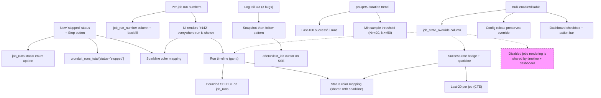

# Feature Research — Cronduit v1.1 "Operator Quality of Life"

**Domain:** Peer-tool calibration for a self-hosted cron scheduler with web UI, polish milestone on top of shipped v1.0
**Researched:** 2026-04-14
**Confidence:** HIGH on the execution/CI analogs (GitHub Actions, Jenkins, Rundeck, Cronicle, Buildkite, Hangfire, Nomad, Airflow) — verified against docs/issues. MEDIUM on the HTMX-specific UX patterns — the general SSE-resume pattern is HIGH but the "which flavor fits HTMX 2.x best" judgment is MEDIUM.

## Scope note

This document is a **calibration pass** on the v1.1 feature list already scoped in `.planning/PROJECT.md § Current Milestone`. It does **not** redesign any v1.0 feature; it answers "how do peer tools solve this, and where does cronduit's planned implementation sit on that spectrum?" The downstream consumer is `REQUIREMENTS.md` acceptance criteria + `gsd-roadmapper` phase splitting.

The v1.0 research (`.planning/milestones/v1.0-research/FEATURES.md`) stays authoritative for everything cronduit already ships. This file only covers the nine v1.1 target features.

---

## Feature Landscape

### Table Stakes (Peer tools universally ship these)

| Feature | Why Expected | Complexity | Notes |
|---|---|---|---|
| **Stop a running job from the UI** | Every comparable scheduler has an Abort/Kill/Stop button. Cronicle, Rundeck, Jenkins, Hangfire, Nomad, Airflow, GitHub Actions, dkron (via timeout only — see below) all ship it. A scheduler without a stop button forces the operator to `docker kill` from the host, which defeats the point of having a web UI. | MEDIUM | cronduit's planned single-hard-kill semantics are *unusual* — see the deep dive below. Expect this to be the most-contested calibration decision in v1.1. |
| **Per-job run history with stable identifiers** | Operators say "run #42 of backup-postgres is wedged." Peer tools universally provide this via either a globally unique ID or a per-job sequential number (usually both). | LOW-MEDIUM | cronduit v1.0 has the globally unique `run_id`; v1.1 adds the per-job sequential number to match GitHub Actions' `run_number` / Buildkite's `build.number` convention. |
| **Snapshot-then-follow log view** | Returning to a running job's log page must show the accumulated output first, then attach to live. Kubernetes Dashboard, Jenkins console, Cronicle's live watcher, `docker logs -f`, `kubectl logs -f --since` all do this. The "empty page that fills in from now" failure mode is universally considered a bug. | MEDIUM | v1.1 bug-fix scope already captures this. The standard pattern is **render DB rows, then open SSE with a `Last-Event-ID` cursor = last DB row id**. See LOG UX deep dive. |
| **Chronologically ordered log output across live/static transitions** | If the run finishes mid-stream, the last few buffered SSE frames must not interleave with the DB re-render. This is a universally accepted correctness requirement. | LOW-MEDIUM | This is a bug fix on cronduit v1.0; every peer tool that ships a live tail has hit and fixed this bug at some point (Kubernetes Dashboard: kubernetes/dashboard#6468-ish class of bug; Jenkins console has a historical "duplicate last lines" bug with similar root cause). |
| **Per-job success/fail visibility at a glance** | GitHub Actions workflow list, Airflow grid view, Buildkite pipeline overview, Jenkins "weather report", Cronicle dashboard tiles — every peer tool communicates "is this job healthy?" with a colored badge or icon on the dashboard. Not having it forces click-through for every job. | LOW | v1.1 success-rate badge is the cronduit version. |

### Differentiators (What cronduit can make distinctive)

| Feature | Value Proposition | Complexity | Notes |
|---|---|---|---|
| **Distinct `stopped` status (not `cancelled` / `aborted` / `killed`)** | Most peer tools conflate operator-initiated termination with "failed" (GitHub Actions: `cancelled` in the conclusion enum but stored as if completed; Jenkins: `ABORTED`; Rundeck: `aborted`; Airflow: `failed` unless you touch `mark success`). None use the word "stopped." cronduit's choice is a small but real UX distinctive — "stopped" reads as deliberate operator action, not a bug. | LOW (it's a taxonomy decision) | Flag: the *word* is a differentiator. The **semantics** (single hard kill) are the unusual bit. See STOP deep dive. |
| **Run timeline / gantt inside the dashboard itself** | Airflow, Jenkins (Blue Ocean / Pipeline Graph View), Nomad, Dagster all ship timeline views — but they all require navigating *into* a specific DAG/pipeline/job first. A last-24h/7d timeline **on the main dashboard** that shows every job's runs at once is not standard; it's closer to a Grafana "heatmap of job runs" panel. Cronduit can make this first-class. | MEDIUM | See RUN TIMELINE deep dive. The 24h/7d window is standard; color coding conventions are established. |
| **Per-job duration p50/p95 rendered from the run history table (no Prometheus dependency)** | Peer tools that show percentiles do it via an external Prometheus/Grafana stack (cronduit v1.0 already emits `cronduit_run_duration_seconds{job}` — the cleanest peer analog is "go look at Grafana"). Rendering p50/p95 inline from the persistence layer means operators without a Grafana stack still get it. | MEDIUM | See DURATION TREND deep dive. Minimum sample size threshold matters. |
| **Bulk enable/disable with config-file-is-source-of-truth semantics** | This is genuinely rare. ofelia's runtime enable/disable state is lost on config reload. Sidekiq-cron has per-job disable but no bulk UI. Hangfire has no concept of "disable a recurring job" — you delete and re-add it. GitHub Actions has per-workflow disable but it's a GitHub setting, not a runtime override. None of them solve "runtime override of config state" cleanly, because they either *are* the source of truth (Cronicle, Rundeck, Hangfire — DB-first) or they *aren't trying* (systemd timers, ofelia). Cronduit picking the config-is-truth stance and still offering runtime disable would be a distinctive. | MEDIUM-HIGH | See BULK deep dive — the design question flagged in PROJECT.md is real and needs explicit resolution at phase-plan time. |

### Anti-Features (peer-tool drift to explicitly reject)

| Feature | Why Requested | Why Problematic | Alternative |
|---|---|---|---|
| **Graceful `SIGTERM → wait → SIGKILL` escalation for Stop** | Docker's own `docker stop` does this; Cronicle does TERM-then-KILL with a timeout; Rundeck tries to (with well-documented failures). It "feels" like the right thing. | Introduces a new configuration knob (grace period) per job type. Doubles the state machine: `stopping` → `stopped` vs. `stopping` → `timeout-during-stop` → `stopped`. Cronduit is a **polish milestone**; picking single hard kill means one new status, one new button, one test matrix. The graceful path is a legitimate v1.2+ feature if operators ask, but it's not table stakes. Note that `docker stop` itself falls back to SIGKILL eventually, so a single hard kill is just the degenerate case of the graceful path with timeout=0. | Ship v1.1 with single `docker kill -s KILL` / `process kill -9` / cancel-token-then-drop semantics. Document the limitation in the README. If v1.2 adds graceful termination, it's additive (new `stop_grace_period` job field, default 0s = current behavior). |
| **Rundeck-style child process tree cleanup** | Rundeck has a [well-known bug class (#1038, #3160, #2105)](https://github.com/rundeck/rundeck/issues/1038) where "Kill Job" only kills the direct child, leaving grandchildren running. Operators will ask cronduit to walk process groups. | Process-group kill requires `setsid()` at spawn time, process-group-kill (`kill -TERM -pgid`) semantics, platform-specific behavior on macOS/BSD, and still doesn't help Docker jobs (which are a separate problem domain). For Docker jobs, `docker kill` on the top-level container already propagates correctly via the container's cgroup. | For `type = "command"` / `type = "script"`: document that cronduit kills the top-level process only; if operators run shell pipelines with backgrounding, they're responsible for process groups. For `type = "docker"`: `docker kill` is authoritative. |
| **Stopping a job that's already terminal returns a helpful error** | "I pressed Stop and nothing happened" is a bad UX. Instinct is to return a 400 with a detailed message. | Jenkins / Rundeck / GitHub Actions all treat "stop on terminal state" as a silent no-op or a 404 / 409. Adding a custom error page for a race the operator cannot meaningfully recover from is polish-on-polish. | Silent no-op on terminal state. Return 409 Conflict with a body of "run is already in state `<status>`" for the API; the UI should hide/disable the Stop button as soon as the run polls into a terminal state. |
| **Full web UI job editor / "add job from the dashboard"** | Operators will ask "why can't I just add a job here instead of editing TOML?" | Violates the **config file is the source of truth** locked decision (PROJECT.md Key Decisions + v1.0 validated requirements). v1.0 research FEATURES.md already called this out as an anti-feature. | Keep the UI read-mostly. Bulk enable/disable is the only runtime state write the UI should gain in v1.1. Job CRUD remains edit-the-TOML-and-reload. |
| **Auth inside cronduit so the Stop button isn't an unauthenticated destructive action** | Shipping a "kill my running backup" button with no auth does feel uncomfortable. | PROJECT.md Out of Scope is explicit: v1 assumes loopback / trusted LAN / reverse proxy. Adding auth to gate *one* new button would open the door to auth creep across the UI. | Document in README + THREAT_MODEL.md that Stop is one of the destructive actions operators gate behind their reverse proxy. Default bind is already `127.0.0.1` per v1.0. |
| **Workflow DAGs / "stop the downstream chain when I stop this job"** | "If I kill this job, shouldn't dependent jobs also be killed?" | PROJECT.md Out of Scope is explicit: no job dependencies. This is Airflow/Dagster territory. | Jobs are independent. Stopping one stops exactly one run. |
| **Webhook / chain notification on stop** | "I want Slack to know when I stopped a job so the team isn't confused" | v1.2 Future Requirements already captures webhooks on state transitions. | Defer. When v1.2 webhooks ship, `stopped` will be one of the transitions that fires the webhook. |
| **Live container exec / web terminal into a running job** | "I want to see what's happening inside the container right now before I kill it" | Security boundary, auth requirement (see above), websocket protocol, TTY handling. v1.0 research already flagged this as an anti-feature. | `docker exec` from the host. Live log tail is what cronduit gives you. |
| **Export run history as CSV / JSON from the UI** | "I want to chart this in Excel" | Low value add, nontrivial surface area, better served by direct SQLite queries (`sqlite3 cronduit.db 'SELECT ... FROM job_runs'`) or scraping `/metrics`. | Not in v1.1. Maybe v1.4 if operators actually ask. |
| **Replayable ad-hoc one-shot runs (run a command not in config)** | "I want to run `df -h` on the host from the dashboard" | PROJECT.md Out of Scope: config is the single source of truth for what runs. Adding ad-hoc exec is an auth + threat-model reopen. | Not in v1.1 or any version. |

---

## Feature deep dives

### 1. STOP A JOB

#### Peer-tool reference implementations

| Tool | Endpoint / mechanism | Terminal status | Notes |
|---|---|---|---|
| **Jenkins** | `BUILD_URL/stop` (graceful), `/term` (forcible), `/kill` (hard-kill pipeline) — [docs](https://www.jenkins.io/doc/pipeline/steps/workflow-basic-steps/) | `ABORTED` (one of `SUCCESS`/`FAILURE`/`UNSTABLE`/`NOT_BUILT`/`ABORTED`) — [Result javadoc](https://javadoc.jenkins-ci.org/hudson/model/Result.html) | Three-tier escalation, visible to users. The word Jenkins uses throughout the UI is "Abort." |
| **Rundeck** | `POST /execution/{id}/abort` — [docs](https://docs.rundeck.com/docs/manual/07-executions.html) | `aborted` (one of `running`/`succeeded`/`failed`/`aborted`/`timedout`/`scheduled`/`failed-with-retry`) | Known child-process cleanup bugs ([#1038](https://github.com/rundeck/rundeck/issues/1038), [#2105](https://github.com/rundeck/rundeck/issues/2105), [#3160](https://github.com/rundeck/rundeck/issues/3160)). Mapped internally as `cancel`. |
| **Cronicle** | "Abort" link on Home tab; child processes get SIGTERM with a configurable timeout, then SIGKILL | "Aborted" tag on the run | [#248](https://github.com/jhuckaby/Cronicle/issues/248) documents incomplete child-process cleanup even with the TERM→KILL escalation. |
| **GitHub Actions** | Cancel workflow run button | Status `completed` / Conclusion `cancelled` — [docs](https://github.com/orgs/community/discussions/70540) | Uses the word "cancelled." `cancelled` counts as "not success" for branch protection. Note it's a `conclusion`, not a `status` — GHA's two-field model keeps "is it still running?" separate from "what happened?" |
| **Hangfire** | Dashboard "Delete" button on a Processing job. Actual termination relies on the job's `CancellationToken` being respected. | `Deleted` (succeeded/failed/deleted are the three completion states) — [discuss thread](https://discuss.hangfire.io/t/cancel-a-running-job/603) | [#1298](https://github.com/HangfireIO/Hangfire/issues/1298) — "Deleting jobs does not stop them." Job is removed from the UI's Processing list immediately but may continue running for minutes. Cautionary tale. |
| **Nomad** | `nomad alloc stop <alloc>` or `nomad job stop <job>` | allocation goes to `complete`/`failed`; no distinct `stopped` status | Nomad's taxonomy is `Pending` / `Running` / `Dead`; the user-initiated stop is not visibly distinct from natural completion. |
| **dkron** | **No explicit kill command.** [Stop a running job discussion #1261](https://github.com/distribworks/dkron/discussions/1261) confirms it. The shell executor's timeout is the only abort path. | n/a | Flag: dkron is the one peer tool that *doesn't* ship Stop. Operators are expected to set timeouts and wait. |
| **Airflow** | `Mark as failed` / `Mark as success` on the task/DAG run; signal-based cancellation via `/trigger/{dag}/clear?task_id=...` flow | Status enum: `success`/`running`/`failed`/`up_for_retry`/`upstream_failed`/`skipped`/`queued`/`scheduled` | Has no explicit operator-stopped status; the DAG run is marked `failed` when the task is killed. |

#### Calibration verdicts for cronduit v1.1

**Status word — `stopped`** — **MILD DIFFERENTIATOR, LOW RISK.** Every peer tool uses a different word (`aborted`, `cancelled`, `killed`, `failed`, `deleted`). There's no de facto convention, so cronduit can use `stopped` without contradicting expectations. The word "stopped" is friendlier than "aborted" and more precise than "cancelled" (which implies "before it started running"). Ship it.

**Single hard kill — UNUSUAL, FLAG FOR README.** Six of the eight peer tools do graceful-then-force (`SIGTERM → wait → SIGKILL`): Docker, Cronicle, Jenkins (via `/stop`), Hangfire (via `CancellationToken`), Rundeck, Airflow. Two don't (dkron has no stop at all; GitHub Actions' cancel is implementation-defined per runner and generally best-effort). Choosing single hard kill is *defensible* because:

1. Cronduit is a **polish milestone** — the smallest state machine wins. `stopping` → `stopped` with no intermediate timeout is one new status, one new button.
2. `docker stop` itself degrades to SIGKILL eventually, so single hard kill is the degenerate case of a graceful stop with timeout=0.
3. For `type = "docker"` jobs, `docker kill -s KILL` is semantically "container goes away right now, all its children go with it via cgroup termination." No process-tree walk needed. This is cleaner than the equivalent for local commands.
4. The moby#8441 race that v1.0 already documented (auto_remove=false + explicit remove) means cronduit already has to wait+remove after kill. The exit-code capture path is already built.

But it's unusual. **README should explicitly say: "Stop kills immediately (SIGKILL / `docker kill -s KILL`). There is no grace period. Use per-job `timeout` for graceful bounds."**

**`docker kill -s KILL` over bollard — STRAIGHTFORWARD.** bollard's `kill_container` takes a `KillContainerOptions { signal: Some("KILL") }`. No orchestration needed. Make sure the post-kill flow matches the existing moby#8441 pattern (wait_container → remove_container), marking the run `stopped` on the way out.

**"Cannot stop terminal state" error handling — SILENT NO-OP IS STANDARD.** Peer-tool precedent: Jenkins' `/stop` on a terminal build is a no-op with 302 back to the build page; Rundeck returns a body like `{"abortstate":"failed", "reason":"Job is not running"}` but with HTTP 200; GitHub Actions' UI hides the cancel button once the run is terminal; Cronicle's Abort link just disappears. The convention is: **hide the button client-side the moment polling reports a terminal status; accept the race on the server with a 409 Conflict + terse body if the POST lands during the transition.** No detailed error message needed.

#### Acceptance-criteria implications for REQUIREMENTS.md

- **REQ: Stop button renders only when run status is `running`.** (Hidden the instant polling sees `stopped`/`success`/`failed`/`timeout`/`cancelled`.)
- **REQ: `POST /api/runs/:id/stop` returns 202 on running runs, 409 on terminal runs.** No grace period. No "are you sure?" confirm dialog in v1.1 (polish, not v1.0 parity).
- **REQ: On success, status transitions atomically from `running` → `stopped` with a recorded `stopped_at` timestamp and a reason field (default: "stopped by operator").** `exit_code` should be `null` (NOT 137/143; those are signal numbers, and the operator didn't care). Distinguishes the row from `timeout`-terminated runs on inspection.
- **REQ: For `type = "docker"` jobs, the container is `docker kill -s KILL`'d via bollard, then the v1.0 wait_container→remove_container flow runs to completion. Exit code is captured as normal but the run row is `stopped` regardless of the exit code.**
- **REQ: For `type = "command"` / `type = "script"` jobs, the spawned process is killed via the existing tokio cancellation token + `kill_on_drop(true)` pattern. No process-group walk.** Document in README that shell pipelines inside a `script` may leak grandchildren.
- **REQ: The new `stopped` status is visible in the run history table, on the job detail page, on the dashboard card, and in `/metrics` as a new label value on `cronduit_runs_total{status="stopped"}`.**

---

### 2. PER-JOB RUN NUMBERS

#### Peer-tool reference implementations

| Tool | Format | Per-job or global | Mechanism | Source |
|---|---|---|---|---|
| **GitHub Actions** | `${{ github.run_number }}` | **Per workflow** (unique per workflow file in a repo; begins at 1, increments, does not change on re-run) | Incrementing counter maintained by GitHub per-workflow. Also exposes `github.run_id` for globally unique. | [docs discussion](https://github.com/orgs/community/discussions/26709), [workflow syntax](https://docs.github.com/actions/using-workflows/workflow-syntax-for-github-actions) |
| **Buildkite** | `BUILDKITE_BUILD_NUMBER` (e.g., `27`) | **Per pipeline** | Incremented per build, "may have occasional gaps." Each build also has a global `build.id` UUID. | [Builds API](https://buildkite.com/docs/apis/rest-api/builds) |
| **Jenkins** | `#142` (in `jobname #142`) | **Per job** | `BUILD_NUMBER` env var; Jenkins maintains a next-build-number file per job on disk. | [builtin Jenkins convention] |
| **Cronicle** | No per-job run number; uses a global `job_id` UUID | Global only | Run history lists by time. | [Cronicle WebUI docs](https://github.com/jhuckaby/Cronicle/blob/master/docs/WebUI.md) |
| **Rundeck** | Global execution ID only | Global | `/execution/{id}` endpoint | [Executions docs](https://docs.rundeck.com/docs/manual/07-executions.html) |
| **Airflow** | Run ID is a string (typically `scheduled__<logical_date>` or `manual__<timestamp>`); no integer counter | Neither, really | Historical: Airflow prefers logical dates; there is no `#142` convention. | [Airflow docs] |
| **Nomad** | Allocation ID UUID; no per-job counter | Global | | [Nomad docs] |
| **Hangfire** | Global `jobId` integer | Global | | [Hangfire docs] |

#### Calibration verdicts for cronduit v1.1

**Per-job numbering is a CI convention, not a general scheduler convention.** The two peer tools with the clearest analog (GitHub Actions, Buildkite) both pick per-pipeline. The general-purpose schedulers (Cronicle, Rundeck, Airflow, Nomad, Hangfire) all use global IDs only. This matters because cronduit is ambiguously positioned — it's a cron scheduler, but operators who came from CI will expect `#142`.

**The CI mental model is the right one for cronduit.** Operators will say "run #142 of backup-postgres was slow" much more naturally than "run 14,293 was slow." GitHub Actions' decision to ship both `run_id` and `run_number` — and to scope `run_number` per workflow — is a well-validated design choice that matches how humans refer to recurring jobs.

**Implementation pattern — schema and backfill:**

- **Schema change:** Add `job_run_number INTEGER NOT NULL` to `job_runs`. Keep the existing `id` as globally unique primary key.
- **On insert:** Compute via `SELECT COALESCE(MAX(job_run_number), 0) + 1 FROM job_runs WHERE job_id = ?` inside the same write transaction. With the v1.0 write-pool single-writer SQLite setup, this is contention-safe. For Postgres, the same query under `SERIALIZABLE` or with an advisory lock would work; an alternative is a dedicated `jobs.next_run_number` counter column updated in the same transaction. Recommend the MAX(+1) approach for both backends to keep the logical schema identical.
- **Backfill migration (idempotent, runs on startup):**
  ```sql
  -- Postgres-style; SQLite port uses ROW_NUMBER() OVER (PARTITION BY ...)
  UPDATE job_runs SET job_run_number = s.rn
  FROM (
      SELECT id,
             ROW_NUMBER() OVER (PARTITION BY job_id ORDER BY started_at, id) AS rn
      FROM job_runs
  ) s
  WHERE job_runs.id = s.id AND job_runs.job_run_number IS NULL;
  ```
  Idempotency: `WHERE job_run_number IS NULL` means a second run is a no-op. See [SQLite ROW_NUMBER](https://www.sqlitetutorial.net/sqlite-window-functions/sqlite-row_number/). [Schema-migration idempotency in SQLite](https://www.red-gate.com/hub/product-learning/flyway/creating-idempotent-ddl-scripts-for-database-migrations) is a known sore spot — the `WHERE col IS NULL` guard is the standard escape hatch.
- **Per-backend migration files:** Both backends support `ROW_NUMBER() OVER (PARTITION BY ...)` (SQLite ≥ 3.25, Postgres forever). A single shared SQL migration would almost work; cronduit's locked constraint says "per-backend migration files where dialect requires" so ship two copies with identical content to stay uniform.
- **Display convention:** `backup-postgres #142` in the UI. Keep the global `id` visible in the run detail page footer / debug area so operators can still bisect across jobs.

**Complexity estimate for roadmapper: 1 plan.** Schema change + backfill migration + insert-path update + UI rendering. The only hidden risk is the Postgres/SQLite migration file parity — pairs well with the existing testcontainers-Postgres CI lane. GitHub Actions' own history suggests this is a solved problem, but cronduit's in-transaction MAX(+1) is worth a property test: "N concurrent inserts for job_id=X produce run numbers 1..N with no gaps or duplicates."

#### Acceptance-criteria implications for REQUIREMENTS.md

- **REQ: New runs get a `job_run_number` that is strictly sequential per `job_id`, starting at 1 for the first run of each job, with no gaps.**
- **REQ: Existing rows in `job_runs` at the time of upgrade get backfilled with `job_run_number` in `(started_at, id)` order, within a single `UPDATE` using `ROW_NUMBER() OVER (PARTITION BY job_id ORDER BY started_at, id)`.**
- **REQ: The migration is idempotent (a second startup is a no-op).**
- **REQ: UI renders `<job name> #<job_run_number>` on run list rows, run detail page headers, and dashboard card tooltips. The global `id` remains the URL path component (`/jobs/:id/runs/:run_id`) — don't break existing permalinks.**
- **REQ: A Postgres + SQLite integration test asserts the same numbering across backends for the same insert sequence.**

---

### 3. LOG TAIL UX — three related bugs

The three sub-features (ordering, error-at-load, backfill-on-navigate) are different symptoms of the **same** root cause: the v1.0 SSE tail pipeline has no coordination between "DB snapshot" and "live stream." Solving them together with one coherent pattern is simpler than solving them independently.

#### Peer-tool reference implementations

| Tool | Pattern | Notes |
|---|---|---|
| **`docker logs -f` (CLI reference)** | Reads historical lines from stdio files **inline with** the streaming follow — the docker daemon writes to the same JSON file and the CLI just `tail -f`'s it. Supports `--since` for cursor-based resume. [docs](https://docs.docker.com/reference/cli/docker/container/logs/) | The single unified stream means ordering is correct by construction. This is the gold standard. |
| **`kubectl logs -f --since=<duration>`** | Same pattern as docker logs; kubelet is the single writer and the client reads from a single ordered stream. | Same guarantees. |
| **Kubernetes Dashboard (official + kubetail, kdd)** | [DEV post on implementation](https://dev.to/perber/building-a-kubernetes-dashboard-implementing-a-real-time-logview-with-server-sent-events-and-react-window-1lel): initial REST fetch for the last N lines, then SSE for follow. The dashboard renders the REST snapshot into a buffer, then appends SSE frames to the tail of the buffer. | **Snapshot-then-follow**. The critical detail: the REST snapshot includes a cursor (last log ID or timestamp), and the SSE request passes it via `?since=<cursor>` so the server emits only strictly-newer frames. Zero overlap, zero gap. |
| **Jenkins Classic console** | Polls a single HTTP endpoint with a byte-offset query parameter (`progressiveText?start=<offset>`). Server returns new bytes + updated offset. | Not SSE, but the cursor-based resume is the same idea. |
| **Cronicle live log watcher** | WebSocket stream from the runner; on page load, the server pushes the buffered log and then attaches to live. | All in one transport (WebSocket). [WebUI docs](https://github.com/jhuckaby/Cronicle/blob/master/docs/WebUI.md) |
| **Airflow task logs** | Static file rendering; auto-refreshes the whole block. No live streaming in stable Airflow. | Degenerate case — refresh the whole page. |

#### The universal pattern: **snapshot-then-follow with a cursor**

Every peer tool that does this correctly follows the same three-step recipe:

1. **Server renders a snapshot** of already-persisted log lines with a cursor (last persisted line ID, byte offset, or `Last-Event-ID`).
2. **Client opens the live channel with the cursor** (`?since=<cursor>` or the standard `Last-Event-ID` HTTP header).
3. **Server emits strictly-newer frames only** when responding to the live channel. If the run terminates mid-stream, it emits a terminal event (e.g., `event: done\ndata: stopped`) and closes.

This collapses all three cronduit v1.1 bugs:
- **Ordering across live→static transition**: eliminated because there is only one authoritative order (the persisted line ID).
- **"Error getting logs" on load**: eliminated because the snapshot is always valid HTML rendered server-side, regardless of SSE state.
- **Backfill on navigate**: the snapshot *is* the backfill.

#### Does HTMX support this cleanly?

**Yes, with a nuance.** The HTMX SSE extension (v2.x, which cronduit v1.0 ships) does read `id:` fields from SSE events and sends `Last-Event-ID` on reconnect. From [htmx.org/extensions/sse](https://htmx.org/extensions/sse/):

> If the server includes `id:` fields in its SSE messages, the extension tracks the last received ID and sends it as a `Last-Event-ID` header when reconnecting. If the server reads the `Last-Event-ID` header and replays missed messages, nothing is lost.

**But HTMX 4.x removed `sse-swap`.** From the [htmx SSE extension docs](https://htmx.org/extensions/sse/), the 4.x migration note: *"sse-swap is gone entirely in htmx 4.x. There is no equivalent, because the extension no longer has its own swap system."* cronduit v1.0 is on HTMX 2.0.4 — fine for v1.1 — but this means the chosen pattern will need a revisit if cronduit ever adopts HTMX 4.x. **Flag for PITFALLS.md / PROJECT.md: HTMX 4.x is a v1.2+ decision, not a v1.1 concern.**

#### Calibration verdicts for cronduit v1.1

**Pattern: single HTML template renders DB-persisted log lines, then an SSE subscription with `id:` cursoring continues from the last rendered line.**

Concretely:

- The server-rendered log page template iterates `SELECT id, ts, stream, line FROM job_logs WHERE run_id = ? ORDER BY id` at request time — no SSE involved in the initial render. This eliminates the "Error getting logs" transient entirely: the page either renders successfully or returns a 500, both of which are stable states.
- For running runs, the template appends an `<div hx-ext="sse" sse-connect="/api/runs/:id/log/sse?after=<last_rendered_id>">` block. The server emits SSE events with `id: <log_line_id>` for each new line, and `event: done` when the run terminates.
- The server subscribes to the existing v1.0 log channel from `after=<last_rendered_id>` — any frames with `id <= after` are suppressed. Frames with `id > after` are streamed in order.
- On reconnect (tab backgrounded, network blip), HTMX's built-in `Last-Event-ID` handling resumes from the correct cursor automatically. See [SSE extension docs on reconnection](https://htmx.org/extensions/sse/).
- On run termination, the server emits a final `event: done` and closes the connection. The client swaps the log container to a static "Run finished" banner via `hx-swap-oob`.

**Ordering guarantee** comes from a single source: `job_logs.id` is the monotonic write order. As long as the SSE subscriber consumes frames in id-order (not timestamp-order — wall-clock is not monotonic across reload or NTP adjustments), ordering is correct by construction.

**Error-at-load elimination** comes from moving the initial render out of SSE. The SSE connection is an *enhancement*, not the source of truth.

**Backfill-on-navigate** is automatic: the initial HTML already contains the full accumulated log because it's read from the DB.

**One specific failure mode to watch for — the "I just started running" race.** If the operator hits the page at the moment a new run starts, the DB may have zero log rows yet and the `after=<last_rendered_id>` cursor is `0`. That's fine — the SSE stream emits frames starting from id=1. Test case: click Run Now, immediately click through to the run detail page, confirm all log lines appear in order.

**One nuance on SSE + HTMX 2.x + `pauseOnBackground`.** The default (`pauseOnBackground: true`) is actually **desirable** for cronduit: when the operator backgrounds the tab, the SSE connection pauses; when they come back, it reconnects with `Last-Event-ID` and the server replays anything missed. This matches the "looking at a wedged backup in a tab I left open overnight" operator flow. Leave the default.

#### Acceptance-criteria implications for REQUIREMENTS.md

- **REQ: Run detail page server-renders all persisted log lines for the run at request time, ordered by `job_logs.id` ASC. No SSE dependency for initial render. Never shows "Error getting logs."**
- **REQ: For runs where `status = 'running'`, the page appends a `hx-ext="sse"` block that connects to `/api/runs/:run_id/log/sse?after=<last_persisted_log_id>`.**
- **REQ: The SSE endpoint emits one `data:` frame per log line with `id: <job_logs.id>`, `event: line`. The server subscribes from the live tail, filters out any row with id ≤ `after`, and streams the rest in id order.**
- **REQ: On reconnection (any cause), the browser's HTMX SSE extension sends `Last-Event-ID`; the server honors it and resumes from the correct cursor with no gaps or duplicates.**
- **REQ: When the run transitions to any terminal state, the SSE endpoint emits a final `event: done` frame and closes the connection. The client triggers a final partial refresh to pick up the new terminal status badge.**
- **REQ: Integration test: submit a job that prints 50 lines over 5 seconds. Open the run page mid-run. Assert: (1) all 50 lines eventually appear in order, (2) no duplicates, (3) no "Error getting logs" frame is ever rendered, (4) the terminal status badge updates when the run ends.**
- **REQ: Integration test: submit a job, navigate *away*, navigate *back* at 50% completion. Assert: all already-written lines appear in the DOM immediately on load, then remaining lines stream in.**
- **REQ: Integration test: submit a job, navigate to the detail page, kill the SSE connection (simulate network drop), reconnect. Assert: no gap and no duplicate around the reconnection boundary.**

---

### 4. RUN TIMELINE (GANTT)

#### Peer-tool reference implementations

| Tool | Pattern | Dependency shape |
|---|---|---|
| **Airflow Gantt (per DAG run)** | Timeline integrated into the grid view; each task is a colored bar from start→end. Colors: green=success, red=failed, yellow/orange=running, gray=queued/skipped — see [Airflow UI docs](https://airflow.apache.org/docs/apache-airflow/stable/ui.html) and [Astronomer](https://www.astronomer.io/docs/learn/airflow-ui). Server-rendered (Flask + Jinja + SVG), no JS framework dependency for the render itself. | Per-DAG-run, not cross-DAG. [Issue #22001](https://github.com/apache/airflow/issues/22001) is operators asking for "global gantt chart (across all DAGs)" — **Airflow does not ship this.** |
| **Jenkins Pipeline Graph View** | Per-pipeline-run stage timeline; not a true gantt, more a DAG waterfall. Server-rendered, no React — [plugin page](https://plugins.jenkins.io/pipeline-graph-view/). | Per-run only. Blue Ocean was the cross-pipeline timeline but is deprecated. |
| **Nomad UI** | Allocation timeline per job; each alloc gets a lifecycle bar. | Per-job only. |
| **Buildkite pipeline overview** | List of recent builds with start-time/duration bars aligned horizontally — it's closer to a "recent activity chart" than a true gantt but serves the same "what ran when" purpose. | Per-pipeline only. |
| **Grafana heatmap** | The common operator fallback is to scrape `cronduit_runs_total{status}` into Prometheus and render a status-heatmap in Grafana. | Cross-job, but requires an external observability stack. |

#### Calibration verdicts for cronduit v1.1

**Key insight: a cross-job timeline on the dashboard itself is unusual for a scheduler.** Every peer tool's gantt is scoped to a single pipeline/DAG/job. The operator use case — "show me every job's runs in the last 24h on one screen" — is typically served by Grafana, not by the scheduler's own UI. cronduit bringing this first-class is a **differentiator**, not a table-stakes feature.

**Rendering approach — inline SVG, server-rendered, no JS framework.** The design constraint (terminal aesthetic, no SPA, single binary) rules out any JS charting library. The pattern that works:

- Server queries: `SELECT job_id, started_at, COALESCE(ended_at, NOW()), status FROM job_runs WHERE started_at >= NOW() - INTERVAL '24 hours' ORDER BY started_at`.
- Template renders one `<svg>` per job row, with `<rect>` elements per run positioned by `started_at` and sized by duration. One row per job, time axis shared across all rows.
- Color mapping via CSS classes: `.run-success`, `.run-failed`, `.run-running`, `.run-stopped`, `.run-timeout`, `.run-cancelled` — tie to the existing design system green/red/amber tokens.
- x-axis tick marks as plain SVG `<line>` elements with `<text>` labels at hour (24h view) or day (7d view) boundaries.

**This is ~200 lines of askama template + one SQL query + one handler.** Small, no hidden complexity. The only risk is "what if a job has 10,000 runs in 24h?" — guard with a LIMIT, or pre-aggregate via `GROUP BY` into 5-min buckets for the 7d view.

**24h / 7d as preset windows — YES, standard.** No peer tool ships a full time-range picker in v1 of this feature. Airflow's grid view has a `lookback` control (default 14, max configurable). Jenkins has "last 30 builds." Grafana has `now-24h`/`now-7d` as the two most-used defaults. **Cronduit v1.1 should ship two fixed windows (24h, 7d) as a toggle, not a picker.** Picker is a v1.3+ polish.

**Color coding — use the existing design system tokens, not a new palette.** Airflow's palette (green/red/yellow/gray) is conventional but not normative. cronduit's terminal-green aesthetic wants:

- `success` → primary green (bright)
- `failed` → red
- `timeout` → amber/orange
- `stopped` → muted gray (operator-initiated, intentional)
- `cancelled` → muted gray + dashed border (if the distinction even survives v1.1)
- `running` → primary green with `animate-pulse` Tailwind class or SVG `<animate>` on fill-opacity
- No status text — color + hover-tooltip only. The design system's tight color vocabulary wins here.

**Accessibility: color alone is not sufficient.** Peer tools (Airflow included) all ship status-by-icon *and* status-by-color. For cronduit, the hover tooltip (`<title>`) showing `backup-postgres #142 · 3m42s · success` is the text accessibility layer — SVG `<title>` is screen-reader-readable and needs zero JS.

**Complexity estimate for roadmapper: 1 plan.** Timeline render + SQL + template + two preset buttons + hover tooltip. No migration. No API surface change. Fits cleanly into an observability-polish chunk alongside the sparkline and p50/p95 work.

#### Acceptance-criteria implications for REQUIREMENTS.md

- **REQ: Dashboard has a new "Timeline" section above or alongside the existing job list, with two window toggles: "24h" (default) and "7d."**
- **REQ: The timeline renders one row per enabled job (disabled jobs are hidden or greyed — design decision at phase-plan).**
- **REQ: Each run is a colored `<rect>` positioned by `started_at` on an x-axis spanning the current window. Color encodes status using the existing design system tokens. Duration is reflected in the `width` attribute.**
- **REQ: Running runs show a visual indicator (pulse animation, open-ended right edge, or both).**
- **REQ: Hovering a run shows an SVG `<title>` tooltip with `<job_name> #<run_number> · <duration> · <status>`.**
- **REQ: Clicking a run navigates to the run detail page.**
- **REQ: Rendering is server-side SVG — no JS charting library, no JSON-to-SVG client hydration.**
- **REQ: The timeline SQL query is bounded (LIMIT or `started_at >= NOW() - window`) so a job with 10k runs/day does not blow up the page.**

---

### 5. SUCCESS-RATE BADGE + SPARKLINE

#### Peer-tool reference implementations

| Tool | Window | Sample shape | Source |
|---|---|---|---|
| **GitHub Actions "performance metrics"** | Last 30 days, configurable | Failure rate percentage per workflow; no sparkline built-in | [docs](https://docs.github.com/en/actions/administering-github-actions/viewing-github-actions-metrics) |
| **gh-workflow-stats (community CLI)** | Configurable `--last-n` or `--days` | Per-workflow success-rate percentage, rendered as text. | [repo](https://github.com/fchimpan/gh-workflow-stats) |
| **CICube (commercial GHA dashboard)** | Rolling 7d / 30d | Success rate + trend line | [blog](https://cicube.io/blog/github-actions-dashboard/) |
| **Jenkins "weather report"** | Last 5 builds | Single icon (sun/cloud/rain/storm) encoding a 0-100% score; no sparkline | [Jenkins builtin] |
| **Airflow calendar view** | Configurable | Grid of days, each colored by pass/fail aggregate — functions as a low-resolution sparkline. | [Airflow UI docs](https://airflow.apache.org/docs/apache-airflow/stable/ui.html) |
| **Buildkite pipeline cards** | Last 10 builds | Status dots in a row — the de facto "mini sparkline" for CI pipelines. | [Buildkite pipelines docs](https://buildkite.com/docs/pipelines) |

#### Calibration verdicts for cronduit v1.1

**Window choice: rolling last N runs, not a time window.** Peer tools split. GitHub Actions uses time windows (30d), Jenkins uses last-N (5), Buildkite uses last-N (10), Airflow offers both. For cronduit, **last N runs (recommend N=20) is the better default** because:

1. A daily backup that runs 30 times in 30 days has meaningful success-rate signal at N=20.
2. An hourly scrape that runs 720 times in 30 days would have its signal averaged into oblivion by a 30-day window — last-20 keeps recent behavior visible.
3. Sparklines at N=20 fit comfortably in a dashboard card at terminal-display sizes (~120-200px width → 6-10px per point).
4. The SQL is trivial: `ORDER BY started_at DESC LIMIT 20`.

**Minimum sample size before showing a rate:** Ship the badge only when N≥5 runs exist. Below that, render `—` or `(new job)`. Peer-tool convention is loose here but Jenkins's weather report needs 5 to compute.

**Sparkline rendering: inline SVG, no library.** Server-rendered SVG sparkline is ~20 lines of askama template. The key bits:

- `<svg width="120" height="24" viewBox="0 0 120 24">`
- One `<rect>` per run (column sparkline), colored by status, width = `120/N`, height from bottom.
- Or: `<polyline>` for a duration sparkline (duration on y-axis, run index on x-axis).
- Recommend **column sparkline of status (one colored bar per run)**, not a line sparkline of duration — the operator's primary question is "is this healthy?" not "how fast?" The duration question is better answered by the p50/p95 trend (next section).

**Anti-patterns to avoid:**

- **Do NOT use a JS sparkline library.** React-sparklines, Chart.js, uPlot, etc., all break the single-binary / no-SPA constraint. Inline SVG is ~20 template lines; a library is a new dependency surface.
- **Do NOT encode both status AND duration in the same sparkline.** Overloading a sparkline with two dimensions is a known Tufte anti-pattern — operators will misread it. Two sparklines, each monadic, beats one dual-axis sparkline every time. v1.1 ships the status sparkline; duration visualization lives in the p50/p95 trend on the detail page.
- **Do NOT recompute on every page render without an index.** If cronduit adds 100 jobs and each dashboard render runs 100 `SELECT ... ORDER BY started_at DESC LIMIT 20` queries, that's 100 SQLite round-trips. Mitigation: one CTE that computes per-job last-20 in a single query, or an ephemeral in-memory cache with a 5-second TTL. Measure before optimizing.

**Success-rate formula:** `successful_runs / total_runs_in_window`. cronduit's new `stopped` status is ambiguous here — should an operator-stopped run count as a failure? **Recommendation: `stopped` runs are excluded from both numerator and denominator** (treated as "didn't really happen from a reliability perspective"). Same rationale as GitHub Actions treating `cancelled` separately from failure in most contexts. Document explicitly.

#### Acceptance-criteria implications for REQUIREMENTS.md

- **REQ: Each dashboard job card renders a success-rate badge and a 20-run column sparkline.**
- **REQ: Success rate = `count(status='success') / count(status IN ('success','failed','timeout'))` over the last 20 runs. `stopped` and `cancelled` runs are excluded from both numerator and denominator.**
- **REQ: Jobs with fewer than 5 completed runs render `—` in place of the badge and `(new)` or a placeholder sparkline.**
- **REQ: Sparkline is inline server-rendered SVG — one colored `<rect>` per run, oldest on the left, newest on the right. Colors match the timeline/status color system.**
- **REQ: The sparkline SQL is a single per-request query (CTE or join) against `job_runs`, not N round-trips.**
- **REQ: The badge text is the integer percentage (e.g., `95%`), colored green ≥ 95%, amber 80–94%, red < 80%. Thresholds configurable later; not in v1.1.**

---

### 6. DURATION TREND (P50/P95) ON JOB DETAIL

#### Peer-tool reference implementations

| Tool | Percentile surface | Minimum sample convention |
|---|---|---|
| **Grafana panels from Prometheus `histogram_quantile`** | Standard p50/p95/p99 rendering on the histogram | `histogram_quantile` returns NaN if <2 buckets; no hard minimum, but <20 samples is widely considered noise. [Prometheus histograms practices](https://prometheus.io/docs/practices/histograms/) |
| **Datadog APM per-endpoint latency** | p50, p95, p99 in a single chart | Datadog docs recommend ≥100 samples per bucket for p99 stability |
| **New Relic transaction traces** | Median + 95th percentile | ≥50 samples recommended |
| **Honeycomb heatmaps / BubbleUp** | Non-percentile; full distribution | Not percentile-based |
| **GitHub Actions performance metrics** | Average only, no percentiles | n/a |

**No scheduler** in the peer-tool set (Cronicle, Rundeck, Airflow, Jenkins, dkron, Hangfire, Nomad, Sidekiq) surfaces per-job duration percentiles inline. They all either show "last duration" or point operators at Prometheus/Grafana. **Cronduit v1.1 rendering p50/p95 from the SQLite run history is a distinctive, not a table-stakes.**

#### Calibration verdicts for cronduit v1.1

**Minimum sample size: N≥20 for p50, N≥50 for p95.** The statistical reasoning:

- p50 (median) is the most robust percentile. It's meaningful as soon as you have enough samples that the middle value is representative — N=20 is a well-known rule of thumb.
- p95 is much more sensitive to tail samples. A single slow outlier dominates a small sample. The widely-cited minimum is 1/(1-percentile) × some factor; at p95 that's ≥20, and practitioners typically add a margin → 50.
- Below the threshold, render `—` or "insufficient data (N < 50)".

**Computation: SQL `PERCENTILE_CONT` on Postgres, manual on SQLite.**

- Postgres: `SELECT PERCENTILE_CONT(0.5) WITHIN GROUP (ORDER BY duration_ms), PERCENTILE_CONT(0.95) WITHIN GROUP (ORDER BY duration_ms) FROM job_runs WHERE job_id = ? AND status = 'success' ORDER BY started_at DESC LIMIT 100`.
- SQLite: no built-in percentile function. Options:
  1. Read the last N durations into Rust and sort + index (trivial, ~10 lines). **Recommended.**
  2. Use a recursive CTE with `ROW_NUMBER()` (complex, not faster).
  3. Bring in a SQLite extension (breaks single-binary story).

The Rust path (option 1) is cleaner and keeps logic identical across backends: fetch up to N durations, sort, compute percentiles by position. N=100 is a reasonable upper bound on "last runs" for percentile rendering.

**Which runs to include:** Only `status='success'` runs. Failed/timeout runs have non-representative durations (failures can be fast or slow depending on where they hit; timeouts all bunch at the per-job timeout value). Document this choice.

**Rendering: two numbers, not a chart.** The operator question is "is this job getting slower?" A p50/p95 pair as text (`p50: 1m34s · p95: 2m12s`) on the job detail page header row is enough for v1.1. An actual trend chart (p50/p95 over time) is a v1.2+ feature and overlaps with the "just scrape `/metrics` into Grafana" story.

**Anti-pattern to avoid: computing percentiles across all time.** The job's performance envelope drifts over months. Always window to "last 100 completed runs" or "last 30 days" — whichever is smaller. Match the sparkline's recency bias.

#### Acceptance-criteria implications for REQUIREMENTS.md

- **REQ: Job detail page renders `p50` and `p95` duration values, computed from the last 100 successful runs.**
- **REQ: If the job has <20 successful runs, render `—` for p50 and p95 (with a tooltip explaining the threshold).**
- **REQ: If the job has 20–49 successful runs, render p50 only; render `—` for p95.**
- **REQ: Percentile computation is done in Rust after fetching sorted durations from SQL (not via a SQL window function), to keep the SQLite and Postgres code paths identical.**
- **REQ: Only runs with `status='success'` are included in the percentile computation. Document this in the tooltip.**
- **REQ: Values are formatted with human-readable durations (`1m34s`, not `94000ms`).**

---

### 7. BULK ENABLE / DISABLE

This is the v1.1 feature with the **most unresolved design tension**, as PROJECT.md already flags.

#### The core conflict

Cronduit's **locked decision**: *"File-based config is the source of truth (hand-written, no ofelia importer)"*. On every startup / SIGHUP / file-watch reload, the config file authoritatively declares which jobs exist and which are enabled.

Bulk disable from the UI needs to write state somewhere. If it writes to the config file, cronduit becomes a UI-first tool and breaks the GitOps/read-only-config constraint. If it writes to the DB, the state is lost the next time the operator edits the config file and a reload happens — unless reload has logic to preserve UI-set disable state.

#### Peer-tool survey — who solved this cleanly?

| Tool | Config source | Disable semantics | How it handles the conflict |
|---|---|---|---|
| **ofelia** | Config file + Docker labels (hybrid) | Web UI allows enable/disable per job | Env vars override config → Docker labels → config file. But on file reload, runtime disable state is lost. [README](https://github.com/mcuadros/ofelia) |
| **Cronicle** | DB-first (UI is source of truth) | Dashboard toggle per event | Clean — there is no config file to conflict with. Lives in a different product category. |
| **Rundeck** | DB-first | Per-job "enabled" flag in the job definition | Clean — DB is source of truth. |
| **Hangfire** | Code + DB | No "disable" concept — you `RemoveIfExists` and `AddOrUpdate` | Clean because the problem is out-of-scope. |
| **Airflow** | DAG Python files + DB | DAG "pause/unpause" button; state persists in the metadata DB; surviving DAG file changes | **Closest peer.** Pause state is metadata DB; DAG file changes on disk don't reset pause. |
| **Sidekiq-cron** | DB-first recurring job registration | Per-job enable/disable in the Web UI | Clean — DB is source of truth. |
| **systemd timers** | Unit files + runtime state | `systemctl stop` / `mask` — runtime state in `/run` or `/etc` | Clean *because of layering*: unit files in `/usr/lib` are the base, `/etc` overrides persist, `/run` is transient. Three-tier. |
| **ofelia's web UI (netresearch fork)** | Same as ofelia | Disable via UI | Same issue as ofelia: reload loses UI state. Operators complain. |

**The cleanest peer model is Airflow's**, not any of the schedulers closer to cronduit in category: Airflow has a clean separation between **declaration** (DAG file, code) and **runtime operator state** (pause/unpause, stored in the metadata DB, persisted across DAG file re-parses). This is the pattern cronduit should copy.

#### The proposed semantics (decision needed at phase-plan time, sketched here)

1. **Declarative state in TOML**: `enabled = true` (default) — this is what the config file says.
2. **Operator-override state in DB**: a new column `job_state_override VARCHAR` on the `jobs` table, values `NULL` (no override) / `'enabled'` / `'disabled'`.
3. **Effective state at runtime**: `COALESCE(jobs.job_state_override, config_enabled_flag)` — the operator override wins, unless cleared.
4. **Config reload preserves override**: when a job is resynced from the config file, `job_state_override` is preserved unless the *declarative* `enabled` field in the file changes (in which case the override is cleared). This matches Airflow's DAG-file-edit clearing-pause-state behavior with an opt-out for "I really just want file state."
5. **UI displays**: shows the effective state + a small indicator when there's an override (e.g., `disabled (operator)` vs `disabled (config)`).
6. **Bulk action**: checkboxes on dashboard + a single "Enable" / "Disable" action bar that writes `job_state_override` for each selected job in one transaction.

This is the **Airflow-style clean resolution** of the config-vs-runtime tension. It's distinctive because no direct peer cron scheduler (ofelia, dkron, systemd-cron, etc.) has solved it — but it's not novel, Airflow has been running with it for years.

#### Anti-patterns to reject

- **"Write back to the TOML file from the UI."** Violates the locked constraint that config is hand-written and read-only-mounted. Makes git-pr-review-your-config workflows impossible. Hard no.
- **"Just ignore config reload and keep UI state authoritative."** Breaks the sync-on-startup semantics that v1.0 already shipped. Operators would be confused when their `enabled = false` in the file is silently overridden by a DB value they can't see.
- **"Require the operator to add a `[runtime]` section to the TOML."** Undocumented runtime sections = operator confusion. Keep runtime state in the DB, not in the file.

#### Is this common enough to be table stakes?

**No — it's rare and legitimately a differentiator.** The direct peer tools (ofelia, dkron, docker-crontab, systemd-cron) either don't offer it or offer it with well-documented pain. Airflow offers it but is in a completely different product category. **Shipping bulk enable/disable cleanly is a v1.1 distinctive**, not catch-up. PROJECT.md can lean into this.

**Complexity estimate for roadmapper: 1-2 plans.**

1. **Plan A (schema + override model):** Add `job_state_override` column, update sync-on-reload to preserve it, update scheduler to consult COALESCE effective state. Integration tests for all four combinations (file=on/off × override=null/on/off).
2. **Plan B (UI):** Checkbox multi-select + action bar on dashboard. Server-side POST handler. Display of effective state + override indicator. May merge with plan A if the UI work is small.

#### Acceptance-criteria implications for REQUIREMENTS.md

- **REQ: `jobs.job_state_override` column added to the schema, nullable.**
- **REQ: Sync-on-reload preserves `job_state_override` for existing jobs *unless* the config file's `enabled` value for that job has changed since the last sync, in which case the override is cleared.**
- **REQ: Scheduler runs a job only if `COALESCE(jobs.job_state_override, config_enabled) = 'enabled'`.**
- **REQ: Dashboard displays a checkbox column when multi-select mode is toggled. Selecting jobs and pressing "Disable" POSTs a bulk action that writes `job_state_override='disabled'` for each selected job in a single transaction.**
- **REQ: A job's dashboard card visually distinguishes "disabled by operator" from "disabled by config" (e.g., a small icon or different muted-color shade). The distinction exists so the operator can tell "I disabled this" from "someone edited the file."**
- **REQ: Enabling a job via bulk action clears any existing `job_state_override` (sets it to NULL), not `='enabled'`. This means a re-enabled job returns to tracking the config file. Document this.**
- **REQ: A per-job "Clear override" action exists (UI affordance TBD at phase-plan).**
- **REQ: Prometheus metric `cronduit_jobs{state="enabled|disabled_by_config|disabled_by_override"}` gauge for operator visibility.**

---

## Feature dependencies



### Dependency notes

- **Stop → Sparkline color mapping**: the new `stopped` status needs a color before the sparkline ships, otherwise the first stopped run is rendered as "unknown status." Sequence: Stop first, sparkline second (or merge).
- **Run numbers → Timeline tooltips**: the timeline tooltip should show `backup-postgres #142 · 3m42s · success`. If run numbers ship after timeline, the initial timeline ships with no run identifier in the tooltip — ugly but not blocking. **Recommend run numbers first.**
- **Log UX fixes are independent** of all other v1.1 work. Can ship in its own chunk and rc.
- **Bulk disable is independent** of all observability polish but touches the sync-on-reload code path, which is one of the most delicate areas of v1.0. **Highest risk in v1.1.** Merits its own dedicated plan with its own integration tests. Recommend last in the rc sequence so observability polish ships first.
- **Sparkline + Timeline + p50/p95** all share the "status color tokens" work. Ship the design-system color mapping once as a shared template include, not three times.

---

## v1.1 rc chunking recommendation

Based on the feature dependency graph and the shape-A iterative release strategy in PROJECT.md, the natural chunking is:

**rc.1 — Bug fix block** (smallest, ships first for operator feedback)
- Log tail UX (all three sub-bugs) via the snapshot-then-follow pattern
- Per-job run numbers (+ idempotent backfill)
- Stop a running job (+ new `stopped` status)

**rc.2 — Observability polish** (medium, depends on rc.1's `stopped` status + run numbers for display)
- Run timeline (gantt)
- Success-rate badge + sparkline
- Per-job p50/p95 duration trend

**rc.3 — Ergonomics** (riskiest, touches sync-on-reload)
- Bulk enable/disable with config-override semantics

**Final `v1.1.0`** = rc.3 + any dressing (changelog, docs, migration notes).

This matches PROJECT.md's stated strategy and gives operators value after rc.1 (the log bugs are the most-felt), rc.2 (dashboard polish), and rc.3 (ergonomics).

---

## Feature prioritization matrix

| Feature | User Value | Implementation Cost | Priority | Notes |
|---|---|---|---|---|
| Log tail snapshot-then-follow | HIGH | MEDIUM | P1 (rc.1) | Three bugs, one fix |
| Per-job run numbers | MEDIUM | MEDIUM | P1 (rc.1) | Small UX win, migration has subtlety |
| Stop a running job (single hard kill) | HIGH | LOW-MEDIUM | P1 (rc.1) | Biggest ops win; unusual semantics flagged |
| Run timeline (gantt, 24h/7d) | MEDIUM-HIGH | MEDIUM | P1 (rc.2) | Distinctive; not table stakes |
| Success-rate badge + sparkline | HIGH | LOW | P1 (rc.2) | Most-glanced dashboard element |
| p50/p95 duration trend | MEDIUM | LOW | P1 (rc.2) | Distinctive; minimum-sample threshold matters |
| Bulk enable/disable | MEDIUM-HIGH | MEDIUM-HIGH | P1 (rc.3) | Riskiest; highest design ambiguity; distinctive |

All seven listed items are P1 for v1.1 because the milestone is explicitly polish-and-fix, and the scope was already set in PROJECT.md. The `rc.N` column is the recommended *sequence*, not the priority.

---

## Competitor feature matrix (v1.1-scope only)

| Feature | ofelia | Cronicle | Rundeck | Jenkins | GitHub Actions | Hangfire | Nomad | Airflow | dkron | sidekiq-cron | **Cronduit v1.1 (target)** |
|---|---|---|---|---|---|---|---|---|---|---|---|
| **Stop running job** | ✓ (UI) | ✓ (abort, TERM→KILL) | ✓ (abort, buggy child cleanup) | ✓ (stop/term/kill escalation) | ✓ (cancel) | Partial (relies on cancel token) | ✓ (alloc stop) | ✓ (mark failed) | **No** | ✓ | ✓ (single hard kill, `stopped` status) |
| **Distinct operator-stopped status** | No (lost on reload) | `Aborted` | `aborted` | `ABORTED` | `cancelled` (conclusion) | `Deleted` | No | `failed` | n/a | No | **`stopped` (new word, no peer)** |
| **Per-job run number** | No | No | No | **Yes** (`#142`) | **Yes** (`run_number`) | No | No | No | No | No | **Yes (`#142`, like CI tools)** |
| **Snapshot-then-follow log view** | Partial | **Yes** | Partial | Partial | Partial | Partial | Partial | No (static logs) | No | No | **Yes (SSE + `Last-Event-ID` cursor)** |
| **Per-run gantt / timeline** | No | No | No | **Yes** (per pipeline) | **Yes** (per workflow) | No | **Yes** (per job) | **Yes** (per DAG run) | No | No | **Yes (cross-job dashboard-level)** |
| **Success rate badge/sparkline in UI** | No | No | No | **Yes** ("weather report") | Partial (metrics page) | No | No | **Yes** (calendar view) | No | No | **Yes (dashboard cards)** |
| **p50/p95 duration inline (no external stack)** | No | No | No | No | No | No | No | No | No | No | **Yes (distinctive)** |
| **Bulk enable/disable** | No (runtime only) | ✓ | ✓ | ✓ | Partial (per workflow) | No | No | ✓ (pause) | No | Per-job only | **Yes, with config-as-truth reconciliation (distinctive)** |

---

## Sources

### GitHub Actions
- [Explanation for GitHub Workflow run statuses (community discussion #70540)](https://github.com/orgs/community/discussions/70540)
- [Workflow syntax for GitHub Actions — github.run_number](https://docs.github.com/actions/using-workflows/workflow-syntax-for-github-actions)
- [Manually modify GITHUB_RUN_NUMBER for workflow (community discussion #26709)](https://github.com/orgs/community/discussions/26709)
- [Viewing GitHub Actions metrics](https://docs.github.com/en/actions/administering-github-actions/viewing-github-actions-metrics)
- [gh-workflow-stats CLI](https://github.com/fchimpan/gh-workflow-stats)
- [CICube GHA dashboard blog](https://cicube.io/blog/github-actions-dashboard/)

### Jenkins
- [Jenkins Result javadoc (status taxonomy)](https://javadoc.jenkins-ci.org/hudson/model/Result.html)
- [Aborting a build](https://www.jenkins.io/doc/book/using/aborting-a-build/)
- [Pipeline: Basic Steps (stop/term/kill endpoints)](https://www.jenkins.io/doc/pipeline/steps/workflow-basic-steps/)
- [Pipeline Graph View plugin](https://plugins.jenkins.io/pipeline-graph-view/)
- [Blue Ocean pipeline run details](https://www.jenkins.io/doc/book/blueocean/pipeline-run-details/)

### Rundeck
- [Rundeck Executions docs (status taxonomy)](https://docs.rundeck.com/docs/manual/07-executions.html)
- [Kill Job process tree bug #1038](https://github.com/rundeck/rundeck/issues/1038)
- [Abort execution API #5291](https://github.com/rundeck/rundeck/issues/5291)
- [Kill job doesn't work #2105](https://github.com/rundeck/rundeck/issues/2105)

### Cronicle
- [Cronicle WebUI docs (abort link, live log watcher)](https://github.com/jhuckaby/Cronicle/blob/master/docs/WebUI.md)
- [Aborting a job doesn't kill children processes #248](https://github.com/jhuckaby/Cronicle/issues/248)

### Buildkite
- [Builds API — build.number vs build.id](https://buildkite.com/docs/apis/rest-api/builds)
- [Buildkite pipelines overview](https://buildkite.com/docs/pipelines)

### Hangfire
- [Don't do it now! Part 4 — Hangfire dashboard, retries, cancellation](https://indexoutofrange.com/Don't-do-it-now!-Part-4.-Hangfire-details-dashboard,-retries-and-job-cancellation/)
- [Deleting jobs does not stop them #1298](https://github.com/HangfireIO/Hangfire/issues/1298)
- [Cancel a running job discussion](https://discuss.hangfire.io/t/cancel-a-running-job/603)

### Nomad
- [nomad job stop command](https://developer.hashicorp.com/nomad/commands/job/stop)
- [periodic block](https://developer.hashicorp.com/nomad/docs/job-specification/periodic)

### Airflow
- [Airflow UI overview (grid, gantt, calendar)](https://airflow.apache.org/docs/apache-airflow/stable/ui.html)
- [Astronomer: intro to the Airflow UI](https://www.astronomer.io/docs/learn/airflow-ui)
- [Global gantt chart feature request #22001](https://github.com/apache/airflow/issues/22001)

### dkron
- [Dkron REST API](https://dkron.io/api/)
- [Stop a running job discussion #1261](https://github.com/distribworks/dkron/discussions/1261)

### ofelia
- [ofelia mcuadros README (job CRUD via UI, config reload)](https://github.com/mcuadros/ofelia)
- [ofelia netresearch fork](https://github.com/netresearch/ofelia)

### sidekiq-cron
- [sidekiq-cron README (per-job disable in UI)](https://github.com/sidekiq-cron/sidekiq-cron)
- [Enabling/disabling cron in UI discussion #5000](https://github.com/sidekiq/sidekiq/issues/5000)

### systemd timers
- [ArchWiki systemd/Timers (transient, mask)](https://wiki.archlinux.org/title/Systemd/Timers)
- [systemd.timer(5) man page](https://man7.org/linux/man-pages/man5/systemd.timer.5.html)

### Docker signal handling
- [docker container stop (SIGTERM → SIGKILL timeout)](https://docs.docker.com/reference/cli/docker/container/stop/)
- [Last9: Docker Stop vs Kill](https://last9.io/blog/docker-stop-vs-kill/)
- [moby#8441 wait/remove race](https://github.com/moby/moby/issues/8441)

### SSE / HTMX / log streaming
- [htmx SSE extension (Last-Event-ID handling)](https://htmx.org/extensions/sse/)
- [MDN: Using server-sent events](https://developer.mozilla.org/en-US/docs/Web/API/Server-sent_events/Using_server-sent_events)
- [HTML spec: Server-sent events](https://html.spec.whatwg.org/multipage/server-sent-events.html)
- [Kubernetes dashboard log view with SSE (DEV post)](https://dev.to/perber/building-a-kubernetes-dashboard-implementing-a-real-time-logview-with-server-sent-events-and-react-window-1lel)
- [kubetail — real-time Kubernetes log dashboard](https://github.com/kubetail-org/kubetail)

### Prometheus percentiles
- [Prometheus histograms and summaries practices](https://prometheus.io/docs/practices/histograms/)
- [SQLite ROW_NUMBER()](https://www.sqlitetutorial.net/sqlite-window-functions/sqlite-row_number/)
- [Flyway: idempotent DDL scripts](https://www.red-gate.com/hub/product-learning/flyway/creating-idempotent-ddl-scripts-for-database-migrations)

### Internal project context
- `.planning/PROJECT.md` (v1.1 scope, locked constraints)
- `.planning/milestones/v1.0-research/FEATURES.md` (v1.0 feature landscape, not redesigned here)
- `design/DESIGN_SYSTEM.md` (color tokens for status encoding)
- `CLAUDE.md` (tech stack locks: askama_web 0.15, sqlx 0.8, bollard 0.20, HTMX 2.0.4)

---
*Feature research for: Cronduit v1.1 "Operator Quality of Life" — peer-tool calibration pass*
*Researched: 2026-04-14*
