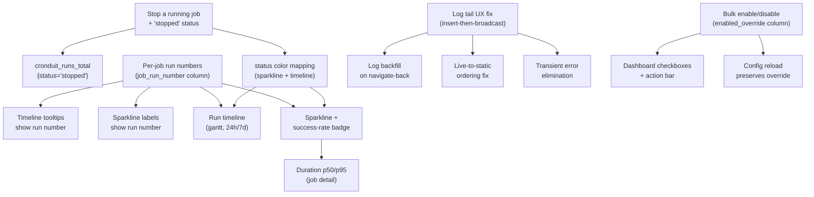

# Research Summary — Cronduit v1.1 "Operator Quality of Life"

**Project:** Cronduit
**Milestone:** v1.1 (subsequent milestone; v1.0.1 shipped 2026-04-14)
**Researched:** 2026-04-14
**Confidence:** HIGH

---

## Executive Summary

v1.1 is a polish-and-fix milestone layered on top of the fully-shipped v1.0.1 codebase. The research goal was not "what architecture should we build?" but "how do the nine target features slot into the existing modules, and where are the sharp edges?" Every feature has a confirmed home in the existing file tree; none require scheduler loop refactors or new runtime dependencies. The milestone is iteratively released via `v1.1.0-rc.1`, `v1.1.0-rc.2`, `v1.1.0-rc.3` — one rc per thematic block. The `:latest` GHCR tag stays on `v1.0.1` until the final `v1.1.0` tag.

The stack is essentially frozen. The only dependency change is bumping `rand` from `"0.8"` (stale by two major versions, no CVE) to `"0.9.x"` as hygiene, bundled with the `1.0.1 to 1.1.0` `Cargo.toml` version bump. All other crates in the v1.0.1 lockfile are either current or have no advisory against them. No new runtime crates are needed: gantt/sparkline visualization is hand-rolled inline SVG inside askama templates, percentile computation is a 20-line Rust helper, and SSE log-backfill is pure application code against the already-locked `axum`, `sqlx`, and `tokio::sync::broadcast` stack.

The primary risk in v1.1 is the "stop a running job" feature, which requires a per-run `RunControl` map in the scheduler that does not exist today. Pitfalls research found three places where the Architecture research doc contains factual errors that, if followed literally, would introduce regressions. Those corrections are mandatory reading before phase planning begins and are called out explicitly in the "Research-Phase Corrections" section below. Subject to those corrections, the research confidence is HIGH: every file path, line number, and integration boundary was verified by direct read of the v1.0.1 source tree.

---

## Key Findings

### Stack

**No new runtime dependencies.** The full locked stack from v1.0 applies unchanged. See `.planning/milestones/v1.0-research/STACK.md` for the authoritative crate table.

**One hygiene bump, one version bump:**

| Crate / File | From | To | Rationale | Risk |
|---|---|---|---|---|
| `rand` | `"0.8"` | `"0.9"` | Two majors stale; no CVE; polish milestone is the right place | LOW — handful of `rng.gen_range()` and `rng.fill_bytes()` call sites |
| `Cargo.toml version` | `1.0.1` | `1.1.0` | Match target milestone on non-tag commits; tag format: `v1.1.0-rc.N` | None |
| `tokio` (optional) | 1.51.1 | 1.52.0 | Released same day; routine patch | Optional — not required |
| `axum` (optional) | 0.8.8 | 0.8.9 | Released same day; bugfix only | Optional — not required |

**One portability pattern decision:** SQLite does not expose `percentile_cont` in standard `sqlx-sqlite` builds (requires `-DSQLITE_ENABLE_PERCENTILE` at compile time, not enabled by any sqlx feature flag). The correct pattern is to compute p50/p95 in Rust after fetching the last 100 `duration_ms` values from SQL. Both STACK and ARCHITECTURE research independently confirmed this is the only viable cross-backend path.

**Optional CI addition:** `cargo-deny` was not added to CI in v1.0. v1.1 is a reasonable place to add it as a non-blocking CI job. Roadmapper decision whether to include in scope.

---

### Features

**Feature calibration against peer tools (Cronicle, Rundeck, Jenkins, GitHub Actions, Airflow, Buildkite, Hangfire, Nomad, dkron):**

| Feature | Category | Peer precedent | Cronduit approach | Complexity |
|---|---|---|---|---|
| Stop a running job | Table stakes | Every peer except dkron ships it. Jenkins/Rundeck/Cronicle use SIGTERM to SIGKILL escalation; GHA uses `cancelled`; Hangfire has a documented "stop does nothing" bug. | Single hard kill (`SIGKILL` / `docker kill -s KILL`). New `stopped` status distinct from `cancelled`. | M |
| Per-job run numbers | Table stakes | GHA `run_number`, Buildkite `build.number` are per-pipeline/job. General schedulers use global IDs only. | `job_run_number` column, sequential per job, backfilled on upgrade. Display only; URLs stay on global `id`. | S-M |
| Log backfill on navigate-back | Table stakes | Kubernetes Dashboard, Jenkins console, `kubectl logs -f` all do snapshot-then-follow. "Empty page" is universally a bug. | Server renders DB rows at request time; SSE connects with `?after=<last_id>` cursor. Ordering by `id` not timestamp. | M |
| Log ordering across live to static | Table stakes | Every peer that ships live log tail has hit and fixed this bug class. | Id-based dedupe: SSE events with `id <= max_backfill_id` are dropped client-side. | M |
| Transient "error getting logs" | Table stakes | TOCTOU on Run Now then navigate race; standard fix is insert-on-API-thread. | Insert `job_runs` row on API handler thread before returning; pass `run_id` in `SchedulerCmd::RunNow`. | S |
| Run timeline (gantt, 24h/7d) | Differentiator | Airflow/Jenkins/Nomad all have per-DAG gantt, but no peer ships a cross-job timeline on the main dashboard. | New `/timeline` page. Inline SVG, server-rendered, HTMX-polled. Two preset windows (24h/7d toggle). | M |
| Success-rate badge + sparkline | Table stakes (rate) / Differentiator (sparkline) | GHA/Jenkins/Airflow all show success signals. Sparkline columns match Buildkite status dots. | Last-20-run column sparkline + integer rate badge. Minimum N=5 threshold. `stopped` runs excluded from denominator. | S |
| Duration trend p50/p95 | Differentiator | No peer scheduler surfaces duration percentiles inline — they point to Prometheus/Grafana. | Two numbers on job detail header: `p50: 1m34s` and `p95: 2m12s`. Rust-side computation. Min N=20/50. Last 100 successful runs. | S |
| Bulk enable/disable | Differentiator | Airflow pause/unpause (closest peer) stores override in metadata DB, survives DAG file re-parses. No direct-peer cron scheduler solves this cleanly. | New `enabled_override` nullable column. Config sync preserves override; reload does not reset it. | M-H |
| Docker healthcheck fix | Bug fix | Operator report: `(unhealthy)` on `docker ps` while `/health` returns 200. | `cronduit health` CLI subcommand + `HEALTHCHECK CMD ["/cronduit", "health"]` in Dockerfile. | S |

**Anti-features explicitly deferred:**

- Graceful SIGTERM to SIGKILL ladder for Stop (v1.2 additive; new `stop_grace_period` job field)
- Full web UI job editor (violates config-is-source-of-truth; permanent no)
- Authentication gating the Stop button (v1 assumes loopback/LAN; document in THREAT_MODEL.md instead)
- Webhook/chain notification on stop (v1.2 webhooks will include `stopped` as a transition)
- Live web terminal / `docker exec` (auth + security boundary; permanent no for v1.x)
- Export run history as CSV/JSON (low value; better served by direct SQLite queries)

---

### Architecture Integration Map

v1.1 is additive to the shipped architecture. No scheduler loop refactor, no pool split change, no new templating library. The one structural addition is `src/scheduler/control.rs` carrying the `RunControl`/`StopReason` types and the `running_handles: HashMap<i64, RunControl>` map that enables Stop.

**Per-feature integration surface (verified against v1.0.1 source):**

| Feature | Primary files touched | New files | Complexity |
|---|---|---|---|
| Stop a running job | `cmd.rs`, `mod.rs` (new map + arm), `run.rs`, `command.rs`, `docker.rs`, `api.rs`, `web/mod.rs`, templates | `src/scheduler/control.rs` (~60 LOC) | L |
| Per-job run numbers | `migrations/{sqlite,postgres}` (3 new per backend), `queries.rs::insert_running_run`, `DbRun`/`DbRunDetail`, `run_detail.html`, `run_history.html` | Migration files + `jobs.next_run_number` column | M |
| Log backfill + ordering | `log_pipeline.rs` (add `id` to `LogLine`), `queries.rs::insert_log_batch` (add RETURNING), `run.rs::log_writer_task` (order flip), `run_detail.rs`, `sse.rs`, `run_detail.html` | — | M |
| Docker healthcheck | `src/cli/health.rs`, `src/cli/mod.rs`, `Dockerfile`, `examples/docker-compose*.yml` | `src/cli/health.rs` (~60 LOC) | S |
| Duration p50/p95 | `queries.rs` (new `get_recent_durations`), `job_detail.rs`, `job_detail.html` | `src/web/stats.rs` (~40 LOC with tests) | S |
| Sparkline + success rate | `queries.rs` (new `get_dashboard_job_sparks`), `dashboard.rs::to_view`, `partials/job_table.html` | — | S |
| Run timeline | `queries.rs` (new `get_timeline_runs`), `web/mod.rs::router`, `handlers/mod.rs` | `src/web/handlers/timeline.rs` (~120 LOC), `templates/pages/timeline.html` (~80 LOC) | M |
| Bulk enable/disable | `migrations/{sqlite,postgres}` (1 new per backend), `queries.rs` (4 modified + 1 new), `api.rs`, `web/mod.rs::router`, `dashboard.html`, `job_table.html` | — | M-H |

**Feature dependency graph:**

**Strict dependency ordering:**

1. `RunNum` must land before `Timeline` and `Sparkline` — otherwise those views render the global id and require template rewrites later.
2. `LogFix` (insert-then-broadcast inversion) must land before `Backfill` — backfill depends on `LogLine.id` being populated.
3. `Stop` must land before `Sparkline` and `Timeline` — the `stopped` status needs a color token before it can render.
4. All rc.2 features are independent of each other (any internal order works within the block).
5. `BulkToggle` lands last (highest regression risk on the most-visible dashboard surface).

---

### Top 10 Pitfalls by Severity

All Critical items are grounded in direct source-code reads. Test-case identifiers (T-V11-*) are stable references for REQUIREMENTS.md.

**CRITICAL — must have passing tests before the feature ships:**

1. **Cancellation-token identity collision (T-V11-STOP-01, -02, -03)**
   `CancellationToken` carries no payload. A naive `SchedulerCmd::Stop` that cancels a per-run child token produces `status="cancelled"` in the DB — indistinguishable from a graceful-shutdown termination. Prevention: per-run `Arc<AtomicU8> stop_reason` field in `RunControl`, set by the scheduler loop before calling `.cancel()`. Executor reads the atomic after `cancel.cancelled()` fires and returns `RunStatus::Stopped` or `RunStatus::Shutdown` accordingly.

2. **Stop-vs-natural-completion race (T-V11-STOP-04, -05, -06)**
   A `SchedulerCmd::Stop { run_id: 42 }` racing a `JoinNext` success for the same run can overwrite a successful DB row to `stopped`. Prevention: `running_handles` map is the single authority — Stop handler only acts if the entry is present; DB write is exclusively the executor cancel branch; `join_set.join_next()` removes the entry atomically before control returns to the scheduler loop.

3. **`kill_on_drop(true)` is a regression — do NOT adopt it (T-V11-STOP-07, -08)**
   See "Research-Phase Corrections" below. The shipped executors already use `.process_group(0)` plus `libc::kill(-pid, SIGKILL)`, which kills all grandchildren of a shell pipeline. `kill_on_drop(true)` only kills the direct child and leaves grandchildren as orphans. Do not replace the existing pattern.

4. **Broadcast-before-insert blocks id-based dedupe (T-V11-LOG-01, -02)**
   See "Research-Phase Corrections" below. `log_writer_task` broadcasts before inserting. ARCHITECTURE's plan to add `id: Option<i64>` to `LogLine` requires inverting this order. Phase plan must choose Option A (insert-then-broadcast) or Option B (monotonic `seq` field) before implementation.

5. **Live-to-static swap produces duplicate trailing lines (T-V11-LOG-03, -04)**
   Buffered SSE frames arrive after the static partial swaps in, duplicating the last N lines. Prevention: id-based dedupe — `data-max-id` on the static partial container; SSE listener drops events with `id <= max_backfill_id`.

6. **TOCTOU "error getting logs" root cause (T-V11-LOG-08, -09)**
   The scheduler inserts the `job_runs` row asynchronously after the API handler returns. A fast click-through to the run detail can 404. Prevention: insert the `running` row on the API handler thread before returning; pass `run_id` in `SchedulerCmd::RunNow`.

7. **Three-step migration split is mandatory (T-V11-RUNNUM-01, -02, -03)**
   Combining "add column + backfill + NOT NULL" in one migration creates unrecoverable partial states on crash. Must be three separate migration files: (0) add nullable column, (1) idempotent backfill, (2) NOT NULL constraint. SQLite's NOT NULL step requires the 12-step table-rewrite pattern.

8. **SQLite `ALTER TABLE SET NOT NULL` does not exist (T-V11-RUNNUM-04, -05, -06)**
   The NOT NULL migration for SQLite must use `PRAGMA foreign_keys=OFF; CREATE new table; INSERT SELECT; DROP old; RENAME; recreate indexes`. Missing index recreation silently regresses dashboard query performance.

9. **Long backfill migration vs Docker healthcheck timeout (T-V11-RUNNUM-07, -08, -09)**
   On a homelab SQLite with 2M rows, the `ROW_NUMBER() OVER (PARTITION BY job_id)` backfill can take 30+ seconds. Docker's default `start-period=0s` marks the container `(unhealthy)` before the HTTP server starts. Prevention: `--start-period=60s` in Dockerfile HEALTHCHECK; chunk the backfill in 10k-row batches; log progress at INFO level.

10. **N+1 query on timeline handler (T-V11-TIME-01, -02)**
    A naive per-job loop for the gantt view makes 50+ round-trips for a typical homelab. Prevention: single `JOIN` query with a hard `LIMIT 10000`; verify `EXPLAIN QUERY PLAN` uses `idx_job_runs_start_time`.

**Additional CRITICAL items by feature (for REQUIREMENTS.md reference):**

- T-V11-SPARK-01 through -04: Minimum sample threshold (N<5 renders dash); zero-run job must not crash
- T-V11-BACK-01, -02: Gap detection between backfill snapshot and SSE subscribe; gap-fill via `?after=` partial refetch
- T-V11-DUR-01 through -04: `percentile()` helper edge cases (empty, single-element, rounding convention)
- T-V11-RUNNUM-10 through -13: Startup ordering invariant, counter column backfill correctness, URL stability on global `id`
- T-V11-BULK-01: `upsert_job` must NOT touch `enabled_override` in its `ON CONFLICT DO UPDATE` SET clause

---

## Research-Phase Corrections

**The following four findings from PITFALLS.md contradict claims in ARCHITECTURE.md or FEATURES.md and must supersede them. Downstream consumers (REQUIREMENTS.md, phase plans) must use the corrected view.**

### Correction 1 — Do NOT adopt `kill_on_drop(true)` for command/script executors

**Stale claim (FEATURES.md acceptance criterion for Stop):** "the spawned process is killed via the existing tokio cancellation token + `kill_on_drop(true)` pattern."

**Corrected fact:** The shipped `command.rs` (L203) and `script.rs` (L89) both use `.process_group(0)` at spawn time and `libc::kill(-pid, SIGKILL)` for process-group kill. This kills all grandchildren of a shell pipeline. `kill_on_drop(true)` only kills the direct child, leaving grandchildren as orphans adopted by PID 1. The Stop feature must wire into the existing process-group kill path, not replace it.

**Action for phase plan:** The Stop feature acceptance criterion must reference the existing process-group kill pattern. No changes to `command.rs` or `script.rs` spawn configuration.

### Correction 2 — Log writer broadcasts BEFORE DB insert; ordering inversion is required

**Stale assumption (ARCHITECTURE.md §3.3):** Presents adding `id: Option<i64>` to `LogLine` as straightforward, implying the DB id is available at broadcast time.

**Corrected fact:** `log_writer_task` in `run.rs` L334-341 broadcasts first, then inserts. No DB id exists at broadcast time. The Architecture plan requires reversing this order. This is a design decision the phase plan must close:

- **Option A (recommended):** Insert-then-broadcast; `insert_log_batch` returns `Vec<i64>` ids via `RETURNING`; broadcast lines carry the assigned id. Include T-V11-LOG-02 latency test (p95 insert latency must stay under 50ms for 64-line batches on SQLite).
- **Option B:** Add monotonic `seq: u64` to `LogLine` at write time; DB stores `seq`; dedupe by `seq` not DB id. Schema change but no ordering flip and no latency risk.

**Action for phase plan:** Pick Option A or B before writing the log-backfill plan.

### Correction 3 — Dockerfile has NO HEALTHCHECK today; fix rationale shifts

**Stale framing (ARCHITECTURE.md §3.8):** Frames the issue as "operator's compose file uses a bad wget healthcheck."

**Corrected framing:** Neither the shipped `Dockerfile` nor `examples/docker-compose.yml` contain a `HEALTHCHECK` directive today. The `(unhealthy)` report comes from an operator who wrote their own `healthcheck` stanza using busybox `wget --spider`, which misparses chunked axum responses. Cronduit ships no authoritative healthcheck, leaving operators to improvise badly.

The fix closes the entire category: `cronduit health` CLI subcommand + `HEALTHCHECK CMD ["/cronduit", "health"]` in the Dockerfile. Operators with custom stanzas keep them (compose overrides win over Dockerfile).

**Action for phase plan:** rc.1 scope must include both the Dockerfile HEALTHCHECK directive and the CLI subcommand. They ship together.

### Correction 4 — `mark_run_orphaned` already has the `WHERE status = 'running'` guard

**Stale concern (ARCHITECTURE.md §5.5):** Frames orphan reconciliation vs `stopped` status as an open design question.

**Corrected fact:** `docker_orphan.rs::mark_run_orphaned` L120/L131 already includes `AND status = 'running'` in its WHERE clause. A row finalized to `stopped` will not be overwritten. This is already correct. The only action needed is a test lock (T-V11-STOP-12, -13, -14) to prevent future refactors from dropping the guard.

**Action for phase plan:** No design work needed. Add the three test cases to the Stop feature test plan.

---

## Implications for Roadmap

### rc.1 — Bug-Fix Block

**Rationale:** Ships the features operators are waiting for (stop, log UX). Establishes the `stopped` status and `job_run_number` column that observability features depend on. Stop is the highest-risk spike and gets maximum stabilization time. Internal order within rc.1: Stop spike first (highest risk, fail fast), then run numbers (schema change, independent), then log fixes (requires the insert-then-broadcast decision), then healthcheck (small, independent, can land in parallel).

**Delivers:**
- Operator can kill any running job from the UI; `stopped` status visible everywhere status is shown
- Run history shows per-job numbering; existing rows backfilled on upgrade
- Log detail page shows accumulated lines on load, then attaches live SSE with no gap or duplicate
- `docker compose up` reports `healthy` using `cronduit health` subcommand
- `rand` bumped to 0.9; `Cargo.toml` bumped to 1.1.0

**Must avoid:** T-V11-STOP-01 (token collision), T-V11-STOP-04 (race), T-V11-STOP-07 (kill_on_drop regression), T-V11-RUNNUM-07 (long migration vs healthcheck), T-V11-LOG-01 (broadcast-before-insert blocks dedupe)

**Research flag:** No additional research phase needed. The Stop spike (validate `RunControl` + `StopReason` round-trip on all three executors before committing the full implementation) is the only uncertainty — plan it as a short spike task, not a full phase.

---

### rc.2 — Observability Polish

**Rationale:** All three features are visually independent, share the status color mapping established in rc.1, and benefit from `job_run_number` display (timeline tooltips, sparkline labels). No new schema migrations — additive queries only. Any internal order works; suggested sequence: p50/p95 (smallest, confirms `stats.rs` helper) then sparkline (new query CTE pattern) then timeline (largest; new handler + template + router entry).

**Delivers:**
- Per-job p50/p95 duration trend on the job detail page (Rust-side percentile computation, min N thresholds)
- 20-run column sparkline + success-rate badge on every dashboard card
- Cross-job run timeline (gantt-style 24h/7d) as a new `/timeline` page

**Must avoid:** T-V11-TIME-01 (N+1 query), T-V11-SPARK-01 (sample-size honesty), T-V11-DUR-01 (percentile helper edge cases), T-V11-TIME-04 (timezone consistency)

**Research flag:** No additional research phase needed. All patterns are established server-side SVG rendering.

---

### rc.3 — Ergonomics

**Rationale:** Bulk enable/disable is the highest regression risk in v1.1 — it touches `sync_config_to_db`, the most behavior-sensitive path in the scheduler, and adds the most visible UI change (checkboxes on dashboard). Ships last so rc.1 and rc.2 can be evaluated and released cleanly.

**Delivers:**
- Operator can multi-select jobs from the dashboard and bulk-disable them
- Disabled state persists in DB across config reloads (Airflow-style override model)
- Dashboard distinguishes "disabled by operator" from "disabled by config"

**Design locked:**
- `jobs.enabled_override INTEGER` nullable column (NULL = follow config, 0 = force disabled, 1 = force enabled)
- `upsert_job` does NOT touch `enabled_override` in ON CONFLICT clause (T-V11-BULK-01)
- `disable_missing_jobs` clears `enabled_override` when a job is removed from config
- After bulk toggle, API fires `SchedulerCmd::Reload` to rebuild scheduler heap
- Running jobs are not affected by bulk-disable; toast communicates this

**Must avoid:** T-V11-BULK-01 (override reset on reload — most dangerous regression)

**Research flag:** No additional research phase needed. Architecture resolution is justified by direct reading of `sync.rs` and `queries.rs`. Phase plan does not relitigate.

---

### Research Flags

**Phases that need a `/gsd-research-phase` call:** None. Every integration boundary is confirmed against the v1.0.1 source tree.

**Phases with standard patterns (skip additional research):**
- rc.2 observability: inline SVG rendering and p50/p95 computation are well-established patterns.
- rc.3 bulk toggle: the `enabled_override` design is resolved; implementation is mechanical.

**Validation steps needed during rc.1 (not a research phase — confirmation only):**
- Confirm `RunControl` + `StopReason::Operator` round-trip on all three executors before committing the full Stop implementation.
- Confirm T-V11-STOP-04 race is covered (stop-vs-natural-completion, 1000 iterations with `tokio::time::pause`).
- Reproduce the Docker healthcheck `(unhealthy)` failure in a test environment before declaring the fix done.

---

## Open Questions — Deferred to Phase Planning

1. **Insert-then-broadcast vs `seq` column (log backfill feature).** Option A (insert-then-broadcast with `RETURNING id`) vs Option B (monotonic `seq: u64` field). Option A is simpler; Option B avoids latency risk. Must pick before writing the log-backfill implementation plan. Include T-V11-LOG-02 latency benchmark if choosing Option A.

2. **`active_runs` map vs merged `running_handles` for Stop.** ARCHITECTURE §3.1 proposes a new `running_handles` map alongside the existing `active_runs`. Both could be merged into a single map carrying `RunEntry { broadcast_tx, control }` to reduce lock surface. Phase plan should decide the struct shape before implementation.

3. **Healthcheck root cause reproduction.** The busybox `wget --spider` + chunked axum response hypothesis is plausible but unconfirmed. Phase plan should include a reproduction step before marking the fix complete.

4. **Bulk-disable confirmation dialog.** Whether to show a confirmation modal before bulk-disabling jobs. Lean: no dialog in v1.1 (consistent with the no-confirmation design for Stop); the toast is sufficient. Roadmapper should document the decision.

---

## What NOT to Change During v1.1

1. Do not refactor the scheduler loop. Add the `Stop` match arm and `running_handles` map; do not split the loop into functions or restructure the `tokio::select!` arms.
2. Do not change the writer/reader pool split. Every v1.1 query uses the existing `PoolRef` pattern.
3. Do not add a new templating library. All new partials are askama templates extending `base.html`.
4. Do not introduce a metrics registry change. New label value `stopped` goes on the existing `cronduit_runs_total{status}` counter. Do NOT count `stopped` runs in `cronduit_run_failures_total` — that counter is for failure classification only.
5. Do not introduce a JS framework for timeline or sparkline. Plain inline HTML/CSS spans or SVG only. HTMX 2.0.4 is already vendored; do not upgrade to HTMX 4.x in v1.1 (4.x removes `sse-swap`, a breaking change for the SSE log pattern).
6. Do not change the config file schema. All new state lives in the DB (`job_run_number`, `enabled_override`).
7. Do not adopt `kill_on_drop(true)`. The existing `.process_group(0)` + `libc::kill(-pid, SIGKILL)` pattern is correct and handles shell pipeline grandchildren. (See Correction 1 above.)
8. Do not use SQL `percentile_cont`, even on Postgres. Structural parity constraint requires Rust-side computation via `src/web/stats.rs::percentile()`.
9. Do not rekey URLs by `job_run_number`. All routes use global `job_runs.id`. `job_run_number` is display-only. Breaking existing `/jobs/{job_id}/runs/{run_id}` links is not acceptable.

---

## Confidence Assessment

| Area | Confidence | Basis |
|---|---|---|
| Stack conclusions | HIGH | All crates verified against crates.io API 2026-04-14; `rand` staleness confirmed; no blocking CVEs |
| Feature calibration | HIGH | Peer tools verified against official docs and issue trackers (Jenkins, Rundeck, Cronicle, GHA, Airflow, Buildkite, Hangfire, Nomad, dkron) |
| Architecture integration map | HIGH | Every file path and line number verified by direct read of v1.0.1 source tree |
| Stop-a-job design | HIGH | Race analysis grounded in the actual `tokio::select!` loop structure and all three executor paths |
| Pitfalls and test case identifiers | HIGH | Every pitfall anchored to a specific file and line in the shipped source; three Architecture doc errors found and corrected |
| Log dedupe design (Option A vs B) | MEDIUM-HIGH | Both options are sound; the choice is a design preference, not a research gap |
| Timeline as separate page | MEDIUM | Design judgment; collapsible dashboard section is a reasonable alternative |
| Healthcheck root cause | MEDIUM | Busybox wget / chunked encoding hypothesis is plausible but not yet reproduced; fix path is sound regardless |

**Overall confidence: HIGH**

### Gaps to Address During Implementation

- Confirm Option A or B for log-line id before writing the log-backfill plan.
- Reproduce the `(unhealthy)` Docker state before marking healthcheck fix complete.
- Run the Stop spike (validate `RunControl` on all three executors) before committing full Stop implementation.

---

## Sources

### Primary — STACK.md
- crates.io API (2026-04-14) — version and advisory verification for all locked crates
- rustsec.org (2026-04-14) — no blocking CVEs in v1.0.1 lockfile
- sqlite.org/percentile.html — confirmed `SQLITE_ENABLE_PERCENTILE` compile-time gate; not enabled by sqlx-sqlite

### Primary — FEATURES.md
- Jenkins docs + javadoc.jenkins-ci.org — `ABORTED` status, escalation endpoints
- docs.rundeck.com/docs/manual/07-executions.html — `aborted` status; rundeck#1038, #2105, #3160
- Cronicle README + issues#248 — Abort semantics, child-process cleanup
- github.com/orgs/community/discussions/70540 — GHA `cancelled` conclusion
- Hangfire discuss.hangfire.io cancel thread; HangfireIO/Hangfire#1298 — "stop does nothing" bug
- airflow.apache.org/docs — pause/unpause model, status taxonomy, Gantt view
- dkron discussions/1261 — confirmed no kill command
- htmx.org/extensions/sse/ — `Last-Event-ID` behavior, 4.x migration note on `sse-swap` removal
- GitHub Actions workflow-syntax docs — `run_number` per-workflow scoping
- Buildkite Builds API docs — `build.number` per-pipeline
- Prometheus histogram best practices — p50/p95 minimum sample size conventions

### Primary — ARCHITECTURE.md + PITFALLS.md
- Direct reads of v1.0.1 source: `src/scheduler/mod.rs`, `cmd.rs`, `run.rs`, `command.rs`, `docker.rs`, `docker_orphan.rs`, `sync.rs`, `reload.rs`, `log_pipeline.rs`, `db/queries.rs`, `web/mod.rs`, all web handlers, `cli/run.rs`, both initial migration files, `Dockerfile`, `examples/docker-compose.yml`
- v1.0-research/PITFALLS.md — moby#8441 auto_remove race (do not re-introduce `auto_remove=true`)
- tokio docs — `CancellationToken` carries no payload; `JoinSet` semantics

---

*Research completed: 2026-04-14*
*Ready for roadmap: yes*
