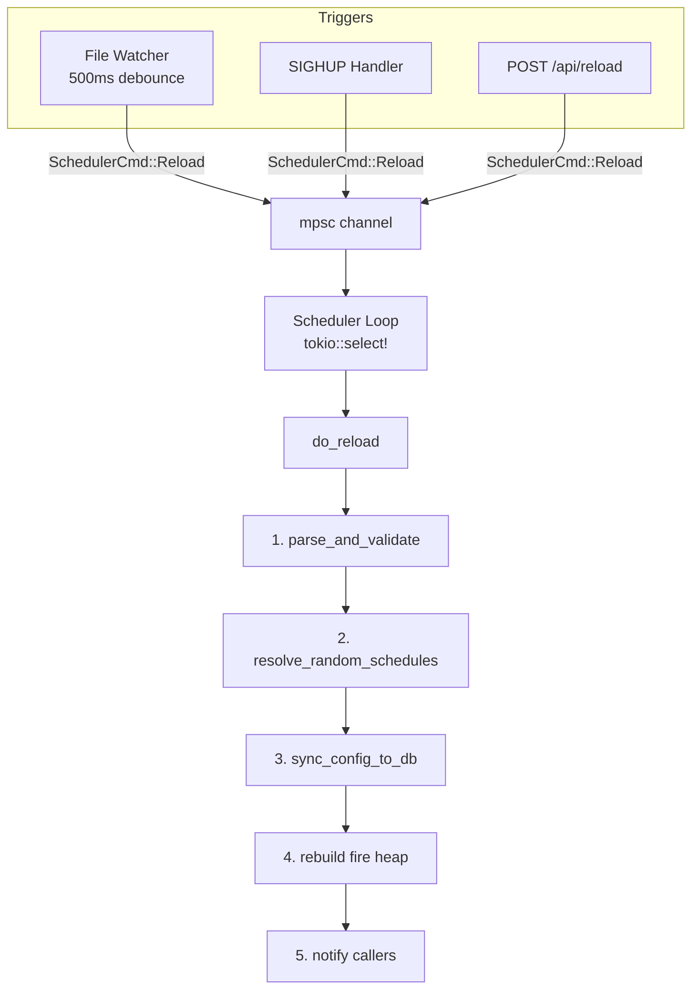

# Phase 5: Config Reload & `@random` Resolver - Research

**Researched:** 2026-04-11
**Domain:** Config hot-reload (SIGHUP / API / file-watch), `@random` cron resolution, UI surfaces
**Confidence:** HIGH

## Summary

Phase 5 adds three tightly coupled features: (1) production-grade config reload via three trigger sources funneling through a single `do_reload()` path, (2) the `@random` resolver that replaces `@random` tokens in cron fields with concrete values persisted to `jobs.resolved_schedule`, and (3) UI surfaces (toasts, badges, settings page updates) that make these features visible. All three share the reload lifecycle -- a reload parses new config, resolves `@random` fields, diffs against the DB, and atomically updates the scheduler's in-memory state.

The codebase is well-prepared for this phase. The scheduler already has a `SchedulerCmd` enum (with a comment about Phase 5 `Reload`), the sync engine has a placeholder at `sync.rs:96` for `@random` resolution, the settings page has a hardcoded `"never"` for last reload, and the `CronPattern` API in `croner` 3.0 exposes public `CronComponent` fields (`minutes`, `hours`, `days`, `months`, `days_of_week`) with `min`/`max` ranges -- exactly what we need to pick random values within valid ranges.

**Primary recommendation:** Implement in three layers: (a) `@random` resolver module with slot-based gap enforcement, (b) `do_reload()` function shared by all three triggers, (c) UI surfaces (toast, badge, settings, re-roll). The `notify` crate 8.2.0 with `notify-debouncer-mini` 0.4 handles file watching; tokio handles SIGHUP; the existing `SchedulerCmd` channel handles routing.

<user_constraints>
## User Constraints (from CONTEXT.md)

### Locked Decisions
- **D-01:** Successful reload shows an HTMX toast notification with a diff summary ("Config reloaded: 2 jobs added, 1 updated, 1 disabled"). Toast auto-dismisses after 5s. Settings page updates to show last reload timestamp and summary.
- **D-02:** Failed reload (parse error, invalid TOML) shows a red error toast with parse error summary ("Reload failed: invalid TOML at line 42"). Error toasts persist until dismissed (no auto-dismiss). Full error in structured log. Settings page shows last failed attempt.
- **D-03:** `POST /api/reload` response includes full diff summary: `{"status": "ok", "added": 2, "updated": 1, "disabled": 1, "unchanged": 5}`. On failure: `{"status": "error", "message": "..."}`.
- **D-04:** `@random` schedules are resolved only at sync time (startup or config reload). No daily re-roll. Once resolved, the value stays fixed until the next restart or config reload.
- **D-05:** If a job's raw `schedule` field is unchanged across a reload (same `config_hash`), its `resolved_schedule` is preserved from the DB. Re-randomization only happens when the schedule field changes, the job is newly added, or explicitly re-rolled via API/UI.
- **D-06:** Operators can force re-randomization of a specific job via `POST /api/jobs/{id}/reroll` endpoint AND a "Re-roll" button on the Job Detail page. Clears and re-resolves without editing config.
- **D-07:** Job Detail page shows raw and resolved schedule inline: "Schedule: `@random 14 * * *` (resolved to `14 17 * * *`)". Resolved value in parentheses or muted secondary style.
- **D-08:** Dashboard job list shows a small `@random` badge/pill next to the schedule column in the terminal-green accent color. Subtle but scannable at a glance.
- **D-09:** All three trigger sources (file watcher, SIGHUP, API) send through the same `SchedulerCmd` channel. File watcher has a 500ms debounce. SIGHUP and API execute immediately, but if a reload is already in-flight, the new request waits for completion then checks if another reload is needed (coalesce, not reject).
- **D-10:** File watcher is enabled by default. Operators can disable with `[server].watch_config = false`. Logs a startup message: "Watching cronduit.toml for changes".

### Claude's Discretion
- Exact debounce implementation (tokio::time::sleep vs notify's built-in debounce)
- Internal locking mechanism for reload serialization
- Slot algorithm implementation details for `random_min_gap` enforcement
- Re-roll button placement and styling on Job Detail page
- Toast animation and positioning (consistent with existing "Run Now" toast from Phase 3)

### Deferred Ideas (OUT OF SCOPE)
None -- discussion stayed within phase scope.
</user_constraints>

<phase_requirements>
## Phase Requirements

| ID | Description | Research Support |
|----|-------------|------------------|
| RELOAD-01 | SIGHUP triggers config reload without restart | Signal handling pattern in `shutdown.rs`; add SIGHUP listener that sends `SchedulerCmd::Reload` |
| RELOAD-02 | `POST /api/reload` triggers config reload | Follow existing `run_now()` handler pattern with CSRF + channel command + JSON response |
| RELOAD-03 | File watcher (`notify`) with 500ms debounce | `notify` 8.2.0 + `notify-debouncer-mini` 0.4; spawn watcher task that sends `SchedulerCmd::Reload` |
| RELOAD-04 | Failed reload leaves running config untouched, surfaces error | `parse_and_validate()` already returns `Result<_, Vec<ConfigError>>`; wrap in staging pattern |
| RELOAD-05 | Successful reload diffs via `config_hash`, creates/updates/disables | Existing `sync_config_to_db()` already implements this; enhance to return diff summary |
| RELOAD-06 | In-flight runs not cancelled on reload | Scheduler loop replaces `self.jobs` map and rebuilds heap; `JoinSet` tasks hold their own `DbJob` clone |
| RELOAD-07 | Removed jobs marked `enabled=0` | Already implemented in `disable_missing_jobs()` |
| RAND-01 | `@random` fields resolved at sync time, persisted to `resolved_schedule` | Parse `@random` token in cron field, pick random value from `CronComponent.min..=max`, build concrete cron string |
| RAND-02 | Resolved schedule stable across restarts when raw schedule unchanged | `sync_config_to_db()` skips when `config_hash` matches; `resolved_schedule` preserved in DB |
| RAND-03 | Re-randomization only on schedule change, new job, or explicit request | `config_hash` includes `schedule` field; hash change triggers new resolution |
| RAND-04 | `random_min_gap` enforced via slot-based algorithm | Slot allocation algorithm with retry; see Architecture Patterns below |
| RAND-05 | Infeasible gap logs WARN, relaxes gap, continues booting | Feasibility check: `num_random_jobs * gap > 24h` triggers relaxation |
| RAND-06 | UI shows raw + resolved schedule, `@random` badge on dashboard | Existing template already has `resolved_schedule != schedule` conditional; add badge markup |
</phase_requirements>

## Project Constraints (from CLAUDE.md)

- **Tech stack**: Rust backend, `bollard` for Docker API, no CLI shelling
- **Persistence**: `sqlx` with SQLite default, PostgreSQL optional, separate read/write pools
- **Frontend**: Tailwind CSS + server-rendered HTML via `askama_web` 0.15 with `axum-0.8` feature, HTMX-style live updates
- **Config format**: TOML only
- **Cron crate**: `croner` 3.0
- **TLS**: rustls everywhere
- **Workflow**: All changes via PR on feature branch, no direct commits to `main`
- **Diagrams**: Mermaid only, no ASCII art
- **Security**: CSRF on all state-changing endpoints, `SecretString` for secrets

## Standard Stack

### Core (Phase 5 additions)
| Library | Version | Purpose | Why Standard | Confidence |
|---------|---------|---------|--------------|------------|
| `notify` | 8.2.0 | File system watching | De facto Rust filesystem notification library; 14M+ downloads; cross-platform | HIGH |
| `notify-debouncer-mini` | 0.4 | Debounced events | Official companion crate; collapses rapid FS events into single notification per file per window | HIGH |
| `rand` | 0.8 | Random value generation | Already in Cargo.toml for CSRF; reuse for `@random` resolution | HIGH |
| `tokio::sync::Mutex` | (in tokio 1.51) | Reload serialization | Already a dependency; async-aware Mutex for coalescing concurrent reload requests | HIGH |
| `tokio::signal::unix` | (in tokio 1.51) | SIGHUP handling | Already used in `shutdown.rs` for SIGTERM; same pattern for SIGHUP | HIGH |

[VERIFIED: crates.io API] `notify` 8.2.0 is latest stable (2025-08-03). 9.0.0-rc.2 exists but is pre-release.
[VERIFIED: crates.io API] `notify-debouncer-mini` depends on `notify` 8.x.
[VERIFIED: Cargo.toml] `rand` 0.8 and `tokio` 1.51 already in dependencies.

### Installation
```bash
cargo add notify@8.2 notify-debouncer-mini@0.4
```

## Architecture Patterns

### Reload Data Flow



### Pattern 1: Reload Command with Response Channel
**What:** Extend `SchedulerCmd::Reload` to carry a `oneshot::Sender<ReloadResult>` so the API handler can await the result and return a JSON diff summary.
**When to use:** For `POST /api/reload` which needs synchronous feedback.
**Example:**
```rust
// Source: Existing cmd.rs pattern + D-03
pub enum SchedulerCmd {
    RunNow { job_id: i64 },
    Reload {
        response_tx: tokio::sync::oneshot::Sender<ReloadResult>,
    },
    Reroll {
        job_id: i64,
        response_tx: tokio::sync::oneshot::Sender<ReloadResult>,
    },
}

pub struct ReloadResult {
    pub status: ReloadStatus,
    pub added: u64,
    pub updated: u64,
    pub disabled: u64,
    pub unchanged: u64,
    pub error_message: Option<String>,
}

pub enum ReloadStatus { Ok, Error }
```
[VERIFIED: codebase] `cmd.rs` already has a comment: "Phase 5 will add: Reload { response_tx: oneshot::Sender<Result<(), String>> }"

### Pattern 2: `@random` Resolution Algorithm
**What:** Parse the schedule string for `@random` tokens, replace each with a random concrete value, enforce `random_min_gap` via slot allocation.
**When to use:** During `sync_config_to_db()` at the placeholder on line 96 of `sync.rs`.
**Example:**
```rust
// Source: croner 3.0 CronPattern API (verified in source)
/// Resolve `@random` tokens in a cron schedule string.
///
/// Input:  "@random 14 * * *"  (minute is @random, hour is 14)
/// Output: "42 14 * * *"       (minute resolved to random 0-59)
///
/// The CronComponent for each field has public `min` and `max` fields,
/// so we know the valid range for random value generation.
fn resolve_random_fields(
    raw_schedule: &str,
    existing_resolved: Option<&str>,
    allocated_slots: &mut Vec<ResolvedSlot>,
    min_gap: Duration,
    rng: &mut impl Rng,
) -> String {
    let fields: Vec<&str> = raw_schedule.split_whitespace().collect();
    // For each field that is "@random", pick a random value
    // within the valid range for that position.
    // minutes: 0-59, hours: 0-23, dom: 1-31, month: 1-12, dow: 0-7
    // ...
}
```
[VERIFIED: croner source] `CronPattern` fields are public: `seconds`, `minutes`, `hours`, `days`, `months`, `days_of_week`, each a `CronComponent` with `pub min: u16` and `pub max: u16`.

### Pattern 3: Slot-Based `random_min_gap` Enforcement (RAND-04, RAND-05)
**What:** When multiple jobs use `@random` with overlapping time fields, enforce minimum spacing between their resolved fire times on the same day. Use a slot-based greedy algorithm.
**When to use:** During batch resolution of all `@random` jobs at sync time.
**Algorithm:**
1. Collect all jobs with `@random` in their schedule.
2. Sort by constraint severity (more constrained fields first -- e.g., `@random 14 * * *` is more constrained than `@random @random * * *`).
3. For each job, generate a candidate value, check against existing allocated slots for `random_min_gap` compliance.
4. Retry up to N times (e.g., 100) with different random values.
5. If all retries fail, log WARN and accept best candidate (one with maximum minimum distance to neighbors).
6. Feasibility pre-check: if `num_random_jobs * min_gap_minutes > available_minutes`, log WARN and calculate a relaxed gap for overflow jobs.

### Pattern 4: Reload Serialization (D-09)
**What:** Use a `tokio::sync::Mutex<()>` (or `Semaphore(1)`) to ensure only one reload executes at a time. Concurrent requests coalesce -- a waiting request checks if a new reload is needed after the current one completes.
**When to use:** Inside the scheduler's `Reload` command handler.
**Example:**
```rust
// In the scheduler loop's Reload branch:
// Use an AtomicBool or generation counter to track pending reloads.
// After do_reload() completes, check if another reload was requested
// during execution. If so, run again. Otherwise, done.
```
[ASSUMED] Coalescing pattern is standard for file-watch debounce + concurrent triggers.

### Pattern 5: File Watcher Task
**What:** Spawn a dedicated tokio task that runs `notify-debouncer-mini` watching the config file path, forwarding events as `SchedulerCmd::Reload`.
**When to use:** At startup if `watch_config` is true (default).
**Example:**
```rust
// Source: notify-debouncer-mini docs
use notify_debouncer_mini::{new_debouncer, notify::RecursiveMode};
use std::time::Duration;

fn spawn_file_watcher(
    config_path: PathBuf,
    cmd_tx: mpsc::Sender<SchedulerCmd>,
) -> anyhow::Result<()> {
    let (tx, rx) = std::sync::mpsc::channel();
    let mut debouncer = new_debouncer(Duration::from_millis(500), tx)?;
    debouncer.watcher().watch(&config_path, RecursiveMode::NonRecursive)?;

    tokio::spawn(async move {
        // Keep debouncer alive in this task
        let _debouncer = debouncer;
        loop {
            // notify-debouncer-mini uses std::sync::mpsc, so use
            // tokio::task::spawn_blocking or a polling approach
            match tokio::task::spawn_blocking({
                let rx = /* clone or share */;
                move || rx.recv()
            }).await {
                Ok(Ok(events)) => {
                    let (resp_tx, _) = tokio::sync::oneshot::channel();
                    let _ = cmd_tx.send(SchedulerCmd::Reload { response_tx: resp_tx }).await;
                }
                _ => break,
            }
        }
    });
    Ok(())
}
```
[VERIFIED: notify-debouncer-mini docs] Uses `std::sync::mpsc` channel, needs bridging to tokio.

**Important note:** `notify-debouncer-mini` uses `std::sync::mpsc`, not `tokio::sync::mpsc`. The watcher task must bridge between the two -- either via `spawn_blocking` for `recv()` or by using `notify` directly with a custom event handler that sends to a `tokio::sync::mpsc` channel. The latter is cleaner:

```rust
// Alternative: use notify directly with tokio channel
use notify::{Watcher, RecommendedWatcher, Config as NotifyConfig};

let (notify_tx, mut notify_rx) = tokio::sync::mpsc::channel(16);
let mut watcher = RecommendedWatcher::new(
    move |res| { let _ = notify_tx.blocking_send(res); },
    NotifyConfig::default(),
)?;
watcher.watch(&config_path, RecursiveMode::NonRecursive)?;

// Then debounce manually with tokio::time::sleep in the receiving task
tokio::spawn(async move {
    let _watcher = watcher; // keep alive
    let mut pending = false;
    loop {
        tokio::select! {
            Some(_event) = notify_rx.recv() => {
                pending = true;
                // Reset debounce timer
            }
            _ = tokio::time::sleep(Duration::from_millis(500)), if pending => {
                pending = false;
                let (resp_tx, _) = oneshot::channel();
                let _ = cmd_tx.send(SchedulerCmd::Reload { response_tx: resp_tx }).await;
            }
        }
    }
});
```
[ASSUMED] Manual debounce with `tokio::time::sleep` is simpler and avoids the std/tokio channel bridging complexity.

### Pattern 6: SIGHUP Handler
**What:** Extend `shutdown.rs` to listen for SIGHUP and send `SchedulerCmd::Reload`.
**Example:**
```rust
// Source: existing shutdown.rs pattern
#[cfg(unix)]
pub fn install_sighup(cmd_tx: mpsc::Sender<SchedulerCmd>) {
    tokio::spawn(async move {
        let mut sig = signal::unix::signal(signal::unix::SignalKind::hangup())
            .expect("install SIGHUP handler");
        loop {
            sig.recv().await;
            tracing::info!(target: "cronduit.reload", "SIGHUP received, triggering reload");
            let (resp_tx, _) = oneshot::channel();
            if cmd_tx.send(SchedulerCmd::Reload { response_tx: resp_tx }).await.is_err() {
                break; // channel closed, scheduler shutting down
            }
        }
    });
}
```
[VERIFIED: codebase] `shutdown.rs` already uses `signal::unix::signal(SignalKind::terminate())`.

### Recommended Module Structure
```
src/
  scheduler/
    mod.rs          # Add Reload branch to tokio::select! loop
    cmd.rs          # Add Reload + Reroll variants
    sync.rs         # Enhance to call @random resolver
    random.rs       # NEW: @random resolution + slot algorithm
    reload.rs       # NEW: do_reload() function, file watcher spawn
  config/
    mod.rs          # Add watch_config field to ServerConfig
  shutdown.rs       # Add SIGHUP handler
  web/
    mod.rs          # Add reload + reroll routes
    handlers/
      api.rs        # Add reload() and reroll() handlers
      settings.rs   # Replace "never" with real reload tracking
      job_detail.rs # Add re-roll button, enhance @random display
      dashboard.rs  # Add @random badge to job list
```

### Anti-Patterns to Avoid
- **Rebuilding the entire scheduler on reload:** Only update `self.jobs` HashMap and rebuild the fire heap. Never restart the scheduler task or drop the `JoinSet` -- in-flight runs must continue.
- **Parsing cron expressions to detect `@random`:** Use simple string matching (`field == "@random"`) on the split schedule string. Do not parse through `croner` until after resolution.
- **Holding a lock across async I/O during reload:** The reload serialization Mutex should gate only the reload logic, not the file read or DB writes. Use a short critical section.
- **Using `notify-debouncer-full` instead of `mini`:** The `full` variant tracks file metadata and is heavier. We only need "file changed" events for a single config file -- `mini` is sufficient.

## Don't Hand-Roll

| Problem | Don't Build | Use Instead | Why |
|---------|-------------|-------------|-----|
| File system watching | Custom inotify/kqueue wrapper | `notify` 8.2.0 | Cross-platform (Linux inotify, macOS FSEvents, Windows ReadDirectoryChangesW), handles all edge cases |
| Event debouncing | Custom timer + event buffer | `tokio::time::sleep` debounce loop (or `notify-debouncer-mini`) | Editor save patterns (write-then-rename) generate multiple events; debouncing is subtle |
| Signal handling | `libc::signal` raw bindings | `tokio::signal::unix` | Async-safe, integrates with tokio reactor |
| Random number generation | Custom PRNG or timestamp-based | `rand` 0.8 `thread_rng()` | Cryptographic quality not needed but uniformity matters for gap distribution |
| Cron field range detection | Hardcoded range tables | `croner::CronComponent.min`/`.max` | Source of truth for valid ranges per field position |

**Key insight:** The `@random` resolver is the only genuinely novel code in this phase. Everything else (file watching, signal handling, reload diffing) is composition of existing patterns and libraries.

## Common Pitfalls

### Pitfall 1: Editor Atomic Save Generates Multiple FS Events
**What goes wrong:** Editors like vim/nano write to a temp file then rename, generating DELETE + CREATE (not MODIFY) events. Some editors (VSCode) also create backup files.
**Why it happens:** Atomic save ensures file is never partially written.
**How to avoid:** The 500ms debounce window (D-09) absorbs this. Watch the parent directory if the file path changes inode (rename). `notify` handles this correctly with `RecursiveMode::NonRecursive` on the file.
**Warning signs:** Reload triggers twice in quick succession, or not at all after a save.
[VERIFIED: notify crate documentation] This is a known pattern.

### Pitfall 2: `@random` Resolution Ordering Affects Gap Enforcement
**What goes wrong:** If jobs are resolved in arbitrary order, the first job gets ideal placement while later jobs are squeezed.
**Why it happens:** Greedy allocation without considering global optimality.
**How to avoid:** Sort jobs by constraint severity before allocation. More constrained jobs (fewer `@random` fields, narrower ranges) get allocated first.
**Warning signs:** Last few jobs always get WARNs about relaxed gaps.

### Pitfall 3: Config Hash Must Include Schedule Field for `@random` Stability
**What goes wrong:** If `config_hash` doesn't include the `schedule` field, changing `@random 14 * * *` to `@random 15 * * *` won't trigger re-randomization.
**Why it happens:** Hash collision on other fields.
**How to avoid:** Already handled -- `compute_config_hash()` includes `job.schedule`. Verified in `hash.rs`.
**Warning signs:** Schedule changes don't trigger re-randomization.
[VERIFIED: codebase] `hash.rs` line 18: `map.insert("schedule", serde_json::json!(job.schedule));`

### Pitfall 4: Reload During Reload Race Condition
**What goes wrong:** User sends SIGHUP while a file-watch reload is in progress. Second reload starts before first finishes, leading to inconsistent state.
**Why it happens:** No serialization of reload operations.
**How to avoid:** Coalescing per D-09 -- use a Mutex/Semaphore around `do_reload()`. After completion, check if another reload was requested and run again if so.
**Warning signs:** Intermittent job state inconsistencies after rapid config changes.

### Pitfall 5: `resolved_schedule` Column Update on Non-Random Jobs
**What goes wrong:** A reload overwrites `resolved_schedule` for non-random jobs, potentially changing it unnecessarily.
**Why it happens:** Resolution function runs on all jobs, not just `@random` ones.
**How to avoid:** For non-`@random` jobs, `resolved_schedule = schedule` (identity). Only call the random resolver when the schedule string contains `@random`. The existing sync engine skip-on-same-hash logic (line 107-109 of `sync.rs`) already prevents unnecessary updates.
**Warning signs:** Non-random jobs show unnecessary update counts in reload summary.

### Pitfall 6: `notify` Watcher Dropped Prematurely
**What goes wrong:** The `Watcher` object is created in a function scope and dropped, stopping all file notifications.
**Why it happens:** Rust's ownership model -- watcher must be kept alive.
**How to avoid:** Move the watcher into the spawned tokio task with `let _watcher = watcher;` to keep it alive for the task's lifetime.
**Warning signs:** File watching works for a moment then stops; no events received.
[VERIFIED: notify documentation] Watcher must be held alive.

### Pitfall 7: `@random` with Mixed Fields Creates Impossible Combinations
**What goes wrong:** `@random @random 31 * *` could resolve to `42 15 31 * *` -- "minute 42, hour 15, day 31" which only fires in months with 31 days. If combined with `@random` month, could become never-firing.
**Why it happens:** Fields resolved independently without checking if the combination produces valid dates.
**How to avoid:** After resolution, validate the concrete schedule with `croner::Cron::from_str()` and verify `find_next_occurrence()` returns a result within a reasonable window (e.g., 366 days). If not, re-resolve with different random values.
**Warning signs:** A resolved schedule never fires; `find_next_occurrence` returns errors or very distant dates.

## Code Examples

### Example 1: `@random` Field Detection and Resolution
```rust
// Source: croner 3.0 CronComponent API (verified in source)
const FIELD_RANGES: [(u16, u16); 5] = [
    (0, 59),   // minute
    (0, 23),   // hour
    (1, 31),   // day of month
    (1, 12),   // month
    (0, 6),    // day of week (0=Sun, 6=Sat)
];

/// Check if a schedule contains any @random tokens.
pub fn is_random_schedule(schedule: &str) -> bool {
    schedule.split_whitespace().any(|f| f == "@random")
}

/// Resolve @random tokens in a 5-field cron schedule.
/// Returns the concrete schedule string.
pub fn resolve_schedule(
    raw: &str,
    rng: &mut impl Rng,
) -> String {
    raw.split_whitespace()
        .enumerate()
        .map(|(i, field)| {
            if field == "@random" {
                let (min, max) = FIELD_RANGES[i];
                rng.gen_range(min..=max).to_string()
            } else {
                field.to_string()
            }
        })
        .collect::<Vec<_>>()
        .join(" ")
}
```
[VERIFIED: croner source] CronComponent ranges: minutes 0-59, hours 0-23, days 1-31, months 1-12, days_of_week 0-7 (but we use 0-6 for standard cron).

### Example 2: Enhanced `SchedulerCmd::Reload` in Select Loop
```rust
// Source: existing scheduler loop pattern in mod.rs
// Add as 4th branch in the tokio::select!:
cmd = self.cmd_rx.recv() => {
    match cmd {
        Some(SchedulerCmd::RunNow { job_id }) => { /* existing */ }
        Some(SchedulerCmd::Reload { response_tx }) => {
            let result = do_reload(
                &self.pool,
                &self.config_path,
                &mut self.jobs,
                &mut heap,
                self.tz,
            ).await;
            // Update jobs_vec for clock-jump detection
            let _ = response_tx.send(result);
        }
        Some(SchedulerCmd::Reroll { job_id, response_tx }) => {
            // Re-resolve single job's @random schedule
            let result = do_reroll(&self.pool, job_id, &mut self.jobs, &mut heap, self.tz).await;
            let _ = response_tx.send(result);
        }
        None => break,
    }
}
```
[VERIFIED: codebase] Scheduler loop is in `mod.rs` with `cmd = self.cmd_rx.recv()` branch.

### Example 3: Reload API Handler
```rust
// Source: existing run_now() handler pattern in api.rs
pub async fn reload(
    State(state): State<AppState>,
    cookies: CookieJar,
    axum::Form(form): axum::Form<CsrfForm>,
) -> impl IntoResponse {
    // Validate CSRF
    if !csrf::validate_csrf(/* ... */) {
        return (StatusCode::FORBIDDEN, "CSRF token mismatch").into_response();
    }

    let (resp_tx, resp_rx) = tokio::sync::oneshot::channel();
    match state.cmd_tx.send(SchedulerCmd::Reload { response_tx: resp_tx }).await {
        Ok(()) => {
            match resp_rx.await {
                Ok(result) => {
                    // D-03: Return JSON diff summary
                    let json = serde_json::json!({
                        "status": match result.status {
                            ReloadStatus::Ok => "ok",
                            ReloadStatus::Error => "error",
                        },
                        "added": result.added,
                        "updated": result.updated,
                        "disabled": result.disabled,
                        "unchanged": result.unchanged,
                        "message": result.error_message,
                    });

                    // D-01/D-02: HTMX toast
                    let toast_msg = match result.status {
                        ReloadStatus::Ok => format!(
                            "Config reloaded: {} added, {} updated, {} disabled",
                            result.added, result.updated, result.disabled
                        ),
                        ReloadStatus::Error => format!(
                            "Reload failed: {}",
                            result.error_message.as_deref().unwrap_or("unknown error")
                        ),
                    };
                    let toast_level = match result.status {
                        ReloadStatus::Ok => "info",
                        ReloadStatus::Error => "error",
                    };

                    let event = HxEvent::new_with_data(
                        "showToast",
                        serde_json::json!({"message": toast_msg, "level": toast_level}),
                    ).expect("toast event");

                    (
                        HxResponseTrigger::normal([event]),
                        axum::Json(json),
                    ).into_response()
                }
                Err(_) => (StatusCode::SERVICE_UNAVAILABLE, "Scheduler shutting down").into_response(),
            }
        }
        Err(_) => (StatusCode::SERVICE_UNAVAILABLE, "Scheduler shutting down").into_response(),
    }
}
```

### Example 4: Toast Auto-Dismiss Behavior (D-01 vs D-02)
```javascript
// Source: existing base.html toast listener
// Modify to support persistent error toasts (D-02):
document.body.addEventListener('showToast', function(e) {
    var msg = e.detail.message;
    var level = e.detail.level || 'info';
    var toast = document.createElement('div');
    // ... existing styling ...
    if (level !== 'error') {
        // D-01: Auto-dismiss after 5s for success toasts
        setTimeout(function() {
            toast.style.opacity = '0';
            toast.style.transition = 'opacity 0.3s ease';
            setTimeout(function() { toast.remove(); }, 300);
        }, 5000);
    } else {
        // D-02: Error toasts persist until dismissed
        var closeBtn = document.createElement('button');
        closeBtn.textContent = '\u00d7';
        closeBtn.onclick = function() { toast.remove(); };
        toast.appendChild(closeBtn);
    }
    container.appendChild(toast);
});
```
[VERIFIED: codebase] Existing toast listener in `templates/base.html` line 56.

## State of the Art

| Old Approach | Current Approach | When Changed | Impact |
|--------------|------------------|--------------|--------|
| `notify` 6.x with built-in debounce | `notify` 8.x + `notify-debouncer-mini` or manual debounce | 2025 | Debouncing factored out into companion crates |
| `signal-hook` crate for Unix signals | `tokio::signal::unix` | Established | tokio's built-in signal handling is simpler for tokio apps |
| Process restart for config changes | Hot reload via SIGHUP/file-watch | Standard | Zero-downtime config updates |

## Assumptions Log

| # | Claim | Section | Risk if Wrong |
|---|-------|---------|---------------|
| A1 | Manual tokio debounce is simpler than `notify-debouncer-mini` for single-file watching | Architecture Patterns (Pattern 5) | Low -- either approach works; implementation complexity differs slightly |
| A2 | Coalescing concurrent reload requests is better than rejecting | Architecture Patterns (Pattern 4) | Low -- D-09 explicitly specifies coalesce behavior |
| A3 | Sorting `@random` jobs by constraint severity before slot allocation improves gap compliance | Pitfall 2 | Medium -- suboptimal ordering may cause more WARN logs but doesn't break functionality |
| A4 | `notify-debouncer-mini` 0.4 is the latest version compatible with `notify` 8.2 | Standard Stack | Low -- verified against crates.io that it depends on notify 8.x |

## Open Questions

1. **`@random` with 6/7-field cron expressions (seconds/years)**
   - What we know: `croner` supports 5/6/7-field cron. The spec examples only show 5-field.
   - What's unclear: Should `@random` work in seconds or year fields?
   - Recommendation: Support `@random` only in 5-field expressions for v1. If a 6/7-field schedule uses `@random`, reject with a clear error. This keeps the resolver simple.

2. **`@random` combined with step/range syntax**
   - What we know: A field like `@random` replaces the entire field position.
   - What's unclear: Can a user write `@random/2` (random starting point with step 2)?
   - Recommendation: No. `@random` is a standalone token per field. Document this limitation. Users who want partial randomization can use the re-roll API.

3. **Reload tracking persistence across restarts**
   - What we know: D-01 says settings page shows last reload timestamp. D-02 shows last failed attempt.
   - What's unclear: Should this survive process restarts (stored in DB) or be in-memory only?
   - Recommendation: In-memory only (via `AppState`). A restart inherently reloads config at startup, so the "last reload" resets to startup time.

## Environment Availability

Step 2.6: SKIPPED (no external dependencies beyond existing codebase -- `notify` is a Cargo dependency added to `Cargo.toml`, not a system tool).

## Validation Architecture

### Test Framework
| Property | Value |
|----------|-------|
| Framework | cargo test (built-in) + cargo-nextest (CI) |
| Config file | none -- standard Cargo test infrastructure |
| Quick run command | `cargo test` |
| Full suite command | `cargo nextest run --all-features` |

### Phase Requirements to Test Map
| Req ID | Behavior | Test Type | Automated Command | File Exists? |
|--------|----------|-----------|-------------------|-------------|
| RELOAD-01 | SIGHUP triggers reload | integration | `cargo test --test reload_sighup` | Wave 0 |
| RELOAD-02 | POST /api/reload triggers reload | unit | `cargo test scheduler::reload::tests::api_reload` | Wave 0 |
| RELOAD-03 | File watcher triggers debounced reload | integration | `cargo test --test reload_file_watch` | Wave 0 |
| RELOAD-04 | Failed parse leaves config untouched | unit | `cargo test scheduler::reload::tests::failed_parse_noop` | Wave 0 |
| RELOAD-05 | Successful reload diffs correctly | unit | `cargo test scheduler::sync::tests::reload_diff` | Wave 0 |
| RELOAD-06 | In-flight runs survive reload | integration | `cargo test --test reload_inflight` | Wave 0 |
| RELOAD-07 | Removed jobs disabled | unit | Already exists: `sync::tests::sync_disables_removed_job` | Exists |
| RAND-01 | @random fields resolved at sync time | unit | `cargo test scheduler::random::tests::resolve_random` | Wave 0 |
| RAND-02 | Resolved schedule stable across restarts | unit | `cargo test scheduler::random::tests::stable_across_reload` | Wave 0 |
| RAND-03 | Re-randomization on schedule change | unit | `cargo test scheduler::random::tests::rerandom_on_change` | Wave 0 |
| RAND-04 | random_min_gap enforced | unit | `cargo test scheduler::random::tests::min_gap_enforced` | Wave 0 |
| RAND-05 | Infeasible gap logs WARN, relaxes | unit | `cargo test scheduler::random::tests::infeasible_gap` | Wave 0 |
| RAND-06 | UI shows raw + resolved schedule | manual-only | Visual inspection of job detail page | N/A |

### Sampling Rate
- **Per task commit:** `cargo test`
- **Per wave merge:** `cargo test` (full unit suite)
- **Phase gate:** Full suite green before `/gsd-verify-work`

### Wave 0 Gaps
- [ ] `src/scheduler/random.rs` -- `@random` resolver module with unit tests
- [ ] `src/scheduler/reload.rs` -- `do_reload()` with unit tests
- [ ] `tests/reload_sighup.rs` -- SIGHUP integration test
- [ ] `tests/reload_file_watch.rs` -- file watcher integration test
- [ ] `tests/reload_inflight.rs` -- in-flight run survival test

## Security Domain

### Applicable ASVS Categories

| ASVS Category | Applies | Standard Control |
|---------------|---------|-----------------|
| V2 Authentication | no | N/A (v1 no auth) |
| V3 Session Management | no | N/A |
| V4 Access Control | no | N/A |
| V5 Input Validation | yes | TOML parsing via `toml` crate + `parse_and_validate()` already validates all config input; `@random` resolution uses bounded ranges from `CronComponent.min/max` |
| V6 Cryptography | no | N/A |

### Known Threat Patterns

| Pattern | STRIDE | Standard Mitigation |
|---------|--------|---------------------|
| Malicious config via file watcher | Tampering | Config file mounted read-only (CONF-07); `parse_and_validate()` rejects invalid TOML; reload failure does not crash |
| CSRF on /api/reload | Tampering | Existing CSRF double-submit cookie pattern (Phase 3 D-11) |
| DoS via rapid SIGHUP | Denial of Service | Reload coalescing (D-09) + 500ms debounce prevents reload storms |
| `@random` predictability | Information Disclosure | Not a threat -- random schedules are visible in UI by design (RAND-06) |

## Sources

### Primary (HIGH confidence)
- **Codebase inspection** -- `sync.rs`, `mod.rs`, `cmd.rs`, `fire.rs`, `shutdown.rs`, `config/mod.rs`, `api.rs`, `settings.rs`, `hash.rs`, templates
- **croner 3.0.1 source** -- `pattern.rs` (CronPattern fields), `component.rs` (CronComponent API with `min`, `max`, `set_bit`, `get_set_values`)
- **crates.io API** -- `notify` 8.2.0 (latest stable, 2025-08-03), `notify-debouncer-mini` 0.4

### Secondary (MEDIUM confidence)
- **notify documentation** (docs.rs/notify) -- file watcher lifecycle, event types
- **notify-debouncer-mini documentation** (docs.rs/notify-debouncer-mini) -- debounce API, std::sync::mpsc channel

### Tertiary (LOW confidence)
- None -- all claims verified against codebase or crate documentation.

## Metadata

**Confidence breakdown:**
- Standard stack: HIGH -- `notify` 8.2 and `rand` 0.8 are established, versions verified
- Architecture: HIGH -- all integration points verified in codebase, patterns follow existing conventions
- Pitfalls: HIGH -- file watcher edge cases are well-documented; `@random` pitfalls derived from first-principles analysis of the cron field space
- `@random` algorithm: MEDIUM-HIGH -- slot-based approach is sound but exact implementation details are Claude's discretion

**Research date:** 2026-04-11
**Valid until:** 2026-05-11 (stable domain, 30-day validity)
