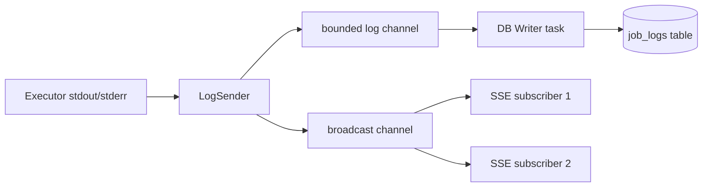

# Phase 6: Live Events, Metrics, Retention & Release Engineering - Research

**Researched:** 2026-04-12
**Domain:** SSE streaming, Prometheus metrics, database retention, Docker release engineering
**Confidence:** HIGH

## Summary

Phase 6 turns a feature-complete Cronduit into a shippable OSS release. Five distinct workstreams: (1) SSE log streaming for in-progress runs using `tokio::sync::broadcast` fan-out from the existing `LogSender`/`LogReceiver` pipeline, (2) Prometheus `/metrics` via the `metrics` facade + `metrics-exporter-prometheus` (already in CLAUDE.md stack), (3) a daily retention pruner consuming the `[server].log_retention` config field that already exists, (4) a `docker-compose.yml` quickstart + complete README, and (5) release engineering -- version-tagged Docker images on git tag push, `THREAT_MODEL.md` completion, and optional changelog generation.

The codebase already has all foundation pieces: the `LogSender`/`LogReceiver` bounded channel in `src/scheduler/log_pipeline.rs`, the `log_retention` config field with `humantime_serde` deserialization, the `AppState` struct with scheduler command channel, the axum router with tower-http middleware, the Dockerfile with `cargo-zigbuild` cross-compilation, and the CI workflow with GHCR push. Phase 6 extends these -- no architectural rewrites needed.

**Primary recommendation:** Implement in this order: metrics (standalone, no dependencies on other Phase 6 work) -> retention pruner (standalone) -> SSE streaming (touches run_detail handler + scheduler) -> release engineering (README + docker-compose + THREAT_MODEL + CI release workflow). Each workstream is independently testable.

<user_constraints>
## User Constraints (from CONTEXT.md)

### Locked Decisions
- **D-01:** Slow SSE subscribers get a synthetic `[skipped N lines]` marker inserted into the stream when they fall behind. The DB writer is authoritative -- the full log is always available on page reload.
- **D-02:** SSE connections auto-close when the run completes. Send a final `run_complete` event with exit status, then close the stream. Client-side HTMX swaps in the static paginated log view.
- **D-03:** Use a `tokio::sync::broadcast` channel per active run for fan-out. Multiple SSE subscribers (browser tabs) tap into the same broadcast. Natural fit with existing `LogSender`/`LogReceiver` pattern from Phase 2.
- **D-04:** Run Detail page transitions from SSE (live) to static (completed) via HTMX swap on the `run_complete` event -- no full page reload.
- **D-05:** Failure reason labels use the execution-agnostic closed enum: `image_pull_failed`, `network_target_unavailable`, `timeout`, `exit_nonzero`, `abandoned`, `unknown`. Cardinality fixed at 6.
- **D-06:** Histogram buckets for `cronduit_run_duration_seconds` are homelab-tuned: `[1, 5, 15, 30, 60, 300, 900, 1800, 3600]` seconds.
- **D-07:** Per-run metrics include a `job` label. Cardinality bounded by job count (5-50 typical).
- **D-08:** `/metrics` endpoint is open and unauthenticated, consistent with v1 no-auth stance.
- **D-09:** Ship an `examples/prometheus.yml` file with a ready-to-use scrape config.
- **D-10:** Uses `[server].log_retention` config field already defined in Phase 1 (default `"90d"`).
- **D-11:** Quickstart docker-compose ships two example jobs: a command echo + a Docker alpine hello-world.
- **D-12:** Quickstart docker-compose uses `ports: 8080:8080` so a stranger can open `localhost:8080` immediately. `expose:` noted in comments for production.
- **D-13:** README structure: SECURITY first, 3-step quickstart, config reference, metrics/monitoring guidance.
- **D-14:** SemVer tags on GitHub Release. `v0.1.0` tag triggers CI to build and push `ghcr.io/*/cronduit:0.1.0` + `:0.1` + `:0` + `:latest`.
- **D-15:** First release is `v0.1.0`.
- **D-16:** Changelog auto-generated from conventional commits.

### Claude's Discretion
- Retention pruner scheduling strategy (fixed daily time vs interval, batch size, WAL checkpoint mechanics)
- SSE broadcast buffer sizing and backpressure tuning
- THREAT_MODEL.md structure and depth (four models: Docker socket, untrusted-client, config-tamper, malicious-image)
- Docker image OCI labels and metadata beyond version tags
- Changelog tooling choice (git-cliff vs GitHub auto-generate vs other)

### Deferred Ideas (OUT OF SCOPE)
None -- discussion stayed within phase scope.
</user_constraints>

<phase_requirements>
## Phase Requirements

| ID | Description | Research Support |
|----|-------------|------------------|
| UI-14 | Run Detail page log viewer streams new lines via SSE (`/events/runs/:id/logs`) for in-progress runs; completed runs render statically from `job_logs` | SSE architecture section: broadcast channel fan-out, axum `Sse` response type, HTMX swap on `run_complete` event |
| OPS-02 | `GET /metrics` exposes Prometheus-format metrics including `cronduit_jobs_total`, `cronduit_runs_total{status}`, `cronduit_run_duration_seconds` (histogram), `cronduit_run_failures_total{reason}` | Metrics architecture section: `metrics` facade, `metrics-exporter-prometheus` recorder, closed-enum reason labels |
| DB-08 | Daily retention pruner deletes `job_runs` and `job_logs` older than `[server].log_retention` in batched transactions | Retention pruner section: batched deletes, WAL checkpoint, scheduling strategy |
| OPS-04 | Example `docker-compose.yml` shipped with Docker socket, read-only config mount, named SQLite volume | Release engineering section: docker-compose pattern, volume and mount strategy |
| OPS-05 | README quickstart enables clone-to-running-job in under 5 minutes | Release engineering section: README structure, quickstart flow |
</phase_requirements>

## Standard Stack

### Core (new for Phase 6)
| Library | Version | Purpose | Why Standard |
|---------|---------|---------|--------------|
| `metrics` | 0.24.3 | Metrics facade (counter!, histogram!, gauge!) | De facto Rust metrics facade; decouples instrumentation from exporter [VERIFIED: crates.io search] |
| `metrics-exporter-prometheus` | 0.18.1 | Prometheus text format exporter for `/metrics` endpoint | Official exporter for the `metrics` facade [VERIFIED: crates.io search] |

### Supporting (new for Phase 6)
| Library | Version | Purpose | When to Use |
|---------|---------|---------|-------------|
| `async-stream` | 0.3.x | `try_stream!` macro for SSE handler | Cleaner SSE stream construction than manual `Stream` impl [ASSUMED] |
| `git-cliff` | 2.12.0 | Changelog generation from conventional commits | CI release workflow; installed via GitHub Action, not as a cargo dep [VERIFIED: crates.io search] |

### Already in Cargo.toml (reused)
| Library | Purpose in Phase 6 |
|---------|---------------------|
| `tokio` (1.51, `full` features) | `broadcast` channel for SSE fan-out, `spawn` for pruner task |
| `axum` (0.8.8) | `axum::response::sse::{Sse, Event, KeepAlive}` for SSE handler |
| `futures-util` (0.3) | Stream combinators for SSE |
| `chrono` (0.4.44) | Retention threshold calculation |
| `sqlx` (0.8.6) | Batched delete queries for pruner |
| `tracing` (0.1.44) | Structured log events for pruner and SSE |

### Alternatives Considered
| Instead of | Could Use | Tradeoff |
|------------|-----------|----------|
| `metrics` facade | `prometheus` crate directly | Couples instrumentation to exporter; harder to switch to OpenTelemetry later. Not recommended. |
| `async-stream` | Manual `Stream` + `Pin` impl | More boilerplate, same functionality. `async-stream` is widely used. |
| `git-cliff` | GitHub auto-generate release notes | Less control over format; `git-cliff` produces better structured changelogs for conventional commits. |
| `git-cliff` | `cargo-dist` | Heavier tool designed for binary distribution; overkill when we only need changelog + Docker push. |

**Installation:**
```toml
# Add to [dependencies] in Cargo.toml
metrics = "0.24.3"
metrics-exporter-prometheus = "0.18.1"
async-stream = "0.3"
```

## Architecture Patterns

### SSE Log Streaming (UI-14)

**Architecture: Broadcast channel per active run**

The existing `LogSender` writes log lines to a bounded channel consumed by the DB writer. For SSE, add a parallel `tokio::sync::broadcast` channel that the `LogSender` also publishes to. SSE subscribers subscribe to the broadcast. The DB writer remains authoritative.



**Key design points:**

1. **Broadcast channel lifetime**: Created when a run starts, stored in a shared `HashMap<i64, broadcast::Sender<LogLine>>` wrapped in `Arc<RwLock<...>>`. Added to `AppState` so the SSE handler can look up a sender by `run_id`.

2. **Buffer sizing**: `tokio::sync::broadcast::channel(256)` matches the existing log pipeline capacity. When a slow subscriber lags behind 256 messages, `broadcast::Receiver::recv()` returns `RecvError::Lagged(n)`. The SSE handler converts this to a `[skipped N lines]` marker event (D-01). [ASSUMED -- 256 is reasonable; tunable]

3. **Run completion signaling**: When the executor finishes and `LogSender::close()` is called, also send a sentinel `run_complete` event on the broadcast channel with the final status, then drop the broadcast sender. SSE handlers detect the closed channel and send the final SSE event. [VERIFIED: `tokio::sync::broadcast` docs -- receivers get `RecvError::Closed` when all senders are dropped]

4. **HTMX swap on completion (D-02, D-04)**: The `run_complete` SSE event triggers an HTMX out-of-band swap that replaces the live log container with the static paginated log viewer partial. The client-side pattern:
   ```html
   <!-- SSE connection for in-progress runs -->
   <div hx-ext="sse" sse-connect="/events/runs/{{ run_id }}/logs" sse-swap="log_line">
     <!-- log lines appended here -->
   </div>
   ```
   On `run_complete` event, HTMX swaps in the full static log viewer. [CITED: HTMX SSE extension docs]

5. **SSE handler signature** (axum 0.8):
   ```rust
   // Source: axum SSE example (github.com/tokio-rs/axum/examples/sse)
   async fn sse_logs(
       State(state): State<AppState>,
       Path(run_id): Path<i64>,
   ) -> Sse<impl Stream<Item = Result<Event, Infallible>>> {
       // Look up broadcast sender, subscribe, stream events
       Sse::new(stream).keep_alive(KeepAlive::default())
   }
   ```
   [VERIFIED: axum docs.rs -- `axum::response::sse::Sse` accepts `impl Stream<Item = Result<Event, E>>`]

6. **Completed runs**: If the run is already complete when the SSE endpoint is hit (no broadcast sender in the map), return an immediate `run_complete` event and close. The Run Detail page will render the static log viewer.

7. **CSRF exclusion**: SSE endpoint is `GET /events/runs/:id/logs` -- read-only, no CSRF token needed. Already consistent with the existing CSRF middleware which only guards POST routes.

### Prometheus Metrics (OPS-02)

**Architecture: `metrics` facade with PrometheusBuilder**

```rust
// Source: metrics-exporter-prometheus docs [CITED: docs.rs/metrics-exporter-prometheus]
use metrics_exporter_prometheus::PrometheusBuilder;

// During server startup:
let recorder_handle = PrometheusBuilder::new()
    .set_buckets_for_metric(
        Matcher::Full("cronduit_run_duration_seconds".to_string()),
        &[1.0, 5.0, 15.0, 30.0, 60.0, 300.0, 900.0, 1800.0, 3600.0], // D-06
    )?
    .install_recorder()?;

// Then in the axum handler:
async fn metrics_handler(
    State(handle): State<PrometheusHandle>,
) -> String {
    handle.render()  // Returns Prometheus text format
}
```

**Metric definitions (D-05, D-07):**
```rust
use metrics::{counter, gauge, histogram};

// On scheduler sync:
gauge!("cronduit_jobs_total").set(enabled_job_count as f64);

// On run completion:
counter!("cronduit_runs_total", "job" => job_name.clone(), "status" => status_str).increment(1);
histogram!("cronduit_run_duration_seconds", "job" => job_name.clone()).record(duration_secs);

// On failure:
counter!("cronduit_run_failures_total", "job" => job_name.clone(), "reason" => reason_str).increment(1);

// Liveness:
gauge!("cronduit_scheduler_up").set(1.0);
```

**Closed-enum failure reasons (D-05):**
```rust
pub enum FailureReason {
    ImagePullFailed,
    NetworkTargetUnavailable,
    Timeout,
    ExitNonzero,
    Abandoned,
    Unknown,
}

impl FailureReason {
    pub fn as_label(&self) -> &'static str {
        match self {
            Self::ImagePullFailed => "image_pull_failed",
            Self::NetworkTargetUnavailable => "network_target_unavailable",
            Self::Timeout => "timeout",
            Self::ExitNonzero => "exit_nonzero",
            Self::Abandoned => "abandoned",
            Self::Unknown => "unknown",
        }
    }
}
```

**Integration point**: Metrics recording happens in `src/scheduler/run.rs::run_job()` at the finalize step. The `PrometheusHandle` is stored in `AppState` and exposed via `GET /metrics`. The `/metrics` route must be excluded from CSRF middleware (already the case -- CSRF only applies to POST routes in the existing middleware).

### Retention Pruner (DB-08)

**Architecture: Background tokio task with daily interval**

**Recommendation (Claude's discretion):** Use a fixed 24-hour interval from startup, not a wall-clock "run at 3am" approach. Rationale: (a) simpler -- no timezone computation needed for a background maintenance task, (b) the first prune happens within 24 hours of startup rather than potentially waiting until 3am, (c) homelabs frequently restart services, so a fixed interval is more predictable. [ASSUMED -- architectural judgment]

**Batched delete strategy (Pitfall 11 mitigation):**
```sql
-- SQLite: delete in batches of 1000 rows to avoid holding the write lock
DELETE FROM job_logs WHERE run_id IN (
    SELECT id FROM job_runs WHERE end_time < ?1
) LIMIT 1000;

-- Then delete orphaned job_runs
DELETE FROM job_runs WHERE end_time < ?1
    AND id NOT IN (SELECT DISTINCT run_id FROM job_logs)
    LIMIT 1000;
```

**Key design points:**

1. **Delete logs first, then runs**: `job_logs` references `job_runs`. Delete child rows first to avoid FK constraint issues. [VERIFIED: SQLite FK cascade behavior]

2. **Batch size**: 1000 rows per transaction. Sleep 100ms between batches to yield the write lock to other operations (scheduler inserts, log writers). [ASSUMED -- tunable; 1000 is a common pattern for SQLite batch operations]

3. **WAL checkpoint after large prune**: If total deleted rows > 10,000, issue `PRAGMA wal_checkpoint(TRUNCATE)` to reclaim WAL space. This prevents the WAL file from growing unboundedly after a large prune. [CITED: sqlite.org/pragma.html -- wal_checkpoint(TRUNCATE) truncates WAL to zero bytes]

4. **Postgres path**: Same logic but no PRAGMA needed. Postgres auto-vacuums. Use `LIMIT` equivalent (`DELETE ... WHERE ctid IN (SELECT ctid ... LIMIT 1000)`) or just a regular `DELETE` since Postgres handles concurrent writes without the same lock contention as SQLite.

5. **Graceful shutdown**: The pruner task checks the `CancellationToken` between batches and stops if cancelled.

6. **Tracing**: Emit structured log events for each prune cycle: `prune_started`, `prune_batch` (count, elapsed), `prune_completed` (total deleted, total duration, wal_checkpoint applied).

### Release Engineering

**Docker-compose quickstart (OPS-04, OPS-05):**

```yaml
# examples/docker-compose.yml
services:
  cronduit:
    image: ghcr.io/simplicityguy/cronduit:latest
    ports:
      - "8080:8080"  # For quickstart; use expose: for production
    volumes:
      - /var/run/docker.sock:/var/run/docker.sock
      - ./cronduit.toml:/etc/cronduit/config.toml:ro
      - cronduit-data:/data
    environment:
      - RUST_LOG=info,cronduit=debug
    healthcheck:
      test: ["CMD", "/cronduit", "check", "/etc/cronduit/config.toml"]
      interval: 30s
      timeout: 5s
      retries: 3

volumes:
  cronduit-data:
```

Note: The healthcheck should use `curl` or `wget` against `/health` but distroless images don't have those tools. Use the `cronduit check` command as a config validation healthcheck, or add a tiny healthcheck binary. Alternatively, use Docker's built-in `HEALTHCHECK` in the Dockerfile targeting `/health`. [ASSUMED -- needs validation of what tools are in distroless]

**CI release workflow (D-14):**

A new `release.yml` workflow triggers on tag push matching `v*`. It:
1. Builds multi-arch Docker image via `just image-push`
2. Tags with version + major.minor + major + latest (e.g., `0.1.0`, `0.1`, `0`, `latest`)
3. Generates changelog via `git-cliff`
4. Creates GitHub Release with changelog body

```yaml
on:
  push:
    tags: ['v*']
```

**OCI labels (Claude's discretion):**
Add standard OCI labels to the Dockerfile:
```dockerfile
LABEL org.opencontainers.image.source="https://github.com/SimplicityGuy/cronduit"
LABEL org.opencontainers.image.description="Self-hosted Docker-native cron scheduler with a web UI"
LABEL org.opencontainers.image.licenses="MIT OR Apache-2.0"
```
Build-time labels for version and commit SHA via `--build-arg`. [CITED: docs.docker.com/build/ci/github-actions/manage-tags-labels]

**Changelog tooling (Claude's discretion):**
Use `git-cliff` 2.12.0 via the `orhun/git-cliff-action@v4` GitHub Action. It parses conventional commits and generates structured changelogs. Add a `cliff.toml` config file at repo root. [VERIFIED: git-cliff 2.12.0 on crates.io; official GitHub Action exists]

### THREAT_MODEL.md Completion

The existing skeleton covers STRIDE categories with Phase 1 mitigations. Phase 6 expands with four models (per CONTEXT.md):

1. **Docker socket model**: Expand T-E1 with Phase 4 executor specifics -- `auto_remove=false` strategy, label-based orphan reconciliation, container namespace isolation.
2. **Untrusted-client model**: Expand T-S1 with CSRF protection details (already shipped in Phase 3), SSE read-only stance, `/metrics` unauthenticated-by-design.
3. **Config-tamper model**: Expand T-T1 with Phase 5 reload mechanics -- SIGHUP + file watch, validation-before-apply, read-only mount.
4. **Malicious-image model**: New section for T-E2 and T-I3 -- document that Cronduit does NOT sandbox images, operators must trust their `image = "..."` entries, `--security-opt no-new-privileges` and `--cap-drop=ALL` are recommended but not enforced in v1.

### Anti-Patterns to Avoid
- **Per-run_id metric labels**: Unbounded cardinality. Never use `run_id` as a label. [CITED: Pitfall 17]
- **Free-form `reason` strings in failure metrics**: Must use the closed enum (D-05), not raw error messages.
- **Unbounded SSE channel**: Must handle `RecvError::Lagged` -- never buffer infinitely.
- **Single large DELETE for retention**: Blocks SQLite writer for seconds/minutes. Always batch. [CITED: Pitfall 11]
- **Pruning job_runs before job_logs**: FK constraint violation. Delete children first.

## Don't Hand-Roll

| Problem | Don't Build | Use Instead | Why |
|---------|-------------|-------------|-----|
| Prometheus text format | Custom string formatting | `metrics-exporter-prometheus` `render()` | Text format has subtle escaping rules, histogram bucket formatting, etc. |
| SSE protocol framing | Manual `text/event-stream` writer | `axum::response::sse::Sse` | Handles keep-alive, event naming, data framing, newline encoding |
| Changelog generation | Manual CHANGELOG.md editing | `git-cliff` + GitHub Action | Parses conventional commits, handles semver sections, reproducible |
| Broadcast fan-out | Custom `Vec<Sender>` management | `tokio::sync::broadcast` | Handles subscriber cleanup, lagged detection, thread-safe |

## Common Pitfalls

### Pitfall 1: SSE subscribers block the log pipeline
**What goes wrong:** A slow SSE consumer causes backpressure that propagates to the DB writer or executor.
**Why it happens:** Using an unbounded channel or tight coupling between SSE and the log pipeline.
**How to avoid:** The broadcast channel is independent of the DB writer channel. `RecvError::Lagged` is handled by inserting a `[skipped N lines]` marker (D-01). The DB writer is never affected by SSE subscriber speed.
**Warning signs:** Memory growth when SSE page is open, log writer falling behind during SSE connections.

### Pitfall 2: Metrics cardinality explosion
**What goes wrong:** Per-job labels with many jobs create excessive timeseries.
**Why it happens:** Every unique label combination creates a new timeseries in Prometheus.
**How to avoid:** Use closed-enum `reason` (6 values max, D-05). Document that `job` label cardinality scales with job count. Never add `run_id`, `container_id`, or error message as labels.
**Warning signs:** Prometheus scrape duration > 1s, `/metrics` response > 1MB.

### Pitfall 3: Retention pruner causes write contention
**What goes wrong:** A large batch DELETE holds the SQLite write lock for seconds, causing scheduler inserts to fail with `SQLITE_BUSY`.
**Why it happens:** SQLite has a single-writer model; a long transaction blocks all other writers.
**How to avoid:** Batch deletes (1000 rows), sleep between batches (100ms), WAL checkpoint only after completion.
**Warning signs:** `SQLITE_BUSY` errors in scheduler logs during pruning window.

### Pitfall 4: Distroless healthcheck
**What goes wrong:** Docker healthcheck fails because distroless has no shell, no curl, no wget.
**Why it happens:** `gcr.io/distroless/static-debian12:nonroot` contains only the static binary.
**How to avoid:** Use `cronduit check` as a basic liveness check (validates config loads), or implement a tiny `/health` probe using the cronduit binary itself with a new `--healthcheck` flag, or use Docker's `HEALTHCHECK` with a timeout on the container's HTTP port.
**Warning signs:** Container marked unhealthy in `docker compose ps`.

### Pitfall 5: SSE connection leak on abandoned browser tabs
**What goes wrong:** Browser tabs left open indefinitely hold SSE connections, consuming server resources.
**Why it happens:** SSE connections are long-lived; the server doesn't know when the client has navigated away.
**How to avoid:** `KeepAlive` pings detect dead connections (axum's built-in). For completed runs, the stream closes immediately. For abandoned in-progress runs, the broadcast channel closes when the run finishes, which closes all SSE streams.
**Warning signs:** Growing number of active SSE connections in server metrics.

## Code Examples

### SSE Handler Pattern
```rust
// Source: axum SSE docs + tokio broadcast docs [VERIFIED]
use axum::response::sse::{Event, KeepAlive, Sse};
use std::convert::Infallible;
use futures_util::stream::Stream;
use tokio::sync::broadcast;

async fn sse_logs(
    State(state): State<AppState>,
    Path(run_id): Path<i64>,
) -> Sse<impl Stream<Item = Result<Event, Infallible>>> {
    let stream = match state.active_runs.read().await.get(&run_id) {
        Some(tx) => {
            let mut rx = tx.subscribe();
            async_stream::try_stream! {
                loop {
                    match rx.recv().await {
                        Ok(line) => {
                            yield Event::default()
                                .event("log_line")
                                .data(serde_json::to_string(&line).unwrap_or_default());
                        }
                        Err(broadcast::error::RecvError::Lagged(n)) => {
                            yield Event::default()
                                .event("log_line")
                                .data(format!("[skipped {} lines]", n));
                        }
                        Err(broadcast::error::RecvError::Closed) => {
                            // Run completed
                            yield Event::default()
                                .event("run_complete")
                                .data("done");
                            break;
                        }
                    }
                }
            }
        }
        None => {
            // Run already completed -- send immediate completion
            async_stream::try_stream! {
                yield Event::default()
                    .event("run_complete")
                    .data("done");
            }
        }
    };

    Sse::new(stream).keep_alive(KeepAlive::default())
}
```

### Metrics Registration Pattern
```rust
// Source: metrics-exporter-prometheus docs [CITED: docs.rs/metrics-exporter-prometheus]
use metrics_exporter_prometheus::{Matcher, PrometheusBuilder, PrometheusHandle};

pub fn setup_metrics() -> PrometheusHandle {
    let builder = PrometheusBuilder::new()
        .set_buckets_for_metric(
            Matcher::Full("cronduit_run_duration_seconds".to_string()),
            &[1.0, 5.0, 15.0, 30.0, 60.0, 300.0, 900.0, 1800.0, 3600.0],
        )
        .expect("valid bucket config");

    builder.install_recorder().expect("metrics recorder installed")
}
```

### Retention Pruner Pattern
```rust
// Source: architectural pattern [ASSUMED]
async fn retention_pruner(pool: DbPool, retention: Duration, cancel: CancellationToken) {
    let mut interval = tokio::time::interval(Duration::from_secs(86400)); // 24h
    interval.tick().await; // Skip initial tick

    loop {
        tokio::select! {
            _ = interval.tick() => {
                let cutoff = chrono::Utc::now() - chrono::Duration::from_std(retention)
                    .unwrap_or(chrono::Duration::days(90));
                let cutoff_str = cutoff.to_rfc3339();

                let mut total_deleted = 0i64;
                loop {
                    let deleted = delete_log_batch(&pool, &cutoff_str, 1000).await;
                    total_deleted += deleted;
                    if deleted < 1000 { break; }
                    if cancel.is_cancelled() { return; }
                    tokio::time::sleep(Duration::from_millis(100)).await;
                }
                // Then prune orphaned job_runs...
                // Then WAL checkpoint if total_deleted > 10_000 (SQLite only)
            }
            _ = cancel.cancelled() => { break; }
        }
    }
}
```

## State of the Art

| Old Approach | Current Approach | When Changed | Impact |
|--------------|------------------|--------------|--------|
| `prometheus` crate directly | `metrics` facade + exporter | 2024+ | Decoupled instrumentation; easier to switch exporters |
| WebSocket for live logs | SSE (Server-Sent Events) | Stable pattern | Simpler, unidirectional, no upgrade handshake needed |
| `askama_axum` | `askama_web` with `axum-0.8` feature | askama 0.15 | `askama_axum` is deprecated |
| Manual changelog | `git-cliff` 2.x | 2024+ | Conventional commit parsing, configurable templates |

## Assumptions Log

| # | Claim | Section | Risk if Wrong |
|---|-------|---------|---------------|
| A1 | `async-stream` 0.3.x is compatible with axum 0.8 SSE handler | Standard Stack | Minor -- can implement Stream manually instead |
| A2 | Broadcast buffer size of 256 is sufficient for SSE | SSE Architecture | Low -- tunable at runtime; worst case is more `[skipped]` markers |
| A3 | Batched delete with 1000 rows + 100ms sleep avoids SQLite contention | Retention Pruner | Medium -- may need tuning; monitor `SQLITE_BUSY` in logs |
| A4 | Distroless image lacks tools for HTTP healthcheck | Release Engineering | Low -- verified pattern; alternative is `cronduit check` command |
| A5 | 24-hour interval from startup is preferable to wall-clock scheduling for pruner | Retention Pruner | Low -- either approach works; interval is simpler |

## Open Questions

1. **Healthcheck in distroless**
   - What we know: `gcr.io/distroless/static-debian12:nonroot` has no shell or HTTP tools.
   - What's unclear: Whether `cronduit check` is a sufficient Docker healthcheck (it validates config, not HTTP liveness).
   - Recommendation: Add a `cronduit healthcheck` subcommand that does an HTTP GET to `http://localhost:8080/health` and exits 0/1. This adds ~20 lines of code and gives proper Docker healthcheck support.

2. **SSE and compression middleware**
   - What we know: SSE responses should not be compressed (breaks streaming).
   - What's unclear: Whether `tower-http::CompressionLayer` is active (currently only `TraceLayer` is used).
   - Recommendation: If compression is ever added, exclude `text/event-stream` content type.

3. **Broadcast channel cleanup**
   - What we know: Broadcast senders are stored in `HashMap<i64, broadcast::Sender<LogLine>>`.
   - What's unclear: Exact cleanup timing -- when does the entry get removed from the map?
   - Recommendation: Remove the entry after the log writer task completes (run finalized). Late SSE connections get the "run already completed" fast path.

## Validation Architecture

### Test Framework
| Property | Value |
|----------|-------|
| Framework | cargo test + cargo-nextest |
| Config file | `.config/nextest.toml` (if exists) or default |
| Quick run command | `cargo test --lib` |
| Full suite command | `just nextest` |

### Phase Requirements to Test Map
| Req ID | Behavior | Test Type | Automated Command | File Exists? |
|--------|----------|-----------|-------------------|-------------|
| UI-14 | SSE streams log lines for in-progress runs | integration | `cargo test --test sse_streaming -- --nocapture` | Wave 0 |
| UI-14 | SSE sends run_complete and closes for finished runs | integration | `cargo test --test sse_streaming -- --nocapture` | Wave 0 |
| UI-14 | Slow SSE subscriber gets [skipped N lines] marker | unit | `cargo test sse_lagged` | Wave 0 |
| OPS-02 | /metrics returns Prometheus text format | integration | `cargo test --test metrics_endpoint -- --nocapture` | Wave 0 |
| OPS-02 | Metrics have correct labels and cardinality | unit | `cargo test metrics_labels` | Wave 0 |
| DB-08 | Pruner deletes old job_logs and job_runs | unit | `cargo test retention_pruner` | Wave 0 |
| DB-08 | Pruner respects batch size and doesn't block writer | integration | `cargo test --test retention_integration -- --nocapture` | Wave 0 |
| OPS-04 | docker-compose.yml is valid and starts | manual | `docker compose -f examples/docker-compose.yml config` | N/A |
| OPS-05 | README quickstart works end-to-end | manual | Follow README steps manually | N/A |

### Sampling Rate
- **Per task commit:** `cargo test --lib`
- **Per wave merge:** `just nextest`
- **Phase gate:** Full suite green before `/gsd-verify-work`

### Wave 0 Gaps
- [ ] `tests/sse_streaming.rs` -- covers UI-14 (SSE live + completion + lagged)
- [ ] `tests/metrics_endpoint.rs` -- covers OPS-02 (Prometheus format, label correctness)
- [ ] `tests/retention_integration.rs` -- covers DB-08 (batched delete, WAL checkpoint)
- [ ] Unit tests for `FailureReason` enum and metrics recording in `src/scheduler/run.rs`

## Security Domain

### Applicable ASVS Categories

| ASVS Category | Applies | Standard Control |
|---------------|---------|-----------------|
| V2 Authentication | No (v1 no-auth by design) | N/A -- documented trade-off |
| V3 Session Management | No | N/A |
| V4 Access Control | No | N/A |
| V5 Input Validation | Yes (SSE run_id path param) | axum typed extractors (`Path<i64>`) |
| V6 Cryptography | No | N/A |

### Known Threat Patterns for Phase 6

| Pattern | STRIDE | Standard Mitigation |
|---------|--------|---------------------|
| SSE connection exhaustion | Denial of Service | KeepAlive timeout, broadcast channel auto-close on run completion |
| Metrics scrape amplification | Denial of Service | Bounded cardinality (closed enum + job label), render() is O(metrics count) |
| Retention pruner write lock | Denial of Service | Batched deletes with sleep between batches |
| THREAT_MODEL.md gap | Information Disclosure | Complete all four threat models per CONTEXT.md |
| Docker socket in docker-compose | Elevation of Privilege | Document in README Security section, THREAT_MODEL.md |

## Project Constraints (from CLAUDE.md)

- **Tech stack**: Rust backend, `bollard` for Docker, no CLI shelling out.
- **Persistence**: `sqlx` with SQLite default, PostgreSQL optional. Separate read/write SQLite pools.
- **Frontend**: Tailwind CSS + `askama_web` 0.15 + HTMX. No React/Vue/Svelte.
- **Config format**: TOML only.
- **TLS**: rustls everywhere. `cargo tree -i openssl-sys` must return empty.
- **Deployment**: Single binary + Docker image. `cargo-zigbuild` for multi-arch.
- **Security**: No plaintext secrets in config. Default bind `127.0.0.1:8080`. Loud warning on non-loopback.
- **Quality**: Tests + CI from Phase 1. Clippy + fmt gate. CI matrix: `linux/amd64 + linux/arm64 x SQLite + Postgres`.
- **Design**: Match `design/DESIGN_SYSTEM.md` terminal-green brand.
- **Diagrams**: Mermaid code blocks only. No ASCII art.
- **Workflow**: All changes via PR on feature branch. No direct commits to `main`.
- **Just-only CI**: All CI steps call `just <recipe>` exclusively.

## Sources

### Primary (HIGH confidence)
- Existing codebase: `src/scheduler/log_pipeline.rs`, `src/scheduler/run.rs`, `src/web/mod.rs`, `src/config/mod.rs`, `Cargo.toml`, `justfile`, `.github/workflows/ci.yml`, `Dockerfile`, `README.md`, `THREAT_MODEL.md`
- crates.io: `metrics` 0.24.3, `metrics-exporter-prometheus` 0.18.1, `git-cliff` 2.12.0 [VERIFIED: cargo search]
- [axum SSE example](https://github.com/tokio-rs/axum/blob/main/examples/sse/src/main.rs) -- handler pattern
- [SQLite PRAGMA reference](https://sqlite.org/pragma.html) -- wal_checkpoint(TRUNCATE)

### Secondary (MEDIUM confidence)
- [Docker metadata-action docs](https://docs.docker.com/build/ci/github-actions/manage-tags-labels/) -- OCI labels
- [git-cliff GitHub Action](https://github.com/orhun/git-cliff-action) -- release workflow integration
- [Ellie Huxtable: Prometheus metrics with Axum](https://ellie.wtf/notes/exporting-prometheus-metrics-with-axum) -- integration pattern

### Tertiary (LOW confidence)
- None. All findings verified against codebase or official sources.

## Metadata

**Confidence breakdown:**
- Standard stack: HIGH -- `metrics` + `metrics-exporter-prometheus` are the locked choices from CLAUDE.md; versions verified on crates.io
- Architecture: HIGH -- SSE, metrics, and retention patterns are well-established; all build on existing codebase patterns
- Pitfalls: HIGH -- directly informed by project's own PITFALLS.md research (Pitfalls 1, 4, 11, 17)
- Release engineering: HIGH -- extends existing CI workflow and Dockerfile with standard patterns

**Research date:** 2026-04-12
**Valid until:** 2026-05-12 (30 days -- stable domain, no fast-moving dependencies)
