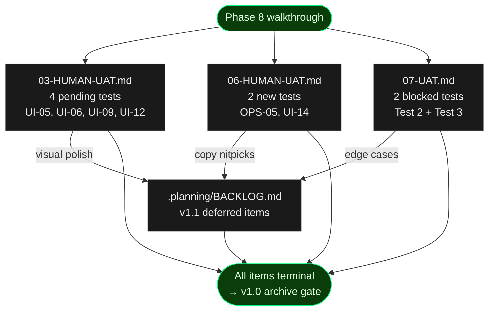

# Phase 8 — Human UAT Index

**Purpose:** Walkthrough index for the v1.0 final human UAT. This file lists
every per-phase UAT file touched in Phase 8, the final status of each item
once walked through, and the fixture setup each test needs. Individual
results live in the per-phase files to preserve audit provenance (per D-23).

**This is a prep-and-surface index.** Per project memory rule "UAT requires
user validation", Claude does NOT flip any `result:` field. The user runs
each test and records results directly in the per-phase file (pass / issue
with severity / blocked). Once every row in the table below is terminal,
the user updates this index's `status:` frontmatter to `complete`.

## Scope



## Fixture Setup

Every test below runs against a live cronduit instance. Before starting the
walkthrough, pick ONE of the two compose files per test session and bring
the stack up:

**Default (Linux):**
```
docker compose -f examples/docker-compose.yml up -d
curl -sSf http://localhost:8080/health
```

Ensure `DOCKER_GID` matches your host (default fallback is `999`). Derive
via `stat -c %g /var/run/docker.sock` and export before compose up if
different.

**Secure (macOS / defense-in-depth):**
```
docker compose -f examples/docker-compose.secure.yml up -d
curl -sSf http://localhost:8080/health
```

No `DOCKER_GID` needed — the docker-socket-proxy sidecar mediates all
Docker API traffic.

When done with a test session:
```
docker compose -f examples/docker-compose.yml down -v
# or
docker compose -f examples/docker-compose.secure.yml down -v
```

## UAT Item Index

| # | File | Test | Requirement | Current Result | Final Result |
|---|------|------|-------------|----------------|--------------|
| 1 | 03-HUMAN-UAT.md | Terminal-green design system rendering | UI-05 | [pending] | _user fills_ |
| 2 | 03-HUMAN-UAT.md | Dark/light mode toggle persistence | UI-06 | [pending] | _user fills_ |
| 3 | 03-HUMAN-UAT.md | Run Now toast notification | UI-09 | [pending] | _user fills_ |
| 4 | 03-HUMAN-UAT.md | ANSI log rendering in Run Detail | UI-12 | [pending] | _user fills_ |
| 5 | 06-HUMAN-UAT.md | Quickstart end-to-end | OPS-05 | [pending] | _user fills_ |
| 6 | 06-HUMAN-UAT.md | SSE live log streaming | UI-14 | [pending] | _user fills_ |
| 7 | 07-UAT.md | Job Detail Run History Auto-Refresh (re-run) | n/a | issue/blocker | _user fills_ |
| 8 | 07-UAT.md | Job Detail Polling Stops When Idle (re-run) | n/a | blocked | _user fills_ |

When flipping Test 7 and Test 8 in 07-UAT.md, add a `re_tested_at:
2026-04-13T..Z` annotation so the audit trail shows the retry.

## Triage Rubric

Use this to decide whether a surfaced issue is a Phase 8 fix or a v1.1
backlog entry (verbatim from 08-CONTEXT.md D-26, D-28):

- **Fix in Phase 8:** Functional breakage. A job fails to run, a page
  crashes, a toast never appears, a live log stream hangs, auto-refresh
  stops working, a docker pull errors out silently. Open a gap-closure
  plan for it before archiving v1.0.
- **Defer to v1.1:** Visual polish, copy wording nitpicks, dark-mode
  rendering edge cases that still render, cosmetic alignment on narrow
  viewports. Add an entry to `.planning/BACKLOG.md` using the template.
- **Ambiguous:** Default to v1.1 unless it blocks a v1.0 success criterion
  listed in ROADMAP.md § Phase 8. Err toward shipping.

## Final Status

_To be filled in by the user after the walkthrough completes._

| Category | Count |
|----------|-------|
| Tests total | 8 |
| Passed | _fill_ |
| Issues (Phase 8 fix) | _fill_ |
| Issues (deferred to v1.1) | _fill_ |
| Blocked | _fill_ |

**Phase 8 fix plans opened:** _list any gap-closure plan IDs_

**v1.1 backlog entries added:** _list 999.X IDs from .planning/BACKLOG.md_

**Walkthrough completed:** _timestamp_
**User approved archive:** _yes / no_
