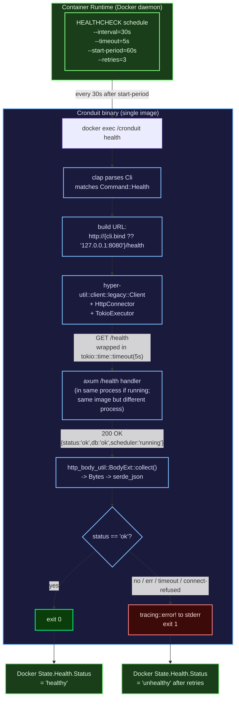

# Phase 12: Docker Healthcheck + rc.1 Cut - Research

**Researched:** 2026-04-17
**Domain:** Rust HTTP client (hyper-util), Docker HEALTHCHECK + compose override semantics, GitHub Actions release tagging (docker/metadata-action), git-cliff prerelease changelog preview, GHCR multi-arch manifest verification
**Confidence:** HIGH

## Summary

Phase 12 ships v1.1.0-rc.1 by adding a `cronduit health` CLI subcommand, baking a Dockerfile `HEALTHCHECK` into the runtime stage, building a CI workflow that reproduces the OPS-08 `(unhealthy)` symptom before/after the fix, and patching `release.yml` so pre-release tags don't bump `:latest`/`:major`/`:major.minor` and DO push a rolling `:rc` tag. All 15 implementation decisions (D-01..D-15) are locked in `12-CONTEXT.md` — research validates each technical choice and surfaces the exact API shapes the planner needs.

Three findings change the planner's work surface materially:

1. **`hyper-util 0.1.20` and all dependent crates are ALREADY in the dep tree transitively** (axum + tonic + bollard pull them). `cargo tree` confirms `hyper 1.9.0`, `hyper-util 0.1.20`, `http-body-util 0.1.3`, `bytes 1.11.1` are present. The Phase 12 `Cargo.toml` change is one line: declare `hyper-util` directly with the features we use. `openssl-sys` remains empty (rustls posture intact).

2. **docker/metadata-action auto-skips pre-releases for `{{major}}` and `{{major}}.{{minor}}` patterns** (verified against the action's README). The D-10 patch is therefore minimal: only `type=raw,value=latest` needs an `enable=` clause; the `enable=` clauses on the two semver patterns are belt-and-suspenders and can be omitted. The new `type=raw,value=rc` line still requires the `enable=${{ contains(github.ref, '-rc.') }}` condition.

3. **Neither the shipped `Dockerfile` nor `examples/docker-compose.yml` currently has any healthcheck** (verified via grep). The OPS-08 reproduction must therefore stand up a deliberate "OLD-state" image with `HEALTHCHECK CMD ["wget", "--spider", "http://localhost:8080/health"]` baked in via a temporary Dockerfile in CI; it cannot just diff the current shipped state. This was implicit in D-08 but worth surfacing so the planner builds the test rig correctly.

**Primary recommendation:** Land seven plans in this order — (1) `cronduit health` skeleton (clap variant + dispatch arm + URL parsing module) → (2) hyper-util client + body parse + exit-code contract + unit tests (D-14) → (3) Dockerfile HEALTHCHECK directive → (4) compose-smoke workflow with OPS-08 before/after repro + compose-override smoke → (5) release.yml patch (one `enable=` + one new `type=raw,value=rc` line) → (6) `docs/release-rc.md` runbook → (7) maintainer cuts the tag per runbook.

<user_constraints>
## User Constraints (from CONTEXT.md)

### Locked Decisions

#### `cronduit health` CLI

- **D-01:** **HTTP client: `hyper 1` + `hyper-util`.** Reuses `hyper = "1"` already declared in `Cargo.toml` (currently unused directly; transitive via axum). Adds `hyper-util = { version = "0.1", features = ["client-legacy", "http1", "tokio"] }` for the client factory + `HttpConnector`. Runs inside the already-booted tokio runtime (`#[tokio::main]` in `src/main.rs`). No new rustls surface because the probe is HTTP-only (loopback). Response body read into `Bytes` then decoded via the existing `serde_json` dep. Future HTTPS extension point documented but not implemented. Zero-dep raw TCP and `reqwest` rejected (respectively: ironic — OPS-08 is a bug caused by hand-rolled HTTP parsing; overkill — ~40 transitive crates for one localhost GET).

- **D-02:** **Internal timeout: 2s connect + 3s read (5s total upper bound), enforced via `tokio::time::timeout`.** Headroom under the Dockerfile `HEALTHCHECK --timeout=5s`. Gives `cronduit health` a deterministic exit code even when invoked outside Docker (e.g., on the host during debugging). Connection-refused returns instantly either way.

- **D-03:** **Arg shape: reuse the existing global `--bind host:port` flag.** No new subcommand-local `--url` flag in v1.1. Parser prepends `http://` to construct the target URL. Default when absent: `http://127.0.0.1:8080`. IPv6 bracketed form (`[::1]:8080`) is preserved by `url::Url::parse` / the clap global flag semantics.

- **D-04:** **`cronduit health` does NOT read `--config`.** No TOML parsing in the health path.

- **D-05:** **Exit code contract:** `0` iff HTTP response is 200 AND body parses as JSON AND `body.status == "ok"`. `1` on connection-refused, DNS failure, timeout, non-200 status, unparseable body, or `body.status != "ok"`. Single non-zero code for all failure modes.

#### Dockerfile HEALTHCHECK

- **D-06:** **Add `HEALTHCHECK --interval=30s --timeout=5s --start-period=60s --retries=3 CMD ["/cronduit", "health"]`** to the runtime stage of `Dockerfile` (after `USER cronduit:cronduit`, before `CMD ["run", ...]`).

- **D-07:** **busybox `wget` stays installed** (alpine base image ships it as part of busybox). The HEALTHCHECK no longer uses it, but jobs authored as `type = "command"` with `wget` calls in user config continue to work.

#### OPS-08 Root-Cause Reproduction

- **D-08:** **Automated repro test in dedicated CI workflow.** Build with OLD `wget --spider` HEALTHCHECK → assert `unhealthy`. Build with NEW `cronduit health` HEALTHCHECK → assert `healthy`.

- **D-09:** **Test lives in new `.github/workflows/compose-smoke.yml`.** Dedicated workflow runs (1) the OPS-08 before/after repro and (2) a compose-override smoke test asserting compose wins over Dockerfile. Runs on PR + main + release tags. Standalone — `ci.yml` is NOT extended.

#### rc.1 Release Mechanics

- **D-10:** **Patch `.github/workflows/release.yml` for pre-release tag semantics.** Required patches via `docker/metadata-action`:
  - `type=semver,pattern={{version}}` — keep
  - `type=semver,pattern={{major}}.{{minor}}` — add `enable=${{ !contains(github.ref, '-') }}` (skip on pre-release)
  - `type=semver,pattern={{major}}` — add `enable=${{ !contains(github.ref, '-') }}` (skip on pre-release)
  - `type=raw,value=latest` — add `enable=${{ !contains(github.ref, '-') }}` (skip on pre-release)
  - `type=raw,value=rc` — NEW; add `enable=${{ contains(github.ref, '-rc.') }}` (rolling rc tag)

- **D-11:** **Ship `docs/release-rc.md` runbook.** Reusable by rc.2 (Phase 13) and rc.3 (Phase 14). Covers pre-flight checklist, exact tag command, post-push verification, what-if-UAT-fails escalation.

- **D-12:** **Release-notes content for `v1.1.0-rc.1`.** `git-cliff` is authoritative — no manual curation pass.

- **D-13:** **Tag cut is a maintainer action, not a workflow_dispatch.** `git tag -a v1.1.0-rc.1 -m "..."` run locally by the maintainer.

#### Testing

- **D-14:** **`cronduit health` unit tests live in `src/cli/health.rs` next to the handler** (following `src/cli/check.rs` / `src/cli/run.rs` pattern). Covers: 200+ok body → exit 0; non-200 → exit 1; missing status field → exit 1; connect-refused → exit 1 fast; URL construction from v4/v6/missing-port forms.

- **D-15:** **Integration coverage on all four existing CI runners** (SQLite × {amd64, arm64}, Postgres × {amd64, arm64}) remains green. Health handler does not touch the database; no DB-backend parity test needed.

### Claude's Discretion

- Exact module name / path for the new subcommand (`src/cli/health.rs` recommended).
- Whether `hyper-util` feature set is `["client-legacy", "http1", "tokio"]` or more minimal — planner trims after a local `cargo tree` check.
- Log format for failure messages on stderr — follow existing `tracing` conventions.
- The precise GHA `enable=${{ ... }}` expression syntax (`!contains(github.ref, '-')` vs regex on tag name) — pick whichever renders most readable.
- Whether the compose-smoke workflow uses `docker/setup-buildx-action` or the runner's default docker daemon.
- CHANGELOG heading for the rc — `git-cliff` default is fine; don't over-customize `cliff.toml`.
- Whether `docs/release-rc.md` lives at the repo root, under `docs/`, or is folded into an existing `CONTRIBUTING.md` section.

### Deferred Ideas (OUT OF SCOPE)

- **TLS/HTTPS for `cronduit health`** — v1.1 is localhost-HTTP only. Future `--url https://...` or `--tls` flag additive.
- **`/healthz` with a "starting" state during backfill** — Phase 11 D-12 defers this; `--start-period=60s` covers the operator-visible window.
- **`workflow_dispatch` shortcut for tag cuts** — Rejected (D-13).
- **Hand-edited GitHub Release bodies** — Rejected (D-12).
- **Retry inside `cronduit health`** — Rejected by ROADMAP lock and D-01.
- **Config-file auto-discovery for the `health` subcommand** — Rejected (D-04).
- **Per-failure-mode exit codes** — Rejected (D-05).
- **Bumping `:latest` on rc tags** — Rejected (D-10).
- **Extending `ci.yml` to include compose-smoke** — Rejected (D-09).
- **`testcontainers`-based OPS-08 repro** — Rejected (D-09 Hybrid option).

</user_constraints>

<phase_requirements>
## Phase Requirements

| ID | Description | Research Support |
|----|-------------|------------------|
| OPS-06 | New `cronduit health` CLI subcommand performs local HTTP GET against `/health`, parses JSON, exits 0 only if `status == "ok"`. Fails fast on connection-refused. Reads bind from `--bind` or defaults to `http://127.0.0.1:8080`. | Standard Stack §hyper-util client; Code Examples §health.rs handler; URL parsing pattern in `src/cli/run.rs:59` (`SocketAddr::from_str`); Validation Architecture §unit-test map (5 cases per D-14). |
| OPS-07 | Dockerfile ships `HEALTHCHECK CMD ["/cronduit", "health"]` with `--interval=30s --timeout=5s --start-period=60s --retries=3`, so `docker compose up` reports healthy out of the box without any compose stanza. Operator compose `healthcheck:` overrides continue to work. T-V11-HEALTH-01, T-V11-HEALTH-02. | Code Examples §Dockerfile diff; compose override semantics confirmed via docker docs (compose wins; `disable: true` to opt out); Validation Architecture §compose-smoke workflow. |
| OPS-08 | Root cause of reported `(unhealthy)` symptom (busybox `wget --spider` misparsing axum chunked responses) is reproduced in test environment before fix is declared complete. If reproduction surfaces a different root cause, this requirement is re-scoped — `cronduit health` is correct regardless because it removes busybox wget from the healthcheck path. | Validation Architecture §OPS-08 before/after repro test design; Code Examples §temporary "OLD" Dockerfile pattern; Common Pitfalls §Dockerfile-vs-compose precedence trap. |

</phase_requirements>

## Project Constraints (from CLAUDE.md)

These are project-wide invariants the Phase 12 plan must honor. Drawn verbatim from `/Users/Robert/Code/public/cronduit/CLAUDE.md` § Constraints.

| Constraint | Phase 12 implication |
|------------|----------------------|
| **rustls everywhere; `cargo tree -i openssl-sys` must return empty** | `hyper-util` features must NOT enable any TLS feature (we add HTTP-only). Verified empty as of 2026-04-17 (`cargo tree -i openssl-sys` returns "did not match any packages"). |
| **All diagrams must be mermaid (no ASCII art)** | Any diagram in `docs/release-rc.md` or in PR descriptions must be mermaid. The architecture diagram in this RESEARCH.md is mermaid. |
| **All changes via PR on a feature branch — no direct commits to `main`** | Phase 12 work lands via a single feature branch + PR. The `git tag` and `git push origin v1.1.0-rc.1` (D-13) happen AFTER the PR merges to main. |
| **CI matrix `linux/amd64 + linux/arm64 × SQLite + Postgres` stays green** | Phase 12 does not touch DB code; D-15 confirms no parity surface. compose-smoke CI is amd64-only (Phase 12 specific) — multi-arch coverage continues via release.yml. |
| **Tech stack locked: `hyper`, `bollard`, `sqlx`, `askama_web 0.15` axum-0.8 feature** | `hyper-util` is the canonical companion to hyper 1.x and pulls zero new top-level surface — already transitively present. |
| **Single-binary Docker image; `rust-embed` ships assets** | Dockerfile HEALTHCHECK calls `/cronduit health` (the same binary, same image, no extra RUN apk add). |
| **Default bind `127.0.0.1:8080`; loud startup warning if non-loopback** | `cronduit health` default URL `http://127.0.0.1:8080` aligns. |
| **PR-only landing; tag = Cargo.toml version (full semver)** | Tag is `v1.1.0-rc.1` (NOT `v1.1.0-rc1`). Cargo.toml already at `1.1.0` (Phase 10 D-12). The auto-memory `feedback_tag_release_version_match.md` is honored. |
| **Conventional commits drive `git-cliff` changelog** | D-12 hands authority to git-cliff; planner does not curate release notes. |

Plus from CLAUDE.md auto-memory:
- `feedback_no_direct_main_commits.md` — Phase 12 lands via a feature branch.
- `feedback_diagrams_mermaid.md` — any diagram in `docs/release-rc.md` or `compose-smoke.yml` comments must be mermaid.
- `feedback_tag_release_version_match.md` — tag must equal `Cargo.toml` version; full semver `v1.1.0-rc.1`.
- `feedback_uat_user_validates.md` — UAT for the rc.1 image (e.g., `:rc` tag manual smoke) is user-validated, not Claude-self-asserted. The runbook must reflect this.

## Architectural Responsibility Map

| Capability | Primary Tier | Secondary Tier | Rationale |
|------------|-------------|----------------|-----------|
| URL construction from `--bind` | CLI / args | — | `Cli` already owns the global `--bind` flag; subcommand consumes it. |
| HTTP GET on loopback | CLI / `health` subcommand | hyper-util client (library) | Health probe is a one-shot client call inside the same binary. |
| HEALTHCHECK schedule (interval/timeout/retries) | Container runtime (Dockerfile / compose) | — | Docker daemon owns retry policy (D-01: no client-side retry). |
| `/health` endpoint behavior | API / Web (axum handler) | DB (`SELECT 1` reachability) | Unchanged from v1.0 OPS-01; Phase 12 only consumes its existing JSON. |
| OPS-08 reproduction | CI / GitHub Actions workflow | Docker daemon on the runner | Standalone workflow exercising real `docker build` + `docker run` + `docker inspect`. |
| Tag/release artifact production | CI / release workflow | docker/build-push-action + GHCR | `docker/metadata-action` derives tags from the git tag context. |
| Tag attestation | Maintainer / local environment | git CLI (signing key) | D-13: trust anchor stays with maintainer's key, not GHA runner identity. |
| Release notes content | git-cliff (changelog tool) | conventional-commit history | D-12: `git-cliff` output is authoritative; no manual edit. |

## Standard Stack

### Core (already in tree — feature alignment only)

| Library | Version | Purpose | Why Standard |
|---------|---------|---------|--------------|
| **hyper** | `1.9.0` (already declared as `"1"`) | HTTP/1.1 protocol | The Rust HTTP standard for hyper 1.x clients [VERIFIED: `cargo tree -i hyper`]. |
| **hyper-util** | `0.1.20` (transitive; declare directly) | Client factory + `HttpConnector` + `TokioExecutor` | The blessed companion crate to `hyper 1.x` for clients. The legacy `hyper::Client` was removed in 1.0 and moved here under `hyper_util::client::legacy::Client`. [VERIFIED: `cargo tree -i hyper-util` shows 0.1.20 already pulled by axum/tonic/bollard]. |
| **http-body-util** | `0.1.3` (transitive; use directly) | `BodyExt::collect()` for body→`Bytes` | `hyper::body::to_bytes` was removed in 1.0; the modern pattern is `body.collect().await?.to_bytes()` via the `BodyExt` trait. [VERIFIED: `cargo tree -i http-body-util`; CITED: docs.rs/http-body-util/0.1.3/http_body_util/trait.BodyExt.html]. |
| **bytes** | `1.11.1` (transitive; use directly) | `Bytes` type for response body | Standard byte-buffer for hyper 1.x. [VERIFIED: `cargo tree -i bytes`]. |
| **tokio** | `1.52` (declared) | `tokio::time::timeout`, async runtime | Already declared; D-02 uses `time::timeout` for the 5s budget. [VERIFIED: `Cargo.toml` L21]. |
| **serde_json** | `"1"` (declared) | Parse `/health` response body | Already declared. [VERIFIED: `Cargo.toml` L84]. |
| **clap** | `4.6` (declared, `derive` + `env`) | Add `Health` variant to `Command` enum | Already in use for `Run` and `Check`. [VERIFIED: `Cargo.toml` L50]. |
| **anyhow** | `1.0.102` (declared) | `anyhow::Result<i32>` exit-code contract | `check::execute` and `run::execute` already use this shape. [VERIFIED: `Cargo.toml` L63]. |
| **tracing** | `0.1.44` (declared) | `tracing::error!()` for stderr failure messages | Already in use. [VERIFIED: `Cargo.toml` L53]. |

### Supporting (no new deps)

| Library | Version | Purpose | When to Use |
|---------|---------|---------|-------------|
| **url** | `2` (declared) | URL parsing from `host:port` (D-03) | Parsing `cli.bind` to construct `http://host:port/health`. The existing `src/cli/run.rs:59` uses `SocketAddr::from_str` directly because it goes on to `.bind(addr)`. For `cronduit health` we need a `hyper::Uri`, so URL construction is `format!("http://{bind}/health")` then `parse::<hyper::Uri>()`. `url` crate is overkill here — `hyper::Uri` parsing handles all required forms (v4, v6 bracketed `[::1]:8080`, missing port). [VERIFIED: `Cargo.toml` L85; CITED: docs.rs/hyper/1/hyper/struct.Uri.html]. |

### Alternatives Considered (and Locked Out)

| Instead of | Could Use | Tradeoff (and why CONTEXT.md rejects) |
|------------|-----------|---------------------------------------|
| `hyper-util::client::legacy::Client` | `reqwest 0.12` | Pulls ~40 transitive crates including additional TLS surface; overkill for a 1-call localhost GET. CONTEXT.md D-01 rejects. |
| `hyper-util::client::legacy::Client` | Raw `TcpStream` + hand-rolled HTTP | OPS-08 was caused by hand-rolled HTTP parsing (busybox wget). CONTEXT.md D-01 rejects ("ironic"). |
| `tokio::time::timeout` per-stage (connect 2s, read 3s) | Single 5s wrap on the whole future | Per-stage gives clearer error messages (logged at tracing::error level for D-05 stderr debugging). Implementation: pool config sets connect timeout; a single `timeout(Duration::from_secs(5), client.request(req))` is sufficient and simpler. Both shapes satisfy D-02; pick the single wrap unless the planner sees a debug-clarity reason for per-stage. |
| Custom `cronduit health --url` flag | Reuse global `--bind` (D-03) | Two address-input shapes is worse UX. CONTEXT.md D-03 locks. |

**Installation:**
```toml
# Cargo.toml — add ONE line under "# HTTP / web placeholder" group (~L24)
hyper-util = { version = "0.1", features = ["client-legacy", "http1", "tokio"] }
http-body-util = "0.1"   # already transitive but declare for direct use
```

Notes on feature selection:
- `client-legacy` exposes `hyper_util::client::legacy::{Client, connect::HttpConnector}` (the modern replacement for the `hyper::Client` removed in 1.0). [CITED: docs.rs/hyper-util/0.1.20/hyper_util/client/legacy/index.html]
- `http1` enables HTTP/1.1 protocol (the only protocol axum binds today on `examples/docker-compose.yml`).
- `tokio` enables `hyper_util::rt::TokioExecutor` and `TokioIo`, used as the executor argument to `Client::builder(...)`. [CITED: docs.rs/hyper-util/latest/hyper_util/client/legacy/struct.Client.html]
- We do NOT enable any TLS/`hyper-rustls` integration — the probe is HTTP-only (D-01 forward-compat note: HTTPS lands additively in a future phase).
- `http-body-util` is needed because `hyper::body::to_bytes` was removed in 1.0; the canonical pattern is `body.collect().await?.to_bytes()` using `http_body_util::BodyExt`.

**Version verification (run before commit):**
```bash
cargo tree -i hyper-util       # confirms 0.1.x present
cargo tree -i http-body-util   # confirms 0.1.x present
cargo tree -i openssl-sys      # MUST return "did not match any packages"
```

## Architecture Patterns

### System Architecture Diagram



### Recommended Project Structure

```
src/cli/
├── mod.rs           # add `pub mod health;` + `Health` variant + dispatch arm
├── check.rs         # reference pattern (config validation; no DB; exit-code shape)
├── run.rs           # reference pattern (full daemon; bind parsing at L59)
└── health.rs        # NEW — ~80-120 LOC: URL construction + hyper-util GET + exit-code logic + #[cfg(test)] mod tests
```

### Pattern 1: hyper-util Client construction (HTTP/1, loopback, no pool reuse)

**What:** Build a one-shot `hyper-util::client::legacy::Client` with `HttpConnector`, `TokioExecutor`, and HTTP/1 only.

**When to use:** Any short-lived CLI HTTP client in a tokio process that does NOT need TLS or connection pooling beyond the call's lifetime.

**Example:**
```rust
// Source: hyper.rs/guides/1/client/basic + docs.rs/hyper-util/0.1.20/hyper_util/client/legacy
use bytes::Bytes;
use http_body_util::{BodyExt, Empty};
use hyper::Request;
use hyper_util::client::legacy::{Client, connect::HttpConnector};
use hyper_util::rt::TokioExecutor;
use std::time::Duration;

pub async fn execute(cli: &Cli) -> anyhow::Result<i32> {
    // D-03: build URL from --bind or default.
    let bind = cli.bind.as_deref().unwrap_or("127.0.0.1:8080");
    let url = format!("http://{bind}/health");
    let uri: hyper::Uri = match url.parse() {
        Ok(u) => u,
        Err(e) => {
            tracing::error!(target: "cronduit.health", url = %url, error = %e, "invalid URL");
            return Ok(1);
        }
    };

    // D-01: hyper-util client. HttpConnector::new() is fine for loopback; no DNS.
    // No pool reuse needed — this client is dropped at function exit.
    let connector = HttpConnector::new();
    let client: Client<HttpConnector, Empty<Bytes>> =
        Client::builder(TokioExecutor::new()).build(connector);

    let req = Request::builder()
        .uri(uri)
        .header(hyper::header::HOST, bind)
        .body(Empty::<Bytes>::new())?;

    // D-02: 5s total budget via tokio::time::timeout.
    let resp = match tokio::time::timeout(Duration::from_secs(5), client.request(req)).await {
        Ok(Ok(r)) => r,
        Ok(Err(e)) => {
            tracing::error!(target: "cronduit.health", error = %e, "request failed (connect-refused / DNS)");
            return Ok(1);
        }
        Err(_elapsed) => {
            tracing::error!(target: "cronduit.health", "request timed out after 5s");
            return Ok(1);
        }
    };

    if resp.status() != hyper::StatusCode::OK {
        tracing::error!(target: "cronduit.health", status = %resp.status(), "non-200 response");
        return Ok(1);
    }

    // Body collect → Bytes (replaces removed hyper::body::to_bytes).
    let body_bytes = match resp.into_body().collect().await {
        Ok(c) => c.to_bytes(),
        Err(e) => {
            tracing::error!(target: "cronduit.health", error = %e, "body read failed");
            return Ok(1);
        }
    };

    // D-05: parse JSON, check `status == "ok"`.
    let json: serde_json::Value = match serde_json::from_slice(&body_bytes) {
        Ok(v) => v,
        Err(e) => {
            tracing::error!(target: "cronduit.health", error = %e, "body not JSON");
            return Ok(1);
        }
    };
    if json.get("status").and_then(|v| v.as_str()) != Some("ok") {
        tracing::error!(target: "cronduit.health", status = ?json.get("status"), "status field missing or not 'ok'");
        return Ok(1);
    }

    Ok(0)
}
```

### Pattern 2: clap subcommand wiring

**What:** Add `Health` variant to `Command` enum and a dispatch arm in `dispatch()`. The global `--bind` flag is already in `Cli` (`src/cli/mod.rs:24-26`) and is picked up automatically because of `global = true`.

**Example:**
```rust
// src/cli/mod.rs — three-line change
pub mod check;
pub mod health;   // NEW
pub mod run;

#[derive(clap::Subcommand, Debug)]
pub enum Command {
    Run,
    Check { config: PathBuf },
    /// Probe the local /health endpoint and exit 0 if status="ok".
    /// Intended as a Dockerfile HEALTHCHECK target. Reads --bind global flag
    /// (default http://127.0.0.1:8080). Does not read --config (D-04).
    Health,    // NEW
}

pub async fn dispatch(cli: Cli) -> anyhow::Result<i32> {
    match &cli.command {
        Command::Run => run::execute(&cli).await,
        Command::Check { config } => check::execute(config).await,
        Command::Health => health::execute(&cli).await,    // NEW
    }
}
```

### Pattern 3: Dockerfile HEALTHCHECK placement

**What:** Single-line addition in the runtime stage between `USER` (line 127) and `ENTRYPOINT` (line 129).

**Example:**
```dockerfile
# Source: docker.com/reference/dockerfile/#healthcheck
EXPOSE 8080
USER cronduit:cronduit

# Phase 12 OPS-07: probe /health every 30s; allow 60s for migration backfill
# (Phase 11 D-12 binds the listener AFTER backfill completes); 5s timeout per
# probe; 3 consecutive failures flip the container to (unhealthy). Operator
# `healthcheck:` stanzas in compose still override (compose wins).
HEALTHCHECK --interval=30s --timeout=5s --start-period=60s --retries=3 \
    CMD ["/cronduit", "health"]

ENTRYPOINT ["/cronduit"]
CMD ["run", "--config", "/etc/cronduit/config.toml"]
```

### Pattern 4: docker/metadata-action enable= conditions for pre-release tags

**What:** GitHub Actions expression syntax that evaluates per-tag, gated to skip pre-release tags from `:latest`. Per the action's documented behavior, `{{major}}` and `{{major}}.{{minor}}` patterns ALREADY auto-skip pre-releases — the `enable=` clauses on those lines are belt-and-suspenders. Only the `:latest` raw line strictly requires the gate; the new `:rc` raw line uses an inverse gate.

**Source:** `https://github.com/docker/metadata-action#tags-input` — quoted: *"Pre-release (rc, beta, alpha) will only extend `{{version}}` (or `{{raw}}` if specified) as tag because they are updated frequently, and contain many breaking changes that are (by the author's design) not yet fit for public consumption."*

**Example (full diff for `release.yml` lines 111-115):**
```yaml
# BEFORE (current)
tags: |
  type=semver,pattern={{version}}
  type=semver,pattern={{major}}.{{minor}}
  type=semver,pattern={{major}}
  type=raw,value=latest

# AFTER (Phase 12 D-10 patch)
tags: |
  type=semver,pattern={{version}}
  type=semver,pattern={{major}}.{{minor}},enable=${{ !contains(github.ref, '-') }}
  type=semver,pattern={{major}},enable=${{ !contains(github.ref, '-') }}
  type=raw,value=latest,enable=${{ !contains(github.ref, '-') }}
  type=raw,value=rc,enable=${{ contains(github.ref, '-rc.') }}
```

Why `!contains(github.ref, '-')`: GitHub refs for tags are `refs/tags/v1.1.0` (release) or `refs/tags/v1.1.0-rc.1` (pre-release). The hyphen only appears in pre-release semver. Cleaner than regex. Why `contains(github.ref, '-rc.')` (with the dot): catches `v1.1.0-rc.1` but NOT a hypothetical `v1.1.0-beta.1` — Phase 12 only ships rc tags, but if Phase 13/14 ever introduce beta tags they'd need their own raw line.

### Pattern 5: Compose-override smoke test

**What:** Verify that an operator-authored `healthcheck:` in compose wins over the Dockerfile HEALTHCHECK.

**Source:** `https://docs.docker.com/reference/compose-file/services/#healthcheck` — quoted: *"Your Compose file can override the values set in the Dockerfile."* and the `disable: true` form to opt out entirely.

**Example pattern (in CI):**
```yaml
# tests/compose-override.yml — temporary file built in CI
services:
  cronduit:
    image: cronduit:ci   # built from PR Dockerfile
    healthcheck:
      test: ["CMD", "echo", "operator override"]   # always passes; not the Dockerfile cmd
      interval: 5s
      timeout: 2s
      start_period: 5s
      retries: 1
```

CI script then:
```bash
docker compose -f tests/compose-override.yml up -d
sleep 10
status=$(docker inspect --format '{{.State.Health.Status}}' $(docker compose ps -q cronduit))
[ "$status" = "healthy" ] || { echo "compose override did not take effect"; exit 1; }
# Inspect the actual healthcheck command:
cmd=$(docker inspect --format '{{json .Config.Healthcheck.Test}}' $(docker compose ps -q cronduit))
echo "$cmd" | grep -q "operator override" || { echo "wrong healthcheck cmd in effect"; exit 1; }
```

### Anti-Patterns to Avoid

- **Reading `--config` in the health subcommand.** Locked out by D-04. Adds config-read latency and a config-missing failure mode that silently degrades the probe.
- **Per-failure-mode exit codes (e.g., 1=connect-refused, 2=bad-body, 3=timeout).** Locked out by D-05. Docker's `HEALTHCHECK` semantics treat all non-zero exits identically; differential exit codes only confuse operators reading `docker inspect`.
- **Adding a `--retries` or `--retry-interval` flag to `cronduit health`.** Locked out by D-01 / ROADMAP. The Docker `HEALTHCHECK` retry policy is the single source of truth for retry semantics.
- **Hand-editing the GitHub Release body after publish.** Locked out by D-12. If a release-note bullet reads poorly, the conventional commit needs to be fixed BEFORE the tag is cut.
- **Bumping `:latest` on rc tags.** Locked out by D-10 and PROJECT.md commitment. `:latest` stays at `v1.0.1` through every rc; only the final `v1.1.0` will move it.
- **`workflow_dispatch` shortcut for tag cuts.** Locked out by D-13. Trust anchor stays with the maintainer's signing key.
- **Using `docker manifest inspect` without `-v`.** Without verbose mode, the platform breakdown is collapsed; operators can't confirm both amd64 + arm64 are present.
- **Loading htmx or any other dependency from a CDN in `docs/release-rc.md`.** Project-wide constraint (CLAUDE.md): single-binary promise; the runbook has no UI surface but the principle ("offline-capable") applies to docs too — embed the mermaid as code blocks, not external SVG renders.

## Don't Hand-Roll

| Problem | Don't Build | Use Instead | Why |
|---------|-------------|-------------|-----|
| HTTP/1.1 client | Raw TcpStream + line parsing | `hyper-util::client::legacy::Client` (D-01) | OPS-08 IS the bug caused by exactly this (busybox wget hand-rolling chunked-encoding parsing). The fix must not reintroduce the failure mode. |
| Body collection to bytes | Manual frame loop with `BodyExt::frame()` | `body.collect().await?.to_bytes()` | The framework provides this in three lines; the longer form is for streaming use cases that don't apply here. |
| Timeout enforcement | Tokio sleep + select! race | `tokio::time::timeout` (D-02) | Standard idiom; one line. |
| URL parsing | Manual host:port split | `format!("http://{bind}/health").parse::<hyper::Uri>()` | Hyper's `Uri` parser handles v4/v6/missing-port/bracketed forms correctly. |
| Multi-arch Docker build | QEMU emulation | `cargo-zigbuild` (already in Dockerfile L37) | Zigbuild is the project standard; ~5x faster than QEMU. |
| Tag-derived image tag generation | Manual `if [[ "$TAG" == *"-"* ]]; then ...` in shell | `docker/metadata-action` per-tag `enable=` | The action is the de facto standard; manual shell parsing breaks under semver edge cases. |
| Changelog rendering | Manual edit of `CHANGELOG.md` | `git-cliff --unreleased` preview + automatic generation in `release.yml` (already wired) | D-12 gives git-cliff authority. Hand-editing breaks the conventional-commit invariant. |
| Healthcheck status polling | Tail `docker events` | `docker inspect --format '{{.State.Health.Status}}'` polling loop with budget | Standard; no events filter complexity needed. |

**Key insight:** Every "hand-roll" trap in this phase has a one-liner-or-less standard tool. The phase delivers value by adopting standards (hyper-util, metadata-action enable=, compose override semantics), not by writing clever code.

## Common Pitfalls

### Pitfall 1: `hyper-util` features over-broad → pulls TLS surface

**What goes wrong:** Adding `hyper-util = { version = "0.1", features = ["full"] }` (as the official basic-client docs example shows) pulls in `client-tls`, which can transitively bring `hyper-rustls` config and increase the surface area `cargo tree -i openssl-sys` audits. For the project's rustls-only posture (CLAUDE.md), this is a regression risk if anyone in the future swaps `tls-rustls` features.

**Why it happens:** `features = ["full"]` is the path-of-least-resistance suggestion in hyper-util docs and most blog posts.

**How to avoid:** Use the minimal feature set `["client-legacy", "http1", "tokio"]`. Verify with `cargo tree -i openssl-sys` after `cargo build` — it MUST return "did not match any packages".

**Warning signs:** New crates appear in `cargo tree -d hyper-util` output that include "tls" or "ssl" in the name.

### Pitfall 2: `hyper::body::to_bytes` was removed in hyper 1.0

**What goes wrong:** Following stale tutorials (or training data) that use `hyper::body::to_bytes(response.into_body()).await?`. Compile error: function does not exist.

**Why it happens:** The function was removed when hyper 1.0 split the body trait into `http-body` + `http-body-util`.

**How to avoid:** Use the current canonical pattern: `response.into_body().collect().await?.to_bytes()` via `http_body_util::BodyExt`. [CITED: docs.rs/http-body-util/0.1.3/http_body_util/trait.BodyExt.html]

**Warning signs:** Compile error `function or associated item not found in module hyper::body`.

### Pitfall 3: Compose `healthcheck:` REPLACES Dockerfile HEALTHCHECK entirely

**What goes wrong:** Operators with an existing broken `healthcheck:` stanza in their compose file (the OPS-08 case) will NOT pick up the Phase 12 fix automatically — their stanza overrides the Dockerfile completely. They must remove or fix their compose stanza for the Dockerfile HEALTHCHECK to take effect.

**Why it happens:** Compose semantics: any `healthcheck:` key in compose REPLACES the image's `HEALTHCHECK` (it does NOT merge). [CITED: docs.docker.com/reference/compose-file/services/#healthcheck]

**How to avoid:** Document this explicitly in `docs/release-rc.md` and the rc.1 release notes ("If your compose file has a `healthcheck:` stanza, you must remove it OR update the test command to `["/cronduit", "health"]` to pick up the fix."). The compose-smoke test in D-09 verifies the override behavior so the framework promise stays correct.

**Warning signs:** An operator reports `(unhealthy)` after upgrading to rc.1 — first diagnostic is `docker inspect --format '{{json .Config.Healthcheck}}' <container>` to see which Healthcheck.Test wins.

### Pitfall 4: docker/metadata-action `{{major}}` ALREADY skips pre-releases — explicit `enable=` is belt-and-suspenders

**What goes wrong:** Adding `enable=` clauses on `{{major}}` and `{{major}}.{{minor}}` patterns is redundant — the action's documented behavior is to skip pre-releases on those patterns automatically. The redundancy is harmless but adds noise to the YAML.

**Why it happens:** Without reading the metadata-action docs carefully, `enable=` looks load-bearing on every line.

**How to avoid:** D-10 specifies the explicit `enable=` clauses anyway, which is fine — it's defensive and self-documenting. Note in the runbook that the `:latest` and `:rc` lines are the only LOAD-BEARING `enable=` clauses; the others are documentation. [CITED: github.com/docker/metadata-action README "Pre-release (rc, beta, alpha)" section]

**Warning signs:** A future maintainer simplifies the workflow by removing the "redundant" `enable=` clauses on the semver lines — that's actually safe per the action's docs but the runbook should remind them why D-10 added belt-and-suspenders explicitly.

### Pitfall 5: Tag without leading `v` → metadata-action emits wrong image tag

**What goes wrong:** A tag like `1.1.0-rc.1` (without `v`) breaks the `type=semver` patterns and the `${GITHUB_REF#refs/tags/v}` shell prefix-strip in `release.yml:59` — the version output becomes literally `1.1.0-rc.1` (correct by accident) but the semver patterns may fail to parse without the prefix-strip working as expected.

**Why it happens:** Cargo.toml uses bare semver (`1.1.0`); operators sometimes drop the `v` when tagging.

**How to avoid:** The runbook in D-11 must show `git tag -a v1.1.0-rc.1 -m "..."` with the leading `v` explicitly. The auto-memory `feedback_tag_release_version_match.md` reinforces this: full semver `vX.Y.Z-rc.N`. The existing `release.yml` workflow trigger is `tags: ['v*']` so a non-`v` tag wouldn't even fire the workflow.

**Warning signs:** `release.yml` runs but `meta.outputs.tags` doesn't include `1.1.0-rc.1` — diagnostic is to check `actions/extract` step output.

### Pitfall 6: docker/metadata-action expression `${{ contains(github.ref, '-rc') }}` matches future variants we don't want

**What goes wrong:** Using `contains(github.ref, '-rc')` (without the trailing `.`) would match `v1.1.0-rc1` (the wrong format), `v2.0.0-rcdraft`, etc. The auto-memory `feedback_tag_release_version_match.md` mandates the dotted form `v1.1.0-rc.1` — but the substring match should be defensive against typos.

**Why it happens:** Quick-and-loose substring match.

**How to avoid:** Use `contains(github.ref, '-rc.')` (with the trailing dot) so only the canonical dotted form triggers. CONTEXT.md D-10 already specifies this exact form; the planner should preserve the dot.

**Warning signs:** A typo'd tag like `v1.1.0-rc1` accidentally pushes a `:rc` image — diagnostic is `docker inspect ghcr.io/.../cronduit:rc` showing the wrong digest.

### Pitfall 7: `--start-period=60s` may not be enough on first-boot upgrades from very large v1.0.1 deployments

**What goes wrong:** Phase 11 D-12 binds the HTTP listener AFTER the `job_run_number` backfill completes. On a homelab with 100k+ existing `job_runs`, the chunked backfill (10k rows/batch per DB-12) can take 30+ seconds. With Docker's `--start-period=60s`, a 50s backfill plus a few seconds of bind latency can flap.

**Why it happens:** The 60s budget is tuned to the DB-12 "reasonable upper bound" but is not infinite.

**How to avoid:** Document the `--start-period` value in the rc.1 release notes alongside DB-12's chunking behavior, with a "if you have >100k job_runs, expect first-boot to take longer; if your container flaps `(unhealthy)` once on first boot, restart it" caveat. Long-term: Phase 13/14 could expose a `--healthcheck-start-period` env var to allow operator tuning, but that's deferred. [CITED: PITFALLS.md §10.4]

**Warning signs:** `docker logs cronduit | grep "job_run_number backfill"` shows DB-12 progress at the same time as `docker inspect --format '{{.State.Health.Status}}'` reports `unhealthy`.

### Pitfall 8: GHCR multi-arch manifest verification needs `docker manifest inspect -v` (verbose)

**What goes wrong:** `docker manifest inspect ghcr.io/.../cronduit:v1.1.0-rc.1` (without `-v`) returns a single-platform-looking manifest because the action collapses the index without verbose mode. Operators (or the runbook) think the image is single-arch.

**Why it happens:** The default output is the manifest list itself, not the per-platform breakdown.

**How to avoid:** Runbook command: `docker manifest inspect -v ghcr.io/.../cronduit:v1.1.0-rc.1 | jq '.[].Descriptor.platform'` should show two entries with `architecture: amd64` and `architecture: arm64`. [CITED: docs.docker.com/reference/cli/docker/manifest/inspect/]

**Warning signs:** Runbook reports "manifest looks single-arch" — re-run with `-v`.

## Runtime State Inventory

> Phase 12 is greenfield code (new CLI subcommand) + workflow patches + a Dockerfile diff. NOT a rename / refactor / migration phase. **This section is omitted per the researcher template.** No stored data, live service config, OS-registered state, secrets/env vars, or build artifacts contain a string that the phase renames.

The closest thing to "carried state" is the existing `:latest` GHCR tag (currently pinned to `v1.0.1`). The D-10 patch ensures rc.1 does NOT bump `:latest` — that pin holds through every rc until Phase 14's final `v1.1.0` release. This is a behavior preservation, not a state migration.

## Code Examples

Verified patterns from official sources:

### Example 1: hyper-util Client basic GET (verified)

```rust
// Source: https://hyper.rs/guides/1/client/basic + docs.rs/hyper-util/0.1.20
use bytes::Bytes;
use http_body_util::{BodyExt, Empty};
use hyper::Request;
use hyper_util::client::legacy::{Client, connect::HttpConnector};
use hyper_util::rt::TokioExecutor;

let connector = HttpConnector::new();
let client: Client<HttpConnector, Empty<Bytes>> =
    Client::builder(TokioExecutor::new()).build(connector);

let req = Request::builder()
    .uri("http://127.0.0.1:8080/health")
    .header(hyper::header::HOST, "127.0.0.1:8080")
    .body(Empty::<Bytes>::new())?;

let resp = client.request(req).await?;
let body = resp.into_body().collect().await?.to_bytes();
```

### Example 2: tokio::time::timeout idiom

```rust
// Source: docs.rs/tokio/1/tokio/time/fn.timeout.html
use std::time::Duration;
use tokio::time::timeout;

match timeout(Duration::from_secs(5), client.request(req)).await {
    Ok(Ok(resp)) => { /* success */ }
    Ok(Err(client_err)) => { /* hyper-util error */ }
    Err(_elapsed) => { /* timed out */ }
}
```

### Example 3: clap subcommand variant addition

```rust
// Source: existing src/cli/mod.rs (extend by +5 lines)
#[derive(clap::Subcommand, Debug)]
pub enum Command {
    Run,
    Check { config: PathBuf },
    /// Probe local /health endpoint (D-04: ignores --config).
    Health,
}
```

### Example 4: Dockerfile HEALTHCHECK with exec form

```dockerfile
# Source: docs.docker.com/reference/dockerfile/#healthcheck
HEALTHCHECK --interval=30s --timeout=5s --start-period=60s --retries=3 \
    CMD ["/cronduit", "health"]
```

Notes:
- Use the **JSON exec form** `CMD ["/cronduit", "health"]` (NOT the shell form `CMD /cronduit health`). Exec form runs the binary directly without `/bin/sh -c` wrapping; cleaner exit-code propagation.
- Order: `HEALTHCHECK` directive must precede `ENTRYPOINT` and `CMD` in the runtime stage (Dockerfile evaluates top-to-bottom; the directive itself is metadata, but convention places it before run-time directives).

### Example 5: docker/metadata-action enable= pre-release gating

```yaml
# Source: github.com/docker/metadata-action README §tags-input
tags: |
  type=semver,pattern={{version}}
  type=semver,pattern={{major}}.{{minor}},enable=${{ !contains(github.ref, '-') }}
  type=semver,pattern={{major}},enable=${{ !contains(github.ref, '-') }}
  type=raw,value=latest,enable=${{ !contains(github.ref, '-') }}
  type=raw,value=rc,enable=${{ contains(github.ref, '-rc.') }}
```

### Example 6: docker inspect health status polling (CI workflow)

```bash
# Source: docs.docker.com/reference/cli/docker/inspect/
# Polls until status is non-starting (within budget) or fails.

CONTAINER=cronduit_test
DEADLINE=$(( $(date +%s) + 90 ))   # 60s start-period + 30s slack
while :; do
  status=$(docker inspect --format '{{.State.Health.Status}}' "$CONTAINER" 2>/dev/null || echo "missing")
  case "$status" in
    healthy)   echo "healthy after $(($(date +%s) - START))s"; exit 0 ;;
    unhealthy) echo "FAIL: container is unhealthy"; docker logs "$CONTAINER"; exit 1 ;;
    starting)
      [ $(date +%s) -lt $DEADLINE ] || { echo "FAIL: still starting after 90s"; exit 1; }
      sleep 2 ;;
    *) echo "unexpected status: $status"; exit 1 ;;
  esac
done
```

### Example 7: OPS-08 reproduction Dockerfile (temporary, in CI workdir)

```dockerfile
# tests/Dockerfile.ops08-old — builds the OLD-state image to reproduce (unhealthy).
# Layers a busybox-wget HEALTHCHECK on top of the production image.
FROM cronduit:ci
HEALTHCHECK --interval=10s --timeout=5s --start-period=20s --retries=3 \
    CMD ["wget", "--spider", "http://localhost:8080/health"]
```

CI script:
```bash
docker build -f tests/Dockerfile.ops08-old -t cronduit:ops08-old .
docker run -d --name ops08_old -p 18080:8080 cronduit:ops08-old
# Wait for start-period + a couple of probes, then assert unhealthy.
sleep 45
status=$(docker inspect --format '{{.State.Health.Status}}' ops08_old)
[ "$status" = "unhealthy" ] || { echo "REPRO FAILED: expected unhealthy, got $status"; exit 1; }
echo "OPS-08 reproduced: OLD wget --spider HEALTHCHECK -> unhealthy"

# Now run the NEW image (the production cronduit:ci with cronduit health HEALTHCHECK).
docker run -d --name ops08_new -p 18081:8080 cronduit:ci
sleep 75   # 60s start-period + slack
status=$(docker inspect --format '{{.State.Health.Status}}' ops08_new)
[ "$status" = "healthy" ] || { echo "FIX FAILED: expected healthy, got $status"; exit 1; }
echo "OPS-08 fix verified: NEW cronduit health HEALTHCHECK -> healthy"
```

If the OLD image's wget --spider does NOT reproduce `unhealthy`, the OPS-08 root-cause hypothesis is WRONG. Per CONTEXT.md OPS-08 wording, that's acceptable — the `cronduit health` fix is correct regardless. The test should then EXPECT `healthy` for the OLD image too and report "OPS-08 root-cause was not the wget chunked-encoding bug; cronduit health still correctly closes the category by removing wget from the healthcheck path."

### Example 8: git-cliff unreleased preview

```bash
# Source: git-cliff.org/docs/usage/args
# Preview the next changelog draft from un-tagged commits.
git cliff --unreleased

# Show the calculated next version bump (uses conventional-commit semver mapping).
git cliff --unreleased --bumped-version

# Render to a file for review.
git cliff --unreleased -o /tmp/v1.1.0-rc.1.md
less /tmp/v1.1.0-rc.1.md

# JSON form for tooling.
git cliff --unreleased --context | jq '.'
```

### Example 9: Annotated, signed tag with verification

```bash
# Source: git-scm.com/docs/git-tag
# Annotated, signed (if gpg.format and user.signingkey are set in git config).
git tag -a -s v1.1.0-rc.1 -m "Phase 10/11/12 bug-fix block (rc.1)"

# Verify the signature locally before pushing.
git tag -v v1.1.0-rc.1   # exit 0 = valid signature; non-zero = problem

# Push.
git push origin v1.1.0-rc.1
```

If the maintainer does NOT have GPG configured, drop `-s` and use just `-a` (annotated, unsigned):
```bash
git tag -a v1.1.0-rc.1 -m "Phase 10/11/12 bug-fix block (rc.1)"
```

The runbook should branch on `git config --get user.signingkey` to recommend the right form.

### Example 10: GHCR manifest inspection for multi-arch verification

```bash
# Source: docs.docker.com/reference/cli/docker/manifest/inspect/
# -v (verbose) is REQUIRED to see per-platform breakdown.
docker manifest inspect -v ghcr.io/simplicityguy/cronduit:v1.1.0-rc.1 \
    | jq -r '.[] | "\(.Descriptor.platform.architecture)/\(.Descriptor.platform.os) - \(.Descriptor.digest)"'

# Expected output (two lines):
# amd64/linux - sha256:...
# arm64/linux - sha256:...

# Confirm :rc rolling tag points to the same digest as the explicit version.
rc_digest=$(docker manifest inspect ghcr.io/simplicityguy/cronduit:rc | jq -r '.manifests[0].digest')
ver_digest=$(docker manifest inspect ghcr.io/simplicityguy/cronduit:v1.1.0-rc.1 | jq -r '.manifests[0].digest')
[ "$rc_digest" = "$ver_digest" ] && echo "rc tag matches" || echo "MISMATCH"

# Confirm :latest still points to v1.0.1 (NOT moved by rc.1 push).
latest_digest=$(docker manifest inspect ghcr.io/simplicityguy/cronduit:latest | jq -r '.manifests[0].digest')
v101_digest=$(docker manifest inspect ghcr.io/simplicityguy/cronduit:v1.0.1 | jq -r '.manifests[0].digest')
[ "$latest_digest" = "$v101_digest" ] && echo ":latest still pinned to v1.0.1" || echo "REGRESSION: :latest moved"
```

## State of the Art

| Old Approach | Current Approach | When Changed | Impact |
|--------------|------------------|--------------|--------|
| `hyper::Client` (built-in to hyper 0.14) | `hyper_util::client::legacy::Client` | hyper 1.0 (2023-11) | Client moved to companion crate; "legacy" name signals the API surface for HTTP/1 + connection pooling, distinct from the lower-level `hyper::client::conn` API. |
| `hyper::body::to_bytes()` | `body.collect().await?.to_bytes()` via `http_body_util::BodyExt` | hyper 1.0 (2023-11) | Function removed; modern pattern uses `BodyExt::collect()` extension trait. |
| Manual buildx + QEMU for multi-arch | `cargo-zigbuild` cross-compile in builder stage | Project: Phase 6 (v1.0) | ~5x faster ARM64 CI; already in this project's Dockerfile L37. |
| Hand-rolled tag list in workflow | `docker/metadata-action` per-tag templates with `enable=` conditions | Project: Phase 6 (v1.0) | Already in `release.yml`; D-10 just patches the existing templates. |
| Hand-curated CHANGELOG.md | `git-cliff` from conventional commits | Project: Phase 6 (v1.0) | Already wired in `release.yml` L64-71; D-12 leans on the existing pipeline. |

**Deprecated/outdated (not used in this phase):**
- `hyper::body::to_bytes` — removed in hyper 1.0.
- Built-in `hyper::Client` — moved to `hyper-util`.
- `tokio-cron-scheduler` — wraps `cron` (no `L`/`#`/`W`); not relevant to Phase 12, listed for completeness from CLAUDE.md.

## Assumptions Log

| # | Claim | Section | Risk if Wrong |
|---|-------|---------|---------------|
| A1 | The `OPS-08` root cause is busybox `wget --spider` misparsing axum chunked responses | Pitfall 3, Code Examples §7 | Low — CONTEXT.md OPS-08 explicitly accepts that the repro test may surface a different cause; the `cronduit health` fix is correct regardless. The test design in Example 7 surfaces the truth. |
| A2 | `feature = "tokio"` on `hyper-util` is sufficient for `TokioExecutor` and `TokioIo` (no need for `feature = "rt"` separately) | Standard Stack, Pattern 1 | Low — the `tokio` feature aggregates the runtime adapters per docs.rs. If `cargo build` complains, planner adds `rt` to features. Verifiable in <10s of build feedback. |
| A3 | `docker/metadata-action`'s auto-skip of pre-releases on `{{major}}` and `{{major}}.{{minor}}` is reliable enough that explicit `enable=` clauses on those lines are belt-and-suspenders, not load-bearing | Pattern 4, Pitfall 4 | Low — even if the auto-skip behavior changes in a future major release of the action, the explicit `enable=` clauses we add are correct and would override correctly. CONTEXT.md D-10 specifies the explicit form for safety. |
| A4 | GHA expression `contains(github.ref, '-rc.')` (with the trailing dot) correctly matches `refs/tags/v1.1.0-rc.1` | Pattern 4, Pitfall 6 | Low — `github.ref` for tag pushes is `refs/tags/v1.1.0-rc.1`; substring `-rc.` is contained. Verifiable by GHA workflow run on the rc.1 push. |
| A5 | The maintainer has a GPG signing key configured (`user.signingkey` in git config) for `git tag -a -s` | Code Examples §9, Validation Architecture §rc.1 cut | Medium — if NOT configured, the runbook must offer the unsigned-annotated-tag fallback. The runbook in D-11 should branch on `git config --get user.signingkey` to recommend the right form. **Action for planner:** include a pre-flight check in the runbook: `git config --get user.signingkey || echo "GPG not configured; will use unsigned annotated tag"`. |
| A6 | The `mirror.gcr.io` registry (used by ci.yml for testcontainers image pre-pulls) does NOT need to be used in the new compose-smoke workflow because OPS-08 only pulls images we control (the locally-built `cronduit:ci`) | Validation Architecture §compose-smoke | Low — true if the OPS-08 repro doesn't pull alpine or other public images at runtime. The Dockerfile's runtime stage is `FROM alpine:3` already cached on the runner via the build, so no separate pull. |

**If this table changes:** All assumptions are LOW or MEDIUM risk. A5 is the highest because the runbook's exact command depends on it; the planner must include the branching pre-flight.

## Open Questions

1. **Should `cronduit health` accept HOST being `[::1]` (IPv6 loopback) when no `--bind` flag is passed, in addition to `127.0.0.1`?**
   - What we know: `examples/docker-compose.yml` binds 127.0.0.1 by default. CONTEXT.md D-03 specifies the default `http://127.0.0.1:8080`.
   - What's unclear: Whether dual-stack hosts where the `/health` listener is reachable only on `[::1]` exist in the v1 audience.
   - Recommendation: Stick with v4 default per D-03. If an operator binds on v6-only, they pass `--bind [::1]:8080` explicitly and the URL parser handles it. No code change needed to support this; just document it in the subcommand help text.

2. **Should the compose-smoke workflow run on PR + push to main, or push to main only?**
   - What we know: D-09 says "PR + main + release tags." `ci.yml`'s `compose-smoke` job already runs on PR + main; the new workflow follows the same pattern.
   - What's unclear: Whether running on PR adds enough value to justify the runtime cost (compose-up + healthcheck wait = ~2 min per axis × 2 axes = 4 min added per PR).
   - Recommendation: Run on PR + main + release tags per D-09. The compose-smoke is a high-leverage test (catches the OPS-08 class of regression). The 4 min cost is acceptable.

3. **Where should `docs/release-rc.md` live exactly — `docs/`, repo root, or folded into `CONTRIBUTING.md`?**
   - What we know: The repo has a `docs/` directory with `SPEC.md`, `CONFIG.md`, `QUICKSTART.md`, `CI_CACHING.md`. Convention places technical reference docs there.
   - What's unclear: Whether maintainer-only operational runbooks belong in `docs/` (operator-facing) or somewhere more internal.
   - Recommendation: `docs/release-rc.md` (alongside `CI_CACHING.md` which is similarly maintainer-focused). Keeps everything operator-discoverable. CONTEXT.md Claude's Discretion §last bullet defers this — planner picks per repo doc-placement pattern.

## Environment Availability

> Phase 12 has external dependencies (Docker daemon, Docker Compose, GitHub Actions runners). Probing these is not meaningful in the local researcher's working directory; they're CI-runner concerns. Reporting expected availability per use case below.

| Dependency | Required By | Available on `ubuntu-latest` runner | Version | Fallback |
|------------|------------|------------------------------------|---------|----------|
| Docker daemon | compose-smoke workflow, OPS-08 repro | ✓ (runner has dockerd) | 24+ | None — required |
| docker compose v2 | compose-smoke workflow | ✓ (runner has v2.x) | 2.20+ | None — required |
| docker buildx | compose-smoke workflow (PR-built image) | ✓ via `docker/setup-buildx-action@v3` | latest | None — required |
| jq | OPS-08 repro JSON parsing | ✓ (runner pre-installed; `ci.yml:154-159` confirms) | 1.6+ | apt-get install jq (already in ci.yml pattern) |
| `docker manifest inspect` | runbook GHCR verification (post-tag-push) | ✓ on maintainer's local docker (via `~/.docker/config.json` GHCR auth) | docker 20+ | Maintainer can SSH to a host with docker if local missing |
| `git cliff` | runbook CHANGELOG preview | Maintainer machine; CI uses `orhun/git-cliff-action@v4.7.1` for the actual generation | 2.x | Cargo install: `cargo install git-cliff` |
| `git tag -a -s` (GPG signing) | runbook tag attestation (D-13) | Maintainer machine | GPG 2.x configured | Annotated unsigned tag (`-a` only) — branching pre-flight in runbook |

**Missing dependencies with no fallback:** None for CI; Docker + compose + jq are universally available on `ubuntu-latest`. Maintainer-side dependencies (git, git-cliff, gpg) are operator-managed; the runbook must list them explicitly as pre-flight.

**Missing dependencies with fallback:**
- GPG signing — fall back to unsigned annotated tag (per Assumption A5).
- `git cliff` not installed locally — install via `cargo install git-cliff` (one-time setup); the runbook should include this as a maintainer pre-flight.

## Validation Architecture

### Test Framework

| Property | Value |
|----------|-------|
| Framework (Rust unit + integration) | `cargo test` + `cargo nextest` (project standard; `Cargo.toml` dev-deps L132+; `justfile` recipe `nextest`) |
| Config file | `Cargo.toml` (no separate test config); `[features].integration` for testcontainers-gated tests; `nextest.toml` if present (none required for Phase 12) |
| Quick run command | `cargo nextest run --lib --test '*'` (filters out compile time of integration tests) — for the `cronduit health` unit tests specifically: `cargo test cli::health` |
| Full suite command | `just nextest` (runs full project suite per `justfile` recipe; current CI standard) |
| Compose-smoke test runner | GitHub Actions `ubuntu-latest` runner (NEW workflow `.github/workflows/compose-smoke.yml`; bash + docker + docker compose, no Rust toolchain needed for smoke jobs) |

### Phase Requirements → Test Map

| Req ID | Behavior | Test Type | Automated Command | File Exists? |
|--------|----------|-----------|-------------------|-------------|
| OPS-06 | `cronduit health` exits 0 on 200+`{"status":"ok"}` | unit | `cargo test cli::health::tests::success_exits_zero` | ❌ Wave 0 — `src/cli/health.rs` |
| OPS-06 | `cronduit health` exits 1 on 503/non-200 | unit | `cargo test cli::health::tests::non_200_exits_one` | ❌ Wave 0 — `src/cli/health.rs` |
| OPS-06 | `cronduit health` exits 1 when body is missing `status` field | unit | `cargo test cli::health::tests::missing_status_field_exits_one` | ❌ Wave 0 — `src/cli/health.rs` |
| OPS-06 | `cronduit health` exits 1 fast on connect-refused | unit | `cargo test cli::health::tests::connect_refused_exits_one_fast` | ❌ Wave 0 — `src/cli/health.rs` |
| OPS-06 | URL parses correctly from v4 / v6-bracketed / missing-port | unit | `cargo test cli::health::tests::url_construction_v4`, `..._v6`, `..._missing_port` | ❌ Wave 0 — `src/cli/health.rs` |
| OPS-06 | `cronduit health` does NOT read `--config` (D-04) | unit | `cargo test cli::health::tests::no_config_read_required` (test passes `--config /nonexistent` and expects no IO error from health subcommand) | ❌ Wave 0 — `src/cli/health.rs` |
| OPS-06 | Inside a tokio runtime, the 5s timeout fires deterministically | unit | `cargo test cli::health::tests::timeout_fires_after_5s` (use `tokio::time::pause` + `advance`) | ❌ Wave 0 — `src/cli/health.rs` |
| OPS-07 | Dockerfile HEALTHCHECK directive present and well-formed | smoke (build-time) | `docker build -t cronduit:ci . && docker inspect --format '{{json .Config.Healthcheck}}' cronduit:ci \| jq` | ❌ Wave 0 — `.github/workflows/compose-smoke.yml` |
| OPS-07 | `docker compose up` shipped quickstart reports `healthy` within 90s (T-V11-HEALTH-01) | smoke (compose) | `docker compose -f examples/docker-compose.yml up -d && wait_until_healthy_or_fail.sh 90` (extends existing `ci.yml:208-223` wait pattern with `docker inspect` poll for `.State.Health.Status`) | ❌ Wave 0 — extend `.github/workflows/compose-smoke.yml` |
| OPS-07 | Operator compose `healthcheck:` stanza overrides Dockerfile (T-V11-HEALTH-02) | smoke (compose) | `docker compose -f tests/compose-override.yml up -d` then assert `.Config.Healthcheck.Test` matches operator override, not Dockerfile | ❌ Wave 0 — `.github/workflows/compose-smoke.yml` + `tests/compose-override.yml` fixture |
| OPS-08 | OLD `wget --spider` HEALTHCHECK reproduces `unhealthy` | smoke (CI) | `tests/Dockerfile.ops08-old` build + `docker run` + assert `unhealthy` after start-period (per Example 7) | ❌ Wave 0 — `tests/Dockerfile.ops08-old` + workflow step |
| OPS-08 | NEW `cronduit health` HEALTHCHECK reproduces `healthy` (the fix) | smoke (CI) | `docker run cronduit:ci` + wait 75s + assert `healthy` (per Example 7) | ❌ Wave 0 — same workflow step |
| OPS-08 | If repro shows wget actually returns healthy too → re-scope (CONTEXT.md OPS-08 wording) | smoke (CI) | Test logic must EITHER assert (OLD=unhealthy AND NEW=healthy) OR clearly log "OPS-08 root-cause was different; cronduit health closes category regardless" and pass | ❌ Wave 0 — workflow step branches on OLD result |
| (D-10) | Pre-release tag does NOT push `:latest`, `:major`, `:major.minor` | meta-test (verified post-merge by maintainer) | `docker manifest inspect ghcr.io/simplicityguy/cronduit:latest` digest === `v1.0.1` digest after rc.1 push (per Example 10) | manual (runbook step) |
| (D-10) | Pre-release tag DOES push `:rc` rolling tag | meta-test | `docker manifest inspect ghcr.io/simplicityguy/cronduit:rc` digest === `v1.1.0-rc.1` digest | manual (runbook step) |
| (D-11) | Multi-arch image pushed (amd64 + arm64) | meta-test | `docker manifest inspect -v ghcr.io/.../cronduit:v1.1.0-rc.1` shows both platforms (per Example 10) | manual (runbook step) |
| (D-12) | git-cliff release notes preview matches GitHub Release body | meta-test | `git cliff --unreleased -o /tmp/preview.md` then diff against published Release body after tag push | manual (runbook step) |

### Sampling Rate

- **Per task commit:** `cargo test cli::health` (the seven unit tests run in <2s). Quick feedback loop during D-14 implementation.
- **Per wave merge:** `just nextest` — full Rust test suite. Compose-smoke workflow runs in parallel via PR check.
- **Phase gate:** Full suite green + `compose-smoke.yml` workflow green on the feature branch's PR before `/gsd-verify-work`.
- **Manual UAT (post-tag-push, per `feedback_uat_user_validates.md`):** Maintainer runs the runbook commands (Examples 8-10) against the published `:rc` tag and confirms images, manifests, release notes match expectations. CI cannot self-validate UAT for the rc.1 image.

### Wave 0 Gaps

- [ ] `src/cli/health.rs` — NEW file, contains both `pub async fn execute(cli: &Cli) -> anyhow::Result<i32>` and `#[cfg(test)] mod tests` per D-14. Covers OPS-06 unit tests.
- [ ] `tests/Dockerfile.ops08-old` — NEW fixture, layers OLD `wget --spider` HEALTHCHECK on top of `cronduit:ci`. Covers OPS-08 repro.
- [ ] `tests/compose-override.yml` — NEW fixture, defines a service with explicit `healthcheck:` test command different from the Dockerfile's. Covers OPS-07 T-V11-HEALTH-02.
- [ ] `.github/workflows/compose-smoke.yml` — NEW workflow. Multi-step: (1) build `cronduit:ci`; (2) OPS-08 OLD-state repro (`unhealthy` assert); (3) OPS-08 NEW-state assert (`healthy` after 75s); (4) compose-override smoke; (5) shipped `examples/docker-compose.yml` healthy-by-default smoke (T-V11-HEALTH-01). All in one workflow on `ubuntu-latest` per D-09.
- [ ] `docs/release-rc.md` — NEW runbook. Includes pre-flight (commits merged, compose-smoke green, `git cliff --unreleased` preview), exact tag commands (with branching for GPG signing per Assumption A5), post-push verification (Example 10), what-if-UAT-fails escalation (ship rc.N+1, not hotfix tag).
- [ ] No new test fixtures for the `release.yml` D-10 patch — its correctness is verified by the rc.1 tag push itself (post-merge UAT, runbook Example 10). The change is mechanical (5 line edits) and well-typed by metadata-action's documented schema.
- [ ] Optional: a `tokio::test` in `src/cli/health.rs` that spins up an axum test server returning `{"status":"ok"}` and asserts `execute()` returns 0. The existing `tests/health_endpoint.rs` test infra (oneshot router, in-memory SQLite) is a useful template — but for health.rs unit tests the cleaner pattern is a tokio TcpListener bound to `127.0.0.1:0` (random port) + `tokio::spawn` of a simple HTTP echo + override `cli.bind` to point at the random port. Planner picks based on "what's faster to write" — the oneshot pattern requires pulling in the full `AppState` fixture; the standalone `TcpListener` is ~30 LOC.

### Validation Notes (for the planner)

- The compose-smoke workflow's `wait until non-starting` poll loop should use `--start-period=60s + 30s slack = 90s` per Pitfall 7. A tighter budget will flap on slow runners.
- For the OPS-08 OLD-state, use a tighter `--start-period=20s` to keep CI runtime down (no migration delay since the OLD image is fundamentally the same binary; the start-period in the OLD test is just to let axum bind).
- `docker compose ps -q <service>` returns the container ID; pipe through `docker inspect --format '{{.State.Health.Status}}'` for the status check.
- The runbook's "what-if-UAT-fails" section is critical: rc tags ship rc.N+1 (per CONTEXT.md), they do NOT get rewritten. Keep this prominent.

## Security Domain

Phase 12 adds NO new attack surface beyond v1's existing posture. Security review of each Phase 12 component:

### Applicable ASVS Categories

| ASVS Category | Applies | Standard Control |
|---------------|---------|-----------------|
| V2 Authentication | no | v1 web UI is unauthenticated by design (loopback / trusted-LAN / reverse-proxy posture per CLAUDE.md). `cronduit health` adds no new auth path. |
| V3 Session Management | no | No session involved in a one-shot HTTP probe. |
| V4 Access Control | no | Health endpoint is read-only and already public per OPS-01. |
| V5 Input Validation | yes | URL parsing from `--bind` flag uses `hyper::Uri::parse` (validates scheme/host/port; rejects malformed input). serde_json validates body structure. |
| V6 Cryptography | yes (transitively) | rustls-only posture (CLAUDE.md). `hyper-util` features `["client-legacy", "http1", "tokio"]` deliberately exclude TLS to keep the loopback probe HTTP-only. `cargo tree -i openssl-sys` MUST stay empty. |
| V7 Errors & Logging | yes | `tracing::error!()` to stderr per D-05; no secrets in URL or response body to leak (the `/health` JSON contains only `status`/`db`/`scheduler` strings — no DB connection string, no env vars). |
| V8 Data Protection | no | No data persisted by the health probe. |
| V11 Business Logic | yes | Exit-code contract (0 vs 1) is the security-relevant boundary; over-broad "0" return could let an unhealthy container appear healthy. D-05 single-non-zero contract is strict. |
| V12 Files & Resources | no | No file IO in the health subcommand (D-04). |
| V14 Configuration | yes | Dockerfile HEALTHCHECK uses exec form (no shell injection surface); `release.yml` `enable=` clauses use `${{ }}` GHA expressions (server-controlled `github.ref`, no user-supplied input). The maintainer-cut tag step (D-13) keeps the trust anchor with the maintainer's signing key, not the runner identity. |

### Known Threat Patterns for the Phase 12 stack

| Pattern | STRIDE | Standard Mitigation |
|---------|--------|---------------------|
| HTTP/1 client request smuggling | Tampering | Use the canonical hyper-util Client (peer-validated framing); avoid hand-rolled HTTP (D-01 explicitly rejects). |
| GHA workflow injection via tag name | Tampering | `github.ref` is server-controlled. The pattern `${{ contains(github.ref, '-') }}` is safe — no user-supplied text flows into a `run:` block (compare `release.yml:42-52` "Compute lowercase image name" comment for the project's existing safety pattern). |
| Tag spoofing (someone pushes a malicious `v1.1.0-rc.1` tag) | Spoofing | D-13 mandates maintainer-side `git tag -a -s` (or `-a` if no GPG); the runbook documents `git tag -v` verification before push. The release workflow can't distinguish a maintainer-signed tag from any other tag, so the trust boundary is the maintainer's local signing key — not the GHA runner. |
| Container HEALTHCHECK exec injection | Tampering | Use JSON exec form `["/cronduit", "health"]` (no shell wrapping). Already locked in D-06's command form. |
| `:latest` tag drift to a pre-release | Repudiation / availability | D-10 enable= conditions specifically prevent rc tags from moving `:latest`. Runbook Example 10 verifies post-push. |
| GHCR pushes amd64-only by accident (multi-arch regression) | Availability (arm64 users) | Runbook Example 10 step verifies `docker manifest inspect -v` shows both platforms. CI matrix in `ci.yml` already covers arm64 build path. |

## Sources

### Primary (HIGH confidence)

- `cargo tree -i hyper` — confirmed `hyper 1.9.0` already in tree [VERIFIED 2026-04-17]
- `cargo tree -i hyper-util` — confirmed `hyper-util 0.1.20` already transitive via axum/tonic/bollard [VERIFIED 2026-04-17]
- `cargo tree -i http-body-util` — confirmed `http-body-util 0.1.3` transitive [VERIFIED 2026-04-17]
- `cargo tree -i openssl-sys` — returns "did not match any packages"; rustls posture intact [VERIFIED 2026-04-17]
- `Cargo.toml` — declared deps confirm hyper, serde_json, anyhow, tracing, clap, tokio, tokio-util versions
- `src/cli/mod.rs:24-26` — `--bind` flag is `global = true`, available to any subcommand [VERIFIED]
- `src/web/handlers/health.rs` — `/health` JSON contract `{status, db, scheduler}` returning 200 or 503 [VERIFIED]
- `src/cli/check.rs` and `src/cli/run.rs` — reference patterns for new `health.rs` (anyhow::Result<i32>, eprintln/tracing for stderr) [VERIFIED]
- `Dockerfile` — confirmed NO HEALTHCHECK directive present today [VERIFIED 2026-04-17]
- `examples/docker-compose.yml` and `examples/docker-compose.secure.yml` — confirmed NO `healthcheck:` stanza present [VERIFIED 2026-04-17 via grep]
- `.github/workflows/release.yml` — confirmed `docker/metadata-action@v5` with four tag templates at L111-115 [VERIFIED]
- `.github/workflows/ci.yml:208-223` — existing curl-poll-/health pattern (template for compose-smoke wait loop) [VERIFIED]
- `cliff.toml` — confirmed conventional-commit parser config; `git-cliff-action@v4.7.1` already in release.yml L65 [VERIFIED]
- `tests/health_endpoint.rs` — existing axum oneshot test pattern (template for unit tests) [VERIFIED]
- `.planning/REQUIREMENTS.md` § OPS-06..08 — phase requirement contracts [VERIFIED]
- `.planning/research/PITFALLS.md` § 10.1 (CRITICAL Dockerfile has NO HEALTHCHECK today) and § 10.4 (start-period vs interval) — pre-existing project research [VERIFIED]
- `.planning/research/SUMMARY.md` § "Correction 3" — confirms Dockerfile/compose have no current healthcheck [VERIFIED]
- `graphify-out/GRAPH_REPORT.md` — Community 4 (Health Endpoint + Docker Preflight), Community 21 (CLI Entry + Dispatch), Community 18 (cronduit check CLI Tests) confirm the architectural locations Phase 12 modifies [VERIFIED 2026-04-17, age 0h]

### Secondary (MEDIUM confidence — verified with official sources)

- `https://hyper.rs/guides/1/client/basic/` — canonical hyper 1.x basic client example [CITED]
- `https://docs.rs/hyper-util/0.1.20/hyper_util/client/legacy/index.html` — `client-legacy` feature module API [CITED]
- `https://docs.rs/hyper-util/latest/hyper_util/client/legacy/struct.Client.html` — `Client::builder(executor)` + `TokioExecutor` pattern [CITED]
- `https://docs.rs/http-body-util/0.1.3/http_body_util/trait.BodyExt.html` — `BodyExt::collect()` → `to_bytes()` pattern [CITED]
- `https://github.com/docker/metadata-action#tags-input` — `enable=` syntax + auto-skip pre-release behavior for `{{major}}` and `{{major}}.{{minor}}` [CITED]
- `https://docs.docker.com/reference/cli/docker/inspect/` — `--format '{{.State.Health.Status}}'` syntax [CITED]
- `https://docs.docker.com/reference/cli/docker/manifest/inspect/` — `-v` flag for per-platform breakdown [CITED]
- `https://docs.docker.com/reference/compose-file/services/#healthcheck` — compose `healthcheck:` REPLACES Dockerfile HEALTHCHECK; `disable: true` form [CITED]
- `https://docs.docker.com/reference/dockerfile/#healthcheck` — Dockerfile HEALTHCHECK directive syntax (exec form vs shell form) [CITED]
- `https://git-cliff.org/docs/usage/args` — `--unreleased`, `--bumped-version`, `--context` flags [CITED]
- `https://git-scm.com/docs/git-tag` — `-a`, `-s`, `-u`, `-m`, `-v` flag semantics [CITED]

### Tertiary (LOW confidence — none in this RESEARCH)

No claims rest on unverified WebSearch results alone. Every Pattern, Pitfall, and Code Example traces back to either a project file, a `cargo tree` output, or an official documentation URL.

## Metadata

**Confidence breakdown:**
- Standard stack: **HIGH** — every version verified via `cargo tree`; every API surface verified via official docs.
- Architecture: **HIGH** — patterns mirror existing `cronduit check` and `cronduit run` shapes; no novel flow.
- Pitfalls: **HIGH** — pitfalls 1-2 from official hyper migration guide; 3-6 from docker docs + GHA action README; 7 from existing project PITFALLS.md research; 8 from docker manifest docs.
- Validation Architecture: **HIGH** — test infrastructure (axum oneshot, tokio test, docker inspect polling) is already in use elsewhere in the project (`tests/health_endpoint.rs`, `ci.yml:208-330`).
- Security Domain: **HIGH** — Phase 12 adds no new auth/session/data-protection surface; existing rustls-only posture preserved (`cargo tree -i openssl-sys` empty).

**Research date:** 2026-04-17
**Valid until:** 2026-05-17 (30 days for stable APIs; hyper-util/hyper/docker-metadata-action are mature, slow-moving). Re-verify version numbers in `cargo tree` if planning is delayed past this window.
