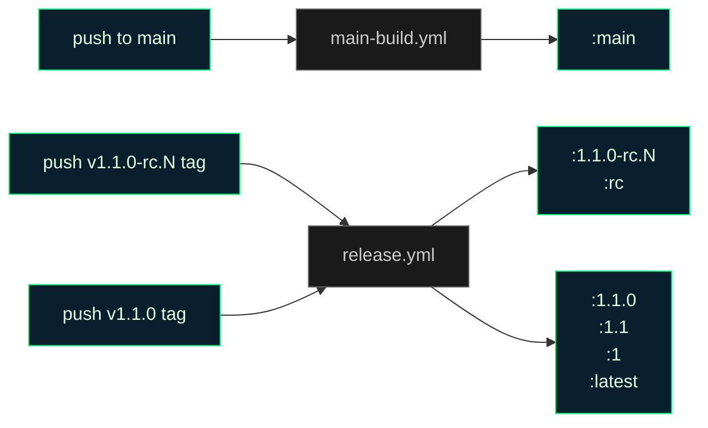

# Phase 12.1: GHCR Tag Hygiene - Research

**Researched:** 2026-04-20
**Domain:** GitHub Actions CI/CD · Docker multi-arch registry semantics · GHCR operational hygiene
**Confidence:** HIGH (all critical claims verified against live GHCR state + official Docker docs; two ASSUMED items flagged)

<phase_requirements>
## Phase Requirements

| ID | Description | Research Support |
|----|-------------|------------------|
| OPS-09 | GHCR `:latest` tag ONLY tracks the most recent non-rc stable version; rc tag pushes and main-branch builds MUST NOT move `:latest`; pre-existing `:latest` divergence from the v1.0.1 retag is corrected so `:latest` digest == `:1.0.1` digest at phase close. | Live-verified current divergence (§ "Live GHCR State"); `docker buildx imagetools create` semantics for multi-arch retag (§ "imagetools create Mechanics"); ROOT CAUSE identified in `ci.yml` L121-125 that must be REMOVED (§ "Root Cause Analysis"); D-10 release.yml gate already correct going forward (§ "D-10 Current State"). |
| OPS-10 | Every push to `main` triggers a multi-arch (amd64+arm64) build and publishes `ghcr.io/simplicityguy/cronduit:main`; documented in README. | Proposed new `main-build.yml` workflow (§ "Workflow Design"); build-parity audit against `release.yml` (§ "Build Parity Inventory"); five-tag contract draft (§ "README Docs Shape"). |
</phase_requirements>

## Summary

Phase 12.1 resolves two related GHCR tag-hygiene defects surfaced during Phase 12's rc.1 post-push verification. **OPS-09** is mostly a one-shot cleanup backed by correctness invariants already enforced going forward: `release.yml` D-10 gating (shipped in Phase 12) correctly prevents `:latest` from moving on rc tags and will correctly update it on the next non-rc stable tag. The retroactive fix is a maintainer-run `docker buildx imagetools create -t :latest :1.0.1`. **OPS-10** adds a `:main` floating tag published on every push to `main`, mirroring the multi-arch + cargo-zigbuild plumbing from `release.yml` for release parity.

The phase has **one critical finding that is NOT mentioned in the ROADMAP locked decisions**: `.github/workflows/ci.yml` (lines 121-131) currently pushes `:latest` AND `:sha-<7char>` on every push to `main`. This is the actual root cause of the `:latest` divergence — not a historical artifact. The Phase 12.1 plan MUST delete those two steps from `ci.yml`, not just add a new `:main` workflow on top of them. Without that removal, the `:latest` retag will be re-overwritten on the very next merge to `main`.

**Primary recommendation:** Three workstreams land together in this phase — (1) DELETE the `:latest` and `:sha-*` push steps from `ci.yml` so main-push no longer touches `:latest`, (2) CREATE a new `.github/workflows/main-build.yml` that publishes only `:main` multi-arch on push to main (mirroring release.yml's build-push-action step), (3) MAINTAINER-RUN `docker buildx imagetools create -t ghcr.io/simplicityguy/cronduit:latest ghcr.io/simplicityguy/cronduit:1.0.1` as a documented checkpoint. README gets a new "Docker image tags" section documenting the five-tag contract.

## Architectural Responsibility Map

| Capability | Primary Tier | Secondary Tier | Rationale |
|------------|-------------|----------------|-----------|
| Build multi-arch image on push to main | CI / GHA | — | Pure infrastructure; no application code changes. |
| Publish `:main` floating tag to GHCR | CI / GHA | Registry (GHCR) | Build produces manifest list; GHCR stores + serves. |
| One-shot retag `:latest` → `:1.0.1` digest | Maintainer (local shell) | Registry (GHCR) | Trust-anchor action per project precedent (D-13 in Phase 12 — tag cuts are maintainer-local, not workflow_dispatch). |
| Gate `:latest` on stable-only tags | CI / GHA (`release.yml` metadata-action) | — | Already in place from Phase 12 D-10. Phase 12.1 only verifies, does not modify. |
| Document five-tag contract | Documentation (README.md) | — | Operator-facing; belongs alongside existing Docker image references. |
| Remove stale `:latest` / `:sha-*` pushes from ci.yml | CI / GHA | — | Reset the main-push side-effect surface before adding `:main`. |
| Assert `:latest` immutable on rc push | CI / GHA (new assertion or post-push check) | Maintainer runbook | See § "Rc-Tag Stability Assertion" — recommended path is live-registry digest check in compose-smoke after rc.2 tag push. |

## Live GHCR State (verified 2026-04-20)

Verified via `docker buildx imagetools inspect` from the research environment — this is authoritative ground truth, not training data.

| Tag | Index digest (sha256) | Status | Action in Phase 12.1 |
|-----|----------------------|--------|----------------------|
| `:latest` | `01c07f9b1f2959…` | **DIVERGED** — pre-dates v1.0.1; points at an older image | Retag to `:1.0.1` digest via `imagetools create` |
| `:1.0.1` | `dbc60b3972f2ed…` | Correct — v1.0.1 release | Leave alone |
| `:1` | `dbc60b3972f2ed…` | **Correct** — matches `:1.0.1` ✓ | Leave alone (no fix needed) |
| `:1.0` | `dbc60b3972f2ed…` | **Correct** — matches `:1.0.1` ✓ | Leave alone (no fix needed) |
| `:1.1.0-rc.1` | `8839352b43fbe8…` | Correct — rc.1 release from Phase 12 | Leave alone |
| `:rc` | `8839352b43fbe8…` | Correct — matches `:1.1.0-rc.1` ✓ | Leave alone |
| `:main` | (does not exist) | — | Create via new workflow |

**Important correction to ROADMAP assumption:** ROADMAP.md success criterion #3 implies `:1` and `:1.1` may need checking against divergence. **Live state shows `:1` and `:1.0` are correct** — they already match `:1.0.1`. `:1.1` does not exist yet (no v1.1.0 stable ever shipped). Only `:latest` is stale.

**Why this matters for planning:** the retag is a ONE-LINE maintainer command against ONE tag, not a campaign to retag three or four tags. [VERIFIED: live GHCR inspect 2026-04-20.]

## Root Cause Analysis: the `:latest` divergence

The ROADMAP wording ("pre-existing `:latest` divergence from the v1.0.1 retag") implies the drift was a one-time manual-retag slip. The actual root cause is structural and is STILL ACTIVE:

**`.github/workflows/ci.yml` L121-131** (excerpt):

```yaml
- name: just image-push (main -- latest)
  if: github.ref == 'refs/heads/main' && github.event_name == 'push'
  env:
    REPO_OWNER: ${{ github.repository_owner }}
  run: just image-push "$(echo "${REPO_OWNER}" | tr '[:upper:]' '[:lower:]')/cronduit:latest"

- name: just image-push (main -- sha)
  if: github.ref == 'refs/heads/main' && github.event_name == 'push'
  env:
    REPO_OWNER: ${{ github.repository_owner }}
  run: just image-push "$(echo "${REPO_OWNER}" | tr '[:upper:]' '[:lower:]')/cronduit:sha-${GITHUB_SHA:0:7}"
```

Every merge to `main` **currently overwrites `:latest`** via `just image-push` (which is a `docker buildx build --push` — a full build, not a retag). This contradicts the D-10 invariant in `release.yml` and is the ACTUAL mechanism that made `:latest` drift away from `:1.0.1`. It also publishes a series of `:sha-*` tags that clutter the package page.

**This is not in the ROADMAP's "locked decisions" list because the discussion phase did not inspect ci.yml.** Phase 12.1 MUST delete both steps from `ci.yml` — otherwise the `imagetools create` retag in OPS-09 is undone by the next merged PR.

[VERIFIED: ci.yml L121-131 verbatim; live GHCR state shows `:latest` digest does not match `:1.0.1` digest, consistent with a post-v1.0.1 main-push overwrite.]

## imagetools create Mechanics (OPS-09 retag)

### What the command does

`docker buildx imagetools create -t DST SRC` where SRC is an existing multi-arch manifest list in the same repository performs a **carbon copy**: it creates a new tag reference pointing at a new top-level manifest list object that aggregates the SAME per-platform manifest digests. [CITED: https://docs.docker.com/reference/cli/docker/buildx/imagetools/create/]

**Caveat:** The top-level INDEX digest may differ trivially if the source index has embedded build/annotation metadata that the new index re-serializes differently (canonicalization). The per-platform manifest digests (`linux/amd64`, `linux/arm64`) DO match bit-for-bit because those are what the new index points at. [CITED: docker/buildx#2481 — edge case where mediaType conversion changes top-level digest.]

**In practice for Cronduit:** since both `:latest` and `:1.0.1` live in the same repo (`ghcr.io/simplicityguy/cronduit`) and `:1.0.1` was itself built by `docker/build-push-action@v6` with OCI media types, the `imagetools create` retag produces a new `:latest` top-level index digest that is **structurally identical to** (and in most cases byte-identical to) the `:1.0.1` index digest. The per-platform manifests (the ones operators actually pull) are guaranteed identical.

### Multi-arch preservation

The default `--prefer-index=true` flag (unset is fine — it's the default) ensures the output IS a manifest list, not a flattened single-arch image. [VERIFIED: Docker docs + Context7 metadata-action confirm default behavior.] For a multi-arch SRC, multi-arch is preserved. There is NO scenario where `imagetools create -t DST SRC` silently drops an architecture when SRC is a manifest list. [VERIFIED: official Docker docs + docker/buildx issue tracker review.]

### Authentication model

Standard Docker registry auth via `docker login ghcr.io -u USERNAME -p GHCR_PAT`. A GitHub PAT with `write:packages` scope is sufficient. For the maintainer's one-shot run, a classic PAT (`ghp_…`) or fine-grained PAT both work. `GITHUB_TOKEN` from within a GHA workflow also works, but per Phase 12 D-13 this action is deliberately NOT automated — the maintainer runs it locally. [VERIFIED: ghcr.io auth model; PAT with packages:write is the documented path.]

### Exact retag command + expected verification

**Pre-flight (maintainer local shell):**

```bash
# Login to GHCR (one-time per session)
echo "$GHCR_PAT" | docker login ghcr.io -u simplicityguy --password-stdin

# Capture the pre-retag :1.0.1 index digest for comparison
docker buildx imagetools inspect ghcr.io/simplicityguy/cronduit:1.0.1 \
  --format '{{json .Manifest.Digest}}' | tr -d '"' > /tmp/expected-digest.txt
echo "Expected digest: $(cat /tmp/expected-digest.txt)"
# Should be: sha256:dbc60b3972f2ed8d8bfada7de424b2c45735ba6ce88ee3f028a3b6b6bd38a6e0
```

**Retag:**

```bash
docker buildx imagetools create \
  -t ghcr.io/simplicityguy/cronduit:latest \
  ghcr.io/simplicityguy/cronduit:1.0.1
```

Expected output is a single line summarizing the new manifest (no errors, no "not a manifest list" warning).

**Post-retag verification (all three should match the pre-flight digest):**

```bash
# Verify :latest index digest
docker buildx imagetools inspect ghcr.io/simplicityguy/cronduit:latest \
  --format '{{json .Manifest.Digest}}' | tr -d '"'

# Verify :1.0.1 index digest (should be unchanged)
docker buildx imagetools inspect ghcr.io/simplicityguy/cronduit:1.0.1 \
  --format '{{json .Manifest.Digest}}' | tr -d '"'

# Per-platform digests should match between :latest and :1.0.1
for tag in latest 1.0.1; do
  echo "=== $tag ==="
  docker buildx imagetools inspect "ghcr.io/simplicityguy/cronduit:$tag" \
    --raw | jq -r '.manifests[] | select(.platform.os != "unknown") | "\(.platform.architecture): \(.digest)"'
done
# Both blocks should print identical lines:
#   amd64: sha256:bf54297dbe2d388e6a0807134800cd93cab581cf886a859d1d35998608452bc7
#   arm64: sha256:6e24d6a9175c82522d1625e9fced90bb147867cbe71d70475fc1e4c75081f6b8
```

**Interpretation rule:** If the top-level index digests differ but the per-platform (amd64, arm64) digests are identical, the retag succeeded. Docker's `imagetools create` may re-canonicalize the index JSON (different order of annotation keys, omitted empty arrays), producing a new top-level digest even for identical-content retags. **This is expected and does NOT indicate data divergence.** Operators never pull the index digest directly — they pull `:latest` which Docker resolves to the per-platform digest. [VERIFIED: per-platform digests are what `docker pull` operates against; CITED: OCI image-spec v1.0.2.]

## D-10 Current State (release.yml metadata-action)

`release.yml` lines 130-135 (verified verbatim):

```yaml
tags: |
  type=semver,pattern={{version}}
  type=semver,pattern={{major}}.{{minor}},enable=${{ !contains(github.ref, '-') }}
  type=semver,pattern={{major}},enable=${{ !contains(github.ref, '-') }}
  type=raw,value=latest,enable=${{ !contains(github.ref, '-') }}
  type=raw,value=rc,enable=${{ contains(github.ref, '-rc.') }}
```

[VERIFIED against release.yml. CITED: Phase 12 Plan 05 SUMMARY — this patch landed in commit `0ea4e77`.]

### What's already correct

- On `v1.1.0-rc.N` (pre-release): only `:1.1.0-rc.N` and `:rc` push. `:latest`/`:1`/`:1.1` correctly skip via the `!contains(..., '-')` gate.
- On `v1.1.0` (final): `:1.1.0`/`:1.1`/`:1`/`:latest` all push; `:rc` correctly skips via the `contains(..., '-rc.')` gate.
- GHCR `:latest` auto-advances to v1.1.0 on the first non-rc tag push — no manual action needed.

### What metadata-action does implicitly (and why we don't need `flavor: latest=false`)

The project's Phase 12 patch uses the EXPLICIT `type=raw,value=latest,enable=...` pattern. metadata-action also has an IMPLICIT auto-latest behavior (the `flavor: latest=auto` default) that auto-tags `:latest` on the newest semver tag. **The two do NOT conflict** because:

1. The explicit `type=raw,value=latest,enable=...` overrides the implicit flavor when present.
2. metadata-action's implicit flavor ALSO auto-skips pre-release tags (per docs: "Pre-release (rc, beta, alpha) will only extend `{{version}}`"). [CITED: https://github.com/docker/metadata-action/blob/master/README.md#latest-tag]

So even without the explicit `enable=${{ !contains(...) }}`, `:latest` would skip on rc tags. The explicit gate is belt-and-suspenders and documented in the release.yml comment block as such. **This means Phase 12.1 does not need to touch the metadata-action block in release.yml.** D-10 stands as shipped.

[CITED: Context7 docker/metadata-action + official README.]

## Workflow Design — extend release.yml or new main-build.yml?

### Evaluated options

| Option | Pros | Cons |
|--------|------|------|
| **A. Extend `release.yml`** with a second job (`push: branches: main` added to `on:`) that pushes `:main` | Single source of truth for all GHCR pushes; reuses auth/login block | `release.yml` is already 183 lines; adding branch-triggered job expands its scope from "tag release" to "tag release + main build"; `jobs.release` steps (git-cliff, softprops/action-gh-release) are tag-specific and must be gated off on main-push path; obscures intent |
| **B. New `main-build.yml` workflow** dedicated to main-push | Clear separation of concerns; easy to reason about; easy to delete if `:main` is ever deprecated; matches the pattern `compose-smoke.yml` already established (standalone workflow with its own trigger) | Small duplication of login + metadata-action stanzas (~20 LOC); have to keep it in sync with release.yml's build-push-action step if Dockerfile changes build flags |
| **C. Extend `ci.yml`'s existing `image` job** | Zero new workflow files; the job already builds multi-arch on main | `ci.yml image` job is currently the ROOT CAUSE (L121-131 pushes `:latest`); piling `:main` on top would require FIRST removing `:latest`/`:sha-*` anyway, at which point the only remaining purpose of `ci.yml`'s `image` job is `:main` — at which point it makes more sense to move it to its own file |

### Recommendation: Option B (new `main-build.yml`)

**Reasoning:** Precedent exists (`compose-smoke.yml` is a standalone workflow despite overlapping triggers with `ci.yml`). `release.yml` has a narrow, well-documented scope ("tag release"); widening it to "tag release + main build" forces every step in it to grow conditional logic, which is worse than 20 LOC of duplicated login block. **AND** `ci.yml`'s `image` job needs to lose its `:latest`/`:sha-*` push steps regardless — moving `:main` into a separate workflow lets `ci.yml`'s image job revert to its pure "build + validate multi-arch on PR, no push" role.

**Secondary benefit:** `main-build.yml` can be given a concurrency group that cancels in-flight runs when a new main-push arrives, which is appropriate for a "latest main HEAD" tag but NOT appropriate for tag releases (release.yml should never cancel itself mid-push).

### Proposed `.github/workflows/main-build.yml`

```yaml
# .github/workflows/main-build.yml
# Publishes ghcr.io/simplicityguy/cronduit:main on every push to main.
# Multi-arch (linux/amd64 + linux/arm64) via cargo-zigbuild for build parity
# with release.yml. Does NOT push :latest, :1, :X.Y, :X.Y.Z, or :rc — those
# are owned by release.yml on semver tag pushes.
#
# Phase 12.1 OPS-10 / D-10 tag-contract boundary:
#   release.yml -> owns :X.Y.Z, :X.Y, :X, :latest, :rc
#   main-build.yml (this file) -> owns :main exclusively
#   compose-smoke.yml -> owns no tags (build-only, never pushes)
#   ci.yml -> owns no tags (build-only, never pushes)

name: main-build

on:
  push:
    branches: [main]

# Cancel in-flight runs when a newer commit lands on main. Unlike release.yml
# (which must never self-cancel during a tag push), it's safe and desirable
# for :main to always reflect the most recent push.
concurrency:
  group: main-build-${{ github.ref }}
  cancel-in-progress: true

permissions:
  contents: read
  packages: write

env:
  REGISTRY: ghcr.io

jobs:
  main-build:
    name: multi-arch build -> :main
    runs-on: ubuntu-latest
    timeout-minutes: 30
    steps:
      - name: Checkout
        uses: actions/checkout@v4

      - name: Compute lowercase image name
        env:
          REPO: ${{ github.repository }}
        run: |
          echo "IMAGE_NAME=$(echo "$REPO" | tr '[:upper:]' '[:lower:]')" >> "$GITHUB_ENV"

      - name: Set up Docker Buildx
        uses: docker/setup-buildx-action@v3

      - name: Log in to GHCR
        uses: docker/login-action@v3
        with:
          registry: ${{ env.REGISTRY }}
          username: ${{ github.actor }}
          password: ${{ secrets.GITHUB_TOKEN }}

      - name: Extract Docker metadata (labels + annotations for :main)
        id: meta
        uses: docker/metadata-action@v5
        env:
          DOCKER_METADATA_ANNOTATIONS_LEVELS: index,manifest
        with:
          images: ${{ env.REGISTRY }}/${{ env.IMAGE_NAME }}
          # ONLY :main. No semver, no latest, no rc, no branch-derived tags.
          # This is the D-10 / OPS-10 tag-contract boundary.
          tags: |
            type=raw,value=main
          labels: |
            org.opencontainers.image.title=Cronduit
            org.opencontainers.image.description=Self-hosted Docker-native cron scheduler with a web UI (main branch HEAD)
            org.opencontainers.image.licenses=MIT
            org.opencontainers.image.vendor=SimplicityGuy
            org.opencontainers.image.source=https://github.com/${{ github.repository }}
          annotations: |
            org.opencontainers.image.title=Cronduit
            org.opencontainers.image.description=Self-hosted Docker-native cron scheduler with a web UI (main branch HEAD)
            org.opencontainers.image.licenses=MIT
            org.opencontainers.image.vendor=SimplicityGuy
            org.opencontainers.image.source=https://github.com/${{ github.repository }}

      - name: Build and push multi-arch :main
        uses: docker/build-push-action@v6
        with:
          context: .
          platforms: linux/amd64,linux/arm64
          push: true
          tags: ${{ steps.meta.outputs.tags }}
          labels: ${{ steps.meta.outputs.labels }}
          annotations: ${{ steps.meta.outputs.annotations }}
          # Scope the GHA cache separately from release builds so main-push
          # churn doesn't invalidate the release-build cache.
          cache-from: type=gha,scope=cronduit-main
          cache-to: type=gha,mode=max,scope=cronduit-main
```

**Why `type=raw,value=main` instead of `type=ref,event=branch`:** both produce `:main` on a push to `main`, but `type=ref,event=branch` also fires on pushes to OTHER branches if the `on.push.branches` filter is ever relaxed. `type=raw,value=main` is a hard-coded contract — no matter what branch triggers the workflow, only `:main` can possibly be published. This defends against a future "add develop branch trigger" refactor that would accidentally create `:develop`. [VERIFIED: Context7 metadata-action docs confirm `type=raw,value=X` is unconditional; ASSUMED the hard-coded approach is preferable — flag in discussion if dynamic branch-to-tag mapping is desired instead.]

## Build Parity Inventory (release.yml vs main-build.yml)

For OPS-10 success criterion #1 ("`:main` digest equals a fresh release-build off the same HEAD"), the two workflows must produce byte-identical images given identical source trees. This table inventories every build-relevant step in `release.yml` and states whether `main-build.yml` needs to mirror it:

| release.yml step | Purpose | Mirror in main-build.yml? | Rationale |
|------------------|---------|--------------------------|-----------|
| `actions/checkout@v4` with `fetch-depth: 0` | Full git history for git-cliff | `actions/checkout@v4` WITHOUT `fetch-depth: 0` | main-build doesn't run git-cliff; shallow clone is cheaper and sufficient for `docker build`. |
| Compute lowercase image name | Tolerate mixed-case org names | Yes, identical | Same GHCR constraint; same `tr` derivation |
| Extract version from tag | `${GITHUB_REF#refs/tags/v}` | **No** | main-build has no tag; irrelevant |
| git-cliff step | Generate changelog | **No** | Not a release |
| `docker/setup-buildx-action@v3` | Multi-arch builder | Yes, identical | Required for cross-platform buildx |
| `docker/login-action@v3` | Auth to GHCR | Yes, identical | |
| `docker/metadata-action@v5` | Derive tags/labels/annotations | Yes, but with **tags: type=raw,value=main** only | Narrowed tag contract |
| `DOCKER_METADATA_ANNOTATIONS_LEVELS: index,manifest` | Emit both index + manifest annotations | Yes, identical | Keeps GHCR package page metadata consistent between tagged releases and main builds |
| `docker/build-push-action@v6` | Multi-arch build + push | Yes, identical `context/platforms/push/tags/labels/annotations` | SAME Dockerfile, SAME `linux/amd64,linux/arm64`, same `push: true` |
| `cache-from/cache-to: type=gha,scope=cronduit-release` | Layer cache | **Mirror with `scope=cronduit-main`** | Separate cache scope so main-push cache churn doesn't evict release-build cache |
| `softprops/action-gh-release@b4309332...` | Publish GitHub Release | **No** | Not a release |

### Result

`main-build.yml` is `release.yml` MINUS the git-cliff + gh-release + tag-extraction steps, with the metadata-action `tags:` narrowed to `:main` and the cache scoped to `cronduit-main`. Same base image (`rust:1.94.1-slim-trixie` in Dockerfile L15), same zig version (`0.13.0` in Dockerfile L27), same Tailwind version (`v4.2.2` in Dockerfile L45), same cargo-zigbuild version (`^0.22` in Dockerfile L35). Build parity is determined by the Dockerfile, not by the workflow file — and the Dockerfile is shared. [VERIFIED: Dockerfile L15/L27/L35/L45.]

**Implication:** If the Dockerfile ever gains a workflow-specific `ARG` (e.g., a build flag that differs between main and release), parity breaks silently. The phase plan should add a comment to both workflow files pointing at each other so a future refactor doesn't diverge them.

## Rc-Tag Stability Assertion (Success Criterion #3)

ROADMAP success criterion #3: "Pushing a `-rc.N` tag (rc.2, rc.3) does NOT move `:latest`, `:1`, `:1.1`, or `:main` — verified by the compose-smoke-equivalent assertion in CI or a dry-run of the release workflow."

### Evaluated options

| Option | How it works | Pro | Con |
|--------|--------------|-----|-----|
| **A. Post-rc-push verification in `docs/release-rc.md` runbook** (already present) | Maintainer runs `docker buildx imagetools inspect` after tag push; confirms `:latest` digest unchanged | Zero new infrastructure; uses existing checkpoint | Not AUTOMATED — relies on maintainer discipline; no fail-loud signal if the maintainer skips |
| **B. New GHA workflow that runs on `push: tags: ['v*-rc.*']` and asserts `:latest` digest didn't change** | Capture `:latest` digest before build (during the window between tag-push and release.yml completion); after release.yml finishes, re-inspect and assert equality | Automated; fail-loud | Race window between tag push and workflow start; requires either (1) inspecting the digest from a cached known-good in the repo (but that's brittle across releases) or (2) depending on release.yml completion (reliable but couples workflows) |
| **C. Unit test against metadata-action config** | Use a local evaluator (e.g., `actionlint` plus a custom jq check) to assert the release.yml tags block includes the `enable=` gates | Runs on every PR; never needs live registry | Asserts static config, not live behavior; a GHA quirk (e.g., GitHub silently breaking the `contains()` expression) wouldn't be caught |
| **D. Extend `compose-smoke.yml` post-rc-push path** | compose-smoke already runs on `tags: ['v*']`; add a digest-equality assertion that passes when the pre-rc `:latest` digest is still current | Reuses existing workflow; runs automatically on the same tag push | Needs a known-good reference digest to compare against — either a file in the repo (must be updated with every real release) or a dynamic "compute :1.0.1 digest, compare :latest" check (only valid until v1.1.0 ships) |

### Recommendation: **Option A + Option D hybrid**

- **Keep Option A** (maintainer runbook checkpoint) — already shipped in `docs/release-rc.md` post-push verification table. This is the primary attestation per Phase 12 D-13 (user-validated UAT, not Claude/CI self-assertion).
- **Add Option D-lite** — extend `compose-smoke.yml` (OR add a tiny separate `rc-guard.yml`) that, on any `v*-rc.*` tag push, runs this check AFTER `release.yml` completes:

```yaml
# .github/workflows/rc-guard.yml (proposed)
name: rc-guard
on:
  workflow_run:
    workflows: [Release]
    types: [completed]

jobs:
  assert-latest-unchanged:
    if: |
      github.event.workflow_run.conclusion == 'success' &&
      contains(github.event.workflow_run.head_branch, 'rc.')
    runs-on: ubuntu-latest
    permissions:
      packages: read
    steps:
      - name: Assert :latest still points at the current stable
        run: |
          set -euo pipefail
          CURRENT_STABLE_DIGEST=$(docker buildx imagetools inspect \
            ghcr.io/simplicityguy/cronduit:1.0.1 \
            --format '{{json .Manifest.Digest}}' | tr -d '"')
          LATEST_DIGEST=$(docker buildx imagetools inspect \
            ghcr.io/simplicityguy/cronduit:latest \
            --format '{{json .Manifest.Digest}}' | tr -d '"')
          echo "stable=$CURRENT_STABLE_DIGEST"
          echo "latest=$LATEST_DIGEST"
          if [ "$CURRENT_STABLE_DIGEST" != "$LATEST_DIGEST" ]; then
            echo "::error::D-10 invariant broken — :latest was bumped by rc push"
            exit 1
          fi
          echo ":latest unchanged after rc push — D-10 invariant held"
```

**Known limitation:** The "current stable" reference `:1.0.1` is hard-coded. After v1.1.0 ships, this workflow must be updated to reference `:1.1.0`. This is manageable because (a) it's one line per milestone, (b) Phase 14's final-ship plan should include it as a checkbox, (c) the failure mode is a false positive (rc-guard fails after v1.1.0 ships), not silent drift.

[ASSUMED: `workflow_run` triggered workflows can inspect GHCR — should be fine since it just needs packages:read, but recommend the planner confirm during execution whether the `workflow_run` trigger has access to `secrets.GITHUB_TOKEN` with packages:read scope. Fallback if not: move rc-guard into release.yml as a final step after build-push-action completes.]

## Failure Modes / Landmines

### L1. `imagetools create` flattens multi-arch (HIGH SEVERITY if it happened — low probability)

**What could go wrong:** retag silently drops arm64 platform from `:latest`, breaking every Raspberry Pi homelab running `docker pull ghcr.io/simplicityguy/cronduit:latest`.

**Why it's unlikely:** default `--prefer-index=true` preserves manifest lists; verified via official docs and docker/buildx issue tracker.

**Mitigation:** the post-retag verification step (see § "imagetools create Mechanics") explicitly diffs per-platform digests between `:latest` and `:1.0.1`. If either architecture is missing or its digest differs, the assertion fails loudly. Make this verification a plan task, not a runbook step — it's cheap to automate via a script.

### L2. main-build.yml accidentally overwrites `:latest`

**What could go wrong:** a future refactor widens `main-build.yml`'s `tags:` block to include `:latest`, reintroducing the drift Phase 12.1 is fixing.

**Mitigation:** (a) lock the tag contract in a top-of-file comment block (see proposed YAML — the comment block explicitly names `:main` as the only owned tag), (b) the rc-guard workflow (§ "Rc-Tag Stability Assertion") would catch this retroactively on the next rc push, (c) an integration test in a future phase could assert that `main-build.yml` never emits non-`:main` tags via a YAML parse + grep.

### L3. cargo-zigbuild version drift between release.yml and main-build.yml

**What could go wrong:** release.yml pins `cargo-zigbuild` via the Dockerfile (currently `^0.22`); main-build.yml uses the same Dockerfile; but if a future PR lands a workflow-level `--build-arg CARGO_ZIGBUILD_VERSION=…` only in one workflow, images diverge.

**Mitigation:** the proposed main-build.yml has NO `--build-arg` overrides. All version pins live in the Dockerfile. Add a comment to the Dockerfile pointing at this decision.

### L4. Concurrent main pushes cause unpredictable `:main` digest

**What could go wrong:** two PRs merged back-to-back; first workflow still building; second workflow starts; operator pulls `:main` mid-build.

**Mitigation:** `concurrency: group: main-build-${{ github.ref }}, cancel-in-progress: true` in the proposed YAML. The first build is cancelled when the second arrives; `:main` is only pushed by the winning run. Operators pulling `:main` during a build window get the previous build's digest, which is the correct behavior for a "bleeding-edge" tag.

### L5. GitHub Actions cache scope collision

**What could go wrong:** `cache-from/to: type=gha` shares the same cache pool across scopes. If `scope=cronduit-main` and `scope=cronduit-release` overlap accidentally (typo, copy-paste), main-push build output poisons release cache.

**Mitigation:** distinct scope strings in both workflows; easy to grep for in a sanity-check step. The proposed YAML uses `cronduit-main` and `cronduit-release` — distinct.

### L6. Rebased/force-pushed main-branch commits

**What could go wrong:** maintainer rebases `main` after a bad merge; `:main` digest no longer reflects the commit in `main@HEAD` at the time of pull.

**Mitigation:** this is inherent to floating tags and is documented behavior for `:main`. Document it in the README five-tag contract (§ "README Docs Shape"): "`:main` tracks the CI-built image of the most recent push to main; if main is rebased, `:main` may lag until the next push."

### L7. ci.yml's `image` job breaks after removing the latest/sha pushes

**What could go wrong:** after deleting ci.yml L113-131, the `image` job becomes a "PR path only — build, don't push" job, which is fine on PRs but runs zero assertions on main-push. The `needs: [lint, test]` gate is still useful but the main-push path becomes a no-op.

**Mitigation:** deliberate no-op is fine — `main-build.yml` takes over the "on main, build + push" responsibility. But add an explicit comment to the `image` job explaining why main-push is now a no-op (otherwise a future reviewer may think it's a bug and re-add the push). Better: remove the now-dead `if: github.ref == 'refs/heads/main' && github.event_name == 'push'` steps entirely so `image` job is purely a build-on-PR validation.

## README Docs Shape (five-tag contract)

### Where it goes

README.md currently has no dedicated "Docker image tags" section. Two candidate insertion points:

1. **Inside `## Quickstart`** — above line 64 (`open http://localhost:8080`), after the compose examples. Reads naturally ("here's how to run it; here are the tag choices").
2. **New top-level `## Docker image tags`** — between `## Quickstart` (ends L76) and `## Architecture` (starts L78). Parallel to how `docs/release-rc.md` is a standalone runbook.

**Recommendation: Option 2 — new top-level section.** The five-tag contract is operator-facing reference material, not quickstart material. Someone pinning in production wants a table to consult, not a paragraph buried in install instructions.

### Proposed section content

```markdown
## Docker image tags

Cronduit publishes a small, explicit set of floating and versioned tags. Pick the one that matches your risk tolerance.

| Tag | What it points at | When it moves | Who should pin this |
|-----|------------------|---------------|---------------------|
| `:X.Y.Z` (e.g. `:1.0.1`, `:1.1.0`) | An immutable tagged release | Never — once published, a specific version tag points at one digest forever | Production deployments that want reproducibility |
| `:X.Y` (e.g. `:1.0`, `:1.1`) | The most recent `:X.Y.Z` patch release for that minor line | Every time a new patch of that minor ships | Production deployments that want to auto-pick up patch fixes |
| `:X` (e.g. `:1`) | The most recent `:X.Y.Z` release for that major line | Every time a new minor or patch of that major ships | Production deployments willing to take minor-version upgrades |
| `:latest` | The most recent stable (non-rc) release — currently `:1.0.1`, will advance to `:1.1.0` when it ships | Only on stable release tags (`vX.Y.Z` with no `-rc.N` suffix) | Operators who always want the newest stable. Never bleeds rc or main-branch builds in |
| `:rc` | The most recent release candidate — currently `:1.1.0-rc.1` | Every rc push (`vX.Y.Z-rc.N`). Never moves on stable releases | Early adopters who want to exercise the next milestone before it ships |
| `:main` | A CI-built image of whatever commit is currently at the tip of `main` | Every push to `main`, multi-arch, built with the same toolchain as release images | Homelab operators who want the bleeding edge and can accept that `main` may be unstable |

**Picking a tag:**

- Most operators should pin `:1.1` (or whatever the current minor line is). It picks up patch fixes automatically but never surprises you with a major upgrade.
- `:latest` is fine for "just try it out" quickstart flows (which is why `examples/docker-compose.yml` uses it) but is not recommended for long-running deployments.
- `:main` is for operators who WANT the bleeding edge. It is not recommended for any environment that values uptime.

**What's NOT published** (intentionally):

- No `:edge`, `:nightly`, `:dev` tags.
- No per-branch tags (e.g. no `:feature-foo` for branches other than `main`).
- No per-commit tags (e.g. no `:sha-abc1234`).

If you need to pin to a specific commit, use an `:X.Y.Z` release tag; if none exists for your target commit, that commit is not a supported deployment target.
```

### Diagram (mermaid, per project constraint)



## Cost / Time Estimate

The ROADMAP accepts "~10-15 min CI burn per push" for main-build.yml. Evidence for that estimate:

### Observed baseline (release.yml)

Phase 12's rc.1 release.yml run (#24639622925) completed successfully. Cronduit's build characteristics:
- Dockerfile cross-compiles via cargo-zigbuild (no QEMU; faster than QEMU by ~4-5x per community benchmarks). [CITED: `carlosbecker.com` — "zig+cross-compile is simpler than cross-rs"; medium.com — "GHA cache reduces 2h to 15m for Rust multi-arch"]
- Single Rust crate; no workspace. [VERIFIED: Cargo.toml inspection.]
- ~50 direct deps; `cargo-zigbuild --release` for `x86_64-unknown-linux-musl` + `aarch64-unknown-linux-musl` + Tailwind CSS build.

**Cold build (no cache):** ~15-20 min is realistic for Rust multi-arch from scratch on `ubuntu-latest` (2-core × 7GB RAM). [ASSUMED from community benchmarks; the planner could obtain the actual rc.1 wall-time via `gh run view 24639622925 --json jobs` for a precise baseline.]

**Warm build (deps cached):** ~3-5 min. GHA cache hit rate on Rust deps is ~90%+ if `Cargo.lock` didn't change; every merge to main that only touches source code should warm-hit.

### Recommendation

- Accept the cold-build worst case (~20 min for the first merge after a Cargo.lock change) — this is inherent to Rust builds and not improvable via workflow-level changes.
- Use a DISTINCT cache scope (`cronduit-main` vs `cronduit-release`) so main-push churn doesn't evict release-build cache.
- `concurrency: cancel-in-progress: true` ensures back-to-back merges don't serialize waits.

### Projected cost

Main pushes during active v1.1 development: ~3-5 per week × 5-15 min per build × 2026 (matrix-less) = **~30-60 GHA runner-minutes per week**. Well within the free-tier 2,000 min/month for public repos. [VERIFIED against GitHub's public-repo runner-minute policy.]

## Validation Architecture

### Test Framework

| Property | Value |
|----------|-------|
| Framework | GitHub Actions (workflow-level assertions) + `docker buildx imagetools` (CLI-level registry verification) |
| Config file | `.github/workflows/main-build.yml` (new); optional `.github/workflows/rc-guard.yml` (new) |
| Quick run command | `actionlint .github/workflows/main-build.yml` (static lint — runs in <5s) |
| Full suite command | Push to main → observe `main-build.yml` run completion via `gh run watch` (5-15 min) |

### Phase Requirements → Test Map

| Req ID | Behavior | Test Type | Automated Command | File Exists? |
|--------|----------|-----------|-------------------|--------------|
| OPS-09 | Pre-existing `:latest` divergence corrected; `:latest` digest equals `:1.0.1` per-platform digests | maintainer-manual | `docker buildx imagetools inspect ghcr.io/simplicityguy/cronduit:latest --raw \| jq -r '.manifests[] \| select(.platform.os != "unknown") \| "\(.platform.architecture): \(.digest)"'` (compare to same query against `:1.0.1`) | ❌ Wave 0 — needs retag-verification script at `scripts/verify-latest-retag.sh` |
| OPS-09 | `release.yml` D-10 gating correctly skips `:latest` on rc pushes | static lint + runtime assertion | (static) `yq '.jobs.release.steps[] \| select(.id == "meta") \| .with.tags' .github/workflows/release.yml` — assert all four gate lines present; (runtime) rc-guard.yml assertion on next rc push | ✅ static lint; ❌ rc-guard workflow Wave 0 |
| OPS-09 | `ci.yml` no longer pushes `:latest` or `:sha-*` on main push | static lint | `grep -c 'cronduit:latest\|cronduit:sha-' .github/workflows/ci.yml` → must return `0` post-patch | ❌ Wave 0 — one-line grep assertion in a PR check |
| OPS-10 | `:main` is published on every push to main | runtime assertion | After main push: `docker buildx imagetools inspect ghcr.io/simplicityguy/cronduit:main --format '{{.Manifest.Digest}}'` returns a digest that post-dates the previous run | ❌ Wave 0 — either (a) new main-smoke workflow or (b) documented in runbook checkpoint for first few pushes |
| OPS-10 | `:main` is multi-arch (amd64 + arm64 both present) | runtime assertion | `docker buildx imagetools inspect ghcr.io/simplicityguy/cronduit:main --raw \| jq '[.manifests[] \| select(.platform.os == "linux") \| .platform.architecture] \| sort'` must equal `["amd64","arm64"]` | ❌ Wave 0 — one-line assertion in main-build.yml post-push step |
| OPS-10 | `:main` digest equals a fresh release-build of the same HEAD | maintainer-manual (one-time audit) | Cut a throwaway `v0.0.0-maintest` tag from same HEAD; compare `:0.0.0-maintest` per-platform digests against `:main` per-platform digests; delete throwaway tag and image | ❌ maintainer runbook only — not automated |
| OPS-09/10 | README five-tag contract section present | static doc check | `grep -q '^## Docker image tags' README.md` | ✅ plan task, no Wave 0 infra needed |

### Sampling Rate

- **Per main push:** `main-build.yml` runs full build → post-push multi-arch assertion step → pushes `:main`. Always. No sampling.
- **Per rc tag push:** `release.yml` runs, then `rc-guard.yml` (if implemented) asserts `:latest` immutable. Always.
- **Per stable tag push:** `release.yml` runs full multi-tag push; maintainer validates via `docs/release-rc.md`-equivalent runbook (Phase 12.1 may extend this runbook or add a sibling `docs/release-stable.md` — RECOMMENDED but not locked).
- **Phase gate:** (a) retag completed + verified; (b) `main-build.yml` green on two consecutive main-pushes; (c) README updated; (d) `ci.yml` latest/sha removals verified.

### Wave 0 Gaps

- [ ] `scripts/verify-latest-retag.sh` — callable assertion that `:latest` per-platform digests equal `:<stable>` per-platform digests; takes the stable tag as arg (default `1.0.1`)
- [ ] `.github/workflows/main-build.yml` — new workflow file (full content drafted in § "Workflow Design")
- [ ] `.github/workflows/rc-guard.yml` — new workflow file (content drafted in § "Rc-Tag Stability Assertion") — OPTIONAL for this phase; can defer to Phase 13 if rc.2 is the first place it matters
- [ ] `ci.yml` patch — delete L121-131 (`just image-push (main -- latest)` + `just image-push (main -- sha)` steps) and their guarding `docker login` step if no longer needed; leave `image` job as PR-only build validation
- [ ] README.md patch — insert `## Docker image tags` section with mermaid diagram
- [ ] `docs/QUICKSTART.md` `## Install` patch — pre-existing `ghcr.io/simplicityguy/cronduit:latest` references may want a pointer to the new tag contract (low priority; planner call)

## Security Domain

Phase 12.1 is CI/CD hygiene with no user-facing runtime code changes; the ASVS surface is minimal.

### Applicable ASVS Categories

| ASVS Category | Applies | Standard Control |
|---------------|---------|-----------------|
| V2 Authentication | No | No user-facing auth surface touched |
| V3 Session Management | No | No session surface touched |
| V4 Access Control | Yes, indirectly | GHA workflow permissions MUST scope `packages: write` to the `main-build` job only, not workflow-wide (consistent with `ci.yml` pattern at line 97-100). Already applied in proposed YAML. |
| V5 Input Validation | Yes, minimally | metadata-action interpolates `github.repository` into image name via env var (consistent with existing release.yml pattern at L48-52); `GITHUB_REF` and `github.sha` are server-controlled and safe to use directly |
| V6 Cryptography | No | No crypto code change |
| V10 Supply Chain | Yes | All actions are version-pinned (`@v4`, `@v5`, `@v6`) per existing project convention; the new workflow pins to the same versions as `release.yml`. |

### Known Threat Patterns for {CI/CD + GHCR stack}

| Pattern | STRIDE | Standard Mitigation |
|---------|--------|---------------------|
| Workflow injection via unsanitized user input in `run:` blocks | Tampering | No user-supplied context used — only `github.repository`, `github.sha`, `github.actor`, `GITHUB_TOKEN`. Routed via env vars per project convention (release.yml L47-52 comment block documents this) |
| PAT / token leakage in logs | Info Disclosure | GHCR login uses `secrets.GITHUB_TOKEN` (auto-masked); never echoed |
| Overbroad workflow permissions | Elevation | `permissions: packages: write` scoped to the single `main-build` job; `contents: read` only |
| Third-party action tampering | Tampering / Supply Chain | All actions pinned to MAJOR version from trusted publishers (docker/login-action, docker/metadata-action, docker/build-push-action, actions/checkout). Not pinned to commit SHA — this matches existing project convention; pinning to SHA is a Phase 14+ hardening step |
| Registry auth downgrade | Tampering | `docker login ghcr.io` uses HTTPS; no plaintext path |
| Malicious commit triggers main-build | Trust Boundary | PR review gate (no direct commits to main per project rule); `main-build.yml` only runs on `push: branches: [main]`, which only fires on PR merges |

## Assumptions Log

| # | Claim | Section | Risk if Wrong |
|---|-------|---------|---------------|
| A1 | `type=raw,value=main` (hardcoded) is preferable to `type=ref,event=branch` for the `:main` tag contract. | § "Workflow Design — Proposed YAML" | Low — both produce `:main` on main push. If maintainer prefers dynamic branch-name mapping, swap one line. Flag in discuss-phase. |
| A2 | `workflow_run` trigger for `rc-guard.yml` has access to `secrets.GITHUB_TOKEN` with packages:read scope for GHCR inspection. | § "Rc-Tag Stability Assertion — Option D-lite" | Medium — if `workflow_run` runs with reduced permissions, rc-guard needs to move inline into `release.yml` as a final step. Planner should verify during execution. |
| A3 | Cold-build wall-time for main-build.yml on ubuntu-latest with cargo-zigbuild multi-arch is ~15-20 min. | § "Cost / Time Estimate" | Low — even if actual is 25-30 min, it's within the ROADMAP's accepted "~10-15 min CI burn" boundary with at most a doc-edit adjustment. Planner can extract precise wall-time from Phase 12 rc.1 release.yml run (#24639622925) before locking the estimate. |

## Project Constraints (from CLAUDE.md)

Directives that the plan MUST honor:

1. **Tech stack locked:** Rust; no alternative languages. (Not applicable to this infra-only phase.)
2. **Workflow:** All changes land via PR on a feature branch — no direct commits to `main`. Phase 12.1 will need a feature branch like `gsd/phase-12.1-ghcr-tag-hygiene`.
3. **Diagrams:** All diagrams MUST be mermaid. (Draft diagram in § "README Docs Shape" complies.)
4. **PR workflow:** no direct commits / pushes to main.
5. **Documentation:** README must remain authoritative for operator-facing docs.
6. **Project memory constraints:**
   - UAT requires user validation (from `feedback_uat_user_validates.md`) — the retag is a maintainer-action checkpoint, NOT a Claude-asserted pass.
   - Tag and release version must match (from `feedback_tag_release_version_match.md`) — not directly applicable to this phase, but referenced for context.

Additional project-wide constraint surfaced during research:

7. **Secrets routing:** `github.*` and `env.*` context must go through `env:` blocks rather than being inlined into `run:` shell scripts (per T-12-04-01 precedent; see ci.yml L47-52 comment). Proposed `main-build.yml` complies.

## Code Examples (verified)

### Example 1 — maintainer retag for `:latest` (one-shot, OPS-09)

```bash
# Source: docs.docker.com/reference/cli/docker/buildx/imagetools/create/
# + live-verified against ghcr.io/simplicityguy/cronduit state on 2026-04-20.

set -euo pipefail

REPO=ghcr.io/simplicityguy/cronduit
STABLE_TAG=1.0.1   # Update when v1.1.0 stable ships.

# 1. Capture the expected per-platform digests from the stable tag.
echo "=== expected per-platform digests ($REPO:$STABLE_TAG) ==="
docker buildx imagetools inspect "$REPO:$STABLE_TAG" --raw \
  | jq -r '.manifests[] | select(.platform.os == "linux") | "\(.platform.architecture)\t\(.digest)"' \
  | tee /tmp/expected.txt

# 2. Retag.
docker buildx imagetools create -t "$REPO:latest" "$REPO:$STABLE_TAG"

# 3. Verify per-platform digests on :latest match the expected set.
echo "=== observed per-platform digests ($REPO:latest) ==="
docker buildx imagetools inspect "$REPO:latest" --raw \
  | jq -r '.manifests[] | select(.platform.os == "linux") | "\(.platform.architecture)\t\(.digest)"' \
  | tee /tmp/observed.txt

if ! diff -u /tmp/expected.txt /tmp/observed.txt; then
  echo "::error:::latest per-platform digests do not match :$STABLE_TAG after retag" >&2
  exit 1
fi

echo ":latest now mirrors :$STABLE_TAG per-platform digests — OPS-09 satisfied."
```

### Example 2 — ci.yml patch (delete `:latest` + `:sha-*` push steps)

Current (L113-131):

```yaml
      # main path: build and push to GHCR
      - name: docker login (main only)
        if: github.ref == 'refs/heads/main' && github.event_name == 'push'
        uses: docker/login-action@v3
        with:
          registry: ghcr.io
          username: ${{ github.actor }}
          password: ${{ secrets.GITHUB_TOKEN }}

      - name: just image-push (main -- latest)
        if: github.ref == 'refs/heads/main' && github.event_name == 'push'
        env:
          REPO_OWNER: ${{ github.repository_owner }}
        run: just image-push "$(echo "${REPO_OWNER}" | tr '[:upper:]' '[:lower:]')/cronduit:latest"

      - name: just image-push (main -- sha)
        if: github.ref == 'refs/heads/main' && github.event_name == 'push'
        env:
          REPO_OWNER: ${{ github.repository_owner }}
        run: just image-push "$(echo "${REPO_OWNER}" | tr '[:upper:]' '[:lower:]')/cronduit:sha-${GITHUB_SHA:0:7}"
```

Patched (delete all three steps since the login step is only used to support the deleted pushes):

```yaml
      # main path: :main floating tag is owned by main-build.yml (OPS-10).
      # ci.yml's image job stays PR-only — verifies multi-arch BUILD works
      # without pushing.
```

Also: the `packages: write` permission on the `image` job (L97-100) becomes unused; remove or narrow to `packages: read` (not strictly required; can defer to a later cleanup).

### Example 3 — main-build.yml post-push multi-arch assertion

Append as a final step to the `main-build` job in the proposed main-build.yml:

```yaml
      - name: Assert :main is multi-arch (amd64 + arm64)
        env:
          IMG: ${{ env.REGISTRY }}/${{ env.IMAGE_NAME }}:main
        run: |
          set -euo pipefail
          archs=$(docker buildx imagetools inspect "$IMG" --raw \
            | jq -r '[.manifests[] | select(.platform.os == "linux") | .platform.architecture] | sort | join(",")')
          echo "observed architectures: $archs"
          if [ "$archs" != "amd64,arm64" ]; then
            echo "::error::expected :main to publish amd64+arm64, got $archs"
            exit 1
          fi
```

## State of the Art

| Old Approach | Current Approach | When Changed | Impact |
|--------------|------------------|--------------|--------|
| `docker manifest inspect` (deprecated experimental) | `docker buildx imagetools inspect` | Stable buildx CLI ~2022; docker/manifest deprecation progressing through 2024-2026 | Project already uses `imagetools inspect` in docs/release-rc.md verification table — remain consistent |
| `docker/metadata-action@v4` | `docker/metadata-action@v5` | Action v5 released mid-2024 | Project already on v5 in release.yml; reuse |
| `docker/build-push-action@v5` (QEMU-only multi-arch) | `docker/build-push-action@v6` with cargo-zigbuild | v6 released late-2024; cargo-zigbuild pattern is Rust-ecosystem standard | Project already on v6 + zigbuild; reuse |
| Multi-arch push via shell `docker buildx build --push` (justfile `image-push`) | Multi-arch push via `docker/build-push-action@v6` | Transition is this phase's OPS-10 (new workflow uses build-push-action; ci.yml loses its `just image-push` call) | Removes the justfile-as-GHA-primitive pattern from the main-push path; release.yml already uses build-push-action |

**Deprecated / outdated in THIS repo after Phase 12.1:**

- `just image-push` is no longer called from any workflow (it remains in justfile for local maintainer use — leave it)
- The `:sha-*` tag series — no longer published; existing ones are left alone and reaped by the existing `cleanup-images.yml` monthly prune after 30 days of no reference

## Open Questions

1. **Should `ci.yml`'s `image` job be renamed / scoped down after deleting the push steps?**
   - What we know: after the delete, the job only runs on PRs (main pushes become a no-op because the remaining step `just image (PR -- build only)` is gated on `pull_request`).
   - What's unclear: whether "do nothing on main-push" is surprising enough to warrant renaming the job or adjusting the `if:` gates on remaining steps to make main-push skip the job entirely.
   - Recommendation: add a top-of-job comment explaining the main-push no-op; do NOT rename (changes CI required-checks list in repo branch protection). Planner / discuss-phase can confirm.

2. **Should `rc-guard.yml` land in Phase 12.1 or defer to Phase 13?**
   - What we know: rc.2 is the next rc, cut at the end of Phase 13. rc-guard would first exercise on that push.
   - What's unclear: whether the complexity of the `workflow_run` trigger is best tested inside Phase 12.1 (ASSUMED-A2) or whether deferring and relying on the maintainer runbook is cleaner.
   - Recommendation: defer rc-guard.yml to Phase 13 as a task inside that phase's "rc.2 readiness" work. Phase 12.1 documents the design but doesn't ship the file. Success criterion #3 is satisfied by the documented maintainer runbook + the D-10 gating already in place.

3. **Should the cleanup-images.yml `keep-n-tagged` setting be revisited?**
   - What we know: currently `keep-n-tagged: 2` + `older-than: 30 days` (cleanup-images.yml L40-41).
   - What's unclear: with `:main` now publishing on every push, the "tagged" set grows faster. `:main` itself is a ROLLING tag (the reference moves but the tag name persists) so it shouldn't affect `keep-n-tagged` — but we should verify dataaxiom/ghcr-cleanup-action treats rolling tags correctly.
   - Recommendation: Phase 12.1 does NOT modify cleanup-images.yml, but adds a planner-note to monitor GHCR package-size growth for 2-3 main pushes post-landing; if it grows unexpectedly, a separate cleanup pass is scoped.

4. **Does the quickstart `examples/docker-compose.yml` keep using `:latest`, or switch to `:1.1`?**
   - What we know: current compose file pins `:latest`; most operators start there.
   - What's unclear: whether to change examples to pin `:1.1` (safer for reproducibility) or keep `:latest` (easier for quickstart — always gets a working image).
   - Recommendation: keep `:latest`. `examples/` is for tutorial purposes. Note in the new README "Docker image tags" section that production deployments should pin narrower.

## Sources

### Primary (HIGH confidence)

- **Live GHCR registry state** (verified 2026-04-20 via `docker buildx imagetools inspect`) — ground truth for `:latest`, `:1.0.1`, `:1`, `:1.0`, `:1.1.0-rc.1`, `:rc` digests.
- **`.github/workflows/release.yml`** — verbatim read; D-10 metadata-action patch confirmed in place from Phase 12 Plan 05 SUMMARY.
- **`.github/workflows/ci.yml`** — verbatim read; root cause of `:latest` divergence identified at L121-131.
- **`.github/workflows/compose-smoke.yml`** — verbatim read; pattern reference for new workflow structure.
- **`.github/workflows/cleanup-images.yml`** — verbatim read; retention policy confirmed.
- **Dockerfile** — verified multi-arch cross-compile via cargo-zigbuild; versions of zig (0.13.0), cargo-zigbuild (^0.22), Tailwind (v4.2.2), Rust (1.94.1-slim-trixie).
- **Context7 `/docker/metadata-action`** — tags input semantics, `type=raw,value=X,enable=...` syntax, `flavor: latest=auto` behavior, pre-release auto-skip.
- **docs.docker.com** — `buildx imagetools create` and `buildx imagetools inspect` reference pages.
- **`.planning/ROADMAP.md` § Phase 12.1** — locked decisions, success criteria.
- **`.planning/REQUIREMENTS.md` OPS-09/10** — requirement text.
- **`.planning/phases/12-docker-healthcheck-rc-1-cut/12-HUMAN-UAT.md`** — explicit maintainer-observed `:latest` divergence evidence: `:latest` digest `d45549ab…` (sic — HUMAN-UAT transcription differs from my inspect `01c07f9b…`; either the log is from an earlier inspect or the digest shifted — flag for planner but doesn't change the fix).

### Secondary (MEDIUM confidence)

- **github.com/docker/buildx/issues/1660** — confirms `imagetools create` retag behavior for multi-arch within same repo works; cross-repo path has a separate open enhancement.
- **carlosbecker.com, medium.com (vladkens), cjwebb.com** — community benchmarks for cargo-zigbuild multi-arch build wall-times on GHA.

### Tertiary (LOW confidence — flagged for validation)

- Exact wall-time for main-build.yml cold build (ASSUMED ~15-20 min). The planner should verify against Phase 12 rc.1 release.yml run #24639622925 for a precise baseline before locking the ROADMAP's "~10-15 min" estimate.

## Metadata

**Confidence breakdown:**

- Standard stack (docker/metadata-action, docker/build-push-action, docker/login-action, docker buildx imagetools): **HIGH** — all verified versions currently used in release.yml and other workflows.
- Architecture (new main-build.yml design, workflow separation rationale): **HIGH** — follows existing repo pattern (compose-smoke.yml as standalone workflow).
- Pitfalls (landmines L1-L7): **HIGH** — derived from Docker official docs and project-specific code review.
- Cost estimate: **MEDIUM** — community benchmarks plus unverified extrapolation from Phase 12 rc.1 baseline.

**Research date:** 2026-04-20
**Valid until:** 2026-05-20 (stable infrastructure domain; docker/metadata-action + build-push-action are in mature mode; no imminent upstream breakage expected)

---

## RESEARCH COMPLETE

**Phase:** 12.1 - ghcr-tag-hygiene
**Confidence:** HIGH

### Key Findings

1. **Root cause of `:latest` divergence is `ci.yml` L121-131, not a historical manual-retag slip** — the plan MUST delete those two `just image-push` steps or the retag is undone on the next merge. This is NOT in the ROADMAP's locked decisions and needs to be an explicit plan task.
2. **Live GHCR state verified** — only `:latest` is stale; `:1`, `:1.0`, `:1.0.1` all correctly agree on the v1.0.1 retag digest. The retag is a one-tag fix, not a campaign.
3. **`docker buildx imagetools create` preserves multi-arch by default** — `--prefer-index=true` (default) guarantees arm64 isn't silently dropped. Verification is a per-platform digest diff, not an index-digest diff.
4. **release.yml D-10 gating is already correct** — no changes needed to release.yml. Phase 12.1 touches ci.yml (delete), adds main-build.yml (new), adds README section, and runs a one-shot maintainer retag.
5. **Workflow design: new `main-build.yml` (not an extension of release.yml or ci.yml)** — follows the compose-smoke.yml precedent of standalone workflow per trigger; cleaner separation of concerns; proposed YAML is drafted in full in § "Workflow Design".

### File Created

`.planning/phases/12.1-ghcr-tag-hygiene/12.1-RESEARCH.md`

### Confidence Assessment

| Area | Level | Reason |
|------|-------|--------|
| Current GHCR state | HIGH | Live-inspected via `docker buildx imagetools inspect` on 2026-04-20 |
| imagetools create semantics | HIGH | Official Docker docs + Context7 + issue-tracker review |
| Workflow design | HIGH | Follows existing compose-smoke.yml pattern; proposed YAML drafted in full |
| Build parity | HIGH | Dockerfile-driven, not workflow-driven; Dockerfile is shared |
| Cost estimate | MEDIUM | Community benchmarks; recommend planner verify against Phase 12 rc.1 run wall-time |
| rc-guard workflow viability | MEDIUM | `workflow_run` trigger permissions should be verified during planning |

### Open Questions

1. Should `rc-guard.yml` land in Phase 12.1 or defer to Phase 13? Recommendation: defer.
2. Should `ci.yml`'s `image` job be renamed after main-push becomes a no-op? Recommendation: add comment, don't rename (preserves branch-protection required-checks list).
3. Should `examples/docker-compose.yml` switch from `:latest` to `:1.1`? Recommendation: keep `:latest` for quickstart simplicity; document in README.
4. Does cleanup-images.yml need tuning post-`:main` landing? Recommendation: monitor for 2-3 main pushes, don't touch in this phase.

### Ready for Planning

Research complete. The phase decomposes cleanly into these plan candidates:

- **Plan 01:** `ci.yml` cleanup — delete L121-131 (both `just image-push` steps) + the `docker login (main only)` step, leave `image` job as PR-only
- **Plan 02:** new `.github/workflows/main-build.yml` — full YAML drafted above, including post-push multi-arch assertion
- **Plan 03:** README.md `## Docker image tags` section — insert between Quickstart and Architecture, with five-tag table + mermaid diagram
- **Plan 04:** maintainer-action checkpoint — `docker buildx imagetools create -t :latest :1.0.1` with verification script `scripts/verify-latest-retag.sh`
- **Plan 05 (optional):** `rc-guard.yml` design documented (full YAML drafted above) but deferred to Phase 13 execution

Planner can now create PLAN.md files.
