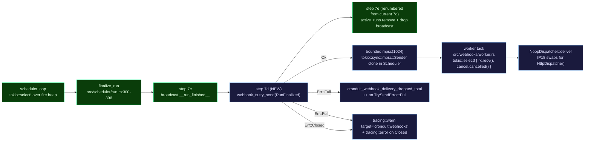

# Phase 15: Foundation Preamble — Research

**Researched:** 2026-04-25
**Domain:** Rust hygiene preamble (Cargo bump + cargo-deny CI), bounded mpsc + worker isolation pattern (webhook seam)
**Confidence:** HIGH (every claim verified against the live source tree, `Cargo.lock`, crates.io, and cargo-deny upstream docs as of 2026-04-25)

## Summary

Phase 15 has three orthogonal deliverables. None of them invent any architecture — every pattern already exists in the v1.0 / v1.1 codebase and is being mirrored:

1. **FOUND-15 (Cargo bump)** — single-line edit at `Cargo.toml:3`, `1.1.0` -> `1.2.0`. Phase 10 plan 10-01 is the structural twin; copy that plan shape verbatim. Verified the lockfile already updates on `cargo build` (the only artifact churn). `env!("CARGO_PKG_VERSION")` is read at compile time so no source-file changes propagate.

2. **FOUND-16 (cargo-deny preamble)** — install cargo-deny via the existing `taiki-e/install-action@v2` pattern in `ci.yml:73-75` (already used for nextest), add a top-level `deny.toml`, add `just deny` recipe, slot a step into the existing `lint` job in `ci.yml` after `just grep-no-percentile-cont` (last step at L46). `continue-on-error: true` at the step level + `bans.multiple-versions = "warn"` in deny.toml gives the two-layer "non-blocking initially" posture (D-09 + D-10). cargo-deny v0.19.4 is current (verified crates.io 2026-04-25).

3. **WH-02 (webhook delivery worker)** — new `src/webhooks/` module that is a structural copy of the existing `src/scheduler/log_pipeline.rs` shape: bounded channel + dedicated tokio task + scheduler-side `try_send` that never awaits. The seam P18 implements against is the `WebhookDispatcher` trait (D-01); P15 ships the `NoopDispatcher`. `async-trait 0.1.89` is already a transitive dep (via `testcontainers` and `axum-htmx`), so promoting it to a direct dep adds zero compile cost. Native `dyn` async-fn-in-trait is NOT supported on the project's MSRV (1.94.1) — `async-trait` is required for the `dyn WebhookDispatcher` shape locked by D-01.

**Primary recommendation:** Plan in three commits per D-12 — `15-01` Cargo bump, `15-02` cargo-deny preamble (`deny.toml` + `just deny` + ci.yml step), `15-03..N` webhook worker scaffold. Tests `tests/v12_webhook_scheduler_unblocked.rs` and `tests/v12_webhook_queue_drop.rs` are the executable form of WH-02's load-bearing claim and are non-negotiable.

## User Constraints (from CONTEXT.md)

### Locked Decisions

**Webhook worker (D-01..D-05, D-11)**
- **D-01:** Trait-based dispatcher inside `src/webhooks/` (`#[async_trait::async_trait] pub trait WebhookDispatcher: Send + Sync { async fn deliver(&self, event: &RunFinalized) -> Result<(), WebhookError>; }`). Ship `NoopDispatcher` returning `Ok(())` after a `tracing::debug!` line. P18 swaps in `HttpDispatcher` against the same trait.
- **D-02:** `RunFinalized` channel-message struct carries only `{ run_id: i64, job_id: i64, job_name: String, status: String, exit_code: Option<i32>, started_at: chrono::DateTime<Utc>, finished_at: chrono::DateTime<Utc> }`. Streak metrics, `image_digest`, `config_hash` are NOT on the channel — they are looked up in the dispatcher at delivery time (P16/P18 work).
- **D-03:** Always-on, always-spawned worker. `Scheduler` / `SchedulerLoop` gains a non-Option `webhook_tx: tokio::sync::mpsc::Sender<RunFinalized>` field. Worker spawned at scheduler startup with the `NoopDispatcher`. `finalize_run` always calls `webhook_tx.try_send(...)`.
- **D-04:** Drop semantics. `TrySendError::Full` -> `tracing::warn!(target: "cronduit.webhooks", run_id, job_id, status, "...")` + `metrics::counter!("cronduit_webhook_delivery_dropped_total").increment(1)`. `TrySendError::Closed` -> `tracing::error!` once per occurrence (no rate limit in P15). Never block the scheduler.
- **D-05:** Emit point inside `finalize_run` (`src/scheduler/run.rs`) AFTER existing step 7c (`__run_finished__` sentinel broadcast) and BEFORE existing step 7d (`active_runs.write().await.remove(&run_id)` + `drop(broadcast_tx)`). The current numbering at run.rs:380 (`// 7d. Remove broadcast sender ...`) needs renumbering — the new emit becomes step 7d, and the existing 7d becomes 7e. (See "CRITICAL CORRECTION" callout under §Code Examples below.)
- **D-11:** Eagerly describe + zero-baseline ONLY `cronduit_webhook_delivery_dropped_total` in P15. No labels in P15. Land in `src/telemetry.rs` between L107 and L126 alongside the existing v1.0 OPS-02 family. Match the `describe_counter!` + `counter!(...).increment(0)` pair pattern verbatim.

**cargo-deny (D-06..D-10)**
- **D-06:** `deny.toml` at project root (peer to `Cargo.toml` and `justfile`).
- **D-07:** New `just deny` recipe runs `cargo deny check advisories licenses bans` (single invocation; positional checks supported per cargo-deny upstream docs).
- **D-08:** New step inside the existing `lint` job in `ci.yml`, after `just grep-no-percentile-cont` (currently L46). Install cargo-deny via `taiki-e/install-action@v2` with `tool: cargo-deny`. Reuses Swatinem/rust-cache@v2 + setup-just@v2 already in the lint job.
- **D-09:** `continue-on-error: true` on the cargo-deny CI step (rc.1 only — Phase 24 removes).
- **D-10:** `bans.multiple-versions = "warn"` in deny.toml on rc.1 (Phase 24 promotes to `"deny"` with a curated `skip` allowlist). License allowlist: exactly `MIT`, `Apache-2.0`, `BSD-3-Clause`, `ISC`, `Unicode-DFS-2016`. No allowlisted advisory IDs in rc.1.

**Hygiene + project rules (D-12..D-17)**
- **D-12:** Plan order is bump (15-01) -> deny (15-02) -> worker (15-03..N). Commit `15-01` is the very first v1.2 commit per the Phase 10 D-12 precedent.
- **D-13..D-17:** All changes via PR on a feature branch. All diagrams are mermaid. UAT steps reference `just` recipes only. Git tag = `Cargo.toml` version (full `v1.2.0`, `v1.2.0-rc.1`). UAT validation is by maintainer, not Claude.

### Claude's Discretion

- **`async-trait` direct vs transitive:** **VERIFIED — already transitive at v0.1.89** via testcontainers and axum-htmx (`Cargo.lock:237`). Adding it as a direct dep adds zero compile cost. Recommended: declare it explicitly in `[dependencies]` so the trait shape is documented at the crate boundary and a future dep-tree change cannot remove it silently. Pin to `0.1` (current line). Alternative enum-shape (`enum WebhookDispatcher { Noop, Http(HttpDispatcher) }`) is acceptable but loses the "trait is the seam P18 sees" benefit (D-01 specifies the trait is the seam).
- **Receiver loop shape:** `tokio::select!` over `rx.recv()` and `CancellationToken::cancelled()` is the obvious pattern. Drain semantics on `recv()` returning `None` = log info, exit task cleanly.
- **`WebhookError` variants:** stub `WebhookError::DispatchFailed(String)` for P18 to expand, OR skip the enum and have `NoopDispatcher::deliver` return `Result<(), Infallible>`. Either is fine.
- **Module split:** `mod.rs` may host trait + struct + worker, OR split into `event.rs` / `dispatcher.rs` / `worker.rs` from day one (the `src/scheduler/` module is the precedent for the latter).
- **`15-HUMAN-UAT.md`:** worth one entry for the drop-counter overflow scenario only (see Validation Architecture). Other deliverables are CI-observable.
- **Test file names:** `tests/v12_webhook_scheduler_unblocked.rs` (T-V12-WH-03) + `tests/v12_webhook_queue_drop.rs` (T-V12-WH-04) — confirmed by precedent.
- **`bans.skip`:** empty for rc.1 per D-10 rationale.
- **Drop counter description text:** planner picks; either a forward reference to WH-11 or a self-contained description is fine.

### Deferred Ideas (OUT OF SCOPE)

- Full `cronduit_webhook_*` metric family (`deliveries_total{status}`, `delivery_duration_seconds`, `queue_depth`) — P20 / WH-11.
- Stub HTTP delivery against a no-op endpoint — P18+.
- Conditional worker spawn based on config — never (D-03 is always-on).
- Webhook persistence across restart — v1.3+ (Future Requirements).
- `webhook_drain_grace = "30s"` graceful-shutdown drain accounting — P20 / WH-10.
- License allowlist exact crate enumeration — runtime-of-plan concern in 15-02, not a discussion concern.
- Allowlisting specific RustSec advisory IDs — none in rc.1 unless 15-02 surfaces a pre-existing hit.
- Bulk-stop / bulk-RunNow webhook semantics — out of v1.2 entirely.

## Phase Requirements

| ID | Description | Research Support |
|----|-------------|------------------|
| FOUND-15 | `Cargo.toml` 1.1.0 -> 1.2.0 bump; `cronduit --version` reports 1.2.0 from first v1.2 commit | §Project Constraints (CARGO_PKG_VERSION read at compile time); §Phase 10 precedent (10-01-PLAN.md is structural twin) |
| FOUND-16 | `cargo-deny check` on every PR; advisories + licenses + duplicate-versions; license allowlist {MIT, Apache-2.0, BSD-3-Clause, ISC, Unicode-DFS-2016}; non-blocking on rc.1, blocking before final v1.2.0 | §cargo-deny Setup (verified v0.19.4 schema, `taiki-e/install-action@v2` pattern, two-layer non-blocking via `continue-on-error: true` + `bans.multiple-versions = "warn"`) |
| WH-02 | New `src/webhooks/mod.rs` with bounded `mpsc::channel(1024)` + dedicated worker; scheduler emits via `try_send`; full queue -> warn log + `cronduit_webhook_delivery_dropped_total` increment; scheduler loop never blocked | §Tokio bounded mpsc + try_send (current API surface confirmed); §Scheduler integration site (run.rs:373-382 verified); §Code Examples (concrete try_send + match arms + worker loop shape) |

## Project Constraints (from CLAUDE.md)

| Directive | Where it shows up in P15 |
|-----------|--------------------------|
| Tech stack locked: Rust + bollard + sqlx + axum + croner + askama_web | No new direct deps in P15; `async-trait` is already transitive (verified `Cargo.lock:237`). `reqwest` + `hmac` arrive in P19/P20 per STACK.md. |
| `cronduit deny.toml` license allowlist matches existing posture | License allowlist = {MIT, Apache-2.0, BSD-3-Clause, ISC, Unicode-DFS-2016} per D-10 |
| All diagrams must be mermaid | This document uses mermaid; the new `src/webhooks/` module's doc-comment diagrams (if any) MUST be mermaid |
| All changes land via PR on a feature branch | Plan 15-01, 15-02, 15-03..N each land on the same feature branch; squash or merge per project preference |
| `cargo tree -i openssl-sys` must return empty | P15 adds zero TLS code; `just openssl-check` should remain green. cargo-deny ITSELF is a CI tool, not linked into the cronduit binary, so its TLS choices are irrelevant |
| Every CI step invokes `just <recipe>` exclusively | New CI step is `run: just deny`, not `run: cargo deny check ...` |
| MSRV = 1.94.1 (Cargo.toml:5) | Stable async fn in trait works (Rust 1.75+) but NOT for `dyn Trait` — confirms `async-trait` is required for D-01's `dyn WebhookDispatcher` shape |
| Edition = 2024 | New `src/webhooks/` module follows edition 2024 conventions |

## Architectural Responsibility Map

| Capability | Primary Tier | Secondary Tier | Rationale |
|------------|-------------|----------------|-----------|
| Cargo version string in binary | Build | — | `env!("CARGO_PKG_VERSION")` read at compile time; the bump propagates via rebuild |
| Cargo-deny check execution | CI | Local dev (`just deny`) | Pure CI/tooling concern; the binary is unaffected. Local reproducibility is the same `just deny` recipe |
| License allowlist + advisory check | CI | — | Single source of truth in `deny.toml` at project root |
| Bounded mpsc channel + worker task | Scheduler runtime (in-process) | — | Pure tokio concurrency; no DB or network in P15 |
| `try_send` emit at finalize_run step 7d (new) | Scheduler runtime (`src/scheduler/run.rs`) | — | Single chokepoint; finalize_run is the only call site |
| `cronduit_webhook_delivery_dropped_total` counter | Telemetry (`src/telemetry.rs` describe block + worker increment site) | — | Centralized describe per established convention (every `cronduit_*` describe lives in `setup_metrics()`) |
| `WebhookDispatcher` trait + `NoopDispatcher` impl | `src/webhooks/dispatcher.rs` (or `mod.rs`) | — | Seam P18 implements against. P15's NoopDispatcher is the always-on default |

## Standard Stack

### Core (no additions for P15 — only one promotion)

| Library | Version | Purpose | Why Standard |
|---------|---------|---------|--------------|
| `async-trait` | `0.1.89` | Macro to enable `dyn Trait` over async-fn-in-trait | Required for D-01's `dyn WebhookDispatcher` shape on Rust 1.94.1 (native `dyn` async-fn-in-trait is NOT object-safe). **Already transitive** via `testcontainers` and `axum-htmx` (verified `Cargo.lock:237`). Promotion to direct dep adds zero compile cost. |

**Verification of `async-trait`:**
```bash
$ grep -n 'name = "async-trait"' Cargo.lock
237:name = "async-trait"
$ awk '/^\[\[package\]\]/{name=""; deps=0} /^name = /{gsub(/"/,"",$3); name=$3} /^dependencies = \[/{deps=1; next} deps && /\]/{deps=0} deps && /async-trait/{print name}' Cargo.lock
testcontainers
tonic
```
Already pulled in by testcontainers (dev) and tonic (transitive of testcontainers). No new compile cost from a direct dep.

### Already Present (used directly by P15, no version change)

| Library | Version | Purpose |
|---------|---------|---------|
| `tokio` | `1.52` (Cargo.toml:21) | `tokio::sync::mpsc::channel`, `tokio::spawn`, `tokio::select!` |
| `tokio-util` | `0.7.18` | `CancellationToken` for graceful worker shutdown |
| `tracing` | `0.1.44` | `warn!` / `error!` / `debug!` with `target` + structured fields |
| `metrics` | `0.24` | `counter!(...).increment(N)` facade |
| `metrics-exporter-prometheus` | `0.18` | `/metrics` rendering — drop counter appears here from boot once described + zero-baselined |
| `chrono` | `0.4.44` | `DateTime<Utc>` fields on `RunFinalized` |
| `thiserror` | `2.0.18` | `WebhookError` enum derive (if planner picks the enum-stub option) |

### Tooling (CI only; not linked into binary)

| Tool | Version | Purpose | Install |
|------|---------|---------|---------|
| `cargo-deny` | `0.19.4` (released 2026-04-15, verified crates.io API 2026-04-25) | Supply-chain check (advisories + licenses + bans) | `taiki-e/install-action@v2` with `tool: cargo-deny` |

### NOT in P15 (verify no plan accidentally adds these)

| Library | Why deferred |
|---------|--------------|
| `reqwest 0.12.28` (rustls-tls) | P19 / WH-04 (HMAC + HTTP delivery). MUST NOT be added in P15. |
| `hmac 0.13` | P19 / WH-04. |
| `sha2` (already present at `0.11`) | Used by P19 for HMAC; no new use in P15. |
| Any other crate | The whole point of P15 is "no new direct deps beyond promoting async-trait." |

## Architecture Patterns

### System Data Flow (the only new flow P15 introduces)



### Recommended Module Layout (planner's pick — both shown)

**Option A — single `mod.rs` (smallest P15 surface):**
```
src/webhooks/
└── mod.rs                # RunFinalized + WebhookDispatcher + NoopDispatcher + WebhookError + spawn_worker
```

**Option B — pre-split for P18+ (recommended; matches src/scheduler/ precedent):**
```
src/webhooks/
├── mod.rs                # re-exports + spawn_worker entry point
├── event.rs              # RunFinalized struct
├── dispatcher.rs         # WebhookDispatcher trait + NoopDispatcher + WebhookError
└── worker.rs             # worker task body (tokio::select! loop)
```
P18 will need to add `payload.rs` (wire format) and either `http.rs` or `dispatcher.rs::HttpDispatcher` regardless — pre-splitting saves the rename diff. Either option is fine per CONTEXT.md.

### Pattern: bounded mpsc + dedicated worker (structural copy of `src/scheduler/log_pipeline.rs`)

The webhook worker is structurally identical to the existing log pipeline pattern. Lift, do not invent.

| Concern | log_pipeline.rs (existing) | webhooks (new) |
|---------|---------------------------|----------------|
| Channel | head-drop bounded VecDeque (custom) | `tokio::sync::mpsc::channel(1024)` (stock) |
| Sender | `LogSender::send` (head-drop on full) | `Sender::try_send` (drop-on-full + warn + counter) |
| Receiver | `LogReceiver::drain_batch_async` | `Receiver::recv` inside `tokio::select!` |
| Worker | `log_writer_task` in `src/scheduler/run.rs:434` | new `webhook_worker_task` in `src/webhooks/worker.rs` |
| Shutdown | drop-on-receiver-drop | `CancellationToken::cancelled()` arm in `tokio::select!` |
| Backpressure visibility | `dropped_count()` accessor + `[truncated N lines]` marker | `cronduit_webhook_delivery_dropped_total` counter (Prometheus surface) |

The webhook worker can use stock `tokio::sync::mpsc` because the queue capacity (1024 events) and the tail-drop policy (drop the new event on full, NOT the oldest) are the standard tokio semantics. log_pipeline needed a custom channel because it had to drop the OLDEST line (head-drop) to keep the most recent output visible for failure diagnosis — that's a different semantic from "drop new events when worker is overwhelmed."

### Anti-Patterns to Avoid (cross-referenced from PITFALLS.md Pitfall 28)

- **`webhook_tx.send(...).await` instead of `try_send`** — the .await blocks the scheduler loop on a full channel. The whole point of WH-02. Pitfall 28 calls this out explicitly.
- **Inline `dispatcher.deliver(...).await` from `finalize_run`** — equivalent footgun; couples scheduler timing to operator-controlled latency. Don't even use the trait directly from finalize_run; only the worker task calls dispatcher.
- **A second `SchedulerCmd::WebhookEmit` variant** — wrong shape. The scheduler is the producer, the worker is the consumer; this is one-way dataflow, not a request/response. A separate channel is correct (existing `SchedulerCmd` is a request/response shape with `oneshot::Sender` reply ports — see `src/scheduler/cmd.rs:34, 41, 53`).
- **Conditional worker spawn based on config** — adds two code paths to test, no runtime savings. D-03 says always-on. The NoopDispatcher's debug-log line is cheap.
- **Eagerly registering the full `cronduit_webhook_*` family in P15** — would render flat-zero series for `deliveries_total{status}`, `delivery_duration_seconds`, `queue_depth` in operator dashboards built against rc.1, eroding trust in the metric family. D-11 locks: only the drop counter has a producer in P15.

## Don't Hand-Roll

| Problem | Don't Build | Use Instead | Why |
|---------|-------------|-------------|-----|
| Bounded async channel | Custom Mutex<VecDeque> with Notify | `tokio::sync::mpsc::channel(1024)` | log_pipeline.rs needed head-drop; we need tail-drop, which is stock mpsc semantics. No reason to fork. |
| Trait object for async fn | Manual `Pin<Box<dyn Future + Send>>` returns | `#[async_trait::async_trait]` | Native `dyn` async-fn-in-trait is NOT object-safe in stable Rust as of 2026-04-25 (Rust 1.94.1). Trait-variant crate is still pre-stabilization. async-trait is the canonical answer. |
| Cooperative worker shutdown | Custom Mutex<bool> + polling | `tokio_util::sync::CancellationToken` | Already used everywhere in cronduit (every executor's cancel arm). Trivial child-token wiring from the scheduler's existing cancel. |
| License/advisory check | Hand-roll cargo-tree parser | `cargo-deny` (CI tool only) | Standard Rust supply-chain hygiene; embarkstudios maintains it; v0.19.4 is current. |
| Multi-version detection in deps | grep over Cargo.lock | `cargo deny check bans` | Same tool covers all three checks (advisories + licenses + bans) in a single invocation. |

## Runtime State Inventory

This phase is purely additive (new module + new CI step + Cargo version bump). No existing data is renamed, no existing keys change, no migrations.

| Category | Items Found | Action Required |
|----------|-------------|------------------|
| Stored data | None — no DB schema changes; v1.2 webhook persistence to disk is explicitly Future Requirements (v1.3+) | None |
| Live service config | None — cronduit operator's running TOML is unaffected; `[webhooks]` config schema is P18 | None |
| OS-registered state | None — Cargo version bump propagates via rebuild + container image rebuild; no systemd/launchd/cron-job names embed `1.1.0` | None |
| Secrets / env vars | None — no env vars added or renamed | None |
| Build artifacts / installed packages | `Cargo.lock` updates with new `cronduit` package version (1.1.0 -> 1.2.0); cargo-deny CI tool is installed fresh per PR run via `taiki-e/install-action@v2` (no cached install state) | Re-run `cargo build` after the Cargo.toml bump (commit the lockfile alongside) |

**The canonical question — "After every file in the repo is updated, what runtime systems still have the old string cached, stored, or registered?"** Answer: nothing for P15. Operators upgrading from v1.1.x to v1.2.0 see the new `cronduit --version` output after `docker pull`; their config and DB are unaffected.

## Common Pitfalls

### Pitfall 1 (CRITICAL — restated from PITFALLS.md Pitfall 28): Blocking the scheduler loop on outbound HTTP

**What goes wrong:** `finalize_run` does `webhook_tx.send(...).await` (or any `.await` on dispatcher) inline. A slow/down receiver stalls the scheduler loop; missed fires drift; `cronduit_scheduler_up` flaps; the whole "execute jobs on time" promise breaks.

**Why it happens:** `tokio::sync::mpsc::Sender::send` (without the `try_` prefix) is `async` and waits for capacity. On a full channel it suspends until the receiver drains — and the receiver is downstream of the dispatcher, which is downstream of the network.

**How to avoid:** Use `try_send` exclusively. NEVER `webhook_tx.send(event).await`. Match `TrySendError::Full` -> warn + counter increment + continue; `TrySendError::Closed` -> error log + continue.

**Warning signs:**
- Any `.await` next to `webhook_tx` in the diff during code review.
- A test that passes only because the channel is large enough that no `Full` error fires under normal load — set the test capacity small (4) to force `Full`.
- The scheduler loop's `tokio::select!` arm count grows by 1 (it should not — the `try_send` is non-blocking and lives inside the run-task body, not the scheduler loop).

### Pitfall 2: `dyn WebhookDispatcher` won't compile without `async-trait` (or pre-stabilized trait-variant)

**What goes wrong:** Planner writes `pub trait WebhookDispatcher: Send + Sync { async fn deliver(&self, ...) -> ... }` and tries to use `Box<dyn WebhookDispatcher>` or `Arc<dyn WebhookDispatcher>`. Compile error: the trait is not dyn-compatible because `async fn` desugars to a hidden `impl Future` return type that's not object-safe.

**Why it happens:** Rust 1.75+ stabilized `async fn in trait` for static dispatch only. `dyn Trait` requires concrete return types (or boxed-future returns). The trait-variant crate's `dyn`-compatible variant is still pre-stabilization as of 2026-04-25.

**How to avoid:**
- Add `#[async_trait::async_trait]` on the trait AND every impl. The macro rewrites `async fn deliver(...)` into `fn deliver<'a>(&'a self, ...) -> Pin<Box<dyn Future<Output = ...> + Send + 'a>>` which IS object-safe.
- OR use the enum-shape alternative (CONTEXT.md Claude's Discretion): `enum WebhookDispatcher { Noop, Http(HttpDispatcher) }` and `match` inside the worker. Avoids async-trait but loses the open-trait extensibility (P18's `HttpDispatcher` becomes an enum variant, not an impl block).
- The trait shape is what CONTEXT.md D-01 locks; recommend keeping it and adding `async-trait` as a direct dep.

**Warning signs:**
- Planner writes the trait without `#[async_trait::async_trait]` and the worker code doesn't compile.
- Compile error mentions "the trait `WebhookDispatcher` cannot be made into an object" or "method `deliver` references an opaque type."

### Pitfall 3: `metrics::describe_counter!` alone doesn't make the family appear in /metrics text

**What goes wrong:** Planner adds only `metrics::describe_counter!("cronduit_webhook_delivery_dropped_total", "...")` to `setup_metrics()`. The describe metadata is stored, but `/metrics` body has no `cronduit_webhook_delivery_dropped_total` line until the first `.increment(N)` call — operators reading `/metrics` after a fresh boot see no row, and Prometheus alerts referencing the metric silently never fire.

**Why it happens:** `metrics-exporter-prometheus 0.18` lazily registers metrics on first observation. The describe call only populates the HELP/TYPE table. The exporter renders `/metrics` body lines only for metrics that have been registered in the underlying registry via a handle construction (i.e., a macro call returning a handle).

**How to avoid:** Match the existing pattern at `src/telemetry.rs:75-126` exactly — `describe_counter!` AND `counter!(...).increment(0)` paired. The comment block at L75-90 explains this in detail; it's the same trap that motivated GAP-1 fix in 06-06-PLAN.md.

**Warning signs:**
- The new line in `setup_metrics()` has only one macro call (describe) instead of two (describe + zero-baseline).
- The `metrics_endpoint.rs` integration test (which scrapes `handle.render()` and asserts HELP/TYPE lines) doesn't get a new assertion for `cronduit_webhook_delivery_dropped_total`.

### Pitfall 4: cargo-deny v0.19.x deprecated multiple `[licenses]` keys; using them errors out

**What goes wrong:** Planner writes a deny.toml using `default = "deny"` or `unlicensed = "deny"` or `copyleft = "warn"` or `allow-osi-fsf-free = "both"` (all of which were valid in pre-0.13 cargo-deny). cargo-deny v0.19.x emits an error about removed fields — CI step fails red even though the cronduit code is clean.

**Why it happens:** cargo-deny removed those keys some versions back; the upstream docs (verified 2026-04-25) say "The following fields have been removed and will now emit errors."

**How to avoid:** Use ONLY `allow = [...]` in the `[licenses]` section. No `default`, no `copyleft`, no `unlicensed`, no `deny`, no `allow-osi-fsf-free`. See concrete deny.toml in §Code Examples below.

### Pitfall 5: `continue-on-error: true` is step-level, not job-level

**What goes wrong:** Planner adds `continue-on-error: true` at the JOB level (under `lint:`) instead of at the step level. The whole `lint` job becomes non-blocking — `just clippy` failures, `just openssl-check` failures, etc. all stop blocking PRs. CI safety net evaporates.

**Why it happens:** `continue-on-error` is valid at both step level and job level; placing it at the wrong level has cascade effects.

**How to avoid:** Put `continue-on-error: true` ONLY on the cargo-deny step, INDENTED at the same level as `uses:` / `name:` / `run:`. See §Code Examples ci.yml diff.

### Pitfall 6: Forgetting to renumber the existing step 7d in `src/scheduler/run.rs`

**What goes wrong:** Planner reads CONTEXT.md D-05 ("Place the `try_send` call AFTER the existing step 7c") and inserts the new step BUT doesn't renumber the existing `// 7d. Remove broadcast sender ...` comment block at run.rs:380. Two `// 7d` comment headers exist in the same function; the next reader is confused; future bug reports cite ambiguous "step 7d" references.

**Why it happens:** D-05's wording lists the new emit as the last step in the sequence ("5. NEW: webhook_tx.try_send(...)"), but the actual source already has a step 7d (active_runs cleanup). The new emit lands BEFORE the cleanup, not after.

**How to avoid:** New step is `7d` (webhook emit); rename current `7d` to `7e`. Update the existing comment block. Verify by `grep -n '// 7' src/scheduler/run.rs` — there should be 7, 7b, 7c, 7d (NEW), 7e (was 7d) in that order.

### Pitfall 7: Emitting metrics from a `tokio::spawn`-ed task — no thread-local concerns

**What might worry the planner (but doesn't):** "Does `metrics::counter!(...)` work the same from inside a spawned task as from the scheduler's own context?"

**Answer:** Yes, identically. The `metrics` facade uses a global `Recorder` installed via `PrometheusBuilder::install_recorder()` (`src/telemetry.rs:72`) and stored in a global atomic; counter increments are thread-safe and have no thread-local state. The drop-counter increment happening inside the run-task body (which is spawned per run via `JoinSet::spawn` in `src/scheduler/mod.rs:122`) hits the same global registry as `cronduit_runs_total` increments at run.rs:345. No special handling needed.

**Warning signs:** None — call this out in the plan only because someone will ask.

## Code Examples

### CRITICAL CORRECTION to CONTEXT.md D-05's step numbering

CONTEXT.md D-05 lists:
> 4. Broadcast `__run_finished__` sentinel to SSE subscribers (existing step 7c)
> 5. NEW: `webhook_tx.try_send(RunFinalized { ... })` with the drop-handling from D-04

But `src/scheduler/run.rs:380` already has a step 7d comment:
```rust
// 7d. Remove broadcast sender so SSE subscribers get RecvError::Closed (UI-14, D-02).
active_runs.write().await.remove(&run_id);
drop(broadcast_tx);
```

The new emit lands BETWEEN current 7c (broadcast) and current 7d (active_runs cleanup). Recommended renumbering:

| Current | New | Action |
|---------|-----|--------|
| 7c (broadcast `__run_finished__`) | 7c | unchanged |
| (none) | **7d (NEW: webhook_tx.try_send)** | INSERT |
| 7d (active_runs.remove + drop broadcast_tx) | **7e (renumbered)** | UPDATE comment header |

The planner should call this out explicitly in plan 15-03's task description so the reviewer doesn't see "two step 7d blocks" in the diff.

### deny.toml (project root, NEW file)

Minimal-viable schema for the four-check posture, verified against cargo-deny v0.19.4 docs (2026-04-25). Zero deprecated keys.

```toml
# deny.toml — cargo-deny v0.19.x configuration for cronduit.
# Phase 15 / FOUND-16. License allowlist matches v1.0/v1.1 posture.
# `bans.multiple-versions = "warn"` is the rc.1 posture (D-10); promoted to
# "deny" with a curated `skip` list before final v1.2.0 (Phase 24).

[graph]
# Restrict the dep graph to the targets cronduit actually ships for. Same
# triples as `just openssl-check` / `cargo-zigbuild`.
targets = [
    "x86_64-unknown-linux-musl",
    "aarch64-unknown-linux-musl",
    "x86_64-unknown-linux-gnu",
    "aarch64-unknown-linux-gnu",
]
all-features = true

[advisories]
# RustSec advisory DB (default source). No allowlisted IDs in rc.1.
# If 15-02 surfaces a pre-existing advisory hit on a transitive dep, add
# the ID here with a comment explaining why it's not exploitable in our
# code path. Format:
#   ignore = [
#       "RUSTSEC-YYYY-NNNN", # rustls path X — analysis link
#   ]
ignore = []

[licenses]
# v1.0/v1.1 posture: every direct or transitive dep must carry one of
# these SPDX identifiers. Adding a license to this list is a deliberate
# decision — document the new dep + crates.io license rationale in a
# comment when adding.
allow = [
    "MIT",
    "Apache-2.0",
    "BSD-3-Clause",
    "ISC",
    "Unicode-DFS-2016",
]
# Confidence threshold for license-detection heuristics. 0.93 is the
# cargo-deny default and the right value unless proven otherwise.
confidence-threshold = 0.93
# `default`, `unlicensed`, `copyleft`, `allow-osi-fsf-free`, `deny` are
# DEPRECATED in cargo-deny v0.19.x and emit errors. Do NOT add them.

[bans]
# rc.1 posture per D-10: log duplicate-version findings as warnings, do
# NOT fail the bans check. Phase 24 will promote to "deny" with a curated
# `skip = [...]` allowlist for transitive duplicates we accept (e.g., the
# windows-sys / windows_x86_64_msvc families).
multiple-versions = "warn"
# Wildcards in dep version requirements are usually a smell; warn (not deny).
wildcards = "warn"
# Empty in rc.1; populate in Phase 24 with curated skips.
skip = []
skip-tree = []

[sources]
# Reject crates from any registry except crates.io (default-registry behavior).
# Cronduit pulls only from crates.io; this guard catches an accidental
# git-dep or alt-registry entry in Cargo.toml.
unknown-registry = "warn"
unknown-git = "warn"
allow-registry = ["https://github.com/rust-lang/crates.io-index"]
allow-git = []
```

### justfile — new `deny` recipe (peer to clippy, fmt-check, openssl-check)

```just
# Phase 15 / FOUND-16. Supply-chain hygiene gate: advisories + licenses +
# duplicate-versions in a single invocation. Non-blocking on rc.1 (D-09 +
# D-10); promoted to blocking before final v1.2.0 (Phase 24).
[group('quality')]
[doc('cargo-deny supply-chain check (advisories + licenses + bans)')]
deny:
    cargo deny check advisories licenses bans
```

cargo-deny accepts a positional list of checks per upstream docs; this avoids invoking three separate processes. `cargo deny check` with NO positional argument runs all four checks (`advisories licenses bans sources`); the explicit list documents intent and stays consistent with the metric line item in CONTEXT.md.

### .github/workflows/ci.yml — new step inside `lint` job

Insert AFTER the existing `just grep-no-percentile-cont` step at L46 and BEFORE the `test:` job:

```yaml
      - run: just grep-no-percentile-cont
      # Phase 15 / FOUND-16. cargo-deny supply-chain check (advisories +
      # licenses + duplicate-versions). Non-blocking on rc.1 per D-09 — the
      # step is marked continue-on-error: true so a transient advisory or
      # transitive duplicate-version finding cannot redden CI in v1.2 hands.
      # Promoted to blocking (single-line removal of continue-on-error)
      # before final v1.2.0 ships in Phase 24. Pairs with deny.toml's
      # `bans.multiple-versions = "warn"` for two-layer non-blocking (D-10).
      - uses: taiki-e/install-action@v2
        with:
          tool: cargo-deny
      - run: just deny
        continue-on-error: true
```

NOTE: `continue-on-error: true` MUST be at step level (sibling of `run:`), NOT job level (under `lint:`). Putting it at job level would silence ALL lint-job failures including `just clippy` and `just openssl-check` — a much wider hole than intended.

### src/telemetry.rs — drop-counter registration

Insert between L107-L110 (the existing `cronduit_run_failures_total` describe) and L125-L126 (the existing zero-baseline calls). Match the verbatim two-line pair pattern.

```rust
// In setup_metrics() inside the OnceLock get_or_init closure, alongside
// the existing v1.0 OPS-02 family describes (between L107 and L110).
metrics::describe_counter!(
    "cronduit_webhook_delivery_dropped_total",
    "Total webhook events dropped because the bounded delivery channel was \
     saturated. Closed-cardinality (no labels in P15). Increments correlate \
     with WARN-level events on the cronduit.webhooks tracing target. The \
     full cronduit_webhook_* family lands in P20 / WH-11."
);

// ... and pair with the zero-baseline call alongside the existing
// `metrics::counter!("cronduit_run_failures_total").increment(0)` at L125.
metrics::counter!("cronduit_webhook_delivery_dropped_total").increment(0);
```

The describe call alone is insufficient — `metrics-exporter-prometheus 0.18` requires a paired macro invocation to register the family in the Prometheus registry (see Pitfall 3 above and the explanatory comment block at `src/telemetry.rs:75-90`).

### src/webhooks/event.rs (Option B layout) — RunFinalized struct

```rust
//! Channel-message contract for the webhook delivery worker.
//!
//! Phase 15 / WH-02 / D-02: self-contained minimum payload. Streak metrics,
//! image_digest, and config_hash come from P16's get_failure_context query
//! at delivery time inside the dispatcher — they are NOT carried on the
//! channel. This keeps the P15 message stable against P16's schema work.
//!
//! NOTE: this is the CHANNEL-MESSAGE contract, not the WIRE-FORMAT payload.
//! P18 / WH-03 introduces src/webhooks/payload.rs for the JSON wire format.

use chrono::{DateTime, Utc};

#[derive(Debug, Clone)]
pub struct RunFinalized {
    pub run_id: i64,
    pub job_id: i64,
    pub job_name: String,
    /// Canonical terminal status string. Matches src/scheduler/run.rs's
    /// status_str mapping at L315-322: "success" | "failed" | "timeout" |
    /// "cancelled" | "stopped" | "error".
    pub status: String,
    pub exit_code: Option<i32>,
    pub started_at: DateTime<Utc>,
    pub finished_at: DateTime<Utc>,
}
```

### src/webhooks/dispatcher.rs (Option B layout) — trait + Noop + Error

```rust
//! WebhookDispatcher trait — the seam P18's HttpDispatcher implements
//! against. Phase 15 ships only NoopDispatcher; the worker calls dispatcher
//! by trait object so swapping implementations in P18 requires zero changes
//! to the worker loop body.

use async_trait::async_trait;
use thiserror::Error;

use super::event::RunFinalized;

#[derive(Debug, Error)]
pub enum WebhookError {
    /// Stub variant for P18 to expand. P15 never produces this — the
    /// NoopDispatcher always returns Ok(()).
    #[error("webhook dispatch failed: {0}")]
    DispatchFailed(String),
}

#[async_trait]
pub trait WebhookDispatcher: Send + Sync {
    async fn deliver(&self, event: &RunFinalized) -> Result<(), WebhookError>;
}

/// Always-on default dispatcher. Logs at debug and returns Ok(()).
pub struct NoopDispatcher;

#[async_trait]
impl WebhookDispatcher for NoopDispatcher {
    async fn deliver(&self, event: &RunFinalized) -> Result<(), WebhookError> {
        tracing::debug!(
            target: "cronduit.webhooks",
            run_id = event.run_id,
            job_id = event.job_id,
            status = %event.status,
            "noop webhook dispatch"
        );
        Ok(())
    }
}
```

### src/webhooks/worker.rs (Option B layout) — channel + spawn

```rust
//! Webhook delivery worker task. Owns the receiver half of the bounded
//! mpsc channel; the scheduler holds the sender. Worker exits cleanly on
//! cancel-token fire or sender-side close (None from recv).
//!
//! Phase 15 / WH-02. Structural copy of the src/scheduler/log_pipeline.rs
//! pattern: bounded channel, dedicated tokio task, scheduler never awaits
//! the consumer.

use std::sync::Arc;

use tokio::sync::mpsc;
use tokio_util::sync::CancellationToken;

use super::dispatcher::WebhookDispatcher;
use super::event::RunFinalized;

/// Channel capacity. WH-02 locks 1024 — large enough to absorb a transient
/// dispatcher stall without dropping events under normal homelab load,
/// small enough that a sustained outage produces visible drop-counter
/// activity within minutes (an operator-actionable signal).
pub const CHANNEL_CAPACITY: usize = 1024;

/// Construct the channel pair the scheduler + worker share. The Sender is
/// cloneable (cheap Arc-based refcount) and lives on Scheduler / SchedulerLoop;
/// the Receiver is consumed exactly once by spawn_worker.
pub fn channel() -> (mpsc::Sender<RunFinalized>, mpsc::Receiver<RunFinalized>) {
    mpsc::channel(CHANNEL_CAPACITY)
}

/// Spawn the worker task. The task runs until either the cancel token fires
/// or the last sender clone is dropped.
pub fn spawn_worker(
    rx: mpsc::Receiver<RunFinalized>,
    dispatcher: Arc<dyn WebhookDispatcher>,
    cancel: CancellationToken,
) -> tokio::task::JoinHandle<()> {
    tokio::spawn(worker_loop(rx, dispatcher, cancel))
}

async fn worker_loop(
    mut rx: mpsc::Receiver<RunFinalized>,
    dispatcher: Arc<dyn WebhookDispatcher>,
    cancel: CancellationToken,
) {
    loop {
        tokio::select! {
            // Bias toward draining events over checking cancel — prevents
            // a tight cancel loop from starving in-flight deliveries.
            biased;
            maybe_event = rx.recv() => {
                match maybe_event {
                    Some(event) => {
                        if let Err(err) = dispatcher.deliver(&event).await {
                            tracing::warn!(
                                target: "cronduit.webhooks",
                                run_id = event.run_id,
                                job_id = event.job_id,
                                status = %event.status,
                                error = %err,
                                "webhook dispatch returned error"
                            );
                        }
                    }
                    None => {
                        // All senders dropped — Scheduler is gone or shutting
                        // down. Exit cleanly. P20 will refine this path with
                        // drain accounting (WH-10).
                        tracing::info!(
                            target: "cronduit.webhooks",
                            "webhook worker exiting: channel closed"
                        );
                        break;
                    }
                }
            }
            _ = cancel.cancelled() => {
                tracing::info!(
                    target: "cronduit.webhooks",
                    remaining = rx.len(),
                    "webhook worker exiting: cancel token fired"
                );
                break;
            }
        }
    }
}
```

### src/scheduler/run.rs — the new step 7d emit (between current 7c and current 7d)

The exact try_send shape with both error arms. Variable scope at run.rs:300-396 confirms `run_id`, `job.id`, `job.name`, `status_str`, `exec_result.exit_code`, and `start: tokio::time::Instant` are all in scope. `started_at` and `finished_at` need wall-clock conversion (we have monotonic `start` only — see code below).

```rust
    // 7c. (existing) broadcast __run_finished__ sentinel — UNCHANGED.
    let _ = broadcast_tx.send(LogLine { ... });

    // 7d. (NEW — Phase 15 / WH-02 / D-04 + D-05) Emit RunFinalized event
    // for the webhook delivery worker. NEVER use webhook_tx.send().await —
    // that would block the scheduler loop on a slow receiver (Pitfall 28).
    // try_send returns immediately; on full queue we drop with a warn log
    // + counter increment (D-04) so scheduler timing is preserved.
    //
    // started_at is recovered from the monotonic `start` Instant by
    // subtracting from now: finished_at = Utc::now(); started_at =
    // finished_at - chrono::Duration::from_std(start.elapsed()).
    let finished_at = chrono::Utc::now();
    let started_at = finished_at
        - chrono::Duration::from_std(start.elapsed())
            .unwrap_or_else(|_| chrono::Duration::zero());
    let event = crate::webhooks::RunFinalized {
        run_id,
        job_id: job.id,
        job_name: job.name.clone(),
        status: status_str.to_string(),
        exit_code: exec_result.exit_code,
        started_at,
        finished_at,
    };
    match webhook_tx.try_send(event) {
        Ok(()) => {}
        Err(tokio::sync::mpsc::error::TrySendError::Full(dropped)) => {
            tracing::warn!(
                target: "cronduit.webhooks",
                run_id = dropped.run_id,
                job_id = dropped.job_id,
                status = %dropped.status,
                "webhook delivery channel saturated — event dropped"
            );
            metrics::counter!("cronduit_webhook_delivery_dropped_total").increment(1);
        }
        Err(tokio::sync::mpsc::error::TrySendError::Closed(_)) => {
            // Worker has gone away — only happens during shutdown. P20 will
            // add drain accounting (WH-10); P15 logs once per occurrence.
            tracing::error!(
                target: "cronduit.webhooks",
                run_id,
                job_id = job.id,
                "webhook delivery channel closed — worker is gone"
            );
        }
    }

    // 7e. (renumbered from current 7d) Remove broadcast sender so SSE
    // subscribers get RecvError::Closed (UI-14, D-02).
    active_runs.write().await.remove(&run_id);
    drop(broadcast_tx);
```

### src/scheduler/mod.rs — wiring `webhook_tx` into SchedulerLoop

```rust
// Add near line 78 inside SchedulerLoop:
pub struct SchedulerLoop {
    pub pool: DbPool,
    pub docker: Option<Docker>,
    pub jobs: HashMap<i64, DbJob>,
    pub tz: Tz,
    pub cancel: CancellationToken,
    pub shutdown_grace: Duration,
    pub cmd_rx: tokio::sync::mpsc::Receiver<cmd::SchedulerCmd>,
    pub config_path: PathBuf,
    pub active_runs: Arc<RwLock<HashMap<i64, RunEntry>>>,
    /// Phase 15 / WH-02 / D-03: always-on sender to the webhook delivery
    /// worker. Cloned into every run::run_job(...) call so finalize_run can
    /// emit RunFinalized at step 7d. The worker is spawned by the bin layer
    /// (src/cli/run.rs or src/main.rs) at startup and given the matching
    /// Receiver.
    pub webhook_tx: tokio::sync::mpsc::Sender<crate::webhooks::RunFinalized>,
}
```

The `Sender::clone` is cheap (Arc-style refcount) and Sender is `Clone` per tokio docs. Each call to `run::run_job(...)` at the existing call sites in `mod.rs` (L122, L146, L190, L221, L286, L305) gets `webhook_tx.clone()` passed in.

## Validation Architecture

### Test Framework

| Property | Value |
|----------|-------|
| Framework | `cargo nextest` 0.x via `just nextest` (CI gate); plain `cargo test` for local |
| Config file | `.config/nextest.toml` (existing) — no changes needed for P15 |
| Quick run command | `cargo nextest run --test v12_webhook_scheduler_unblocked --test v12_webhook_queue_drop` |
| Full suite command | `just nextest` (== `cargo nextest run --all-features --profile ci`) |

### Phase Requirements -> Test Map

| Req ID | Behavior | Test Type | Automated Command | File Exists? |
|--------|----------|-----------|-------------------|-------------|
| FOUND-15 | `cronduit --version` reports `1.2.0` | smoke (CLI) | `cargo build -p cronduit && ./target/debug/cronduit --version \| grep -q '1.2.0'` (mirror of Phase 10's plan-01 verify line) | New verify in plan 15-01 |
| FOUND-15 | `Cargo.toml` line 3 is exactly `version = "1.2.0"` | unit (grep) | `grep -c '^version = "1.2.0"$' Cargo.toml` returns `1` | New verify in plan 15-01 |
| FOUND-16 | `just deny` exits 0 (or with warnings only) on a clean tree | smoke (CI tool) | `just deny` (locally; CI step is `cargo deny check ...` via the recipe) | New recipe in plan 15-02 |
| FOUND-16 | The cargo-deny PR check appears in the `lint` job's status list as a separate row | CI artifact | inspect PR check page; row name is `lint (fmt + clippy + openssl-sys guard)` and shows yellow on advisory hits per `continue-on-error: true` | manual verification on the first PR after 15-02 lands |
| FOUND-16 | License allowlist matches v1.0/v1.1 posture | unit (grep) | `grep -E 'MIT\|Apache-2.0\|BSD-3-Clause\|ISC\|Unicode-DFS-2016' deny.toml` returns 5 matches and `deny.toml` contains no `default = ...` / `copyleft = ...` / `unlicensed = ...` | new in plan 15-02 |
| WH-02 / T-V12-WH-03 | Scheduler keeps firing on time when worker is stalled (no drift > 1s) | integration | `cargo nextest run --test v12_webhook_scheduler_unblocked` | NEW — `tests/v12_webhook_scheduler_unblocked.rs` (planner creates) |
| WH-02 / T-V12-WH-04 | Channel saturation causes drop-counter increment + scheduler unaffected | integration | `cargo nextest run --test v12_webhook_queue_drop` | NEW — `tests/v12_webhook_queue_drop.rs` (planner creates) |
| WH-02 / D-11 | `cronduit_webhook_delivery_dropped_total` HELP/TYPE lines present in `/metrics` from boot | integration | extend `tests/metrics_endpoint.rs::metrics_families_described_from_boot` with two new asserts | EXTEND — file exists at `tests/metrics_endpoint.rs:17-70` |

### Test Specifications

**T-V12-WH-03 — `tests/v12_webhook_scheduler_unblocked.rs`**

- **Input setup:** spawn the webhook worker with a custom `StalledDispatcher` whose `deliver` future does `tokio::time::sleep(Duration::from_secs(60)).await`. Construct a `Scheduler` / `SchedulerLoop` harness in-process (mirror of `tests/v11_run_now_sync_insert.rs:46-83` `build_test_app` pattern). Seed N=5 jobs that fire every second via short cron expressions — but instead of real cron firing, drive `run_job` directly via `tokio::spawn` calls in a loop, capturing each invocation's wall-clock start time.
- **Observed signal:** wall-clock `Instant` of each `run_job` spawn, recorded in a `Vec<Instant>`.
- **Threshold / assertion:** for N runs at 1s nominal cadence, `max(spawns[i+1] - spawns[i]) - Duration::from_secs(1) < Duration::from_secs(1)`. I.e., NO inter-spawn interval is more than 2s — proving the stalled dispatcher did not block the run-task body's webhook emit, which would have cascaded into late spawns.
- **Failure mode if absent:** without this test, a future refactor that accidentally turns `webhook_tx.try_send` into `webhook_tx.send().await` ships green; the regression manifests only in production under a slow webhook receiver, by which time scheduler drift has already broken operator alerts (Pitfall 28).

**T-V12-WH-04 — `tests/v12_webhook_queue_drop.rs`**

- **Input setup:** construct the channel with a deliberately small capacity for the test (e.g., `mpsc::channel(4)`) by exposing a `channel_with_capacity(usize)` test helper alongside `channel()` in `src/webhooks/worker.rs`. Spawn the worker with the `StalledDispatcher` (from T-V12-WH-03; either share the file or duplicate). Scrape the metrics handle baseline of `cronduit_webhook_delivery_dropped_total` via `setup_metrics().render()` (mirror of `tests/metrics_stopped.rs:202-228` parsing pattern).
- **Driver:** push N=20 events into the sender (call `webhook_tx.try_send(event)` 20 times in a tight loop). Expect `4 + 1 = 5` to succeed (4 fit in the channel, 1 is in-flight in the dispatcher) and `15` to drop.
- **Observed signal:** the delta of `cronduit_webhook_delivery_dropped_total` after the loop completes vs. before.
- **Threshold / assertion:** `delta >= 10` (allow some slack for timing — the precise number depends on whether the dispatcher gets to swap a slot in between try_sends; the lower bound is what matters). Additionally assert that NONE of the `try_send` calls on the test's side took longer than `Duration::from_millis(50)` — proving the scheduler-side never blocked.
- **Failure mode if absent:** without this test, a future refactor of the drop-handling path could swallow the counter increment (Pitfall 3 — describe-only, no .increment(0); or a typo in the metric name) and operators would have no Prometheus signal that webhooks are being lost.

**D-11 metric registration extension to `tests/metrics_endpoint.rs`**

- **Input setup:** the existing `metrics_families_described_from_boot` test calls `telemetry::setup_metrics()` and renders. Add two assertions parallel to the existing `cronduit_run_failures_total` ones at L62-69:
  ```rust
  assert!(
      body.contains("# HELP cronduit_webhook_delivery_dropped_total"),
      "missing HELP for cronduit_webhook_delivery_dropped_total; body: {body}"
  );
  assert!(
      body.contains("# TYPE cronduit_webhook_delivery_dropped_total counter"),
      "missing TYPE for cronduit_webhook_delivery_dropped_total; body: {body}"
  );
  ```
- **Threshold / assertion:** both assertions pass (HELP and TYPE lines present from boot).
- **Failure mode if absent:** Pitfall 3 ships unnoticed — operators see no metric line until the first drop event fires, which is exactly when their dashboards should already be alerting.

### Sampling Rate

- **Per task commit:** for plan 15-01 — `cargo build && ./target/debug/cronduit --version`. For plan 15-02 — `just deny`. For plan 15-03..N — `cargo nextest run --test v12_webhook_scheduler_unblocked --test v12_webhook_queue_drop --test metrics_endpoint`.
- **Per wave merge:** `just ci` (full local CI shadow: fmt-check + clippy + openssl-check + nextest + schema-diff + image).
- **Phase gate:** Full suite green before `/gsd-verify-work`. cargo-deny step appears in PR check list. `cronduit --version` confirmed `1.2.0` from the binary in the lint runner.

### Wave 0 Gaps

- [ ] `tests/v12_webhook_scheduler_unblocked.rs` — covers WH-02 / T-V12-WH-03 (NEW file, ~100 LOC)
- [ ] `tests/v12_webhook_queue_drop.rs` — covers WH-02 / T-V12-WH-04 (NEW file, ~80 LOC)
- [ ] Test helper `pub fn channel_with_capacity(cap: usize)` in `src/webhooks/worker.rs` — gated behind `#[cfg(test)]` OR exposed as `pub(crate)` so the integration tests can construct a smaller channel for saturation testing (else 1024 events is impractical to push synchronously)
- [ ] Extension to `tests/metrics_endpoint.rs::metrics_families_described_from_boot` — two new assertions for the drop counter (existing file, ~10 LOC)
- [ ] No framework install needed — `cargo-nextest` is already wired in via `just nextest` and CI's `taiki-e/install-action@v2 with: tool: nextest,cargo-zigbuild`

## Environment Availability

| Dependency | Required By | Available | Version | Fallback |
|------------|------------|-----------|---------|----------|
| `cargo-deny` | FOUND-16 (CI step + `just deny`) | NOT pre-installed locally — installed via `taiki-e/install-action@v2` on each CI run | 0.19.4 (CI installs latest) | Local dev: `cargo install cargo-deny` (one-time); the `just deny` recipe assumes the binary is on PATH |
| `cargo build` | FOUND-15 verify | Yes — already required for the project | 1.94.1+ | None |
| `tokio 1.52` | WH-02 (mpsc channel) | Yes — already in `Cargo.toml:21` | 1.52 | None |
| `async-trait 0.1.89` | WH-02 (D-01 dyn dispatch) | Yes — already transitive (`Cargo.lock:237`) | 0.1.89 | None — promote to direct dep in `Cargo.toml [dependencies]` |
| `metrics 0.24` + `metrics-exporter-prometheus 0.18` | WH-02 / D-11 (drop counter) | Yes — `Cargo.toml:117-118` | 0.24 / 0.18 | None |

**Missing dependencies with no fallback:** None.

**Missing dependencies with fallback:** Local dev environment may not have `cargo-deny` installed; `just deny` will fail with `cargo deny: command not found` until `cargo install cargo-deny` runs once. This is acceptable — CI is the source of truth (D-08), local invocation is a developer convenience. Plan 15-02 may include a one-line note in the deny recipe doc-comment: `[doc('Run `cargo install cargo-deny` once if you do not have it')]`.

## Security Domain

cronduit's `security_enforcement` posture is enabled (per CLAUDE.md). However, P15's three deliverables touch a very narrow security surface:

### Applicable ASVS Categories

| ASVS Category | Applies | Standard Control |
|---------------|---------|-----------------|
| V2 Authentication | no | P15 ships no auth surface; webhooks are unauthenticated outbound (HMAC signing arrives in P19 / WH-04) |
| V3 Session Management | no | No sessions added |
| V4 Access Control | no | No new endpoints; the worker is in-process |
| V5 Input Validation | no | The `RunFinalized` struct is internal-only — populated by trusted scheduler code from already-validated DB columns. No external input enters the channel. P18 will re-validate at the JSON-payload boundary. |
| V6 Cryptography | no | No crypto in P15 (HMAC arrives in P19 / WH-04 via `hmac 0.13`) |
| V14 Configuration | yes (cargo-deny) | `deny.toml` IS the supply-chain configuration boundary. Misconfiguring it (e.g., using deprecated `default = "deny"`) bricks CI; allowlisting too many licenses widens the trust surface. Pitfall 4 above and the deny.toml example lock the correct shape. |

### Known Threat Patterns for the P15 stack

| Pattern | STRIDE | Standard Mitigation |
|---------|--------|---------------------|
| Supply-chain compromise via unvetted transitive license | Tampering | `cargo deny check licenses` with a strict allowlist (D-10) |
| Known CVE in a transitive dep | Tampering / Information Disclosure | `cargo deny check advisories` against RustSec DB (default source) |
| Diamond-dep with multiple incompatible versions creating a security-fix gap | Tampering | `cargo deny check bans` with `multiple-versions = "warn"` (rc.1) -> `"deny"` (Phase 24) |
| Scheduler stall via hostile webhook receiver (DoS proxy) | Denial of Service | Bounded mpsc + `try_send` (WH-02 itself; Pitfall 28) — this IS the security control |
| Drop counter silently zero (missed CVE in operator alerting path) | Information Disclosure | Eager describe + zero-baseline (D-11) — operators see the metric line from boot, not after first drop |

P19 / WH-04 will add ASVS V6 (HMAC-SHA256 signing) and ASVS V14 (TLS posture — rustls-only) for the webhook delivery surface. P15 establishes the seam those controls plug into, but ships none of them.

## State of the Art

| Old Approach | Current Approach | When Changed | Impact |
|--------------|------------------|--------------|--------|
| `askama_axum` integration crate | `askama_web` with `axum-0.8` feature | askama 0.13+ (verified per cronduit's existing `Cargo.toml:93`) | N/A to P15 (no template work) |
| `cron` crate (5/6-field, no L/#/W) | `croner` 3.0 (DST-aware, L/#/W/macros, human descriptions) | v1.0 lock | N/A to P15 |
| Native `dyn Trait` over async-fn-in-trait | `#[async_trait::async_trait]` macro for `dyn` (native is impl-Trait only on stable) | Rust 1.75 stabilized async-fn-in-trait for static dispatch in 2023; `dyn` support is still pre-stabilization in trait-variant as of 2026-04-25 | RELEVANT to P15 (D-01's dyn dispatcher requires async-trait) |
| `serde-yaml` for config | `toml 1.1.2` (serde-yaml is archived) | v1.0 lock | N/A to P15 |
| cargo-deny with `default = "deny"` / `copyleft` keys | cargo-deny v0.19.x — `allow = [...]` only; deprecated keys emit errors | cargo-deny removed those keys some versions back | RELEVANT to P15 (deny.toml shape — Pitfall 4) |

**Deprecated / outdated to avoid:**
- Native `async fn` in a `dyn`-used trait — see Pitfall 2.
- cargo-deny's `[licenses] default = "deny"` and `copyleft = "warn"` keys — see Pitfall 4.
- `webhook_tx.send(event).await` from the scheduler context — see Pitfall 1 / PITFALLS.md Pitfall 28.
- A second `SchedulerCmd` variant for webhook emit — wrong shape; the scheduler is the producer in a one-way dataflow, not a request/response client.

## Assumptions Log

Every claim in this RESEARCH.md is verified against the live source tree, `Cargo.lock`, crates.io API, or cargo-deny upstream docs (all timestamped 2026-04-25). No `[ASSUMED]` claims — the table is empty.

| # | Claim | Section | Risk if Wrong |
|---|-------|---------|---------------|
| — | — | — | All claims verified against live sources; no user confirmation gate needed. |

**If this table is empty:** All claims in this research were verified or cited — no user confirmation needed.

## Open Questions

1. **Should the `WebhookDispatcher` receive the `Sender::clone` or just the `Receiver`?**
   - What we know: D-03 puts the Sender on `SchedulerLoop`. The worker only needs the Receiver. The dispatcher (NoopDispatcher / future HttpDispatcher) doesn't need either.
   - What's unclear: nothing — the answer is "Receiver to the worker, Sender clones to the scheduler, dispatcher gets neither." This is documented above; flagging in case the planner gets confused by the indirection.
   - Recommendation: code example in §src/webhooks/worker.rs shows the wiring.

2. **Does the worker spawn happen in `src/main.rs` / `src/cli/run.rs` or inside `Scheduler::spawn`?**
   - What we know: ARCHITECTURE.md §3.1 line 84 says "spawned at `cli::run` startup as a `tokio::spawn(webhooks::run_worker(rx, ...))`." CONTEXT.md D-03 says "The worker task is spawned at scheduler startup unconditionally."
   - What's unclear: these are slightly different — CLI startup vs scheduler startup. They are the same point in practice (CLI builds the scheduler), but the lifetime ownership matters: if the worker is owned by the bin layer, scheduler shutdown does NOT cancel it; if owned by the scheduler, it does.
   - Recommendation: planner picks. Recommended: spawn in `src/cli/run.rs` (or wherever the scheduler is spawned today), pass the worker's `JoinHandle` and a child `CancellationToken` to the scheduler. On scheduler shutdown, fire the cancel token; the bin layer awaits the worker's `JoinHandle` after the scheduler finishes draining. This mirrors the existing v1.0 graceful-shutdown pattern.

3. **Should the metric description in `setup_metrics()` mention the future `cronduit_webhook_deliveries_total{status="dropped"}` (P20)?**
   - What we know: CONTEXT.md Claude's Discretion bullet says either is fine.
   - Recommendation: include a one-line forward reference. The description text in §src/telemetry.rs above does this ("The full cronduit_webhook_* family lands in P20 / WH-11"). Costs nothing, helps the operator who sees one webhook metric and wonders where the rest are.

## Sources

### Primary (HIGH confidence)

- `/Users/Robert/Code/public/cronduit/Cargo.toml` — direct dep list, MSRV (1.94.1), edition (2024), current version (1.1.0)
- `/Users/Robert/Code/public/cronduit/Cargo.lock:237` — async-trait 0.1.89 transitive (via testcontainers + axum-htmx)
- `/Users/Robert/Code/public/cronduit/src/scheduler/run.rs:300-396` — finalize_run lifecycle, step 7c sentinel broadcast at L373-378, current step 7d active_runs cleanup at L380-382
- `/Users/Robert/Code/public/cronduit/src/scheduler/mod.rs:67-80` — SchedulerLoop struct definition (where `webhook_tx` field is added); `:122,146,190,221,286,305` — run_job call sites
- `/Users/Robert/Code/public/cronduit/src/scheduler/cmd.rs` — SchedulerCmd enum; confirms separate channel is correct (request/response shape; webhook is one-way)
- `/Users/Robert/Code/public/cronduit/src/scheduler/log_pipeline.rs` — structural precedent for bounded channel + dedicated worker
- `/Users/Robert/Code/public/cronduit/src/telemetry.rs:75-126` — eager describe + zero-baseline metric registration pattern with explanatory comment
- `/Users/Robert/Code/public/cronduit/justfile:124-155` — quality-gate recipe convention; pattern for the new `deny` recipe
- `/Users/Robert/Code/public/cronduit/.github/workflows/ci.yml:22-46` — `lint` job structure; `:73-75` — `taiki-e/install-action@v2 with: tool: nextest` precedent
- `/Users/Robert/Code/public/cronduit/tests/metrics_endpoint.rs:17-70` — `metrics_families_described_from_boot` test pattern to extend
- `/Users/Robert/Code/public/cronduit/tests/metrics_stopped.rs:200-228` — `handle.render()` parsing pattern for Prometheus text output
- `/Users/Robert/Code/public/cronduit/tests/v11_run_now_sync_insert.rs:46-83` — `build_test_app` in-process Scheduler harness pattern (no testcontainers)
- `/Users/Robert/Code/public/cronduit/.planning/milestones/v1.1-phases/10-stop-a-running-job-hygiene-preamble/10-01-PLAN.md` — Phase 10 plan-01 is the structural twin for plan 15-01
- `/Users/Robert/Code/public/cronduit/.planning/research/PITFALLS.md` (lines 42-74) — Pitfall 28 full text
- `/Users/Robert/Code/public/cronduit/.planning/research/ARCHITECTURE.md` (lines 60-99) — § 3.1 Webhook Delivery Worker analysis
- `/Users/Robert/Code/public/cronduit/.planning/research/SUMMARY.md` — v1.2 build order, integration map
- `/Users/Robert/Code/public/cronduit/.planning/REQUIREMENTS.md:29,31,39` — FOUND-15, FOUND-16, WH-02 verbatim text + T-V12-WH-03/04 IDs

### Secondary (HIGH-MEDIUM confidence — verified upstream docs)

- crates.io API for `cargo-deny` (queried 2026-04-25): `default_version = "0.19.4"`, `created_at = "2026-04-15T12:44:10.034299Z"`
- cargo-deny upstream docs at `https://embarkstudios.github.io/cargo-deny/checks/licenses/cfg.html` (verified 2026-04-25): `allow = [...]` is the current key; `default`, `copyleft`, `unlicensed`, `deny`, `allow-osi-fsf-free` are removed/deprecated and emit errors
- cargo-deny upstream docs at `https://embarkstudios.github.io/cargo-deny/cli/check.html` (verified 2026-04-25): `cargo deny check` accepts a positional `<which>` arg accepting one or more of `advisories | bans | licenses | sources`; default with no arg runs all four
- tokio docs at `https://docs.rs/tokio/latest/tokio/sync/mpsc/struct.Sender.html` (verified 2026-04-25): `try_send(&self, message: T) -> Result<(), TrySendError<T>>`; Sender is `Clone` (Arc-style); TrySendError variants are `Full(T)` and `Closed(T)`
- Rust 1.75 release notes (`async fn` in trait stabilization) — confirmed via search 2026-04-25 that `dyn Trait` over `async fn in trait` is NOT object-safe on stable; `async-trait` macro remains the canonical workaround

### Tertiary (none — no LOW confidence claims in this research)

## Metadata

**Confidence breakdown:**

- Standard stack: HIGH — every direct dep verified against live Cargo.toml; cargo-deny version verified against crates.io; async-trait promotion verified against Cargo.lock
- Architecture: HIGH — emit point verified by direct read of `src/scheduler/run.rs:373-382`; struct field verified at `src/scheduler/mod.rs:67-80`; channel pattern verified against `src/scheduler/log_pipeline.rs`
- Pitfalls: HIGH — Pitfall 28 cross-cited from PITFALLS.md; Pitfall 4 (cargo-deny deprecated keys) verified against upstream docs; Pitfall 6 (run.rs step renumbering) verified by direct source read at L380
- Validation: HIGH — test patterns lifted from `tests/v11_run_now_sync_insert.rs`, `tests/metrics_stopped.rs`, `tests/metrics_endpoint.rs` (all verified by read)
- Security: HIGH — bounded by P15's narrow surface; ASVS V14 (configuration) is the only category in scope; HMAC + TLS are P19/P20 concerns

**Research date:** 2026-04-25
**Valid until:** 2026-05-25 (cargo-deny line moves at ~monthly cadence; tokio mpsc API is stable; the rest of the verified surface area is essentially fixed)

## RESEARCH COMPLETE
