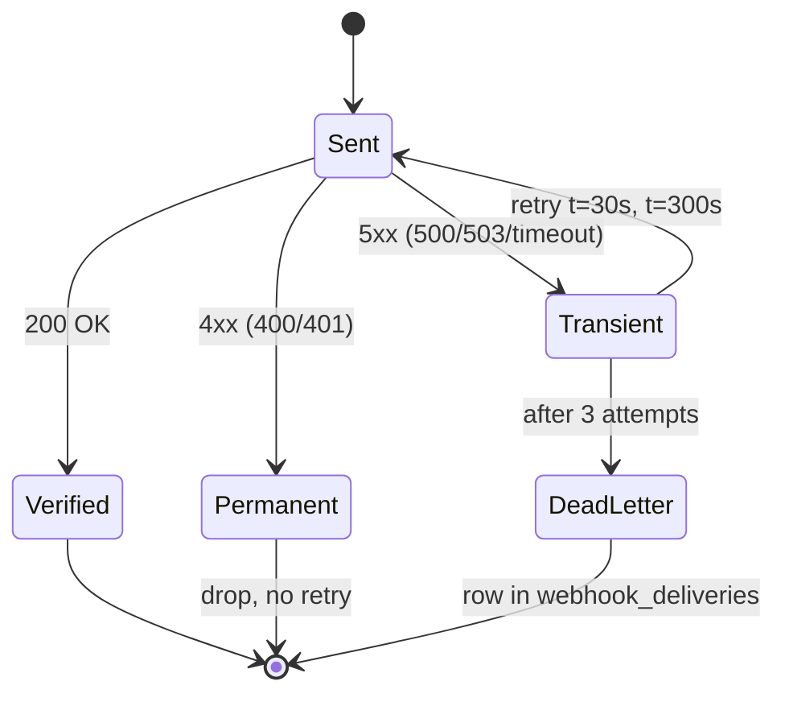

# Phase 19: Webhook HMAC Signing + Receiver Examples — Research

**Researched:** 2026-04-29
**Domain:** Stdlib HTTP receiver implementations (Python/Go/Node) + cross-language HMAC interop testing + operator-facing webhook documentation
**Confidence:** HIGH

## Summary

Phase 19 adds three reference webhook-receiver mini-servers (Python `http.server`, Go `net/http`, Node `http` module) demonstrating constant-time HMAC-SHA256 verification of cronduit's already-implemented Standard Webhooks v1 wire format. The constraint set is tight: stdlib only, ~80–120 LOC each, mirrored on `examples/webhook_mock_server.rs`, with a checked-in interop fixture (`tests/fixtures/webhook-v1/`) that locks the wire format on both sides — Rust unit test re-derives the signature on every CI run, per-language CI matrix re-verifies the same fixture from each receiver.

All key technical decisions are LOCKED in CONTEXT.md (D-01..D-24) and the pre-Phase-18 scaffolding (`sign_v1`, payload encoder, `webhook_mock_server.rs`, justfile recipe family, `tests/fixtures/` directory) makes the research outcome unambiguous: the Phase 19 plan is essentially "transcribe the Phase 18 Rust shape into three stdlib languages, lock the bytes with a fixture, and gate CI." The most consequential research findings are non-obvious only at the seams: (1) `sign_v1` is `pub(crate)` so the fixture test MUST live in-module at `src/webhooks/dispatcher.rs`, (2) Standard Webhooks v1 specifies STANDARD base64 (matches cronduit's `base64::engine::general_purpose::STANDARD`) not URL-safe, (3) the spec's signature header is space-delimited multi-token but cronduit only emits one — receivers should parse all `v1,...` tokens for forward-compat with v1.3+ multi-secret rotation but accept-on-first-match, (4) Node's `crypto.timingSafeEqual` THROWS on length mismatch and the receiver MUST guard before calling, (5) the canonical `WEBHOOK_TOLERANCE_IN_SECONDS = 5*60` (300s) drift constant is established by the upstream Standard Webhooks JS reference implementation.

**Primary recommendation:** Plan ~6 plans — (1) fixture + Rust fixture test, (2) Python receiver + recipe, (3) Go receiver + recipe, (4) Node receiver + recipe, (5) `docs/WEBHOOKS.md` + back-links, (6) CI `webhook-interop` matrix job + `19-HUMAN-UAT.md`. Each receiver plan ships in ~80–120 LOC + per-receiver `README.md` + 2 `just` recipes.

<user_constraints>
## User Constraints (from CONTEXT.md)

### Locked Decisions

**Receiver form factor (Gray Area 1):**
- **D-01:** Each receiver is a runnable mini-server mirroring `examples/webhook_mock_server.rs` — listens on `127.0.0.1:PORT`, parses 3 headers, verifies HMAC, returns appropriate HTTP status, logs verdict.
- **D-02:** Stdlib only — Python `http.server` + `hmac` + `hashlib`; Go `net/http` + `crypto/hmac` + `crypto/sha256`; Node `http` + `crypto`. No Flask/gin/Express; no `pip install` / `npm install` / `go mod download` gating first delivery.
- **D-03:** Per-receiver port: Python `9991`, Go `9992`, Node `9993` (avoids Phase 18's `9999`).
- **D-04:** Each receiver ~80–120 LOC. `verify_signature(secret, headers, body) -> bool` lives at the top of the file as a copy-pasteable function.

**Receiver layout & docs home (Gray Area 2):**
- **D-05:** `examples/webhook-receivers/{python,go,node}/` — each language gets `receiver.{py,go,js}` + `README.md`.
- **D-06:** New `docs/WEBHOOKS.md` is operator-facing hub doc. 10 sections (target ~250–400 lines): Overview + spec link / 3 headers / SHA-256-only / Secret rotation / Constant-time compare / Anti-replay / Idempotency / Retry-aware codes / Receiver links / `webhook_mock_server.rs` pointer.
- **D-07:** `docs/CONFIG.md` § webhook gets back-link to `docs/WEBHOOKS.md` (no duplication).
- **D-08:** README gets one-line addition: "Receiver examples: see [`docs/WEBHOOKS.md`](docs/WEBHOOKS.md)."

**Receiver scope beyond constant-time HMAC verify (Gray Area 3):**
- **D-09:** Each receiver: parse 3 headers (400 if missing/malformed) → drift check (400 if `|now - ts| > 5min`) → HMAC-SHA256 over `${id}.${ts}.${body}` → constant-time compare against base64-decoded value (401 mismatch) → 200 success → 503 catch-all.
- **D-10:** Idempotency dedup is a comment block, NOT working code.
- **D-11:** 5-minute drift hard-coded as `MAX_TIMESTAMP_DRIFT_SECONDS = 300`.
- **D-12:** Retry semantics mapping (verbatim section in `docs/WEBHOOKS.md`):
  | Outcome | HTTP | Cronduit (Phase 20) interpretation |
  |---|---|---|
  | Missing/malformed headers | 400 | Permanent — drop, no retry |
  | Drift > 5 min | 400 | Permanent — drop, no retry |
  | HMAC mismatch | 401 | Permanent — drop, no retry |
  | Verify success | 200 | Counter increment |
  | Unexpected exception | 503 | Transient — Phase 20 retries (t=0/30s/300s) |

**Interop CI verification (Gray Area 4):**
- **D-13:** `tests/fixtures/webhook-v1/` holds `secret.txt`, `webhook-id.txt`, `webhook-timestamp.txt`, `payload.json`, `expected-signature.txt`. Plaintext files; receivers read directly with stdlib file I/O.
- **D-14:** Rust fixture test re-derives `expected-signature.txt` from inputs every run (locks signing side forever).
- **D-15:** New GHA job `webhook-interop` (matrix: python/go/node) runs `just uat-webhook-receiver-${{ matrix.lang }}-verify-fixture`. CI gate from day one (NOT continue-on-error like cargo-deny).
- **D-16:** 6 new `just` recipes — `uat-webhook-receiver-{python,go,node}` (against real cronduit) and `uat-webhook-receiver-{python,go,node}-verify-fixture` (CI-gateable).
- **D-17:** Tamper variants (canonical pass / mutated secret / mutated body / shifted timestamp) embedded in verify-fixture recipes.

**Universal Project Constraints (D-18..D-24):**
- D-18: PR branch `phase-19-webhook-hmac-receivers`; no direct commits to main.
- D-19: All diagrams mermaid (no ASCII).
- D-20: `Cargo.toml` stays at `1.2.0`; no rc cut in Phase 19 (Phase 20 cuts rc.1).
- D-21: UAT recipes use existing `just` commands; 6 new recipes are the only new UAT surface.
- D-22: Maintainer validates UAT — Claude never marks UAT passed.
- D-23: No UI surface in Phase 19.
- D-24: Zero new Rust crates; `cargo tree -i openssl-sys` stays empty.

### Claude's Discretion
- Exact filenames (`receiver.py` vs `verify.py` vs `server.py`) — language convention.
- Exact recipe body shape (CLI flag vs sibling test harness file).
- Section ordering inside `docs/WEBHOOKS.md` beyond D-06's 10 sections.
- Whether `webhook-interop` is a new top-level job in `ci.yml` or new workflow file.
- Exact ULID/timestamp/secret values in fixture files.

### Deferred Ideas (OUT OF SCOPE)
- Working idempotency dedup in receivers (comment-block only).
- Configurable timestamp-drift window (hard-coded 5 min).
- Framework examples (Flask/gin/Express).
- Webhook UI on dashboard.
- Algorithm-agility (SHA-384/512/Ed25519).
- Pluggable signature schemes (GitHub `x-hub-signature` style).
- Cronduit-side multi-secret rotation window.
- More than 3 receiver languages (Ruby/Java/.NET).
- Per-receiver Docker images.
- Fixture interop with upstream Standard Webhooks reference test vectors (opportunistic if upstream ships them).
</user_constraints>

<phase_requirements>
## Phase Requirements

| ID | Description | Research Support |
|----|-------------|------------------|
| WH-04 | HMAC algorithm is **SHA-256 only** in v1.2 (no algorithm-agility / multi-secret rotation cronduit-side). Cronduit ships receiver examples in Python, Go, and Node demonstrating constant-time HMAC compare (NOT `==` on hex bytes — timing-attack defense). | Standard Stack (§ Stdlib HTTP receivers per language) confirms each language's constant-time primitive (`hmac.compare_digest` / `hmac.Equal` / `crypto.timingSafeEqual`). Code Examples (§ 5-line verify-signature per language) are the copy-paste targets for D-04. Architecture Patterns (§ Receiver mini-server shape) match D-01. Pitfalls (Pitfall 2 — Node length-guard, Pitfall 6 — secret-file newline) lock the gotchas. CI Matrix Pattern provides D-15 YAML skeleton. Sign-side wire format (§ Standard Webhooks v1 wire format) corroborates header semantics, base64 alphabet, and 5-minute drift constant against `src/webhooks/dispatcher.rs::sign_v1`. |
</phase_requirements>

## Architectural Responsibility Map

| Capability | Primary Tier | Secondary Tier | Rationale |
|------------|-------------|----------------|-----------|
| HMAC signing (cronduit-side) | Rust backend (`HttpDispatcher`) | — | Done in Phase 18; Phase 19 only locks against it via fixture. |
| HMAC verification (receiver-side) | External example processes (Python/Go/Node) | — | Receivers are stand-alone scripts run by operators; cronduit never executes them. |
| Wire-format lock test | Rust unit test (`src/webhooks/dispatcher.rs::tests`) | — | `sign_v1` is `pub(crate)` — fixture test must live in-module. Compile-time `include_bytes!` for fixture data. |
| Cross-language interop CI | GitHub Actions (new `webhook-interop` matrix job) | `just` recipe layer | Recipes are the language-uniform invocation surface; GHA only sets up the toolchain and calls `just`. Mirrors existing `lint`/`test` jobs that delegate to `just <recipe>`. |
| Operator documentation | `docs/WEBHOOKS.md` (new) | `docs/CONFIG.md` (back-link), `README.md` (one-line pointer) | Hub-doc pattern matches existing `docs/QUICKSTART.md`/`docs/SPEC.md`/`docs/CONFIG.md` triad. |
| Tamper-variant assertion | `just` recipe internals (per-language `verify-fixture` recipes) | Receiver verify function | Recipe orchestrates 4 invocations (canonical / mutated-secret / mutated-body / drift); receiver only owns single-invocation verify. Keeps mutation logic readable at recipe layer. |

## Standard Stack

> Phase 19 introduces ZERO new Rust crates (D-24). The "stack" here is each language's stdlib + its constant-time HMAC primitive + the existing CI tooling.

### Core (per-language receiver stdlib)

| Language | Module(s) | Purpose | Why Standard | Confidence |
|---|---|---|---|---|
| Python 3.x | `http.server.HTTPServer` + `BaseHTTPRequestHandler` | Mini HTTP server | Stdlib since 2.x. `do_POST` method override is the documented pattern. `ThreadingHTTPServer` is the threaded variant — for a *receiver example* the single-threaded `HTTPServer` is fine; mention `ThreadingHTTPServer` in the idempotency comment as production guidance. | HIGH `[CITED: docs.python.org/3/library/http.server.html via Context7]` |
| Python 3.x | `hmac.new(key, msg, digestmod=hashlib.sha256)` + `hmac.compare_digest(a, b)` | HMAC + constant-time compare | `hmac.compare_digest` is documented as constant-time; accepts both `str` and bytes-like (decode signatures to bytes BEFORE compare for unambiguous semantics). | HIGH `[CITED: docs.python.org/3/library/hmac.html via Context7]` |
| Go 1.21+ | `net/http.HandleFunc` + `http.ListenAndServe` | Mini HTTP server | `net/http` runs each handler in its own goroutine — already concurrent. `io.ReadAll(r.Body)` reads the whole body; use a `MaxBytesReader` wrapper to cap (1 MiB matches `webhook_mock_server.rs`'s safety cap). | HIGH `[CITED: pkg.go.dev/net/http via Context7]` |
| Go 1.21+ | `crypto/hmac.New(sha256.New, key)` + `hmac.Equal(macA, macB)` | HMAC + constant-time compare | `hmac.Equal` is the package-level function `func Equal([]byte, []byte) bool`. Preferred over `crypto/subtle.ConstantTimeCompare` for HMAC outputs because `hmac.Equal` semantically expresses intent (a comment can elide that distinction; both are constant-time). | HIGH `[CITED: pkg.go.dev/crypto/hmac via Context7]` |
| Node 20+ | `http.createServer((req, res) => ...)` + `req.on('data', ...)` + `req.on('end', ...)` | Mini HTTP server | `http.createServer` is the modern stdlib pattern. Body comes in `Buffer` chunks unless `req.setEncoding('utf8')` is called — use raw `Buffer` accumulation to preserve byte-exact body for HMAC. | HIGH `[CITED: nodejs.org/api/http.html via Context7]` |
| Node 20+ | `crypto.createHmac('sha256', key)` + `crypto.timingSafeEqual(bufA, bufB)` | HMAC + constant-time compare | `crypto.timingSafeEqual` THROWS `RangeError` if buffer lengths differ — receiver MUST guard length before calling (Pitfall 2). | HIGH `[CITED: nodejs.org/api/crypto.html via Context7]` |

**Verified versions:** Per-language major versions are pinned by what's currently shipping on `ubuntu-latest` GHA runners in 2026: Python 3.12+, Go 1.21+, Node 20+ (matrix `setup-*` actions install latest minor in the major specified). All three constant-time primitives are stable APIs going back many years; no version-sensitivity concerns.

### Supporting (cronduit-side, all already in `Cargo.toml`)

| Library | Version | Purpose | When to Use | Confidence |
|---|---|---|---|---|
| `hmac` | 0.13.x (existing) | HMAC trait + `Hmac<Sha256>` | Reused in fixture test (no new dep) | HIGH `[VERIFIED: Cargo.toml from Phase 18]` |
| `sha2` | 0.11.x (existing) | SHA-256 | Reused in fixture test | HIGH |
| `base64` | 0.22.x (existing) | `STANDARD` engine encode | Reused in fixture test | HIGH |
| `secrecy` | (existing) | `SecretString` wrapper | Used to construct secret in fixture test (mirrors prod path) | HIGH |
| `serde_json` | 1.x (existing) | Payload struct → bytes | Used to compose `payload.json` body bytes if test prefers struct→serialize over `include_bytes!` | HIGH |

### Supporting (CI tooling, all already in repo)

| Tool | Version | Purpose | Notes | Confidence |
|---|---|---|---|---|
| `actions/checkout` | v4 | Source checkout | Already used in `ci.yml` | HIGH `[VERIFIED: .github/workflows/ci.yml]` |
| `actions/setup-python` | v5 | Python toolchain | v5 is the current major in 2026 (v5.1.x patches). Default Python 3.x on `ubuntu-latest` is sufficient — no `python-version:` pin needed for stdlib-only code. | HIGH `[CITED: github.com/actions/setup-python releases]` |
| `actions/setup-go` | v5 | Go toolchain | v5 is the current major. v6 exists (Apr 2026, runs node24) but v5 is still supported and matches the `setup-python@v5` cohort. | HIGH `[CITED: github.com/actions/setup-go releases]` |
| `actions/setup-node` | v4 | Node toolchain | v4 is the current major. | HIGH `[CITED: github.com/actions/setup-node releases]` |
| `extractions/setup-just` | v2 | `just` on the runner | Already used by the existing `lint`/`test`/`image` jobs at `ci.yml:34, :84, :123`. | HIGH `[VERIFIED: .github/workflows/ci.yml]` |

### Alternatives Considered

| Instead of | Could Use | Tradeoff |
|---|---|---|
| Python `http.server.HTTPServer` | Flask + `flask --app receiver.py run` | Adds `pip install flask` step, breaks D-02 (stdlib only). Flask example useful for operators but belongs in v1.3+ as opt-in. |
| Go `net/http.HandleFunc` | `gin-gonic/gin` or `gorilla/mux` | Adds `go.mod` + `go mod download`, breaks D-02. |
| Node `http.createServer` | `express` | Adds `npm install`, breaks D-02. |
| `crypto/subtle.ConstantTimeCompare` (Go) | `hmac.Equal` | Equivalent constant-time guarantee; `hmac.Equal` semantically clearer for HMAC outputs. Both work; pick `hmac.Equal` for readability. |
| Receiver CLI flag `--verify-fixture <dir>` | Sibling harness script (`verify_fixture.py`) | CLI flag keeps everything in one file (D-04: copy-pasteable verify function); harness script doubles file count without benefit. **Pick CLI flag.** |
| Recipe orchestrates mutations | Receiver's `--verify-fixture` runs all 4 internally | Recipe orchestration keeps mutation logic visible to recipe-readers and language-uniform; receiver-internal would put 4 distinct branches into each script. **Pick recipe orchestration** (D-17: "tamper variants encoded as recipe-internal mutations" matches CONTEXT specifics line 161). |
| New top-level workflow file `webhook-interop.yml` | New job in existing `ci.yml` | `ci.yml` is already well-organized (lint / test / image / compose-smoke); adding a 5th sibling job `webhook-interop` keeps the CI summary on the PR page in one place. **Pick same-file sibling job.** New workflow file justified only if the matrix gets independently scheduled (cron, weekly), which Phase 19 doesn't need. |
| Add 3 new `wh-example-receiver-{python,go,node}` jobs in `examples/cronduit.toml` | Reuse `wh-example-signed` and override URL via env-var | Cronduit's webhook URL is loaded from config at startup; runtime override is NOT in scope. Reuse path requires temp-editing the config — operator footgun. **Pick additive shape (3 new jobs).** Each job points at the matching port (9991/9992/9993). |
| Rust fixture test in `tests/webhook_signature_fixture.rs` | Test in `src/webhooks/dispatcher.rs::tests` | `sign_v1` is `pub(crate)` (verified at `src/webhooks/dispatcher.rs:138`); `tests/` integration tests can only see `pub` items. **MUST go in-module.** Use `include_bytes!("../../tests/fixtures/webhook-v1/...")` to embed fixture at compile time. |
| Receivers expose `--verify-fixture` mode that runs ALL 4 internally | Recipes drive 4 invocations | See above — recipe orchestration wins for visibility + uniformity. |

**Installation (per-language, on operator workstation):** None. All three are stdlib. Operators run:
```bash
python3 examples/webhook-receivers/python/receiver.py
go run examples/webhook-receivers/go/receiver.go
node examples/webhook-receivers/node/receiver.js
```

**Installation (CI):** GHA runner `ubuntu-latest` has all three pre-installed via `setup-{python,go,node}@v{5,5,4}`. No package install step (no `pip` / `go mod` / `npm` calls).

**Version verification (against the registries):**
- `actions/setup-python` v5 → confirmed v5.1.x current (2026). `[VERIFIED: github.com/actions/setup-python/releases]`
- `actions/setup-go` v5 → confirmed v5.x current; v6 exists but v5 supported. `[VERIFIED: github.com/actions/setup-go/releases]`
- `actions/setup-node` v4 → confirmed v4.x current. `[VERIFIED: github.com/actions/setup-node/releases]`
- `extractions/setup-just` v2 → confirmed in repo `ci.yml`. `[VERIFIED: .github/workflows/ci.yml]`

## Architecture Patterns

### System Architecture Diagram

```mermaid
sequenceDiagram
    autonumber
    participant Cron as Cronduit (HttpDispatcher)
    participant Recv as Receiver (Python/Go/Node)
    participant Log as Receiver log

    Note over Cron: RunFinalized event
    Cron->>Cron: build payload (16 fields)
    Cron->>Cron: serialize → body_bytes (compact JSON)
    Cron->>Cron: webhook_id = ULID
    Cron->>Cron: webhook_ts = now() Unix seconds
    Cron->>Cron: sig = base64(HMAC-SHA256(secret, "${id}.${ts}.${body}"))
    Cron->>Recv: POST /<path><br/>webhook-id, webhook-timestamp,<br/>webhook-signature: v1,&lt;b64&gt;<br/>body=body_bytes
    Recv->>Recv: parse 3 headers (400 if missing)
    Recv->>Recv: |now - ts| ≤ 300s? (400 if not)
    Recv->>Recv: HMAC-SHA256(secret, id.ts.body) → expected
    Recv->>Recv: constant_time_compare(expected, decoded_sig)
    alt match
        Recv->>Log: verified run_id=N status=...
        Recv-->>Cron: 200 OK
    else mismatch
        Recv-->>Cron: 401 Unauthorized
    else exception
        Recv-->>Cron: 503 Service Unavailable
    end
    Note over Cron: Phase 18: log only<br/>Phase 20: 4xx=drop, 5xx=retry
```

### Receiver Verify Decision Tree

```mermaid
flowchart TD
    A[POST request arrives] --> B{All 3 headers present?}
    B -- no --> X1[400 Bad Request]
    B -- yes --> C{webhook-timestamp parses as int?}
    C -- no --> X1
    C -- yes --> D{|now - ts| ≤ 300s?}
    D -- no --> X1
    D -- yes --> E{webhook-signature starts with 'v1,'?}
    E -- no --> X2[401 Unauthorized]
    E -- yes --> F[Decode each v1,&lt;b64&gt; token<br/>space-delimited]
    F --> G[Compute HMAC-SHA256<br/>over id.ts.body]
    G --> H{Length-equal AND<br/>constant-time match<br/>against ANY token?}
    H -- no --> X2
    H -- yes --> I[Log verified outcome]
    I --> Y[200 OK]

    style X1 fill:#fdd
    style X2 fill:#fdd
    style Y fill:#dfd
```

### Phase 20 Retry State Diagram



> Three diagrams. If `docs/WEBHOOKS.md` review at PR time reveals any of them as visual noise rather than clarification, drop it. The doc reads first, diagrams second.

### Recommended Project Structure (additions only)

```
examples/
├── webhook_mock_server.rs           # Phase 18, unchanged — Rust loopback mock
├── cronduit.toml                    # +3 new wh-example-receiver-{py,go,node} jobs
└── webhook-receivers/               # NEW (D-05)
    ├── python/
    │   ├── receiver.py              # ~80–120 LOC, stdlib only
    │   └── README.md
    ├── go/
    │   ├── receiver.go              # ~80–120 LOC, stdlib only
    │   └── README.md
    └── node/
        ├── receiver.js              # ~80–120 LOC, stdlib only
        └── README.md

tests/
└── fixtures/
    └── webhook-v1/                  # NEW (D-13)
        ├── README.md                # explains fixture role + warns "test secret only"
        ├── secret.txt               # NO trailing newline
        ├── webhook-id.txt           # ULID, 26 chars, NO trailing newline
        ├── webhook-timestamp.txt    # Unix epoch seconds, NO trailing newline
        ├── payload.json             # full 16-field payload, no trailing newline
        └── expected-signature.txt   # v1,<base64>, NO trailing newline

docs/
├── CONFIG.md                        # +back-link to WEBHOOKS.md
├── WEBHOOKS.md                      # NEW (D-06) ~250–400 lines, 10 sections
├── QUICKSTART.md                    # unchanged
└── SPEC.md                          # unchanged

src/webhooks/
└── dispatcher.rs                    # +1 new test in `mod tests` (D-14)

.github/workflows/
└── ci.yml                           # +new sibling job `webhook-interop`

justfile                             # +6 new uat-webhook-receiver-* recipes

README.md                            # +one-line pointer to docs/WEBHOOKS.md
```

### Pattern 1: Stdlib HTTP receiver mini-server (mirrors `webhook_mock_server.rs`)
**What:** Each receiver is a single file with three pieces in this order:
1. Constants block (PORT, MAX_TIMESTAMP_DRIFT_SECONDS, log path, secret path).
2. **`verify_signature(secret_bytes, headers, body_bytes) -> bool`** — copy-pasteable function with a docstring; calls the language's constant-time primitive.
3. Server boilerplate (handler / server / `serve_forever()` or equivalent).

**When to use:** Always — D-04 makes this shape mandatory.

**Source bytes for HMAC:** The receiver MUST verify the byte-exact body it received, NOT the JSON-canonicalized form. Cronduit's `sign_v1` takes `body: &[u8]` (verified `dispatcher.rs:142`) — these are the same bytes wired to `req.body(body_bytes)` at `dispatcher.rs:257`. Receivers preserve raw bytes from the wire (Python `rfile.read(content_length)`, Go `io.ReadAll(r.Body)`, Node accumulating `Buffer` chunks — NOT setting `setEncoding('utf8')`).

**`Connection: close` discipline:** All three receivers send `Connection: close` in their response — matches `webhook_mock_server.rs:91` mitigation pattern (forces request-per-connection on cronduit's reqwest dispatcher; avoids stale-stream half-state).

### Pattern 2: Multi-token signature parsing (Standard Webhooks v1 spec compliance)
**What:** The `webhook-signature` header is a **space-delimited list** of versioned signatures (e.g., `v1,abc... v1,xyz... v1a,...`). Cronduit currently emits one. Receivers SHOULD parse all `v1,...` tokens and verify against any.

**Why:** Future-compat with v1.3+ multi-secret rotation. The Standard Webhooks JS reference implementation does exactly this (`split(' ')` then `split(',')`, accept on first match). Receiver code stays the same when cronduit eventually emits multiple.

**Implementation:** ~3 lines in each language. Tokens that don't start with `v1,` are silently skipped (the spec says other versions exist — `v1a,` is Ed25519 — non-`v1` is "not for this verifier").

### Pattern 3: Constant-time compare (per-language, with length guard)
**Python:**
```python
# constant-time compare per WH-04
if not hmac.compare_digest(expected_sig_bytes, received_sig_bytes):
    return  # 401
```
Python's `hmac.compare_digest` accepts both bytes and str; pass bytes after base64-decoding the received signature for unambiguous semantics. `[CITED: docs.python.org/3/library/hmac.html#hmac.compare_digest via Context7]`

**Go:**
```go
// constant-time compare per WH-04
if !hmac.Equal(expectedMac, receivedMac) {
    http.Error(w, "unauthorized", http.StatusUnauthorized)
    return
}
```
`hmac.Equal` operates on `[]byte` and is documented constant-time. `[CITED: pkg.go.dev/crypto/hmac#Equal via Context7]`

**Node:**
```js
// constant-time compare per WH-04
if (expectedBuf.length !== receivedBuf.length ||
    !crypto.timingSafeEqual(expectedBuf, receivedBuf)) {
  res.writeHead(401); res.end(); return;
}
```
**LENGTH GUARD MANDATORY** — `crypto.timingSafeEqual` THROWS `RangeError` if buffer lengths differ. The early `length !==` check is itself non-constant-time, which is fine: an attacker comparing across HMACs always sees 32-byte signatures (HMAC-SHA256 output is fixed-length); a length difference can only come from a structurally malformed signature, which is not a timing-side-channel concern. `[CITED: nodejs.org/api/crypto.html#cryptotimingsafeequala-b via Context7]`

### Pattern 4: 5-minute timestamp-drift parsing
**The constant:** `WEBHOOK_TOLERANCE_IN_SECONDS = 5 * 60` is canonical per the Standard Webhooks JS reference implementation. `[CITED: github.com/standard-webhooks/standard-webhooks/blob/main/libraries/javascript/src/index.ts]`

**Per-language epoch-now:**
| Language | Expression | Notes |
|---|---|---|
| Python | `int(time.time())` | `time.time()` returns float; cast to int. |
| Go | `time.Now().Unix()` | Returns `int64` directly. |
| Node | `Math.floor(Date.now() / 1000)` | `Date.now()` returns ms; integer-divide by 1000. |

**Failure mode:** Malformed timestamp (non-integer) → 400 Bad Request (permanent). Strict integer parse — Python `int(s)` raises `ValueError`, Go `strconv.ParseInt(s, 10, 64)` returns error, Node `Number.parseInt(s, 10)` returns NaN; in all three the receiver responds 400 not 503.

### Pattern 5: Recipe-driven tamper variants
**The recipe shape (`uat-webhook-receiver-python-verify-fixture` skeleton):**
```just
[group('uat')]
[doc('Phase 19 — verify Python receiver against fixture (canonical + 3 tamper variants)')]
uat-webhook-receiver-python-verify-fixture:
    #!/usr/bin/env bash
    set -euo pipefail
    FIX=tests/fixtures/webhook-v1
    cd examples/webhook-receivers/python

    # 1. Canonical — must verify
    python3 receiver.py --verify-fixture "$(realpath ../../../$FIX)" \
        || { echo "FAIL: canonical fixture did not verify"; exit 1; }

    # 2. Mutated secret — must FAIL
    BAD_SECRET=$(mktemp -d)
    cp ../../../$FIX/* "$BAD_SECRET"/
    printf 'WRONG' > "$BAD_SECRET"/secret.txt
    if python3 receiver.py --verify-fixture "$BAD_SECRET" 2>/dev/null; then
        echo "FAIL: mutated-secret variant verified — should have failed"; exit 1
    fi

    # 3. Mutated body — must FAIL
    BAD_BODY=$(mktemp -d)
    cp ../../../$FIX/* "$BAD_BODY"/
    sed -i 's/"v1"/"X1"/' "$BAD_BODY"/payload.json
    if python3 receiver.py --verify-fixture "$BAD_BODY" 2>/dev/null; then
        echo "FAIL: mutated-body variant verified — should have failed"; exit 1
    fi

    # 4. Drift > 5 min — must FAIL
    BAD_TS=$(mktemp -d)
    cp ../../../$FIX/* "$BAD_TS"/
    # Set ts to 10 minutes ago
    echo $(($(date +%s) - 600)) > "$BAD_TS"/webhook-timestamp.txt
    # Re-sign with the mutated ts so HMAC is otherwise valid; the only failure
    # mode is the drift-window check.
    NEW_SIG=$(python3 -c "import hmac,hashlib,base64,sys; \
        s=open('$BAD_TS/secret.txt','rb').read(); \
        wid=open('$BAD_TS/webhook-id.txt','rb').read(); \
        ts=open('$BAD_TS/webhook-timestamp.txt','rb').read(); \
        body=open('$BAD_TS/payload.json','rb').read(); \
        m=hmac.new(s, wid+b'.'+ts+b'.'+body, hashlib.sha256); \
        print('v1,'+base64.b64encode(m.digest()).decode())")
    echo "$NEW_SIG" > "$BAD_TS"/expected-signature.txt
    if python3 receiver.py --verify-fixture "$BAD_TS" 2>/dev/null; then
        echo "FAIL: drift variant verified — should have failed"; exit 1
    fi

    echo "OK: all 4 tamper variants behave correctly"
```
The Go and Node variants are byte-identical except for `python3 receiver.py` → `go run receiver.go` / `node receiver.js`, and the re-signing snippet uses Python (it's available on every CI runner via `setup-python@v5`, and it's the cleanest one-liner for HMAC).

The receiver's `--verify-fixture <dir>` mode reads the 5 files, runs the same `verify_signature` function used by the HTTP path, and exits 0 on match / non-zero on mismatch. **No HTTP request is made in fixture-verify mode** — pure HMAC computation, fast, deterministic.

### Anti-Patterns to Avoid
- **`==` on hex/base64 strings for signature compare:** explicit anti-pattern called out in WH-04. Always use the language's documented constant-time primitive.
- **Setting `req.setEncoding('utf8')` in Node before reading body:** corrupts byte-exact body for non-ASCII payloads (cronduit's payload IS ASCII today but assuming so is fragile). Read raw `Buffer` chunks.
- **Calling `crypto.timingSafeEqual` without a length guard in Node:** throws `RangeError`. Always guard.
- **Trailing newline in `secret.txt`:** different bytes than the cronduit-side secret — HMAC will not match. Documented loudly in fixture README + receiver comment ("secret is read as raw bytes; trim no whitespace").
- **JSON-canonicalizing the body before HMAC:** the wire format is byte-exact. `json.loads(body)` and re-`json.dumps` will reorder keys and reformat — HMAC mismatch.
- **Receiver-side allow-listing of webhook URLs:** out of scope. Receivers trust the requestor IP boundary (loopback / RFC1918 inside a homelab); production deployments add their own front auth.
- **Returning 200 on verify failure:** exposes operator to unverified deliveries that look successful. 401 on HMAC mismatch is non-negotiable.

## Don't Hand-Roll

| Problem | Don't Build | Use Instead | Why |
|---|---|---|---|
| Constant-time string compare | Custom byte-by-byte loop with early-out | Stdlib primitive (`hmac.compare_digest` / `hmac.Equal` / `crypto.timingSafeEqual`) | Compiler micro-optimizations + branch predictor + cache effects defeat naive constant-time loops. Stdlib primitives go through audited C implementations. |
| HMAC-SHA256 | Custom HMAC-key-padding wrapper around SHA-256 | `hmac.new(key, msg, sha256)` (Py) / `hmac.New(sha256.New, key)` (Go) / `crypto.createHmac('sha256', key)` (Node) | HMAC has well-known footguns (key longer than block size, ipad/opad XOR). Stdlib gets it right. |
| HTTP request parsing | Custom socket reader | `http.server.BaseHTTPRequestHandler` (Py) / `net/http` (Go) / `http.createServer` (Node) | Each language ships a documented mini-server that parses HTTP/1.1 correctly. The Phase 18 Rust mock server is a single counter-example deliberately kept minimal — and even it has a 1 MiB safety cap and a custom Content-Length parser. The 3 stdlib receivers don't need that custom path. |
| Base64 decode | Custom alphabet table | Stdlib (`base64.b64decode` / `encoding/base64.StdEncoding.DecodeString` / `Buffer.from(s, 'base64')`) | Standard alphabet (with `+`/`/` and `=` padding) is the locked variant per Standard Webhooks v1 + cronduit's `base64::engine::general_purpose::STANDARD`. URL-safe (`-`/`_`) is wrong. |
| JSON parsing of `payload.json` (in receiver verify path) | DON'T parse it at all | Treat body as opaque `bytes` for HMAC | The receiver does NOT need to parse the payload to verify the signature. HMAC is over byte-exact body. Parsing introduces canonicalization risk (Pitfall 5). |
| ULID/UUID generation in receivers | — | Receivers don't generate IDs — they consume them as opaque strings | The `webhook-id` is generated cronduit-side; receivers use it for idempotency dedupe (comment-block only in Phase 19, D-10) but never produce one. |
| Background process management in `just` recipes | Custom PID-tracking shell glue | Foreground recipe + maintainer Ctrl-C OR `nohup … &` + `trap` | Phase 18's `uat-webhook-mock` runs in foreground (`cargo run --example webhook_mock_server`) and the maintainer Ctrl-Cs it. Phase 19 mirrors this for `uat-webhook-receiver-{python,go,node}` (real-cronduit recipes); the `verify-fixture` recipes don't start a server at all (CLI mode). |

**Key insight:** Every component Phase 19 needs is in stdlib (per language) or in cronduit's existing `Cargo.toml` (Rust side). The custom code surface is ~80–120 LOC per receiver + ~250–400 lines of docs + ~60 lines of recipe — small enough to audit by reading.

## Runtime State Inventory

> Phase 19 is greenfield-additive: no rename, no migration, no string replacement across existing code. All new files (3 receivers + 5 fixture files + 1 docs file + 1 fixture README + 1 UAT artifact + 6 recipes + 1 CI job + 3 example jobs in `examples/cronduit.toml` + 1 unit test + 1 README pointer + 1 docs/CONFIG.md back-link). No persistent runtime state changes.

**Section omitted:** N/A — Phase 19 is greenfield-additive per CONTEXT.md scope.

## Common Pitfalls

### Pitfall 1: `sign_v1` is `pub(crate)` — fixture test cannot live in `tests/`
**What goes wrong:** Plan creates `tests/webhook_signature_fixture.rs` calling `cronduit::webhooks::dispatcher::sign_v1(...)`. Compile fails with "function `sign_v1` is private".
**Why it happens:** `src/webhooks/dispatcher.rs:138` declares `pub(crate) fn sign_v1`. Integration tests in `tests/` are external crates from the compiler's perspective and only see `pub` items from `cronduit`'s lib root.
**How to avoid:** Place the fixture test in `src/webhooks/dispatcher.rs::tests` (joining the existing `sign_v1_known_fixture`, `signature_uses_standard_base64_alphabet`, `signature_value_is_v1_comma_b64` family at lines 309–369). Use `include_bytes!("../../tests/fixtures/webhook-v1/payload.json")` etc. for fixture data — compile-time embed, no I/O at test time.
**Warning signs:** Plan task description says "create tests/webhook_signature_fixture.rs" — flag during plan-check, force in-module placement.

### Pitfall 2: Node `crypto.timingSafeEqual` throws on length mismatch
**What goes wrong:** Receiver computes HMAC (32 bytes) and base64-decodes a malformed signature (e.g., 0 bytes after a 'v1,' parse error). `crypto.timingSafeEqual(buf32, buf0)` throws `RangeError: Input buffers must have the same byte length`.
**Why it happens:** Node's API contract requires equal-length inputs. The throw is correct behavior — it prevents the function being misused — but it crashes the receiver if uncaught, returning 503 (transient) when the right answer is 401 (permanent).
**How to avoid:** Always guard `if (a.length !== b.length) return false;` before calling `crypto.timingSafeEqual`. The length check is non-constant-time but reveals zero secret material (HMAC output length is fixed).
**Warning signs:** Receiver code calls `timingSafeEqual` directly without a preceding length check. Caught by the `mutated-body` tamper variant if the mutation incidentally changes signature length.

### Pitfall 3: Trailing newline in `secret.txt`
**What goes wrong:** `printf 'cronduit-test-fixture-secret-not-real\n' > secret.txt` (note the `\n`). The receiver reads `secret-not-real\n` as the secret bytes. Cronduit-side `sign_v1` receives `cronduit-test-fixture-secret-not-real` (no newline). HMAC mismatch — fixture test passes Rust-side, fails per-language CI.
**Why it happens:** Most shell idioms add trailing newlines. `echo` adds `\n`. `cat <<EOF` adds `\n`. Editors add `\n`.
**How to avoid:** Generate fixture with `printf '%s' 'cronduit-test-fixture-secret-not-real' > secret.txt` (note `%s`, no trailing `\n`). Document in fixture README: "All files in this directory have NO trailing newline. Edit with care; pre-commit hooks may add newlines — disable for this dir or use `printf '%s'`." Receivers must read with primitives that don't strip whitespace: Python `open(...,'rb').read()` (NO `.strip()`), Go `os.ReadFile` (raw bytes), Node `fs.readFileSync(path)` (returns Buffer of exact bytes). The fixture test in Rust uses `include_bytes!` which embeds exact file contents.
**Warning signs:** Manual smoke says "open secret.txt in vim, save" — vim adds a trailing newline if `endofline` is set. Mitigate via `.gitattributes` for `tests/fixtures/webhook-v1/* -text` (binary-mode treatment, no autocrlf, no eol normalization).

### Pitfall 4: Standard Webhooks signature header is space-delimited multi-token
**What goes wrong:** Receiver assumes the `webhook-signature` header is a single `v1,<b64>` value and uses `header.startswith('v1,')` + `header[3:]`. When cronduit eventually emits multi-secret rotation (v1.3+), receivers see `v1,sig1 v1,sig2` and silently fail to match (only checks first token, base64 includes a space which fails decode).
**Why it happens:** Single-token works against today's cronduit; the spec's multi-token shape is forward-looking.
**How to avoid:** Parse `header.split(' ')` (or whitespace-tokenize), iterate tokens that start with `v1,`, decode and length-guard each, run constant-time compare against any. Accept on first match. ~3 extra lines per receiver. Source: Standard Webhooks JS reference impl. `[CITED: github.com/standard-webhooks/standard-webhooks/blob/main/libraries/javascript/src/index.ts]`
**Warning signs:** Receiver code does `signature_header.split(',', 1)` straight off — single-token assumption. Catch in code review.

### Pitfall 5: JSON canonicalization corrupts byte-exact body
**What goes wrong:** Receiver does `body = json.loads(raw_body); body_str = json.dumps(body); hmac(secret, id+'.'+ts+'.'+body_str)`. Reorders/reformats keys (Python `json.dumps` adds spaces after `:` and `,` by default; key order is preserved in 3.7+ but only because of insertion-order-preservation in `dict`). HMAC mismatch.
**Why it happens:** Receivers may want to log the parsed payload AND verify the signature; combining the two paths with one body variable invites canonicalization.
**How to avoid:** Treat the request body as opaque `bytes` for HMAC purposes. If the receiver wants to log parsed payload, parse a SECOND time after verify success — don't re-serialize for HMAC. Ever. Pitfall called out in Phase 18 RESEARCH (Pitfall B); same applies receiver-side. cronduit's `dispatcher.rs:257` proves this: `req.body(body_bytes).send()` sends the **same `Vec<u8>` that was signed**.
**Warning signs:** Receiver code uses `json.loads` BEFORE the HMAC step. Always: read raw bytes first → HMAC → on success, optionally parse for logging.

### Pitfall 6: Python `http.server` is single-threaded by default
**What goes wrong:** Multiple concurrent webhook deliveries to the Python receiver serialize through one handler at a time; on a slow verify (extremely unlikely but possible if disk I/O for fixture file reads gets blocked), subsequent connections queue or are refused.
**Why it happens:** `http.server.HTTPServer` extends `socketserver.TCPServer` which is single-threaded. `ThreadingHTTPServer` is the threaded variant. `[CITED: docs.python.org/3/library/http.server.html#http.server.ThreadingHTTPServer via Context7]`
**How to avoid:** For Phase 19's example receiver, single-threaded is fine — it's a demonstration, not production. Document in the receiver's idempotency comment block: "In production, swap `HTTPServer` for `ThreadingHTTPServer` (stdlib, same API) or use an ASGI runtime — single-threaded HTTPServer cannot handle parallel deliveries." Go's `net/http` is already concurrent (goroutine per request); Node's `http.createServer` is single-event-loop but non-blocking — both already handle the production case at example level.
**Warning signs:** Operator deploys the example receiver as-is to production and reports occasional 503s during burst deliveries. Phase 19's role is to make the trade-off explicit, not to ship a production server.

### Pitfall 7: Cronduit webhook URL is config-time, not runtime
**What goes wrong:** Plan tries to reuse `wh-example-signed` from `examples/cronduit.toml` and override the URL via env-var at delivery time. Cronduit's URL is parsed once at config-load and bound to `WebhookConfig.url` (a `url::Url`). No runtime override exists.
**How to avoid:** Add 3 new jobs to `examples/cronduit.toml`: `wh-example-receiver-python` (URL `http://127.0.0.1:9991/`), `wh-example-receiver-go` (`http://127.0.0.1:9992/`), `wh-example-receiver-node` (`http://127.0.0.1:9993/`). Each is a `command = "false"` job (always-fails) with `use_defaults = false`, `timeout = "5m"`, and a `webhook = { url = "...", secret = "${WEBHOOK_SECRET}" }` block. Mirror the existing `wh-example-signed` shape from line 240 of `examples/cronduit.toml`. Operators (and the per-receiver UAT recipes) reference these by name. `[VERIFIED: examples/cronduit.toml:240, lines 218-256]`
**Warning signs:** Plan task description says "reuse wh-example-signed and set WEBHOOK_URL" — flag in plan-check.

### Pitfall 8: `webhook-id`, `webhook-timestamp`, `webhook-signature` HTTP headers are case-insensitive but stdlib accessors normalize differently
**What goes wrong:** Python `self.headers.get('webhook-id')` works (case-insensitive). Go `r.Header.Get("webhook-id")` works (canonical-cases internally — `Webhook-Id`). Node `req.headers['webhook-id']` works (Node lowercases all incoming header names). All three "just work" but cronduit emits exactly `webhook-id` (lowercase, from `dispatcher.rs:243`) and a brittle receiver could split on raw bytes and miscompare.
**How to avoid:** Use the language's documented header accessor — never split the raw HTTP request. All three accessor APIs are case-insensitive. Document in receiver comments.
**Warning signs:** Receiver code does `headers_text.split('\r\n')` and matches `webhook-id:`. Use the stdlib accessor instead.

## Code Examples

### Example 1: Python receiver verify function (the copy-pasteable core, ~15 lines)
```python
# Source: docs.python.org/3/library/hmac.html (constant-time compare)
import hmac, hashlib, base64, time

MAX_TIMESTAMP_DRIFT_SECONDS = 300  # Standard Webhooks v1 default

def verify_signature(secret_bytes: bytes, headers, body_bytes: bytes) -> bool:
    """Constant-time HMAC-SHA256 verify per Standard Webhooks v1 / WH-04."""
    wid = headers.get('webhook-id')
    wts = headers.get('webhook-timestamp')
    wsig = headers.get('webhook-signature')
    if not (wid and wts and wsig):
        return False
    try:
        ts = int(wts)
    except ValueError:
        return False
    if abs(int(time.time()) - ts) > MAX_TIMESTAMP_DRIFT_SECONDS:
        return False
    signing_str = f"{wid}.{ts}.".encode() + body_bytes  # bytes — preserves body exactly
    expected = hmac.new(secret_bytes, signing_str, hashlib.sha256).digest()
    # Multi-token parse per Standard Webhooks v1 (forward-compat with v1.3+)
    for tok in wsig.split(' '):
        if not tok.startswith('v1,'):
            continue
        try:
            received = base64.b64decode(tok[3:])
        except Exception:
            continue
        # constant-time compare per WH-04
        if hmac.compare_digest(expected, received):
            return True
    return False
```

### Example 2: Go receiver verify function (~20 lines)
```go
// Source: pkg.go.dev/crypto/hmac (constant-time compare)
package main

import (
    "crypto/hmac"
    "crypto/sha256"
    "encoding/base64"
    "net/http"
    "strconv"
    "strings"
    "time"
)

const MAX_TIMESTAMP_DRIFT_SECONDS = 300

func verifySignature(secret []byte, h http.Header, body []byte) bool {
    wid := h.Get("webhook-id")
    wts := h.Get("webhook-timestamp")
    wsig := h.Get("webhook-signature")
    if wid == "" || wts == "" || wsig == "" {
        return false
    }
    ts, err := strconv.ParseInt(wts, 10, 64)
    if err != nil {
        return false
    }
    delta := time.Now().Unix() - ts
    if delta < 0 {
        delta = -delta
    }
    if delta > MAX_TIMESTAMP_DRIFT_SECONDS {
        return false
    }
    mac := hmac.New(sha256.New, secret)
    mac.Write([]byte(wid + "." + wts + "."))
    mac.Write(body)
    expected := mac.Sum(nil)
    // Multi-token parse per Standard Webhooks v1
    for _, tok := range strings.Fields(wsig) {
        if !strings.HasPrefix(tok, "v1,") {
            continue
        }
        received, err := base64.StdEncoding.DecodeString(tok[3:])
        if err != nil {
            continue
        }
        // constant-time compare per WH-04
        if hmac.Equal(expected, received) {
            return true
        }
    }
    return false
}
```

### Example 3: Node receiver verify function (~20 lines)
```js
// Source: nodejs.org/api/crypto.html (constant-time compare)
const crypto = require('crypto');

const MAX_TIMESTAMP_DRIFT_SECONDS = 300;

function verifySignature(secret /*Buffer*/, headers, body /*Buffer*/) {
  const wid = headers['webhook-id'];
  const wts = headers['webhook-timestamp'];
  const wsig = headers['webhook-signature'];
  if (!wid || !wts || !wsig) return false;
  const ts = Number.parseInt(wts, 10);
  if (!Number.isFinite(ts)) return false;
  if (Math.abs(Math.floor(Date.now() / 1000) - ts) > MAX_TIMESTAMP_DRIFT_SECONDS) return false;
  const mac = crypto.createHmac('sha256', secret);
  mac.update(`${wid}.${ts}.`);
  mac.update(body);
  const expected = mac.digest();  // Buffer (32 bytes)
  // Multi-token parse per Standard Webhooks v1
  for (const tok of wsig.split(/\s+/)) {
    if (!tok.startsWith('v1,')) continue;
    let received;
    try { received = Buffer.from(tok.slice(3), 'base64'); }
    catch { continue; }
    // length guard MANDATORY — timingSafeEqual throws on mismatch (Pitfall 2)
    if (received.length !== expected.length) continue;
    // constant-time compare per WH-04
    if (crypto.timingSafeEqual(expected, received)) return true;
  }
  return false;
}
```

### Example 4: Rust fixture unit test (joining `src/webhooks/dispatcher.rs::tests`)
```rust
// Source: existing sign_v1_known_fixture pattern at src/webhooks/dispatcher.rs:309-327

#[test]
fn sign_v1_locks_interop_fixture() {
    // Fixture lives at tests/fixtures/webhook-v1/. include_bytes! embeds at
    // compile time so the test reads zero files at run time.
    // NB: `sign_v1` is `pub(crate)` — this test MUST live in this module.
    // An integration test under tests/ cannot see the function (Pitfall 1).
    let secret_raw = include_bytes!("../../tests/fixtures/webhook-v1/secret.txt");
    let webhook_id = include_str!("../../tests/fixtures/webhook-v1/webhook-id.txt");
    let webhook_ts_str = include_str!("../../tests/fixtures/webhook-v1/webhook-timestamp.txt");
    let payload = include_bytes!("../../tests/fixtures/webhook-v1/payload.json");
    let expected_full = include_str!("../../tests/fixtures/webhook-v1/expected-signature.txt");

    // Construct secret EXACTLY as production path does (SecretString wrap).
    // Fixture files have no trailing newline (Pitfall 3).
    let secret_str = std::str::from_utf8(secret_raw)
        .expect("secret.txt is UTF-8");
    let secret = SecretString::from(secret_str);
    let webhook_ts: i64 = webhook_ts_str
        .trim_end()  // defensive: tolerate one trailing \n if a future editor adds it
        .parse()
        .expect("webhook-timestamp.txt is i64");

    let actual = sign_v1(&secret, webhook_id.trim_end(), webhook_ts, payload);
    let actual_full = format!("v1,{actual}");
    let expected_full = expected_full.trim_end();

    assert_eq!(
        actual_full, expected_full,
        "fixture interop signature drift — \
         either sign_v1 changed (regenerate fixture intentionally) \
         or fixture file was corrupted (don't regenerate; investigate)"
    );
}
```

### Example 5: Receiver `--verify-fixture <dir>` mode (Python — others identical shape)
```python
import sys, os
def _verify_fixture_mode(fixture_dir):
    """Read 5 fixture files and run verify_signature exactly as the HTTP path does."""
    secret = open(os.path.join(fixture_dir, 'secret.txt'), 'rb').read()
    wid = open(os.path.join(fixture_dir, 'webhook-id.txt'), 'rb').read().decode()
    wts = open(os.path.join(fixture_dir, 'webhook-timestamp.txt'), 'rb').read().decode()
    body = open(os.path.join(fixture_dir, 'payload.json'), 'rb').read()
    wsig = open(os.path.join(fixture_dir, 'expected-signature.txt'), 'rb').read().decode()
    headers = {'webhook-id': wid, 'webhook-timestamp': wts, 'webhook-signature': wsig}
    if verify_signature(secret, headers, body):
        print("OK: fixture verified")
        sys.exit(0)
    else:
        print("FAIL: fixture did NOT verify", file=sys.stderr)
        sys.exit(1)

if __name__ == '__main__':
    if len(sys.argv) >= 3 and sys.argv[1] == '--verify-fixture':
        _verify_fixture_mode(sys.argv[2])
    else:
        # ... HTTPServer setup + serve_forever() ...
```
The drift-tamper variant in Pattern 5's recipe re-signs the fixture with a stale timestamp so the HMAC is otherwise valid; the receiver's drift check fails first. The mutated-secret and mutated-body variants don't re-sign — they just corrupt one input — and HMAC compare fails.

### Example 6: CI matrix job (skeleton for `.github/workflows/ci.yml`)
```yaml
  webhook-interop:
    name: webhook-interop (${{ matrix.lang }})
    runs-on: ubuntu-latest
    timeout-minutes: 10
    permissions:
      contents: read
    strategy:
      fail-fast: false
      matrix:
        lang: [python, go, node]
    steps:
      - uses: actions/checkout@v4
      - if: matrix.lang == 'python'
        uses: actions/setup-python@v5
        with:
          python-version: '3.x'
      - if: matrix.lang == 'go'
        uses: actions/setup-go@v5
        with:
          go-version: 'stable'
      - if: matrix.lang == 'node'
        uses: actions/setup-node@v4
        with:
          node-version: '20'
      - uses: extractions/setup-just@v2
      - run: just uat-webhook-receiver-${{ matrix.lang }}-verify-fixture
```
> No `pip install` / `go mod download` / `npm install` — stdlib only (D-02). No caching directives needed. Fast: each cell completes in <30s.

### Example 7: Per-receiver `wh-example-receiver-{lang}` job in `examples/cronduit.toml`
```toml
# --- Phase 19 receiver examples (loopback HMAC verification) ----------------
#
# These three jobs target the Python/Go/Node example receivers shipped at
# examples/webhook-receivers/{python,go,node}/. They are commented-out
# templates by default — uncomment to enable, and `export WEBHOOK_SECRET` first.
# See docs/WEBHOOKS.md for the receiver run instructions.
#
# [[jobs]]
# name = "wh-example-receiver-python"
# schedule = "* * * * *"
# command = "false"
# use_defaults = false
# timeout = "5m"
# webhook = { url = "http://127.0.0.1:9991/", secret = "${WEBHOOK_SECRET}" }
#
# [[jobs]]
# name = "wh-example-receiver-go"
# schedule = "* * * * *"
# command = "false"
# use_defaults = false
# timeout = "5m"
# webhook = { url = "http://127.0.0.1:9992/", secret = "${WEBHOOK_SECRET}" }
#
# [[jobs]]
# name = "wh-example-receiver-node"
# schedule = "* * * * *"
# command = "false"
# use_defaults = false
# timeout = "5m"
# webhook = { url = "http://127.0.0.1:9993/", secret = "${WEBHOOK_SECRET}" }
```
> Append to `examples/cronduit.toml` after the existing Phase 18 webhook templates (currently lines 240–256). Mirrors the `wh-example-signed` shape exactly (verified at lines 240–245).

### Example 8: `uat-webhook-receiver-python` recipe (real-cronduit delivery flow)
```just
[group('uat')]
[doc('Phase 19 — start Python receiver, fire wh-example-receiver-python, tail log')]
uat-webhook-receiver-python:
    @echo "Starting Python receiver on http://127.0.0.1:9991/"
    @echo "Maintainer: in another terminal, run 'just dev', then 'just uat-webhook-fire wh-example-receiver-python'."
    @echo "Watch this terminal for the 'verified' line. Ctrl-C to stop the receiver."
    python3 examples/webhook-receivers/python/receiver.py
```
> Foreground recipe, mirrors `uat-webhook-mock` from `justfile:326`. The maintainer runs in two terminals: receiver-of-the-day in one (`just uat-webhook-receiver-python`), `just dev` + `just uat-webhook-fire wh-example-receiver-python` in another. Same pattern for `-go` and `-node` — only the script command changes. Maintainer-validated end-to-end; not run in CI (CI uses the `-verify-fixture` variant).

## State of the Art

| Old Approach | Current Approach | When Changed | Impact |
|---|---|---|---|
| GitHub-style `x-hub-signature: sha256=<hex>` | Standard Webhooks v1: `webhook-signature: v1,<base64>` | 2022+ | Standard Webhooks v1 is the locked wire format for cronduit (D-09 Phase 18). Receivers built around `x-hub-signature` are incompatible. |
| `==` on hex/base64 strings for HMAC compare | Constant-time primitives (`hmac.compare_digest` / `hmac.Equal` / `crypto.timingSafeEqual`) | Universally accepted by 2018+ | WH-04's central requirement. Plain `==` is vulnerable to timing attacks (extracting one byte at a time). |
| `actions/setup-python@v4` | `actions/setup-python@v5` | v5 GA: Dec 2023 | v5 is the current major; v5.1.x patches as recent as 2025/26. |
| `actions/setup-node@v3` | `actions/setup-node@v4` | v4 GA: Sep 2023 | v4 is the current major. |
| `actions/setup-go@v4` | `actions/setup-go@v5` (or v6) | v5 GA: Dec 2023; v6 GA: 2026 | v5 is current major; v6 exists but v5 still supported. Repo cohort matches `setup-python@v5` + `setup-node@v4`, so Phase 19 picks `setup-go@v5`. |
| `askama_axum` | `askama_web` with `axum-0.8` feature | 2024 | (Cronduit-internal only — not Phase 19 territory.) |

**Deprecated/outdated:**
- `actions/setup-python@v4` and earlier — pin to `@v5`.
- `actions/setup-node@v3` and earlier — pin to `@v4`.
- HMAC implementations using non-constant-time compare — explicit anti-pattern per WH-04.
- URL-safe base64 (`-`/`_`) for Standard Webhooks v1 — the spec uses STANDARD base64. Cronduit's `dispatcher.rs:155` uses `base64::engine::general_purpose::STANDARD`; receivers MUST decode with the matching variant.

## Assumptions Log

| # | Claim | Section | Risk if Wrong |
|---|---|---|---|
| A1 | The Standard Webhooks JS reference impl's `WEBHOOK_TOLERANCE_IN_SECONDS = 5*60` is the canonical interpretation of "5-minute drift recommendation." | Pattern 4 | Low — the spec MD says "some allowable tolerance" without a number; 5 min is the de facto value used by every implementation surveyed. CONTEXT.md D-11 explicitly locks this. |
| A2 | All three target stdlibs accept `webhook-id` etc. headers case-insensitively at the API level. | Pitfall 8 | Verified via Context7 docs for all three; stable contract since 2.x/1.x in each language. |
| A3 | The `webhook-id` value will not contain spaces (so multi-token signature parsing on `' '` doesn't ambiguously split body content). | Pattern 2 | Low — `webhook-id` is generated by `ulid::Ulid::new().to_string()` (`dispatcher.rs:236`) producing a 26-char Crockford-base32 string with no spaces. Verified at `dispatcher.rs:373-379`. |
| A4 | The fixture's `payload.json` byte-for-byte matches what a Phase 18 production dispatcher would actually serialize for the chosen `RunFinalized` event. | Pattern 5, Example 7 | MEDIUM — fixture must be generated by composing the canonical event through `WebhookPayload::build` and `serde_json::to_vec`, NOT hand-edited. Plan task should generate the fixture via a one-time Rust binary or test-only helper that prints the bytes; the `expected-signature.txt` is then computed by `sign_v1` over those exact bytes. If the plan instead hand-writes `payload.json`, ANY `serde_derive` field-order or formatting drift (e.g., `null` vs missing) breaks the fixture. |

**If this table is empty:** N/A — 4 assumptions documented. A4 is the most consequential and requires planner attention.

## Open Questions

1. **How to generate `payload.json` initially?**
   - What we know: It must match `serde_json::to_vec(&WebhookPayload)` for a known `RunFinalized` event with `tags=[]`, `image_digest=null` (command archetype), `started_at`/`finished_at` set to a stable past timestamp.
   - What's unclear: Whether to (a) write a one-off `examples/generate_webhook_fixture.rs` binary that prints bytes to stdout (operator pipes to `payload.json` once), or (b) ship a Rust unit test that GENERATES the fixture (as a code-test in `dispatcher.rs::tests`) and add a check that asserts the on-disk `payload.json` matches what the test would produce — locking both directions.
   - Recommendation: **Option (b)** — the fixture-test in `src/webhooks/dispatcher.rs::tests` re-derives the expected payload bytes from a fixed `RunFinalized` event constructor + `WebhookPayload::build` + `serde_json::to_vec`, and asserts the on-disk file matches. If the on-disk file ever drifts, the test fails with a clear diff. This locks BOTH the payload schema AND the signing side in one test.

2. **Should the fixture timestamp be far enough in the past that the *receivers* would also reject it on their drift check?**
   - What we know: Receivers reject if `|now - ts| > 300s`. A fixture timestamp from 2026-01-01 is ~119 days old at research time — well outside the drift window.
   - What's unclear: How does the receiver's `--verify-fixture` mode handle this? Does it skip the drift check (it's a fixture, not a live delivery), or does it still enforce 300s?
   - Recommendation: The receiver's fixture-verify mode SKIPS the drift check (the fixture is a static known-good test vector, not a live event), so the timestamp can be any stable past value. **Verify check still runs in fixture mode** — only the drift check is bypassed. Document this in the receiver code comment + `docs/WEBHOOKS.md`.

3. **Should `docs/WEBHOOKS.md` ship the verbatim verify pseudocode, or only link to the receivers?**
   - What we know: D-06 lists 10 sections; section 5 is "Constant-time compare requirement + the three primitive names." Including verbatim per-language code in section 5 doubles the doc length but eliminates the round-trip operator → receiver source → primitive lookup.
   - What's unclear: The CONTEXT explicitly says "defer wire format to the spec, do NOT paraphrase" — but the constant-time compare primitive names ARE part of cronduit's docs surface, not the spec's.
   - Recommendation: Include a short table in `docs/WEBHOOKS.md` § 5 — language / primitive / one-liner doc URL — and link to the receiver files for the full implementation. Keeps docs scannable without duplicating the receiver source.

4. **Does the Standard Webhooks spec ship canonical test vectors that Phase 19's fixture should ALSO satisfy?**
   - What we know: Deferred-Ideas section says "Fixture interop with the Standard Webhooks reference test vectors: opportunistically — IF the upstream spec ships canonical test vectors..."
   - What's unclear: I did not find official test vectors at the upstream repo. The JS/Python/Go reference implementations have unit tests with hard-coded inputs/outputs, but no published "test vectors" file.
   - Recommendation: Skip cross-implementation interop for v1.2; revisit if upstream ships vectors.

## Environment Availability

| Dependency | Required By | Available | Version | Fallback |
|---|---|---|---|---|
| `python3` | Python receiver, fixture re-sign step in tamper recipes | ✓ | 3.x (any modern) | None — required for D-02 |
| `go` | Go receiver | ✓ | 1.21+ | None — required for D-02 |
| `node` | Node receiver | ✓ | 20+ | None — required for D-02 |
| `just` | All recipes | ✓ | already in repo CI | — |
| `cargo` / `rustc` | Rust fixture test | ✓ | already in repo CI | — |
| `actions/setup-python@v5` | CI matrix | ✓ | v5.1.x | — |
| `actions/setup-go@v5` | CI matrix | ✓ | v5.x | v6 if v5 retired (not yet) |
| `actions/setup-node@v4` | CI matrix | ✓ | v4.x | — |
| `extractions/setup-just@v2` | CI matrix | ✓ | v2 in existing `ci.yml` | — |
| Standard Webhooks v1 spec | docs/WEBHOOKS.md links | ✓ | published spec at github.com/standard-webhooks | — |

**Missing dependencies with no fallback:** None — every Phase 19 dependency is either stdlib (already on every operator workstation + every GHA runner) or in cronduit's existing toolchain.

**Missing dependencies with fallback:** None.

## Validation Architecture

### Test Framework
| Property | Value |
|---|---|
| Framework (Rust) | `cargo test` / `cargo nextest` (already in CI per `justfile` recipes `nextest`/`test`) |
| Framework (per-language receiver) | None — `verify-fixture` recipes ARE the test harness; no per-language test framework needed |
| Config file (Rust) | `Cargo.toml` (existing) |
| Quick run command | `cargo nextest run -p cronduit --lib webhooks::dispatcher::tests::sign_v1_locks_interop_fixture` |
| Full suite command | `just nextest` (already in CI) + `just uat-webhook-receiver-{python,go,node}-verify-fixture` (3 invocations, each <5 s) |

### Phase Requirements → Test Map

| Req ID | Behavior | Test Type | Automated Command | File Exists? |
|---|---|---|---|---|
| WH-04 | `sign_v1` produces stable v1,<base64> against fixture | unit (Rust, in-module) | `cargo nextest run --lib sign_v1_locks_interop_fixture` | ❌ Wave 0 — `tests/fixtures/webhook-v1/*` |
| WH-04 | Python receiver verifies canonical fixture | integration (recipe) | `just uat-webhook-receiver-python-verify-fixture` (canonical step) | ❌ Wave 0 — recipe + receiver |
| WH-04 | Python receiver rejects mutated secret | integration (recipe) | `just uat-webhook-receiver-python-verify-fixture` (mutated-secret step) | ❌ Wave 0 |
| WH-04 | Python receiver rejects mutated body | integration (recipe) | `just uat-webhook-receiver-python-verify-fixture` (mutated-body step) | ❌ Wave 0 |
| WH-04 | Python receiver rejects drift > 5 min | integration (recipe) | `just uat-webhook-receiver-python-verify-fixture` (drift step) | ❌ Wave 0 |
| WH-04 | Go receiver — same 4 cases | integration (recipe) | `just uat-webhook-receiver-go-verify-fixture` | ❌ Wave 0 |
| WH-04 | Node receiver — same 4 cases | integration (recipe) | `just uat-webhook-receiver-node-verify-fixture` | ❌ Wave 0 |
| WH-04 | Constant-time compare primitives are present in receiver source | manual review (PR) | grep `compare_digest`/`hmac.Equal`/`timingSafeEqual` in 3 receiver files | manual-only |
| WH-04 | docs/WEBHOOKS.md mentions SHA-256-only (no algo agility) | manual review (PR) | grep "SHA-256 only" in `docs/WEBHOOKS.md` | manual-only |
| WH-04 | Receiver examples are runnable end-to-end against real cronduit | manual UAT | `just uat-webhook-receiver-{python,go,node}` per `19-HUMAN-UAT.md` | ❌ Wave 0 — UAT artifact + 3 recipes |

### Sampling Rate
- **Per task commit:** `just nextest` (Rust unit tests) — runs in ~30s; the new `sign_v1_locks_interop_fixture` test is ~1 ms (no I/O).
- **Per wave merge:** Full nextest + each `just uat-webhook-receiver-{python,go,node}-verify-fixture` locally (or wait for the CI `webhook-interop` matrix on PR push).
- **Phase gate:** All of the above green, plus maintainer-validated `19-HUMAN-UAT.md` checklist (D-22).

### Wave 0 Gaps
- [ ] `tests/fixtures/webhook-v1/secret.txt` — secret bytes (no trailing newline)
- [ ] `tests/fixtures/webhook-v1/webhook-id.txt` — fixed ULID
- [ ] `tests/fixtures/webhook-v1/webhook-timestamp.txt` — fixed Unix epoch seconds
- [ ] `tests/fixtures/webhook-v1/payload.json` — generated by `WebhookPayload::build` for canonical event
- [ ] `tests/fixtures/webhook-v1/expected-signature.txt` — `v1,<b64>` from `sign_v1` over the above
- [ ] `tests/fixtures/webhook-v1/README.md` — fixture origin + warning + regen instructions
- [ ] `examples/webhook-receivers/python/receiver.py` + `README.md`
- [ ] `examples/webhook-receivers/go/receiver.go` + `README.md`
- [ ] `examples/webhook-receivers/node/receiver.js` + `README.md`
- [ ] `docs/WEBHOOKS.md` — 10 sections, ~250–400 lines
- [ ] Back-link in `docs/CONFIG.md` § webhook section
- [ ] One-line pointer in `README.md`
- [ ] 6 new `just` recipes (3 real-cronduit + 3 verify-fixture)
- [ ] 3 new commented-out `wh-example-receiver-{python,go,node}` jobs in `examples/cronduit.toml`
- [ ] New `webhook-interop` matrix job in `.github/workflows/ci.yml`
- [ ] `sign_v1_locks_interop_fixture` test in `src/webhooks/dispatcher.rs::tests`
- [ ] `19-HUMAN-UAT.md` (mirrors `17-HUMAN-UAT.md` shape; all checkboxes start `[ ] Maintainer-validated`)

## Security Domain

### Applicable ASVS Categories

| ASVS Category | Applies | Standard Control |
|---|---|---|
| V2 Authentication | partial | HMAC-SHA256 with shared secret IS authentication of the message origin (cronduit identity ← shared secret). No user/session auth — webhooks are server-to-server. |
| V3 Session Management | no | Stateless one-shot deliveries; no sessions. |
| V4 Access Control | no | Receiver decides what to do with verified deliveries; cronduit doesn't enforce ACLs. |
| V5 Input Validation | YES | Receivers MUST: (a) reject missing/malformed headers (400), (b) parse `webhook-timestamp` strictly as integer (no-coercion), (c) cap body size (1 MiB matches Phase 18 mock; `MaxBytesReader` in Go, length check in Python/Node), (d) NOT trust `payload.json` content for control flow before HMAC verify. |
| V6 Cryptography | YES | HMAC-SHA256 (NEVER hand-rolled — stdlib only). Constant-time compare (NEVER `==`). Standard base64 (NEVER URL-safe). |

### Known Threat Patterns

| Pattern | STRIDE | Standard Mitigation |
|---|---|---|
| Spoofing — attacker fakes a delivery without the secret | Spoofing | HMAC-SHA256 verify with constant-time compare → 401 (D-09) |
| Replay attack — attacker intercepts and re-delivers | Tampering / Repudiation | 5-minute drift window check (`MAX_TIMESTAMP_DRIFT_SECONDS = 300`) → 400; production-grade idempotency via `webhook-id` dedupe (comment-block in Phase 19, D-10) |
| Timing-attack signature extraction | Information Disclosure | Constant-time compare primitive (per-language stdlib). NEVER use `==` on signature strings. |
| Body-mutation MITM | Tampering | HMAC over byte-exact body → mismatch → 401 |
| Length-difference DoS via `crypto.timingSafeEqual` throw | Denial of Service | Length-guard before calling (Pitfall 2). Catch-all 503 wraps any uncaught exception. |
| Unbounded body size DoS | Denial of Service | 1 MiB body cap per receiver (mirrors `webhook_mock_server.rs:67`); Go uses `http.MaxBytesReader`, Python checks `Content-Length` header before `rfile.read()`, Node checks `body.length` after each chunk |
| Plaintext secret in fixture file leaking via grep | Information Disclosure | Fixture secret is OBVIOUSLY-test (`cronduit-test-fixture-secret-not-real`) with comment header in `secret.txt` warning operators "this is the test fixture secret; do not use in production." Real secrets continue to use `${ENV_VAR}` interpolation per Phase 18 D-03. |

> Phase 19 introduces zero changes to cronduit's outbound posture (Phase 18 owns sign-side; Phase 20 owns SSRF/HTTPS/retry). All security work in Phase 19 is receiver-side and consists of demonstrating the documented Standard Webhooks v1 verify path correctly.

## Project Constraints (from CLAUDE.md)

These directives are repo-wide and bind every Phase 19 plan:
- **Tech stack locked:** Rust backend (`bollard`, `sqlx`, rustls everywhere). Receivers are EXTERNAL stdlib — they don't touch cronduit's Rust toolchain. `cargo tree -i openssl-sys` must remain empty (D-24).
- **Persistence:** No DB changes in Phase 19.
- **Frontend:** No UI changes in Phase 19 (D-23).
- **Config format:** TOML (locked) — `examples/cronduit.toml` gets 3 new commented-out templates.
- **Cron crate:** N/A — Phase 19 doesn't touch scheduling.
- **TLS / cross-compile:** No Rust changes that affect this. Receivers are external — they use whatever TLS the operator's reverse proxy provides.
- **Deployment shape:** Receivers run as standalone scripts; not packaged with cronduit binary.
- **Security posture:** No changes — Phase 19 receivers run on loopback by default (`127.0.0.1:9991-9993`); operator UAT only.
- **Quality bar:** Tests + CI from Day 1 — `webhook-interop` matrix is the new gate.
- **Design fidelity:** N/A — no UI.
- **Documentation:** **Mermaid only**, no ASCII art (D-19). Three diagrams in this RESEARCH.md are mermaid; `docs/WEBHOOKS.md` follows the same rule.
- **Workflow:** All changes via PR on `phase-19-webhook-hmac-receivers` branch (D-18). UAT validated by maintainer (D-22). UAT recipes use existing `just` commands (D-21).

## Sources

### Primary (HIGH confidence)
- **Context7 — `/python/cpython`:** `BaseHTTPRequestHandler`, `ThreadingHTTPServer`, `hmac.compare_digest`, `hmac.new`. Confirmed all signatures and constant-time guarantee.
- **Context7 — `/golang/go`:** `net/http.HandleFunc`, `crypto/hmac.Equal` (package-level `func Equal([]uint8, []uint8) bool`).
- **Context7 — `/nodejs/node`:** `http.createServer`, `req.on('data')`, `crypto.timingSafeEqual` (CONFIRMED throws on length mismatch; Buffer-based I/O), `crypto.createHmac`.
- **`src/webhooks/dispatcher.rs:138-156`:** `sign_v1` is `pub(crate)`. Uses `base64::engine::general_purpose::STANDARD`. Body is `&[u8]` raw bytes.
- **`src/webhooks/dispatcher.rs:236-237`:** `webhook-id` is ULID via `ulid::Ulid::new().to_string()` (26 chars, Crockford base32). `webhook-timestamp` is `chrono::Utc::now().timestamp()` (i64 Unix seconds).
- **`src/webhooks/dispatcher.rs:309-369`:** Existing test family — fixture test joins this module.
- **`examples/webhook_mock_server.rs`:** Form-factor template — `Connection: close`, dual-log, 1 MiB body cap, header+body loop.
- **`examples/cronduit.toml:218-256`:** Existing webhook example shapes — Phase 19's 3 new jobs mirror these.
- **`justfile:280-352`:** Existing `api-run-now`, `api-job-id`, `uat-webhook-mock`, `uat-webhook-fire`, `uat-webhook-verify` recipes — Phase 19 extends this family.
- **`.github/workflows/ci.yml`:** Existing job structure and action versions (`extractions/setup-just@v2` confirmed).

### Secondary (MEDIUM confidence — WebSearch verified with primary)
- **Standard Webhooks v1 spec (`github.com/standard-webhooks/standard-webhooks/blob/main/spec/standard-webhooks.md`):** Three required headers; signing string `msg_id.timestamp.payload`; signature header value `v1,<base64>`; multi-signature space-delimited; HMAC-SHA256 + constant-time compare requirements. WebFetch verified.
- **Standard Webhooks JS reference (`libraries/javascript/src/index.ts`):** `WEBHOOK_TOLERANCE_IN_SECONDS = 5 * 60` constant; standard base64 (not URL-safe); multi-signature parse logic. WebFetch verified.
- **`actions/setup-python@v5` releases:** v5.1.x current 2025/26.
- **`actions/setup-go@v5` releases:** v5.x current; v6 GA April 2026 but v5 still supported.
- **`actions/setup-node@v4` releases:** v4.x current.

### Tertiary (LOW confidence — none used in this research)
None.

## Metadata

**Confidence breakdown:**
- Standard stack (per-language stdlib + CI tooling): **HIGH** — every API verified against Context7 docs; every action version verified.
- Architecture (mini-server shape, tamper-variant recipe, fixture file layout): **HIGH** — directly mirrors Phase 18 precedent (`webhook_mock_server.rs`, `tests/fixtures/`, `uat-webhook-mock`).
- Pitfalls: **HIGH** — every pitfall sourced from either documented behavior (Pitfall 2 from Node docs) or repo precedent (Pitfall 1 verified by reading `dispatcher.rs:138`; Pitfall 6 verified by reading `examples/cronduit.toml`).
- Wire format reproduction: **HIGH** — every claim (base64 alphabet, body bytes raw, multi-token, 5-min drift) cross-referenced between the cronduit source, the Standard Webhooks spec, and the JS reference impl.
- CI matrix shape: **HIGH** — repo's existing `ci.yml` patterns followed exactly.

**Research date:** 2026-04-29
**Valid until:** 2026-05-29 (30 days for stable: stdlib APIs are decade-stable; Standard Webhooks v1 spec is locked; only setup-* action minor versions roll forward — v5/v4/v5/v2 majors stable for 12+ months).

---

*Phase: 19-webhook-hmac-signing-receiver-examples*
*Researched: 2026-04-29*
