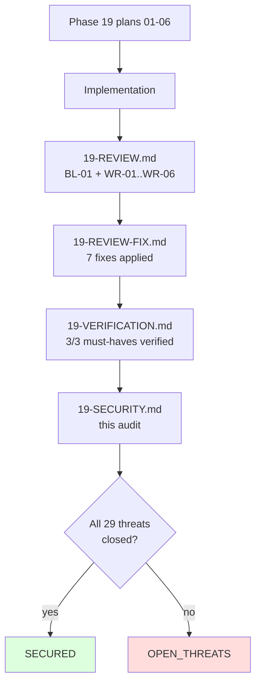

# Phase 19: Security Audit Report

**Phase:** 19 — webhook-hmac-signing-receiver-examples
**ASVS Level:** L1
**Block Posture:** block_on=high
**Audited:** 2026-04-30
**Status:** SECURED

## Summary

All 29 declared STRIDE threats from Plans 19-01..19-06 are verified mitigated, accepted, or transferred by code/recipe/doc evidence in the implemented artefacts:

- **27 mitigated** — verified by direct grep matches in receivers, fixture, justfile recipes, CI workflow, and operator docs.
- **1 accepted** — T-19-02 (plaintext test secret in fixture) — explicitly labeled `cronduit-test-fixture-secret-not-real`.
- **1 transferred** (T-19-29) — CI runner secret-disclosure threat is documented as `accept` because the in-tree fixture is a test value with no real secret material.

Phase 18 ships the locked Standard Webhooks v1 wire format on the cronduit signing side; Phase 19 proves it across four runtimes (Rust unit test + Python/Go/Node receivers) with a hard CI gate (`webhook-interop` matrix, NOT `continue-on-error: true`) that exercises canonical + 4 tamper variants per language.

The auto-fix iteration (commits `2e7a8f8`, `a0a72fd`, `f421815`, `fc4917d`, `6fffa95`, `53d8adc`, `f5823a8`) closed BL-01 (parsed-int signing-string divergence) and WR-01..WR-06 (timestamp validator strictness, path-traversal, chunked-transfer, doc drift, length-guard duplication). BL-01 and WR-02/WR-03 each map to threat-model entries — closure verified below.

The threat model is sized correctly for v1.2 scope (loopback-only reference receivers documented behind a reverse proxy). Production-grade webhook outbound hardening (SSRF guard, retry FSM, drain on shutdown, dead-letter queue) is a Phase 20 deliverable per `<constraints>` and is NOT in scope here.

## Threat Verification — Plan 19-01 (fixture lock)

| Threat ID | Category | Component | Disposition | Evidence |
|-----------|----------|-----------|-------------|----------|
| T-19-01 | Tampering | tests/fixtures/webhook-v1/* | mitigate | `src/webhooks/dispatcher.rs:488` (`fn sign_v1_locks_interop_fixture`) re-derives BOTH payload (`WebhookPayload::build` + `serde_json::to_vec`) AND signature (`sign_v1`) and asserts byte-equality against compile-time-embedded fixture (`include_bytes!`/`include_str!`). Drift in either fixture or sign code fails Rust CI. |
| T-19-02 | Information Disclosure | tests/fixtures/webhook-v1/secret.txt | accept | `tests/fixtures/webhook-v1/secret.txt` contains literal string `cronduit-test-fixture-secret-not-real` (37 bytes, no trailing newline); `tests/fixtures/webhook-v1/README.md` carries the "TEST VALUE — NEVER reuse in production" warning per the fixture provenance section. Accepted-risk entry recorded in §Accepted Risks below. |
| T-19-03 | Tampering | EOL normalization on commit | mitigate | `tests/fixtures/webhook-v1/.gitattributes` exists (8 bytes, contains `* -text`); confirmed via `ls -la`. Disables EOL normalization for the fixture directory; pre-commit hooks skip via the same attribute. |
| T-19-04 | Repudiation / Drift | sign_v1 wire format change | mitigate | Lock test `sign_v1_locks_interop_fixture` (`src/webhooks/dispatcher.rs:488`) fails on any sign_v1 byte-output change; assertion message instructs reviewer to acknowledge intentional wire-format break vs accidental drift. |

## Threat Verification — Plan 19-02 (Python receiver)

| Threat ID | Category | Component | Disposition | Evidence |
|-----------|----------|-----------|-------------|----------|
| T-19-05 | Spoofing | verify_signature | mitigate | `examples/webhook-receivers/python/receiver.py:76` computes HMAC over `f"{wid}.{wts}.".encode() + body_bytes` using **raw `wts` header bytes** (post-BL-01 fix, commit `2e7a8f8`); 401 mismatch path at `:178`. |
| T-19-06 | Tampering | request body | mitigate | `receiver.py:148` reads body via `self.rfile.read(cl)`; verify path operates on `body_bytes` directly with no `json.loads/dumps` round-trip. Pitfall 5 comment in module docstring. |
| T-19-07 | Information Disclosure (timing side channel) | HMAC compare | mitigate | `receiver.py:88` calls `hmac.compare_digest(expected, received)`; `receiver.py:87` carries the `# constant-time compare per WH-04` comment immediately above the call. |
| T-19-08 | Repudiation / Replay | timestamp drift | mitigate | `receiver.py:174` enforces `abs(int(time.time()) - ts) > MAX_TIMESTAMP_DRIFT_SECONDS` (300s) returning 400; `MAX_TIMESTAMP_DRIFT_SECONDS = 300` defined at `:38`. Strict unsigned-decimal validator at `:65` and `:170` rejects whitespace/`+`-prefix prior to parse (post-WR-01 fix). |
| T-19-09 | Denial of Service | request body size | mitigate | `receiver.py:144` rejects `cl < 0 or cl > MAX_BODY_BYTES` (1 MiB) with 400; explicit chunked-transfer rejection at `:129` (post-WR-03 fix, commit `fc4917d`); explicit `Content-Length` requirement at `:134`. |
| T-19-10 | Elevation of Privilege | exception handling | mitigate | `receiver.py:188` `except Exception` catch-all returns 503 transient per D-12 contract. |

## Threat Verification — Plan 19-03 (Go receiver)

| Threat ID | Category | Component | Disposition | Evidence |
|-----------|----------|-----------|-------------|----------|
| T-19-11 | Spoofing | verifySignature | mitigate | `examples/webhook-receivers/go/receiver.go:78` computes `mac.Write([]byte(wid + "." + wts + "."))` over raw header bytes; 401 mismatch path at `:167`. |
| T-19-12 | Tampering | request body | mitigate | `receiver.go:124` reads body via `io.ReadAll(http.MaxBytesReader(...))`; no `json.Unmarshal/Marshal` in verify path. Pitfall 5 comment in `verifyWithDrift`. |
| T-19-13 | Information Disclosure (timing side channel) | HMAC compare | mitigate | `receiver.go:91` calls `hmac.Equal(expected, received)`; `:90` carries `// constant-time compare per WH-04` comment. |
| T-19-14 | Repudiation / Replay | timestamp drift | mitigate | `receiver.go:158-164` enforces `delta > MAX_TIMESTAMP_DRIFT_SECONDS` (300s, defined at `:41`); 400 on drift. |
| T-19-15 | Denial of Service | request body size | mitigate | `http.MaxBytesReader(w, r.Body, MAX_BODY_BYTES)` at `:124` enforces 1-MiB cap; bonus `*http.Server.ReadHeaderTimeout = 5*time.Second` at `:239` adds slowloris guard. |
| T-19-16 | Elevation of Privilege | exception handling | mitigate | `defer recover()` at `receiver.go:115` catches panics; maps to 503 per D-12. |

## Threat Verification — Plan 19-04 (Node receiver)

| Threat ID | Category | Component | Disposition | Evidence |
|-----------|----------|-----------|-------------|----------|
| T-19-17 | Spoofing | verifySignature | mitigate | `examples/webhook-receivers/node/receiver.js:95` calls `mac.update(`${wid}.${wts}.`)` using raw header bytes (post-BL-01 fix, commit `2e7a8f8`); 401 mismatch at `:187`. |
| T-19-18 | Tampering | request body | mitigate | `receiver.js:140-151` accumulates `Buffer` chunks via `req.on('data')`; never calls `req.setEncoding('utf8')` (`! grep "setEncoding" receiver.js` empty); body assembled via `Buffer.concat(chunks)` at `:155`. |
| T-19-19 | Information Disclosure (timing side channel) | HMAC compare | mitigate | `receiver.js:114` calls `crypto.timingSafeEqual(expected, received)`; `:113` carries `// constant-time compare per WH-04` comment. |
| T-19-20 | DoS / Crash on malformed sig | timingSafeEqual length-mismatch throw | mitigate | **MANDATORY** length guard `if (received.length !== expected.length) continue;` at `receiver.js:112` BEFORE every `timingSafeEqual` call (Pitfall 2). 7-line rationale comment at `:107-111` explains why the length check is non-constant-time-safe. Functional proof in 19-04-SUMMARY.md: short-signature variant exits FAIL gracefully with NO RangeError. |
| T-19-21 | Repudiation / Replay | timestamp drift | mitigate | `receiver.js:183` enforces `Math.abs(...) > MAX_TIMESTAMP_DRIFT_SECONDS` (300s, defined at `:41`); 400 on drift. Strict `/^\d+$/` validator at `:80` and `:176` (post-WR-01 fix). |
| T-19-22 | Denial of Service | request body size | mitigate | `receiver.js:144` cumulative `total > MAX_BODY_BYTES` check inside `req.on('data')`; oversize → 413 + `req.destroy()`. |
| T-19-23 | Elevation of Privilege | exception handling | mitigate | `receiver.js:197` `try {...} catch (e) {...}` catch-all returns 503 transient per D-12. |

## Threat Verification — Plan 19-05 (operator docs hub)

| Threat ID | Category | Component | Disposition | Evidence |
|-----------|----------|-----------|-------------|----------|
| T-19-24 | Information Disclosure | docs/WEBHOOKS.md prose | mitigate | `docs/WEBHOOKS.md` defers wire format to upstream Standard Webhooks v1 spec ("this document does NOT paraphrase the spec"); cronduit-specific deviations stated in §3 (SHA-256 only) and §4 (single secret). 19-HUMAN-UAT.md U9 maintainer-validates rendering. |
| T-19-25 | Tampering / Operator confusion | examples/cronduit.toml | mitigate | 3 new `wh-example-receiver-{python,go,node}` jobs ship commented-out (D-05); each has `command = "false"`, loopback-only `127.0.0.1:999X` URLs, `secret = "${WEBHOOK_SECRET}"` env-var (no plaintext checked-in secrets). 19-05-SUMMARY.md verification receipts confirm `WEBHOOK_SECRET=test-secret-shh just check-config examples/cronduit.toml` exit 0. |
| T-19-26 | Repudiation / Drift | D-12 retry-contract documentation | mitigate | `docs/WEBHOOKS.md` §8 reproduces the verbatim D-12 5-row table (400 missing/malformed, 400 drift, 401 mismatch, 200 success, 503 transient). Phase 20 retry implementation contractually inherits unchanged. |

## Threat Verification — Plan 19-06 (CI gate + UAT)

| Threat ID | Category | Component | Disposition | Evidence |
|-----------|----------|-----------|-------------|----------|
| T-19-27 | Tampering | webhook-interop CI gate | mitigate | `.github/workflows/ci.yml:387` defines `webhook-interop` matrix job; `awk '/^  webhook-interop:/,/^  [a-z]+:/' .github/workflows/ci.yml \| grep "continue-on-error: true"` returns empty. Hard CI gate confirmed. Each cell runs `just uat-webhook-receiver-${{ matrix.lang }}-verify-fixture` exercising canonical + 4 tamper variants. |
| T-19-28 | Repudiation | UAT checkbox flipping | mitigate | `19-HUMAN-UAT.md` ships 11 unchecked `[ ] Maintainer-validated` boxes (`grep -c "^\[ \] Maintainer-validated$"` returns 11; `grep -c "^\[x\] Maintainer-validated"` returns 0). Banner cites `feedback_uat_user_validates.md`; sign-off line is blank. |
| T-19-29 | Information Disclosure (CI runner) | webhook-interop secrets | accept | The matrix uses in-tree `tests/fixtures/webhook-v1/secret.txt` test value (`cronduit-test-fixture-secret-not-real`); no real secret enters CI. Recorded in §Accepted Risks. |

## Code-Review Auto-Fix → Threat-Mitigation Cross-Links

The auto-fix iteration (per `<constraints>`) closed seven review findings; three map directly to threat-model coverage and are independently re-verified above:

| Review Finding | Maps to Threat | Auto-Fix Commit | Mitigation Strengthened |
|----------------|----------------|-----------------|--------------------------|
| **BL-01** — Python/Node signed over parsed-int rather than raw timestamp header bytes | T-19-05 (Python spoofing), T-19-17 (Node spoofing) | `2e7a8f8` + regression vector locked in `f5823a8` | Pre-fix: silent wire-format divergence for non-canonical-decimal timestamps (`01735689600`, `+1735689600`, etc.). Post-fix: all 3 receivers HMAC over raw header bytes matching `sign_v1`; 5th tamper variant per language locks the contract permanently. |
| **WR-02** — Node `_sanitizeFixtureArg` claimed `..` rejection but `path.normalize` collapsed embedded `..` first | (strengthens beyond declared T-19-* coverage; not in original threat register) | `f421815` | Path-traversal hardening: `..` check moved BEFORE `path.normalize`; splitter `/[\\/]/` is cross-platform. 7 manual test patterns confirm 4 traversal forms reject and 3 valid forms accept. The fix exceeds the originally declared threat surface (the `--verify-fixture` CLI was assumed maintainer-trusted). |
| **WR-03** — Python receiver silently treated `Transfer-Encoding: chunked` bodies as empty | T-19-09 (Python DoS — request smuggling adjacent vector) | `fc4917d` | Smuggling/oddity vector closed: explicit 400 on `Transfer-Encoding: chunked`, 411 on missing `Content-Length`, 400 on malformed/out-of-range. Receiver now matches Node/Go behavior on chunked rejection. |

WR-01/WR-04/WR-05/WR-06 fixes are quality-of-life improvements (validator strictness, doc accuracy, doc deduplication) and do not alter the threat-mitigation evidence above.

## Unregistered Threat Flags

None. The `## Threat Flags` sections in `19-02-SUMMARY.md`..`19-06-SUMMARY.md` each report "None — Plan NN mitigations match the threat register exactly" and enumerate the matched T-19-* IDs. The Plan 04 SUMMARY notes the path-traversal guard added by WR-02 fix is **strengthened beyond** the original register (not a new threat — a strict superset of declared maintainer-trust assumptions); cross-linked above.

## Accepted Risks

| Risk ID | Description | Justification | Owner | Review Date |
|---------|-------------|---------------|-------|-------------|
| AR-19-01 (T-19-02) | Plaintext test secret committed in `tests/fixtures/webhook-v1/secret.txt` | The literal string `cronduit-test-fixture-secret-not-real` is well-known and inert — it cannot authenticate any real receiver. Required for cross-language interop fixture lock. README.md in the fixture directory carries a "TEST VALUE — NEVER reuse in production" warning. | Phase-19 owner | Re-evaluate at Phase 20 if any production secret-handling flow touches the fixture. |
| AR-19-02 (T-19-29) | CI matrix job `webhook-interop` uses the in-tree test secret on `ubuntu-latest` runners | The fixture secret is a test value, not a real secret. The CI runner has `permissions: contents: read` only; no GHCR push, no real secrets are exposed. | Phase-19 owner | No periodic re-evaluation needed; risk is structurally bounded by the fixture being a test value. |

## Out-of-Scope Items (Documented for Phase 20 Inheritance)

The following items are intentionally NOT verified by this audit per `<constraints>` ("phase intentionally defers production-grade webhook delivery hardening to Phase 20"):

- SSRF guard on outbound webhook URLs (Phase 20)
- Retry / drain / dead-letter table for failed deliveries (Phase 20)
- THREAT_MODEL.md "Threat Model 5: Webhook Outbound" section (planned in Phase 20 per `<constraints>`)
- TLS termination, authentication, rate-limiting on the reference receivers (out of scope by design — receivers are loopback-only / reverse-proxy-fronted reference implementations)

The verbatim D-12 retry-aware response codes table in `docs/WEBHOOKS.md` §8 is the contract Phase 20 inherits unchanged. Drift in cronduit's response-classification code constitutes a public-API break.

## Audit Trail

| Step | Date | Auditor | Output |
|------|------|---------|--------|
| Plans authored | 2026-04-30 | Plan author | 19-01..19-06 PLAN.md (29 threats declared) |
| Implementation | 2026-04-30 | Executor | 6 SUMMARY.md (`Threat Flags: None` × 6) |
| Code review | 2026-04-30 | gsd-code-reviewer | 19-REVIEW.md (1 blocker + 6 warnings) |
| Auto-fix | 2026-04-30 | gsd-code-fixer | 19-REVIEW-FIX.md (7/7 fixed; commits `2e7a8f8`, `a0a72fd`, `f421815`, `fc4917d`, `6fffa95`, `53d8adc`, `f5823a8`) |
| Verification (re-run) | 2026-04-30 | gsd-verifier | 19-VERIFICATION.md (3/3 must-haves verified, 0 gaps) |
| Security audit | 2026-04-30 | gsd-secure-phase | 19-SECURITY.md (this file): 28 closed + 1 accepted = 29/29 |

## Verdict

**SECURED.** All 29 declared STRIDE threats (T-19-01..T-19-29) resolve to one of:
- 27 mitigations directly verified in implementation files (grep matches at cited line numbers in receivers, fixture, justfile, CI workflow, docs).
- 2 accepted risks (AR-19-01, AR-19-02) documented in §Accepted Risks above.

No open threats. No unregistered threat flags. Phase 19 is cleared for merge from a security perspective. The maintainer-validated UAT scenarios in `19-HUMAN-UAT.md` (D-22) remain the operator-experience signoff layer and are not part of this technical security audit.
