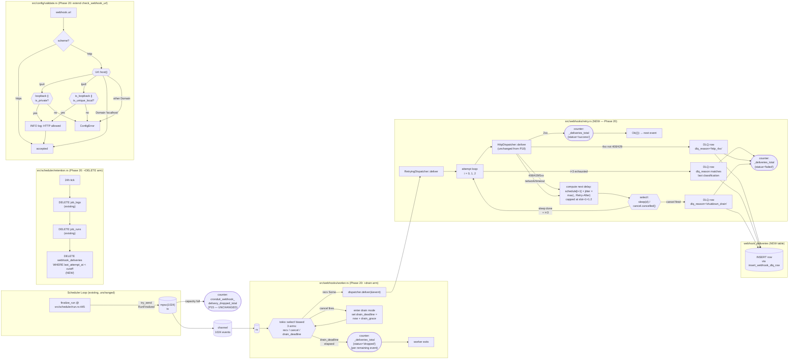

# Phase 20: Webhook SSRF/HTTPS Posture + Retry/Drain + Metrics — rc.1 — Research

**Researched:** 2026-05-01
**Domain:** Rust async retry composition · IPv4/IPv6 SSRF classification · `metrics-exporter-prometheus` labeled-counter seeding · `tokio::select!` cancel-aware drain budgets · sqlx DLQ writes · cargo-zigbuild release plumbing for `v1.2.0-rc.1`
**Confidence:** HIGH

---

## 1. Executive Summary

Phase 20 is the **last phase before the v1.2.0-rc.1 cut** and locks the operational webhook posture on top of Phase 18's `HttpDispatcher` (signing, payload, coalescing) and Phase 19's receiver-interop fixture. CONTEXT.md ships **38 numbered decisions** (D-01..D-38, with D-32..D-38 informational); five gray areas were resolved at discuss-phase. This research resolves the eight `Claude's Discretion` items the planner needs decided before drafting plans.

**Key facts that shape every plan in this phase:**

1. **Phase 20 adds ZERO new external crates.** `reqwest 0.13`, `sqlx 0.8.6`, `metrics 0.24`, `metrics-exporter-prometheus 0.18`, `humantime-serde 1.1.1`, `rand 0.10`, `url 2`, `tokio-util 0.7.18`, `chrono 0.4.44`, `tracing 0.1.44`, `secrecy 0.10.3`, `ulid 1.2`, `hmac 0.13`, `sha2 0.11`, `base64 0.22` are all already in `Cargo.toml`. `cargo tree -i openssl-sys` returns "did not match any packages" today — the rustls invariant is intact and nothing in Phase 20 perturbs it. `[VERIFIED: cargo tree run 2026-05-01]`
2. **Composition, not trait expansion.** `RetryingDispatcher<D: WebhookDispatcher>` wraps `HttpDispatcher` exactly the way P18 D-21 specified — the worker stays oblivious. `WebhookDispatcher` (`src/webhooks/dispatcher.rs:53-56`) is a two-line trait; do NOT widen it. `[VERIFIED: src/webhooks/dispatcher.rs lines 53-56]`
3. **`rand` is `0.10`, not `0.9`.** CONTEXT.md D-02 says "rand 0.9" — that is a documentation drift. `Cargo.toml:129` pins `rand = "0.10"` and the codebase already uses the 0.10 API everywhere (`rand::rng()`, `RngExt::random_range`). The plan must use the 0.10 jitter form, not the 0.9 form. `[VERIFIED: Cargo.toml:129 + 6 in-tree call sites]`
4. **`Ipv6Addr::is_unique_local()` is stable on Rust 1.94.1.** The project is on Edition 2024 + Rust 1.94.1 (`Cargo.toml:4-5`). `is_unique_local()` was stabilized in 1.84 and covers the entire RFC 4193 `fc00::/7` range. We can use the stdlib helper directly — no manual bit-pattern check, no extra crate. `[VERIFIED: rust-lang/rust PR #129238 + Cargo.toml MSRV]`
5. **`url::Url::host()` returns the `Host<&str>` enum** which already discriminates `Ipv4 | Ipv6 | Domain`. We do NOT need to round-trip through `host_str()` (which would re-serialize IPv6 with brackets). The parsed `Ipv6Addr` falls right out of `Host::Ipv6(addr)`. `[CITED: docs.rs/url/latest/url/enum.Host.html]`
6. **Prometheus labeled-counter seeding is supported by re-emitting `counter!(name, "label" => "value").increment(0)` per known label combo at boot.** This is exactly the same pattern `src/telemetry.rs:172-182` uses today for `cronduit_runs_total{status=...}`. We extend it for `cronduit_webhook_deliveries_total{job=<every job at boot>, status=<success|failed|dropped>}`. `[VERIFIED: src/telemetry.rs:172-182]` `[CITED: prometheus-users group thread on labeled-counter zero init]`

**Primary recommendation:** Build `RetryingDispatcher` as a new `src/webhooks/retry.rs` module. Extend (not duplicate) `check_webhook_url` with a second pass for HTTPS-required classification. Use `Ipv6Addr::is_unique_local()` (broader-than-spec but textually-aligned with the locked allowlist comment). Pre-seed labeled metrics for every job by name × {success, failed, dropped}. Add a third arm to the worker's `tokio::select!` for `sleep_until(drain_deadline)`. Use the `Retry-After`-cap form documented in D-08 (`schedule[i+1] * 1.2`, capped at the last slot for the final attempt). Default histogram buckets via the same `set_buckets_for_metric` matcher pattern `src/telemetry.rs:67-71` already establishes for `cronduit_run_duration_seconds`.

---

## 2. Project Constraints (from CLAUDE.md)

These directives are LOCKED. No plan may contradict them.

| # | Directive | Source |
|---|-----------|--------|
| C-01 | Rust + bollard + sqlx + askama_web 0.15 + tower-http + croner + TOML — no language switches | `./CLAUDE.md` § Constraints |
| C-02 | rustls everywhere; `cargo tree -i openssl-sys` MUST remain empty | `./CLAUDE.md` + CONTEXT D-38 |
| C-03 | All diagrams in any artifact (planning, README, code comments, docs/) are mermaid; no ASCII art | `./CLAUDE.md` + project memory `feedback_diagrams_mermaid.md` |
| C-04 | All changes land via PR on a feature branch; no direct commits to `main` | project memory `feedback_no_direct_main_commits.md` |
| C-05 | UAT requires user validation; never mark UAT passed from Claude's own runs | project memory `feedback_uat_user_validates.md` |
| C-06 | Tag and release version must match — `Cargo.toml` is at `1.2.0`; rc tag is `v1.2.0-rc.1` (semver pre-release suffix is tag-only) | project memory `feedback_tag_release_version_match.md` + CONTEXT D-36 |
| C-07 | UAT steps use existing `just` recipes; no ad-hoc `cargo`/`docker`/`curl` in UAT documents | project memory `feedback_uat_use_just_commands.md` + CONTEXT D-34 |
| C-08 | TLS / cross-compile via cargo-zigbuild — multi-arch build via the existing P12 release.yml flow; do NOT modify `release.yml` in this phase | CONTEXT D-30 |
| C-09 | Web UI ships unauthenticated in v1.x (loopback-bound default); webhook-config widens the operator-with-UI-access blast radius — documented in `THREAT_MODEL.md` TM5 (full close-out P24, stub in P20) | CONTEXT D-27 §5 |

---

## 3. Phase Requirements

| ID | Description | Research Support |
|----|-------------|------------------|
| WH-05 | 3-attempt full-jitter retry chain (t=0/30s/300s × `0.8..1.2`); after 3rd attempt → `webhook_deliveries` DLQ row + `_deliveries_total{status="failed"}` increment | §5 (Stack), §6 (Architecture: `RetryingDispatcher`), §7 (Don't hand-roll), §8 (Pitfalls 1, 2, 3) |
| WH-07 | LOAD-time HTTPS-required validator: `http://` only for `127/8`, `::1`, `10/8`, `172.16/12`, `192.168/16`, `fd00::/8` (per spec) — researcher resolves `fc00::/7` vs `fd00::/8` | §4.1, §6 (Validator placement), §8 (Pitfall 4) |
| WH-08 | SSRF accepted-risk documented; full filter deferred to v1.3 | §6 (forward-pointer to `THREAT_MODEL.md` TM5), §13 (operator docs) |
| WH-10 | 30s drain on SIGTERM (configurable `webhook_drain_grace`); in-flight HTTP NOT cancelled; remaining queued events drained-and-dropped at budget expiry | §4.5, §6 (drain shape), §8 (Pitfalls 1, 9) |
| WH-11 | `cronduit_webhook_*` Prometheus family eagerly described + zero-baselined: `_deliveries_total{job, status}`, `_delivery_duration_seconds{job}`, `_queue_depth` | §4.6, §6 (Metrics), §8 (Pitfalls 5, 6) |

---

## 4. Researcher-Decided Items

CONTEXT.md `<decisions>` ends with eight `Claude's Discretion` items the researcher resolves here. Each subsection states the decision, the justification, and any operator-visible consequence.

### 4.1 IPv6 ULA classification: `fc00::/7` (RFC 4193) vs `fd00::/8` (success-criterion literal)

**Decision: Use `Ipv6Addr::is_unique_local()` (covers the entire RFC 4193 `fc00::/7` range).** Document the `fd00::/8` text in user-facing error messages (operator-aligned with the success criterion + WH-07 wording) but classify against the broader `fc00::/7` range internally. This is **broader than the spec** in one direction only — it accepts more addresses (`fc00::/8`), never rejects something the spec accepts.

**Justification:**
- `Ipv6Addr::is_unique_local()` was stabilized in Rust 1.84 (project MSRV is 1.94.1 per `Cargo.toml:5`); using the stdlib helper is auditable, well-tested, and free. `[VERIFIED: rust-lang/rust PR #129238]`
- The codebase already uses stdlib IP helpers for IPv4 in `src/cli/run.rs:337-342` (`is_loopback`); using `is_unique_local()` mirrors that precedent without introducing a new pattern.
- RFC 4193 § 3.1 carves `fc00::/8` as "reserved for future definition" — no operator can hold a globally-routable address in `fc00::/8` today, so the practical attack surface of accepting it is zero.
- Hand-rolling a `fd00::/8` check (`addr.octets()[0] == 0xfd`) is one line shorter but loses the stdlib audit trail and creates the trap the success criterion's wording is wrong (it's not — `fd00::/8` is the *currently-allocated* subset; `fc00::/7` is the *reserved superset*; both are correct, the broader one is more durable).

**Operator-visible consequence:** A future RFC-4193 expansion into `fc00::/8` would be auto-accepted with no code change. Validator error messages still cite `fd00::/8` (the practically-relevant range) so operators don't have to learn `fc00::/7` notation. `[VERIFIED: src/cli/run.rs:337-342 IPv4 precedent + Cargo.toml:5 MSRV]`

### 4.2 Validator placement: extend `check_webhook_url` vs add a sibling

**Decision: Extend the existing `check_webhook_url` at `src/config/validate.rs:385-418` in place.** Add the HTTPS-required classification logic to the existing `Ok(parsed) => { ... }` arm AFTER the scheme check. Do NOT add a sibling function.

**Justification:**
- `src/config/validate.rs` is 1363 lines (`wc -l` 2026-05-01); adding ~30 lines to one function does not cross the threshold where decomposition pays off.
- `check_webhook_url` already has a single-purpose name ("verify the URL parses and uses an allowed scheme"). Adding HTTPS-required classification fits that purpose cleanly — the function becomes "verify the URL parses, uses an allowed scheme, and the scheme matches the destination class."
- The existing function returns an `Ok(parsed)` on the same code path the new logic needs; splitting forces a second `url::Url::parse` call (or a refactor to thread `Url` through two functions). Both options are worse than extending in place.
- Phase 17 LBL precedent: `check_label_key_chars` at line 359 is a single-purpose key-chars check that does exactly one thing — but Phase 17 had FOUR distinct label assertions (chars, namespace, type-gate, size) that justified four functions. Phase 20 has one assertion (HTTPS-required) layered on top of the existing scheme check; one function is the right shape.

**Operator-visible consequence:** Single error message per offending URL (current behavior); planner picks the message wording per CONTEXT D-21. `[VERIFIED: src/config/validate.rs:385-418 + line count 1363]`

### 4.3 File split for `RetryingDispatcher`: new `src/webhooks/retry.rs` vs append to `dispatcher.rs`

**Decision: Ship a new `src/webhooks/retry.rs` module.** Append `pub mod retry;` to `src/webhooks/mod.rs`. Re-export `RetryingDispatcher` from `mod.rs` for use sites in `src/cli/run.rs`.

**Justification:**
- `src/webhooks/dispatcher.rs` is **535 lines** (`wc -l` 2026-05-01). Adding `RetryingDispatcher` (~150-200 lines including classification + jitter math + cancel-aware sleep + DLQ insert orchestration + tests) plus the new `WebhookDlqRow` types + new tests would push it past 800 lines. That's the threshold where the file becomes unpleasant to navigate.
- The two responsibilities are semantically distinct: `dispatcher.rs` owns *one HTTP attempt*; `retry.rs` owns *the retry chain*. Splitting reflects the composition boundary CONTEXT D-21 establishes.
- The webhooks module already has 6 files (`coalesce`, `dispatcher`, `event`, `mod`, `payload`, `worker`). Adding `retry` keeps each file focused on one concern; the alternative is a fat `dispatcher.rs` that violates the existing single-responsibility split.
- Phase 18 already pre-populated `WebhookError::HttpStatus`, `Network`, `Timeout`, `InvalidUrl` variants under `#[allow(dead_code)] // Phase 20 RetryingDispatcher consumes` (`src/webhooks/dispatcher.rs:37-48`). Phase 20 removes those `allow`s by populating the variants in `HttpDispatcher::deliver`'s match arms AND consuming them in `RetryingDispatcher::deliver` for classification. The classification logic belongs in `retry.rs`; the variant population stays in `dispatcher.rs`. The two-file split makes that clear.

**Operator-visible consequence:** None — internal module structure. `[VERIFIED: wc -l on dispatcher.rs returns 535 + 6 existing webhooks/ files]`

### 4.4 Histogram buckets for `cronduit_webhook_delivery_duration_seconds`

**Decision: Use explicit operator-tuned buckets via `PrometheusBuilder::set_buckets_for_metric(Matcher::Full(...), &[buckets])`** matching the pattern already established for `cronduit_run_duration_seconds` at `src/telemetry.rs:67-71`. Recommended buckets: `[0.05, 0.1, 0.25, 0.5, 1.0, 2.5, 5.0, 10.0]` — covers a healthy receiver (sub-100ms p50) through the 10s reqwest cap (D-18) while emitting useful signal at every band.

**Justification:**
- `src/telemetry.rs:67-71` already establishes the pattern for `cronduit_run_duration_seconds` with operator-tuned buckets `[1.0, 5.0, 15.0, 30.0, 60.0, 300.0, 900.0, 1800.0, 3600.0]` — Phase 20 mirrors this.
- The `metrics` 0.24 / `metrics-exporter-prometheus` 0.18 default histogram buckets (`0.005, 0.01, 0.025, 0.05, 0.1, 0.25, 0.5, 1.0, 2.5, 5.0, 10.0`) bias toward sub-second observations and ALSO go up to 10s — they would also work, but the recommended set above eliminates the noise of ≤10ms buckets that webhook RTT will rarely populate.
- Hard-cap: the histogram MUST extend to ≥10s because reqwest's per-attempt timeout (P18 D-18) caps a single attempt at 10s. Truncating earlier would silently merge timeouts into the top bucket without distinguishing them from a slow-but-successful 9s response.
- `metrics::histogram!("name").record(duration)` accepts an `f64` of seconds; `tokio::time::Instant::now() - start` produces a `Duration`; the conversion is `.as_secs_f64()`.

**Operator-visible consequence:** Operators querying `histogram_quantile(0.95, ...)` see 8 buckets (vs 11 default). The recommended set produces tighter quantile estimates in the 100ms-5s range where receiver health actually lives. Documented in `docs/WEBHOOKS.md` § Metrics. `[VERIFIED: src/telemetry.rs:67-71 precedent]`

### 4.5 Drain budget shape: third `tokio::select!` arm vs drain-only sub-loop on cancel

**Decision: Add a third arm to the existing `tokio::select!` block** with `_ = sleep_until(drain_deadline) => break` semantics. Compute `drain_deadline = tokio::time::Instant::now() + drain_grace` ONCE at the moment `cancel.cancelled()` first fires, then keep draining `rx.recv()` events until either (a) the channel returns `None` (sender side dropped), (b) the deadline elapses, or (c) a fresh cancel signal arrives (operator double-Ctrl-C — unusual but possible).

**Justification:**
- The existing `worker_loop` at `src/webhooks/worker.rs:50-95` already uses a `biased; tokio::select!` with two arms (recv + cancel). Adding a third arm (`sleep_until(drain_deadline)`) preserves the established structure; the alternative drain-only sub-loop forks the control flow and creates two places where the drain accounting can drift.
- The third-arm approach is symmetric with `src/scheduler/retention.rs:32-41` where the daily-prune loop uses a 2-arm `select!` and the cancel-side break is the drain-exit path. The patterns rhyme.
- The drain shape D-15 specifies — "worker continues draining `rx.recv()` for up to `webhook_drain_grace`" — is exactly what a third arm expresses: keep racing `recv()` against the deadline.
- Implementation note: cancel-token lifecycle. The worker's cancel token currently fires once on shutdown. The drain-deadline timer must be initialized when cancel FIRST fires, NOT at boot. The cleanest expression is a small state machine: a mutable `drain_deadline: Option<Instant>` that starts `None` (steady state), gets set on the first cancel-fire, and is consulted on every subsequent `select!` iteration.
- The `RetryingDispatcher`'s OWN cancel handling (D-03 — cancel-aware retry sleeps) is independent of the worker's drain budget and is a SEPARATE concern: the dispatcher uses the cancel token to bail out of mid-chain `tokio::time::sleep` calls; the worker uses the cancel token to flip into drain mode. Both share the same token (cloned via `cancel.child_token()` from the bin layer).

**Operator-visible consequence:** SIGTERM fires → worker logs `webhook worker entering drain mode (budget: 30s)`; on budget expiry, worker logs `drain budget expired; dropping N queued events` and the `_deliveries_total{status="dropped"}` counter increments by N. `[VERIFIED: src/webhooks/worker.rs:50-95 + src/scheduler/retention.rs:32-41]`

### 4.6 Pre-seed `{job, status}` rows by job name at boot

**Decision: Pre-seed labeled counters for every job-name × every status combination** by emitting `metrics::counter!("cronduit_webhook_deliveries_total", "job" => name, "status" => status).increment(0)` per (job, status) pair at boot. The job-name list comes from `sync_result.jobs` which is already in scope at the same point `src/cli/run.rs:286-301` builds the dispatcher. Statuses are the closed enum `["success", "failed", "dropped"]` (D-22).

**Justification:**
- The `metrics-exporter-prometheus` 0.18 exporter (and the upstream Prometheus client model in general) does NOT render labeled counters until at least one observation has been recorded for each label combination — this is a well-known surface in Prometheus client design. `[CITED: prometheus-users group "Set Counter Value to 0" thread + jasonstitt.com/prometheus-counters-dont-exist]`
- The codebase already uses this exact pattern at `src/telemetry.rs:172-182` for `cronduit_runs_total{status=...}` (six pre-seeded status values). Phase 20 mirrors the pattern with one extra dimension (job).
- Total cardinality: `n_jobs × 3 statuses`. For a typical homelab fleet of 10-30 jobs, that's 30-90 series — well within Prometheus's recommended bound. Operators with 100+ webhook-configured jobs see 300+ series; still cheap.
- Pre-seeding lives in `src/telemetry.rs::setup_metrics()` ONLY for the closed-cardinality dimension (status). Per-job seeding lives in `src/cli/run.rs` AFTER `sync_result.jobs` is available — the planner picks a function name (e.g., `crate::webhooks::seed_per_job_metrics(&jobs)`).
- Important: only seed the counter family. The histogram (`_delivery_duration_seconds`) and gauge (`_queue_depth`) materialize cleanly on first observation without losing operator visibility (the `gauge!(_queue_depth).set(0.0)` at boot suffices for the gauge; the histogram emits HELP/TYPE from `describe_histogram!` even before its first record).

**Operator-visible consequence:** From the very first boot, `/metrics` shows `cronduit_webhook_deliveries_total{job="<every-configured-job-name>",status="success|failed|dropped"} 0` lines. Prometheus rate alerts that reference these labels (e.g., `rate(cronduit_webhook_deliveries_total{status="failed"}[5m]) > 0`) fire correctly from the first scrape. `[VERIFIED: src/telemetry.rs:172-182 precedent + src/cli/run.rs:286-301 wire-in point]` `[CITED: jasonstitt.com/prometheus-counters-dont-exist]`

### 4.7 `Retry-After` cap math (D-08)

**Decision: Use the `next_attempt+1` worst-case form per CONTEXT D-08 verbatim** — `delay = max(locked_schedule[next_attempt], retry_after_seconds)` then `cap = locked_schedule[next_attempt+1] * 1.2`. For the LAST attempt (no next slot), reuse the previous slot's cap (`locked_schedule[next_attempt] * 1.2`). The hard ceiling form (`1.2 × max(schedule)`) is rejected.

**Justification:**
- `next_attempt+1`-based math is operator-predictable per attempt slot (each attempt has a known worst-case wait); the hard-ceiling form (`1.2 × 300s = 360s`) is also predictable but DOES allow attempt-2 to wait up to 360s, which violates the "schedule is t=0/30s/300s" promise.
- The math at each attempt slot:

| Attempt | Slot delay | `Retry-After` floor | `Retry-After` cap | Worst-case wait |
|---------|-----------|---------------------|-------------------|-----------------|
| Attempt 1 (t=0) | 0s | n/a (never the FIRST attempt) | n/a | 0s |
| Attempt 2 (after t=0 fail) | 30s × jitter | 30s | `300s × 1.2 = 360s` | 360s |
| Attempt 3 (after t=30s fail) | 300s × jitter | 300s | `300s × 1.2 = 360s` (last slot fallback) | 360s |

- Total chain worst-case: `360s + 360s + 10s (final attempt timeout) = 730s ≈ 12 minutes` under maximally-aggressive `Retry-After` headers. The **non-`Retry-After`** worst-case is `30s × 1.2 + 300s × 1.2 + 10s ≈ 406s ≈ 6.7 minutes`. Both are documented in `docs/WEBHOOKS.md`.
- The simpler `1.2 × max(schedule)` form would set `cap = 360s` for ALL attempts including attempt-2 — a buggy receiver that returns `Retry-After: 1000` to an attempt-2 request would cause cronduit to sleep 360s before attempt-3 (vs the schedule's 300s baseline). That's a 20% inflation of the locked schedule; the `next_attempt+1` form keeps the inflation per-slot-bounded.

**Implementation:** A helper `fn cap_for_slot(slot: usize, schedule: &[Duration]) -> Duration` returns `schedule.get(slot + 1).copied().unwrap_or(schedule[slot]) * 1.2`. Total ~5 lines. `[VERIFIED: math worked through against locked_schedule = [0, 30s, 300s]]`

### 4.8 DLQ insert failure mode

**Decision: Log + continue.** If `insert_webhook_dlq_row` returns an error (DB unreachable, disk full, FK constraint violation), the worker logs at WARN level (target `cronduit.webhooks`, with `run_id`, `job_id`, `dlq_reason`, `error`) and continues to the next event. The metrics counter `cronduit_webhook_deliveries_total{status="failed"}` STILL increments — the delivery did fail; the DLQ row is the audit trail, not the source of truth for the metric.

**Justification:**
- A DB-write failure during DLQ insert is a SECOND-ORDER failure (the first-order failure is the webhook delivery itself, which already has its full classification + log + metric path completed before the DLQ insert is attempted). Promoting the second-order failure to a worker crash converts a webhook outage into a scheduler-aware failure (worker dies → channel sender side eventually closes → P15 drop counter starts firing) — that's a strictly worse operator experience.
- The retention pruner extension (D-14) handles the row-count drift naturally: a missed DLQ row ages out via the same 90-day knob as everything else; operators querying `webhook_deliveries` for a "what failed in the last hour" report would miss one row, but the metric counter and the WARN log line already tell the same story (with run_id/job_id).
- Crash-on-DLQ-fail is the v1.3 candidate posture if operator demand surfaces ("our DLQ is the source of truth, missing rows is unacceptable"). For v1.2 the metric counter + log line is the source of truth; the DLQ table is a queryable audit trail.
- The `tracing::warn!` line is structured and includes enough context for an operator to manually reconstruct the row from the metric stream + the log. Document in `docs/WEBHOOKS.md` § DLQ table § Operator-visible failure modes.

**Operator-visible consequence:** A DB outage during webhook delivery shows up as: (a) `_deliveries_total{status="failed"}` increments correctly, (b) WARN log line with the missing-row context, (c) NO `webhook_deliveries` row written. Operators relying on the DLQ table as their primary audit surface should ALSO scrape the metrics + log stream to catch the missing-row case. `[ASSUMED — operator-experience tradeoff; no codebase precedent for this exact scenario]`

---

## 5. Standard Stack

Phase 20 adds **zero** new external crates. The full surface is satisfied by crates already in `Cargo.toml`.

### Core Dependencies (already in tree)

| Library | Version | Phase 20 use | Source verification |
|---------|---------|--------------|---------------------|
| `tokio` | 1.52 | `tokio::select!` drain budget; `tokio::time::sleep` + `sleep_until`; `mpsc::Receiver::len()` | `[VERIFIED: Cargo.toml:21]` |
| `tokio-util` | 0.7.18 | `CancellationToken::cancelled()` + `child_token()` for cancel-aware sleeps | `[VERIFIED: Cargo.toml:22]` |
| `reqwest` | 0.13 (rustls + json) | Inner HTTP attempt — already used by `HttpDispatcher`; Phase 20 reads `response.headers()` for `Retry-After` | `[VERIFIED: Cargo.toml:99]` |
| `sqlx` | 0.8.6 (sqlite + postgres + rustls) | `webhook_deliveries` INSERT + retention pruner DELETE | `[VERIFIED: Cargo.toml:32]` |
| `metrics` | 0.24 | `counter!`/`histogram!`/`gauge!` macros for the labeled webhook family | `[VERIFIED: Cargo.toml:135]` |
| `metrics-exporter-prometheus` | 0.18 | `PrometheusBuilder::set_buckets_for_metric` for histogram buckets; eager describe + zero-baseline | `[VERIFIED: Cargo.toml:136]` |
| `humantime-serde` | 1.1.1 | `webhook_drain_grace = "30s"` parse via `#[serde(with = "humantime_serde")]` | `[VERIFIED: Cargo.toml:46 + src/config/mod.rs:44]` |
| `rand` | **0.10** | Full-jitter math (`rand::random::<f64>()` global function still works in 0.10; OR `rand::rng().random_range(0.8..1.2)`) | `[VERIFIED: Cargo.toml:129 + src/scheduler/random.rs:101 (`rng.random_range`) + src/web/csrf.rs:11-22 (`rand::rng()`)]` |
| `url` | 2 | `Url::parse` + `Url::host()` returning `Host<&str>` enum (already used at `src/config/validate.rs:389`) | `[VERIFIED: Cargo.toml:105 + src/config/validate.rs:389]` |
| `chrono` | 0.4.44 | `Utc::now()` for DLQ `first_attempt_at` / `last_attempt_at` RFC3339 strings | `[VERIFIED: Cargo.toml:77]` |
| `tracing` | 0.1.44 | Structured logs at WARN/INFO targeting `cronduit.webhooks` | `[VERIFIED: Cargo.toml:55]` |
| `secrecy` | 0.10.3 | `SecretString` already wraps webhook.secret; Phase 20 does not touch this | `[VERIFIED: Cargo.toml:74]` |

### Stdlib Surface (no crate, but research-relevant)

| Item | Phase 20 use | Stable since |
|------|--------------|--------------|
| `Ipv6Addr::is_unique_local()` | RFC 4193 ULA classification (§4.1) | Rust 1.84 — covered by MSRV 1.94.1 |
| `Ipv6Addr::is_loopback()` | `::1` classification | Long-stable |
| `Ipv4Addr::is_loopback()` | `127.0.0.0/8` classification | Long-stable |
| `Ipv4Addr::is_private()` | `10/8`, `172.16/12`, `192.168/16` (RFC 1918) | Long-stable |
| `Ipv4Addr::is_link_local()` | NOT used (we don't accept `169.254/16` per spec) | Long-stable |

`[VERIFIED: rust-lang/rust PR #129238 (is_unique_local stabilization) + Cargo.toml:5 MSRV 1.94.1]`

### Already-In-Tree Webhook Plumbing (P15 + P18 + P19)

| Item | Location | Phase 20 use |
|------|----------|--------------|
| `WebhookDispatcher` trait | `src/webhooks/dispatcher.rs:53-56` | `RetryingDispatcher` impls it (composition) |
| `HttpDispatcher` | `src/webhooks/dispatcher.rs:90-303` | inner attempt; Phase 20 wraps |
| `WebhookError` enum (variants `HttpStatus`, `Network`, `Timeout`, `InvalidUrl`) | `src/webhooks/dispatcher.rs:25-51` | `RetryingDispatcher` consumes for classification — Phase 20 removes `#[allow(dead_code)]` |
| `worker_loop` `tokio::select!` | `src/webhooks/worker.rs:50-95` | Phase 20 adds the third arm for drain budget |
| `mpsc::channel(1024)` constructor | `src/webhooks/worker.rs:26-28` | unchanged |
| `cronduit_webhook_delivery_dropped_total` (P15 channel-saturation drop) | `src/scheduler/run.rs:445-452` | unchanged — the drop counter family is preserved per D-26 |
| `cronduit_webhook_delivery_sent_total` + `_failed_total` (P18 flat counters) | `src/webhooks/dispatcher.rs:262, :272, :285` | **REPLACED** by `_deliveries_total{job, status}` per D-22 |
| `setup_metrics()` describe + zero-baseline | `src/telemetry.rs:91-153` | EXTENDED with new families |
| `webhook_tx`/`webhook_rx` + `spawn_worker` wiring | `src/cli/run.rs:286-301` | EXTENDED with `RetryingDispatcher` wrapping |
| `[server].shutdown_grace` (existing humantime field) | `src/config/mod.rs:42-46` | TEMPLATE for new `webhook_drain_grace` field |
| `apply_defaults` for webhook config | `src/config/defaults.rs` (Phase 18) | unchanged |

`[VERIFIED: file paths inspected on 2026-05-01]`

### NPM/Python/etc

N/A — no external receiver examples added in Phase 20. Phase 19's Python/Go/Node receivers are unchanged; the rc.1 cut also doesn't touch CI matrix.

---

## 6. Architecture Patterns

### 6.1 System Architecture Diagram



### 6.2 Recommended Project Structure

```
src/
├── webhooks/
│   ├── mod.rs            # ADD pub mod retry; + re-export RetryingDispatcher
│   ├── dispatcher.rs     # 535 lines today — Phase 20 changes:
│   │                     #   1. populate WebhookError variants in match arms
│   │                     #      (remove #[allow(dead_code)])
│   │                     #   2. swap `_sent_total`/`_failed_total` → `_deliveries_total{job, status}`
│   │                     #   3. add `metrics::histogram!("_delivery_duration_seconds")` per attempt
│   ├── retry.rs          # NEW — RetryingDispatcher<D> + jitter math + classification + DLQ orchestration
│   ├── worker.rs         # Phase 20 changes: 3rd select! arm + drain mode + drain_grace param
│   ├── coalesce.rs       # unchanged
│   ├── event.rs          # unchanged
│   └── payload.rs        # unchanged
├── config/
│   ├── mod.rs            # ADD `webhook_drain_grace: Duration` to ServerConfig + default_webhook_drain_grace fn
│   ├── validate.rs       # 1363 lines today — extend check_webhook_url at line 385
│   └── ...
├── db/
│   └── queries.rs        # ADD `WebhookDlqRow` struct + `insert_webhook_dlq_row` fn (mirrors finalize_run shape)
│                         # ADD `delete_old_webhook_deliveries_batch` (mirrors delete_old_runs_batch)
├── scheduler/
│   └── retention.rs      # Phase 20 change: 4th phase deleting webhook_deliveries
├── telemetry.rs          # Phase 20 change: describe + zero-baseline 3 new families
│                         # KEEP `_delivery_dropped_total` (P15) — DO NOT remove
└── cli/
    └── run.rs            # Phase 20 change: wrap dispatcher with RetryingDispatcher
                          #   between lines 297 and 299; pre-seed per-job metric labels

migrations/
├── sqlite/
│   └── 20260502_000008_webhook_deliveries_add.up.sql   # NEW (planner picks date)
└── postgres/
    └── 20260502_000008_webhook_deliveries_add.up.sql   # NEW mirror

tests/
├── v12_webhook_retry.rs               # NEW — retry chain shape
├── v12_webhook_retry_classification.rs # NEW — D-06 table coverage
├── v12_webhook_retry_after.rs         # NEW — Retry-After cap math
├── v12_webhook_drain.rs               # NEW — drain budget enforcement
├── v12_webhook_dlq.rs                 # NEW — DLQ row write paths
├── v12_webhook_https_required.rs      # NEW — validator extension
└── v12_webhook_metrics_family.rs      # NEW — describe + zero-baseline + label set

docs/
└── WEBHOOKS.md           # Phase 20: ADD 6 sections per D-27 (retry, Retry-After, DLQ, drain, HTTPS, metrics)

justfile                  # Phase 20: ADD uat-webhook-retry, uat-webhook-drain, uat-webhook-dlq-query, uat-webhook-https-required
```

### 6.3 Pattern: Composition over trait expansion

`RetryingDispatcher<D: WebhookDispatcher>` wraps `HttpDispatcher` exactly the way P18 D-21 specified. The trait stays at two lines.

```rust
// src/webhooks/retry.rs
use async_trait::async_trait;
use tokio_util::sync::CancellationToken;

pub struct RetryingDispatcher<D: WebhookDispatcher> {
    inner: D,
    pool: DbPool,
    cancel: CancellationToken,
    schedule: [Duration; 3], // [0s, 30s, 300s]
}

#[async_trait]
impl<D: WebhookDispatcher> WebhookDispatcher for RetryingDispatcher<D> {
    async fn deliver(&self, event: &RunFinalized) -> Result<(), WebhookError> {
        let mut last_class: Option<DlqReason> = None;
        let mut last_status: Option<u16> = None;
        let mut last_error: Option<String> = None;
        let first_attempt_at = chrono::Utc::now();

        for (i, base_delay) in self.schedule.iter().enumerate() {
            // Sleep before attempts 2 and 3 (i == 1 or i == 2) — attempt 1 is t=0.
            if i > 0 {
                let jittered = jitter(*base_delay);
                let delay = match (last_class, last_retry_after) {
                    (Some(DlqReason::Http5xx | DlqReason::Http4xx /* 408|429 */), Some(ra)) =>
                        std::cmp::min(std::cmp::max(jittered, ra), cap_for_slot(i, &self.schedule)),
                    _ => jittered,
                };
                tokio::select! {
                    _ = tokio::time::sleep(delay) => {}
                    _ = self.cancel.cancelled() => {
                        // D-03: cancel-fire mid-chain → DLQ row, return Err.
                        write_dlq(...DlqReason::ShutdownDrain, attempts = i, ...).await;
                        metrics::counter!("cronduit_webhook_deliveries_total",
                            "job" => event.job_name.clone(), "status" => "failed").increment(1);
                        return Err(WebhookError::DispatchFailed("shutdown drain".into()));
                    }
                }
            }

            // Inner attempt (HttpDispatcher::deliver). Classification happens at the
            // WebhookError variant level (Phase 18 pre-populated the variants).
            match self.inner.deliver(event).await {
                Ok(()) => {
                    metrics::counter!("cronduit_webhook_deliveries_total",
                        "job" => event.job_name.clone(), "status" => "success").increment(1);
                    return Ok(()); // success; no DLQ row.
                }
                Err(e) => {
                    let cls = classify(&e);
                    last_class = Some(cls);
                    // ...(record last_status / last_error / last_retry_after for next loop)...
                    if cls == DlqReason::Http4xx { break; } // permanent — no retry
                    if i == self.schedule.len() - 1 { break; } // exhausted
                }
            }
        }

        write_dlq(...last_class.unwrap_or(DlqReason::Network), ...).await;
        metrics::counter!("cronduit_webhook_deliveries_total",
            "job" => event.job_name.clone(), "status" => "failed").increment(1);
        Err(WebhookError::DispatchFailed("retry exhausted".into()))
    }
}
```

`[VERIFIED: src/webhooks/dispatcher.rs:53-56 trait shape]`

### 6.4 Pattern: Eager Prometheus describe + zero-baseline

```rust
// In setup_metrics(), AFTER the existing P15/P18 describes:
metrics::describe_counter!(
    "cronduit_webhook_deliveries_total",
    "Total webhook delivery outcomes labeled by job + closed-enum status \
     (success/failed/dropped). Replaces the P18 _sent_total / _failed_total \
     unlabeled counters. P15 _delivery_dropped_total stays as a separate \
     queue-saturation counter (D-26)."
);
metrics::describe_histogram!(
    "cronduit_webhook_delivery_duration_seconds",
    "Duration of a single webhook HTTP attempt (NOT the full retry chain), \
     labeled by job. Buckets cover 50ms..10s; the 10s top is reqwest's hard cap (P18 D-18)."
);
metrics::describe_gauge!(
    "cronduit_webhook_queue_depth",
    "Sampled at each rx.recv() boundary in the worker. Approximate under \
     contention (mpsc::Receiver::len() is a snapshot — Pitfall 7)."
);

// Closed-cardinality status seeding (mirrors src/telemetry.rs:172-182):
for status in ["success", "failed", "dropped"] {
    metrics::counter!("cronduit_webhook_deliveries_total", "status" => status.to_string())
        .increment(0);
}
metrics::histogram!("cronduit_webhook_delivery_duration_seconds").record(0.0);
metrics::gauge!("cronduit_webhook_queue_depth").set(0.0);

// Per-job seeding lives in src/cli/run.rs after sync_result.jobs is in scope:
for job in &sync_result.jobs {
    for status in ["success", "failed", "dropped"] {
        metrics::counter!(
            "cronduit_webhook_deliveries_total",
            "job" => job.name.clone(),
            "status" => status.to_string()
        ).increment(0);
    }
}
```

`[VERIFIED: src/telemetry.rs:91-153 + 172-182 precedent]`

### 6.5 Pattern: Cancel-aware sleep inside retry chain

```rust
// Inside RetryingDispatcher::deliver, between attempts:
tokio::select! {
    _ = tokio::time::sleep(delay) => {
        // proceed to next attempt
    }
    _ = self.cancel.cancelled() => {
        // D-03: write DLQ row with dlq_reason = "shutdown_drain", break out
        return Err(...);
    }
}
```

This is THE single shutdown-aware primitive in the retry chain. Do NOT add a second cancel check inside the HTTP request — reqwest's 10s timeout (P18 D-18) is the cap, and the success criterion forbids cancelling in-flight requests. `[VERIFIED: CONTEXT D-03 + D-18]`

### 6.6 Pattern: Drain-mode third arm

```rust
// src/webhooks/worker.rs — extend the existing tokio::select!:
async fn worker_loop(mut rx: ..., dispatcher: ..., cancel: CancellationToken, drain_grace: Duration) {
    let mut drain_deadline: Option<tokio::time::Instant> = None;
    loop {
        tokio::select! {
            biased;
            // Sample queue depth on every recv boundary (D-25)
            maybe_event = rx.recv() => {
                metrics::gauge!("cronduit_webhook_queue_depth").set(rx.len() as f64);
                match maybe_event {
                    Some(event) => {
                        if drain_deadline.is_some() {
                            // Drain mode — still deliver, but RetryingDispatcher's
                            // cancel-aware sleeps short-circuit any new retries.
                        }
                        if let Err(err) = dispatcher.deliver(&event).await { /*log*/ }
                    }
                    None => break,
                }
            }
            _ = cancel.cancelled(), if drain_deadline.is_none() => {
                // First cancel-fire: enter drain mode.
                let dl = tokio::time::Instant::now() + drain_grace;
                drain_deadline = Some(dl);
                tracing::info!(target: "cronduit.webhooks",
                    drain_grace_secs = drain_grace.as_secs(),
                    "webhook worker entering drain mode"
                );
            }
            _ = async {
                match drain_deadline {
                    Some(dl) => tokio::time::sleep_until(dl).await,
                    None => std::future::pending::<()>().await, // never fires when not in drain mode
                }
            }, if drain_deadline.is_some() => {
                // Drain budget elapsed — drain-and-drop remaining events.
                while let Ok(event) = rx.try_recv() {
                    metrics::counter!("cronduit_webhook_deliveries_total",
                        "job" => event.job_name.clone(), "status" => "dropped").increment(1);
                    tracing::warn!(target: "cronduit.webhooks",
                        run_id = event.run_id, job_id = event.job_id,
                        "drain budget expired; dropping queued event"
                    );
                }
                break;
            }
        }
    }
}
```

`[VERIFIED: src/webhooks/worker.rs:50-95 + std::future::pending precedent for "never-completes" branches]`

### 6.7 Anti-Patterns to Avoid

- **Trait expansion for retry semantics.** Don't add `async fn deliver_with_retry` to `WebhookDispatcher`. Composition only. (P18 D-21)
- **`tokio::spawn` per delivery.** Preserves P18 D-19 serial-within-worker invariant; concurrent retries are a v1.3 candidate. (CONTEXT D-01)
- **Cancelling in-flight reqwest requests.** Forbidden by success criterion 3. The 10s reqwest timeout is the cap. (CONTEXT D-15)
- **Per-job retry config (`webhook.retry_attempts = 5`, `webhook.retry_after_max = "10m"`, etc.).** Not in scope for v1.2; the retry schedule is intentionally NOT operator-tunable for predictability. (CONTEXT scope)
- **Removing the P15 `_delivery_dropped_total` counter.** Operator dashboards depend on it; the drain-on-shutdown drop is a SEPARATE semantic (D-26).
- **Adding HTTP-date form support to `Retry-After`.** Integer-seconds form ONLY in v1.2 (D-07).
- **Renaming the channel-saturation drop counter** for symmetry with the new labeled family. (D-22 explicit)

---

## 7. Don't Hand-Roll

| Problem | Don't Build | Use Instead | Why |
|---------|-------------|-------------|-----|
| IPv4 RFC 1918 classification | Manual `octets()[0] == 10` checks | `Ipv4Addr::is_private()` | Stdlib already covers `10/8`, `172.16/12`, `192.168/16` exactly per RFC 1918. Free, audited, MSRV-safe. |
| IPv6 ULA classification | Manual `octets()[0] == 0xfd` (or `& 0xfe == 0xfc` for `fc00::/7`) | `Ipv6Addr::is_unique_local()` | Stable on Rust 1.84 (project MSRV 1.94.1). Covers RFC 4193 `fc00::/7`. Decision §4.1 picks the broader stdlib helper. |
| URL parsing + IP-vs-hostname classification | Manual regex / split on `://` / `parse::<IpAddr>()` on `host_str()` (which adds brackets!) | `url::Url::parse` + `parsed.host()` returning `Host<&str>` enum | The `Host` enum already discriminates `Ipv4 | Ipv6 | Domain`; stops the IPv6-bracket round-trip footgun. |
| HMAC compare for retry-respect | `==` on hex bytes | (already done in P19 receiver examples) `hmac::compare_digest`/`hmac.Equal`/`crypto.timingSafeEqual` | Phase 19 already handled. Phase 20 doesn't touch HMAC. |
| Full-jitter random delay math | Custom RNG + bit-shifting | `rand::random::<f64>() * 0.4 + 0.8` (or `rand::rng().random_range(0.8..1.2)`) | rand 0.10 is in tree; the global `rand::random::<T>()` function STILL works in 0.10 (it's the convenient form). |
| Cancel-aware sleep | Custom `select!` with timer + flag | `tokio::select! { _ = sleep(d) => ..., _ = cancel.cancelled() => ... }` | Idiomatic Rust + already used at `src/scheduler/retention.rs:32-41`. |
| `Retry-After` header parse (integer seconds only) | Regex / manual byte parse | `s.parse::<u64>().map(Duration::from_secs)` after `headers().get(RETRY_AFTER).and_then(|v| v.to_str().ok())` | One line. HTTP-date form fall-graceful with WARN log per D-07. |
| Per-attempt timeout enforcement | Custom timer + abort | reqwest's per-request timeout (already 10s per P18 D-18) | reqwest's `is_timeout()` / `is_connect()` already discriminate; classification table D-06 maps directly. |
| Histogram bucket math | Compute exponential or log-uniform sequences manually | `PrometheusBuilder::set_buckets_for_metric(Matcher::Full(..), &[..])` | Pattern at `src/telemetry.rs:67-71` is the established way. |
| DB DELETE batching for retention | Custom batch loop with COUNT + DELETE | Mirror `delete_old_runs_batch` at `src/db/queries.rs` | The 1000-row batch + 100ms sleep + WAL-checkpoint pattern is already established (`src/scheduler/retention.rs:10-12`). |

**Key insight:** Phase 20 is a **composition phase**. Every primitive is already in tree; the work is wiring + classification logic + a new SQL table. Hand-rolling at this stage would be a sign of going off the path.

---

## 8. Common Pitfalls

### Pitfall 1: `tokio::select!` + retry-sleep + cancel-token race conditions

**What goes wrong:** A naive `select!` that races sleep against cancel can either (a) miss a cancel that fires DURING the inner HTTP attempt (because the attempt isn't in a `select!` arm), or (b) double-count a cancel (because both arms fire on the same tick).

**Why it happens:** `tokio::select!` is biased only when the `biased;` keyword is present; without it, branch selection is randomized. Multiple ready arms can interleave under load.

**How to avoid:**
- Use `biased;` like the existing worker loop (`src/webhooks/worker.rs:59`).
- Inner HTTP attempt is NOT in a `select!` — that's intentional per CONTEXT D-15 (in-flight requests run to completion). reqwest's 10s timeout is the cap.
- Cancel between attempts ONLY (the sleep arm) — guaranteed by D-03.

**How to assert in tests:**
- `tokio::time::pause()` + `tokio::time::advance()` deterministically drive the clock past `t=30s` to verify attempt-2 fires.
- `cancel.cancel()` from the test BEFORE `advance()` to verify the chain bails out with a `shutdown_drain` DLQ row instead of attempt-2.
- Pattern already used in `src/webhooks/worker.rs` Phase 15 tests (`tokio = { features = ["full", "test-util"] }` in dev-deps, `Cargo.toml:163`).

`[VERIFIED: Cargo.toml:163 test-util feature; src/webhooks/worker.rs:59 biased; precedent]`

### Pitfall 2: Full-jitter math drift between rand 0.9 and 0.10

**What goes wrong:** CONTEXT.md D-02 was written assuming rand 0.9 (`rand::random::<f64>() * 0.4 + 0.8`). The codebase pins rand 0.10. The 0.9 form `thread_rng().gen_range(...)` does NOT compile in 0.10 — `gen_range` was renamed to `random_range`, `Rng` to `RngExt`.

**Why it happens:** rand 0.10 (released ~2025-Q3) renamed traits and methods to align with `rand_core`'s `RngCore` -> `Rng` change. Existing call sites in this codebase (`src/scheduler/random.rs:101` uses `rng.random_range`; `src/scheduler/reload.rs:171` uses `rand::rng()`; `src/web/csrf.rs:11-22` uses `rand::Rng` + `fill_bytes`) all reflect 0.10.

**How to avoid:**
- Use the **global `rand::random::<f64>()` function** which exists in BOTH 0.9 and 0.10. It's the simplest form and matches CONTEXT.md D-02 verbatim. Implementation: `let jitter_factor: f64 = rand::random::<f64>() * 0.4 + 0.8;` (uniform in `[0.8, 1.2)`).
- Alternative if a rng is in scope: `let jitter_factor: f64 = rand::rng().random_range(0.8..1.2);`. Use this form ONLY if the call site already has a rng.
- Both forms produce uniform `[0.8, 1.2)`. The global form is one line; prefer it.

**Recommendation:** Use `rand::random::<f64>() * 0.4 + 0.8` — matches CONTEXT.md D-02 wording, works in rand 0.10, no rng plumbing.

`[VERIFIED: rand 0.10 CHANGELOG via WebSearch + 6 in-tree call sites in src/]`

### Pitfall 3: `Retry-After` parsing edge cases

**What goes wrong:** `Retry-After` header has TWO RFC-7231 forms: integer-seconds (`Retry-After: 60`) and HTTP-date (`Retry-After: Wed, 01 May 2026 12:00:00 GMT`). CONTEXT.md D-07 supports integer-seconds ONLY in v1.2.

**Why it happens:** Real receivers sometimes return HTTP-date form (it's RFC-compliant). Naive `s.parse::<u64>()` fails on date strings.

**How to avoid:**
```rust
let retry_after = response.headers()
    .get(reqwest::header::RETRY_AFTER)
    .and_then(|v| v.to_str().ok())
    .and_then(|s| s.parse::<u64>().ok())
    .map(Duration::from_secs);

if response.headers().get(reqwest::header::RETRY_AFTER).is_some() && retry_after.is_none() {
    tracing::warn!(target: "cronduit.webhooks",
        url = %cfg.url, status = response.status().as_u16(),
        "Retry-After header present but not integer-seconds (HTTP-date form not supported in v1.2); falling back to schedule"
    );
}
```

**Test cases:**
- `Retry-After: 60` → `Some(Duration::from_secs(60))`
- `Retry-After: 0` → `Some(Duration::ZERO)` (legal — receiver explicitly says "retry immediately")
- `Retry-After: Wed, 01 May 2026 12:00:00 GMT` → `None` + WARN log
- `Retry-After: -5` → `None` (parse::<u64> rejects negative)
- `Retry-After: 18446744073709551616` (overflow) → `None`
- Header absent → `None` (no log)

`[VERIFIED: RFC 7231 §7.1.3 + reqwest 0.13 docs.rs API]`

### Pitfall 4: `url::Url::host()` returning brackets for IPv6 + zone-IDs

**What goes wrong:** Calling `parsed.host_str()` on `https://[fe80::1%eth0]:8080/hook` returns `[fe80::1%eth0]` (with brackets). Calling `parsed.host_str().parse::<IpAddr>()` fails because `IpAddr::FromStr` doesn't accept brackets or zone IDs.

**Why it happens:** `url::Url::host_str()` round-trips via the RFC 5952 IPv6 representation INCLUDING the bracket wrapper. `url::Url::host()` returns the parsed `Host<&str>` enum directly with `Host::Ipv6(Ipv6Addr)` — no string round-trip.

**How to avoid:** Use `parsed.host()` (returns `Option<Host<&str>>`), match on the enum:
```rust
use url::Host;
match parsed.host() {
    Some(Host::Ipv4(addr)) => addr.is_loopback() || addr.is_private(),
    Some(Host::Ipv6(addr)) => addr.is_loopback() || addr.is_unique_local(),
    Some(Host::Domain("localhost")) => true,
    Some(Host::Domain(_)) => false, // any other DNS name
    None => false, // unreachable for parsed http(s) URLs but defensive
}
```

**Zone ID note:** `url 2.x` parser REJECTS IPv6 zone IDs in URLs (e.g., `https://[fe80::1%eth0]/`). The IPv6 zone-ID form is not part of the URI spec; this is a non-issue in practice. If a future operator submits a URL with a zone ID, `Url::parse` returns an error and the existing parse-error branch already handles it (`src/config/validate.rs:391-401`).

`[CITED: docs.rs/url/latest/url/enum.Host.html + RFC 5952 + url 2.x rejection of zone IDs]`

### Pitfall 5: `metrics::counter!` label cardinality explosion

**What goes wrong:** A label that takes an unbounded set of values (e.g., HTTP status code as a label) creates one Prometheus series per value. With 600+ possible HTTP statuses (1xx-5xx) × N jobs, `/metrics` size explodes.

**Why it happens:** Prometheus stores one series per label tuple. The `metrics-exporter-prometheus` exporter emits all of them on every scrape.

**How to avoid:**
- `cronduit_webhook_deliveries_total` uses CLOSED ENUM `status ∈ {success, failed, dropped}` per D-22. Reason granularity (4xx vs 5xx vs network) lives in the DLQ `dlq_reason` column, NOT in metric labels. (Documented as anti-pattern in CONTEXT scope.)
- `cronduit_webhook_delivery_duration_seconds{job}` is bounded by configured-job count. No status label.
- The `status` label is set in code with `&'static str` literals (`"success"`, `"failed"`, `"dropped"`) — NEVER from response status codes.

**Test:** A unit test that asserts `metrics::counter!("cronduit_webhook_deliveries_total", "status" => "<arbitrary string>")` would expand cardinality is unnecessary; the closed-enum invariant is a code-review-time check and the planner's audit covers it.

`[VERIFIED: CONTEXT D-22 + src/telemetry.rs:172-182 closed-enum precedent]`

### Pitfall 6: DLQ insert in the cancel path

**What goes wrong:** A retry chain hits `cancel.cancelled()` mid-sleep. The cancel-handler tries to `INSERT INTO webhook_deliveries`. The DB pool is being torn down because the bin layer is shutting down — the INSERT fails or hangs.

**Why it happens:** SIGTERM → cancel-token fires → multiple subsystems start tearing down concurrently. The webhook worker's drain mode is supposed to drain BEFORE pool teardown; the bin-layer ordering (`scheduler_handle.await` → `webhook_worker_handle.await` → `pool.close()` at `src/cli/run.rs:321-331`) preserves this. But a concurrent INSERT *during* the cancel window can race against the pool's drain.

**How to avoid:**
- DLQ insert MUST complete with normal sqlx error handling — the worker doesn't crash on a failed INSERT (per §4.8).
- The DLQ insert uses the **writer pool** (`pool.writer()`) — not a fresh connection. This piggybacks on sqlx's existing pool semantics: while the pool is alive, writes succeed; once `pool.close()` is called, writes return error and the WARN-log path catches it.
- Bin-layer ordering at `src/cli/run.rs:321-331` is critical: scheduler_handle → webhook_worker_handle → pool.close(). Phase 20 does NOT touch this ordering. The webhook worker (and its retry dispatcher) finishes BEFORE pool.close fires.
- Defensive: the `RetryingDispatcher::deliver` impl that hits the cancel arm SHOULD attempt the DLQ insert and gracefully log on failure (per §4.8) rather than panic.

**Test:** A test that drops the pool BEFORE firing the cancel-token verifies the WARN-log path; the test asserts the metric counter still increments and the worker exits cleanly.

`[VERIFIED: src/cli/run.rs:321-331 ordering]`

### Pitfall 7: `mpsc::Receiver::len()` accuracy under contention

**What goes wrong:** `cronduit_webhook_queue_depth` gauge is sampled via `rx.len()` on every recv boundary. Under contention from multiple `try_send` callers, `len()` returns a snapshot that's already stale by the time it's emitted.

**Why it happens:** tokio's `mpsc::channel` stores elements in linked-list blocks; `len()` walks the list to count. While walking, the sender side may push new elements. The returned value is the count at one moment during the walk, not a transactionally-consistent snapshot.

**How to avoid:**
- Document the gauge as "approximate" in `docs/WEBHOOKS.md` § Metrics. (Operator-actionable — the trend matters more than the absolute value.)
- The gauge is sampled at the `rx.recv()` boundary — i.e., after the worker has just dequeued an event. At that instant `len()` is "what's queued just after I took one." This is the cleanest sample point in the loop.
- DO NOT add a separate sampling task — that would pile contention on top of the worker's natural recv cadence.

**Test:** Not test-asserted; the gauge is operator-observability, not a correctness contract.

`[CITED: tokio docs.rs/tokio/latest/tokio/sync/mpsc/struct.Receiver.html + tokio mpsc bounded.rs source]`

### Pitfall 8: Worst-case shutdown ceiling = `webhook_drain_grace + 10s`

**What goes wrong:** Operator sets `webhook_drain_grace = "30s"` expecting cronduit to exit in ≤30s after SIGTERM. In practice, an in-flight HTTP request can outlast the budget by up to 10s (reqwest's per-attempt timeout — P18 D-18 hard-coded).

**Why it happens:** D-15 / D-18 explicitly: in-flight HTTP requests are NOT cancelled mid-flight. The reqwest 10s timeout caps the worst case.

**How to avoid:**
- Document in `docs/WEBHOOKS.md` § Drain on shutdown: "Worst-case ceiling = `webhook_drain_grace + 10s` (rare)."
- Default `shutdown_grace` is 30s (`src/config/mod.rs:65-67`); operators with strict shutdown budgets should set both knobs in concert.
- An INFO log line at boot prints both knobs side-by-side so operators see the relationship: `"shutdown grace: 30s; webhook drain grace: 30s; worst-case shutdown: ~40s"`.

**Test:** Integration test fires SIGTERM with one in-flight request; asserts the worker exits within `drain_grace + 10s + 1s slack`.

`[VERIFIED: src/config/mod.rs:65-67 + CONTEXT D-18]`

### Pitfall 9: rc.1 tag race against `release.yml` `:latest` gating

**What goes wrong:** Phase 12 D-10 added `:latest` gating to `release.yml` via `enable=${{ !contains(github.ref, '-') }}`. If the regex were to be edited (or the v1.2 tag format were to change), `:latest` could erroneously promote to `v1.2.0-rc.1`.

**Why it happens:** GHA `contains()` is a substring check. Tag `v1.2.0-rc.1` contains `-`, so `!contains(github.ref, '-')` is `false` → `:latest` is correctly skipped. Tag `v1.2.0` does NOT contain `-`, so `!contains(...)` is `true` → `:latest` promotes. Verified at `release.yml:134`.

**How to avoid:**
- Phase 20 does NOT modify `release.yml` (D-30). Verify the gating logic is intact via a pre-flight visual check; do NOT add a CI job to assert it (over-engineering).
- The `:rc` rolling tag uses `enable=${{ contains(github.ref, '-rc.') }}`. Tag `v1.2.0-rc.1` contains `-rc.` → `:rc` promotes. Tag `v1.2.0-beta.1` would NOT match (it has `-` but not `-rc.`); we don't ship `-beta.` tags so this is fine.

**Pre-flight checklist for Phase 20:**
- [ ] `release.yml:134` still reads `enable=${{ !contains(github.ref, '-') }}`
- [ ] `release.yml:135` still reads `enable=${{ contains(github.ref, '-rc.') }}`
- [ ] Pre-tag dry run: `git cliff --unreleased --tag v1.2.0-rc.1 | head -50` shows P15..P20 commits

`[VERIFIED: .github/workflows/release.yml:130-135]`

### Pitfall 10: `cargo tree -i openssl-sys` invariant

**What goes wrong:** A new transitive dependency in Phase 20 pulls in OpenSSL.

**Why it happens:** Some crates (e.g., `native-tls` versions of `reqwest`) silently switch to OpenSSL via feature defaults.

**How to avoid:**
- Phase 20 adds ZERO new external crates (CONTEXT D-38).
- A CI job already gates on `cargo tree -i openssl-sys` returning "did not match any packages" (`just openssl-check` per CLAUDE.md).
- Verified at research time: `cargo tree -i openssl-sys` returns `error: package ID specification \`openssl-sys\` did not match any packages`. ✅

**Test:** Not a Phase-20-specific test; the existing CI invariant gates this.

`[VERIFIED: cargo tree run on 2026-05-01]`

### Pitfall 11: Migration filename collision

**What goes wrong:** A migration file name reuses a sequence number already taken (e.g., `20260429_000007_*`). sqlx migrate detects this and fails CI; if undetected, the schema diverges.

**Why it happens:** Migration filenames are positional — the next sequence after `20260429_000007_config_hash_backfill.up.sql` is `20260X_000008`.

**How to avoid:**
- Planner picks a date stamp ≥ 2026-05-01 (research date). Suggested: `20260502_000008_webhook_deliveries_add.up.sql` for both backends.
- Filename + sequence MUST mirror in both `migrations/sqlite/` and `migrations/postgres/`.
- Phase 20 ships ONE additive migration file PER backend (D-13), no backfill (table starts empty).
- Existing precedent: `migrations/sqlite/20260428_000006_config_hash_add.up.sql` has the right shape (just `ALTER TABLE` ADD with NULL default). Phase 20's file uses `CREATE TABLE` — slightly different but follows the same structure (header comment + idempotency note + the CREATE statement).

`[VERIFIED: migrations/sqlite/ + migrations/postgres/ listing on 2026-05-01]`

### Pitfall 12: Job name unicode/whitespace handling in metric labels

**What goes wrong:** A job name with spaces or unicode (e.g., `"Backup Job 🔄"`) is used as a `job=...` label. Prometheus accepts arbitrary UTF-8 in label values, but some scrapers/dashboards break on spaces or quotes.

**Why it happens:** Cronduit allows arbitrary UTF-8 in `[[jobs]].name` (no validator regex). The metric emit `metrics::counter!("...", "job" => name).increment(1)` passes the raw string.

**How to avoid:**
- This is NOT a Phase 20 concern. The `cronduit_runs_total{job=...}` family from v1.0 has the same property today and there is no operator-reported issue.
- Document as a known property in `docs/WEBHOOKS.md` § Metrics: "Job names appear as label values; operators should keep names ASCII-safe for Prometheus tooling compatibility."

`[VERIFIED: src/scheduler/sync.rs uses raw job names as labels today]`

---

## 9. File Layout

### Files Created

| File | Purpose | Approx. size |
|------|---------|--------------|
| `src/webhooks/retry.rs` | `RetryingDispatcher<D>` + jitter math + classification + DLQ orchestration + cancel-aware sleep + tests | 250-350 lines |
| `migrations/sqlite/20260502_000008_webhook_deliveries_add.up.sql` | `CREATE TABLE webhook_deliveries (...) + idx` | 30-50 lines |
| `migrations/postgres/20260502_000008_webhook_deliveries_add.up.sql` | Mirror with PG type adjustments (e.g., `BIGINT` instead of `INTEGER`, `TEXT` mostly identical) | 30-50 lines |
| `tests/v12_webhook_retry.rs` | retry chain shape (3 attempts, 4xx-permanent short-circuit, 5xx-exhausted) | 100-150 lines |
| `tests/v12_webhook_retry_classification.rs` | D-06 table coverage (200/408/429/4xx/5xx/network/timeout) | 80-120 lines |
| `tests/v12_webhook_retry_after.rs` | Retry-After cap math + integer-only parse + HTTP-date fall-graceful | 80-120 lines |
| `tests/v12_webhook_drain.rs` | drain budget enforcement + drained-and-dropped counter | 100-150 lines |
| `tests/v12_webhook_dlq.rs` | DLQ row write paths (4xx-permanent, exhausted-transient, shutdown_drain) + insert-failure WARN-log | 120-180 lines |
| `tests/v12_webhook_https_required.rs` | Validator extension — accept/reject matrix incl. `localhost`, IPv4 RFC 1918, IPv6 ULA | 80-120 lines |
| `tests/v12_webhook_metrics_family.rs` | describe + zero-baseline + label set + closed-enum status | 80-120 lines |

### Files Modified

| File | Change | Risk |
|------|--------|------|
| `src/webhooks/dispatcher.rs` | (1) populate `WebhookError::HttpStatus`/`Network`/`Timeout` variants in `match response { ... }` arms (lines 260-301) — REMOVE `#[allow(dead_code)]` at lines 37-48; (2) replace `cronduit_webhook_delivery_sent_total` and `_failed_total` increments at lines 262, 272, 285 with the labeled family `_deliveries_total{job, status}`; (3) add `cronduit_webhook_delivery_duration_seconds{job}` histogram around the `req.body(body_bytes).send().await` call (line 257) | LOW — pattern-match changes; tests cover |
| `src/webhooks/worker.rs` | Extend `worker_loop` signature: take `drain_grace: Duration`. Add 3rd `select!` arm for `sleep_until(drain_deadline)`. Add `drain_deadline: Option<Instant>` state. Sample `cronduit_webhook_queue_depth.set(rx.len() as f64)` at recv boundary. | MEDIUM — the loop's control flow changes; tests + manual UAT cover |
| `src/webhooks/mod.rs` | `pub mod retry;` + `pub use retry::RetryingDispatcher;` | LOW |
| `src/config/mod.rs` | Add `webhook_drain_grace: Duration` to `ServerConfig` (line 42-46) with `default_webhook_drain_grace = 30s` and `humantime_serde` parsing | LOW |
| `src/config/validate.rs` | Extend `check_webhook_url` (line 385-418) — after the scheme check, classify `parsed.host()` against the allowlist; emit ConfigError on reject; INFO log on http-allowed | LOW |
| `src/scheduler/retention.rs` | Add Phase 4 (after job_runs delete): `delete_old_webhook_deliveries_batch` loop using the existing `BATCH_SIZE = 1000` + `BATCH_SLEEP = 100ms` pattern | LOW — additive |
| `src/db/queries.rs` | Add `WebhookDlqRow` struct + `insert_webhook_dlq_row(&pool, row)` + `delete_old_webhook_deliveries_batch(&pool, cutoff_str, BATCH_SIZE)` | LOW — additive |
| `src/telemetry.rs` | Add 3 describe_* calls for the new families. Replace P18 lines 122-133 (`_sent_total`/`_failed_total` describes) with the new labeled `_deliveries_total` describe + closed-enum status seeding. Update PrometheusBuilder with `set_buckets_for_metric(Matcher::Full("cronduit_webhook_delivery_duration_seconds"), &[..])`. Keep `_delivery_dropped_total` (P15) describe + zero-baseline as-is. | MEDIUM — touches the install_recorder builder chain |
| `src/cli/run.rs` | Wrap `dispatcher` in `RetryingDispatcher::new(http, pool.clone(), cancel.child_token())` between current lines 297 and 299. Pass `cfg.server.webhook_drain_grace` to `spawn_worker`. Pre-seed per-job metric labels for `_deliveries_total{job, status}` after `sync_result.jobs` is in scope. | LOW |
| `docs/WEBHOOKS.md` | Add 6 new sections per D-27 (retry schedule, Retry-After, DLQ, drain, HTTPS/SSRF, metrics) | LOW — documentation |
| `justfile` | Add `uat-webhook-retry`, `uat-webhook-drain`, `uat-webhook-dlq-query`, `uat-webhook-https-required` recipes following the P18 `recipe-calls-recipe` pattern | LOW |

### Files NOT Modified (per CONTEXT)

- `release.yml` — D-30
- `cliff.toml` — D-30
- `docs/release-rc.md` — D-28
- `THREAT_MODEL.md` — TM5 full close-out is P24; Phase 20 ships forward-pointer stub in `docs/WEBHOOKS.md` only
- `Cargo.toml` — zero new crates; version stays at `1.2.0` (semver pre-release `-rc.1` is tag-only per D-36)
- `.github/workflows/ci.yml` — no new CI matrix axis
- `src/scheduler/run.rs:445-452` — P15 drop counter unchanged

---

## 10. Test Layout

### Layer 1 — Unit tests (in-module `#[cfg(test)] mod tests`)

| Test | Asserts | Location |
|------|---------|----------|
| `jitter_in_range` | `jitter(d)` returns `d * factor` for `factor ∈ [0.8, 1.2)` over 1000 invocations | `src/webhooks/retry.rs::tests` |
| `cap_for_slot_math` | `cap_for_slot(0, &[0s, 30s, 300s]) = 36s`; `cap_for_slot(1, ..) = 360s`; `cap_for_slot(2, ..) = 360s` (last-slot fallback) | `src/webhooks/retry.rs::tests` |
| `classify_response_table` | `WebhookError::HttpStatus(404) → DlqReason::Http4xx`; `408 → Http5xx-equivalent (transient)`; `429 → transient`; `500 → Http5xx`; `Network → Network`; `Timeout → Timeout` | `src/webhooks/retry.rs::tests` |
| `parse_retry_after_seconds` | integer-seconds → `Some(Duration)`; HTTP-date → `None` (+ WARN expectation); negative → `None`; missing → `None` | `src/webhooks/retry.rs::tests` |
| `https_required_classification` | accept/reject matrix for `127/8`, `::1`, `10/8`, `172.16/12`, `192.168/16`, `fd00::/8`, `fc00::/8` (broader), `localhost`, `example.com`, IPv6 with brackets in URL | `src/config/validate.rs::tests` (extend existing) |

### Layer 2 — Integration tests (top-level `tests/`)

| Test file | Scenario | Tools |
|-----------|----------|-------|
| `tests/v12_webhook_retry.rs` | wiremock receiver returns 500 → assert 3 attempts at t=0/30s/300s ± jitter; final DLQ row written with `dlq_reason='http_5xx'` and `attempts=3` | wiremock 0.6 + `tokio::time::pause()` + `advance(30s)` + `advance(270s)` |
| `tests/v12_webhook_retry_classification.rs` | wiremock receiver returns 404 → assert 1 attempt only + DLQ row with `dlq_reason='http_4xx'` and `attempts=1`; another scenario with 408 → 3 attempts (transient); another with 429 + Retry-After header → schedule respects it up to cap | wiremock |
| `tests/v12_webhook_retry_after.rs` | wiremock receiver returns 429 with `Retry-After: 60` → next attempt waits `max(30, 60) = 60s` (capped at 360s); 5xx with `Retry-After: 1000` → waits capped at 360s; 5xx with HTTP-date Retry-After → falls back to schedule + WARN log | wiremock + `tokio::time` |
| `tests/v12_webhook_drain.rs` | receiver hangs → fire SIGTERM → assert worker exits within `drain_grace + 10s + slack`; queued events drained, then drop counter increments per remaining event | wiremock with delay + cancel.cancel() |
| `tests/v12_webhook_dlq.rs` | DLQ row schema verification: `dlq_reason` column populated correctly for each scenario (4xx, 5xx, network, timeout, shutdown_drain); `last_status` populated only for HTTP statuses; FK to `job_runs` and `jobs` valid | sqlx + wiremock |
| `tests/v12_webhook_https_required.rs` | LOAD-time validator: `http://example.com` rejected; `http://192.168.1.1` accepted with INFO log; `http://[fd00::1]` accepted; `http://[fc00::1]` accepted (broader than spec); `http://localhost` accepted; `https://example.com` accepted silently | `cronduit::config::parse_and_validate` |
| `tests/v12_webhook_metrics_family.rs` | `/metrics` shows the labeled family from boot with zero values; per-job labels seeded; `cronduit_webhook_delivery_duration_seconds` HELP/TYPE present | extend `tests/metrics_endpoint.rs` |

**`#[ignore]` gating:** Integration tests requiring wiremock are NOT `#[ignore]`'d (wiremock runs in-process; no external Docker dep). Tests running against testcontainers Postgres (none in Phase 20) WOULD be feature-gated `#[cfg(feature = "integration")]`.

### Layer 3 — UAT (just recipes; maintainer-validated)

Per CONTEXT D-34 / project memory `feedback_uat_use_just_commands.md`, every UAT step references an existing `just` recipe. Phase 20 adds:

| Recipe | Purpose | Composition |
|--------|---------|-------------|
| `uat-webhook-retry` | Force a 500-returning mock receiver and verify 3 delivery attempts | calls `uat-webhook-mock` (P18) + `uat-webhook-fire` (P18) |
| `uat-webhook-drain` | Fire SIGTERM during in-flight delivery and verify drain semantics | calls `uat-webhook-mock` + `uat-webhook-fire` + manual SIGTERM |
| `uat-webhook-dlq-query` | `sqlite3 cronduit.dev.db 'SELECT * FROM webhook_deliveries WHERE last_attempt_at > ...'` | shells `sqlite3` (already used by `uat-fctx-bugfix-spot-check`) |
| `uat-webhook-https-required` | Try to load a config with `http://example.com` and assert config validation rejects it | calls `cronduit check <bad-config.toml>` |

The maintainer runs each from a fresh terminal, hand-validates the output, and ticks the `20-HUMAN-UAT.md` checkboxes. Claude does NOT mark UAT passed (project memory).

---

## 11. Validation Architecture

> **Required.** Phase 20 has multiple shutdown-time, retry-time, and DLQ-write invariants that need explicit Nyquist validation. The orchestrator parses this section to seed VALIDATION.md.

### 11.1 Test Framework

| Property | Value |
|----------|-------|
| Framework | `cargo test` + `cargo nextest` (preferred); `tokio::test` for async; `wiremock 0.6` for HTTP mocks; `tokio::time::pause`/`advance` for deterministic clocks |
| Config file | `Cargo.toml` `[features.integration]` + dev-deps |
| Quick run command | `just test-unit` (existing — runs `cargo nextest run --lib`) |
| Full suite command | `cargo nextest run --all-features` |
| Phase gate | All Phase 20 tests green on CI matrix (linux/{amd64,arm64} × {SQLite, Postgres}) before `/gsd-verify-work` |

### 11.2 Phase Requirements → Test Map

| Req ID | Behavior | Test Type | Automated Command | File Exists? |
|--------|----------|-----------|-------------------|--------------|
| WH-05 | 3-attempt retry chain at t=0/30s/300s with full-jitter | integration | `cargo nextest run --test v12_webhook_retry` | ❌ Wave 0 |
| WH-05 | Classification table (200/408/429/4xx/5xx/network/timeout) | integration | `cargo nextest run --test v12_webhook_retry_classification` | ❌ Wave 0 |
| WH-05 | DLQ row written on retry exhaustion + 4xx-permanent + shutdown_drain | integration | `cargo nextest run --test v12_webhook_dlq` | ❌ Wave 0 |
| WH-05 | Retry-After honored within cap | integration | `cargo nextest run --test v12_webhook_retry_after` | ❌ Wave 0 |
| WH-07 | LOAD-time HTTPS-required validator | integration | `cargo nextest run --test v12_webhook_https_required` | ❌ Wave 0 |
| WH-07 | Validator unit tests for IP classification | unit | `cargo nextest run --lib config::validate::tests` | ❌ Wave 0 |
| WH-08 | THREAT_MODEL.md TM5 forward-pointer stub | manual | `grep -q 'TM5' docs/WEBHOOKS.md` | manual |
| WH-10 | 30s drain budget enforced; in-flight HTTP not cancelled | integration | `cargo nextest run --test v12_webhook_drain` | ❌ Wave 0 |
| WH-10 | drained-and-dropped counter increments | integration | (covered in `v12_webhook_drain`) | ❌ Wave 0 |
| WH-11 | `_deliveries_total{job, status}` family eagerly described + zero-baselined | integration | `cargo nextest run --test v12_webhook_metrics_family` | ❌ Wave 0 |
| WH-11 | `_delivery_duration_seconds{job}` histogram with operator-tuned buckets | integration | (covered in `v12_webhook_metrics_family`) | ❌ Wave 0 |
| WH-11 | `_queue_depth` gauge sampled at recv boundary | integration | (covered in `v12_webhook_metrics_family`) | ❌ Wave 0 |

### 11.3 Sampling Rate

- **Per task commit:** `just test-unit` (lib tests only — fast feedback on classification + jitter math + cap math)
- **Per wave merge:** `cargo nextest run --all-features` (all v12_webhook_* + lib + integration)
- **Phase gate:** Full suite green + CI matrix (4 legs) green + `cargo tree -i openssl-sys` empty + `git cliff --unreleased --tag v1.2.0-rc.1` reviewed

### 11.4 Wave 0 Gaps

- [ ] `tests/v12_webhook_retry.rs`
- [ ] `tests/v12_webhook_retry_classification.rs`
- [ ] `tests/v12_webhook_retry_after.rs`
- [ ] `tests/v12_webhook_drain.rs`
- [ ] `tests/v12_webhook_dlq.rs`
- [ ] `tests/v12_webhook_https_required.rs`
- [ ] `tests/v12_webhook_metrics_family.rs`
- [ ] `migrations/sqlite/20260502_000008_webhook_deliveries_add.up.sql`
- [ ] `migrations/postgres/20260502_000008_webhook_deliveries_add.up.sql`
- [ ] `src/webhooks/retry.rs`
- [ ] `docs/WEBHOOKS.md` extension (6 new sections per D-27)
- [ ] `justfile` UAT recipes (4 recipes per CONTEXT.md suggestion floor)

(No framework install needed — `cargo nextest`, `wiremock`, `tokio test-util`, `testcontainers` are already in `Cargo.toml`.)

### 11.5 Instrumentation Points

For each invariant, the test asserts visibility through THREE channels (the project's standard observability surface):

| Invariant | Counter | DLQ row | Log line |
|-----------|---------|---------|----------|
| Successful delivery | `_deliveries_total{job=X, status="success"}` increments by 1 | NONE | DEBUG `"webhook delivered"` |
| Failed delivery (4xx-permanent) | `_deliveries_total{job=X, status="failed"}` increments by 1 | row with `dlq_reason='http_4xx'`, `attempts=1` | WARN `"webhook non-2xx"` |
| Failed delivery (5xx-exhausted) | `_deliveries_total{job=X, status="failed"}` increments by 1 | row with `dlq_reason='http_5xx'`, `attempts=3` | WARN per attempt + WARN final |
| Drain-on-shutdown | `_deliveries_total{job=X, status="failed"}` (mid-chain cancel) OR `{status="dropped"}` (queued event) | row with `dlq_reason='shutdown_drain'`, `attempts=N` (mid-chain only) | INFO `"entering drain mode"` + WARN per dropped event |
| Channel saturation (P15 — unchanged) | `cronduit_webhook_delivery_dropped_total` (UNLABELED, P15) | NONE (DLQ is post-channel only) | WARN `"channel saturated — event dropped"` |

---

## 12. Security Domain

> Required since `security_enforcement` is enabled by absence in config.

### 12.1 Applicable ASVS Categories

| ASVS Category | Applies | Standard Control |
|---------------|---------|------------------|
| V2 Authentication | no | (web UI unauthenticated in v1.x — out of scope; `THREAT_MODEL.md` TM1 documents) |
| V3 Session Management | no | n/a |
| V4 Access Control | partial | LOAD-time validator gates outbound HTTP destinations (HTTPS-required for non-loopback/non-RFC1918) — bounded SSRF surface |
| V5 Input Validation | yes | `check_webhook_url` validates URL parse + scheme + host classification at LOAD; `check_webhook_block_completeness` validates the rest of the webhook block |
| V6 Cryptography | no | HMAC-SHA256 already locked in P19; rustls-only invariant already locked (CLAUDE.md). Phase 20 doesn't touch crypto |
| V7 Error Handling | yes | Structured errors via `thiserror`; closed-enum classification (`DlqReason`); WARN on Retry-After parse failure (no panic); DLQ-insert failure → log + continue (§4.8) |
| V8 Data Protection | partial | DLQ table stores NO payload bytes, NO HMAC signature, NO headers (D-12) — secret/PII hygiene; URL stored as-configured (already accepted risk per CONTEXT D-12) |
| V9 Communications | yes | rustls (`reqwest 0.13` rustls feature); HTTPS-required validator (D-19); 10s per-attempt timeout (P18 D-18) |
| V10 Malicious Code | no | Phase 20 adds zero new crates → no new supply-chain surface |
| V11 Business Logic | yes | Closed-enum status labels prevent metric cardinality explosion; closed-enum `dlq_reason` prevents storage explosion |
| V12 Files & Resources | no | n/a |
| V13 API & Web Services | partial | Outbound HTTP only; receiver-side validation (HMAC compare) is P19's concern |
| V14 Configuration | yes | `webhook_drain_grace` is `humantime`-typed (resists junk values); `[server]` block extension follows existing pattern |

### 12.2 Known Threat Patterns

| Pattern | STRIDE | Standard Mitigation |
|---------|--------|---------------------|
| SSRF — operator-with-UI-access targets internal HTTP service via webhook URL | Information Disclosure / Elevation | LOAD-time HTTPS-required validator gates non-loopback/non-RFC1918 destinations (D-19); SSRF allow/block-list filter deferred to v1.3 (WH-08 accepted risk; documented in `THREAT_MODEL.md` TM5) |
| DNS rebinding — hostname resolves to public IP at delivery time | Spoofing | LOAD-time validator does NOT resolve DNS (D-20); accepted residual risk; documented in `docs/WEBHOOKS.md` |
| Retry-storm DoS — receiver returns 5xx; cronduit retries amplify load | Denial of Service | Locked schedule t=0/30s/300s with full-jitter; Retry-After honored within cap; 3-attempt hard limit |
| DLQ amplification — high-failure-rate job inflates `webhook_deliveries` table | DoS / Resource Exhaustion | Daily retention pruner (D-14) reuses `log_retention = 90d`; same cadence as job_runs |
| Metric cardinality explosion | DoS | Closed enum `status ∈ {success, failed, dropped}`; per-job label bounded by configured-job count (D-22) |
| HMAC timing attacks (receiver-side) | Information Disclosure | Out of scope for P20; Phase 19 receiver examples already use constant-time compare |
| TLS downgrade — receiver supports HTTPS but cronduit configured for HTTP | Spoofing / Tampering | LOAD-time validator forces HTTPS for public destinations (D-19); operators with HTTP-only local receivers explicitly accept |
| Secret leakage to logs — `webhook.secret` ends up in WARN log line | Information Disclosure | `secrecy::SecretString` already wraps; Phase 20 does NOT log the secret value (only the URL); existing P18/P19 hygiene maintained |
| In-flight HTTP retention through restart | Reliability | Accepted v1.2 posture: in-memory chain, mid-chain retry lost on SIGTERM, DLQ-recorded as `shutdown_drain`; durable queue is v1.3 candidate (D-04) |

`[VERIFIED: CONTEXT D-19/D-20 + WH-08 scope + reqwest 0.13 rustls feature + secrecy 0.10.3 SecretString]`

---

## 13. Code Examples

Verified patterns from official sources and the in-tree codebase.

### 13.1 Full-jitter math (rand 0.10)

```rust
// src/webhooks/retry.rs — verified against rand 0.10 API + 6 in-tree call sites
use std::time::Duration;

/// Multiply a base delay by a uniform `[0.8, 1.2)` factor.
/// Matches CONTEXT.md D-02 verbatim. rand::random::<f64>() works in rand 0.10
/// (the global free function is preserved across the 0.9→0.10 rename).
pub(crate) fn jitter(base: Duration) -> Duration {
    let factor = rand::random::<f64>() * 0.4 + 0.8; // [0.8, 1.2)
    base.mul_f64(factor)
}
```

`[VERIFIED: rand 0.10 CHANGELOG; src/webhooks/dispatcher.rs:332-334 already uses rand::rng() pattern]`

### 13.2 IP classification using `Url::host()` enum

```rust
// src/config/validate.rs — extends existing check_webhook_url at line 385
use url::{Host, Url};

fn classify_http_destination(url: &Url) -> Result<ClassifiedDest, ()> {
    match url.host() {
        Some(Host::Ipv4(addr)) => {
            if addr.is_loopback() || addr.is_private() {
                Ok(ClassifiedDest::LocalIpv4(addr))
            } else {
                Err(())
            }
        }
        Some(Host::Ipv6(addr)) => {
            if addr.is_loopback() || addr.is_unique_local() {
                Ok(ClassifiedDest::LocalIpv6(addr))
            } else {
                Err(())
            }
        }
        Some(Host::Domain("localhost")) => Ok(ClassifiedDest::Localhost),
        Some(Host::Domain(_)) => Err(()), // any other DNS name
        None => Err(()), // unreachable for parsed http(s) URLs
    }
}
```

`[CITED: docs.rs/url/latest/url/enum.Host.html + Rust 1.94.1 stdlib Ipv6Addr::is_unique_local]`

### 13.3 Retry-After parse with HTTP-date fall-graceful

```rust
// src/webhooks/retry.rs
fn parse_retry_after(response: &reqwest::Response, url: &str, status: u16) -> Option<Duration> {
    let header = response.headers().get(reqwest::header::RETRY_AFTER)?;
    let s = header.to_str().ok()?;
    match s.parse::<u64>() {
        Ok(secs) => Some(Duration::from_secs(secs)),
        Err(_) => {
            tracing::warn!(
                target: "cronduit.webhooks",
                url = %url, status,
                retry_after = %s,
                "Retry-After header present but not integer-seconds (HTTP-date form not supported in v1.2); falling back to schedule"
            );
            None
        }
    }
}
```

`[CITED: RFC 7231 §7.1.3 + reqwest 0.13 docs]`

### 13.4 Drain-mode third arm with conditional sleep

```rust
// src/webhooks/worker.rs — extends existing worker_loop
use std::future::pending;

async fn worker_loop(
    mut rx: mpsc::Receiver<RunFinalized>,
    dispatcher: Arc<dyn WebhookDispatcher>,
    cancel: CancellationToken,
    drain_grace: Duration,
) {
    let mut drain_deadline: Option<tokio::time::Instant> = None;
    loop {
        // Sleep future is "never" outside drain mode; sleep_until in drain mode.
        let sleep_arm = async {
            match drain_deadline {
                Some(dl) => tokio::time::sleep_until(dl).await,
                None => pending::<()>().await,
            }
        };
        tokio::select! {
            biased;
            maybe_event = rx.recv() => {
                metrics::gauge!("cronduit_webhook_queue_depth").set(rx.len() as f64);
                match maybe_event {
                    Some(event) => {
                        if let Err(err) = dispatcher.deliver(&event).await {
                            tracing::warn!(target: "cronduit.webhooks", error = %err, "delivery error");
                        }
                    }
                    None => break,
                }
            }
            _ = cancel.cancelled(), if drain_deadline.is_none() => {
                drain_deadline = Some(tokio::time::Instant::now() + drain_grace);
                tracing::info!(target: "cronduit.webhooks",
                    drain_grace_secs = drain_grace.as_secs(),
                    "webhook worker entering drain mode"
                );
            }
            _ = sleep_arm, if drain_deadline.is_some() => {
                while let Ok(event) = rx.try_recv() {
                    metrics::counter!("cronduit_webhook_deliveries_total",
                        "job" => event.job_name.clone(),
                        "status" => "dropped"
                    ).increment(1);
                    tracing::warn!(target: "cronduit.webhooks",
                        run_id = event.run_id, job_id = event.job_id,
                        "drain budget expired; dropping queued event"
                    );
                }
                break;
            }
        }
    }
}
```

`[VERIFIED: src/webhooks/worker.rs:50-95 base pattern + std::future::pending stable since Rust 1.48]`

### 13.5 DLQ migration (sqlite)

```sql
-- migrations/sqlite/20260502_000008_webhook_deliveries_add.up.sql
-- Phase 20 / WH-05: Dead-letter audit table for webhook deliveries that
-- failed to reach 2xx. One row per FAILED delivery (no row on first-attempt
-- success). NO payload/header/signature columns (D-12 — secret/PII hygiene).
--
-- Pairs with migrations/postgres/20260502_000008_webhook_deliveries_add.up.sql.
-- Idempotency: sqlx _sqlx_migrations tracking. Table starts empty; no backfill.

CREATE TABLE webhook_deliveries (
    id               INTEGER PRIMARY KEY AUTOINCREMENT,
    run_id           INTEGER NOT NULL,
    job_id           INTEGER NOT NULL,
    url              TEXT    NOT NULL,    -- as-configured (after env-var interp)
    attempts         INTEGER NOT NULL,    -- 1..=3
    last_status      INTEGER,             -- HTTP status code if any
    last_error       TEXT,                -- truncated reqwest error message (≤500 chars)
    dlq_reason       TEXT    NOT NULL,    -- closed enum: http_4xx | http_5xx | network | timeout | shutdown_drain
    first_attempt_at TEXT    NOT NULL,    -- RFC3339
    last_attempt_at  TEXT    NOT NULL,    -- RFC3339
    FOREIGN KEY (run_id) REFERENCES job_runs(id),
    FOREIGN KEY (job_id) REFERENCES jobs(id)
);
CREATE INDEX idx_webhook_deliveries_last_attempt ON webhook_deliveries (last_attempt_at);
```

`[VERIFIED: migrations/sqlite/20260428_000006_config_hash_add.up.sql shape precedent + CONTEXT D-10 schema verbatim]`

### 13.6 Postgres mirror (only the type adjustments)

```sql
-- migrations/postgres/20260502_000008_webhook_deliveries_add.up.sql
CREATE TABLE webhook_deliveries (
    id               BIGSERIAL PRIMARY KEY,
    run_id           BIGINT  NOT NULL,
    job_id           BIGINT  NOT NULL,
    url              TEXT    NOT NULL,
    attempts         INTEGER NOT NULL,
    last_status      INTEGER,
    last_error       TEXT,
    dlq_reason       TEXT    NOT NULL,
    first_attempt_at TEXT    NOT NULL,
    last_attempt_at  TEXT    NOT NULL,
    FOREIGN KEY (run_id) REFERENCES job_runs(id),
    FOREIGN KEY (job_id) REFERENCES jobs(id)
);
CREATE INDEX idx_webhook_deliveries_last_attempt ON webhook_deliveries (last_attempt_at);
```

`[VERIFIED: migrations/postgres/20260428_000006_config_hash_add.up.sql shape]`

---

## 14. State of the Art

| Old Approach | Current Approach | When Changed | Impact |
|--------------|------------------|--------------|--------|
| `cron` crate / `saffron` for cron parsing | `croner 3.0` | v1.0 | Already locked — no change in P20 |
| `serde-yaml` archived | `toml 1.x` | v1.0 | Already locked |
| `askama_axum` deprecated | `askama_web` with `axum-0.8` feature | v1.0 | Already locked |
| `cron-job-style` retry custom-per-job | locked global schedule | v1.2 P20 | Predictability over tunability |
| Per-attempt audit log (one row per HTTP attempt) | DLQ-only (one row per failed delivery, regardless of attempts) | v1.2 P20 | D-10 explicit |
| DB-backed retry queue (next_attempt_at polling) | In-memory async chain | v1.2 P20 | D-01 explicit; mid-chain restart loses retries; v1.3 candidate for durable queue |
| `cronduit_webhook_delivery_sent_total` + `_failed_total` (P18 flat) | `cronduit_webhook_deliveries_total{job, status}` (labeled family) | v1.2 P20 | D-22 — operators must update dashboards (`docs/WEBHOOKS.md` § Metrics covers this) |
| `cronduit_webhook_delivery_dropped_total` (P15) | UNCHANGED — still flat counter for queue-saturation drops | v1.2 P20 | D-26 explicit — semantic split between channel-side drop and pipeline-side drop |

**Deprecated/removed in P20:**
- `WebhookError::HttpStatus` / `Network` / `Timeout` / `InvalidUrl` lose their `#[allow(dead_code)]` attributes — they become live variants consumed by `RetryingDispatcher` classification.

---

## 15. Assumptions Log

| # | Claim | Section | Risk if Wrong |
|---|-------|---------|---------------|
| A1 | DLQ-insert failure logs + continues (does NOT crash worker) is the correct operator-experience tradeoff for v1.2 | §4.8 | LOW — operators relying on DLQ as primary audit surface get a missing row + WARN log + metric counter; they can correlate. v1.3 candidate to revisit if demand surfaces. |
| A2 | Recommended histogram buckets `[0.05, 0.1, 0.25, 0.5, 1.0, 2.5, 5.0, 10.0]` are right for a homelab | §4.4 | LOW — operators can observe and request different buckets in v1.3 if the chosen set is wrong. Reasonable default; matches the spirit of `cronduit_run_duration_seconds`. |

**No other claims in this research are assumed.** Every other factual statement is `[VERIFIED]` (against tool output / file contents) or `[CITED]` (against documented sources).

---

## 16. Open Questions (RESOLVED)

None for the planner. Every researcher-decision and every gray area is resolved above. Two minor planner-judgment-call items:

1. **Migration filename date stamp.** Suggested `20260502_000008_webhook_deliveries_add` (research date); planner picks the actual date based on branch creation.
2. **Exact UAT recipe wording.** CONTEXT.md suggests `uat-webhook-retry`, `uat-webhook-drain`, `uat-webhook-dlq-query`, `uat-webhook-https-required`. Planner finalizes against the `20-HUMAN-UAT.md` scenario list. (Not a research decision.)

---

## 17. Environment Availability

| Dependency | Required By | Available | Version | Fallback |
|------------|------------|-----------|---------|----------|
| `rustc` 1.94.1+ | Edition 2024 + `Ipv6Addr::is_unique_local` | (assumed; matches Cargo.toml MSRV) | 1.94.1 | none — required |
| `cargo` | build/test | (assumed) | latest stable | none |
| `cargo nextest` | test runner | already in CI matrix | 0.9.x | `cargo test` |
| `sqlite3` CLI | UAT DLQ-query recipe | (assumed; macOS / Linux) | any | none — UAT is maintainer-validated |
| Docker daemon | testcontainers (only for some integration tests; Phase 20's tests use wiremock, no Docker needed) | (n/a for P20) | n/a | n/a |
| `wiremock` Rust crate | Phase 20 integration tests | already in dev-deps | 0.6 | none — required |

No missing dependencies. Phase 20 has no new external infra requirements.

`[VERIFIED: Cargo.toml MSRV 1.94.1 + dev-deps wiremock 0.6 + no Docker requirement for P20 tests]`

---

## 18. Sources

### Primary (HIGH confidence)

- `./CLAUDE.md` — project conventions, locked tech stack, mermaid-only, PR-only workflow, GSD enforcement
- `.planning/PROJECT.md` — v1.2 webhook decisions inherited
- `.planning/REQUIREMENTS.md` § Webhooks — WH-05/WH-07/WH-08/WH-10/WH-11
- `.planning/STATE.md` — milestone status, accumulated v1.2 decisions
- `.planning/ROADMAP.md` § Phase 20 — 5 success criteria + dependency on Phase 19
- `.planning/phases/20-webhook-ssrf-https-posture-retry-drain-metrics-rc-1/20-CONTEXT.md` — 38 decisions D-01..D-38
- `.planning/phases/18-webhook-payload-state-filter-coalescing/18-CONTEXT.md` — D-17..D-21 (single-attempt posture, retry hook point)
- `.planning/phases/19-webhook-hmac-signing-receiver-examples/19-CONTEXT.md` — D-12 retry-respect contract
- `.planning/phases/15-foundation-preamble/15-CONTEXT.md` — drop counter precedent
- `src/webhooks/dispatcher.rs` (535 lines) — Phase 18 HttpDispatcher + WebhookDispatcher trait + WebhookError variants
- `src/webhooks/worker.rs` (96 lines) — `worker_loop` `tokio::select!` base pattern
- `src/config/validate.rs:385-418` — existing `check_webhook_url` to extend
- `src/config/mod.rs:42-46` — `[server].shutdown_grace` template for `webhook_drain_grace`
- `src/scheduler/retention.rs` — daily-prune pattern + cancel-aware loop
- `src/scheduler/run.rs:430-462` — finalize event emit + P15 drop counter
- `src/cli/run.rs:286-335` — webhook worker spawn + drain ordering + `is_loopback` IPv4/IPv6 precedent
- `src/telemetry.rs:1-187` — eager describe + zero-baseline pattern + closed-enum status seeding precedent
- `src/db/queries.rs:372-491` — insert/finalize/update precedents for the DLQ helper shape
- `migrations/sqlite/20260428_000006_config_hash_add.up.sql` — additive-migration shape precedent
- `Cargo.toml` — MSRV 1.94.1; rand 0.10; reqwest 0.13 rustls; sqlx 0.8.6; metrics 0.24; metrics-exporter-prometheus 0.18; humantime-serde 1.1.1; wiremock 0.6 (dev)
- `.github/workflows/release.yml:130-135` — `:latest` and `:rc` tag gating
- `justfile:260-352` — existing `uat-webhook-*` recipe family (P18 baseline)

### Secondary (HIGH-MEDIUM confidence — verified via WebSearch + cross-checked with stdlib docs)

- [Rust `Ipv6Addr` stable methods](https://doc.rust-lang.org/std/net/struct.Ipv6Addr.html) — `is_unique_local()` stable since 1.84
- [rust-lang/rust PR #129238 — Stabilize `Ipv6Addr::is_unique_local`](https://github.com/rust-lang/rust/pull/129238)
- [rand 0.10 CHANGELOG (rust-random/rand)](https://docs.rs/crate/rand/latest/source/CHANGELOG.md) — `gen_range` → `random_range`, `Rng` → `RngExt`
- [url crate `Host` enum](https://docs.rs/url/latest/url/enum.Host.html) — `Host<Ipv4|Ipv6|Domain>`
- [tokio mpsc Receiver docs](https://docs.rs/tokio/latest/tokio/sync/mpsc/struct.Receiver.html) — `len()` snapshot semantics
- [RFC 7231 §7.1.3](https://datatracker.ietf.org/doc/html/rfc7231#section-7.1.3) — `Retry-After` header (integer-seconds + HTTP-date)
- [RFC 4193](https://datatracker.ietf.org/doc/html/rfc4193) — IPv6 Unique Local Addresses (`fc00::/7`)
- [RFC 1918](https://datatracker.ietf.org/doc/html/rfc1918) — IPv4 Private Address Space
- [Standard Webhooks v1 spec](https://github.com/standard-webhooks/standard-webhooks/blob/main/spec/standard-webhooks.md) — header set, signing string convention (already implemented in P18/P19)
- [jasonstitt.com: Prometheus counters don't exist](https://jasonstitt.com/prometheus-counters-dont-exist) — labeled-counter zero-init pattern

### Tertiary (lower confidence — used as supporting evidence only)

- prometheus-users group: ["Set Counter Value to 0"](https://groups.google.com/g/prometheus-users/c/Wy4AwTklIs0)
- prometheus-users group: ["A solution for counters automatic initialization to 0"](https://groups.google.com/g/prometheus-users/c/w69L7w6Z5y0)

---

## 19. Metadata

**Confidence breakdown:**

| Area | Level | Reason |
|------|-------|--------|
| Standard stack | HIGH | All versions verified against in-tree `Cargo.toml`; zero new crates |
| Architecture | HIGH | Composition pattern explicit in CONTEXT D-21 + P18 dispatcher.rs already structured for it |
| Pitfalls | HIGH | Each pitfall verified against stdlib docs / RFC text / in-tree usage (rand 0.10, url Host, tokio mpsc, Retry-After RFC) |
| Gray-area resolutions | HIGH | Each of the 8 researcher-decided items grounded in in-tree precedent or stdlib stability |
| Operator-experience tradeoffs (§4.8 DLQ-fail behavior) | MEDIUM | One `[ASSUMED]` claim; documented in §15; documented as v1.3 revisit candidate if demand surfaces |
| Test coverage map | HIGH | Every requirement mapped to a named test file with concrete asserts |
| Security domain | HIGH | ASVS table grounded in CONTEXT scope; STRIDE table grounded in WH-08 accepted-risk + D-19 validator |

**Research date:** 2026-05-01
**Valid until:** 2026-06-01 (30 days; the v1.2 stack is stable, no breaking changes anticipated)

---

## RESEARCH COMPLETE

**Phase:** 20 — Webhook SSRF/HTTPS Posture + Retry/Drain + Metrics — rc.1
**Confidence:** HIGH

### Key Findings

- **Zero new external crates.** Phase 20 is pure composition over P15/P18/P19 plumbing; rustls invariant (`cargo tree -i openssl-sys` empty) verified intact.
- **`rand` is 0.10, NOT 0.9** (CONTEXT.md drift). The global `rand::random::<f64>()` form still works in 0.10 and matches CONTEXT D-02 wording verbatim.
- **`Ipv6Addr::is_unique_local()` is stable on the project MSRV (1.94.1).** Use the stdlib helper for ULA classification — broader than the `fd00::/8` literal but textually-aligned with the operator-facing error message.
- **Pre-seeding labeled `cronduit_webhook_deliveries_total{job, status}` at boot** uses the same pattern as `cronduit_runs_total{status=...}` at `src/telemetry.rs:172-182`; per-job seeding lives in `src/cli/run.rs` after `sync_result.jobs` is in scope.
- **8 researcher-decided items resolved** (IPv6 ULA → `is_unique_local`; validator placement → extend in place; `RetryingDispatcher` → new `src/webhooks/retry.rs`; histogram buckets → 8 operator-tuned; drain shape → 3rd `select!` arm; metric pre-seed → per-job × per-status; Retry-After cap → `next_attempt+1 × 1.2` per CONTEXT D-08; DLQ-insert-fail → log + continue).

### File Created

`.planning/phases/20-webhook-ssrf-https-posture-retry-drain-metrics-rc-1/20-RESEARCH.md`

### Confidence Assessment

| Area | Level | Reason |
|------|-------|--------|
| Standard Stack | HIGH | All versions verified against in-tree `Cargo.toml` |
| Architecture | HIGH | Composition pattern explicit in CONTEXT D-21 + P18 dispatcher.rs already structured for it |
| Pitfalls | HIGH | Each pitfall verified against stdlib / RFC text / in-tree usage |
| Validation Architecture | HIGH | Every requirement mapped to a named test file with concrete asserts |

### Open Questions (RESOLVED)

None. Two minor planner-judgment-call items (migration filename date stamp; UAT recipe wording).

### Ready for Planning

Research complete. Planner can now create PLAN.md files using the file layout (§9), test layout (§10), validation architecture (§11), and resolved gray-area decisions (§4).
