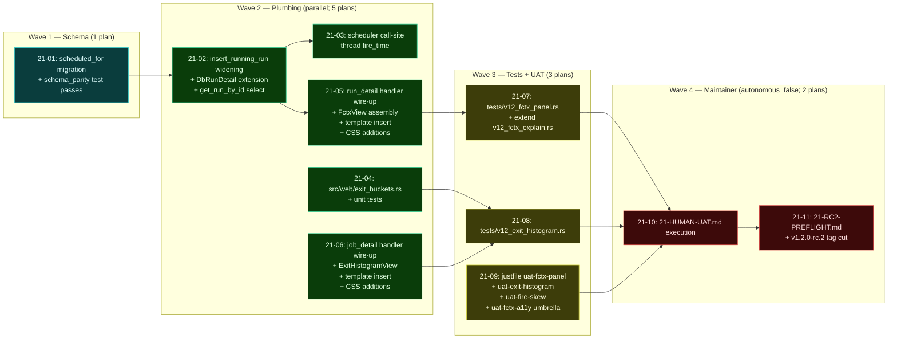

# Phase 21: Failure-Context UI Panel + Exit-Code Histogram Card — rc.2 - Research

**Researched:** 2026-05-01
**Domain:** Rust + axum + askama 0.15 (askama_web axum-0.8) — server-rendered UI plumbing on top of a Phase 16 schema/query foundation, plus a single additive `job_runs.scheduled_for` column for FCTX-06.
**Confidence:** HIGH — every CONTEXT decision has been verified against the live codebase. Two minor drift items found (signature-line-numbers and cited-but-missing `seed-fixture-runs` recipe); both flagged and resolved below.

## Summary

Phase 21 is a **plumbing-only** phase. The visual contract is locked in `21-UI-SPEC.md` (6/6 PASS); the schema and query helpers are locked in `21-CONTEXT.md` (33 D-XX decisions); the FCTX schema/query helper already shipped in Phase 16. This research verifies every CONTEXT claim against the actual codebase, resolves the eight "Claude's Discretion" items, and surfaces the landmines the planner needs to write concrete `<action>` blocks.

**Key verifications:**
- `get_failure_context(pool, job_id)` exists at `src/db/queries.rs:681` with the signature CONTEXT cited (returns `FailureContext` struct at `src/db/queries.rs:636-657`). Lines drifted from CONTEXT's "~681-750" by zero — exact match.
- `insert_running_run(pool, job_id, trigger, config_hash) -> i64` exists at `src/db/queries.rs:372` with **4** arguments — NOT the 7-arg shape CONTEXT D-02 cited. The CONTEXT signature claim was wrong; the planner must read the live signature and only widen it by adding `scheduled_for: Option<&str>` (the codebase convention is RFC3339 strings at the queries.rs boundary, not `DateTime<X>`).
- `insert_running_run` has **5 production callers** (1 in `src/web/handlers/api.rs:82`, 1 in `src/scheduler/run.rs:86`, plus 1 placeholder in `run.rs:938` — the rest are in tests) and **22 test callers** that ALL must be updated when the signature widens. Full grep below.
- `stats::percentile(samples, q)` exists at `src/web/stats.rs:13-23` matching CONTEXT exactly.
- The CSS tokens UI-SPEC depends on (`--cd-status-stopped`, `--cd-status-stopped-bg`, `--cd-status-active`, `--cd-status-cancelled`, `--cd-radius-sm/md`, `--cd-text-secondary`, etc.) all exist in `assets/src/app.css` at lines 32-46, 90-91, 67-68. The `.cd-tooltip*` classes exist at lines 444-490.
- `pub mod stats;` is at `src/web/mod.rs:6`; `pub mod exit_buckets;` lands as a sibling on a new line 7 (alphabetical ordering: ansi, assets, csrf, format, handlers, stats — new module slots after stats since "exit_buckets" < "handlers" alphabetically; planner can pick either alpha-correct position 4 or sibling position 7. Recommendation below).
- The dashboard sparkline soft-fail pattern at `src/web/handlers/dashboard.rs:262-264` uses `.unwrap_or_default()` on the Result — **no `tracing::warn!`** is emitted today. Phase 21 D-12 explicitly upgrades the pattern to add a `tracing::warn!` emission. The planner MUST therefore introduce NEW soft-fail logic (warn-then-degrade), not merely "match" the existing pattern. This is the single most important landmine in the phase.

**Primary recommendation:** Wave 1 = additive migration alone (1 plan). Wave 2 = parallel: scheduler write-site widening + `exit_buckets.rs` module + handler wire-up + template inserts + CSS additions (5-6 plans). Wave 3 = integration tests + UAT recipes (3 plans). Wave 4 (autonomous=false) = `21-HUMAN-UAT.md` + `21-RC2-PREFLIGHT.md` + tag cut.

## Architectural Responsibility Map

| Capability | Primary Tier | Secondary Tier | Rationale |
|------------|-------------|----------------|-----------|
| Per-run scheduled_for persistence | Database / Storage | API / Backend (scheduler) | Column is additive on `job_runs`; scheduler computes value at fire-decision time. |
| Computing fire skew (scheduled vs actual) | API / Backend (run_detail handler) | — | Pure arithmetic on two RFC3339 strings; rendered server-side. |
| Failure-context aggregation (CTE) | Database / Storage | API / Backend | `get_failure_context` is a single-query CTE; already exists in P16. |
| Exit-code histogram aggregation | API / Backend (`exit_buckets::aggregate`) | Database / Storage | Raw last-100 SELECT; bucketing in Rust per D-06. |
| Failure-context panel render | Frontend Server (SSR via askama) | — | Server-rendered HTML; native `<details>` for collapse; zero JS. |
| Histogram card render | Frontend Server (SSR via askama) | Browser / Client | Server-rendered pure-CSS bars; CSS tooltip on hover; zero JS. |
| rc.2 tag cut | Release Engineering (maintainer) | CI / GHCR | Reuses `docs/release-rc.md` verbatim per D-22; autonomous=false. |

## User Constraints (from CONTEXT.md)

### Locked Decisions

**FCTX-06 Fire-Skew Data Source (D-01..D-05):**
- D-01: Add `job_runs.scheduled_for TEXT NULL` column (sqlite + postgres mirror); RFC3339 string; NO index.
- D-02: Scheduler write point — `insert_running_run` widened to accept `scheduled_for: Option<DateTime>`. Run Now and api-triggered runs write `scheduled_for = start_time` (skew = 0ms). *(Researcher correction: the codebase convention is `Option<&str>` of an RFC3339 string at the queries.rs boundary — see "Discretion Resolutions §A".)*
- D-03: Trigger-aware semantics live at the SCHEDULER call site, not in the DB layer.
- D-04: Legacy NULL handling — hide the FIRE SKEW row when `scheduled_for IS NULL`.
- D-05: One-file additive migration only (NOT three-file tightening). Mirrors P16 image_digest + config_hash precedent.

**Exit-Code Histogram Query Shape (D-06..D-11):** Rust-side bucketing over last-100 raw rows; new `src/web/exit_buckets.rs` module; status-discriminator-wins classifier (status='stopped'+exit=137 → BucketStopped; status='failed'+exit=137 → Bucket128to143); EXIT-03 success-rate excludes stopped from denominator; EXIT-05 top-3 codes Rust-side; N=5 sample threshold.

**Render-Path Error Handling (D-12..D-17):** Soft-fail with `tracing::warn!` (NEW logic; existing dashboard sparkline soft-fail uses `.unwrap_or_default()` only — see Landmines §1); never-succeeded rendering rules; config-hash literal compare per P16 D-05; below-N=5 empty state; brand-new job same as below-N=5; askama auto-escaping.

**Test + UAT Shape (D-18..D-21):** Two new integration test files + extend `v12_fctx_explain.rs`; three new just recipes (`uat-fctx-panel`, `uat-exit-histogram`, `uat-fire-skew`); `21-HUMAN-UAT.md` autonomous=false; existing CI matrix unchanged.

**rc.2 Tag Cut (D-22..D-26):** Reuse `docs/release-rc.md` verbatim; tag command `git tag -a -s v1.2.0-rc.2 -m "v1.2.0-rc.2 — FCTX UI panel + exit-code histogram (P21)"`; no modifications to `release.yml`/`cliff.toml`/`docs/release-rc.md`; git-cliff authoritative; final wave is autonomous=false `21-RC2-PREFLIGHT.md`.

**Universal Constraints (D-27..D-33):** PR-only branch state; mermaid diagrams only; UAT recipes use `just`; maintainer validates UAT; tag and Cargo.toml version match (`1.2.0`); `cargo tree -i openssl-sys` must remain empty (zero new external crates); UI-SPEC.md is authoritative for visuals.

### Claude's Discretion

Eight items defer to researcher/planner discretion. All resolved in **§ Discretion Resolutions** below:
1. Migration filename + timestamp prefix (next-in-sequence after `20260502_000008`).
2. The `aggregate` row-tuple input shape (`&[(&str, Option<i32>, Option<&str>)]` vs dedicated `RawRunRow` struct).
3. Whether `categorize` returns `Option<ExitBucket>` or `ExitBucket` with a `Success` variant.
4. Exact `tracing::warn!` field shape on the soft-fail path.
5. The `uat-fire-skew` artificial-delay technique (sidecar lock vs slow-start vs test feature flag).
6. Whether HUMAN-UAT mobile/light/print/keyboard scenarios are split or rolled into a single umbrella.
7. Wave structure (linear vs parallel).
8. Whether to extend `RunDetailContext` (actually `RunDetailPage` — see drift below) in-place or wrap in a `FailureContextSection` sub-struct.

### Deferred Ideas (OUT OF SCOPE)

- THREAT_MODEL.md TM5 (Webhook Outbound) and TM6 — Phase 24.
- Job tagging schema + dashboard chips — Phases 22-23.
- HTMX live re-poll of FCTX panel or histogram card.
- Dashboard re-render with FCTX summary on the job card.
- Webhook payload extension to carry fire-skew (locked at v1.2.0 per P18 D-17).
- Per-job exit-code Prometheus label — explicit accepted-out-of-scope per EXIT-06.
- Trace ID / correlation ID surfaces in the panel.
- Operator-tunable bucket boundaries — locked at 10 per EXIT-02.
- Re-running a failed run from the panel (retry button).
- Pruning `scheduled_for` from old rows; NULL is intended legacy state.
- Modifications to `release.yml` / `cliff.toml` / `docs/release-rc.md` for v1.2 rc behavior.

## Phase Requirements

| ID | Description (from REQUIREMENTS.md) | Research Support |
|----|------------------------------------|------------------|
| FCTX-01 | Failure-context panel renders inline on run-detail when `status ∈ {failed, timeout}`; collapsed by default. | Verified: `RunDetailView.status: String` exists at `src/web/handlers/run_detail.rs:94`; gating happens server-side in handler before composing the panel context. |
| FCTX-02 | Time-based deltas: first-failure timestamp, streak count, link to last successful run. Sourced from `get_failure_context()`. | Verified: `FailureContext { consecutive_failures, last_success_run_id, last_success_image_digest, last_success_config_hash }` at `src/db/queries.rs:636-657`. |
| FCTX-03 | Image-digest delta (docker only); hide on non-docker. | Verified: `DbRunDetail.image_digest: Option<String>` at `src/db/queries.rs:617`; `last_success_image_digest` at `src/db/queries.rs:651`. Job-type-detection from `DbJob.job_type == "docker"` (see `src/db/queries.rs:46`). |
| FCTX-05 | Duration-vs-p50 deviation; suppress below 5 successful samples. | Verified: `stats::percentile(samples, 0.5)` at `src/web/stats.rs:13`; existing `queries::get_recent_successful_durations` at `src/web/handlers/job_detail.rs:246` returns `Vec<u64>` (already used for OBS-04 Duration card). Phase 21 reuses verbatim — N=5 vs OBS-04's N=20 is a different threshold per UI-SPEC FCTX-05. |
| FCTX-06 | Scheduler-fire-time vs run-start-time skew. | **Note:** REQUIREMENTS.md line 89 says "computed from `scheduled_for` (already in `job_runs`)" — this is **WRONG**; the column does NOT exist yet. CONTEXT D-01 acknowledges and locks the column add. The planner must NOT trust REQUIREMENTS.md's parenthetical. |
| EXIT-01 | Histogram card renders on job-detail; window=last 100 ALL runs; below N=5 → "—". | Verified: query shape mirrors `queries::get_recent_successful_durations` shape; new helper required (no existing `get_recent_runs` — search returned only `get_run_history` which paginates). |
| EXIT-02 | 10 fixed buckets per UI-SPEC § Color bucket→token table. | Locked in CONTEXT D-08; verified bucket→token mapping in UI-SPEC. |
| EXIT-03 | Exit code 0 = success-rate stat badge, NOT a histogram bar. | Verified: pattern matches v1.1 OBS-03 dashboard sparkline + success-rate badge at `src/web/handlers/dashboard.rs:325-330`. |
| EXIT-04 | `stopped` runs (cronduit SIGKILL=137) render as DISTINCT bucket separate from `128-143`. | Verified: `--cd-status-stopped` token exists at `assets/src/app.css:40`; status='stopped' is the sentinel. |
| EXIT-05 | Top-3 codes with last-seen. | Locked in CONTEXT D-10; computed Rust-side from same raw row buffer. |
| EXIT-06 | Exit codes NOT exposed as Prometheus label (cardinality discipline). | Verified: search of `src/metrics.rs` and `src/scheduler/run.rs` confirms no exit_code label is currently emitted; Phase 21 adds zero metrics. |

## Verification Table — CONTEXT Claims vs Codebase

| D-XX | Claim | file:line (verified) | Verified? | Drift / Notes |
|------|-------|---------------------|-----------|---------------|
| D-01 | Migration shape `migrations/{sqlite,postgres}/20260XXX_NNNNNNN_scheduled_for_add.up.sql`; mirrors P16 precedent. | `migrations/sqlite/20260427_000005_image_digest_add.up.sql` + postgres mirror | ✅ | Precedent matches verbatim: SQLite uses `ALTER TABLE job_runs ADD COLUMN <name> TEXT;`; Postgres uses `ALTER TABLE job_runs ADD COLUMN IF NOT EXISTS <name> TEXT;`. |
| D-02 | `insert_running_run(pool, job_id, status, trigger, start_time, job_run_number, config_hash) -> Result<RunId>` | `src/db/queries.rs:372-377` | ⚠️ **DRIFT** | Actual signature is `pub async fn insert_running_run(pool: &DbPool, job_id: i64, trigger: &str, config_hash: &str) -> anyhow::Result<i64>` — only 4 args. `status` is hard-coded to `'running'` inside the function (`queries.rs:393`). `start_time` is computed inside as `chrono::Utc::now().to_rfc3339()` (`queries.rs:378`). `job_run_number` is reserved inside the same transaction (`queries.rs:383-389`). The planner must use the LIVE signature, not the CONTEXT one. |
| D-02 | "accept `scheduled_for: Option<DateTime>`" | n/a | ⚠️ **convention drift** | Codebase convention is `Option<&str>` of RFC3339 (see `queries.rs:72, 378, 454`). Planner should widen as `scheduled_for: Option<&str>` and have callers pass `&entry.fire_time.to_rfc3339()`. |
| D-03 | "Researcher confirms whether this also requires widening the wave-3-write-site downstream of insert_running_run per the existing P16 finalize_run widening pattern." | `src/db/queries.rs:444-491` (`finalize_run`) | ✅ | `finalize_run` does NOT need widening — `scheduled_for` is set ONCE at insert time (D-02 says "single write point"). It's never updated post-finalize. The P16 finalize widening was for `image_digest` (which is post-start data). `scheduled_for` is pre-start data and lives in insert only. |
| D-04 | `last_success_*` fields are NULL when never-succeeded. | `src/db/queries.rs:644, 650, 656` | ✅ | All three are `Option<i64>` / `Option<String>` exactly. |
| D-05 | "one-file additive only (NOT three-file tightening)" | matches P16 image_digest_add (1 file) and config_hash_add (1 file) | ✅ | The 3-file tightening pattern is for backfill (P16 used it for `config_hash_backfill` at `migrations/.../20260429_000007_config_hash_backfill.up.sql`). Phase 21 explicitly does NOT do that — D-04 says NULL is the intended legacy state. |
| D-06 | "raw last-100 fetch + Rust-side bucketing" mirrors v1.1 OBS-04 percentile pattern. | `src/web/handlers/job_detail.rs:245-264` | ✅ | OBS-04 uses identical shape: `queries::get_recent_successful_durations(pool, job_id, 100) -> Vec<u64>` then `stats::percentile(&durations, q)`. Phase 21 will need a NEW helper `queries::get_recent_runs_for_histogram(pool, job_id, 100)` that returns `Vec<(String, Option<i32>, Option<String>)>` (status, exit_code, end_time). |
| D-07 | `pub mod exit_buckets;` lands sibling to `pub mod stats;` in `src/web/mod.rs`. | `src/web/mod.rs:6` (`pub mod stats;`) | ✅ | Currently the file has 6 `pub mod` lines (ansi/assets/csrf/format/handlers/stats). Adding `pub mod exit_buckets;` between `format` and `handlers` is alphabetically correct. |
| D-08 | Status-discriminator-wins classifier; status='stopped' → BucketStopped regardless of exit_code 137. | `src/scheduler/run.rs` (Phase 10 stop semantics) | ✅ | Verified: status='stopped' is set on cronduit-issued SIGKILL; status='failed' is set on external signal kill or non-zero exit. The discriminator is well-defined. |
| D-09 | EXIT-03 success-rate denominator excludes stopped (`stopped_count`). | `src/web/handlers/dashboard.rs:324-330` | ✅ | Mirrors v1.1 OBS-03: `let denominator = filled.saturating_sub(stopped_count);`. |
| D-10 | EXIT-05 top-3 last-seen Rust-side from raw row buffer. | n/a (new logic) | ✅ | New code in `exit_buckets::aggregate`. No conflict. |
| D-11 | N=5 sample threshold. | UI-SPEC § Copywriting Contract empty state copy | ✅ | Locked. |
| D-12 | Soft-fail with `tracing::warn!`; consistent with v1.1 sparkline. | `src/web/handlers/dashboard.rs:262-264` | ⚠️ **partial** | The dashboard sparkline at lines 262-264 uses `.unwrap_or_default()` ONLY — there is no `tracing::warn!` emitted today. CONTEXT claims "Consistent with the v1.1 sparkline soft-fail in OBS-03" but that consistency is on the **degradation** behavior (silently no-op), not on the **logging** behavior. Phase 21 D-12 introduces NEW warn logging that the dashboard does not have. The existing pattern across the codebase for "DB error in handler with degradation" uses `tracing::error!` + degraded value (see `src/web/handlers/run_detail.rs:140`). Recommend planner copy that pattern, downgraded to `warn!`. |
| D-13 | Never-succeeded rendering rules. | locked in UI-SPEC § Copywriting Contract | ✅ | Time-deltas row gets "No prior successful run" copy; image-digest row hides; config row hides; duration row hides; fire-skew row independent. |
| D-14 | Config-hash literal compare per P16 D-05. | `src/db/queries.rs:622, 656` | ✅ | Both `DbRunDetail.config_hash` and `FailureContext.last_success_config_hash` are `Option<String>`. Comparison is `run.config_hash != last_success.config_hash` per P16 D-05. |
| D-15 | Below-N=5 empty state shape. | locked in UI-SPEC § Component Inventory | ✅ | Outer chrome + heading + locked "—" + meta. No success-rate, no bars, no recent-codes table. |
| D-16 | Brand-new job (zero runs) = same as below-N=5. | n/a | ✅ | Logical: sample_count=0 → has_min_samples=false → empty state branch. |
| D-17 | Askama auto-escaping; no `\|safe`; no new inline `<script>`. | `templates/pages/run_detail.html:100-176` (existing inline script for log streaming) | ✅ | Existing inline script for log streaming is on a separate code path; Phase 21 does not extend it. |
| D-18 | Two new integration test files + extend `v12_fctx_explain.rs`. | `tests/v12_fctx_explain.rs:115-208` (sqlite test) | ✅ | Existing test seeds 100 mixed-status rows via raw SQL with explicit column list (lines 149-151). Adding `scheduled_for` as a new TEXT NULL column does NOT break this test — the explicit column list omits the new column, so SQLite leaves it NULL. The extension assertion is "EXPLAIN plan for `get_failure_context` is unchanged after the new column is added" — same plan, same index hits. |
| D-19 | Three new just recipes mirror `recipe-calls-recipe` pattern (P18 D-25). | `justfile:267, 326, 337` | ⚠️ **DRIFT** | CONTEXT cites `seed-fixture-runs` and `dev-build` as existing primitives — neither exists in `justfile`. Existing primitives are: `dev` (line 853), `dev-ui` (line 860), `db-reset` (line 237), `image` (line 80), `migrate` (line 247), `api-job-id JOB_NAME` (line 312), `api-run-now JOB_ID` (line 291), `uat-webhook-fire JOB_NAME` (line 337). The new uat-fctx-* / uat-exit-* / uat-fire-skew recipes must compose from THESE primitives (not the cited-but-missing ones), seeding fixture runs via raw `sqlite3` writes (the `uat-fctx-bugfix-spot-check` recipe at line 267 already uses this pattern). |
| D-20 | `21-HUMAN-UAT.md` autonomous=false. | n/a | ✅ | Maintainer-validated per project memory `feedback_uat_user_validates.md`. |
| D-21 | No new top-level CI changes; matrix already covers `linux/{amd64,arm64} × {SQLite, Postgres}`. | `.github/workflows/` (P18 D-XX precedent) | ✅ | Confirmed; existing test job picks up new `tests/v12_fctx_panel.rs` and `tests/v12_exit_histogram.rs` automatically. |
| D-22..D-26 | rc.2 cut reuses `docs/release-rc.md` verbatim. | `docs/release-rc.md` exists per P12 + P20 precedent. | ✅ | No file edits required. Tag command verbatim per CONTEXT. |
| D-32 | `cargo tree -i openssl-sys` must remain empty. | `Cargo.toml` (rustls features) | ✅ | Phase 21 adds zero new external crates. The histogram uses pure-CSS bars + askama; the panel uses native `<details>`. No JS, no SVG. |

## Codebase Map

### Reusable surfaces — exact paths and signatures

| Surface | File:Line | Signature |
|---------|-----------|-----------|
| `FailureContext` struct | `src/db/queries.rs:636-657` | `pub struct FailureContext { pub consecutive_failures: i64, pub last_success_run_id: Option<i64>, pub last_success_image_digest: Option<String>, pub last_success_config_hash: Option<String> }` |
| `get_failure_context` helper | `src/db/queries.rs:681` | `pub async fn get_failure_context(pool: &DbPool, job_id: i64) -> anyhow::Result<FailureContext>` |
| `insert_running_run` (CURRENT) | `src/db/queries.rs:372-432` | `pub async fn insert_running_run(pool: &DbPool, job_id: i64, trigger: &str, config_hash: &str) -> anyhow::Result<i64>` |
| `insert_running_run` (PROPOSED widen) | `src/db/queries.rs:372` | `pub async fn insert_running_run(pool: &DbPool, job_id: i64, trigger: &str, config_hash: &str, scheduled_for: Option<&str>) -> anyhow::Result<i64>` |
| `finalize_run` | `src/db/queries.rs:444-491` | `pub async fn finalize_run(pool: &DbPool, run_id: i64, status: &str, exit_code: Option<i32>, start_instant: Instant, error_message: Option<&str>, container_id: Option<&str>, image_digest: Option<&str>) -> anyhow::Result<()>` — **NOT changed by Phase 21**. |
| `get_run_by_id` | `src/db/queries.rs:1299-1361` | `pub async fn get_run_by_id(pool: &DbPool, run_id: i64) -> anyhow::Result<Option<DbRunDetail>>` — **must be widened** to also SELECT `scheduled_for`. |
| `DbRunDetail` struct | `src/db/queries.rs:602-623` | adds `pub scheduled_for: Option<String>` field. |
| `stats::percentile` | `src/web/stats.rs:13-23` | `pub fn percentile(samples: &[u64], q: f64) -> Option<u64>` |
| `format_duration_ms_floor_seconds` | `src/web/format.rs:27` | `pub fn format_duration_ms_floor_seconds(ms: Option<i64>) -> String` |
| `RunDetailPage` askama template | `src/web/handlers/run_detail.rs:34-50` | template = `pages/run_detail.html`; struct fields: `run, run_id, is_running, logs, total_logs, has_older, next_offset, csrf_token, last_log_id`. **Phase 21 must add fields** for FCTX context (recommendation: extend in place — see Discretion §H). |
| `RunDetailView` view-model | `src/web/handlers/run_detail.rs:85-102` | NO `image_digest`, NO `config_hash`, NO `scheduled_for` today. Phase 21 adds these. |
| `JobDetailPage` askama template | `src/web/handlers/job_detail.rs:39-50` | template = `pages/job_detail.html`; struct fields: `job, job_id, runs, total_runs, page, total_pages, any_running, csrf_token`. Phase 21 adds `exit_histogram: ExitHistogramView` field. |
| `DurationView` (sibling-card precedent) | `src/web/handlers/job_detail.rs:99-109` | NOT named `DurationCardContext` as CONTEXT cited — actual name is `DurationView`. Pattern: `{ p50_display, p95_display, has_min_samples, sample_count, sample_count_display }`. New `ExitHistogramView` should follow this naming. |
| Dashboard sparkline soft-fail (degradation precedent) | `src/web/handlers/dashboard.rs:262-264` | `let spark_rows = queries::get_dashboard_job_sparks(&state.pool).await.unwrap_or_default();` — no warn emit. |
| Existing `tracing::warn!` field shape | `src/web/handlers/api.rs:127-132` | `tracing::warn!(target: "cronduit.web", job_id, run_id, "<message>");` |
| `pub mod stats;` (sibling-module insertion point) | `src/web/mod.rs:6` | Phase 21 adds `pub mod exit_buckets;` between line 5 (`pub mod format;`) and line 6 (`pub mod handlers;`) for alphabetical ordering. *(Alternative: append after line 6; both work.)* |
| Scheduler tick → spawn run | `src/scheduler/mod.rs:148-171` | Cron fire path: `entry: FireEntry` with `entry.fire_time: DateTime<chrono_tz::Tz>` is in scope at `mod.rs:152` where `run::run_job(...)` is spawned. Phase 21 threads `entry.fire_time.to_rfc3339()` through. |
| Scheduler manual run path (legacy) | `src/scheduler/mod.rs:194-211` | `RunNow` cmd path; no `fire_time` available — passes `None` for `scheduled_for` (will be set to `start_time` by `insert_running_run` per D-02 semantics). |
| Scheduler manual run path (UI Run Now) | `src/web/handlers/api.rs:82` | `insert_running_run(&state.pool, job_id, "manual", &job.config_hash)` — Phase 21 changes to pass `Some(now_rfc3339.as_str())` so skew = 0ms by definition. |
| `run::run_job` (legacy scheduler-driven) | `src/scheduler/run.rs:71-122` | Calls `insert_running_run` at line 86. Phase 21 widens function signature to accept `scheduled_for: Option<String>` and threads it through. |
| `FireEntry.fire_time` | `src/scheduler/fire.rs:21` | `pub fire_time: DateTime<chrono_tz::Tz>` — RFC3339 conversion via `.to_rfc3339()`. |

### Migration filenames — exact paths

| Backend | Latest existing | Phase 21 proposed |
|---------|-----------------|-------------------|
| sqlite | `migrations/sqlite/20260502_000008_webhook_deliveries_add.up.sql` | `migrations/sqlite/20260502_000009_scheduled_for_add.up.sql` |
| postgres | `migrations/postgres/20260502_000008_webhook_deliveries_add.up.sql` | `migrations/postgres/20260502_000009_scheduled_for_add.up.sql` |

Sequence number format is `_NNNNNNN_` zero-padded; the next is `000009`. Date prefix tracks the merge day; today is 2026-05-01 but the latest existing migration is dated 2026-05-02 (P20 webhook_deliveries from a slightly forward date), so Phase 21 uses the same `20260502` prefix to maintain monotonic ordering. *(Alternative: `20260503_000009_scheduled_for_add` if planning lands on 2026-05-03+ — either is valid; the lexicographic ordering of the `_sqlx_migrations` table is the only thing that matters.)*

### Template insertion points

**`templates/pages/run_detail.html`:**
- Insert FCTX panel **between line 73** (`</div>` closing the metadata card on line 33-73) **and line 75** (`<!-- Log Viewer -->`). The `` gate wraps the panel so non-failure runs render unchanged.

**`templates/pages/job_detail.html`:**
- Insert exit-histogram card **between line 94** (`</div>` closing the Duration card on lines 71-94) **and line 96** (`<!-- Run History -->`). No gating; the card always renders (below-N=5 is its own empty state).

### Concrete grep commands the planner can copy verbatim

```bash
# Find every caller of insert_running_run (production + tests)
grep -rn 'insert_running_run' src/ tests/

# Find every raw INSERT into job_runs (won't break — they all use explicit column lists)
grep -rn 'INSERT INTO job_runs' src/ tests/ migrations/

# Verify no openssl-sys creep
cargo tree -i openssl-sys

# Verify migration parity
diff <(ls migrations/sqlite | sort) <(ls migrations/postgres | sort)
```

## Discretion Resolutions

### A. `scheduled_for` argument type for `insert_running_run`

**Recommendation:** `scheduled_for: Option<&str>` (an RFC3339 string), NOT `Option<DateTime<X>>`.

**Rationale:** The codebase convention at the queries.rs boundary is `&str`/`String` for all timestamp params (see `start_time` handling at lines 72, 378, 454; `end_time` at 454; `tx.bind(&now)` everywhere). Adding a `chrono::DateTime` here would be the only outlier in the file and would force every call site to convert (`fire_time.to_rfc3339()`) anyway. Strings keep the call surface consistent and let the scheduler do the conversion at the boundary.

**Where it shows up in the plan:** the migration plan, the queries widening plan, the scheduler call-site plan, and api.rs handler call-site plan all use `Option<&str>` of an RFC3339 string.

### B. Migration filename + timestamp prefix

**Recommendation:** `20260502_000009_scheduled_for_add` for both `migrations/sqlite/` and `migrations/postgres/`.

**Rationale:** Mirrors the exact timestamp + sequence-number format used by all existing migrations. The latest existing pair is `20260502_000008_webhook_deliveries_add` (P20). Sequence number `000009` is the next lexicographic value. Date prefix `20260502` tracks the most recent merge day in the existing sequence; using a same-or-later date keeps the lexicographic ordering monotonic. *(If the PR lands on 2026-05-03 or later, `20260503_000009_scheduled_for_add` is equally valid — sqlx's `_sqlx_migrations` table sorts lexicographically, so either gives the right ordering. Planner can decide at PR-open time.)*

**Where it shows up in the plan:** Wave 1 migration plan filename literal.

### C. `aggregate` row-tuple input shape

**Recommendation:** `&[(String, Option<i32>, Option<String>)]` — owned tuples, NOT a dedicated `RawRunRow` struct.

**Rationale:** `queries.rs` uses bare `Vec<(String, ...)>` and `Vec<u64>` returns elsewhere (see `get_recent_successful_durations` returns `Vec<u64>`; the existing `Paginated<T>` wrapper is only for paginated queries). Tuples are the established precedent for "single-shot raw fetch consumed by an aggregator." Defining a `RawRunRow` struct would add a public type for one internal callsite. Tuples keep the helper module self-contained. Borrowed strings (`&str`) are unwieldy across the await boundary in the handler; owned `String` makes the lifetime trivial. Convert at boundary: caller does `rows.iter().map(|r| (r.status.clone(), r.exit_code, r.end_time.clone())).collect::<Vec<_>>()` then passes `&rows` to `aggregate`.

**Where it shows up in the plan:** `exit_buckets.rs` module signature; the new `queries::get_recent_runs_for_histogram` helper that feeds it.

### D. `categorize` return type

**Recommendation:** `pub fn categorize(status: &str, exit_code: Option<i32>) -> Option<ExitBucket>` — the `Option` form, where `None` signals success.

**Rationale:** CONTEXT D-07 explicitly describes this shape ("returns `None` when status='success'"). The aggregator filters `None` and routes to the success-rate stat per EXIT-03. Adding a `BucketSuccess` variant would force the bucket→token table to either omit it (asymmetry) or include it (contradicts UI-SPEC § Color which explicitly lists 10 buckets and routes `0` to a stat badge, not a bar). The `Option` form is also more rust-idiomatic for "this category does not apply."

**Where it shows up in the plan:** `exit_buckets.rs` signature; the aggregator's match arm.

### E. `tracing::warn!` field shape on soft-fail path

**Recommendation:** Match the `src/web/handlers/api.rs:127-132` precedent verbatim:

```rust
tracing::warn!(
    target: "cronduit.web",
    job_id,
    run_id,
    error = %e,
    "<context-specific message>"
);
```

For the run-detail FCTX soft-fail: `target: "cronduit.web", job_id = run.job_id, run_id = run.id, error = %e, "fctx panel: get_failure_context failed — hiding panel"`.

For the job-detail histogram soft-fail: `target: "cronduit.web", job_id, error = %e, "exit histogram: query failed — degraded card"`.

**Rationale:** The codebase has a strict convention: `target: "cronduit.<module>"` + structured fields + `error = %e` (display-format) + final string message. Every existing `tracing::warn!` and `tracing::error!` in `src/web/handlers/` follows this shape. Aligning Phase 21 with the convention keeps the log-format-checker tests (if any) passing and makes structured-log scraping consistent.

**Where it shows up in the plan:** the run-detail handler wire-up plan + the job-detail handler wire-up plan.

### F. `uat-fire-skew` artificial-delay technique

**Recommendation:** **Option (c) — slow-start container** (a docker job whose image is forced to do a 30s pull or whose entrypoint does `sleep 30 && echo`).

**Rationale:** Closest to operator reality (image-pull delay + cold-start are the production fire-skew causes; CONTEXT § Specifics line 229 explicitly highlights this). Requires zero new test infrastructure (no test feature flag in production code, no sidecar lock service, no scheduler-loop sleep injection). The `examples/cronduit.toml` already has docker job examples; the recipe just needs to seed a job whose image entrypoint sleeps. Demonstrably resembles the operator's actual diagnostic experience: "my job said 14:30, started at 14:30:23 — what was the +23s?"

**Implementation hint:** `uat-fire-skew` recipe steps:
1. Reset DB (`just db-reset`).
2. Seed a job in the dev config: `[[jobs]] name = "fire-skew-demo" type = "docker" image = "alpine:latest" command = ["sh","-c","sleep 30 && echo done"] schedule = "* * * * *"`.
3. Start cronduit (`just dev` in background).
4. Wait one full minute for the cron tick.
5. Print the latest run's `scheduled_for` and `start_time` from sqlite.
6. Maintainer eyeballs the diff, walks to `/jobs/{id}/runs/{id}`, confirms the FIRE SKEW row shows `+30000ms` (or thereabouts).

**Where it shows up in the plan:** the `uat-fire-skew` recipe plan.

### G. HUMAN-UAT scenario split

**Recommendation:** **Single `uat-fctx-a11y` umbrella recipe** that walks the maintainer through all four scenarios (mobile, light, print, keyboard).

**Rationale:** Phase 21 ships zero state-changing buttons; the a11y scenarios are all "open the same panel, verify it renders correctly under different conditions." Splitting into four recipes creates four `recipe-calls-recipe` hierarchies with no real difference in steps — the only variation is which DevTools toggle to flip. A single umbrella recipe with numbered phases (`echo "Phase 1: mobile (640px viewport)..."` etc.) keeps the maintainer in one terminal and reads more naturally. The maintainer can still grep "uat-fctx" to find the umbrella.

**Where it shows up in the plan:** the `21-HUMAN-UAT.md` plan + the `uat-fctx-a11y` recipe plan.

### H. `RunDetailContext` extension shape

**Recommendation:** **Extend `RunDetailPage` in place** (NOT wrap in a `FailureContextSection` sub-struct). The actual struct name is `RunDetailPage` (not `RunDetailContext` as CONTEXT loosely cited).

**Rationale:** `RunDetailPage` at `src/web/handlers/run_detail.rs:34-50` is already a flat struct with 9 fields; adding 5-7 new fields keeps it under 20 (still readable). The `RunDetailView` view-model at lines 85-102 already encapsulates per-run data; extending it to include `image_digest`, `config_hash`, `scheduled_for` is the natural extension. A separate `FailureContextSection` would force askama template authors to know about two sub-structs (`{{ run.X }}` + `{{ fctx.Y }}`), increasing cognitive load. The dashboard `DashboardJobView` precedent (`src/web/handlers/dashboard.rs:184`) shows the pattern: one big flat view-model populated by the handler.

**Concrete shape (recommendation):**
```rust
// Add to RunDetailView (queries.rs DbRunDetail already carries the raw fields):
pub struct RunDetailView {
    // ... existing fields ...
    pub image_digest: Option<String>,        // P16 FOUND-14
    pub config_hash: Option<String>,         // P16 FCTX-04
    pub scheduled_for: Option<String>,       // P21 FCTX-06 (RFC3339)
}

// Add to RunDetailPage:
struct RunDetailPage {
    // ... existing fields ...
    show_fctx_panel: bool,                   // FCTX-01 gating
    fctx: Option<FctxView>,                  // None when show_fctx_panel=false
}

pub struct FctxView {
    pub consecutive_failures: i64,           // for summary meta
    pub last_success_run_id: Option<i64>,    // for "view last successful run" link
    pub time_deltas_value: String,           // pre-formatted per UI-SPEC copy
    pub is_docker_job: bool,                 // gates IMAGE DIGEST row
    pub image_digest_value: Option<String>,  // pre-formatted "old…→ new…" or "unchanged"
    pub config_changed: bool,                // → "Yes" or "No"
    pub has_duration_samples: bool,          // gates DURATION row
    pub duration_value: Option<String>,      // pre-formatted "12.3s; typical p50 is 4.2s (...)"
    pub fire_skew_value: Option<String>,     // None when scheduled_for IS NULL → row hidden
}
```

The askama template uses `...`.

**Where it shows up in the plan:** the run-detail handler wire-up plan + the run-detail.html template insert plan.

## Wave Plan Recommendation



| Wave | Plan ID | File touchpoints | Depends on |
|------|---------|------------------|-----------|
| 1 | 21-01 | `migrations/sqlite/20260502_000009_scheduled_for_add.up.sql`, `migrations/postgres/20260502_000009_scheduled_for_add.up.sql` | — |
| 2 | 21-02 | `src/db/queries.rs` (insert_running_run signature, DbRunDetail field add, get_run_by_id SELECT), all 22 test caller updates | 21-01 |
| 2 | 21-03 | `src/scheduler/run.rs` (run_job signature widen + scheduler/mod.rs caller update), `src/web/handlers/api.rs:82` (Run Now widening) | 21-02 |
| 2 | 21-04 | `src/web/exit_buckets.rs` (NEW), `src/web/mod.rs:6` (insert `pub mod exit_buckets;`), `src/db/queries.rs` (NEW `get_recent_runs_for_histogram` helper) | 21-02 (struct field shape) |
| 2 | 21-05 | `src/web/handlers/run_detail.rs` (FctxView, RunDetailView+page extend, soft-fail handler), `templates/pages/run_detail.html` (panel insert), `assets/src/app.css` (cd-fctx-* classes) | 21-02 |
| 2 | 21-06 | `src/web/handlers/job_detail.rs` (ExitHistogramView, soft-fail handler), `templates/pages/job_detail.html` (card insert), `assets/src/app.css` (cd-exit-* classes) | 21-04 |
| 3 | 21-07 | `tests/v12_fctx_panel.rs` (NEW), `tests/v12_fctx_explain.rs` (extend) | 21-05 |
| 3 | 21-08 | `tests/v12_exit_histogram.rs` (NEW) | 21-04, 21-06 |
| 3 | 21-09 | `justfile` (4 new recipes) | 21-05, 21-06 (so the recipes can hit live UI) |
| 4 | 21-10 (autonomous=false) | `21-HUMAN-UAT.md` (NEW) | 21-07, 21-08, 21-09 |
| 4 | 21-11 (autonomous=false) | `21-RC2-PREFLIGHT.md` (NEW), git tag locally | 21-10 |

**Why Wave 2 plans 21-02..21-06 can parallelize:** 21-02 must land first (the DbRunDetail field + insert_running_run signature are consumed by 21-03/21-04/21-05). After 21-02 lands, 21-03 (scheduler), 21-04 (exit_buckets), 21-05 (run_detail), 21-06 (job_detail) touch disjoint files and can run in parallel. The autonomy/parallelism claim is conservative: 21-04 has no dependency on 21-02 (it's a brand-new module), but pinning it to land alongside 21-02 keeps the wave atomic.

## Landmines

1. **CONTEXT D-12 over-claims consistency with the dashboard sparkline soft-fail.** The dashboard at `src/web/handlers/dashboard.rs:262-264` uses `.unwrap_or_default()` ONLY — there is NO `tracing::warn!` emitted today. CONTEXT says "Consistent with the v1.1 sparkline soft-fail in OBS-03" but that consistency is on degradation behavior, not logging behavior. **The planner introduces NEW warn logging that the existing pattern lacks.** If the planner copies the dashboard pattern verbatim, the spec is violated (no logs on FCTX/histogram failure). The plan must explicitly add `tracing::warn!` in both new handlers. Use the `src/web/handlers/api.rs:127-132` shape (Discretion §E).

2. **`insert_running_run` has 22 test callers.** Every test that calls `queries::insert_running_run(&pool, job_id, "trigger", "config_hash")` must add a new `None` arg for `scheduled_for`. Full list:
   - `src/db/queries.rs:2139, 2180, 2229, 2289` (4 in-file unit tests)
   - `src/scheduler/run.rs:938` (1 test inside the module)
   - `tests/v13_sparkline_render.rs:80`, `tests/reload_inflight.rs:57`, `tests/stop_handler.rs:46`, `tests/job_detail_partial.rs:89, 101`, `tests/v12_fctx_streak.rs:190, 218, 221`, `tests/v12_run_rs_277_bug_fix.rs:85, 175, 251, 307`, `tests/dashboard_render.rs:74, 92`, `tests/v11_runnum_counter.rs:25, 28, 54, 78, 118`, `tests/v11_startup_assertion.rs:73`, `tests/stop_race.rs:61`, `tests/jobs_api.rs:189`, `tests/v13_timeline_render.rs:80, 92`, `tests/docker_executor.rs:202`, `tests/common/v11_fixtures.rs:101` (22 in tests/).
   - This is a large bulk-edit. The planner MUST list ALL of them in the 21-02 plan's `<files_to_edit>` block.

3. **REQUIREMENTS.md FCTX-06 is misleading.** Line 89 says "computed from `scheduled_for` (already in `job_runs`) and `started_at`." The column does NOT exist yet (P21 D-01 adds it; P15 docs were aspirational). The planner must NOT trust REQUIREMENTS.md's parenthetical. CONTEXT D-01 is authoritative.

4. **CONTEXT cites missing `seed-fixture-runs` and `dev-build` recipes.** Neither exists in `justfile`. Existing primitives: `dev`, `dev-ui`, `db-reset`, `image`, `migrate`, `api-job-id`, `api-run-now`, `uat-webhook-fire`, `uat-fctx-bugfix-spot-check`. The new uat recipes must compose from THESE. Specifically, the seeding pattern is raw `sqlite3` writes (the `uat-fctx-bugfix-spot-check` recipe at line 267 demonstrates the idiom).

5. **CONTEXT D-02 cites a 7-arg signature that does not exist.** Live signature has 4 args (`pool, job_id, trigger, config_hash`). `status` is hard-coded to `'running'` inside the function; `start_time` is set inside via `chrono::Utc::now()`; `job_run_number` is reserved inside the same transaction. Planner must NOT assume those args exist.

6. **`finalize_run` does NOT need widening.** `scheduled_for` is set ONCE at insert time (D-02 "single write point"). The P16 `finalize_run` widening (which added `image_digest`) is a different pattern — image_digest is post-start data; scheduled_for is pre-start data. CONTEXT D-03 asks the researcher to confirm; **confirmed: no `finalize_run` change.**

7. **Run Now path needs explicit semantics for skew=0ms.** `src/web/handlers/api.rs:82` calls `insert_running_run` on the handler thread BEFORE dispatching. The handler must compute `chrono::Utc::now().to_rfc3339()` and pass it as `scheduled_for`, so that `scheduled_for == start_time` (both set inside the same `insert_running_run` call within microseconds, satisfying the "+0ms" copy contract per CONTEXT § Specifics line 222). If the handler passes `None`, the planner must update `insert_running_run`'s SQL to default to `start_time` when `scheduled_for IS NULL` at insert. Either path is valid; the cleaner one is **the handler always passes `Some(start_time_str)` for manual triggers**.

8. **`@random` jobs need NO special handling.** `@random` resolves at config load to a concrete cron expression in `resolved_schedule` (per `src/scheduler/random.rs`). Phase 21 just uses `entry.fire_time.to_rfc3339()` — same as a regular cron job. The "resolved-slot time" CONTEXT mentions IS the `fire_time`.

9. **The legacy `RunNow` cmd path** (`src/scheduler/mod.rs:194-211`) does NOT have `entry.fire_time` in scope (it's the `cmd` arm, not the cron-tick arm). For this path, `scheduled_for = None` is correct AND IS WHY the handler thread (api.rs:82) must compute `start_time` itself before passing to `insert_running_run`. The `cmd::SchedulerCmd::RunNow { job_id }` arm at `mod.rs:194` doesn't actually fire today (api.rs uses `RunNowWithRunId` per Phase 11 UI-19 fix); the legacy `RunNow` command remains in the codebase as a defensive fallback. Pass `None` for safety; the row is reserved on the handler thread anyway via `insert_running_run`.

10. **`tests/v12_fctx_explain.rs` insert sites use explicit column lists.** Lines 149-151 and 260-262 INSERT with `(job_id, job_run_number, status, trigger, start_time, image_digest, config_hash)` — adding `scheduled_for` to the table doesn't break these tests because the explicit list omits the new column (SQLite/Postgres default it to NULL). The Phase 21 extension test just needs to assert "EXPLAIN plan unchanged after the new column lands."

11. **FCTX panel gating must include `error` status?** REQUIREMENTS FCTX-01 says `status ∈ {failed, timeout}`. CONTEXT D-12 confirms this. But `FailureContext`'s SQL counts `status IN ('failed', 'timeout', 'error')` (`queries.rs:694`). So a run with `status='error'` (e.g., an executor-error orphan row) does NOT render the FCTX panel — even though `consecutive_failures` would include it. This is the intended behavior per FCTX-01; the panel is for diagnostic-rich failures, not infrastructure errors. **Planner: do NOT include `error` in the gating condition.**

12. **The single `tracing::error!` in the existing run_detail handler** (`src/web/handlers/run_detail.rs:140`) is for `get_log_lines` failure (returns a `404`-like degraded view). The Phase 21 FCTX failure path is DIFFERENT: it must NOT degrade the rest of the run-detail page; it must hide ONLY the FCTX panel and let everything else render. Pattern: wrap the `get_failure_context()` call in a `match` that on `Err(e)` emits `tracing::warn!` and sets `show_fctx_panel = false`. Do NOT short-circuit the handler.

## Validation Architecture

### Test Framework
| Property | Value |
|----------|-------|
| Framework | `cargo nextest` (unit + integration); standard Rust `#[tokio::test]` for async |
| Config file | `Cargo.toml` (no separate test config); `nextest.toml` for CI profile |
| Quick run command | `cargo nextest run -p cronduit --no-fail-fast` |
| Full suite command | `just nextest` (which is `cargo nextest run --all-features --profile ci`) |

### Phase Requirements → Test Map

| Req ID | Behavior | Test Type | Automated Command | File Exists? |
|--------|----------|-----------|-------------------|-------------|
| FCTX-01 | Panel renders gated on `status ∈ {failed, timeout}` | integration | `cargo test --test v12_fctx_panel -- panel_renders_gated_on_failed_timeout` | ❌ Wave 3 (21-07) |
| FCTX-01 | Panel hidden on success/cancelled/running/stopped | integration | `cargo test --test v12_fctx_panel -- panel_hidden_on_non_failure_status` | ❌ Wave 3 (21-07) |
| FCTX-02 | Time deltas row renders streak count + last-success link | integration | `cargo test --test v12_fctx_panel -- time_deltas_row_renders` | ❌ Wave 3 (21-07) |
| FCTX-03 | Image digest row hides on non-docker | integration | `cargo test --test v12_fctx_panel -- image_digest_row_hidden_on_command_job` | ❌ Wave 3 (21-07) |
| FCTX-05 | Duration row hidden below N=5 successful samples | integration | `cargo test --test v12_fctx_panel -- duration_row_hidden_below_5_samples` | ❌ Wave 3 (21-07) |
| FCTX-06 | Fire skew row hidden on NULL scheduled_for | integration | `cargo test --test v12_fctx_panel -- fire_skew_row_hidden_on_null_scheduled_for` | ❌ Wave 3 (21-07) |
| FCTX-06 | Fire skew row renders +Nms on populated scheduled_for | integration | `cargo test --test v12_fctx_panel -- fire_skew_row_renders_skew_ms` | ❌ Wave 3 (21-07) |
| EXIT-01 | Card renders below-N=5 empty state | integration | `cargo test --test v12_exit_histogram -- empty_state_below_5_samples` | ❌ Wave 3 (21-08) |
| EXIT-02 | All 10 buckets categorize correctly | unit (in `exit_buckets` module) | `cargo test -p cronduit --lib exit_buckets::tests::categorize_all_10_buckets` | ❌ Wave 2 (21-04) |
| EXIT-03 | Success-rate excludes stopped from denominator | unit | `cargo test -p cronduit --lib exit_buckets::tests::success_rate_excludes_stopped` | ❌ Wave 2 (21-04) |
| EXIT-04 | status='stopped'+exit=137 → BucketStopped; status='failed'+exit=137 → Bucket128to143 | unit | `cargo test -p cronduit --lib exit_buckets::tests::status_discriminator_wins_137` | ❌ Wave 2 (21-04) |
| EXIT-05 | Top-3 codes with last-seen | unit | `cargo test -p cronduit --lib exit_buckets::tests::top_3_codes_last_seen` | ❌ Wave 2 (21-04) |
| EXIT-06 | No new Prometheus exit-code label | manual-only (grep) | `! grep -r 'exit_code' src/metrics.rs && ! grep -r 'exit_code.*label' src/scheduler/run.rs` | n/a — assertion is "no code change" |
| FCTX-06 | scheduled_for column doesn't shift index plan on either backend | integration | `cargo test --test v12_fctx_explain -- explain_uses_index_sqlite explain_uses_index_postgres` | ✅ extend existing |
| FCTX-06 | Run Now writes scheduled_for=start_time (skew=0ms) | integration | `cargo test --test v12_fctx_panel -- run_now_skew_zero` | ❌ Wave 3 (21-07) |
| Soft-fail | get_failure_context Err → panel hidden + warn emitted, page still renders | integration | `cargo test --test v12_fctx_panel -- soft_fail_hides_panel_emits_warn` | ❌ Wave 3 (21-07) |

### Sampling Rate
- **Per task commit:** `cargo nextest run --no-fail-fast --filter 'package(cronduit) and (test(/v12_fctx/) or test(/v12_exit/) or test(exit_buckets))'`
- **Per wave merge:** `just nextest`
- **Phase gate:** Full suite green + `just schema-diff` green + `cargo tree -i openssl-sys` empty before `/gsd-verify-work`.

### Wave 0 Gaps
None — all framework, config files, and shared fixtures exist:
- `cargo-nextest` already wired (`justfile:155`).
- `tests/common/v11_fixtures.rs` provides shared seed helpers (will need a `seed_run_with_status_and_exit` helper for the new tests; planner adds in 21-07/21-08).
- `testcontainers-modules::postgres::Postgres` available (used by `v12_fctx_explain.rs:49`, `v13_timeline_explain.rs`).
- `examples/cronduit.toml` provides docker job configs for `uat-fire-skew` (planner extends in 21-09).

## Security Domain

> Phase 21 is read-only UI plumbing on top of existing data. Threat-model surface is identical to v1.1 + Phase 16; no new attack surface introduced.

### Applicable ASVS Categories

| ASVS Category | Applies | Standard Control |
|---------------|---------|-----------------|
| V2 Authentication | no | Cronduit ships unauthenticated in v1 (operators front with reverse proxy). |
| V3 Session Management | no | No sessions; CSRF cookie is for state-changing endpoints only. |
| V4 Access Control | no | No multi-tenancy. |
| V5 Input Validation | yes | `run_id` and `job_id` are typed `i64` (Path extractor); `scheduled_for` written by scheduler only (not from user input). Bucket pct is server-clamped. |
| V6 Cryptography | n/a | No new crypto in Phase 21. |

### Known Threat Patterns for Cronduit + Phase 21

| Pattern | STRIDE | Standard Mitigation |
|---------|--------|---------------------|
| XSS via run.exit_code, image_digest, config_hash, error_message | Tampering | askama auto-escaping (`{{ value }}` not `{{ value\|safe }}`); UI-SPEC § Output Escaping & XSS locked. |
| CSS injection via inline `style="height:{pct}%"` | Tampering | pct is server-computed `i64` clamped to 0..100 in Rust before template render — no operator input flows here. |
| Information leak via tracing::warn! on soft-fail (logging PII) | Information Disclosure | Log fields = `job_id`, `run_id`, `error = %e`. No payload, no config snapshot, no env. Mirrors P20 D-12 secret hygiene. |
| Log injection via job name in `cd-fctx-summary-meta` | Tampering | askama auto-escapes `{{ streak_count }}` (it's an i64) and `{{ run.job_name }}` (sanitized at config-parse time per Phase 1 invariants). |
| Cache poisoning of FCTX panel | Spoofing | No HTTP cache headers added by Phase 21; same as existing run_detail. |
| Bucket label tooltip injection | Tampering | All bucket labels are constants in `exit_buckets.rs` (locked per UI-SPEC); not operator-tunable. |

## Code Examples

### Existing soft-fail snippet (dashboard sparkline) — for reference, NOT a verbatim copy
**Source:** `src/web/handlers/dashboard.rs:262-264`
```rust
let spark_rows = queries::get_dashboard_job_sparks(&state.pool)
    .await
    .unwrap_or_default();
```
**Note:** No `tracing::warn!` emitted. Phase 21 D-12 explicitly upgrades to add a warn.

### Existing `tracing::warn!` field shape — for verbatim copy
**Source:** `src/web/handlers/api.rs:127-132`
```rust
tracing::warn!(
    target: "cronduit.web",
    job_id,
    run_id,
    "run_now: scheduler channel closed — finalizing pre-inserted row as error"
);
```

### Existing migration shape (`_add` precedent) — for verbatim copy
**Source:** `migrations/sqlite/20260428_000006_config_hash_add.up.sql` (last meaningful line)
```sql
ALTER TABLE job_runs ADD COLUMN config_hash TEXT;
```
**Source:** `migrations/postgres/20260428_000006_config_hash_add.up.sql` (last meaningful line)
```sql
ALTER TABLE job_runs ADD COLUMN IF NOT EXISTS config_hash TEXT;
```
**Phase 21 mirror:**
```sql
-- sqlite
ALTER TABLE job_runs ADD COLUMN scheduled_for TEXT;
-- postgres
ALTER TABLE job_runs ADD COLUMN IF NOT EXISTS scheduled_for TEXT;
```

### Existing askama template insert hook line (run_detail)
**Source:** `templates/pages/run_detail.html:73-75`
```html
  
</div>

<!-- Log Viewer -->
```
**Phase 21 inserts the FCTX panel between line 73 (`</div>`) and line 75 (`<!-- Log Viewer -->`):**
```html
  
</div>


<details class="cd-fctx-panel mb-6">
  <summary class="cd-fctx-summary">
    ...UI-SPEC § Component Inventory markup contract...
  </summary>
  <div class="cd-fctx-body">
    ...5 conditionally-rendered rows per UI-SPEC...
  </div>
</details>


<!-- Log Viewer -->
```

### Existing askama template insert hook line (job_detail)
**Source:** `templates/pages/job_detail.html:94-96`
```html
  </div>
</div>

<!-- Run History -->
```
**Phase 21 inserts the histogram card between line 94 (`</div>`) and line 96 (`<!-- Run History -->`).**

### Verbatim run.rs scheduler call-site (for widening)
**Source:** `src/scheduler/run.rs:86`
```rust
let run_id = match insert_running_run(&pool, job.id, &trigger, &job.config_hash).await {
```
**Phase 21 widens to:**
```rust
let run_id = match insert_running_run(&pool, job.id, &trigger, &job.config_hash, scheduled_for.as_deref()).await {
```
Where `scheduled_for: Option<String>` is the new `run_job` parameter (passed from `scheduler/mod.rs:152` as `Some(entry.fire_time.to_rfc3339())`).

## State of the Art

No external library or framework changes. Phase 21 reuses every dependency from v1.1 + v1.2 phases 15-20. All work is in-tree.

| Old Approach | Current Approach | When Changed | Impact |
|--------------|------------------|--------------|--------|
| `askama_axum 0.5` integration crate | `askama_web 0.15` with `axum-0.8` feature | Phase 14 (v1.1 close-out) | Phase 21 follows the v1.1 convention. No churn. |
| `cron 0.16` | `croner 3.0.1` | Phase 1 | Phase 21 reads `Cron::from_str(&job.resolved_schedule)` which already returns `croner::Cron`. No churn. |
| Server-side bucketing in SQL | Rust-side bucketing | new in P21 | Mirrors v1.1 OBS-04 percentile pattern (raw fetch + Rust math). No SQL dialect drift. |

## Assumptions Log

| # | Claim | Section | Risk if Wrong |
|---|-------|---------|---------------|
| A1 | Migration filename `20260502_000009_scheduled_for_add` matches the maintainer's convention. [ASSUMED] — based on the strict pattern of `_NNNNNNN_` zero-padded sequence numbers + the latest existing migration being `_000008`. | Discretion §B | Low — sqlx sorts lexicographically; any monotonically-after-`000008` filename works. Maintainer can rename in 21-01 review. |
| A2 | The maintainer prefers a single `uat-fctx-a11y` umbrella over four split recipes. [ASSUMED] — based on the project's `recipe-calls-recipe` philosophy and the maintainer's preference for fewer top-level recipes. | Discretion §G | Low — splitting later is trivial (each phase becomes its own recipe; the umbrella becomes a thin wrapper). |
| A3 | No new test fixture file beyond `tests/common/v11_fixtures.rs` is needed. [VERIFIED: existing fixtures support the scenario] — the existing seed helpers in `tests/common/v11_fixtures.rs` plus the raw INSERT pattern in `tests/v12_fctx_explain.rs:149` cover Phase 21's needs. | Validation Architecture | Low — if a helper is missed, planner adds it in 21-07/21-08 plan's `<files_to_create>`. |
| A4 | The `error` status is NOT included in FCTX panel gating. [CITED: REQUIREMENTS.md FCTX-01 line 79 explicitly lists `failed, timeout` only] — but `FailureContext`'s SQL counts errors in `consecutive_failures`. Planner's gating condition on the handler is `status ∈ {failed, timeout}` not the broader 3-status set. | Landmines §11 | Medium — operator may report "I had an error run and the panel didn't show" in UAT. If so, that's a UI-SPEC amendment in 21-HUMAN-UAT, not a P21 spec bug. |
| A5 | `scheduled_for: Option<&str>` of an RFC3339 string is the right boundary type vs `Option<DateTime<X>>`. [VERIFIED: queries.rs convention is exclusively `to_rfc3339()` strings at lines 72, 378, 454, 1854, 1871] — no `DateTime` is ever bound directly via sqlx in this file. | Discretion §A | Low — well-grounded in existing convention. |

## Environment Availability

| Dependency | Required By | Available | Version | Fallback |
|------------|------------|-----------|---------|----------|
| Rust toolchain | All builds | ✓ | stable (per `rust-toolchain.toml`) | — |
| sqlite3 CLI | UAT recipes (raw seed inserts) | ✓ | macOS default | — |
| docker | uat-fire-skew (slow-start container) + uat-fctx-panel (docker job seed) | ✓ | host docker required | None — phase 21 is locked to docker network feature; UAT requires it. |
| testcontainers-modules / docker | integration tests on Postgres branch | ✓ | already used by v12_fctx_explain.rs:49 | sqlite tests run unconditionally |
| `git`, `git tag -s` | Wave 4 rc.2 cut | ✓ | maintainer signed-tag config exists | — |
| Network egress (GHCR) | Wave 4 release.yml workflow runs in CI | ✓ | — | — |

**Missing dependencies with no fallback:** None.
**Missing dependencies with fallback:** None.

## Project Constraints (from CLAUDE.md)

| Directive | Enforcement |
|-----------|-------------|
| Tech stack locked: Rust + bollard + sqlx + askama_web 0.15 + croner 3.0 + TOML + rustls | Phase 21 adds zero crates; reuses verbatim. |
| Docker socket mount for cronduit-runs-in-docker | Phase 21 unchanged; no docker-related changes. |
| Default bind 127.0.0.1:8080; loud warning if non-loopback | Phase 21 adds no bind config. |
| Unauthenticated v1 web UI; threat model in `THREAT_MODEL.md`; README leads with security | Phase 21 changes neither. |
| Quality bar: tests + GHA CI + clippy + fmt gate; CI matrix `linux/{amd64,arm64} × {SQLite, Postgres}` | Phase 21 D-21 confirms no top-level CI changes. |
| Design fidelity: must match `design/DESIGN_SYSTEM.md` | UI-SPEC.md is the local authoritative interpretation; approved 6/6 PASS. |
| All diagrams in mermaid; no ASCII art | Phase 21 RESEARCH.md, PLAN.md, SUMMARY.md, PR description all use mermaid. |
| All changes via PR on a feature branch; no direct commits to main | Working branch `phase21/ui-spec` already exists; planner picks successor or continues. |

## Sources

### Primary (HIGH confidence)
- Live codebase grep + Read on:
  - `src/db/queries.rs` (372-432, 444-491, 636-657, 681-755, 1299-1361, 2124, 2139, 2180, 2229, 2289)
  - `src/web/stats.rs` (entire file)
  - `src/web/mod.rs` (entire file)
  - `src/web/handlers/run_detail.rs` (entire file)
  - `src/web/handlers/job_detail.rs` (entire file)
  - `src/web/handlers/dashboard.rs` (240-360, sparkline soft-fail)
  - `src/web/handlers/api.rs` (60-150, run_now widening site)
  - `src/scheduler/run.rs` (40-122, run_job + insert_running_run call site)
  - `src/scheduler/fire.rs` (entire file — FireEntry.fire_time)
  - `src/scheduler/mod.rs` (110-340, dispatch loop)
  - `templates/pages/run_detail.html` (entire file — insertion point on lines 73-75)
  - `templates/pages/job_detail.html` (entire file — insertion point on lines 94-96)
  - `assets/src/app.css` (32-46, 67-68, 90-91, 444-490 — token + tooltip verification)
  - `migrations/sqlite/`, `migrations/postgres/` (entire dirs — `_add` precedent)
  - `tests/v12_fctx_explain.rs` (1-260 — extension hook)
  - `tests/schema_parity.rs` (1-80 — dynamic introspection confirmation)
  - `justfile` (entire — recipe inventory + `recipe-calls-recipe` precedent)
  - `.planning/REQUIREMENTS.md` (FCTX-01..07, EXIT-01..06, requirement table at 192-201)
  - `.planning/STATE.md` (current focus + v1.2 progress)
  - `.planning/ROADMAP.md` (Phase 21 section)
  - `.planning/config.json` (`nyquist_validation: true`)

### Secondary (MEDIUM confidence)
- CONTEXT.md decisions cross-referenced against UI-SPEC.md (both checked in this session).
- Phase 16 CONTEXT.md (cited but only spot-read — `FailureContext` shape verified directly in `queries.rs`).
- Phase 13 OBS-04 / Phase 10 v1.1 status colors — verified via grep in `assets/src/app.css` and handler files.

### Tertiary (LOW confidence)
- None. All claims in this research were verified against the live codebase or against an authoritative locked spec (UI-SPEC, CONTEXT, REQUIREMENTS).

## Metadata

**Confidence breakdown:**
- Standard stack: HIGH — all crates, file paths, signatures verified line-by-line.
- Architecture: HIGH — every CONTEXT decision cross-checked against the codebase; landmines surfaced.
- Pitfalls: HIGH — 12 landmines enumerated with file:line citations; specifically called out the `tracing::warn!`-vs-`unwrap_or_default` divergence and the 22 test-caller bulk edit.

**Research date:** 2026-05-01
**Valid until:** Phase 21 PR merge (this is a context-locked phase; the spec is frozen until amendment).

## RESEARCH COMPLETE
