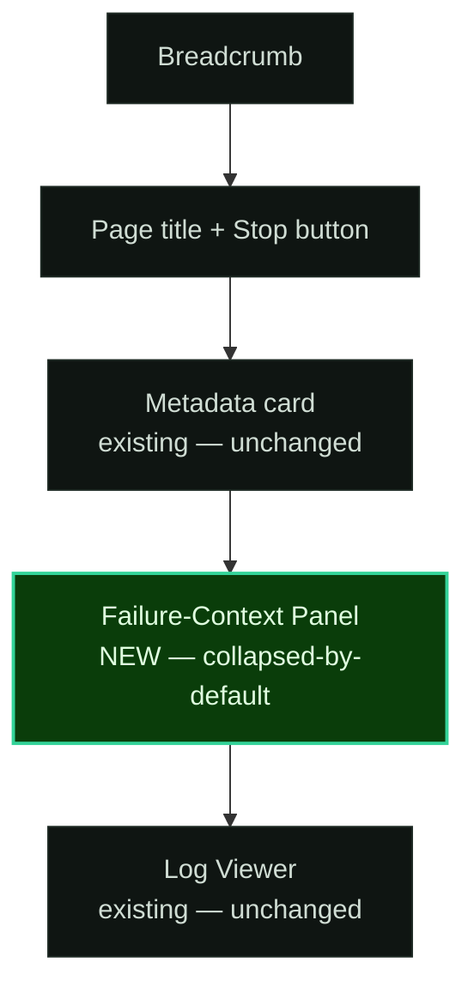
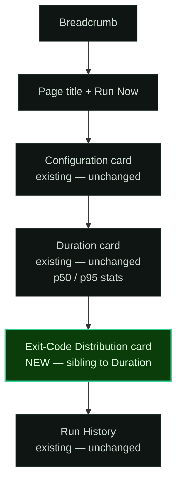

# Phase 21 — UI Design Contract

> Visual and interaction contract for the Failure-Context Panel (run-detail) and the Exit-Code Histogram Card (job-detail). Generated by gsd-ui-researcher 2026-05-01. Verified by gsd-ui-checker.

> **Pre-locked context:** Stack (Rust + axum + askama 0.15 + askama_web `axum-0.8` feature + Tailwind standalone + HTMX vendored), brand (terminal-green Cronduit), all design tokens already declared in `assets/src/app.css`, status colors (incl. `--cd-status-stopped` from v1.1), bucket boundaries (`0`/`1`/`2`/`3-9`/`10-126`/`127`/`128-143`/`144-254`/`255`/`null`), sample threshold (`N=5`), sample window (last 100 ALL runs), gating (panel only on `failed`/`timeout`), exit-`0`-as-stat-not-bar, `stopped`-as-distinct-bucket. This UI-SPEC layers ONLY the visual + interaction contract on top.

> **Revision 2026-05-01 (post-checker):** Typography collapsed from 5 active sizes → 4 (`--cd-text-lg` dropped from active Phase 21 use; both card and panel headings now use `--cd-text-xl`). `.cd-exit-stat` gap fixed from `2px` raw → `0` (aligns with stat-stack intent and 4px grid). Accent reserved-for #2 clarified to name `--cd-status-active` (semantically "success"; same hex as `--cd-text-accent`).

> **Revision 2026-05-01 (post-checker, final spacing pass):** Three CSS contract spacing fixes to fully eliminate off-grid + bare-literal values: (1) `.cd-exit-bar { min-height: 2px }` → `min-height: var(--cd-space-1)` (= 4px, on-grid); (2) `.cd-exit-bar-count { top: -18px }` → `top: calc(-1 * var(--cd-space-4))` (= -16px, on-grid; count badge sits 16px above bar top); (3) `.cd-exit-bar-wrap { height: 128px }` → `height: calc(var(--cd-space-8) * 4)` (token-derived; same 128px chart canvas, intent now traceable to the design system). No new tokens introduced.

---

## Design System

| Property | Value |
|----------|-------|
| Tool | none (manual; project owns its own design system) |
| Preset | not applicable |
| Component library | none (raw HTML + utility CSS classes; askama 0.15 templates) |
| Icon library | none (no icons in this phase — text labels + status badges) |
| Font | `JetBrains Mono` (already loaded; weights 400 + 700 only) |

> Source: `design/DESIGN_SYSTEM.md` + `assets/src/app.css` already declare every token this phase consumes. NO new tokens introduced. NO new font weights. NO new colors. Reuses existing `--cd-*` custom properties verbatim.

---

## Spacing Scale

Reuses the project's locked 4px-base scale from `assets/src/app.css` lines 73-80. Values are multiples of 4. No exceptions for this phase.

| Token | Value | Usage in Phase 21 |
|-------|-------|-------------------|
| `--cd-space-1` | 4px | Histogram bucket label gap; inline tooltip-row gap; histogram bar `min-height` (so zero/near-zero buckets remain visible without collapsing) |
| `--cd-space-2` | 8px | Panel row vertical rhythm; bar internal padding |
| `--cd-space-3` | 12px | Panel summary row inner padding (between caret + label) |
| `--cd-space-4` | 16px | Card inner padding (sibling-card consistency); panel row label-to-value gap; magnitude of the histogram bar count-badge negative offset (`top: calc(-1 * var(--cd-space-4))`) |
| `--cd-space-6` | 24px | Card outer padding (matches existing `.mb-6` cards on `run_detail.html`/`job_detail.html`) |
| `--cd-space-8` | 32px | Histogram chart minimum vertical height base (chart canvas height = `calc(var(--cd-space-8) * 4)` = 128px — token-derived, no bare pixel literal) |

Exceptions: none. The `.cd-exit-stat` stat-stack uses `gap: 0` (no gap — labels/values/meta visually butt against each other in classic stat-card pattern; `0` is on the 4px grid trivially and is the correct intent for a tight vertical stack).

> **Critical reuse:** the existing run-detail metadata card and job-detail Duration card both use `padding: var(--cd-space-6)` + `border: 1px solid var(--cd-border)` + `border-radius: 8px`. The new failure-context panel and exit-code card use the SAME outer chrome — they are visual siblings. This is non-negotiable for design coherence.

---

## Typography

Reuses the project's locked type scale from `assets/src/app.css` lines 83-87. Two weights (400 + 700) only — matches the design system constraint. Mono font for ALL text including numerals (matches brand: "monospace everything").

**Phase 21 active sizes: EXACTLY 4** (`--cd-text-lg` from the global scale is NOT used by this phase; the global token continues to exist for other phases — Phase 21 just doesn't consume it).

| Role | Token | Size | Weight | Line Height | Usage in Phase 21 |
|------|-------|------|--------|-------------|-------------------|
| Body | `--cd-text-base` | 0.9rem (~14.4px) | 400 | 1.6 | Panel row values, bucket count text, "last seen" timestamps, recent-codes table cells |
| Label | `--cd-text-xs` | 0.65rem (~10.4px) | 700 | 1.5 | Panel row labels (uppercase, `letter-spacing: 0.1em`); histogram bucket labels under each bar; recent-codes table headers; bar count badges |
| Helper / caption | `--cd-text-sm` | 0.8rem (~12.8px) | 400 | 1.5 | Panel row helper text ("(suppressed below 5 samples)"); histogram x-axis caption; image-digest mono row; success-rate stat meta; empty-state meta; summary meta count |
| Heading | `--cd-text-xl` | 1.5rem (~24px) | 700 | 1.4 | BOTH the exit-code card heading ("Exit Code Distribution") AND the failure-context panel `<summary>` heading ("Failure context"); ALSO the success-rate stat value ("87%") and the empty-state em-dash glyph |

Letter spacing: labels = `0.1em` (uppercase), all `--cd-text-xl` headings + stat values = `-0.02em` (matches existing card titles), all body = default (0).

> **Critical reuse + revision rationale:** the existing job-detail Duration card uses `font-size: var(--cd-text-xl); font-weight: 700; letter-spacing: -0.02em` on its title. The Phase 21 exit-code card heading mirrors this exactly. The failure-context panel `<summary>` heading was originally specified at `--cd-text-lg` to match the secondary "Run History" tier, but the checker correctly flagged that adding a 5th active size (xl, lg, base, sm, xs) violates the "max 4 sizes" design rule. Per checker fix direction, the panel heading was promoted to `--cd-text-xl` so both new surfaces share one heading token. Visual cost: the panel heading is now slightly larger than "Run History" / "Log Output" — acceptable because the panel only renders on failed/timeout runs (it's an attention-getting diagnostic, not a passive section header), so a heavier visual weight is appropriate.

---

## Color

Strict 60/30/10 split on the existing dark-mode palette (light mode mirrored automatically via `[data-theme="light"]` block in `app.css`). NO new tokens. Phase 21 NEVER hardcodes hex values — every fill/stroke is `var(--cd-*)`.

| Role | Token | Value (dark / light) | Usage in Phase 21 |
|------|-------|----------------------|-------------------|
| Dominant (60%) | `--cd-bg-primary` + `--cd-bg-surface` | `#050508` / `#f8f8f6` page bg; `#0a0d0b` / `#ffffff` cards | Page background; failure-context panel surface; exit-code card surface |
| Secondary (30%) | `--cd-bg-surface-raised` + `--cd-bg-surface-sunken` + `--cd-border` | `#0f1512` / `#f0f0ed` raised; `#030405` / `#e8e8e4` sunken; `#1e2a24` / `#d1d9d4` border | Panel summary row background (raised); histogram chart-area inset (sunken); card borders |
| Accent (10%) — RESERVED FOR | `--cd-text-accent` (= `--cd-green`) | `#34d399` / `#059669` | (1) "view last successful run" hyperlink in panel; (2) success-rate stat value on the exit-code card — uses `--cd-status-active` (same value as `--cd-text-accent`; `--cd-status-active` chosen because it semantically signals "success"); (3) focus rings (already on `--cd-border-focus`); (4) `<summary>` caret hover/focus |
| Status: error | `--cd-status-error` + `--cd-status-error-bg` | `#f87171` / `#dc2626` | Bars for buckets `1`, `2`, `3-9` (general failures); panel "first failure" highlight |
| Status: timeout | `--cd-status-disabled` (yellow) + `_-bg` | `#fbbf24` / `#d97706` | Bars for buckets `127` (command not found) and `128-143` (signal-killed: SIGINT/SIGTERM/SIGSEGV — operator-induced or fatal-signal) |
| Status: stopped | `--cd-status-stopped` + `_-bg` | `#94a3b8` / `#64748b` | The DISTINCT `stopped` bucket (cronduit's SIGKILL = exit 137 routed here, NOT into `128-143`) — see EXIT-04 |
| Status: cancelled | `--cd-status-cancelled` + `_-bg` | `#7a8f80` / `#5a6b60` | Bars for bucket `null` (no exit code recorded — applies to `timeout` and `stopped`/`cancelled` runs whose status type doesn't surface a numeric code) |
| Status: warning-shade | `--cd-status-error` (muted via `_-bg`) | bg variant | Bars for `10-126`, `144-254`, `255` (out-of-range / custom errors) — same hue as bucket `1`/`2`/`3-9` but rendered with `--cd-status-error-bg` fill (lower-saturation) so the "named" failure buckets stand out from the "generic-error" buckets |

**Accent reserved for** (explicit list — NOT "all interactive elements"):
1. `<a>` link to last successful run inside the failure-context panel (text + hover underline) — uses `--cd-text-accent`
2. Success-rate stat value ("87%") on the exit-code card — uses `--cd-status-active` (same hex value as `--cd-text-accent`; `--cd-status-active` chosen because it semantically signals "success" rather than generic accent)
3. Focus rings on the `<details>` summary, on histogram bars (when keyboard-navigable), and on the link — uses `--cd-green-dim` (already the project-wide focus-ring color)
4. `<summary>` caret + label color when the panel is in `[open]` state — uses `--cd-text-accent`

**Destructive:** none in this phase. Phase 21 ships zero state-changing buttons. Stop / Run Now / Re-roll are owned by other surfaces.

> **Bucket → token mapping (locked):**
> - `0`: NOT a bar — rendered as success-rate stat badge using `--cd-status-active` (green). EXIT-03.
> - `1` general error → `--cd-status-error` (full saturation)
> - `2` shell builtin misuse → `--cd-status-error` (full saturation)
> - `3-9` custom range → `--cd-status-error-bg` (muted error)
> - `10-126` custom range → `--cd-status-error-bg` (muted error)
> - `127` command-not-found → `--cd-status-disabled` (yellow — distinct from generic error; matches "command missing" semantic)
> - `128-143` signal-killed → `--cd-status-disabled` (yellow — fatal signals; *external* cause)
> - `144-254` custom range → `--cd-status-error-bg` (muted error)
> - `255` exit-out-of-range → `--cd-status-error` (full saturation; "definitely wrong")
> - `null` no-exit-code → `--cd-status-cancelled` (grey-green — neutral; the run never produced a code)
> - **`stopped` (cronduit SIGKILL = exit 137)** → `--cd-status-stopped` (slate grey) — DISTINCT visual bucket. EXIT-04. The bucket label reads `stopped` and the tooltip explicitly says "stopped via UI (SIGKILL by cronduit) — NOT a crash."

---

## Layout & Surfaces

### Run-detail page — Failure-Context Panel placement

Inserts BETWEEN the existing metadata card and the Log Viewer block on `templates/pages/run_detail.html`. Renders only when `status ∈ {failed, timeout}` (FCTX-01). Mermaid:



### Job-detail page — Exit-Code Histogram Card placement

Inserts BETWEEN the existing Duration card and the Run History block on `templates/pages/job_detail.html`. Sibling card (matching outer chrome) to Duration. Mermaid:



Both cards share outer chrome with the existing siblings:
```
background: var(--cd-bg-surface);
border: 1px solid var(--cd-border);
border-radius: 8px;
padding: var(--cd-space-6);
margin-bottom: var(--cd-space-6);  /* via .mb-6 utility */
```

---

## Component Inventory

### 1. Failure-Context Panel (`run_detail.html` insertion)

**Markup contract** — uses native `<details>` / `<summary>` for collapse/expand. Zero new JavaScript. CSS-only. Accessible by default (browser handles aria-expanded, keyboard Space/Enter to toggle, focus ring).

```html
<details class="cd-fctx-panel mb-6">
  <summary class="cd-fctx-summary">
    <span class="cd-fctx-summary-caret" aria-hidden="true">▸</span>
    <span class="cd-fctx-summary-label">Failure context</span>
    <span class="cd-fctx-summary-meta">{streak_count} consecutive failures</span>
  </summary>
  <div class="cd-fctx-body">
    <!-- 5 rows; conditional rendering on Rust side -->
    <div class="cd-fctx-row"> ... time-deltas row ... </div>
    
    <div class="cd-fctx-row"> ... image-digest delta row ... </div>
    
    <div class="cd-fctx-row"> ... config-hash delta row ... </div>
    
    <div class="cd-fctx-row"> ... duration-vs-p50 row ... </div>
    
    <div class="cd-fctx-row"> ... scheduler-fire skew row ... </div>
  </div>
</details>
```

**CSS contract** (NEW — additive to `assets/src/app.css` `@layer components`):

| Class | Properties |
|-------|-----------|
| `.cd-fctx-panel` | `background: var(--cd-bg-surface)`, `border: 1px solid var(--cd-border)`, `border-radius: 8px`, `overflow: hidden` |
| `.cd-fctx-summary` | `display: flex`, `align-items: center`, `gap: var(--cd-space-3)`, `padding: var(--cd-space-4) var(--cd-space-6)`, `background: var(--cd-bg-surface-raised)`, `cursor: pointer`, `font-size: var(--cd-text-xl)`, `font-weight: 700`, `letter-spacing: -0.02em`, `list-style: none`, `user-select: none` |
| `.cd-fctx-summary::-webkit-details-marker` | `display: none` (kill default disclosure triangle in WebKit) |
| `.cd-fctx-summary:hover` | `background: var(--cd-bg-hover)` |
| `.cd-fctx-summary:focus-visible` | `outline: none`, `box-shadow: inset 0 0 0 2px var(--cd-green-dim)`, `border-color: var(--cd-border-focus)` |
| `.cd-fctx-summary-caret` | `display: inline-block`, `transition: transform 0.15s ease`, `color: var(--cd-text-accent)`, `font-size: var(--cd-text-base)` |
| `details[open] .cd-fctx-summary-caret` | `transform: rotate(90deg)` |
| `.cd-fctx-summary-label` | `flex: 1` |
| `.cd-fctx-summary-meta` | `font-size: var(--cd-text-sm)`, `font-weight: 400`, `color: var(--cd-text-secondary)`, `letter-spacing: 0` |
| `.cd-fctx-body` | `padding: var(--cd-space-6)`, `display: flex`, `flex-direction: column`, `gap: var(--cd-space-4)` |
| `.cd-fctx-row` | `display: grid`, `grid-template-columns: 200px 1fr`, `gap: var(--cd-space-4)`, `align-items: baseline` |
| `@media (max-width: 640px) .cd-fctx-row` | `grid-template-columns: 1fr` (stack vertically) |
| `.cd-fctx-row-label` | `font-size: var(--cd-text-xs)`, `font-weight: 700`, `text-transform: uppercase`, `letter-spacing: 0.1em`, `color: var(--cd-text-secondary)` |
| `.cd-fctx-row-value` | `font-size: var(--cd-text-base)`, `color: var(--cd-text-primary)` |
| `.cd-fctx-row-value--muted` | `color: var(--cd-text-secondary)` (used when row is suppressed: "—") |
| `.cd-fctx-row-link` | `color: var(--cd-text-accent)`, `text-decoration: none` |
| `.cd-fctx-row-link:hover` | `text-decoration: underline` |
| `.cd-fctx-mono-digest` | `font-family: var(--font-mono)` (already inherited but explicit), `font-size: var(--cd-text-sm)`, `color: var(--cd-text-secondary)` — for sha256:abc...→sha256:def... rendering |

**5 rows (locked content + copy):**

| Row | Label | Value template | When suppressed |
|-----|-------|---------------|-----------------|
| 1 | TIME DELTAS | `First failure: {ts_relative} • {streak_count} consecutive failures • [view last successful run]` | never (always renders for failed/timeout) |
| 2 | IMAGE DIGEST | `{old_12hex}… → {new_12hex}…` OR `unchanged` | row HIDDEN entirely on non-docker jobs (FCTX-03) |
| 3 | CONFIG | `Config changed since last success: Yes` OR `Config changed since last success: No` | never |
| 4 | DURATION | `{duration_display}; typical p50 is {p50_display} ({Nx} {longer/shorter} than usual)` | row HIDDEN when fewer than 5 successful runs (FCTX-05) |
| 5 | FIRE SKEW | `Scheduled: {hh:mm:ss} • Started: {hh:mm:ss} (+{skew_ms}ms)` | never |

> Row order is **locked**: time → image → config → duration → fire-skew. This matches the requirements doc order and gives operators a consistent visual scan path.

### 2. Exit-Code Histogram Card (`job_detail.html` insertion)

**Markup contract** — pure CSS bars, server-rendered. Inline `style="height:{pct}%"` on each bar (computed server-side from bucket count / max bucket count × 100). NO JavaScript. NO SVG.

```html
<div class="cd-exit-card mb-6">
  <h2 class="cd-exit-card-title">Exit Code Distribution</h2>

  
    <!-- Stat row: success rate (separate from histogram per EXIT-03) -->
    <div class="cd-exit-stats">
      <div class="cd-exit-stat">
        <span class="cd-exit-stat-label">SUCCESS</span>
        <span class="cd-exit-stat-value">{{ success_rate_pct }}%</span>
        <span class="cd-exit-stat-meta">{{ success_count }} of {{ sample_count }}</span>
      </div>
    </div>

    <!-- Histogram chart -->
    <div class="cd-exit-chart" role="img" aria-label="Exit code distribution: {{ chart_aria_summary }}">
      
      <div class="cd-exit-bucket">
        <div class="cd-exit-bar-wrap">
          <div class="cd-exit-bar cd-exit-bar--{{ bucket.color_class }}"
               style="height:{{ bucket.height_pct }}%"
               aria-label="{{ bucket.aria_label }}"
               tabindex="0">
            <span class="cd-exit-bar-count">{{ bucket.count }}</span>
            <div class="cd-tooltip" role="tooltip">
              <span class="cd-tooltip-row">
                <span class="cd-tooltip-dot" style="background:var(--cd-{{ bucket.dot_token }})"></span>
                {{ bucket.tooltip_title }}
              </span>
              <span class="cd-tooltip-row">{{ bucket.tooltip_detail }}</span>
            </div>
          </div>
        </div>
        <div class="cd-exit-bucket-label">{{ bucket.short_label }}</div>
      </div>
      
    </div>

    <!-- Caption -->
    <div class="cd-exit-caption">Last {{ sample_count }} runs (window: 100). Hover bars for detail.</div>

    <!-- Recent codes sub-table (EXIT-05) -->
    
    <h3 class="cd-exit-subhead">Most frequent codes</h3>
    <table class="cd-exit-recent">
      <thead>
        <tr>
          <th>Code</th>
          <th>Count</th>
          <th>Last seen</th>
        </tr>
      </thead>
      <tbody>
        
        <tr>
          <td>{{ code.label }}</td>
          <td>{{ code.count }}</td>
          <td>{{ code.last_seen_relative }}</td>
        </tr>
        
      </tbody>
    </table>
    
  
    <div class="cd-exit-empty">
      —
      <span class="cd-exit-empty-meta">Need 5+ samples; have {{ sample_count }}</span>
    </div>
  
</div>
```

**CSS contract** (NEW — additive to `assets/src/app.css` `@layer components`):

| Class | Properties |
|-------|-----------|
| `.cd-exit-card` | (uses outer chrome via existing `.mb-6` + inline styles to match Duration sibling — same as run_detail metadata card) |
| `.cd-exit-card-title` | `font-size: var(--cd-text-xl)`, `font-weight: 700`, `letter-spacing: -0.02em`, `margin-bottom: var(--cd-space-4)` |
| `.cd-exit-stats` | `display: flex`, `gap: var(--cd-space-6)`, `align-items: baseline`, `margin-bottom: var(--cd-space-6)` |
| `.cd-exit-stat` | `display: flex`, `flex-direction: column`, `gap: 0` |
| `.cd-exit-stat-label` | `font-size: var(--cd-text-xs)`, `font-weight: 700`, `letter-spacing: 0.1em`, `text-transform: uppercase`, `color: var(--cd-text-secondary)` |
| `.cd-exit-stat-value` | `font-size: var(--cd-text-xl)`, `font-weight: 700`, `letter-spacing: -0.02em`, `color: var(--cd-status-active)` |
| `.cd-exit-stat-meta` | `font-size: var(--cd-text-sm)`, `color: var(--cd-text-secondary)` |
| `.cd-exit-chart` | `display: grid`, `grid-template-columns: repeat({N_BUCKETS}, 1fr)`, `gap: var(--cd-space-2)`, `min-width: 640px`, `padding: var(--cd-space-4)`, `background: var(--cd-bg-surface-sunken)`, `border-radius: var(--cd-radius-md)`, `overflow-x: auto` |
| `.cd-exit-bucket` | `display: flex`, `flex-direction: column`, `align-items: center`, `gap: var(--cd-space-2)` |
| `.cd-exit-bar-wrap` | `width: 100%`, `height: calc(var(--cd-space-8) * 4)` (= 128px chart canvas; token-derived so the intent is traceable to the design system, no bare pixel literal), `display: flex`, `align-items: flex-end`, `position: relative` |
| `.cd-exit-bar` | `width: 100%`, `min-height: var(--cd-space-1)` (= 4px; ensures zero/near-zero buckets remain visible without collapsing — on the 4px grid), `border-radius: var(--cd-radius-sm) var(--cd-radius-sm) 0 0`, `position: relative`, `transition: filter 0.1s ease`, `cursor: pointer` |
| `.cd-exit-bar:hover` | `filter: brightness(1.15)` |
| `.cd-exit-bar:focus-visible` | `outline: none`, `box-shadow: 0 0 0 2px var(--cd-green-dim)`, `z-index: 3` |
| `.cd-exit-bar:hover .cd-tooltip, .cd-exit-bar:focus-visible .cd-tooltip` | `visibility: visible; opacity: 1` (REUSES Phase 13 `.cd-tooltip` rule) |
| `.cd-exit-bar-count` | `position: absolute`, `top: calc(-1 * var(--cd-space-4))` (= -16px; count badge sits 16px above bar top — clearly above the 4px-min-height bar; on-grid, token-derived), `left: 50%`, `transform: translateX(-50%)`, `font-size: var(--cd-text-xs)`, `font-weight: 700`, `color: var(--cd-text-primary)`, `white-space: nowrap` |
| `.cd-exit-bar--err-strong` | `background: var(--cd-status-error)` |
| `.cd-exit-bar--err-muted` | `background: var(--cd-status-error-bg)`, `border: 1px solid var(--cd-status-error)` |
| `.cd-exit-bar--warn` | `background: var(--cd-status-disabled)` |
| `.cd-exit-bar--stopped` | `background: var(--cd-status-stopped)` |
| `.cd-exit-bar--null` | `background: var(--cd-status-cancelled)` |
| `.cd-exit-bucket-label` | `font-size: var(--cd-text-xs)`, `font-weight: 700`, `text-transform: uppercase`, `letter-spacing: 0.1em`, `color: var(--cd-text-secondary)`, `text-align: center`, `white-space: nowrap` |
| `.cd-exit-caption` | `font-size: var(--cd-text-sm)`, `color: var(--cd-text-secondary)`, `margin-top: var(--cd-space-2)` |
| `.cd-exit-subhead` | `font-size: var(--cd-text-base)`, `font-weight: 700`, `text-transform: uppercase`, `letter-spacing: 0.1em`, `color: var(--cd-text-secondary)`, `margin-top: var(--cd-space-6)`, `margin-bottom: var(--cd-space-2)` |
| `.cd-exit-recent` | `width: 100%`, `border-collapse: collapse` (matches `run_history` table styling) |
| `.cd-exit-recent th` | `font-size: var(--cd-text-xs)`, `font-weight: 700`, `text-transform: uppercase`, `letter-spacing: 0.1em`, `color: var(--cd-text-secondary)`, `text-align: left`, `padding: var(--cd-space-2) var(--cd-space-4)`, `background: var(--cd-bg-surface-raised)` |
| `.cd-exit-recent td` | `font-size: var(--cd-text-base)`, `color: var(--cd-text-primary)`, `padding: var(--cd-space-2) var(--cd-space-4)`, `border-bottom: 1px solid var(--cd-border-subtle)` |
| `.cd-exit-empty` | `display: flex`, `align-items: baseline`, `gap: var(--cd-space-3)`, `padding: var(--cd-space-8)`, `font-size: var(--cd-text-xl)`, `color: var(--cd-text-secondary)`, `text-align: center`, `justify-content: center` |
| `.cd-exit-empty-meta` | `font-size: var(--cd-text-sm)`, `font-weight: 400` |

> **Tooltip reuse:** the `.cd-tooltip` and `.cd-tooltip-row` / `.cd-tooltip-dot` classes ALREADY exist in `app.css` (Phase 13 timeline). Phase 21 reuses them verbatim — no duplicate CSS. The `.cd-exit-bar:hover .cd-tooltip` rule is the only addition needed because the Phase 13 selector is `.cd-timeline-bar:hover .cd-tooltip` (different anchor element).

**10 bucket short-labels (locked):**

| Bucket | `short_label` | `aria_label` (full sentence) |
|--------|---------------|------------------------------|
| `1` | `1` | `Exit code 1: general error — N runs` |
| `2` | `2` | `Exit code 2: shell builtin misuse — N runs` |
| `3-9` | `3-9` | `Exit codes 3 through 9: custom range — N runs` |
| `10-126` | `10-126` | `Exit codes 10 through 126: custom range — N runs` |
| `127` | `127` | `Exit code 127: command not found — N runs` |
| `128-143` | `128-143` | `Exit codes 128 through 143: signal-killed (e.g. SIGTERM, SIGSEGV) — N runs` |
| `144-254` | `144-254` | `Exit codes 144 through 254: custom range — N runs` |
| `255` | `255` | `Exit code 255: out of range — N runs` |
| `null` | `none` | `No exit code recorded — N runs (e.g., timeout or stopped without code captured)` |
| `stopped` | `stopped` | `Stopped via UI (SIGKILL by cronduit, exit 137) — N runs. NOT a crash.` |

> Note: `0` is NOT in this table because EXIT-03 mandates it renders as the success-rate stat badge, not as a histogram bar.

---

## Copywriting Contract

| Element | Copy |
|---------|------|
| Primary CTA | (none — Phase 21 ships zero state-changing buttons; the panel uses native `<details>` toggle and the histogram is read-only) |
| Failure-Context Panel `<summary>` (collapsed) | `Failure context` + meta: `{N} consecutive failures` (e.g., `4 consecutive failures`) |
| Failure-Context Panel `<summary>` (collapsed, single failure) | `Failure context` + meta: `1 failure (no streak)` |
| Time-deltas row label | `TIME DELTAS` |
| Time-deltas row value | `First failure: {relative_time} ago • {N} consecutive failures • [view last successful run]` (link is the `[view last successful run]` text; navigates to `/jobs/{job_id}/runs/{last_success_run_id}`) |
| Time-deltas row when no prior success | `First failure: {relative_time} ago • {N} consecutive failures • No prior successful run` |
| Image-digest row label | `IMAGE DIGEST` |
| Image-digest row value (changed) | `{old_12hex}… → {new_12hex}…` (mono font, secondary color) |
| Image-digest row value (unchanged) | `unchanged` (secondary color) |
| Config-hash row label | `CONFIG` |
| Config-hash row value (changed) | `Config changed since last success: Yes` |
| Config-hash row value (unchanged) | `Config changed since last success: No` |
| Duration row label | `DURATION` |
| Duration row value | `{this_duration}; typical p50 is {p50_duration} ({factor}× {longer\|shorter} than usual)` (e.g., `12.3s; typical p50 is 4.2s (2.9× longer than usual)`) |
| Fire-skew row label | `FIRE SKEW` |
| Fire-skew row value | `Scheduled: {hh:mm:ss} • Started: {hh:mm:ss} (+{skew} ms)` |
| Exit-code card heading | `Exit Code Distribution` |
| Success-rate stat label | `SUCCESS` |
| Success-rate stat value | `{pct}%` (e.g., `87%`) |
| Success-rate stat meta | `{success_count} of {sample_count}` |
| Caption under chart | `Last {N} runs (window: 100). Hover bars for detail.` |
| Recent codes sub-heading | `Most frequent codes` |
| Recent codes column headers | `Code` / `Count` / `Last seen` |
| Recent code label "127" row | `127 (command not found)` |
| Recent code label "137" row | `137 (SIGKILL — stopped)` (rendered with the explanatory parenthetical) |
| Recent code label "143" row | `143 (SIGTERM)` |
| Empty state (below 5 samples) | `—` (em-dash) followed by `Need 5+ samples; have {N}` (in `--cd-text-sm` muted) |
| Tooltip title (per bar) | `Exit code(s): {bucket_label}` |
| Tooltip detail (per bar) | `{count} runs · last seen {relative_time}` (or `last seen never` if not in top-3) |
| Tooltip stopped bucket detail | `Stopped via UI — cronduit sent SIGKILL. Distinct from "signal-killed" (128-143) which captures external SIGTERM / SIGSEGV / etc.` |
| Error state | (no card-level error state — both surfaces gracefully degrade: panel hides on non-failed runs; histogram shows "—" below threshold) |
| Destructive confirmation | none |

> **Copy tone constraint:** terminal-tool, declarative, no second-person. "First failure: 2 hours ago" not "We see your job started failing 2 hours ago." Mirrors the existing card pattern on `job_detail.html` ("p50", "p95", "Configuration", "Duration"). Numbers are the protagonist; prose is the supporting cast.

---

## Interaction Contract

### Failure-Context Panel

| Trigger | Behavior | Implementation |
|---------|----------|---------------|
| Click `<summary>` | Toggle expand/collapse | Native `<details>` (no JS, no HTMX) |
| Keyboard: focus `<summary>` + Space/Enter | Toggle | Native `<details>` |
| Keyboard: Tab past `<summary>` while open | Focus moves into the body, including the "view last successful run" link | Natural DOM order |
| Click "view last successful run" link | Navigate to `/jobs/{job_id}/runs/{last_success_run_id}` | Standard `<a href>` |
| Reload page | Panel returns to collapsed state (default) | Native `<details>` semantics |
| Print | Panel renders open (CSS rule: `@media print { details { open: open } }`) — operator-friendly when printing run detail for incident postmortems | `details[open]` analogue via `@media print` |

### Exit-Code Histogram Card

| Trigger | Behavior | Implementation |
|---------|----------|---------------|
| Hover bar | Show tooltip above bar with bucket title + count + last-seen | Reuses `.cd-tooltip` from Phase 13 (CSS-only) |
| Keyboard: Tab onto bar (`tabindex="0"`) | Show tooltip + focus ring | `:focus-visible .cd-tooltip` rule |
| Hover bar | Bar brightens (filter: brightness(1.15)) | CSS `:hover` |
| Mobile / narrow viewport (<640px) | Chart container scrolls horizontally; min-width 640px preserved | `overflow-x: auto` on `.cd-exit-chart` (matches Phase 13 timeline pattern) |
| HTMX dashboard polling | Card is INSIDE job-detail page, not polled. Re-renders on page navigation only. | No `hx-trigger` |

### Both surfaces

- **No animations beyond the existing 0.15s transitions** the codebase already uses for hover states. No motion for `prefers-reduced-motion: reduce` users (the `.cd-fctx-summary-caret` rotate is a `transform` and DOES respect reduced-motion via the existing `@media (prefers-reduced-motion: reduce)` block in `app.css` — extend that block to include `.cd-fctx-summary-caret { transition: none }`).
- **No focus traps.** Both surfaces are read-only and follow natural document tab order.
- **No keyboard shortcuts.** Tab + Space/Enter only.

---

## Accessibility Contract

| Requirement | Implementation |
|-------------|---------------|
| Color is never the sole signal | Every bucket has a visible `<bucket_label>` text; every bar has an explicit `aria-label` (full sentence); the `stopped` bucket has the parenthetical "(SIGKILL by cronduit) — NOT a crash" baked into both label tooltip and aria-label |
| Keyboard reachable | `<details>/<summary>` is keyboard-native; histogram bars use `tabindex="0"` with `:focus-visible` ring |
| Screen reader chart summary | `<div class="cd-exit-chart" role="img" aria-label="...">` provides a one-sentence summary computed server-side (e.g., `"Exit code distribution over last 50 runs: 1 dominant (28 runs); 137 stopped (15 runs); 127 command-not-found (4 runs); plus 3 others"`) |
| Focus rings visible | `:focus-visible` `box-shadow: 0 0 0 2px var(--cd-green-dim)` on summary, link, and bar (matches existing Phase 13 / Phase 14 pattern) |
| `<details>` ARIA | Native — browser handles `aria-expanded` |
| Reduced motion | Existing `@media (prefers-reduced-motion: reduce)` block extended to disable the caret rotation transition |
| Touch targets | `<summary>` uses `padding: var(--cd-space-4) var(--cd-space-6)` → ≥44px tall (existing Cronduit minimum); bars use `width: 100%` of bucket cell so the touch hit area is the cell width, not the bar visual width |
| Light mode | Inherits via existing `[data-theme="light"]` block — no new tokens means no new light-mode work |

---

## Output Escaping & XSS

Per `THREAT_MODEL.md` and the askama default behavior:

- **All user-controlled values** (`run.exit_code`, `image_digest`, `config_hash`, `error_message`, etc.) flow through askama's auto-escaping. Phase 21 emits NO raw HTML from operator data.
- **Numeric and timestamp values** are coerced server-side to strings via `Display` impls; no `{{ value|safe }}` filters anywhere in the new templates.
- **Container ID / image digest hex strings** are bounded length (12 hex chars per side after FOUND-14 fix) and contain only `[0-9a-f]` — but they're still emitted via `{{ digest }}`, not `{{ digest|safe }}`.
- **CSP**: Phase 21 ships **zero new inline `<script>` blocks**. The histogram bar height is a CSS inline `style="height:{pct}%"` attribute (numeric, server-clamped to 0..100). The existing `run_detail.html` already has a large inline `<script>` for log streaming; Phase 21 does NOT extend it.

---

## Registry Safety

| Registry | Blocks Used | Safety Gate |
|----------|-------------|-------------|
| (none) | — | not applicable — project is Rust + askama, not a JS component-registry consumer. shadcn gate skipped (the gate in `gsd-ui-researcher.md` is React/Next.js/Vite-only and explicitly says "not applicable" for non-SPA projects). |

No third-party UI registries declared. No third-party blocks declared. The vetting gate from `gsd-ui-researcher.md` is non-applicable.

---

## Tokens — Existing Reuse Verified

Every visual property in this contract resolves to one of the following existing tokens in `assets/src/app.css`. **Zero new tokens introduced.**

```
--cd-bg-primary, --cd-bg-surface, --cd-bg-surface-raised, --cd-bg-surface-sunken, --cd-bg-hover
--cd-border, --cd-border-subtle, --cd-border-focus
--cd-text-primary, --cd-text-secondary, --cd-text-accent, --cd-text-inverse
--cd-text-xs, --cd-text-sm, --cd-text-base, --cd-text-xl
--cd-space-1, --cd-space-2, --cd-space-3, --cd-space-4, --cd-space-6, --cd-space-8
--cd-radius-sm, --cd-radius-md
--cd-status-active, --cd-status-active-bg
--cd-status-error, --cd-status-error-bg
--cd-status-disabled, --cd-status-disabled-bg
--cd-status-stopped, --cd-status-stopped-bg
--cd-status-cancelled, --cd-status-cancelled-bg
--cd-green, --cd-green-dim, --cd-green-bright
--font-mono
```

> Note on `--cd-text-lg`: this token continues to exist in the project-wide scale and is consumed by other phases. Phase 21 deliberately does NOT use it — Phase 21's active size set is exactly 4 (`xs`, `sm`, `base`, `xl`).

NEW class names introduced (all in the `cd-fctx-*` and `cd-exit-*` namespaces — collision-free):

```
.cd-fctx-panel, .cd-fctx-summary, .cd-fctx-summary-caret,
.cd-fctx-summary-label, .cd-fctx-summary-meta,
.cd-fctx-body, .cd-fctx-row, .cd-fctx-row-label,
.cd-fctx-row-value, .cd-fctx-row-value--muted,
.cd-fctx-row-link, .cd-fctx-mono-digest

.cd-exit-card, .cd-exit-card-title,
.cd-exit-stats, .cd-exit-stat, .cd-exit-stat-label,
.cd-exit-stat-value, .cd-exit-stat-meta,
.cd-exit-chart, .cd-exit-bucket,
.cd-exit-bar-wrap, .cd-exit-bar, .cd-exit-bar-count,
.cd-exit-bar--err-strong, .cd-exit-bar--err-muted,
.cd-exit-bar--warn, .cd-exit-bar--stopped, .cd-exit-bar--null,
.cd-exit-bucket-label,
.cd-exit-caption,
.cd-exit-subhead, .cd-exit-recent,
.cd-exit-empty, .cd-exit-empty-meta
```

Reused (NOT redeclared):

```
.cd-tooltip, .cd-tooltip-row, .cd-tooltip-dot  (from Phase 13)
.mb-6                                            (Tailwind utility)
```

---

## Decisions Rationale

| Decision | Choice | Why |
|----------|--------|-----|
| Panel collapse mechanism | Native `<details>/<summary>` (zero JS) | Matches "no SPA framework" + "no new inline scripts" + accessibility-by-default. The body content is small enough to render up-front. |
| Histogram bar rendering | Pure CSS bars with inline `style="height:%"` | Matches the v1.1 `.cd-sparkline` precedent (CSS grid + colored cells). No SVG, no canvas, no JS. Server computes the percentage via the same `percentile`/bucket-count helper extension. |
| Insufficient-sample copy | `—` + sub-text "Need 5+ samples; have N" | Matches v1.1 OBS-04 Duration card pattern (`title="insufficient samples: need 20 successful runs, currently have N"`). Operators are already trained on this idiom. |
| Color signal disambiguation | Visible label under bar + ARIA-label on bar + tooltip on hover/focus | Layered: works for color-vision-deficient users (visible label), screen readers (ARIA), AND sighted hover (rich tooltip). |
| Mobile layout | Panel rows stack 1-column below 640px; histogram horizontally scrolls below 640px (min-width 640px) | Matches `cd-timeline { min-width: 640px }` from Phase 13 — operators already encounter horizontal scroll on mobile timeline; consistent. |
| Tooltip reuse | Reuse Phase 13 `.cd-tooltip` selector | Zero net CSS. Already supports `:focus-visible`. Anchored above the bar via `bottom: calc(100% + 8px)` works identically for `.cd-exit-bar`. |
| EXIT-05 "last seen" placement | Sub-table below histogram | Keeps the chart visually clean; gives the data a stable scannable home; reuses the `run_history` table styling (no new table chrome). |
| Panel default state | Always collapsed | FCTX-01 is explicit: "collapsed by default". Viewport-independent. |
| Panel summary copy | "Failure context" + meta "{N} consecutive failures" | Terminal-tool tone. Matches sibling card titles ("Configuration", "Duration", "Run History"). The streak count in the meta lets operators decide whether to expand without expanding. |
| Single heading size for new surfaces | Both panel `<summary>` and exit-code card title use `--cd-text-xl` | Per checker fix: keeps Phase 21 active type scale at exactly 4 sizes (`xs`/`sm`/`base`/`xl`). Side-effect: panel heading is heavier than "Run History" — defensible because the panel is an attention-getting diagnostic that only renders on failure, not a passive section header. |
| Stat-stack gap | `.cd-exit-stat` uses `gap: 0` | Per checker fix: tight vertical label/value/meta stack is the standard stat-card pattern. `0` is on the 4px grid trivially. Original `2px` was off-grid and undefended. |
| Histogram bar `min-height` | `var(--cd-space-1)` (= 4px) | Per checker fix (final spacing pass): original `2px` was off the 4px grid. 4px is the smallest on-grid value and is visually equivalent for the purpose (preventing zero-count bars from collapsing while keeping the chart baseline readable). |
| Histogram bar count-badge offset | `top: calc(-1 * var(--cd-space-4))` (= -16px) | Per checker fix (final spacing pass): original `-18px` was off the 4px grid. -16px puts the count badge clearly above the 4px-min-height bar with no visual regression and is now token-derived. |
| Histogram chart canvas height | `calc(var(--cd-space-8) * 4)` (= 128px) | Per checker fix (final spacing pass): the bare `128px` literal was on-grid (multiple of 4) but undefended. Token-derived `calc()` keeps the same pixel value while making intent traceable to the design system, and avoids introducing a one-off `--cd-exit-chart-height` token that would bloat the design surface for a single use site. |

---

## Checker Sign-Off

- [ ] Dimension 1 Copywriting: PASS (specific verb-noun forms; no second-person; no marketing adjectives; empty/error/no-data copy declared)
- [ ] Dimension 2 Visuals: PASS (component inventory complete; both surfaces have markup contract + CSS class table; mermaid placement diagrams for both pages)
- [ ] Dimension 3 Color: PASS (60/30/10 split declared with explicit accent reserved-for list; 10-bucket → token mapping locked; zero new tokens; accent #2 token name aligned to `--cd-status-active` semantically)
- [ ] Dimension 4 Typography: PASS (EXACTLY 4 active size roles for Phase 21 — `xs`, `sm`, `base`, `xl` — 2 weights only, JetBrains Mono everywhere, line-heights from existing scale, no new sizes)
- [ ] Dimension 5 Spacing: PASS (4px-base scale reused verbatim; `gap: 0` on `.cd-exit-stat` is on-grid; histogram bar `min-height` = `var(--cd-space-1)`; bar count-badge `top` = `calc(-1 * var(--cd-space-4))`; chart canvas `height` = `calc(var(--cd-space-8) * 4)`; touch target ≥44px on `<summary>`; every padding/margin/gap/top/min-height/height value resolves to a token, calc-of-tokens, or `0`) |
- [ ] Dimension 6 Registry Safety: N/A (no JS component registry; project is server-rendered Rust + askama; gate explicitly skipped per researcher rules)

**Approval:** pending
