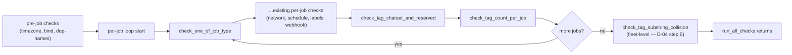
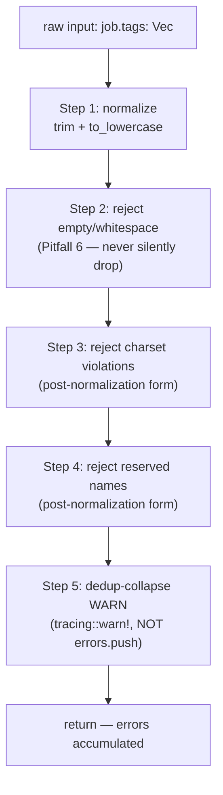

# Phase 22 Plan 02: Tag Validators Summary

Three new validator functions in `src/config/validate.rs` lock TAG-03 (normalization + dedup-collapse WARN), TAG-04 (charset + reserved-name rejection), TAG-05 (fleet-level substring-collision), and D-08 (per-job count cap of 16) in operator-readable error messages at config-load time. Plan 03's DB plumbing depends on these validators having already rejected bad input before any DB write.

## Surface

| Symbol | File:line | Purpose |
|--------|-----------|---------|
| `TAG_CHARSET_RE: Lazy<Regex>` | `src/config/validate.rs:27` | Pattern `^[a-z0-9][a-z0-9_-]{0,30}$` checked post-normalization (TAG-04). |
| `RESERVED_TAGS: &[&str]` | `src/config/validate.rs:33` | `["cronduit", "system", "internal"]` exact-match rejection (TAG-04). |
| `MAX_TAGS_PER_JOB: usize = 16` | `src/config/validate.rs:40` | Hard cap on post-dedup count (D-08). |
| `fn check_tag_charset_and_reserved` | `src/config/validate.rs:425` | Per-job validator. D-04 order: normalize → empty-reject → charset-reject → reserved-reject → dedup-collapse WARN. |
| `fn check_tag_count_per_job` | `src/config/validate.rs:549` | Per-job validator. Cap on post-normalization, post-dedup count (D-04 step 4). |
| `fn preview_jobs` | `src/config/validate.rs:583` | Helper. Caps job-name list at 3 with `(+N more)` tail (D-03). |
| `fn check_tag_substring_collision` | `src/config/validate.rs:611` | Fleet-level validator. Pairwise `i<j` `s1.contains(s2)` over unique tag set (TAG-05 / D-03). |

## Validator order in `run_all_checks`

This order is the D-04 lock: per-job validators run inside the loop, the fleet-level pass runs once after the loop closes. The substring-collision pass operates on the post-normalization tag set so by the time it runs every per-job rejection has already accumulated into `errors`.

## D-04 ordered validation (inside `check_tag_charset_and_reserved`)

Capital input (`"Backup"`) normalizes to `"backup"` BEFORE charset/reserved checks run, so it passes both. `"Cronduit"` normalizes to `"cronduit"` and is rejected by Step 4. `["Backup", "backup ", "BACKUP"]` collapses cleanly to `["backup"]` and emits a WARN line naming all three original inputs + the canonical form.

## Exact regex, reserved list, count cap (verbatim, for traceability)

| Decision | Source | Value |
|----------|--------|-------|
| TAG-04 charset regex | `src/config/validate.rs:27-28` | `^[a-z0-9][a-z0-9_-]{0,30}$` |
| TAG-04 reserved list | `src/config/validate.rs:33` | `["cronduit", "system", "internal"]` |
| D-08 count cap | `src/config/validate.rs:40` | `16` |

## TAG-03 WARN assertion fixture (`CapturedWriter`)

`tracing-test` is NOT a dep in `Cargo.toml` (verified 2026-05-04 — D-17 forbids new external crates). The substitute pattern is a custom `MakeWriter` implementation backed by `Arc<Mutex<Vec<u8>>>`:

| Symbol | File:line | Role |
|--------|-----------|------|
| `struct CapturedWriter` | `src/config/validate.rs:1932` | Holds the `Arc<Mutex<Vec<u8>>>` buffer; `Clone` so the same buffer survives `make_writer`. |
| `impl Write for CapturedWriter` | `src/config/validate.rs:1948` | Appends bytes to the shared buffer. |
| `impl MakeWriter for CapturedWriter` | `src/config/validate.rs:1958` | Hands out clones (which share the underlying buffer via `Arc`). |
| `fn install_capturing_subscriber` | `src/config/validate.rs:1968` | Builds a `tracing_subscriber::fmt` subscriber + `set_default(...)` for thread-local install. Returns `(CapturedWriter, DefaultGuard)`. |

Test 10 (`tag_dedup_collapse_warns_with_inputs_named`, `src/config/validate.rs:2103`) holds the `DefaultGuard` for the test body, calls `check_tag_charset_and_reserved`, then asserts that `writer.captured()` contains all of: the job name, every original input (`"Backup"`, `"backup "`, `"BACKUP"`), AND the canonical form (`"backup"`). Drop of `_guard` at the end of the function restores the previous global subscriber.

This pattern is reusable for any future tracing-warn assertion in the validator family.

## Test coverage (24 new tests + 2 D-04 order locks)

| Test | Locks behavior | Decision |
|------|----------------|----------|
| `tag_charset_empty_tags_no_errors_no_warn` | Empty `tags = []` → early return | TAG-03 |
| `tag_charset_capital_normalizes_then_passes` | `"Backup"` → no errors | D-04 step 2 |
| `tag_charset_special_char_rejected` | `"MyTag!"` → 1 charset error | TAG-04 |
| `tag_charset_reserved_cronduit_rejected` | `"cronduit"` → reserved error | TAG-04 |
| `tag_charset_reserved_system_rejected` | `"system"` → reserved error | TAG-04 |
| `tag_charset_reserved_internal_rejected` | `"internal"` → reserved error | TAG-04 |
| `tag_charset_capital_reserved_rejected_post_normalization` | `"Cronduit"` → reserved (after lowercase) | D-04 step 2 |
| `tag_charset_empty_string_rejected` | `""` → empty-tag error | Pitfall 6 |
| `tag_charset_whitespace_only_rejected` | `"   "` → empty-tag error | Pitfall 6 |
| `tag_dedup_collapse_warns_with_inputs_named` | `["Backup","backup ","BACKUP"]` → 0 errors + WARN naming all originals + canonical | TAG-03 (CapturedWriter fixture) |
| `tag_charset_valid_chars_accepted` | `"a-1"`, `"z_y"`, `"abc-def_ghi"` → no errors | TAG-04 |
| `tag_charset_digits_leading_accepted` | `"123abc"` → no errors | TAG-04 |
| `tag_count_empty_tags_no_error` | `[]` → no error | D-08 |
| `tag_count_at_cap_16_accepted` | 16 unique tags → no error (boundary) | D-08 |
| `tag_count_over_cap_17_rejected` | 17 unique tags → 1 error w/ exact message shape | D-08 |
| `tag_count_dedup_aware_no_error_for_duplicates` | 20 dupes of `"a"` → no error (post-dedup is 1) | D-04 step 4 |
| `tag_count_normalize_then_dedup_aware` | `["A","a","b","B"]` → 2 tags → no error | D-04 |
| `tag_count_message_shape_exact` | exact `[[jobs]] '<n>': has N tags; max is 16. ...` | D-08 |
| `tag_substring_collision_pair_back_backup` | `back`+`backup` → 1 error w/ exact message | TAG-05 / D-03 |
| `tag_substring_collision_identical_tags_zero_errors` | both jobs `["backup"]` → 0 errors | TAG-05 |
| `tag_substring_collision_three_way_three_errors` | `bac`+`back`+`backup` → 3 errors | TAG-05 |
| `tag_substring_collision_preview_caps_at_three` | 5 jobs share `back` → preview `'a','b','c' (+2 more)` | D-03 |
| `tag_substring_collision_non_substring_pair_zero_errors` | `backup`+`weekly` → 0 errors | TAG-05 |
| `tag_substring_collision_empty_fleet_zero_errors` | `[]` jobs → 0 errors | TAG-05 |
| `run_all_checks_d04_order_capital_normalizes_then_passes` | full pipeline: `tags = ["Backup"]` → 0 errors | D-04 step 2 (E2E) |
| `run_all_checks_substring_collision_runs_after_per_job_loop` | full pipeline: `back`+`backup` → substring error appears | D-04 step 5 (E2E) |

Final test count: `cargo test --lib config::validate -- --quiet` reports **81 passed, 0 failed**. `cargo test --lib config -- --quiet` reports **137 passed, 0 failed** (validates no regression in config family).

## Cross-reference to Plan 03

Plan 03 wires `JobConfig.tags` through DB serialization (`jobs.tags TEXT NOT NULL DEFAULT '[]'`) and read-back paths. Plan 03 relies on Plan 02 having rejected:

- Empty/whitespace-only inputs (Pitfall 6 — DB never stores `""`)
- Charset violations (DB never stores tags with characters outside the locked alphabet)
- Reserved names (DB never stores `cronduit`/`system`/`internal`)
- Count overflows (DB never stores `>16` tags per job)
- Fleet-wide substring collisions (DB filter at Plan 23 time cannot SQL-substring-falsely-match a tag against another, since `back`+`backup` co-existence is impossible at config-load)

If Plan 02 ever regresses (e.g. a new validator skips the dedup-collapse WARN), Plan 03's DB writes would not detect the issue — that is why this plan's regression-lock tests are tight.

## Deviations from Plan

None — plan executed as written. The only minor adjustment was the rustfmt reflow of two long iterator chains in the substring-collision tests (committed as `chore(22-02): apply cargo fmt to tag validator tests`), which is a formatting touch-up, not a behavior change.

## Final verification gates (all PASS)

| Gate | Command | Result |
|------|---------|--------|
| Build | `cargo build` | PASS — clean compile |
| Validate tests | `cargo test --lib config::validate -- --quiet` | PASS — 81 passed |
| Config tests | `cargo test --lib config -- --quiet` | PASS — 137 passed |
| Format | `cargo fmt --all -- --check` | PASS — clean |
| Lint | `cargo clippy --all-targets --all-features -- -D warnings` | PASS — no warnings |
| Crate hygiene (D-17) | `cargo tree -i openssl-sys` | PASS — `did not match any packages` (empty tree, no openssl) |

## Self-Check: PASSED

- All commits are present on branch `phase-22/job-tagging`:
  - `fe340bd feat(22-02): add tag validators (charset+reserved, count cap, substring collision)`
  - `bc86045 test(22-02): add unit tests for tag validators`
  - `369069f chore(22-02): apply cargo fmt to tag validator tests`
- File `.planning/phases/22-job-tagging-schema-validators/22-02-SUMMARY.md` exists.
- All grep-based acceptance criteria (TAG_CHARSET_RE, RESERVED_TAGS, MAX_TAGS_PER_JOB, all 3 validator fns, preview_jobs helper, exact regex, exact reserved list, exact message shapes, plain str::contains pair check, CapturedWriter fixture, install_capturing_subscriber helper) verified present at the locations listed in the Surface table.
- All 6 verification gates green.
