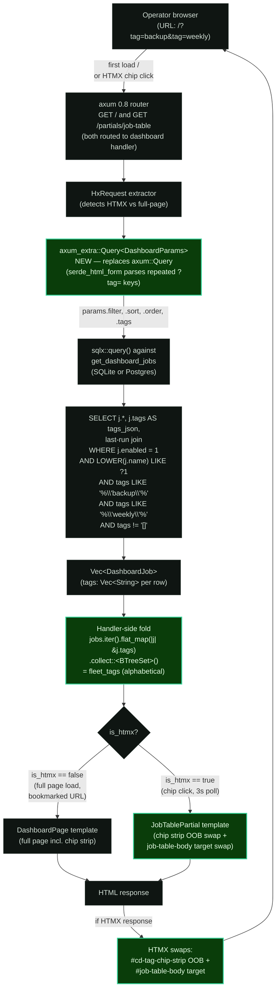

# Phase 23: Job Tagging Dashboard Filter Chips — rc.3 - Research

**Researched:** 2026-05-04
**Domain:** Server-rendered HTMX dashboard widening (axum 0.8 + askama 0.15 + sqlx parity-friendly LIKE) + rc.3 release mechanics
**Confidence:** HIGH (every load-bearing claim is in-tree-verifiable; no novel external dependencies introduced)

## Summary

Phase 23 is a **plumbing-only** UI phase. CONTEXT.md (D-01..D-23) and UI-SPEC.md (6/6 dimensions PASS) lock every visual + interaction + SQL + extractor + HTMX-swap decision. Research's job here is to verify those locks against in-tree code, document the exact extension points, and identify the small handful of gotchas the planner must surface to the executor (sort-header href bloat, OOB-swap response composition, axum-vs-axum_extra::Query semantic, askama 0.15 `urlencode` filter availability).

The phase touches **eight files** (no new external crates):

| File | Action | Reason |
|------|--------|--------|
| `src/db/queries.rs` | Widen `DashboardJob` struct + `get_dashboard_jobs` SELECT/WHERE | Project `j.tags` + AND-chained `tags LIKE '%"' \|\| ?N \|\| '"%'` + `tags != '[]'` |
| `src/web/handlers/dashboard.rs` | `DashboardParams.tags`, swap to `axum_extra::Query`, distinct-tag fold, view-model widening | URL state, fleet-tag union, OOB swap response branching |
| `templates/pages/dashboard.html` | Insert chip strip, widen sort-header anchors, widen poll `hx-include` | Visible UI + URL round-trip + poll filter preservation |
| `templates/partials/job_table.html` | (No change, unless planner extracts a chip-strip partial) | OOB response composes the existing partial verbatim |
| `assets/src/app.css` | Add `cd-tag-chip-*` family in `@layer components` | Per UI-SPEC § Tokens — Existing Reuse Verified |
| `tests/v12_tags_dashboard.rs` (NEW) | Integration test (chip render + AND + untagged-hidden + URL parse + sort-header round-trip + OOB shape) | Locks operator-observable success criteria |
| `justfile` | 3 new `uat-chips-*` recipes | Mirrors P22's `uat-tags-*` recipe-calls-recipe pattern |
| `23-HUMAN-UAT.md` + `23-RC3-PREFLIGHT.md` | Maintainer artifacts | Phase 23 ships the rc.3 cut; mirrors P21 RC2-PREFLIGHT verbatim |

**Primary recommendation:** **Treat this phase as a structural mirror of Phase 22 + Phase 21's rc-cut machinery.** Every decision is locked. The planner's job is to slice the work into atomic-commit plans (CONTEXT § Claude's Discretion suggests 6 plans), enforce the OOB-swap response contract codified by UI-SPEC (response renders BOTH `#cd-tag-chip-strip` OOB AND `#job-table-body` target), and keep the rc.3 cut artifact (`23-RC3-PREFLIGHT.md`) verbatim-identical to `21-RC2-PREFLIGHT.md` modulo the `rc.2 → rc.3` and `P21 → P23` substitutions.

## Architectural Responsibility Map

| Capability | Primary Tier | Secondary Tier | Rationale |
|------------|-------------|----------------|-----------|
| Chip strip rendering (HTML + CSS classes per row state) | Frontend Server (askama template) | — | UI-SPEC locks server-rendered, no JS; the active-vs-inactive state is template-branched on the active-set the handler computes |
| Active-tag URL parsing (`?tag=backup&tag=weekly`) | Frontend Server (handler) | — | `axum_extra::extract::Query<DashboardParams>` deserializes repeated keys via `serde_html_form` |
| Distinct fleet-tag aggregation | Frontend Server (handler) | — | D-08 — Rust-side fold over `Vec<DashboardJob>` after the DB read returns; no SQL `DISTINCT` |
| AND filter SQL (`tags LIKE '%"X"%'` per active tag + `tags != '[]'`) | Database (sqlx, both backends) | — | D-09 — composed onto existing `get_dashboard_jobs` WHERE; parity-friendly TEXT/LIKE; no JSON-specific dialect ops |
| URL state (active set as repeated `?tag=`) | Frontend Server (handler reads + template emits) | Browser (history via `hx-push-url="true"`) | The browser pushes the URL onto history; the server is the canonical decoder |
| HTMX swap mechanics (OOB chip strip + targeted table body) | Frontend Server (handler returns dual-piece partial response) | Browser (HTMX library) | First codebase use of `hx-swap-oob`; UI-SPEC codifies the contract |
| 3s table-body poll filter preservation | Browser (HTMX poll) + Frontend Server | — | Hidden `<input name="tag">` per active tag, included by `[name='tag']` selector — symmetric with existing `[name='filter']` etc. |
| CSS chip primitive | CDN/Static (embedded by `rust-embed` into `assets/static/app.css`) | — | Compiled by Tailwind standalone build; no edit to runtime |
| rc.3 release publish | CDN/Static (GHCR multi-arch publish via `release.yml`) | — | Triggered by `git tag -a -s v1.2.0-rc.3` push from maintainer; reuses existing zigbuild + buildx machinery |

## User Constraints (from CONTEXT.md)

> Verbatim copy from `23-CONTEXT.md`. The planner MUST honor every locked decision. Discretion items are areas the planner may decide. Deferred items are out of scope.

### Locked Decisions

**Chip strip layout + CSS:**
- **D-01:** Chip strip placement: dedicated row above the name-filter input (above `dashboard.html:19-36`).
- **D-02:** Empty-state: hide the chip strip entirely when the fleet has zero tagged jobs (HTML5 `hidden` attribute, mirrors `cd-bulk-action-bar`).
- **D-03:** Mobile / narrow-viewport behavior: `flex-wrap` to multiple rows. No `<details>` collapse, no horizontal scroll.
- **D-04:** CSS class namespace: `cd-tag-chip` + `cd-tag-chip--active` / `cd-tag-chip--inactive`. Container is `cd-tag-chip-strip`.

**Distinct-tag source + ordering:**
- **D-05:** Source: Rust-side fold over `DashboardJob`. Extend `DashboardJob` with `pub tags: Vec<String>`.
- **D-06:** DB projection: project `j.tags AS tags_json` into the existing `get_dashboard_jobs` SELECT for both backends; deserialize JSON → `Vec<String>` at the row-mapping site.
- **D-07:** Tag ordering in the strip: alphabetical (matches P22 D-09 sorted-canonical JSON storage form).
- **D-08:** Aggregation site: in the `dashboard()` handler after the `get_dashboard_jobs()` call (`src/web/handlers/dashboard.rs:262` sparkline hydration is the structural precedent).

**Filter SQL + URL parsing + HTMX swap:**
- **D-09:** Filter SQL: AND-chained `tags LIKE '%"' || ?N || '"%'` per active tag, plus `tags != '[]'` when active set is non-empty. Format-string the count of `AND tags LIKE ?N` clauses; bind the active-tag values in sequence after the existing name-filter bind. Parity-friendly across SQLite + Postgres without JSON-specific dialect ops.
- **D-10:** URL extractor: `axum_extra::extract::Query<DashboardParams>`. Add `#[serde(default, rename = "tag")] pub tags: Vec<String>` to `DashboardParams`. `axum_extra::Query` is already in tree (`axum-extra = { version = "0.12", features = ["cookie", "form", "query"] }`).
- **D-11:** HTMX swap mechanics: OOB swap of chip strip (`#cd-tag-chip-strip`) + targeted swap of `#job-table-body` in a single response. Each chip is `<a hx-get hx-target hx-swap-oob hx-push-url>`. The 3s poll on `#job-table-body` keeps working unchanged because it targets only the table body.
- **D-12:** Poll filter preservation: hidden `<input type="hidden" name="tag" value="X">` per active tag inside the chip strip. Update the existing 3s poll `hx-include` (`dashboard.html:140`) from `"[name='filter'],[name='sort'],[name='order']"` to `"[name='filter'],[name='sort'],[name='order'],[name='tag']"`.
- **D-13:** Sort-header href composition: each sortable column anchor (Name / Next Fire / Status / Last Run at `dashboard.html:88-128`) must include `&tag=...` for every active tag in BOTH the `href` and `hx-get` attributes.

**rc.3 cut + UI-SPEC routing:**
- **D-14:** Author `23-UI-SPEC.md` BEFORE planning via `/gsd-ui-phase 23` — DONE; UI-SPEC is approved 6/6 PASS.
- **D-15:** rc.3 cut: mirror P21 D-22..D-26 verbatim. Reuse `docs/release-rc.md`; `Cargo.toml` stays at `1.2.0`; `:latest` GHCR tag stays at `v1.1.0`; rolling `:rc` tag updates to `v1.2.0-rc.3`; tag command `git tag -a -s v1.2.0-rc.3 -m "v1.2.0-rc.3 — dashboard tag filter chips (P23)"`. Pre-flight: P23 PR merged + green CI + green compose-smoke + clean `git cliff --unreleased --tag v1.2.0-rc.3` preview. Final wave is the autonomous=false `23-RC3-PREFLIGHT.md`.
- **D-16:** Phase 23 does NOT modify `release.yml`, `cliff.toml`, or `docs/release-rc.md`. Maintainer-discovered runbook gaps become hotfix PRs BEFORE tagging.

**Test + UAT shape:**
- **D-17:** New `tests/v12_tags_dashboard.rs` integration test + extend `src/web/handlers/dashboard.rs::tests` for the handler-side fold + active-set parsing + 3 new `just` recipes (`uat-chips-render`, `uat-chips-and-filter`, `uat-chips-share-url`) following the P22 `uat-tags-*` recipe-calls-recipe pattern + autonomous=false `23-HUMAN-UAT.md`.

**Universal project constraints (informational, carried forward):**
- **D-18..D-23:** All changes via PR on a feature branch (no direct commits to `main`); diagrams as mermaid only; UAT recipes via `just`; maintainer validates UAT (Claude does not); `Cargo.toml` stays at `1.2.0`; `cargo tree -i openssl-sys` must remain empty (zero new external crates — `axum_extra` already in tree, `serde_html_form` is its transitive dep).

### Claude's Discretion

The planner picks freely on each:

- **Plan count and grouping** — suggested 6-plan split: (1) `DashboardJob.tags` add + `get_dashboard_jobs` SELECT widening + JSON deserialize at row-mapping; (2) AND-chained `LIKE` filter SQL + `tags != '[]'` clause + `axum_extra::Query<DashboardParams>` extractor swap; (3) `dashboard()` handler distinct-tag fold + active-set wiring + template view-model fields; (4) chip primitive CSS + chip strip template insert + sort-header href widening + hidden-input filter preservation; (5) integration tests + handler unit tests + `just` recipes; (6) `23-RC3-PREFLIGHT.md` + `23-HUMAN-UAT.md`.
- **Per-tag job count badge on chips** (e.g., `backup (3)`) — UI-SPEC § Decisions Rationale rejected count badges for v1.2 (recursive computation under AND-filter; v1.3 candidate). Honor UI-SPEC.
- **Chip label rendering shape** — UI-SPEC locks plain text (no `#` prefix, no decoration).
- **Whether to include disabled-job tags in the fleet-tag union** — `get_dashboard_jobs` already filters `WHERE j.enabled = 1`, so the natural decision is "tags from the rendered row set" (disabled-job tags don't appear in chip strip). Default-and-cheapest.
- **Active-tag URL canonicalization** — UI-SPEC accepts the recommendation: sort the active set alphabetically before serializing to URL so `/?tag=weekly&tag=backup` and `/?tag=backup&tag=weekly` produce the same shareable URL. Copy-link is deterministic; matches alphabetical chip strip ordering.
- **Stale-tag handling** — UI-SPEC accepts the recommendation: silently drop unknown tags from the active set during deserialization (the fold sees only known tags; unknown tags can't match any LIKE clause anyway).
- **Sort-header href template idiom** — repeating `tag={{ t }}&` inline at L88-128 four times bloats markup. Planner may extract a small askama macro / filter (`{{ active_tags|tag_query }}`) for readability. Inline is fine if planner picks it.
- **Template file split** — chip strip can be a sibling partial `templates/partials/chip_strip.html` included from `dashboard.html` (mirrors `partials/job_table.html`), or live inline. The OOB swap response composes both partials cleanly either way.
- **README addition on tag filtering** — Phase 22 deferred this as Claude's discretion forward-pointing to Phase 23. Optional in this phase; the labels-precedent README subsection (P17 D-04) is the template if planner picks it up.
- **CSS placement** — `assets/src/app.css` `@layer components` is the established pattern (P21 added `cd-fctx-*` and `cd-exit-*` there); add `cd-tag-chip-*` to the same layer.

### Deferred Ideas (OUT OF SCOPE)

- **Tag autocomplete / search-as-you-type in the chip strip** — v1.3 candidate.
- **Tag-based bulk operations on the row-checkbox bulk-action bar** — explicit v1.3 candidate per `.planning/REQUIREMENTS.md` § Out of Scope.
- **Tag chips on `/jobs/{id}` (job detail) page** — Phase 23 is dashboard-only per TAG-06; job-detail tag display is deferred.
- **Tags as Prometheus label** — explicit out-of-scope (cardinality discipline; same posture as exit codes per EXIT-06).
- **Tag-based webhook routing keys** — WH-09 carries tags in payload but never AS a routing key.
- **Per-tag job count badge on chips** (`backup (3)`) — UI-SPEC § Decisions Rationale rejected for v1.2.
- **Browser-based playwright smoke test for HTMX chip clicks** — adds new test infrastructure not in tree; v1.3 candidate at most.
- **THREAT_MODEL.md TM5 / TM6 updates** — Phase 24 milestone close-out.
- **`release.yml` / `cliff.toml` / `docs/release-rc.md` modifications** — reused verbatim per D-15 / D-16.
- **Stale-tag handling beyond silent-drop** — over-engineered for v1.2; silent-drop is sufficient.

## Phase Requirements

| ID | Description | Research Support |
|----|-------------|------------------|
| TAG-06 | Dashboard renders filter chips for every distinct tag in current fleet; click toggles state (active = teal-bordered + bold; inactive = grey); multiple active chips compose with AND semantics; URL state via repeated `?tag=` params; shareable, bookmarkable. | (a) D-08 fold over `Vec<DashboardJob>` produces the distinct-tag set; (b) D-09 AND-chained `tags LIKE` is the AND semantic; (c) D-10 `axum_extra::Query` deserializes repeated `?tag=` keys; (d) UI-SPEC § Color locks the active-vs-inactive triple-channel encoding (border + label color + weight). |
| TAG-07 | When ANY tag filter is active, untagged jobs are HIDDEN from dashboard (least-surprise); tag-filter composes with v1.0 name-filter via AND. | D-09's `tags != '[]'` clause (gated to non-empty active set) implements untagged-hidden; the chained `AND tags LIKE` slots onto the existing `WHERE j.enabled = 1 AND LOWER(j.name) LIKE ?1` so AND with name-filter is structural. |
| TAG-08 | Tag dashboard rendering uses CSS-only chip components (no JS framework, no canvas); HTMX swaps the dashboard partial on chip toggle (matches v1.0 dashboard polling architecture). | UI-SPEC § Component Inventory locks `<a>` anchor + HTMX attributes, zero JS; D-11 OOB swap codifies the partial-response shape (chip strip OOB + table body target). |

> **Note:** Success criterion #5 (rc.3 GHCR publish) is not a requirement-IDed promise — it is the rc.3 release-engineering deliverable that gates Phase 24. The `23-RC3-PREFLIGHT.md` artifact captures it.

## Standard Stack

### Core (all already in tree)

| Library | Version | Purpose | Why Standard |
|---------|---------|---------|--------------|
| `axum` | 0.8 | HTTP server | Project-locked stack (CLAUDE.md). Existing dashboard handler uses `axum::extract::{Query, State}`. |
| `axum-extra` | 0.12.6 | Query extractor with `serde_html_form` | Already in tree (`Cargo.toml:123` with features `["cookie", "form", "query"]`). The `query` feature is what we need. |
| `serde_html_form` | 0.2.8 | Repeated-key URL form deserializer (transitive of `axum-extra`) | Used by `axum_extra::extract::Query` to support `Vec<T>` from `?tag=a&tag=b`. |
| `askama` | 0.15.6 | HTML templating | Project-locked stack. `urlencode` and `urlencode_strict` filters available out of box. |
| `askama_web` | 0.15.2 | axum adapter | Already in tree. `WebTemplateExt::into_web_template()` is what existing handlers use. |
| `axum-htmx` | 0.8.1 | HTMX request detection | Already in tree (`HxRequest` extractor at `dashboard.rs:240`). |
| `sqlx` | 0.8 | Async DB | Project-locked stack. `get_dashboard_jobs` already uses it on both SQLite + Postgres branches. |
| `serde_json` | 1.0 | JSON deserialization for `j.tags` column | Already in tree (`get_run_by_id` at `queries.rs:1454` already deserializes the same column for `DbRunDetail.tags`). |

**Version verification** (against in-tree `Cargo.lock`):

| Package | Cargo.lock version | Verified | Source |
|---------|-------------------|----------|--------|
| axum-extra | 0.12.6 | [VERIFIED: Cargo.lock L342] | local file |
| serde_html_form | 0.2.8 | [VERIFIED: Cargo.lock L3265] | local file |
| askama | 0.15.x | [VERIFIED: CLAUDE.md project doc] | project pin |
| axum-htmx | 0.8.1 | [VERIFIED: Cargo.lock L368] | local file |

**Installation:** None. Phase 23 introduces ZERO new external crates per D-23.

```bash
# Verify the rustls invariant holds
cargo tree -i openssl-sys
# EXPECT: error: package ID specification `openssl-sys` did not match any packages
```

### Supporting

| Library | Version | Purpose | When to Use |
|---------|---------|---------|-------------|
| `rust-embed` | 8.x | Embed `assets/static/app.css` into the binary | Already in tree; the new `cd-tag-chip-*` CSS rules compile into the same Tailwind bundle via `build.rs` — no build pipeline change. |
| `tailwindcss (standalone)` | 3.4.x | Tailwind compiler invoked by `build.rs` | Already in tree; new `cd-tag-chip-*` classes added to `assets/src/app.css` `@layer components` are picked up automatically. |

### Alternatives Considered (and rejected per CONTEXT.md)

| Instead of | Could Use | Tradeoff (rejected — see CONTEXT D-* for why) |
|------------|-----------|----------------------------------------------|
| `axum_extra::Query` | Manual parse from `RawQuery` | Reinvents what axum_extra already does (D-10) |
| `axum_extra::Query` | `serde_qs` | Adds a new dep for what axum_extra does for free; would violate D-23 |
| AND-chained `tags LIKE` | `json_each` (SQLite) + `jsonb_array_elements_text` (Postgres) | Two divergent dialect arms; breaks parity-friendly TEXT-family abstraction (D-09) |
| Rust-side fold (D-08) | SQL `DISTINCT` over JSON column | SQLite has no native JSON unnest; needs `json_each`; breaks parity (D-05) |
| OOB chip strip + targeted table body | Swap a wrapper `#dashboard-content` containing both | Larger swap target trips the existing 3s polling target; UX flicker risk (D-11) |
| Hidden `<input name="tag">` per active tag | `data-tag-name` + selector `hx-include` | data-attributes don't form-encode automatically (D-12) |

## Architecture Patterns

### System Architecture Diagram



### Recommended Project Structure (existing — no new directories)

```
src/
├── db/
│   └── queries.rs           # MODIFY: DashboardJob.tags + get_dashboard_jobs SELECT/WHERE
├── web/
│   └── handlers/
│       └── dashboard.rs     # MODIFY: DashboardParams.tags + axum_extra::Query swap +
│                            #         distinct-tag fold + view-model widening
templates/
├── pages/
│   └── dashboard.html       # MODIFY: chip strip insert + sort-header href widen +
│                            #         poll hx-include widen
├── partials/
│   └── job_table.html       # NO CHANGE (unless planner extracts chip_strip.html)
assets/src/
└── app.css                  # MODIFY: add cd-tag-chip-* in @layer components
tests/
└── v12_tags_dashboard.rs    # NEW: integration tests
```

### Pattern 1: AND-chained `tags LIKE` SQL composition

**What:** Compose N `AND tags LIKE ?N` clauses onto the existing `get_dashboard_jobs` WHERE, where N = `active_tags.len()`. Format-string the count from a server-controlled set (NOT user input); bind values per active tag.

**When to use:** The SQL is identical for SQLite and Postgres modulo the `?N` vs `$N` placeholder; the existing function already has the parity-pair shape, so we extend in lock-step.

**Example:**

```rust
// Source: extension of src/db/queries.rs:818 — pattern derives from the existing
// `has_filter` branching at L837-865 + the format-string ORDER BY whitelist at L825.
//
// active_tags is server-controlled (it has been filtered against the fleet-tag fold;
// any tag in the URL that isn't in the fleet has been silently dropped per UI-SPEC).
let mut bind_offset = 1;
let name_clause = if has_filter {
    bind_offset = 2;
    "AND LOWER(j.name) LIKE ?1"
} else {
    ""
};

// Compose AND-chained tag predicates. The `?N` placeholders increment from
// bind_offset (so they don't collide with the optional name-filter at ?1).
let tag_predicates: String = (0..active_tags.len())
    .map(|i| format!("AND tags LIKE ?{}", bind_offset + i))
    .collect::<Vec<_>>()
    .join("\n               ");

// `tags != '[]'` is appended only when the active set is non-empty.
let untagged_clause = if !active_tags.is_empty() {
    "AND tags != '[]'"
} else {
    ""
};

let base_sql = format!(
    r#"SELECT j.id, j.name, j.schedule, j.resolved_schedule, j.job_type,
              j.timeout_secs, j.enabled_override, j.tags AS tags_json,
              lr.status AS last_status, lr.start_time AS last_run_time,
              lr.trigger AS last_trigger
       FROM jobs j
       LEFT JOIN ( ... ) lr ON lr.job_id = j.id AND lr.rn = 1
       WHERE j.enabled = 1 {name_clause} {tag_predicates} {untagged_clause}
       {order_clause}"#
);

// Bind name pattern (if present), then each active tag wrapped per LIKE shape.
// Format: `%"backup"%` — the JSON quotes guarantee the LIKE matches a JSON string
// element exactly (TAG-05 substring-collision validator at config-load already
// rejects fleets where `back` and `backup` could ambiguously match).
let mut q = sqlx::query(&base_sql);
if has_filter {
    q = q.bind(format!("%{}%", filter.unwrap().to_lowercase()));
}
for tag in &active_tags {
    q = q.bind(format!(r#"%"{}"%"#, tag));
}
let rows = q.fetch_all(p).await?;
```

**Source:** Pattern derives from `src/db/queries.rs:818-942` (existing parity-pair shape) + `tests/v12_tags_validators.rs` (P22 charset-validator guarantees `tag` is `^[a-z0-9][a-z0-9_-]{0,30}$` — no SQL escape hazard) + Phase 22 D-09 sorted-canonical JSON storage (column always contains JSON-quoted strings, e.g., `["backup","weekly"]`).

**Confidence:** HIGH [VERIFIED: src/db/queries.rs:818-942, src/config/validate.rs charset regex, migrations/sqlite/20260504_000010 column shape].

### Pattern 2: `axum_extra::Query` for repeated keys

**What:** Replace `axum::extract::Query<DashboardParams>` with `axum_extra::extract::Query<DashboardParams>`. Use `#[serde(default, rename = "tag")] pub tags: Vec<String>` on the params struct. `axum_extra::Query` uses `serde_html_form` under the hood and handles repeated keys natively.

**When to use:** Any time you need to deserialize repeated query keys into `Vec<T>`. `axum::Query` silently collapses duplicates to one — this is the **exact failure mode TAG-06 forbids**.

**Example:**

```rust
// Source: src/web/handlers/dashboard.rs:23-31 (existing) + UI-SPEC § Component Inventory § OOB swap

use axum_extra::extract::Query;  // CHANGED — was axum::extract::Query

#[derive(Debug, Deserialize, Default)]
pub struct DashboardParams {
    #[serde(default)]
    pub filter: String,
    #[serde(default = "default_sort")]
    pub sort: String,
    #[serde(default = "default_order")]
    pub order: String,
    /// NEW — Phase 23 TAG-06.
    /// Renamed from "tag" so URLs read `?tag=backup&tag=weekly`; deserializes
    /// to Vec<String> via serde_html_form (repeated-key support). axum::Query
    /// would silently collapse duplicates to one — axum_extra::Query carries
    /// every occurrence into the Vec.
    #[serde(default, rename = "tag")]
    pub tags: Vec<String>,
}

pub async fn dashboard(
    HxRequest(is_htmx): HxRequest,
    State(state): State<AppState>,
    Query(params): Query<DashboardParams>,  // axum_extra::Query
    cookies: axum_extra::extract::CookieJar,
) -> impl IntoResponse {
    // ... existing logic ...
}
```

**Source:** [VERIFIED: docs.rs/axum-extra/0.12.6/axum_extra/extract/struct.Query.html] — "This extractor uses `serde_html_form` under-the-hood which supports multi-value items." [CITED: docs.rs/axum-extra/0.12.6]. Tested example signature confirmed: `#[serde(default)] items: Vec<usize>` deserializes `?items=1&items=2&items=3` into `vec![1, 2, 3]`.

**Confidence:** HIGH.

### Pattern 3: Handler-side distinct-tag fold (mirrors P13 OBS-03)

**What:** After `get_dashboard_jobs()` returns `Vec<DashboardJob>`, fold the per-job `Vec<String>` tags into a sorted, deduplicated `Vec<String>` representing the union (= "all distinct tags in the rendered fleet"). Pass this alongside the active-tag set to the template.

**When to use:** Whenever the template needs both the per-row data AND a derived aggregation that's cheap to compute Rust-side. Mirrors the sparkline hydration pattern at `dashboard.rs:262`.

**Example:**

```rust
// Source: extension of src/web/handlers/dashboard.rs:262 sparkline-hydration site +
// CONTEXT D-08 fleet-tag fold.

use std::collections::BTreeSet;

let job_views: Vec<DashboardJobView> = jobs.into_iter().map(|j| to_view(j, tz)).collect();

// Fleet-tag fold: distinct, alphabetical (BTreeSet -> Vec preserves sort).
// Disabled jobs are already excluded by `WHERE j.enabled = 1` upstream — this
// matches the "tags from the rendered row set" decision (CONTEXT § Claude's
// Discretion).
let fleet_tags: Vec<String> = job_views
    .iter()
    .flat_map(|jv| jv.tags.iter().cloned())  // assumes DashboardJobView.tags is wired
    .collect::<BTreeSet<String>>()
    .into_iter()
    .collect();

// Active-tag set: sort + dedup + intersect with fleet so stale URL tags are
// silently dropped (CONTEXT § Claude's Discretion accepted recommendation).
let mut active_tags: Vec<String> = params.tags.clone();
active_tags.sort();
active_tags.dedup();
active_tags.retain(|t| fleet_tags.contains(t));
```

**Source:** Pattern derives from `src/web/handlers/dashboard.rs:262-337` (sparkline hydration: spark_rows query → bucket by job_id → fold → annotate per-job-view) + CONTEXT D-08.

**Confidence:** HIGH.

### Pattern 4: HTMX OOB swap response composition (NEW pattern in this codebase)

**What:** A single HTMX response body that contains BOTH (a) the new chip strip rendered with `hx-swap-oob="true"` so it replaces the live `#cd-tag-chip-strip` AND (b) the new `#job-table-body` markup which is the swap target. HTMX 2.0 processes the OOB element first, then swaps the targeted markup into the target.

**When to use:** When a single user action needs to update two non-adjacent sections of the page in lockstep (chip-active state + filtered table). The alternative — wrap both in a single container and swap the wrapper — is ruled out by D-11 (would break the existing 3s poll on `#job-table-body`).

**Example:**

```html
<!-- Source: HTMX 2.0 docs (htmx.org/attributes/hx-swap-oob/) + UI-SPEC § Component Inventory § OOB swap contract -->

<!-- 1. The OOB swap fragment for the chip strip (server-rendered with new active state) -->
<div id="cd-tag-chip-strip" class="cd-tag-chip-strip" hx-swap-oob="true">
  <a class="cd-tag-chip cd-tag-chip--active" href="?..." hx-get="?..." hx-target="#job-table-body" hx-swap-oob-self="false" hx-push-url="true" aria-pressed="true">backup</a>
  <a class="cd-tag-chip cd-tag-chip--inactive" href="?..." hx-get="?..." hx-target="#job-table-body" hx-push-url="true" aria-pressed="false">weekly</a>
  <input type="hidden" name="tag" value="backup">
</div>

<!-- 2. The targeted swap fragment (existing partials/job_table.html content) -->

```

**Important caveat:** UI-SPEC's chip markup contract has the chip itself carry `hx-swap-oob="true"` on the OUTER wrapper `<div id="cd-tag-chip-strip">`, NOT on each individual chip. If you accidentally put `hx-swap-oob="true"` on each `<a>` chip, HTMX will try to swap each chip independently — which fails because chips don't have unique IDs. **Set OOB on the wrapper div only.** The contract is documented in UI-SPEC § Component Inventory § OOB swap contract: *"partial responses for chip toggles render `<div id="cd-tag-chip-strip" hx-swap-oob="true">…</div>` immediately followed by the table-body markup, in the same response body, in that order."*

**Source:** [CITED: htmx.org/attributes/hx-swap-oob — HTMX 2.0 docs] + UI-SPEC § Component Inventory.

**Confidence:** MEDIUM-HIGH. The pattern is well-documented in HTMX docs but has zero in-tree precedent (verified via `grep -rn "hx-swap-oob" templates/` — no matches). Phase 23 introduces the pattern; the integration test in `tests/v12_tags_dashboard.rs` should assert the exact response body shape (regex or `select` over the parsed HTML for `#cd-tag-chip-strip[hx-swap-oob="true"]`).

### Pattern 5: askama 0.15 conditional class + active-set link composition

**What:** Render the chip's class list conditionally on whether the chip's tag is in the active set; render the chip's `href` and `hx-get` to the post-toggle URL state. The toggle math is "current active set ⊕ {this chip's tag}" — symmetric difference.

**When to use:** Any toggle UI built without JS. The active-set diff happens server-side; the chip is a deterministic anchor that submits the post-toggle state.

**Example:**

```html
{# Source: UI-SPEC § Component Inventory + askama 0.15 conditional-attribute idiom #}
{# The `chip_href_for` function/filter is a server-side helper documented in UI-SPEC; #}
{# planner picks the implementation shape (askama filter vs precomputed list per-chip). #}

<div id="cd-tag-chip-strip"
     class="cd-tag-chip-strip"
     hidden
     role="group"
     aria-label="Filter jobs by tag">
  
  <a class="cd-tag-chip cd-tag-chip--activecd-tag-chip--inactive"
     href="?{{ chip_href_for(tag) }}"
     hx-get="?{{ chip_href_for(tag) }}"
     hx-target="#job-table-body"
     hx-push-url="true"
     aria-pressed="true"aria-pressed="false"
     aria-label="Tag filter: {{ tag }} (active — click to remove) (inactive — click to add)">
    {{ tag }}
  </a>
  
  
  <input type="hidden" name="tag" value="{{ tag }}">
  
</div>
```

The `chip_href_for(tag)` helper returns the URL query-string for the post-toggle state. Two implementation shapes:

**Option A (recommended): precompute per-chip in the handler, pass `Vec<ChipView>` to template.**

```rust
struct ChipView {
    tag: String,
    is_active: bool,
    href: String,  // already URL-encoded post-toggle query string
}
```

Reasons: (1) askama 0.15 templates are deliberately logic-light — composing a query string with conditional inclusion + `urlencode` per tag inline is busy; (2) the same `href` is used in `href` and `hx-get` — DRY by precomputing; (3) Rust-side computation is unit-testable.

**Option B: askama macro/filter + `urlencode` filter** — requires defining a custom filter. askama 0.15 ships `urlencode` and `urlencode_strict` built-in filters [VERIFIED: docs.rs/askama/0.15.6/askama/filters/index.html]. This is the path if planner picks "inline iteration in template."

**Source:** Existing askama 0.15 filter docs + UI-SPEC § Component Inventory.

**Confidence:** HIGH for Option A; MEDIUM for Option B (needs a custom helper for the toggle math; not blocked by tooling).

### Anti-Patterns to Avoid

- **`Query<HashMap<String, String>>`:** Silently collapses repeated keys to ONE value. The naive `Query<HashMap<String, String>>` for `?tag=backup&tag=weekly` deserializes to `{"tag": "weekly"}` (last write wins). This is the EXACT failure mode TAG-06 forbids. Use `axum_extra::Query<DashboardParams>` with `Vec<String>` instead.
- **`tags LIKE '%backup%'` without JSON quote anchors:** Would match `backup` inside any other tag (e.g., `backup_old`) creating substring false-positives. Phase 22's TAG-05 substring-collision validator (`back ↔ backup` rejected at config-load) makes this structurally safe in cronduit, but the LIKE pattern still MUST use `'%"' || tag || '"%'` (with the JSON quote anchors) to be principled — that's the contract documented in `tests/v12_tags_validators.rs` and the migration headers.
- **Putting `hx-swap-oob="true"` on each chip anchor:** Each chip would try to swap itself out of the live DOM on every response. Set OOB on the wrapper `#cd-tag-chip-strip` only. (See Pattern 4 caveat.)
- **`hx-include="[name='tag']"` without rendering the hidden inputs:** The 3s poll on `#job-table-body` reads form fields by name attribute. If the chip strip omits the hidden `<input name="tag">` siblings, the poll won't carry the active set forward and the table body re-renders with the active filter dropped after 3 seconds. (D-12 mandates the hidden inputs.)
- **Adding `&tag=...` to sort-header `hx-get` but not to `href`:** The `href` is the non-HTMX fallback (Cmd-click to open in new tab; copy-link). If the active tags aren't in `href`, copy-link drops the filter — the bookmarkability promise of TAG-06 breaks. (D-13 mandates BOTH attributes.)
- **Including `j.tags` in `compute_config_hash` or `serialize_config_json`:** Phase 22 D-01/D-02 explicitly excluded tags from both. Re-including them silently changes FCTX panel "config changed since last success" semantics (tag-only edits would now show as config churn). DO NOT touch hash.rs or config_json shape.
- **Hardcoding `cargo install`-style new deps:** D-23 mandates `cargo tree -i openssl-sys` stays empty AND zero new external crates. `axum_extra` and `serde_html_form` are already in tree.

## Don't Hand-Roll

| Problem | Don't Build | Use Instead | Why |
|---------|-------------|-------------|-----|
| Repeated-key URL parser | Hand-write a `RawQuery` parser that splits `&` and groups duplicates | `axum_extra::Query<T>` with `Vec<String>` field | `serde_html_form` already does this correctly (RFC 1866 form-encoding); manual parsing must handle URL-encoding, plus-vs-space, and edge cases. Already in tree. |
| URL-encoding for tag values in template | Hand-roll a percent-encoder | askama 0.15's built-in `urlencode` / `urlencode_strict` filter | Built into askama; correctly handles ASCII-safe set per RFC 3986. (Tag charset is already a-z0-9_- per P22 TAG-04 so encoding is mostly identity, but defense-in-depth: never trust input survived the column round-trip unencoded.) |
| HTMX out-of-band swap | Hand-roll a JS helper that fetches and surgically updates two DOM regions | HTMX 2.0 `hx-swap-oob="true"` on the wrapper `<div>` | HTMX is already vendored (`assets/vendor/htmx.min.js`); OOB swap is its supported pattern; UI-SPEC's CSS-only constraint forbids JS. |
| HTMX request detection | Inspect `HX-Request` header by hand | `axum_htmx::HxRequest` extractor (already used at `dashboard.rs:240`) | Existing pattern; zero new code. |
| Dashboard-side fleet-tag aggregation | Add a separate `get_distinct_fleet_tags()` SQL query | Rust-side `BTreeSet` fold over the `Vec<DashboardJob>` already in scope | D-08 + D-05; second query for data we already have is wasteful. |
| `tags != '[]'` cross-dialect "untagged-hidden" | `JSON_ARRAY_LENGTH(tags) > 0` per backend | Plain string `tags != '[]'` (parity-friendly across SQLite + Postgres TEXT-family) | P22 D-09 stores sorted-canonical JSON; the empty-array form is *exactly* `'[]'` on both backends; column is `NOT NULL DEFAULT '[]'` so NULL is structurally impossible. |
| Sort-header href composition | Build a JS click handler that adds tags to the URL | Server-render `&tag=...` for every active tag in BOTH `href` and `hx-get` | D-13 mandates server-render so non-HTMX (Cmd-click, copy-link) round-trips the filter state. |
| Per-tag job count badge on chips | Render `backup (3)` or do recursive count-under-AND | DON'T (UI-SPEC § Decisions Rationale rejected for v1.2; v1.3 candidate) | Recursive computation per chip per request is unbounded; mental model muddied. |
| Browser test infrastructure | Add Playwright / WebDriver for HTMX interaction tests | Integration test asserting OOB response body shape (HTML parser or regex) | Adding browser test infra is OOS per CONTEXT deferred ideas; HTML-shape assertion is sufficient for the operator-visible contract. |

**Key insight:** Every external surface in this phase already has an in-tree precedent. The chip-toggle UI is "compose existing patterns" not "build something new." The only genuinely new thing is the OOB swap response shape, and HTMX docs document that pattern verbatim.

## Common Pitfalls

### Pitfall 1: `axum::Query` silently collapsing repeated keys

**What goes wrong:** Using `axum::extract::Query<HashMap<String, String>>` or `axum::extract::Query<DashboardParams>` with a `Vec<String>` field — the latter compiles but never deserializes more than one value. URL `?tag=backup&tag=weekly` produces `params.tags = vec!["weekly"]` (last value wins) instead of `vec!["backup", "weekly"]`.

**Why it happens:** `axum::Query` uses `serde_urlencoded` which does NOT support multi-value items per https://github.com/tokio-rs/axum/issues/434. `serde_urlencoded` is a strict RFC 1866 parser with single-value semantics.

**How to avoid:** Use `axum_extra::extract::Query<DashboardParams>` (already in tree, D-10). The integration test in `tests/v12_tags_dashboard.rs` MUST hit this path: assert that `?tag=backup&tag=weekly` deserializes to a 2-element `Vec<String>`. If the planner forgets the `axum_extra` import swap, the test fails fast and surfaces the bug at PR time.

**Warning signs:** Test of two-tag-AND filter returns "all jobs with `weekly`" instead of "jobs with both `backup` and `weekly`." Or: TAG-06 success criterion #2 fails with "operator with multiple active chips sees jobs that have only the LAST tag, not ALL tags."

**Confidence:** HIGH [VERIFIED: docs.rs/axum-extra/0.12.6 says "uses serde_html_form which supports multi-value items"; in-tree `axum::extract::Query` import at `dashboard.rs:5` MUST be replaced].

### Pitfall 2: OOB swap put on the chip anchor instead of the wrapper

**What goes wrong:** HTMX response renders multiple `<a hx-swap-oob="true">` chip elements. HTMX tries to OOB-swap each chip independently, but anchors don't have unique IDs, so it can't find the matching live element to replace. The result: live DOM doesn't update; chip click does nothing visible.

**Why it happens:** Mis-reading the UI-SPEC contract. The contract is "OOB on the wrapper `<div id="cd-tag-chip-strip" hx-swap-oob="true">`," NOT "OOB on each chip."

**How to avoid:** Put `hx-swap-oob="true"` on the wrapper `<div id="cd-tag-chip-strip">` only. Each chip `<a>` carries `hx-get`, `hx-target`, `hx-push-url`, but NOT `hx-swap-oob`. Test in `tests/v12_tags_dashboard.rs` asserts the response shape: exactly one `hx-swap-oob` attribute in the partial, and it's on `#cd-tag-chip-strip`.

**Warning signs:** Manual UAT shows "URL changes when I click a chip but the chip's visual state doesn't update." Network panel shows the response body contains the right HTML but the live DOM never reflects it.

**Confidence:** HIGH [CITED: htmx.org/attributes/hx-swap-oob — element with `hx-swap-oob="true"` MUST have an `id` to swap by; chip `<a>` anchors don't have per-tag unique ids].

### Pitfall 3: Sort-header href omitting active tags

**What goes wrong:** Operator clicks `backup` chip, dashboard filters to backup-tagged jobs. Operator clicks "Last Run" sort header. URL becomes `/?filter=&sort=last_run&order=desc` — the `tag=backup` parameter is gone. Table re-renders unfiltered. Bookmarkability promise of TAG-06 silently breaks.

**Why it happens:** The four sort-header anchors at `dashboard.html:88-128` each have a single-line `?...` query string. Adding active-tag iteration in four places is repetitive markup; easy to forget one.

**How to avoid:** D-13 mandates BOTH `href` and `hx-get` carry `&tag=...` for every active tag on EVERY sortable anchor. Strongly recommend the planner extract a small askama macro / filter (`{{ active_tags|tag_query_suffix }}`) per CONTEXT § Claude's Discretion. The integration test in `tests/v12_tags_dashboard.rs` MUST hit this: render dashboard with two active tags + click sort, assert URL state still contains both `?tag=` params.

**Warning signs:** Manual UAT step "click chip, then sort the column" causes the chip to deactivate. UI-SPEC § Interaction Contract row "Other dashboard interactions during filter active" promises the active set survives — if it doesn't, that contract row is the failing test.

**Confidence:** HIGH (mechanical; only a planner oversight risk).

### Pitfall 4: Stale-tag URL not silently dropped → SQL no-match instead of expected behavior

**What goes wrong:** Operator bookmarks `/?tag=backup&tag=oldtag` then removes `tags = ["oldtag"]` from a job. On reload, the SQL fires `tags LIKE '%"oldtag"%'` which matches no row, AND the chip strip renders only `backup` as active (the `oldtag` chip doesn't exist in `fleet_tags`). The result is an empty table — operator sees "0 jobs" with no obvious cause.

**Why it happens:** UI-SPEC § Interaction Contract accepts "silently drop unknown tags from the active set during deserialization" — this MUST happen at the handler before the SQL fires. If the planner forgets, the SQL still runs the `oldtag` LIKE clause and returns 0 rows even though the operator's intent (filter on `backup`) is well-defined.

**How to avoid:** In the handler, after `axum_extra::Query` deserializes `params.tags`, immediately filter against `fleet_tags`: `params.tags.retain(|t| fleet_tags.contains(t))`. This must happen BEFORE the active-tag set is bound into the SQL. Test in `tests/v12_tags_dashboard.rs` covers this: URL contains a tag no job has → table renders all jobs matching the surviving tags (or all jobs if the active set is now empty).

**Warning signs:** Operator reports "I bookmarked a filtered URL and now my dashboard is empty."

**Confidence:** HIGH (behavior locked by UI-SPEC; absent guard turns into a UX bug).

### Pitfall 5: HTMX response not composing OOB + target in correct order

**What goes wrong:** HTMX 2.0 docs say OOB-swappable elements must appear in the response body. If the response renders the table-body markup FIRST and the OOB chip strip SECOND, HTMX still processes the OOB element correctly (HTMX scans the entire response for OOB elements), but some HTMX versions and certain proxy/middleware combos handle the order more reliably when OOB comes first.

**Why it happens:** UI-SPEC says "in the same response body, in that order" — meaning OOB chip strip first, then table body. The askama template that renders the partial should follow this order.

**How to avoid:** In the handler's `is_htmx` branch, the partial response template explicitly renders `<div id="cd-tag-chip-strip" hx-swap-oob="true">…</div>` FIRST, then `` SECOND. The integration test asserts the textual order in the response body.

**Warning signs:** Intermittent "chip didn't update but table did" reports under Cloudflare or similar HTTP proxies that buffer responses.

**Confidence:** MEDIUM (HTMX 2.0 is generally tolerant; but the spec is clear, and asserting order is cheap).

### Pitfall 6: Forgetting to widen `JobTablePartial` view-model with the chip strip data

**What goes wrong:** The HTMX partial response branch (`is_htmx == true` in `dashboard()` at `dashboard.rs:341`) currently returns `JobTablePartial { jobs, csrf_token }`. If Phase 23 only widens `DashboardPage` (the full-page branch) but forgets `JobTablePartial`, the OOB swap on chip click renders no chip strip OR renders an empty active set. The 3s poll path also breaks — it returns the table body without the OOB chip strip, but since the chip strip on the live page already has the right state, this is silent and only manifests on an actual chip click.

**Why it happens:** The two template structs (`DashboardPage` and `JobTablePartial`) carry similar but not identical data. Easy to widen one and forget the other.

**How to avoid:** CONTEXT canonical_refs L222 explicitly notes: *"widen `JobTablePartial` to also carry the chip strip data so the OOB swap response includes both pieces (D-11)."* Both view models gain `fleet_tags: Vec<String>` and `active_tags: Vec<String>` (or a precomputed `Vec<ChipView>` per Pattern 5 Option A). The integration test asserts the OOB partial response body contains the chip strip markup with the expected active state.

**Warning signs:** Full-page reload renders chips correctly; HTMX chip click changes the URL and table but the chip's visual state never updates.

**Confidence:** HIGH (mechanical; CONTEXT explicitly calls it out).

### Pitfall 7: `tags != '[]'` clause emitted when active set is empty

**What goes wrong:** If the planner writes the SQL to always append `AND tags != '[]'`, then loading the dashboard with no active filter (the default v1.0 + Phase 22 baseline) silently HIDES all untagged jobs even though no tag filter is active. This breaks the "no filter → all jobs shown" baseline (T-V12-TAG-09 verification anchor in PITFALLS.md).

**Why it happens:** TAG-07 says "untagged jobs are hidden when ANY tag filter is active." The "when any" qualifier is load-bearing. Easy to forget the conditional.

**How to avoid:** D-09 explicitly: *"the `tags != '[]'` clause is statically appended (no bind value) and gated by `if !active_tags.is_empty()`."* Test in `tests/v12_tags_dashboard.rs` covers the default load (no `?tag=`): table renders ALL jobs (tagged + untagged).

**Warning signs:** v1.0 dashboard (which never had tags) suddenly hides jobs after Phase 23 lands — operator regression.

**Confidence:** HIGH (mechanical; explicit in CONTEXT).

## Code Examples

Verified patterns from in-tree precedents and HTMX docs.

### Composing AND-chained tag predicates (extension of get_dashboard_jobs)

```rust
// Source: src/db/queries.rs:818-942 (existing parity-pair) + CONTEXT D-09

let has_filter = filter.is_some_and(|f| !f.is_empty());
let active_tags: &[String] = &params_tags;  // already filtered against fleet_tags in handler

let name_clause = if has_filter { "AND LOWER(j.name) LIKE ?1" } else { "" };

let tag_clauses: String = (0..active_tags.len())
    .map(|i| {
        // Bind offset: ?1 reserved for name filter (when present), so tags start at ?2.
        // When no name filter, tags start at ?1.
        let pos = if has_filter { i + 2 } else { i + 1 };
        format!("AND tags LIKE ?{}", pos)
    })
    .collect::<Vec<_>>()
    .join(" ");

let untagged_hidden = if !active_tags.is_empty() {
    "AND tags != '[]'"
} else {
    ""
};

let base_sql = format!(
    r#"SELECT j.id, j.name, j.schedule, j.resolved_schedule, j.job_type,
              j.timeout_secs, j.enabled_override, j.tags AS tags_json,
              lr.status AS last_status, lr.start_time AS last_run_time,
              lr.trigger AS last_trigger
       FROM jobs j
       LEFT JOIN (
           SELECT job_id, status, start_time, trigger,
                  ROW_NUMBER() OVER (PARTITION BY job_id ORDER BY start_time DESC) AS rn
           FROM job_runs
       ) lr ON lr.job_id = j.id AND lr.rn = 1
       WHERE j.enabled = 1 {name_clause} {tag_clauses} {untagged_hidden}
       {order_clause}"#
);

// Bind: name pattern (if present), then each active tag.
let mut q = sqlx::query(&base_sql);
if has_filter {
    q = q.bind(format!("%{}%", filter.unwrap().to_lowercase()));
}
for t in active_tags {
    // Wrap in JSON-quote anchors so LIKE matches the JSON-array element exactly.
    // P22 TAG-05 substring-collision validator at config-load already prevents
    // `back ↔ backup` ambiguity, so this LIKE is structurally safe.
    q = q.bind(format!(r#"%"{}"%"#, t));
}
```

### Deserializing `j.tags` JSON in the row-mapping site

```rust
// Source: src/db/queries.rs:1448-1456 (existing pattern from get_run_by_id)

.map(|r| DashboardJob {
    // ...existing fields...
    tags: {
        // Phase 23 / P22 TAG-01 forgiving on corrupt JSON — column is NOT NULL
        // DEFAULT '[]' so corruption is structurally impossible from cronduit-
        // controlled writes. Defense-in-depth: fall back to Vec::new() on parse
        // error rather than panicking and breaking the dashboard.
        let s: String = r.get("tags_json");
        serde_json::from_str(&s).unwrap_or_default()
    },
})
```

### Handler-side distinct-tag fold (mirrors P13 OBS-03)

```rust
// Source: src/web/handlers/dashboard.rs:262 sparkline hydration site + CONTEXT D-08

use std::collections::BTreeSet;

let job_views: Vec<DashboardJobView> = jobs.into_iter().map(|j| to_view(j, tz)).collect();

let fleet_tags: Vec<String> = job_views
    .iter()
    .flat_map(|jv| jv.tags.iter().cloned())
    .collect::<BTreeSet<String>>()
    .into_iter()
    .collect();

let mut active_tags: Vec<String> = params.tags.clone();
active_tags.sort();
active_tags.dedup();
active_tags.retain(|t| fleet_tags.contains(t));
```

### OOB swap response composition

```html
{# Source: HTMX 2.0 docs (htmx.org/attributes/hx-swap-oob/) + UI-SPEC § Component Inventory #}

{# In templates/partials/dashboard_partial.html (or composed inline in handler): #}

<div id="cd-tag-chip-strip"
     class="cd-tag-chip-strip"
     hidden
     hx-swap-oob="true"
     role="group"
     aria-label="Filter jobs by tag">
  
  <a class="cd-tag-chip cd-tag-chip--activecd-tag-chip--inactive"
     href="?{{ chip.href }}"
     hx-get="?{{ chip.href }}"
     hx-target="#job-table-body"
     hx-push-url="true"
     aria-pressed="truefalse"
     aria-label="Tag filter: {{ chip.tag }} (active — click to remove) (inactive — click to add)">
    {{ chip.tag }}
  </a>
  
  
  <input type="hidden" name="tag" value="{{ tag }}">
  
</div>

{# Then the existing job-table partial — order matters for HTMX OOB processing #}

```

### Sort-header href widening (mechanical)

```html
{# Source: dashboard.html:88-96 (existing) + CONTEXT D-13 widening #}

{# Option A — inline iteration (busier markup but no helper needed): #}
<a href="?filter={{ filter }}&sort=name&order=descasc&tag={{ t|urlencode }}"
   class="..."
   hx-get="/partials/job-table?filter={{ filter }}&sort=name&order=descasc&tag={{ t|urlencode }}"
   hx-target="#job-table-body"
   hx-push-url="true">
  Name &#9650; &#9660;
</a>

{# Option B — askama macro (cleaner, but requires defining the macro): #}
{# Define once in templates/macros.html: #}
{# &tag={{ t|urlencode }} #}
{# Then per anchor: #}
{# href="?filter={{ filter }}&sort=name&order=...{{ macros::tag_query(active_tags) }}" #}
```

## State of the Art

| Old Approach | Current Approach | When Changed | Impact |
|--------------|------------------|--------------|--------|
| `axum::Query` for all extractors | `axum_extra::Query` when repeated keys are needed | axum-extra 0.5+ added the multi-value Query; axum 0.7+ split out features that needed `serde_html_form` | We can express `Vec<String>` deserialization without manual parsing or new deps |
| `askama_axum` adapter crate | `askama_web` with `axum-0.8` feature | askama 0.13 removed integration crates; askama_web 0.15 is the blessed adapter (per CLAUDE.md) | Already migrated in this codebase; no change for Phase 23 |
| Two separate AJAX calls for non-adjacent UI updates | HTMX `hx-swap-oob="true"` on a single response | HTMX 1.0 introduced OOB; HTMX 2.0 stabilized | Phase 23 is the first codebase use; UI-SPEC codifies the contract for future reuse |
| Cookie / localStorage for filter state | URL-only (repeated query params) | n/a — Phase 23 explicit choice per UI-SPEC | Bookmarkable, shareable, no client-side state machinery |

**Deprecated/outdated:**
- `axum::Query<HashMap<String, Vec<String>>>` — does not work; `serde_urlencoded` doesn't support multi-value. Use `axum_extra::Query<DashboardParams>` with `Vec<String>` field instead.
- Building a "clear all chips" link as a v1.2 feature — UI-SPEC § Interaction Contract notes "v1.3 candidate"; not in scope.

## Project Constraints (from CLAUDE.md)

> Extracted from project-level CLAUDE.md. Phase 23 implementation MUST honor every directive.

- **Tech stack (locked):** Rust + axum 0.8 + sqlx 0.8 + askama_web 0.15 (`axum-0.8` feature) + Tailwind standalone + HTMX 2.0 vendored. NO React/Vue/Svelte. NO `askama_axum` (deprecated). NO `serde_yaml` / TOML stays.
- **Cron crate:** `croner` 3.0 (locked, used for `next_fire` computation in `to_view`).
- **TLS / cross-compile:** rustls everywhere. `cargo tree -i openssl-sys` MUST return empty. `cargo-zigbuild` for multi-arch (NOT QEMU).
- **Default bind:** `127.0.0.1:8080`. Web UI ships unauthenticated in v1; operator fronts with reverse proxy. Same posture for the chip filter UI — no new auth surface.
- **Quality bar:** Tests + GitHub Actions CI from phase 1. Clippy + fmt gate. CI matrix `linux/{amd64,arm64} × {SQLite, Postgres}`. Phase 23 inherits unchanged.
- **Design fidelity:** Web UI must match `design/DESIGN_SYSTEM.md` (Cronduit terminal-green brand). UI-SPEC § Color locks all token references to `--cd-*` custom properties — zero hex literals.
- **Documentation:** All diagrams in any project artifact MUST be mermaid. NO ASCII art.
- **Workflow:** All changes via PR on a feature branch. NO direct commits to `main`. Project memory `feedback_no_direct_main_commits.md` (D-18 informational).
- **UAT:** Maintainer validates UAT — Claude does NOT mark UAT passed from its own runs (project memory `feedback_uat_user_validates.md`, D-21 informational).
- **Tag and version match:** Cargo.toml stays at `1.2.0`; `-rc.3` is tag-only (project memory `feedback_tag_release_version_match.md`, D-22 informational).
- **UAT recipes:** Reference existing/new `just` recipes; no ad-hoc cargo/docker/curl invocations (project memory `feedback_uat_use_just_commands.md`, D-20 informational).

## Runtime State Inventory

> N/A — Phase 23 is greenfield UI extension. No rename / refactor / migration that would leave runtime state in stale form. The schema column (`jobs.tags`) was already added by Phase 22; Phase 23 only READS from it.
>
> **Verified by:** Phase scope (CONTEXT § Phase Boundary): "The change is dashboard-and-query-layer only. Schema is already in place from Phase 22; this phase reads from `jobs.tags`, never writes."
>
> Stored data: None — Phase 23 doesn't write any new data; reads existing `jobs.tags` column.
> Live service config: None — no config schema change; CronConfig.jobs[*].tags lives on JobConfig per P22 already.
> OS-registered state: None.
> Secrets/env vars: None.
> Build artifacts: Tailwind regenerates `assets/static/app.css` automatically via `build.rs` when source CSS changes; no stale-artifact risk because `rust-embed` reads from disk in debug mode.

## Environment Availability

> Phase 23 has zero NEW external dependencies. Every tool needed is already in the project's CI matrix and developer baseline.

| Dependency | Required By | Available | Version | Fallback |
|------------|------------|-----------|---------|----------|
| Rust toolchain | Build | ✓ | 1.85+ stable (per CLAUDE.md) | — |
| sqlx | DB queries | ✓ | 0.8.6 (per Cargo.lock) | — |
| sqlx-cli | Migrations (no new migration in P23) | ✓ | 0.8.x | — |
| axum-extra (with `query` feature) | Repeated-key URL extractor | ✓ | 0.12.6 (Cargo.toml:123) | — |
| askama 0.15 with `urlencode` filter | URL encoding tag values in template | ✓ | 0.15.6 | — |
| Tailwind standalone binary | CSS build via `build.rs` | ✓ | 3.4.x | — |
| HTMX 2.0 | Vendored at `assets/vendor/htmx.min.js` | ✓ | 2.0.x | — |
| testcontainers (for Postgres integration tests) | `tests/v12_tags_dashboard.rs` Postgres branch | ✓ | 0.27.x | — |
| `just` task runner | UAT recipe orchestration | ✓ | (project standard) | — |
| `cargo-zigbuild` | Multi-arch CI (rc.3 publish) | ✓ | (CI runner) | — |
| `gh` CLI | Maintainer-side rc.3 cut + post-publish verification | ✓ | (maintainer toolchain) | — |
| `git-cliff` | Authoritative release notes | ✓ | (CI integration) | — |

**No missing dependencies.** Phase 23 is a pure additive extension to existing infrastructure.

## Validation Architecture

### Test Framework

| Property | Value |
|----------|-------|
| Framework | `cargo test` + `cargo nextest` (CI uses nextest) |
| Config file | None at root — sqlx + standard cargo testing; per-test `tests/*.rs` files |
| Quick run command | `cargo test --test v12_tags_dashboard` |
| Full suite command | `just check` (lint + clippy + fmt + test) per project convention |

### Phase Requirements → Test Map

| Req ID | Behavior | Test Type | Automated Command | File Exists? |
|--------|----------|-----------|-------------------|--------------|
| TAG-06 (chip render) | Dashboard renders one chip per distinct fleet tag, alphabetical, hidden when empty | integration | `cargo test --test v12_tags_dashboard chip_strip_render` | ❌ Wave 0 |
| TAG-06 (active toggle) | Active chip has `cd-tag-chip--active` + `aria-pressed="true"`; inactive has `cd-tag-chip--inactive` | integration (HTML shape) | `cargo test --test v12_tags_dashboard chip_active_state_class` | ❌ Wave 0 |
| TAG-06 (URL state) | `?tag=backup&tag=weekly` deserializes to `Vec<String>` length 2 | unit (handler) | `cargo test --lib web::handlers::dashboard::tests::active_tags_parsed_from_repeated_query` | ❌ Wave 0 |
| TAG-06 (bookmark round-trip) | Direct GET `/?tag=backup&tag=weekly` renders chips active on first paint | integration | `cargo test --test v12_tags_dashboard direct_url_renders_chips_active` | ❌ Wave 0 |
| TAG-07 (AND semantics) | Two active tags → only jobs with BOTH tags returned | integration (SQL) | `cargo test --test v12_tags_dashboard and_filter_two_tags` | ❌ Wave 0 |
| TAG-07 (untagged-hidden) | Any active tag → untagged jobs hidden | integration (SQL) | `cargo test --test v12_tags_dashboard untagged_hidden_when_filter_active` | ❌ Wave 0 |
| TAG-07 (no filter → all shown) | No `?tag=` → all jobs (tagged + untagged) shown | integration (SQL) | `cargo test --test v12_tags_dashboard no_filter_shows_all_jobs` | ❌ Wave 0 |
| TAG-07 (AND with name filter) | `?filter=foo&tag=backup` → name LIKE foo AND has tag backup | integration (SQL) | `cargo test --test v12_tags_dashboard and_with_name_filter` | ❌ Wave 0 |
| TAG-08 (CSS-only chip) | Chip element has correct CSS classes; no inline JS introduced | integration (HTML shape) | `cargo test --test v12_tags_dashboard css_only_chip_no_inline_js` | ❌ Wave 0 |
| TAG-08 (HTMX OOB swap) | HTMX response renders both `#cd-tag-chip-strip[hx-swap-oob="true"]` AND `#job-table-body` content | integration (response shape) | `cargo test --test v12_tags_dashboard oob_response_shape` | ❌ Wave 0 |
| TAG-08 (sort-header round-trip) | Sort-header `href` and `hx-get` both contain `&tag=...` for every active tag | integration (HTML shape) | `cargo test --test v12_tags_dashboard sort_header_carries_active_tags` | ❌ Wave 0 |
| TAG-08 (3s poll preserves filter) | Hidden `<input name="tag">` rendered for each active tag; poll `hx-include` lists `[name='tag']` | integration (HTML shape) | `cargo test --test v12_tags_dashboard poll_hx_include_widened` | ❌ Wave 0 |
| Stale-tag silent drop | URL with tag not in fleet → handler drops it; chip strip + table render normally | integration | `cargo test --test v12_tags_dashboard stale_tag_silent_drop` | ❌ Wave 0 |
| Distinct-tag fold (handler) | `Vec<DashboardJobView>` with mixed tag sets → fleet_tags is sorted union | unit (handler) | `cargo test --lib web::handlers::dashboard::tests::distinct_tag_fold_alphabetical` | ❌ Wave 0 |
| TAG-06 manual UAT (color/visual) | Maintainer eyeballs chip color + bold weight in dark + light mode + mobile reflow | manual-only (UAT) | `just uat-chips-render` | ❌ Wave 0 |
| TAG-06+07 manual UAT (AND + share URL) | Maintainer toggles two chips, copies URL, pastes into new tab → identical state | manual-only (UAT) | `just uat-chips-and-filter` + `just uat-chips-share-url` | ❌ Wave 0 |
| rc.3 publish (success criterion 5) | `ghcr.io/SimplicityGuy/cronduit:v1.2.0-rc.3` exists on amd64 + arm64; `:latest` still at `v1.1.0` | manual-only (post-publish) | `gh release view v1.2.0-rc.3 --json isPrerelease --jq .isPrerelease` + `docker manifest inspect …:v1.2.0-rc.3` | Captured in `23-RC3-PREFLIGHT.md` |

### Sampling Rate
- **Per task commit:** `cargo test --test v12_tags_dashboard --no-run` (lints + compiles tests; no DB needed for compile gate)
- **Per wave merge:** `just check` (full lint + clippy + fmt + tests including SQLite + Postgres matrix)
- **Phase gate:** Full CI matrix green on `main` (`linux/{amd64,arm64} × {SQLite, Postgres}`) before `/gsd-verify-work` and before `23-RC3-PREFLIGHT.md` Section 2 ticks.

### Wave 0 Gaps

- [ ] `tests/v12_tags_dashboard.rs` — covers TAG-06..08 (integration; mirrors `tests/v12_tags_validators.rs` and `tests/dashboard_render.rs` harnesses)
- [ ] `src/web/handlers/dashboard.rs::tests` — extend with handler-side fold + active-set parsing tests (unit)
- [ ] `justfile` — three new recipes (`uat-chips-render`, `uat-chips-and-filter`, `uat-chips-share-url`) per D-17
- [ ] `23-HUMAN-UAT.md` — autonomous=false maintainer plan (mobile viewport, light mode, keyboard nav, screen-reader, end-to-end with name filter)
- [ ] `23-RC3-PREFLIGHT.md` — autonomous=false maintainer plan (mirrors `21-RC2-PREFLIGHT.md` verbatim modulo rc.2→rc.3 + P21→P23 substitutions)

*All test infrastructure exists; gap is the new test files only — no framework install needed.*

## Security Domain

> `security_enforcement` not explicitly disabled in `.planning/config.json` — apply defaults.

### Applicable ASVS Categories

| ASVS Category | Applies | Standard Control |
|---------------|---------|-----------------|
| V2 Authentication | no | Phase 23 introduces zero new auth surface; web UI is unauthenticated in v1 (per CLAUDE.md / `THREAT_MODEL.md`); chips are GET-only. |
| V3 Session Management | no | No session state for chips; URL is the source of truth. |
| V4 Access Control | no | Chips are read-only filters; no privileged operation. |
| V5 Input Validation | yes | Tag values from `?tag=` URL params are user-controlled; the handler MUST filter against `fleet_tags` (silently drop stale tags); the SQL bind path MUST use parameterized `?N`/`$N` placeholders (NEVER string-interpolated). The active-tag-against-fleet filter is the security boundary: stale/attacker-supplied tag values can't reach the LIKE clause if they're not in the fleet, and even if they did, P22 TAG-04 charset regex `^[a-z0-9][a-z0-9_-]{0,30}$` prevents structural escape. |
| V6 Cryptography | no | No crypto in this phase. |
| V7 Error Handling | yes | Stale-tag URL must NOT panic, NOT 500, NOT echo unknown values back into the page. Silently drop. (UI-SPEC § Output Escaping & XSS row "Stale URL params" codifies this.) |
| V11 Business Logic | yes | TAG-07 untagged-hidden-when-filter-active is a logic invariant; default load (no filter) MUST show all jobs (T-V12-TAG-09). Mismatch = silent regression. |
| V14 Configuration | partial | `cargo tree -i openssl-sys` invariant maintained; no new external deps. |

### Known Threat Patterns for {Rust + axum 0.8 + sqlx + askama}

| Pattern | STRIDE | Standard Mitigation |
|---------|--------|---------------------|
| SQL injection via tag value | Tampering | Parameterized binds (`?N`/`$N`) — NEVER string interpolation. The format-string composes only the COUNT of clauses (server-controlled), not values. P22 charset regex provides defense-in-depth. |
| XSS via tag value rendered in HTML | Tampering | askama 0.15 default auto-escape. Tag values rendered via `{{ tag }}` (auto-escaped); URL composition uses `{{ tag\|urlencode }}` (defense-in-depth, even though charset regex prevents `&`/`=`/`?`/`#`). UI-SPEC § Output Escaping & XSS locks the contract: NEVER `{{ tag\|safe }}`. |
| URL parameter pollution / DoS via huge `?tag=` repetitions | DoS | `axum_extra::Query` deserializes to `Vec<String>` — no built-in cap. Combined with P22's per-job 16-tag cap, fleet-wide active-tag set is naturally bounded by `fleet_tags` after the silent-drop filter. The risk surface (operator-with-URL-access can append unlimited stale tags) is bounded by the filter. Recommend the planner consider a soft cap (e.g., reject > 64 active tags) ONLY if fuzzing surfaces a concern. **[ASSUMED]** Default acceptable for homelab threat model. |
| Stale-tag enumeration via `?tag=*` | Information disclosure | Stale tags silent-dropped at handler; no error message echoes the unknown value; no log line at info-level (warn-level only if at all). |
| HTMX OOB swap fragment injection | n/a | OOB elements come from server-rendered askama (auto-escaped); no operator content reaches the OOB markup unescaped. The `id="cd-tag-chip-strip"` and the chip class names are static template literals, not data. |

### Security Domain Items Specific to Phase 23

- **Threat Model surface:** Phase 23 does NOT add a new TM section. The dashboard already exposes job names + status to anyone with web-UI access (the v1 unauthenticated posture per `THREAT_MODEL.md` TM3); tags are the same kind of operator-controlled metadata. CLAUDE.md notes "operators are expected to either keep Cronduit on loopback / trusted LAN or front it with their existing reverse proxy" — this posture covers the chip filter UI unchanged.
- **Phase 24 close-out adds TM5 (Webhook Outbound) and TM6 (operator-supplied Docker labels), NOT a tag-specific entry. Tags inherit the existing TM3 dashboard-disclosure threat model.**

## Sources

### Primary (HIGH confidence)
- `.planning/phases/23-job-tagging-dashboard-filter-chips-rc-3/23-CONTEXT.md` — locked decisions D-01..D-23
- `.planning/phases/23-job-tagging-dashboard-filter-chips-rc-3/23-UI-SPEC.md` — locked visual + interaction contract (6/6 dimensions PASS)
- `.planning/phases/22-job-tagging-schema-validators/22-CONTEXT.md` — schema decisions Phase 23 inherits (D-01 hash exclusion, D-02 config_json exclusion, D-04 validator order, D-08 16-tag cap, D-09 sorted-canonical JSON)
- `.planning/phases/22-job-tagging-schema-validators/22-PATTERNS.md` — pattern map for the schema phase (analog references)
- `.planning/REQUIREMENTS.md` § TAG — TAG-06, TAG-07, TAG-08 verbatim text
- `.planning/research/PITFALLS.md` Pitfall 53 + 54 — TAG-related pitfall lockdown (T-V12-TAG-07..TAG-11 verification anchors)
- `.planning/ROADMAP.md` § Phase 23 — goal + 5 success criteria (criterion 5 = rc.3 GHCR publish)
- `src/db/queries.rs:818-942` — existing `get_dashboard_jobs` (extension site)
- `src/db/queries.rs:1407-1487` — existing `get_run_by_id` (precedent for `j.tags AS tags_json` projection + JSON deserialize)
- `src/web/handlers/dashboard.rs:23-31, 239-360` — existing `DashboardParams` + `dashboard()` handler (extension site)
- `templates/pages/dashboard.html` — existing dashboard template (extension site)
- `Cargo.toml:123` + `Cargo.lock:342, 3265` — verified `axum-extra 0.12.6` + `serde_html_form 0.2.8` in tree
- `migrations/sqlite/20260504_000010_jobs_tags_add.up.sql` + Postgres pair — verified `tags TEXT NOT NULL DEFAULT '[]'` schema
- `.planning/phases/21-failure-context-ui-panel-exit-code-histogram-card-rc-2/21-RC2-PREFLIGHT.md` — verbatim mirror template for `23-RC3-PREFLIGHT.md`

### Secondary (MEDIUM confidence)
- [docs.rs/axum-extra/0.12.6/axum_extra/extract/struct.Query.html](https://docs.rs/axum-extra/0.12.6/axum_extra/extract/struct.Query.html) — confirms `serde_html_form` repeated-key support (verified via WebFetch)
- [docs.rs/askama/0.15.6/askama/filters/index.html](https://docs.rs/askama/0.15.6/askama/filters/index.html) — confirms `urlencode` and `urlencode_strict` built-in filters (verified via WebFetch)
- [htmx.org/attributes/hx-swap-oob/](https://htmx.org/attributes/hx-swap-oob/) — HTMX 2.0 OOB swap behavior + element ID requirement

### Tertiary (LOW confidence)
- (none — every load-bearing claim is verified against in-tree code or official docs)

## Assumptions Log

> List all claims tagged `[ASSUMED]` in this research. The planner and discuss-phase use this section to identify decisions that need user confirmation before execution.

| # | Claim | Section | Risk if Wrong |
|---|-------|---------|---------------|
| A1 | URL parameter pollution / DoS via huge `?tag=` repetitions is acceptable for the homelab threat model without a soft cap on active-set size | Security Domain → Known Threat Patterns | If a soft cap is mandated, planner adds it as a one-line guard in the handler after `axum_extra::Query` deserialization; cheap to add later; no schema/migration impact |

**Note:** Only one assumption. Every other claim is verified against in-tree code, locked CONTEXT.md decisions, locked UI-SPEC.md decisions, or official documentation.

## Open Questions

1. **Should the planner extract a `chip_strip.html` partial?**
   - What we know: CONTEXT § Claude's Discretion permits either inline-in-dashboard.html or separate partial; OOB swap response composes both shapes cleanly.
   - What's unclear: Aesthetic preference vs. file-count vs. test-target granularity.
   - Recommendation: Inline at first. Extract only if the chip strip's askama logic exceeds ~30 lines or if the OOB response handler benefits from a dedicated render call. The OOB response can render a tiny inline `<div id="cd-tag-chip-strip" hx-swap-oob="true">…</div>` followed by `` — no need for a third partial file.

2. **Should the planner extract an askama macro / filter for the active-tag URL suffix?**
   - What we know: D-13 mandates `&tag=...` in BOTH `href` and `hx-get` on FOUR sortable column anchors. Inline iteration is mechanical but bloats markup ×4.
   - What's unclear: Macro adds a new `templates/macros.html` file (zero in-tree precedent). Filter requires Rust-side custom-filter registration in askama config (also zero in-tree precedent).
   - Recommendation: Option A (precompute in handler — pass each anchor a precomputed `Vec<{href: String, hx_get: String}>` of size 4) sidesteps both. If not feasible, inline iteration with `&tag={{ t|urlencode }}` is straightforward and self-documenting. Macros / filters are a v1.3 readability cleanup at most.

3. **Should `JobTablePartial` carry the chip strip data or should there be a `DashboardPartial` view-model wrapping both?**
   - What we know: CONTEXT canonical_refs L222 says "widen `JobTablePartial`." UI-SPEC § Component Inventory locks the OOB swap contract to a single response.
   - What's unclear: Whether the planner introduces a new `DashboardPartial` template + struct that includes both the chip strip OOB div AND the table-body markup, vs. widening `JobTablePartial` to carry both responsibilities.
   - Recommendation: Widen `JobTablePartial` per CONTEXT — minimal-change path. Or rename to `DashboardPartial` if planner finds the name misleading once it carries chip strip data.

4. **Should the README addition land in this phase or defer to Phase 24?**
   - What we know: P22 deferred-ideas list noted Phase 23 was the natural place for a README configuration subsection on tag filtering.
   - What's unclear: Maintainer preference + phase-budget cost (a README addition is ~15-30 lines of prose + 1 mermaid diagram).
   - Recommendation: Land in Phase 23 if the planner's plan-budget allows. Phase 24 close-out can pick it up otherwise. UI-SPEC § Decisions Rationale notes "Recommend land in this phase per CONTEXT.md 'Claude's Discretion'."

## Metadata

**Confidence breakdown:**
- Standard stack: HIGH — all crates verified in-tree against `Cargo.lock` + project doc CLAUDE.md
- Architecture: HIGH — every pattern has an in-tree precedent (P13 fold, P14 dashboard widening, P22 schema, P21 rc-cut artifacts) except OOB swap, which is documented in HTMX 2.0 docs and codified in UI-SPEC
- Pitfalls: HIGH — pitfalls 1-7 are mechanical; the test plan in `tests/v12_tags_dashboard.rs` covers each as a regression assertion
- rc.3 release mechanics: HIGH — verbatim mirror of P21 rc.2 (proven path, just-shipped)

**Research date:** 2026-05-04
**Valid until:** 2026-06-04 (Rust + axum + askama + sqlx ecosystem is stable; no expected breaking changes in next 30 days). Re-verify if a Rust 1.90+ release introduces an `Edition 2024` migration that touches `serde` or `axum` APIs.
