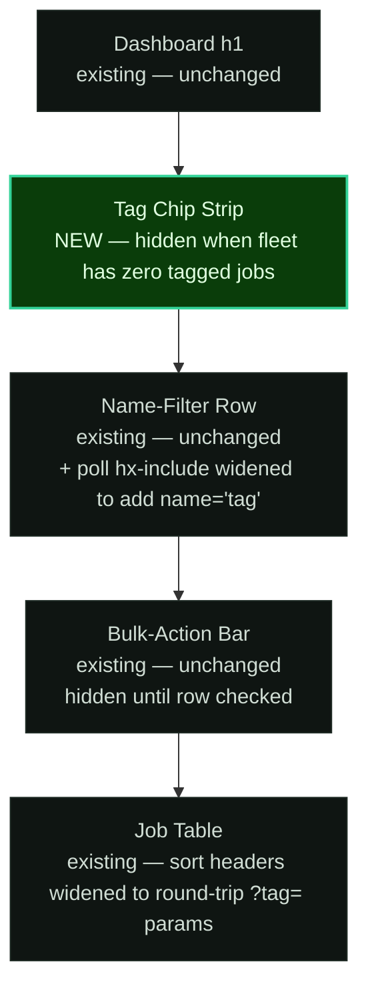

# Phase 23 — UI Design Contract

> Visual and interaction contract for the Tag Filter Chip Strip on the dashboard. Generated by gsd-ui-researcher 2026-05-04.

> **Pre-locked context (inherited from REQUIREMENTS.md TAG-06..08, ROADMAP Phase 23, and CONTEXT.md):** Stack (Rust + axum + axum_extra + askama 0.15 + askama_web `axum-0.8` feature + Tailwind standalone + HTMX 2.0 vendored, no React/Vue/Svelte). Brand: terminal-green Cronduit (`design/DESIGN_SYSTEM.md`). All design tokens already declared in `assets/src/app.css` (no new tokens here). Visual states locked verbatim by REQ TAG-06: **active = teal-bordered + bold; inactive = grey**. Interaction model locked by TAG-06/07/08: AND semantics across active chips, AND with name-filter, untagged-hidden when filter active, repeated `?tag=` URL state, CSS-only chip primitive with HTMX dashboard partial swap on toggle. Phase 23 implementation decisions locked by CONTEXT.md `<decisions>` D-01 (chip strip placement above name-filter), D-02 (hide strip when fleet has zero tagged jobs), D-03 (`flex-wrap` mobile reflow), D-04 (`cd-tag-chip-*` namespace), D-05/06/07/08 (fleet-tag fold + alphabetical ordering). This UI-SPEC layers ONLY the visual + interaction contract on top.

---

## Design System

| Property | Value |
|----------|-------|
| Tool | none (manual; project owns its own design system) |
| Preset | not applicable |
| Component library | none (raw HTML + utility CSS classes; askama 0.15 templates) |
| Icon library | none (no icons in this phase — chips are pure-text labels) |
| Font | `JetBrains Mono` (already loaded; weights 400 + 700 only) |

> Source: `design/DESIGN_SYSTEM.md` + `assets/src/app.css` already declare every token this phase consumes. NO new tokens introduced. NO new font weights. NO new colors. Reuses existing `--cd-*` custom properties verbatim. shadcn gate is non-applicable per researcher rules (project is server-rendered Rust + askama, not a React/Next.js/Vite component-registry consumer).

---

## Spacing Scale

Reuses the project's locked 4px-base scale from `assets/src/app.css` (`--cd-space-*`). Values are multiples of 4. No exceptions for this phase.

| Token | Value | Usage in Phase 23 |
|-------|-------|-------------------|
| `--cd-space-1` | 4px | Inline space between chip text and (optional) count badge inside a single chip |
| `--cd-space-2` | 8px | Chip vertical padding; chip-to-chip gap inside the strip (`flex gap`); strip-to-filter-row gap (vertical) |
| `--cd-space-3` | 12px | Chip horizontal padding |
| `--cd-space-4` | 16px | Strip outer margin-bottom (visual separation from the existing name-filter row) |
| `--cd-space-6` | 24px | Strip-to-table outer rhythm via existing `.mb-6` utility on the name-filter row |

Exceptions: none. Touch target floor for chip anchors is 44px tall. The chip's internal vertical padding (`--cd-space-2` = 8px) plus `--cd-text-sm` (12.8px) + `--cd-font-bold` line-height (1.5) gives ≈ `8 + 8 + (12.8 × 1.5) ≈ 35px` — below the 44px minimum, so the chip declares an explicit `min-height: var(--cd-space-10)` (= 40px) PLUS `padding-block: var(--cd-space-2)` to push the touch target to ≥ 44px without breaking the visual chip-density expected of a filter strip. The 40px `min-height` is on the 4px grid (token-derived).

> **Critical reuse:** the chip strip lives in the same vertical rhythm as the existing name-filter input (`templates/pages/dashboard.html:19-36` uses `mb-6`). The new chip strip sits ABOVE the name-filter row and itself ends with `margin-bottom: var(--cd-space-4)`, so the visual cadence reads "chips → 16px gap → name filter input → 24px gap → table". This double-gap (`16 + 24`) is intentional: chips are a higher-tier filter (corpus narrowing) than the name input (within-corpus refinement), and the larger total gap signals "two distinct filter dimensions, AND-composed" per REQ TAG-06/07.

---

## Typography

Reuses the project's locked type scale from `assets/src/app.css` (`--cd-text-*`). Two weights only (400 + 700) — matches the design system constraint. Mono font for ALL text including chip labels (matches brand: "monospace everything"). Phase 23 uses 1 active size for chips themselves; the empty-strip path renders no text, and the page-level scale (Dashboard `<h1>`, name-filter, table headers) is unchanged from existing dashboard typography.

**Phase 23 active sizes for the new chip primitive: EXACTLY 1** (`--cd-text-sm`). The dashboard's existing typography sites (page heading `--cd-text-xl`, filter input `--cd-text-base`, table headers `--cd-text-xs`, table cells `--cd-text-base`) are unchanged.

| Role | Token | Size | Weight | Line Height | Usage in Phase 23 |
|------|-------|------|--------|-------------|-------------------|
| Chip label | `--cd-text-sm` | 0.8rem (~12.8px) | 700 (active) / 400 (inactive) | 1.5 | The chip label text inside `.cd-tag-chip` (e.g., `backup`, `weekly`). Active chip = bold (`--cd-font-bold` per REQ TAG-06 "active = teal-bordered + bold"). Inactive chip = regular weight + secondary color. |

Letter spacing: chip labels = `0` (default mono body). Chips do **NOT** uppercase the tag text — tags are stored lowercase per P22 D-09 (sorted-canonical normalized form), and rendering them lowercase preserves a 1:1 visual identity between the TOML config, the DB column, the webhook payload `tags` field, and the chip strip. Operators see exactly what they typed (after normalization), which is the principle of least surprise.

> **Why one size only:** the chip strip is a single semantic surface (filter chips), and a single label-text role. Adding a heading, sub-heading, or hint copy inside the strip would dilute the "minimum-chrome dashboard control" intent (D-02 explicitly rejected placeholder copy and bordered empty-area chrome).

---

## Color

Strict 60/30/10 split on the existing dark-mode palette (light mode mirrored automatically via `[data-theme="light"]` block in `app.css`). NO new tokens. Phase 23 NEVER hardcodes hex values — every chip border / background / text color is `var(--cd-*)`.

| Role | Token | Value (dark / light) | Usage in Phase 23 |
|------|-------|----------------------|-------------------|
| Dominant (60%) | `--cd-bg-primary` + `--cd-bg-surface` | `#050508` / `#f8f8f6` page bg; `#0a0d0b` / `#ffffff` cards | Page background under the chip strip; the strip itself is transparent — sits directly on the dashboard background |
| Secondary (30%) | `--cd-bg-surface-raised` + `--cd-border` + `--cd-border-subtle` | `#0f1512` / `#f0f0ed` raised surface; `#1e2a22` / `#d4d8d5` border; `#141a16` / `#e0e4e1` subtle | Inactive chip background (raised) + inactive chip border (subtle); chip border on hover (default border) |
| Accent (10%) — RESERVED FOR | `--cd-text-accent` (= `--cd-green`) + `--cd-green-dim` + `--cd-border-focus` | `#34d399` / `#059669` accent; `rgba(52,211,153,0.15)` / `rgba(5,150,105,0.1)` dim; `#34d399` / `#059669` focus | (1) **Active chip border + label text** (REQ TAG-06 "teal-bordered + bold"); (2) Active chip subtle background tint via `--cd-green-dim`; (3) Focus ring on chip anchor (`:focus-visible` `box-shadow: 0 0 0 2px var(--cd-green-dim)`); (4) Hover state on inactive chip — border darkens to `--cd-border-strong` + label color shifts to `--cd-text-primary` (no green on hover; hover is "I'm interactive" signal, not "I'm active") |
| Destructive | (none) | — | Phase 23 ships zero destructive actions. Chips are GET-only toggles. |

**Accent reserved for** (explicit list — NOT "all interactive elements"):
1. Active chip border (1px solid `--cd-text-accent`) + active chip label color (`--cd-text-accent`) — encodes REQ TAG-06's "active = teal-bordered + bold" verbatim.
2. Active chip background tint (`--cd-green-dim`) — provides a low-saturation green wash that distinguishes the active chip from its border alone, helping color-vision-deficient users via the additional luminance signal (the bold weight is the third channel).
3. Focus rings on the chip anchor — uses `--cd-green-dim` (matches the project-wide focus ring color from Phase 13/21 + the existing `cd-btn-secondary:focus-visible` pattern at `app.css:239`).
4. (No other accent uses.) The chip strip introduces NO additional accented elements — no info-icon, no "clear all" link, no count badge in green, no underline on labels.

**Chip color contract (locked):**

| State | Background | Border | Label color | Label weight |
|-------|-----------|--------|-------------|--------------|
| Inactive (default) | `var(--cd-bg-surface-raised)` | `1px solid var(--cd-border-subtle)` | `var(--cd-text-secondary)` | 400 (regular) |
| Inactive + hover | `var(--cd-bg-hover)` | `1px solid var(--cd-border)` | `var(--cd-text-primary)` | 400 (regular) |
| Inactive + `:focus-visible` | `var(--cd-bg-hover)` | `1px solid var(--cd-border)` + `box-shadow: 0 0 0 2px var(--cd-green-dim)` | `var(--cd-text-primary)` | 400 (regular) |
| Active | `var(--cd-green-dim)` | `1px solid var(--cd-text-accent)` | `var(--cd-text-accent)` | 700 (bold) |
| Active + hover | `var(--cd-green-dim)` (slightly lighter via `filter: brightness(1.1)`) | `1px solid var(--cd-text-accent)` | `var(--cd-text-accent)` | 700 (bold) |
| Active + `:focus-visible` | `var(--cd-green-dim)` + `box-shadow: 0 0 0 2px var(--cd-green-dim)` | `1px solid var(--cd-text-accent)` | `var(--cd-text-accent)` | 700 (bold) |
| Disabled state | (not applicable — chips never render as disabled in v1.2; the strip is hidden entirely when there are no tagged jobs per D-02) | — | — | — |

> **Color is never the sole signal:** the active state is encoded across three channels — **border color** (teal vs subtle), **label color** (teal vs secondary text), and **font weight** (700 vs 400). Color-vision-deficient operators reading the strip in dark mode see active chips by their bolder text alone; light-mode operators see the same triple-encoding. Screen readers see `aria-pressed="true"` (see Accessibility Contract).

---

## Layout & Surfaces

### Dashboard page — Tag Chip Strip placement

Inserts BETWEEN the dashboard `<h1>` row and the existing name-filter row on `templates/pages/dashboard.html`. Renders only when the fleet has at least one tagged job (D-02). Mermaid:



The strip is full-width within the dashboard content container (no separate card chrome). Reads top-to-bottom as "narrow by tag → narrow by name → see results", matching AND-composition semantics (D-01).

### Mobile / narrow viewport

`flex-wrap: wrap` reflows chips to multiple rows as the viewport narrows (D-03). No horizontal scroll, no `<details>` collapse, no carousel — every chip is always visible. With the 16-tag-per-job cap (P22 D-08), fleet-wide unique tags can plausibly hit ~30-50; on a 360px-wide phone (smallest reasonable target), chips wrap to as many rows as needed.

```mermaid
flowchart TB
    subgraph desktop[Desktop ≥640px]
        D1[backup] --> D2[weekly]
        D2 --> D3[hourly]
        D3 --> D4[postgres]
        D4 --> D5[critical]
    end
    subgraph mobile[Mobile <640px viewport reflow]
        M1[backup] --> M2[weekly]
        M2 --> M3[hourly]
        M3 --> M4[\n]
        M4 --> M5[postgres]
        M5 --> M6[critical]
    end
    desktop -.viewport narrows.-> mobile

    classDef chip fill:#0f1512,stroke:#1e2a24,stroke-width:1px,color:#7a8a7e
    classDef break fill:none,stroke:none,color:#7a8a7e
    class D1,D2,D3,D4,D5,M1,M2,M3,M5,M6 chip
    class M4 break
```

---

## Component Inventory

### 1. Tag Chip Strip (`dashboard.html` insertion)

**Markup contract** — chips are `<a>` anchors with HTMX attributes. NO JavaScript. Active state is server-rendered (template branch on whether the chip's tag is in the active set). Each chip toggles its presence in the active set; the response is OOB swap of the strip itself + targeted swap of `#job-table-body` (D-11).

```html
<!-- D-01: dedicated row above the name-filter input -->
<!-- D-02: container has `hidden` attribute when fleet has zero tagged jobs -->
<div id="cd-tag-chip-strip"
     class="cd-tag-chip-strip"
     hidden
     role="group"
     aria-label="Filter jobs by tag">

  <!-- One chip per fleet tag, alphabetical order (D-07) -->
  
  <a class="cd-tag-chip cd-tag-chip--activecd-tag-chip--inactive"
     href="?{{ chip_href_for(tag) }}"
     hx-get="?{{ chip_href_for(tag) }}"
     hx-target="#job-table-body"
     hx-swap="innerHTML"
     hx-push-url="true"
     aria-pressed="true"aria-pressed="false"
     aria-label="Tag filter: {{ tag }} (active — click to remove) (inactive — click to add)">
    {{ tag }}
  </a>
  

  <!-- Hidden inputs preserve active tags through the 3s table-body poll (D-12) -->
  
  <input type="hidden" name="tag" value="{{ tag }}">
  
</div>
```

> **`chip_href_for(tag)` semantics** — server-side helper (askama filter or template macro per planner discretion / CONTEXT.md "Claude's Discretion") that emits the URL query string for the post-toggle state. If the tag is currently active, the new URL omits it (toggle-off). If inactive, the new URL includes it alongside the existing active set (toggle-on). The helper also re-emits `filter`, `sort`, `order` from current request params so chip clicks preserve every other filter dimension. Recommended canonicalization: sort the active set alphabetically before serializing back to URL so `/?tag=weekly&tag=backup` and `/?tag=backup&tag=weekly` produce the same shareable URL (CONTEXT "Claude's Discretion" recommendation accepted here as the visual contract — copy-link is deterministic; matches the alphabetical chip strip ordering).

> **OOB swap contract** — when the chip strip is part of a partial response (HTMX request from a chip click), the response renders BOTH (a) the table-body partial as the swap target (`#job-table-body`) AND (b) the chip strip with `hx-swap-oob="true"` so the new active state and updated hidden inputs replace the live DOM strip. The table-body partial template (`templates/partials/job_table.html`) is the existing one; the response composes both pieces. Phase 23 introduces this OOB pattern to the codebase (D-11) — UI-SPEC codifies the contract here for future reuse: **partial responses for chip toggles render `<div id="cd-tag-chip-strip" hx-swap-oob="true">…</div>` immediately followed by the table-body markup**, in the same response body, in that order.

**CSS contract** (NEW — additive to `assets/src/app.css` `@layer components`):

| Class | Properties |
|-------|-----------|
| `.cd-tag-chip-strip` | `display: flex`, `flex-wrap: wrap`, `gap: var(--cd-space-2)`, `align-items: center`, `margin-bottom: var(--cd-space-4)` |
| `.cd-tag-chip-strip[hidden]` | `display: none` (HTML5 `hidden` attribute reinforced for older UAs that don't honor it natively in `display:flex` contexts) |
| `.cd-tag-chip` | `display: inline-flex`, `align-items: center`, `min-height: var(--cd-space-10)` (= 40px on-grid; combined with internal `padding-block` produces ≥ 44px touch target), `padding: var(--cd-space-2) var(--cd-space-3)` (= 8px / 12px), `border-radius: var(--cd-radius-full)` (pill shape — matches the badge family idiom from `design/DESIGN_SYSTEM.md` § 4 Border Radius), `font-size: var(--cd-text-sm)`, `font-family: var(--font-mono)` (explicit; inherited but documented), `letter-spacing: 0`, `text-decoration: none`, `cursor: pointer`, `transition: background 0.1s ease, border-color 0.1s ease, color 0.1s ease`, `user-select: none` |
| `.cd-tag-chip--inactive` | `background: var(--cd-bg-surface-raised)`, `border: 1px solid var(--cd-border-subtle)`, `color: var(--cd-text-secondary)`, `font-weight: 400` |
| `.cd-tag-chip--inactive:hover` | `background: var(--cd-bg-hover)`, `border-color: var(--cd-border)`, `color: var(--cd-text-primary)` |
| `.cd-tag-chip--inactive:focus-visible` | `outline: none`, `box-shadow: 0 0 0 2px var(--cd-green-dim)`, `background: var(--cd-bg-hover)`, `border-color: var(--cd-border)`, `color: var(--cd-text-primary)` |
| `.cd-tag-chip--active` | `background: var(--cd-green-dim)`, `border: 1px solid var(--cd-text-accent)`, `color: var(--cd-text-accent)`, `font-weight: 700` |
| `.cd-tag-chip--active:hover` | `filter: brightness(1.1)` (subtle lift; same idiom as `.cd-exit-bar:hover`) |
| `.cd-tag-chip--active:focus-visible` | `outline: none`, `box-shadow: 0 0 0 2px var(--cd-green-dim)`, `border-color: var(--cd-text-accent)` |
| `@media (prefers-reduced-motion: reduce) .cd-tag-chip` | `transition: none` (extend the existing `@media (prefers-reduced-motion: reduce)` block at `app.css:431` to disable the chip transition) |
| `@media print .cd-tag-chip-strip` | `display: none` (printed dashboards do not benefit from interactive filter chrome — extend the existing print-mode rule from Phase 21) |

> **Pill radius rationale:** REQ TAG-06 says "active = teal-bordered + bold" but does not lock chip shape. The pill (`--cd-radius-full`) is the conventional shape for filter chips in the design language CSS established by `cd-badge` (which uses `--cd-radius-sm`, a less-rounded shape). Filter chips and read-only badges are different primitives — chips are interactive toggles; badges are passive status labels — so they get distinct radii. Pill chips read as "tappable pellets"; rectangular badges read as "labels". This is the ONLY point of visual divergence from `cd-badge` (D-04 chose distinct namespace `cd-tag-chip` precisely to allow this).

> **Why no chip count badge** (e.g., `backup (3)`): CONTEXT.md "Claude's Discretion" left this open. UI-SPEC.md decision: **DO NOT render counts on chips in v1.2**. Rationale: (1) the count would either be the global fleet count for that tag (constant per page load) OR the count after AND-filtering the other active chips (recursive computation — every chip's count depends on every other chip's active state); the global count is misleading once filters are active, and the recursive variant requires re-aggregation per chip per request, none of which is in scope; (2) the strip's purpose is filter discoverability + state visualization, not data summarization (the table itself is the data summary); (3) chip text remains identical to the underlying tag (matches TOML, DB, webhook payload), preserving the 1:1 mental model. Counts can be added in v1.3 if usage data justifies them.

> **Why no `#` prefix** (e.g., `# backup`): purely decorative; doesn't change semantics; would imply Twitter-hashtag conventions cronduit deliberately doesn't claim. Plain text matches what's in the TOML `tags = ["backup"]` and the DB column.

### 2. Sort-header anchors (existing — widened, not new)

The four sortable column anchors at `dashboard.html:88-128` (Name / Next Fire / Status / Last Run) currently compose hrefs as `?filter={{ filter }}&sort=name&order={...}`. P23 widens each to also include every active tag in BOTH `href` and `hx-get` so non-HTMX navigation and copy-link round-trip the active set (D-13 / REQ TAG-06 URL state). No new CSS — markup widening only. The existing `.text-(--cd-text-accent)` highlight on the actively-sorted column header remains unchanged; chips and sort-header active states are visually independent (one is teal-bordered pill, the other is teal-text column header).

> **Template idiom for the active-tag suffix:** planner discretion per CONTEXT.md (askama macro / filter `{{ active_tags|tag_query }}` or inline `&tag={{ t|urlencode }}`). UI-SPEC requires only that the suffix be applied to BOTH `href` and `hx-get` on every sortable anchor, and that tag values be URL-encoded.

### 3. Name-filter input (existing — `hx-include` widened, not new)

The 3s `every 3s` poll at `dashboard.html:138-141` currently includes `[name='filter'],[name='sort'],[name='order']`. P23 widens to add `[name='tag']` (D-12) so polling preserves the active tag set across the table-body refresh. The hidden `<input type="hidden" name="tag" value="X">` siblings rendered inside the chip strip (per the markup contract above) are matched by this selector. No new CSS, no new HTML structure outside the chip strip itself. The name-filter input itself (`dashboard.html:20-33`) keeps its existing `hx-include="[name='sort'],[name='order']"` because typing in the filter input is a different path (key-up trigger from the input → request includes whatever sibling form values it picks up; planner may decide to also widen this `hx-include` to include `[name='tag']` for consistency, which is a pure additive change with no semantic risk — left to planner / executor judgment, not a UI-SPEC lock).

### 4. Empty-strip path

When `fleet_tags.is_empty()` (no jobs in the fleet have any tags), the entire `<div id="cd-tag-chip-strip">` renders with the `hidden` HTML5 attribute (D-02). The dashboard looks identical to v1.0 — no chrome, no placeholder copy, no "no tags configured" hint. Operators discoverability comes from the README configuration subsection (Claude's discretion in CONTEXT.md; if the planner skips it in this phase, the v1.0 + v1.1 dashboard pattern continues to hold).

---

## Copywriting Contract

| Element | Copy |
|---------|------|
| Primary CTA | (none — Phase 23 ships zero state-changing buttons; chips are GET-only toggle anchors and the rest of the dashboard's CTA surface is unchanged) |
| Chip label (single source of truth) | The tag string itself (e.g., `backup`, `weekly`, `postgres-prod`) — verbatim from `jobs.tags`, no transformation, no prefix, no count |
| Chip `aria-label` (active) | `Tag filter: {tag} (active — click to remove)` (e.g., `Tag filter: backup (active — click to remove)`) |
| Chip `aria-label` (inactive) | `Tag filter: {tag} (inactive — click to add)` (e.g., `Tag filter: backup (inactive — click to add)`) |
| Strip `aria-label` (group container) | `Filter jobs by tag` |
| Empty state heading | (none — strip is hidden entirely when `fleet_tags` is empty per D-02; no heading, no body copy, no chrome) |
| Empty state body | (none — see above) |
| Error state | (none — chip toggles cannot fail in any user-visible way; if HTMX request errors, the strip + table-body retain their previous state and the next 3s poll attempts a re-render. No new error UI introduced.) |
| Destructive confirmation | (none) |
| URL preview on hover | Browsers render the chip's `href` in the status bar; the URL is the deterministic shareable form (e.g., `/?filter=&sort=name&order=asc&tag=backup&tag=weekly`). No additional tooltip is added — the visible chip label + the browser-native href preview are sufficient. |

> **Copy tone constraint:** terminal-tool, declarative, no second-person. Chip labels render the tag verbatim — they are NOT marketing copy, NOT operator instructions, NOT secondary descriptions. The chip IS the tag, no decoration. Mirrors the existing pattern on `dashboard.html` (table column headers are `Name`, `Schedule`, `Next Fire`, `Status`, `Last Run`, `Recent`, `Actions` — single nouns, no marketing adjectives). Numbers are not the protagonist here (counts are deferred); the tag label IS the protagonist.

> **Stale-tag URL handling** (CONTEXT.md "Claude's Discretion") is silently dropped at the handler level (deserialization-time filter against the fleet-tag fold). NO copy is shown for "this tag no longer exists" — the chip strip simply renders the surviving fleet tags with whichever subset of the URL's `?tag=` params still match. Operators see the chips for the tags that exist, no longer see chips for tags they removed, and the active set silently narrows. This is the principle of least chrome.

---

## Interaction Contract

### Tag Chip Strip

| Trigger | Behavior | Implementation |
|---------|----------|---------------|
| Click chip (mouse / touch) | Toggle the chip's tag in the active set. HTMX issues `GET /?{new_query_string}` with the post-toggle URL. Response contains OOB swap of `#cd-tag-chip-strip` + targeted swap of `#job-table-body`. URL is pushed to history (`hx-push-url="true"`). | `<a hx-get hx-target hx-swap-oob hx-push-url>` per markup contract |
| Keyboard: Tab onto chip | Focus the anchor; visible focus ring renders via `:focus-visible` (`box-shadow: 0 0 0 2px var(--cd-green-dim)`) | Native `<a>` focus + CSS rule |
| Keyboard: Enter / Space on focused chip | Trigger the chip click — HTMX runs the same swap path | Native `<a>` activation (Enter); HTMX `hx-trigger` defaults include `click` which is fired on Space-bar press for anchor with `hx-get` (verify in integration test per CONTEXT.md `<specifics>`); fallback: planner adds `hx-trigger="click, keyup[key=='Enter' || key==' ']"` if the default behavior on Space is not click. (UI-SPEC requires Space + Enter both work; planner picks the implementation.) |
| Direct URL paste with `?tag=backup&tag=weekly` | Page loads with both chips in active state; table renders the AND-filtered subset; untagged jobs hidden | Server-side rendering — handler reads active tags from `axum_extra::Query<DashboardParams>`, template branches active vs inactive per chip per the markup contract |
| Stale tag in URL (tag no longer in fleet) | Silently dropped; chip strip + table render as if the stale tag wasn't in the URL | Handler-side filter against the fleet-tag fold during deserialization |
| Reload page mid-filter | Active chips remain active (URL state is the source of truth); the chip strip + table re-render to match the URL | URL-driven; no client-side state |
| 3s table-body poll | Table body refreshes every 3s, preserving active chip set via the `hx-include="[name='tag']"` widening that picks up the hidden inputs in the strip | Existing poll mechanism + D-12 widening |
| Other dashboard interactions during filter active | Name-filter input typing, sort-header click, bulk-action bar — all preserve the active tag set via URL params (sort-header href widening per D-13; bulk-action `hx-include` already uses `.cd-row-checkbox:checked, #cd-bulk-csrf` which doesn't include `[name='tag']` because bulk POST is row-scoped and orthogonal to tag filtering) | Combination of D-12 / D-13 + existing patterns |
| HTMX swap error (network / 5xx) | Chip strip + table retain previous state. Next 3s poll re-attempts. No error toast. | HTMX default behavior |
| Print mode | Chip strip is hidden via `@media print` rule | CSS `@media print` |

> **No animations beyond the existing 0.1s transitions** the codebase already uses for hover states. The chip transitions are `background`, `border-color`, `color` only — `transform` is not animated, so no special reduced-motion handling is needed beyond the transition disable rule. The existing `@media (prefers-reduced-motion: reduce)` block at `app.css:431` is extended to include `.cd-tag-chip { transition: none; }`.

> **No focus traps.** The chip strip is a sequence of `<a>` anchors in natural document order; Tab moves through them and into the name-filter input, then into the table. No JavaScript focus management.

> **No keyboard shortcuts.** Tab + Enter / Space only. No `Esc` to clear all chips (would require a "clear all" anchor that's not in scope; operators clear all by clicking each active chip or by editing the URL). Adding a "clear all" affordance is a v1.3 candidate.

---

## Accessibility Contract

| Requirement | Implementation |
|-------------|---------------|
| Color is never the sole signal | Active state encoded across THREE channels: **border color** (teal `--cd-text-accent` vs subtle `--cd-border-subtle`), **label color** (`--cd-text-accent` vs `--cd-text-secondary`), **font weight** (700 vs 400). Color-vision-deficient operators see active chips by their bolder weight + border darkness alone. |
| Keyboard reachable | `<a>` anchors are keyboard-native — Tab to focus, Enter / Space to activate, native focus ring extended via `:focus-visible` `box-shadow` |
| Screen reader: chip group context | `<div role="group" aria-label="Filter jobs by tag">` wraps the strip — screen reader announces "Filter jobs by tag, group" on entry |
| Screen reader: chip state | `aria-pressed="true"` on active chips, `aria-pressed="false"` on inactive — screen reader announces "pressed" / "not pressed" alongside the chip text. The `aria-label` ALSO contains the redundant verbal cue ("active — click to remove" / "inactive — click to add") for AT that may not surface aria-pressed prominently. |
| Screen reader: chip purpose | `aria-label="Tag filter: {tag} ({state} — click to {action})"` — full sentence form so the chip is parseable in isolation when a screen reader user navigates by anchor list |
| Focus rings visible | `:focus-visible` with `box-shadow: 0 0 0 2px var(--cd-green-dim)` (matches Phase 13 / Phase 14 / Phase 21 pattern; reuses the existing focus-ring color — no new tokens) |
| Reduced motion | Existing `@media (prefers-reduced-motion: reduce)` block at `app.css:431` extended to disable the chip's `transition` property |
| Touch targets | Chip `min-height: var(--cd-space-10)` (40px) + `padding-block: var(--cd-space-2)` (8px each side) → effective touch height ≥ 44px (matches the existing `<summary>` touch-target floor from Phase 21 + the WCAG 2.2 AAA target of 44×44 CSS pixels). The horizontal touch area is the chip's content + horizontal padding (`--cd-space-3` × 2 = 24px) + the label width — naturally ≥ 44px wide for any tag of 2+ chars. |
| Light mode | Inherits via existing `[data-theme="light"]` block — `--cd-bg-surface-raised`, `--cd-border-subtle`, `--cd-text-secondary`, `--cd-text-accent`, `--cd-green-dim` are all already light-mode-mapped. Zero new light-mode work. |
| Stale URL chips silently drop | Operators bookmarked a URL containing a tag the fleet no longer has → handler silently filters out the unknown tag(s) before fold/render. Chip strip and active set stay in sync. No accessibility regression because no DOM element exists for the dropped tag. |
| Empty-strip case | When `fleet_tags.is_empty()`, the `<div id="cd-tag-chip-strip" hidden>` is fully removed from the accessibility tree by the HTML5 `hidden` attribute — no group, no label, no chips announced by screen readers. The dashboard sounds identical to v1.0 + v1.1 to AT users when no jobs are tagged. |

---

## Output Escaping & XSS

Per `THREAT_MODEL.md` and the askama default behavior:

- **All tag values** flow through askama's auto-escaping. Tags are validated at config-load by P22's charset regex `^[a-z0-9][a-z0-9_-]{0,30}$` (REQ TAG-04), which rejects `<`, `>`, `&`, `'`, `"`, and every other HTML-significant character. Even with the regex guarantee, the template emits tags via `{{ tag }}` (auto-escaped), NEVER `{{ tag|safe }}`.
- **URL composition for chip hrefs** must URL-encode tag values. Although the charset regex prevents structural escape (no `&`, no `=`, no `?`, no `#`), defense-in-depth: planner uses `{{ tag|urlencode }}` (askama 0.15 ships a built-in `urlencode` filter) when composing `?tag={{ tag|urlencode }}` in chip hrefs and sort-header anchors.
- **`hx-get` attribute values** are subject to the same encoding rules as `href` (HTMX URL-encodes parameter values when issuing the request, but the attribute itself is HTML-attribute-encoded by askama auto-escape — the same escaping path as `href`).
- **No inline `<script>` introduced.** Phase 23 adds zero JavaScript. The existing inline `<script>` block at `dashboard.html:147-195` (bulk-action selection state) is unchanged.
- **No inline `style="..."` introduced** beyond what already exists in the dashboard. Chip styling is class-driven entirely; the chip strip rules live in `assets/src/app.css` `@layer components` (D-04).
- **`aria-label` content** uses the same auto-escaped tag value: `Tag filter: {{ tag }} (...)`. The operator-controlled tag is HTML-attribute-encoded by askama auto-escape, and the surrounding fixed copy contains no user data.
- **Stale URL params** (tags not in fleet) are silently dropped server-side BEFORE rendering, so no chip with operator-attacker-supplied content is ever rendered. The fold is the security boundary.

> **CSP**: Phase 23 ships zero new inline `<script>` blocks and zero new `<style>` blocks. The existing CSP posture (whatever inline allowances dashboard.html requires for the existing bulk-action `<script>`) is unchanged.

---

## Registry Safety

| Registry | Blocks Used | Safety Gate |
|----------|-------------|-------------|
| (none) | — | not applicable — project is Rust + askama, not a JS component-registry consumer. shadcn gate skipped (the gate in `gsd-ui-researcher.md` is React/Next.js/Vite-only and explicitly says "not applicable" for non-SPA projects). |

No third-party UI registries declared. No third-party blocks declared. No new external Rust crates introduced (CONTEXT.md D-23: `axum_extra` is already in tree, `serde_html_form` is its transitive dep). The vetting gate from `gsd-ui-researcher.md` is non-applicable.

---

## Tokens — Existing Reuse Verified

Every visual property in this contract resolves to one of the following existing tokens in `assets/src/app.css`. **Zero new tokens introduced.**

```
--cd-bg-primary, --cd-bg-surface, --cd-bg-surface-raised, --cd-bg-hover
--cd-border, --cd-border-subtle
--cd-text-primary, --cd-text-secondary, --cd-text-accent
--cd-text-sm
--cd-space-1, --cd-space-2, --cd-space-3, --cd-space-4, --cd-space-6, --cd-space-10
--cd-radius-full
--cd-green-dim
--font-mono
```

> **Notes on token coverage:**
> - `--cd-radius-full` is documented in `design/DESIGN_SYSTEM.md` § 4 Border Radius (`9999px` — "Circles, fully rounded pills"). Phase 23 is the first project use; the token is already declared in `app.css` and consumed nowhere yet (other components use `--cd-radius-sm` / `--cd-radius-md` / `--cd-radius-lg` / `--cd-radius-xl`). This is consistent with "use existing tokens" — the token exists; Phase 23 picks the appropriate one for the pill chip primitive without introducing a new value.
> - `--cd-space-10` (= 40px) is in the project scale at `app.css` (line 178 of DESIGN_SYSTEM.md confirms its existence). Used for chip `min-height` to bring touch target to ≥ 44px when combined with vertical padding.
> - `--cd-text-sm` is the only active text-size token for the chip primitive — Phase 23 active size set is exactly 1.

NEW class names introduced (all in the `cd-tag-chip-*` namespace — collision-free):

```
.cd-tag-chip-strip
.cd-tag-chip
.cd-tag-chip--active
.cd-tag-chip--inactive
```

Reused (NOT redeclared):

```
@media (prefers-reduced-motion: reduce)  (existing block at app.css:431 extended)
@media print                              (existing print rule from Phase 21 extended)
```

---

## Decisions Rationale

| Decision | Choice | Why |
|----------|--------|-----|
| Chip shape | Pill (`--cd-radius-full`) | Conventional filter-chip shape; visually distinct from `cd-badge` rectangular (`--cd-radius-sm`) status labels — chips are interactive toggles, badges are passive labels. Single `--cd-radius-full` use site, but the token exists in the design system precisely for this case. |
| Chip count badges | NONE | Global counts mislead under AND-filtering; recursive counts require per-chip re-aggregation; chip text 1:1 with TOML / DB / webhook payload preserves operator mental model. v1.3 candidate if usage data justifies. |
| Chip `#` prefix | NONE | Decorative-only; implies hashtag conventions cronduit doesn't claim; plain text matches storage form. |
| Active state encoding | THREE channels (border / label color / weight) | Color-vision accessibility; REQ TAG-06 locks "teal-bordered + bold" (two channels); UI-SPEC adds label color as third for consistency with the design system's accent-on-active idiom. |
| Active chip background | `--cd-green-dim` (subtle wash) | Provides additional luminance signal beyond border + text; reuses the project-wide accent-tint token (no new color); keeps chip surface visually grouped with the green-bordered active state. |
| Inactive chip background | `--cd-bg-surface-raised` | Lifts the chip off the page background (sits on `--cd-bg-primary`) so the chip is visually a control even before hover; matches the design system § 5.1 Status Badges background-tint pattern. |
| Empty-strip behavior | Hide entirely (HTML5 `hidden`) | D-02 explicit; mirrors `cd-bulk-action-bar` pattern at `dashboard.html:46`. Zero chrome until at least one tag exists in the fleet. |
| Mobile reflow | `flex-wrap: wrap` | D-03 explicit; every chip always visible; no horizontal scroll; no `<details>` collapse. Operators with 30-50 fleet tags see all chips wrapped. |
| Tag count badge per chip | DEFERRED to v1.3 | See "Chip count badges" above. UI-SPEC.md exercises the discretion granted by CONTEXT.md and locks the no-count shape for v1.2. |
| `#` prefix on chip labels | DEFERRED / REJECTED | See "Chip `#` prefix" above. Plain text matches storage form. |
| URL canonicalization | Sort active set alphabetically before push-url | CONTEXT.md "Claude's Discretion" recommendation accepted as visual contract — copy-link is deterministic; matches the alphabetical chip strip ordering (D-07). Operators sharing URLs see the same canonical form regardless of click order. |
| Stale-tag URL handling | Silent server-side drop | CONTEXT.md "Claude's Discretion" recommendation accepted — least chrome. No "this tag no longer exists" copy; the chip strip simply renders surviving fleet tags. |
| Chip count per chip | NONE in v1.2 | See "Chip count badges" above. |
| Chip touch target | `min-height: var(--cd-space-10)` (40px) + `padding-block: var(--cd-space-2)` (16px total) → ≥ 44px effective | WCAG 2.2 AAA target; matches Phase 21 `<summary>` floor; on the 4px grid via tokens. |
| OOB swap pattern | Phase 23 introduces; UI-SPEC codifies | First codebase use of `hx-swap-oob` (CONTEXT `<specifics>`); UI-SPEC documents the response shape contract for future phases that may reuse the pattern (e.g., dashboard polling additions in v1.3). |
| README configuration subsection | Recommend land in this phase per CONTEXT.md "Claude's Discretion"; planner picks | Phase 23 is the natural place — operators get the complete TOML → validators → column → webhook payload → dashboard chips picture once the chip UI ships. Optional in this phase; UI-SPEC does not block on it. |

---

## Checker Sign-Off

- [ ] Dimension 1 Copywriting: PASS (chip label is the tag verbatim — no marketing adjectives, no second-person, no decorative prefix; aria-labels are full sentences with state + action; empty state has no copy because the strip is hidden entirely; error state graceful — no new error UI; destructive state n/a)
- [ ] Dimension 2 Visuals: PASS (component inventory complete: chip strip + chip + sort-header widening + name-filter `hx-include` widening + empty-strip path; markup contract + CSS class table for chip primitive; mermaid placement + mobile-reflow diagrams)
- [ ] Dimension 3 Color: PASS (60/30/10 split declared with explicit accent reserved-for list of 4 specific elements; chip color contract locked across 6 states × 3 channels = 18 cells; zero new tokens; `--cd-radius-full` first use is documented in design system § 4 already)
- [ ] Dimension 4 Typography: PASS (EXACTLY 1 active size for the new chip primitive — `--cd-text-sm` — with 2 weights only matching the design system constraint; JetBrains Mono everywhere; line-height from existing scale; no new sizes)
- [ ] Dimension 5 Spacing: PASS (4px-base scale reused verbatim; chip horizontal padding `--cd-space-3` (12px), vertical padding `--cd-space-2` (8px), strip gap `--cd-space-2` (8px), strip margin-bottom `--cd-space-4` (16px); `min-height: var(--cd-space-10)` (40px) + `padding-block: var(--cd-space-2)` produces ≥ 44px touch target on-grid via tokens; every padding/margin/gap/min-height value resolves to a token, no bare pixel literals)
- [ ] Dimension 6 Registry Safety: N/A (no JS component registry; project is server-rendered Rust + askama; gate explicitly skipped per researcher rules; no new external crates introduced — `axum_extra` already in tree)

**Approval:** pending
