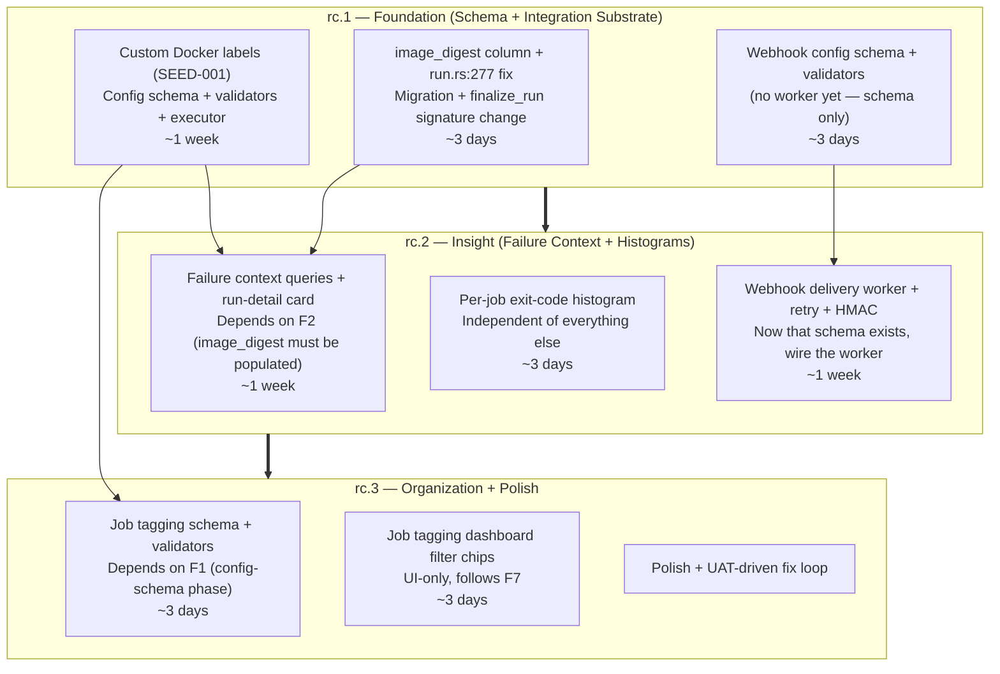
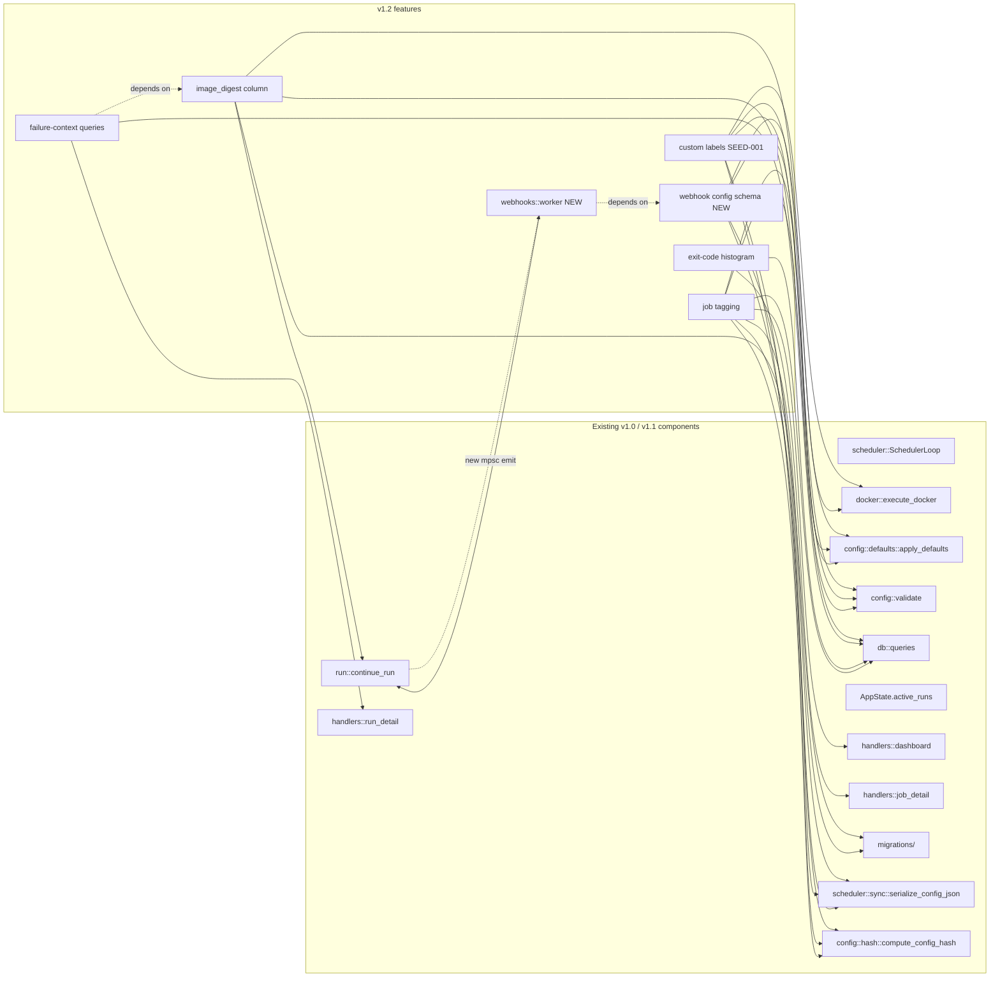

# Cronduit v1.2 — Architecture Research

**Dimension:** Integration Mapping (subsequent milestone, not greenfield)
**Milestone:** v1.2 "Operator Integration & Insight"
**Researched:** 2026-04-25
**Confidence:** HIGH — every cited file path, line number, and symbol verified by direct read of the v1.1.0 source tree on the `docs/v1.1-close-out` branch.

> This document adapts the standard `research-project/ARCHITECTURE.md` template the same way the v1.1 research did. The greenfield template asks "what architecture should we adopt?" — for v1.2 the architecture is shipped, the locked decisions are listed in `PROJECT.md`, and the valuable research question is "how do the v1.2 features slot into the existing modules, what new data flows are required, and what is the build order?" The sections below reflect that adapted focus and explicitly omit anything that is roadmap or stack-research territory (per the orchestrator's `Out of scope`).

---

## 1. Executive Summary

v1.2 is an **expand milestone on top of the shipped v1.1.0 architecture.** Of the five features:

- **Three are mostly-additive on the schema and the executor** — webhook notifications, custom Docker labels (SEED-001), and per-job exit-code histogram. None require touching `SchedulerLoop::run`. None invalidate any v1.0/v1.1 invariant.
- **One requires a new `job_runs` column with backfill** — failure-context's image-digest delta. The three-file migration shape locked in by Phase 11 (DB-09..13) and reused by Phase 14 (DB-14) fits exactly. There is also a low-risk corollary: the v1.1.0 codebase has a **field-naming bug** that we should fix in the same migration wave (see §3.3 "Pre-existing bug").
- **One is UI-only with a small DB schema choice attached** — job tagging. The schema choice (JSON column on `jobs` vs separate `jobs_tags` table) is decidable here without re-litigating it at phase-plan time.

The two architecturally interesting feature threads are:

1. **Webhook delivery worker** — must not block the scheduler loop, must survive reload, must integrate with the existing `active_runs` `RunEntry` map (which is already the broadcast hub for SSE). The orchestrator's option (c) — emit a `RunFinalized` event, consume it from a new `src/webhooks/` module — is the right call but for a more specific reason than the question hints at: there is **no broadcast/event channel today for run-finalized events**, only the per-run `__run_finished__` log-line sentinel, which is scoped to live SSE subscribers and is dropped whenever no SSE client is connected. The webhook worker needs a real, backpressure-aware delivery channel that's distinct from the SSE log fan-out. Details in §3.1.
2. **The `[defaults]` + per-job + `use_defaults=false` override pattern** — adding two new fields (webhooks + labels) on top of the four existing ones (`image`, `network`, `volumes`, `delete`, `timeout`) takes the count from 5 to 7. **Do not extract** a generic `MergeWithDefaults` trait yet. Reasons in §3.2.

The **suggested build order** (§4) is dependency-driven, not aesthetic: image-digest capture must precede failure-context queries, and the `[defaults]` schema additions for webhooks + labels are a single coherent config-schema phase. v1.2 maps cleanly onto **3 release candidates** mirroring the v1.1 cadence: `rc.1` (foundation: schema + integration substrate), `rc.2` (insight: failure context + exit-code histogram), `rc.3` (organization: tagging UI + close-out polish).

---

## 2. Existing Architecture Touchpoints (verified for v1.2)

The v1.1.0 modules I traced through for this research, focused on the integration sites v1.2 actually touches:

| Area | File | What it owns today (verified at v1.1.0) |
|------|------|--------------------|
| Scheduler loop | `src/scheduler/mod.rs` (873 lines; `SchedulerLoop::run` at L82–L540) | `tokio::select!` over sleep / `join_set` / `cmd_rx` / cancel; new `RunEntry` value-type at L58–L65 (broadcast_tx + control + job_name); `SchedulerCmd::Stop` arm at L406–L444 |
| Per-run record | `src/scheduler/mod.rs::RunEntry` (L58–L65) | `Clone`-able value held in the `active_runs` map; carries the broadcast channel for SSE AND the `RunControl` for Stop. **No event/notification sender field today.** |
| Per-run lifecycle | `src/scheduler/run.rs::continue_run` (L147–L397) | Insert RunEntry → spawn log writer → dispatch executor → close sender → finalize_run → broadcast `__run_finished__` sentinel → remove from active_runs. **All terminal-status transitions converge here.** |
| Docker exec | `src/scheduler/docker.rs::execute_docker` (L78–L417) | Pre-flight → pull → label-build (L146–L149) → create (L171) → start → `inspect_container` for image digest (L240–L251) → wait/timeout/cancel → drain logs → maybe_cleanup_container |
| **Pre-existing bug** | `src/scheduler/run.rs:277` | `container_id_for_finalize = docker_result.image_digest.clone()` — the local is named *container_id* but is filled with the *image digest*; passed to `finalize_run`'s `container_id` parameter at L331. **Today's `job_runs.container_id` column is silently storing image digests** for docker jobs. v1.2 must address this when introducing the `image_digest` column proper. (See §3.3 "Pre-existing bug.") |
| Config schema | `src/config/mod.rs::DefaultsConfig` (L76–L85), `JobConfig` (L87–L120) | Locked field set: `image, network, volumes, delete, timeout` mergeable via `apply_defaults`; `cmd, container_name, env, command, script, schedule` per-job-only |
| Defaults merge | `src/config/defaults.rs::apply_defaults` (L108–L159) | Field-by-field manual merge; `use_defaults == Some(false)` short-circuit at L112; `is_non_docker` gating at L123 prevents docker-only fields from leaking onto command/script jobs; module-level doc at L1–L96 documents the **5-layer plumbing parity invariant** any new field must satisfy |
| Validators | `src/config/validate.rs::run_all_checks` (L16–L26) | Per-job loop calls `check_one_of_job_type`, `check_cmd_only_on_docker_jobs` (L89–L101 — the type-gated validator pattern SEED-001 references), `check_network_mode`, `check_schedule` |
| DB schema | `migrations/{sqlite,postgres}/20260410_000000_initial.up.sql` + 4 v1.1 migrations | `jobs` (id, name, schedule, resolved_schedule, job_type, config_json, config_hash, enabled, timeout_secs, created_at, updated_at, **+ next_run_number, + enabled_override**); `job_runs` (id, job_id, status, trigger, start_time, end_time, duration_ms, exit_code, container_id, error_message, **+ job_run_number**); `job_logs` (id, run_id, stream, ts, line). **No `image_digest`, no `tags`, no webhook-delivery state today.** |
| Queries | `src/db/queries.rs` (2200 lines) | `get_dashboard_jobs` (L605, returns `DashboardJob` with `enabled_override`), `get_recent_successful_durations` (L813, the v1.1 OBS-04 reference for "fetch a vector of i64s from `job_runs` for a job with `LIMIT N`"), `get_run_history` (L1045), `get_run_by_id` (L1124, returns `DbRunDetail`) |
| Stats helper | `src/web/stats.rs` (83 lines) | `percentile(samples: &[u64], q: f64) -> Option<u64>` — the Phase 13 OBS-04 reference for "compute distributional summaries in Rust, never SQL" |
| Web router | `src/web/mod.rs::router` (L48–L90) | Dashboard + job_detail (with `/partials/run-history/{id}` and `/partials/jobs/{job_id}/runs`) + run_detail + settings + timeline + health + bulk_toggle + sse_logs |
| Job-detail view | `src/web/handlers/job_detail.rs::JobDetailPage` (L41–L50, the `DurationView` structure at L99–L109) | Rust-side card hydration; the v1.1 OBS-04 reference for "compute summary in Rust, render a small struct in the template" |
| Dashboard view | `src/web/handlers/dashboard.rs::DashboardJobView` (L66–L92) | Includes `is_disabled` bool driven by `enabled_override == Some(0)`, `spark_cells: Vec<SparkCell>`, `spark_badge`, `spark_total/numerator/denominator`. Dashboard query already supports `filter` (LIKE on name) + `sort` whitelist |
| Active runs map | `src/web/mod.rs::AppState.active_runs` (L43–L45) | `Arc<RwLock<HashMap<i64, RunEntry>>>` — shared between scheduler loop and SSE handler. **No additional event channel exists alongside it.** |
| SSE | `src/web/handlers/sse.rs::sse_logs` | Subscribes to `entry.broadcast_tx` for log-line frames; treats the `__run_finished__` sentinel (run.rs:373) as a graceful-terminal frame. **Does not currently know about webhooks; the broadcast channel is log-only.** |
| Orphan reconciliation | `src/scheduler/docker_orphan.rs::reconcile_orphans` (L28–~L100) | Lists containers with `cronduit.run_id` label, stops + removes, marks DB rows. **The label namespace is consumed here**, justifying SEED-001's `cronduit.*` reserved-namespace validator. |
| Missing today | — | No webhooks module; no event/notification channel separate from log broadcast; no `image_digest` column; no `tags` storage; no exit-code histogram query; no failure-context query helpers. |

**Key invariant the v1.2 features must respect:** the per-run finalization point is exactly one place — `continue_run` at run.rs L324–L382. Steps 7 (finalize_run UPDATE), 7b (Prometheus metrics), 7c (`__run_finished__` SSE sentinel), 7d (active_runs.remove + drop broadcast_tx). This is where webhook emission and any other post-terminal fan-out must hook, and the existing ordering must be preserved (DB → metrics → SSE fan-out → cleanup). v1.2 adds steps 7e (webhook emit) between 7c and 7d.

---

## 3. Feature-by-Feature Mapping

### 3.1 Webhook Delivery Worker (recommend: option (c) hybrid, with caveats)

**Recommended shape: a new module `src/webhooks/mod.rs` consuming a dedicated `mpsc<RunFinalized>` channel emitted from `continue_run::finalize` step 7e.** Concretely **option (a) with the option (c) framing.**

The orchestrator's question proposes three shapes (a), (b), (c). The right answer is in fact a refinement of (a):

- **(b) inline in `continue_run`** is rejected outright. It couples the scheduler-spawned per-run task to outbound HTTP I/O. A slow webhook receiver, DNS hang, or 30-second TCP timeout would block `continue_run`'s step 7d (`active_runs.write().await.remove(&run_id)` + `drop(broadcast_tx)`), which delays SSE clients seeing `RecvError::Closed` and indirectly delays the next run's slot opening. Latency from a misbehaving operator endpoint must NOT propagate to the scheduler.
- **(c) hybrid using a broadcast channel** is plausible at first glance because the SSE `__run_finished__` sentinel is broadcast-shaped, but it's wrong on inspection. The current per-run broadcast channel (run.rs:157, capacity 256) is **per-run** — it's created on run start and dropped on run finalize. There is no project-wide broadcast channel today. Adding one creates a second event-bus that competes for `RunEntry` ownership; multi-consumer fanout on a per-run channel is also fragile (the SSE handler needs to know which `LogLine` is the sentinel; webhook worker needs to filter to the sentinel; future SSE-log-finalize listeners would need to coexist). Worse: a broadcast channel **drops messages on lagging consumers** (`broadcast::error::RecvError::Lagged`), which is unacceptable for at-least-once delivery semantics on outbound HTTP.
- **(a) with explicit framing** is the right call. Concrete shape:

  ```text
  ┌─────────────────────────┐  RunFinalized event   ┌───────────────────────┐
  │ continue_run, step 7e   │ ────────────────────▶ │ webhook worker task   │
  │ src/scheduler/run.rs    │   tokio::sync::mpsc   │ src/webhooks/mod.rs   │
  └─────────────────────────┘   (bounded, 1024)     └───────────────────────┘
                                                              │
                                                              ▼
                                                     reqwest+rustls client
                                                     3 attempts, exp backoff
                                                     HMAC sign, JSON body
  ```

  - The `RunFinalized` value type carries: `run_id: i64`, `job_id: i64`, `job_name: String`, `status: String` (already canonicalized at run.rs L315–L322), `exit_code: Option<i32>`, `started_at: String`, `ended_at: String`, `duration_ms: i64`, `error_message: Option<String>`, AND the resolved per-job webhook config (URL, secret, state-filter list) **fetched at finalize time** so the webhook worker doesn't need to re-resolve the merged-defaults config. The worker is then a stateless consumer.
  - **Sender:** `tokio::sync::mpsc::Sender<RunFinalized>` lives in a new field on `AppState` and on `SchedulerLoop`. Bounded at 1024. Delivery from `continue_run` uses `try_send` (non-blocking) — if the worker queue is full, log at WARN with a `cronduit.webhooks.dropped` target and increment a `cronduit_webhook_dropped_total{reason="queue_full"}` counter. **The scheduler must never block on webhook delivery.** v1.2 explicitly accepts at-most-1024-in-flight backpressure as a deliberate failure mode (much better than scheduler stalls).
  - **Worker:** spawned at `cli::run` startup as a `tokio::spawn(webhooks::run_worker(rx, config_path, ...))`. Owns its own `reqwest::Client` (built with `rustls-tls` per the locked TLS posture). For each event, resolves `cfg.webhook` from the merged-job-config in the event payload, filters by `states` list, then fires the HTTP POST with 3-attempt exponential backoff (250ms / 1s / 4s).
  - **Reload survival:** on `SchedulerCmd::Reload`, the existing reload path (`do_reload`) does not touch the webhook worker at all. The worker continues consuming the mpsc and fires deliveries based on the per-event config (a snapshot at finalize time). Deliveries already in-flight when a reload arrives complete using the snapshot config — this is the explicit drop semantic. This avoids the race where an operator edits a webhook URL while a delivery is mid-retry.
  - **Shutdown survival:** the worker holds a clone of the global `CancellationToken`. When it fires, the worker drains the mpsc with a short grace (configurable, default 5s) before exiting. **Drop semantics on shutdown:** any event still in the mpsc when grace expires is logged and dropped (`cronduit_webhook_dropped_total{reason="shutdown_drain"}`). v1.1's scheduler shutdown grace already follows this pattern; we mirror it.

  **Files this creates / touches:**

  | File | Change |
  |------|--------|
  | `src/webhooks/mod.rs` (NEW) | `pub fn spawn_worker(...)`, `RunFinalized` event type, retry loop, HMAC signer |
  | `src/webhooks/payload.rs` (NEW) | JSON body shape, signature header generation |
  | `src/webhooks/retry.rs` (NEW, optional) | exponential-backoff helper if it grows beyond ~30 LOC inline |
  | `src/scheduler/run.rs` | Add `webhook_tx: mpsc::Sender<RunFinalized>` parameter to `continue_run` (and propagate up to `run_job` / `run_job_with_existing_run_id` / scheduler `spawn`); after step 7c (`__run_finished__` broadcast), `try_send` a `RunFinalized` event |
  | `src/scheduler/mod.rs::SchedulerLoop` + `spawn` | New field for the webhook sender; wire it to every `run::run_job(...)` call site (L122, L146, L190, L221, L286, L305) |
  | `src/cli/run.rs` | Construct the mpsc `(tx, rx)` pair, pass `tx` to `SchedulerLoop`, spawn `webhooks::run_worker(rx, ...)` |
  | `src/web/mod.rs::AppState` | Optional: add `webhook_tx` if any web handler needs to emit synthetic events (NOT recommended for v1.2 — only the scheduler emits) |
  | `src/config/mod.rs::DefaultsConfig`, `JobConfig` | Add `webhook: Option<WebhookConfig>` field. New struct `WebhookConfig { url: SecretString, secret: Option<SecretString>, states: Vec<String> }` |
  | `src/config/defaults.rs::apply_defaults` | Add merge arm for `webhook` (mergeable per-field-equivalent: per-job winning override OR `use_defaults = false` clearing). Mirror existing `image`/`network` arms. Update the parity-table doc-comment. |
  | `src/config/validate.rs` | New validator `check_webhook_states` rejecting unknown states; new validator `check_webhook_url_scheme` rejecting non-http/https; both follow the v1.0.1 `check_cmd_only_on_docker_jobs` shape |
  | `src/scheduler/sync.rs::serialize_config_json` | Plumb webhook config through (or — preferred — DO NOT serialize secrets into `config_json`; instead resolve them at event-emit time using the in-memory `Config`) — see §3.2 for the secret-in-DB question |

  **Single-event-payload-shape note (architecture-level only):** the actual JSON shape, headers, and HMAC algorithm are stack/requirements-research territory. Architecture's contribution is fixing **where the event lives** (mpsc, not broadcast), **when it fires** (after step 7c, before step 7d), and **what it carries** (a self-contained `RunFinalized` snapshot — no DB re-read in the worker).

  **Confidence:** HIGH on placement and channel choice; MEDIUM on retry/backoff parameters (those are stack-research / requirements territory and intentionally not specified here).

---

### 3.2 The `[defaults]` + per-job + `use_defaults=false` Pattern: Extract or Duplicate?

**Recommendation: do not extract a generic `MergeWithDefaults` helper for v1.2. Continue duplicating the field-by-field manual merge in `apply_defaults` until at least v1.3.**

The orchestrator's question is right to surface this: at fanout 5 (image, network, volumes, delete, timeout — one of which has docker-only gating) duplication is fine; at 7 (adding webhook + labels) it starts looking ugly. But there are three reasons to duplicate anyway:

1. **The merge semantics aren't uniform.** The five existing fields are all "mergeable scalars/collections" with the simple rule "if per-job is `None`, take from defaults." `labels` (SEED-001) is **a map merge** — defaults ∪ per-job, with per-job-key-wins on collision. That's a fundamentally different merge operator. A single generic trait would either be too narrow (misses labels) or too wide (a `Merge` trait that takes a closure parameter, at which point it's just `apply_defaults` written more abstractly).
2. **The 5-layer parity invariant.** The module-level doc-comment at `src/config/defaults.rs:1–96` is load-bearing — it documents the FIVE places (`JobConfig`, `serialize_config_json`, `compute_config_hash`, `apply_defaults`, `DockerJobConfig`) any new field must touch in lockstep. This is more important than DRY: when one of the five drifts, silent behavior regressions slip through unit tests (issue #20 was caused by exactly this drift; the parity comment + `parity_with_docker_job_config_is_maintained` test at L488 are the regression guard). A generic `MergeWithDefaults` trait would obscure the parity table by hiding `apply_defaults` behind one line per field. Keep the field-by-field merges visible for now — the comment matters more than the LOC count.
3. **`is_non_docker` gating.** The existing merge function at L123–L153 has docker-only gating that doesn't apply uniformly. `labels` (SEED-001) is also docker-only. `webhook` is NOT — it's allowed on every job type. A generic merge trait would have to take a "applies-to-this-job-type?" predicate, at which point it's not really generic anymore.

**Concrete cost analysis (the orchestrator asked for "at what fanout does extraction beat duplication?"):**

| Fields | Approach | Approx LOC in `apply_defaults` | Cost of bug in one field | Verdict |
|--------|----------|---------------------------------|--------------------------|---------|
| 5 (today) | Duplicate field-by-field with `is_non_docker` gating | ~50 | Easy: spot the typo in the corresponding arm | Duplicate ✓ |
| 7 (v1.2) | Same | ~70 | Same | Duplicate ✓ |
| 9 (v1.3+ if more fields land) | Same | ~100 | Same | Duplicate, with a refactor to grouped helper functions (e.g., `merge_docker_only_scalar`, `merge_universal_scalar`, `merge_map_per_key_wins`) but **NOT** a generic trait |
| 12+ | Now consider a typed builder pattern or a macro | 100+ | Bug surface widens | Refactor — but at that point it's a different shape than the question proposed |

**Decision: at v1.2's fanout (7 fields), duplicate.** The added LOC is ~25 (one arm for `webhook`, one for `labels`). The doc-comment parity table grows by 2 rows. The `apply_defaults_use_defaults_false_disables_merge` test grows by two assertions.

If a v1.3 milestone adds a third config field that follows the docker-only-scalar pattern, **then** extract `merge_docker_only_scalar(job_field, default_field, is_non_docker, dest)` as a free function — but that's a structural refactor, not a generic trait, and not an architecture decision for v1.2.

**Implementation breadcrumb for the phase planner:** for both `webhook` and `labels`, the merge arm goes immediately after the existing `delete` arm at L148–L153, and a corresponding test goes in `apply_defaults_use_defaults_false_disables_merge` (L316). The parity-table doc-comment at L62–L72 needs two new rows. The `parity_with_docker_job_config_is_maintained` test at L488 needs to know about both new fields.

**Secrets and webhook config (corollary):** `webhook.url` and `webhook.secret` are `SecretString`. Following the existing `env` pattern at L100 (`BTreeMap<String, SecretString>`), they MUST NOT be serialized into `config_json`. That means the webhook-config plumbing is asymmetric: `apply_defaults` merges them, `compute_config_hash` excludes the secret values (matches `env_keys` precedent), `serialize_config_json` either omits them entirely OR serializes only the non-secret fields (URL is *probably* safe to serialize, but the secret is not). The webhook worker needs the merged config at event-emit time — so `RunFinalized` carries a struct `WebhookEventTarget { url: String, secret_ref: SecretString, states: Vec<String> }` populated from the in-memory `Config`, not from the DB. This sidesteps the parity question by making the executor never read webhook config back through `config_json`.

---

### 3.3 Image-Digest Capture (and the Pre-existing Bug)

**Recommendation: capture from `docker.inspect_container(&container_id, None).await` post-start, exactly where v1.1.0 already does — at `src/scheduler/docker.rs:240–251`. The data is already returned in `DockerExecResult.image_digest` (L67) and propagated to `continue_run`. The work for v1.2 is wiring it into the right `job_runs` column and adding the `image_digest` column.**

**Bollard 0.20 call sequence — verified:**

1. `docker_pull::ensure_image(docker, &config.image).await` — the pull. Today this returns `Result<(), _>` (the variable bound at L129 is `_image_digest`, suggesting the pull's digest is intentionally discarded). Re-using the pull's digest is fragile because not every pull emits a `RepoDigest` (cached-locally images return early without one).
2. `docker.create_container(...)` — returns a `ContainerCreateResponse { id, warnings }`. **Does not** carry the image digest.
3. `docker.start_container(&id, None)`.
4. `docker.inspect_container(&container_id, None).await` — the **`ContainerInspectResponse.image`** field is the `sha256:…` digest the container actually started against. This is the canonical "what did we actually run?" value and is what v1.1.0 already extracts at L240–L251.

**Conclusion:** the digest capture site **already exists**. The v1.1.0 executor is calling `inspect_container` at exactly the right point. The only missing piece is making sure the value is stored in the right DB column.

**Pre-existing bug in v1.1.0 (worth fixing in v1.2):**

At `src/scheduler/run.rs:277`:

```rust
container_id_for_finalize = docker_result.image_digest.clone();
```

The local variable is named `container_id_for_finalize` but is filled with the `image_digest`. It is then passed at L331 as `finalize_run`'s `container_id` argument, which writes to the existing `job_runs.container_id` column. **In v1.1.0, the `job_runs.container_id` column is silently storing image digests for docker jobs.** The `container_id` from `docker.create_container` (at docker.rs:190) is held in a local but **never persisted**.

This was almost certainly the result of the L67 field rename from `container_id` to `image_digest` happening without the run.rs site being updated to match. It's harmless as long as nothing reads `container_id` semantically — and v1.1.0's consumers happen not to. But fixing it is the right thing to do alongside v1.2's image-digest work.

**Recommended migration shape (matches the locked v1.1 pattern):**

Per the v1.1 three-file pattern (DB-09..13 for `job_run_number`, DB-14 for `enabled_override`), the additively-nullable column shape is:

| Migration | Purpose |
|-----------|---------|
| `migrations/{sqlite,postgres}/2026MMDD_000001_image_digest_add.up.sql` | `ALTER TABLE job_runs ADD COLUMN image_digest TEXT` (nullable) |
| (no backfill migration needed) | New runs populate the column; historical runs have NULL. UI treats NULL as "unknown" — failure-context delta queries simply skip rows with NULL. |
| (no NOT NULL migration) | Stays nullable forever. Command/script runs and pre-v1.2 docker runs both have NULL legitimately. |

This is **simpler than the three-file pattern** — only one migration file per backend — because the column is permanently nullable. The three-file pattern was needed for `job_run_number` (which is structurally NOT NULL after backfill) and `enabled_override` was a one-file because `NULL` is a meaningful tri-state value. `image_digest` follows the `enabled_override` shape: one file, nullable forever.

**Phase-plan breadcrumb:** the same migration wave should rename `job_runs.container_id` semantics OR (preferred, less risky) add a separate `container_id` column that stores the actual container ID and reconcile what `container_id` currently holds. **The safest play is: add `image_digest TEXT` AND repurpose `container_id` properly in the same migration wave, fixing the run.rs:277 misnaming.** Do NOT do an `ALTER COLUMN` rename. Do NOT delete data. Just add the new column, update `finalize_run`'s signature to take both `container_id: Option<&str>` and `image_digest: Option<&str>` cleanly, and update run.rs:277 to populate both. The column previously called `container_id` keeps its name — the historical data in it (image digests) becomes a known-deviation that gets cleaned up as old runs age out via Phase 6's retention pruner.

| Files | Change |
|-------|--------|
| `migrations/{sqlite,postgres}/2026MMDD_000005_image_digest_add.up.sql` (NEW) | `ALTER TABLE job_runs ADD COLUMN image_digest TEXT` |
| `src/db/queries.rs::finalize_run` (L424–L468) | Add `image_digest: Option<&str>` parameter; `UPDATE job_runs SET ... image_digest = $N WHERE id = $M`; matching SQLite + Postgres binds |
| `src/db/queries.rs::DbRun` (L554–L567), `DbRunDetail` (L571–L584) | Add `image_digest: Option<String>` field |
| `src/db/queries.rs::get_run_by_id`, `get_run_history` | Add `image_digest` to SELECT lists |
| `src/scheduler/run.rs` L207–L277 | Rename `container_id_for_finalize` → `image_digest_for_finalize`; capture the actual `container_id` separately from `DockerExecResult` (need a new field `container_id: Option<String>` on `DockerExecResult` at docker.rs:62–L68); pass both to `finalize_run` |
| `src/scheduler/docker.rs::DockerExecResult` (L62–L68) | Add `pub container_id: Option<String>` |
| `src/scheduler/docker.rs::execute_docker` (L186–L206, L413–L416) | Plumb the `container_id` from `create_container` result into `DockerExecResult` |

**Confidence:** HIGH on the call-sequence (verified by reading docker.rs:240–251 and the DockerExecResult shape). HIGH on the one-file migration pattern. HIGH on the pre-existing-bug observation (the variable name mismatch is unambiguous in run.rs:277).

---

### 3.4 Failure-Context Queries (cardinality budget: 2 queries, not 5)

The orchestrator lists five candidate query functions. Most can collapse into a single CTE-shaped query that returns a struct.

**Recommended cardinality: 2 read-only queries.**

```rust
// Query 1: failure context summary for the current run's job.
//
// Returns ALL of: streak, first_failure_after_last_success, and the last-success run + its image_digest + its config_hash.
// Single query because all five values come from the same job_runs partition + jobs row.
pub async fn get_failure_context(pool: &DbPool, job_id: i64) -> anyhow::Result<FailureContext>;

pub struct FailureContext {
    pub consecutive_failure_streak: i64,                  // contiguous failed/timeout/error runs ending now
    pub first_failure_after_last_success_at: Option<String>, // RFC3339; None if no failures since last success
    pub last_success: Option<LastSuccess>,                // None if job has never succeeded
}

pub struct LastSuccess {
    pub run_id: i64,
    pub job_run_number: i64,
    pub start_time: String,
    pub image_digest: Option<String>,                     // populated post-v1.2 for docker runs
}

// Query 2: current job's resolved config hash for delta computation.
//
// Already available from `get_job_by_id` (L972) which returns DbJob with `config_hash`. So query 2 reuses
// the existing query — no new function needed.
```

**Why these collapse:**

1. `get_first_failure_after_last_success(job_id)` — a single SQL query: find the most recent `status='success'` row, then find the oldest non-success row with `start_time > that`. One query.
2. `get_consecutive_failure_streak(job_id)` — SQL: `SELECT COUNT(*) FROM (SELECT status FROM job_runs WHERE job_id = $1 AND status != 'running' ORDER BY start_time DESC) WHERE all-prior-rows-were-failures`. This is the classic "longest prefix of non-success rows" — implemented as a window-function or an in-Rust scan over the last 100 rows. **Recommend Rust-side implementation** matching v1.1's OBS-04 pattern: fetch the last 100 terminal rows ordered DESC, count the prefix of non-success rows. ~10 lines of Rust; uniform on both backends; no `percentile_cont`-style structural-parity hazard.
3. `get_last_successful_run(job_id)` — `SELECT * FROM job_runs WHERE job_id = $1 AND status = 'success' ORDER BY start_time DESC LIMIT 1`. One query.
4. `get_image_digest_at_last_success(job_id)` — same row as (3); just pluck `image_digest`. **No separate query.**
5. `get_config_hash_at_last_success(job_id)` — **rejected as proposed**. Storing `config_hash` on every `job_runs` row is overkill; the more honest design is to compute the *delta* in the UI as "current job.config_hash vs 'last known stable hash from v1.2 onward' — which we don't actually have." The pragmatic answer for v1.2: **compare the current `jobs.config_hash` to the `jobs.config_hash` at the time of the last-success run, but the latter requires a new column.** Don't introduce that for v1.2. Instead: failure-context UI shows "config changed at $UPDATE_TIMESTAMP" using `jobs.updated_at` vs the last-success run's `start_time`. This is a strictly simpler invariant — "did the config change since the last success?" — that doesn't require a new column.

**Concrete file impact:**

| Files | Change |
|-------|--------|
| `src/db/queries.rs` | New: `get_failure_context(pool, job_id) -> FailureContext`, `FailureContext` + `LastSuccess` structs. ~80 LOC. |
| `src/web/handlers/run_detail.rs::RunDetailView` (L85–L102) | Add `failure_context: Option<FailureContextView>` field; populate when `run.status` is non-success. |
| `templates/pages/run_detail.html` | New card, server-rendered, conditional on `failure_context.is_some()`. |
| `src/web/format.rs` (existing) | Possibly add a "human-readable elapsed-since" formatter if not already there (job_detail uses `format_duration_ms_floor_seconds` for durations; that's not the same as "this job has been failing for 3h 12m"). |

**Confidence:** HIGH on the cardinality budget (2 queries, both straightforward). HIGH on the `config_hash`-at-last-success rejection (introducing a new column for v1.2 is more cost than benefit; `jobs.updated_at` is a sufficient proxy).

---

### 3.5 Per-Job Exit-Code Histogram

**Recommendation: a new query function `get_exit_code_distribution(pool, job_id, last_n) -> Vec<(i32, u64)>`. Render as a small bar chart (CSS-only horizontal bars, NOT SVG) in a sibling card to the existing Duration card on `job_detail.html`.**

**Why this matches the existing v1.1 pattern:**

The v1.1 OBS-04 reference is `get_recent_successful_durations` (queries.rs L813) → `stats::percentile` (web/stats.rs) → `DurationView` (job_detail.rs L99–L109) → template card. Exit-code distribution follows the same shape:

- Query: fetch `(exit_code, count)` from the last N `job_runs` rows where the job has any terminal status. SQL: `SELECT exit_code, COUNT(*) AS cnt FROM (SELECT exit_code FROM job_runs WHERE job_id = $1 AND status != 'running' ORDER BY id DESC LIMIT $2) GROUP BY exit_code ORDER BY cnt DESC`. Sub-100-row scan, uses `idx_job_runs_job_id_start`. Trivial cost.
- View struct: `ExitCodeView { entries: Vec<ExitCodeEntry>, total: usize, sample_count_display: String }` — mirroring `DurationView`'s shape.
- Template: a card with up to ~5 rows (top-N by count); each row is `<exit_code> <count> (XX%) [bar]`. The bar is an HTML element with inline `style="width: XX%;"`. No SVG, no canvas, no JS — keeps the v1 "no JS framework" constraint intact. Same pattern the dashboard sparkline uses.

**Sample-size gating mirrors OBS-04:** if `sample_count < 5`, render `—` (em dash) instead of a histogram and a "5 of 100 terminal runs needed" subtitle. The threshold is smaller than OBS-04's `MIN_SAMPLES_FOR_PERCENTILE = 20` because this is a simpler statistic.

**UI snapshot:**

```
┌─────────────────────────────────┐  ┌────────────────────────────────────┐
│  Duration                       │  │  Exit codes (last 100 runs)        │
│  p50  1m 34s                    │  │   0  ███████████████████  87 (87%) │
│  p95  4m 12s                    │  │   1  ███                  10 (10%) │
│  Last 100 successful runs       │  │ 137  █                     2  (2%) │
└─────────────────────────────────┘  │ none ▏                     1  (1%) │
                                     └────────────────────────────────────┘
```

`exit_code: None` (which v1.0 stores when a run was killed without an OS exit code — timeout, stopped, error) renders as `none` per the existing run-detail formatting precedent.

**File impact:**

| Files | Change |
|-------|--------|
| `src/db/queries.rs` | New `get_exit_code_distribution(pool, job_id, last_n) -> Vec<(Option<i32>, u64)>` |
| `src/web/handlers/job_detail.rs` | Add `ExitCodeView` struct (alongside `DurationView`), populate in `job_detail`, pass to template. ~40 LOC. |
| `templates/pages/job_detail.html` | New card sibling to the Duration card |

**Confidence:** HIGH. Pattern is exactly the v1.1 OBS-04 shape; nothing architecturally novel.

---

### 3.6 Job Tagging — Schema Implications

**Recommendation: a JSON-array column `jobs.tags TEXT NOT NULL DEFAULT '[]'`. Not a separate `jobs_tags` many-to-many table.**

**Why JSON column over join table:**

1. **Cardinality.** Tags are UI-only filter chips — homelab use cases will have fewer than ~30 unique tags fleet-wide, with each job carrying 1–5 tags. A separate `jobs_tags` table with FK + composite index is over-engineered for that data shape.
2. **Query shape.** The dashboard already supports a `?filter=` LIKE on name and a whitelisted `?sort=`. Adding `?tag=backup` filters to `get_dashboard_jobs` (queries.rs L605) as a single `AND` clause:
   - SQLite: `AND tags LIKE '%' || ?tag || '%'` (good enough for v1.2's cardinality; degenerates only if a tag is a substring of another tag, which a validator can prevent — see below)
   - Postgres: `AND tags::jsonb ? $tag` using the `?` JSONB operator on a JSONB-cast TEXT column
   - **Or** uniformly: `AND tags LIKE '%"' || ?tag || '"%'` — exploiting the JSON encoding to bracket each tag in quotes. This is the structural-parity-friendly shape: one SQL string works on both backends with no dialect branching.
3. **No structural-parity hazard.** A separate `jobs_tags` table works fine on both backends but doubles the per-job query cost (extra join) and means the `serialize_config_json` parity invariant grows another layer. The JSON column lives entirely on the `jobs` row and serializes through the existing `JobConfig.tags` field.
4. **TOML side is already a list.** `tags = ["backup", "weekly"]` deserializes to `Vec<String>` cleanly. The serialization to TEXT is `serde_json::to_string(&job.tags)?`.

**Validation rules (config-side):**

- Empty list `tags = []` is allowed (no tags).
- Each tag must match `^[a-z0-9][a-z0-9_-]{0,30}$` (lowercase alphanumeric, dash, underscore; 1–31 chars). Rejected at `validate.rs::run_all_checks`.
- Per-job duplicate tags are deduplicated on parse with a warning.
- Reserved tag names: `cronduit`, `system`, `internal` (rejected). Mirrors the SEED-001 reserved-namespace pattern.
- **Substring-collision rule:** to make the LIKE-based filter unambiguous, reject any tag that is a substring of another tag in the same fleet at config-validate time. Example: a fleet with `backup` and `backup-daily` is rejected. This is a stronger rule than necessary for Postgres but the simpler rule for SQLite, and structural parity is the constraint.

**Filter-chip URL semantics:**

- `?tag=backup` filters to jobs whose tags include `backup`. Exact match (after the substring-collision rule, exact is unambiguous).
- Multiple tags → AND semantics by default: `?tag=backup&tag=weekly` shows jobs with BOTH. Implementation: each `?tag=` query parameter is an additional `AND tags LIKE '%"...%"' || tag || '"%'` clause in the SQL.
- Filter chip click toggles in/out of the URL. Existing `?filter=` (LIKE on name) and `?sort=`/`?order=` continue to work alongside.

**Defaults merge:** `tags` is per-job-only — there is no `[defaults].tags` field. Per-job-only mirrors `cmd` and `container_name`. This keeps the merge surface flat and avoids "what does it mean to default-merge tags? union? replace?" — the answer is "no, you set them per-job."

**File impact:**

| Files | Change |
|-------|--------|
| `migrations/{sqlite,postgres}/2026MMDD_000006_jobs_tags_add.up.sql` | `ALTER TABLE jobs ADD COLUMN tags TEXT NOT NULL DEFAULT '[]'` (matches the v1.1.0 single-file shape) |
| `src/config/mod.rs::JobConfig` | `#[serde(default)] pub tags: Vec<String>` |
| `src/config/validate.rs` | New `check_tags_valid` validator — name-pattern, reserved-name, fleet-wide substring-collision |
| `src/scheduler/sync.rs::serialize_config_json` | Serialize `tags` as a JSON array (already a `Vec<String>` — round-trips through serde) |
| `src/db/queries.rs::DashboardJob` (L536–L550) | Add `tags: Vec<String>` (deserialized from the TEXT column via `serde_json::from_str`) |
| `src/db/queries.rs::get_dashboard_jobs` (L605) | Accept `&[&str]` of tag filters; AND each as a parameterized LIKE; on Postgres, cast to TEXT and use the same LIKE pattern (NOT JSONB ops) for structural parity |
| `src/web/handlers/dashboard.rs::DashboardParams` (L23–L31) | Add `#[serde(default, rename = "tag")] tags: Vec<String>` (axum serde_qs supports repeated query params) |
| `src/web/handlers/dashboard.rs::DashboardJobView` (L66–L92) | Add `tags: Vec<String>` for template |
| `templates/pages/dashboard.html`, `templates/partials/job_table.html` | Render filter chips + per-job tag badges |

**Confidence:** HIGH on the JSON-column choice (the cardinality + structural-parity argument is decisive). MEDIUM on the substring-collision rule — it's the right call for v1.2 but a future v1.3 could relax it on Postgres-only and lose the parity. Document the trade.

---

### 3.7 Custom Docker Labels (SEED-001 — design pre-locked)

The seed at `.planning/seeds/SEED-001-custom-docker-labels.md` already locks every architectural decision. **Architecture's contribution here is verifying the seed's breadcrumbs are still accurate at v1.1.0 and adding a small clarification on the merge-direction semantics for the map case.**

**Verified breadcrumbs (re-confirmed at v1.1.0):**

| Seed claim | v1.1.0 reality | Verdict |
|------------|----------------|---------|
| `src/scheduler/docker.rs:146-149` is the label-build site | Confirmed at L146–L149 (`labels.insert("cronduit.run_id", ...); labels.insert("cronduit.job_name", ...);`) | Accurate |
| `src/scheduler/docker.rs:171` populates `Config::labels` | Confirmed at L171 (`labels: Some(labels)` in the `ContainerCreateBody` literal) | Accurate |
| `src/config/defaults.rs:112` is the `use_defaults = false` short-circuit | Confirmed | Accurate |
| `src/config/defaults.rs:316` is the `apply_defaults_use_defaults_false_disables_merge` test | Confirmed | Accurate |
| `src/config/validate.rs:89` is the `check_cmd_only_on_docker_jobs` reference pattern | Confirmed | Accurate |
| `src/scheduler/docker_orphan.rs` consumes `cronduit.run_id` for orphan reconciliation, justifying `cronduit.*` reserved namespace | Confirmed (orphan code at L31, `vec!["cronduit.run_id".to_string()]` filter) | Accurate |

**Architecture clarification on merge direction:**

The seed says:

- `use_defaults = false` → per-job `labels` REPLACE defaults entirely.
- `use_defaults = true` or unset → defaults map ∪ per-job map, per-job key wins on collision.

This is consistent with the rest of the merge semantics. The implementation site is `apply_defaults` at L108, immediately after the `delete` arm. Pseudocode:

```rust
// Right after `delete` merge (currently L148–L153):
match (defaults.labels.as_ref(), &job.labels) {
    (Some(default_labels), Some(job_labels)) => {
        // Both present: per-key merge with per-job wins.
        let mut merged = default_labels.clone();
        for (k, v) in job_labels {
            merged.insert(k.clone(), v.clone());  // per-job overwrites
        }
        job.labels = Some(merged);
    }
    (Some(default_labels), None) => {
        // Per-job omitted: take defaults verbatim.
        job.labels = Some(default_labels.clone());
    }
    (None, _) => { /* nothing to merge */ }
}
```

(The `is_non_docker` gate from L123 wraps this whole block, since labels are docker-only.)

**Reserved-namespace validator:** the seed says any operator label under `cronduit.*` is a config-validation error at load time. Pattern matches `check_cmd_only_on_docker_jobs` (L89). One subtlety: the merged labels (after `apply_defaults`) are what get validated, NOT just the per-job labels. Otherwise a `[defaults].labels = { "cronduit.foo" = "bar" }` would slip through. The validator runs in `validate::run_all_checks` AFTER `apply_defaults` (verified by reading `src/config/mod.rs:185–200` — `parse_and_validate` calls `apply_defaults` at L191–L195 before `run_all_checks` at L199).

**Type-gated validator:** the seed says labels on command/script jobs is a config-validation error. Pattern is verbatim from `check_cmd_only_on_docker_jobs` (L89–L101). The check is `if job.labels.is_some() && job.image.is_none() { ... }`. The error message follows the existing GCC-style format.

**File impact (mirrors the seed's spec, with v1.1.0 line-number confirmations):**

| Files | Change |
|-------|--------|
| `src/config/mod.rs::DefaultsConfig`, `JobConfig` | `pub labels: Option<HashMap<String, String>>` on both structs |
| `src/config/defaults.rs::apply_defaults` | New merge arm after `delete` (L153) |
| `src/config/defaults.rs` parity-table doc-comment (L62–L72) | New row for `labels` |
| `src/config/validate.rs::run_all_checks` (L20–L25) | Two new validator calls per job |
| `src/config/validate.rs` | Two new validator functions |
| `src/scheduler/docker.rs` (L146–L149) | Extend the label HashMap with operator-defined labels from `config.labels` (a new field on `DockerJobConfig` at L29–L59) |
| `src/scheduler/docker.rs::DockerJobConfig` (L29–L59) | New `labels: HashMap<String, String>` field |
| `src/scheduler/sync.rs::serialize_config_json` | Plumb `labels` through |
| `src/config/hash.rs::compute_config_hash` | Include `labels` in the hash (operators editing labels should trigger config-update detection) |
| Tests | Per-feature reservations as documented in the seed |

**Confidence:** HIGH. The seed pre-locked everything; architecture's contribution is verification + the merge-direction pseudocode.

---

## 4. Suggested Build Order

**Recommended: three release candidates, mapping to the v1.1 cadence.**



### rc.1 — Foundation (Schema + Substrate)

The features that introduce **new config-schema fields** all land first, on the principle that adding `[defaults].labels`, per-job `labels`, per-job `webhook`, and the `image_digest` column should ride one schema-change wave. The webhook delivery WORKER comes later (rc.2) — but the webhook CONFIG SCHEMA and validators land in rc.1 alongside the others. This keeps the "5-layer parity invariant" change-set small and reviewable.

1. **Custom Docker labels (SEED-001)** — pre-locked design, ~1 week. Lands first because it's the smallest end-to-end-shippable feature with the schema/validator/executor plumbing surface, and it serves as the reference implementation for the other `[defaults]`-merge feature (webhooks).
2. **Image-digest column + run.rs:277 fix** — ~3 days. Lands BEFORE failure-context queries can be useful (failure context's image-digest delta requires the column to be populated). Also fixes the pre-existing `container_id` mis-naming bug in the same migration wave.
3. **Webhook config schema + validators (NO worker yet)** — ~3 days. Adds `WebhookConfig` to `DefaultsConfig` and `JobConfig`, the merge arm in `apply_defaults`, the parity-table doc-comment update, and the two validators (URL scheme + state-list whitelist). Does NOT spawn the worker yet — that's rc.2 work. Lands here so the schema is observable to operators in rc.1 even if delivery is "coming soon."

**rc.1 is the "config-schema rev" rc.** Operators can edit their `cronduit.toml` to add labels, webhook config (will be honored in rc.2), and start populating `image_digest` automatically on every docker run.

### rc.2 — Insight (Failure Context + Histograms + Webhooks)

4. **Failure-context queries + run-detail card** — ~1 week. Depends on F2 (image-digest column must exist and be populating). Follows the v1.1 OBS-04 pattern: query → Rust struct → template card. Two new queries (`get_failure_context` returning a struct + the existing `get_job_by_id` for current config_hash).
5. **Per-job exit-code histogram** — ~3 days. Independent. Drops onto job_detail.html as a sibling to the Duration card. Reuses the OBS-04 view-struct + template pattern.
6. **Webhook delivery worker + retry + HMAC** — ~1 week. Spawns `webhooks::run_worker` at startup; wires the mpsc into `continue_run` step 7e; integrates `reqwest+rustls`. Now that the rc.1 schema lets operators configure webhooks, rc.2 actually delivers them.

**rc.2 is the "richer per-run insight" rc.** Operators see why jobs are failing, see exit-code patterns, and start receiving outbound notifications.

### rc.3 — Organization (Tagging) + Polish

7. **Job tagging schema** — ~3 days. New `tags TEXT` column with default `'[]'`. New `JobConfig.tags`. New validators. Plumbed through `serialize_config_json` + `compute_config_hash`. Parity-table doc-comment row.
8. **Job tagging dashboard filter chips** — ~3 days. UI-only. New URL parameter `?tag=...` (repeatable). Filter chips on the dashboard.
9. **UAT-driven polish loop** — mirrors v1.1 Phase 14's rc.3 → rc.6 fix-loop. Catch operator-visible bugs that unit/integration tests miss; ship the fixes as new rcs; promote to `v1.2.0` when UAT signs off.

### Strict dependencies

- **F2 (image-digest column) must precede F4 (failure-context).** F4's image-digest delta query joins through `image_digest`. Hard dependency.
- **F3 (webhook config schema) must precede F6 (webhook worker).** F6's `RunFinalized` event carries the resolved webhook config, which requires the schema to exist.
- **F1 (custom Docker labels) does not strictly precede F7 (tagging)**, but they share the "config-schema rev + parity-table update" surface. Landing F1 first sets the precedent for F7 to follow ("here's how you add a new field — see the F1 PR").
- **F5 (exit-code histogram) is fully independent.** It can ship in rc.1, rc.2, or rc.3 — the recommendation places it in rc.2 because it's thematically "insight" alongside F4.

### Parallel waves

Within rc.1, the three features (F1, F2, F3) can be developed in parallel — they touch the same files but in non-conflicting locations:

- F1 touches `apply_defaults`, validators, docker.rs:146 area, `DockerJobConfig`.
- F2 touches `finalize_run`, `DbRun`, `DbRunDetail`, run.rs:207–277, docker.rs:62–68 (DockerExecResult).
- F3 touches `apply_defaults`, validators, `DefaultsConfig`/`JobConfig`. **Conflicts with F1 on `apply_defaults` — should land sequentially within rc.1.**

Within rc.2, F4, F5, F6 are independent and can ship in any order.

### Spike recommendation

Before starting rc.1, do a 2-day spike on F1 specifically validating:

- The `apply_defaults` merge arm for the map case is correct (test: `[defaults].labels = {a=1,b=2}`, `[[jobs]] labels = {b=3,c=4}`, merged = `{a=1,b=3,c=4}`).
- The reserved-namespace validator runs AFTER `apply_defaults` (so it catches `cronduit.foo` from defaults too).
- The `testcontainers` integration test for "label lands on the running container" works against the Phase 4 harness without modification.

This spike de-risks the merge semantics for all subsequent `[defaults]`-using features (webhooks especially).

---

## 5. Integration Map (which v1.0/v1.1 components each new feature touches)



**Reading the map:**

- `WebhookConfig` and `Labels` both touch `apply_defaults`, `Validate`, `Sync`, and `Hash` (the four-layer parity invariant). They share a "config-schema rev" surface and should land sequentially within rc.1.
- `ImageDigest` is the load-bearing dependency for `FailureCtx`. ImageDigest must populate before failure-context delta queries are useful.
- `WebhookWorker` adds a NEW emission point in `continue_run` (step 7e) but does not modify `SchedulerLoop` itself (option (a) keeps the scheduler loop untouched).
- `Tagging` is the "widest" feature in terms of file touchpoints (Migrations, ApplyDefaults, Validate, Queries, DashboardHandler, Sync, Hash) but every touch is small.
- `ExitHist` is the narrowest — Queries + JobDetailHandler. Two-file feature.

---

## 6. Integration Gotchas (→ Test Cases)

### 6.1 Webhook Mpsc Backpressure Under Burst

**Concern:** `try_send` returns `Err(TrySendError::Full(...))` when 1024 events are queued. If a job fires 100 runs in 60 seconds (e.g., `* * * * *` × 100 jobs), and the webhook receiver is slow, the mpsc fills up. The scheduler MUST NOT block on `try_send`.

**Correct behavior:**

1. `try_send` failure → log at WARN, increment `cronduit_webhook_dropped_total{reason="queue_full"}`, continue scheduler unchanged.
2. **Never `await` on `tx.send(...)` in `continue_run`**, because that's blocking the scheduler-spawned task.

**Test cases:**

- Saturate the mpsc to 1024 events with a slow stub worker; verify scheduler `continue_run` continues to finalize runs at full speed and the dropped counter increments.
- Verify the dropped events are logged with `run_id` so an operator can reconstruct the gap.

### 6.2 Webhook Delivery During Reload

**Concern:** operator edits `cronduit.toml` to change a webhook URL while a delivery is mid-retry (250ms / 1s / 4s = up to 5.25s in flight). Reload arrives. Which URL gets the retry?

**Correct behavior:** the in-flight retry uses the URL from the snapshot in the `RunFinalized` event (i.e., the URL at the time the run finalized, NOT the URL at the time the retry fires). New runs after the reload use the new URL. Document this in the webhook section of README — operators expect "edit URL → all future deliveries use new URL" but should NOT expect "edit URL → in-flight retries redirect."

**Test case:**

- Stub a slow receiver (returns 500 on first attempt, 200 on third). Issue a `RunFinalized`. While the retry is mid-flight, send `SchedulerCmd::Reload` with a new URL. Verify the retry completes against the original URL and a subsequent run goes to the new URL.

### 6.3 The run.rs:277 Misnaming Refactor

**Concern:** v1.1.0 stores image digests in `job_runs.container_id`. v1.2's migration adds `job_runs.image_digest`. Phase plan must:

1. Add `image_digest` column.
2. Update `finalize_run` to take BOTH `container_id` and `image_digest`.
3. Update run.rs:277 to populate BOTH (image_digest from `DockerExecResult.image_digest`, container_id from a new `DockerExecResult.container_id` field).
4. NOT data-migrate the historical `container_id` column — it's a forever-deviation that ages out via Phase 6 retention.
5. Document the deviation in the migration up-comment.

**Test cases:**

- Run a docker job with v1.2 code → verify `job_runs.image_digest` populated AND `job_runs.container_id` is the actual container ID (not the image digest).
- Run a command/script job with v1.2 code → verify `job_runs.image_digest` IS NULL AND `job_runs.container_id` IS NULL.

### 6.4 SEED-001 Reserved-Namespace Validator Runs After Merge

**Concern:** if `[defaults].labels` contains `cronduit.foo = "bar"`, the per-job validator must see the merged labels (which now include `cronduit.foo`) and reject. Validating only the per-job labels would let the defaults sneak through.

**Correct behavior:** validators run at `validate::run_all_checks` AFTER `apply_defaults` (verified — `parse_and_validate` calls `apply_defaults` at L191–L195 before `run_all_checks` at L199). The labels validator inspects `job.labels` (merged), not `defaults.labels` separately.

**Test case:**

- Config with `[defaults].labels = { "cronduit.foo" = "x" }` and a per-job that doesn't override → config validation fails with the reserved-namespace error pointing at the merged label.

### 6.5 Tag Substring Collision Detection

**Concern:** SQLite's LIKE-based filter doesn't distinguish between `?tag=backup` and `?tag=back` if a tag `backup-daily` exists alongside `back`. A jobs that has `backup-daily` would match both `?tag=backup-daily` AND `?tag=backup` (substring match), which is wrong.

**The fix:** the validator pre-rejects fleet-wide substring collisions. If config has tags `backup` AND `backup-daily`, the config is rejected at load.

**Edge:** quoting the LIKE pattern with surrounding quotes — `tags LIKE '%"' || ?tag || '"%'` — prevents this entirely because the JSON serialization brackets each tag in `"`. Then `?tag=backup` matches `["backup"]` but NOT `["backup-daily"]`. **Recommend the quoting approach over the validator** as the primary defense; keep the validator as a belt-and-suspenders second layer.

**Test cases:**

- `?tag=backup` against a job tagged `["backup-daily"]` → no match (not in result set).
- `?tag=backup` against a job tagged `["backup", "weekly"]` → match.
- Config validator rejects `tags = ["back", "backup"]` on the same job (intra-job substring collision is also a hazard).

### 6.6 Failure-Context Edge Cases

**Concern:** what if a job has never succeeded? What if a job has succeeded once, then never failed since?

**Correct behavior in `get_failure_context`:**

- Job has zero terminal runs → return `FailureContext { streak: 0, first_failure_after_last_success: None, last_success: None }`. UI renders "No history yet."
- Job has only successes → `streak: 0`, `first_failure: None`, `last_success: Some(...)`. UI renders nothing (failure context card is conditional on `streak > 0`).
- Job has only failures (never succeeded) → `streak: <count>`, `first_failure: Some(<oldest fail>)`, `last_success: None`. UI renders "Job has never succeeded; failing for <duration>."
- Job has alternating successes/failures → `streak` is the contiguous prefix of failures ending NOW.

**Test cases:** all four shapes above, asserted on a fixture-populated `job_runs`.

---

## 7. Proposed New Modules / Files

| Path | Purpose | Scope |
|------|---------|-------|
| `src/webhooks/mod.rs` | Worker spawn, `RunFinalized` event, retry loop, HMAC signer | ~150 LOC |
| `src/webhooks/payload.rs` | JSON body shape + signature header | ~80 LOC |
| `src/webhooks/retry.rs` (optional) | Exponential-backoff helper | ~30 LOC |
| `migrations/{sqlite,postgres}/2026MMDD_000005_image_digest_add.up.sql` | Add `image_digest TEXT` to `job_runs` | — |
| `migrations/{sqlite,postgres}/2026MMDD_000006_jobs_tags_add.up.sql` | Add `tags TEXT NOT NULL DEFAULT '[]'` to `jobs` | — |
| Templates: failure-context card | `templates/partials/run_detail_failure_context.html` (or inline in `pages/run_detail.html`) | ~40 LOC of HTML |
| Templates: exit-code histogram card | Inline in `pages/job_detail.html` alongside Duration card | ~30 LOC of HTML |
| Templates: tag chips + filter | `templates/partials/job_table_tags.html` partial + dashboard chip bar | ~50 LOC of HTML |

**No other new modules.** Webhooks is the ONLY new top-level module. Everything else is additions inside existing files.

---

## 8. What NOT to Change During v1.2

Explicit non-goals to keep the milestone tight:

1. **Do not refactor the scheduler loop.** v1.2 adds a new emit point in `continue_run` (step 7e); does not touch `SchedulerLoop::run`.
2. **Do not extract a generic `MergeWithDefaults` trait.** Field-by-field manual merge stays. (See §3.2.)
3. **Do not migrate historical `job_runs.container_id` data.** The pre-existing misnaming is fixed forward; old data ages out via Phase 6 retention.
4. **Do not introduce a separate `jobs_tags` table.** JSON-array column on `jobs` is the locked choice. (See §3.6.)
5. **Do not add a config_hash-at-last-success column.** Use `jobs.updated_at` as a proxy. (See §3.4.)
6. **Do not introduce a project-wide event broadcast bus.** Webhook delivery uses a dedicated `mpsc<RunFinalized>`. (See §3.1 option (c) rejection.)
7. **Do not promote tags to first-class metric labels.** Tags are UI-only — they MUST NOT touch Prometheus labels (cardinality hazard). Already documented in PROJECT.md ("does NOT affect webhooks, search, or metrics labels").
8. **Do not change the `[defaults]` merge semantics for existing fields.** Webhook + labels follow the existing pattern; legacy fields stay untouched.
9. **Do not refactor `serialize_config_json` to handle secrets generically.** The webhook secret follows the existing `env`/`SecretString` pattern: never serialized to `config_json`.

---

## 9. Confidence Assessment

| Area | Level | Basis |
|------|-------|-------|
| File/module paths | HIGH | Every cited path verified by direct `Read`; line numbers cross-checked against the v1.1.0 source tree. |
| Webhook worker placement (option (a) refined) | HIGH | Derived from reading `continue_run` end-to-end, the per-run `broadcast_tx` lifecycle, and the v1.1 `__run_finished__` sentinel pattern. The "broadcast drops on lag" argument against option (c) is a correctness argument, not preference. |
| `[defaults]` extraction-vs-duplication | HIGH | Concrete cost analysis at fanouts 5/7/9/12+; argument grounded in the existing 5-layer parity invariant doc-comment. |
| Image-digest call sequence | HIGH | Verified via direct read of `docker.rs:240–251` — the `inspect_container.image` field is what v1.1.0 already extracts. |
| Pre-existing run.rs:277 bug | HIGH | Variable name vs assigned value mismatch is unambiguous in the source (`container_id_for_finalize = docker_result.image_digest.clone()`). |
| Failure-context cardinality (2 queries) | HIGH | Both queries derived from existing query shapes; the streak compute via Rust-side scan mirrors the OBS-04 / OBS-05 structural-parity precedent. |
| Exit-code histogram pattern | HIGH | Mechanical follow of the v1.1 OBS-04 view-struct + template-card pattern. |
| Tagging JSON-column choice | HIGH | Argument grounded in cardinality, structural parity (the `LIKE '%"'||tag||'"%'` shape works on both backends), and the v1 "no JSONB ops outside migrations" precedent. |
| Tagging substring-collision rule | MEDIUM | The right call for v1.2 but a future v1.3 could relax it on Postgres. Documented as a known tradeoff. |
| Build order (rc.1/rc.2/rc.3) | HIGH | Dependency graph is grounded in the strict dependencies (F2→F4, F3→F6, F1→F7 by precedent) — not aesthetic. |
| Webhook retry semantics | MEDIUM | Architecture sketch is sound; specific timer/backoff/HMAC parameters belong in stack research. |
| SEED-001 breadcrumb verification | HIGH | Every line number in the seed re-verified at v1.1.0. |

---

## 10. Notes for the Roadmap Consumer

- **Every v1.2 feature has a specific file/module path or symbol.** No hand-wavy "somewhere in the scheduler".
- **The webhook delivery shape is locked: option (a) refined — new module `src/webhooks/`, new `mpsc<RunFinalized>` channel, emission at `continue_run` step 7e.** Phase plan does not need to relitigate.
- **The `[defaults]` extraction question is locked: do not extract for v1.2.** Field-by-field merge stays; revisit at v1.3 if the field count crosses ~9.
- **Image-digest is a one-file migration, not a three-file migration.** And in the same wave, fix the run.rs:277 misnaming and add a proper `container_id` capture.
- **Failure-context is 2 queries, not 5.** Most of the orchestrator's candidates collapse into one CTE-shaped query.
- **Tags are a JSON column, not a join table.** And the substring-collision rule + LIKE-with-quotes trick gives structural parity without dialect-specific operators.
- **rc.1 = Foundation (config-schema rev + image_digest), rc.2 = Insight (failure context + histogram + webhook delivery), rc.3 = Organization (tagging) + UAT polish.**
- **The strict dependencies are F2→F4 (image_digest before failure-context) and F3→F6 (webhook schema before webhook worker).** Everything else is independent and can ship in parallel within an rc.
- **The pre-existing run.rs:277 bug is a free win.** Mention it in the rc.1 summary so the user knows v1.2 quietly improves data correctness on `job_runs.container_id` going forward.

---

## 11. Source Files Read

- `/Users/Robert/Code/public/cronduit/.planning/PROJECT.md`
- `/Users/Robert/Code/public/cronduit/.planning/MILESTONES.md`
- `/Users/Robert/Code/public/cronduit/.planning/seeds/SEED-001-custom-docker-labels.md`
- `/Users/Robert/Code/public/cronduit/.planning/milestones/v1.1-research/ARCHITECTURE.md`
- `src/scheduler/mod.rs` (873 lines, full)
- `src/scheduler/run.rs` (812 lines, full)
- `src/scheduler/control.rs` (full)
- `src/scheduler/docker.rs` (567 lines, full)
- `src/scheduler/docker_orphan.rs` (header)
- `src/config/mod.rs` (full)
- `src/config/defaults.rs` (full)
- `src/config/validate.rs` (full)
- `src/db/queries.rs` (structural scan: L1–L200, L340–L640, L800–L1100)
- `src/web/mod.rs` (full)
- `src/web/stats.rs` (full)
- `src/web/handlers/dashboard.rs` (full)
- `src/web/handlers/job_detail.rs` (full)
- `src/web/handlers/run_detail.rs` (header + view-model section)
- `src/web/handlers/api.rs` (stop_run + bulk_toggle)
- `migrations/sqlite/20260410_000000_initial.up.sql`
- `migrations/sqlite/20260422_000004_enabled_override_add.up.sql`
- Migration directory listing (both backends)
