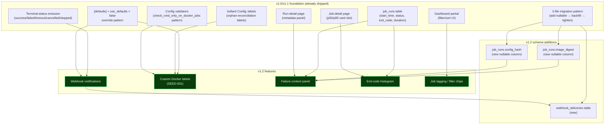

# Feature Research — v1.2 (Operator Integration & Insight)

**Domain:** Self-hosted Docker-native cron scheduler with web UI — Cronduit v1.2 milestone scope only
**Researched:** 2026-04-25
**Confidence:** HIGH on webhooks (Standard Webhooks spec + Svix + GitHub conventions verified), HIGH on Docker labels (SEED-001 already locks the design), HIGH on exit codes (Linux/Docker conventions are decades old), MEDIUM on tagging UX (no single dominant convention; multiple valid shapes), MEDIUM-HIGH on failure-context (drawing from Sentry / Cronitor / Healthchecks patterns, no single "the way")

## Executive Summary

v1.2 layers five additive features on top of the v1.1.0 codebase. Three of them — webhooks, Docker labels, and tagging — are well-trodden ground in the operator-tools ecosystem with clear conventions to copy. Two of them — failure context on run detail, and per-job exit-code histogram — are more cronduit-shaped: they exist as scattered features in adjacent products (Sentry's "First Seen", Cronitor's exit-code alerting, Komodor's exit-code reference) but have no canonical UX. Cronduit gets to define what good looks like for its homelab + Docker-native posture.

The biggest research finding is that the **webhook** feature is the only one where v1.2 must commit to specific external contracts (header names, signature algorithm, retry schedule) at requirement-write time, because operators will write receiver code against them and we cannot churn the contract in v1.3. The **Standard Webhooks** spec ([standard-webhooks/standard-webhooks](https://github.com/standard-webhooks/standard-webhooks/blob/main/spec/standard-webhooks.md)) is the right anchor: HMAC-SHA256, three required headers (`webhook-id`, `webhook-timestamp`, `webhook-signature`), signed content `id.timestamp.payload`, with a recommended retry schedule spanning ~75 hours. Cronduit doesn't need that long a window for a homelab tool — 3 attempts over ~10 minutes is the right fit and aligns with the locked `[defaults]` description in PROJECT.md.

For **Docker labels**, SEED-001 already locks the design. Research only confirmed that a `cronduit.*` reserved namespace is the right convention (Docker's [own docs](https://docs.docker.com/engine/manage-resources/labels/) recommend reverse-DNS prefixing for tooling; Traefik does this with `traefik.*`), and that the v1.2 scope should NOT add env-var overlay or `cronduit_*` synonyms — the TOML file is already the source of truth and a second config surface would muddy reload semantics.

For **failure context**, the cheap signals operators consume are: time-based (first-failure timestamp, consecutive-failure streak, last-successful-run link) plus identity-based (image digest delta, config hash delta). Two additional cheap signals worth considering: **scheduler-fire-time vs run-start-time skew** (already on the run row) and **duration vs typical p50** (we already compute p50 in v1.1). All five fit on the existing run-detail page as an inline panel — a separate "Why did this fail?" page would scatter UX.

For **per-job exit-code histogram**, the right shape is **bucket by raw exit code** with named-meaning tooltips for the well-known ones (0, 1, 2, 124, 125, 126, 127, 137, 139, 143). Last-seen-per-code alongside count is a Cronitor-style touch worth adding cheaply. Do NOT collapse to "0 vs non-zero" — that loses the signal a homelab operator most cares about (OOM-killed `137` vs application error `1`).

For **tagging**, the right shape is **multi-tag per job, lowercase-normalized, alphanumeric + dash, server-side validation, URL-query-string filter persistence, chip-toggle filter UX**. Saved-server-side filters are out of scope for v1.2 — they imply a user model we don't have.

## Feature Landscape

### Table Stakes (v1.2 — Operators Expect These)

These are features where absence makes the v1.2 milestone feel half-baked. Each has at least one direct competitor implementation we're matching.

| Feature | Why Expected | Complexity | Notes |
|---------|--------------|------------|-------|
| **Webhook URL + state-filter list per job** | Every adjacent tool (Healthchecks.io, ofelia, Drone, Cronitor) lets operators pick which states fire a webhook. State filters are the default selectivity knob. | LOW | `url: String`, `states: Vec<TerminalStatus>` — defaults `["failed", "timeout", "stopped"]`. Inherit from `[defaults]` with `use_defaults = false` override (matches SEED-001 / labels). |
| **HMAC-SHA256 signature header** | Industry-standard since GitHub popularized it ~2014. SHA-256 is the universal choice across [Stripe, GitHub, CircleCI, Zendesk, Shopify, Okta](https://inventivehq.com/blog/how-hmac-webhook-signatures-work-complete-guide). Operators expect to copy a verifier from any tutorial. | LOW | Use Standard Webhooks scheme: `webhook-signature: v1,<base64-sig>` over `webhook-id.webhook-timestamp.payload`. |
| **Webhook delivery retry with exponential backoff + jitter** | Universal across [Hookdeck](https://hookdeck.com/outpost/guides/outbound-webhook-retry-best-practices), [Svix](https://www.svix.com/resources/webhook-best-practices/retries/), Stripe, Slack. A webhook that fails once and never retries is a footgun. ±20% jitter is the convention. | LOW | 3 attempts: t=0s, t≈30s (24-36s with jitter), t≈300s (240-360s). After 3 failures, persist as `delivery_failed` and surface in UI. |
| **Distinguish retryable vs permanent failure** | Convention: 5xx + 408 + 429 + connection timeout = retry; 4xx (except 408/429) = give up. Hammering a 401 is rude. | LOW | Standard treatment. Document the rule in README. |
| **Inspectable webhook delivery log per job** | Every webhook tool ships this — Stripe's "Recent deliveries" page, Healthchecks.io webhook activity, ofelia run history. Operators need "did the alert actually go out?" visibility. | MEDIUM | New table `webhook_deliveries` — `(job_id, run_id, url, attempt, status_code, response_body_excerpt, sent_at, latency_ms, outcome)`. Inline panel on job detail page; bounded retention (e.g. last 50 per job, follows existing log-retention pattern). |
| **Custom Docker labels merged onto spawned containers (SEED-001)** | Most common homelab integration pattern (Traefik routing, Watchtower exclusion, backup label filtering) is blocked today. ofelia and docker-crontab support some flavor; cronduit emits only its internal labels. | LOW | SEED-001 locks: `labels: Map<String, String>` in `[defaults]` + `[[jobs]]`, type-gated to `docker` jobs, `cronduit.*` reserved, `use_defaults = false` replaces, otherwise per-job-wins on collision. |
| **Reserved-namespace validation for operator labels** | Docker's [own labelling guidance](https://docs.docker.com/engine/manage-resources/labels/) mandates reverse-DNS prefixing; `com.docker.*`, `io.docker.*`, `org.dockerproject.*` are reserved. Traefik reserves `traefik.*`. Cronduit must reserve `cronduit.*` for the same reason — operator labels under `cronduit.*` would collide with internal orphan-reconciliation labels. | LOW | New validator in `src/config/validate.rs` per SEED-001. Fail config validation at load time with GCC-style error pointing at the offending key. |
| **First-failure timestamp shown on a failed run** | Sentry's "First Seen" is canonical for error-tracking UX. The signal answers "is this brand-new or has it been failing for a week?" without scrolling run history. | LOW | Already computable from `job_runs` — `MIN(start_time) WHERE job_id=? AND status='failed' AND start_time >= last_success_time`. Renders as "First failure: 2 hours ago" inline. |
| **Consecutive-failure streak counter** | Same axis as first-failure but more actionable — "this job has failed 4 times in a row" tells the operator whether to investigate this run or wait for a pattern. Healthchecks.io and Cronitor both expose this. | LOW | Computed from `job_runs` via terminal-status sequence scan; cached on the run-detail render path. |
| **Link to last successful run** | Sentry / GitLab CI / Cronitor all do this. Operators want to compare logs/config/duration between the last-known-good and the failing run with one click. | LOW | Single SELECT `MAX(start_time) WHERE job_id=? AND status='success'`; render as breadcrumb-style link. |
| **Image digest delta (Docker jobs only)** | When a Docker job starts failing right after an image bump, the digest delta is the smoking gun. Watchtower auto-updates make this a real homelab failure mode. | MEDIUM | Requires recording `image_digest` on `job_runs` at run-start (new nullable column + bollard `inspect_image` call). Compare current run's digest with last successful run's digest; render as "Image changed: `sha256:abc` → `sha256:def`" + delta highlight. |
| **Config hash delta** | Did the config change recently? Cheap signal that's easy to compute (hash the resolved per-job config struct) and hard to miss when reading a failure UI. | LOW | `job_runs.config_hash` (new nullable column) — store SHA-256 of the resolved config struct at run-start. Compare with last successful run's hash. |
| **Per-job exit-code histogram (last N runs)** | Cronitor's job-detail dashboard shows exit-code distribution. Komodor's [container-exit-codes guide](https://komodor.com/learn/exit-codes-in-containers-and-kubernetes-the-complete-guide/) confirms the bucketing operators care about (0, 1, 125-127, 137, 139, 143). For a Docker-native homelab tool, distinguishing OOM-kill (137) from app-error (1) from missing-binary (127) is the headline diagnostic. | LOW | Server-rendered card on job detail page (mirrors v1.1's p50/p95 card). Group-by `exit_code`, `COUNT(*)`, `MAX(start_time) AS last_seen` over the last 100 runs. |
| **Named exit-code tooltips for well-known codes** | Operators won't memorize `137 = SIGKILL = OOM-killed-by-host`. Komodor's reference is the canonical lookup. Cronicle, Cronitor, and dkron either expose raw codes or omit the dimension; cronduit can do better cheaply. | LOW | Hard-coded lookup table in Rust: `0→"success", 1→"general error", 2→"misuse", 124→"timeout (coreutils)", 125→"docker run failed", 126→"command not executable", 127→"command not found", 128→"invalid exit", 130→"SIGINT (Ctrl-C)", 137→"SIGKILL (often OOM)", 139→"SIGSEGV (segfault)", 143→"SIGTERM (graceful)"`. Render as `137`. |
| **Multi-tag per job (`tags = ["backup", "weekly"]`)** | Multi-tag is the dominant convention in monitoring/scheduler tools (Cronitor, Healthchecks.io, Datadog). Single-tag would frustrate the homelab operator who wants to slice by both `env=prod` and `category=backup`. | LOW | TOML field on `[[jobs]]`, optional; deserialize as `Option<Vec<String>>`. |
| **Tag normalization at config load** | UX disaster otherwise — `Backup`, `BACKUP`, `backup` all become separate filter chips. Industry-standard normalization is lowercase + trim + alphanumeric/dash only ([UI tagging conventions](https://schof.co/tags-ux-to-implementation/)). | LOW | Single regex pass at config-validate time; reject (don't silently mutate) tags that don't match `^[a-z0-9][a-z0-9-]{0,30}$`. Failing loudly is friendlier than silent mutation. |
| **Tag filter chips on dashboard** | Industry-standard dashboard UX since ~2018; Datadog, Sentry, Cronitor all do chip-toggle multi-select with "Clear all". Server-rendered with HTMX query-param swap fits cronduit's stack. | LOW | `?tags=backup,weekly` query string drives a `WHERE tags && ARRAY[...]` filter (or LIKE-based for SQLite where we'll store tags as a JSON or comma-separated string). Toggling a chip swaps the dashboard partial. |

### Differentiators (Cronduit-Specific)

These are features that go beyond what adjacent tools ship, leaning on Cronduit's homelab + Docker-native posture.

| Feature | Value Proposition | Complexity | Notes |
|---------|-------------------|------------|-------|
| **Standard Webhooks v1 spec adherence** | Most cron tools (ofelia, dagu, Cronicle) ship ad-hoc webhook formats. Cronduit can adopt the [Standard Webhooks](https://github.com/standard-webhooks/standard-webhooks) spec out of the box — `webhook-id`/`webhook-timestamp`/`webhook-signature` headers, `id.timestamp.payload` signing — so operators can verify with off-the-shelf libraries (svix-webhooks, webhook-verifier crates). One-line documentation: "we follow the Standard Webhooks spec". | LOW | Pure protocol decision; the actual signing math is the same as a homemade scheme. The win is operator trust + zero custom verifier code. |
| **Webhook payload exposes Cronduit-native fields** | A webhook from cronduit with `{job_run_number: 42, job_name: "backup-postgres", status: "failed", duration_seconds: 12.4, exit_code: 137, image_digest: "sha256:..."}` is immediately useful to a homelab Slack bot. Generic schedulers ship sparser payloads. | LOW | JSON shape is small surface area; lock the field names at requirement-write time so v1.3+ can extend without breaking. |
| **Image-digest delta as a first-class failure signal** | Watchtower-driven homelabs auto-rev images and "this used to work" is the #1 confusion. Surfacing the digest delta in the failure-context panel is uniquely valuable for the homelab + Docker-native posture. | MEDIUM | Requires the new `job_runs.image_digest` column; reuses the v1.0 `bollard` plumbing. The competitive moat: no other Docker-aware scheduler does this. |
| **Config-hash delta as a first-class failure signal** | "Did I just change something?" is the operator's first instinct on a fresh failure. Cronduit owns the config-as-source-of-truth model, so the resolved config struct is available, hashable, and meaningful. | LOW | Stable-key serialization → SHA-256. Cheap. |
| **Exit-code histogram with named meanings** | Cronitor exposes raw codes; Cronicle doesn't bucket. Cronduit's "137 = SIGKILL (often OOM)" tooltip with last-seen-timestamp is a homelab-tier diagnostic that adjacent tools don't ship. | LOW | Static lookup table; the value is the editorial choice (which codes get a label, which stay raw). |
| **`cronduit.*` reserved namespace explicitly documented** | SEED-001's reserved-namespace validator is rare in scheduler tooling — most just hope for no collisions. Documenting `cronduit.run_id` / `cronduit.job_name` as reserved (and rejecting operator labels in that prefix at config load) hardens the orphan-reconciliation contract for the long haul. | LOW | Already locked at SEED-001. Worth calling out in the README as a feature, not a footnote. |
| **Tag chips integrate with the existing terminal-green design system** | The chip styling fits the design system without inventing new tokens. Doesn't sound like a feature, but it preserves the aesthetic that's a stated cronduit differentiator. | LOW | Tailwind + existing token palette. |

### Anti-Features (Do NOT Build for v1.2)

These are real operator requests we will hear post-launch. Documenting them here as out-of-scope prevents scope creep mid-milestone.

| Anti-Feature | Why Requested | Why Problematic | What to Do Instead |
|--------------|---------------|-----------------|-------------------|
| **Webhook payload templating (Handlebars / Jinja / `${VAR}` substitution)** | Operators want to "pre-format for Slack" without a middleware. Drone, Healthchecks, and Sumo Logic [all support](https://www.sumologic.com/help/docs/alerts/webhook-connections/slack/) this. | Templating is its own product surface — escaping rules, error handling on missing vars, validation, security review for SSTI patterns, performance for large templates. The footprint dwarfs the rest of v1.2. | Ship a JSON payload only. Document the cronduit→Slack bridge pattern using a 10-line shell receiver in the README. Revisit templating in v1.3+ if demand is loud. |
| **Email / SMTP / Slack-direct / Discord-direct notification channels** | "I just want it in Slack." | Each channel adds auth, retry semantics, formatting choices, and ongoing maintenance as APIs evolve. Healthchecks.io and Cronicle both built this and report ongoing pain. | Webhook-only in v1.2. Operators wire Slack/Discord/email via a webhook-receiver service or n8n / Pipedream. PROJECT.md already declares email out of scope. |
| **Webhook templating for the URL itself** (`https://example.com/webhook?job=${JOB}`) | "I want different jobs to hit the same webhook with different paths." | Same templating problem at smaller scale; same conclusion. Per-job URLs already give the operator full control. | Use a different `url` per job. |
| **Configurable retry schedule per job** | "I want 5 attempts over an hour." | One more knob multiplies the test matrix. The 3-attempt / ~10 min schedule is opinionated for a reason. | Lock the schedule at the milestone level. Reconsider if a real operator pings asking for it. |
| **Circuit breaker per webhook URL** | "If example.com is down, stop hammering for an hour." | Real for SaaS-scale webhook systems (Svix, Hookdeck) where a single bad endpoint can saturate a sender. Not a credible problem at homelab scale (3 attempts, then stop, per delivery). | The 3-attempt cap IS the circuit breaker for v1.2. Per-endpoint pause-after-N-consecutive-failures is a v1.3+ feature if anyone asks. |
| **Dead-letter queue / replay UI** | Svix-style "deliver this failed webhook again." | Implies a redelivery mechanism, an admin UI button, and a re-signing flow (replay protection complicates this). | Persist `webhook_deliveries` rows so operators can see WHY it failed; if they need to replay, a `cronduit webhook resend <delivery_id>` CLI is a future v1.3 minimal addition. |
| **Webhook payload for `running` (start) events** | "Tell me the moment a job starts." | Doubles webhook traffic, adds a non-terminal state to the contract, and most operators only act on terminal states. v1.0 already emits Prometheus + structured logs for run-start observability. | Terminal states only: `success`, `failed`, `timeout`, `cancelled`, `stopped`. (`running` is excluded.) |
| **Per-tag webhooks / "alert all backup jobs"** | "Send me one webhook for any failure in `tags=[backup]`." | Ties tagging (UI-only feature) to webhooks (per-job config) — a coupling we explicitly reject in PROJECT.md (`v1.2 tag scope = UI-only filter`). Aggregation belongs in Alertmanager, not cronduit. | Operators configure webhooks per-job. If they want tag-level fan-out, they front it with a webhook receiver that filters on `tags` in the payload. |
| **Tag metadata (descriptions, colors, icons)** | "I want my `prod` tag to be red." | Each metadata dimension is its own column, UI surface, and persistence story. v1.2 is filter chips, not a tag-management product. | Tags are strings. Render in the existing terminal-green theme. |
| **Tag-based metrics labels (`cronduit_runs_total{tag="backup"}`)** | "Let me alert on tag-failure rate in Prometheus." | Unbounded cardinality risk — exactly what the v1.0 metrics design avoided with bounded labels. | UI-only filter chips per the PROJECT.md decision. Operators alert on `job` label or build aggregation in their Prometheus rules. |
| **Run-detail "Why did this fail?" auto-generated narrative** | "Tell me in English what's wrong." | LLM territory. Out of scope for v1 forever. | Surface raw signals (digest delta, config hash, streak, last success). Operator decides. |
| **Config hash delta linked to git commit / diff view** | "Show me the actual config that changed." | Implies a config-history table, a diff renderer, and SHA-vs-text mapping. Useful but big. | Show the hash delta. Operator looks at their git log. |
| **Image-digest "subscribe to upstream changes" / digest-pinning helper** | "Warn me before pulling a new digest." | Orthogonal to scheduling — feels like Watchtower territory. | Out of scope; operators pin digests in `image:` if they want stability. |
| **Histogram of stdout/stderr line counts, durations, etc.** | "Add more histograms." | Each new card is real UI weight. Exit-code histogram is in scope; nothing else. | Done at exit-code histogram. |
| **Saved/named filter views per user** | "I want a tag preset for my Sunday-morning review." | Implies a user model — exactly what v1 doesn't have (no auth in v1, deferred to v2). | URL query strings persist filters; operators bookmark URLs. |
| **Tag autocomplete / typeahead on a search box in addition to chips** | "Both!" | Two UI surfaces for the same job; chips already cover the case. | Chip-toggle only for v1.2. If users have hundreds of tags (they won't) revisit. |
| **Custom webhook headers per job** (`headers = { "X-Auth-Token" = "..." }`) | "My receiver wants a bearer token." | Reasonable, but adds a per-job map column AND operators expect interpolation (`${ENV}`) which adds env-substitution at webhook-send time. Bigger surface than first appears. | Out of scope for v1.2. The HMAC signature IS authentication. If a receiver also needs a token, the operator can put a thin proxy in front. Revisit v1.3 if demand surfaces. |
| **Per-job override of the retry schedule** | (See above.) | Same. | Locked schedule. |
| **Docker labels via env-var overlay** (e.g., `CRONDUIT_LABELS_JOB1=key=val`) | "I want to set labels at compose-up time without touching the TOML." | Adds a second config surface that fights "TOML is source of truth" + reload semantics get confused (does an env-var change retrigger a reload? what fires the file-watch?). The existing `${ENV_VAR}` interpolation in TOML values already covers the "I want to inject at compose-up" case. | Operators use `${ENV_VAR}` inside the TOML `labels = { foo = "${MY_VAR}" }` map. (Confirm at requirement-write time that `${ENV_VAR}` interpolation works in label *values* — should be free since v1.0 interpolates the whole TOML string before parsing.) |
| **Internal `cronduit.*` synonym labels we might add later** | (Operator question: "should the reserved namespace include any labels we don't yet emit?") | We currently emit `cronduit.run_id` and `cronduit.job_name`. Reserving the whole `cronduit.*` namespace already future-proofs additions like `cronduit.job_run_number`, `cronduit.executor_type`, `cronduit.config_hash`, `cronduit.image_digest`, etc., without further design work. | The SEED-001 design is correct — reserve the whole namespace. v1.2 emits the existing two labels; future versions can add more without operators having to migrate. |

## Feature Dependencies

### Dependency Notes

- **Webhooks depend on terminal-status emission** — v1.0/v1.1 already emit `success`/`failed`/`timeout`/`cancelled`/`stopped` at the scheduler-loop level. The webhook dispatcher hooks into that emission point (likely after the DB write in `mark_run_terminal` or equivalent) — no scheduler-core surgery required.
- **Webhooks AND Docker labels both reuse the `[defaults]` + `use_defaults = false` override pattern** — the existing TOML schema already handles this for other fields; both features extend it to `webhook` and `labels` blocks. Decision-locked at SEED-001 for labels; webhooks should follow identical semantics for consistency.
- **Failure context depends on `job_runs.image_digest` and `job_runs.config_hash` columns existing FIRST** — these are new nullable columns added via the v1.1-pattern three-file migration (add nullable → backfill from current run state where possible → leave nullable since pre-v1.2 runs have no value). The failure-context panel can render gracefully when columns are NULL ("no prior digest recorded"), so the migration ordering only constrains the *write* side: capture digest+hash on run-start before the failure-context panel can compute deltas.
- **Image-digest capture depends on bollard `inspect_image` plumbing** — already present in v1.0's image-pull path. The new write happens at run-start (after the image is resolved, before the container is created). Adds one bollard API call per Docker job run; cheap.
- **Exit-code histogram is a pure read-side feature** — no schema changes needed; just a new SELECT against existing `job_runs.exit_code`. Lowest-risk feature in v1.2.
- **Tagging filter chips depend only on the dashboard partial existing** — already present from v1.0. Adds one new TOML field (`tags`), one normalization+validator, one query-string filter, one chip render. No schema migration if tags are stored only in the in-memory job model (re-derived from config on load); a `jobs.tags` column would be needed only if we wanted DB-side filtering, which we probably do for consistency with the existing dashboard query shape — flag for the requirements pass.
- **Webhooks and tags do NOT interact in v1.2** — explicit decision in PROJECT.md (tag scope = UI-only). No "alert all jobs in tag X" feature. Tags don't appear in webhook payloads either (we lock that at requirement-write time as a deliberate omission so v1.3 can add it without breaking).
- **Failure context and exit-code histogram are independent** — the histogram aggregates across all runs; the failure context is per-run. They share the same data source (`job_runs.exit_code`) but render in different panels.
- **Custom Docker labels do NOT affect webhook payloads** — the `image_digest`/`config_hash` already covers the "what container ran?" question. Surfacing operator-defined labels in webhook payloads is a v1.3 question.

## MVP Definition

### Launch With (v1.2.0)

The minimum to call v1.2 a coherent milestone. Each item maps to at least one REQ-ID at requirement-write time.

**Webhook notifications:**
- [ ] Per-job `webhook = { url = "...", states = [...], hmac_secret = "${ENV}" }` block in `[[jobs]]`
- [ ] `[defaults]` `webhook` block with `use_defaults = false` override semantics matching SEED-001
- [ ] HMAC-SHA256 signing per Standard Webhooks spec (`webhook-id`, `webhook-timestamp`, `webhook-signature` headers)
- [ ] JSON payload with `{type: "run.terminal", id, timestamp, data: {job_name, job_run_number, status, exit_code, duration_seconds, started_at, finished_at, image_digest?, run_url}}`
- [ ] 3-attempt retry: t=0s, t≈30s, t≈300s (exponential backoff, ±20% jitter)
- [ ] Retryable: 5xx, 408, 429, network/timeout. Permanent: 2xx (success), other 4xx (give up)
- [ ] `webhook_deliveries` table + bounded retention (e.g., last 50 per job)
- [ ] Inline panel on job detail showing recent deliveries with status code, latency, attempt count
- [ ] Loud structured-log event on every delivery (success, retry, give-up)
- [ ] Document the verifier snippet in README (Rust + Python + bash) — operators copy-paste

**Custom Docker labels (SEED-001):**
- [ ] `labels: Map<String, String>` in `[defaults]` and `[[jobs]]`
- [ ] Merge semantics: `use_defaults = false` → replace; otherwise per-job-wins on collision
- [ ] Reserved-namespace validator (`cronduit.*` prefix → config validation error at load)
- [ ] Type-gated validator (`labels` on command/script jobs → config validation error)
- [ ] Plumbed through to `bollard::Config::labels` at the existing label-building site
- [ ] Integration test that spawns a Docker job with operator labels and asserts they land via `inspect_container`
- [ ] `${ENV_VAR}` interpolation works in label values (free if v1.0's interpolation is string-level pre-parse)
- [ ] README + `examples/cronduit.toml` updated with realistic Traefik + Watchtower examples

**Failure context panel:**
- [ ] New `job_runs.image_digest` column (nullable, three-file migration)
- [ ] New `job_runs.config_hash` column (nullable, three-file migration)
- [ ] Capture image digest at run-start for Docker jobs (via existing `inspect_image` plumbing)
- [ ] Capture config hash at run-start (SHA-256 over stable-key serialization of resolved config)
- [ ] Inline panel on run detail (only on terminal-failure runs: `failed`, `timeout`, `cancelled`, `stopped`)
- [ ] Render: first-failure timestamp, consecutive-failure streak, link to last successful run, image-digest delta (Docker only), config-hash delta
- [ ] Each signal renders gracefully when missing (e.g., "no prior successful run on record")
- [ ] No deltas computed against pre-v1.2 runs (NULL image_digest / config_hash → "first recorded run")

**Per-job exit-code histogram:**
- [ ] New card on job detail page (mirrors v1.1 p50/p95 card placement)
- [ ] Bucket by raw `exit_code`, COUNT(*), MAX(start_time) AS last_seen, over the last 100 runs
- [ ] Static lookup table for named exit-code meanings (0, 1, 2, 124, 125, 126, 127, 130, 137, 139, 143)
- [ ] Render as small table or bar chart (decide at design pass — terminal-green aesthetic), with named meaning as tooltip
- [ ] N=20 minimum (matches v1.1 p50/p95 minimum); below that → "not enough data yet"

**Job tagging / grouping:**
- [ ] `tags: Vec<String>` field on `[[jobs]]` (optional)
- [ ] Normalization at config-load: lowercase, trim, regex-validate `^[a-z0-9][a-z0-9-]{0,30}$`; reject (don't silently mutate) on mismatch
- [ ] Reject duplicate tags per job at config-load
- [ ] Filter chips on dashboard: `?tags=backup,weekly` query string drives the filter
- [ ] Multi-select via chip toggle; "Clear all" UI; chip count badge
- [ ] Tags rendered as small chips on each dashboard job card
- [ ] Tags do NOT appear in webhook payloads, metrics labels, or search index (UI-only locked in PROJECT.md)
- [ ] Storage: tags persisted on the in-memory `Job` and (likely) in a `jobs.tags` column for query consistency — flag for requirements pass to confirm shape

### Add After Validation (v1.2.x patches)

Things that may surface in rc UAT and patch into v1.2.x without breaking the milestone shape.

- [ ] `cronduit webhook test <job_name>` CLI subcommand — fires a synthetic delivery against the configured URL for end-to-end verification (operators ask for this once they've configured 5 webhooks)
- [ ] Webhook delivery panel sorts/filters (last 7 days, only failures, etc.)
- [ ] Histogram chart rendering polish (terminal-green bar chart vs table) if rc UAT prefers one over the other
- [ ] Tag chip styling tuning (size, max-display-count before "+N more", overflow behavior)

### Future Consideration (v1.3+)

Operator requests we will hear during/after v1.2 rollout that are correct to defer.

- [ ] Per-job custom HTTP headers on webhooks (bearer tokens, etc.)
- [ ] Per-tag webhook fan-out (depends on first verifying tagging is the right grouping primitive)
- [ ] Webhook payload templating (only if a real operator argues for it)
- [ ] `cronduit webhook resend <delivery_id>` for replay
- [ ] Tag metadata (descriptions, colors)
- [ ] Tag-based metrics labels (only if we solve the cardinality problem with an explicit allowlist)
- [ ] Per-job retry schedule overrides on webhooks
- [ ] Circuit breaker per webhook URL (only if multi-job-same-URL becomes a footgun in practice)
- [ ] Image-digest history page ("show me every digest this job has run with")

### Never (explicit non-goals through v2)

- Email / SMTP / direct Slack / direct Discord notifications (explicit out-of-scope in PROJECT.md)
- LLM-generated failure narratives
- Tag autocomplete typeahead in addition to chips
- Saved server-side filter views (depends on user model = post-v2)
- Webhook payload templating beyond plain JSON
- Webhooks for non-terminal states (`running`, `enqueued`, etc.)

## Feature Prioritization Matrix

| Feature | User Value | Implementation Cost | Priority |
|---------|-----------|---------------------|----------|
| Webhook URL + state filter + JSON payload | HIGH | LOW | P1 |
| HMAC-SHA256 + Standard Webhooks headers | HIGH | LOW | P1 |
| 3-attempt retry with backoff + jitter | HIGH | LOW | P1 |
| `webhook_deliveries` log + UI panel | HIGH | MEDIUM | P1 |
| `[defaults]` + `use_defaults = false` for webhook block | MEDIUM | LOW | P1 |
| Custom Docker labels (SEED-001 full scope) | HIGH | LOW | P1 |
| Reserved-namespace + type-gated validators | MEDIUM | LOW | P1 |
| `job_runs.image_digest` + `job_runs.config_hash` columns | HIGH | MEDIUM | P1 |
| First-failure / streak / last-success on run detail | HIGH | LOW | P1 |
| Image-digest delta on run detail | HIGH | MEDIUM | P1 |
| Config-hash delta on run detail | MEDIUM | LOW | P1 |
| Exit-code histogram card | MEDIUM | LOW | P1 |
| Named exit-code meanings (tooltips) | MEDIUM | LOW | P1 |
| `tags` field + normalization + validators | HIGH | LOW | P1 |
| Tag filter chips on dashboard | HIGH | LOW | P1 |
| Tag chips on job cards | MEDIUM | LOW | P1 |
| `cronduit webhook test <job>` CLI | LOW | LOW | P2 |
| Webhook delivery panel filters | LOW | LOW | P2 |
| Per-job custom HTTP headers on webhooks | LOW | MEDIUM | P3 (v1.3+) |
| Webhook payload templating | LOW | HIGH | P3 (v1.3+) |
| Per-tag webhook fan-out | LOW | HIGH | P3 (v1.3+) |
| Tag metadata (descriptions, colors) | LOW | MEDIUM | P3 (v1.3+) |
| Tag-based metrics labels | LOW | HIGH | NEVER (cardinality) |
| Email/Slack/Discord direct channels | LOW | HIGH | NEVER (out of scope) |

**Priority key:**
- **P1** — Must ship in v1.2.0; absence makes the milestone feel incomplete
- **P2** — Ship in v1.2.x patch; low-risk follow-up
- **P3** — Defer to v1.3+ pending demand
- **NEVER** — Explicit non-goal

## Competitor Feature Analysis

Cross-tool survey for the v1.2 features only. v1.0/v1.1 features were covered in the v1.0/v1.1 research and are not re-litigated here.

### Webhooks

| Aspect | ofelia | dagu | Healthchecks.io | Drone CI plugin | Prometheus Alertmanager | Cronduit (target) |
|--------|--------|------|------------------|------------------|-------------------------|-------------------|
| Per-job webhook URL | Partial (Slack channel only) | Yes (per-DAG, with token auth) | Yes (per-check, separate up/down URLs) | Yes (per-pipeline) | Receiver-config (group-level) | **Yes (per-job, `[defaults]` + override)** |
| State filter | Slack on failure | Lifecycle handlers (success/failure/abort) | Up/down events | Build complete | Firing/resolved | **Yes — `states = ["failed", "timeout", "stopped"]`** |
| Signing scheme | None | Token auth | None native | None native | None native | **HMAC-SHA256, Standard Webhooks v1** |
| Retry semantics | None documented | Built-in retry on send failures | 30s timeout, **2 retries** | None native (plugin choice) | Configurable (`group_wait`/`repeat_interval`) | **3 attempts, exp backoff w/ jitter** |
| Retry backoff | n/a | n/a | Linear short delay | n/a | Linear (`repeat_interval`) | **Exponential (0s/30s/300s, ±20%)** |
| Dead-letter / inspectable log | No | Logs only | Yes (recent webhook activity) | Logs only | Notification log | **Yes (`webhook_deliveries` table + UI panel)** |
| Payload format | Slack-shaped JSON | Configurable (handler script) | URL-encoded body or JSON, with `$NAME`/`$STATUS` placeholders | Handlebars template | Specific JSON schema (alerts array) | **Standard Webhooks JSON shape** |
| Templating | n/a | Script-based | `$NAME`/`$STATUS` placeholders in body | Handlebars | Go templates | **No (anti-feature for v1.2)** |
| Per-job HMAC secret | n/a | n/a | n/a | n/a | n/a | **Yes — `hmac_secret = "${ENV}"`, opt-in** |

**Verdict:** No tool in the cron/scheduler space ships HMAC-signed webhooks following the Standard Webhooks spec. Cronduit can lead this.

### Custom Docker labels

| Aspect | ofelia | docker-crontab | dagu | Cronicle | Cronduit (target) |
|--------|--------|---------------|------|----------|-------------------|
| Per-job labels in config | Partial (label-driven config IS the model) | No (uses host crontab) | n/a (not Docker-native) | n/a (not Docker-native) | **Yes (`labels = { ... }`)** |
| `[defaults]` inheritance | n/a | n/a | n/a | n/a | **Yes (matches existing override pattern)** |
| Reserved namespace | None | n/a | n/a | n/a | **Yes (`cronduit.*`, validated at load)** |
| Type gating | n/a | n/a | n/a | n/a | **Yes (`docker` jobs only)** |
| Bollard direct integration | Yes | n/a (CLI) | n/a | n/a | **Yes (already plumbed in v1.0)** |

**Verdict:** SEED-001 design is correct. No competitor in the homelab space does the reserved-namespace + type-gated combination — operators get told their `cronduit.foo = "bar"` label was silently dropped and don't find out until weeks later. Cronduit's load-time validation is a real differentiator.

### Failure context

| Aspect | Sentry | GitLab CI | Cronitor | Healthchecks.io | Cronicle | Cronduit (target) |
|--------|--------|-----------|----------|------------------|----------|-------------------|
| First-failure timestamp | **Yes ("First Seen")** | No | Yes | Yes | No | **Yes** |
| Consecutive failure streak | Indirect (event count) | No | Yes (alerting threshold) | Yes (after-N-failures alert) | No | **Yes** |
| Link to last successful run | n/a | Yes (pipeline list) | Yes | Yes (last ping) | Partial | **Yes** |
| Image-digest delta | n/a | n/a | n/a | n/a | n/a | **Yes (Docker-native unique)** |
| Config-hash delta | n/a | Indirect (commit SHA) | n/a | n/a | n/a | **Yes (config-as-source-of-truth unique)** |
| Single panel UX placement | Issue-detail page | Pipeline-detail | Job-detail page | Check-detail | Job-detail | **Run-detail inline panel** |
| Auto-narrative ("Why did this fail?") | Partial (Suspect Commits) | No | No | No | No | **No (anti-feature)** |

**Verdict:** Cronduit's failure-context panel borrows the right pieces from Sentry / Cronitor and adds two homelab-tier signals (image digest + config hash) that adjacent tools lack. The two new columns and a single run-detail panel is the right scope.

### Per-job exit-code histogram

| Aspect | Cronicle | dkron | Cronitor | Komodor (K8s) | Grafana (cron-manager) | Cronduit (target) |
|--------|----------|-------|----------|---------------|------------------------|-------------------|
| Exit-code captured per run | Yes | Yes | Yes | Yes | Yes | **Yes (since v1.0)** |
| Histogram / distribution UI | No | No | Yes (alerting on specific code) | n/a (deep-dive ref material) | Yes (in Grafana panel) | **Yes (job-detail card)** |
| Named meanings for codes | No | No | No | **Yes (reference doc)** | No | **Yes (inline tooltips)** |
| Last-seen timestamp per code | No | No | Partial | n/a | Possible via PromQL | **Yes** |
| Bucketing strategy | Raw codes | Raw codes | Filterable | Reference table | Raw codes | **Raw codes + named tooltips** |

**Verdict:** Nobody in the cron/scheduler space ships a per-job exit-code histogram with named-meaning tooltips. The Komodor reference is the right intellectual anchor for which codes get a label. Pure read-side feature; cheapest of the v1.2 set.

### Job tagging

| Aspect | Cronitor | Datadog | Cronicle | dkron | Healthchecks.io | Cronduit (target) |
|--------|----------|---------|----------|-------|------------------|-------------------|
| Tags per job | Yes | Yes (key:value) | Yes (categories) | Yes | Yes | **Yes (string list)** |
| Multi-tag | Yes | Yes | Limited | Yes | Yes | **Yes** |
| Normalization | Lowercase | Lowercase + key:value | None (case-sensitive) | None | Lowercase | **Lowercase + alnum-dash regex** |
| Filter chips on dashboard | Yes | Yes | Limited | Limited | Yes | **Yes** |
| URL-state filter persistence | Yes | Yes | No | No | Yes | **Yes (?tags=...)** |
| Tag-based metrics labels | Yes (with cardinality controls) | Yes (counts as billable dimensions) | n/a | n/a | Yes | **No (UI-only locked in PROJECT.md)** |
| Tag-based webhook fan-out | Yes | n/a | n/a | n/a | Yes | **No (v1.3+ deferred)** |
| Tag metadata (color, description) | Limited | Yes | No | No | No | **No (v1.3+ deferred)** |

**Verdict:** Multi-tag with normalization, chips, and URL persistence is the dominant convention. Cronduit ships the well-understood UI-only subset and defers tag-as-coupling-mechanism (metrics labels, webhook fan-out) until usage data justifies it.

## Research Notes — Operator Expectations vs Current v1.2 Scope

These are real operator expectations surfaced by the research that the requirements pass should EXPLICITLY accept or reject. None require scope change; the value is forcing a documented decision.

### Webhooks

1. **Operators expect timestamp tolerance** — Standard Webhooks recommends rejecting deliveries >5 minutes off the receiver's clock. Cronduit's *senders* can't enforce this on the receiver; we just emit `webhook-timestamp` in the header and document the tolerance recommendation in the verifier README snippet.
2. **Operators expect `User-Agent: cronduit/1.2.0` (or similar)** — GitHub uses `GitHub-Hookshot/...`, Stripe uses `Stripe/1.0`, Healthchecks uses its own. Trivial to add; aids receiver-side firewall rules. **Recommend: add as a P1 detail at requirement-write.**
3. **Operators expect `Content-Type: application/json; charset=utf-8`** — universal convention. Trivial.
4. **Operators DO NOT expect `running` events** — confirmed: terminal-state-only is the right scope.
5. **Operators DO NOT consistently expect a webhook for job-config-load events** (e.g., "config reloaded successfully") — Cronduit deliberately doesn't add this for v1.2. Could be a v1.3 addition.
6. **Operators expect a way to silently disable webhooks for a job without removing the config** — CONFIRM this is covered by the existing `enabled = false` job toggle (which suspends the whole job, not just webhooks). If operators want "still run, just don't fire webhooks", that's an additional knob. **Recommend: document the workaround (set `states = []`) and defer a real toggle.**

### Custom Docker labels

7. **Operators expect `${ENV_VAR}` interpolation in label *values*** — confirm at requirement-write that v1.0's TOML interpolation is string-pre-parse, so `labels = { foo = "${MY_VAR}" }` works for free.
8. **Operators expect labels to appear in `docker ps` output of cronduit-spawned containers** — they do, by definition (labels are a Docker feature, not a cronduit projection).
9. **Operators DO NOT expect labels via env-var overlay** — out of scope, decision documented above.
10. **Operators DO NOT expect labels to appear in webhook payloads in v1.2** — out of scope; flag for v1.3 if asked.
11. **Operators may expect cronduit to add internal labels beyond `cronduit.run_id` / `cronduit.job_name` later** — the SEED-001 reserved `cronduit.*` namespace already future-proofs additions like `cronduit.job_run_number`, `cronduit.executor_type`, `cronduit.config_hash`, `cronduit.image_digest`, `cronduit.network_mode`. v1.2 emits the existing two; v1.3+ can add more without churning operator configs.

### Failure context

12. **Operators expect duration-vs-typical-p50 deviation to be visible** — v1.1 already computes p50/p95. Cheap addition: render "this run was 3.2× longer than the p50 over the last 100 runs" in the failure context panel. **Recommend: include as a P1 signal alongside the other deltas.**
13. **Operators expect scheduler-fire-time vs run-start-time skew** — relevant when the scheduler is overloaded or the executor was queued. Already on `job_runs` (firing time vs start time). Cheap addition. **Recommend: include as a P1 signal in the failure-context panel ("started 15s late") when skew >5s.**
14. **Operators expect a "view diff" link on the config-hash delta** — v1.2 ships hash-only. v1.3 could ship a full config-history table + diff view. Document the v1.2 omission.
15. **Operators expect failure-context to render on `timeout` runs the same as `failed` runs** — confirmed; the panel triggers on any non-success terminal status (`failed`, `timeout`, `cancelled`, `stopped`).
16. **Operators DO NOT expect failure-context to surface on `success` runs** — confirmed; the panel is off by default for success.

### Exit-code histogram

17. **Operators expect the histogram to count `stopped` runs (operator-killed) separately or exclude them** — `stopped` runs typically have exit code 137 (we send SIGKILL). They're not "real failures" but they're not "real successes" either. **Recommend: include `stopped` runs in the histogram BUT distinguish via a small visual cue (e.g., different bar color or stacked bar showing `stopped` portion of code 137).** Otherwise the histogram lies about how often a job is actually crashing vs being manually killed.
18. **Operators expect the histogram to mark code `0` (success) prominently** — most runs are `0`; the histogram should not let one giant `0` bar drown out the diagnostic codes. **Recommend: render `0` as a single stat ("142 successes") + render non-zero codes as the actual bar chart.**
19. **Operators expect a clickable filter "show all runs with exit code N" from the histogram** — would require a new run-history filter (currently filter is by status, not by exit code). Defer to v1.3 (Future Requirements list already includes "Run history filters (status, date range, exit code)" for v1.3).

### Tagging

20. **Operators may expect tag-based dashboard URL bookmarking** — covered by URL query string persistence. Document explicitly.
21. **Operators may expect tag-based search on the existing dashboard search box** — confirm at requirement-write whether the existing name-filter and the new tag-filter compose (e.g., `?name=backup&tags=weekly` ANDs them). **Recommend: AND semantics, both filters compose in the same SQL WHERE.**
22. **Operators may expect to see "tag distribution" or "all tags in use" somewhere** — the dashboard chip bar IS this list (it shows every distinct tag). No separate tag-management page needed.
23. **Operators DO NOT expect tags to appear in the `/api/jobs/...` JSON outputs in v1.2** unless we add a `GET /api/tags` for client tooling. Defer; the dashboard partial is the only consumer.
24. **Operators DO NOT expect tag changes to retain across restart without a config edit** — tags are config-driven (in TOML), so they ARE stable across restart. Confirmed.

## Sources

### Webhooks

- [Standard Webhooks Specification](https://github.com/standard-webhooks/standard-webhooks/blob/main/spec/standard-webhooks.md) — `webhook-id` / `webhook-timestamp` / `webhook-signature` headers, `id.timestamp.payload` signing, HMAC-SHA256 with `whsec_`-prefixed base64 secrets, recommended retry schedule (~75 hours)
- [GitHub: Validating webhook deliveries](https://docs.github.com/en/webhooks/using-webhooks/validating-webhook-deliveries) — `X-Hub-Signature-256` original convention, `sha256=<hmac>` format, raw-body signing
- [Inventive HQ: How HMAC Webhook Signatures Work](https://inventivehq.com/blog/how-hmac-webhook-signatures-work-complete-guide) — survey of major providers (Stripe, GitHub, CircleCI, Zendesk, Shopify, Okta) all using SHA-256
- [Svix Webhook Best Practices: Retries](https://www.svix.com/resources/webhook-best-practices/retries/) — exponential backoff + jitter + dead-letter conventions
- [Hookdeck: Outbound Webhook Retry Best Practices](https://hookdeck.com/outpost/guides/outbound-webhook-retry-best-practices) — retryable vs permanent status code rules; ±20% jitter convention
- [Svix Verifying Webhooks Manually](https://docs.svix.com/receiving/verifying-payloads/how-manual) — 5-minute timestamp tolerance convention
- [Healthchecks.io webhook delivery](https://blog.healthchecks.io/2024/10/how-healthchecks-io-sends-webhook-notifications/) — 30s timeout + 2 retries (Healthchecks's specific choice; we go heavier)
- [Prometheus Alertmanager configuration](https://prometheus.io/docs/alerting/latest/configuration/) — webhook receiver payload schema reference (alerts array, status field)
- [Drone CI Webhook Plugin](https://github.com/drone-plugins/drone-webhook) — Handlebars-template payload customization (the templating model we're explicitly avoiding)
- [Dagu YAML Specification](https://docs.dagu.sh/writing-workflows/yaml-specification) — lifecycle handler model + per-DAG webhook auth

### Docker labels

- [Docker docs: Object labels](https://docs.docker.com/engine/manage-resources/labels/) — reverse-DNS prefix convention, reserved namespaces (`com.docker.*`, `io.docker.*`, `org.dockerproject.*`)
- [Traefik Docker provider docs](https://doc.traefik.io/traefik/reference/routing-configuration/other-providers/docker/) — `traefik.*` reserved namespace pattern (the model we're matching with `cronduit.*`)
- Cronduit `.planning/seeds/SEED-001-custom-docker-labels.md` — full design lock for the feature; merge semantics, reserved namespace, type gating

### Exit codes

- [Komodor: Exit Codes in Containers and Kubernetes Complete Guide](https://komodor.com/learn/exit-codes-in-containers-and-kubernetes-the-complete-guide/) — canonical reference for 0, 1, 125-127, 128+N (137, 139, 143). Source for the named-meaning lookup table.
- [TLDP: Appendix E. Exit Codes With Special Meanings](https://tldp.org/LDP/abs/html/exitcodes.html) — Bash exit-code conventions (0, 1, 2, 126, 127, 128, 130, 255)
- [Linux exit status codes guide](https://www.thelinuxvault.net/blog/list-of-exit-codes-on-linux/) — broader Linux exit-code reference

### Failure context UX

- Sentry's "First Seen" / Cronitor's failure tracking — direct UX inspiration for the first-failure / streak / last-success triple
- [GitLab CI pipeline detail patterns](https://docs.gitlab.com/operations/error_tracking/) — "link to last successful run" convention reference

### Tagging UX

- [Smart Interface Design Patterns: Badges vs Pills vs Chips vs Tags](https://smart-interface-design-patterns.com/articles/badges-chips-tags-pills/) — terminology + filter-chip-as-toggle UX
- [Tags - From UX to Implementation (Schof)](https://schof.co/tags-ux-to-implementation/) — normalization patterns (lowercase, special-character removal)
- [Aufait UX: Dashboard Filter Design Guide](https://www.aufaitux.com/blog/dashboard-filter-design-guide/) — filter chip placement and "Clear all" convention
- [Untitled UI: Tags components](https://www.untitledui.com/components/tags) — chip styling reference for design fidelity

### Project context

- `.planning/PROJECT.md` (Active section) — v1.2 feature scope locked at kickoff (2026-04-25)
- `.planning/MILESTONES.md` — v1.0 + v1.1 history reference
- `.planning/seeds/SEED-001-custom-docker-labels.md` — Docker labels seed with all design decisions locked
- `THREAT_MODEL.md` — outbound webhook implications (currently no outbound network in v1.0/v1.1; v1.2 adds the first outbound surface)
- `.planning/milestones/v1.0-research/FEATURES.md` and `.planning/milestones/v1.1-research/FEATURES.md` — prior research patterns (depth, style, sections to match)

---
*Feature research for: Cronduit v1.2 — Operator Integration & Insight*
*Researched: 2026-04-25*
*Scope: Webhooks, Custom Docker labels (SEED-001), Failure context, Exit-code histogram, Job tagging — five features ONLY. v1.0/v1.1 features are out of scope for this document.*
