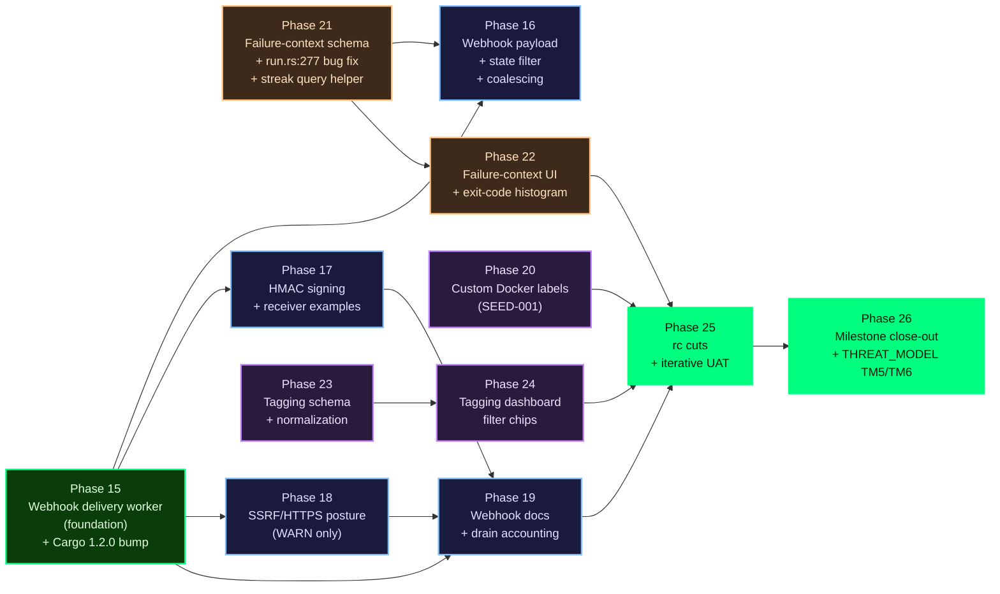

# v1.2 Research Synthesis

**Milestone:** v1.2 — Operator Integration & Insight
**Synthesized:** 2026-04-25
**Inputs:** `STACK.md`, `FEATURES.md`, `ARCHITECTURE.md`, `PITFALLS.md`
**Overall confidence:** HIGH (all integration sites verified by direct source read; crate versions verified against crates.io API 2026-04-25)

---

## Research-Phase Corrections

Cross-referencing the four input docs surfaced two corrections that the requirements + roadmap MUST inherit. Locked here at the top so the requirement language and phase plans cannot relitigate them.

### Correction 1 — Pre-existing bug at `src/scheduler/run.rs:277`

Independently flagged by ARCHITECTURE (§3) and PITFALLS (Pitfall 44).

The variable `container_id_for_finalize` is populated with `docker_result.image_digest.clone()` — not a container ID. So v1.1.0's `job_runs.container_id` column has been silently storing `sha256:...` image digests instead of Docker container IDs.

**Required fix in v1.2 rc.1's migration wave:**
- Add a proper `container_id: Option<String>` field to `DockerExecResult`.
- Plumb the real container ID from `create_container` through `continue_run`.
- Fix `run.rs:277` to populate both `container_id` and `image_digest` columns correctly.
- No data migration — historical deviation ages out via Phase 6's retention pruner.

This is **not optional**. Locking the failure-context image-digest delta on top of broken historical data would compound the bug.

### Correction 2 — Schema gap for `job_runs.config_hash`

Flagged by PITFALLS (Pitfall 45); not anticipated in the original v1.2 scoping conversation.

`jobs.config_hash` exists per-JOB only. Failure-context's "config changed since last success" delta needs a per-RUN config_hash to detect hot-reload-between-successful-runs drift. ARCHITECTURE (§4) proposed using `jobs.updated_at` as a proxy; PITFALLS argues the proxy is insufficient because multiple reloads with no row update on `jobs` (e.g. config touches that don't change a job's content) would be invisible to the proxy.

**Recommendation:** Add `job_runs.config_hash TEXT NULL` in the same migration wave as `image_digest`. Conservative backfill from current `jobs.config_hash` for old rows. Write from `insert_running_run` at fire time.

**Requirements step decision required:** Option A (per-run column, recommended) vs Option B (`jobs.updated_at` proxy, simpler but weaker). Either choice MUST be locked in REQUIREMENTS.md.

---

## Executive Summary

v1.2 is an **expand milestone** layering five features on v1.1.0 with minimal stack delta:

- **Stack:** two new crates (`reqwest 0.12.28` rustls-only + `hmac 0.13` from RustCrypto). Zero hygiene bumps required. No openssl-sys leakage.
- **Scheduler:** loop UNTOUCHED. All five features slot into confirmed integration sites in the existing module tree.
- **Architectural lynch-pin:** webhook isolation. A bounded `mpsc<RunFinalized>(1024)` with a dedicated worker task is the only correct shape — inline HTTP from `continue_run` would let any slow receiver delay the scheduler. New module `src/webhooks/mod.rs`.
- **Cross-feature dependency:** failure-context schema (the new `image_digest` + `config_hash` columns + streak query helper) MUST land before the webhook payload phase, because the payload includes `streak_position` and `consecutive_failures` derived from those queries.
- **Image-digest is already captured in v1.1's code path** at `src/scheduler/docker.rs:240` via `Docker::inspect_container().image`. v1.2's work is purely DB persistence (new nullable column) + the `run.rs:277` bug fix (Correction 1) + UI surfacing.

---

## Integration Map

```mermaid
flowchart TD
    subgraph EXISTING["v1.0 / v1.1 components (UNCHANGED scheduler core)"]
        SCHED["src/scheduler/mod.rs<br/>tokio::select! loop<br/>SchedulerCmd channel"]
        RUN["src/scheduler/run.rs<br/>continue_run / finalize_run<br/>(BUG at L277)"]
        DOCKER["src/scheduler/docker.rs<br/>bollard Config::labels<br/>L146-149 + L240 inspect"]
        ORPHAN["src/scheduler/docker_orphan.rs<br/>cronduit.run_id reconciliation"]
        DEFAULTS["src/config/defaults.rs<br/>apply_defaults<br/>use_defaults=false"]
        VALIDATE["src/config/validate.rs<br/>cmd-on-non-docker validator"]
        QUERIES["src/db/queries.rs<br/>read-only + mutating fns"]
        TPL_JOB["src/web/templates/job_detail.html<br/>p50/p95 card pattern"]
        TPL_RUN["src/web/templates/run_detail.html<br/>SSE log + run-history partial"]
        TPL_DASH["src/web/templates/dashboard.html<br/>card grid + filter"]
        STATS["src/web/stats.rs<br/>percentile()"]
        TM["THREAT_MODEL.md"]
    end

    subgraph NEW_v12["NEW v1.2 modules / surfaces"]
        WH_MOD["src/webhooks/mod.rs<br/>delivery worker + retry"]
        WH_CFG["src/config/webhooks.rs<br/>WebhookConfig schema"]
        FCTX["src/db/queries.rs<br/>get_failure_context fn"]
        EXIT["src/db/queries.rs<br/>get_exit_code_distribution"]
        TAGS_DB["jobs.tags TEXT JSON column"]
        IDIG["job_runs.image_digest TEXT NULL"]
        CHASH["job_runs.config_hash TEXT NULL"]
        FCTX_UI["run_detail Failure-Context panel"]
        EXIT_UI["job_detail Exit-Code Histogram card"]
        TAGS_UI["dashboard tag-filter chips"]
        TM_NEW["THREAT_MODEL.md TM5 + TM6"]
    end

    SCHED -->|RunFinalized event| WH_MOD
    RUN -->|writes| IDIG
    RUN -->|writes| CHASH
    RUN -->|FIX L277| RUN
    DOCKER -->|operator labels merge| DEFAULTS
    DEFAULTS -->|reserved-namespace + type-gated validators| VALIDATE
    QUERIES --> FCTX
    QUERIES --> EXIT
    FCTX --> FCTX_UI
    FCTX -->|streak_position + consecutive_failures| WH_MOD
    EXIT --> EXIT_UI
    TAGS_DB --> TAGS_UI
    STATS -->|sample-size guard pattern| EXIT_UI
    TPL_JOB --> EXIT_UI
    TPL_RUN --> FCTX_UI
    TPL_DASH --> TAGS_UI
    WH_MOD --> TM_NEW
    WH_CFG --> WH_MOD

    classDef existing fill:#0a3d0a,stroke:#00ff7f,stroke-width:1px,color:#e0ffe0
    classDef new fill:#1a1a3d,stroke:#7fbfff,stroke-width:2px,color:#e0e0ff
    classDef bug fill:#3d1a1a,stroke:#ff7f7f,stroke-width:2px,color:#ffe0e0
    class SCHED,DOCKER,ORPHAN,DEFAULTS,VALIDATE,QUERIES,TPL_JOB,TPL_RUN,TPL_DASH,STATS,TM existing
    class WH_MOD,WH_CFG,FCTX,EXIT,TAGS_DB,IDIG,CHASH,FCTX_UI,EXIT_UI,TAGS_UI,TM_NEW new
    class RUN bug
```

---

## Build Order (Strict Dependencies)

**Strict dependency ordering (the load-bearing constraints):**

1. **P15 (webhook delivery worker)** must land before P16/P17/P18 — the isolation architecture (bounded mpsc + jitter) is foundational; payload/signing/SSRF work all sits on top of it.
2. **P21 (failure-context schema + run.rs bug fix)** must land before P16 (webhook payload) AND before P22 (failure-context UI). The webhook payload includes `streak_position` and `consecutive_failures` derived from P21's `get_failure_context` query helper.
3. **P23 (tagging schema)** must land before P24 (tagging UI). Independent of webhooks/failure-context — tagging can ship in parallel with the webhook block.
4. **P20 (Docker labels SEED-001)** is independent — slots in anywhere convenient for an rc cut, design pre-locked.
5. **P22 (failure-context UI + exit-code histogram)** depends on P21. Exit-code histogram is independent of the rest but bundled here because both render as cards on `job_detail.html`.

Suggested rc cadence (mirrors v1.1):
- **rc.1** after P15, P20, P21 — Foundation block (webhook isolation locked, Docker labels shipped, failure-context schema + bug fix landed).
- **rc.2** after P16, P17, P18, P19, P22 — Insight block (webhooks fully wired, failure-context UI + histogram shipped).
- **rc.3** after P23, P24 — Organization block (tagging shipped). Promotes to v1.2.0 after UAT pass.

---

## Open Questions

### Must resolve at requirements step

- **Option A vs B for `job_runs.config_hash`** (Research-Phase Correction 2). Recommended: Option A (per-run column).
- **`${ENV_VAR}` interpolation in Docker label values** — verify v1.0's string-pre-parse interpolation already covers this; lock the answer.
- **Duration-vs-p50 and fire-time skew as P1 failure-context signals vs P2** (FEATURES research notes #12, #13). Recommended: include both as P1; they're free given v1.1's percentile helper.
- **`stopped` runs treatment in exit-code histogram** — distinct visual bucket or excluded entirely. Recommended: distinct (don't lie about crash rate).
- **Exit-code `0` as separate stat vs bar** — keep success out of the bar chart. Recommended: separate stat.
- **Tag filter semantics: AND vs OR with multiple tags** — recommended: AND (matches name-filter posture).
- **`jobs.tags` DB column vs in-memory only** — recommended: DB column (query consistency with existing dashboard SQL).
- **HMAC algorithm: SHA-256 only vs configurable** — recommended: SHA-256 only (matches Standard Webhooks spec; rotation handled receiver-side).
- **`cargo-deny` in v1.2 CI vs v1.3** — recommended: v1.2 preamble (natural pivot moment given two new direct deps).

### Can defer to phase-plan step

- Webhook backpressure metric naming (align with v1.0 Phase 6 conventions; phase-plan locks specific names).
- Tag substring-collision rule: validator-only vs SQL-quoting-primary + validator-belt (ARCHITECTURE recommends substring-collision validator at config-load).
- `cargo-deny` exact CI job shape (which advisories to fail on; license allowlist).
- Webhook coalescing `streak_first` semantics — if deferred to a v1.2.x patch, the v1.2.0 payload must ship without `streak_position` to avoid a breaking field rename.

---

## Watch Out For (Top 10 from PITFALLS.md)

| # | Pitfall | When | Prevention | Phase |
|---|---------|------|-----------|-------|
| 1 | Blocking the scheduler loop on outbound HTTP (Pitfall 28) | First webhook fire on slow receiver | Bounded `mpsc(1024)` + `try_send` (NEVER `await tx.send()`); dedicated worker task | P15 |
| 2 | Webhook flooding from a 1/min failing job (Pitfall 29) | Long-running job stuck in failure | Edge-triggered streak coalescing (default: only fire on streak_position ∈ {1, configurable}) | P16 |
| 3 | HMAC timing-attack vulnerable receiver examples (Pitfall 31) | Receiver verification code | Ship Python/Go/Node receiver examples that use constant-time-compare; document explicitly | P17 |
| 4 | Retry thundering herd (Pitfall 38) | N jobs fail at the same minute | Full-jitter exponential backoff from day one (NOT fixed intervals) | P15 |
| 5 | `cronduit.*` namespace clobber (Pitfall 39) | Operator config-load | Reserved-namespace validator MUST run at config-load (not runtime) — orphan-reconciliation data integrity hangs on this | P20 |
| 6 | `run.rs:277` bug propagation (Correction 1, Pitfall 44) | Migration wave | Fix `DockerExecResult` to carry both `container_id` AND `image_digest`; correct the assignment | P21 |
| 7 | `job_runs.config_hash` schema gap (Correction 2, Pitfall 45) | Failure-context delta computation | Add per-run column in same migration wave (Option A); conservative backfill | P21 |
| 8 | Exit-code cardinality explosion (Pitfall 48) | Job emits random exit codes | 10-bucket strategy (success / 1 / 2 / 3-9 / 10-126 / 127 / 128-143 / 144-254 / 255 / null) | P22 |
| 9 | Tag normalization confusion (`Backup` vs `backup ` vs `BACKUP`) (Pitfall 51) | Operator config-load | Lowercase + trim at config-load; validator regex `^[a-z0-9][a-z0-9_-]{0,30}$`; reject (don't silently mutate) | P23 |
| 10 | THREAT_MODEL.md drift (Pitfall 56) | Milestone close | Lock TM5 (Webhook Outbound) + TM6 (Operator-supplied labels) as P26 acceptance gate | P26 |

---

## Confidence Assessment

| Area | Confidence | Basis |
|------|-----------|-------|
| Stack additions (reqwest 0.12.28 + hmac 0.13) | HIGH | Verified on crates.io 2026-04-25; rustls-tls feature confirmed; `cargo tree -i openssl-sys` clean path documented |
| Webhook delivery worker shape (bounded mpsc + worker) | HIGH | Architectural read of v1.1 code; pattern matches existing log-pipeline shape |
| Image-digest extraction path | HIGH | Already implemented at `src/scheduler/docker.rs:240`; v1.2 work is purely persistence + bug fix |
| Failure-context query collapse (1-2 queries vs 5) | HIGH | Architectural recommendation; requirements can pin specific shape |
| Phase ordering (P21 before P16) | HIGH | Cross-doc agreement; payload depends on streak helper |
| Exit-code bucketing strategy | HIGH | Komodor reference + cardinality discipline |
| Tagging persistence (DB column vs in-memory) | MEDIUM-HIGH | Recommendation strong; alternative possible at requirements step |
| Standard Webhooks spec adherence (headers + signing) | HIGH | Spec verified; no cron tool ships this; off-the-shelf verifier compat is real value |
| Run.rs:277 bug observation | HIGH | Independently flagged by ARCHITECTURE + PITFALLS; verifiable by direct source read |
| `job_runs.config_hash` Option A vs B | MEDIUM | Requirements decision; recommendation strong but operator may pick proxy for simplicity |

---

## Sources

**Internal documents:**
- `.planning/research/STACK.md` — crate selection + version verification (this milestone)
- `.planning/research/FEATURES.md` — feature landscape, table stakes vs differentiators (this milestone)
- `.planning/research/ARCHITECTURE.md` — integration sites + build-order analysis (this milestone)
- `.planning/research/PITFALLS.md` — 29 numbered pitfalls + 91 T-V12-* test-case identifiers (this milestone)
- `.planning/PROJECT.md` — locked decisions, validated requirements, current milestone scope
- `.planning/seeds/SEED-001-custom-docker-labels.md` — pre-locked Docker labels design
- `.planning/milestones/v1.1-research/{STACK,FEATURES,ARCHITECTURE,PITFALLS,SUMMARY}.md` — v1.1 reference patterns
- `.planning/milestones/v1.0-research/*` — v1.0 baseline
- `THREAT_MODEL.md` — existing threat model (gains TM5 + TM6 in v1.2)
- Direct source reads of `src/scheduler/{mod,run,docker,docker_orphan,control}.rs`, `src/config/{defaults,validate}.rs`, `src/db/queries.rs`, `src/web/stats.rs`, migrations, `Cargo.toml`

**External references (from FEATURES.md):**
- [Standard Webhooks Specification](https://github.com/standard-webhooks/standard-webhooks/blob/main/spec/standard-webhooks.md) — anchor spec for v1.2 webhook payload + headers + HMAC
- [Komodor: Exit Codes in Containers and Kubernetes](https://komodor.com/learn/exit-codes-in-containers-and-kubernetes-the-complete-guide/) — exit-code bucketing reference
- [Svix Webhook Retry Best Practices](https://www.svix.com/resources/webhook-best-practices/retries/) — retry semantics + jitter
- [Docker Object Labels](https://docs.docker.com/engine/manage-resources/labels/) — Docker label conventions + reverse-DNS

**Verification (2026-04-25):**
- crates.io API for: `reqwest`, `hmac`, `sha2`, `tokio`, `axum`, `bollard`, `sqlx`, `askama`, `croner`, `rand`, `chrono`, all current dependencies
- Direct API verification: bollard 0.20.2 docs.rs for `inspect_container().image` field semantics
- Existing CI gate: `just check-no-openssl` — must remain green after `reqwest` add
