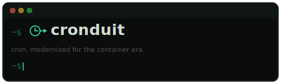
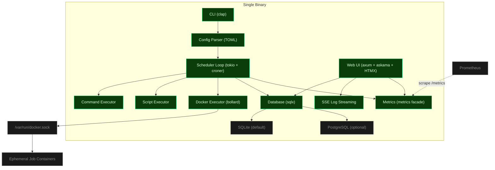

<div align="center">



[](https://github.com/SimplicityGuy/cronduit/actions/workflows/ci.yml)


[](https://just.systems)
[](https://github.com/rust-lang/rust-clippy)
[](https://www.docker.com/)
[](https://claude.ai/code)

**Self-hosted Docker-native cron scheduler with a web UI. One tool that both runs recurrent jobs reliably AND makes their state observable through a browser.**

</div>

---

## Security

**Read this section before running Cronduit.**

Cronduit is a single-operator tool for homelab environments. It makes three explicit security trade-offs you must understand before deploying:

1. **Cronduit mounts the Docker socket.** That socket is root-equivalent on the host. Anything that can talk to `/var/run/docker.sock` can spawn containers, read secrets from other containers, and access the host filesystem. Only run Cronduit on a host where you already accept Docker-as-root.
2. **The web UI ships unauthenticated in v1.** There is no login screen. Cronduit defaults `[server].bind` to `127.0.0.1:8080` for this reason. If you bind it to any non-loopback address, Cronduit emits a loud `WARN` log line at startup and sets `bind_warning: true` in the structured startup event. Put Cronduit behind a reverse proxy (Traefik, Caddy, nginx) with auth if you want to expose it beyond localhost.
3. **Secrets live in environment variables, not in the config file.** The TOML config uses `${ENV_VAR}` references that are interpolated at parse time. The `SecretString` wrapper from the `secrecy` crate ensures credentials never appear in `Debug` output or in log lines.

For non-loopback deployments, always place Cronduit behind a reverse proxy with authentication (Traefik, Caddy, nginx basic auth, etc.).

See [THREAT_MODEL.md](./THREAT_MODEL.md) for the full threat model covering Docker socket access, untrusted clients, config tampering, and malicious images.

---

## Quickstart

Get from `git clone` to a running scheduled job in under 5 minutes:

```bash
# 1. Clone and enter the directory
git clone https://github.com/SimplicityGuy/cronduit
cd cronduit

# 2. Start Cronduit (default -- Linux with group_add for docker.sock access)
docker compose -f examples/docker-compose.yml up -d

# -- OR, for macOS / Docker Desktop / defense-in-depth deployments --
# Uses docker-socket-proxy to mediate Docker API access through a narrow
# allowlist; no direct /var/run/docker.sock mount in cronduit.
# docker compose -f examples/docker-compose.secure.yml up -d

# 3. Open the web UI
open http://localhost:8080
```

You should see four example jobs in the dashboard:

- **echo-timestamp** (command) -- every minute, prints `date` output. Instant heartbeat so you know Cronduit is alive.
- **http-healthcheck** (command) -- every 5 minutes, `wget --spider` against `https://www.google.com`. Realistic uptime canary demonstrating DNS + TLS + egress.
- **disk-usage** (script) -- every 15 minutes, `du -sh /data && df -h /data`. Shows off the script-job path and the `/data` named volume.
- **hello-world** (Docker) -- every 5 minutes, pulls `hello-world:latest` in an ephemeral container with `delete = true`. Exercises the Docker executor end-to-end (requires the socket mount from the default compose file or the docker-socket-proxy sidecar from the secure compose file).

The echo job fires within 60 seconds, giving you instant feedback that Cronduit is working. The other three demonstrate every execution type Cronduit supports (command, script, and Docker) so you can pattern-match on them when writing your own.

---

## Architecture



Cronduit is a single Rust binary that:

- Runs recurrent jobs on a cron schedule (command, inline script, or ephemeral Docker container)
- Shows every run's status, timing, and logs in a terminal-green web UI (no SPA -- server-rendered HTML with HTMX live updates)
- Supports every Docker network mode, including `network = "container:<name>"` (the marquee feature -- route traffic through a VPN sidecar)
- Stores everything in SQLite by default, or PostgreSQL if you prefer
- Ships as a single binary and a multi-arch Docker image (`linux/amd64`, `linux/arm64`)

---

## Configuration

Cronduit is configured via a single TOML file. The config file is the source of truth -- jobs not in the file are disabled on reload.

### Server Settings

```toml
[server]
bind = "127.0.0.1:8080"   # Default: loopback only. Use 0.0.0.0 behind a reverse proxy.
timezone = "UTC"            # IANA timezone for schedule evaluation
log_retention = "90d"       # How long to keep run logs before pruning
shutdown_grace = "30s"      # Grace period for running jobs on SIGTERM
```

### Default Job Settings

```toml
[defaults]
image = "alpine:latest"     # Default Docker image for container jobs
network = "bridge"          # Default Docker network mode
delete = true               # Auto-remove containers after completion
timeout = "5m"              # Default job timeout
random_min_gap = "0s"       # Minimum gap between @random-scheduled jobs
```

### Job Types

**Command job** -- runs a local shell command:

```toml
[[jobs]]
name = "health-probe"
schedule = "*/15 * * * *"
command = "curl -sf https://example.com/health"
timeout = "30s"
```

**Script job** -- runs an inline script:

```toml
[[jobs]]
name = "backup-index"
schedule = "0 * * * *"
script = """
#!/bin/sh
set -eu
echo "building backup index at $(date -u +%FT%TZ)"
find /data -type f -mtime -1 | wc -l
"""
timeout = "2m"
```

**Docker container job** -- spawns an ephemeral container:

```toml
[[jobs]]
name = "nightly-backup"
schedule = "15 3 * * *"
image = "restic/restic:latest"
network = "container:vpn"       # Route through VPN sidecar
volumes = ["/data:/data:ro", "/backup:/backup"]
timeout = "30m"
delete = true

[jobs.env]
RESTIC_PASSWORD = "${RESTIC_PASSWORD}"   # Interpolated from host environment
```

Secrets use `${ENV_VAR}` syntax -- Cronduit interpolates at parse time and wraps values in `SecretString`. If a referenced variable is unset, `cronduit check` fails with a clear error.

For the full configuration reference, see [docs/SPEC.md](./docs/SPEC.md).

---

## Monitoring

Cronduit exposes a Prometheus-compatible `/metrics` endpoint for integration with your existing monitoring stack.

### Metric Families

| Metric | Type | Labels | Description |
|--------|------|--------|-------------|
| `cronduit_jobs_total` | Gauge | -- | Number of currently configured jobs |
| `cronduit_runs_total` | Counter | `job`, `status` | Total runs by job and status (`success`, `failed`, `timeout`, `cancelled`) |
| `cronduit_run_duration_seconds` | Histogram | `job` | Run duration with homelab-tuned buckets (1s to 1h) |
| `cronduit_run_failures_total` | Counter | `job`, `reason` | Failures by reason (`image_pull_failed`, `network_target_unavailable`, `timeout`, `exit_nonzero`, `abandoned`, `unknown`) |

Cardinality is bounded: `job` labels scale with your job count (typically 5-50), and `reason` uses a closed enum of 6 values.

### Prometheus Setup

Copy the provided scrape config into your `prometheus.yml`:

```yaml
scrape_configs:
  - job_name: 'cronduit'
    scrape_interval: 15s
    static_configs:
      - targets: ['localhost:8080']
```

A ready-to-use scrape configuration is also available at [`examples/prometheus.yml`](./examples/prometheus.yml).

The `/metrics` endpoint is unauthenticated, consistent with standard Prometheus target conventions. Protect it via network controls if needed.

---

## Development

### Prerequisites

- Rust 1.94+ (pinned via `rust-toolchain.toml`)
- [just](https://just.systems) task runner
- Docker (for container job tests and image builds)

### Build and Test

Every build/test/lint/image command goes through `just`:

```bash
just --list              # Show every recipe
just build               # cargo build --all-targets
just test                # cargo test --all-features
just fmt-check           # Formatter gate
just clippy              # Linter gate
just openssl-check       # Rustls-only dependency guard
just schema-diff         # SQLite vs Postgres schema parity test
just image               # Multi-arch Docker image via cargo-zigbuild
just ci                  # Full ordered CI chain
```

### Tailwind CSS

```bash
just tailwind            # Build CSS once
just tailwind-watch      # Watch mode for live development
```

The `rust-embed` crate reads assets from disk in debug builds, so template and CSS changes are visible on browser refresh without recompiling.

### Validate Config

```bash
just check-config examples/cronduit.toml
```

---

## Contributing

1. Create a feature branch (`gsd/...` or `feat/...`)
2. Make changes and run `just ci` locally
3. Open a PR -- direct commits to `main` are blocked by policy
4. All diagrams in PR descriptions, commits, and docs must be mermaid code blocks (no ASCII art)

See `CLAUDE.md` for the full project constraints.

---

## License

MIT. See [LICENSE](./LICENSE).
