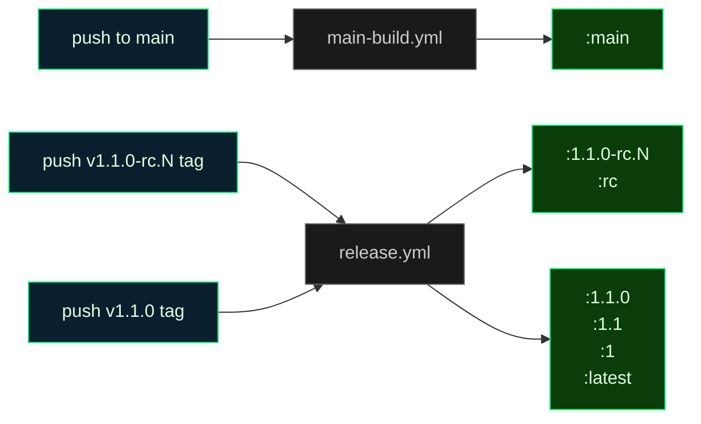
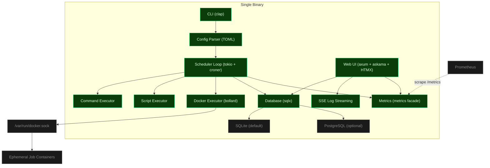
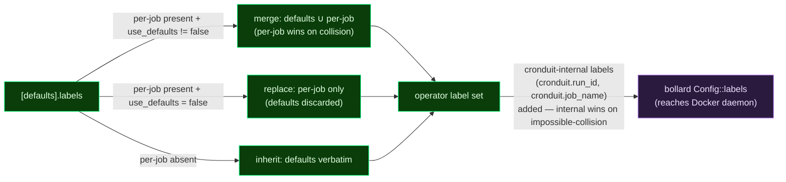

<div align="center">


[](https://github.com/SimplicityGuy/cronduit/actions/workflows/ci.yml)


[](https://just.systems)
[](https://github.com/rust-lang/rust-clippy)
[](https://www.docker.com/)
[](https://claude.ai/code)

**Self-hosted Docker-native cron scheduler with a web UI. One tool that both runs recurrent jobs reliably AND makes their state observable through a browser.**

</div>

---

## Security

**Read this section before running Cronduit.**

Cronduit is a single-operator tool for homelab environments. It makes three explicit security trade-offs you must understand before deploying:

1. **Cronduit mounts the Docker socket.** That socket is root-equivalent on the host. Anything that can talk to `/var/run/docker.sock` can spawn containers, read secrets from other containers, and access the host filesystem. Only run Cronduit on a host where you already accept Docker-as-root.
2. **The web UI ships unauthenticated in v1.** There is no login screen. Cronduit defaults `[server].bind` to `127.0.0.1:8080` for this reason. If you bind it to any non-loopback address, Cronduit emits a loud `WARN` log line at startup and sets `bind_warning: true` in the structured startup event. Put Cronduit behind a reverse proxy (Traefik, Caddy, nginx) with auth if you want to expose it beyond localhost.
3. **Secrets live in environment variables, not in the config file.** The TOML config uses `${ENV_VAR}` references that are interpolated at parse time. The `SecretString` wrapper from the `secrecy` crate ensures credentials never appear in `Debug` output or in log lines.

For non-loopback deployments, always place Cronduit behind a reverse proxy with authentication (Traefik, Caddy, nginx basic auth, etc.).

See [THREAT_MODEL.md](./THREAT_MODEL.md) for the full threat model covering Docker socket access, untrusted clients, config tampering, and malicious images.

---

## Quickstart

Get from `git clone` to a running scheduled job in under 5 minutes:

```bash
# 1. Clone and enter the directory
git clone https://github.com/SimplicityGuy/cronduit
cd cronduit

# 2. Start Cronduit — pick the variant that matches your host.
#
# On Linux: derive DOCKER_GID from the host socket and start the default compose.
#   export DOCKER_GID=$(stat -c %g /var/run/docker.sock)
#   docker compose -f examples/docker-compose.yml up -d
#
# On macOS + Rancher Desktop: the docker daemon socket lives inside the lima
# VM at /var/run/docker.sock (not ~/.rd/docker.sock — that is the host-side
# client relay). The VM's socket is root:102, so DOCKER_GID must be 102:
#   export DOCKER_GID=102
#   docker compose -f examples/docker-compose.yml up -d
#
# On macOS + Docker Desktop, or when you want defense-in-depth (socket-proxy
# sidecar, narrow allowlist, no direct socket mount in cronduit):
#   docker compose -f examples/docker-compose.secure.yml up -d
#
# See examples/docker-compose.yml and .secure.yml headers for the full
# rationale and threat model notes.

# 3. Open the web UI
open http://localhost:8080
```

Pinning a specific image tag in production? See [Docker image tags](#docker-image-tags) for which tag matches different operator needs (`:X.Y`, `:latest`, `:rc`, `:main`).

You should see four example jobs in the dashboard:

- **echo-timestamp** (command) -- every minute, prints `date` output. Instant heartbeat so you know Cronduit is alive.
- **http-healthcheck** (command) -- every 5 minutes, `wget --spider` against `https://www.google.com`. Realistic uptime canary demonstrating DNS + TLS + egress.
- **disk-usage** (script) -- every 15 minutes, `du -sh /data && df -h /data`. Shows off the script-job path and the `/data` named volume.
- **hello-world** (Docker) -- every 5 minutes, pulls `hello-world:latest` in an ephemeral container with `delete = true`. Exercises the Docker executor end-to-end (requires the socket mount from the default compose file or the docker-socket-proxy sidecar from the secure compose file).

The echo job fires within 60 seconds, giving you instant feedback that Cronduit is working. The other three demonstrate every execution type Cronduit supports (command, script, and Docker) so you can pattern-match on them when writing your own.

---

## Docker image tags

Cronduit publishes a small, explicit set of floating and versioned tags to `ghcr.io/simplicityguy/cronduit`. Pick the one that matches your risk tolerance.

| Tag | What it points at | When it moves | Who should pin this |
|-----|-------------------|---------------|---------------------|
| `:X.Y.Z` (e.g. `:1.0.1`, `:1.1.0`) | An immutable tagged release | Never -- once published, a specific version tag points at one digest forever | Production deployments that want reproducibility |
| `:X.Y` (e.g. `:1.0`, `:1.1`) | The most recent `:X.Y.Z` patch release for that minor line | Every time a new patch of that minor ships | Production deployments that want to auto-pick up patch fixes |
| `:X` (e.g. `:1`) | The most recent `:X.Y.Z` release for that major line | Every time a new minor or patch of that major ships | Production deployments willing to take minor-version upgrades |
| `:latest` | The most recent stable (non-rc) release -- currently `:1.1.0` | Only on stable release tags (`vX.Y.Z` with no `-rc.N` suffix) | Operators who always want the newest stable. Never bleeds rc or main-branch builds in |
| `:rc` | The most recent release candidate -- currently `:1.1.0-rc.6` (last rc before `v1.1.0` shipped; won't move again until the next milestone begins rc cycling) | Every rc push (`vX.Y.Z-rc.N`). Never moves on stable releases | Early adopters who want to exercise the next milestone before it ships |
| `:main` | A CI-built image of whatever commit is currently at the tip of `main` | Every push to `main`, multi-arch, built with the same toolchain as release images | Homelab operators who want the bleeding edge and can accept that `main` may be unstable |

### Which workflow owns which tag



### Picking a tag

- Most operators should pin `:1.1` (or whatever the current minor line is). It picks up patch fixes automatically but never surprises you with a major upgrade.
- `:latest` is fine for "just try it out" quickstart flows -- which is why `examples/docker-compose.yml` pins it -- but is not recommended for long-running deployments where you want reproducibility.
- `:rc` lets you validate the next milestone early. If an rc breaks in your environment, file an issue before the final cut.
- `:main` is for operators who WANT the bleeding edge. It pulls unreviewed code from the tip of `main`; treat it the same way you would treat pulling from a branch of any open-source project. It is not recommended for any environment that values uptime.

### What's NOT published

The following tags are intentionally NOT published -- they are not footguns we plan to add later, they are footguns we have deliberately declined:

- No `:edge`, `:nightly`, or `:dev` tags. If you want bleeding-edge, pin `:main`.
- No per-branch tags (e.g. no `:feature-foo` for branches other than `main`).
- No per-commit tags (e.g. no `:sha-abc1234`). Cronduit previously published these and they cluttered the package page without a clear use case.

If you need to pin to a specific commit, use an `:X.Y.Z` release tag; if no release tag exists for your target commit, that commit is not a supported deployment target.

## Architecture



Cronduit is a single Rust binary that:

- Runs recurrent jobs on a cron schedule (command, inline script, or ephemeral Docker container)
- Shows every run's status, timing, and logs in a terminal-green web UI (no SPA -- server-rendered HTML with HTMX live updates)
- Supports every Docker network mode, including `network = "container:<name>"` (the marquee feature -- route traffic through a VPN sidecar)
- Stores everything in SQLite by default, or PostgreSQL if you prefer
- Ships as a single binary and a multi-arch Docker image (`linux/amd64`, `linux/arm64`)

---

## Configuration

Cronduit is configured via a single TOML file. The config file is the source of truth -- jobs not in the file are disabled on reload.

> **New to Cronduit?** Start with **[docs/QUICKSTART.md](./docs/QUICKSTART.md)** for a zero-to-first-scheduled-job walkthrough.
> **Looking up a specific field?** The complete reference is in **[docs/CONFIG.md](./docs/CONFIG.md)**. The section below is a cheat sheet.

### Server Settings

```toml
[server]
bind = "127.0.0.1:8080"   # Default: loopback only. Loud WARN at startup if non-loopback.
timezone = "UTC"            # REQUIRED -- no implicit host-timezone fallback (D-19).
log_retention = "90d"       # Default 90d. How long to keep run logs before the daily pruner reclaims them.
shutdown_grace = "30s"      # Default 30s. Grace period for running jobs on SIGINT/SIGTERM before SIGKILL.
watch_config = true         # Default true. Set false to disable the debounced file-watch reload path.
# database_url = "sqlite:///data/cronduit.db"   # Optional. Falls back to env DATABASE_URL,
                                                  # then to "sqlite://./cronduit.db?mode=rwc" for local dev.
```

### Default Job Settings

```toml
[defaults]
image = "alpine:latest"     # Default Docker image for container jobs
network = "bridge"          # Default Docker network mode
delete = true               # When true, cronduit removes the container after wait_container drains.
                            # NOT bollard auto_remove -- cronduit always sets auto_remove=false to
                            # avoid the moby#8441 race that loses exit codes; the explicit remove
                            # happens after the run is fully recorded.
timeout = "5m"              # Default job timeout
random_min_gap = "90m"      # Minimum gap between @random-scheduled jobs on the same day.
                            # Optional -- omit to allow @random jobs to land back-to-back.
```

### Labels

Cronduit attaches arbitrary Docker labels to spawned containers. Operators use this to integrate cronduit with reverse proxies (Traefik, Caddy), update tooling (Watchtower), backup tooling, and any other Docker ecosystem tool that filters or routes by container label.

Labels are configured in two places — `[defaults].labels` (inherited by every docker job) and per-job `[[jobs]].labels` (merges with or replaces the defaults). The merge precedence is:



The merge semantics in tabular form:

| per-job `labels` field | per-job `use_defaults` | Resulting label set on container                                    |
| ---------------------- | ---------------------- | ------------------------------------------------------------------- |
| absent                 | unset / `true`         | `[defaults].labels` verbatim (inherit)                              |
| present                | unset / `true`         | `[defaults].labels` ∪ per-job; per-job key wins on collision        |
| present                | `false`                | per-job ONLY; defaults entirely discarded                           |

In all cases, cronduit's two internal labels — `cronduit.run_id` and `cronduit.job_name` — are added to every spawned container after the operator-defined merge resolves. These power orphan reconciliation; they are not operator-configurable.

**Reserved namespace.** Keys under the `cronduit.*` prefix are rejected at config-LOAD with a clear error. The prefix is reserved for cronduit-internal use:

```toml
# REJECTED at load:
[[jobs]]
labels = { "cronduit.foo" = "bar" }   # error: cronduit.* is reserved
```

**Type-gate (docker-only).** Labels are valid only on docker jobs (jobs with `image = "..."` set, either directly or via `[defaults].image`). Setting `labels` on a `command` or `script` job is rejected at config-LOAD; there is no container to attach labels to:

```toml
# REJECTED at load -- labels on a command job:
[[jobs]]
name = "no-good"
command = "echo hi"
labels = { "team" = "ops" }   # error: labels are docker-only
```

**Size limits.** Each label value must be ≤ 4 KB (4096 bytes); the total byte length of all keys + values for a single job must be ≤ 32 KB. Both limits are enforced at config-LOAD. The 32 KB ceiling sits well below dockerd's informal label-size threshold so cronduit's error fires first with a clear message.

**Env-var interpolation.** Cronduit applies a whole-file textual pre-parse pass over the entire TOML source BEFORE TOML parses it; this pass replaces every `${VAR}` reference with the resolved value of the named environment variable (reference: `src/config/interpolate.rs`). Interpolation runs over keys and values uniformly — it does NOT distinguish TOML key positions from value positions. Cronduit then enforces a strict character regex on every resolved label key: `^[a-zA-Z0-9_][a-zA-Z0-9._-]*$` (alphanumeric or underscore start; alphanumeric, dot, hyphen, or underscore body). Any character outside this set — including the literal `$`, `{`, `}` left behind when an env var is UNSET — is rejected at config-LOAD with a clear error.

Concretely, this means:

- `labels = { "deployment.id" = "${DEPLOYMENT_ID}" }` with `DEPLOYMENT_ID=12345` exported → resolves to `labels = { "deployment.id" = "12345" }` and is accepted.
- `labels = { "deployment.id" = "${DEPLOYMENT_ID}" }` with `DEPLOYMENT_ID` unset → leaves the literal `${DEPLOYMENT_ID}` in the value, the validator's value-side checks pass, but interpolation itself emits a `missing environment variable` error and the load fails. (See the `${VAR:-default}` rule below — there is no default-value syntax in v1.)
- `labels = { "${TEAM}" = "v" }` with `TEAM=ops` exported → resolves to `labels = { "ops" = "v" }` and is accepted (the resolved key `ops` matches the strict pattern).
- `labels = { "${TEAM}" = "v" }` with `TEAM` unset → the literal `${TEAM}` survives, fails the strict-char regex on `$`, `{`, and `}`, and is rejected at config-LOAD.

**Recommended pattern.** Use `${VAR}` interpolation for label VALUES, not keys. Stable label keys should be written as literal strings; if you write `${VAR}` inside a label key the resolved value must match the strict pattern above, which is fragile against env-var typos and reduces the visible diff in code review. The supported and tested pattern is `labels = { "deployment.id" = "${DEPLOYMENT_ID}" }`.

```toml
# RECOMMENDED -- env-var interpolation in label VALUE only:
[[jobs]]
labels = { "deployment.id" = "${DEPLOYMENT_ID}" }

# SUPPORTED BUT DISCOURAGED -- env-var interpolation in label KEY position.
# The resolved key must match `^[a-zA-Z0-9_][a-zA-Z0-9._-]*$`. If TEAM is set
# to "ops" the line below is accepted as `labels = { "ops" = "v" }`. If TEAM
# is unset the literal `${TEAM}` survives and is rejected by the strict char
# regex.
[[jobs]]
labels = { "${TEAM}" = "v" }
```

**Label values are NOT secrets.** Anyone with access to the Docker daemon can read them via `docker inspect`. Use env vars (the `env =` field on docker jobs) for anything sensitive — env values are redacted in cronduit logs and never surface in `docker inspect` for the spawned container.

See `examples/cronduit.toml` for three integration patterns: Watchtower exclusion in `[defaults]`, Traefik routing labels merged onto a per-job block, and a `use_defaults = false` job that establishes its own clean label set.

### Job Types

**Command job** -- runs a local shell command:

```toml
[[jobs]]
name = "health-probe"
schedule = "*/15 * * * *"
command = "curl -sf https://example.com/health"
timeout = "30s"
```

**Script job** -- runs an inline script:

```toml
[[jobs]]
name = "backup-index"
schedule = "0 * * * *"
script = """
#!/bin/sh
set -eu
echo "building backup index at $(date -u +%FT%TZ)"
find /data -type f -mtime -1 | wc -l
"""
timeout = "2m"
```

**Docker container job** -- spawns an ephemeral container:

```toml
[[jobs]]
name = "nightly-backup"
schedule = "15 3 * * *"
image = "restic/restic:latest"
network = "container:vpn"       # Route through VPN sidecar
volumes = ["/data:/data:ro", "/backup:/backup"]
timeout = "30m"
delete = true

[jobs.env]
RESTIC_PASSWORD = "${RESTIC_PASSWORD}"   # Interpolated from host environment
```

Secrets use `${ENV_VAR}` syntax -- Cronduit interpolates at parse time and wraps values in `SecretString`. If a referenced variable is unset, `cronduit check` fails with a clear error.

For the full configuration reference, see [docs/SPEC.md](./docs/SPEC.md).

---

## Monitoring

Cronduit exposes a Prometheus-compatible `/metrics` endpoint for integration with your existing monitoring stack.

### Metric Families

Cronduit exposes **six** metric families, all eagerly described at boot so `/metrics` returns full HELP/TYPE lines even before the first observation:

| Metric | Type | Labels | Description |
|--------|------|--------|-------------|
| `cronduit_scheduler_up` | Gauge | -- | `1` once the scheduler loop is running. Liveness sentinel. |
| `cronduit_jobs_total` | Gauge | -- | Number of currently configured jobs |
| `cronduit_runs_total` | Counter | `job`, `status` | Total runs by job and status (`success`, `failed`, `timeout`, `cancelled`) |
| `cronduit_run_duration_seconds` | Histogram | `job` | Run duration with homelab-tuned buckets (1s to 1h) |
| `cronduit_run_failures_total` | Counter | `job`, `reason` | Failures by reason (`image_pull_failed`, `network_target_unavailable`, `timeout`, `exit_nonzero`, `abandoned`, `unknown`) |
| `cronduit_docker_reachable` | Gauge | -- | Docker daemon preflight result: `1` reachable, `0` unreachable. See [Troubleshooting](#troubleshooting) below. |

Cardinality is bounded: `job` labels scale with your job count (typically 5-50), `status` is a 4-value closed enum, and `reason` is a 6-value closed enum.

### Prometheus Setup

Copy the provided scrape config into your `prometheus.yml`:

```yaml
scrape_configs:
  - job_name: 'cronduit'
    scrape_interval: 15s
    static_configs:
      - targets: ['localhost:8080']
```

A ready-to-use scrape configuration is also available at [`examples/prometheus.yml`](./examples/prometheus.yml).

The `/metrics` endpoint is unauthenticated, consistent with standard Prometheus target conventions. Protect it via network controls if needed.

---

## Development

### Prerequisites

- Rust 1.94+ (pinned via `rust-toolchain.toml`)
- [just](https://just.systems) task runner
- Docker (for container job tests and image builds)

### Build and Test

Every build/test/lint/image command goes through `just`:

```bash
just --list              # Show every recipe
just build               # cargo build --all-targets
just test                # cargo test --all-features
just fmt-check           # Formatter gate
just clippy              # Linter gate
just openssl-check       # Rustls-only dependency guard
just schema-diff         # SQLite vs Postgres schema parity test
just image               # Multi-arch Docker image via cargo-zigbuild
just ci                  # Full ordered CI chain
```

### Tailwind CSS

```bash
just tailwind            # Build CSS once
just tailwind-watch      # Watch mode for live development
```

The `rust-embed` crate reads assets from disk in debug builds, so template and CSS changes are visible on browser refresh without recompiling.

### Validate Config

```bash
just check-config examples/cronduit.toml
```

---

## Troubleshooting

### Docker jobs fail with "no Docker client" or "Socket not found"

Cronduit pings the Docker daemon once at startup and exposes the result as a Prometheus gauge:

```bash
curl -sS http://localhost:8080/metrics | grep cronduit_docker_reachable
# cronduit_docker_reachable 1   <- daemon reachable, docker jobs will work
# cronduit_docker_reachable 0   <- preflight failed, docker jobs will error
```

If the gauge is `0` and you see a `cronduit.docker` WARN log line at startup, the cause is almost always a mismatch between cronduit's supplementary group and the host Docker group.

**Derive the right `DOCKER_GID`:**

| Host | Command | Typical value |
|------|---------|---------------|
| Linux | `stat -c %g /var/run/docker.sock` | `999` (default) |
| macOS + Rancher Desktop | *fixed value* (VM-side docker group) | **`102`** |
| macOS + Docker Desktop | *unstable, varies by release* | use `docker-compose.secure.yml` instead |

Export the value and restart the stack:

```bash
export DOCKER_GID=102          # for Rancher Desktop on macOS
docker compose -f examples/docker-compose.yml down -v
docker compose -f examples/docker-compose.yml up -d
curl -sS http://localhost:8080/metrics | grep cronduit_docker_reachable
```

### Command/script jobs fail with "No such file or directory"

The Cronduit runtime image is based on `alpine:3` and ships busybox `date`, `wget`, `du`, `df`, and `/bin/sh`. If your command references a binary that isn't in busybox (e.g. `curl`, `jq`, `bash`), either install it via a custom Dockerfile that extends `ghcr.io/simplicityguy/cronduit:latest`, or rewrite the job as a `script = ` that invokes the busybox equivalent.

### Web UI unreachable / `/health` times out

Check that the compose stack is actually up (`docker compose ps`) and that nothing else is bound to port 8080. The default bind is `0.0.0.0:8080` inside the example compose files; cronduit emits a loud WARN at startup if you bind to a non-loopback address without a reverse proxy (see the Security section above).

### I want to validate before I run anything

Use `cronduit check` to parse your config and surface errors without starting the scheduler:

```bash
docker run --rm \
  -v $PWD/examples/cronduit.toml:/etc/cronduit/config.toml:ro \
  ghcr.io/simplicityguy/cronduit:latest \
  cronduit check /etc/cronduit/config.toml
```

---

## Contributing

1. Create a feature branch (`gsd/...` or `feat/...`)
2. Make changes and run `just ci` locally
3. Open a PR -- direct commits to `main` are blocked by policy
4. All diagrams in PR descriptions, commits, and docs must be mermaid code blocks (no ASCII art)

See `CLAUDE.md` for the full project constraints.

---

## License

MIT. See [LICENSE](./LICENSE).
