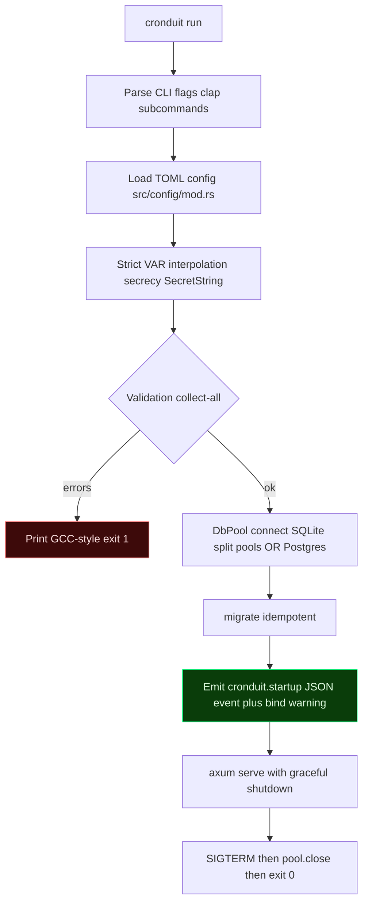

# Cronduit

> Self-hosted Docker-native cron scheduler with a web UI. One tool that both runs recurrent jobs reliably AND makes their state observable through a browser.

**Status:** Early -- Phase 1 (Foundation, Security and Persistence) in progress. Not yet usable as a scheduler; see the roadmap at `.planning/ROADMAP.md`.

---

## Security

**Read this section before running Cronduit.**

Cronduit is a single-operator tool for homelab environments. It makes three explicit security trade-offs you must understand before deploying:

1. **Cronduit mounts the Docker socket.** That socket is root-equivalent on the host. Anything that can talk to `/var/run/docker.sock` can spawn containers, read secrets from other containers, and access the host filesystem. Only run Cronduit on a host where you already accept Docker-as-root.
2. **The web UI ships unauthenticated in v1.** There is no login screen. Cronduit defaults `[server].bind` to `127.0.0.1:8080` for this reason. If you bind it to any non-loopback address, Cronduit emits a loud `WARN` log line at startup and sets `bind_warning: true` in the structured startup event. Put Cronduit behind a reverse proxy (Traefik, Caddy, nginx) with auth if you want to expose it beyond localhost.
3. **Secrets live in environment variables, not in the config file.** The TOML config uses `${ENV_VAR}` references that are interpolated at parse time. The `SecretString` wrapper from the `secrecy` crate ensures credentials never appear in `Debug` output or in log lines.

See [THREAT_MODEL.md](./THREAT_MODEL.md) for the full threat model.

---

## What It Does

Cronduit is a small Rust binary that:

- Runs recurrent jobs on a cron schedule (command, inline script, or ephemeral Docker container)
- Shows every run's status, timing, and logs in a terminal-green web UI (no SPA)
- Supports every Docker network mode, including `network = "container:<name>"` (the marquee feature -- route traffic through a VPN sidecar)
- Stores everything in SQLite by default, or PostgreSQL if you prefer
- Ships as a single binary and a multi-arch Docker image (`linux/amd64`, `linux/arm64`)

Phase 1 delivers the foundation: the config parser, database layer, CI matrix, security posture, and threat model skeleton. The scheduler, executors, and web UI land in Phases 2 through 6. See `.planning/ROADMAP.md` for the full plan.

---

## Quickstart (Phase 1)

> Phase 1 does not yet run jobs. This quickstart verifies the binary builds, loads a config, and starts the placeholder web server.

```bash
# Prerequisites: rustc 1.94.1 (pinned via rust-toolchain.toml), just, docker
git clone https://github.com/SimplicityGuy/cronduit
cd cronduit

# Validate the example config
just check-config examples/cronduit.toml

# Run it against an in-memory SQLite
cargo run -- run \
    --config examples/cronduit.toml \
    --database-url sqlite::memory: \
    --log-format text
```

Visit http://127.0.0.1:8080 -- you will see the Phase 1 placeholder page. Ctrl+C shuts down cleanly.

Phases 2+ will add the scheduler loop, the real UI, and Docker-container job execution.

---

## Architecture

Phase 1 boot flow:



More detail: `.planning/research/ARCHITECTURE.md`.

---

## Building from Source

Every build/test/lint/image command goes through `just`:

```bash
just --list              # show every recipe
just build               # cargo build --all-targets
just test                # cargo test --all-features
just fmt-check           # fmt gate
just clippy              # clippy gate
just openssl-check       # rustls-only dependency guard (FOUND-06)
just schema-diff         # SQLite vs Postgres schema parity test
just image               # multi-arch docker image via cargo-zigbuild (no QEMU)
just ci                  # full ordered chain
```

Local `just ci` produces the same exit code as the GitHub Actions CI job on every PR.

CI matrix: `linux/amd64 x linux/arm64 x SQLite x PostgreSQL`. See `.github/workflows/ci.yml`.

---

## Contributing

1. Create a feature branch (`gsd/...` or `feat/...`)
2. Make changes and run `just ci` locally
3. Open a PR -- direct commits to `main` are blocked by policy
4. All diagrams in PR descriptions, commits, and docs must be mermaid code blocks (no ASCII art)

See `CLAUDE.md` for the full project constraints.

---

## License

MIT OR Apache-2.0. See `LICENSE` (forthcoming).

---

*Last updated: 2026-04-10*
