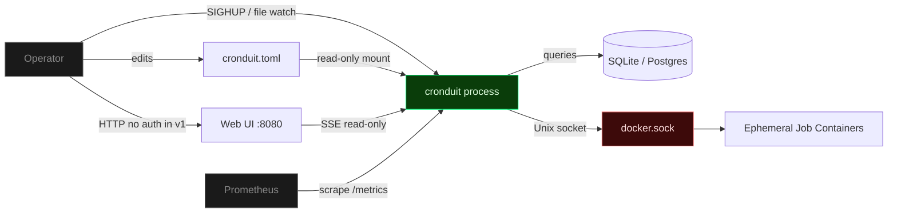
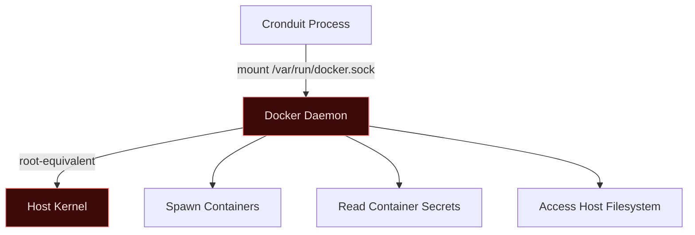

# Cronduit Threat Model

**Revision:** 2026-04-12 (Phase 6 -- complete)
**Scope:** Single-node, single-operator self-hosted deployments.

---

## Assets and Trust Boundaries

**Trust boundaries:**

1. **Operator to process** -- CLI flags, config file edits, SIGHUP signals, web UI interactions.
2. **Config file to process** -- TOML file on disk, mounted read-only in the Docker deployment.
3. **Process to database** -- `sqlx::Pool` connection (SQLite local file or PostgreSQL over network).
4. **Process to Docker socket** -- Unix socket; the most security-sensitive boundary in the system.
5. **Process to operator browser** -- Unauthenticated HTTP in v1 (SSE streams, HTMX partials, static assets).
6. **Process to Prometheus** -- Unauthenticated `/metrics` endpoint (read-only).

**Out of scope:** Multi-tenancy, RBAC, multi-node coordination, container orchestration. Cronduit is a single-operator tool.

---

## Threat Model 1: Docker Socket

### Threat

Mounting `/var/run/docker.sock` gives Cronduit root-equivalent access to the host. Any code path that reaches the socket can spawn arbitrary containers, read secrets from other containers, and access the host filesystem through volume mounts.

### Attack Vector

An attacker who gains access to the Cronduit web UI (unauthenticated in v1) or who can modify the config file can define jobs that execute arbitrary commands on the host via Docker containers.

### Mitigations

- **Default loopback bind:** `[server].bind` defaults to `127.0.0.1:8080`. Non-loopback binds trigger a loud `WARN` log at startup with `bind_warning: true` in the structured event.
- **Read-only config mount:** The Docker deployment mounts `cronduit.toml` as `:ro`, preventing the process from modifying its own configuration.
- **Label-based orphan tracking:** Containers spawned by Cronduit carry identifying labels (`cronduit.job`, `cronduit.run_id`). The reconciliation loop on startup detects and cleans up orphaned containers from previous crashes.
- **Explicit `auto_remove=false` strategy:** Cronduit manages container lifecycle explicitly rather than relying on Docker's `--rm` flag, ensuring logs are captured before removal.
- **Operator trust boundary:** Cronduit is a tool for the operator, not a multi-tenant service. The operator who mounts the Docker socket already trusts the host.

### Residual Risk

An operator misconfiguring a job's `image` or `command` can run arbitrary code with host Docker access. This is inherent to any tool that manages Docker containers and is documented as the headline security trade-off.

### Recommendations

- Run Cronduit on a dedicated host or VM where Docker-as-root is already accepted.
- Use Docker's `--userns-remap` if available to limit container privilege escalation.
- Audit job configurations before applying config reloads.

---

## Threat Model 2: Untrusted Client

### Threat

Network clients accessing the web UI or API without authentication can view job status, trigger manual runs, and observe log output.

### Attack Vector

Any client on the same network as a non-loopback-bound Cronduit instance can:

- View all job definitions, run history, and log output
- Trigger "Run Now" actions on any configured job
- Observe real-time log streams via SSE connections
- Scrape operational metrics from `/metrics`

### Mitigations

- **v1 ships unauthenticated by design:** This is a documented, intentional trade-off for simplicity in single-operator homelab environments.
- **Default loopback bind:** Only `127.0.0.1` is accessible by default. The startup warning on non-loopback bind is loud and structured.
- **CSRF double-submit cookie:** State-changing endpoints (Run Now, Stop, future config actions) are protected by CSRF tokens, preventing cross-site request forgery from malicious pages.
- **SSE endpoints are read-only:** `/events/runs/:id/logs` streams log lines but cannot modify state.
- **`/metrics` is read-only:** Standard Prometheus convention; exposes only counters, gauges, and histograms.
- **No sensitive data in metrics:** Metric labels use job names and closed-enum reasons only. No secrets, log content, or environment variables are exposed.

### Residual Risk

Anyone on the network can view job status and trigger manual runs when Cronduit is bound to a non-loopback address. Operators must use network controls (firewall, VLAN) or a reverse proxy with authentication.

**Stop button (v1.1+ blast radius):** The Stop button added in v1.1 lets anyone with Web UI access terminate any running job via `POST /api/runs/{id}/stop`. This widens the blast radius of an unauthenticated UI compromise — previously an attacker could trigger or view runs, now they can also interrupt them mid-execution. The mitigation posture is unchanged from the rest of the v1 Web UI: keep Cronduit on loopback or front it with a reverse proxy that enforces authentication. Web UI authentication (including differentiated Stop authorization) is deferred to v2 (AUTH-01 / AUTH-02).

**Bulk toggle (v1.1 blast radius):** The bulk-toggle endpoint added in v1.1 lets anyone with Web UI access disable every configured job in a single `POST /api/jobs/bulk-toggle` request. This further widens the blast radius of an unauthenticated UI compromise — an attacker can now silently stop the entire schedule without terminating any running execution. Running jobs are NOT terminated by bulk disable (D-02 / ERG-02), so an in-flight attacker-triggered run continues to completion even after all jobs are bulk-disabled. Mitigation posture is identical to the rest of the v1 Web UI: loopback default or reverse-proxy auth. Bulk-action authorization (including a per-action confirmation step) is deferred to v2 (AUTH-01 / AUTH-02).

### Recommendations

- Keep Cronduit on loopback or a trusted LAN segment.
- For remote access, put Cronduit behind a reverse proxy (Traefik, Caddy, nginx) with authentication.
- Web UI authentication is planned for v2 (AUTH-01 / AUTH-02).

---

## Threat Model 3: Config Tamper

### Threat

An attacker with access to the host filesystem modifies `cronduit.toml` to inject malicious jobs or alter existing ones.

### Attack Vector

1. Attacker gains shell access to the host (SSH compromise, container escape, etc.)
2. Attacker modifies `cronduit.toml` to add a job with `command = "malicious-payload"` or changes an existing job's `image` to a compromised image
3. On the next config reload (SIGHUP, file watch, or restart), the malicious job is picked up and executed

### Mitigations

- **Read-only mount in Docker:** The recommended deployment mounts the config file as `:ro`, preventing writes from within the container.
- **Validation before apply:** Config reloads (SIGHUP or file watch) validate the entire config before applying changes. Invalid configs are rejected with a tracing error event; the previous valid config continues running.
- **Environment-only interpolation:** `${ENV_VAR}` references resolve from the process environment only. There are no external lookups, file includes, or URL fetches that could be exploited.
- **`SecretString` wrapping:** Sensitive config fields are wrapped in `secrecy::SecretString`, ensuring they never appear in `Debug` output, log lines, or error messages.
- **Standard Unix permissions:** The config file should be owned by root and readable only by the Cronduit process user.

### Residual Risk

If the host filesystem is compromised, the config can be tampered. This is beyond Cronduit's control -- filesystem integrity is the operator's responsibility.

### Recommendations

- Set file permissions: `chmod 640 cronduit.toml` with ownership by the service user.
- Mount the config read-only in Docker (`:ro` flag).
- Monitor the config file for unexpected changes using host-level integrity tools (AIDE, Tripwire, etc.).

---

## Threat Model 4: Malicious Image

### Threat

An operator specifies a compromised or malicious Docker image in a job configuration. The image executes arbitrary code within the container runtime.

### Attack Vector

1. Operator configures `image = "attacker/malicious:latest"` (supply-chain compromise, typosquatting, or compromised registry)
2. Cronduit pulls and runs the image on schedule
3. The malicious container can: access mounted volumes, use the network namespace, and (if the Docker socket is mounted into the job container) escalate to full host access

### Mitigations

- **Cronduit does NOT sandbox images:** This is explicitly documented. Operators must trust their image sources.
- **No Docker socket forwarding to job containers:** By default, Cronduit does not mount the Docker socket into spawned job containers. Only the Cronduit process itself has socket access.
- **Container namespace isolation:** Job containers run in their own PID, mount, and (by default) network namespaces. They cannot see the Cronduit process unless explicitly configured with `network = "container:cronduit"`.
- **Ephemeral containers:** Job containers are created, run, and removed. They do not persist state unless volumes are explicitly configured.

### Residual Risk

A malicious image has full container capabilities within its namespace. If the operator mounts sensitive host directories as volumes, the image can read/write those paths. `--security-opt no-new-privileges` and `--cap-drop=ALL` are recommended but not enforced in v1.

### Recommendations

- Only pull images from trusted registries and verified publishers.
- Use image digests (`image = "alpine@sha256:..."`) instead of mutable tags for critical jobs.
- Minimize volume mounts -- use `:ro` where possible.
- Consider adding `--security-opt no-new-privileges` and `--cap-drop=ALL` to job container defaults (planned for v2).

---

## STRIDE Summary

The existing STRIDE analysis from Phase 1 remains valid. This section summarizes the current status of all identified threats.

### Spoofing (S)

| ID | Threat | Status |
|----|--------|--------|
| T-S1 | LAN attacker accesses unauthenticated web UI | Mitigated: loopback default + startup warning. Full auth deferred to v2. |
| T-S2 | `@random` cron field influenced by malicious clock | Mitigated: uses system clock via `chrono::Utc::now()`. Clock integrity is an OS concern. |

### Tampering (T)

| ID | Threat | Status |
|----|--------|--------|
| T-T1 | Host shell access modifies config to inject malicious jobs | Partially mitigated: read-only mount, validation-before-apply on reload. See Config Tamper model above. |
| T-T2 | Transitive `openssl-sys` dependency breaks rustls-only invariant | Mitigated: `just openssl-check` CI gate. |
| T-T3 | Schema drift between SQLite and Postgres migrations | Mitigated: `tests/schema_parity.rs` CI gate. |

### Repudiation (R)

| ID | Threat | Status |
|----|--------|--------|
| T-R1 | Operator denies running a specific job | Partially mitigated: `job_runs.trigger` column records `manual` vs `scheduled`. Full audit logging deferred to v2. |

### Information Disclosure (I)

| ID | Threat | Status |
|----|--------|--------|
| T-I1 | Database credentials leak into logs | Mitigated: `strip_db_credentials` in `src/db/mod.rs`. |
| T-I2 | Secret values from `${ENV_VAR}` appear in debug output | Mitigated: `SecretString` wrapping with `[REDACTED]` in `Debug`. |
| T-I3 | Malicious container reads Cronduit process secrets via `/proc` | Mitigated: separate PID namespace by default. No shared PID space unless explicitly configured. |

### Denial of Service (D)

| ID | Threat | Status |
|----|--------|--------|
| T-D1 | SQLite writer contention under concurrent log writes | Mitigated: split read/write pools, WAL, `busy_timeout=5000`. |
| T-D2 | Runaway job fills `job_logs` table | Mitigated: bounded-channel log pipeline (head-drop at 256 lines) + daily retention pruner. |
| T-D3 | Graceful-shutdown bug leaves process hung | Mitigated: `CancellationToken` + axum `with_graceful_shutdown` + integration test. |

### Elevation of Privilege (E)

| ID | Threat | Status |
|----|--------|--------|
| T-E1 | Web UI user spawns root container via Docker socket | Mitigated: loopback default + documented trade-off. See Docker Socket model above. |
| T-E2 | Malicious image exploits container escape CVE | Accepted: container runtime security is beyond Cronduit's scope. See Malicious Image model above. |
| T-E3 | `container:<name>` job targets unexpected container | Mitigated: pre-flight validation checks target container existence before creating the job container. |

---

## Out-of-Band Trust Assumptions

- Operators secure the host running Cronduit with standard Unix hygiene (file permissions, firewall, reverse proxy).
- Operators only pull Docker images they trust (`image = "..."` is NOT sandboxed against malicious images).
- Operators do not expose Cronduit's web UI to hostile networks without a reverse proxy plus auth layer.
- The host system clock is accurate (affects cron scheduling and log timestamps).
- Docker daemon is properly configured and patched (container runtime security is Docker's responsibility).

---

## Changelog

| Revision | Date | Change |
|----------|------|--------|
| Phase 1 skeleton | 2026-04-10 | Initial STRIDE outline with Phase 1 mitigations. Phases 4-6 threats marked TBD. |
| Phase 6 complete | 2026-04-12 | Expanded with four threat models (Docker socket, untrusted client, config tamper, malicious image). Updated all STRIDE entries with Phase 2-6 mitigations. Resolved all TBD items. |
