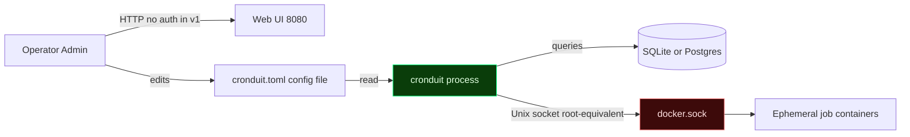

# Cronduit Threat Model

> Skeleton. Phase 1 ships the Docker-socket, loopback-default, and no-auth-in-v1 analysis. Phase 6 release engineering expands this into the full STRIDE model once the Docker executor (Phase 4) and config reload loop (Phase 5) are in place.

**Revision:** 2026-04-10 (Phase 1 skeleton)
**Scope:** Single-node, single-operator self-hosted deployments.

---

## Assets and Trust Boundaries

**Trust boundaries:**

1. **Operator to process** -- CLI flags, config file edits, SIGHUP signals.
2. **Config file to process** -- TOML file on disk, mounted read-only in the Docker deployment.
3. **Process to database** -- `sqlx::Pool` connection.
4. **Process to Docker socket** -- Unix socket; the most security-sensitive boundary in the system.
5. **Process to operator browser** -- Unauthenticated HTTP in v1.

**In scope (Phase 1):** config tampering, secret leakage through logs, non-loopback bind exposure, dependency supply-chain (rustls-only).

**In scope (Phase 4+, deferred):** malicious Docker image execution, container escape, `container:<name>` target impersonation, log XSS, CSRF on state-changing endpoints.

**Out of scope:** multi-tenancy, RBAC, multi-node coordination. Cronduit is a single-operator tool.

---

## Spoofing (S)

**T-S1:** An attacker on the same LAN spoofs the operator by browsing the Cronduit web UI when it is bound to a non-loopback address.

- **Mitigation (v1):** Default bind is `127.0.0.1:8080`. Any non-loopback bind triggers a loud WARN at startup and sets `bind_warning: true` in the structured `cronduit.startup` event. Operators are expected to put Cronduit behind a reverse proxy with their own auth layer.
- **Status:** Mitigation in place (Plan 04). Full web-UI auth is explicitly deferred to v2 (AUTH-01 / AUTH-02).

**T-S2:** `@random` cron field resolution could be influenced by a malicious clock source. *TBD -- Phase 5 when the resolver ships.*

---

## Tampering (T)

**T-T1:** An attacker with shell access to the host modifies `cronduit.toml` to insert malicious jobs.

- **Mitigation (partial):** The Docker deployment mounts the config read-only (CONF-07). The host filesystem itself is the trust boundary -- Cronduit cannot defend against an attacker who already has write access to its config file.
- **Status:** Documented. Operators must secure the config file with standard Unix permissions.

**T-T2:** A malicious dependency introduces a transitive `openssl-sys` dep, silently breaking the rustls-only invariant and exposing a new CVE surface.

- **Mitigation:** `just openssl-check` runs `cargo tree -i openssl-sys` on every CI build (Plan 06 / FOUND-06). Any match fails the lint job.
- **Status:** Mitigation in place.

**T-T3:** Schema drift between SQLite and Postgres migrations leads to runtime-only failures on one backend.

- **Mitigation:** `tests/schema_parity.rs` (Plan 05 / D-14) runs on every PR, structurally compares both backends, fails on drift.
- **Status:** Mitigation in place.

---

## Repudiation (R)

**T-R1:** An operator denies running a specific job.

- **Mitigation (deferred):** `job_runs.trigger = 'manual' or 'scheduled'` column exists in the schema (Plan 04). Authenticated audit logging is deferred to v2.
- **Status:** Schema support only; no auth layer to tie runs to individuals.

---

## Information Disclosure (I)

**T-I1:** Database credentials leak into logs via the `cronduit.startup` event.

- **Mitigation:** `src/db/mod.rs::strip_db_credentials` strips `username:password` from the URL before logging. Unit-tested.
- **Status:** Mitigation in place.

**T-I2:** Secret values from `${ENV_VAR}` interpolation appear in panics, Debug output, or error messages.

- **Mitigation:** Every secret-bearing config field is wrapped in `secrecy::SecretString` (Plan 02 / FOUND-05 / D-20). `Debug` renders `[REDACTED]`. `Serialize` is intentionally not implemented so accidental `serde_json::to_string(&config)` will not compile. `cronduit check` tests explicitly assert secret values do not appear on stdout/stderr.
- **Status:** Mitigation in place.

**T-I3:** A malicious container (Phase 4) reads secrets from `/proc/self/environ` of the Cronduit process.

- **Mitigation (deferred):** Job containers run in ephemeral namespaces with no shared PID space by default. `--security-opt no-new-privileges` and `--cap-drop=ALL` to be documented in Phase 4.
- **Status:** TBD -- Phase 4.

---

## Denial of Service (D)

**T-D1:** SQLite writer contention under concurrent log writes collapses throughput.

- **Mitigation:** Split read/write pools (writer `max_connections=1`, reader `max_connections=8`) plus WAL plus `busy_timeout=5000` plus `synchronous=NORMAL` (Plan 04 / DB-05 / Pitfall 7). Unit-tested via `tests/db_pool_sqlite.rs`.
- **Status:** Mitigation in place.

**T-D2:** A runaway job fills `job_logs` until the SQLite file consumes all free disk.

- **Mitigation (deferred):** Bounded-channel log pipeline with tail-drop (Phase 2 / EXEC-04). Daily retention pruner (Phase 6 / DB-08).
- **Status:** TBD -- Phase 2 and Phase 6.

**T-D3:** A graceful-shutdown bug leaves `cronduit` hung indefinitely on SIGTERM.

- **Mitigation:** `src/shutdown.rs` installs SIGINT and SIGTERM handlers that cancel the `CancellationToken`; axum listener wired with `with_graceful_shutdown`; DB pool `.close()` called before exit. `tests/graceful_shutdown.rs` asserts SIGTERM then exit 0 within 1 s.
- **Status:** Mitigation in place.

---

## Elevation of Privilege (E)

**T-E1:** An attacker with access to the Cronduit web UI spawns a container as root on the host via the mounted Docker socket.

- **Threat:** The Docker socket is root-equivalent. Any code path that reaches `/var/run/docker.sock` can pwn the host.
- **Mitigation (v1):** Cronduit defaults to loopback bind. The web UI is unauthenticated in v1 -- operators keep it behind a reverse proxy OR on the local network only. This is documented as the headline security trade-off in `README.md`.
- **Status:** Documented plus runtime warning plus reverse-proxy recommendation. Full web-UI auth is v2 (AUTH-01).

**T-E2:** A malicious container image uses a Docker escape CVE to break out and attack the host. *TBD -- Phase 4 / Phase 6 once the executor is in place.*

**T-E3:** A `container:<name>` job targets an unexpected container and receives network traffic meant for another workload. *TBD -- Phase 4 when the pre-flight check ships (DOCKER-03).*

---

## Out-of-Band Trust Assumptions

- Operators are expected to secure the host running Cronduit with standard Unix hygiene (file permissions, firewall, reverse proxy).
- Operators are expected to only pull Docker images they trust (`image = "..."` is NOT sandboxed against malicious images).
- Operators are expected to not expose Cronduit's web UI to hostile networks without a reverse-proxy plus auth layer.

---

## Changelog

| Revision | Date | Change |
|----------|------|--------|
| Phase 1 skeleton | 2026-04-10 | Initial STRIDE outline with Phase 1 mitigations. Phases 4 through 6 threats marked TBD. |

*Phase 6 release engineering will expand this document into the full threat model.*
