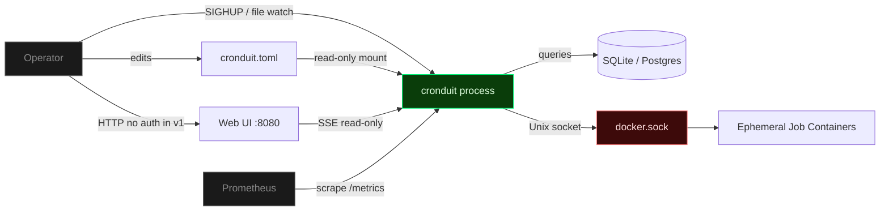
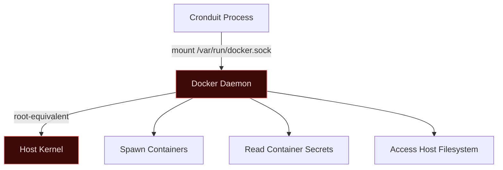

# Cronduit Threat Model

**Revision:** 2026-05-17 (Phase 24 — v1.2.0 close-out)
**Scope:** Single-node, single-operator self-hosted deployments.

---

## Assets and Trust Boundaries

**Trust boundaries:**

1. **Operator to process** -- CLI flags, config file edits, SIGHUP signals, web UI interactions.
2. **Config file to process** -- TOML file on disk, mounted read-only in the Docker deployment.
3. **Process to database** -- `sqlx::Pool` connection (SQLite local file or PostgreSQL over network).
4. **Process to Docker socket** -- Unix socket; the most security-sensitive boundary in the system.
5. **Process to operator browser** -- Unauthenticated HTTP in v1 (SSE streams, HTMX partials, static assets).
6. **Process to Prometheus** -- Unauthenticated `/metrics` endpoint (read-only).

**Out of scope:** Multi-tenancy, RBAC, multi-node coordination, container orchestration. Cronduit is a single-operator tool.

---

## Threat Model 1: Docker Socket

### Threat

Mounting `/var/run/docker.sock` gives Cronduit root-equivalent access to the host. Any code path that reaches the socket can spawn arbitrary containers, read secrets from other containers, and access the host filesystem through volume mounts.

### Attack Vector

An attacker who gains access to the Cronduit web UI (unauthenticated in v1) or who can modify the config file can define jobs that execute arbitrary commands on the host via Docker containers.

### Mitigations

- **Default loopback bind:** `[server].bind` defaults to `127.0.0.1:8080`. Non-loopback binds trigger a loud `WARN` log at startup with `bind_warning: true` in the structured event.
- **Read-only config mount:** The Docker deployment mounts `cronduit.toml` as `:ro`, preventing the process from modifying its own configuration.
- **Label-based orphan tracking:** Containers spawned by Cronduit carry identifying labels (`cronduit.job`, `cronduit.run_id`). The reconciliation loop on startup detects and cleans up orphaned containers from previous crashes.
- **Explicit `auto_remove=false` strategy:** Cronduit manages container lifecycle explicitly rather than relying on Docker's `--rm` flag, ensuring logs are captured before removal.
- **Operator trust boundary:** Cronduit is a tool for the operator, not a multi-tenant service. The operator who mounts the Docker socket already trusts the host.

### Residual Risk

An operator misconfiguring a job's `image` or `command` can run arbitrary code with host Docker access. This is inherent to any tool that manages Docker containers and is documented as the headline security trade-off.

### Recommendations

- Run Cronduit on a dedicated host or VM where Docker-as-root is already accepted.
- Use Docker's `--userns-remap` if available to limit container privilege escalation.
- Audit job configurations before applying config reloads.

---

## Threat Model 2: Untrusted Client

### Threat

Network clients accessing the web UI or API without authentication can view job status, trigger manual runs, and observe log output.

### Attack Vector

Any client on the same network as a non-loopback-bound Cronduit instance can:

- View all job definitions, run history, and log output
- Trigger "Run Now" actions on any configured job
- Observe real-time log streams via SSE connections
- Scrape operational metrics from `/metrics`

### Mitigations

- **v1 ships unauthenticated by design:** This is a documented, intentional trade-off for simplicity in single-operator homelab environments.
- **Default loopback bind:** Only `127.0.0.1` is accessible by default. The startup warning on non-loopback bind is loud and structured.
- **CSRF double-submit cookie:** State-changing endpoints (Run Now, Stop, future config actions) are protected by CSRF tokens, preventing cross-site request forgery from malicious pages.
- **SSE endpoints are read-only:** `/events/runs/:id/logs` streams log lines but cannot modify state.
- **`/metrics` is read-only:** Standard Prometheus convention; exposes only counters, gauges, and histograms.
- **No sensitive data in metrics:** Metric labels use job names and closed-enum reasons only. No secrets, log content, or environment variables are exposed.

### Residual Risk

Anyone on the network can view job status and trigger manual runs when Cronduit is bound to a non-loopback address. Operators must use network controls (firewall, VLAN) or a reverse proxy with authentication.

**Stop button (v1.1+ blast radius):** The Stop button added in v1.1 lets anyone with Web UI access terminate any running job via `POST /api/runs/{id}/stop`. This widens the blast radius of an unauthenticated UI compromise — previously an attacker could trigger or view runs, now they can also interrupt them mid-execution. The mitigation posture is unchanged from the rest of the v1 Web UI: keep Cronduit on loopback or front it with a reverse proxy that enforces authentication. Web UI authentication (including differentiated Stop authorization) is deferred to v2 (AUTH-01 / AUTH-02).

**Bulk toggle (v1.1 blast radius):** The bulk-toggle endpoint added in v1.1 lets anyone with Web UI access disable every configured job in a single `POST /api/jobs/bulk-toggle` request. This further widens the blast radius of an unauthenticated UI compromise — an attacker can now silently stop the entire schedule without terminating any running execution. Running jobs are NOT terminated by bulk disable (D-02 / ERG-02), so an in-flight attacker-triggered run continues to completion even after all jobs are bulk-disabled. Mitigation posture is identical to the rest of the v1 Web UI: loopback default or reverse-proxy auth. Bulk-action authorization (including a per-action confirmation step) is deferred to v2 (AUTH-01 / AUTH-02).

### Recommendations

- Keep Cronduit on loopback or a trusted LAN segment.
- For remote access, put Cronduit behind a reverse proxy (Traefik, Caddy, nginx) with authentication.
- Web UI authentication is planned for v2 (AUTH-01 / AUTH-02).

---

## Threat Model 3: Config Tamper

### Threat

An attacker with access to the host filesystem modifies `cronduit.toml` to inject malicious jobs or alter existing ones.

### Attack Vector

1. Attacker gains shell access to the host (SSH compromise, container escape, etc.)
2. Attacker modifies `cronduit.toml` to add a job with `command = "malicious-payload"` or changes an existing job's `image` to a compromised image
3. On the next config reload (SIGHUP, file watch, or restart), the malicious job is picked up and executed

### Mitigations

- **Read-only mount in Docker:** The recommended deployment mounts the config file as `:ro`, preventing writes from within the container.
- **Validation before apply:** Config reloads (SIGHUP or file watch) validate the entire config before applying changes. Invalid configs are rejected with a tracing error event; the previous valid config continues running.
- **Environment-only interpolation:** `${ENV_VAR}` references resolve from the process environment only. There are no external lookups, file includes, or URL fetches that could be exploited.
- **`SecretString` wrapping:** Sensitive config fields are wrapped in `secrecy::SecretString`, ensuring they never appear in `Debug` output, log lines, or error messages.
- **Standard Unix permissions:** The config file should be owned by root and readable only by the Cronduit process user.

### Residual Risk

If the host filesystem is compromised, the config can be tampered. This is beyond Cronduit's control -- filesystem integrity is the operator's responsibility.

### Recommendations

- Set file permissions: `chmod 640 cronduit.toml` with ownership by the service user.
- Mount the config read-only in Docker (`:ro` flag).
- Monitor the config file for unexpected changes using host-level integrity tools (AIDE, Tripwire, etc.).

---

## Threat Model 4: Malicious Image

### Threat

An operator specifies a compromised or malicious Docker image in a job configuration. The image executes arbitrary code within the container runtime.

### Attack Vector

1. Operator configures `image = "attacker/malicious:latest"` (supply-chain compromise, typosquatting, or compromised registry)
2. Cronduit pulls and runs the image on schedule
3. The malicious container can: access mounted volumes, use the network namespace, and (if the Docker socket is mounted into the job container) escalate to full host access

### Mitigations

- **Cronduit does NOT sandbox images:** This is explicitly documented. Operators must trust their image sources.
- **No Docker socket forwarding to job containers:** By default, Cronduit does not mount the Docker socket into spawned job containers. Only the Cronduit process itself has socket access.
- **Container namespace isolation:** Job containers run in their own PID, mount, and (by default) network namespaces. They cannot see the Cronduit process unless explicitly configured with `network = "container:cronduit"`.
- **Ephemeral containers:** Job containers are created, run, and removed. They do not persist state unless volumes are explicitly configured.

### Residual Risk

A malicious image has full container capabilities within its namespace. If the operator mounts sensitive host directories as volumes, the image can read/write those paths. `--security-opt no-new-privileges` and `--cap-drop=ALL` are recommended but not enforced in v1.

### Recommendations

- Only pull images from trusted registries and verified publishers.
- Use image digests (`image = "alpine@sha256:..."`) instead of mutable tags for critical jobs.
- Minimize volume mounts -- use `:ro` where possible.
- Consider adding `--security-opt no-new-privileges` and `--cap-drop=ALL` to job container defaults (planned for v2).

---

## Threat Model 5: Webhook Outbound

### Threat

An operator with access to the Cronduit configuration (config-file edit) sets a job's `webhook.url` to any HTTP/HTTPS endpoint. Cronduit then issues an HMAC-signed POST to that endpoint when the job's matching state-filter fires. If the endpoint resolves to an internal-only service (cloud-metadata IMDS, an internal admin panel, an unauthenticated database HTTP API, etc.), the outbound POST is a Server-Side Request Forgery (SSRF) primitive: the operator-controllable URL becomes a Cronduit-originated request to a service the attacker may not legitimately reach from outside the host's network. The signed payload, the response body bleed-through (captured into `webhook_deliveries.last_error` on failure), and the implicit trust some internal services place in requests originating from the local Docker network all widen the blast radius.

### Attack Vector

1. Attacker gains write access to `cronduit.toml` (host shell compromise, Web UI compromise in a future release that exposes webhook write — v1.2 keeps webhook URLs config-file-only, narrowing this vector) and sets `[[jobs.webhook]] url = "http://169.254.169.254/latest/meta-data/iam/security-credentials/"` or any other internal target.
2. The job's configured state filter fires (e.g., the next failed run for `states = ["failed"]`).
3. The webhook worker (`src/webhooks/worker.rs`) consumes the queued event from the bounded `mpsc(1024)`, computes the HMAC-SHA256 signature over the Standard Webhooks v1 payload using the per-job secret from env, and POSTs to the attacker-chosen URL.
4. The receiver either (a) treats the request as authenticated and returns sensitive data in the response body, (b) executes a side effect (internal admin action, queue enqueue, etc.), or (c) leaks information via the failure path — non-2xx responses persist the response body excerpt into `webhook_deliveries.last_error`, where it can be read back from the Web UI.

### Mitigations

- **Bounded-mpsc + isolated delivery worker (Phase 15).** `src/webhooks/{mod,worker}.rs` runs the HTTP delivery in a dedicated `tokio::task` reading from a bounded `tokio::sync::mpsc::channel(1024)`. The scheduler emits via `try_send` and NEVER awaits the channel, so a hostile or slow webhook receiver cannot stall the scheduler loop or back-pressure into job execution.
- **Standard Webhooks v1 payload + state filter + edge-triggered coalescing (Phase 18).** Delivered payloads carry `payload_version: "v1"` and are state-filtered + coalesced (default fires only on `streak_position == 1`), reducing the per-incident POST volume an attacker-controlled URL receives and bounding the per-job rate.
- **HMAC-SHA256 signing with env-sourced secrets (Phase 19).** Every body is signed with a per-job secret loaded from `${ENV_VAR}` (`SecretString`-wrapped — never written to logs, `Debug`, or the config file). The base64 signature header matches the Standard Webhooks v1 spec; receiver-side constant-time verification examples ship under `docs/webhooks/receivers/` for Python, Go, and Node so receivers can reject forged payloads.
- **HTTPS-required validator + SSRF posture (Phase 20).** `src/config/validate.rs::check_webhook_url` rejects `http://` for hosts that are NOT loopback (`127.0.0.0/8`, `::1`, `localhost`) AND NOT RFC1918 (`10.0.0.0/8`, `172.16.0.0/12`, `192.168.0.0/16`, `fd00::/8`); plaintext HTTP can no longer reach a public destination. `strip_url_credentials` (Pitfall 38) scrubs any `userinfo` component before logging or persistence, so credentials accidentally embedded in `webhook.url` never appear in `webhook_deliveries.url`, `webhook_deliveries.last_error`, dashboard rows, or tracing spans.
- **Full-jitter retry + graceful drain + dead-letter table + Prometheus visibility (Phase 20).** Retries fire at `t=0 / t=30s / t=300s` with a `rand 0.8-1.2×` full-jitter multiplier (caps the burst rate against any single receiver), a 30 s graceful drain blocks on shutdown so in-flight deliveries complete, the `webhook_deliveries` table dead-letters unrecoverable failures so operators see what was attempted, and `cronduit_webhook_{success,failed,retried,dropped}_total` Prometheus counters give the operator real-time visibility into webhook traffic — including a surge that would indicate hostile reconfiguration.
- **Loopback-bound default + reverse-proxy fronting.** `[server].bind` defaults to `127.0.0.1:8080` and the v1 Web UI does not expose write access to webhook URLs (config-file-only — narrows the v1.2 surface compared with v1.3+ designs where the UI may gain webhook edit). Operators exposing Cronduit beyond loopback front it with a reverse proxy (Caddy/Traefik/nginx) plus an authentication layer. See [Threat Model 2: Untrusted Client](#threat-model-2-untrusted-client) for the canonical loopback-default rationale.

### Residual Risk

**Any URL the cronduit container can reach is reachable from the webhook worker.** The operator is responsible for network controls (firewall, network namespaces, outbound deny-list at the gateway layer, or cloud-metadata egress blocking for `169.254.169.254`) to restrict what cronduit's egress can hit. No allow/block-list filter for webhook destination URLs ships in v1.2 — the deliberate position is that a half-built filter is worse than no filter (operators rely on a false sense of security; new bypasses ship faster than they are patched). The v1.2 stance is: operators with config write access are trusted; if that trust assumption breaks, the loopback-default + HTTPS-required + bounded-mpsc + reverse-proxy mitigations bound the blast radius. Operator-controlled response-body excerpts that surface in `webhook_deliveries.last_error` remain visible to anyone with Web UI access — the v1 unauthenticated UI posture from Threat Model 2 inherits here.

### Recommendations

- Front the Cronduit Web UI with a reverse proxy + auth layer; do not expose the unauthenticated v1 UI to hostile networks.
- Deny cloud-metadata endpoints (`169.254.169.254`, IPv6 link-local equivalents) at the container's egress firewall when running on cloud-VM hosts where the IMDS surface matters.
- Restrict outbound network access from the cronduit container to the set of receiver hostnames you actually use (per-host egress allow-list at the gateway or via Docker network policy).
- Rotate webhook secrets when an operator with config-read access leaves; the secret lives in env, so rotation is an env update + Cronduit restart.
- A **destination allow/block-list filter** for webhook URLs (allow-list, block-list, DNS-pinning, IMDS-blocking) is a **v1.3 candidate** per `.planning/PROJECT.md` § Future Requirements. When that lands, this section's Residual Risk narrows accordingly.

See also: [Threat Model 6: Operator-supplied Docker Labels](#threat-model-6-operator-supplied-docker-labels) for the peer operator-data-into-Docker-daemon surface that Phase 24 also closes.

---

## Threat Model 6: Operator-supplied Docker labels

### Threat

An operator (or attacker with config write access) supplies labels under `[defaults].labels` or per-job `[[jobs]].labels` that either (a) collide with Cronduit's own reserved `cronduit.*` namespace and corrupt orphan reconciliation, (b) confuse downstream Docker ecosystem tooling (Traefik routing rules, Watchtower update policies, log shippers that filter by label) by injecting attacker-chosen routing values, or (c) inflate per-container label cardinality enough to stress the Docker daemon's label store or any downstream observability tool that ingests labels as metrics dimensions.

### Attack Vector

1. Attacker gains write access to `cronduit.toml` (host shell compromise; config file is mounted read-only in the recommended Docker deployment, so this requires breaking the read-only mount or compromising the host before the file is mounted).
2. Attacker adds `labels = { "cronduit.job" = "spoofed-name", "cronduit.run_id" = "00000000-0000-0000-0000-000000000000" }` to a job — attempting to break the orphan reconciliation loop that identifies Cronduit-spawned containers by these reserved labels.
3. OR attacker adds `labels = { "traefik.http.routers.api.rule" = "Host(\`evil.example.com\`)" }` to a docker-type job, attempting to hijack a Traefik routing table at container-create time.
4. Cronduit either rejects the config at load (reserved-namespace + type-gate validators fire) or, if the validators are bypassed, the malicious labels reach the Docker daemon on the next container spawn.

### Mitigations

- **Reserved-namespace validator at config-load (Phase 17).** `src/config/validate.rs::check_labels_reserved` rejects any user-supplied label key whose name lies under the `cronduit.*` reserved namespace. The validator runs in `run_all_checks`, so an invalid config is refused before the job ever schedules — protects orphan reconciliation (`cronduit.job` / `cronduit.run_id`) from operator clobber.
- **Type-gated `docker`-only validator (Phase 17).** `src/config/validate.rs::check_labels_only_on_docker_jobs` rejects `[[jobs]].labels` on jobs whose `type` is not `docker`. Command-type and inline-script jobs cannot accidentally accept labels meant for Docker; the operator gets a config-load error instead of silent dead config.
- **Per-key + per-value byte-size cap (Phase 17).** Size limits at config-load bound the per-container label footprint, capping the DoS surface from a hostile label set (millions of bytes, very long keys, etc.) and matching the practical limits Docker's label store enforces internally.
- **Merge precedence is operator-explicit (Phase 17).** `use_defaults = false` replaces the `[defaults].labels` map entirely; the default merge mode is per-job-wins on collision. The operator cannot accidentally clobber a `[defaults]`-supplied label by re-declaring it — and cannot leak a `[defaults]`-supplied label past a job that explicitly opted out with `use_defaults = false`.
- **Read-only config mount + standard Unix permissions.** The recommended Docker deployment mounts `cronduit.toml` as `:ro`; `chmod 640` with ownership by the service user keeps unprivileged accounts off the write path entirely. See [Threat Model 3: Config Tamper](#threat-model-3-config-tamper) for the canonical config-tamper mitigation stack that TM6 inherits.

### Residual Risk

Operator-controlled label keys and values flow into the Docker daemon and become visible to any downstream tooling that reads container labels (Traefik, Watchtower, log shippers, Prometheus container-discovery, etc.). Cronduit does not sanitize label values for those downstream surfaces — an attacker with config write access can still inject label values that confuse a particular ecosystem tool, leak into a downstream tool's log lines or Prometheus dimension labels (high-cardinality blow-up), or trip a routing rule whose value parser trusts label data. Filesystem integrity remains the operator's responsibility — TM3's residual risk applies here.

### Recommendations

- Mount `cronduit.toml` read-only (`:ro` in Docker) and set tight file permissions on the host so non-privileged users cannot edit the config.
- Audit the label set in `[defaults].labels` and per-job `[[jobs]].labels` before applying config reloads; treat label changes with the same care as container image changes.
- If you also run Traefik / Watchtower / similar label-routed tooling alongside Cronduit, scope their label-filter rules narrowly (e.g., a project-prefix filter) so a Cronduit-issued label cannot accidentally match a sensitive routing rule.
- Per-label / total-bytes / cardinality refinements to the size-limit validator are a **v1.3 candidate**; the v1.2 limits are sufficient for the documented deployment patterns. Reserved-namespace clobber recovery is currently: operator removes the offending TOML key, restarts Cronduit (or sends `SIGHUP` for config reload), and re-checks orphan-reconciliation logs at startup.

---

## STRIDE Summary

The existing STRIDE analysis from Phase 1 remains valid. This section summarizes the current status of all identified threats.

### Spoofing (S)

| ID | Threat | Status |
|----|--------|--------|
| T-S1 | LAN attacker accesses unauthenticated web UI | Mitigated: loopback default + startup warning. Full auth deferred to v2. |
| T-S2 | `@random` cron field influenced by malicious clock | Mitigated: uses system clock via `chrono::Utc::now()`. Clock integrity is an OS concern. |
| T-S3 | Attacker forges webhook payload | Mitigated by HMAC signing; out-of-scope: receiver-side verification (operator's responsibility) |

### Tampering (T)

| ID | Threat | Status |
|----|--------|--------|
| T-T1 | Host shell access modifies config to inject malicious jobs | Partially mitigated: read-only mount, validation-before-apply on reload. See Config Tamper model above. |
| T-T2 | Transitive `openssl-sys` dependency breaks rustls-only invariant | Mitigated: `just openssl-check` CI gate. |
| T-T3 | Schema drift between SQLite and Postgres migrations | Mitigated: `tests/schema_parity.rs` CI gate. |
| T-T4 | Attacker injects label collision into `cronduit.*` namespace | Mitigated by validator |

### Repudiation (R)

| ID | Threat | Status |
|----|--------|--------|
| T-R1 | Operator denies running a specific job | Partially mitigated: `job_runs.trigger` column records `manual` vs `scheduled`. Full audit logging deferred to v2. |

### Information Disclosure (I)

| ID | Threat | Status |
|----|--------|--------|
| T-I1 | Database credentials leak into logs | Mitigated: `strip_db_credentials` in `src/db/mod.rs`. |
| T-I2 | Secret values from `${ENV_VAR}` appear in debug output | Mitigated: `SecretString` wrapping with `[REDACTED]` in `Debug`. |
| T-I3 | Malicious container reads Cronduit process secrets via `/proc` | Mitigated: separate PID namespace by default. No shared PID space unless explicitly configured. |
| T-I4 | Webhook URL embeds credentials in `userinfo` | Mitigated by `strip_url_credentials` (Pitfall 38) |

### Denial of Service (D)

| ID | Threat | Status |
|----|--------|--------|
| T-D1 | SQLite writer contention under concurrent log writes | Mitigated: split read/write pools, WAL, `busy_timeout=5000`. |
| T-D2 | Runaway job fills `job_logs` table | Mitigated: bounded-channel log pipeline (head-drop at 256 lines) + daily retention pruner. |
| T-D3 | Graceful-shutdown bug leaves process hung | Mitigated: `CancellationToken` + axum `with_graceful_shutdown` + integration test. |
| T-D4 | Webhook receiver outage stalls scheduler loop | Mitigated by bounded mpsc + delivery worker isolation (Pitfall 28) |

### Elevation of Privilege (E)

| ID | Threat | Status |
|----|--------|--------|
| T-E1 | Web UI user spawns root container via Docker socket | Mitigated: loopback default + documented trade-off. See Docker Socket model above. |
| T-E2 | Malicious image exploits container escape CVE | Accepted: container runtime security is beyond Cronduit's scope. See Malicious Image model above. |
| T-E3 | `container:<name>` job targets unexpected container | Mitigated: pre-flight validation checks target container existence before creating the job container. |

---

## Out-of-Band Trust Assumptions

- Operators secure the host running Cronduit with standard Unix hygiene (file permissions, firewall, reverse proxy).
- Operators only pull Docker images they trust (`image = "..."` is NOT sandboxed against malicious images).
- Operators do not expose Cronduit's web UI to hostile networks without a reverse proxy plus auth layer.
- The host system clock is accurate (affects cron scheduling and log timestamps).
- Docker daemon is properly configured and patched (container runtime security is Docker's responsibility).

---

## Changelog

| Revision | Date | Change |
|----------|------|--------|
| Phase 1 skeleton | 2026-04-10 | Initial STRIDE outline with Phase 1 mitigations. Phases 4-6 threats marked TBD. |
| Phase 6 complete | 2026-04-12 | Expanded with four threat models (Docker socket, untrusted client, config tamper, malicious image). Updated all STRIDE entries with Phase 2-6 mitigations. Resolved all TBD items. |
| Phase 20 stub | 2026-05-01 | Added Threat Model 5 (Webhook Outbound) as a words-only stub satisfying WH-08. Canonical close-out (full STRIDE rows + residual-risk language for v1.3 deferred allowlist) is Phase 24's milestone close-out per ROADMAP. |
| Phase 24 close-out | 2026-05-17 | TM5 canonical rewrite (replaces v1.2 stub); new TM6 (Operator-supplied Docker Labels); STRIDE rows T-S3/T-T4/T-I4/T-D4 added; v1.2 milestone close. |
