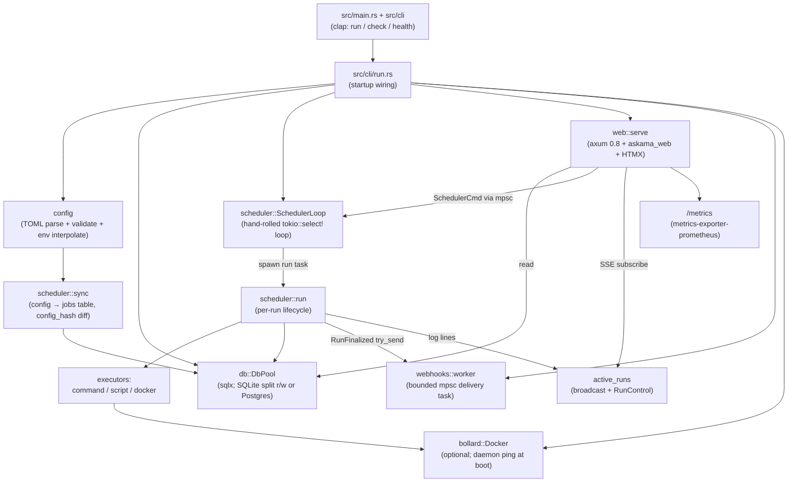
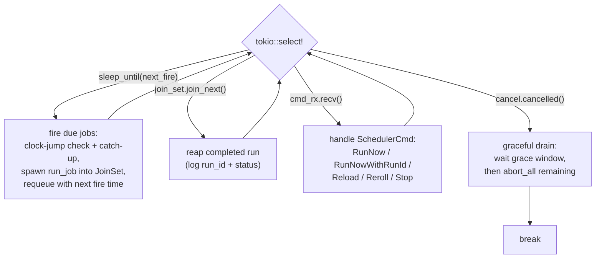
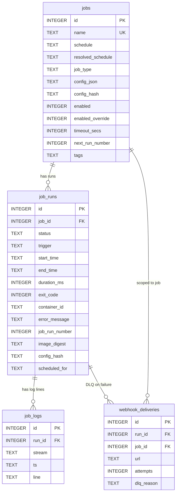

<!-- generated-by: gsd-doc-writer -->
# Cronduit Architecture

How Cronduit is put together: the process, the modules, the scheduler loop, Docker execution, persistence, the web/HTMX layer, and observability. For the full behavioral contract see [SPEC.md](SPEC.md); for every config key see [CONFIG.md](CONFIG.md); for the security posture see [../THREAT_MODEL.md](../THREAT_MODEL.md).

## System overview

Cronduit is a single Rust binary (`cronduit`, edition 2024) that runs recurrent jobs and serves a server-rendered web dashboard to observe them. One process hosts everything: the cron scheduler loop, the per-run executors (local command, inline script, ephemeral Docker container), the persistence layer (SQLite by default, PostgreSQL optional), the embedded web UI, the webhook delivery worker, and a Prometheus `/metrics` endpoint. There is no message broker, no separate worker fleet, and no SPA — the architecture is a long-lived async runtime (`tokio`, `features = ["full"]`) wired together at startup in `src/cli/run.rs`.

The CLI surface is three subcommands (`src/cli/mod.rs`): `run` (the daemon — loads config, migrates the DB, spawns the scheduler, serves the web UI), `check <config>` (validate config without touching the DB), and `health` (probe the local `/health` endpoint, intended as a Dockerfile `HEALTHCHECK`). `src/main.rs` only parses args, initializes telemetry, and dispatches.

## Component diagram



## Module layout

The crate exposes a library (`src/lib.rs`) plus a thin binary; integration tests in `tests/` drive the library directly.

| Module | Path | Responsibility |
|--------|------|----------------|
| `cli` | `src/cli/` | Arg parsing (`mod.rs`), and the three subcommand entry points: `run.rs` (daemon startup wiring), `check.rs` (config validation), `health.rs` (healthcheck probe). |
| `config` | `src/config/` | TOML parsing, `${ENV_VAR}` interpolation (`interpolate.rs`), validation (`validate.rs`), `[defaults]` merge (`defaults.rs`), and SHA-256 config hashing (`hash.rs`). Never touches the DB. |
| `db` | `src/db/` | `DbPool` abstraction over SQLite (split read/write pools) and Postgres; idempotent migration runner (`mod.rs`); all SQL in `queries.rs`; Phase-11 backfill orchestrator in `migrate_backfill.rs`. |
| `scheduler` | `src/scheduler/` | The core. `mod.rs` is the `select!` loop; `fire.rs` the min-heap fire queue; `run.rs` per-run lifecycle; `command.rs`/`script.rs`/`docker*.rs` the executors; `random.rs` the `@random` resolver; `reload.rs` config reload; `sync.rs` config→DB sync; `retention.rs` the log pruner; `control.rs` per-run stop control; `log_pipeline.rs` the log channel/batcher. |
| `web` | `src/web/` | axum router (`mod.rs`), `AppState`, request handlers (`handlers/`), askama template helpers (`format.rs`, `ansi.rs`, `stats.rs`, `exit_buckets.rs`), CSRF cookie middleware (`csrf.rs`), and embedded-asset serving (`assets.rs`). |
| `webhooks` | `src/webhooks/` | Outbound webhook delivery: bounded-mpsc worker (`worker.rs`), dispatcher trait + HTTP/Noop impls (`dispatcher.rs`), retry/DLQ logic (`retry.rs`), event + payload types, HMAC signing. |
| `telemetry` | `src/telemetry.rs` | `tracing` subscriber init (JSON or text) and the Prometheus recorder + metric descriptions. |
| `shutdown` | `src/shutdown.rs` | SIGTERM/SIGINT → `CancellationToken`, and SIGHUP → reload command. |

Templates live in `templates/` (askama: `base.html`, `pages/`, `partials/`); CSS/JS/fonts/favicons in `assets/` and are compiled into the binary with `rust-embed`.

## Data flow

**Startup (`src/cli/run.rs::execute`)** — the wiring spine, in order:

1. Resolve config path (CLI `--config` → default `/etc/cronduit/config.toml`).
2. `config::parse_and_validate` — parse TOML, interpolate env, merge defaults, validate. Errors print and exit non-zero before any DB work.
3. Apply CLI overrides for `--database-url` / `--bind` (logged, secrets redacted).
4. `DbPool::connect` then `pool.migrate()` (idempotent — safe every boot).
5. Assert the Phase-11 backfill invariant (no NULL `job_run_number` rows), parse the timezone, and `scheduler::sync::sync_config_to_db` to reconcile the config against the `jobs` table.
6. Emit the structured startup event; if `--bind` is non-loopback, emit a loud unauthenticated-UI warning (see [../THREAT_MODEL.md](../THREAT_MODEL.md)).
7. Install signal handlers, set up the Prometheus recorder, connect the (optional) Docker client and ping it, reconcile orphaned containers, spawn the retention pruner and the webhook worker, then `scheduler::spawn` the loop and `web::serve` (which blocks until the cancel token fires). On shutdown: await the scheduler drain, await the webhook worker, close the pools.

**A scheduled run** — the heap surfaces the next fire instant; the loop wakes, computes due jobs, and for each spawns `scheduler::run::run_job` into a `JoinSet`. `run_job` inserts a `running` row, dispatches to the matching executor, streams log lines into the per-run broadcast channel (and batches them to `job_logs`), then finalizes the row (status, exit code, duration, image digest) and emits a `RunFinalized` event to the webhook worker.

**A web "Run Now"** — the API handler (`web/handlers/api.rs`) inserts the `job_runs` row itself, then sends `SchedulerCmd::RunNowWithRunId { job_id, run_id }` over the command mpsc. The scheduler dispatches `run_job_with_existing_run_id`, reusing the pre-inserted row. This handler-side insert eliminates the run-detail 404 race that a scheduler-side insert would create.

## The scheduler loop

The loop is hand-rolled on `tokio` (not `tokio-cron-scheduler`), living in `src/scheduler/mod.rs::SchedulerLoop::run`. It owns a `BinaryHeap<Reverse<FireEntry>>` (min-heap, O(log n) next-fire lookup), a `JoinSet<RunResult>` of in-flight runs, the resolved `jobs` map, a `CancellationToken`, and an mpsc `SchedulerCmd` receiver. Each iteration is a single `tokio::select!` over four arms:



Key semantics:

- **Cron parsing** is `croner` 3.0, timezone-aware via the configured `[server].timezone`. Fire instants are computed against that zone so `@daily` means local midnight, not UTC.
- **`@random` schedules** are resolved by `scheduler/random.rs` (Cronduit's own implementation, honoring `random_min_gap`); the chosen slot is written into the same `fire_time` field before being pushed to the heap, so cron and `@random` ticks share one dispatch path.
- **Clock jumps** (`fire::check_clock_jump`) are detected against the expected wake time; missed fires spawn `"catch-up"` runs carrying the missed fire-decision time.
- **Commands** arrive over a bounded mpsc (capacity 32). `Reload` coalesces: reloads queued while one is in flight collapse to a single additional reload. `Stop` looks up the run's `RunControl` in the shared `active_runs` map and fires it (operator reason); if the run already finalized, it replies `AlreadyFinalized` with no DB read — the merged `active_runs` map is itself the race token.
- **Graceful shutdown** drains the `JoinSet` within `[server].shutdown_grace`; runs that don't finish in the window are `abort_all`'d (their child cancellation tokens already fired). A structured summary records drained vs. force-killed counts.

`active_runs` (`Arc<RwLock<HashMap<i64, RunEntry>>>`) is the single source of truth shared between the scheduler loop, each `run_job`, and the SSE handlers. Each `RunEntry` holds the log `broadcast::Sender`, the `RunControl` (stop token), and the job name captured at run start.

## Job execution and Docker network modes

Each fired job runs as its own `tokio` task through `scheduler/run::run_job`: insert `running` row → spawn the log-writer task → dispatch to the executor → close the log channel and join the writer → finalize the row + record metrics + remove the broadcast sender. Per-job timeouts produce `status=timeout` with partial logs; concurrent runs of the same job each get their own `job_runs` row.

Three executor types are selected from the job's stored config:

- **command** (`scheduler/command.rs`) — argv-split with `shell-words` and executed directly. No shell is invoked.
- **script** (`scheduler/script.rs`) — an inline script written to a temp file and run.
- **docker** (`scheduler/docker.rs`) — a full ephemeral-container lifecycle via `bollard` (no `docker` CLI shelling).

The Docker executor (`execute_docker`) parses the docker config (`image`, `env`, `volumes`, `cmd`, `network`, `container_name`, `delete`, `labels`), runs network pre-flight, ensures the image is pulled, then `create → start → inspect (image digest) → wait/timeout/cancel → drain logs → remove`. It sets `auto_remove = false` deliberately to avoid the moby#8441 race that can truncate exit codes; Cronduit removes the container itself after state is captured (unless `delete = false` preserves it for post-mortem). Containers are labeled `cronduit.run_id` and `cronduit.job_name` (never secrets); operator labels are merged but the cronduit-internal labels structurally win.

Network modes are validated before container create (`scheduler/docker_preflight.rs`):

| Mode | Pre-flight behavior |
|------|--------------------|
| `container:<name>` | Inspect the target; require it to be **running** (the marquee VPN-sidecar feature) — else `network_target_unavailable`. |
| `host`, `none`, `bridge`, `""` | Built-in — no validation needed. |
| named network | Inspect for existence — else `network_not_found`. |

If Docker is unreachable at all, pre-flight returns `docker_unavailable`. The Docker client is optional: if `bollard::Docker::connect_with_defaults()` fails at startup, Cronduit still boots and command/script jobs work; only docker-type jobs fail. At boot, orphaned containers (rows still `running` in the DB) are reconciled (`scheduler/docker_orphan.rs`).

## Persistence model

`db::DbPool` is an enum over two backends with one logical schema. SQLite uses **two** pools against the same file — a single-writer pool (`max_connections = 1`) plus an 8-connection reader pool, both with WAL journaling, `busy_timeout = 5000ms`, and foreign keys on. This is the documented mitigation for SQLite writer contention. Postgres uses one 16-connection pool. TLS is rustls-only (`sqlx` features `runtime-tokio` + `tls-rustls`); the build forbids OpenSSL.

Migrations live in per-dialect directories (`migrations/sqlite/` and `migrations/postgres/`) because `sqlx::migrate!(PATH)` bakes the path into the binary; the two dialects are kept structurally identical and guarded by `tests/schema_parity.rs`. `migrate()` is idempotent and uses a conditional two-pass strategy to safely apply a NOT NULL tightening (`job_run_number`) on upgrade-in-place databases.



Notes grounded in the schema:

- `jobs.config_json` is `TEXT` (never JSONB) and **never** contains secret values — only env key names are serialized (`scheduler/sync.rs`). `config_hash` is the SHA-256 of the normalized config and drives the sync diff: new jobs INSERT, changed jobs UPDATE, jobs missing from the config get `enabled = 0`.
- Timestamps are RFC3339 `TEXT` for cross-dialect portability.
- The schema grew via additive migrations: `job_run_number`/`next_run_number` (per-job run counter), `enabled_override`, `image_digest`, per-run `config_hash`, `scheduled_for` (fire-decision time, for fire-skew display), `tags` (`TEXT NOT NULL DEFAULT '[]'`), and the `webhook_deliveries` dead-letter table.

## Web UI and HTMX rendering

The web layer is axum 0.8 with default features off (only `tokio`, `http1`, `http2`, `json`, `macros`, `query`, `form`). HTML is server-rendered with `askama` 0.15 templates wired to axum via `askama_web` (the `axum-0.8` feature — `askama_axum` is deprecated and not used). Live updates use HTMX (vendored in `assets/vendor/`, embedded — never a CDN). `AppState` carries the pool, the scheduler command sender, the timezone, the Prometheus handle, and the shared `active_runs` map; CSRF cookie middleware and `TraceLayer` wrap the router.

Routes (`web/mod.rs::router`):

- **Pages**: `/` (dashboard), `/jobs/{id}` (job detail + run history), `/jobs/{job_id}/runs/{run_id}` (run detail), `/settings`, `/timeline`.
- **HTMX partials**: `/partials/job-table`, `/partials/run-history/{id}`, `/partials/jobs/{job_id}/runs`, `/partials/log-viewer/{run_id}`, `/partials/runs/{run_id}/logs` — small fragments swapped into the page without full reloads.
- **JSON/control API**: `GET /api/jobs`, `GET /api/jobs/{id}/runs`, `POST /api/jobs/{id}/run` (Run Now), `POST /api/reload`, `POST /api/jobs/{id}/reroll`, `POST /api/runs/{run_id}/stop`, `POST /api/jobs/bulk-toggle`. Control actions translate to `SchedulerCmd`s over the mpsc.
- **Live logs**: `GET /events/runs/{run_id}/logs` — Server-Sent Events. The handler subscribes to that run's `broadcast_tx` in `active_runs`; when the executor finalizes and drops its sender, subscribers see channel-closed and the stream terminates.
- **Static/embedded**: `/static/{*path}` and `/vendor/{*path}` served from `rust-embed` bundles with long-lived immutable cache headers.

The web UI ships **unauthenticated** in v1 and binds to `127.0.0.1:8080` by default. See [../THREAT_MODEL.md](../THREAT_MODEL.md) and the README security section for the operator threat model — it is not restated here.

## Webhooks

Webhook delivery is decoupled from the scheduler via a bounded mpsc + dedicated worker task (`webhooks/worker.rs`). `finalize_run` emits a `RunFinalized` event with `try_send` (never `send().await`, so a saturated channel never blocks the scheduler); on `TrySendError::Full` the `cronduit_webhook_delivery_dropped_total` counter increments. The worker dispatches through the `WebhookDispatcher` trait — `NoopDispatcher` when no job configures a webhook (no `reqwest::Client` is even built), otherwise an `HttpDispatcher` wrapped in a `RetryingDispatcher` that records failed deliveries to the `webhook_deliveries` dead-letter table. On SIGTERM the worker drains within `[server].webhook_drain_grace`. Payload shape, HMAC signing, retry classification, and metrics are documented in [WEBHOOKS.md](WEBHOOKS.md).

## Observability

- **Logging** is `tracing` + `tracing-subscriber`, initialized in `telemetry::init` to either JSON (default, for Docker stdout collection) or text. Spans/targets are namespaced `cronduit.*` (e.g. `cronduit.scheduler`, `cronduit.docker`, `cronduit.run`, `cronduit.webhooks`, `cronduit.startup`). The default filter is `info,cronduit=debug`.
- **Metrics** use the `metrics` facade with `metrics-exporter-prometheus`, rendered at `GET /metrics`. The recorder is installed once (memoized via `OnceLock`) and every family is eagerly described and zero-seeded at boot so HELP/TYPE lines and label rows exist before the first observation. Families include `cronduit_scheduler_up`, `cronduit_jobs_total`, `cronduit_runs_total{status}` (and job-scoped variants), `cronduit_run_duration_seconds` (homelab-tuned buckets), `cronduit_run_failures_total` (closed-enum reason label), `cronduit_docker_reachable`, and the webhook delivery families. Status and per-job × per-status label values are pre-seeded so Prometheus alerts fire from the first scrape.
- **Health**: `GET /health` returns an `ok` status object; the `cronduit health` subcommand probes it for use as a Dockerfile `HEALTHCHECK`.

## Directory structure rationale

```
src/
  main.rs          thin entrypoint: parse args, init telemetry, dispatch
  lib.rs           library root (re-exports modules for integration tests)
  cli/             subcommands + startup wiring (run.rs is the spine)
  config/          TOML → validated Config (no DB access)
  db/              DbPool, migrations, all SQL queries
  scheduler/       the core: select! loop, fire heap, executors, reload, sync
  web/             axum router, handlers, askama helpers, embedded assets
  webhooks/        bounded-mpsc delivery worker + dispatchers + DLQ
  telemetry.rs     tracing + Prometheus setup
  shutdown.rs      signal → cancellation / reload
migrations/
  sqlite/          per-dialect migration files (path baked by sqlx::migrate!)
  postgres/        kept structurally identical; guarded by schema_parity test
templates/         askama HTML (base + pages/ + partials/)
assets/            CSS, vendored HTMX, fonts, favicons (embedded via rust-embed)
tests/             integration tests driving the library crate
```

The `config` boundary is deliberately DB-free so `cronduit check` reuses the exact parse/validate pipeline the daemon uses. The `scheduler` owns all timing and execution semantics (rather than a library) precisely because `@random`, `random_min_gap`, per-job timeouts, and graceful drain need first-class control. The `web` layer is read-mostly: it queries the DB directly for display and pushes all mutations through the scheduler's command channel, keeping a single owner for job state.

## See also

- [SPEC.md](SPEC.md) — full behavioral specification
- [CONFIG.md](CONFIG.md) — every config key, defaults, and env interpolation
- [WEBHOOKS.md](WEBHOOKS.md) — webhook payloads, signing, retries, metrics
- [../THREAT_MODEL.md](../THREAT_MODEL.md) — security posture and threat model
- [../README.md](../README.md) — install and self-host quickstart
