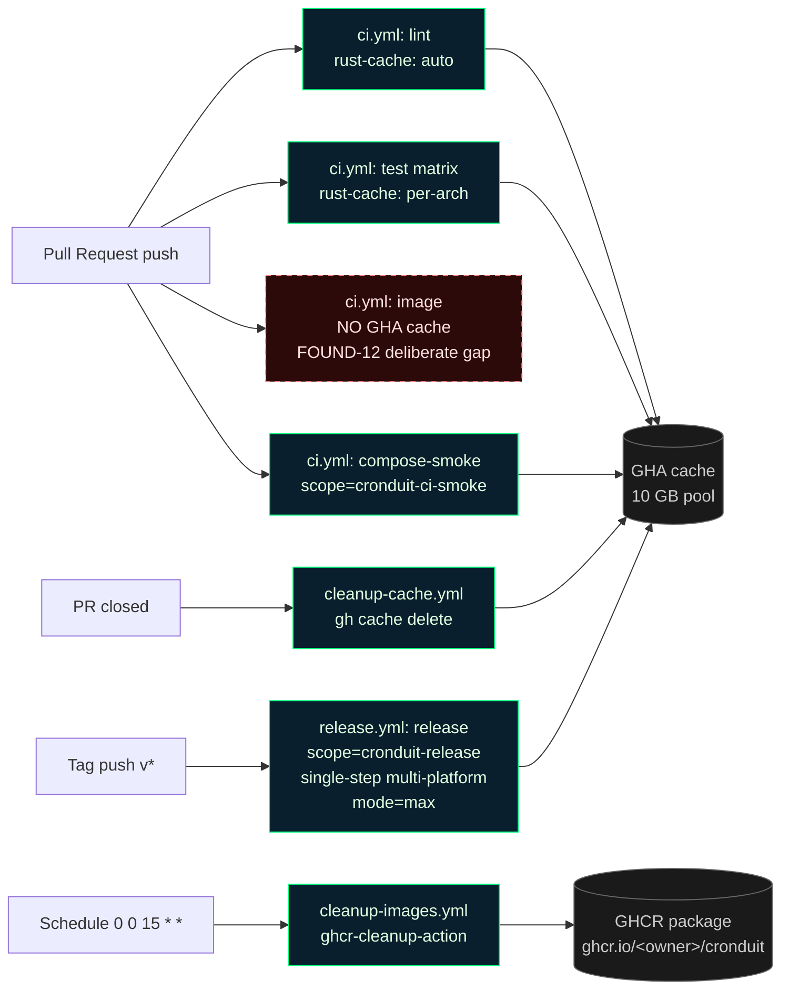

# CI Caching Topology

This document is the authoritative reference for every cache wired into Cronduit's GitHub Actions workflows. Read it before adding a new workflow, changing a cache key, or debugging a slow CI run.

> Related documents: [`.github/workflows/ci.yml`](../.github/workflows/ci.yml), [`.github/workflows/release.yml`](../.github/workflows/release.yml), [`.github/workflows/cleanup-cache.yml`](../.github/workflows/cleanup-cache.yml), [`.github/workflows/cleanup-images.yml`](../.github/workflows/cleanup-images.yml), [`justfile`](../justfile).

## Why this matters

GitHub Actions gives each repository a 10 GB cache quota. A multi-arch Rust project like Cronduit can fill that quota in under a day of active development, especially with matrix builds across `amd64 × arm64 × SQLite/Postgres`. Once the quota is hit, GHA starts LRU-evicting entries — meaning CI throughput degrades unpredictably. We avoid that by:

1. **Scoping every Docker cache to a unique name** so independent jobs do not poison each other's layers.
2. **Using `Swatinem/rust-cache@v2`** on every cargo-running job (it keys on `Cargo.lock` + rustc version + env automatically).
3. **Cleaning up PR caches the moment a PR is closed** — see [`cleanup-cache.yml`](../.github/workflows/cleanup-cache.yml).
4. **Cleaning up GHCR images on a monthly schedule** — see [`cleanup-images.yml`](../.github/workflows/cleanup-images.yml).

## Cache inventory

| Cache name | Type | Workflow | Job | Key / scope | What evicts it |
|---|---|---|---|---|---|
| cargo registry + index + target (lint) | `Swatinem/rust-cache@v2` | `ci.yml` | `lint` | auto (Cargo.lock + rustc + job + env) | Cargo.lock change, rustc bump, 7-day staleness |
| cargo registry + index + target (test, per arch) | `Swatinem/rust-cache@v2` | `ci.yml` | `test` (matrix: amd64, arm64) | arch suffix via `with: key: ${{ matrix.arch }}` | Cargo.lock change, rustc bump, 7-day staleness (keyed per arch so amd64/arm64 are isolated) |
| Docker buildx layers (compose-smoke) [¹] | `docker/build-push-action@v6` + `type=gha` | `ci.yml` | `compose-smoke` | `scope=cronduit-ci-smoke` | Dockerfile change, base image digest change, 7-day TTL |
| Docker buildx layers (release, single-step multi-arch) [²] | `docker/build-push-action@v6` + `type=gha` | `release.yml` | `release` | `scope=cronduit-release` | Dockerfile change, base image digest change, 7-day TTL |
| Docker buildx layers (PR-path `image` job) | **NOT CACHED (deliberate gap)** | `ci.yml` | `image` (pull_request path) | — | See § "Deliberate cache gaps" below |
| Tailwind standalone binary | N/A | — | — | — | See § "Not cached (and why)" below |
| cargo-zigbuild cross targets | Covered by `Swatinem/rust-cache@v2` | `ci.yml` | `test` | arch suffix (same entry as row 2) | Same as row 2 |
| GHCR image retention | — (retention policy, not a cache) | `cleanup-images.yml` | `cleanup` | n/a | Monthly schedule `0 0 15 * *` + manual dispatch |
| PR-scoped GHA cache eviction | — (deletion, not a cache) | `cleanup-cache.yml` | `cleanup` | n/a | On every `pull_request: { types: [closed] }` event |

[¹] `cronduit-ci-smoke` intentionally omits the arch suffix: the `compose-smoke` job is amd64-only (`platforms: linux/amd64`), so no arch disambiguation is needed. The name asymmetry with hypothetical `cronduit-ci-<arch>` scopes is a convention, not a bug — changing it would invalidate any existing GHA cache entries for this scope.

[²] `cronduit-release` is a single scope for a single-step multi-platform build. See § "Why one scope for the multi-arch release" below.

### Why one scope for the multi-arch release

`release.yml` runs a single `docker/build-push-action@v6` step with `platforms: linux/amd64,linux/arm64` and `cache-to: type=gha,mode=max,scope=cronduit-release`. This single step produces both arch variants in one buildx invocation.

A single scope is correct here because:

1. **`mode=max`** writes ALL intermediate layers to the cache — not just the final image layers. This is what makes cross-run cache hits possible for multi-stage Dockerfiles.
2. **Per-layer content-addressable identity includes the platform.** Buildx stores each layer keyed by `<sha256> + <platform>`, so amd64 and arm64 layers DO NOT cross-poison even when sharing a cache scope. The platform is part of the layer's identity, not a separate namespace.
3. **Splitting into two per-arch steps would double the build matrix and roughly triple the wall-clock time** without any measurable cache-hit-rate improvement, because the layers are already disambiguated by platform.

The "per-arch scope" guidance in Phase 9 `CONTEXT.md` applies to the **parallel per-arch builds** case (e.g., a future refactor where `ci.yml`'s `image` job is split into two parallel matrix cells, one per arch, each with its own step). The `release.yml` job is a **single-step multi-platform** build, so it correctly uses ONE scope. Both patterns are valid; they are NOT in conflict.

## Deliberate cache gaps

### PR-path `image` job in `ci.yml` (no GHA Docker cache — FOUND-12 / D-10)

**Status:** KNOWN AND ACCEPTED. This is an architectural decision, not an oversight. Do not file a cache-miss bug for this job; do not attempt to "fix" it without first reading this section.

**What:** The PR-path `image` job in `ci.yml` has NO GitHub Actions `type=gha` Docker layer cache. The step is literally:

```yaml
- name: just image (PR -- build only)
  if: github.event_name == 'pull_request'
  run: just image
```

**Why:** The `ci.yml` header comment encodes the project-wide FOUND-12 / D-10 invariant:

> *Every `run:` step invokes `just <recipe>` exclusively (D-10 / FOUND-12). No inline `cargo` / `docker` / `rustup` / `sqlx` / `npm` / `npx` commands.*

The `just image` recipe calls `docker buildx build` directly. That buildx invocation does NOT wire GHA cache integration, because enabling GHA cache would require one of:

1. Passing `--cache-from=type=gha`/`--cache-to=type=gha,mode=max` to buildx through the justfile recipe with GHA-specific environment assumptions; or
2. Replacing the `- run: just image` step with a `uses: docker/build-push-action@v6` step.

Option 2 would force the `image` job to bypass the justfile and break FOUND-12 (a `run:` step must exist only to invoke `just <recipe>`; a `uses:` step replacing a `run:` step is the gap we are closing, not honoring).

Option 1 is technically possible, but it would bleed GitHub Actions environment concerns into the local-dev entry point: when a developer runs `just image` locally, the recipe would either need to no-op the cache flags (adding conditional logic to the recipe) or fail if GHA-specific env vars are absent. The justfile-as-single-source-of-truth invariant is specifically meant to prevent this coupling so that `just image` behaves identically on a laptop and in CI.

**Cost:** The PR-path `image` job's Docker layer cache hit rate is ~0% on cold runs. Every PR that changes the Dockerfile or a source file that ends up in the build context triggers a full multi-stage rebuild. The job is gated by `needs: [lint, test]` and the default `paths:` filters inherited from the workflow's `on:` trigger, so it only runs when the overall CI for a PR runs — meaning the cache gap does not inflate CI time on unrelated documentation-only PRs that skip the workflow entirely.

**Why this is acceptable:**

- Dev-loop speed does not depend on this job: developers iterate locally with `just image` against the local Docker daemon's own layer cache (which is warm across iterations on a single machine).
- The main-branch path (`- run: just image-push`) and the release path (`docker/build-push-action@v6` in `release.yml`) are the throughput-critical cache consumers, and both are either warm (main, because consecutive main-branch pushes hit the same runner-adjacent daemon) or explicitly cached (release, via `scope=cronduit-release`).
- Preserving FOUND-12 is more valuable than one PR-path cache hit. A future contributor reading the ci.yml header comment can trust it without exceptions.

**When to revisit:** If PR-path `image` job runtime becomes a measured bottleneck (>5 min p50 across a rolling 50-run window), the options are (in order of preference):

1. Tighten `paths:` filters so the job runs less often.
2. Move the Dockerfile itself to be more cache-friendly (bigger base stage, smaller diff surface, earlier `COPY Cargo.toml Cargo.lock` for the dep-fetch stage).
3. As a last resort, introduce a narrow `docker/build-push-action@v6` `uses:` step for the PR path (which is permitted under FOUND-12 because `uses:` steps are NOT constrained by the rule — only `run:` steps are). This would be a deliberate, one-step exception with this doc updated to match.

## Not cached (and why)

- **Tailwind standalone binary.** Cronduit's Docker build does not run `just tailwind` inside the Dockerfile — the `assets/static/app.css` file is expected to be already generated in the repo checkout or regenerated by the developer locally. No CI workflow step currently invokes `just tailwind` either, so there is nothing to cache. If a future workflow adds `- run: just tailwind`, add an `actions/cache@v4` step preceding it keyed on the Tailwind version extracted from `justfile` (currently `v3.4.17`, baked into the `tailwind:` recipe).
- **cargo-zigbuild cross targets.** Handled transparently by `Swatinem/rust-cache@v2` because the zig toolchain and rustup targets live under `~/.cargo` and `~/.rustup`, both of which are covered by the `rust-cache` action's default paths. No separate cache entry needed.
- **cargo nextest archive (`target/nextest/`).** Not currently cached — the marginal speedup is small compared to the cargo build cache that already covers it. Revisit if CI profiles show nextest rebuild time becoming a hot spot.
- **testcontainers Postgres image.** Pre-pulled from `mirror.gcr.io` in the `test` job to avoid the anonymous Docker Hub rate limit (see `ci.yml` § "Pre-pull testcontainers images via mirror.gcr.io"). This is rate-limit mitigation, not caching: the image is fetched once per job, not stored between runs. A future optimization could add `actions/cache` around `/var/lib/docker/...`, but that interacts badly with the Docker daemon's internal layout and is not worth the complexity yet.

## Cache flow



## Debugging a cache miss

When a CI run takes 2–3× longer than expected, it is almost always a cache miss. Debug in this order:

1. **Confirm the cache entry exists.** From a local shell with `gh` auth:

   ```bash
   gh cache list --limit 50 --ref <branch-or-refs/pull/N/merge>
   ```

   If the entry is missing, it was either never created (the job did not reach the post-step phase of the cache action) or it was evicted (see step 3).

2. **Check the scope string.** For Docker caches, `grep -n 'scope=' .github/workflows/ci.yml .github/workflows/release.yml` should enumerate every scope. Two jobs sharing a scope (except the single-step multi-platform release case documented above) will corrupt each other's layer cache.

3. **Check eviction.** GHA uses LRU eviction at 10 GB. If the total cache size is near the limit, older PR caches get evicted first. The `cleanup-cache.yml` workflow runs on every PR close specifically to reclaim space — if it is failing, the repo is at risk. Check `gh run list --workflow=cleanup-cache.yml` for recent failures.

4. **Check the key.** `Swatinem/rust-cache@v2` keys on `Cargo.lock` + rustc version + (on the `test` job) the matrix arch. A dependency bump OR a rustup toolchain update invalidates the key — that is expected. If keys are churning every run without obvious cause, look for a tool that writes to `Cargo.lock` in a step before the cache restore (e.g. `sqlx-cli prepare` updating `.sqlx/`).

5. **Read the cache action logs.** Expand the "Run `actions/cache`" / "Run `Swatinem/rust-cache`" step in the GHA UI. Success looks like `Cache restored from key: ...`; failure looks like `Cache not found for input keys: ...`.

6. **Is it the PR-path `image` job?** If so, the job does NOT have a GHA cache by design — see § "Deliberate cache gaps". Do not file a cache-miss bug for that job.

## Adding a new cache

Any new cache MUST:

1. Use `actions/cache@v4` (or `Swatinem/rust-cache@v2` for cargo, or `type=gha` for Docker buildx) — no hand-rolled cache keys, no third-party cache actions without a documented justification.
2. Set an explicit unique `scope=` (Docker) or `key:` (actions/cache). Exception: single-step multi-platform `docker/build-push-action@v6` builds with `mode=max` may use a single scope (see § "Why one scope for the multi-arch release").
3. Be documented in this file's inventory table and the mermaid diagram.
4. Have an owner in the pull request description noting who to ping if the cache misbehaves.
5. Respect FOUND-12 / D-10: if the cache would require changing a `- run:` step to a `- uses:` step, document the trade-off in § "Deliberate cache gaps" first.

## Verification playbook (post-merge)

After Phase 9 merges, the operator should run the following manual checks to confirm the new workflows work end-to-end:

1. **`cleanup-cache.yml` fires only on PR close.** Open a draft PR → close it → `gh run list --workflow=cleanup-cache.yml` shows a run; `gh run list --workflow=cleanup-cache.yml --event=push` shows zero runs.
2. **`cleanup-images.yml` dispatches manually.** `gh workflow run cleanup-images.yml`, then `gh run list --workflow=cleanup-images.yml`. Confirm exit code 0 and scan the run log for the retention-policy summary (keep-n-tagged: 2, older-than: 30 days).
3. **`update-project.sh` dry-run.** `./scripts/update-project.sh --dry-run` from a clean checkout exits 0 and makes zero file mutations (`git status --porcelain` is empty afterwards).
4. **CI green with new caches.** Open a test PR touching a trivial file; confirm every job goes green and the `Cache restored` messages appear in `lint`, `test`, and `compose-smoke` on the second push (first push warms the cache, second push hits it). The `image` job will NOT show a cache-restore log line — that is expected per § "Deliberate cache gaps".
5. **Scope strings match doc.** `grep -n 'scope=' .github/workflows/ci.yml .github/workflows/release.yml` matches the "Cache inventory" table in this file. If the two drift, this doc is authoritative and the workflow files must be updated to match — not the other way around.
