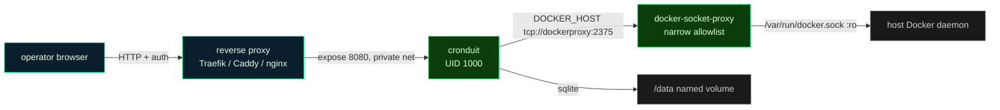
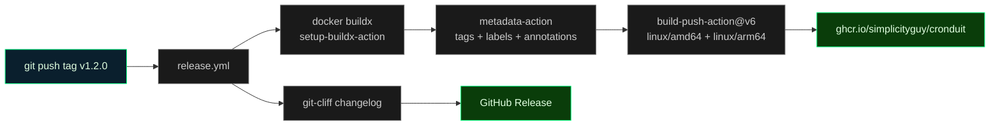

<!-- generated-by: gsd-doc-writer -->
# Deployment

Production self-hosting guide for Cronduit — a single Rust binary that runs inside Docker, mounts the host Docker socket, and serves a web UI for observing scheduled jobs.

Cronduit ships **unauthenticated in v1**. The default bind is `127.0.0.1:8080` and the process logs a loud `WARN` if you bind it to any non-loopback address. Read the [Security posture](#security-posture) section before exposing it anywhere.

Related docs (cross-referenced, not duplicated):

- [README.md](../README.md) — Security section, Quickstart, and the full Docker image tag table.
- [docs/QUICKSTART.md](QUICKSTART.md) — first-run walkthrough.
- [docs/CONFIG.md](CONFIG.md) — every config key and its semantics.
- [THREAT_MODEL.md](../THREAT_MODEL.md) — the four threats (Docker Socket, Untrusted Client, Config Tamper, Malicious Image) and the trade-offs behind the v1 posture.

---

## Deployment targets

Cronduit deploys as a single OCI image. There is no static-binary install path documented for production — the binary expects to run inside the container alongside the host Docker socket.

| Target | Config file | Notes |
|--------|-------------|-------|
| Docker Compose (default) | `examples/docker-compose.yml` | Single container, direct `/var/run/docker.sock` mount via `group_add`. Linux + Rancher Desktop. |
| Docker Compose (hardened) | `examples/docker-compose.secure.yml` | `tecnativa/docker-socket-proxy` sidecar mediates the Docker API through a narrow allowlist; no direct socket mount in the Cronduit container. Required on macOS + Docker Desktop; recommended everywhere for defense-in-depth. |
| `docker run` | — | Supported for ad-hoc runs; Compose is the documented path. |

Both Compose files are runnable as-is:

```bash
# default (Linux): derive the host docker group GID first
export DOCKER_GID=$(stat -c %g /var/run/docker.sock)
docker compose -f examples/docker-compose.yml up -d

# hardened (any host, no GID alignment needed)
docker compose -f examples/docker-compose.secure.yml up -d
```

### Pulling the image

Images are published to `ghcr.io/simplicityguy/cronduit` for `linux/amd64` and `linux/arm64`. The manifest is a multi-arch index, so `docker pull` selects the right architecture automatically.

```bash
docker pull ghcr.io/simplicityguy/cronduit:1.2
```

Pick a tag by risk tolerance — the canonical, maintained tag table lives in the [README Docker image tags](../README.md#docker-image-tags) section. Summary:

| Tag | Points at | Recommended for |
|-----|-----------|-----------------|
| `:X.Y.Z` (e.g. `:1.2.0`) | An immutable release digest | Production wanting reproducibility |
| `:X.Y` (e.g. `:1.2`) | Latest patch of that minor line | Production wanting auto patch fixes |
| `:X` (e.g. `:1`) | Latest release of that major line | Willing to take minor upgrades |
| `:latest` | Latest stable release | "Just try it" / quickstart only |
| `:rc` | Latest release candidate | Early adopters |
| `:main` | CI build of `main` tip | Bleeding edge; not for uptime-sensitive deployments |

Most long-running deployments should pin `:X.Y` (currently `:1.2`).

---

## docker-compose example

A minimal production-shaped Compose file. This is a condensed form of `examples/docker-compose.yml` — see that file's header for the full security discussion and `DOCKER_GID` derivation per host.

```yaml
services:
  cronduit:
    image: ghcr.io/simplicityguy/cronduit:1.2
    # Join the host docker group so UID 1000 inside the container can read
    # /var/run/docker.sock. Set DOCKER_GID to `stat -c %g /var/run/docker.sock`.
    group_add:
      - "${DOCKER_GID:-999}"
    # NO host port publish for production — expose to the reverse-proxy
    # network only. Swap to `ports: ["8080:8080"]` ONLY on a trusted loopback.
    expose:
      - "8080"
    volumes:
      - /var/run/docker.sock:/var/run/docker.sock
      - ./cronduit.toml:/etc/cronduit/config.toml:ro   # read-only config mount
      - cronduit-data:/data
    environment:
      - RUST_LOG=info,cronduit=debug
      - DATABASE_URL=sqlite:///data/cronduit.db
      # Secrets referenced as ${ENV_VAR} in cronduit.toml resolve from here.
      # - BACKUP_TOKEN=...   # prefer a .env file or your orchestrator's secret store
    restart: unless-stopped

volumes:
  cronduit-data:
```

Key points:

- **`config.toml` is mounted `:ro`.** Cronduit treats the config file as the source of truth and never writes to it; the read-only mount enforces that and supports the Config Tamper posture in [THREAT_MODEL.md](../THREAT_MODEL.md).
- **`/data` is a named volume.** The SQLite database (`cronduit.db`, WAL + SHM) lives here and must survive container restarts. The image pre-creates `/data` owned by UID/GID 1000 so the volume inherits writable permissions on first mount.
- **`/var/run/docker.sock` mount is root-equivalent.** Anything Cronduit can execute is effectively root on the host. Use the hardened socket-proxy variant unless you fully trust the config source. <!-- VERIFY: host docker socket path differs on Docker Desktop / Rancher Desktop; use CRONDUIT_DOCKER_SOCKET to override -->
- **`expose:` not `ports:` for production.** `expose:` keeps 8080 reachable only from other containers on the same Docker network (your reverse proxy). `ports:` publishes on all host interfaces and, combined with the unauthenticated UI, exposes everything to anyone who can reach the host.

### Hardened variant (socket proxy)

`examples/docker-compose.secure.yml` runs a `tecnativa/docker-socket-proxy` sidecar that holds the only socket mount and exposes a default-deny HTTP allowlist (`CONTAINERS`, `IMAGES`, `POST`, `DELETE`). Cronduit reaches it via `DOCKER_HOST=tcp://dockerproxy:2375` over a private bridge network and never touches the host socket directly. Even a fully compromised Cronduit is bounded to the allowlisted verbs — it cannot reach networks, volumes, exec, or `system prune`. Use this on macOS + Docker Desktop (where socket GID alignment is brittle) and anywhere you want defense-in-depth.



---

## Security posture

Cronduit's v1 web UI ships **without authentication**. There is no login, no session, no API token on the UI surface. Whoever can reach port 8080 can view every job, trigger **Run Now**, stop runs, and reload the config.

### Default loopback bind + non-loopback WARN

The default bind is `127.0.0.1:8080` (`default_bind()` in `src/config/mod.rs`; settable via `[server].bind` or the `--bind` flag). At startup, `src/cli/run.rs` checks whether the resolved bind is a loopback address. If it is **not**, it emits a loud `WARN` on the `cronduit.startup` target before serving:

> web UI bound to non-loopback address — v1 ships without authentication; see README SECURITY and THREAT_MODEL.md. Put cronduit behind a reverse proxy with auth, or keep it on 127.0.0.1.

The warning does not block startup — it is a deliberate, visible nudge. The two safe deployment shapes are:

1. **Keep it on loopback / trusted LAN.** Bind `127.0.0.1:8080` and reach it only from the host or an SSH tunnel.
2. **Front it with an authenticating reverse proxy.** Bind to the proxy's private network (via `expose:`) and let the proxy enforce auth and TLS.

### Secret handling

No plaintext secrets belong in `cronduit.toml`. Cronduit interpolates `${ENV_VAR}` references from the process environment before the TOML parser runs (`src/config/interpolate.rs`) and wraps sensitive values such as `database_url` in a `SecretString` (the `secrecy` crate) so they are redacted from logs and debug output. Provide secrets via the container environment (a `.env` file beside the Compose file, or your orchestrator's secret store) — never bake them into the image or the config file. Missing variables fail config validation; the `${VAR:-default}` form is explicitly forbidden.

See [docs/CONFIG.md](CONFIG.md) for the full `${ENV_VAR}` rules and which keys accept interpolation.

### Reverse proxy with authentication

For any deployment beyond a single trusted loopback, put Cronduit behind a reverse proxy that terminates TLS and enforces authentication (Traefik, Caddy, nginx basic auth, an OAuth2 forward-auth, etc.). The proxy and Cronduit share a private Docker network; Cronduit uses `expose: ["8080"]` so the port is never published on the host.

Cronduit serves plain HTTP and does not terminate TLS itself (rustls is used for outbound connections such as image pulls and webhooks, not for the UI listener). TLS termination is the proxy's job. <!-- VERIFY: reverse proxy config (Traefik labels / Caddyfile / nginx vhost) is operator-specific and not shipped in this repo -->

For the security trade-offs behind shipping unauthenticated — and why fronting with an existing proxy is the intended posture — read [THREAT_MODEL.md](../THREAT_MODEL.md) (do not rely on this summary alone).

---

## Build pipeline

Release images are built and published by `.github/workflows/release.yml`, triggered on any semver tag push (`v*`).



Pipeline steps (from `.github/workflows/release.yml`):

1. **Trigger** — push a tag matching `v*` (e.g. `v1.2.0` or `v1.2.0-rc.4`).
2. **Lowercase image name** — derives `ghcr.io/<lowercase-owner>/<lowercase-repo>` (GHCR rejects uppercase repo names).
3. **Changelog** — `git-cliff` generates release notes from conventional commits.
4. **Buildx + GHCR login** — `docker/setup-buildx-action@v3`, then `docker/login-action@v3` against `ghcr.io` with the workflow `GITHUB_TOKEN`.
5. **Metadata** — `docker/metadata-action@v5` computes tags, OCI labels, and index+manifest annotations. Stable tags emit `:X.Y.Z`, `:X.Y`, `:X`, and `:latest`; pre-releases (`-rc.N`) emit `:X.Y.Z-rc.N` and the rolling `:rc`, and are excluded from `:latest`.
6. **Build and push** — `docker/build-push-action@v6` builds `linux/amd64,linux/arm64` and pushes, using the GHA cache backend (`type=gha`, scope `cronduit-release`).
7. **GitHub Release** — published; `-rc.N` tags are marked prerelease.

A separate `.github/workflows/main-build.yml` publishes the multi-arch `:main` tag on every push to `main`.

### Multi-arch (amd64 + arm64)

The `Dockerfile` cross-compiles both targets without QEMU. The builder stage (`rust:1.95.0-slim-trixie`) installs Zig and `cargo-zigbuild`, adds the `x86_64-unknown-linux-musl` and `aarch64-unknown-linux-musl` Rust targets, and `cargo zigbuild`s a fully static musl binary selected from buildx's `TARGETPLATFORM`. The runtime stage is `alpine:3` with only `ca-certificates` and `tzdata` added, running as the non-root `cronduit` user (UID/GID 1000). Migrations are embedded via `sqlx::migrate!` — there is no migration runner step and no filesystem copy of the migration SQL.

### Building images locally

The justfile drives all image work; CI calls these same recipes.

| Recipe | What it does |
|--------|--------------|
| `just image` | CI-pinned single-platform `linux/amd64` build, tagged `cronduit:dev`, `--load`ed for smoke tests. |
| `just image-local` | Builds for the host platform and tags `ghcr.io/simplicityguy/cronduit:latest` — the tag the Compose files expect, so `just image-local && docker compose up -d` works without a retag. Use for local UAT of a feature branch. |
| `just image-check` | Validates the multi-arch (`amd64,arm64`) build with `--output type=cacheonly` (buildx cannot `--load` a manifest list). |
| `just image-push <tag>` | Multi-arch push for ad-hoc releases, e.g. `just image-push simplicityguy/cronduit:1.2.0`. |
| `just release <version>` | Tags `v<version>` and pushes it, which fires `release.yml` to build and publish. The actual image build/push happens in CI, not locally. |

The standard release path is `just release 1.2.0` (or `git push origin v1.2.0`) — never a manual `docker push` to the registry.

---

## Environment setup

Production environment variables. The config-file equivalents and full key reference are in [docs/CONFIG.md](CONFIG.md) — this table is the deployment-time subset.

| Variable | Required | Purpose |
|----------|----------|---------|
| `DATABASE_URL` | No (defaults to SQLite if unset and not in config) | DB connection string. `sqlite:///data/cronduit.db` (default Compose) or a `postgres://...` URL. Wrapped in `SecretString`. |
| `DOCKER_GID` | Linux/Rancher only | The host docker group GID (`stat -c %g /var/run/docker.sock`) used by `group_add` so UID 1000 can read the socket. Defaults to `999`. Not needed in the socket-proxy variant. |
| `CRONDUIT_DOCKER_SOCKET` | No | Override the host socket path for non-standard hosts (e.g. Rancher Desktop). Defaults to `/var/run/docker.sock`. |
| `DOCKER_HOST` | Hardened variant only | Points bollard at the socket proxy: `tcp://dockerproxy:2375`. |
| `RUST_LOG` | No | Tracing filter, e.g. `info,cronduit=debug`. |
| `${ANY_SECRET}` | Per config | Any `${VAR}` referenced in `cronduit.toml` (tokens, passwords) must be present in the environment at startup or config validation fails. |

Secrets must be set in the deployment platform's environment or secret store, not committed. <!-- VERIFY: production secret names and values are deployment-specific and not in the repository -->

### Switching to PostgreSQL

The logical schema is identical across backends; per-backend migrations live in `migrations/sqlite/` and `migrations/postgres/` and run automatically on startup. To use Postgres, set `DATABASE_URL` to a `postgres://...` URL (and drop the SQLite `/data` volume requirement). No code or config-key changes are needed.

---

## Rollback procedure

There is no automated rollback step in the release pipeline. Roll back by repointing the running container at a previous immutable tag — which is exactly why production deployments should pin `:X.Y.Z` or `:X.Y` rather than `:latest`.

1. Identify the last-good version tag (e.g. `1.2.0`).
2. Update the Compose `image:` to that tag: `ghcr.io/simplicityguy/cronduit:1.2.0`.
3. Re-pull and recreate:

   ```bash
   docker compose -f examples/docker-compose.yml pull
   docker compose -f examples/docker-compose.yml up -d
   ```

4. Confirm health (see [Upgrade notes](#upgrade-notes)): `docker compose exec cronduit /cronduit health`.

Notes:

- **Database migrations are forward-only and run automatically on startup.** Rolling the image back does not roll back the schema. A patch/minor downgrade within the same major line is generally safe because the schema is additive; verify against the target version's migrations before downgrading across a major version. Back up `/data` (the SQLite DB) before any version change.
- The config file is unaffected by rollback — it is the source of truth and is re-synced to the DB on every start.

---

## Monitoring

### Health checks

The image declares a `HEALTHCHECK` that runs `/cronduit health` every 30s (5s timeout, 60s start period to allow migration backfill, 3 retries before `unhealthy`). The `health` subcommand probes the local `/health` HTTP endpoint and exits non-zero if status is not `ok`; it reuses `--bind` (default `127.0.0.1:8080`) and does not read the config. Operator `healthcheck:` stanzas in Compose override the Dockerfile default.

Manual probe:

```bash
docker compose exec cronduit /cronduit health
```

### Prometheus metrics

Cronduit exposes Prometheus metrics at `GET /metrics` on the same listener as the web UI (`src/web/mod.rs`). Because the endpoint shares the (unauthenticated) UI port, it carries the same exposure rules — scrape it over the private network, not a published host port.

A ready-to-paste scrape job ships at `examples/prometheus.yml`:

```yaml
scrape_configs:
  - job_name: 'cronduit'
    scrape_interval: 15s
    static_configs:
      - targets: ['cronduit:8080']   # service name on the shared Docker network
```

Key metric families (full list in the [README Monitoring](../README.md#monitoring) section):

- `cronduit_scheduler_up` — liveness gauge (constant `1`).
- `cronduit_runs_total{job,status}` — run counts by status.
- `cronduit_run_duration_seconds{job}` — run-duration histogram.
- `cronduit_docker_reachable` — `1` if bollard can ping the daemon, `0` if the socket preflight failed (useful for diagnosing a wrong `DOCKER_GID` or missing mount).

A useful smoke check after bringing the stack up:

```bash
curl -sS http://localhost:8080/metrics | grep cronduit_docker_reachable
```

External alerting/dashboards (Grafana, Alertmanager) are operator-provided. <!-- VERIFY: monitoring dashboard URLs and alert routing are deployment-specific and not in the repository -->

---

## Upgrade notes

1. **Back up `/data`** before upgrading (copy the SQLite DB, or take a Postgres dump).
2. **Bump the `image:` tag** in your Compose file to the new version (or let a floating `:X.Y` tag pick it up).
3. **Pull and recreate:**

   ```bash
   docker compose -f examples/docker-compose.yml pull
   docker compose -f examples/docker-compose.yml up -d
   ```

4. **Migrations run automatically** on the next `run`. Startup binds the HTTP listener only after migration backfill completes — the 60s healthcheck start period accounts for this. Watch the logs for the `cronduit starting` startup event.
5. **Verify** health and that the expected job count appears in the startup log and the dashboard:

   ```bash
   docker compose logs --tail=20 cronduit
   docker compose exec cronduit /cronduit health
   ```

6. **Validate config before deploying** a changed `cronduit.toml`: `docker compose exec cronduit /cronduit check /etc/cronduit/config.toml` (or `just` equivalents during development). The `check` subcommand validates without touching the database.

Read the GitHub Release notes (generated by `git-cliff`) for the target version before upgrading across a minor or major line — they call out any breaking config or schema changes.
