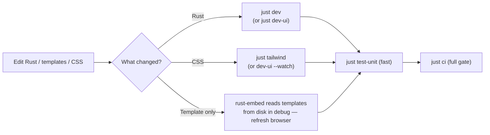
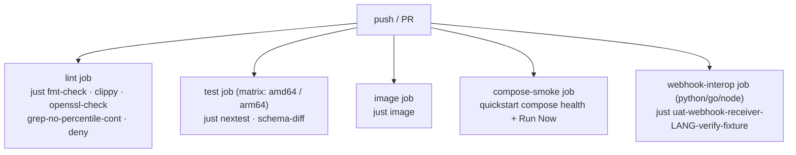

<!-- generated-by: gsd-doc-writer -->
# Cronduit Development Guide

Local development for Cronduit — the inner loop, the build toolchain, and the quality gates CI enforces.

Cronduit is a single Rust binary: a `tokio` async daemon (`axum` 0.8 HTTP server, `bollard` Docker client, `croner` scheduler, `sqlx` against SQLite/Postgres) that server-renders a Tailwind + HTMX dashboard from `askama` templates and embeds its static assets with `rust-embed`. All build/test/lint/DB/image/dev-loop operations go through `just`. **The `justfile` is the single source of truth** — every GitHub Actions job calls `just <recipe>` exclusively, so a local `just ci` run predicts the CI exit code.

For runtime configuration see [docs/CONFIG.md](CONFIG.md); for a Docker-first walkthrough see [docs/QUICKSTART.md](QUICKSTART.md); for the system design and module map see [docs/ARCHITECTURE.md](ARCHITECTURE.md).

## Prerequisites

| Tool | Version | Why |
|------|---------|-----|
| Rust toolchain | `1.94.1` (pinned) | Edition 2024. Pinned by `rust-toolchain.toml`; `rustup` auto-installs it on first `cargo` invocation. Bundles `rustfmt` + `clippy`. |
| `just` | 1.x | Task runner. Every workflow in this doc is a `just` recipe. Install via `cargo install just`, Homebrew, or your package manager. |
| `cargo-nextest` | latest | CI test runner (`just nextest`). Install via `cargo install cargo-nextest` or `taiki-e/install-action` (CI). |
| Docker | recent | Required for integration tests, image builds (`just image*`), and the compose stack. The scheduler also talks to the host Docker socket at runtime. |
| `sqlite3` CLI | any | Used by several DB inspection / UAT recipes (`uat-*`, `db-reset` cleanup). |
| `tailwindcss` standalone | v4.3.0 | Auto-downloaded by `just tailwind` into `bin/tailwindcss` — **no Node required**. |

The Rust version is pinned in two places that must stay aligned:

```toml
# rust-toolchain.toml
channel = "1.94.1"

# Cargo.toml
rust-version = "1.94.1"
```

Cross-compile targets `x86_64-unknown-linux-musl` and `aarch64-unknown-linux-musl` are declared in `rust-toolchain.toml` and installed on demand by `just install-targets` (a dependency of `just openssl-check`). Never run `rustup target add` by hand — use the recipe so local and CI stay identical.

## Getting the repo running locally

```bash
git clone https://github.com/SimplicityGuy/cronduit.git
cd cronduit
just tailwind   # download the standalone Tailwind binary + compile assets/static/app.css
just build      # cargo build --all-targets (debug)
just dev        # run the daemon against examples/cronduit.toml on 127.0.0.1:8080
```

`just dev` runs a single-process loop with readable text logs at trace level for the `cronduit` target:

```bash
DATABASE_URL=sqlite://./cronduit.dev.db?mode=rwc \
RUST_LOG=debug,cronduit=trace cargo run -- run \
    --config examples/cronduit.toml --log-format text
```

It pins `DATABASE_URL` to `cronduit.dev.db` so every other recipe in the justfile (`db-reset`, `sqlx-prepare`, the webhook DLQ and UAT inspectors) operates on the same SQLite file the daemon migrates. There is no standalone migration command — migrations run idempotently on daemon startup (`just migrate` is an alias for `just dev`). Open the dashboard at `http://127.0.0.1:8080` once startup logs the listen address.

To validate a config file without starting the scheduler:

```bash
just check-config path/to/cronduit.toml
```

## The inner dev loop



### Rust changes — `just dev`

Edit, then restart `just dev`. For an auto-restart loop with Tailwind in `--watch` mode alongside `cargo watch`, use:

```bash
just dev-ui   # runs `just tailwind`, then tailwindcss --watch + cargo watch on the daemon
```

`just dev-ui` requires `cargo-watch` (`cargo install cargo-watch`).

### Template changes — no rebuild

Static assets are embedded via `rust-embed` (`src/web/assets.rs`, `#[folder = "assets/static/"]` and `#[folder = "assets/vendor/"]`). In debug builds `rust-embed` reads from disk, so edits to `askama` templates under `templates/` and to embedded assets show up on browser refresh without a `cargo build`. Release builds embed the bytes into the binary for the single-binary deployment.

### CSS changes — Tailwind standalone, no Node

Tailwind config lives in `assets/src/app.css` using the v4 inline format (`@import "tailwindcss"`, `@source "../../templates"`, and `@theme` — there is no `tailwind.config.js`). `just tailwind` downloads the standalone v4.3.0 binary to `bin/tailwindcss` on first run (idempotent), then compiles minified CSS to `assets/static/app.css`:

```bash
./bin/tailwindcss -i assets/src/app.css -o assets/static/app.css --minify
```

`build.rs` reruns this on changes to `assets/src/app.css` or `templates/`. If `bin/tailwindcss` is missing, debug builds emit a stub `/* tailwind not built yet */` and warn; **release builds hard-fail** rather than ship an unstyled UI — so always run `just tailwind` before a release build. For live CSS editing, `just dev-ui` runs the binary in `--watch` mode.

### Database during development

The dev database is `cronduit.dev.db` (SQLite, WAL mode), git-ignored along with its `-wal`/`-shm` sidecars and `bin/tailwindcss`. Useful recipes:

```bash
just db-reset       # delete cronduit.dev.db (+ WAL/SHM)
just sqlx-prepare   # regenerate the .sqlx/ offline query cache — run before committing SQL changes
just schema-diff    # run the SQLite/Postgres schema-parity test
just clean          # cargo clean + remove generated CSS + dev DB
```

`sqlx` uses compile-time-checked queries with an offline cache. If you change any SQL (`query!`/`query_as!`) you must run `just sqlx-prepare` and commit the regenerated `.sqlx/` so CI can typecheck without a live database. Migrations live under `migrations/sqlite/` and `migrations/postgres/` — same logical schema, one file per backend per change.

## Project layout

| Path | Contents |
|------|----------|
| `src/main.rs`, `src/lib.rs` | Binary + library entry points |
| `src/cli/` | `clap` subcommands: `run`, `check` |
| `src/config/` | TOML parsing, env interpolation, validators |
| `src/scheduler/` | Hand-rolled `croner`-driven tick loop + job executor |
| `src/db/` | `sqlx` pools, models, migrations runner |
| `src/web/` | `axum` routes, `askama` handlers, embedded assets (`assets.rs`), `stats.rs` |
| `src/webhooks/` | Outbound webhook dispatch + retry/drain |
| `src/telemetry.rs`, `src/shutdown.rs` | `tracing` setup, metrics, graceful shutdown |
| `templates/` | `askama` HTML templates |
| `assets/src/app.css` | Tailwind v4 source; compiled to `assets/static/app.css` |
| `assets/vendor/` | Vendored `htmx.min.js` and other static deps |
| `migrations/{sqlite,postgres}/` | Per-backend SQL migrations |
| `examples/` | `cronduit.toml`, `docker-compose.yml`, webhook receivers |
| `tests/` | Integration + parity tests |

For data flow, the scheduler loop design, and the rationale behind each module boundary, see [docs/ARCHITECTURE.md](ARCHITECTURE.md).

## Build commands

| Command | Description |
|---------|-------------|
| `just build` | Compile all crates + tests, debug profile (`cargo build --all-targets`) |
| `just build-release` | Compile the optimized release binary |
| `just tailwind` | Download standalone Tailwind (if absent) and rebuild minified `app.css` |
| `just clean` | `cargo clean` + remove generated CSS and the dev SQLite DB |
| `just image` | Build the CI-pinned `linux/amd64` image tagged `cronduit:dev` (do not change platform/tag) |
| `just image-local` | Build for the host arch, tagged the compose-consumed `ghcr.io/simplicityguy/cronduit:latest` |
| `just image-check` | Validate the multi-arch (`amd64,arm64`) build without loading |
| `just image-push tag` | Multi-arch release push, e.g. `just image-push simplicityguy/cronduit:1.2.0` |

Docker images cross-compile musl-static binaries for amd64 + arm64 via `cargo-zigbuild` (no QEMU) and package into an `alpine` runtime. The TLS stack is rustls everywhere — see the openssl guard below.

## Quality gates

`just ci` runs the exact ordered chain CI runs; a local pass predicts the CI exit code:

```bash
just ci   # fmt-check → clippy → openssl-check → nextest → schema-diff → image
```

Run the individual gates while iterating:

| Command | Gate |
|---------|------|
| `just fmt` | Format all Rust sources in place (`cargo fmt --all`) |
| `just fmt-check` | Verify formatting (CI gate: `cargo fmt --all -- --check`) |
| `just clippy` | Lint — **warnings are errors**: `cargo clippy --all-targets --all-features -- -D warnings` |
| `just openssl-check` | rustls-only guard: `cargo tree -i openssl-sys` must be empty across native + both musl targets |
| `just test-unit` | Fast feedback — unit tests only (`cargo test --lib --all-features`) |
| `just test` | Full `cargo test --all-features` |
| `just nextest` | CI test runner (`cargo nextest run --all-features --profile ci`) |
| `just schema-diff` | SQLite/Postgres schema-parity test |
| `just grep-no-percentile-cont` | Structural-parity guard — no SQL-native percentile functions in `src/` (percentiles are computed in Rust via `src/web/stats.rs`) |
| `just deny` | `cargo-deny` supply-chain check (advisories + licenses + bans) |

Notes:

- **No `rustfmt.toml` or `clippy.toml`** — formatting uses defaults; lint strictness is enforced entirely by the `-D warnings` flag in `just clippy`.
- **`just openssl-check`** is the rustls invariant (no OpenSSL anywhere). `cargo tree -i` exits 0 regardless of matches, so the recipe pipes to `grep -q .` and loops over native + amd64-musl + arm64-musl. All TLS-bearing deps (`sqlx`, `reqwest`) are configured `default-features = false` with rustls features only — keep them that way.
- The `integration` Cargo feature gates testcontainers-backed Postgres tests; enable with `cargo test --features integration` on a host with a Docker daemon. See [docs/TESTING.md](TESTING.md) for the full test taxonomy and how to run each tier.

### What CI maps to



## Submitting changes

All changes land via pull request on a feature branch — **no direct commits to `main`**. Before opening a PR, run `just ci` locally so the gate passes on the first CI run. If you touched SQL, also run `just sqlx-prepare` and commit `.sqlx/`. If you touched CSS or templates, run `just tailwind` so `assets/static/app.css` is current.

Diagrams in any artifact (docs, PR descriptions, code comments) must be authored as mermaid code blocks — no ASCII art. See [CONTRIBUTING.md](../CONTRIBUTING.md) for the full contribution workflow, review expectations, and commit conventions.

## Releasing

Release tags are cut with `just release`, which tags `vX.Y.Z` and pushes it; CI then builds and publishes the multi-arch image:

```bash
just release 1.2.0   # git tag -a v1.2.0 && git push origin v1.2.0
```

The git tag must match the `version` in `Cargo.toml` (and other version strings). The actual multi-arch build/push runs in CI via `docker/build-push-action`; locally, `just image-push` exists for manual publishes.
