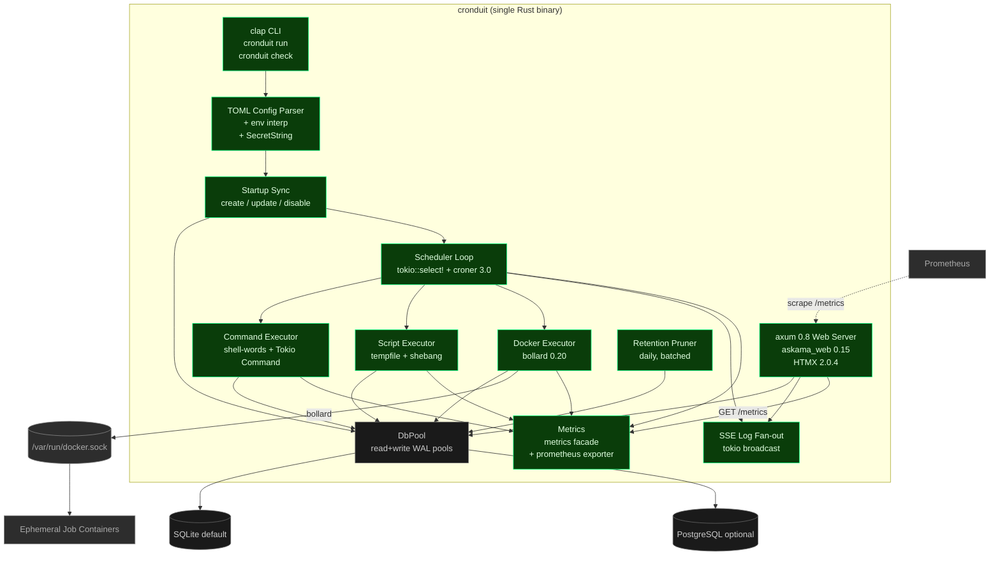

# Cronduit Specification (v1.0.0)

> **Status:** This is the authoritative behavioral reference for Cronduit as it shipped in v1.0.0 (2026-04-14). It describes what the binary actually does — not what was originally planned. For the historical pre-implementation spec, see the v1.0 milestone archive at [`.planning/milestones/v1.0-ROADMAP.md`](../.planning/milestones/v1.0-ROADMAP.md).

## Overview

Cronduit is a self-hosted cron job scheduler with a web UI, built for Docker-native homelab environments. It is a single Rust binary that:

1. Parses a TOML config file describing zero or more jobs and runs them on cron schedules in the configured timezone.
2. Executes each job as a local command, an inline script, or an ephemeral Docker container — including jobs whose Docker network is `container:<name>` (for VPN sidecar routing, the marquee differentiator).
3. Persists every job, run, and log line to SQLite (default) or PostgreSQL.
4. Serves a terminal-green HTMX web UI for observing every run, plus a Prometheus `/metrics` endpoint and a `/health` endpoint.

The core problem it solves: existing schedulers (`ofelia`, `Cronicle`, `xyOps`, `docker-crontab`, host crontabs + scattered systemd timers) either lack proper Docker networking support (`--network container:<name>`), require complex bootstrapping, don't support config-file-driven job definitions, or have no unified observability.

## System Architecture



Everything inside the dashed `Binary` boundary is one Rust binary (`cronduit`). The single binary is what ships as the multi-arch Docker image (`linux/amd64`, `linux/arm64`).

## CLI

Cronduit ships one binary with two subcommands:

| Command | Purpose |
|---|---|
| `cronduit run [--config PATH]` | Start the scheduler + web server. Default config path: `/etc/cronduit/config.toml`. |
| `cronduit check <PATH>` | Parse and validate the config without starting anything. Surfaces every error in a single GCC-style report (no fail-fast). Exit `0` on valid, non-zero on invalid. Used by `just check-config`. |
| `cronduit --version` | Prints `cronduit 1.0.0` (the value from `Cargo.toml`'s `version =` field via `env!("CARGO_PKG_VERSION")`). |

The `cronduit check` command is the supported pre-flight for any config change in production: run it before reloading.

## Configuration

Cronduit is configured via a single **TOML** file. TOML is the only supported format. The config file is the source of truth — any job present at startup is created/updated; any job absent from the config but present in the database is **disabled** (rows preserved for history).

### Why TOML (and not YAML)

This was settled by research before Phase 1 and locked in `.planning/PROJECT.md`. The short version:

- **`serde-yaml` is archived** on GitHub and the YAML ecosystem for Rust is fragmented across half a dozen forks of varying trust.
- YAML's quoting rules around `*` and `@` (both used in cron syntax — e.g., `* * * * *`, `@hourly`, `@random`) are hostile for hand-written cron configs. A user typing `schedule: * * * * *` parses as a YAML sequence and silently breaks.
- TOML's `toml` crate hit 1.0 in 2025, tracks the TOML 1.1 spec, and is maintained by the same team behind `cargo`'s TOML handling. Error messages include line numbers and the offending key path.
- INI cannot express arrays of tables or nested settings. JSON is hostile to hand-writing (no comments, trailing commas, quoted keys).

### `[server]` section

```toml
[server]
bind = "127.0.0.1:8080"   # Default. Loopback-only. Loud WARN at startup if non-loopback.
timezone = "UTC"           # REQUIRED — no implicit host-timezone fallback (D-19).
log_retention = "90d"      # Default 90 days. humantime-parsed. Daily pruner reclaims older rows.
shutdown_grace = "30s"     # Default. Grace period for in-flight jobs on SIGINT/SIGTERM.
watch_config = true        # Default. Set to false to disable the debounced file-watch reload path.
# database_url = "sqlite:///data/cronduit.db"   # Optional. Falls back to env DATABASE_URL,
                                                  # then to "sqlite://./cronduit.db?mode=rwc" for local dev.
```

`bind` defaults to `127.0.0.1:8080`. If you set it to any non-loopback address, Cronduit emits a `WARN`-level log line with `bind_warning: true` in the structured startup event. `timezone` is mandatory — there is no host-timezone fallback (D-19). All cron expressions are evaluated in this timezone.

### `[defaults]` section

```toml
[defaults]
image = "alpine:latest"   # Default Docker image for container jobs that don't set their own.
network = "bridge"
volumes = ["/mnt/data:/data"]
delete = true             # When true, cronduit removes the container after it drains (NOT bollard
                          # auto_remove — cronduit always sets auto_remove=false to avoid the
                          # moby#8441 race, then explicitly removes after wait_container).
timeout = "5m"
random_min_gap = "90m"    # Minimum gap between @random-scheduled jobs on the same day.
```

All `[defaults]` fields are optional. Per-job blocks override them. A job can opt out entirely with `use_defaults = false`.

### `[[jobs]]` blocks

Three job types. The job type is inferred from which field is set: `command` → command job, `script` → script job, `image` → Docker job. Setting two of these is a parse error.

**Command job** — runs a local shell command, tokenized via `shell-words` (no shell is invoked).

```toml
[[jobs]]
name = "http-healthcheck"
schedule = "*/5 * * * *"
command = "curl -sf https://example.com/health"
timeout = "30s"
```

**Script job** — runs an inline script via tempfile + shebang.

```toml
[[jobs]]
name = "backup-index"
schedule = "0 * * * *"
script = """#!/bin/sh
set -eu
echo "building backup index at $(date -u +%FT%TZ)"
find /data -type f -mtime -1 | wc -l
"""
timeout = "2m"
```

**Docker container job** — spawns an ephemeral container via `bollard` 0.20.

```toml
[[jobs]]
name = "nightly-backup"
schedule = "15 3 * * *"
image = "restic/restic:latest"
network = "container:vpn"        # Route through a VPN sidecar — the marquee feature
volumes = ["/data:/data:ro", "/backup:/backup"]
container_name = "nightly-backup"
timeout = "30m"
delete = true

[jobs.env]
RESTIC_PASSWORD = "${RESTIC_PASSWORD}"   # Interpolated at parse time, wrapped in SecretString
```

**Overriding the image's baked-in CMD** — the `cmd` field is an optional list of strings that overrides the Docker image's default `CMD`. When set, the vec is passed verbatim to the container at start time via bollard's `ContainerCreateBody.cmd`. When unset, the container runs with whatever `CMD` the image defines (which may be nothing at all — e.g. `alpine:latest` has no default `CMD`, so a docker job using `alpine` with no `cmd` will exit immediately with no output). `cmd` is a **per-job-only field** and is **NOT available under `[defaults]`** — every job must declare its own override (or inherit the image default). This matches the semantics of `docker run IMAGE CMD...` on the command line.

```toml
[[jobs]]
name = "curl-healthcheck"
schedule = "*/5 * * * *"
image = "curlimages/curl:8.5.0"
cmd = ["curl", "-sf", "https://example.com/health"]
```

Secrets must use `${ENV_VAR}` references — Cronduit interpolates at parse time and wraps the resolved value in `SecretString` (from the `secrecy` crate) so credentials never appear in `Debug` output or log lines. If a referenced variable is unset, `cronduit check` fails with a clear error pointing at the line.

For a complete working example, see [`examples/cronduit.toml`](../examples/cronduit.toml) in the repo.

## Cron Syntax

Cronduit uses `croner` 3.0 (DST-aware, Vixie-cron-aligned) for parsing. Supported syntax:

- **5-field standard cron**: `* * * * *` (minute, hour, day-of-month, month, day-of-week)
- **6-field with seconds**: `*/30 * * * * *`
- **Macros**: `@hourly`, `@daily`, `@weekly`, `@monthly`, `@yearly` (`@reboot` is intentionally **not** supported — Cronduit has explicit startup hooks)
- **Quartz extended modifiers**: `L` (last), `#` (nth), `W` (nearest weekday) — e.g., `0 3 ? * 7L` for "3:00 AM on the last Saturday of every month"
- **Cronduit extension — `@random`**: any cron field can be set to `@random`, which Cronduit resolves at startup using a slot-based algorithm that respects `random_min_gap` between resolved values on the same day. Resolved values are persisted in the database and re-rolled on the next daily boundary.

Schedules render in the UI with both the raw expression and a human-readable description (e.g., `Every hour at minute 0`).

## Job Execution

### Command and script jobs

- `command` jobs: tokenized with `shell-words`, executed via `tokio::process::Command`. **No shell is invoked**, so `$VAR` and shell metacharacters are not expanded. Wrap in `sh -c "..."` if you need shell features.
- `script` jobs: written to a tempfile with the script's shebang and an executable mode bit, executed, then unlinked.
- Both stream stdout and stderr through a head-drop bounded log channel with 16 KB per-line truncation, into the `job_logs` table.
- Both honor per-job `timeout`. On timeout the process is killed and the run is recorded as `status=timeout` with `reason=timeout`.

### Docker container jobs

The Phase 4 marquee feature. Lifecycle:

1. **Image presence check.** If the image is missing locally, pull it with **3-attempt exponential backoff**. Image pull failures are classified as terminal (`reason=image_pull_failed`) vs. transient and retried.
2. **Network preflight.** For `network = "container:<name>"` and named networks, validate the target before attempting to spawn — three distinct error categories surface as `reason=network_target_unavailable`.
3. **Container create.** Always with `auto_remove=false`. This is non-negotiable: bollard's `auto_remove=true` races with `wait_container` and can truncate logs or lose exit codes (moby#8441, observed during Phase 4).
4. **Labels.** Every spawned container is labeled `cronduit.run_id=<id>` so orphan reconciliation on restart can find rows still marked `status=running` and either reattach or mark them `abandoned`.
5. **Start + concurrent log streaming.** stdout and stderr stream through the bounded log channel (same as command/script jobs).
6. **`wait_container`.** Block until the container exits. Capture the exit code into `job_runs.exit_code`.
7. **10s SIGTERM grace.** On Cronduit shutdown, send SIGTERM to running containers and wait up to 10 seconds before SIGKILL.
8. **Explicit remove.** If the job's `delete = true`, call `remove_container` after the drain completes. This is the cronduit-side deletion that the `delete` config field actually triggers.
9. **Status write.** Write the final `job_runs` row with one of `success`, `failed`, `timeout`, `cancelled`.

The `container:<name>` mode is validated end-to-end by a `testcontainers` integration test that spawns a sidecar `alpine sleep` container, then a second container with `network_mode = "container:<sidecar>"`, and confirms the second joins the first's network namespace.

### Failure reasons

Run failures are classified into a closed enum that surfaces in the `cronduit_run_failures_total{reason=...}` Prometheus metric:

| `reason` label | Meaning |
|---|---|
| `image_pull_failed` | Docker image pull exhausted retries |
| `network_target_unavailable` | `container:<name>` target missing, or named network not found |
| `timeout` | Per-job `timeout` exceeded |
| `exit_nonzero` | Process or container exited with non-zero status |
| `abandoned` | Run was orphaned across a Cronduit restart |
| `unknown` | Reserved fallback (should never appear in practice) |

The closed enum exists to bound `reason` cardinality — the Prometheus exporter cannot grow this label set at runtime.

## Persistence

### Backends

- **SQLite** (default): zero-config, single file, separate **read/write pools** with WAL journaling and `busy_timeout` to avoid writer-contention collapse under concurrent log writes (Phase 1 pitfalls research).
- **PostgreSQL** (optional): for shared infrastructure or homelabs that already run Postgres. Same logical schema; per-backend migration files where dialect differs. Tested in CI for structural parity (whitelisted type-normalization).

Cronduit auto-creates tables on first run via built-in `sqlx` migrations. Both backends ship in v1.0.

### Schema (conceptual)

- **`jobs`** — name, schedule (raw + resolved), config hash, type, enabled, created/updated timestamps
- **`job_runs`** — job_id, status (`running`, `success`, `failed`, `timeout`, `cancelled`), start_time, end_time, exit_code, duration_ms, optional `failure_reason`
- **`job_logs`** — run_id, stream (`stdout`/`stderr`), timestamp, line (truncated to 16 KB)

### Retention

A daily pruner deletes log rows older than `[server].log_retention` in batches of 1000 rows with a 100 ms sleep between batches (to avoid stalling concurrent writes). After a large prune the pruner runs a SQLite `WAL_CHECKPOINT(TRUNCATE)`. The pruner emits `tracing` events at INFO level on every cycle so the operator can confirm it's running.

## Web UI

Cronduit's web UI is **server-rendered HTML with HTMX live updates**. There is no SPA, no JavaScript framework, no build pipeline beyond the standalone Tailwind binary.

- **Tailwind CSS** styled to the Cronduit terminal-green design system in `design/DESIGN_SYSTEM.md`.
- **`askama_web` 0.15** with the `axum-0.8` feature for compile-time-checked templates with inheritance.
- **HTMX 2.0.4** vendored into `assets/vendor/htmx.min.js` and embedded via `rust-embed` (no CDN dependency — single-binary requirement).
- **Self-hosted JetBrains Mono** for the monospace aesthetic.
- **Dark/light theme toggle** via design-token CSS variables.

### Pages

- **Dashboard** — list of all jobs with filter/sort, recent-run grid, next run time, last-run status badge. Polls every 3 seconds via HTMX.
- **Job detail** — full resolved config, run history table (paginated via HTMX partial), human-readable cron description, settings.
- **Run detail** — stdout/stderr logs with ANSI rendering, metadata (image, container ID, network, exit code, duration). For in-progress runs, the log viewer subscribes to an SSE stream (`GET /events/runs/:id/logs`) for real-time tail; on completion the SSE connection drops and the page becomes a static log view.
- **Settings/status** — scheduler uptime, DB connection check, config file path, last reload time, reload card with `POST /api/reload` button.
- **Run Now** — every job has a "Run Now" button that sends `SchedulerCmd::RunNow` over an `mpsc` channel into the scheduler `select!` loop, queueing the job for immediate execution without waiting for its next scheduled fire.

The UI ships **unauthenticated** in v1.0. This is documented in the Security section below and in `THREAT_MODEL.md`.

## Operational Endpoints

| Endpoint | Purpose |
|---|---|
| `GET /health` | Returns scheduler status with a DB connectivity check. Used by docker-compose healthchecks. |
| `GET /metrics` | Prometheus-compatible metrics, six families (see [README § Monitoring](../README.md#monitoring)). |
| `GET /events/runs/:id/logs` | SSE stream of new log lines for an in-progress run. |
| `POST /api/reload` | Trigger a config reload. |

### Reload semantics

Three reload paths, all converging on the same `do_reload` codepath:

1. **`SIGHUP`** to the cronduit process
2. **`POST /api/reload`** from the settings page
3. **Debounced file-watch** via `notify` 8.x (500 ms debounce window). Disabled with `[server].watch_config = false`.

A reload re-parses the config, re-validates it (same logic as `cronduit check`), and rebuilds the scheduler's fire heap. **In-flight container runs are not cancelled by a reload.** This is integration-tested in Phase 5.

The `do_reroll` codepath (separate from `do_reload`) re-resolves all `@random` schedules. By default this fires once per day at the local-time daily boundary.

## Logging & Observability

### Structured logging

`tracing` + `tracing-subscriber` with the `env-filter` and `json` features. By default Cronduit emits JSON-formatted log lines on stdout for Docker log collection. Spans propagate across `await` points so a single job run is one tree of related events.

### Metrics

The `metrics` facade + `metrics-exporter-prometheus`. Six families, eagerly described at boot (so `/metrics` returns full HELP/TYPE lines even for metrics that haven't yet been observed):

| Family | Type | Labels | Description |
|---|---|---|---|
| `cronduit_scheduler_up` | Gauge | — | `1` once the scheduler loop is running. Sentinel for liveness. |
| `cronduit_jobs_total` | Gauge | — | Number of currently configured jobs. |
| `cronduit_runs_total` | Counter | `job`, `status` | Total runs by job and status (`success`, `failed`, `timeout`, `cancelled`). |
| `cronduit_run_duration_seconds` | Histogram | `job` | Run duration with homelab-tuned buckets (1s to 1h). |
| `cronduit_run_failures_total` | Counter | `job`, `reason` | Failures by closed-enum reason (see Failure Reasons table). |
| `cronduit_docker_reachable` | Gauge | — | Docker daemon preflight result: `1` reachable, `0` unreachable. |

Cardinality is bounded: `job` scales with your job count (typically 5–50); `status` and `reason` are closed enums.

## Security

The full threat model lives in [`THREAT_MODEL.md`](../THREAT_MODEL.md). Summary of the v1.0 security posture:

- **Docker socket mount is root-equivalent.** Anything that can talk to `/var/run/docker.sock` can spawn containers, read secrets from other containers, and access the host filesystem. Only run Cronduit on a host where you already accept Docker-as-root.
- **Default bind is `127.0.0.1:8080`.** Any non-loopback bind triggers a loud `WARN` log line at startup with `bind_warning: true`. The `examples/docker-compose.yml` quickstart binds `0.0.0.0:8080` for convenience and prominently documents the trade-off in its header — operators expanding beyond loopback should switch to `expose:` + a reverse proxy.
- **Web UI is unauthenticated in v1.** Auth is deferred to v2 (see `.planning/PROJECT.md` Out of Scope). Front Cronduit with a reverse proxy if you need auth.
- **Secrets via `${ENV_VAR}` interpolation only**, wrapped in `SecretString`. No plaintext secrets in the config file.
- **Config file mounted read-only** in the example compose files.
- **`examples/docker-compose.secure.yml`** ships a defense-in-depth variant using `docker-socket-proxy` to mediate Docker API access through a narrow allowlist instead of mounting the raw socket. Recommended for macOS + Docker Desktop and any host where socket GID alignment is brittle.

## Deployment

Cronduit ships as:

- A multi-arch Docker image at `ghcr.io/SimplicityGuy/cronduit:v1.0.0` (`linux/amd64`, `linux/arm64`).
- Static-ish standalone binaries for `linux/amd64` and `linux/arm64` (built via `cargo-zigbuild`, no QEMU emulation, no `openssl-sys` in the dep tree — `cargo tree -i openssl-sys` returns empty).

The runtime base image is `alpine:3` (rebased from distroless in Phase 8 so the quickstart's busybox-dependent example jobs work end-to-end on first `docker compose up`). Cronduit runs as UID/GID 1000 inside the container.

The repository ships two reference compose files in `examples/`:

- **`examples/docker-compose.yml`** — convenience quickstart with `ports: 8080:8080` and direct socket mount. For loopback / single-operator use only.
- **`examples/docker-compose.secure.yml`** — defense-in-depth variant with `docker-socket-proxy` sidecar and `expose:` instead of `ports:`. Recommended for any non-trivial deployment.

Both files are exercised by the `compose-smoke` CI job, which builds the PR's image locally, rewrites the compose file in the runner workspace to use that image, brings up the stack, and asserts `/health` returns 200 and the example jobs load.

## Non-Goals (v1.0)

These are **explicitly out of scope** for v1 and remain so unless promoted in a future milestone:

- Multi-node / distributed scheduling
- User management / role-based access
- Workflow DAGs / job dependencies (Cronduit jobs are independent — no "run B after A succeeds")
- Email / webhook notifications (layer on top of the metrics/log outputs)
- Job queuing / global concurrency limits
- Importer for existing `ofelia` configs
- SPA / React frontend
- Web UI authentication (deferred to v2)

## Implementation Stack (locked)

For the rationale behind each decision, see `.planning/PROJECT.md` § "Key Decisions".

| Layer | Choice | Notes |
|---|---|---|
| Runtime | `tokio` 1.x | `features = ["full"]` |
| HTTP | `axum` 0.8 + `tower-http` 0.6 | |
| Templates | `askama_web` 0.15 with `axum-0.8` feature | NOT the deprecated `askama_axum` crate |
| Live updates | HTMX 2.0.4 (vendored) + SSE for log tail | |
| CSS | Tailwind via standalone binary | No Node toolchain |
| DB | `sqlx` 0.8 with SQLite + Postgres backends | rustls TLS feature, never `tls-native-tls` |
| Cron parser | `croner` 3.0 | DST-aware, supports `L`/`#`/`W`, human descriptions |
| Docker client | `bollard` 0.20 | NOT shelling out to the docker CLI |
| Config format | TOML via `toml` 1.x | NOT YAML |
| Logging | `tracing` + `tracing-subscriber` | `env-filter` + `json` features |
| Metrics | `metrics` facade + `metrics-exporter-prometheus` | Decoupled from exporter |
| Embedded assets | `rust-embed` 8.x | `debug-embed = false` for fast UI inner loop |
| Errors | `anyhow` (top-level), `thiserror` (lib boundaries) | |
| CLI | `clap` 4.x with `derive` feature | |
| Cross-compile | `cargo-zigbuild` | NOT QEMU |

## Reference Documents

- **README.md** — quickstart, configuration walkthrough, monitoring, troubleshooting
- **THREAT_MODEL.md** — full STRIDE-style threat model
- **docs/CI_CACHING.md** — authoritative reference for every CI cache
- **`.planning/MILESTONES.md`** — v1.0 shipped summary with key accomplishments
- **`.planning/milestones/v1.0-ROADMAP.md`** — full historical phase breakdown
- **`.planning/milestones/v1.0-MILESTONE-AUDIT.md`** — passed-verdict audit report
- **`examples/cronduit.toml`** — working example config
- **`examples/docker-compose.yml`** / **`docker-compose.secure.yml`** — reference deployments
