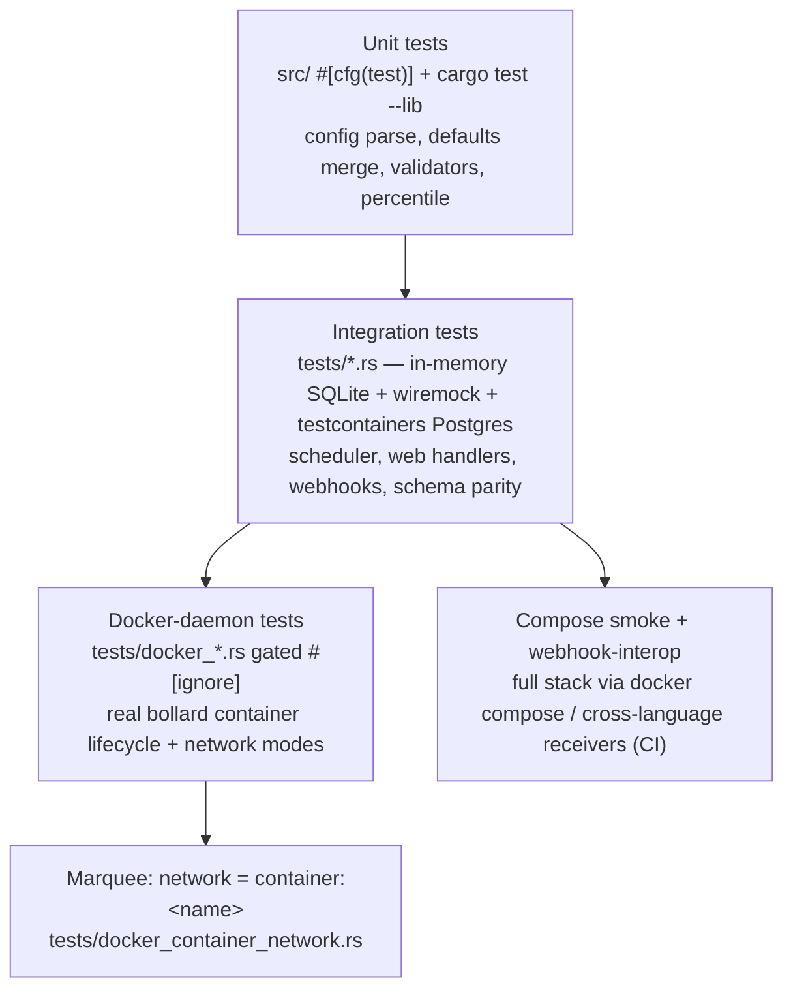
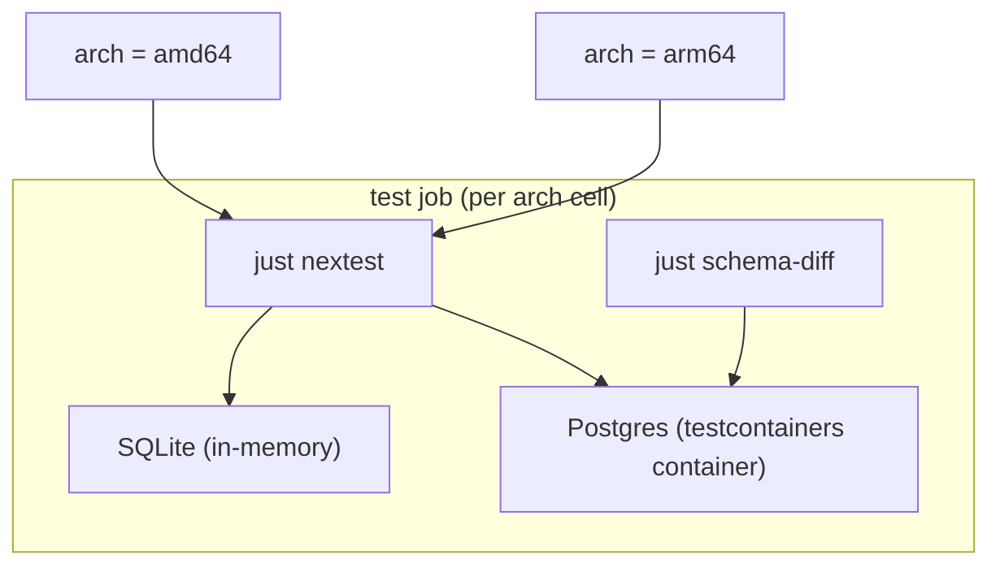

<!-- generated-by: gsd-doc-writer -->
# Testing

How Cronduit is tested, how to run each layer, and what CI enforces. All test
commands are `just` recipes — the justfile is the single source of truth, and a
local `just ci` run predicts the CI exit code (FOUND-12). See
[DEVELOPMENT.md](DEVELOPMENT.md) for the broader build/dev loop,
[ARCHITECTURE.md](ARCHITECTURE.md) for the components under test, and
[CI_CACHING.md](CI_CACHING.md) for the CI cache strategy.

## Test framework and setup

- **Runner:** [`cargo-nextest`](https://nexte.st) is the CI test runner;
  `cargo test` works for local iteration. nextest is installed in CI via
  `taiki-e/install-action`.
- **CI profile:** `.config/nextest.toml` defines the `ci` profile —
  `fail-fast = false`, JUnit output to `junit.xml`, and up to 2 retries with
  exponential backoff (1s–10s, jittered) to absorb flaky container startup.
- **Dev-dependencies** (`Cargo.toml` `[dev-dependencies]`):
  - `testcontainers` 0.27 + `testcontainers-modules` 0.15 (`postgres` feature) —
    boot real Postgres / Alpine containers inside tests.
  - `wiremock` 0.6 — mock HTTP server for webhook `HttpDispatcher` tests.
  - `assert_cmd` 2 + `predicates` 3 — CLI assertion harness (e.g. `cronduit check`).
  - `tower` 0.5 (`util`) — drive the axum router as a `Service` in handler tests.
  - `tokio` with `test-util` — `tokio::time::pause`/`advance` for deterministic
    race/timing tests.
- **Setup:** no global setup beyond `cargo`. Layers that need a Docker daemon or
  Postgres container only run when one is available (see below) — the default
  `cargo test` / `just nextest` run is self-contained.

## The test pyramid



1. **Unit tests** — in-crate `#[cfg(test)]` modules. Fast, no external services.
   Run via `just test-unit` (`cargo test --lib --all-features`). Covers config
   parsing, defaults/labels merge, tag validators, the Rust-side p50/p95
   percentile (`src/web/stats.rs::percentile`), and CSRF/token helpers.
2. **Integration tests** — files under `tests/`. Each is a separate crate that
   links `cronduit` as a library and drives the scheduler, the axum router (via
   `tower::Service`), webhook delivery (via `wiremock`), and DB code. Most run
   against in-memory SQLite (`sqlite::memory:`); Postgres-backed cases boot a
   real container with `testcontainers-modules::postgres`.
3. **Docker-daemon tests** — `tests/docker_*.rs` exercise the real `bollard`
   container lifecycle. They require a running Docker daemon and are gated with
   `#[ignore]` so they are skipped by default and never break a daemon-less run.
4. **Compose smoke + cross-language interop** — full-stack end-to-end checks in
   CI only (compose stack boot + per-language webhook receivers). Not part of the
   default local test run.

## Running tests

```bash
# Fast unit-only loop (cargo test --lib --all-features)
just test-unit

# Full cargo test, all features
just test

# CI test runner — nextest with the ci profile (retries + JUnit)
just nextest

# Schema-parity test on its own (boots a Postgres container)
just schema-diff
```

Run a single integration test file or test by name with raw cargo when iterating:

```bash
# One test file
cargo test --test scheduler_integration

# One test by name substring
cargo test config_parser

# Postgres-feature integration tests (needs a Docker daemon for testcontainers)
cargo test --features integration
```

### Docker-daemon tests (`#[ignore]`-gated)

The `bollard` container tests under `tests/docker_*.rs` are marked `#[ignore]`
because they need a running Docker daemon. They must run **serially** —
parallel execution causes container resource contention on some runtimes (e.g.
Rancher Desktop):

```bash
# Docker executor lifecycle tests
cargo test --test docker_executor -- --ignored --nocapture --test-threads=1

# Marquee: network = "container:<name>" end-to-end
cargo test --test docker_container_network -- --ignored --nocapture --test-threads=1
```

## Testcontainers-backed Docker + Postgres tests

Cronduit's persistence layer must behave identically on SQLite and Postgres, and
its executor must drive the real Docker API — both are tested against real
backing services via testcontainers rather than mocks.

- **Postgres parity:** `tests/schema_parity.rs` (run by `just schema-diff`,
  executed in every CI matrix cell) boots a real Postgres container with
  `testcontainers-modules::postgres::Postgres`, applies the per-backend
  migrations in `migrations/postgres/` and `migrations/sqlite/`, introspects both
  schemas, and asserts structural parity. A failure is a hard stop — migrations
  in the two directories must stay in lock-step. SQLite-side cases use in-memory
  databases (no container needed).
- **Postgres regression tests:** additional Postgres-backed cases (e.g.
  `tests/docker_orphan_guard.rs`, `tests/dashboard_jobs_pg.rs`,
  `tests/v11_bulk_toggle_pg.rs`) boot a Postgres container to verify behavior on
  the second backend. Some are gated behind `#[cfg(feature = "integration")]` and
  only compile/run under `cargo test --features integration`.
- **Bollard executor tests:** `tests/docker_executor.rs` and
  `tests/docker_daemon_preflight.rs` spawn / inspect / remove containers through
  the exact code path the scheduler uses, asserting container lifecycle,
  preflight failures, and the `cronduit_docker_reachable` gauge.

### Marquee test — `network = "container:<name>"`

The headline feature (joining a sidecar's network namespace, e.g. for VPN
setups) has a dedicated end-to-end test in `tests/docker_container_network.rs`:

1. Start a target sidecar container (a plain `alpine sleep`).
2. Run a Cronduit Docker job configured with
   `network = "container:<target_id>"`.
3. Assert preflight passes, the job exits 0, logs are captured, and resources are
   cleaned up.

A companion case (`test_container_network_target_stopped`) asserts preflight
rejects a `container:<name>` target that is not running. Both are `#[ignore]`-gated
(daemon required) and run serially.

## CI integration

The `ci` workflow (`.github/workflows/ci.yml`) runs on every pull request and on
push to `main`. Every `run:` step invokes `just <recipe>` exclusively (D-10 /
FOUND-12). Test-relevant jobs:

| Job | Recipe(s) | What it covers |
|-----|-----------|----------------|
| `lint` | `just fmt-check`, `just clippy`, `just openssl-check`, `just grep-no-percentile-cont`, `just deny` | Format, lint (warnings-as-errors), rustls-only guard, percentile structural-parity guard, supply-chain (blocking) |
| `test` (matrix: amd64, arm64) | `just nextest`, `just schema-diff` | Full nextest suite + Postgres schema parity, per arch |
| `compose-smoke` (matrix: default + secure compose) | docker compose boot + Run-Now-all-jobs assertion | End-to-end stack health, all four example jobs reach `status=success` within 120s |
| `webhook-interop` (matrix: python, go, node) | `just uat-webhook-receiver-<lang>-verify-fixture` | Standard Webhooks v1 wire-format interop across runtimes (canonical + tamper variants) |

### Test matrix (arch × backend)

The `test` job has an **arch** dimension only — `amd64` and `arm64` — because
**both DB backends are exercised in every cell**: the Postgres path runs via the
testcontainers Postgres container (`schema_parity.rs`, `db_pool_postgres.rs`,
etc.) while SQLite runs in-memory. A separate `db` matrix dimension would be
cosmetic.



To avoid the anonymous Docker Hub pull rate limit, the matrix pre-pulls
`postgres:11-alpine` and `alpine:latest` from `mirror.gcr.io` and retags them
locally before `just nextest`; testcontainers then finds the images locally.
arm64 cells additionally run `just install-targets` for the cross-compile
toolchain. The `#[ignore]`-gated bollard daemon tests are **not** run in the CI
test matrix.

## sqlx offline query checking

Cronduit's queries use the **runtime** `sqlx::query()` / `sqlx::query_as::<_>()`
API, not the compile-time `query!` macros, so a build does not require a live
database. The CI `test` job still sets `SQLX_OFFLINE: "true"` so any sqlx
compile-time checking stays offline.

The `just sqlx-prepare` recipe regenerates the `.sqlx/` offline query cache and
should be run before committing if SQL changes are introduced that rely on the
macro path:

```bash
# Regenerate the .sqlx/ offline query cache (writes against the dev SQLite DB)
just sqlx-prepare
```

## Coverage requirements

No coverage threshold is configured — there is no `coverageThreshold`,
`tarpaulin`, or `llvm-cov` gate in the justfile, `Cargo.toml`, or CI. Quality is
gated instead by the `ci` chain (`fmt-check`, `clippy -D warnings`,
`openssl-check`, `nextest`, `schema-diff`, supply-chain `deny`, and the
structural-parity grep guard) plus the compose-smoke and webhook-interop
end-to-end jobs.

## Writing new tests

- **Unit tests** live in `#[cfg(test)] mod tests { ... }` blocks inside the
  relevant `src/` module. Keep them service-free so they run under `just test-unit`.
- **Integration tests** are one file per concern under `tests/`. Existing files
  follow a `verb_noun.rs` / `v1x_feature.rs` naming pattern (e.g.
  `scheduler_integration.rs`, `v12_webhook_retry.rs`). They link `cronduit` as a
  library; drive the web layer with `tower::Service`, webhooks with `wiremock`,
  and Postgres with `testcontainers-modules`.
- **Shared helpers** live in `tests/common/` (`mod.rs` plus fixtures such as
  `v11_fixtures.rs`); webhook fixtures live in `tests/fixtures/`. Pull these in
  with `mod common;` rather than duplicating setup.
- **Daemon-dependent tests** must carry `#[ignore]` (with a reason) and document
  the serial `--test-threads=1` requirement, matching the existing
  `tests/docker_executor.rs` convention.
- **Deterministic timing** — use `tokio::time::pause()` + `advance()` (the
  `test-util` feature) instead of real sleeps for race/timing tests.
